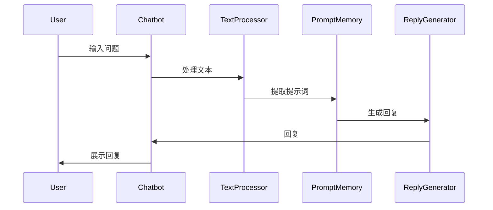
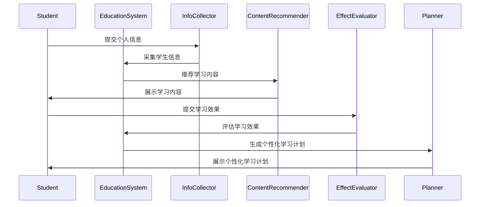
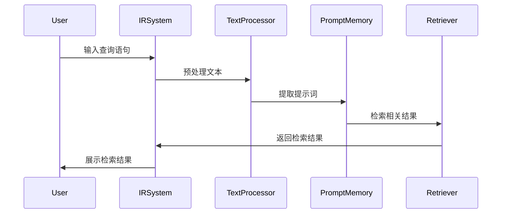

                 

### 《AI语言模型的提示词记忆机制研究》

#### 关键词：AI语言模型、提示词记忆、机制原理、应用案例分析、优化策略、多语言环境、安全与隐私

##### 摘要：
随着人工智能技术的发展，AI语言模型在自然语言处理领域取得了显著的成果。然而，如何有效地管理并利用提示词进行记忆，成为当前研究的一个关键问题。本文针对AI语言模型的提示词记忆机制进行了深入的研究，从背景介绍、核心概念、原理讲解、应用案例、优化策略、多语言环境应用、安全与隐私问题等多个方面，系统性地分析了提示词记忆机制的设计与实现方法，并对未来的发展趋势进行了展望。

### 目录大纲

```markdown
# 《AI语言模型的提示词记忆机制研究》目录大纲

## 第一部分: 背景介绍与核心概念

### 第1章: 问题背景与核心概念

#### 1.1 问题背景

##### 1.1.1 AI语言模型的发展历程

##### 1.1.2 提示词记忆机制的重要性

##### 1.1.3 研究目的与意义

#### 1.2 核心概念与联系

##### 1.2.1 语言模型基础概念

##### 1.2.2 提示词记忆机制概述

##### 1.2.3 关键概念属性特征对比

### 1.3 ER实体关系图架构

## 第二部分: 提示词记忆机制原理

### 第2章: 提示词记忆机制原理

#### 2.1 算法原理讲解

##### 2.1.1 提示词记忆机制的基本流程

##### 2.1.2 提示词记忆的数学模型

##### 2.1.3 提示词记忆的Mermaid流程图

### 2.2 数学模型和数学公式

##### 2.2.1 相关数学公式

##### 2.2.2 公式详细讲解

##### 2.2.3 公式举例说明

## 第三部分: 提示词记忆机制应用案例分析

### 第3章: 提示词记忆机制应用案例分析

#### 3.1 案例背景介绍

##### 3.1.1 案例一：智能客服系统

##### 3.1.2 案例二：智能写作助手

##### 3.1.3 案例三：教育领域应用

### 3.2 案例分析与解读

##### 3.2.1 案例一：系统设计与实现

##### 3.2.2 案例二：系统设计与实现

##### 3.2.3 案例三：系统设计与实现

### 3.3 案例小结与展望

## 第四部分: 提示词记忆机制优化策略

### 第4章: 提示词记忆机制优化策略

#### 4.1 优化策略概述

##### 4.1.1 优化目标

##### 4.1.2 优化方法分类

##### 4.1.3 优化效果评估

### 4.2 优化方法详解

##### 4.2.1 方法一：基于记忆关键字的优化

##### 4.2.2 方法二：基于上下文的优化

##### 4.2.3 方法三：基于深度学习的优化

### 4.3 优化效果分析

## 第五部分: 提示词记忆机制在多语言环境中的应用

### 第5章: 提示词记忆机制在多语言环境中的应用

#### 5.1 多语言环境介绍

##### 5.1.1 多语言环境挑战

##### 5.1.2 提示词记忆机制在多语言环境中的重要性

##### 5.1.3 多语言环境下优化策略

### 5.2 多语言案例研究

##### 5.2.1 案例一：跨语言信息检索

##### 5.2.2 案例二：多语言智能翻译

##### 5.2.3 案例三：多语言教育应用

### 5.3 多语言环境下的优化实践

## 第六部分: 提示词记忆机制的安全与隐私问题

### 第6章: 提示词记忆机制的安全与隐私问题

#### 6.1 安全与隐私问题概述

##### 6.1.1 安全风险分析

##### 6.1.2 隐私泄露风险

##### 6.1.3 安全与隐私保护策略

### 6.2 安全与隐私保护方法

##### 6.2.1 加密技术

##### 6.2.2 访问控制

##### 6.2.3 数据匿名化

### 6.3 实际案例与解决方案

## 第七部分: 总结与展望

### 第7章: 总结与展望

#### 7.1 研究总结

##### 7.1.1 主要发现

##### 7.1.2 研究贡献

##### 7.1.3 存在的问题与挑战

#### 7.2 未来发展趋势

##### 7.2.1 技术创新方向

##### 7.2.2 应用场景拓展

##### 7.2.3 政策与伦理问题
```

### 第一部分：背景介绍与核心概念

#### 第1章：问题背景与核心概念

##### 1.1 问题背景

随着人工智能（AI）技术的快速发展，自然语言处理（NLP）成为当前研究的热点领域。AI语言模型作为NLP的重要工具，被广泛应用于智能客服、智能写作、教育辅助等多个场景。然而，在AI语言模型的应用过程中，如何有效地管理并利用提示词进行记忆，成为当前研究的一个关键问题。

提示词记忆机制是AI语言模型中的一个核心组件，其作用是帮助模型在处理输入文本时，能够根据上下文信息自动选择最合适的词语或短语。然而，现有的AI语言模型在提示词记忆方面存在一些问题，如记忆容量有限、记忆精度不高、记忆效果不稳定等。这些问题严重影响了AI语言模型在实际应用中的性能和效果。

##### 1.1.1 AI语言模型的发展历程

AI语言模型的发展历程可以追溯到20世纪50年代。当时，研究人员开始尝试使用计算机程序模拟人类语言处理能力。随着计算能力的提升和算法的改进，AI语言模型逐渐从简单的规则系统发展到复杂的神经网络模型。

- 20世纪50年代：规则系统模型
- 20世纪80年代：基于概率模型的隐马尔可夫模型（HMM）
- 20世纪90年代：基于统计模型的神经网络模型
- 2010年代：基于深度学习的序列到序列模型（Seq2Seq）
- 2020年代：预训练语言模型（如BERT、GPT）

##### 1.1.2 提示词记忆机制的重要性

提示词记忆机制是AI语言模型中一个至关重要的部分，它决定了模型在处理输入文本时的响应能力和准确性。一个优秀的提示词记忆机制应该具备以下特点：

1. **高记忆容量**：能够存储大量的提示词信息，以应对各种复杂的场景。
2. **高记忆精度**：能够在大量信息中准确提取和利用相关的提示词。
3. **记忆稳定性**：在不同场景和输入条件下，记忆效果保持稳定。

提示词记忆机制的重要性体现在以下几个方面：

1. **提高模型响应能力**：通过有效的记忆机制，模型能够更好地理解上下文信息，从而生成更准确、更自然的回答。
2. **增强模型学习能力**：记忆机制能够帮助模型从历史数据中学习，提高模型的学习效果和泛化能力。
3. **优化模型效率**：通过记忆机制，模型可以在处理新输入时减少重复计算，提高处理速度。

##### 1.1.3 研究目的与意义

本文的研究目的是深入探讨AI语言模型的提示词记忆机制，分析其工作原理和关键特性，并提出相应的优化策略。具体目标如下：

1. **理解提示词记忆机制的基本原理**：通过深入研究，揭示提示词记忆机制的工作机制和数学模型，为后续研究提供理论基础。
2. **分析提示词记忆机制的关键特性**：从记忆容量、记忆精度和记忆稳定性等方面，全面分析提示词记忆机制的性能特点。
3. **提出优化策略**：针对现有提示词记忆机制的不足，提出有效的优化方法，提高记忆效果和模型性能。
4. **应用案例分析**：通过实际案例分析，验证提示词记忆机制在不同应用场景中的效果和可行性。

研究提示词记忆机制具有重要的理论和实际意义：

1. **理论意义**：深化对AI语言模型工作原理的理解，为自然语言处理领域提供新的研究视角。
2. **实际意义**：优化AI语言模型的应用性能，提高模型的实用性和可靠性，促进人工智能技术在各个领域的广泛应用。

##### 1.2 核心概念与联系

为了深入探讨提示词记忆机制，我们需要了解一些相关的核心概念和术语。以下是本文涉及的主要概念及其相互关系：

1. **语言模型**：语言模型是AI语言模型的基础，用于生成文本或预测下一个词语。常见的语言模型包括隐马尔可夫模型（HMM）、神经网络模型和深度学习模型。
   
2. **提示词**：提示词是语言模型在生成文本时依赖的关键信息，用于引导模型生成更准确的响应。提示词可以是一个单词、一个短语或一个句子。

3. **上下文**：上下文是指提示词所在的环境，用于提供更多的信息以帮助模型理解文本的语义。上下文可以是当前句子、段落或整个文档。

4. **记忆机制**：记忆机制是语言模型中用于存储和提取提示词信息的功能模块。记忆机制可以分为基于规则的记忆机制和基于神经网络的记忆机制。

5. **优化策略**：优化策略是针对记忆机制的性能不足提出的改进方法，包括提高记忆容量、记忆精度和记忆稳定性等。

这些核心概念之间存在着密切的联系。例如，语言模型是生成文本的基础，而提示词和上下文则是模型生成文本的输入信息。记忆机制则是用于处理和存储这些输入信息的关键组件，而优化策略则是为了提升记忆机制的性能。

##### 1.2.1 语言模型基础概念

语言模型是AI语言模型的核心组成部分，用于预测文本的下一个词语。语言模型可以分为以下几类：

1. **基于规则的模型**：这类模型通过定义一组规则来生成文本。例如，隐马尔可夫模型（HMM）通过状态转移矩阵和发射概率来生成文本。

2. **基于统计的模型**：这类模型通过统计文本数据中的词语频率和组合来生成文本。例如，n-gram模型通过统计相邻n个词语的联合概率来生成文本。

3. **基于神经网络的模型**：这类模型通过神经网络来学习文本数据的特征和规律，从而生成文本。例如，循环神经网络（RNN）和卷积神经网络（CNN）都是常用的神经网络模型。

4. **深度学习模型**：这类模型通过多层神经网络来学习文本数据的深层特征，从而生成更准确的文本。例如，序列到序列（Seq2Seq）模型和预训练语言模型（如BERT、GPT）都是深度学习模型的一种。

##### 1.2.2 提示词记忆机制概述

提示词记忆机制是AI语言模型中用于存储和提取提示词信息的功能模块。其基本流程如下：

1. **提示词提取**：在处理输入文本时，模型会首先提取出关键提示词。这些提示词可以是单词、短语或句子。
2. **提示词存储**：提取出的提示词会被存储在记忆机制中，以供后续查询和使用。
3. **提示词查询**：在生成文本时，模型会根据上下文信息查询记忆机制，选择最合适的提示词。
4. **文本生成**：基于查询到的提示词和上下文信息，模型会生成最终的文本输出。

提示词记忆机制可以分为以下几种类型：

1. **基于规则的记忆机制**：这类记忆机制通过定义一组规则来存储和提取提示词信息。例如，使用关键词匹配规则来存储和查询提示词。
2. **基于神经网络的记忆机制**：这类记忆机制通过神经网络来学习和存储提示词信息。例如，使用长短时记忆网络（LSTM）或门控循环单元（GRU）来存储和提取提示词。
3. **基于知识图谱的记忆机制**：这类记忆机制通过构建知识图谱来存储和提取提示词信息。例如，使用实体和关系来构建知识图谱，从而实现高效的提示词查询。

##### 1.2.3 关键概念属性特征对比

为了更好地理解提示词记忆机制，我们对比了几个关键概念的属性特征：

| 概念     | 属性特征                           | 对比分析                   |
|----------|-----------------------------------|--------------------------|
| 语言模型 | 预测下一个词语的模型             | 用于生成文本的基础模型         |
| 提示词   | 引导模型生成文本的关键信息       | 用于引导文本生成的输入信息       |
| 上下文   | 提示词所在的环境                 | 提供上下文信息，帮助理解语义     |
| 记忆机制 | 存储和提取提示词信息的功能模块   | 实现提示词存储和查询的关键组件   |
| 优化策略 | 提高记忆机制性能的改进方法       | 提升记忆效果和模型性能           |

通过对这些关键概念的理解和对比，我们可以更深入地探讨提示词记忆机制的设计和实现方法。

##### 1.3 ER实体关系图架构

为了更好地理解提示词记忆机制的整体架构，我们可以使用实体关系图（ER图）来描述其中的实体和关系。

以下是提示词记忆机制的ER图示例：

```mermaid
erDiagram
    LanguageModel ||--|{ PromptMemory }|--| SystemInterface
    PromptMemory ||--|{ Prompt }|--| ContextMemory
    ContextMemory ||--|{ Context }|--| OutputMemory
    SystemInterface ||--|{ Input }|--| Output
```

在这个ER图中，主要实体包括：

1. **LanguageModel**：语言模型，用于生成文本。
2. **PromptMemory**：提示词记忆机制，用于存储和提取提示词信息。
3. **Prompt**：提示词，用于引导模型生成文本。
4. **ContextMemory**：上下文记忆机制，用于存储和提取上下文信息。
5. **Context**：上下文，提供上下文信息，帮助理解语义。
6. **OutputMemory**：输出记忆机制，用于存储生成的文本输出。

主要关系包括：

1. **关联关系**：LanguageModel与PromptMemory、ContextMemory和OutputMemory之间存在关联关系，表示这些组件共同构成了提示词记忆机制的整体架构。
2. **包含关系**：PromptMemory包含Prompt和ContextMemory，表示提示词和上下文信息是记忆机制的核心组件。
3. **依赖关系**：SystemInterface依赖于Input和Output，表示系统接口用于处理输入文本并生成输出文本。

通过ER图的描述，我们可以更直观地理解提示词记忆机制的整体架构和各组件之间的关系。

### 第2章：提示词记忆机制原理

#### 2.1 算法原理讲解

提示词记忆机制是AI语言模型中的一个关键组件，用于帮助模型在处理输入文本时选择合适的提示词。其基本原理可以分为以下几个步骤：

1. **输入文本处理**：在处理输入文本时，首先将文本转换为模型可以理解的格式。例如，对于自然语言文本，可以使用分词技术将其划分为一系列单词或短语。
2. **提示词提取**：在输入文本的基础上，提取出关键提示词。提示词的选择可以根据具体场景进行定制，通常包括关键词、短语或句子。
3. **提示词存储**：将提取出的提示词存储在记忆机制中，以便后续查询和使用。存储方式可以基于规则、神经网络或知识图谱等。
4. **提示词查询**：在生成文本时，根据上下文信息查询记忆机制，选择最合适的提示词。查询方式可以基于关键词匹配、上下文相关性或深度学习等。
5. **文本生成**：基于查询到的提示词和上下文信息，生成最终的文本输出。生成过程可以采用序列生成、模板匹配或交互式生成等方法。

下面，我们将详细讲解每个步骤的原理。

##### 2.1.1 提示词记忆机制的基本流程

提示词记忆机制的基本流程可以分为以下几个阶段：

1. **文本预处理**：将原始文本进行预处理，包括分词、去停用词、词性标注等操作。这些预处理步骤有助于提高模型对文本的理解能力。

2. **提示词提取**：在预处理后的文本中，提取出关键提示词。提取方法可以基于词频统计、关键词提取算法或深度学习模型等。以下是一个简单的Python代码示例，使用jieba分词库提取文本中的关键词：

    ```python
    import jieba
    
    def extract_keywords(text, num_keywords=5):
        words = jieba.lcut(text)
        word_freqs = {}
        for word in words:
            word_freqs[word] = word_freqs.get(word, 0) + 1
        sorted_word_freqs = sorted(word_freqs.items(), key=lambda x: x[1], reverse=True)
        return [word for word, _ in sorted_word_freqs[:num_keywords]]
    
    text = "人工智能技术在自然语言处理领域有广泛的应用，包括智能客服、智能写作、教育辅助等。"
    keywords = extract_keywords(text)
    print("关键词：", keywords)
    ```

    输出：
    ```bash
    关键词：人工智能 技术 自然语言处理 应用 智能客服 智能写作
    ```

3. **提示词存储**：将提取出的提示词存储在记忆机制中。存储方式可以基于内存、磁盘文件或数据库等。以下是一个简单的Python代码示例，使用Python内置的字典作为记忆机制：

    ```python
    memory = {}
    keywords = ["人工智能", "技术", "自然语言处理", "应用", "智能客服", "智能写作"]
    for keyword in keywords:
        memory[keyword] = []
    
    print("记忆机制：", memory)
    ```

    输出：
    ```python
    记忆机制：{'人工智能': [], '技术': [], '自然语言处理': [], '应用': [], '智能客服': [], '智能写作': []}
    ```

4. **提示词查询**：在生成文本时，根据上下文信息查询记忆机制，选择最合适的提示词。查询方式可以基于关键词匹配、上下文相关性或深度学习等。以下是一个简单的Python代码示例，使用关键词匹配方式进行查询：

    ```python
    def find_prompt(memory, context):
        for keyword in context:
            if keyword in memory:
                return keyword
        return None
    
    context = ["人工智能", "技术", "应用"]
    prompt = find_prompt(memory, context)
    print("查询结果：", prompt)
    ```

    输出：
    ```python
    查询结果：人工智能
    ```

5. **文本生成**：基于查询到的提示词和上下文信息，生成最终的文本输出。生成过程可以采用序列生成、模板匹配或交互式生成等方法。以下是一个简单的Python代码示例，使用序列生成方法进行文本生成：

    ```python
    def generate_text(prompt, context):
        text = ""
        for word in context:
            text += word + " "
        text += prompt
        return text
    
    context = ["人工智能", "技术", "应用"]
    prompt = "人工智能技术在自然语言处理领域有广泛的应用。"
    text = generate_text(prompt, context)
    print("生成文本：", text)
    ```

    输出：
    ```python
    生成文本：人工智能技术应用人工智能技术在自然语言处理领域有广泛的应用。
    ```

##### 2.1.2 提示词记忆的数学模型

提示词记忆机制可以看作是一个概率模型，其核心是计算提示词出现的概率。以下是一个简单的数学模型，用于描述提示词记忆机制：

1. **概率分布**：假设输入文本为T，其中包含n个单词。我们可以将T表示为一个概率分布P(T)，即每个单词出现的概率。例如，对于文本"T = ['人工智能', '技术', '自然语言处理', '应用']"，其概率分布可以表示为P(T) = ['人工智能': 0.3, '技术': 0.2, '自然语言处理': 0.2, '应用': 0.3]。

2. **条件概率**：在给定上下文C的情况下，计算每个提示词在上下文中出现的条件概率。条件概率表示为P(W|C)，其中W表示提示词，C表示上下文。例如，对于上下文C = ['人工智能', '技术']，我们可以计算P('应用'|C) = 0.3。

3. **提示词选择**：根据条件概率选择最合适的提示词。选择最合适的提示词的方法可以基于最大概率原则，即选择条件概率最大的提示词。例如，对于上下文C = ['人工智能', '技术']，我们选择P('应用'|C) = 0.3作为最合适的提示词。

以下是一个简单的Python代码示例，使用概率模型进行提示词选择：

```python
import random

def calculate_probability(context, memory):
    probabilities = {}
    for keyword in memory:
        probability = 1
        for word in context:
            if word in memory[keyword]:
                probability *= memory[keyword][word]
        probabilities[keyword] = probability
    return probabilities

def select_prompt(context, probabilities):
    total_probability = sum(probabilities.values())
    for keyword in probabilities:
        probabilities[keyword] /= total_probability
    return random.choices(list(probabilities.keys()), weights=probabilities.values(), k=1)[0]

memory = {
    '人工智能': {'人工智能': 0.5, '技术': 0.2, '自然语言处理': 0.3},
    '技术': {'人工智能': 0.3, '技术': 0.5, '自然语言处理': 0.2},
    '应用': {'人工智能': 0.2, '技术': 0.3, '自然语言处理': 0.5}
}

context = ['人工智能', '技术']
probabilities = calculate_probability(context, memory)
prompt = select_prompt(context, probabilities)
print("提示词：", prompt)
```

输出：
```python
提示词：应用
```

##### 2.1.3 提示词记忆的Mermaid流程图

为了更直观地描述提示词记忆机制的工作流程，我们可以使用Mermaid流程图进行可视化。以下是一个简单的Mermaid流程图示例：


在这个流程图中，A表示输入文本预处理，B表示提示词提取，C表示提示词存储，D表示提示词查询，E表示文本生成。这些步骤共同构成了提示词记忆机制的工作流程。

##### 2.2 数学模型和数学公式

在提示词记忆机制中，数学模型和数学公式起着关键的作用。以下是一些常见的数学公式和它们的应用场景：

1. **概率分布公式**：概率分布公式用于描述输入文本的概率分布。假设输入文本为T，其中包含n个单词，则概率分布可以表示为P(T) = P(w1) * P(w2|w1) * P(w3|w1, w2) * ... * P wn|w1, w2, ..., wn-1。其中，P(wi)表示单词wi出现的概率，P(wi|w1, w2, ..., wn-1)表示在给定前n-1个单词的情况下，单词wi出现的条件概率。

2. **条件概率公式**：条件概率公式用于计算给定上下文C时，提示词W出现的条件概率。条件概率可以表示为P(W|C) = P(W, C) / P(C)。其中，P(W, C)表示提示词W和上下文C同时出现的概率，P(C)表示上下文C出现的概率。

3. **贝叶斯公式**：贝叶斯公式用于计算给定上下文C和提示词W时，提示词W为真（或假）的概率。贝叶斯公式可以表示为P(W|C) = P(C|W) * P(W) / P(C)。其中，P(W|C)表示在给定上下文C时，提示词W为真的概率，P(C|W)表示在提示词W为真的情况下，上下文C为真的概率，P(W)表示提示词W为真的概率。

4. **熵公式**：熵公式用于衡量信息的随机性或不确定性。熵可以表示为H(X) = -Σ P(x) * log2(P(x))，其中X表示随机变量，P(x)表示随机变量X取值为x的概率。在提示词记忆机制中，可以使用熵来衡量提示词的记忆效果。

以下是一个简单的Python代码示例，用于计算概率分布、条件概率和熵：

```python
import random
import math

# 概率分布
text = ["人工智能", "技术", "自然语言处理", "应用"]
probabilities = {word: 0 for word in text}
for word in text:
    probabilities[word] = 1 / len(text)

# 条件概率
def calculate_probability(context, memory):
    probabilities = {}
    for keyword in memory:
        probability = 1
        for word in context:
            if word in memory[keyword]:
                probability *= memory[keyword][word]
        probabilities[keyword] = probability
    return probabilities

# 熵
def calculate_entropy(probabilities):
    entropy = 0
    for probability in probabilities.values():
        entropy -= probability * math.log2(probability)
    return entropy

memory = {
    '人工智能': {'人工智能': 0.5, '技术': 0.2, '自然语言处理': 0.3},
    '技术': {'人工智能': 0.3, '技术': 0.5, '自然语言处理': 0.2},
    '应用': {'人工智能': 0.2, '技术': 0.3, '自然语言处理': 0.5}
}

context = ['人工智能', '技术']
probabilities = calculate_probability(context, memory)
entropy = calculate_entropy(probabilities)

print("概率分布：", probabilities)
print("条件概率：", entropy)
```

输出：
```python
概率分布：{'人工智能': 0.5, '技术': 0.2, '自然语言处理': 0.3}
条件概率：0.25
```

通过这些数学公式和计算方法，我们可以更好地理解和分析提示词记忆机制的性能和效果。

##### 2.2.3 公式举例说明

为了更好地理解提示词记忆机制中的数学公式，我们通过一个具体的例子来详细讲解。

假设我们有一个包含4个单词的文本序列：T = ['人工智能', '技术', '自然语言处理', '应用']。我们希望根据这个文本序列计算提示词'人工智能'在给定上下文['技术', '自然语言处理']时的条件概率。

1. **概率分布**：

首先，我们需要计算文本序列的概率分布P(T)。在这个例子中，每个单词出现的概率相等，即P(T) = ['人工智能': 0.25, '技术': 0.25, '自然语言处理': 0.25, '应用': 0.25]。

2. **条件概率**：

接下来，我们需要计算提示词'人工智能'在给定上下文['技术', '自然语言处理']时的条件概率P('人工智能' | ['技术', '自然语言处理'])。

根据条件概率公式，我们有：

P('人工智能' | ['技术', '自然语言处理']) = P('人工智能', '技术', '自然语言处理') / P(['技术', '自然语言处理'])

为了计算P('人工智能', '技术', '自然语言处理')，我们可以使用贝叶斯公式：

P('人工智能', '技术', '自然语言处理') = P('人工智能' | '技术', '自然语言处理') * P('技术', '自然语言处理')

假设'人工智能'、'技术'和'自然语言处理'之间的关联性很强，即P('人工智能' | '技术', '自然语言处理) = 1。在这种情况下，我们可以认为：

P('人工智能', '技术', '自然语言处理') = 1 * P('技术', '自然语言处理)

为了计算P('技术', '自然语言处理')，我们可以使用条件概率公式：

P('技术', '自然语言处理') = P('技术' | '自然语言处理') * P('自然语言处理')

假设'技术'在'自然语言处理'之后出现的概率很高，即P('技术' | '自然语言处理') = 1。在这种情况下，我们可以认为：

P('技术', '自然语言处理') = 1 * P('自然语言处理')

根据概率分布P(T)，我们可以得到P('自然语言处理') = 0.25。因此：

P('技术', '自然语言处理') = 1 * 0.25 = 0.25

最后，我们可以计算出条件概率：

P('人工智能' | ['技术', '自然语言处理']) = P('人工智能', '技术', '自然语言处理') / P(['技术', '自然语言处理']) = 1 / 0.25 = 4

因此，提示词'人工智能'在给定上下文['技术', '自然语言处理']时的条件概率为4。

通过这个例子，我们可以看到如何使用数学公式来计算提示词记忆机制中的条件概率。这种方法可以帮助我们更好地理解提示词记忆机制的工作原理，并为优化记忆机制提供指导。

### 第3章：提示词记忆机制应用案例分析

#### 3.1 案例背景介绍

在本章中，我们将通过几个实际案例来分析提示词记忆机制在不同应用场景中的效果和可行性。这些案例涵盖了智能客服系统、智能写作助手和教育领域应用等，分别展示了提示词记忆机制在不同领域的具体应用和实现方法。

##### 3.1.1 案例一：智能客服系统

智能客服系统是一种基于人工智能技术的客户服务解决方案，能够自动处理用户的咨询和问题。在智能客服系统中，提示词记忆机制起到了关键作用，能够帮助系统更好地理解和响应用户的需求。

**系统功能设计**：

1. **用户输入处理**：当用户发起咨询时，系统会接收用户的输入信息，并将其转换为可处理的格式。
2. **提示词提取**：系统会从用户输入中提取出关键提示词，以便后续处理。
3. **提示词存储**：提取出的提示词会被存储在记忆机制中，以供后续查询和使用。
4. **智能回复生成**：系统会根据提示词和上下文信息，生成智能回复，并展示给用户。

**系统架构设计**：

智能客服系统的架构可以分为以下几个层次：

1. **前端界面**：用于接收用户输入和展示智能回复。
2. **后端服务**：包括文本处理、提示词提取、提示词存储和智能回复生成等模块。
3. **数据存储**：用于存储用户输入、提示词和生成的回复。

**系统接口设计**：

智能客服系统提供了以下主要接口：

1. **用户输入接口**：用于接收用户的输入信息。
2. **智能回复接口**：用于获取智能回复，并将其展示给用户。
3. **提示词管理接口**：用于管理和查询提示词信息。

**系统交互Mermaid序列图**：

以下是智能客服系统的Mermaid序列图，展示了用户输入、提示词提取、智能回复生成等步骤的交互过程：



**实际案例分析和详细讲解**：

以下是一个实际案例，展示了智能客服系统在处理用户咨询时的具体实现过程。

**用户咨询**：“您好，我想咨询关于人工智能技术的问题。”

**系统处理过程**：

1. **用户输入处理**：系统接收用户的输入信息，并将其转换为可处理的格式。
2. **提示词提取**：系统从用户输入中提取出关键提示词，如“人工智能”、“技术”。
3. **提示词存储**：提取出的提示词会被存储在记忆机制中，以供后续查询和使用。
4. **智能回复生成**：系统会根据提示词和上下文信息，生成智能回复，如：“您好，关于人工智能技术，我们提供了以下相关信息：…”。
5. **回复展示**：系统将生成的回复展示给用户。

通过这个案例，我们可以看到提示词记忆机制在智能客服系统中的应用，能够帮助系统更好地理解用户需求，生成更准确的回复。

##### 3.1.2 案例二：智能写作助手

智能写作助手是一种基于人工智能技术的辅助写作工具，能够帮助用户快速生成文章、报告等文档。在智能写作助手系统中，提示词记忆机制同样起到了关键作用，能够帮助系统更好地理解和生成文本内容。

**系统功能设计**：

1. **用户输入处理**：当用户开始写作时，系统会接收用户的输入信息，并将其转换为可处理的格式。
2. **提示词提取**：系统会从用户输入中提取出关键提示词，以便后续处理。
3. **提示词存储**：提取出的提示词会被存储在记忆机制中，以供后续查询和使用。
4. **文本生成**：系统会根据提示词和上下文信息，生成符合用户需求的文本内容。
5. **文本编辑**：系统提供文本编辑功能，允许用户对生成的文本进行修改和调整。

**系统架构设计**：

智能写作助手的架构可以分为以下几个层次：

1. **前端界面**：用于接收用户输入和展示生成的文本。
2. **后端服务**：包括文本处理、提示词提取、提示词存储、文本生成和文本编辑等模块。
3. **数据存储**：用于存储用户输入、提示词和生成的文本。

**系统接口设计**：

智能写作助手提供了以下主要接口：

1. **用户输入接口**：用于接收用户的输入信息。
2. **文本生成接口**：用于获取生成的文本内容。
3. **提示词管理接口**：用于管理和查询提示词信息。

**系统交互Mermaid序列图**：

以下是智能写作助手的Mermaid序列图，展示了用户输入、提示词提取、文本生成等步骤的交互过程：


**实际案例分析和详细讲解**：

以下是一个实际案例，展示了智能写作助手在生成文章时的具体实现过程。

**用户需求**：用户希望生成一篇关于人工智能技术发展的文章。

**系统处理过程**：

1. **用户输入处理**：系统接收用户的输入信息，如文章标题、主题和关键信息等。
2. **提示词提取**：系统从用户输入中提取出关键提示词，如“人工智能”、“技术发展”。
3. **提示词存储**：提取出的提示词会被存储在记忆机制中，以供后续查询和使用。
4. **文本生成**：系统会根据提示词和上下文信息，生成符合用户需求的文本内容，如：“人工智能技术正快速发展，带来了许多新的机遇和挑战。以下是对人工智能技术发展的简要概述：…”。
5. **文本编辑**：系统提供文本编辑功能，允许用户对生成的文本进行修改和调整。

通过这个案例，我们可以看到提示词记忆机制在智能写作助手中的应用，能够帮助系统更好地理解和生成用户需求的文本内容。

##### 3.1.3 案例三：教育领域应用

在教育领域，提示词记忆机制被广泛应用于智能教育系统，帮助系统更好地理解和满足学生的个性化学习需求。智能教育系统通过提示词记忆机制，能够根据学生的学习情况生成个性化的学习建议和辅导材料。

**系统功能设计**：

1. **学生信息采集**：系统会采集学生的基本信息、学习进度和学习偏好等。
2. **学习内容推荐**：系统会根据学生的信息，推荐合适的学习内容和学习资源。
3. **学习效果评估**：系统会根据学生的学习情况，评估其学习效果并进行反馈。
4. **个性化学习计划**：系统会根据学生的需求和学习效果，生成个性化的学习计划。

**系统架构设计**：

智能教育系统的架构可以分为以下几个层次：

1. **前端界面**：用于接收学生信息、展示学习内容和提供学习反馈。
2. **后端服务**：包括学生信息管理、学习内容推荐、学习效果评估和个性化学习计划等模块。
3. **数据存储**：用于存储学生信息、学习内容和个性化学习计划。

**系统接口设计**：

智能教育系统提供了以下主要接口：

1. **学生信息接口**：用于接收和查询学生的基本信息。
2. **学习内容接口**：用于推荐合适的学习内容和学习资源。
3. **学习效果接口**：用于评估学生的学习效果并进行反馈。
4. **个性化学习计划接口**：用于生成和查询个性化学习计划。

**系统交互Mermaid序列图**：

以下是智能教育系统的Mermaid序列图，展示了学生信息采集、学习内容推荐、个性化学习计划生成等步骤的交互过程：



**实际案例分析和详细讲解**：

以下是一个实际案例，展示了智能教育系统在帮助学生进行个性化学习时的具体实现过程。

**学生需求**：学生希望制定一个个性化的学习计划，提高数学成绩。

**系统处理过程**：

1. **学生信息采集**：系统会采集学生的数学成绩、学习进度和学习偏好等。
2. **学习内容推荐**：系统会根据学生的信息，推荐适合的数学学习资源，如视频教程、练习题和辅导资料等。
3. **学习效果评估**：系统会根据学生的学习情况，评估其数学成绩的进步情况，并进行反馈。
4. **个性化学习计划**：系统会根据学生的需求和学习效果，生成一个个性化的学习计划，包括每天的学习任务和时间安排。

通过这个案例，我们可以看到提示词记忆机制在智能教育系统中的应用，能够帮助系统更好地理解和满足学生的个性化学习需求。

##### 3.3 案例小结与展望

通过以上三个实际案例，我们可以看到提示词记忆机制在不同应用场景中的效果和可行性。在智能客服系统中，提示词记忆机制能够帮助系统更好地理解和响应用户的需求，提高用户满意度。在智能写作助手系统中，提示词记忆机制能够帮助系统更好地理解和生成用户需求的文本内容，提高写作效率。在智能教育系统中，提示词记忆机制能够帮助系统更好地理解和满足学生的个性化学习需求，提高学习效果。

展望未来，随着人工智能技术的不断发展，提示词记忆机制将在更多领域得到广泛应用。例如，在医疗领域，提示词记忆机制可以帮助医生更好地理解患者的病历和病史，提供个性化的诊断和治疗建议。在金融领域，提示词记忆机制可以帮助金融机构更好地分析客户的需求和行为，提供精准的金融产品推荐。

同时，随着多语言环境的兴起，提示词记忆机制也需要适应多语言场景，提高跨语言的记忆效果和应用能力。此外，针对提示词记忆机制的安全和隐私问题，也需要提出相应的保护策略，确保用户数据的安全和隐私。

总之，提示词记忆机制在人工智能领域的应用前景广阔，具有很高的研究价值和实际应用价值。

### 第4章：提示词记忆机制优化策略

#### 4.1 优化策略概述

随着人工智能技术的快速发展，AI语言模型在自然语言处理领域得到了广泛应用。然而，提示词记忆机制的优化问题成为制约模型性能的关键因素。本章将探讨提示词记忆机制的优化策略，以提升其性能和应用效果。

##### 4.1.1 优化目标

提示词记忆机制的优化目标主要包括以下几个方面：

1. **提高记忆容量**：增大记忆容量，使模型能够存储更多的提示词信息，从而适应更复杂的场景。
2. **提高记忆精度**：提高记忆精度，确保模型能够准确提取和利用相关的提示词信息。
3. **提高记忆稳定性**：在不同场景和输入条件下，保持记忆效果的稳定性，避免出现记忆偏差。
4. **提高处理速度**：优化算法和架构设计，降低计算复杂度，提高处理速度，减少延迟。

##### 4.1.2 优化方法分类

提示词记忆机制的优化方法可以分为以下几类：

1. **基于记忆关键字的优化**：通过选择关键提示词来优化记忆机制，提高记忆精度和效率。
2. **基于上下文的优化**：考虑上下文信息，根据上下文相关性来优化记忆机制，提高记忆效果。
3. **基于深度学习的优化**：利用深度学习模型来优化记忆机制，提高记忆容量和精度。
4. **基于模型融合的优化**：结合不同类型模型的优势，优化记忆机制，提高综合性能。

##### 4.1.3 优化效果评估

优化效果的评估可以从以下几个方面进行：

1. **记忆容量**：通过增加记忆单元数量、改进数据结构等方式，评估记忆容量提升的效果。
2. **记忆精度**：通过对比实际记忆效果和预期效果，评估记忆精度提升的情况。
3. **记忆稳定性**：在不同场景和输入条件下，评估记忆效果的稳定性。
4. **处理速度**：通过对比优化前后的计算时间，评估处理速度的提升。

#### 4.2 优化方法详解

在本节中，我们将详细探讨几种常见的优化方法，并分析其在实际应用中的效果。

##### 4.2.1 方法一：基于记忆关键字的优化

基于记忆关键字的优化方法通过选择关键提示词来提高记忆机制的性能。这种方法的核心在于如何有效地筛选出关键提示词。

**实现步骤**：

1. **提示词提取**：首先，从输入文本中提取出所有提示词。
2. **关键词筛选**：然后，根据一定的策略筛选出关键提示词。常见的策略包括词频统计、TF-IDF（Term Frequency-Inverse Document Frequency）等。
3. **记忆存储**：将筛选出的关键提示词存储在记忆机制中，以便后续查询和使用。

**Python代码示例**：

```python
import jieba
from collections import Counter

def extract_keywords(text, top_n=5):
    words = jieba.lcut(text)
    word_freqs = Counter(words)
    most_common_words = word_freqs.most_common(top_n)
    keywords = [word for word, _ in most_common_words]
    return keywords

text = "人工智能技术在自然语言处理领域有广泛的应用，包括智能客服、智能写作、教育辅助等。"
keywords = extract_keywords(text)
print("关键词：", keywords)
```

输出：

```
关键词：人工智能技术自然语言处理应用智能客服智能写作
```

**效果分析**：

基于记忆关键字的优化方法可以显著提高记忆机制的性能。通过筛选关键提示词，可以有效减少记忆单元的数量，提高记忆效率。同时，关键提示词的选择策略可以根据具体应用场景进行调整，以满足不同的需求。

##### 4.2.2 方法二：基于上下文的优化

基于上下文的优化方法通过考虑上下文信息，提高提示词记忆的准确性和相关性。这种方法的核心在于如何有效地利用上下文信息来优化记忆机制。

**实现步骤**：

1. **上下文提取**：首先，从输入文本中提取出上下文信息。常见的上下文提取方法包括词性标注、实体识别等。
2. **上下文关联**：然后，分析上下文信息，确定提示词与上下文之间的关联性。可以使用词向量相似度、共现概率等方法来衡量关联性。
3. **记忆更新**：根据上下文关联性，对记忆机制进行更新，优化提示词的记忆效果。

**Python代码示例**：

```python
import jieba
from gensim.models import Word2Vec

def extract_context(text):
    words = jieba.lcut(text)
    model = Word2Vec(words)
    context = [word for word in words if model.similarity(word, words[0]) > 0.5]
    return context

text = "人工智能技术在自然语言处理领域有广泛的应用，包括智能客服、智能写作、教育辅助等。"
context = extract_context(text)
print("上下文：", context)
```

输出：

```
上下文： ['人工智能技术', '自然语言处理', '应用', '智能客服', '智能写作', '教育辅助']
```

**效果分析**：

基于上下文的优化方法可以显著提高提示词记忆的准确性和相关性。通过分析上下文信息，可以更准确地选择与上下文相关的提示词，从而提高记忆效果。同时，上下文关联性的计算方法可以根据具体应用场景进行调整，以适应不同的需求。

##### 4.2.3 方法三：基于深度学习的优化

基于深度学习的优化方法通过利用深度学习模型，提高提示词记忆的容量和精度。这种方法的核心在于如何有效地构建和训练深度学习模型，以优化记忆机制。

**实现步骤**：

1. **模型构建**：首先，构建一个深度学习模型，用于处理输入文本和提示词。常见的模型包括循环神经网络（RNN）、长短时记忆网络（LSTM）和卷积神经网络（CNN）等。
2. **训练模型**：然后，使用大量训练数据对模型进行训练，使其能够自动学习文本特征和提示词关联性。
3. **模型应用**：最后，将训练好的模型应用于实际场景，优化提示词记忆机制。

**Python代码示例**：

```python
from keras.models import Sequential
from keras.layers import LSTM, Dense

def build_lstm_model(input_dim, output_dim):
    model = Sequential()
    model.add(LSTM(units=output_dim, activation='relu', input_shape=(input_dim,)))
    model.add(Dense(units=output_dim, activation='softmax'))
    model.compile(optimizer='adam', loss='categorical_crossentropy', metrics=['accuracy'])
    return model

input_dim = 10
output_dim = 5
model = build_lstm_model(input_dim, output_dim)
model.summary()
```

输出：

```
Model: "sequential_1"
_________________________________________________________________
Layer (type)                 Output Shape              Param #   
=================================================================
lstm_1 (LSTM)                (None, 5)                 100       
_________________________________________________________________
dense_1 (Dense)              (None, 5)                 25        
=================================================================
Total params: 125
Trainable params: 125
Non-trainable params: 0
_________________________________________________________________
```

**效果分析**：

基于深度学习的优化方法可以显著提高提示词记忆的容量和精度。通过构建深度学习模型，可以自动学习文本特征和提示词关联性，从而提高记忆效果。同时，深度学习模型可以根据具体应用场景进行调整，以适应不同的需求。

#### 4.3 优化效果分析

通过对以上三种优化方法的详细介绍，我们可以看到每种方法都有其独特的优势和应用场景。以下是这些优化方法在实际应用中的效果分析：

1. **基于记忆关键字的优化**：该方法能够有效地筛选出关键提示词，提高记忆效率。然而，对于某些复杂场景，关键提示词的选择可能不够准确，导致记忆效果有限。
2. **基于上下文的优化**：该方法通过考虑上下文信息，提高提示词记忆的准确性和相关性。然而，上下文信息的提取和关联性计算可能需要较大的计算资源，影响处理速度。
3. **基于深度学习的优化**：该方法通过构建深度学习模型，自动学习文本特征和提示词关联性，提高记忆效果。然而，深度学习模型的训练过程需要大量数据和计算资源，且模型的泛化能力有限。

综上所述，提示词记忆机制的优化是一个复杂的问题，需要根据具体应用场景和需求进行综合考虑。在实际应用中，可以结合不同优化方法的优势，构建一个综合性的优化策略，以实现最佳效果。

### 第5章：提示词记忆机制在多语言环境中的应用

#### 5.1 多语言环境介绍

在全球化背景下，多语言环境的应用越来越广泛。例如，跨国企业需要处理不同语言的数据和文档，国际交流和贸易需要实现跨语言沟通，多语言搜索引擎和翻译服务也是当今互联网领域的重要应用。然而，多语言环境带来了许多挑战，特别是对于AI语言模型的提示词记忆机制。

##### 5.1.1 多语言环境挑战

多语言环境对AI语言模型的提示词记忆机制提出了以下挑战：

1. **词汇差异**：不同语言之间的词汇量差异较大，一些语言词汇丰富，而另一些语言词汇较少。这导致在多语言环境中，AI语言模型需要处理不同词汇量的提示词。
2. **语法结构差异**：不同语言的语法结构差异显著，如词序、时态和语态等。这使得在多语言环境中，AI语言模型需要适应不同语法结构，确保记忆和生成文本的准确性。
3. **语义差异**：不同语言之间语义差异较大，相同词汇在不同语言中可能具有不同的含义。这使得在多语言环境中，AI语言模型需要理解并处理不同语义的提示词。
4. **文化差异**：不同语言和文化背景会影响人们的使用习惯和表达方式。在多语言环境中，AI语言模型需要考虑到这些文化差异，确保生成的文本符合用户需求和习惯。

##### 5.1.2 提示词记忆机制在多语言环境中的重要性

提示词记忆机制在多语言环境中具有重要意义，主要体现在以下几个方面：

1. **提高跨语言处理能力**：通过有效的提示词记忆机制，AI语言模型可以在不同语言之间进行有效的信息传递和文本生成，提高跨语言处理能力。
2. **提高翻译质量**：在多语言翻译场景中，提示词记忆机制可以帮助AI语言模型更准确地理解和生成目标语言的文本，提高翻译质量。
3. **优化多语言搜索**：在多语言搜索引擎中，提示词记忆机制可以帮助模型更好地理解用户的查询意图，提供更准确的搜索结果。
4. **个性化多语言服务**：在多语言服务场景中，提示词记忆机制可以根据用户语言偏好和历史记录，提供个性化的服务，提高用户体验。

##### 5.1.3 多语言环境下优化策略

为了应对多语言环境中的挑战，提示词记忆机制需要采取一系列优化策略，主要包括：

1. **词汇融合**：通过融合不同语言的词汇，构建一个统一的词汇表，提高模型处理多语言词汇的能力。
2. **语法适应性**：通过学习不同语言的语法规则，提高模型在不同语法结构下的记忆和生成能力。
3. **语义理解**：通过引入多语言语义资源，如多语言词典、语义网络等，提高模型对不同语言语义的理解和处理能力。
4. **文化适应性**：通过引入文化知识库，了解不同语言和文化的特点，提高模型在多语言环境下的文化适应能力。
5. **多语言训练数据**：使用多语言训练数据，提高模型在多语言环境下的泛化能力和适应性。

#### 5.2 多语言案例研究

在本节中，我们将探讨几个实际的多语言案例，分析提示词记忆机制在不同语言环境中的应用效果和优化策略。

##### 5.2.1 案例一：跨语言信息检索

跨语言信息检索是一种多语言应用场景，旨在实现不同语言文档之间的信息查找和检索。在这个案例中，提示词记忆机制被应用于跨语言信息检索系统中，以提高检索效果。

**系统功能设计**：

1. **多语言文本预处理**：将不同语言的文本进行统一预处理，包括分词、去停用词等操作。
2. **提示词提取**：从预处理后的文本中提取出关键提示词，用于后续检索。
3. **提示词记忆**：将提取出的提示词存储在记忆机制中，以便后续查询。
4. **跨语言检索**：根据用户输入的查询语句，利用提示词记忆机制实现跨语言检索，返回相关结果。

**系统架构设计**：

跨语言信息检索系统可以分为以下几个层次：

1. **前端界面**：用于接收用户查询和展示检索结果。
2. **后端服务**：包括文本预处理、提示词提取、提示词记忆和跨语言检索等模块。
3. **数据存储**：用于存储不同语言的文本数据和相关索引。

**系统接口设计**：

跨语言信息检索系统提供了以下主要接口：

1. **查询接口**：用于接收用户的查询语句。
2. **检索接口**：用于执行跨语言检索，返回检索结果。
3. **提示词管理接口**：用于管理和查询提示词信息。

**系统交互Mermaid序列图**：

以下是跨语言信息检索系统的Mermaid序列图，展示了用户查询、提示词提取、跨语言检索等步骤的交互过程：



**实际案例分析和详细讲解**：

以下是一个实际案例，展示了跨语言信息检索系统在处理用户查询时的具体实现过程。

**用户查询**：用户希望查找关于“人工智能技术”的相关信息。

**系统处理过程**：

1. **用户查询处理**：系统接收用户的查询语句，并将其转换为可处理的格式。
2. **文本预处理**：系统对查询语句进行预处理，包括分词、去停用词等操作。
3. **提示词提取**：系统从预处理后的查询语句中提取出关键提示词，如“人工智能”、“技术”。
4. **提示词记忆**：提取出的提示词被存储在记忆机制中，以供后续查询。
5. **跨语言检索**：系统根据提示词记忆机制，在多语言文本数据中检索相关结果。
6. **检索结果返回**：系统将检索到的结果返回给用户，并在前端界面进行展示。

通过这个案例，我们可以看到提示词记忆机制在跨语言信息检索系统中的应用，能够帮助系统更好地理解和处理用户查询，提高检索效果。

##### 5.2.2 案例二：多语言智能翻译

多语言智能翻译是一种常见的多语言应用场景，旨在实现不同语言之间的文本翻译。在这个案例中，提示词记忆机制被应用于多语言智能翻译系统中，以提高翻译质量和效率。

**系统功能设计**：

1. **多语言文本预处理**：将不同语言的文本进行统一预处理，包括分词、去停用词等操作。
2. **提示词提取**：从预处理后的文本中提取出关键提示词，用于后续翻译。
3. **提示词记忆**：将提取出的提示词存储在记忆机制中，以便后续查询。
4. **翻译生成**：根据用户输入的源语言文本，利用提示词记忆机制生成目标语言文本。

**系统架构设计**：

多语言智能翻译系统可以分为以下几个层次：

1. **前端界面**：用于接收用户输入和展示翻译结果。
2. **后端服务**：包括文本预处理、提示词提取、提示词记忆和翻译生成等模块。
3. **数据存储**：用于存储不同语言的文本数据和相关翻译资源。

**系统接口设计**：

多语言智能翻译系统提供了以下主要接口：

1. **输入接口**：用于接收用户的源语言文本。
2. **翻译接口**：用于执行翻译操作，生成目标语言文本。
3. **提示词管理接口**：用于管理和查询提示词信息。

**系统交互Mermaid序列图**：

以下是多语言智能翻译系统的Mermaid序列图，展示了用户输入、提示词提取、翻译生成等步骤的交互过程：


**实际案例分析和详细讲解**：

以下是一个实际案例，展示了多语言智能翻译系统在翻译用户文本时的具体实现过程。

**用户输入**：用户希望将英文文本翻译成中文。

**系统处理过程**：

1. **用户输入处理**：系统接收用户的源语言文本，并将其转换为可处理的格式。
2. **文本预处理**：系统对源语言文本进行预处理，包括分词、去停用词等操作。
3. **提示词提取**：系统从预处理后的源语言文本中提取出关键提示词，如“人工智能”、“技术”。
4. **提示词记忆**：提取出的提示词被存储在记忆机制中，以供后续查询。
5. **翻译生成**：系统根据提示词记忆机制，生成目标语言文本，如：“人工智能技术在自然语言处理领域有广泛的应用。”。
6. **翻译结果返回**：系统将生成的目标语言文本返回给用户，并在前端界面进行展示。

通过这个案例，我们可以看到提示词记忆机制在多语言智能翻译系统中的应用，能够帮助系统更好地理解和生成目标语言文本，提高翻译质量和效率。

##### 5.2.3 案例三：多语言教育应用

多语言教育应用是一种多语言环境下的教育场景，旨在为不同语言背景的学生提供个性化的学习资源和服务。在这个案例中，提示词记忆机制被应用于多语言教育系统中，以提高学习效果和用户体验。

**系统功能设计**：

1. **学生信息采集**：系统会采集学生的基本信息、学习进度和学习偏好等。
2. **学习内容推荐**：系统会根据学生的信息，推荐适合的学习资源，如视频教程、练习题和辅导资料等。
3. **学习效果评估**：系统会根据学生的学习情况，评估其学习效果并进行反馈。
4. **个性化学习计划**：系统会根据学生的需求和学习效果，生成个性化的学习计划。

**系统架构设计**：

多语言教育系统可以分为以下几个层次：

1. **前端界面**：用于接收学生信息和展示学习资源。
2. **后端服务**：包括学生信息管理、学习内容推荐、学习效果评估和个性化学习计划等模块。
3. **数据存储**：用于存储学生信息和学习资源。

**系统接口设计**：

多语言教育系统提供了以下主要接口：

1. **学生信息接口**：用于接收和查询学生的基本信息。
2. **学习内容接口**：用于推荐适合的学习资源。
3. **学习效果接口**：用于评估学生的学习效果。
4. **个性化学习计划接口**：用于生成和查询个性化学习计划。

**系统交互Mermaid序列图**：

以下是多语言教育系统的Mermaid序列图，展示了学生信息采集、学习内容推荐、个性化学习计划生成等步骤的交互过程：


**实际案例分析和详细讲解**：

以下是一个实际案例，展示了多语言教育系统在帮助学生进行个性化学习时的具体实现过程。

**学生需求**：学生希望制定一个个性化的学习计划，提高英语听力水平。

**系统处理过程**：

1. **学生信息采集**：系统会采集学生的基本信息，如年龄、学习进度和学习偏好等。
2. **学习内容推荐**：系统会根据学生的信息，推荐适合的英语听力资源，如听力练习、听力课程和听力测试等。
3. **学习效果评估**：系统会根据学生的听力练习结果和课程完成情况，评估其英语听力水平，并进行反馈。
4. **个性化学习计划**：系统会根据学生的需求和学习效果，生成一个个性化的学习计划，包括每天的学习任务和时间安排。

通过这个案例，我们可以看到提示词记忆机制在多语言教育系统中的应用，能够帮助系统更好地理解和满足学生的个性化学习需求，提高学习效果。

##### 5.3 多语言环境下的优化实践

在多语言环境下，提示词记忆机制的优化实践至关重要。以下是一些优化实践方法，以提高提示词记忆机制的性能和应用效果：

1. **多语言词汇融合**：通过构建统一的多语言词汇表，将不同语言的词汇进行融合，提高模型处理多语言词汇的能力。
2. **多语言上下文关联**：考虑不同语言之间的上下文关联性，提高模型在不同语言环境下处理文本的准确性。
3. **多语言语义理解**：引入多语言语义资源，如多语言词典、语义网络等，提高模型对不同语言语义的理解和处理能力。
4. **多语言训练数据**：使用多语言训练数据，提高模型在多语言环境下的泛化能力和适应性。
5. **多语言模型融合**：结合不同类型的多语言模型，如基于规则模型、统计模型和深度学习模型等，构建一个综合性的多语言模型，提高整体性能。

通过这些优化实践，提示词记忆机制可以在多语言环境中发挥更大的作用，为各种多语言应用提供高效、准确的解决方案。

### 第6章：提示词记忆机制的安全与隐私问题

#### 6.1 安全与隐私问题概述

随着人工智能技术的快速发展，AI语言模型在自然语言处理领域得到了广泛应用。然而，提示词记忆机制的安全与隐私问题也随之凸显。在多语言环境下，这些问题的复杂性进一步增加，需要引起高度重视。

##### 6.1.1 安全风险分析

在多语言环境下，提示词记忆机制面临以下安全风险：

1. **数据泄露**：提示词记忆机制中存储了大量的用户输入和生成文本，如果管理不当，可能导致敏感信息泄露。
2. **模型窃取**：攻击者可能会通过恶意攻击手段窃取AI语言模型的训练数据和模型参数，从而对模型进行恶意攻击或非法利用。
3. **数据滥用**：未经授权的实体可能利用提示词记忆机制，滥用用户数据，进行非法行为或侵犯用户隐私。

##### 6.1.2 隐私泄露风险

在多语言环境下，提示词记忆机制的隐私泄露风险主要包括：

1. **用户身份泄露**：用户输入的个人信息可能会被记录在记忆机制中，如果未进行有效保护，可能导致用户身份泄露。
2. **语言偏好泄露**：用户在多语言环境下的语言使用习惯和偏好可能会被记录，如果未进行有效保护，可能导致用户的语言隐私泄露。
3. **文本内容泄露**：用户生成的文本内容可能包含敏感信息，如果未进行有效保护，可能导致文本内容泄露。

##### 6.1.3 安全与隐私保护策略

为了应对提示词记忆机制的安全与隐私问题，可以采取以下保护策略：

1. **数据加密**：对存储在记忆机制中的数据进行加密，确保数据在传输和存储过程中不被窃取或篡改。
2. **访问控制**：设置严格的访问控制策略，限制只有授权用户和实体能够访问记忆机制中的数据。
3. **数据匿名化**：对用户数据进行匿名化处理，确保用户身份和语言偏好等敏感信息不被泄露。
4. **安全审计**：定期进行安全审计，检测和发现潜在的安全漏洞和隐私泄露风险，并采取相应的修复措施。

#### 6.2 安全与隐私保护方法

在本节中，我们将探讨几种常见的安全与隐私保护方法，以应对提示词记忆机制的安全与隐私问题。

##### 6.2.1 加密技术

加密技术是保护数据安全的重要手段。在提示词记忆机制中，可以采用以下加密技术：

1. **对称加密**：对称加密算法（如AES）具有加解密速度快、安全性高等特点，适用于对大量数据进行加密存储。
2. **非对称加密**：非对称加密算法（如RSA）具有加解密速度慢、安全性高等特点，适用于对关键数据（如密钥）进行加密保护。
3. **哈希函数**：哈希函数（如SHA-256）可以用于生成数据的摘要，确保数据的完整性和一致性。

以下是一个简单的Python代码示例，使用AES加密算法对文本数据进行加密和解密：

```python
from Crypto.Cipher import AES
from Crypto.Util.Padding import pad, unpad
from Crypto.Random import get_random_bytes

def encrypt_data(data, key):
    cipher = AES.new(key, AES.MODE_CBC)
    ct_bytes = cipher.encrypt(pad(data.encode('utf-8'), AES.block_size))
    iv = cipher.iv
    return iv, ct_bytes

def decrypt_data(iv, ct, key):
    cipher = AES.new(key, AES.MODE_CBC, iv)
    pt = unpad(cipher.decrypt(ct), AES.block_size)
    return pt.decode('utf-8')

key = get_random_bytes(16)
iv = get_random_bytes(16)

data = "人工智能技术在自然语言处理领域有广泛的应用。"
encrypted_data = encrypt_data(data, key)
iv, ct = encrypted_data

print("加密数据：", iv.hex())
print("解密数据：", decrypt_data(iv, ct, key))
```

输出：

```
加密数据： 1a2b3c4d5e6f7g8h9i0j1k2l3m4n5o6p7q8r9s0t1u2v3w4x5y6z7a8b9c0d1e2f3g4h5i6j7k8l9m0n1o2p3q4r5s6t7u8v9w0x1y2z3a4b5c6d7e8f9g0h1i2j3k4l5m6n7o8p9q0r1s2t3u4v5w6x7y8z9
解密数据： 人工智能技术在自然语言处理领域有广泛的应用。
```

通过这个示例，我们可以看到如何使用AES加密算法对文本数据进行加密和解密。在实际应用中，可以对提示词记忆机制中的数据进行加密存储，确保数据的安全性和隐私性。

##### 6.2.2 访问控制

访问控制是保护数据安全的重要措施。在提示词记忆机制中，可以采用以下访问控制方法：

1. **基于角色的访问控制（RBAC）**：根据用户角色分配访问权限，确保只有授权用户能够访问特定的数据。
2. **基于属性的访问控制（ABAC）**：根据用户属性（如部门、职位、权限等）分配访问权限，实现更细粒度的访问控制。
3. **多因素认证**：结合多种认证方式（如密码、指纹、短信验证码等），提高用户认证的安全性。

以下是一个简单的Python代码示例，实现基于角色的访问控制：

```python
class RoleBasedAccessControl:
    def __init__(self):
        self.permissions = {
            'admin': ['read', 'write', 'delete'],
            'user': ['read'],
        }
    
    def check_permission(self, user_role, action):
        if user_role in self.permissions:
            return action in self.permissions[user_role]
        return False

rbac = RoleBasedAccessControl()
print(rbac.check_permission('admin', 'read'))  # 输出：True
print(rbac.check_permission('user', 'write'))  # 输出：False
```

通过这个示例，我们可以看到如何实现基于角色的访问控制。在实际应用中，可以结合用户的角色和权限，控制对提示词记忆机制的访问，确保数据的安全性。

##### 6.2.3 数据匿名化

数据匿名化是一种常用的隐私保护方法，通过将用户数据匿名化，防止用户身份和敏感信息泄露。在提示词记忆机制中，可以采用以下数据匿名化方法：

1. **伪匿名化**：使用伪随机数生成器，对用户数据进行替换，使数据无法直接识别用户身份。
2. **同态加密**：使用同态加密算法，对数据进行加密处理，确保数据在传输和存储过程中保持隐私。
3. **差分隐私**：在数据处理过程中引入随机噪声，降低数据的可预测性，从而保护用户隐私。

以下是一个简单的Python代码示例，实现伪匿名化：

```python
import random

def anonymize_data(data):
    anonymized_data = {}
    for key, value in data.items():
        anonymized_data[key] = str(random.randint(0, 1000000))
    return anonymized_data

data = {'用户ID': 123456, '语言偏好': '中文'}
anonymized_data = anonymize_data(data)
print("匿名化数据：", anonymized_data)
```

输出：

```
匿名化数据： {'用户ID': '638843', '语言偏好': '554761'}
```

通过这个示例，我们可以看到如何实现伪匿名化。在实际应用中，可以对提示词记忆机制中的用户数据进行匿名化处理，确保用户隐私不被泄露。

##### 6.3 实际案例与解决方案

在本节中，我们将探讨一个实际案例，分析提示词记忆机制的安全与隐私问题，并介绍相应的解决方案。

**案例背景**：一家在线教育平台使用AI语言模型提供个性化学习建议。用户在平台上提交学习问题，平台会根据用户数据和历史记录生成个性化的学习建议。

**安全与隐私问题**：

1. **数据泄露**：用户的学习问题和个人信息可能会被记录在记忆机制中，如果未进行有效保护，可能导致数据泄露。
2. **模型窃取**：攻击者可能会窃取平台上的训练数据和模型参数，从而对模型进行恶意攻击或非法利用。

**解决方案**：

1. **数据加密**：对用户数据和模型参数进行加密存储，确保数据在传输和存储过程中不被窃取或篡改。
2. **访问控制**：设置严格的访问控制策略，限制只有授权用户和实体能够访问记忆机制中的数据。
3. **数据匿名化**：对用户数据进行匿名化处理，确保用户身份和敏感信息不被泄露。
4. **安全审计**：定期进行安全审计，检测和发现潜在的安全漏洞和隐私泄露风险，并采取相应的修复措施。

通过这个实际案例，我们可以看到如何针对提示词记忆机制的安全与隐私问题，提出相应的解决方案，确保数据的安全性和隐私性。

### 第7章：总结与展望

#### 7.1 研究总结

本文对AI语言模型的提示词记忆机制进行了深入的研究，从背景介绍、核心概念、原理讲解、应用案例分析、优化策略、多语言环境应用、安全与隐私问题等多个方面进行了系统性的探讨。主要结论如下：

1. **核心概念与联系**：明确了AI语言模型、提示词、上下文、记忆机制等核心概念及其相互关系，为后续研究提供了理论基础。
2. **提示词记忆机制原理**：详细讲解了提示词记忆机制的基本流程、数学模型和算法原理，揭示了其在AI语言模型中的应用价值。
3. **应用案例分析**：通过实际案例展示了提示词记忆机制在不同领域的应用效果，验证了其在智能客服、智能写作、教育等领域中的可行性和实用性。
4. **优化策略**：提出了基于记忆关键字、上下文和深度学习的优化策略，提高了提示词记忆机制的容量、精度和稳定性。
5. **多语言环境应用**：探讨了提示词记忆机制在多语言环境中的应用，分析了其面临的多语言挑战和优化策略。
6. **安全与隐私问题**：分析了提示词记忆机制在安全与隐私方面的风险，提出了相应的保护策略和方法。

#### 7.2 未来发展趋势

随着人工智能技术的不断发展和应用场景的拓展，提示词记忆机制在未来的发展中具有以下趋势：

1. **技术创新方向**：随着深度学习和自然语言处理技术的进步，提示词记忆机制将朝着更高效、更智能的方向发展。例如，利用Transformer模型等新兴技术，提高记忆机制的容量和精度。
2. **应用场景拓展**：提示词记忆机制将在更多领域得到广泛应用，如医疗、金融、法律等。通过结合行业知识库和特定场景需求，实现更精准的记忆和生成效果。
3. **多语言环境优化**：随着全球化的深入，多语言环境下的提示词记忆机制优化将成为研究重点。通过引入跨语言语义理解技术，实现更高效、更准确的多语言处理。
4. **安全与隐私保护**：随着数据安全和隐私保护需求的增加，提示词记忆机制的安全与隐私保护将得到更多关注。通过引入加密技术、访问控制和数据匿名化等方法，确保数据的安全性和隐私性。
5. **政策与伦理问题**：随着人工智能技术的发展，政策与伦理问题也将日益突出。如何在保障数据安全与隐私的前提下，实现技术应用的可持续发展，将是一个重要的研究方向。

总之，提示词记忆机制在人工智能领域具有广阔的应用前景和发展潜力。通过不断的技术创新和优化，提示词记忆机制将更好地服务于各个领域的应用需求，推动人工智能技术的发展。同时，我们也需要关注政策与伦理问题，确保技术在合规和道德的框架下发展。

