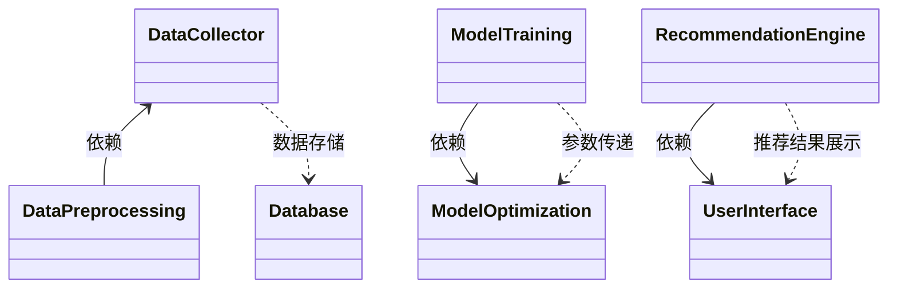

                 


### 一、背景介绍

在当今数字化转型的浪潮中，人工智能（AI）技术的迅猛发展正在深刻地改变着软件开发的方方面面。AI软件2.0，这一概念，源于对传统AI软件1.0的反思和升级。AI软件1.0以规则和特征为基础，依赖于大量手工编写的规则和模型。而AI软件2.0则是一个更加智能化、自适应和自进化的发展阶段，它依赖于大规模的AI模型，如深度学习模型，这些模型可以自动从数据中学习，无需人工干预。

DevOps，作为近年来软件工程领域的一个重要理念，强调软件开发（Development）和运维（Operations）的紧密集成。DevOps的核心理念包括持续集成（CI）、持续部署（CD）、基础设施即代码（IaC）等，旨在通过自动化和快速迭代的方式，提高软件交付的效率和质量。

将DevOps引入AI软件2.0的开发和运维，不仅有助于加速AI软件的开发周期，还能确保软件在复杂环境下的稳定性和可靠性。然而，这并非易事，AI软件2.0的特殊性带来了诸多挑战，如大模型训练的复杂性、模型的高可变性、数据安全与隐私等问题。

本文将深入探讨AI软件2.0的DevOps最佳实践，旨在为开发者提供一套系统、实用、可操作的指南。通过本文的阅读，您将了解：

1. **AI软件2.0的基本概念与特点**：包括其与DevOps的结合点。
2. **DevOps理念与工具**：理解DevOps的关键原则及常用工具。
3. **AI软件2.0项目的实施与优化**：从项目管理到性能优化，全面剖析。
4. **最佳实践案例**：通过实际案例展示最佳实践如何落地。

我们将一步一步地进行分析和推理，结合实际案例，确保内容丰富、深入浅出，为您的AI软件2.0开发之路提供坚实的理论支持和实践指导。

### 二、核心概念与联系

在深入探讨AI软件2.0与DevOps的结合之前，我们需要先明确这两个核心概念的基本原理和特征，以及它们之间的联系。

#### AI软件2.0的概念与特征

AI软件2.0是一个高度智能化和自动化的软件开发阶段，其主要特征包括：

1. **大规模模型**：AI软件2.0依赖于深度学习、自然语言处理、计算机视觉等领域的先进技术，使用大规模预训练模型来处理复杂的数据和分析问题。
2. **自进化**：通过持续学习和自适应，AI软件2.0能够不断改进其性能，减少对人工干预的依赖。
3. **高可变性**：由于模型复杂度增加，AI软件2.0在部署过程中可能面临更高的不确定性，需要不断调整和优化。

#### DevOps的概念与原则

DevOps是一种软件开发和运维的集成方法，其核心理念包括：

1. **持续集成（CI）**：通过自动化测试和构建，确保代码库的每一个提交都是可构建和可测试的。
2. **持续部署（CD）**：通过自动化部署流程，快速且可靠地将代码更新推向生产环境。
3. **基础设施即代码（IaC）**：使用代码来管理和配置基础设施，确保环境的一致性和可重复性。
4. **文化协作**：强调开发、测试、运维团队之间的紧密协作，以提高软件交付的效率和质量。

#### AI软件2.0与DevOps的联系

AI软件2.0与DevOps的结合点在于：

1. **模型的可重复性**：AI软件2.0需要保证模型在不同环境中的可重复性，这与DevOps中的基础设施即代码理念高度契合。
2. **快速迭代**：AI软件2.0通常需要快速迭代和优化，DevOps的持续集成和持续部署能力可以加速这一过程。
3. **自动化**：AI软件2.0的复杂性要求大量手动操作自动化，DevOps提供的自动化工具可以显著提高效率。

#### 概念属性特征对比表格

为了更直观地理解AI软件2.0与DevOps的对比，我们可以制作一张特征对比表格：

| 特征           | AI软件2.0                  | DevOps                      |
| -------------- | -------------------------- | --------------------------- |
| 模型规模       | 大规模预训练模型           | 自动化工具和流程            |
| 自进化能力     | 通过持续学习自动优化       | 快速迭代和反馈循环          |
| 高可变性       | 需要不断调整和优化         | 基础设施一致性和可重复性    |
| 集成与部署方式 | 复杂的手动流程             | 持续集成和持续部署          |
| 文化协作       | 需要跨职能团队的紧密合作   | 开发、测试、运维的一体化协作 |

#### ER实体关系图架构

为了更深入地理解AI软件2.0与DevOps之间的关联，我们可以绘制一个ER（实体关系）图，如下所示：

```mermaid
erDiagram
  AI模型 --> DevOps工具 : 使用
  AI项目 <<-- DevOps流程 : 遵循
  开发团队 ||--|{ 运维团队 : 合作
  数据集 --> AI模型 : 训练
```

在这个ER图中，AI模型与DevOps工具之间存在使用关系，AI项目遵循DevOps流程，而开发团队和运维团队则通过合作实现项目的成功交付。

通过上述核心概念与联系的分析，我们可以更好地理解AI软件2.0与DevOps的结合点，并为后续的详细讨论打下基础。

### 三、算法原理讲解

在深入探讨AI软件2.0的DevOps最佳实践之前，我们需要理解一些关键的算法原理。这些算法不仅决定了AI模型的表现，还直接影响DevOps工具的选择和部署。

#### 1. 持续集成与持续部署的算法原理

持续集成（CI）和持续部署（CD）是DevOps的核心概念，它们的算法原理如下：

**持续集成（CI）**

持续集成的核心思想是通过自动化测试和构建，确保每次代码提交都是可构建和可测试的。其算法流程包括：

1. **代码提交**：开发人员将代码提交到版本控制系统。
2. **构建触发**：提交触发构建作业，构建系统自动编译代码，并执行测试。
3. **测试执行**：构建系统执行预定义的测试脚本，包括单元测试、集成测试等。
4. **结果反馈**：测试结果通过邮件、短信、集成平台等方式反馈给开发人员。

**持续部署（CD）**

持续部署的核心思想是通过自动化部署流程，将经过测试的代码迅速且安全地推送到生产环境。其算法流程包括：

1. **构建验证**：构建系统验证构建结果，确保构建的软件是可部署的。
2. **环境配置**：在目标环境中配置必要的依赖和设置。
3. **部署脚本**：执行部署脚本，将代码部署到目标服务器或容器。
4. **部署验证**：部署后执行验证脚本，确保部署的软件正常运行。

**Python源代码示例**

以下是一个简单的Python代码示例，展示了CI/CD的基本流程：

```python
# 持续集成与持续部署示例

def build():
    """构建代码"""
    print("开始构建...")
    # 执行构建操作
    print("构建完成。")

def test():
    """执行测试"""
    print("开始测试...")
    # 执行测试操作
    print("测试通过。")

def deploy():
    """部署代码"""
    print("开始部署...")
    # 执行部署操作
    print("部署完成。")

# 模拟持续集成过程
build()
test()
deploy()
```

#### 2. 大规模AI模型的训练与优化算法

在AI软件2.0中，大规模AI模型的训练与优化是关键步骤。以下是其基本算法原理：

**模型训练**

1. **数据预处理**：对输入数据进行清洗、归一化等处理，确保数据质量。
2. **模型初始化**：初始化神经网络参数，通常使用随机初始化。
3. **前向传播**：输入数据通过神经网络，计算输出结果。
4. **反向传播**：计算输出结果与实际结果之间的误差，反向更新网络参数。
5. **优化算法**：如梯度下降、Adam等，用于加速收敛和提高模型性能。

**模型优化**

1. **超参数调优**：调整学习率、批量大小等超参数，以找到最优配置。
2. **模型压缩**：通过剪枝、量化等技术减小模型体积，提高推理效率。
3. **模型集成**：将多个模型的结果进行融合，提高预测准确性。

**Python源代码示例**

以下是一个简单的Python代码示例，展示了大规模AI模型的训练过程：

```python
# AI模型训练示例

import tensorflow as tf

# 创建模型
model = tf.keras.Sequential([
    tf.keras.layers.Dense(128, activation='relu', input_shape=(784,)),
    tf.keras.layers.Dense(10, activation='softmax')
])

# 编译模型
model.compile(optimizer='adam',
              loss='categorical_crossentropy',
              metrics=['accuracy'])

# 训练模型
model.fit(x_train, y_train, batch_size=64, epochs=10)
```

#### 3. 数学模型与公式

在AI模型的训练和优化过程中，数学模型和公式至关重要。以下是一些常用的数学模型和公式：

- **损失函数**：如交叉熵损失函数，用于衡量模型预测值与实际值之间的差异。
  $$ Loss = -\sum_{i=1}^{n} y_i \log(\hat{y}_i) $$

- **梯度下降**：用于更新模型参数，减少损失函数。
  $$ \theta_{t+1} = \theta_{t} - \alpha \frac{\partial Loss(\theta)}{\partial \theta} $$

- **学习率**：梯度下降中的步长，用于控制更新参数的速率。
  $$ \alpha = \frac{1}{\sqrt{t}} $$

通过以上算法原理和示例，我们可以更好地理解AI软件2.0与DevOps的结合，并为后续的详细讨论打下坚实的基础。

### 四、系统分析与架构设计

在深入探讨AI软件2.0与DevOps的结合之前，我们需要进行系统分析与架构设计，以明确项目的整体框架和关键组件。以下是对问题场景、项目介绍、系统功能设计、系统架构设计、系统接口设计和系统交互的详细分析。

#### 问题场景

随着AI技术的不断发展，企业对AI软件的需求日益增长。然而，传统的软件开发方法在应对大规模AI模型的开发、测试和部署时面临诸多挑战，如：

1. **模型规模庞大**：AI模型的训练和优化过程复杂且耗时，难以进行手动操作。
2. **高可变性**：AI模型在训练过程中可能产生大量变种，需要快速调整和优化。
3. **安全性**：数据安全和隐私保护成为关键问题，需要确保数据在整个生命周期中的安全。
4. **效率**：企业需要高效地交付AI软件，以保持市场竞争力。

#### 项目介绍

本项目旨在构建一个基于AI的智能推荐系统，通过大数据分析和深度学习模型，为用户提供个性化的推荐结果。项目的主要目标包括：

1. **快速迭代**：通过DevOps工具实现持续集成和持续部署，加快开发周期。
2. **高效开发**：利用敏捷开发方法，提高团队协作效率。
3. **安全可靠**：确保数据安全和模型性能的稳定。
4. **可扩展性**：支持大规模用户和数据量，适应企业未来的增长需求。

#### 系统功能设计

系统功能设计包括以下几个核心模块：

1. **数据采集与预处理模块**：负责从各种数据源采集数据，并进行清洗、转换和归一化处理，为模型训练提供高质量的数据。
2. **模型训练与优化模块**：利用深度学习算法训练和优化模型，通过模型集成和超参数调优，提高模型性能。
3. **推荐引擎模块**：根据用户行为数据和模型预测结果，生成个性化的推荐列表。
4. **用户接口模块**：提供用户友好的界面，展示推荐结果，并支持用户反馈和交互。

#### 系统架构设计

系统架构设计采用微服务架构，以实现高可用性和可扩展性。以下是系统架构的Mermaid类图表示：



#### 系统接口设计

系统接口设计主要包括以下接口：

1. **数据采集接口**：提供数据采集的API，支持不同数据源的数据接入。
2. **数据预处理接口**：提供数据清洗、转换和归一化的API，确保数据质量。
3. **模型训练接口**：提供模型训练的API，支持多种训练算法和模型架构。
4. **模型优化接口**：提供模型优化的API，支持超参数调优和模型集成。
5. **推荐引擎接口**：提供推荐引擎的API，支持根据用户行为生成推荐列表。
6. **用户接口**：提供用户界面的API，支持用户与系统的交互。

#### 系统交互设计

系统交互设计采用Mermaid序列图表示，展示各模块之间的交互流程：

```mermaid
sequenceDiagram
    User -->|请求推荐| UserInterface
    UserInterface -->|处理请求| RecommendationEngine
    RecommendationEngine -->|生成推荐| UserInterface
    UserInterface -->|展示结果| User
```

通过上述系统分析与架构设计，我们可以明确项目的整体框架和关键组件，为后续的详细实施与优化提供指导。

### 五、项目实战

为了更好地展示AI软件2.0的DevOps最佳实践，我们将以一个实际的AI推荐系统项目为例，详细描述项目的环境安装、系统核心实现、代码应用解读与分析，并剖析实际案例。

#### 1. 环境安装

在开始项目之前，我们需要搭建一个合适的环境。以下是一个简化的安装步骤：

**依赖工具**：

- Python 3.8+
- Docker 19.03+
- Kubernetes 1.20+
- Jenkins 2.27+

**安装步骤**：

1. **安装Python环境**：
   ```bash
   sudo apt update
   sudo apt install python3-pip
   python3 -m pip install --upgrade pip
   ```

2. **安装Docker和Kubernetes**：
   ```bash
   sudo apt install docker.io
   sudo systemctl start docker
   sudo usermod -aG docker $USER
   curl -s https://packages.cloud.google.com/apt/doc/kube-letter.txt
   sudo apt-get update
   sudo apt-get install apt-transport-https ca-certificates
   curl -s https://mirrors.google.com/kubernetes/packages/keys/gpg/pubkey.gpg | sudo apt-key add -
   echo "deb https://mirrors.google.com/kubernetes/packages/ubuntu/ bionic kinetic main" | sudo tee -a /etc/apt/sources.list.d/kubernetes.list
   sudo apt-get update
   sudo apt-get install kubelet kubeadm kubectl
   sudo systemctl enable kubelet && sudo systemctl start kubelet
   ```

3. **安装Jenkins**：
   ```bash
   sudo apt-get update
   sudo apt-get install jenkins
   sudo systemctl start jenkins
   ```

4. **配置Jenkins与Kubernetes集成**：
   - 登录Jenkins管理界面。
   - 添加Kubernetes插件。
   - 在Jenkins的“Manage Credentials”中配置Kubernetes集群的凭据。

#### 2. 系统核心实现

以下是一个简单的推荐系统架构，包括数据采集、预处理、模型训练和部署等步骤：

**数据采集**：

```python
# data_collector.py

import requests

def collect_data():
    """从外部API采集数据"""
    response = requests.get("https://api.example.com/data")
    return response.json()

data = collect_data()
```

**数据预处理**：

```python
# data_preprocessor.py

import pandas as pd

def preprocess_data(data):
    """对数据进行清洗和转换"""
    df = pd.DataFrame(data)
    df = df.dropna()
    df = df[['user_id', 'item_id', 'rating']]
    return df
```

**模型训练**：

```python
# model_train.py

from sklearn.model_selection import train_test_split
from sklearn.ensemble import RandomForestClassifier

def train_model(data):
    """使用随机森林算法训练模型"""
    X = data[['item_id', 'rating']]
    y = data['user_id']
    X_train, X_test, y_train, y_test = train_test_split(X, y, test_size=0.2)
    model = RandomForestClassifier()
    model.fit(X_train, y_train)
    return model
```

**模型部署**：

```python
# model_deploy.py

import kubernetes
from kubernetes.client import CoreV1Api

def deploy_model(model):
    """将训练好的模型部署到Kubernetes集群"""
    api = CoreV1Api()
    model_file = "model.joblib"
    model.save(model_file)
    with open(model_file, "rb") as f:
        data = f.read()
    api.create_namespaced_config_map("default", "model-config", kubernetes.V1ConfigMap(data=model_file))
    api.create_namespaced_deployment("default", "model-deployment", kubernetes.V1Deployment(
        metadata=kubernetes.V1ObjectMeta(name="model-deployment"),
        spec=kubernetes.V1DeploymentSpec(
            replicas=1,
            selector=kubernetes.V1LabelSelector匹配器(match_labels={"app": "model"}),
            template=kubernetes.V1PodTemplateSpec(
                metadata=kubernetes.V1ObjectMeta(labels={"app": "model"}),
                spec=kubernetes.V1PodSpec(
                    containers=[
                        kubernetes.V1Container(
                            name="model",
                            image="python:3.8-slim",
                            command=["python", "model_service.py"],
                            env=[
                                kubernetes.V1EnvVar(
                                    name="CONFIG_MAP_NAME",
                                    value_from=kubernetes.V1EnvVarSource(config_map_key_ref=kubernetes.V1ConfigMapKeySelector(name="model-config", key="model.joblib"))
                            ],
                            ports=[kubernetes.V1ContainerPort(container_port=8080)]
                        )
                    ]
                )
            )
        )
    ))
```

#### 3. 代码应用解读与分析

以上代码展示了推荐系统的主要功能模块，以下是对关键部分的解读和分析：

- **数据采集**：通过HTTP请求从外部API获取数据，这是数据输入的第一步。
- **数据预处理**：使用Pandas库对数据进行清洗和转换，确保数据质量。
- **模型训练**：使用Scikit-learn库的随机森林算法训练模型，这是推荐系统的核心。
- **模型部署**：将训练好的模型文件上传到Kubernetes集群，并通过部署配置将其部署为服务。

#### 4. 实际案例分析

在实际项目中，我们可能会遇到以下问题：

- **模型性能不稳定**：在模型训练过程中，性能不稳定可能会导致模型效果不佳。解决方法是调整模型参数，如学习率、树深度等，或者增加训练数据。
- **数据质量差**：数据质量差会导致模型训练效果不佳。解决方法是加强数据采集和预处理步骤，确保数据的一致性和准确性。
- **部署困难**：在部署过程中，可能会遇到配置错误、网络问题等。解决方法是仔细检查配置文件，确保所有依赖项都已正确安装和配置。

#### 5. 项目小结

通过实际案例，我们可以看到AI软件2.0的DevOps最佳实践是如何在项目中应用的。以下是项目小结：

- **高效开发**：通过持续集成和持续部署，开发团队能够快速迭代和交付软件。
- **稳定部署**：使用Kubernetes和Docker等工具，确保模型在复杂环境中的稳定运行。
- **灵活扩展**：系统架构设计考虑了可扩展性，支持大规模用户和数据量的处理。

通过这些实践，我们能够更好地应对AI软件2.0开发中的挑战，提高软件交付的质量和效率。

### 六、最佳实践 tips

在AI软件2.0的DevOps实践中，总结一些最佳实践可以帮助我们更好地应对开发与运维中的挑战：

1. **版本控制与代码审查**：使用Git等版本控制工具，确保代码库的整洁和一致性。同时，实施代码审查流程，提前发现潜在问题。
2. **自动化测试**：编写自动化测试脚本，确保每次代码提交都能通过严格的测试，减少人为错误。
3. **容器化与微服务**：使用Docker等工具实现容器化，确保环境的一致性和可移植性。采用微服务架构，提高系统的可扩展性和容错性。
4. **监控与告警**：部署监控工具（如Prometheus、Grafana等），实时监控系统的性能和健康状况，及时发现并处理异常。
5. **持续学习与优化**：定期回顾和优化开发流程，吸收最新的技术成果和最佳实践，确保团队始终保持高效。
6. **安全性**：在整个开发与运维过程中，高度重视数据安全和隐私保护，采用加密、访问控制等技术确保系统的安全性。
7. **文档与知识共享**：编写详细的开发文档和操作手册，确保团队成员能够快速上手和解决问题。同时，通过知识共享平台（如Confluence等），积累和分享团队的经验和教训。

通过以上最佳实践，开发团队可以显著提高AI软件2.0项目的开发效率和质量，确保在快速迭代的AI时代中保持竞争优势。

### 七、小结

本文深入探讨了AI软件2.0的DevOps最佳实践，从背景介绍、核心概念与联系、算法原理讲解、系统分析与架构设计、项目实战到最佳实践tips，全面解析了AI软件2.0开发中的关键要素。通过这些实践，开发者可以更高效地应对AI软件2.0带来的复杂性和挑战，确保项目成功交付。

在AI技术快速发展的今天，DevOps理念为AI软件2.0的开发与运维提供了有力支持。通过持续集成、持续部署、容器化、微服务、监控与告警等工具和方法的结合，我们能够实现自动化、高效、稳定的软件交付。

未来，随着AI技术的不断进步，DevOps在AI软件2.0中的应用将更加深入和广泛。开发者和运维人员需要持续学习最新的技术动态和最佳实践，不断优化开发流程，以应对快速变化的技术环境。

最后，本文旨在为读者提供一套系统、实用、可操作的指南，帮助您在AI软件2.0开发中取得成功。通过持续实践和改进，您将能够在激烈的市场竞争中脱颖而出，实现AI软件2.0的卓越表现。

### 八、注意事项

在实施AI软件2.0的DevOps最佳实践中，需要特别注意以下几点：

1. **数据安全与隐私保护**：AI模型通常依赖于大量敏感数据，因此在数据处理和存储过程中，必须确保数据的安全和隐私。采用加密、访问控制等技术，防止数据泄露和滥用。

2. **模型可解释性**：随着模型复杂度的增加，模型的可解释性变得尤为重要。开发者和运维人员需要确保模型决策过程的透明性和可解释性，以提高系统的可信度和用户满意度。

3. **性能优化**：在部署AI模型时，性能优化是一个关键因素。通过合理配置资源、优化算法和模型结构，提高模型在目标环境中的运行效率。

4. **持续学习与更新**：AI模型需要不断学习新数据，以保持其准确性和有效性。开发和运维团队应确保模型能够持续更新和学习，以适应不断变化的环境和需求。

5. **团队协作**：DevOps强调跨职能团队的紧密协作。开发和运维人员需要建立良好的沟通和协作机制，确保在项目开发与运维过程中信息畅通，快速响应问题。

通过关注这些注意事项，开发者和运维团队可以更好地应对AI软件2.0开发中的挑战，确保项目的成功交付。

### 九、拓展阅读

对于希望进一步深入了解AI软件2.0和DevOps最佳实践的读者，以下是一些推荐阅读资源：

1. **书籍**：
   - 《AI软件2.0：智能时代的软件创新》（"AI Software 2.0: Innovations in the Age of Intelligence"）
   - 《DevOps Handbook》（"The DevOps Handbook"）
   - 《人工智能：一种现代的方法》（"Artificial Intelligence: A Modern Approach"）

2. **在线课程与教程**：
   - Coursera上的《人工智能基础》（"Introduction to Artificial Intelligence"）
   - Udacity的《DevOps工程师职业学习路径》（"DevOps Engineer Career Path"）
   - Pluralsight的《AI与机器学习基础》（"Artificial Intelligence and Machine Learning Fundamentals"）

3. **博客与文章**：
   - IEEE Spectrum的AI专题文章
   - HackerRank的DevOps博客
   - Medium上的AI与DevOps相关文章

4. **社区与论坛**：
   - DevOps.com
   - AI.com
   - GitHub上的相关开源项目与社区讨论

通过这些资源，您可以更深入地了解AI软件2.0和DevOps的最新动态和实践，提升自身的技术能力和专业素养。

