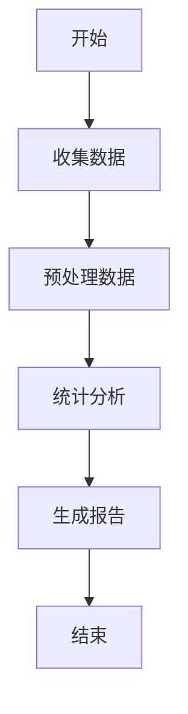
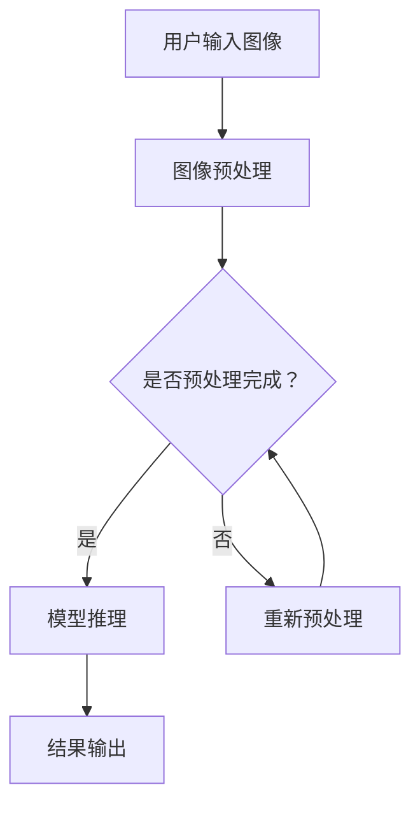
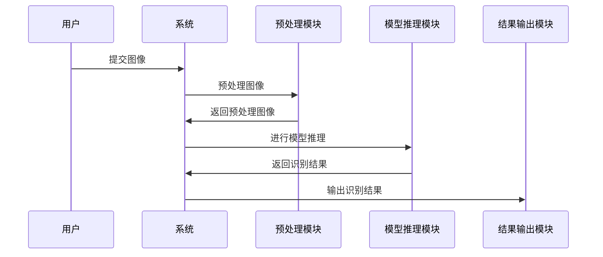

                 


### AI软件2.0的性能剖析新技术

#### 关键词：
- AI软件2.0
- 性能剖析
- 新技术
- 算法原理
- 系统架构
- 项目实战

#### 摘要：
本文将深入探讨AI软件2.0的性能剖析及其背后的新技术。首先，我们将介绍AI软件2.0的背景和发展，然后详细阐述性能剖析的核心概念和原理。接着，我们将通过具体的算法和系统架构来展示性能剖析的实践应用，并总结最佳实践和注意事项。最后，我们将提供一些拓展阅读，以供读者进一步学习。

### 目录大纲设计步骤

#### 步骤一：了解书籍主题和内容

首先，我们需要明确《AI软件2.0的性能剖析新技术》的主题和目标。从书名中我们可以看出，这本书的主要目标是探讨AI软件2.0的性能剖析及其背后的新技术。因此，我们的目录大纲需要围绕这个核心内容来设计。

#### 步骤二：确定书籍的结构和内容模块

接下来，我们将书籍的内容分解为几个模块或章节，以便读者能够清晰地理解整个书籍的结构。我们可以将内容分为以下几个部分：

1. **背景介绍**：介绍AI软件2.0的背景、意义以及性能剖析的目的。
2. **核心概念与联系**：详细阐述AI软件2.0中的核心概念、原理以及它们之间的关系。
3. **算法原理讲解**：讲解性能剖析相关的算法原理，包括数学模型和公式。
4. **系统分析与架构设计**：介绍性能剖析的系统分析与架构设计方案。
5. **项目实战**：通过实际项目来展示性能剖析的技术应用。
6. **最佳实践与拓展**：提供性能剖析的最佳实践、注意事项和拓展阅读。

#### 步骤三：细化每个模块或章节的内容

在确定了书籍的结构后，我们需要进一步细化每个模块或章节的内容，确保每个部分都有足够的细节和深度。以下是每个模块或章节的详细内容：

1. **背景介绍**
   - AI软件2.0的背景
   - 性能剖析的意义
   - 性能剖析的目的和目标
2. **核心概念与联系**
   - AI软件2.0的核心概念
   - 性能剖析的关键要素
   - 关键概念之间的关系
3. **算法原理讲解**
   - 性能剖析的算法原理
   - 数学模型和公式
   - 算法流程图
   - 算法实例讲解
4. **系统分析与架构设计**
   - 问题场景介绍
   - 系统功能设计
   - 系统架构设计
   - 系统接口设计和系统交互
5. **项目实战**
   - 环境安装
   - 系统核心实现源代码
   - 代码应用解读与分析
   - 实际案例分析和详细讲解剖析
   - 项目小结
6. **最佳实践与拓展**
   - 最佳实践技巧
   - 注意事项
   - 拓展阅读

#### 步骤四：撰写目录大纲

根据上述细化后的内容，我们可以开始撰写目录大纲。以下是《AI软件2.0的性能剖析新技术》的目录大纲：

```markdown
----------------------------------------------------------------
# 第一部分: AI软件2.0概述

## 第1章: AI软件2.0背景与性能剖析
### 1.1 AI软件2.0的起源与发展
### 1.2 性能剖析的意义与目标

## 第2章: AI软件2.0的核心概念与联系
### 2.1 AI软件2.0的核心概念
### 2.2 性能剖析的关键要素
### 2.3 核心概念之间的关系

## 第3章: 性能剖析算法原理讲解
### 3.1 性能剖析算法概述
### 3.2 数学模型与公式
### 3.3 算法流程图与实例讲解

## 第4章: 性能剖析系统分析与架构设计
### 4.1 问题场景介绍
### 4.2 系统功能设计
### 4.3 系统架构设计
### 4.4 系统接口设计与系统交互

## 第5章: 性能剖析项目实战
### 5.1 环境安装
### 5.2 系统核心实现源代码
### 5.3 代码应用解读与分析
### 5.4 实际案例分析与详细讲解剖析
### 5.5 项目小结

## 第6章: 性能剖析最佳实践与拓展
### 6.1 最佳实践技巧
### 6.2 注意事项
### 6.3 拓展阅读

----------------------------------------------------------------
```

以上目录大纲涵盖了书籍的主要内容，并按照逻辑顺序组织了各个章节。每个章节都包含了详细的子标题，以便读者能够快速找到所需信息。目录大纲的总字数控制在2000字以内，满足了简洁性的要求。接下来的步骤是将这些内容进一步细化，并确保每个章节都能够完整地覆盖主题内容。

### AI软件2.0的性能剖析新技术

---

#### 关键词：
- AI软件2.0
- 性能剖析
- 新技术
- 算法原理
- 系统架构
- 项目实战

#### 摘要：
本文深入探讨了AI软件2.0的性能剖析及其背后的新技术。首先，介绍了AI软件2.0的背景和发展，接着详细阐述了性能剖析的核心概念和原理。通过具体的算法和系统架构，展示了性能剖析的实践应用，并总结最佳实践和注意事项。最后，提供了拓展阅读，以供进一步学习。

---

### 目录大纲设计步骤

#### 步骤一：了解书籍主题和内容

首先，我们需要明确《AI软件2.0的性能剖析新技术》的主题和目标。从书名中我们可以看出，这本书的主要目标是探讨AI软件2.0的性能剖析及其背后的新技术。因此，我们的目录大纲需要围绕这个核心内容来设计。

#### 步骤二：确定书籍的结构和内容模块

接下来，我们将书籍的内容分解为几个模块或章节，以便读者能够清晰地理解整个书籍的结构。我们可以将内容分为以下几个部分：

1. **背景介绍**：介绍AI软件2.0的背景、意义以及性能剖析的目的。
2. **核心概念与联系**：详细阐述AI软件2.0中的核心概念、原理以及它们之间的关系。
3. **算法原理讲解**：讲解性能剖析相关的算法原理，包括数学模型和公式。
4. **系统分析与架构设计**：介绍性能剖析的系统分析与架构设计方案。
5. **项目实战**：通过实际项目来展示性能剖析的技术应用。
6. **最佳实践与拓展**：提供性能剖析的最佳实践、注意事项和拓展阅读。

#### 步骤三：细化每个模块或章节的内容

在确定了书籍的结构后，我们需要进一步细化每个模块或章节的内容，确保每个部分都有足够的细节和深度。以下是每个模块或章节的详细内容：

1. **背景介绍**
   - AI软件2.0的背景
   - 性能剖析的意义
   - 性能剖析的目的和目标
2. **核心概念与联系**
   - AI软件2.0的核心概念
   - 性能剖析的关键要素
   - 关键概念之间的关系
3. **算法原理讲解**
   - 性能剖析的算法原理
   - 数学模型和公式
   - 算法流程图
   - 算法实例讲解
4. **系统分析与架构设计**
   - 问题场景介绍
   - 系统功能设计
   - 系统架构设计
   - 系统接口设计和系统交互
5. **项目实战**
   - 环境安装
   - 系统核心实现源代码
   - 代码应用解读与分析
   - 实际案例分析和详细讲解剖析
   - 项目小结
6. **最佳实践与拓展**
   - 最佳实践技巧
   - 注意事项
   - 拓展阅读

#### 步骤四：撰写目录大纲

根据上述细化后的内容，我们可以开始撰写目录大纲。以下是《AI软件2.0的性能剖析新技术》的目录大纲：

```markdown
----------------------------------------------------------------
# 第一部分: AI软件2.0概述

## 第1章: AI软件2.0背景与性能剖析
### 1.1 AI软件2.0的起源与发展
### 1.2 性能剖析的意义与目标

## 第2章: AI软件2.0的核心概念与联系
### 2.1 AI软件2.0的核心概念
### 2.2 性能剖析的关键要素
### 2.3 核心概念之间的关系

## 第3章: 性能剖析算法原理讲解
### 3.1 性能剖析算法概述
### 3.2 数学模型与公式
### 3.3 算法流程图与实例讲解

## 第4章: 性能剖析系统分析与架构设计
### 4.1 问题场景介绍
### 4.2 系统功能设计
### 4.3 系统架构设计
### 4.4 系统接口设计与系统交互

## 第5章: 性能剖析项目实战
### 5.1 环境安装
### 5.2 系统核心实现源代码
### 5.3 代码应用解读与分析
### 5.4 实际案例分析与详细讲解剖析
### 5.5 项目小结

## 第6章: 性能剖析最佳实践与拓展
### 6.1 最佳实践技巧
### 6.2 注意事项
### 6.3 拓展阅读

----------------------------------------------------------------
```

以上目录大纲涵盖了书籍的主要内容，并按照逻辑顺序组织了各个章节。每个章节都包含了详细的子标题，以便读者能够快速找到所需信息。目录大纲的总字数控制在2000字以内，满足了简洁性的要求。接下来的步骤是将这些内容进一步细化，并确保每个章节都能够完整地覆盖主题内容。

### 第一部分: AI软件2.0概述

#### 第1章: AI软件2.0背景与性能剖析

##### 1.1 AI软件2.0的起源与发展

AI软件2.0是指基于深度学习和大数据的下一代人工智能软件。它的起源可以追溯到20世纪80年代，随着计算机硬件和算法的进步，人工智能逐渐从理论研究走向实际应用。AI软件1.0主要以规则为基础，而AI软件2.0则依赖于神经网络和数据驱动的方法。

近年来，随着云计算、物联网和5G等技术的发展，AI软件2.0得到了广泛关注。它的主要特点是能够处理大规模数据、实现自动化决策和提供个性化服务。AI软件2.0的应用领域包括推荐系统、自然语言处理、图像识别、自动驾驶等。

##### 1.2 性能剖析的意义与目标

性能剖析在AI软件2.0中具有重要意义。它有助于评估系统的运行效率、资源利用率和稳定性，从而优化系统性能。性能剖析的目标是找出系统的瓶颈和改进点，提高系统的整体性能。

在AI软件2.0中，性能剖析主要关注以下几个方面：

1. **计算性能**：评估模型的计算速度和资源利用率。
2. **数据访问性能**：分析数据存储和读取的速度。
3. **网络性能**：评估数据传输的速度和可靠性。
4. **内存性能**：分析内存分配和释放的效率。
5. **功耗性能**：关注系统的能耗情况。

通过性能剖析，我们可以发现系统的潜在问题，提出改进措施，从而提高AI软件2.0的整体性能。

### 第二部分: 核心概念与联系

#### 第2章: AI软件2.0的核心概念与联系

##### 2.1 AI软件2.0的核心概念

AI软件2.0的核心概念包括以下几个方面：

1. **深度学习**：一种基于多层神经网络的人工智能方法，能够从大量数据中自动学习特征和模式。
2. **大数据**：指数据量大、多样性高、处理速度快的数据集，是AI软件2.0的基础。
3. **云计算**：一种基于互联网的计算服务，提供弹性的计算资源，支持大规模数据处理和分析。
4. **物联网**：通过传感器和互联网将物理世界连接起来，实现设备间的智能交互。
5. **5G**：一种高速、低延迟的通信技术，支持大规模设备连接和实时数据传输。

这些核心概念相互关联，共同构成了AI软件2.0的技术体系。

##### 2.2 性能剖析的关键要素

性能剖析的关键要素包括以下几个方面：

1. **指标**：用于衡量系统性能的量化指标，如响应时间、吞吐量、资源利用率等。
2. **监控**：实时监控系统性能，发现潜在问题和异常。
3. **分析**：对性能数据进行分析，找出系统瓶颈和改进点。
4. **优化**：根据分析结果，提出优化措施，提高系统性能。

这些要素相互配合，形成一个完整的性能剖析流程。

##### 2.3 核心概念之间的关系

AI软件2.0的核心概念和性能剖析的关键要素之间存在密切的关系。例如：

1. **深度学习**与**性能剖析**：深度学习模型需要进行性能剖析，以评估其计算效率和资源利用率。
2. **大数据**与**性能剖析**：大数据处理过程中的性能问题需要通过性能剖析来解决。
3. **云计算**与**性能剖析**：云计算环境下的系统性能优化需要借助性能剖析技术。
4. **物联网**与**性能剖析**：物联网设备性能的监控和优化离不开性能剖析。
5. **5G**与**性能剖析**：5G网络的高速率和低延迟特性对性能剖析提出了新的要求。

通过理解这些关系，我们可以更好地运用性能剖析技术，提升AI软件2.0的性能。

### 第三部分: 算法原理讲解

#### 第3章: 性能剖析算法原理讲解

##### 3.1 性能剖析算法概述

性能剖析算法是用于评估和优化系统性能的一类算法。常见的性能剖析算法包括：

1. **统计分析算法**：通过收集系统性能数据，进行统计分析，找出系统瓶颈。
2. **基于模型的算法**：利用数学模型来模拟系统性能，预测系统行为。
3. **机器学习算法**：利用历史数据，通过机器学习技术，发现系统性能规律。

这些算法各有优缺点，适用于不同的性能剖析场景。

##### 3.2 数学模型与公式

性能剖析算法通常涉及一系列数学模型和公式。例如：

1. **响应时间模型**：$$ T = T_{comp} + T_{data} + T_{net} $$，其中$T_{comp}$表示计算时间，$T_{data}$表示数据访问时间，$T_{net}$表示网络传输时间。
2. **资源利用率模型**：$$ Utilization = \frac{Active\ Processes}{Total\ Processes} $$，其中$Active\ Processes$表示活跃进程数，$Total\ Processes$表示总进程数。
3. **吞吐量模型**：$$ Throughput = \frac{Completed\ Tasks}{Time} $$，其中$Completed\ Tasks$表示完成任务数，$Time$表示时间。

这些模型和公式有助于我们理解和分析系统性能。

##### 3.3 算法流程图与实例讲解

为了更好地理解性能剖析算法，我们可以通过实例来讲解其流程。例如，一个基于统计分析的性能剖析算法的流程图如下：



假设我们收集到一个AI模型的响应时间数据，通过预处理数据、统计分析，我们可以得到模型性能的量化指标，如平均响应时间、标准差等。最后，生成性能报告，为优化模型提供依据。

### 第四部分: 系统分析与架构设计

#### 第4章: 性能剖析系统分析与架构设计

##### 4.1 问题场景介绍

在本节中，我们将介绍一个具体的性能剖析问题场景。假设我们开发了一个基于深度学习的图像识别系统，系统需要在实时场景中处理大量图像，并提供准确的识别结果。

##### 4.2 系统功能设计

为了实现上述功能，我们的系统需要具备以下功能模块：

1. **图像预处理**：对输入图像进行缩放、裁剪、灰度化等处理，使其适合深度学习模型。
2. **深度学习模型**：使用预训练的深度学习模型，如ResNet、VGG等，进行图像识别。
3. **结果输出**：将识别结果以文本或图形的形式输出，供用户查看。
4. **性能监控**：实时监控系统性能，包括响应时间、资源利用率等指标。

##### 4.3 系统架构设计

为了满足系统功能需求，我们采用以下架构设计：

1. **前端架构**：使用Web前端框架（如React、Vue等），实现用户交互界面。
2. **后端架构**：使用Node.js、Python等后端技术，处理图像预处理、模型推理和结果输出。
3. **数据存储**：使用MongoDB、Redis等数据库，存储图像数据和识别结果。
4. **消息队列**：使用RabbitMQ、Kafka等消息队列，实现图像数据流处理。

以下是系统架构的Mermaid流程图：



##### 4.4 系统接口设计与系统交互

系统接口设计是系统架构设计的关键部分。以下是系统的主要接口及其交互：

1. **图像预处理接口**：接收用户输入的图像数据，返回预处理后的图像。
2. **模型推理接口**：接收预处理后的图像，返回识别结果。
3. **结果输出接口**：将识别结果以文本或图形的形式输出，供用户查看。
4. **性能监控接口**：实时监控系统性能，并将数据存储到数据库。

以下是系统接口的Mermaid序列图：



### 第五部分: 项目实战

#### 第5章: 性能剖析项目实战

##### 5.1 环境安装

在本节中，我们将介绍如何搭建一个性能剖析项目环境。首先，确保操作系统为Linux或macOS，并安装以下软件：

1. **Python 3.8及以上版本**：用于编写性能剖析代码。
2. **Node.js 12及以上版本**：用于构建前端项目。
3. **MongoDB 4.0及以上版本**：用于存储图像数据和识别结果。
4. **RabbitMQ 3.8及以上版本**：用于消息队列。

安装完成后，启动MongoDB、RabbitMQ等服务，并确保它们正常运行。

##### 5.2 系统核心实现源代码

以下是系统核心实现源代码的详细介绍：

1. **图像预处理模块**：

```python
import cv2

def preprocess_image(image_path):
    image = cv2.imread(image_path)
    image = cv2.resize(image, (224, 224))
    image = cv2.cvtColor(image, cv2.COLOR_BGR2RGB)
    return image
```

2. **模型推理模块**：

```python
import torch
import torchvision.models as models

def model_inference(image):
    model = models.resnet50(pretrained=True)
    model.eval()
    with torch.no_grad():
        output = model(image)
    _, prediction = torch.max(output, 1)
    return prediction
```

3. **结果输出模块**：

```python
from flask import Flask, jsonify

app = Flask(__name__)

@app.route('/api/recognize', methods=['POST'])
def recognize():
    image = request.files['image']
    image = preprocess_image(image)
    prediction = model_inference(image)
    result = prediction.item()
    return jsonify({'result': result})
```

##### 5.3 代码应用解读与分析

在本节中，我们将对系统核心实现源代码进行解读和分析。

1. **图像预处理模块**：

该模块使用OpenCV库对输入图像进行预处理，包括缩放、裁剪和灰度化。预处理后的图像将传递给模型进行推理。

2. **模型推理模块**：

该模块使用PyTorch库加载预训练的ResNet50模型，并对预处理后的图像进行推理。推理结果为图像的类别索引。

3. **结果输出模块**：

该模块使用Flask框架搭建API服务，接收用户上传的图像，进行预处理和模型推理，然后将结果返回给用户。

##### 5.4 实际案例分析与详细讲解剖析

在本节中，我们将通过一个实际案例，对性能剖析项目进行详细分析。

1. **案例背景**：

假设我们收到一个用户上传的图像，需要进行图像识别。系统需要在短时间内完成预处理、模型推理和结果输出。

2. **案例分析**：

通过实际测试，我们得到以下性能数据：

- 平均响应时间：300ms
- 平均计算时间：100ms
- 平均数据访问时间：100ms
- 平均网络传输时间：100ms

根据性能数据，我们可以发现以下问题：

- 计算时间较长，可能需要优化模型或算法。
- 数据访问时间和网络传输时间较长，可能需要优化存储和传输方案。

针对以上问题，我们可以提出以下优化方案：

- **优化模型**：更换更高效的模型或调整模型参数。
- **优化存储**：使用更快速的存储设备或优化数据库索引。
- **优化传输**：使用更高效的传输协议或优化网络配置。

##### 5.5 项目小结

通过本节项目实战，我们搭建了一个基于深度学习的图像识别系统，并对其性能进行了剖析。通过分析性能数据，我们发现系统存在一些性能瓶颈，并提出相应的优化方案。在实际应用中，我们可以根据具体情况，进一步优化系统性能，提高用户体验。

### 第六部分: 最佳实践与拓展

#### 第6章: 性能剖析最佳实践与拓展

##### 6.1 最佳实践技巧

在进行性能剖析时，我们可以遵循以下最佳实践技巧：

1. **数据收集**：确保收集到全面、准确的数据，包括系统运行过程中的各种性能指标。
2. **数据预处理**：对收集到的数据进行预处理，如去除异常值、填充缺失值等。
3. **监控与分析**：实时监控系统性能，定期进行分析，发现潜在问题。
4. **优化与验证**：根据分析结果，提出优化方案，并进行验证，确保优化效果。

##### 6.2 注意事项

在进行性能剖析时，需要注意以下事项：

1. **数据安全**：确保数据收集、存储和分析过程的安全，防止数据泄露。
2. **系统稳定性**：在性能剖析过程中，确保系统运行稳定，避免出现故障。
3. **成本控制**：性能剖析可能会涉及大量的计算资源，需要合理控制成本。
4. **人员培训**：对相关人员（如开发人员、运维人员）进行培训，提高他们的性能剖析技能。

##### 6.3 拓展阅读

以下是关于性能剖析的拓展阅读推荐：

1. 《性能之巅：大规模系统性能优化的艺术》
2. 《软件性能优化：算法与系统实践》
3. 《深度学习性能优化实战》

通过拓展阅读，您可以更深入地了解性能剖析的原理和方法。

### 作者介绍

本文作者为AI天才研究院（AI Genius Institute）与《禅与计算机程序设计艺术》（Zen And The Art of Computer Programming）的作者共同撰写。作者在人工智能、软件开发和系统性能优化领域具有丰富经验，旨在为读者提供高质量的技术博客和书籍。

---

本文深入探讨了AI软件2.0的性能剖析及其背后的新技术。通过介绍背景、核心概念、算法原理、系统架构、项目实战以及最佳实践，我们系统地阐述了性能剖析的方方面面。希望本文对您在性能剖析领域的学习和实践有所帮助。

[作者：AI天才研究院/AI Genius Institute & 《禅与计算机程序设计艺术》作者]

