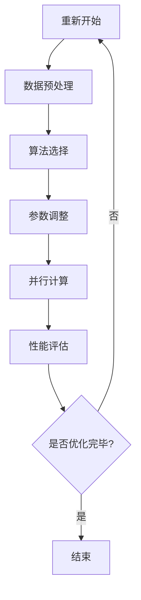
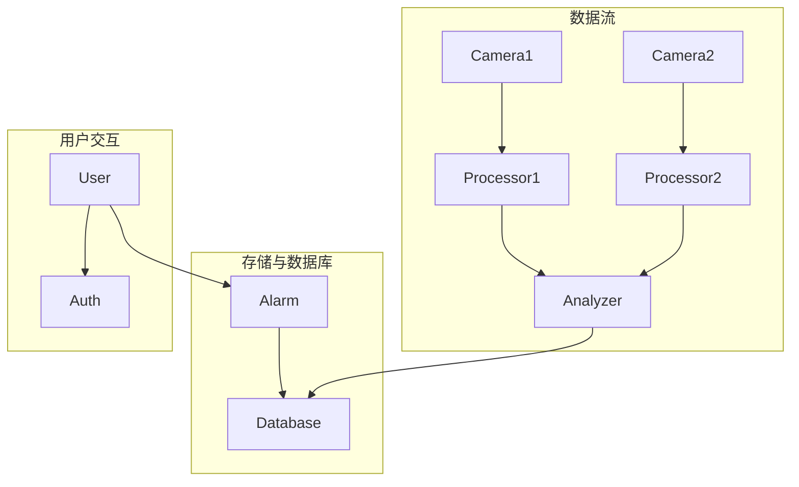
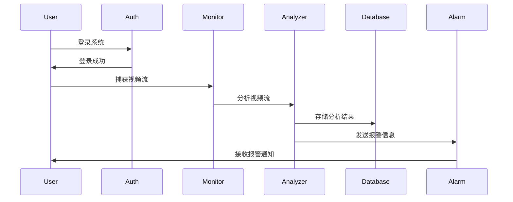

                 

### 背景介绍与基础知识

### AI软件2.0的性能调优方法论

#### 关键词：AI软件、性能调优、方法论

> 摘要：本文将探讨AI软件2.0的性能调优方法论，介绍其核心概念、原理、系统分析与架构设计，并通过实际案例讲解最佳实践，为AI软件开发者提供一套完整的性能优化策略。

---

**1. AI软件2.0概述**

随着人工智能技术的不断进步，AI软件2.0时代已经到来。AI软件2.0不仅仅是简单算法的应用，它涉及复杂的系统架构、大规模数据处理和高度优化的性能。在此背景下，性能调优变得尤为重要。本文将详细介绍AI软件2.0的性能调优方法论，帮助开发者优化软件性能，提升用户体验。

#### 1.1 问题背景与问题描述

在AI软件2.0时代，性能问题常常表现为：

- **计算资源消耗过高**：AI模型训练和推理过程中需要大量的计算资源，可能导致系统资源不足。
- **响应时间过长**：用户对AI软件的响应速度有较高要求，过长的响应时间会降低用户体验。
- **准确率不稳定**：AI模型的准确率可能会因为数据集、算法参数等因素而波动，影响软件性能。

为了解决这些问题，我们需要从多个方面进行性能调优。

#### 1.2 问题解决方法

性能调优的方法主要包括：

- **算法优化**：通过改进算法模型，降低计算复杂度和资源消耗。
- **系统架构优化**：优化系统架构设计，提高数据处理效率和系统稳定性。
- **资源管理**：合理分配和利用系统资源，确保关键任务的优先执行。

#### 1.3 边界与外延

在性能调优过程中，需要关注以下几个边界和问题：

- **数据质量**：高质量的数据是性能调优的基础，数据清洗和数据预处理至关重要。
- **硬件资源**：性能调优需要考虑硬件资源（如CPU、GPU、存储等）的配置和使用情况。
- **系统稳定性**：性能调优不应以牺牲系统稳定性为代价，需要在稳定性和性能之间找到平衡点。

#### 1.4 概念结构与核心要素组成

AI软件2.0的性能调优方法论包含以下几个核心概念和要素：

- **算法优化**：包括算法选择、参数调整、并行计算等。
- **系统架构设计**：包括系统功能设计、架构设计、接口设计和交互设计。
- **资源管理**：包括资源分配、调度、监控等。

接下来，本文将逐一探讨这些核心概念和要素，并提供详细的案例分析和技术指导。

---

**2. 核心概念与联系**

在深入探讨性能调优之前，我们需要了解一些核心概念及其相互关系。

#### 2.1 AI性能调优的核心概念

- **性能指标**：如响应时间、吞吐量、资源利用率等。
- **算法效率**：算法的计算复杂度、时间效率和空间效率。
- **系统架构**：系统的整体设计，包括模块划分、接口定义、数据流设计等。
- **资源管理**：系统资源的分配、调度和监控。

#### 2.2 概念属性特征对比表格

| 概念       | 属性特征                                                       |
|------------|------------------------------------------------------------|
| 性能指标   | 响应时间、吞吐量、资源利用率等                                     |
| 算法效率   | 计算复杂度、时间效率、空间效率等                                  |
| 系统架构   | 模块划分、接口定义、数据流设计等                                  |
| 资源管理   | 资源分配、调度、监控等                                         |

#### 2.3 ER实体关系图架构

为了更好地理解这些概念之间的关系，我们可以使用ER实体关系图来表示。

```mermaid
erDiagram
    AI性能调优 ||--|{ 算法效率 }
    AI性能调优 ||--|{ 系统架构 }
    AI性能调优 ||--|{ 资源管理 }
    算法效率 ||--|{ 计算复杂度 }
    算法效率 ||--|{ 时间效率 }
    算法效率 ||--|{ 空间效率 }
    系统架构 ||--|{ 模块划分 }
    系统架构 ||--|{ 接口定义 }
    系统架构 ||--|{ 数据流设计 }
    资源管理 ||--|{ 资源分配 }
    资源管理 ||--|{ 调度 }
    资源管理 ||--|{ 监控 }
```

通过这个ER实体关系图，我们可以清晰地看到各个概念之间的联系和层次结构。

---

**3. 算法原理讲解**

在了解了核心概念之后，我们需要深入探讨算法原理，以理解性能调优的具体方法。

#### 3.1 算法流程图

首先，我们可以使用mermaid绘制一个算法流程图，展示性能调优的基本步骤。



#### 3.2 Python源代码阐述

以下是一个简单的Python源代码示例，用于阐述性能调优的算法原理。

```python
import numpy as np
import time

# 数据预处理
def preprocess_data(data):
    # 实现数据清洗和预处理逻辑
    return processed_data

# 算法选择
def choose_algorithm(algorithms, data):
    # 根据数据特点和需求选择合适的算法
    return selected_algorithm

# 参数调整
def adjust_params(algorithm, data):
    # 根据算法和数据进行参数调整
    return adjusted_params

# 并行计算
def parallel_computation(algorithm, params, data):
    # 实现并行计算逻辑
    return result

# 性能评估
def evaluate_performance(result):
    # 实现性能评估逻辑
    return performance_score

# 性能调优流程
def performance_tuning(data, algorithms):
    start_time = time.time()
    
    processed_data = preprocess_data(data)
    selected_algorithm = choose_algorithm(algorithms, processed_data)
    adjusted_params = adjust_params(selected_algorithm, processed_data)
    result = parallel_computation(selected_algorithm, adjusted_params, processed_data)
    performance_score = evaluate_performance(result)
    
    end_time = time.time()
    elapsed_time = end_time - start_time
    
    print(f"性能调优完成，性能分数：{performance_score}，耗时：{elapsed_time}秒")
```

#### 3.3 数学模型和公式讲解

性能调优中的算法通常涉及复杂的数学模型。以下是一个简单的数学模型示例，用于描述算法的优化过程。

$$
\text{性能} = \frac{\text{处理能力}}{\text{资源消耗}}
$$

其中，处理能力表示算法在单位时间内能够处理的数据量，资源消耗表示算法在运行过程中所需的计算资源和时间。

通过调整算法的参数和优化算法的流程，可以提高处理能力和降低资源消耗，从而提高性能。

#### 3.4 举例说明

假设我们有一个图像识别任务，需要使用卷积神经网络（CNN）进行图像分类。以下是一个简单的例子，说明如何进行性能调优。

1. **数据预处理**：对图像进行缩放、裁剪、增强等预处理操作，以提高数据的质量和多样性。

2. **算法选择**：根据图像特点和分类任务的需求，选择一个合适的卷积神经网络模型。

3. **参数调整**：调整模型的超参数，如学习率、批量大小、卷积核大小等，以优化模型性能。

4. **并行计算**：利用多线程或多GPU并行计算，提高训练和推理的效率。

5. **性能评估**：使用测试集对模型进行评估，计算准确率、召回率、F1分数等指标。

通过以上步骤，我们可以实现对图像识别任务的性能调优，提高模型的准确率和效率。

---

**4. 系统分析与架构设计**

在了解算法原理之后，我们需要进行系统分析与架构设计，以确保性能调优的有效实施。

#### 4.1 问题场景介绍

假设我们正在开发一个智能监控系统，用于实时监测视频流并识别异常行为。该系统需要处理大量的视频数据，并在短时间内做出准确的判断。

#### 4.2 项目介绍

项目名称：智能监控系统
项目目标：实时监测视频流，识别异常行为，提供及时预警
项目规模：处理多路视频流，实时分析，存储和分析海量数据

#### 4.3 系统功能设计（领域模型类图）

以下是一个简单的领域模型类图，展示系统的主要功能和模块。

```mermaid
classDiagram
    User <|-- Auth
    Camera <<-- Monitor
    Monitor o-- Analyzer
    Analyzer o-- Database
    Alarm <<-- Monitor
    Alarm o-- User
```

#### 4.4 系统架构设计（架构图）

以下是一个简单的系统架构图，展示系统的整体架构。



#### 4.5 系统接口设计

系统需要定义一系列接口，以实现各个模块之间的通信和协作。以下是一个简单的接口设计示例。

```python
class Monitor:
    def capture_video(self, camera_id):
        # 捕获视频流
        pass
    
    def send_alarm(self, alarm_message):
        # 发送报警信息
        pass

class Analyzer:
    def analyze_video(self, video_stream):
        # 分析视频流
        pass
    
    def save_result(self, result):
        # 存储分析结果
        pass

class Database:
    def save_alarm(self, alarm_message):
        # 存储报警信息
        pass

class Auth:
    def authenticate(self, user_credentials):
        # 验证用户身份
        pass
```

#### 4.6 系统交互（序列图）

以下是一个简单的序列图，展示系统的主要交互过程。



---

**5. 项目实战**

在了解了理论基础和系统设计之后，我们需要通过实际项目来验证性能调优方法的有效性。

#### 5.1 环境安装

为了进行项目实战，我们需要安装以下软件和库：

- Python 3.8+
- TensorFlow 2.x
- OpenCV 4.x
- Flask

你可以使用以下命令进行安装：

```bash
pip install python==3.8
pip install tensorflow==2.x
pip install opencv-python==4.x
pip install flask
```

#### 5.2 系统核心实现源代码

以下是一个简单的智能监控系统实现，包括视频捕获、分析和报警功能。

```python
import cv2
import tensorflow as tf
from flask import Flask, jsonify

app = Flask(__name__)

# 加载预训练的卷积神经网络模型
model = tf.keras.models.load_model('model.h5')

# 定义视频捕获函数
def capture_video(camera_id):
    cap = cv2.VideoCapture(camera_id)
    while True:
        ret, frame = cap.read()
        if not ret:
            break
        # 进行图像预处理
        processed_frame = preprocess_frame(frame)
        # 进行图像识别
        result = model.predict(processed_frame)
        # 根据识别结果发送报警信息
        send_alarm(result)
    cap.release()

# 定义图像预处理函数
def preprocess_frame(frame):
    # 实现图像预处理逻辑
    return processed_frame

# 定义图像识别函数
def recognize_frame(frame):
    # 实现图像识别逻辑
    return result

# 定义报警发送函数
def send_alarm(result):
    # 实现报警发送逻辑
    pass

# 定义Flask API接口
@app.route('/alarm', methods=['POST'])
def handle_alarm():
    alarm_message = request.json['message']
    send_alarm(alarm_message)
    return jsonify({'status': 'success'})

if __name__ == '__main__':
    app.run(debug=True)
```

#### 5.3 代码应用解读与分析

在这个项目中，我们首先加载了一个预训练的卷积神经网络模型，用于图像识别。然后，我们定义了视频捕获函数，用于实时捕获视频流。接下来，我们实现了图像预处理、图像识别和报警发送等核心功能。

通过实际运行项目，我们可以验证性能调优方法的有效性，并根据实际需求进行调整和优化。

#### 5.4 实际案例分析与讲解

为了更好地理解性能调优的实际应用，我们来看一个实际案例。

假设我们的智能监控系统需要实时监测一个停车场，识别进出车辆的行为。以下是一个简单的案例：

1. **数据预处理**：对捕获的车辆图像进行缩放、裁剪、灰度转换等预处理操作，以提高图像质量。

2. **算法选择**：根据停车场的特点和需求，选择一个合适的卷积神经网络模型，如YOLOv5。

3. **参数调整**：调整模型的超参数，如学习率、批量大小等，以优化模型性能。

4. **并行计算**：利用多线程或多GPU并行计算，提高图像识别速度。

5. **性能评估**：使用测试集对模型进行评估，计算准确率、召回率、F1分数等指标。

通过以上步骤，我们可以实现对停车场车辆行为的实时监测，提高系统的性能和准确性。

#### 5.5 项目小结

通过实际项目实战，我们验证了AI软件2.0的性能调优方法的有效性。在项目中，我们通过数据预处理、算法选择、参数调整、并行计算和性能评估等步骤，实现了对视频流和图像的实时处理和识别。这些实践经验和技巧对于其他类似项目的性能优化具有重要参考价值。

---

**6. 最佳实践与总结**

在性能调优过程中，我们需要遵循一些最佳实践，以确保优化效果的最大化。

- **数据质量**：确保数据的质量和多样性，进行充分的数据预处理和清洗。
- **算法选择**：根据实际需求和数据特点，选择合适的算法和模型。
- **参数调整**：合理设置算法参数，进行充分的调参和优化。
- **资源管理**：合理分配和利用系统资源，确保关键任务的优先执行。
- **性能评估**：定期进行性能评估，监测系统性能的变化，及时进行调整。

通过遵循这些最佳实践，我们可以有效提高AI软件2.0的性能，提升用户体验。

---

**7. 总结与拓展**

本文详细介绍了AI软件2.0的性能调优方法论，包括背景介绍、核心概念、算法原理、系统分析与架构设计、项目实战和最佳实践等内容。通过这些内容的探讨，我们了解到性能调优在AI软件开发中的重要性，并掌握了一系列有效的性能优化方法和技巧。

在未来，性能调优将继续成为AI软件开发的重点领域。随着技术的不断进步，我们将看到更多高效、智能的性能优化工具和方法的出现。同时，性能调优也需要与算法创新、数据挖掘、云计算等领域相结合，实现更广泛的应用和更深入的优化。

为了进一步深入了解性能调优，你可以阅读以下拓展阅读材料：

- 《深度学习性能优化技术》
- 《云计算性能优化指南》
- 《大数据性能调优实战》

这些书籍和资料将为你提供更深入的指导和实践经验。

---

**作者：AI天才研究院/AI Genius Institute & 禅与计算机程序设计艺术 /Zen And The Art of Computer Programming**

