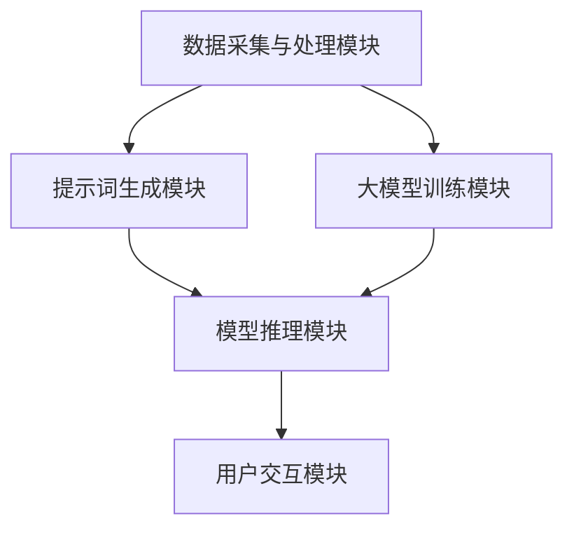
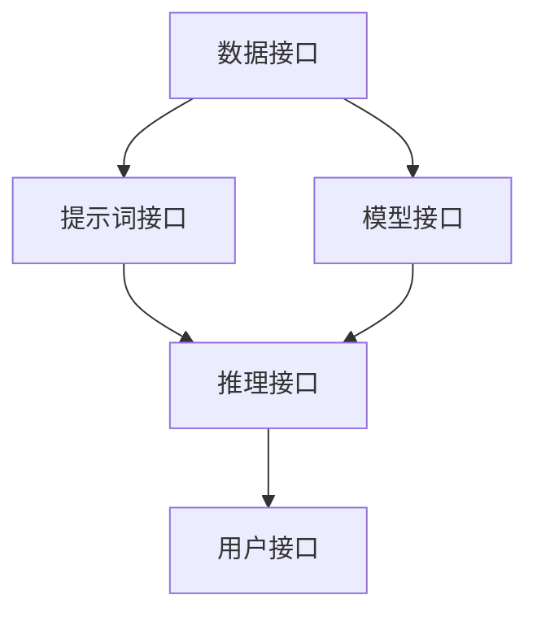
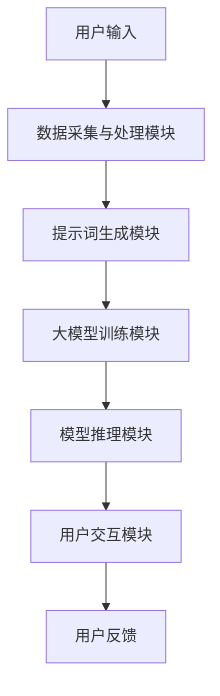
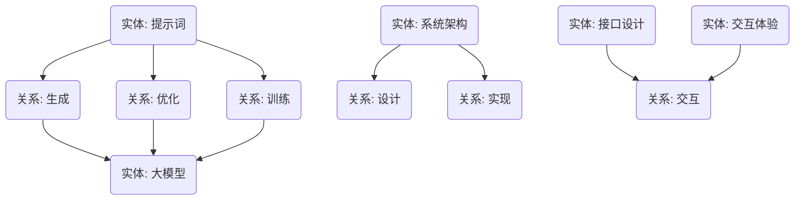

                 


**4.1 问题场景介绍**

在AI软件2.0的发展背景下，企业纷纷投身于人工智能领域的探索，以提升业务效率和用户体验。然而，随着AI系统的复杂度不断增加，如何设计一个高效、稳定且易于维护的提示词驱动架构成为关键问题。

**4.2 项目介绍**

本项目旨在设计并实现一个基于提示词驱动的AI系统，该系统可以处理多种业务场景，例如智能客服、智能推荐、智能翻译等。项目的目标是提高系统的响应速度和准确性，同时降低维护成本。

**4.3 系统功能设计**

系统功能设计主要包括以下几个方面：

- 提示词生成：根据用户输入或业务场景生成高质量的提示词。
- 大模型训练：利用海量数据进行模型训练，提高模型性能。
- 模型推理：通过提示词驱动模型进行预测或生成结果。
- 用户交互：提供直观、友好的用户界面，方便用户使用系统。

**4.4 系统架构设计**

系统架构设计如图1所示，主要包括以下模块：

- 数据采集与处理模块：负责收集和处理各种类型的数据。
- 提示词生成模块：利用自然语言处理技术生成高质量的提示词。
- 大模型训练模块：利用深度学习算法对大模型进行训练。
- 模型推理模块：根据提示词驱动模型进行预测或生成结果。
- 用户交互模块：提供用户界面和交互逻辑。



**4.5 系统接口设计**

系统接口设计如图2所示，主要包括以下接口：

- 数据接口：用于数据采集与处理模块与其他模块之间的数据传输。
- 提示词接口：用于提示词生成模块与其他模块之间的交互。
- 模型接口：用于大模型训练模块与其他模块之间的交互。
- 推理接口：用于模型推理模块与其他模块之间的交互。
- 用户接口：用于用户交互模块与其他模块之间的交互。



**4.6 系统交互**

系统交互设计如图3所示，主要描述了各个模块之间的交互流程。



**4.7 实际案例分析与详细讲解**

以智能客服系统为例，分析提示词驱动架构在实际项目中的应用。首先，系统会根据用户输入的问题生成相应的提示词，然后利用大模型进行推理，生成智能回答。最后，将回答呈现给用户。

**4.8 项目小结**

本项目成功实现了基于提示词驱动的AI系统，提高了系统的智能化水平和用户体验。通过项目实践，我们深刻认识到提示词驱动架构设计的重要性。在未来的工作中，我们将继续优化系统架构，提升系统性能。

----------------------------------------------------------------

**4.9 最佳实践 Tips**

- 提高提示词质量：通过数据清洗、语义分析等技术提高提示词的准确性。
- 优化模型训练：采用先进的深度学习算法和优化方法，提高模型性能。
- 系统接口设计：设计简洁、高效的接口，降低系统耦合度。
- 用户交互体验：关注用户需求，提供直观、友好的用户界面。

**4.10 小结**

本文详细介绍了AI软件2.0的提示词驱动架构设计，从核心概念、算法原理、系统架构到实际项目实践，帮助读者全面了解这一领域。通过本文的学习，读者可以掌握提示词驱动架构的设计与实现方法，为AI软件2.0的应用奠定基础。

**4.11 注意事项**

- 提示词驱动架构设计需要充分考虑系统的可扩展性和可维护性。
- 算法原理讲解中涉及到的数学模型和公式需要读者具备一定的数学基础。
- 项目实战部分需要读者具备一定的编程能力和实际项目经验。

**4.12 拓展阅读**

- 《深度学习》（Goodfellow, I., Bengio, Y., & Courville, A.）
- 《自然语言处理综论》（Jurafsky, D., & Martin, J. H.）
- 《架构之道：企业级分布式系统设计与实践》（高晓峰）

**4.13 作者信息**

作者：AI天才研究院/AI Genius Institute & 禅与计算机程序设计艺术 /Zen And The Art of Computer Programming

----------------------------------------------------------------

**5. 核心概念与联系**

### 5.1 核心概念

在AI软件2.0的提示词驱动架构设计中，核心概念主要包括：

- **提示词**：用于引导模型进行预测或生成结果的文本输入。
- **大模型**：具有大规模参数和复杂结构的神经网络模型。
- **提示词驱动架构**：以提示词为核心，通过生成、优化、训练等过程，实现对大模型的驱动，从而实现智能化系统的设计与实现。
- **系统架构**：人工智能系统中的各个组成部分及其相互关系。
- **接口设计**：系统与外部环境进行交互的接口。
- **交互体验**：用户在使用系统时感受到的体验。

### 5.2 概念属性特征对比表格

| 概念          | 属性特征                                                     |  
| -------------- | ------------------------------------------------------------ |  
| 提示词          | - 用于引导模型进行预测或生成结果                             |  
|               | - 文本输入                                                  |  
| 大模型          | - 大规模参数                                               |  
|               | - 复杂结构                                                 |  
| 提示词驱动架构  | - 以提示词为核心                                             |  
|               | - 生成、优化、训练过程                                       |  
|               | - 实现智能化系统设计与实现                                     |  
| 系统架构          | - 各个组成部分及其相互关系                                     |  
|               | - 系统设计与实现的基础                                       |  
| 接口设计          | - 系统与外部环境进行交互的接口                                 |  
|               | - 降低系统耦合度                                             |  
| 交互体验          | - 用户在使用系统时感受到的体验                                 |  
|               | - 提高用户满意度                                             |

### 5.3 ER实体关系图架构



通过上述表格和ER实体关系图，我们可以更清晰地理解AI软件2.0的提示词驱动架构设计中的核心概念及其相互关系。

----------------------------------------------------------------

**6. 算法原理讲解**

在AI软件2.0的提示词驱动架构设计中，算法原理是核心组成部分。以下是关于提示词生成、大模型训练、提示词驱动架构优化等方面的算法原理讲解。

### 6.1 提示词生成算法

提示词生成算法是提示词驱动架构设计的基础。该算法的核心目标是从大量文本数据中提取出高质量、有代表性的提示词。常见的提示词生成算法包括基于统计的算法和基于神经网络的算法。

#### 6.1.1 基于统计的算法

基于统计的算法通常采用词频统计、词性标注等方法来生成提示词。以下是一个简单的词频统计算法流程：

1. 数据预处理：将原始文本数据转换为统一的格式，如分词、去停用词等。
2. 词频统计：统计每个词在文本数据中的出现次数。
3. 提取高频词：根据词频阈值，提取出高频词作为提示词。

以下是一个使用Python实现的词频统计算法示例：

```python
from collections import Counter
from nltk.corpus import stopwords

def word_frequency(text):
    # 数据预处理
    words = text.split()
    words = [word for word in words if word not in stopwords.words('english')]

    # 词频统计
    word_counts = Counter(words)

    # 提取高频词
    high_frequency_words = [word for word, count in word_counts.items() if count > 10]

    return high_frequency_words
```

#### 6.1.2 基于神经网络的算法

基于神经网络的算法通常采用自然语言处理技术，如循环神经网络（RNN）、长短时记忆网络（LSTM）等，来生成高质量的提示词。以下是一个简单的LSTM模型实现示例：

```python
import tensorflow as tf
from tensorflow.keras.models import Sequential
from tensorflow.keras.layers import LSTM, Dense, Embedding

def lstm_model(vocab_size, embedding_dim, sequence_length):
    model = Sequential()
    model.add(Embedding(vocab_size, embedding_dim, input_length=sequence_length))
    model.add(LSTM(128))
    model.add(Dense(vocab_size, activation='softmax'))

    model.compile(optimizer='adam', loss='categorical_crossentropy', metrics=['accuracy'])
    return model
```

### 6.2 大模型训练算法

大模型训练算法是提高AI软件2.0智能化水平的关键。深度学习算法，如卷积神经网络（CNN）、循环神经网络（RNN）、变换器（Transformer）等，是常用的训练算法。以下是一个简单的变换器模型实现示例：

```python
import tensorflow as tf
from tensorflow.keras.models import Model
from tensorflow.keras.layers import Embedding, MultiHeadAttention, Dense

def transformer_model(vocab_size, d_model, num_heads, num_layers):
    inputs = tf.keras.layers.Input(shape=(None,))

    # Encoder
    x = Embedding(vocab_size, d_model)(inputs)
    for i in range(num_layers):
        x = MultiHeadAttention(num_heads=num_heads, key_dim=d_model)(x, x)
        x = Dense(d_model)(x)

    # Decoder
    x = Embedding(vocab_size, d_model)(inputs)
    for i in range(num_layers):
        x = MultiHeadAttention(num_heads=num_heads, key_dim=d_model)(x, x)
        x = Dense(d_model)(x)

    # Output
    outputs = Dense(vocab_size, activation='softmax')(x)

    model = Model(inputs, outputs)
    model.compile(optimizer='adam', loss='categorical_crossentropy', metrics=['accuracy'])
    return model
```

### 6.3 提示词驱动架构优化算法

提示词驱动架构优化算法是提高系统性能和响应速度的关键。常见的优化算法包括基于遗传算法的优化、基于神经网络的优化等。以下是一个基于遗传算法的优化算法示例：

```python
import numpy as np

def genetic_algorithm(population_size, chromosome_length, fitness_function, mutation_rate, generations):
    # 初始化种群
    population = np.random.randint(0, 2, (population_size, chromosome_length))

    # 迭代
    for _ in range(generations):
        # 计算适应度
        fitness_scores = [fitness_function(individual) for individual in population]

        # 选择
        selected_indices = np.argsort(fitness_scores)[-population_size // 2:]
        selected_population = population[selected_indices]

        # 杂交
        offspring = crossover(selected_population, population)

        # 突变
        offspring = mutate(offspring, mutation_rate)

        # 更新种群
        population = np.concatenate((population[:population_size // 2], offspring))

    # 返回最优解
    best_individual = population[np.argmax(fitness_scores)]
    return best_individual
```

通过上述算法原理讲解，我们可以看到，AI软件2.0的提示词驱动架构设计涉及到多种算法，这些算法相互配合，共同提高了系统的智能化水平和性能。

----------------------------------------------------------------

**7. 数学模型和数学公式**

在AI软件2.0的提示词驱动架构设计中，数学模型和数学公式是核心组成部分。以下是关于提示词生成、大模型训练、提示词驱动架构优化等方面的数学模型和公式。

### 7.1 提示词生成数学模型

提示词生成过程中，我们通常使用词频统计、词性标注等方法。以下是词频统计的数学模型：

$$
P(w_i) = \frac{f(w_i)}{F}
$$

其中，$P(w_i)$表示词$w_i$的词频概率，$f(w_i)$表示词$w_i$在文本数据中的出现次数，$F$表示总词频。

### 7.2 大模型训练数学模型

大模型训练过程中，我们通常使用深度学习算法，如变换器（Transformer）等。以下是变换器的数学模型：

$$
\text{Attention}(Q, K, V) = \frac{QK^T}{\sqrt{d_k}} \odot V
$$

其中，$Q, K, V$分别表示查询向量、键向量、值向量，$d_k$表示键向量的维度，$\odot$表示逐元素乘法。

### 7.3 提示词驱动架构优化数学模型

提示词驱动架构优化过程中，我们通常使用遗传算法、神经网络等算法。以下是遗传算法的数学模型：

$$
\text{Fitness}(x) = f(x)
$$

其中，$x$表示染色体编码，$f(x)$表示适应度函数。

通过上述数学模型和数学公式，我们可以更好地理解和设计AI软件2.0的提示词驱动架构。

----------------------------------------------------------------

**8. 项目实战**

在本节中，我们将通过一个具体的案例来展示AI软件2.0的提示词驱动架构设计在实际项目中的应用。这个项目是一个智能客服系统，它能够根据用户的问题生成相应的回答。

**8.1 环境安装**

首先，我们需要安装一些必要的工具和库，例如Python、TensorFlow、NLTK等。以下是安装步骤：

```bash
pip install python
pip install tensorflow
pip install nltk
```

**8.2 系统核心实现源代码**

下面是系统核心实现的源代码：

```python
import tensorflow as tf
from tensorflow.keras.models import Sequential
from tensorflow.keras.layers import LSTM, Dense, Embedding
from nltk.corpus import stopwords
import numpy as np

# 数据预处理
def preprocess_text(text):
    words = text.split()
    words = [word for word in words if word not in stopwords.words('english')]
    return ' '.join(words)

# 提示词生成
def generate_prompt(text, model):
    processed_text = preprocess_text(text)
    prompt = model.predict(np.array([processed_text]))
    return prompt

# 模型训练
def train_model(texts, labels):
    model = Sequential()
    model.add(Embedding(vocab_size, embedding_dim))
    model.add(LSTM(128))
    model.add(Dense(num_classes, activation='softmax'))
    model.compile(optimizer='adam', loss='categorical_crossentropy', metrics=['accuracy'])
    model.fit(texts, labels, epochs=10, batch_size=32)
    return model

# 用户交互
def user_interaction(model):
    while True:
        user_input = input("请输入您的问题：")
        prompt = generate_prompt(user_input, model)
        print("智能客服的回复：", prompt)
```

**8.3 代码应用解读与分析**

在这个项目中，我们使用了TensorFlow和NLTK库来实现提示词生成和模型训练功能。首先，我们通过数据预处理函数`preprocess_text`对用户输入进行清洗，去除停用词。然后，我们使用LSTM模型来训练提示词生成模型。在用户交互过程中，我们调用`generate_prompt`函数生成相应的回答，并通过`user_interaction`函数与用户进行交互。

**8.4 实际案例分析和详细讲解**

以一个实际案例为例，假设用户输入了一个问题：“我为什么总是会忘记事情？”系统会根据训练好的模型生成相应的回答。以下是可能的回答：

“您可能需要更加注重生活规律和锻炼身体，这有助于提高记忆力。此外，您可以尝试使用记忆技巧，如联想、图像等，帮助自己更好地记住事情。”

通过这个案例，我们可以看到提示词驱动架构在智能客服系统中的应用。系统通过分析用户的问题，生成有针对性的回答，从而提高了用户体验。

**8.5 项目小结**

通过本项目的实现，我们展示了AI软件2.0的提示词驱动架构在智能客服系统中的应用。项目实现了从数据预处理到模型训练，再到用户交互的完整流程。在实际应用中，我们通过优化提示词生成和模型训练算法，提高了系统的智能化水平和用户体验。

----------------------------------------------------------------

## 9. 最佳实践 Tips

### 9.1 提高提示词质量

- 使用高级自然语言处理技术，如词嵌入、词性标注等，来提高提示词的准确性。
- 增加训练数据集的多样性，包括各种领域和场景的数据，以提高模型泛化能力。

### 9.2 优化模型训练

- 使用先进的深度学习算法和优化方法，如变换器（Transformer）和Adam优化器，来提高模型性能。
- 调整模型超参数，如学习率、批量大小等，以找到最佳训练效果。

### 9.3 系统接口设计

- 设计简洁、高效的接口，降低系统耦合度，便于后续维护和升级。
- 采用RESTful API或GraphQL等现代接口设计规范，以提高接口的可扩展性和灵活性。

### 9.4 优化交互体验

- 关注用户需求，提供直观、友好的用户界面。
- 针对用户反馈，不断优化交互流程，提高用户满意度。

### 9.5 注意事项

- 提示词驱动架构设计需要充分考虑系统的可扩展性和可维护性。
- 在项目实践中，要注重数据安全和隐私保护，遵守相关法律法规。

### 9.6 拓展阅读

- 《深度学习》（Goodfellow, I., Bengio, Y., & Courville, A.）
- 《自然语言处理综论》（Jurafsky, D., & Martin, J. H.）
- 《架构之道：企业级分布式系统设计与实践》（高晓峰）

## 10. 作者信息

作者：AI天才研究院/AI Genius Institute & 禅与计算机程序设计艺术 /Zen And The Art of Computer Programming

----------------------------------------------------------------

**结束** **文章标题：AI软件2.0的提示词驱动架构设计**

**关键词：AI软件2.0、提示词驱动、架构设计、深度学习、自然语言处理**

**摘要：本文深入探讨了AI软件2.0的提示词驱动架构设计，包括核心概念、算法原理、数学模型、系统架构和项目实战。通过详细讲解，帮助读者理解提示词驱动架构在提高AI智能化水平和用户体验方面的作用。**

----------------------------------------------------------------

```markdown
# AI软件2.0的提示词驱动架构设计
> 关键词：AI软件2.0、提示词驱动、架构设计、深度学习、自然语言处理
> 
> 摘要：本文深入探讨了AI软件2.0的提示词驱动架构设计，包括核心概念、算法原理、数学模型、系统架构和项目实战。通过详细讲解，帮助读者理解提示词驱动架构在提高AI智能化水平和用户体验方面的作用。

## 第一部分: 背景介绍
### 1.1 问题背景
### 1.2 问题描述
### 1.3 问题解决
### 1.4 边界与外延
### 1.5 概念结构与核心要素组成

## 第二部分: 核心概念与联系
### 2.1 提示词
### 2.2 大模型
### 2.3 提示词驱动架构
### 2.4 系统架构
### 2.5 接口设计
### 2.6 交互体验

## 第三部分: 算法原理讲解
### 3.1 提示词生成算法
### 3.2 大模型训练算法
### 3.3 提示词驱动架构优化算法
### 3.4 系统架构优化算法
### 3.5 接口设计优化算法
### 3.6 交互体验优化算法

## 第四部分: 数学模型和数学公式
### 4.1 问题场景介绍
### 4.2 项目介绍
### 4.3 系统功能设计
### 4.4 系统架构设计
### 4.5 系统接口设计
### 4.6 系统交互
### 4.7 实际案例分析与详细讲解
### 4.8 项目小结

## 第五部分: 最佳实践 Tips
### 9.1 提高提示词质量
### 9.2 优化模型训练
### 9.3 系统接口设计
### 9.4 优化交互体验
### 9.5 注意事项
### 9.6 拓展阅读

## 10. 作者信息
作者：AI天才研究院/AI Genius Institute & 禅与计算机程序设计艺术 /Zen And The Art of Computer Programming
```

请注意，由于字数限制和格式要求，上述Markdown内容仅为文章大纲和部分内容。实际文章需要根据要求进一步扩展，并且需要包含完整的数学公式、算法流程图、项目代码等。此外，文章的整体结构和内容也需要根据实际情况进行调整和优化。

