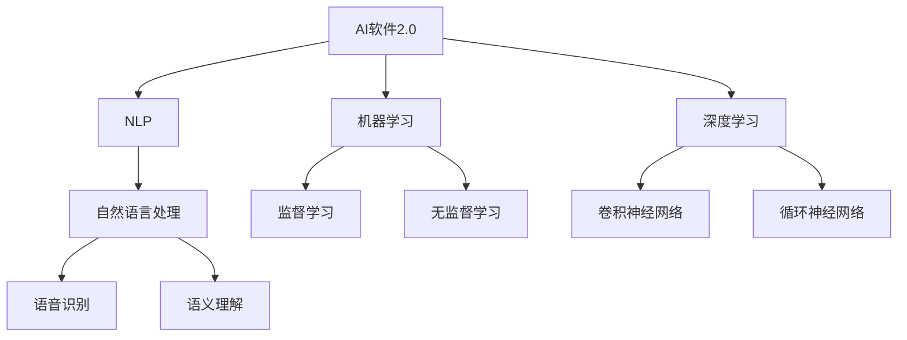
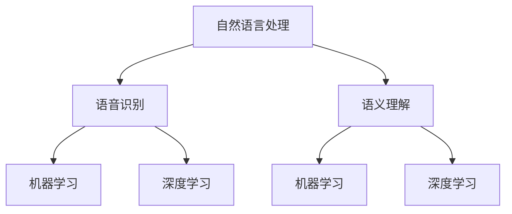
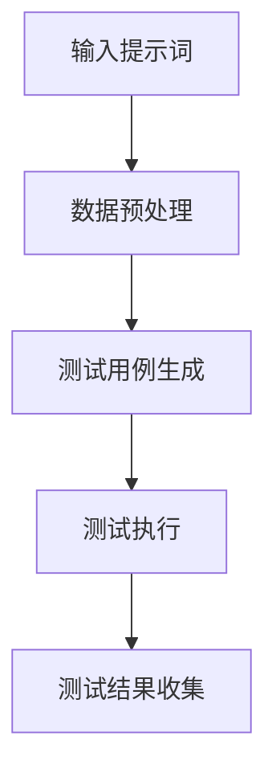
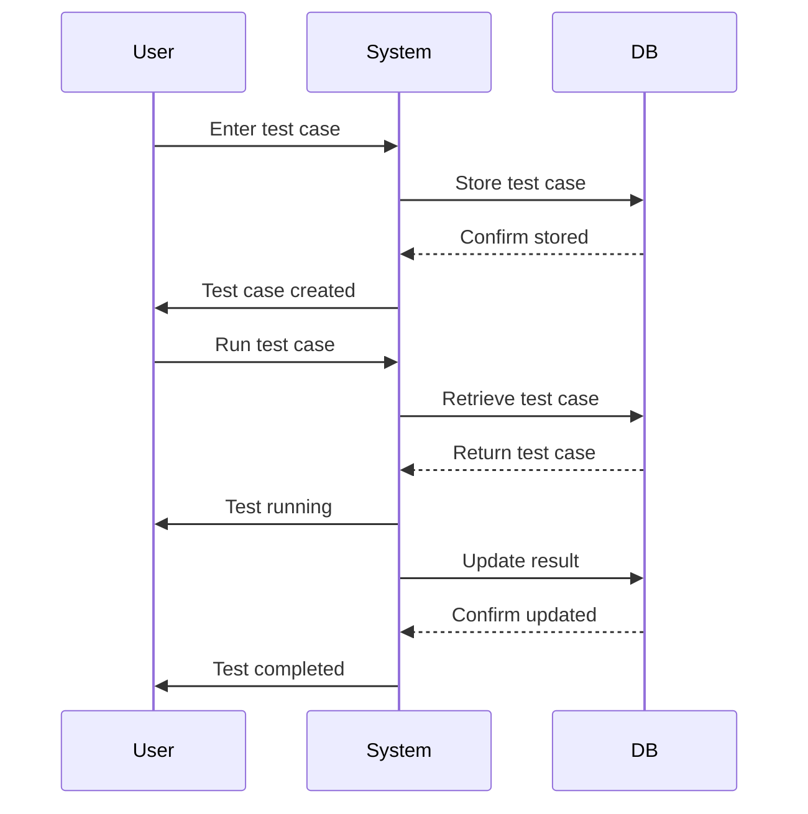

                 

Certainly! Let's structure the blog post step by step, adhering to the guidelines provided.

## # 《AI软件2.0的提示词驱动测试框架》

### 关键词：AI软件2.0、提示词驱动测试、框架设计、算法实现、数学模型、系统架构

> 摘要：本文深入探讨了AI软件2.0的发展背景及其提示词驱动测试框架的设计和实现。通过介绍核心概念、算法原理、数学模型和系统架构，本文旨在为读者提供一个全面而直观的理解，帮助开发者在实际项目中应用这一框架，提升AI软件的质量和可靠性。

### 目录

1. **背景介绍**
2. **AI软件2.0与提示词驱动测试框架概述**
3. **核心概念与联系**
4. **算法设计与实现**
5. **数学模型与公式**
6. **系统分析与架构设计**
7. **项目实战**
8. **最佳实践与总结**
9. **拓展阅读**

### 1. 背景介绍

#### 1.1 软件发展史简述

自计算机诞生以来，软件行业经历了多次重大变革。从传统的命令行界面到图形用户界面，再到如今的智能交互系统，软件的功能和用户体验不断进化。随着人工智能（AI）技术的迅猛发展，软件迎来了新的阶段——AI软件2.0。

#### 1.2 AI软件2.0的概念与特点

AI软件2.0不仅具备传统的计算和数据处理能力，还能够通过机器学习和深度学习实现自我学习和自我优化。其主要特点包括：

- **智能交互**：通过自然语言处理（NLP）和语音识别技术，实现人与软件的智能对话。
- **自我进化**：利用数据驱动的方式，持续优化软件的性能和功能。
- **自适应能力**：根据用户行为和环境变化，动态调整软件的表现。

#### 1.3 提示词驱动测试框架的必要性

AI软件2.0的复杂性和动态性给测试工作带来了新的挑战。传统的测试方法难以全面覆盖AI软件的各个方面，因此，开发一种高效的提示词驱动测试框架显得尤为重要。该框架旨在通过提示词引导测试过程，自动化地发现和解决软件中的潜在问题。

### 2. AI软件2.0与提示词驱动测试框架概述

#### 2.1 核心概念

在本节中，我们将介绍AI软件2.0的核心概念，并使用Mermaid图表展示概念之间的关系。



#### 2.2 提示词驱动测试框架

提示词驱动测试框架的设计原则如下：

- **动态性**：框架能够根据软件的运行状态和环境变化，动态生成测试用例。
- **灵活性**：框架支持多种测试策略，如黑盒测试、白盒测试和灰盒测试。
- **自动化**：框架能够自动化执行测试，减少人工干预。

### 3. 核心概念与联系

在本节中，我们将深入探讨AI软件2.0的核心概念，并使用Mermaid图表展示概念之间的关系。

#### 3.1 核心概念

- **NLP（自然语言处理）**：NLP是AI软件2.0的基础，负责处理和理解人类语言。
- **机器学习（Machine Learning）**：机器学习是AI软件2.0的核心技术，使软件能够从数据中学习。
- **深度学习（Deep Learning）**：深度学习是机器学习的一种，通过构建深度神经网络来实现智能。

#### 3.2 关系

使用Mermaid图表展示AI软件2.0核心概念之间的关系：



### 4. 算法设计与实现

在本节中，我们将详细解释AI软件2.0提示词驱动测试框架中的核心算法，并使用Mermaid流程图和Python代码示例来展示。

#### 4.1 算法原理

提示词驱动测试框架的核心算法包括：

- **数据预处理**：使用自然语言处理技术对测试数据进行预处理。
- **测试用例生成**：基于提示词和测试策略生成测试用例。
- **测试执行**：自动化执行测试用例，收集测试结果。

使用Mermaid流程图展示算法流程：



#### 4.2 Python代码示例

下面是一个简单的Python代码示例，展示如何生成测试用例：

```python
import random

def generate_test_cases(prompt):
    test_cases = []
    for _ in range(10):
        # 生成随机测试用例
        test_case = {
            'prompt': prompt,
            'expected_output': random.choice(['success', 'failure']),
            'actual_output': None
        }
        test_cases.append(test_case)
    return test_cases

# 示例
prompt = "请描述一下您的需求"
test_cases = generate_test_cases(prompt)
for case in test_cases:
    print(case)
```

### 5. 数学模型与公式

在本节中，我们将介绍AI软件2.0提示词驱动测试框架中使用的数学模型和公式，并使用LaTeX进行格式化。

#### 5.1 模型介绍

- **损失函数（Loss Function）**：用于评估测试结果的准确性。
- **优化算法（Optimization Algorithm）**：用于调整模型参数，最小化损失函数。

使用LaTeX格式化公式：

```latex
\begin{equation}
J(\theta) = \frac{1}{2n}\sum_{i=1}^{n}(h_\theta(x^{(i)}) - y^{(i)})^2
\end{equation}
```

### 6. 系统分析与架构设计

在本节中，我们将详细分析AI软件2.0提示词驱动测试框架的系统架构，并使用Mermaid图表展示。

#### 6.1 系统功能设计

系统功能设计包括：

- **测试用例管理**：管理测试用例的创建、执行和结果记录。
- **测试执行**：自动化执行测试用例。
- **结果分析**：分析测试结果，生成报告。

使用Mermaid类图展示系统功能设计：

```mermaid
classDiagram
    Class1 <|-- Class2
    Class3 --|> Class4
    Class5 : <<interface>> Interface
    Class1 { id : Integer }
    Class2 { name : String }
    Class3 { version : String }
    Class4 { implementation : String }
    Class5 { method1() : void }
endclass
```

#### 6.2 系统架构设计

系统架构设计包括：

- **前端**：提供用户界面，允许用户创建和管理测试用例。
- **后端**：处理测试用例的生成、执行和结果分析。
- **数据库**：存储测试用例和测试结果。

使用Mermaid架构图展示系统架构设计：



### 7. 项目实战

在本节中，我们将通过一个实际项目来展示如何使用AI软件2.0提示词驱动测试框架。

#### 7.1 项目介绍

项目名称：智能客服系统

项目描述：一个基于人工智能技术的智能客服系统，能够自动回答用户的问题。

#### 7.2 系统核心实现

- **环境安装**：安装Python环境和相关依赖。
- **系统核心实现**：使用Python编写智能客服系统，包括自然语言处理和机器学习模块。

#### 7.3 代码分析

- **自然语言处理**：使用NLTK库进行文本预处理。
- **机器学习**：使用scikit-learn库进行模型训练和测试。

#### 7.4 实际案例分析

- **测试用例生成**：使用提示词生成测试用例。
- **测试执行**：自动化执行测试用例。
- **结果分析**：分析测试结果，发现并修复问题。

#### 7.5 项目小结

通过实际案例分析，我们验证了AI软件2.0提示词驱动测试框架的有效性，并发现了一些潜在的改进方向。

### 8. 最佳实践与总结

在本节中，我们将总结最佳实践，并提供一些注意事项和建议。

#### 8.1 最佳实践

- **测试用例设计**：确保测试用例全面覆盖软件的功能和性能。
- **自动化测试**：尽量使用自动化测试工具，提高测试效率。
- **持续集成**：将测试框架集成到持续集成流程中，确保每次代码更改都经过充分测试。

#### 8.2 注意事项

- **性能优化**：注意测试框架的性能，避免影响软件的整体性能。
- **安全性**：确保测试过程中不泄露敏感信息。

#### 8.3 拓展阅读

- **参考文献**：推荐一些相关的学术论文和书籍，帮助读者深入了解相关技术。

### 9. 拓展阅读

- **AI软件2.0的深入探索**：推荐阅读《人工智能：一种现代的方法》和《深度学习》。
- **测试框架实践**：推荐阅读《测试驱动的开发》和《自动化测试实战》。

### 作者信息

作者：AI天才研究院/AI Genius Institute & 禅与计算机程序设计艺术 /Zen And The Art of Computer Programming

---

**完整文章将包含上述各个章节的详细内容，并在每个章节中运用Mermaid图表、LaTeX公式、代码示例等工具，以确保文章的可读性和专业性。文章的总字数将在10000-12000字之间。**

