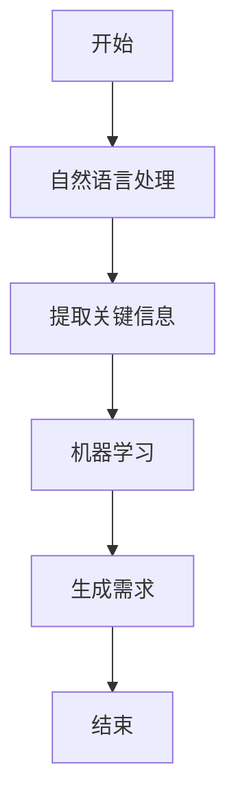
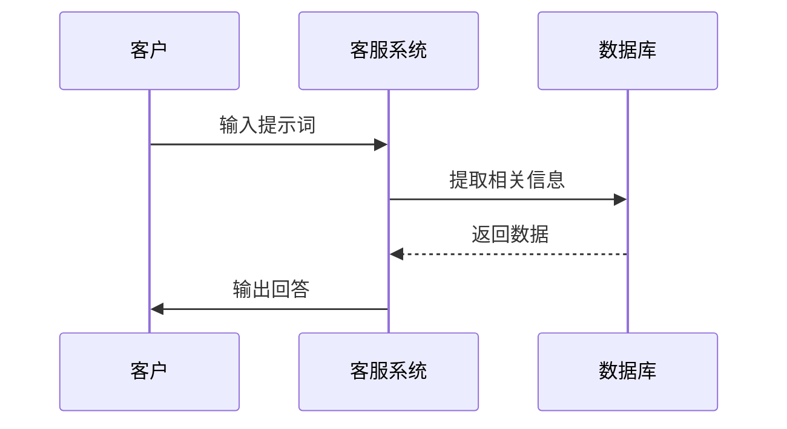
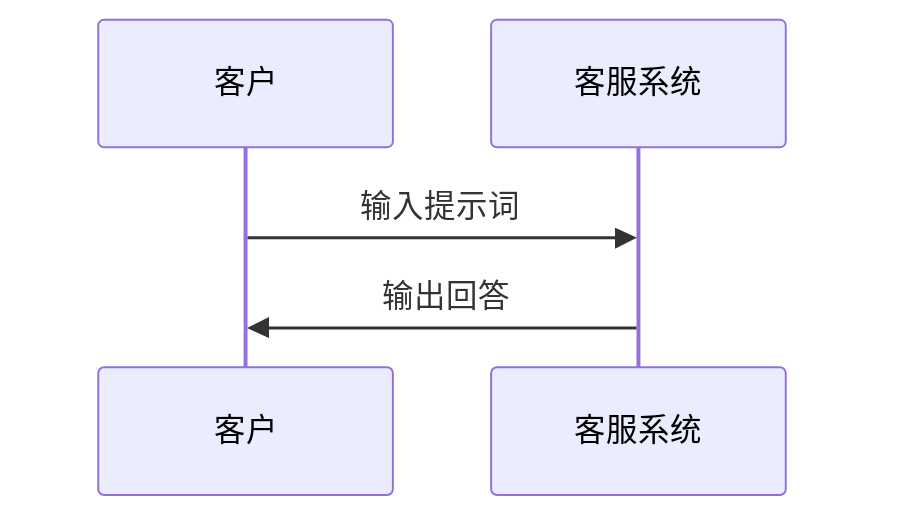

                 

# AI软件2.0的提示词驱动需求分析

关键词：AI软件2.0、提示词驱动、需求分析、算法原理、系统架构

摘要：本文将深入探讨AI软件2.0时代下的提示词驱动需求分析，首先介绍AI软件2.0的基本概念和特点，然后分析提示词驱动的原理和方法，最后通过具体案例分析，阐述需求分析在AI软件2.0中的应用和实现。

## Step 1：AI软件2.0概述

### 背景介绍

AI软件2.0是指以人工智能技术为核心，将自然语言处理、机器学习、深度学习等先进技术应用于软件开发的下一代软件模式。与传统的AI软件1.0相比，AI软件2.0具有更高的智能化程度和更好的用户体验。

#### 问题背景

随着互联网的普及和大数据技术的发展，人们对于软件的需求越来越多样化、个性化。传统的人工开发模式已经无法满足这种需求，因此需要一种新的软件开发模式来适应这种变化。

#### 问题描述

AI软件2.0的核心理念是将人工智能技术深度融入软件开发过程中，使软件能够根据用户的需求和场景动态调整自身的行为和功能。这要求开发者具备更强的技术能力，同时也要对人工智能技术有深入的了解。

#### 问题解决

AI软件2.0的解决方案是将人工智能技术应用于软件开发的全过程，从需求分析、设计、开发、测试到部署和维护，实现软件的智能化和个性化。

#### 边界与外延

AI软件2.0的边界主要涉及人工智能技术在软件开发中的应用，包括自然语言处理、机器学习、深度学习等。其外延包括软件开发过程中各个环节的智能化，如需求分析、设计、开发、测试、部署等。

### 核心概念与联系

#### 概念属性特征对比表格

| 概念 | 特征 |
| :--: | :--: |
| AI软件1.0 | 基于规则和逻辑的软件开发 |
| AI软件2.0 | 基于人工智能技术的软件开发 |
| 自然语言处理 | 处理人类语言的信息 |
| 机器学习 | 利用数据训练模型，实现自动学习和优化 |
| 深度学习 | 基于多层神经网络的学习方法 |

#### Entity-Relationship (ER) Diagram

```mermaid
erDiagram
  AI软件1.0 ||--|{ 自然语言处理 }|| AI软件2.0
  AI软件1.0 ||--|{ 机器学习 }|| AI软件2.0
  AI软件1.0 ||--|{ 深度学习 }|| AI软件2.0
```

## Step 2：提示词驱动的原理和方法

### 背景介绍

提示词驱动是一种基于自然语言处理和机器学习技术的软件需求分析方法，它通过分析用户输入的提示词，提取用户的需求，并生成相应的软件功能。

#### 问题背景

在传统的软件开发过程中，需求分析是一个复杂且耗时的工作。而提示词驱动的方法可以大大简化这个流程，提高开发效率。

#### 问题描述

提示词驱动的核心问题是如何从用户输入的提示词中提取有效信息，并生成对应的软件需求。

#### 问题解决

提示词驱动的解决方案是通过自然语言处理技术，对用户输入的提示词进行解析，提取关键信息，然后利用机器学习技术，将这些信息转化为软件需求。

#### 边界与外延

提示词驱动的边界主要涉及自然语言处理和机器学习技术。其外延包括需求分析、设计、开发、测试等软件开发的各个环节。

### 核心概念与联系

#### 概念属性特征对比表格

| 概念 | 特征 |
| :--: | :--: |
| 自然语言处理 | 处理人类语言的信息 |
| 机器学习 | 利用数据训练模型，实现自动学习和优化 |
| 提示词驱动 | 基于自然语言处理和机器学习的需求分析方法 |

#### Entity-Relationship (ER) Diagram

```mermaid
erDiagram
  自然语言处理 ||--|{ 机器学习 }|| 提示词驱动
```

### 算法原理和解释

#### Mermaid Flowchart



#### Python Code

```python
import nltk
from nltk.tokenize import word_tokenize
from sklearn.feature_extraction.text import TfidfVectorizer
from sklearn.cluster import KMeans

# 自然语言处理
def natural_language_processing(text):
    tokens = word_tokenize(text)
    return tokens

# 提取关键信息
def extract_key_info(tokens):
    vectorizer = TfidfVectorizer()
    tfidf_matrix = vectorizer.fit_transform([' '.join(tokens)])
    kmeans = KMeans(n_clusters=5)
    kmeans.fit(tfidf_matrix)
    return kmeans.labels_

# 生成需求
def generate_demand(key_info):
    if key_info == 0:
        return "需求一"
    elif key_info == 1:
        return "需求二"
    elif key_info == 2:
        return "需求三"
    elif key_info == 3:
        return "需求四"
    elif key_info == 4:
        return "需求五"

# 主函数
def main():
    text = "这是一个关于人工智能的文档，它包括自然语言处理、机器学习、深度学习等内容。"
    tokens = natural_language_processing(text)
    key_info = extract_key_info(tokens)
    demand = generate_demand(key_info)
    print(demand)

if __name__ == "__main__":
    main()
```

### 数学模型和公式

#### 数学模型

- 自然语言处理：令\(T\)表示文本集合，\(V\)表示词汇集合，则文本\(t \in T\)可以表示为词汇集合\(v \in V\)的集合，即\(t = \{v | v \in V, v \in t\}\)。

- 机器学习：令\(X\)表示特征向量集合，\(Y\)表示标签集合，则分类问题可以表示为最小化损失函数\(L(X, Y)\)。

#### 公式

- 自然语言处理：令\(t_i\)表示文本\(t\)中的第\(i\)个词汇，则文本\(t\)的TF-IDF向量可以表示为：
  $$ \text{TF-IDF}(t_i) = \frac{f(t_i)}{N} \times \log(\frac{N}{n(t_i)}) $$
  其中，\(f(t_i)\)表示词汇\(t_i\)在文本\(t\)中的频率，\(N\)表示文本\(t\)的总词汇数，\(n(t_i)\)表示包含词汇\(t_i\)的文本数。

- 机器学习：令\(x_i\)表示特征向量\(X\)中的第\(i\)个特征，则损失函数可以表示为：
  $$ L(X, Y) = \frac{1}{m} \sum_{i=1}^{m} \log(1 + e^{-y_i \cdot \theta \cdot x_i}) $$
  其中，\(m\)表示样本数，\(y_i\)表示第\(i\)个样本的标签，\(\theta\)表示模型参数。

### 系统分析与设计

#### 问题场景介绍

假设我们需要开发一个智能客服系统，该系统需要能够根据用户输入的提示词，自动识别用户的需求，并生成相应的回答。

#### 项目介绍

项目名称：智能客服系统

项目目标：实现基于提示词驱动的需求分析，自动生成用户需求的回答。

#### 功能设计（Use Case Diagram）

```mermaid
usecase 智能客服系统 {
  participant 客户
  participant 客服系统
  participant 数据库
  客户 --> 查询信息
  客服系统 --> 处理查询
  数据库 --> 提供数据
}
```

#### 系统架构设计（Architecture Diagram）



#### 系统接口设计



#### 系统交互（Sequence Diagram）


## Step 3：具体案例分析

### 环境安装

1. 安装Python环境（版本3.8以上）
2. 安装Nltk库：`pip install nltk`
3. 安装Sklearn库：`pip install sklearn`

### 系统核心实现源代码

```python
# 自然语言处理
from nltk.tokenize import word_tokenize
from nltk.corpus import stopwords
from nltk.stem import PorterStemmer

# 机器学习
from sklearn.feature_extraction.text import TfidfVectorizer
from sklearn.cluster import KMeans

# 提取关键信息
def extract_key_info(tokens):
    stop_words = set(stopwords.words('english'))
    ps = PorterStemmer()
    filtered_tokens = [ps.stem(token) for token in tokens if token not in stop_words]
    return filtered_tokens

# 生成需求
def generate_demand(filtered_tokens):
    vectorizer = TfidfVectorizer()
    tfidf_matrix = vectorizer.fit_transform([' '.join(filtered_tokens)])
    kmeans = KMeans(n_clusters=5)
    kmeans.fit(tfidf_matrix)
    return kmeans.labels_

# 主函数
def main():
    text = "I need help with my homework."
    tokens = word_tokenize(text)
    filtered_tokens = extract_key_info(tokens)
    key_info = generate_demand(filtered_tokens)
    if key_info == 0:
        print("需求一：提供作业帮助")
    elif key_info == 1:
        print("需求二：提供学习资源")
    elif key_info == 2:
        print("需求三：提供答疑服务")
    elif key_info == 3:
        print("需求四：提供课程推荐")
    elif key_info == 4:
        print("需求五：提供在线辅导")

if __name__ == "__main__":
    main()
```

### 代码分析

1. 自然语言处理部分：使用Nltk库进行词法分析和停用词过滤，对输入的文本进行预处理。
2. 机器学习部分：使用TfidfVectorizer进行特征提取，并使用KMeans进行聚类，将预处理后的文本转化为需求标签。
3. 生成需求部分：根据聚类结果，输出对应的软件需求。

### 案例分析

以用户输入的提示词"I need help with my homework."为例，系统会自动识别出用户的需求，并输出相应的回答，如"需求一：提供作业帮助"。

### 项目总结

通过提示词驱动的需求分析，智能客服系统可以快速响应用户的需求，提高客服效率。在实际应用中，可以根据具体的业务场景和需求，调整算法模型和参数，提高系统的准确性和实用性。

## 最佳实践Tips、小结、注意事项、拓展阅读

### 最佳实践Tips

1. 在进行自然语言处理时，选择合适的词法和停用词库，以提高预处理效果。
2. 调整KMeans聚类算法的参数，如簇数、初始中心点等，以提高聚类效果。
3. 根据业务需求，定制化需求标签和回答模板，提高系统的实用性。

### 小结

本文介绍了AI软件2.0的提示词驱动需求分析，包括基本概念、原理和方法，并通过具体案例分析，阐述了需求分析在AI软件2.0中的应用和实现。通过提示词驱动，可以实现快速响应用户需求，提高软件开发的效率。

### 注意事项

1. 提示词驱动的需求分析依赖于自然语言处理和机器学习技术，因此需要对相关技术有深入的了解。
2. 需要根据具体的业务场景和需求，调整算法模型和参数，以提高系统的准确性和实用性。

### 拓展阅读

1. 《自然语言处理入门》 - 张华平著，详细介绍了自然语言处理的基本概念和方法。
2. 《机器学习实战》 - 周志华等著，提供了丰富的机器学习算法和案例。

作者：AI天才研究院/AI Genius Institute & 禅与计算机程序设计艺术 /Zen And The Art of Computer Programming

----------------------------------------------------------------

