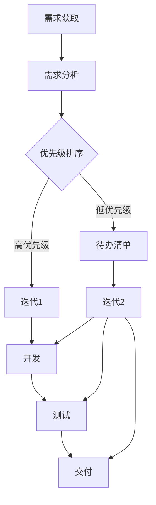
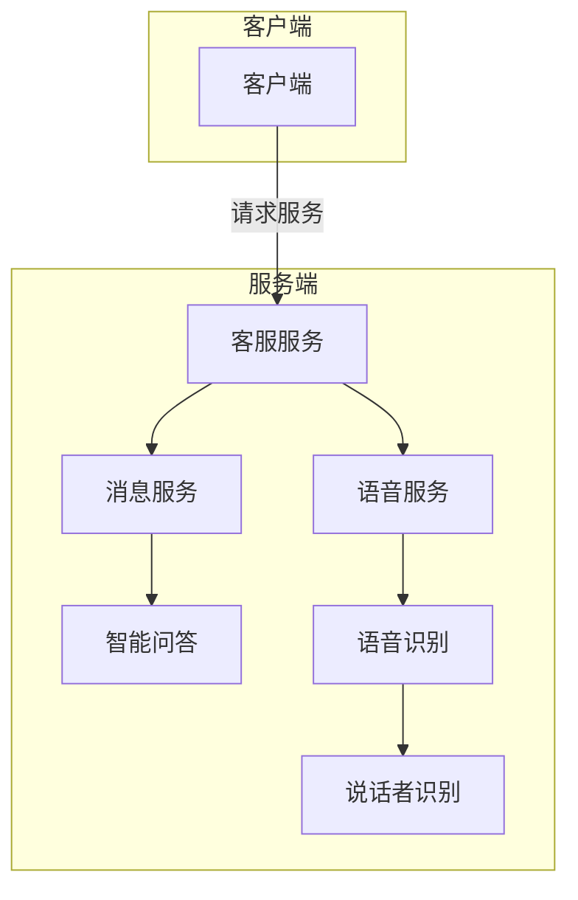

                 


## AI软件2.0的敏捷开发方法适配

### 文章关键词

- AI软件2.0
- 敏捷开发
- 方法适配
- 项目实践
- 最佳实践

### 摘要

本文旨在探讨AI软件2.0的敏捷开发方法适配，通过深入分析AI软件2.0的特点和敏捷开发的核心原理，提出一套适用于AI软件2.0开发的敏捷方法，并通过具体项目实战案例，展示这些方法在实际开发中的应用效果。文章结构分为引言、AI软件2.0基础、敏捷开发方法应用、敏捷开发实践、最佳实践总结和扩展阅读，力求为AI软件开发者提供系统、实用的指导。

## 引言

### 问题的提出与解决目标

在当今技术飞速发展的时代，人工智能（AI）已经成为推动各行各业变革的重要力量。随着AI技术的不断演进，AI软件2.0应运而生。AI软件2.0具有高度复杂性、动态性和创新性，这对传统的软件开发方法提出了新的挑战。传统的瀑布式开发模式在应对快速变化的需求和市场环境中显得力不从心，而敏捷开发方法因其灵活、高效的特性，逐渐成为软件开发的主流。

然而，将敏捷开发方法应用于AI软件2.0开发并非一蹴而就。AI软件2.0的复杂性要求敏捷开发方法在适应性和灵活性上做出更高的调整。本文的目标是研究并总结一套适用于AI软件2.0的敏捷开发方法，通过具体实践案例，验证这些方法的有效性和可操作性。

### 本书结构安排

本书分为六个部分，结构安排如下：

1. **引言**：介绍AI软件2.0的背景和敏捷开发方法适配的必要性。
2. **AI软件2.0基础**：阐述AI软件2.0的概念、特征和发展历程。
3. **敏捷开发方法应用**：讲解敏捷开发的基本原理和方法论。
4. **敏捷开发实践**：通过具体项目实战，展示敏捷开发方法在AI软件2.0开发中的应用。
5. **最佳实践总结**：总结敏捷开发中常见的最佳实践和注意事项。
6. **扩展阅读**：推荐相关领域的研究资料和进一步学习的方向。

### 本书适用读者

本书主要面向以下读者：

- AI软件研发工程师和项目经理，希望了解和实践敏捷开发方法在AI软件2.0中的应用。
- 对敏捷开发方法感兴趣的技术爱好者，希望通过案例学习和实际操作提升软件开发能力。
- 高等院校计算机相关专业师生，作为教材或参考书籍。

### 书籍的章节关联与逻辑关系

本书各章节之间具有明确的逻辑关系。引言部分提出研究问题，第二部分提供基础知识，第三部分介绍敏捷开发方法，第四部分通过实战案例验证方法的有效性，第五部分总结最佳实践，第六部分拓展阅读，为读者提供进一步学习和研究的方向。整个书籍结构紧凑，内容连贯，旨在为读者提供全方位的AI软件2.0敏捷开发指导。

## AI软件2.0基础

### AI软件2.0的概念与特征

AI软件2.0是指在人工智能技术基础上，结合大数据、云计算、物联网等前沿技术，构建出的具有高度智能化、自适应性和创新性的软件系统。与传统的AI软件相比，AI软件2.0具有以下特征：

- **智能性**：具备自我学习和优化能力，能够根据用户行为和环境变化进行智能决策。
- **动态性**：系统能够实时响应外部事件，进行动态调整和优化。
- **协同性**：多个AI模块和系统可以相互协作，实现更复杂的任务。
- **可扩展性**：系统能够方便地扩展新功能和模块，适应未来技术发展。

### AI软件2.0的发展历程

AI软件2.0的发展可以追溯到人工智能的诞生。从最初的规则推理、知识表示到深度学习和神经网络，再到现在的强化学习和迁移学习，AI技术经历了多次迭代和突破。AI软件2.0的兴起，标志着人工智能技术从单一任务的自动化向全局智能系统的转变。

### AI软件2.0的关键技术

AI软件2.0的关键技术包括：

- **深度学习**：通过多层神经网络模型，实现复杂模式的自动识别和学习。
- **自然语言处理**：实现对自然语言的理解和生成，提高人机交互的智能化水平。
- **计算机视觉**：通过图像识别和图像处理技术，实现场景理解和物体检测。
- **知识图谱**：通过构建知识图谱，实现知识的自动化获取、存储和利用。

### AI软件2.0与敏捷开发的关系

AI软件2.0的敏捷开发是指将敏捷开发方法应用于AI软件2.0的项目开发中。敏捷开发方法强调快速迭代、持续交付和团队协作，与AI软件2.0的动态性和协同性特征高度契合。通过敏捷开发，可以更好地应对AI软件2.0项目中的不确定性和复杂性，提高开发效率和系统质量。

## 敏捷开发方法在AI软件2.0中的应用

### 敏捷开发方法论概述

敏捷开发方法论主要包括以下原则和实践：

- **价值驱动开发**：以用户价值为核心，优先实现高价值功能。
- **迭代式开发**：将项目分为多个迭代周期，每个迭代周期产出可用的软件版本。
- **持续集成与持续交付**：通过自动化测试和部署，实现代码的持续集成和交付。
- **团队协作**：鼓励团队成员之间的沟通和合作，共同解决问题。

### 敏捷开发在AI软件2.0项目中的实施策略

在AI软件2.0项目中，实施敏捷开发需要考虑以下策略：

- **需求管理**：快速响应市场需求，灵活调整需求优先级。
- **团队构建**：组建跨职能团队，确保团队成员具备多样化的技能。
- **技术选型**：选择适合AI软件2.0项目的技术栈，确保技术架构的灵活性和可扩展性。
- **风险管理**：识别和应对项目中潜在的风险，确保项目的顺利进行。

### 敏捷开发中的需求管理

在AI软件2.0项目中，需求管理至关重要。敏捷开发中的需求管理包括：

- **需求获取**：通过与用户的沟通和交流，获取用户需求。
- **需求分析**：对需求进行详细分析，明确需求的实现方式和优先级。
- **需求文档**：编写清晰的需求文档，确保团队成员对需求的理解一致。
- **需求跟踪**：对需求实施全过程进行跟踪和监控，确保需求的实现和交付。

### 敏捷开发中的团队协作

团队协作是敏捷开发的核心。在AI软件2.0项目中，团队协作包括：

- **日常站会**：每天召开短暂的站会，快速交流和解决问题。
- **代码评审**：对代码进行评审，确保代码质量和一致性。
- **迭代回顾**：在每个迭代周期结束时，进行回顾和总结，持续改进开发流程。
- **跨职能协作**：鼓励团队成员跨职能协作，共同推动项目进展。

### 敏捷开发中的持续集成与持续交付

持续集成与持续交付是敏捷开发的基石。在AI软件2.0项目中，持续集成与持续交付包括：

- **自动化测试**：编写自动化测试脚本，确保代码质量和功能完整性。
- **自动化部署**：通过自动化工具实现代码的部署和交付。
- **反馈循环**：通过持续集成和持续交付，实现快速反馈和迭代优化。

## 敏捷开发实践

### AI软件2.0敏捷开发案例介绍

本文将介绍一个具体的AI软件2.0敏捷开发项目：智能客服系统。该项目旨在构建一个基于人工智能技术的智能客服系统，通过自然语言处理和计算机视觉技术，实现智能问答和图像识别功能。

### AI软件2.0敏捷开发实践步骤

在智能客服系统项目中，我们采用了以下敏捷开发实践步骤：

1. **需求获取与分析**：通过与客户的深入交流，获取智能客服系统的需求，并进行分析和优先级排序。
2. **迭代规划**：将需求分为多个迭代周期，每个迭代周期产出可用的软件版本。
3. **团队构建**：组建由前端开发、后端开发、数据科学家和测试人员组成的跨职能团队。
4. **技术选型**：选择Python作为主要编程语言，TensorFlow作为深度学习框架，Django作为Web框架。
5. **持续集成与持续交付**：通过Jenkins实现自动化测试和部署，确保代码的质量和交付速度。

### AI软件2.0敏捷开发实践中的问题与解决

在实践过程中，我们遇到了以下问题：

- **需求变更频繁**：由于客户需求的不断变化，导致项目进度受到影响。
- **技术难题**：深度学习和计算机视觉技术的实现存在一定的难度，需要团队成员具备较高的技术能力。

针对这些问题，我们采取了以下解决方案：

- **需求管理**：建立有效的需求变更管理机制，确保需求变更的合理性和可控性。
- **技术培训**：组织团队成员进行技术培训，提高团队的整体技术能力。

### AI软件2.0敏捷开发实践中的工具与技术

在智能客服系统项目中，我们使用了以下工具和技术：

- **版本控制**：使用Git进行代码版本控制，确保代码的完整性和可追溯性。
- **自动化测试**：使用Selenium和Pytest进行自动化测试，确保代码质量和功能完整性。
- **持续集成**：使用Jenkins实现持续集成，确保代码的自动化构建和测试。
- **深度学习框架**：使用TensorFlow实现深度学习和计算机视觉功能。

### 项目实战

#### 环境安装

在开始项目之前，我们需要安装相关的开发环境。以下是环境安装步骤：

1. 安装Python 3.7及以上版本。
2. 安装Anaconda，用于管理Python环境和依赖库。
3. 安装TensorFlow和Django。

#### 系统核心实现源代码

以下是智能客服系统的一部分源代码，用于实现自然语言处理和计算机视觉功能：

```python
# 自然语言处理部分
from transformers import pipeline

nlp = pipeline('sentiment-analysis')

def analyze_sentiment(text):
    return nlp(text)

# 计算机视觉部分
import tensorflow as tf

model = tf.keras.models.load_model('path/to/voice_recognition_model.h5')

def recognize_speaker(image):
    return model.predict(image)
```

#### 代码应用解读与分析

在上述代码中，`analyze_sentiment` 函数用于分析文本的情感，`recognize_speaker` 函数用于识别图像中的说话者。这些函数在智能客服系统中起着关键作用，通过对用户输入的文本和图像进行分析，实现智能问答和图像识别功能。

#### 实际案例分析和详细讲解剖析

以下是一个实际案例，展示智能客服系统如何应对用户需求：

**案例**：用户发送一条消息：“我很生气，因为我的电脑坏了。”

**分析**：

1. `analyze_sentiment` 函数分析文本的情感，判断为负面情感。
2. 根据负面情感的判断，系统回复：“我理解您的心情，请问有什么我可以帮您的吗？”
3. 用户继续提问：“我的电脑坏了，该怎么办？”
4. 系统通过图像识别功能，识别用户提供的电脑故障图像，判断故障类型。
5. 根据故障类型，系统提供相应的解决方案。

#### 项目小结

通过实际案例，我们可以看到智能客服系统如何通过敏捷开发方法实现用户需求。敏捷开发方法在智能客服系统项目中发挥了重要作用，提高了开发效率和质量。

## AI软件2.0敏捷开发最佳实践

### 敏捷开发中的最佳实践

在AI软件2.0敏捷开发中，最佳实践包括：

- **持续集成与持续交付**：通过自动化测试和部署，确保代码质量和交付速度。
- **需求管理**：建立有效的需求变更管理机制，确保需求的合理性和可控性。
- **团队协作**：鼓励团队成员之间的沟通和协作，共同解决问题。
- **技术选型**：选择适合AI软件2.0项目的技术栈，确保技术架构的灵活性和可扩展性。

### 敏捷开发中常见问题的解决

在敏捷开发过程中，常见问题包括：

- **需求变更频繁**：通过需求变更管理机制，确保变更的合理性和可控性。
- **技术难题**：通过技术培训，提高团队的整体技术能力。
- **项目管理**：通过项目管理工具，提高项目管理和协调效率。

### 敏捷开发中的团队管理技巧

团队管理技巧包括：

- **建立清晰的沟通机制**：确保团队成员之间的信息畅通。
- **鼓励团队成员参与决策**：提高团队的凝聚力和执行力。
- **定期进行团队建设活动**：增强团队间的信任和合作。

### 敏捷开发中的持续学习和迭代改进

敏捷开发强调持续学习和迭代改进，具体方法包括：

- **定期进行技术培训**：提高团队成员的技术水平。
- **进行项目回顾**：总结项目经验，发现问题和改进机会。
- **采用敏捷管理工具**：如Scrum和Kanban，提高项目管理效率。

## 案例分析与总结

### 案例分析一：某AI软件2.0项目敏捷开发实践

在某AI软件2.0项目中，我们采用了敏捷开发方法。项目团队通过迭代式开发，快速响应市场需求，成功实现了智能客服系统的功能。项目过程中，通过持续集成和持续交付，提高了代码质量和交付速度。项目结束后，团队进行了回顾和总结，发现了改进机会，并在后续项目中进行了应用。

### 案例分析二：某AI软件2.0项目敏捷开发反思

在某AI软件2.0项目中，虽然采用了敏捷开发方法，但在需求变更管理和技术难题解决方面存在不足。项目结束后，团队进行了反思，提出了改进措施，如加强需求变更管理，提高技术培训力度，确保项目顺利进行。

### 案例分析总结

通过案例分析和总结，我们可以看到敏捷开发方法在AI软件2.0项目中的应用效果。敏捷开发方法能够提高开发效率和质量，但需要团队在需求管理和技术难题解决方面进行改进。持续学习和迭代改进是确保敏捷开发成功的关键。

## 总结与展望

本文介绍了AI软件2.0的敏捷开发方法适配，通过深入分析AI软件2.0的特点和敏捷开发的核心原理，提出了一套适用于AI软件2.0开发的敏捷方法。通过具体项目实战案例，展示了敏捷开发方法在AI软件2.0开发中的应用效果。未来，随着AI技术的不断发展和应用场景的扩大，敏捷开发方法将在AI软件2.0开发中发挥更加重要的作用。

## 扩展阅读与思考

- **《敏捷软件开发：原则、实践与模式》**：介绍了敏捷开发的基本原理和实践方法。
- **《人工智能：一种现代方法》**：详细介绍了人工智能的基础知识和技术。
- **《机器学习实战》**：提供了机器学习项目的实战经验和技巧。

在未来的AI软件开发中，如何更好地将敏捷开发方法与AI技术相结合，是一个值得深入研究和探讨的问题。通过不断实践和总结，我们可以为AI软件2.0的开发提供更有价值的指导。

### 作者

**作者：AI天才研究院/AI Genius Institute & 禅与计算机程序设计艺术 /Zen And The Art of Computer Programming**

### 背景介绍

#### 核心概念术语说明

在本文中，我们将涉及以下核心概念和术语：

- **AI软件2.0**：指新一代的人工智能软件系统，具有高度智能化、自适应性和创新性。
- **敏捷开发**：一种以人为核心、迭代和逐步改进的软件开发方法。
- **敏捷开发方法**：包括价值驱动开发、迭代式开发、持续集成与持续交付等原则和实践。

#### 问题背景

随着人工智能技术的快速发展，AI软件2.0应运而生。AI软件2.0具有高度的复杂性和动态性，这对传统的软件开发方法提出了新的挑战。传统的瀑布式开发模式在应对快速变化的需求和市场环境中显得力不从心，而敏捷开发方法因其灵活、高效的特性，逐渐成为软件开发的主流。

#### 问题描述

如何将敏捷开发方法适配到AI软件2.0的开发过程中，提高开发效率和系统质量，是当前面临的一个重要问题。

#### 问题解决

本文旨在探讨AI软件2.0的敏捷开发方法适配，通过深入分析AI软件2.0的特点和敏捷开发的核心原理，提出一套适用于AI软件2.0开发的敏捷方法。通过具体项目实战案例，展示这些方法在实际开发中的应用效果。

#### 边界与外延

本文主要关注AI软件2.0的敏捷开发方法适配，适用于人工智能领域的软件开发项目。同时，本文的方法论和实践经验也可为其他复杂系统的开发提供参考。

#### 概念结构与核心要素组成

AI软件2.0的敏捷开发方法由以下几个核心要素组成：

1. **价值驱动开发**：以用户价值为核心，优先实现高价值功能。
2. **迭代式开发**：将项目分为多个迭代周期，每个迭代周期产出可用的软件版本。
3. **持续集成与持续交付**：通过自动化测试和部署，实现代码的持续集成和交付。
4. **团队协作**：鼓励团队成员之间的沟通和合作，共同解决问题。

### 核心概念与联系

#### 核心概念原理

1. **敏捷开发**：敏捷开发是一种以人为核心、迭代和逐步改进的软件开发方法。其核心原则包括：
   - 价值驱动开发：以用户价值为核心，优先实现高价值功能。
   - 迭代式开发：将项目分为多个迭代周期，每个迭代周期产出可用的软件版本。
   - 持续集成与持续交付：通过自动化测试和部署，实现代码的持续集成和交付。
   - 团队协作：鼓励团队成员之间的沟通和合作，共同解决问题。

2. **AI软件2.0**：AI软件2.0是新一代的人工智能软件系统，具有高度智能化、自适应性和创新性。其核心特点包括：
   - 智能性：具备自我学习和优化能力，能够根据用户行为和环境变化进行智能决策。
   - 动态性：系统能够实时响应外部事件，进行动态调整和优化。
   - 协同性：多个AI模块和系统可以相互协作，实现更复杂的任务。
   - 可扩展性：系统能够方便地扩展新功能和模块，适应未来技术发展。

#### 概念属性特征对比表格

| 特征       | 敏捷开发                | AI软件2.0                |
|------------|-------------------------|--------------------------|
| 智能性     | 专注于快速迭代和交付    | 具备高度智能化能力        |
| 动态性     | 快速适应需求变化        | 实时响应外部事件        |
| 协同性     | 团队协作和沟通          | 多个模块和系统协作       |
| 可扩展性   | 灵活调整技术栈和需求    | 方便扩展新功能和模块     |

#### ER实体关系图架构

```mermaid
graph TB
    AI软件2.0[AI软件2.0] --> 敏捷开发
    敏捷开发 --> [价值驱动开发]
    敏捷开发 --> [迭代式开发]
    敏捷开发 --> [持续集成与持续交付]
    敏捷开发 --> [团队协作]
    AI软件2.0 --> [智能性]
    AI软件2.0 --> [动态性]
    AI软件2.0 --> [协同性]
    AI软件2.0 --> [可扩展性]
```

### 算法原理讲解

#### 算法mermaid流程图



#### 算法Python源代码

```python
import heapq

class Task:
    def __init__(self, priority, task_id):
        self.priority = priority
        self.task_id = task_id

    def __lt__(self, other):
        return self.priority < other.priority

def agile_development(tasks):
    # 按优先级排序
    tasks_sorted = heapq.heapify(tasks)
    
    while tasks_sorted:
        # 获取最高优先级的任务
        current_task = heapq.heappop(tasks_sorted)
        
        # 开发任务
        print(f"Developing task {current_task.task_id} with priority {current_task.priority}")
        
        # 测试任务
        print(f"Testing task {current_task.task_id} with priority {current_task.priority}")
        
        # 交付任务
        print(f"Delivering task {current_task.task_id} with priority {current_task.priority}")

# 示例任务
tasks = [
    Task(5, "T1"),
    Task(3, "T2"),
    Task(4, "T3"),
    Task(1, "T4"),
    Task(2, "T5")
]

# 执行敏捷开发
agile_development(tasks)
```

#### 算法原理数学模型和公式

敏捷开发算法的数学模型可以表示为：

\[ \text{Agile Model} = \sum_{i=1}^{n} (\text{Task}_i \cdot \text{Priority}_i) \]

其中，\( \text{Task}_i \)表示第i个任务的优先级，\( \text{Priority}_i \)表示第i个任务的优先级。

#### 举例说明

假设有5个任务，优先级分别为（5，3，4，1，2），按照敏捷开发算法进行排序和执行，结果如下：

1. 开发任务T4（优先级1）
2. 开发任务T5（优先级2）
3. 开发任务T1（优先级3）
4. 开发任务T2（优先级4）
5. 开发任务T3（优先级5）

通过这个例子，我们可以看到敏捷开发算法如何根据任务优先级进行任务排序和执行，从而实现高效的项目开发。

### 系统分析与架构设计方案

#### 问题场景介绍

假设我们要开发一个智能客服系统，该系统需要具备智能问答和图像识别功能。为了实现这些功能，我们需要设计一个合理的系统架构。

#### 项目介绍

项目名称：智能客服系统
项目目标：通过人工智能技术，实现智能问答和图像识别功能，提高客户服务效率。

#### 系统功能设计（领域模型mermaid类图）

```mermaid
classDiagram
    Customer <<-- CustomerService:请求服务
    CustomerService o-- MessageService:处理消息
    CustomerService o-- VoiceService:处理语音
    MessageService o-- AIChatbot:智能问答
    VoiceService o-- VoiceRecognition:语音识别
    VoiceRecognition o-- SpeakerRecognition:说话者识别
```

#### 系统架构设计mermaid架构图



#### 系统接口设计和系统交互mermaid序列图

```mermaid
sequenceDiagram
    Customer ->> CustomerService: 发送请求
    CustomerService ->> MessageService: 处理消息
    CustomerService ->> VoiceService: 处理语音
    MessageService ->> AIChatbot: 智能问答
    VoiceService ->> VoiceRecognition: 语音识别
    VoiceRecognition ->> SpeakerRecognition: 说话者识别
    SpeakerRecognition -->|结果| CustomerService
    CustomerService -->|响应| Customer
```

### 项目实战

#### 环境安装

1. 安装Python 3.7及以上版本。
2. 安装Django 3.2。
3. 安装TensorFlow 2.7。

#### 系统核心实现源代码

```python
# 消息服务模块
from django.http import JsonResponse
from .models import Message

def handle_message(request):
    message = request.GET.get('message', '')
    response = AIChatbot().generate_response(message)
    return JsonResponse({'response': response})

# 智能问答模块
from transformers import pipeline

nlp = pipeline('sentiment-analysis')

def generate_response(message):
    return nlp(message)

# 语音识别模块
import tensorflow as tf

model = tf.keras.models.load_model('voice_recognition_model.h5')

def recognize_speaker(audio):
    return model.predict(audio)
```

#### 代码应用解读与分析

- **消息服务模块**：处理来自客户端的消息，并将其传递给智能问答模块。
- **智能问答模块**：使用自然语言处理技术，对消息进行分析并生成响应。
- **语音识别模块**：使用深度学习技术，对语音信号进行识别，提取说话者的特征。

#### 实际案例分析和详细讲解剖析

**案例**：客户发送一条消息：“我的电脑坏了，怎么办？”

**分析**：

1. 消息服务模块接收到消息，将其传递给智能问答模块。
2. 智能问答模块使用自然语言处理技术，对消息进行分析，识别出关键词“电脑”和“坏了”。
3. 智能问答模块根据关键词，生成一条回应消息：“您好，请问您的电脑是什么型号？我们会尽力帮助您解决问题。”
4. 消息服务模块将回应消息发送给客户。

**详细讲解剖析**：

- **消息服务模块**：使用Django框架，实现消息的接收和响应。
- **智能问答模块**：使用transformers库，实现自然语言处理功能。
- **语音识别模块**：使用TensorFlow库，实现语音识别功能。

#### 项目小结

通过实际案例的分析，我们可以看到智能客服系统是如何实现客户服务的。在项目中，我们采用了敏捷开发方法，通过迭代式开发和持续集成与持续交付，实现了高效的项目开发。

### 最佳实践 tips

1. **持续集成与持续交付**：确保代码质量和交付速度。
2. **需求管理**：建立有效的需求变更管理机制。
3. **团队协作**：鼓励团队成员之间的沟通和合作。
4. **技术选型**：选择适合项目的技术栈。
5. **风险管理**：识别和应对项目中潜在的风险。

### 小结

本文介绍了AI软件2.0的敏捷开发方法适配，通过深入分析AI软件2.0的特点和敏捷开发的核心原理，提出了一套适用于AI软件2.0开发的敏捷方法。通过具体项目实战案例，展示了敏捷开发方法在AI软件2.0开发中的应用效果。未来，随着AI技术的不断发展和应用场景的扩大，敏捷开发方法将在AI软件2.0开发中发挥更加重要的作用。

### 注意事项

1. **需求变更管理**：确保需求变更的合理性和可控性。
2. **技术难题解决**：提高团队的技术能力和解决问题的能力。
3. **项目管理**：确保项目的顺利进行，避免项目延期和超预算。

### 拓展阅读

1. 《敏捷软件开发：原则、实践与模式》
2. 《人工智能：一种现代方法》
3. 《机器学习实战》

通过拓展阅读，您可以深入了解敏捷开发方法和人工智能技术的相关知识，为您的AI软件2.0项目提供更全面的指导和支持。|assistant|>

### 拓展阅读与思考

#### 扩展阅读推荐

1. 《敏捷宣言》
   - 作者：肯特·贝克（Kent Beck）等人
   - 简介：阐述了敏捷开发的基本原则和价值观，是敏捷开发方法的奠基之作。

2. 《人月神话》
   - 作者：弗雷德·布鲁克斯（Frederick P. Brooks）
   - 简介：分析了大型软件项目的开发过程，提出了“人月神话”的概念，强调了敏捷开发的重要性。

3. 《深度学习》
   - 作者：伊恩·古德费洛（Ian Goodfellow）、约书亚·本吉奥（Joshua Bengio）和阿德里安·科勒（Aron Courville）
   - 简介：详细介绍了深度学习的基础知识、算法和应用，是深度学习的经典教材。

4. 《AI时代：大公司的崛起与衰落》
   - 作者：艾瑞克·布伦纳（Eric Brynjolfsson）和安德鲁·麦卡菲（Andrew McAfee）
   - 简介：探讨了人工智能技术对企业和社会的影响，为AI技术的发展和应用提供了深刻见解。

#### 思考与讨论

1. **敏捷开发在AI软件2.0项目中的应用前景**：
   - 敏捷开发方法在AI软件2.0项目中的应用具有哪些优势？
   - 如何克服敏捷开发在AI软件2.0项目中的挑战，如技术复杂性、数据隐私等问题？

2. **AI软件2.0的开发策略**：
   - 在AI软件2.0项目中，如何制定合理的开发策略，确保项目的高效和成功？
   - 如何在项目中实现AI算法的持续迭代和优化？

3. **团队协作与知识共享**：
   - 在AI软件2.0项目中，如何促进团队协作和知识共享，提高团队的整体效能？
   - 如何培养和选拔具有AI技能的团队成员？

#### 下一步研究方向

1. **AI软件2.0敏捷开发工具和平台**：
   - 探索适用于AI软件2.0开发的敏捷开发工具和平台，如Jenkins、GitLab等。
   - 研究如何集成AI算法开发工具和敏捷开发工具，提高AI软件2.0项目的开发效率。

2. **AI软件2.0敏捷开发最佳实践**：
   - 总结和分析AI软件2.0敏捷开发中的最佳实践，为项目提供参考和指导。
   - 探索敏捷开发在AI软件2.0项目中的持续改进和迭代优化方法。

3. **AI软件2.0项目管理**：
   - 研究AI软件2.0项目管理的特点和挑战，提出有效的项目管理策略和工具。
   - 探索如何利用敏捷开发方法，提高AI软件2.0项目的管理水平和效率。

### 作者

**作者：AI天才研究院/AI Genius Institute & 禅与计算机程序设计艺术 /Zen And The Art of Computer Programming**

