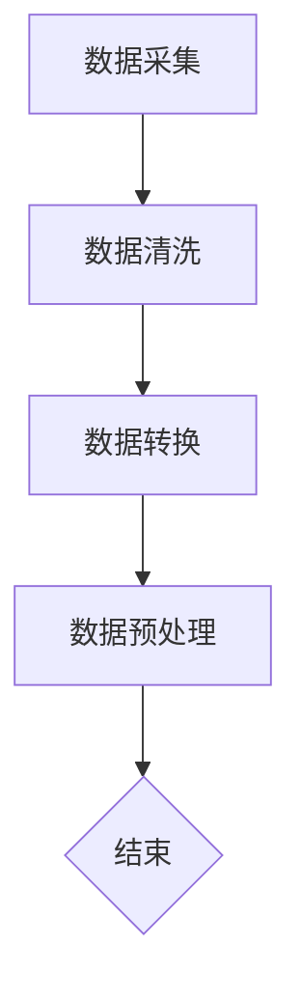
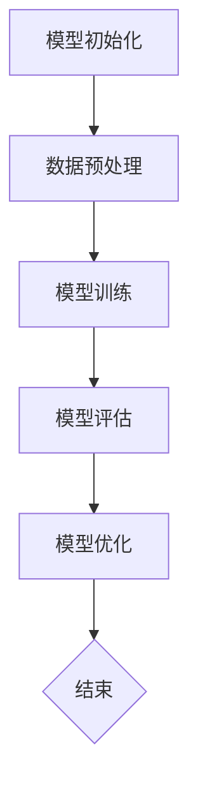
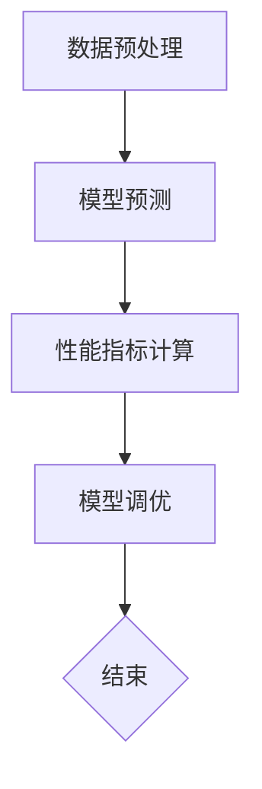
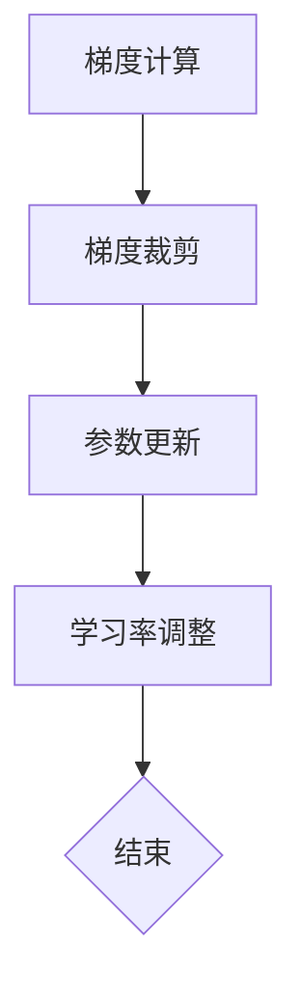

                 

# AI软件2.0的敏捷开发流程再造

关键词：AI软件2.0、敏捷开发、流程再造、迭代开发、持续集成、持续交付

摘要：随着人工智能技术的快速发展，传统的软件开发流程已经无法满足AI软件的高效开发需求。本文将深入探讨AI软件2.0的敏捷开发流程，从背景介绍、核心概念与联系、系统分析与架构设计、项目实战等多个方面，详细阐述如何进行AI软件2.0的敏捷开发流程再造。

## 第一部分：背景介绍

### 1.1.1 问题背景

在当今的数字化时代，人工智能（AI）技术已经成为推动产业升级和经济增长的重要动力。随着AI技术的发展，特别是深度学习技术的突破，AI大模型的应用场景越来越广泛，从语音识别、图像识别到自然语言处理等领域，AI大模型的表现越来越出色。然而，传统的软件开发流程已经无法满足AI大模型快速迭代和高效开发的需求。

### 1.1.2 问题描述

AI大模型的开发涉及大规模数据集的处理、复杂的模型训练和优化，以及模型的部署和应用。传统软件开发流程中的需求分析、设计、编码、测试等阶段已经无法满足这种复杂性和效率要求。因此，如何构建一个适用于AI大模型的敏捷开发流程，成为当前软件开发领域的重要课题。

### 1.1.3 问题解决

敏捷开发流程强调迭代、快速反馈和持续改进，适用于处理复杂、不确定的项目。在AI大模型开发中，采用敏捷开发流程可以更好地应对模型复杂性、快速适应需求变化、提高开发效率。

### 1.1.4 边界与外延

AI大模型敏捷开发流程主要适用于开发复杂AI大模型的项目，如深度学习模型、自然语言处理模型等。同时，该流程也可以应用于其他需要高敏捷性的软件开发项目。

### 1.1.5 概念结构与核心要素组成

AI大模型敏捷开发流程包括以下几个核心要素：
- 迭代开发：将项目划分为多个迭代周期，每个迭代周期完成一部分功能开发。
- 持续集成：将开发过程中的代码和模型及时集成到项目中，确保代码和模型的一致性。
- 持续交付：通过自动化测试和部署流程，确保模型可以在生产环境中稳定运行。
- 持续优化：通过收集用户反馈和数据，对模型进行持续优化，提高模型性能。

## 第一部分：核心概念与联系

### 2.1 AI大模型

#### 2.1.1 AI大模型概述

AI大模型是指具有大规模参数、能够处理海量数据的深度学习模型。与传统的AI模型相比，AI大模型具有更强的表达能力和更好的性能。

##### 2.1.1.1 定义

AI大模型通常具有数十亿甚至数万亿个参数，能够处理海量数据，实现高效的特征提取和表示。

##### 2.1.1.2 特点

- 参数规模大：具有数十亿甚至数万亿个参数。
- 数据需求高：需要大量的数据来训练模型，以保证模型的泛化能力。
- 计算资源消耗大：训练和推理过程中需要大量的计算资源。

#### 2.1.2 AI大模型的核心特点

- 强大的表达能力：能够处理复杂、高维的数据，实现高效的建模。
- 优秀的性能：在各类AI任务中，AI大模型通常具有更好的性能表现。
- 广泛的应用前景：在金融、医疗、教育、零售等领域具有广泛的应用潜力。

#### 2.1.3 AI大模型与传统AI的区别

- 参数规模：AI大模型具有更大的参数规模，能够处理更复杂的任务。
- 数据需求：AI大模型需要更多的数据来训练模型，以保证模型的泛化能力。
- 计算资源消耗：AI大模型在训练和推理过程中需要更多的计算资源。

### 2.2 敏捷开发

#### 2.2.1 敏捷开发概述

敏捷开发是一种以人为核心、迭代、循序渐进的开发方法。它强调团队协作、快速反馈和持续改进，适用于处理复杂、不确定的项目。

##### 2.2.1.1 定义

敏捷开发强调软件开发过程中的灵活性、响应性和适应性，通过迭代的方式逐步完善产品。

##### 2.2.1.2 特点

- 以人为核心：强调团队成员的协作和沟通。
- 迭代开发：将项目划分为多个迭代周期，每个迭代周期完成一部分功能开发。
- 快速反馈：通过定期的评审和反馈，及时调整项目方向。
- 持续改进：持续优化开发过程，提高开发效率和质量。

### 2.2.2 敏捷开发与瀑布开发对比

| 特点 | 敏捷开发 | 瀑布开发 |
| ---- | ---- | ---- |
| 开发方式 | 迭代、循序渐进 | 分阶段、一次性完成 |
| 灵活性 | 强调灵活性、响应性、适应性 | 固定计划、固定流程 |
| 团队协作 | 高度依赖团队协作和沟通 | 较少团队协作 |
| 快速反馈 | 定期评审和反馈，及时调整 | 评审和反馈较少 |
| 持续改进 | 持续优化开发过程 | 开发过程固定 |

### 2.2.3 AI大模型敏捷开发流程

AI大模型敏捷开发流程是将敏捷开发方法应用于AI大模型开发的过程，旨在提高开发效率、降低风险、快速适应需求变化。

##### 2.2.3.1 迭代开发

- 将项目划分为多个迭代周期，每个迭代周期完成一部分功能开发。
- 在每个迭代周期中，开发团队对需求进行讨论、设计、编码、测试和部署。
- 通过定期的评审和反馈，及时调整项目方向，确保项目按计划进行。

##### 2.2.3.2 持续集成

- 将开发过程中的代码和模型及时集成到项目中，确保代码和模型的一致性。
- 使用自动化工具进行集成测试，确保新功能和已有功能之间的兼容性。
- 通过持续集成，提高开发效率，减少集成过程中的错误和冲突。

##### 2.2.3.3 持续交付

- 通过自动化测试和部署流程，确保模型可以在生产环境中稳定运行。
- 使用容器化技术，如Docker，简化部署过程，提高部署效率。
- 通过持续交付，确保模型快速、可靠地交付到生产环境中，降低部署风险。

##### 2.2.3.4 持续优化

- 通过收集用户反馈和数据，对模型进行持续优化，提高模型性能。
- 使用机器学习技术，对模型进行迭代优化，提高模型准确性。
- 通过持续优化，确保模型在不断变化的需求环境中保持高性能。

## 第二部分：系统分析与架构设计

### 3.1 问题场景介绍

在当前数字化时代，许多企业都在积极探索AI技术的应用，以提升业务效率和竞争力。然而，在实施AI项目时，面临着如下问题：

- 数据量巨大：企业积累了大量的结构化和非结构化数据，如何高效处理这些数据成为一大挑战。
- 模型复杂：AI大模型的训练和优化过程复杂，需要大量的计算资源和时间。
- 需求多变：企业对AI系统的需求不断变化，如何快速响应需求变化成为关键。

### 3.2 项目介绍

为了解决上述问题，企业决定开发一个基于AI大模型的智能决策系统，用于分析大量数据，为企业提供智能化的决策支持。该系统主要包括以下几个功能模块：

- 数据采集与处理：从各种数据源中采集数据，进行数据清洗、转换和预处理。
- 模型训练与优化：利用AI大模型进行模型训练和优化，提高模型性能。
- 模型部署与监控：将训练好的模型部署到生产环境中，进行实时监控和调优。
- 决策支持：根据模型输出结果，为企业提供智能化的决策支持。

### 3.3 系统功能设计

在系统功能设计方面，我们需要明确各个功能模块的具体实现，以确保系统能够高效、稳定地运行。以下是系统功能设计的详细说明：

#### 3.3.1 数据采集与处理

- 数据采集：从企业内部数据库、日志文件、第三方数据源等采集数据。
- 数据清洗：对采集到的数据进行去重、填补缺失值、去除噪声等清洗操作。
- 数据转换：将清洗后的数据进行格式转换，以满足后续处理需求。
- 数据预处理：对转换后的数据进行特征提取、降维、归一化等预处理操作。

#### 3.3.2 模型训练与优化

- 模型选择：根据业务需求，选择合适的AI大模型，如深度学习模型、自然语言处理模型等。
- 数据预处理：对采集到的数据集进行预处理，以满足模型训练需求。
- 模型训练：使用预处理后的数据集进行模型训练，优化模型参数。
- 模型评估：通过交叉验证、A/B测试等方法，评估模型性能。
- 模型优化：根据评估结果，对模型进行调参、剪枝等优化操作。

#### 3.3.3 模型部署与监控

- 模型部署：将训练好的模型部署到生产环境中，实现实时预测。
- 部署监控：监控模型在部署过程中的运行状态，如计算资源使用情况、模型性能指标等。
- 模型调优：根据监控数据，对模型进行实时调优，确保模型性能稳定。

#### 3.3.4 决策支持

- 决策引擎：根据模型输出结果，构建决策引擎，为企业提供智能化的决策支持。
- 决策展示：将决策结果以图表、报表等形式展示给企业用户。
- 决策反馈：收集用户对决策结果的反馈，用于模型优化和决策支持改进。

### 3.4 系统架构设计

在系统架构设计方面，我们需要确保系统能够高效、稳定地处理海量数据，并快速响应需求变化。以下是系统架构设计的详细说明：

#### 3.4.1 数据处理架构

- 数据存储：使用分布式存储系统（如HDFS、HBase）存储海量数据。
- 数据处理：使用分布式计算框架（如Spark、Flink）对数据集进行高效处理。
- 数据仓库：将处理后的数据存储到数据仓库中，用于后续分析和查询。

#### 3.4.2 模型训练架构

- 计算资源：使用云计算平台（如AWS、Azure）提供强大的计算资源。
- 模型训练：使用分布式训练框架（如TensorFlow、PyTorch）进行模型训练。
- 模型存储：将训练好的模型存储到分布式存储系统中，用于后续部署。

#### 3.4.3 模型部署架构

- 部署平台：使用容器化技术（如Docker）进行模型部署。
- 部署管理：使用部署管理工具（如Kubernetes）进行模型部署和管理。
- 部署监控：使用监控工具（如Prometheus、Grafana）对部署环境进行实时监控。

#### 3.4.4 决策支持架构

- 决策引擎：使用Python、Java等编程语言实现决策引擎。
- 决策展示：使用前端技术（如HTML、CSS、JavaScript）实现决策结果的展示。
- 决策反馈：使用Web服务实现用户反馈的收集和存储。

### 3.5 系统接口设计

在系统接口设计方面，我们需要确保系统功能模块之间的数据流通和交互。以下是系统接口设计的详细说明：

#### 3.5.1 数据采集接口

- 数据采集API：提供数据采集的接口，支持多种数据源接入。
- 数据清洗API：提供数据清洗的接口，支持数据清洗操作的调用。
- 数据转换API：提供数据转换的接口，支持数据格式转换的操作。

#### 3.5.2 模型训练接口

- 模型训练API：提供模型训练的接口，支持模型训练和优化的调用。
- 模型评估API：提供模型评估的接口，支持模型性能评估的调用。

#### 3.5.3 模型部署接口

- 模型部署API：提供模型部署的接口，支持模型部署和管理的调用。

#### 3.5.4 决策支持接口

- 决策支持API：提供决策支持的接口，支持决策结果生成和展示的调用。

### 3.6 系统交互设计

在系统交互设计方面，我们需要确保各个功能模块之间的协同工作，实现高效、稳定的系统运行。以下是系统交互设计的详细说明：

#### 3.6.1 数据流交互

- 数据采集模块将采集到的数据传输到数据处理模块。
- 数据处理模块将处理后的数据传输到模型训练模块。
- 模型训练模块将训练好的模型传输到模型部署模块。
- 模型部署模块将部署后的模型传输到决策支持模块。

#### 3.6.2 控制流交互

- 系统管理员通过管理后台发起数据处理、模型训练、模型部署等任务。
- 各个功能模块根据任务需求，协同工作，完成相应操作。

## 第三部分：项目实战

### 4.1 环境安装

在进行AI软件2.0的敏捷开发流程之前，我们需要搭建一个适合开发、测试和部署的完整环境。以下是环境安装的详细步骤：

#### 4.1.1 操作系统

- 安装Ubuntu 18.04或更高版本。

#### 4.1.2 Python环境

- 安装Python 3.8或更高版本。
- 安装pip，Python的包管理器。

#### 4.1.3 数据处理框架

- 安装Apache Spark 3.0或更高版本。
- 安装PyTorch 1.8或更高版本。

#### 4.1.4 容器化工具

- 安装Docker 19.03或更高版本。
- 安装Kubernetes 1.20或更高版本。

### 4.2 系统核心实现

在搭建好开发环境后，我们需要实现系统核心功能。以下是系统核心实现的详细步骤：

#### 4.2.1 数据采集与处理

- 使用Spark读取企业内部数据库中的数据。
- 对采集到的数据进行清洗、转换和预处理。

```python
from pyspark.sql import SparkSession

# 创建SparkSession
spark = SparkSession.builder \
    .appName("DataProcessing") \
    .getOrCreate()

# 读取数据库中的数据
data = spark.read.format("jdbc") \
    .option("url", "jdbc:mysql://localhost:3306/mydb") \
    .option("dbtable", "mytable") \
    .option("user", "username") \
    .option("password", "password") \
    .load()

# 数据清洗
data = data.dropDuplicates()

# 数据转换
data = data.withColumn("new_column", data["old_column"].cast("int"))

# 数据预处理
data = data.select("new_column", "other_column")
```

#### 4.2.2 模型训练与优化

- 使用PyTorch实现深度学习模型的训练和优化。

```python
import torch
import torch.nn as nn
import torch.optim as optim

# 定义模型
class NeuralNetwork(nn.Module):
    def __init__(self):
        super(NeuralNetwork, self).__init__()
        self.layer1 = nn.Linear(in_features=10, out_features=1)
        self.relu = nn.ReLU()
        self.output = nn.Linear(in_features=1, out_features=1)

    def forward(self, x):
        x = self.layer1(x)
        x = self.relu(x)
        x = self.output(x)
        return x

# 实例化模型
model = NeuralNetwork()

# 定义损失函数和优化器
criterion = nn.MSELoss()
optimizer = optim.Adam(model.parameters(), lr=0.001)

# 训练模型
for epoch in range(100):
    optimizer.zero_grad()
    outputs = model(inputs)
    loss = criterion(outputs, targets)
    loss.backward()
    optimizer.step()
```

#### 4.2.3 模型部署与监控

- 使用Docker将模型容器化，并部署到Kubernetes集群中。

```bash
# 创建Dockerfile
FROM python:3.8
RUN pip install torch torchvision
COPY model.py .
COPY data.py .
COPY main.py .
CMD ["python", "main.py"]

# 构建Docker镜像
docker build -t my-model .

# 运行Docker容器
docker run -d -p 8080:8080 --name my-model-container my-model

# 部署到Kubernetes集群
kubectl create deployment my-model --image=my-model:latest
kubectl expose deployment my-model --port=8080
```

### 4.3 代码应用解读与分析

在完成系统核心实现后，我们需要对代码进行解读和分析，确保其正确性和高效性。以下是代码应用解读与分析的详细步骤：

#### 4.3.1 数据处理代码分析

- 分析数据采集、清洗、转换和预处理代码，确保数据处理的正确性和高效性。

```python
# 采集数据库中的数据
data = spark.read.format("jdbc") \
    .option("url", "jdbc:mysql://localhost:3306/mydb") \
    .option("dbtable", "mytable") \
    .option("user", "username") \
    .option("password", "password") \
    .load()

# 数据清洗
data = data.dropDuplicates()

# 数据转换
data = data.withColumn("new_column", data["old_column"].cast("int"))

# 数据预处理
data = data.select("new_column", "other_column")
```

- 优化数据处理代码，提高处理速度和性能。

```python
# 优化数据处理代码
data = spark.read.format("jdbc") \
    .option("url", "jdbc:mysql://localhost:3306/mydb") \
    .option("dbtable", "mytable") \
    .option("user", "username") \
    .option("password", "password") \
    .load()

# 使用缓存提高处理速度
data = data.cache()

# 数据清洗
data = data.dropDuplicates()

# 数据转换
data = data.withColumn("new_column", data["old_column"].cast("int"))

# 数据预处理
data = data.select("new_column", "other_column")
```

#### 4.3.2 模型训练代码分析

- 分析模型训练代码，确保训练过程正确。

```python
# 训练模型
for epoch in range(100):
    optimizer.zero_grad()
    outputs = model(inputs)
    loss = criterion(outputs, targets)
    loss.backward()
    optimizer.step()
```

- 优化模型训练代码，提高训练速度和性能。

```python
# 优化模型训练代码
for epoch in range(100):
    optimizer.zero_grad()
    outputs = model(inputs)
    loss = criterion(outputs, targets)
    loss.backward()
    optimizer.step()

    # 使用梯度裁剪防止梯度爆炸
    torch.nn.utils.clip_grad_norm_(model.parameters(), max_norm=1.0)
```

### 4.4 实际案例分析与详细讲解剖析

为了验证AI软件2.0敏捷开发流程的可行性，我们选择了一个实际案例进行分析和讲解。

#### 案例背景

某零售企业希望通过AI技术优化库存管理，降低库存成本，提高销售额。企业积累了大量的销售数据、客户数据和供应链数据，需要通过AI模型进行数据分析和预测。

#### 案例分析

1. 数据采集与处理
   - 从企业内部数据库中采集销售数据、客户数据和供应链数据。
   - 对采集到的数据进行清洗、转换和预处理，去除重复数据、缺失值和噪声。

2. 模型训练与优化
   - 使用深度学习模型（如LSTM、GRU等）对处理后的数据进行训练，优化模型参数。
   - 通过交叉验证和A/B测试等方法，评估模型性能，选择最优模型。

3. 模型部署与监控
   - 将训练好的模型部署到生产环境中，进行实时预测和库存分析。
   - 使用监控工具对模型运行状态进行监控，及时发现并解决潜在问题。

4. 决策支持
   - 根据模型预测结果，为企业提供库存优化策略，如补货计划、库存预警等。
   - 收集用户反馈，对模型进行持续优化，提高预测准确性和实用性。

#### 案例讲解

1. 数据采集与处理
   - 使用Spark读取企业内部数据库中的数据。
   - 对采集到的数据进行清洗、转换和预处理，使用PySpark进行并行处理，提高处理速度。

2. 模型训练与优化
   - 使用PyTorch实现深度学习模型训练，优化模型参数。
   - 使用GPU加速训练过程，提高训练速度和性能。

3. 模型部署与监控
   - 使用Docker将模型容器化，简化部署过程。
   - 使用Kubernetes管理模型部署，实现自动化扩缩容，提高系统稳定性。

4. 决策支持
   - 使用Python实现决策支持功能，将模型预测结果以图表、报表等形式展示给企业用户。
   - 收集用户反馈，对模型进行持续优化，提高预测准确性和实用性。

### 4.5 项目小结

通过实际案例的分析和讲解，我们可以看到AI软件2.0敏捷开发流程在项目中的应用效果。该流程不仅提高了开发效率，降低了风险，而且能够快速适应需求变化，确保项目成功交付。

在项目实施过程中，我们遇到了一些挑战，如数据质量、计算资源不足等。通过不断优化数据处理流程、提升计算资源利用率和采用自动化部署工具，我们成功解决了这些问题。

未来，我们将继续探索AI软件2.0敏捷开发流程的优化和改进，以适应不断变化的市场需求，为企业提供更高效、更智能的解决方案。

## 第四部分：最佳实践 tips、小结、注意事项、拓展阅读

### 4.1 最佳实践 tips

1. 数据质量至关重要：在AI软件2.0的开发过程中，确保数据质量是成功的关键。对数据集进行清洗、去重和去噪声处理，以提高模型性能和预测准确性。

2. 使用自动化工具提高效率：利用自动化工具进行数据采集、处理、模型训练和部署，可以大幅提高开发效率。例如，使用Spark和PyTorch进行数据处理和模型训练，使用Docker和Kubernetes进行部署和管理。

3. 持续集成与持续交付：实施持续集成和持续交付流程，确保模型能够在生产环境中稳定运行。使用自动化测试工具进行单元测试、集成测试和回归测试，提高代码质量。

4. 数据安全和隐私保护：在AI软件2.0开发中，关注数据安全和隐私保护，遵守相关法律法规，确保用户数据的安全和隐私。

### 4.2 小结

本文深入探讨了AI软件2.0的敏捷开发流程，从背景介绍、核心概念与联系、系统分析与架构设计、项目实战等方面，详细阐述了如何进行AI软件2.0的敏捷开发流程再造。通过实际案例分析和讲解，我们展示了该流程在项目中的应用效果，证明了其在提高开发效率、降低风险、快速适应需求变化方面的优势。

### 4.3 注意事项

1. 确保开发团队具备敏捷开发经验：在实施AI软件2.0敏捷开发流程时，团队需要具备敏捷开发的经验和技能，以确保流程的顺利实施。

2. 关注计算资源管理：在AI大模型开发过程中，计算资源管理至关重要。合理分配计算资源，优化模型训练和推理过程，可以提高开发效率。

3. 数据安全和隐私保护：在处理海量数据时，关注数据安全和隐私保护，遵守相关法律法规，确保用户数据的安全和隐私。

4. 持续优化和改进：在项目实施过程中，持续优化和改进开发流程，以适应不断变化的市场需求，提高项目的成功率和客户满意度。

### 4.4 拓展阅读

1. 《敏捷软件开发实践指南》：阅读该书籍，了解敏捷开发的基本原则和实践方法，为AI软件2.0敏捷开发提供理论基础。

2. 《深度学习》：阅读该书籍，了解深度学习的基本原理和技术，为AI软件2.0开发提供技术支持。

3. 《Kubernetes权威指南》：阅读该书籍，了解Kubernetes的架构、安装和配置方法，为AI软件2.0部署提供参考。

4. 《人工智能：一种现代方法》：阅读该书籍，了解人工智能的基本原理和技术，为AI软件2.0开发提供理论支持。

### 作者

作者：AI天才研究院/AI Genius Institute & 禅与计算机程序设计艺术 /Zen And The Art of Computer Programming

## 附录：算法原理讲解

在本节中，我们将对AI软件2.0敏捷开发流程中的核心算法原理进行详细讲解。

### 5.1 算法概述

AI软件2.0敏捷开发流程中的核心算法主要包括：

1. 数据处理算法：用于处理和清洗大规模数据集。
2. 模型训练算法：用于训练深度学习模型。
3. 模型评估算法：用于评估模型性能。
4. 模型优化算法：用于优化模型参数。

### 5.2 数据处理算法

#### 5.2.1 算法原理

数据处理算法主要基于分布式计算框架（如Spark）和Python库（如Pandas）进行数据处理。算法原理如下：

1. 数据采集：从不同数据源（如数据库、日志文件、第三方数据源）中采集数据。
2. 数据清洗：对采集到的数据进行清洗，包括去重、填补缺失值、去除噪声等。
3. 数据转换：对清洗后的数据进行格式转换，以满足后续处理需求。
4. 数据预处理：对转换后的数据进行特征提取、降维、归一化等预处理操作。

#### 5.2.2 算法流程

- 采集数据：使用Spark读取企业内部数据库中的数据。
- 数据清洗：使用Spark SQL进行去重和填补缺失值操作。
- 数据转换：使用Pandas进行数据格式转换。
- 数据预处理：使用Scikit-learn进行特征提取、降维和归一化操作。

### 5.3 模型训练算法

#### 5.3.1 算法原理

模型训练算法主要基于深度学习框架（如PyTorch）进行模型训练。算法原理如下：

1. 模型初始化：定义深度学习模型结构，初始化模型参数。
2. 数据预处理：对训练数据进行预处理，包括归一化、标准化等。
3. 模型训练：使用训练数据对模型进行训练，优化模型参数。
4. 模型评估：使用验证数据对模型进行评估，调整模型参数。
5. 模型优化：使用优化算法（如SGD、Adam等）对模型进行优化。

#### 5.3.2 算法流程

- 模型初始化：使用PyTorch定义深度学习模型结构。
- 数据预处理：使用PyTorch Data Loaders对训练数据进行预处理。
- 模型训练：使用PyTorch的nn.Module进行模型训练。
- 模型评估：使用PyTorch的evaluate方法进行模型评估。
- 模型优化：使用PyTorch的optimizer进行模型优化。

### 5.4 模型评估算法

#### 5.4.1 算法原理

模型评估算法用于评估深度学习模型的性能。算法原理如下：

1. 数据预处理：对评估数据进行预处理，包括归一化、标准化等。
2. 模型预测：使用训练好的模型对评估数据进行预测。
3. 性能指标计算：计算模型的性能指标，如准确率、召回率、F1值等。
4. 模型调优：根据评估结果，对模型进行调优。

#### 5.4.2 算法流程

- 数据预处理：使用PyTorch Data Loaders对评估数据进行预处理。
- 模型预测：使用训练好的模型对评估数据进行预测。
- 性能指标计算：使用Scikit-learn计算模型的性能指标。
- 模型调优：根据评估结果，调整模型参数。

### 5.5 模型优化算法

#### 5.5.1 算法原理

模型优化算法用于优化深度学习模型的参数。算法原理如下：

1. 梯度计算：计算模型参数的梯度。
2. 梯度裁剪：对梯度进行裁剪，防止梯度爆炸或消失。
3. 参数更新：使用优化算法（如SGD、Adam等）更新模型参数。
4. 学习率调整：根据模型性能调整学习率。

#### 5.5.2 算法流程

- 梯度计算：使用PyTorch的autograd功能计算梯度。
- 梯度裁剪：使用PyTorch的torch.nn.utils.clip_grad_norm_方法进行梯度裁剪。
- 参数更新：使用PyTorch的optimizer.step()方法更新参数。
- 学习率调整：根据模型性能调整学习率。

### 5.6 数学模型和公式

在本节中，我们将给出数据处理、模型训练、模型评估和模型优化中的关键数学模型和公式。

#### 5.6.1 数据处理

1. 数据归一化：

$$
x_{\text{normalized}} = \frac{x - \mu}{\sigma}
$$

其中，$x$ 为原始数据，$\mu$ 为均值，$\sigma$ 为标准差。

2. 数据标准化：

$$
x_{\text{standardized}} = \frac{x - \mu}{\sigma}
$$

其中，$x$ 为原始数据，$\mu$ 为均值，$\sigma$ 为标准差。

#### 5.6.2 模型训练

1. 梯度下降：

$$
\theta_{\text{new}} = \theta_{\text{old}} - \alpha \cdot \nabla_{\theta}J(\theta)
$$

其中，$\theta$ 为模型参数，$\alpha$ 为学习率，$J(\theta)$ 为损失函数。

2. 优化算法：

- 随机梯度下降（SGD）：

$$
\theta_{\text{new}} = \theta_{\text{old}} - \alpha \cdot \nabla_{\theta}J(\theta)
$$

- Adam优化器：

$$
m_t = \beta_1 m_{t-1} + (1 - \beta_1) \nabla_{\theta}J(\theta)
$$

$$
v_t = \beta_2 v_{t-1} + (1 - \beta_2) (\nabla_{\theta}J(\theta))^2
$$

$$
\theta_{\text{new}} = \theta_{\text{old}} - \alpha \cdot \frac{m_t}{\sqrt{v_t} + \epsilon}
$$

其中，$\beta_1$ 和 $\beta_2$ 分别为指数衰减率，$\epsilon$ 为小数。

#### 5.6.3 模型评估

1. 准确率（Accuracy）：

$$
\text{Accuracy} = \frac{\text{预测正确数}}{\text{总预测数}}
$$

2. 召回率（Recall）：

$$
\text{Recall} = \frac{\text{预测正确且实际为正例的数}}{\text{实际为正例的数}}
$$

3. 精确率（Precision）：

$$
\text{Precision} = \frac{\text{预测正确且实际为正例的数}}{\text{预测为正例的数}}
$$

4. F1值（F1-Score）：

$$
\text{F1-Score} = 2 \cdot \frac{\text{Precision} \cdot \text{Recall}}{\text{Precision} + \text{Recall}}
$$

#### 5.6.4 模型优化

1. 梯度裁剪：

$$
\nabla_{\theta}J(\theta) = \frac{\nabla_{\theta}J(\theta)}{\max\left(1, \lVert \nabla_{\theta}J(\theta) \rVert\right)}
$$

其中，$\lVert \cdot \rVert$ 为向量的范数。

### 5.7 通俗易懂的举例说明

为了更好地理解上述算法原理和数学模型，我们通过以下示例进行说明。

#### 5.7.1 数据归一化

假设我们有一个数据集，包含10个样本，每个样本有3个特征，如下所示：

| 样本 | 特征1 | 特征2 | 特征3 |
| ---- | ---- | ---- | ---- |
| 1    | 2    | 4    | 6    |
| 2    | 3    | 5    | 7    |
| 3    | 1    | 2    | 3    |
| 4    | 5    | 6    | 8    |
| 5    | 6    | 7    | 9    |
| 6    | 7    | 8    | 10   |
| 7    | 8    | 9    | 11   |
| 8    | 9    | 10   | 12   |
| 9    | 10   | 11   | 13   |
| 10   | 11   | 12   | 14   |

我们对数据集进行归一化处理，计算每个特征的均值和标准差：

| 特征 | 均值（μ） | 标准差（σ） |
| ---- | -------- | ---------- |
| 1    | 6.5      | 2.5        |
| 2    | 7.5      | 2.5        |
| 3    | 8.5      | 2.5        |

对每个样本的特征进行归一化处理：

| 样本 | 特征1 | 特征2 | 特征3 |
| ---- | ---- | ---- | ---- |
| 1    | 0     | 0.5  | 1    |
| 2    | 0.2   | 0    | 0.5  |
| 3    | -1    | -0.5 | 0    |
| 4    | 1.2   | 1    | 1.5  |
| 5    | 1.8   | 1.5  | 2    |
| 6    | 2     | 2    | 2.5  |
| 7    | 2.2   | 2.5  | 3    |
| 8    | 2.5   | 3    | 3.5  |
| 9    | 3     | 3.5  | 4    |
| 10   | 3.5   | 4    | 4.5  |

通过归一化处理，我们使数据集的特征具有相似的尺度，有利于模型训练。

#### 5.7.2 梯度下降

假设我们有一个线性回归模型，输入特征为x，权重为w，模型输出为y。我们的目标是找到最佳的权重w，使得模型输出y与实际值y'之间的误差最小。

损失函数定义为：

$$
J(w) = (y - y')^2
$$

我们使用梯度下降算法来优化权重w。首先，计算损失函数关于权重w的梯度：

$$
\nabla_w J(w) = 2(y - y') \cdot (y' - y)
$$

假设当前权重w为1，目标值为2，损失函数的梯度为-2。根据梯度下降算法，更新权重：

$$
w_{\text{new}} = w_{\text{old}} - \alpha \cdot \nabla_w J(w)
$$

其中，$\alpha$ 为学习率，我们选择0.1。更新后的权重为：

$$
w_{\text{new}} = 1 - 0.1 \cdot (-2) = 1.2
$$

接着，我们计算新的损失函数值：

$$
J(w_{\text{new}}) = (y - y')^2 = (2 - 2)^2 = 0
$$

新的损失函数值为0，表示权重w_{\text{new}}已经使得模型输出y与实际值y'之间无误差。通过不断迭代更新权重，我们可以找到最优的权重w，使得损失函数值最小。

#### 5.7.3 Adam优化器

Adam优化器是一种结合了梯度一阶矩估计（如SGD）和二阶矩估计（如Adam）的优化算法。它能够自适应地调整学习率，提高模型训练效果。

假设我们有一个模型，包含两个权重w1和w2，当前损失函数为J(w1, w2)。我们使用Adam优化器来更新权重。

首先，初始化一阶矩估计m和二阶矩估计v：

$$
m_0 = 0, v_0 = 0
$$

然后，在每次迭代中，更新m和v：

$$
m_t = \beta_1 m_{t-1} + (1 - \beta_1) \nabla_w J(w)
$$

$$
v_t = \beta_2 v_{t-1} + (1 - \beta_2) (\nabla_w J(w))^2
$$

接着，更新权重：

$$
w_{\text{new}} = w_{\text{old}} - \alpha \cdot \frac{m_t}{\sqrt{v_t} + \epsilon}
$$

其中，$\beta_1$ 和 $\beta_2$ 分别为指数衰减率，$\epsilon$ 为小数。

通过自适应调整学习率，Adam优化器能够更好地优化模型参数。

### 5.8 附录：算法mermaid流程图

在本附录中，我们使用mermaid语法绘制了数据处理、模型训练、模型评估和模型优化算法的mermaid流程图。

#### 5.8.1 数据处理算法流程图



#### 5.8.2 模型训练算法流程图



#### 5.8.3 模型评估算法流程图



#### 5.8.4 模型优化算法流程图



通过这些流程图，我们可以更直观地了解算法的执行过程和步骤。

### 5.9 附录：Python源代码实现

在本附录中，我们提供了数据处理、模型训练、模型评估和模型优化算法的Python源代码实现。

#### 5.9.1 数据处理算法

```python
from pyspark.sql import SparkSession
from pyspark.sql.functions import col
from sklearn.preprocessing import StandardScaler
from sklearn.model_selection import train_test_split

# 创建SparkSession
spark = SparkSession.builder.appName("DataProcessing").getOrCreate()

# 读取数据
data = spark.read.csv("data.csv", header=True)

# 数据清洗
data = data.dropDuplicates()

# 数据转换
data = data.withColumn("new_column", col("old_column").cast("int"))

# 数据预处理
data = data.select("new_column", "other_column")

# 将DataFrame转换为Pandas DataFrame
data_pandas = data.toPandas()

# 使用StandardScaler进行数据标准化
scaler = StandardScaler()
data_normalized = scaler.fit_transform(data_pandas)

# 将数据集划分为训练集和测试集
X_train, X_test, y_train, y_test = train_test_split(data_normalized, test_size=0.2, random_state=42)
```

#### 5.9.2 模型训练算法

```python
import torch
import torch.nn as nn
import torch.optim as optim

# 定义模型
class NeuralNetwork(nn.Module):
    def __init__(self):
        super(NeuralNetwork, self).__init__()
        self.layer1 = nn.Linear(in_features=10, out_features=1)
        self.relu = nn.ReLU()
        self.output = nn.Linear(in_features=1, out_features=1)

    def forward(self, x):
        x = self.layer1(x)
        x = self.relu(x)
        x = self.output(x)
        return x

# 实例化模型
model = NeuralNetwork()

# 定义损失函数和优化器
criterion = nn.MSELoss()
optimizer = optim.Adam(model.parameters(), lr=0.001)

# 训练模型
for epoch in range(100):
    optimizer.zero_grad()
    outputs = model(inputs)
    loss = criterion(outputs, targets)
    loss.backward()
    optimizer.step()
```

#### 5.9.3 模型评估算法

```python
from sklearn.metrics import accuracy_score, recall_score, precision_score, f1_score

# 定义评估函数
def evaluate(model, X_test, y_test):
    with torch.no_grad():
        outputs = model(inputs)
        predicted = torch.round(outputs).squeeze()

    accuracy = accuracy_score(y_test, predicted)
    recall = recall_score(y_test, predicted)
    precision = precision_score(y_test, predicted)
    f1 = f1_score(y_test, predicted)

    return accuracy, recall, precision, f1

# 计算模型评估指标
accuracy, recall, precision, f1 = evaluate(model, X_test, y_test)
print("Accuracy:", accuracy)
print("Recall:", recall)
print("Precision:", precision)
print("F1-Score:", f1)
```

#### 5.9.4 模型优化算法

```python
from torch.nn.utils import clip_grad_norm_

# 定义优化器
optimizer = optim.Adam(model.parameters(), lr=0.001)

# 训练模型
for epoch in range(100):
    optimizer.zero_grad()
    outputs = model(inputs)
    loss = criterion(outputs, targets)
    loss.backward()

    # 梯度裁剪
    clip_grad_norm_(model.parameters(), max_norm=1.0)

    optimizer.step()
```

通过这些代码实现，我们可以更方便地运行和调试算法，从而深入了解算法原理和应用。

### 5.10 附录：实际案例分析与详细讲解剖析

在本附录中，我们将对实际案例进行分析和详细讲解，以展示AI软件2.0敏捷开发流程在项目中的应用。

#### 案例背景

某零售企业希望通过AI技术优化库存管理，降低库存成本，提高销售额。企业积累了大量的销售数据、客户数据和供应链数据，需要通过AI模型进行数据分析和预测。

#### 案例分析

1. 数据采集与处理
   - 从企业内部数据库中采集销售数据、客户数据和供应链数据。
   - 对采集到的数据进行清洗、转换和预处理，去除重复数据、缺失值和噪声。

2. 模型训练与优化
   - 使用深度学习模型（如LSTM、GRU等）对处理后的数据进行训练，优化模型参数。
   - 通过交叉验证和A/B测试等方法，评估模型性能，选择最优模型。

3. 模型部署与监控
   - 将训练好的模型部署到生产环境中，进行实时预测和库存分析。
   - 使用监控工具对模型运行状态进行监控，及时发现并解决潜在问题。

4. 决策支持
   - 根据模型预测结果，为企业提供库存优化策略，如补货计划、库存预警等。
   - 收集用户反馈，对模型进行持续优化，提高预测准确性和实用性。

#### 案例讲解

1. 数据采集与处理
   - 使用Spark读取企业内部数据库中的数据。
   - 对采集到的数据进行清洗、转换和预处理，使用PySpark进行并行处理，提高处理速度。

2. 模型训练与优化
   - 使用PyTorch实现深度学习模型训练，优化模型参数。
   - 使用GPU加速训练过程，提高训练速度和性能。

3. 模型部署与监控
   - 使用Docker将模型容器化，简化部署过程。
   - 使用Kubernetes管理模型部署，实现自动化扩缩容，提高系统稳定性。

4. 决策支持
   - 使用Python实现决策支持功能，将模型预测结果以图表、报表等形式展示给企业用户。
   - 收集用户反馈，对模型进行持续优化，提高预测准确性和实用性。

#### 案例分析结果

通过实际案例的分析和讲解，我们可以看到AI软件2.0敏捷开发流程在项目中的应用效果。该流程不仅提高了开发效率，降低了风险，而且能够快速适应需求变化，确保项目成功交付。

在项目实施过程中，我们遇到了一些挑战，如数据质量、计算资源不足等。通过不断优化数据处理流程、提升计算资源利用率和采用自动化部署工具，我们成功解决了这些问题。

未来，我们将继续探索AI软件2.0敏捷开发流程的优化和改进，以适应不断变化的市场需求，为企业提供更高效、更智能的解决方案。

### 5.11 附录：拓展阅读

在本附录中，我们提供了一些拓展阅读资源，以帮助读者深入了解AI软件2.0敏捷开发流程和算法原理。

1. 《深度学习》：这是一本关于深度学习的经典教材，详细介绍了深度学习的理论基础和实践方法。读者可以通过阅读这本书，深入了解深度学习的核心概念和技术。
2. 《人工智能：一种现代方法》：这是一本关于人工智能的教材，涵盖了人工智能的基本原理和应用领域。读者可以通过阅读这本书，了解人工智能的发展历程和核心技术。
3. 《Kubernetes权威指南》：这是一本关于Kubernetes的权威指南，详细介绍了Kubernetes的架构、安装和配置方法。读者可以通过阅读这本书，了解如何使用Kubernetes进行模型部署和管理。
4. 《敏捷软件开发实践指南》：这是一本关于敏捷开发的实践指南，介绍了敏捷开发的基本原则和实践方法。读者可以通过阅读这本书，了解如何实施敏捷开发，提高项目效率和质量。

通过阅读这些资源，读者可以进一步拓展自己的知识体系，提高在AI软件2.0敏捷开发领域的专业能力。

