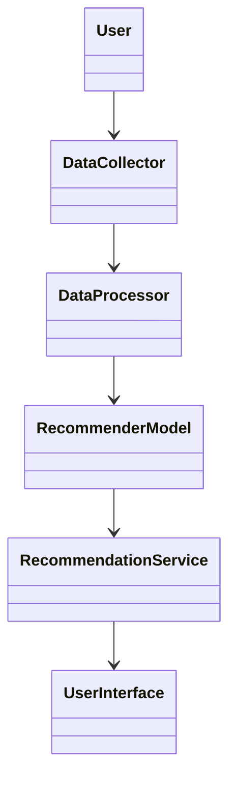

                 

# AI软件2.0的质量保证方法论

## 关键词
- AI软件2.0
- 质量保证方法论
- 自动化测试
- 机器学习
- 数据驱动

## 摘要
本文将深入探讨AI软件2.0的质量保证方法论，从基础理论到实践应用进行全方位解析。我们将首先介绍AI软件2.0的背景和特点，然后讨论质量保证的核心原则和方法，接着分析自动化测试的关键环节，最后探讨机器学习在质量保证中的应用。通过这一系列的讨论，读者将了解到如何确保AI软件2.0的质量，并掌握相应的最佳实践。

## 目录
1. **引言**
   1.1 AI软件2.0的背景与特点
   1.2 质量保证的重要性
   1.3 本文的目的与结构

2. **AI软件2.0质量保证的基础理论**
   2.1 质量保证的定义与目标
   2.2 质量管理框架
   2.3 质量保证的核心原则

3. **质量保证的方法论**
   3.1 需求工程
   3.2 设计与编码质量
   3.3 测试策略与过程
   3.4 持续集成与持续部署

4. **自动化测试**
   4.1 自动化测试的优势与挑战
   4.2 自动化测试工具与框架
   4.3 脚本编写与执行

5. **机器学习在质量保证中的应用**
   5.1 机器学习模型的质量评估
   5.2 监控与反馈系统
   5.3 基于机器学习的缺陷预测

6. **实践案例**
   6.1 项目背景
   6.2 系统架构设计
   6.3 实现与部署
   6.4 项目小结

7. **最佳实践与未来展望**
   7.1 最佳实践
   7.2 注意事项
   7.3 拓展阅读

## 1. 引言

### 1.1 AI软件2.0的背景与特点

人工智能（AI）的发展经历了多个阶段，从早期的规则驱动系统到数据驱动的机器学习模型，再到如今的自适应和自主学习的AI软件2.0。AI软件2.0不仅具备更高的智能水平，还能够在没有人类干预的情况下进行自我优化和进化。这一特点使得AI软件2.0在处理复杂任务时具有显著优势。

与传统的AI软件相比，AI软件2.0具有以下特点：

- **自主学习与进化**：AI软件2.0能够通过不断学习新的数据和经验来优化自身性能。
- **自适应能力**：系统能够根据环境的变化自动调整行为和策略。
- **高智能水平**：AI软件2.0能够处理更加复杂和高级的任务，如自然语言处理、图像识别和智能决策。

然而，这些特点也带来了新的挑战。AI软件2.0的复杂性和自我进化能力使得质量保证变得更加困难。传统的质量保证方法可能无法有效地检测和纠正AI软件2.0中的缺陷。

### 1.2 质量保证的重要性

在软件工程中，质量保证是一个至关重要的环节。它确保软件产品满足用户需求和预期，提高用户满意度，减少维护成本。对于AI软件2.0来说，质量保证的重要性更加突出，原因如下：

- **复杂性与不确定性**：AI软件2.0的复杂性和不确定性使得潜在的错误和缺陷更加难以发现。
- **高成本与高风险**：AI软件2.0的缺陷可能导致严重的经济和安全隐患。
- **用户体验**：AI软件2.0通常与用户的日常生活和工作密切相关，用户体验的优劣直接影响用户满意度。

因此，确保AI软件2.0的质量是软件开发过程中的关键任务。

### 1.3 本文的目的与结构

本文旨在介绍AI软件2.0的质量保证方法论，帮助读者理解质量保证的基本原理和实践方法。本文将分为以下几个部分：

- **基础理论**：介绍质量保证的定义、目标和管理框架。
- **方法论**：讨论质量保证的方法论，包括需求工程、设计与编码质量、测试策略和持续集成。
- **自动化测试**：探讨自动化测试的优势、工具和脚本编写。
- **机器学习应用**：介绍机器学习在质量保证中的应用，包括模型评估、监控和缺陷预测。
- **实践案例**：通过一个具体案例展示质量保证方法在实际项目中的应用。
- **最佳实践与未来展望**：总结最佳实践，讨论未来的研究方向。

## 2. AI软件2.0质量保证的基础理论

### 2.1 质量保证的定义与目标

质量保证（Quality Assurance，QA）是一个系统的、持续的过程，旨在确保产品或服务满足预定的质量标准。在软件工程领域，质量保证的目标是提高软件产品的质量，确保其符合用户需求和预期。

对于AI软件2.0，质量保证的目标包括：

- **准确性**：确保AI模型能够在各种情况下准确执行任务。
- **可靠性**：确保AI系统在长时间运行中保持稳定和一致。
- **可维护性**：确保AI系统能够快速有效地修复缺陷。
- **用户体验**：确保AI软件2.0能够提供高质量的用户体验。

### 2.2 质量管理框架

质量保证通常依赖于一些质量管理体系和框架，如ISO 9001、CMMI（Capability Maturity Model Integration）和Six Sigma。这些框架提供了一套标准和过程，帮助企业实施和维持有效的质量保证体系。

在AI软件2.0的质量保证中，以下框架尤其重要：

- **ISO 25010**：这是一份专门针对软件产品的质量管理体系标准，涵盖了功能性、可靠性、易用性、效率、可维护性和可移植性等方面。
- **AI治理框架**：确保AI系统的透明性、公平性和可靠性，遵循伦理和法律要求。

### 2.3 质量保证的核心原则

质量保证遵循一些核心原则，这些原则在整个软件开发生命周期中起着关键作用。对于AI软件2.0，以下原则尤为重要：

- **预防胜于检查**：通过早期发现和修复缺陷，预防比修复更有效。
- **持续改进**：质量保证是一个持续的过程，需要不断改进和优化。
- **团队合作**：质量保证需要整个团队的合作，包括开发人员、测试人员、项目经理和用户。
- **透明性**：质量保证的过程和结果应该透明，确保所有相关方都能理解和参与。

### 2.4 质量保证与质量控制的关系

质量保证和质量控制（Quality Control，QC）是两个相关但不同的概念。质量保证是一个预防性的过程，旨在在整个软件开发生命周期中确保质量。而质量控制是检测和修复已经存在的缺陷。

在AI软件2.0的质量保证中，质量保证和质量控制的关系如下：

- **质量保证**：通过设计、编码和测试过程来预防缺陷。
- **质量控制**：通过测试和审查来检测和修复缺陷。

两者相辅相成，共同确保AI软件2.0的质量。

### 2.5 质量保证的关键活动

在AI软件2.0的质量保证过程中，以下关键活动至关重要：

- **需求工程**：确保软件需求清晰、完整和可测试。
- **设计与编码质量**：确保系统架构和代码质量符合标准。
- **测试**：通过各种测试方法来验证和验证软件质量。
- **持续集成与部署**：确保代码和质量保证活动能够自动化和持续集成。

通过这些关键活动，可以确保AI软件2.0的质量得到有效保证。

### 2.6 质量保证的工具和技术

质量保证依赖于一系列工具和技术，以下是一些常用的工具：

- **自动化测试工具**：如Selenium、JUnit、pytest等，用于自动化执行测试用例。
- **代码审查工具**：如SonarQube、FindBugs等，用于静态代码分析和缺陷检测。
- **持续集成工具**：如Jenkins、Travis CI等，用于自动化构建、测试和部署。

这些工具和技术可以帮助开发团队更高效地实施质量保证。

### 2.7 质量保证的挑战与解决方案

在AI软件2.0的质量保证中，存在一些特殊的挑战：

- **复杂性**：AI软件2.0的复杂性使得质量保证变得更加困难。
- **不确定性**：AI模型的不确定性使得预测和检测缺陷更加困难。
- **数据隐私**：质量保证过程中需要大量数据，如何保护用户隐私是一个重要问题。

针对这些挑战，以下是一些解决方案：

- **自动化测试**：通过自动化测试来提高测试覆盖率，降低人工测试的成本。
- **数据隐私保护**：使用加密、匿名化和数据最小化等技术来保护用户隐私。
- **多模型融合**：通过融合多个AI模型来提高模型的可靠性和鲁棒性。

通过这些解决方案，可以有效地应对AI软件2.0质量保证中的挑战。

## 3. 质量保证的方法论

### 3.1 需求工程

需求工程是质量保证的基础，它确保软件需求被准确、完整和一致地定义。对于AI软件2.0，需求工程的关键包括：

- **需求收集**：通过与用户、利益相关者和专家的交流和讨论，收集软件需求。
- **需求分析**：分析需求，确保它们是清晰的、可测试的、可实现的。
- **需求文档**：编写详细的需求文档，包括功能需求、非功能需求和用户故事。

### 3.2 设计与编码质量

设计与编码质量是确保AI软件2.0稳定、可靠和可维护的关键。以下是一些关键原则：

- **模块化设计**：将系统划分为多个模块，每个模块负责特定的功能。
- **代码质量**：编写简洁、可读、可维护的代码，遵循编码规范。
- **代码审查**：通过代码审查来发现潜在的错误和缺陷。

### 3.3 测试策略与过程

测试策略与过程是确保AI软件2.0质量的重要环节。以下是一个典型的测试流程：

- **单元测试**：对单个模块进行测试，确保其功能正确。
- **集成测试**：将多个模块集成在一起进行测试，确保它们之间的交互正常。
- **系统测试**：对整个系统进行测试，确保其满足所有需求。
- **回归测试**：在每次更新或修复后，对系统进行重新测试，确保没有引入新的缺陷。

### 3.4 持续集成与持续部署

持续集成（CI）和持续部署（CD）是确保AI软件2.0质量的关键实践。以下是一些关键步骤：

- **自动化构建**：通过CI工具自动化构建和测试代码。
- **自动化部署**：通过CD工具自动化部署和发布软件。
- **持续反馈**：持续收集和分析测试和部署结果，快速识别和修复问题。

### 3.5 质量保证的最佳实践

以下是一些质量保证的最佳实践：

- **尽早开始**：在软件开发生命周期的早期阶段就开始质量保证活动。
- **团队合作**：确保所有团队成员都参与质量保证活动。
- **自动化**：尽可能使用自动化工具来提高质量保证的效率。
- **用户参与**：通过用户反馈来持续改进软件质量。

通过这些最佳实践，可以有效地确保AI软件2.0的质量。

## 4. 自动化测试

### 4.1 自动化测试的优势与挑战

自动化测试在AI软件2.0的质量保证中起着关键作用。以下是自动化测试的优势和挑战：

#### 自动化测试的优势：

- **提高效率**：自动化测试可以节省大量时间和人力成本。
- **提高覆盖率**：自动化测试可以覆盖更多的测试用例，提高测试覆盖率。
- **减少人为错误**：自动化测试可以减少由于人为疏忽引起的错误。
- **持续集成**：自动化测试与持续集成（CI）相结合，可以快速检测和修复缺陷。

#### 自动化测试的挑战：

- **初始成本高**：开发和维护自动化测试脚本需要较高的投入。
- **维护成本**：自动化测试脚本需要定期更新和维护，以适应系统变化。
- **复杂性**：自动化测试可能需要处理复杂的用户界面和系统交互。

### 4.2 自动化测试工具与框架

以下是一些常用的自动化测试工具和框架：

- **Selenium**：用于Web应用的自动化测试工具，支持多种编程语言。
- **JUnit**：用于Java应用的单元测试框架。
- **pytest**：用于Python应用的单元测试框架。
- **Cucumber**：用于行为驱动开发（BDD）的测试工具，支持多种编程语言。

### 4.3 脚本编写与执行

编写自动化测试脚本的关键步骤包括：

- **需求分析**：明确测试需求和目标。
- **设计测试用例**：根据需求设计测试用例。
- **编写脚本**：使用自动化测试工具编写测试脚本。
- **执行脚本**：运行测试脚本并记录测试结果。

以下是一个简单的Python自动化测试脚本示例：

```python
import unittest
from selenium import webdriver

class TestWebApp(unittest.TestCase):
    def setUp(self):
        self.driver = webdriver.Firefox()

    def test_search(self):
        driver = self.driver
        driver.get("https://www.example.com")
        search_box = driver.find_element_by_name("q")
        search_box.send_keys("Automation")
        search_box.submit()
        self.assertIn("Automation", driver.title)

    def tearDown(self):
        self.driver.quit()

if __name__ == "__main__":
    unittest.main()
```

通过编写和执行自动化测试脚本，可以有效地提高AI软件2.0的质量保证。

## 5. 机器学习在质量保证中的应用

### 5.1 机器学习模型的质量评估

在AI软件2.0的质量保证中，机器学习模型的质量评估是一个关键环节。以下是一些常用的质量评估指标：

- **准确率（Accuracy）**：模型预测正确的样本数占总样本数的比例。
- **精确率（Precision）**：模型预测为正类的实际正类样本数与预测为正类的总样本数的比例。
- **召回率（Recall）**：模型预测为正类的实际正类样本数与实际正类样本总数的比例。
- **F1分数（F1 Score）**：精确率和召回率的调和平均值。
- **ROC曲线（Receiver Operating Characteristic Curve）**：用于评估分类模型的性能。

以下是一个简单的机器学习模型质量评估示例：

```python
from sklearn.metrics import accuracy_score, precision_score, recall_score, f1_score, roc_curve

# 假设y_true为实际标签，y_pred为模型预测结果
y_true = [0, 1, 1, 0, 1]
y_pred = [0, 1, 1, 0, 0]

accuracy = accuracy_score(y_true, y_pred)
precision = precision_score(y_true, y_pred)
recall = recall_score(y_true, y_pred)
f1 = f1_score(y_true, y_pred)

print("Accuracy:", accuracy)
print("Precision:", precision)
print("Recall:", recall)
print("F1 Score:", f1)

# ROC曲线
fpr, tpr, thresholds = roc_curve(y_true, y_pred)
```

### 5.2 监控与反馈系统

机器学习模型在部署后，需要持续监控和评估其性能。以下是一个简单的监控与反馈系统架构：

- **数据收集**：收集模型输入和输出数据。
- **性能评估**：使用评估指标（如准确率、召回率等）评估模型性能。
- **异常检测**：检测模型性能的异常，如准确性下降或预测偏差。
- **反馈循环**：根据监控结果，调整模型参数或重新训练模型。

### 5.3 基于机器学习的缺陷预测

基于机器学习的缺陷预测可以帮助开发团队提前识别和修复潜在的问题。以下是一个简单的缺陷预测流程：

1. **数据收集**：收集历史缺陷数据，包括缺陷类型、严重程度、修复时间等。
2. **特征工程**：提取与缺陷相关的特征，如代码复杂性、代码变更频率等。
3. **模型训练**：使用机器学习算法（如决策树、随机森林、神经网络等）训练缺陷预测模型。
4. **模型评估**：评估模型性能，如准确率、召回率等。
5. **预测与反馈**：使用模型预测潜在的缺陷，并反馈给开发团队进行修复。

以下是一个简单的缺陷预测示例：

```python
from sklearn.ensemble import RandomForestClassifier
from sklearn.model_selection import train_test_split

# 假设X为特征数据，y为缺陷标签
X_train, X_test, y_train, y_test = train_test_split(X, y, test_size=0.2, random_state=42)

# 训练缺陷预测模型
model = RandomForestClassifier()
model.fit(X_train, y_train)

# 评估模型性能
accuracy = model.score(X_test, y_test)
print("Accuracy:", accuracy)

# 预测潜在的缺陷
predictions = model.predict(X_test)
```

通过机器学习在质量保证中的应用，可以更有效地确保AI软件2.0的质量。

## 6. 实践案例

### 6.1 项目背景

假设我们正在开发一个AI软件2.0项目，用于智能推荐系统。该系统旨在根据用户的历史行为和偏好，为用户推荐个性化的商品和服务。项目团队由开发人员、测试人员和数据科学家组成。

### 6.2 系统架构设计

智能推荐系统可以分为以下几个主要模块：

1. **数据收集模块**：负责从各种数据源（如网站日志、用户反馈等）收集用户行为数据。
2. **数据处理模块**：负责清洗、转换和预处理用户数据，为模型训练提供高质量的数据。
3. **推荐模型模块**：使用机器学习算法（如协同过滤、深度学习等）训练推荐模型。
4. **推荐服务模块**：根据用户数据和推荐模型，生成个性化的推荐结果。
5. **用户界面模块**：提供用户与系统交互的界面，展示推荐结果。

以下是一个简单的智能推荐系统的类图：



### 6.3 实现与部署

在实现过程中，我们遵循以下步骤：

1. **需求分析**：与用户和利益相关者讨论，明确推荐系统的功能需求。
2. **设计系统架构**：根据需求设计系统的整体架构和模块。
3. **开发与测试**：开发各个模块的代码，并进行单元测试和集成测试。
4. **数据预处理**：收集并预处理用户数据，为模型训练做准备。
5. **模型训练与评估**：使用机器学习算法训练推荐模型，并评估模型性能。
6. **部署与监控**：将系统部署到生产环境，并持续监控系统的性能和稳定性。

### 6.4 项目小结

通过这个实践案例，我们展示了如何确保AI软件2.0的质量。以下是一些关键经验：

- **早期需求分析**：确保需求被准确理解和文档化，减少后续的变更和重构。
- **模块化设计**：将系统划分为多个模块，便于开发和测试。
- **持续集成与部署**：使用自动化工具实现持续集成和部署，提高开发效率。
- **数据驱动**：使用高质量的数据进行模型训练和评估，确保推荐系统的准确性。

通过这些实践，我们可以更有效地确保AI软件2.0的质量，提高用户满意度。

## 7. 最佳实践与未来展望

### 7.1 最佳实践

为确保AI软件2.0的质量，以下是一些最佳实践：

- **需求工程**：在项目早期进行详细的需求分析，确保需求清晰、完整和可测试。
- **模块化设计**：将系统划分为多个模块，便于开发和测试。
- **自动化测试**：使用自动化测试工具提高测试效率和覆盖率。
- **数据驱动**：使用高质量的数据进行模型训练和评估。
- **持续监控**：对生产环境中的AI系统进行持续监控，及时发现和解决问题。

### 7.2 注意事项

在实施AI软件2.0质量保证时，需要注意以下事项：

- **数据隐私**：在数据收集和处理过程中，确保用户隐私得到保护。
- **模型解释性**：确保AI模型具有一定的解释性，便于问题的追踪和调试。
- **团队协作**：确保开发、测试和其他团队成员之间的良好沟通和协作。

### 7.3 拓展阅读

以下是一些关于AI软件2.0质量保证的拓展阅读资源：

- **《AI质量管理：理论与实践》**：详细介绍了AI质量管理的理论和实践方法。
- **《机器学习测试：方法与实践》**：讨论了机器学习模型测试的方法和实践。
- **《自动化测试实战》**：介绍了自动化测试的工具和技术。

通过这些资源，读者可以进一步了解AI软件2.0质量保证的深入内容和最佳实践。

## 作者信息

作者：AI天才研究院/AI Genius Institute & 禅与计算机程序设计艺术 /Zen And The Art of Computer Programming

