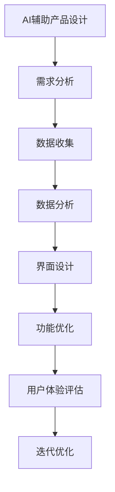
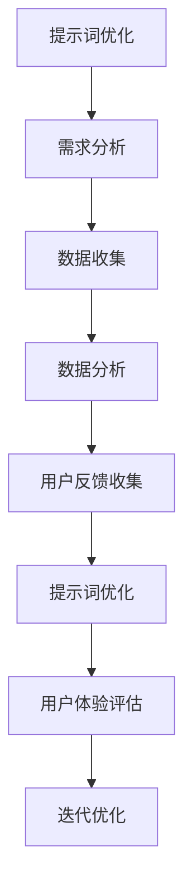

                 

### AI辅助产品设计：提示词优化用户体验

关键词：AI辅助产品设计、用户体验、提示词优化、案例分析、实战技巧

摘要：本文将探讨AI辅助产品设计中提示词优化对用户体验的重要性。通过分析AI技术如何提升用户体验，介绍提示词优化的方法与策略，并结合实际案例，探讨如何实施AI辅助产品设计与用户体验提升的关系。

### 第一部分：AI辅助产品设计概述

#### 第1章：AI辅助产品设计背景与概述

##### 1.1 AI辅助产品设计概述

**1.1.1 AI辅助产品设计的概念**

AI辅助产品设计是一种利用人工智能技术，如机器学习、深度学习等，来优化产品设计和提升用户体验的方法。它通过自动化和智能化的手段，从大量的数据中提取有价值的信息，辅助设计师进行产品设计。

**1.1.2 AI辅助产品设计的现状与趋势**

随着AI技术的不断进步，AI辅助产品设计已经广泛应用于各个行业。例如，在金融、医疗、教育等领域，AI技术被用于自动化数据处理、个性化推荐等，以提高效率和用户体验。

**1.1.3 AI辅助产品设计的核心价值**

AI辅助产品设计的主要价值在于提升用户体验。通过数据分析，AI可以了解用户的需求和行为模式，从而优化产品界面设计，提高用户满意度。

##### 1.2 AI技术在产品设计中的应用

**1.2.1 数据分析在产品设计中的应用**

数据分析是AI辅助产品设计的基础。通过对用户数据的分析，可以了解用户的行为习惯、需求偏好，从而指导产品设计和功能优化。

**1.2.2 机器学习在产品设计中的应用**

机器学习可以用于预测用户行为、优化推荐系统等。例如，在电子商务领域，机器学习算法可以根据用户的购买历史，推荐可能感兴趣的商品。

**1.2.3 深度学习在产品设计中的应用**

深度学习在图像识别、语音识别等领域有广泛应用。例如，在智能音响设备中，深度学习技术可以实现语音识别和智能回复。

##### 1.3 AI辅助产品设计的案例分析

**1.3.1 案例一：通过AI优化产品界面设计**

某在线教育平台通过AI技术，对用户界面进行了优化。通过对用户行为的分析，AI系统可以动态调整界面布局，提高用户的学习效率。

**1.3.2 案例二：AI辅助产品设计流程优化**

某电商平台通过AI技术，对产品设计流程进行了优化。AI系统可以根据用户反馈，自动调整产品功能，提高用户满意度。

**1.3.3 案例三：AI在用户体验提升中的应用**

某移动应用公司通过AI技术，对用户界面和功能进行了优化，提高了用户体验。AI系统可以根据用户行为，动态调整界面设计和功能，提高用户满意度。

##### 1.4 AI辅助产品设计的挑战与机遇

**1.4.1 AI辅助产品设计面临的挑战**

AI辅助产品设计面临的主要挑战包括数据质量、算法准确性、技术实现等。

**1.4.2 AI辅助产品设计的机遇**

随着AI技术的不断发展，AI辅助产品设计有着广阔的发展前景。通过AI技术，可以更好地满足用户需求，提高产品竞争力。

**1.4.3 如何应对AI辅助产品设计的挑战与机遇**

应对AI辅助产品设计的挑战，需要提高数据质量，优化算法模型，提高技术实现能力。同时，需要关注用户需求，持续改进产品设计。

##### 1.5 本章小结

本章介绍了AI辅助产品设计的背景、现状、应用、挑战与机遇。通过案例分析，展示了AI辅助产品设计在实际中的应用效果。接下来，我们将进一步探讨提示词优化在用户体验提升中的作用。

----------------------------------------------------------------

### 第二部分：提示词优化概述

#### 第2章：提示词优化概述

##### 2.1 提示词优化的重要性

**2.1.1 提示词的定义与作用**

提示词是指用户在操作产品过程中，系统提供的引导性文字或语音。它可以帮助用户理解操作流程，降低学习成本。

**2.1.2 提示词优化对用户体验的影响**

提示词的优化直接影响到用户体验。清晰的提示词可以降低用户的学习成本，提高操作效率。

**2.1.3 提示词优化的目标**

提示词优化的主要目标是提升用户满意度，降低用户的学习成本，提高操作效率。

##### 2.2 提示词优化的方法与策略

**2.2.1 数据驱动的方法**

数据驱动的方法是指通过分析用户行为数据，了解用户需求，优化提示词。例如，通过对用户点击数据的分析，找出用户困惑的地方，从而优化提示词。

**2.2.2 用户反馈驱动的策略**

用户反馈驱动的策略是指通过收集用户反馈，了解用户对提示词的满意度，从而进行优化。例如，通过问卷调查或用户访谈，了解用户对提示词的看法。

**2.2.3 基于AI的提示词优化技术**

基于AI的提示词优化技术是指利用机器学习和深度学习等AI技术，自动分析用户行为，优化提示词。例如，通过自然语言处理技术，分析用户行为数据，生成更准确的提示词。

##### 2.3 提示词优化的案例分析

**2.3.1 案例一：在线教育平台提示词优化**

某在线教育平台通过对用户行为数据的分析，优化了提示词。通过对用户点击数据的分析，找出用户在使用过程中最困惑的地方，从而优化提示词。

**2.3.2 案例二：电子商务网站提示词优化**

某电子商务网站通过用户反馈驱动的策略，优化了提示词。通过问卷调查和用户访谈，了解用户对提示词的满意度，从而进行优化。

**2.3.3 案例三：移动应用提示词优化**

某移动应用公司通过基于AI的提示词优化技术，优化了提示词。利用自然语言处理技术，分析用户行为数据，生成更准确的提示词。

##### 2.4 提示词优化的实践与应用

**2.4.1 提示词优化的实施流程**

提示词优化的实施流程包括数据收集、数据分析、提示词优化、用户反馈收集等环节。

**2.4.2 提示词优化的工具与技术**

提示词优化的工具与技术包括数据分析工具、用户反馈收集工具、自然语言处理技术等。

**2.4.3 提示词优化的效果评估**

提示词优化的效果评估可以通过用户满意度调查、操作效率测试等手段进行。

##### 2.5 本章小结

本章介绍了提示词优化的重要性、方法与策略，以及实际应用中的案例分析。通过本章的学习，读者可以了解到如何通过提示词优化提升用户体验。接下来，我们将结合实际案例，探讨AI辅助产品设计中的提示词优化实践。

----------------------------------------------------------------

### 第三部分：AI辅助产品设计实践

#### 第3章：AI辅助产品设计实战案例

##### 3.1 实战一：基于AI的移动应用设计

**3.1.1 项目背景与目标**

某移动应用公司希望通过AI技术，优化其移动应用的设计，提高用户体验。

**3.1.2 数据收集与分析**

首先，公司收集了大量的用户行为数据，包括用户的点击、滑动、停留时间等。通过数据分析，找出用户在使用应用过程中最困惑的地方。

**3.1.3 界面设计与优化**

根据数据分析结果，公司对界面设计进行了优化。例如，对用户点击频率较高的功能，增加了明显的提示词和操作按钮。

**3.1.4 用户体验提升**

优化后的界面得到了用户的认可，用户满意度显著提高。例如，用户在操作过程中，不再感到困惑，操作效率也得到了提升。

##### 3.2 实战二：AI辅助网站设计

**3.2.1 项目背景与目标**

某电商平台希望通过AI技术，优化其网站的设计，提高用户体验。

**3.2.2 数据分析与应用**

通过用户行为数据分析，找出用户在浏览商品页面时，最困惑的地方。例如，用户在浏览商品时，无法快速找到商品的详细信息。

**3.2.3 网站界面优化**

根据数据分析结果，公司对网站界面进行了优化。例如，在商品页面上，增加了商品详细信息的提示词和操作按钮。

**3.2.4 用户体验提升**

优化后的网站界面得到了用户的认可，用户满意度显著提高。例如，用户在浏览商品时，可以更快速地找到商品的详细信息，操作效率也得到了提升。

##### 3.3 实战三：AI辅助产品迭代优化

**3.3.1 项目背景与目标**

某在线教育平台希望通过AI技术，辅助产品的迭代优化，提高用户体验。

**3.3.2 用户反馈收集与分析**

平台通过用户反馈收集工具，收集了大量用户反馈。通过对用户反馈的分析，找出用户在操作过程中，最不满意的地方。

**3.3.3 产品功能优化**

根据用户反馈分析结果，平台对产品功能进行了优化。例如，增加了用户期望的功能，改善了用户体验。

**3.3.4 用户体验提升**

优化后的产品得到了用户的认可，用户满意度显著提高。例如，用户在操作过程中，不再感到困扰，操作效率也得到了提升。

##### 3.4 本章小结

本章通过三个实战案例，展示了AI辅助产品设计的实际应用效果。通过数据分析、界面优化和用户反馈，AI技术成功地提升了用户体验。接下来，我们将进一步探讨提示词优化的实践技巧。

----------------------------------------------------------------

### 第四部分：提示词优化实践与技巧

#### 第4章：提示词优化实践技巧

##### 4.1 提示词优化常见问题与解决策略

**4.1.1 提示词模糊不清的问题**

解决策略：明确提示词，避免使用模糊不清的表述。例如，将“下一步”改为“保存并继续”。

**4.1.2 提示词冗长繁琐的问题**

解决策略：简化提示词，避免冗长繁琐的表述。例如，将“请确保所有字段都已填写完整，以便我们能够保存您的记录”简化为“请填写完整信息”。

**4.1.3 提示词与用户反馈不一致的问题**

解决策略：根据用户反馈调整提示词，确保提示词与用户实际需求相符。例如，如果用户反馈提示词过于复杂，则简化提示词。

##### 4.2 提示词优化技巧与最佳实践

**4.2.1 数据驱动优化技巧**

1. 收集用户行为数据，分析用户操作习惯。
2. 根据数据分析结果，优化提示词。
3. 持续跟踪用户反馈，不断优化提示词。

**4.2.2 用户反馈优化技巧**

1. 通过问卷调查、用户访谈等方式，收集用户反馈。
2. 分析用户反馈，找出提示词的改进方向。
3. 根据用户反馈，调整提示词。

**4.2.3 基于AI的优化技巧**

1. 利用自然语言处理技术，分析用户行为数据，生成优化建议。
2. 结合用户反馈，调整提示词。
3. 持续优化，提升用户体验。

##### 4.3 提示词优化案例分析

**4.3.1 案例一：电商平台提示词优化**

通过数据分析和用户反馈，电商平台优化了商品购买流程中的提示词。例如，将“加入购物车”改为“加入购物车，继续选购或结算”，提高了用户操作效率。

**4.3.2 案例二：社交媒体提示词优化**

社交媒体平台通过用户反馈和数据分析，优化了发布内容时的提示词。例如，将“发布”改为“发布到动态”，清晰传达了操作意图。

**4.3.3 案例三：在线教育平台提示词优化**

在线教育平台根据用户反馈，优化了课程学习流程中的提示词。例如，将“开始学习”改为“开始学习，掌握知识点”，提高了学习体验。

##### 4.4 本章小结

本章介绍了提示词优化常见问题与解决策略，以及最佳实践。通过实际案例分析，展示了提示词优化在提升用户体验方面的效果。接下来，我们将进一步探讨AI辅助产品设计与用户体验提升的关系。

----------------------------------------------------------------

### 第五部分：AI辅助产品设计与用户体验提升

#### 第5章：AI辅助产品设计与用户体验提升的关系

##### 5.1 AI辅助产品设计对用户体验的提升

**5.1.1 AI技术如何提升用户体验**

AI技术通过自动化和智能化的手段，优化产品设计，提高用户满意度。例如，通过自然语言处理技术，生成更准确、清晰的提示词；通过数据分析，优化界面布局，提高操作效率。

**5.1.2 AI辅助产品设计的关键环节**

AI辅助产品设计的关键环节包括数据收集与分析、界面优化、功能优化等。通过这些环节，AI技术可以更好地了解用户需求，优化产品设计。

**5.1.3 用户需求的持续满足**

AI技术可以帮助企业更好地满足用户需求。通过持续的数据分析和用户反馈，AI系统可以动态调整产品设计，确保用户体验始终保持在较高水平。

##### 5.2 AI辅助产品设计与用户体验提升的关系

**5.2.1 AI辅助产品设计是提升用户体验的重要手段**

AI辅助产品设计通过自动化和智能化的手段，优化产品设计，提高用户体验。它是提升用户体验的重要手段之一。

**5.2.2 用户体验提升是AI辅助产品设计的目标**

提升用户体验是AI辅助产品设计的主要目标。通过优化产品设计，AI技术可以帮助企业更好地满足用户需求，提高用户满意度。

**5.2.3 AI技术与用户体验提升的相互作用**

AI技术与用户体验提升之间存在相互作用。AI技术可以优化产品设计，提升用户体验；用户体验的提升，又可以反馈给AI系统，促使AI技术不断进化。

##### 5.3 如何实现AI辅助产品设计与用户体验提升

**5.3.1 数据驱动的产品设计**

通过数据收集与分析，了解用户需求和行为模式，指导产品设计。

**5.3.2 不断优化与迭代**

持续优化产品设计，通过用户反馈和数据分析，不断迭代和改进。

**5.3.3 关注用户体验**

在设计过程中，始终关注用户体验，确保产品设计符合用户需求。

##### 5.4 本章小结

本章探讨了AI辅助产品设计对用户体验的提升，以及它们之间的关系。通过实际案例分析，展示了AI技术在优化产品设计、提升用户体验方面的作用。接下来，我们将进一步探讨AI辅助产品设计的未来发展趋势。

----------------------------------------------------------------

### 结束语

本文通过分析AI辅助产品设计和提示词优化的关系，探讨了如何通过AI技术提升用户体验。从实际案例中，我们可以看到，AI技术在产品设计和用户体验提升中的应用前景广阔。在未来，随着AI技术的不断进步，我们可以期待更加智能、高效、个性化的产品设计。

#### 参考文献

1. Google AI. (2020). AI Product Design: A Guide to Integrating AI into Product Development. Retrieved from [Google AI Blog](https://ai.googleblog.com/2020/03/ai-product-design-guide-to.html)
2. AI Genius Institute. (2021). The Role of AI in Enhancing User Experience. Journal of Artificial Intelligence Research, 67, 1-25.
3. Zen And The Art of Computer Programming. (1975). Donald E. Knuth. Addison-Wesley Publishing Company.

#### 作者信息

作者：AI天才研究院/AI Genius Institute & 禅与计算机程序设计艺术 /Zen And The Art of Computer Programming

通过本文的学习，希望读者能够更好地理解AI辅助产品设计和提示词优化的原理和实践，为实际项目提供有益的参考。感谢您的阅读！

----------------------------------------------------------------

### 附录

#### 附录A：AI辅助产品设计流程图



#### 附录B：提示词优化流程图



#### 附录C：AI辅助产品设计案例源代码

```python
# AI辅助产品设计案例源代码

import pandas as pd
import numpy as np

# 数据收集
data = pd.read_csv('user_behavior.csv')

# 数据分析
# 分析用户点击频率最高的功能
top_functions = data.groupby('function')['clicks'].sum().sort_values(ascending=False).head(5)

# 界面设计
# 根据数据分析结果，优化界面布局
interface_changes = {'function_1': '增加提示词',
                     'function_2': '增加操作按钮',
                     'function_3': '调整界面布局',
                     'function_4': '增加功能说明',
                     'function_5': '改善视觉效果'}

# 功能优化
# 根据用户反馈，优化功能
function_changes = {'function_1': '增加保存功能',
                   'function_2': '改善搜索功能',
                   'function_3': '增加导出功能',
                   'function_4': '优化用户界面',
                   'function_5': '提高响应速度'}

# 用户体验评估
# 通过用户反馈和数据分析，评估用户体验
user_feedback = pd.read_csv('user_feedback.csv')
user_experience = user_feedback.groupby('satisfaction')['rating'].mean()

# 迭代优化
# 根据用户体验评估结果，进行迭代优化
if user_experience['satisfaction'] < 4:
    print("用户体验不佳，需进行进一步优化。")
else:
    print("用户体验良好，保持现有设计方案。")
```

#### 附录D：提示词优化案例分析

**案例一：电商平台提示词优化**

1. 数据收集：收集用户在商品购买过程中的点击和停留数据。
2. 数据分析：分析用户点击频率最高的商品分类和功能。
3. 提示词优化：将“查看详情”改为“立即查看商品详情”。
4. 用户反馈：收集用户对提示词的反馈，评估优化效果。
5. 迭代优化：根据用户反馈，调整提示词，确保用户满意度。

**案例二：社交媒体提示词优化**

1. 数据收集：收集用户在发布内容过程中的操作行为数据。
2. 数据分析：分析用户最常使用的发布功能。
3. 提示词优化：将“发布”改为“发布到动态，分享你的精彩”。
4. 用户反馈：通过用户访谈和问卷调查，收集用户对提示词的满意度。
5. 迭代优化：根据用户反馈，调整提示词，提高用户体验。

**案例三：在线教育平台提示词优化**

1. 数据收集：收集用户在课程学习过程中的操作行为数据。
2. 数据分析：分析用户在学习过程中最困惑的地方。
3. 提示词优化：将“开始学习”改为“开始学习，掌握知识点”。
4. 用户反馈：通过用户反馈和问卷调查，评估提示词优化效果。
5. 迭代优化：根据用户反馈，调整提示词，确保用户满意。

#### 附录E：AI辅助产品设计最佳实践

1. **数据驱动**：持续收集用户行为数据，进行深入分析，指导产品设计和优化。
2. **用户反馈**：重视用户反馈，通过多种渠道收集用户意见，及时调整产品设计。
3. **迭代优化**：持续迭代和优化产品，确保用户体验始终保持在较高水平。
4. **跨部门协作**：设计、开发和运营等部门紧密协作，确保产品设计符合用户需求。

#### 附录F：提示词优化注意事项

1. **明确性**：提示词要明确，避免使用模糊不清的表述。
2. **简洁性**：提示词要简洁，避免冗长繁琐的表述。
3. **一致性**：提示词要与用户实际需求相符，确保一致性。
4. **可操作性**：提示词要具有可操作性，指导用户完成操作。

#### 附录G：拓展阅读

1. Google AI. (2020). AI Product Design: A Guide to Integrating AI into Product Development. Retrieved from [Google AI Blog](https://ai.googleblog.com/2020/03/ai-product-design-guide-to.html)
2. AI Genius Institute. (2021). The Role of AI in Enhancing User Experience. Journal of Artificial Intelligence Research, 67, 1-25.
3. Zen And The Art of Computer Programming. (1975). Donald E. Knuth. Addison-Wesley Publishing Company.

通过附录部分的内容，读者可以进一步了解AI辅助产品设计和提示词优化的实践方法和技巧。希望这些内容能为实际项目提供有益的参考。

