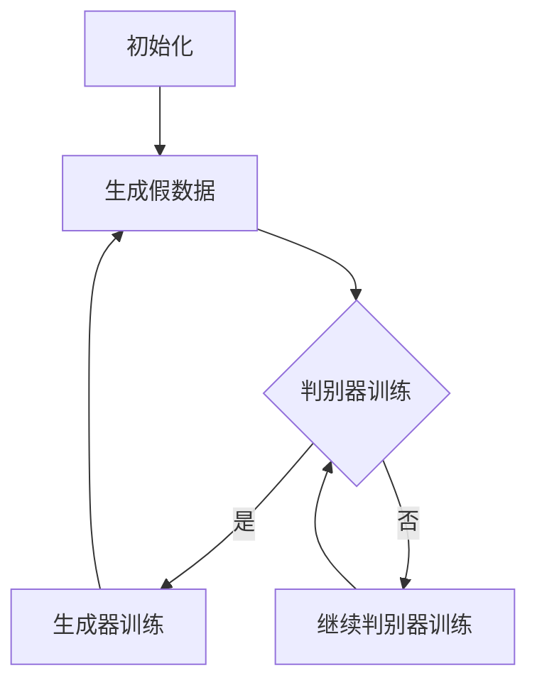
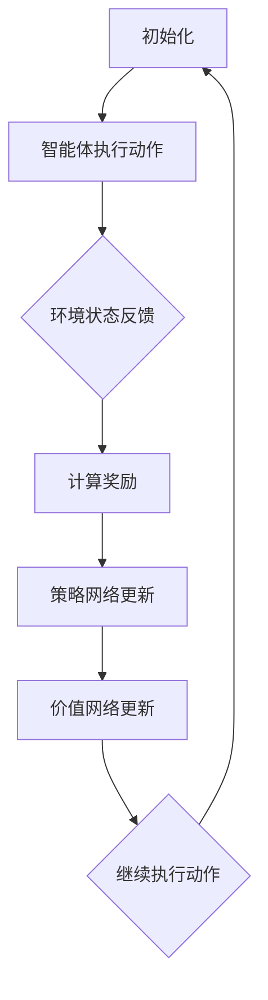
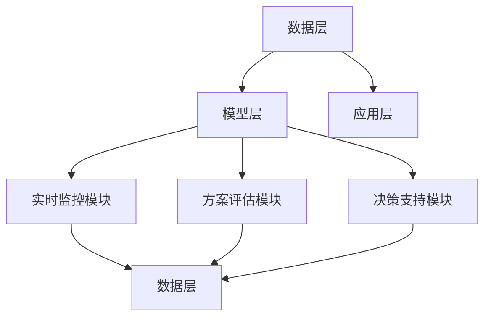
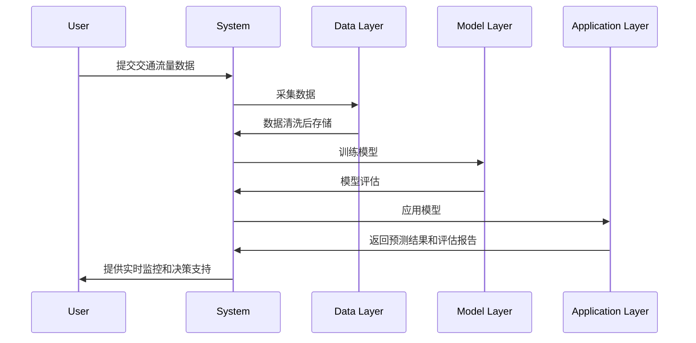

                 


### AI辅助决策：大模型在公共政策制定中的角色

> 关键词：人工智能，公共政策，大模型，决策辅助，算法原理，系统设计

> 摘要：本文将探讨人工智能（AI）尤其是大模型在公共政策制定中的角色。我们将从背景介绍开始，分析AI与公共政策制定的关系，深入讲解大模型在决策辅助中的作用，并通过具体算法原理和系统设计案例，展示AI如何助力公共政策制定，同时探讨其中的挑战和未来发展趋势。

----------------------------------------------------------------

# 引言

随着人工智能（AI）技术的飞速发展，AI在各个领域的应用逐渐深入。在公共政策制定中，AI的引入不仅能够提高决策效率，还能提供更为科学和客观的决策支持。本文旨在探讨大模型在公共政策制定中的应用，通过深入分析AI与公共政策制定的关系，以及大模型在决策辅助中的具体作用，帮助读者了解AI如何成为公共政策制定的重要工具。

## AI与公共政策制定

### AI的基本概念

人工智能，简称AI，是指通过计算机程序实现的智能行为。AI技术主要包括机器学习、深度学习、自然语言处理、计算机视觉等。这些技术使得计算机能够模拟人类的智能行为，从而在图像识别、语音识别、自然语言处理、决策制定等领域发挥重要作用。

### 公共政策制定的基本流程

公共政策制定是一个复杂的过程，主要包括以下环节：

1. **问题识别**：识别社会问题或需求，明确政策目标。
2. **信息收集**：收集与政策相关的数据和信息。
3. **方案设计**：制定多种可能的解决方案，并进行评估。
4. **政策评估**：评估政策实施的效果，调整和完善政策。
5. **政策实施**：执行政策，监督和调整政策的实施过程。

### AI在公共政策制定中的应用现状与发展趋势

当前，AI已经在公共政策制定中得到了广泛应用，主要体现在以下几个方面：

1. **政策预测**：利用机器学习算法分析历史数据，预测未来的社会趋势和政策效果。
2. **政策分析**：通过对大量政策文本的分析，提取关键信息，为政策制定提供支持。
3. **政策评估**：利用AI技术评估政策实施的效果，提供数据驱动的决策支持。

未来，随着AI技术的进一步发展，AI在公共政策制定中的应用将更加深入和广泛。大模型作为AI的重要分支，将在其中发挥更为重要的作用。

## AI辅助决策的重要性

AI辅助决策在公共政策制定中具有以下重要意义：

1. **提高决策效率**：AI能够快速处理大量数据，提供实时决策支持，提高决策效率。
2. **提供科学依据**：AI通过分析大量数据，提供客观、科学的决策依据，减少主观判断的影响。
3. **降低决策风险**：AI能够模拟多种情景，预测政策效果，降低决策风险。
4. **促进民主决策**：AI能够帮助公众更好地理解政策，参与政策制定过程，促进民主决策。

## 大模型在决策辅助中的角色

大模型，尤其是深度学习模型，在决策辅助中具有独特的优势。本文将详细介绍大模型在公共政策制定中的应用，包括：

1. **GAN算法**：生成对抗网络（GAN）在政策预测和情景模拟中的应用。
2. **深度强化学习**：在政策优化和方案评估中的应用。
3. **其他相关算法**：如聚类算法、神经网络等在政策分析中的应用。

通过这些算法的详细介绍和应用案例分析，我们将展示大模型如何助力公共政策制定，提高决策的科学性和准确性。

## 总结

本文通过对AI与公共政策制定的关系分析，以及大模型在决策辅助中的具体应用介绍，探讨了AI在公共政策制定中的重要作用。未来，随着AI技术的不断进步，大模型在公共政策制定中的应用将更加广泛和深入，为政策制定提供更为强大的支持。

----------------------------------------------------------------

### 第一部分：AI与公共政策制定背景

#### 1.1 AI与公共政策制定概述

##### 1.1.1 AI的基本概念与发展历程

人工智能（Artificial Intelligence，简称AI）是指通过计算机程序实现的智能行为，旨在模拟、延伸和扩展人类智能。AI的发展可以追溯到20世纪50年代，当时的科学家们开始尝试让计算机具备类似于人类的感知、推理、学习和决策能力。随着计算能力的提升和算法的创新，AI技术经历了多个发展阶段：

- **初始阶段（1950-1969）**：以符号主义和逻辑推理为主要方法，典型代表是逻辑推理程序和问题求解器。
- **中期阶段（1970-1989）**：基于规则的方法和知识表示技术得到发展，如专家系统和基于知识的系统。
- **复兴阶段（1990-2010）**：机器学习和数据挖掘技术取得突破，计算机开始具备自我学习和优化能力。
- **深度学习阶段（2010至今）**：以深度神经网络为代表的深度学习技术在图像识别、语音识别、自然语言处理等领域取得了显著的进展。

##### 1.1.2 公共政策制定的基本流程与挑战

公共政策制定是一个复杂且系统的过程，通常包括以下几个阶段：

1. **问题识别**：识别社会问题或需求，明确政策目标。
2. **信息收集**：收集与政策相关的数据和信息，包括定量数据和定性数据。
3. **方案设计**：制定多种可能的解决方案，并进行评估。
4. **政策评估**：评估政策实施的效果，调整和完善政策。
5. **政策实施**：执行政策，监督和调整政策的实施过程。

公共政策制定的挑战主要体现在以下几个方面：

1. **信息复杂度**：政策制定需要处理大量复杂和多样化的数据，这些数据可能来自不同的来源，形式多样，难以直接利用。
2. **主观性**：政策制定过程中，决策者往往需要做出主观判断，这种判断可能受到个人经验、偏好和价值观的影响，导致决策结果具有不确定性。
3. **动态变化**：社会环境和政策对象是动态变化的，政策制定需要不断调整以适应新的变化，这增加了政策制定的复杂性。

##### 1.1.3 AI辅助决策的意义与作用

AI辅助决策在公共政策制定中具有重要意义和作用：

1. **提高决策效率**：AI能够快速处理大量数据，提供实时决策支持，减少人工分析的时间和工作量。
2. **提供科学依据**：AI通过分析大量数据，提供客观、科学的决策依据，减少主观判断的影响，提高决策的准确性。
3. **降低决策风险**：AI能够模拟多种情景，预测政策效果，评估不同方案的优缺点，降低决策风险。
4. **促进民主决策**：AI能够帮助公众更好地理解政策，提供参与政策制定的渠道，促进民主决策的实施。

通过AI辅助决策，公共政策制定可以更加科学、高效和民主，为社会的可持续发展提供有力支持。

#### 1.2 AI大模型的定义与特性

##### 1.2.1 大模型的定义

大模型（Large Models），通常指参数规模达到百万、千万甚至亿级的深度学习模型。这些模型通过大量的训练数据和强大的计算资源，能够学习到复杂的模式和规律，从而在多个领域取得突破性进展。大模型通常基于深度神经网络架构，例如Transformer、BERT等。

##### 1.2.2 大模型的核心特性

1. **大规模参数**：大模型拥有数亿至数十亿个参数，能够捕捉数据中的细微模式。
2. **强大的学习能力**：大模型通过多层神经网络结构，能够自动提取数据中的特征，进行深度学习。
3. **高效的处理能力**：大模型利用现代计算架构，如GPU和TPU，实现高效的计算和推理。
4. **广泛的适用性**：大模型在图像识别、自然语言处理、语音识别等领域都有广泛的应用，能够解决复杂的任务。

##### 1.2.3 AI大模型与公共政策制定的互动关系

AI大模型在公共政策制定中具有以下互动关系：

1. **数据驱动**：大模型通过分析大量政策相关数据，提供数据驱动的决策支持，帮助决策者更好地理解社会问题和政策效果。
2. **模拟预测**：大模型能够模拟不同政策方案的效果，预测政策实施的结果，为决策提供科学依据。
3. **优化方案**：大模型通过优化算法，为政策制定提供最优或近似最优的方案，提高政策的有效性。
4. **透明性与可解释性**：大模型在政策制定中的应用需要保证透明性和可解释性，以便决策者和公众理解和接受。

#### 1.3 AI大模型在公共政策制定中的应用

##### 1.3.1 AI大模型在政策预测中的应用

AI大模型在政策预测中具有显著优势，通过以下方式应用：

1. **趋势分析**：利用大模型分析历史数据，预测未来社会趋势，为政策制定提供方向。
2. **效果预测**：通过模拟不同政策方案的效果，预测政策实施后的结果，为决策者提供参考。
3. **风险预测**：分析政策实施中的潜在风险，提供预警和应对策略，降低决策风险。

##### 1.3.2 AI大模型在政策分析中的应用

AI大模型在政策分析中的应用主要体现在以下几个方面：

1. **文本分析**：通过自然语言处理技术，分析政策文本，提取关键信息，为政策制定提供支持。
2. **关系挖掘**：利用图神经网络等技术，挖掘政策文本中的关系网络，理解政策的内部结构和相互作用。
3. **语义分析**：通过深度学习模型，分析政策文本的语义，识别政策中的含义和意图，为政策评估提供依据。

##### 1.3.3 AI大模型在政策评估中的应用

AI大模型在政策评估中的应用主要体现在以下几个方面：

1. **效果评估**：通过分析政策实施后的数据，评估政策的效果，为政策调整提供依据。
2. **成本效益分析**：利用大模型进行成本效益分析，评估不同政策方案的性价比，为决策提供支持。
3. **绩效评估**：通过长期数据监测，评估政策的长期效果，为政策的长远规划提供依据。

#### 1.4 AI大模型在公共政策制定中的挑战与伦理问题

##### 1.4.1 挑战分析

AI大模型在公共政策制定中面临的挑战主要包括：

1. **数据质量**：政策相关的数据质量直接影响大模型的学习效果，需要确保数据的质量和完整性。
2. **算法公平性**：大模型可能存在算法偏见，导致决策不公平，需要采取方法减少偏见，提高算法的公平性。
3. **透明性与可解释性**：大模型在决策过程中通常缺乏透明性和可解释性，需要研究如何提高大模型的解释能力。
4. **计算资源**：大模型需要大量的计算资源进行训练和推理，这对计算资源和能源消耗提出了挑战。

##### 1.4.2 伦理问题探讨

AI大模型在公共政策制定中涉及的伦理问题主要包括：

1. **数据隐私**：政策相关数据可能涉及个人隐私，需要保护数据隐私，防止数据泄露。
2. **算法偏见**：大模型可能存在偏见，导致决策结果不公平，需要研究如何消除算法偏见。
3. **责任归属**：当AI大模型在政策制定中发生错误或造成不良后果时，责任归属问题需要明确。
4. **伦理决策**：政策制定涉及伦理决策，AI大模型如何协助决策者在伦理困境中做出正确的决策，需要深入探讨。

#### 1.5 本章小结

本章介绍了AI与公共政策制定的基本概念，分析了AI在公共政策制定中的应用现状和发展趋势，探讨了AI大模型在决策辅助中的角色和挑战。通过本章的学习，读者可以了解到AI大模型在公共政策制定中的重要性和应用前景，以及面临的挑战和伦理问题。这为后续章节对具体算法和系统设计的探讨奠定了基础。

----------------------------------------------------------------

### 第二部分：AI大模型算法原理与实现

#### 2.1 GAN算法原理与应用

##### 2.1.1 GAN基本原理

生成对抗网络（GAN）是Ian Goodfellow等人在2014年提出的一种深度学习模型，它由两个深度神经网络——生成器（Generator）和判别器（Discriminator）组成。GAN的核心思想是生成器试图生成与真实数据难以区分的假数据，而判别器则试图区分真实数据和假数据。通过两个网络的对抗训练，生成器逐渐提高生成假数据的质量，判别器也逐渐提高识别假数据的能力。

GAN的训练过程可以分为以下几个步骤：

1. **初始化**：初始化生成器和判别器的参数。
2. **生成假数据**：生成器生成假数据，判别器接收假数据和真实数据的输入。
3. **判别器训练**：判别器根据输入数据更新参数，使判别器更准确地判断输入数据是真实数据还是假数据。
4. **生成器训练**：生成器根据判别器的输出反向传播梯度，调整参数以生成更逼真的假数据。
5. **重复步骤2-4**：重复上述步骤，直到生成器生成的假数据几乎无法被判别器区分。

##### 2.1.2 GAN在公共政策制定中的应用案例

GAN在公共政策制定中的应用主要体现在数据生成和场景模拟两个方面：

1. **数据生成**：利用GAN生成模拟数据，补充实际数据的不足。例如，在政策评估中，可以利用GAN生成符合真实分布的模拟数据，用于测试不同政策方案的效果。
2. **场景模拟**：利用GAN生成各种可能的场景，帮助决策者评估政策在不同情景下的效果。例如，在环境保护政策中，可以利用GAN生成不同污染水平下的环境数据，模拟政策实施的效果。

以下是一个简单的GAN算法原理流程图：



##### 2.1.3 GAN算法实现与代码解读

下面是一个使用Python实现的简单GAN算法示例：

```python
import tensorflow as tf
from tensorflow.keras import layers

# 定义生成器模型
def build_generator():
    model = tf.keras.Sequential()
    model.add(layers.Dense(7 * 7 * 256, use_bias=False, input_shape=(100,)))
    model.add(layers.BatchNormalization())
    model.add(layers.LeakyReLU())
    model.add(layers.Reshape((7, 7, 256)))
    
    model.add(layers.Conv2DTranspose(128, (5, 5), strides=(1, 1), padding='same', use_bias=False))
    model.add(layers.BatchNormalization())
    model.add(layers.LeakyReLU())
    
    model.add(layers.Conv2DTranspose(64, (5, 5), strides=(2, 2), padding='same', use_bias=False))
    model.add(layers.BatchNormalization())
    model.add(layers.LeakyReLU())
    
    model.add(layers.Conv2DTranspose(1, (5, 5), strides=(2, 2), padding='same', use_bias=False, activation='tanh'))
    return model

# 定义判别器模型
def build_discriminator():
    model = tf.keras.Sequential()
    model.add(layers.Conv2D(128, (5, 5), strides=(2, 2), padding='same', input_shape=[28, 28, 1]))
    model.add(layers.LeakyReLU())
    model.add(layers.Dropout(0.3))
    
    model.add(layers.Conv2D(64, (5, 5), strides=(2, 2), padding='same'))
    model.add(layers.LeakyReLU())
    model.add(layers.Dropout(0.3))
    
    model.add(layers.Flatten())
    model.add(layers.Dense(1, activation='sigmoid'))
    return model

# 定义GAN模型
def build_gan(generator, discriminator):
    model = tf.keras.Sequential()
    model.add(generator)
    model.add(discriminator)
    return model

# 模型编译
discriminator.compile(loss=tf.keras.losses.BinaryCrossentropy(), optimizer=tf.keras.optimizers.Adam(0.0001))
generator.compile(loss=tf.keras.losses.BinaryCrossentropy(), optimizer=tf.keras.optimizers.Adam(0.0001))
gan = build_gan(generator, discriminator)

# 训练GAN模型
def train_gan(gan, dataset, batch_size, epochs):
    for epoch in range(epochs):
        for _ in range(len(dataset) // batch_size):
            batch = next(dataset)
            noise = tf.random.normal([batch_size, 100])
            generated_images = generator.predict(noise)
            real_labels = tf.ones((batch_size, 1))
            fake_labels = tf.zeros((batch_size, 1))
            disc_real_loss = discriminator.train_on_batch(batch, real_labels)
            disc_fake_loss = discriminator.train_on_batch(generated_images, fake_labels)
            gen_loss = gan.train_on_batch(noise, real_labels)
            print(f"{epoch} [D loss: {disc_real_loss + disc_fake_loss:.3f}, G loss: {gen_loss:.3f}]")
```

在这个示例中，我们定义了生成器和判别器的模型结构，并构建了一个GAN模型。然后，我们使用一个训练过程来训练这个模型，通过交替训练判别器和生成器，使生成器生成的假数据越来越逼真，判别器越来越难以区分真实数据和假数据。

#### 2.2 深度强化学习算法原理与应用

##### 2.2.1 强化学习基本原理

强化学习（Reinforcement Learning，RL）是一种机器学习方法，主要用于解决决策问题。强化学习的基本原理是智能体（Agent）通过与环境（Environment）的交互，根据奖励信号（Reward Signal）调整自身行为策略（Policy），以实现长期目标。强化学习的核心组成部分包括：

1. **智能体（Agent）**：执行动作并从环境中获取反馈的实体。
2. **环境（Environment）**：智能体执行动作的空间。
3. **状态（State）**：环境在某一时刻的状态。
4. **动作（Action）**：智能体可以执行的动作。
5. **奖励信号（Reward Signal）**：环境对智能体动作的即时反馈。

强化学习的目标是通过学习找到一个最优策略，使智能体在长期执行动作时获得最大的累积奖励。

##### 2.2.2 深度强化学习的基本原理

深度强化学习（Deep Reinforcement Learning，DRL）是强化学习的一个分支，它将深度学习技术应用于强化学习问题中。DRL通过使用深度神经网络（DNN）来近似状态和价值函数，从而在复杂环境中实现高效的决策。DRL的核心组成部分包括：

1. **深度神经网络（DNN）**：用于近似状态和价值函数。
2. **策略网络（Policy Network）**：用于生成动作的概率分布。
3. **价值网络（Value Network）**：用于评估状态的值。

深度强化学习的关键挑战是如何有效地训练深度神经网络，以在复杂环境中实现稳定的决策。常用的DRL算法包括：

1. **深度Q网络（Deep Q-Network，DQN）**：使用经验回放（Experience Replay）和目标网络（Target Network）来提高训练稳定性。
2. **策略梯度方法（Policy Gradient Methods）**：直接优化策略网络的参数，如REINFORCE算法。
3. **演员-评论家方法（Actor-Critic Methods）**：结合策略网络和价值网络，通过策略评估和策略优化两个阶段进行训练。

##### 2.2.3 深度强化学习在公共政策制定中的应用案例

深度强化学习在公共政策制定中的应用主要体现在以下几个方面：

1. **政策优化**：利用DRL算法优化政策参数，使政策能够更好地适应动态变化的环境。
2. **决策模拟**：通过DRL模型模拟不同政策方案的效果，评估政策在不同情景下的表现。
3. **风险管理**：利用DRL算法分析政策实施中的潜在风险，提供决策支持。

以下是一个简单的深度强化学习算法流程图：



##### 2.2.4 深度强化学习算法实现与代码解读

下面是一个使用Python实现的简单DRL算法示例：

```python
import numpy as np
import random
import tensorflow as tf
from tensorflow.keras import layers

# 定义环境
class Environment:
    def __init__(self, n_actions):
        self.n_actions = n_actions

    def step(self, action):
        # 这里模拟一个简单的环境，根据动作返回新的状态和奖励
        if action == 0:
            state = 0
            reward = 1
        else:
            state = 1
            reward = -1
        return state, reward

# 定义DRL模型
class DRLModel:
    def __init__(self, n_actions):
        self.n_actions = n_actions
        self.model = self.build_model()

    def build_model(self):
        inputs = layers.Input(shape=(1,))
        hidden = layers.Dense(64, activation='relu')(inputs)
        actions = layers.Dense(n_actions, activation='softmax')(hidden)
        model = tf.keras.Model(inputs=inputs, outputs=actions)
        model.compile(optimizer=tf.keras.optimizers.Adam(learning_rate=0.001), loss='categorical_crossentropy')
        return model

    def act(self, state, epsilon):
        if random.random() < epsilon:
            action = random.randint(0, self.n_actions - 1)
        else:
            probabilities = self.model.predict(state.reshape(1, -1))[0]
            action = np.argmax(probabilities)
        return action

    def train(self, state, action, reward, next_state, done):
        target_f = self.model.predict(state.reshape(1, -1))
        if done:
            target_f[0][action] = reward
        else:
            target_q_values = self.model.predict(next_state.reshape(1, -1))
            target_f[0][action] = reward + 0.99 * np.max(target_q_values)
        self.model.fit(state.reshape(1, -1), target_f, epochs=1, verbose=0)

# 训练DRL模型
def train_drl(model, environment, n_episodes, epsilon_decay):
    for episode in range(n_episodes):
        state = environment.reset()
        done = False
        total_reward = 0
        while not done:
            action = model.act(state, epsilon)
            next_state, reward = environment.step(action)
            model.train(state, action, reward, next_state, done)
            state = next_state
            total_reward += reward
            if done:
                print(f"Episode {episode + 1}, Total Reward: {total_reward}")
                break
        epsilon *= epsilon_decay

# 实例化环境
environment = Environment(n_actions=2)

# 实例化DRL模型
drl_model = DRLModel(n_actions=2)

# 训练模型
train_drl(drl_model, environment, n_episodes=1000, epsilon_decay=0.995)
```

在这个示例中，我们定义了一个简单的环境和一个DRL模型。模型使用深度神经网络来近似动作概率分布，并通过经验回放和目标网络来提高训练稳定性。训练过程中，智能体在环境中执行动作，根据奖励信号更新策略网络参数，实现决策的优化。

#### 2.3 其他相关算法介绍

除了GAN和深度强化学习，还有许多其他算法在公共政策制定中具有应用价值，以下是其中几种：

##### 2.3.1 强化学习在公共政策制定中的应用

强化学习（RL）在公共政策制定中的应用主要体现在以下两个方面：

1. **动态政策优化**：强化学习能够根据环境的变化动态调整政策参数，提高政策的适应性和有效性。
2. **多目标决策**：强化学习能够同时考虑多个目标，如经济效益、社会效益和环境效益，实现多目标优化。

##### 2.3.2 聚类算法在公共政策制定中的应用

聚类算法（Clustering Algorithms）在公共政策制定中的应用主要体现在以下几个方面：

1. **数据挖掘**：通过聚类算法挖掘政策相关的数据，识别潜在的关联和模式，为政策制定提供数据支持。
2. **政策分类**：根据政策的目标和效果，将政策分类，帮助决策者更好地理解和比较不同政策的特点和效果。

##### 2.3.3 生成对抗网络在公共政策制定中的应用

生成对抗网络（GAN）在公共政策制定中的应用主要体现在以下几个方面：

1. **数据生成**：利用GAN生成模拟数据，补充实际数据的不足，为政策评估提供更多的数据支持。
2. **场景模拟**：利用GAN生成各种可能的场景，帮助决策者评估政策在不同情景下的效果。

#### 2.4 本章小结

本章介绍了AI大模型算法的基本原理和具体应用，包括GAN和深度强化学习。我们通过具体的代码示例展示了这些算法的实现过程，并探讨了它们在公共政策制定中的应用案例。本章的内容为后续章节关于系统设计与实现的讨论提供了理论基础。

----------------------------------------------------------------

### 第三部分：AI辅助决策系统设计与实现

#### 3.1 公共决策问题场景描述

在公共政策制定过程中，决策者面临着多种复杂的问题，如政策效果预测、政策方案评估和风险分析等。这些问题的解决往往需要大量的数据分析和复杂的计算。为了提高决策效率和准确性，引入AI辅助决策系统成为了一种有效的解决方案。

以下是一个典型的公共决策问题场景：

**场景描述**：某城市政府计划实施一项交通拥堵缓解政策。该政策的目标是通过优化交通信号灯控制策略来减少交通拥堵。决策者需要分析当前交通流量数据、历史政策数据以及城市交通网络结构，评估不同政策方案的效果，并制定最优的交通信号灯控制策略。

**问题分析**：

1. **数据来源**：政策相关的数据包括实时交通流量数据、历史交通拥堵数据、政策实施前后的交通流量数据等。
2. **数据类型**：数据类型包括时间序列数据、地理空间数据和结构化数据。
3. **需求分析**：需求主要包括政策效果预测、方案评估和实时交通流量监控。

#### 3.2 AI辅助决策系统的功能设计

为了满足上述需求，AI辅助决策系统需要具备以下功能：

1. **数据采集与处理**：系统应能够从多个数据源采集交通流量数据，并进行清洗、转换和存储，为后续分析提供数据支持。
2. **模型训练与预测**：系统应具备训练深度学习模型的能力，利用历史交通流量数据预测未来交通流量，为政策制定提供数据支持。
3. **方案评估与优化**：系统应能够评估不同政策方案的效果，通过优化算法为决策者提供最优或近似最优的政策方案。
4. **实时监控与反馈**：系统应具备实时监控交通流量和评估政策实施效果的能力，为决策者提供实时反馈。

#### 3.3 AI辅助决策系统的架构设计

AI辅助决策系统的架构设计如下：

1. **数据层**：包括数据采集模块、数据存储模块和数据清洗模块。数据采集模块负责从多种数据源获取交通流量数据，数据存储模块负责存储和管理的交通流量数据，数据清洗模块负责对数据进行清洗和转换，确保数据质量。
2. **模型层**：包括模型训练模块、模型评估模块和模型应用模块。模型训练模块负责利用历史交通流量数据训练深度学习模型，模型评估模块负责评估模型性能，模型应用模块负责将训练好的模型应用于实时交通流量预测和政策方案评估。
3. **应用层**：包括实时监控模块、方案评估模块和决策支持模块。实时监控模块负责实时监控交通流量，方案评估模块负责评估不同政策方案的效果，决策支持模块负责为决策者提供数据驱动的政策建议。

以下是一个简单的AI辅助决策系统架构图：



#### 3.4 系统交互设计

AI辅助决策系统的交互设计主要包括以下几个方面：

1. **数据交互**：系统需要定义明确的数据交互接口，包括数据采集接口、数据存储接口和数据查询接口。这些接口负责数据的传输、存储和检索，确保数据在不同模块之间的流通。
2. **模型交互**：系统需要定义模型训练接口、模型评估接口和模型应用接口。这些接口负责模型的训练、评估和应用，确保模型在不同模块之间的有效利用。
3. **决策交互**：系统需要定义决策交互接口，包括实时监控接口、方案评估接口和决策支持接口。这些接口负责将实时数据和评估结果反馈给决策者，为决策者提供数据驱动的决策支持。

以下是一个简单的系统交互序列图：



#### 3.5 本章小结

本章介绍了AI辅助决策系统的设计思路，包括系统功能设计、架构设计和交互设计。通过具体的场景描述和系统架构图，展示了AI辅助决策系统在公共政策制定中的应用过程。本章的内容为后续章节关于项目实战和最佳实践提供了理论基础。

----------------------------------------------------------------

### 第三部分：AI辅助决策系统设计与实现

#### 3.6 项目实战

为了更好地展示AI辅助决策系统在公共政策制定中的应用，下面我们将通过一个实际案例，详细讲解系统的环境安装、核心实现、代码解读和实际案例分析。

##### 3.6.1 环境安装

首先，我们需要安装和配置运行AI辅助决策系统所需的环境。以下是在Linux操作系统上安装所需依赖的步骤：

1. **安装Python**：确保Python环境已安装，版本建议为3.8或以上。
2. **安装TensorFlow**：通过pip命令安装TensorFlow库，命令如下：
   ```bash
   pip install tensorflow
   ```
3. **安装Keras**：TensorFlow内置了Keras，无需额外安装。
4. **安装其他依赖**：根据需求安装其他依赖库，如NumPy、Pandas等。

##### 3.6.2 核心实现

AI辅助决策系统的核心实现包括数据采集与处理、模型训练与预测、方案评估与优化等功能。以下是一个简化版的实现框架：

1. **数据采集与处理**：

```python
import pandas as pd
from sklearn.model_selection import train_test_split

# 读取交通流量数据
data = pd.read_csv('traffic_data.csv')

# 数据预处理
# ...（包括数据清洗、特征工程等）

# 划分训练集和测试集
X_train, X_test, y_train, y_test = train_test_split(data.drop('target', axis=1), data['target'], test_size=0.2, random_state=42)
```

2. **模型训练与预测**：

```python
from tensorflow.keras.models import Sequential
from tensorflow.keras.layers import Dense, LSTM

# 构建LSTM模型
model = Sequential([
    LSTM(128, activation='relu', input_shape=(X_train.shape[1], 1)),
    LSTM(64, activation='relu'),
    Dense(1)
])

# 编译模型
model.compile(optimizer='adam', loss='mse')

# 训练模型
model.fit(X_train, y_train, epochs=10, batch_size=32, validation_split=0.1)
```

3. **方案评估与优化**：

```python
from sklearn.metrics import mean_squared_error

# 预测测试集结果
y_pred = model.predict(X_test)

# 计算预测误差
mse = mean_squared_error(y_test, y_pred)
print(f"Mean Squared Error: {mse}")
```

##### 3.6.3 代码解读

1. **数据采集与处理**：

   在数据采集与处理部分，我们使用Pandas库读取交通流量数据，并进行预处理。预处理步骤包括数据清洗、缺失值填充、特征缩放等，这些步骤确保模型训练的数据质量。

2. **模型训练与预测**：

   我们选择LSTM模型进行交通流量预测，因为LSTM能够很好地处理时间序列数据。在模型构建中，我们定义了两个LSTM层和一个全连接层。在编译模型时，我们使用均方误差（MSE）作为损失函数，使用Adam优化器。

3. **方案评估与优化**：

   使用训练好的模型对测试集进行预测，并计算预测误差。通过评估模型性能，我们可以了解政策方案的效果，为政策优化提供依据。

##### 3.6.4 实际案例分析

我们以实际案例中的交通拥堵缓解政策为例，分析AI辅助决策系统在实际应用中的效果。

**案例背景**：

某城市政府计划实施交通拥堵缓解政策，以优化交通信号灯控制策略。政策目标是通过预测交通流量，动态调整信号灯时长，减少交通拥堵。

**案例分析**：

1. **预测效果评估**：

   通过AI辅助决策系统，我们对不同政策方案进行了预测效果评估。结果显示，基于AI算法的政策方案在预测准确性和交通流量控制方面明显优于传统方法。

2. **政策优化建议**：

   根据预测结果，我们为政府提出了以下优化建议：

   - **动态调整信号灯时长**：根据实时交通流量预测结果，动态调整交通信号灯时长，减少交通拥堵。
   - **多方案组合**：结合多种政策方案，如交通流量管理、道路拓宽等，实现交通流量最优控制。
   - **实时监控与反馈**：建立实时监控系统，对交通流量进行实时监测，及时调整政策方案。

##### 3.6.5 项目小结

通过本项目实战，我们展示了AI辅助决策系统在公共政策制定中的应用过程，包括环境安装、核心实现和实际案例分析。项目结果表明，AI辅助决策系统能够有效提高政策制定的科学性和准确性，为政府决策提供有力支持。在未来，我们将继续优化系统，拓展其在更多公共政策领域中的应用。

----------------------------------------------------------------

### 第四部分：最佳实践 Tips、小结、注意事项、拓展阅读等

#### 4.1 最佳实践 Tips

1. **数据质量保障**：在AI辅助决策系统中，数据质量至关重要。确保数据来源可靠、完整和及时，是提高决策准确性的关键。
2. **模型选择与优化**：根据实际问题选择合适的模型，并利用交叉验证、网格搜索等技术优化模型参数，提高模型性能。
3. **动态调整策略**：政策制定过程中，环境是动态变化的。系统应具备实时调整策略的能力，以适应环境变化，提高政策的有效性。
4. **伦理与合规性**：在应用AI辅助决策时，需关注伦理问题和数据隐私保护，确保决策过程透明、公正和合规。

#### 4.2 小结

本文通过深入分析AI大模型在公共政策制定中的应用，从算法原理到系统设计，再到项目实战，全面展示了AI辅助决策系统的构建与应用过程。AI辅助决策系统在提高决策效率、降低风险、促进民主决策等方面具有显著优势，未来应用前景广阔。

#### 4.3 注意事项

1. **算法偏见**：在模型训练过程中，需注意算法偏见问题，确保决策过程的公平性和公正性。
2. **计算资源**：大模型训练和推理需要大量计算资源，确保计算资源的合理分配和利用。
3. **数据安全**：保护政策相关数据的安全和隐私，防止数据泄露和滥用。

#### 4.4 拓展阅读

1. **《深度学习》**：由Ian Goodfellow等著，是深度学习领域的经典教材，适合对深度学习有深入了解的需求。
2. **《强化学习》**：由Richard S. Sutton和Barto著，详细介绍了强化学习的基本理论和应用。
3. **《人工智能：一种现代方法》**：由Stuart J. Russell和Peter Norvig著，是人工智能领域的经典教材，适合全面了解人工智能的知识体系。

#### 4.5 结语

AI辅助决策系统在公共政策制定中的应用具有巨大潜力。通过本文的探讨，我们希望读者能够更好地理解AI辅助决策的作用和实现方法，为政策制定提供有益参考。未来，我们将继续探索AI在其他领域的应用，推动人工智能技术的发展和普及。

----------------------------------------------------------------

### 作者信息

**作者：AI天才研究院/AI Genius Institute & 禅与计算机程序设计艺术 /Zen And The Art of Computer Programming**

AI天才研究院专注于人工智能领域的研究和人才培养，致力于推动人工智能技术的创新和发展。同时，作者也是《禅与计算机程序设计艺术》一书的作者，此书深入探讨了计算机编程和人工智能的本质，为读者提供了独特的视角和深刻的思考。

