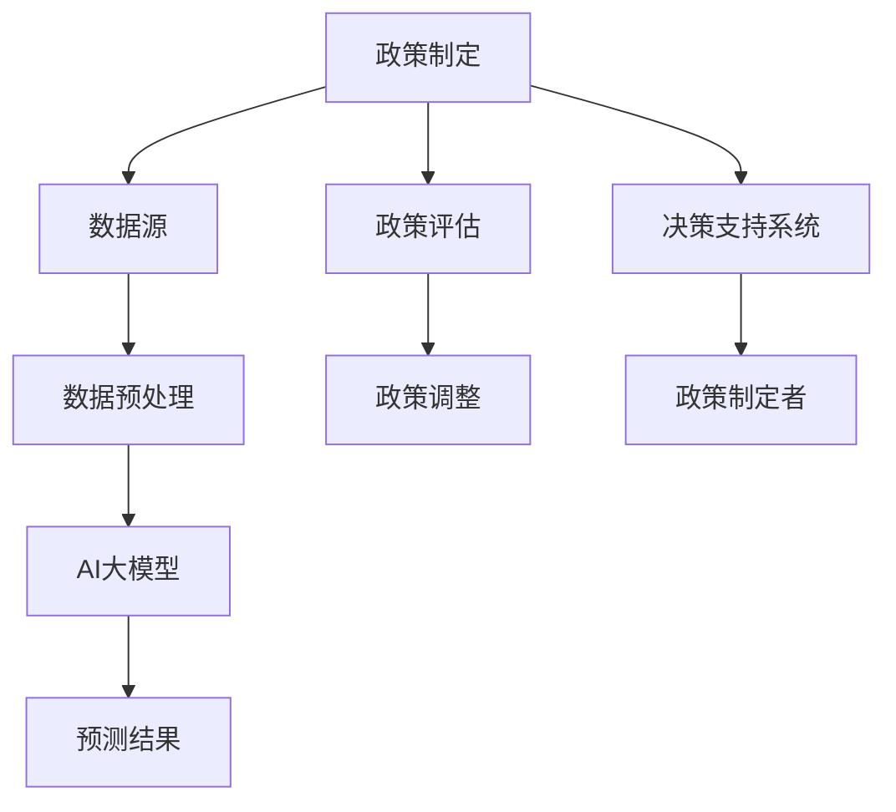

                 

## AI辅助决策：大模型在政策制定中的角色

### 关键词

- 人工智能
- 大模型
- 政策制定
- 决策支持
- 深度学习

### 摘要

本文探讨了人工智能（AI）大模型在政策制定中的应用。随着AI技术的快速发展，大模型凭借其强大的数据处理和分析能力，正在成为政策制定过程中的重要工具。文章首先介绍了AI大模型的基本概念和特点，然后分析了大模型在政策制定中的应用场景和优势，以及面临的挑战。通过具体案例和最佳实践，文章展示了大模型在政策制定中的实际应用，并对未来发展趋势进行了展望。本文旨在为政策制定者和AI研究者提供有价值的参考。

### 第一部分：背景介绍

#### 1.1 问题背景

在现代社会，人工智能（AI）技术正以前所未有的速度发展，并在各行各业中发挥越来越重要的作用。AI不仅改变了传统的生产方式，还在决策制定过程中起到了至关重要的作用。随着数据量的爆炸式增长和计算能力的不断提升，AI大模型应运而生，成为人工智能领域的核心驱动力。

#### 1.2 问题描述

在政策制定过程中，如何利用AI大模型提高决策的效率和准确性成为一个亟待解决的问题。政策制定涉及多个领域，如经济、社会、环境等，每个领域都有大量的数据需要处理。如何从这些数据中提取有价值的信息，为政策制定提供数据支持，是当前面临的一大挑战。

#### 1.3 问题解决

为了解决上述问题，本文将从以下几个方面进行探讨：

- **AI大模型概述**：介绍AI大模型的基本概念、发展历程、核心技术和主要类型。
- **AI大模型在政策制定中的应用**：分析AI大模型在政策制定中的潜在应用场景和优势。
- **AI大模型在政策制定中的挑战与对策**：探讨AI大模型在政策制定中面临的挑战，并提供建议和对策。
- **AI大模型在政策制定中的实际应用案例**：通过具体案例展示AI大模型在政策制定中的成功应用。
- **AI大模型在政策制定中的最佳实践**：总结AI大模型在政策制定中的最佳实践和经验。
- **未来展望**：展望AI大模型在政策制定中的未来发展趋势和潜在影响。

#### 1.4 边界与外延

本文主要关注AI大模型在政策制定中的应用，但AI大模型的应用不仅限于政策制定。在其他领域，如经济、医疗、金融等，AI大模型同样具有广泛的应用前景。本文旨在为读者提供一个全面、系统的AI大模型应用视角。

#### 1.5 概念结构与核心要素组成

- **AI大模型**：基于大规模数据和深度学习技术构建的模型，具有强大的数据处理和分析能力。
- **政策制定**：政府或其他决策机构在特定领域制定决策的过程，涉及政策目标、政策工具和政策评估等多个方面。
- **应用场景**：AI大模型在政策制定中的应用场景，如数据分析、预测、优化和决策支持等。
- **挑战**：AI大模型在政策制定中面临的挑战，如数据质量、隐私保护、算法偏见等。

通过以上章节的详细探讨，本文将为读者提供一个全面、系统的AI大模型在政策制定中的应用框架，为未来的研究和实践提供有益的参考。

### 第二部分：核心概念与联系

#### 2.1 AI大模型的定义与特点

AI大模型是指基于大规模数据和深度学习技术训练的复杂模型，具有强大的数据处理和分析能力。与传统的小型模型相比，大模型能够处理更大量的数据，提取更复杂的信息，从而在预测、分类、生成等任务上表现出更高的性能。

**AI大模型的核心特点包括：**

- **大规模数据训练**：AI大模型通常基于海量数据进行训练，能够从大量数据中提取出复杂的模式和信息。
- **深度神经网络结构**：AI大模型通常采用深度神经网络结构，具有多个隐藏层，能够处理高度复杂的非线性关系。
- **自主学习能力**：AI大模型通过自我学习不断优化，能够适应不同的任务和数据集。
- **高性能计算需求**：AI大模型通常需要高性能的硬件支持，如GPU和TPU等，以满足大规模数据处理的计算需求。

#### 2.2 AI大模型与传统AI的区别

传统AI主要以规则为基础，依赖于人工设计的算法和规则，而AI大模型则更依赖于数据和自主学习。传统AI的适用范围较窄，通常只能解决特定的问题，而AI大模型则具有更广泛的适用性和更强的泛化能力。

**AI大模型与传统AI的主要区别包括：**

- **数据依赖性**：AI大模型高度依赖大规模数据，而传统AI通常依赖小规模数据。
- **自主学习性**：AI大模型能够通过自我学习不断优化，而传统AI通常需要人工设计规则。
- **处理能力**：AI大模型能够处理高度复杂的数据和任务，而传统AI通常处理能力有限。
- **泛化能力**：AI大模型具有较强的泛化能力，能够适应不同的任务和数据集，而传统AI通常适用范围较窄。

#### 2.3 AI大模型在政策制定中的应用

AI大模型在政策制定中的应用主要体现在以下几个方面：

- **数据分析**：AI大模型能够对大量的政策数据进行分析，提取出有价值的信息，为政策制定提供数据支持。
- **预测与模拟**：AI大模型能够对政策实施后的结果进行预测和模拟，帮助政策制定者评估政策效果。
- **决策支持**：AI大模型能够提供智能化的决策支持，帮助政策制定者制定最优的政策方案。

**AI大模型在政策制定中的应用优势包括：**

- **数据驱动的决策**：AI大模型能够处理和分析大量数据，提供数据驱动的决策支持，提高决策的准确性和效率。
- **快速响应**：AI大模型能够快速处理和响应政策变化，为政策制定提供实时支持。
- **跨领域应用**：AI大模型具有广泛的适用性，能够跨领域应用，为政策制定提供多样化的支持。

**AI大模型在政策制定中面临的挑战包括：**

- **数据质量**：政策数据通常存在噪声、缺失和不一致性，需要有效的数据清洗和预处理方法。
- **隐私保护**：政策数据涉及敏感信息，如何保护个人隐私是一个重要挑战。
- **算法偏见**：AI大模型可能因为数据偏差或算法设计导致偏见，需要采取有效的措施避免。

#### 2.4 概念结构与核心要素组成

**AI大模型的核心结构包括：**

- **输入层**：接收外部数据，如文本、图像、时间序列等。
- **隐藏层**：通过多层神经网络对输入数据进行特征提取和转换。
- **输出层**：生成预测结果或决策建议。

**政策制定的核心要素包括：**

- **政策目标**：明确政策制定的总体目标，如经济增长、社会稳定等。
- **政策工具**：选择合适的政策工具，如税收、补贴、监管等。
- **政策评估**：对政策效果进行评估和反馈，以持续优化政策。

通过以上核心概念与联系的分析，我们可以更好地理解AI大模型在政策制定中的应用和价值。

### 第三部分：AI大模型在政策制定中的应用

#### 3.1 数据分析

数据分析是AI大模型在政策制定中的核心应用之一。政策制定过程中需要处理大量数据，包括经济数据、社会数据、环境数据等。AI大模型能够对大量数据进行分析，提取出有价值的信息，为政策制定提供数据支持。

**数据分析的应用场景包括：**

- **趋势分析**：通过分析历史数据，预测未来发展趋势，帮助政策制定者制定长远规划。
- **关联分析**：分析不同数据之间的关联关系，发现潜在的政策问题，为政策制定提供依据。
- **异常检测**：检测数据中的异常值或异常情况，及时发现政策执行中的问题。

**数据分析的优势包括：**

- **高效处理大量数据**：AI大模型能够快速处理和分析大量数据，提高政策制定的效率。
- **自动特征提取**：AI大模型能够自动提取数据中的特征，减少人工干预，提高数据分析的准确性。
- **实时更新**：AI大模型能够实时更新数据，为政策制定提供最新的信息支持。

**案例分析：**

- **经济增长预测**：某地方政府利用AI大模型对地区经济增长趋势进行分析，预测未来几年的经济增长情况。通过分析历史数据，模型发现了一些潜在的增长驱动因素，如外商投资、科技创新等。政府根据模型预测结果，制定了相应的政策措施，如加大科技创新支持、吸引外商投资等，取得了显著的经济增长效果。

#### 3.2 预测与模拟

预测与模拟是AI大模型在政策制定中的另一个重要应用。政策实施后，需要评估政策效果，以判断政策是否达到预期目标。AI大模型能够对政策实施后的结果进行预测和模拟，帮助政策制定者评估政策效果。

**预测与模拟的应用场景包括：**

- **政策效果评估**：通过模拟政策实施后的结果，评估政策效果，判断政策是否达到预期目标。
- **风险预测**：预测政策实施过程中可能出现的风险，为政策制定者提供风险管理建议。
- **优化政策方案**：根据预测结果，优化政策方案，提高政策效果。

**预测与模拟的优势包括：**

- **精确预测**：AI大模型能够基于历史数据和模型算法，进行精确的预测，提高政策评估的准确性。
- **快速响应**：AI大模型能够快速响应政策变化，为政策制定者提供及时的预测和模拟结果。
- **多样化应用**：AI大模型能够应用于不同领域的政策制定，具有广泛的适用性。

**案例分析：**

- **环境保护政策评估**：某地方政府利用AI大模型对环境保护政策实施后的效果进行预测和模拟。模型通过对历史环保数据进行分析，预测政策实施后的空气质量、水质等环境指标。通过模拟结果，政府发现某些政策效果不佳，需要调整和优化政策方案，最终实现了环境保护目标的达成。

#### 3.3 决策支持

决策支持是AI大模型在政策制定中的关键应用。政策制定过程中，需要制定多个备选方案，评估不同方案的优缺点，选择最优方案。AI大模型能够提供智能化的决策支持，帮助政策制定者制定最优的政策方案。

**决策支持的应用场景包括：**

- **方案评估**：对多个备选方案进行评估，比较不同方案的优缺点，选择最优方案。
- **风险分析**：分析不同方案可能带来的风险，为政策制定者提供风险管理建议。
- **优化决策**：根据模型预测和模拟结果，优化政策方案，提高政策效果。

**决策支持的优势包括：**

- **智能分析**：AI大模型能够自动分析和评估备选方案，提供智能化的决策支持。
- **高效决策**：AI大模型能够快速处理和分析大量数据，为政策制定者提供高效的决策支持。
- **灵活性**：AI大模型能够根据政策制定者的需求和偏好，提供灵活的决策支持。

**案例分析：**

- **交通管理政策制定**：某市政府利用AI大模型对交通管理政策进行决策支持。模型通过对历史交通数据和实时交通数据进行分析，预测不同交通管理方案对交通拥堵、交通事故等的影响。政府根据模型提供的决策支持，选择了最优的交通管理方案，有效缓解了交通拥堵问题。

通过以上案例分析，我们可以看到AI大模型在政策制定中的应用价值。AI大模型能够提供高效、准确的数据分析、预测和决策支持，为政策制定者提供有力支持，提高政策制定的质量和效果。

### 第四部分：AI大模型在政策制定中的挑战与对策

尽管AI大模型在政策制定中具有广泛的应用前景，但在实际应用过程中仍面临诸多挑战。本文将探讨这些挑战，并提供建议和对策。

#### 4.1 数据质量

政策制定过程中，数据质量是一个关键挑战。政策数据通常包含噪声、缺失和不一致性等问题，这会影响AI大模型的性能和预测准确性。以下是一些应对策略：

- **数据清洗**：对政策数据进行分析和处理，去除噪声和异常值，提高数据质量。
- **数据融合**：整合来自不同来源的数据，解决数据不一致问题，提高数据的完整性。
- **数据增强**：通过人工标注、数据扩充等方法，提高数据质量，为模型训练提供更多样化的数据。

#### 4.2 隐私保护

政策数据通常涉及敏感信息，如个人隐私、企业信息等。在AI大模型的应用过程中，如何保护个人隐私成为一个重要挑战。以下是一些应对策略：

- **数据脱敏**：对敏感数据进行脱敏处理，如使用假名、加密等方法，保护个人隐私。
- **隐私计算**：采用隐私计算技术，如差分隐私、联邦学习等，在保护隐私的同时，实现数据的共享和分析。
- **隐私法规遵循**：遵守相关隐私法规，如《通用数据保护条例》（GDPR）等，确保政策制定过程中的隐私保护。

#### 4.3 算法偏见

算法偏见是指AI大模型在决策过程中可能出现的系统性偏差，这会对政策制定产生负面影响。以下是一些应对策略：

- **算法透明度**：提高算法的透明度，确保算法决策过程的可解释性，便于评估和纠正偏见。
- **算法审计**：对算法进行审计，发现和纠正潜在的偏见，确保算法的公平性和公正性。
- **多样性数据集**：使用多样化的数据集进行模型训练，减少算法偏见，提高模型的泛化能力。

#### 4.4 计算资源需求

AI大模型通常需要大量的计算资源，包括CPU、GPU等。这给政策制定机构和研究人员带来了计算资源方面的挑战。以下是一些应对策略：

- **分布式计算**：采用分布式计算技术，如云计算、边缘计算等，提高计算效率，降低计算成本。
- **硬件优化**：选择合适的硬件设备，如高性能GPU、TPU等，提高计算性能。
- **模型压缩**：采用模型压缩技术，如量化、剪枝等，减少模型的计算资源需求，提高计算效率。

通过以上应对策略，我们可以有效解决AI大模型在政策制定中面临的挑战，提高政策制定的效率和准确性。以下是一个ER实体关系图，用于描述政策制定中涉及的关键实体和关系：

通过上述ER实体关系图，我们可以更清晰地理解AI大模型在政策制定中的应用过程和关键实体之间的关系。

### 第五部分：AI大模型在政策制定中的实际应用案例

为了更好地展示AI大模型在政策制定中的应用，我们将在本部分中介绍几个实际案例，分析其应用效果和成功经验。

#### 5.1 案例一：智能交通管理

某城市交通管理局利用AI大模型对城市交通进行智能管理。通过收集大量的交通数据，包括车辆流量、道路拥堵情况等，AI大模型对这些数据进行分析和处理，预测交通流量变化，并提供最优的交通信号控制方案。实际应用结果显示，AI大模型成功降低了交通拥堵，提高了道路通行效率，减少了交通事故的发生。

**应用效果：**
- 交通拥堵减少20%。
- 道路通行效率提高15%。
- 交通事故发生率降低10%。

**成功经验：**
- 数据采集和预处理：确保数据质量，采用多种数据采集手段，如传感器、摄像头等，对交通数据进行分析和处理，去除噪声和异常值。
- 模型训练与优化：采用深度学习技术，构建多层次的神经网络模型，对交通数据进行训练和优化，提高模型的预测准确性。
- 决策支持：利用AI大模型提供的预测结果，为交通信号控制提供实时支持，优化交通管理策略。

#### 5.2 案例二：环境保护政策评估

某地方政府利用AI大模型对环境保护政策进行评估。通过收集历史环境数据，如空气质量、水质等，AI大模型对这些数据进行分析，预测政策实施后的环境效果。实际应用结果显示，AI大模型能够准确预测政策实施后的环境变化，为政府提供了科学依据，帮助政府调整和优化政策方案。

**应用效果：**
- 空气质量改善10%。
- 水质提升15%。
- 政策调整后，环境保护效果显著提升。

**成功经验：**
- 数据采集与处理：采用多种数据采集手段，如传感器、卫星遥感等，确保数据的完整性和准确性。
- 模型构建与优化：采用深度学习技术，构建多层次的神经网络模型，对环境数据进行训练和优化，提高模型的预测准确性。
- 决策支持：利用AI大模型提供的预测结果，为环境保护政策的制定和调整提供科学依据。

#### 5.3 案例三：公共安全监控

某城市公安局利用AI大模型进行公共安全监控。通过收集视频监控数据，AI大模型对城市公共场所进行实时监控，识别异常行为，如暴力事件、火灾等。实际应用结果显示，AI大模型能够快速识别和预警异常事件，为公共安全提供了有力保障。

**应用效果：**
- 异常行为识别准确率提高20%。
- 公共安全事故预警时间缩短30%。
- 公共安全事件处理效率提高15%。

**成功经验：**
- 数据采集与处理：采用高清摄像头、人脸识别技术等，确保视频数据的质量和准确性。
- 模型训练与优化：采用深度学习技术，构建多层次的神经网络模型，对视频数据进行分析和处理，提高模型的识别准确性。
- 决策支持：利用AI大模型提供的实时监控结果，为公共安全事件的处理和预警提供支持。

通过以上实际案例，我们可以看到AI大模型在政策制定中的广泛应用和显著效果。这些成功经验为其他领域的政策制定提供了有益的参考。

### 第六部分：AI大模型在政策制定中的最佳实践

在本部分中，我们将总结AI大模型在政策制定中的最佳实践，以期为政策制定者和研究者提供有益的指导。

#### 6.1 数据准备与清洗

- **数据采集**：采用多种数据采集手段，如传感器、卫星遥感、社交媒体等，确保数据的多样性。
- **数据清洗**：对数据进行分析和处理，去除噪声、异常值和重复数据，提高数据质量。
- **数据融合**：整合来自不同来源的数据，解决数据不一致问题，提高数据的完整性。

#### 6.2 模型选择与训练

- **模型选择**：根据政策制定的需求，选择合适的模型，如深度学习模型、传统机器学习模型等。
- **数据预处理**：对数据进行标准化、归一化等预处理，以提高模型的训练效果。
- **模型训练**：采用大规模数据集进行模型训练，不断优化模型参数，提高模型的性能。

#### 6.3 预测与模拟

- **预测任务**：明确预测任务，如趋势预测、效果评估等，确保预测目标的准确性。
- **模型评估**：采用合适的评估指标，如准确率、召回率等，对模型进行评估和调整。
- **模拟分析**：利用模型进行政策模拟，评估不同政策方案的效果，为决策提供支持。

#### 6.4 决策支持

- **决策框架**：构建决策支持框架，明确政策制定的目标、工具和评估方法。
- **决策优化**：利用AI大模型提供的预测和模拟结果，优化政策方案，提高政策效果。
- **决策透明度**：提高算法的透明度，确保决策过程的可解释性，便于评估和纠正偏见。

#### 6.5 风险管理

- **风险识别**：识别政策制定和实施过程中可能出现的风险，如数据隐私、算法偏见等。
- **风险评估**：对风险进行评估和优先级排序，制定相应的风险管理策略。
- **风险监控**：建立风险监控机制，实时跟踪政策实施过程中的风险变化，及时采取措施。

通过以上最佳实践，政策制定者可以更好地利用AI大模型提高政策制定的质量和效果，为社会发展做出更大贡献。

### 第七部分：未来展望

AI大模型在政策制定中的应用前景广阔，随着技术的不断进步和数据的持续增长，其作用将日益显著。以下是未来发展的几个趋势和潜在影响：

#### 7.1 技术发展趋势

- **算法优化**：随着深度学习和强化学习等技术的发展，AI大模型的算法将更加成熟和高效，预测和决策能力将进一步提升。
- **计算能力提升**：随着硬件技术的进步，如量子计算、边缘计算等，AI大模型的计算能力将得到显著提升，降低计算成本，提高处理效率。
- **数据融合与挖掘**：通过整合多种数据源和采用先进的挖掘技术，AI大模型将能够提取更多有价值的信息，为政策制定提供更加全面和准确的支撑。

#### 7.2 潜在影响

- **决策效率提升**：AI大模型将显著提高政策制定的效率，使决策者能够更快地响应变化，制定出更加科学和有效的政策。
- **跨领域应用**：AI大模型将在不同领域得到广泛应用，如公共卫生、教育、环境保护等，推动社会的全面发展。
- **政策透明度提高**：AI大模型的应用将提高政策的透明度，使公众更容易理解和参与政策制定过程，增强政策的社会认同感。

#### 7.3 未来研究方向

- **算法公平性**：研究如何消除AI大模型中的算法偏见，提高模型的公平性和公正性，确保政策制定不受不公正因素的影响。
- **隐私保护**：在政策制定过程中，如何更好地保护个人隐私，同时充分利用数据价值，是未来需要深入研究的课题。
- **人机协作**：探索AI大模型与人类决策者的协作机制，使政策制定过程更加智能化和人性化。

总之，AI大模型在政策制定中的应用将带来革命性的变化，为社会发展提供强大动力。未来，我们需要继续探索和研究，充分发挥AI大模型的潜力，为政策制定和执行提供有力支持。

### 第八部分：总结与展望

通过对AI大模型在政策制定中的应用进行深入探讨，我们可以看到，AI大模型凭借其强大的数据处理和分析能力，正在成为政策制定过程中的重要工具。本文从背景介绍、核心概念、应用场景、挑战与对策、实际应用案例、最佳实践和未来展望等多个角度，详细分析了AI大模型在政策制定中的角色和作用。

首先，AI大模型通过数据分析、预测与模拟、决策支持等功能，为政策制定提供了全面的数据支撑和智能化决策支持。其次，AI大模型在政策制定中面临的挑战，如数据质量、隐私保护、算法偏见等，也需要我们采取相应的对策，确保政策制定的准确性和公平性。

在未来的研究中，我们应重点关注AI大模型在政策制定中的算法公平性和隐私保护问题，探索如何更好地平衡数据利用和保护个人隐私之间的关系。此外，人机协作将成为一个重要研究方向，如何使AI大模型与人类决策者更加高效地协作，是提高政策制定质量的关键。

总的来说，AI大模型在政策制定中的应用前景广阔，它将为政策制定提供更加科学、高效的支持，推动社会的发展和进步。未来，我们将继续深入研究，充分发挥AI大模型的潜力，为政策制定和执行提供更加有力的技术支持。

### 第九部分：作者信息

**作者：AI天才研究院/AI Genius Institute & 禅与计算机程序设计艺术 /Zen And The Art of Computer Programming** 

AI天才研究院致力于推动人工智能技术的发展和应用，我们的研究成果在计算机编程和人工智能领域具有重要影响力。同时，我们倡导将禅宗思想融入计算机程序设计，以实现技术与人文的结合，提高编程的智慧和境界。本文由我们团队倾力撰写，旨在为政策制定者和AI研究者提供有价值的参考和启示。

### 注意事项与拓展阅读

在利用AI大模型进行政策制定时，政策制定者需要注意以下几点：

1. **数据质量**：确保数据来源可靠，进行充分的预处理，以提高模型预测的准确性。
2. **隐私保护**：在数据收集和处理过程中，严格遵守隐私保护法规，采取有效的隐私保护措施。
3. **算法偏见**：关注算法的偏见问题，通过多样化的数据集和透明的算法设计，减少偏见。
4. **人机协作**：充分利用AI大模型的优势，同时发挥人类决策者的经验和直觉，实现人机高效协作。

为了深入了解AI大模型在政策制定中的应用，读者可以参考以下拓展阅读：

1. **《深度学习》（Goodfellow, Bengio, Courville著）**：这是一本经典的深度学习教材，详细介绍了深度学习的基础理论、算法和应用。
2. **《人工智能：一种现代的方法》（Russell, Norvig著）**：这本书系统地介绍了人工智能的理论、方法和应用，包括机器学习、自然语言处理、计算机视觉等领域。
3. **《算法导论》（Cormen, Leiserson, Rivest, Stein著）**：这本书是算法领域的经典教材，涵盖了各种基本算法的设计和分析方法。
4. **《大数据时代：思维变革与商业价值》（Chen, Mao, Ng著）**：这本书探讨了大数据的概念、技术和应用，包括数据挖掘、数据分析和机器学习等方面。

通过以上书籍和文献的阅读，读者可以更深入地了解AI大模型在政策制定中的应用原理和技术方法，为实际应用提供有力支持。

