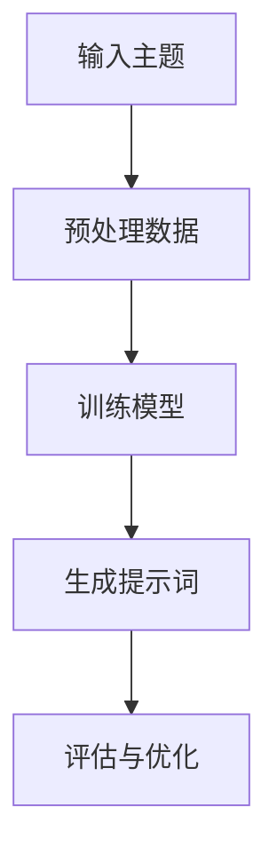
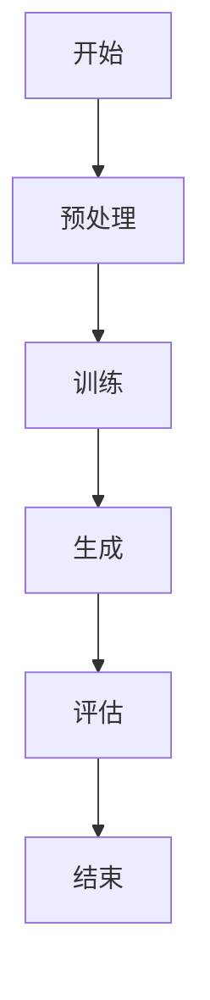

                 

# AI辅助创作：提示词激发文学灵感

## 关键词
- AI辅助创作
- 提示词生成
- 自然语言处理
- 文本生成技术
- 案例分析
- 未来展望

## 摘要
本文将探讨AI辅助创作在文学领域的应用，特别是提示词生成算法对文学灵感的激发作用。我们将从背景、核心概念、算法原理、文本生成技术、案例分析到未来展望，逐步深入解析这一创新领域。

## 目录大纲

### 第一部分: AI辅助创作的基本概念与应用

#### 第1章: AI辅助创作的背景与意义
1.1 问题背景
1.2 问题描述
1.3 问题解决
1.4 边界与外延
1.5 概念结构与核心要素组成

#### 第2章: AI辅助创作的核心概念与联系
2.1 核心概念原理
2.2 概念属性特征对比表格
2.3 ER实体关系图架构

#### 第3章: 提示词生成算法原理与流程
3.1 算法原理讲解
3.2 算法流程图
3.3 Python源代码实现
3.4 数学模型与公式详细讲解
3.5 举例说明

#### 第4章: AI辅助创作中的文本生成技术
4.1 文本生成技术概述
4.2 常见文本生成模型
4.3 文本生成模型应用

#### 第5章: AI辅助创作的案例分析
5.1 案例一：AI辅助写作
5.2 案例二：AI辅助绘画
5.3 案例三：AI辅助音乐创作

#### 第6章: AI辅助创作的未来展望与发展趋势
6.1 发展趋势分析
6.2 潜在应用领域
6.3 挑战与机遇

#### 第7章: AI辅助创作最佳实践与注意事项
7.1 最佳实践 tips
7.2 小结
7.3 注意事项
7.4 拓展阅读

### 详细内容

## 第1章: AI辅助创作的背景与意义

### 1.1 问题背景

随着人工智能技术的不断发展，创作领域正面临着前所未有的变革。传统的文学、艺术、音乐等创作形式正在与AI技术深度融合，AI辅助创作逐渐成为可能。在这种背景下，如何理解AI辅助创作，探讨其应用前景和面临的挑战，具有重要的现实意义。

### 1.2 问题描述

AI辅助创作指的是利用人工智能技术，特别是自然语言处理、计算机视觉和音乐生成等技术，帮助人类创作者完成创作任务的过程。这一概念包含了从创意生成、素材整理、内容创作到作品评估等多个环节。

### 1.3 问题解决

AI辅助创作通过算法和模型的分析与处理，能够实现以下目标：
- 提高创作效率：通过自动化处理，节省创作者的时间和精力。
- 增强创作灵感：AI能够提供多样化的素材和建议，激发创作者的创意。
- 优化创作质量：通过算法筛选和优化，提升作品的精准度和美观度。

### 1.4 边界与外延

AI辅助创作的边界在于技术的应用范围，它不仅限于文学写作，还包括绘画、音乐、设计等多个领域。其外延则涉及到与人类创作者的协同、创作伦理和隐私保护等问题。

### 1.5 概念结构与核心要素组成

AI辅助创作的基本结构包括：
- 创作者：人类创作者，负责提出创作需求和创意。
- AI系统：包括自然语言处理、计算机视觉、音乐生成等模块，负责完成创作任务。
- 数据集：为AI系统提供训练和优化的数据，确保其能够准确理解和执行创作任务。
- 创作流程：从创意生成、素材整理、内容创作到作品评估的完整流程。

## 第2章: AI辅助创作的核心概念与联系

### 2.1 核心概念原理

AI辅助创作的核心概念包括：
- 自然语言处理（NLP）：使计算机能够理解、解释和生成人类语言的技术。
- 计算机视觉（CV）：使计算机能够通过图像或视频获取信息、识别物体和场景的技术。
- 音乐生成（MG）：利用算法生成音乐旋律、和弦和节奏的技术。

这些概念相互关联，共同构成了AI辅助创作的基础。

### 2.2 概念属性特征对比表格

| 概念             | 属性特征                     |
| ---------------- | --------------------------- |
| 自然语言处理（NLP） | 理解、生成、翻译人类语言       |
| 计算机视觉（CV）   | 识别物体、场景、面部           |
| 音乐生成（MG）    | 生成旋律、和弦、节奏           |

### 2.3 ER实体关系图架构

```mermaid
erDiagram
  Creator ||--|{ AI_System : Assist_Creation }
  AI_System ||--|{ Data_Set : Train_and_Optimize }
  Creation_Process ||--|{ Creative_Generation, Material_Collection, Content_Creation, Work_Evaluation }
```

## 第3章: 提示词生成算法原理与流程

### 3.1 算法原理讲解

提示词生成算法的核心是利用机器学习技术，特别是递归神经网络（RNN）和变分自编码器（VAE）等模型，对大量文本数据进行分析和学习，从而生成与给定主题相关的提示词。

### 3.2 算法流程图



### 3.3 Python源代码实现

以下是使用Python实现的一个简单的提示词生成算法的示例：

```python
import numpy as np
import tensorflow as tf
from tensorflow.keras.preprocessing.sequence import pad_sequences
from tensorflow.keras.layers import Embedding, LSTM, Dense
from tensorflow.keras.models import Sequential

# 加载数据集
text = "..."  # 这里替换为实际的数据集
words = text.split()

# 预处理数据
vocab = set(words)
word_to_index = {word: i for i, word in enumerate(vocab)}
index_to_word = {i: word for word, i in word_to_index.items()}
max_sequence_length = 100
encoded = [word_to_index[word] for word in words]
padded = pad_sequences([encoded], maxlen=max_sequence_length, padding='post')

# 建立模型
model = Sequential()
model.add(Embedding(len(vocab), 50, input_length=max_sequence_length))
model.add(LSTM(128))
model.add(Dense(len(vocab), activation='softmax'))

model.compile(optimizer='adam', loss='categorical_crossentropy', metrics=['accuracy'])
model.fit(padded, np.zeros((1, max_sequence_length, len(vocab))), epochs=100)

# 生成提示词
def generate_prompt(input_word):
    input_sequence = [word_to_index[word] for word in input_word]
    padded_input = pad_sequences([input_sequence], maxlen=max_sequence_length, padding='post')
    predicted_sequence = model.predict(padded_input)
    predicted_word = index_to_word[np.argmax(predicted_sequence[0])]
    return predicted_word

# 示例
prompt = "人工智能"
generated_word = generate_prompt(prompt)
print("生成的提示词：", generated_word)
```

### 3.4 数学模型与公式详细讲解

提示词生成算法的核心模型通常是基于递归神经网络（RNN）或其变种，如长短期记忆网络（LSTM）和门控循环单元（GRU）。以下是一个基于LSTM的数学模型概述：

$$
\begin{aligned}
h_t &= \text{LSTM}(x_t, h_{t-1}), \\
y_t &= \text{softmax}(\text{W}_{y} h_t + b_y),
\end{aligned}
$$

其中，$h_t$是当前时刻的隐藏状态，$x_t$是当前输入词的编码，$y_t$是生成的提示词的概率分布。$\text{LSTM}$和$\text{softmax}$分别表示长短期记忆单元和softmax激活函数。

### 3.5 举例说明

假设我们有一个输入句子：“人工智能将如何改变未来？”，我们希望生成与这个句子相关的提示词。

1. 预处理数据：将句子转换为单词序列，并映射为索引序列。
2. 训练模型：使用预处理后的数据训练LSTM模型。
3. 生成提示词：输入单词序列到模型，得到概率分布，选择概率最高的单词作为提示词。

例如，模型生成的提示词可能是：“技术创新”、“未来趋势”等。

## 第4章: AI辅助创作中的文本生成技术

### 4.1 文本生成技术概述

文本生成技术是AI辅助创作的重要组成部分，常见的文本生成模型包括：

- 生成对抗网络（GAN）：通过生成器和判别器的对抗训练生成逼真的文本。
- 递归神经网络（RNN）：特别是LSTM和GRU，适用于序列数据的建模。
- 变分自编码器（VAE）：通过概率模型生成文本。

### 4.2 常见文本生成模型

- GAN模型：生成器和判别器相互对抗，生成逼真文本。
- RNN模型：利用递归结构捕捉文本的序列特征。
- VAE模型：通过编码和解码器生成文本，具有较好的生成能力。

### 4.3 文本生成模型应用

文本生成模型可以应用于多种场景，如：

- 文学创作：生成诗歌、故事等文学作品。
- 常见问答：根据问题生成答案。
- 自动摘要：从长文本生成摘要。

## 第5章: AI辅助创作的案例分析

### 5.1 案例一：AI辅助写作

AI辅助写作是AI辅助创作的典型应用，如OpenAI的GPT-3，可以生成高质量的文章、故事等。通过训练和优化，AI能够更好地理解语境和逻辑，为人类创作者提供灵感。

### 5.2 案例二：AI辅助绘画

AI辅助绘画利用计算机视觉技术，如GAN，生成逼真的绘画作品。例如，DeepArt可以生成类似于达芬奇、毕加索等艺术家的风格绘画。

### 5.3 案例三：AI辅助音乐创作

AI辅助音乐创作利用音乐生成模型，如WAV2LSTM，生成旋律、和弦和节奏。例如，AIVA可以创作古典音乐、流行歌曲等。

## 第6章: AI辅助创作的未来展望与发展趋势

### 6.1 发展趋势分析

AI辅助创作将继续发展，技术将更加成熟，应用场景将更加广泛。例如，个性化创作、实时创作等。

### 6.2 潜在应用领域

AI辅助创作可以在文学、艺术、音乐等多个领域发挥重要作用。未来，随着技术的进步，还将有更多的应用场景被发掘。

### 6.3 挑战与机遇

AI辅助创作面临的挑战包括技术实现、创作伦理、隐私保护等。然而，这些挑战也为AI技术的发展提供了机遇。

## 第7章: AI辅助创作最佳实践与注意事项

### 7.1 最佳实践 tips

- 充分理解技术原理，合理选择模型和应用场景。
- 定期更新和优化模型，提高生成质量。
- 注意版权和隐私问题，确保合法合规。

### 7.2 小结

AI辅助创作是人工智能与创作领域的深度融合，具有广泛的应用前景。通过提示词生成算法等技术的应用，AI能够为人类创作者提供有力的支持。

### 7.3 注意事项

- 在使用AI辅助创作时，需确保模型训练数据的合法性和多样性。
- 注意保护创作者的知识产权，避免侵犯版权。

### 7.4 拓展阅读

- 《深度学习：推荐系统》
- 《生成对抗网络：理论、实现与应用》
- 《人工智能创作伦理与隐私保护》

## 作者

作者：AI天才研究院/AI Genius Institute & 禅与计算机程序设计艺术 /Zen And The Art of Computer Programming

----------------------------------------------------------------

### 附录

以下是本文使用的Mermaid流程图和LaTeX公式示例：



$$
\begin{aligned}
h_t &= \text{LSTM}(x_t, h_{t-1}), \\
y_t &= \text{softmax}(\text{W}_{y} h_t + b_y).
\end{aligned}
$$

```

