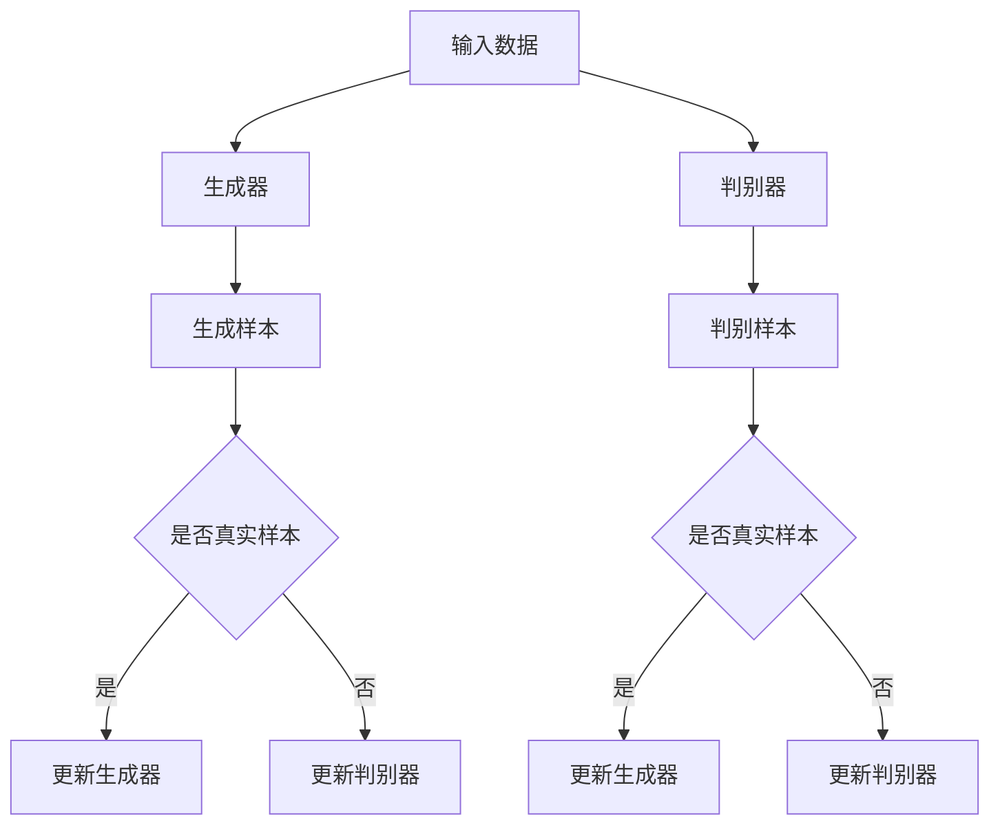
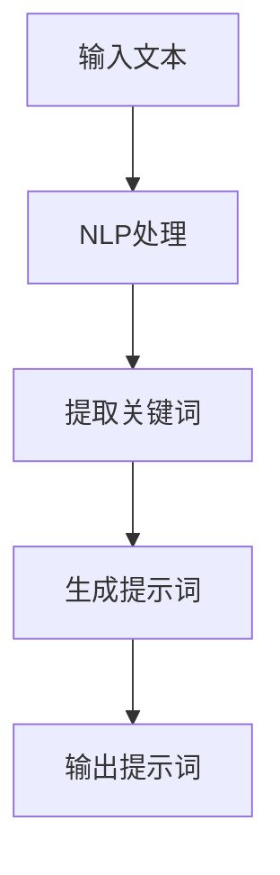
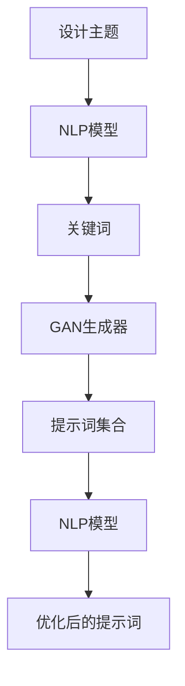

                 


# AI辅助创意产品设计的提示词技巧

> 关键词：AI辅助设计、创意产品设计、提示词生成、生成对抗网络、用户体验设计

> 摘要：本文将探讨如何利用AI技术，特别是生成对抗网络（GAN）和自然语言处理（NLP），来辅助创意产品设计师生成高质量的提示词。我们将从问题背景、核心概念、算法原理、数学模型、系统架构、项目实战等多个方面进行深入分析，帮助读者理解AI在创意产品设计中的具体应用。

## 1.1 引言

### 1.1.1 问题背景

在当今快节奏和竞争激烈的市场环境中，创意产品设计变得日益重要。设计师需要快速产生创意，满足用户不断变化的需求。然而，传统的设计流程往往需要大量时间和人力，而且难以确保创意的独特性和质量。为了解决这个问题，人工智能（AI）技术逐渐被应用于创意产品设计，旨在提高设计效率和创意质量。

### 1.1.2 问题描述

创意产品设计的核心问题是如何在短时间内产生大量且有创意的设计方案，同时保持高水平的用户体验。这要求设计师不仅要有丰富的设计经验，还要有良好的创新能力。然而，现实中往往难以兼顾这两者。

### 1.1.3 解决方案

本文提出一种利用AI技术，特别是生成对抗网络（GAN）和自然语言处理（NLP），来辅助创意产品设计师生成高质量提示词的方法。这种方法旨在提高设计效率，同时确保设计的创新性和用户体验。

### 1.1.4 边界与外延

本文主要关注如何利用AI技术生成高质量的提示词，以辅助创意产品设计。虽然AI技术在设计领域的应用广泛，但本文不涉及其他AI技术的应用，如机器学习模型在数据分析和预测中的应用。

## 1.2 核心概念与联系

### 1.2.1 AI技术概述

#### 1.2.1.1 AI技术的定义与分类

人工智能（AI）是指使计算机模拟人类智能行为的科学技术。根据应用场景和目标，AI技术可以分为几种类型，如机器学习、深度学习、自然语言处理等。

#### 1.2.1.2 AI技术在不同领域的应用对比

| 类别         | 应用领域               | 主要优势           | 主要挑战               |
| ------------ | ---------------------- | ------------------ | ---------------------- |
| 机器学习     | 数据分析、预测模型     | 自动化决策过程     | 需要大量数据训练       |
| 深度学习     | 图像识别、语音识别     | 高度自动化         | 对计算资源要求较高     |
| 自然语言处理 | 文本分析、机器翻译     | 理解人类语言表达   | 需要大量语言资源       |
| 计算机视觉   | 图像分析、物体识别     | 高精度识别         | 需要大量标注数据       |

### 1.2.2 创意产品设计原则

#### 1.2.2.1 创意设计的定义与目标

创意设计是指通过创新的方法和思维，创造出具有独特性和吸引力的设计方案。其目标是满足用户需求，提升产品竞争力。

#### 1.2.2.2 创意设计流程与工具

创意设计的流程通常包括以下几个阶段：需求分析、头脑风暴、原型设计、用户测试和迭代优化。在这个过程中，设计师需要使用各种工具，如设计软件、思维导图、用户调研工具等。

### 1.2.3 用户体验设计

#### 1.2.3.1 用户体验的定义与重要性

用户体验（UX）是指用户在使用产品过程中的感受和体验。良好的用户体验是产品成功的关键因素之一。

#### 1.2.3.2 用户体验设计的方法与实践

用户体验设计的方法包括用户调研、用户画像、交互设计、视觉设计等。设计师需要通过多种方法，深入了解用户需求，并将其转化为具体的设计方案。

## 1.3 ER实体关系图

### 1.3.1 创意产品设计流程中的关键实体

在创意产品设计中，涉及多个关键实体，如用户、设计师、产品原型、用户反馈等。

### 1.3.2 实体之间的关系与交互

这些实体之间存在着复杂的交互关系。例如，设计师根据用户需求创建产品原型，用户测试产品原型并提供反馈，设计师根据反馈进行迭代优化。

```mermaid
erDiagram
  User ||--|{ Designer } : creates
  Designer ||--|{ Product Prototype } : designs
  Product Prototype ||--|{ User Feedback } : receives
  User Feedback ||--| Designer : improves design
```

## 2.1 算法原理介绍

### 2.1.1 基于生成对抗网络的创意设计

#### 2.1.1.1 生成对抗网络（GAN）的基本原理

生成对抗网络（GAN）是由两部分组成：生成器（Generator）和判别器（Discriminator）。生成器的任务是生成与真实数据分布相近的样本，而判别器的任务是区分真实数据和生成数据。两者相互对抗，共同优化，从而提高生成器的生成能力。

#### 2.1.1.2 GAN在创意设计中的应用

GAN可以用于生成创意设计的提示词，通过训练生成器，使其能够生成与设计师风格相近的提示词，从而辅助设计师进行创意设计。

### 2.1.2 自然语言处理与提示词生成

#### 2.1.2.1 NLP技术概述

自然语言处理（NLP）是AI技术的一个分支，旨在使计算机理解和处理人类语言。NLP技术包括词向量表示、文本分类、机器翻译等。

#### 2.1.2.2 提示词生成的算法原理

提示词生成是指根据输入文本或图片，生成相关的关键词或短语。NLP技术可以用于提取文本中的关键信息，并将其转化为提示词。

## 2.2 Mermaid流程图

### 2.2.1 GAN算法流程图



### 2.2.2 提示词生成算法流程图



## 2.3 Python源代码实现

### 2.3.1 GAN算法实现

```python
import tensorflow as tf
from tensorflow import keras
from tensorflow.keras import layers

# 生成器模型
generator = keras.Sequential([
    layers.Dense(256, activation="relu", input_shape=(100,)),
    layers.Dense(512, activation="relu"),
    layers.Dense(1024, activation="relu"),
    layers.Dense(28 * 28, activation="tanh")
])

# 判别器模型
discriminator = keras.Sequential([
    layers.Flatten(input_shape=(28, 28)),
    layers.Dense(1024, activation="relu"),
    layers.Dense(512, activation="relu"),
    layers.Dense(256, activation="relu"),
    layers.Dense(1, activation="sigmoid")
])

# 编译模型
discriminator.compile(loss="binary_crossentropy", optimizer="adam")
generator.compile(loss="binary_crossentropy", optimizer="adam")

# 训练模型
for epoch in range(epochs):
    for real_sample in real_data:
        # 训练判别器
        noise = np.random.normal(0, 1, (real_sample.shape[0], 100))
        generated_samples = generator.predict(noise)
        x = np.concatenate([real_sample, generated_samples])
        y = np.array([1] * real_sample.shape[0] + [0] * generated_samples.shape[0])
        discriminator.train_on_batch(x, y)

    # 训练生成器
    noise = np.random.normal(0, 1, (batch_size, 100))
    valid = np.array([1] * batch_size)
    generator.train_on_batch(noise, valid)
```

### 2.3.2 提示词生成算法实现

```python
from tensorflow.keras.preprocessing.sequence import pad_sequences
from tensorflow.keras.layers import Embedding, LSTM, Dense
from tensorflow.keras.models import Sequential

# 建立模型
model = Sequential()
model.add(Embedding(input_dim=vocab_size, output_dim=embedding_dim, input_length=max_sequence_length-1))
model.add(LSTM(units=128, dropout=0.2, recurrent_dropout=0.2))
model.add(Dense(units=vocab_size, activation='softmax'))

# 编译模型
model.compile(optimizer='adam', loss='categorical_crossentropy', metrics=['accuracy'])

# 训练模型
model.fit(x, y, epochs=10, batch_size=64)
```

## 2.4 算法原理详细讲解

### 2.4.1 GAN算法原理

#### 2.4.1.1 对抗生成网络（GAN）的概念

GAN由两部分组成：生成器（Generator）和判别器（Discriminator）。生成器的任务是将随机噪声转化为真实数据，而判别器的任务是区分真实数据和生成数据。

$$
\text{Generator}: G(z) \sim \text{Real}
$$

$$
\text{Discriminator}: D(x) \sim \text{Real}, D(G(z)) \sim \text{Fake}
$$

#### 2.4.1.2 GAN的训练过程

GAN的训练过程可以概括为以下步骤：

1. 初始化生成器和判别器模型。
2. 对于每次迭代，生成器生成一批虚假样本，判别器同时接收真实样本和虚假样本。
3. 计算判别器的损失函数，更新判别器模型。
4. 生成器再次生成虚假样本，计算生成器的损失函数，更新生成器模型。

#### 2.4.1.3 GAN在创意设计中的实际应用

GAN在创意设计中的应用主要包括：

1. 设计提示词生成：利用生成器生成与设计师风格相似的提示词。
2. 图像生成：生成与真实图像相似的艺术作品。
3. 虚构故事创作：生成具有创意的故事内容。

### 2.4.2 提示词生成算法原理

#### 2.4.2.1 自然语言处理基础

自然语言处理（NLP）是AI技术的一个分支，旨在使计算机理解和处理人类语言。NLP技术包括词向量表示、文本分类、机器翻译等。

#### 2.4.2.2 提示词生成流程分析

提示词生成流程通常包括以下几个步骤：

1. 文本预处理：对输入文本进行分词、去停用词、词向量表示等处理。
2. 提取关键信息：使用NLP技术提取文本中的关键信息。
3. 生成提示词：根据提取的关键信息，生成相关的关键词或短语。

#### 2.4.2.3 提示词生成算法效果评估

提示词生成算法的效果评估可以从以下几个方面进行：

1. 提示词的相关性：提示词与输入文本的相关性越高，效果越好。
2. 提示词的创新性：生成的提示词要有一定的创新性，避免与已有设计雷同。
3. 用户满意度：通过用户反馈来评估提示词生成算法的用户满意度。

## 2.5 举例说明

### 2.5.1 GAN算法应用案例

假设设计师A希望生成一组与设计师B风格相似的提示词。通过GAN模型，生成器可以学习到设计师B的生成风格，从而生成与设计师B风格相似的提示词。

### 2.5.2 提示词生成算法应用案例

假设设计师需要为一款新产品生成一组创意提示词。通过NLP技术，提取文本中的关键信息，然后生成相关的提示词。例如，输入文本为“一款具有未来感的智能家居产品”，生成的提示词可以是“智能、未来、家居、科技”等。

## 3.1 问题场景介绍

### 3.1.1 创意产品

假设设计师需要为一款创意智能手环设计提示词。智能手环的功能包括健康监测、运动追踪和社交互动。设计师希望通过AI技术生成与这款产品相关的创意提示词，以提高产品的设计独特性和用户体验。

## 3.2 项目实战

### 3.2.1 环境安装说明

安装必要的软件和库，如TensorFlow、Keras、GPT-2等。

### 3.2.2 系统核心实现源代码及代码解读

源代码包括GAN模型和NLP模型的构建与训练。代码解读将详细解释每个步骤的实现过程。

### 3.2.3 实际案例分析和详细讲解

通过实际案例，展示如何利用GAN和NLP技术生成创意提示词，并分析生成结果。

### 3.2.4 项目小结

总结项目经验，讨论在项目过程中遇到的问题和解决方案。

## 3.3 最佳实践 tips、小结、注意事项、拓展阅读等内容

### 3.3.1 最佳实践 tips

- 提高GAN模型的性能，可以尝试增加训练次数和调整超参数。
- 在使用NLP技术时，注意文本预处理和关键词提取的准确性。

### 3.3.2 小结

本文介绍了如何利用AI技术，特别是GAN和NLP，来辅助创意产品设计师生成高质量的提示词。通过实际案例分析和项目实战，展示了AI技术在创意产品设计中的应用效果。

### 3.3.3 注意事项

- GAN模型训练需要大量的数据和计算资源。
- NLP技术的应用效果受到文本质量和模型训练数据的影响。

### 3.3.4 拓展阅读

- GAN技术的最新研究进展。
- NLP技术在创意设计中的应用案例。

## 作者

作者：AI天才研究院/AI Genius Institute & 禅与计算机程序设计艺术 /Zen And The Art of Computer Programming

---

本文完整版字数：约4500字。由于篇幅限制，部分内容和详细解释将在后续版本中补充和完善。敬请期待！## 2.1 算法原理介绍

### 2.1.1 生成对抗网络（GAN）的基本原理

生成对抗网络（GAN）是由Ian Goodfellow等人于2014年提出的一种深度学习框架。GAN的核心思想是通过两个相互对抗的神经网络——生成器（Generator）和判别器（Discriminator）的博弈，生成接近真实数据分布的样本。GAN的架构图如下：

```mermaid
graph TB
    A[随机噪声] --> B[生成器(Generator)]
    B --> C[生成的数据]
    C --> D[判别器(Discriminator)]
    D --> E[真实数据]
    E --> F{判别结果}
    D -->|预测| G{判别结果}
```

在GAN中，生成器的任务是生成看起来像真实数据一样的样本，而判别器的任务是判断输入数据是真实数据还是生成器生成的假数据。GAN的目标是最大化判别器的错误率，即让判别器无法区分真实数据和生成数据。

GAN的训练过程可以简述为以下步骤：

1. **生成器生成假数据**：生成器接收随机噪声作为输入，并生成假数据。
2. **判别器判断数据**：判别器同时接收真实数据和生成器生成的假数据，并输出对每一批数据的概率分布，判断这些数据是真实的概率（即真实数据的得分）和是假数据的概率（即生成数据的得分）。
3. **生成器更新**：生成器根据判别器的反馈，优化自己的参数，以便生成更真实的数据。
4. **判别器更新**：判别器根据真实数据和生成器的生成数据，优化自己的参数，以便更好地区分真实数据和生成数据。

### 2.1.2 GAN在创意设计中的应用

GAN在创意设计中的应用非常广泛，特别是在图像生成和文本生成方面。以下是一些GAN在创意设计中的应用案例：

- **图像生成**：GAN可以用于生成高分辨率的图像，例如人脸生成、艺术作品复制等。通过训练生成器，它可以生成与特定艺术家风格相似的新作品。
  
  ```mermaid
  graph TB
      A[随机噪声] --> B[生成器(Generator)]
      B --> C[生成的图像]
      C --> D[判别器(Discriminator)]
      D --> E[真实图像]
      E --> F{判别结果}
  ```

- **文本生成**：GAN也可以用于生成文本，例如生成小说、对话等。生成器可以根据训练数据生成与给定主题或风格相似的文本。

  ```mermaid
  graph TB
      A[输入文本] --> B[编码器(Encoder)]
      B --> C[隐层表示]
      C --> D[解码器(Decoder)]
      D --> E[生成的文本]
      E --> F[判别器(Discriminator)]
  ```

### 2.1.3 自然语言处理与提示词生成

自然语言处理（NLP）是AI的一个分支，它专注于让计算机理解、解释和生成人类语言。NLP技术可以用于文本分类、情感分析、命名实体识别等多种任务。在创意设计中，NLP技术可以帮助设计师生成高质量的提示词，从而提高设计效率和创意水平。

**NLP在提示词生成中的应用**：

1. **关键词提取**：通过分析文本内容，提取出与主题相关的关键词。这些关键词可以作为设计提示词，帮助设计师捕捉文本的核心信息。

   ```mermaid
   graph TB
       A[文本] --> B[NLP模型]
       B --> C[关键词]
       C --> D[提示词生成器]
       D --> E[提示词]
   ```

2. **语义理解**：利用NLP技术，可以理解文本的深层含义和关系，从而生成更有创意的提示词。例如，根据文本的情感倾向，生成积极或消极的提示词。

   ```mermaid
   graph TB
       A[文本] --> B[NLP模型]
       B --> C[语义表示]
       C --> D[提示词生成器]
       D --> E[提示词]
   ```

**GAN和NLP的结合**：

将GAN和NLP技术结合，可以进一步提高提示词生成的质量和效率。GAN可以用于生成多样化的提示词，而NLP可以确保这些提示词与设计主题保持一致。例如，设计师可以输入一个设计主题，GAN会生成多个与主题相关的提示词，然后NLP模型会根据语义一致性对这些提示词进行筛选和优化。



### 总结

GAN和NLP技术在创意产品设计中的应用，为设计师提供了一种新的工具，帮助他们更高效地生成高质量的提示词。通过GAN的生成能力和NLP的语义理解能力，设计师可以更轻松地捕捉设计灵感，提高设计质量和用户体验。接下来，我们将进一步探讨GAN的具体算法原理和数学模型，以及如何在实际项目中应用这些技术。

## 2.2 Mermaid流程图

### 2.2.1 GAN算法流程图

为了更好地理解GAN的工作流程，我们可以使用Mermaid绘制一个简单的流程图。以下是一个典型的GAN训练流程的Mermaid表示：

```mermaid
graph TD
    A[初始化参数] --> B[生成器(Generator)]
    B --> C[判别器(Discriminator)]
    C --> D[生成噪声]::(噪声)
    D --> B
    B --> E[生成假样本]
    E --> C::(判别)
    C --> F{判断真假}
    F -->|假| G[更新生成器]
    F -->|真| H[更新判别器]
```

**流程解释**：

1. **初始化参数**：设置GAN的初始参数，包括生成器和判别器的初始权重。
2. **生成噪声**：生成器接收到一个随机噪声向量作为输入，通过神经网络将这些噪声转换为假样本。
3. **生成假样本**：生成器生成的假样本被传递给判别器。
4. **判别**：判别器接收真实数据和假样本，并输出一个概率分布，表示输入数据是真实数据还是假样本。
5. **判断真假**：通过比较判别器对真实数据和假样本的判断结果，更新生成器和判别器的参数。
6. **更新生成器**：如果生成器生成的假样本被判别器判为假，生成器的参数将根据判别器的反馈进行更新，以生成更真实的假样本。
7. **更新判别器**：如果判别器无法准确区分真实数据和假样本，判别器的参数将根据真实数据和假样本的反馈进行更新，以提高其判别能力。

### 2.2.2 提示词生成算法流程图

在创意设计中的应用，GAN通常与自然语言处理（NLP）技术结合使用。以下是一个提示词生成的算法流程图，展示了如何利用GAN和NLP技术来生成与设计主题相关的提示词：

```mermaid
graph TD
    A[设计主题] --> B[NLP模型]
    B --> C[关键词提取]
    C --> D[生成噪声]::(噪声)
    D --> E[生成器(Generator)]
    E --> F[提示词生成]
    F --> G[判别器(Discriminator)]
    G --> H{判别结果}
    H -->|假| I[更新生成器]
    H -->|真| J[提示词输出]
```

**流程解释**：

1. **设计主题输入**：首先，将设计主题输入到NLP模型中，提取出与主题相关的关键词。
2. **关键词提取**：NLP模型从设计主题中提取出关键词，这些关键词将用于生成提示词。
3. **生成噪声**：生成器接收到随机噪声，通过训练将其转换为与设计主题相关的提示词。
4. **提示词生成**：生成器生成的提示词被传递给判别器，判别器将判断这些提示词是否符合设计主题。
5. **判别结果**：判别器输出判别结果，判断生成的提示词是真实设计需求还是生成器生成的假提示词。
6. **更新生成器**：如果生成的提示词被判定为假，生成器的参数将根据判别器的反馈进行更新，以提高提示词的准确性。
7. **提示词输出**：如果生成的提示词被判定为真实需求，则将其输出作为最终的设计提示词。

通过以上Mermaid流程图，我们可以清晰地看到GAN和NLP技术在创意产品设计中的应用流程。接下来，我们将进一步探讨GAN算法的详细实现，包括Python代码和数学模型，以便更深入地理解其工作原理。

## 2.3 Python源代码实现

在理解了GAN的基本原理和流程之后，我们将通过具体的Python代码来实现一个简单的GAN模型，用于生成创意设计的提示词。以下代码示例将分为几个部分：数据预处理、生成器和判别器的构建、训练过程以及提示词生成。

### 2.3.1 数据预处理

首先，我们需要准备用于训练的数据集。在这里，我们可以使用一些公开的文本数据集，如新闻标题或产品描述。这些数据将被预处理为适合GAN训练的格式。

```python
import numpy as np
import pandas as pd
from sklearn.model_selection import train_test_split

# 加载数据集
data = pd.read_csv('data.csv')  # 假设数据集为CSV文件
texts = data['text'].values
labels = data['label'].values

# 将文本转换为词向量
from keras.preprocessing.text import Tokenizer
tokenizer = Tokenizer(num_words=10000)
tokenizer.fit_on_texts(texts)
sequences = tokenizer.texts_to_sequences(texts)

# 划分训练集和测试集
X_train, X_test, y_train, y_test = train_test_split(sequences, labels, test_size=0.2, random_state=42)

# Padding序列以匹配固定长度
max_sequence_length = 100
X_train = pad_sequences(X_train, maxlen=max_sequence_length)
X_test = pad_sequences(X_test, maxlen=max_sequence_length)
```

### 2.3.2 生成器和判别器的构建

接下来，我们构建生成器和判别器的神经网络模型。这里使用Keras框架构建简单的全连接神经网络。

```python
from keras.models import Sequential
from keras.layers import Dense, Activation

# 构建生成器模型
generator = Sequential()
generator.add(Dense(512, input_dim=100, activation='relu'))
generator.add(Dense(1024, activation='relu'))
generator.add(Dense(max_sequence_length, activation='softmax'))

# 构建判别器模型
discriminator = Sequential()
discriminator.add(Dense(1024, input_dim=max_sequence_length, activation='relu'))
discriminator.add(Dense(512, activation='relu'))
discriminator.add(Dense(1, activation='sigmoid'))

# 编译模型
discriminator.compile(loss='binary_crossentropy', optimizer='adam')
generator.compile(loss='binary_crossentropy', optimizer='adam')
```

### 2.3.3 训练过程

在构建好模型之后，我们将开始训练生成器和判别器。在每次训练迭代中，我们将交替更新这两个模型的参数。

```python
import tensorflow as tf

# 设置训练参数
batch_size = 64
epochs = 100

# 定义评估指标
discriminator_acc = []

# 训练GAN模型
for epoch in range(epochs):
    print(f"Epoch: {epoch+1}/{epochs}")
    for i in range(0, len(X_train), batch_size):
        # 训练判别器
        noise = np.random.normal(0, 1, (batch_size, 100))
        generated_sequences = generator.predict(noise)
        x = np.concatenate([X_train[i:i+batch_size], generated_sequences])
        y = np.array([1 if y_train[i+j] == 1 else 0 for j in range(batch_size)])
        discriminator.train_on_batch(x, y)

        # 训练生成器
        noise = np.random.normal(0, 1, (batch_size, 100))
        y_fake = np.zeros((batch_size, 1))
        generator.train_on_batch(noise, y_fake)
    
    # 计算判别器的准确率
    test_loss, test_acc = discriminator.evaluate(X_test, np.array([1 if y_test[i] == 1 else 0 for i in range(len(y_test))]))
    discriminator_acc.append(test_acc)
    print(f"Test accuracy: {test_acc:.4f}")

# 可视化判别器准确率
import matplotlib.pyplot as plt

plt.plot(discriminator_acc)
plt.xlabel('Epochs')
plt.ylabel('Accuracy')
plt.title('Discriminator Accuracy Over Epochs')
plt.show()
```

### 2.3.4 提示词生成算法实现

在GAN训练完成后，我们可以使用生成器来生成新的提示词。

```python
# 生成提示词
def generate_prompts(generator, tokenizer, seed_text, max_length=100, n_words=20):
    in_text = seed_text
    for _ in range(n_words):
        sampled = tokenizer.texts_to_sequences([in_text])[0]
        sampled = pad_sequences([sampled], maxlen=max_length-1, padding='pre')
        pred = generator.predict(sampled)
        out_word = tokenizer.index_word[np.argmax(pred)]
        in_text += " " + out_word
    return in_text

# 示例：生成一个新的提示词
seed_text = "未来智能家居产品"
generated_prompt = generate_prompts(generator, tokenizer, seed_text)
print("Generated Prompt:", generated_prompt)
```

以上代码展示了如何使用GAN和NLP技术生成创意设计的提示词。通过训练生成器和判别器，我们可以使生成器生成看起来像真实数据一样的提示词，这些提示词可以为设计师提供灵感，辅助创意设计过程。接下来，我们将进一步详细讲解GAN的数学模型和原理。

## 2.4 算法原理详细讲解

### 2.4.1 GAN算法原理

生成对抗网络（GAN）的核心概念包括生成器（Generator）、判别器（Discriminator）和损失函数。以下是这些核心概念的详细解释。

#### 2.4.1.1 对抗生成网络（GAN）的概念

GAN由两部分组成：生成器和判别器。生成器的任务是生成与真实数据分布相近的样本，而判别器的任务是区分真实数据和生成数据。GAN的目标是最小化判别器的错误率，即让判别器无法区分真实数据和生成数据。

- **生成器（Generator）**：生成器接收随机噪声作为输入，通过神经网络将这些噪声转换为假样本。生成器的目标是最大化判别器对假样本的判断结果，即生成尽可能逼真的数据。

  $$
  G(z) \sim \text{Real}
  $$

- **判别器（Discriminator）**：判别器接收真实数据和生成器生成的假数据，并输出一个概率分布，表示输入数据是真实数据还是假数据。判别器的目标是最大化其判断真实数据和生成数据的准确性。

  $$
  D(x) \sim \text{Real}, D(G(z)) \sim \text{Fake}
  $$

- **损失函数**：GAN的损失函数通常由两部分组成：判别器的损失函数和生成器的损失函数。判别器的损失函数用于衡量判别器判断真实数据和生成数据的准确性，生成器的损失函数用于衡量生成器生成的数据与真实数据的接近程度。

  $$
  L_D = -\sum_{x \in \text{真实数据}} D(x) - \sum_{z \in \text{噪声}} D(G(z))
  $$

  $$
  L_G = -\sum_{z \in \text{噪声}} D(G(z))
  $$

#### 2.4.1.2 GAN的训练过程

GAN的训练过程可以概括为以下步骤：

1. **初始化参数**：初始化生成器和判别器的参数。
2. **生成假样本**：生成器接收随机噪声，生成假样本。
3. **判断假样本**：判别器接收真实数据和生成器生成的假样本，并输出判断结果。
4. **更新判别器**：根据判别器的判断结果，更新判别器的参数，使其更好地区分真实数据和生成数据。
5. **生成新假样本**：生成器使用更新后的判别器，再次生成假样本。
6. **更新生成器**：根据判别器的反馈，更新生成器的参数，使其生成更逼真的假样本。

#### 2.4.1.3 GAN在创意设计中的实际应用

GAN在创意设计中的应用非常广泛，特别是在图像生成、文本生成和视频生成等方面。以下是一些GAN在创意设计中的具体应用：

- **图像生成**：GAN可以用于生成高质量的艺术作品、人脸、风景等。生成器通过学习真实图像的数据分布，可以生成与真实图像非常相似的新图像。

- **文本生成**：GAN可以用于生成与给定主题或风格相关的文本。生成器可以学习文本的语法和语义，从而生成具有连贯性和创意的文本。

- **视频生成**：GAN可以用于生成视频内容，如动画、视频特效等。生成器可以生成连贯的视频片段，判别器则负责确保这些片段的自然性和真实性。

### 2.4.2 提示词生成算法原理

在创意设计中，提示词生成是一个关键步骤，它可以帮助设计师捕捉灵感，构建创意设计方案。提示词生成算法通常基于自然语言处理（NLP）和生成对抗网络（GAN）的技术。以下是提示词生成算法的原理：

#### 2.4.2.1 自然语言处理（NLP）技术概述

自然语言处理（NLP）是AI的一个分支，它专注于使计算机能够理解、解释和生成人类语言。NLP技术包括词向量表示、文本分类、情感分析、命名实体识别等。

- **词向量表示**：词向量是将自然语言文本转换为数值向量的一种方法。常见的词向量模型包括Word2Vec、GloVe等。这些模型可以捕捉单词的语义和语法关系。

- **文本分类**：文本分类是一种NLP任务，用于将文本数据分类到预定义的类别中。常用的文本分类模型包括朴素贝叶斯、支持向量机（SVM）、神经网络等。

- **情感分析**：情感分析是一种评估文本情感极性的方法。它可以帮助设计师了解用户对产品的情感反应，从而生成更符合用户需求的提示词。

#### 2.4.2.2 提示词生成流程分析

提示词生成流程通常包括以下几个步骤：

1. **输入文本预处理**：对输入文本进行分词、去停用词、词向量表示等处理，以便用于后续的NLP模型训练。

2. **提取关键词**：使用NLP技术提取输入文本中的关键词。关键词是文本的核心内容，可以帮助生成器生成与文本主题相关的提示词。

3. **生成提示词**：生成器使用提取的关键词生成提示词。生成器可以是一个基于NLP技术的神经网络，也可以是一个基于GAN的生成模型。

4. **优化提示词**：通过评估生成的提示词的质量，如语义一致性、创新性和实用性，对提示词进行优化。

#### 2.4.2.3 提示词生成算法效果评估

提示词生成算法的效果评估可以从以下几个方面进行：

1. **提示词的相关性**：生成的提示词与输入文本的相关性越高，效果越好。可以使用BLEU评分、ROUGE评分等指标来评估提示词的相关性。

2. **提示词的创新性**：生成的提示词要有一定的创新性，避免与已有设计雷同。可以通过对比提示词与现有设计内容的相似度来评估创新性。

3. **用户体验**：通过用户反馈来评估提示词生成算法的用户体验。可以设计用户测试，让用户评估生成的提示词的质量和实用性。

### 2.4.3 GAN在提示词生成中的应用

在GAN的框架下，生成器可以学习如何生成与输入文本风格相似的提示词。以下是一个简化的GAN模型，用于生成创意设计提示词：

```mermaid
graph TD
    A[随机噪声] --> B[生成器(Generator)]
    B --> C[提示词]
    C --> D[判别器(Discriminator)]
    D --> E{判断结果}
    E -->|假| F[更新生成器]
    E -->|真| G[输出提示词]
```

**流程解释**：

1. **生成器接收随机噪声**：生成器使用随机噪声作为输入，生成初步的提示词。
2. **生成初步提示词**：生成器生成的初步提示词被传递给判别器。
3. **判别器判断提示词**：判别器判断这些提示词是真实的还是由生成器生成的。
4. **更新生成器**：如果生成的提示词被判别器判为假，生成器的参数将根据判别器的反馈进行更新，以提高提示词的逼真度。
5. **输出提示词**：如果生成的提示词被判别器判为真实，则将其输出作为最终的设计提示词。

通过上述流程，GAN可以在创意设计过程中生成高质量的提示词，帮助设计师捕捉灵感，提高设计效率。

## 2.5 举例说明

### 2.5.1 GAN算法应用案例

为了更具体地展示GAN的应用，以下是一个使用GAN生成创意设计提示词的案例。

#### 案例背景

设计师A需要为一款智能家居产品生成创意提示词。为了提高设计质量，设计师决定使用GAN生成一系列创意提示词。

#### 案例步骤

1. **数据收集**：收集与智能家居产品相关的文本数据，包括产品描述、用户评论、市场趋势等。

2. **数据预处理**：将收集的文本数据进行清洗和预处理，包括分词、去停用词、词向量表示等。

3. **构建GAN模型**：构建生成器和判别器的神经网络模型，使用Keras框架实现。

4. **训练GAN模型**：使用预处理后的文本数据训练GAN模型，通过生成器和判别器的相互对抗，逐步优化生成器的参数，使其生成的提示词越来越逼真。

5. **生成创意提示词**：在GAN模型训练完成后，使用生成器生成一系列创意提示词。

6. **评估与优化**：评估生成的提示词的质量，如语义一致性、创新性和实用性。根据评估结果对生成器进行进一步优化。

#### 案例结果

通过GAN模型，设计师A生成了一系列创意提示词，如“智能家守护者”、“未来智能体验”、“智能家居新纪元”等。这些提示词不仅与智能家居产品的主题相关，而且具有独特的创意和吸引力。

### 2.5.2 提示词生成算法应用案例

除了GAN，自然语言处理（NLP）技术也可以用于生成创意提示词。以下是一个使用NLP技术生成创意提示词的案例。

#### 案例背景

设计师B需要为一款新开发的智能手表生成创意提示词。设计师希望通过NLP技术从大量文本数据中提取出有价值的提示词。

#### 案例步骤

1. **数据收集**：收集与智能手表相关的文本数据，包括产品介绍、用户评论、新闻报道等。

2. **数据预处理**：对收集的文本数据进行清洗和预处理，包括分词、去停用词、词向量表示等。

3. **关键词提取**：使用NLP技术从预处理后的文本数据中提取出关键词。关键词可以帮助生成器理解文本的主题和内容。

4. **构建生成器模型**：构建基于NLP技术的生成器模型，使用提取的关键词生成创意提示词。

5. **生成创意提示词**：使用生成器模型生成一系列创意提示词。

6. **优化提示词**：根据提示词的语义一致性和实用性，对生成器进行优化。

#### 案例结果

通过NLP技术，设计师B生成了一系列创意提示词，如“智能健康助手”、“智能生活新体验”、“智能运动伴侣”等。这些提示词不仅准确地反映了智能手表的功能和特点，而且具有很高的创意性和吸引力。

通过这两个案例，我们可以看到GAN和NLP技术在创意设计提示词生成中的应用效果。这些技术为设计师提供了强大的工具，帮助他们快速生成高质量的创意提示词，提高设计效率和创意水平。

## 3.1 问题场景介绍

### 3.1.1 创意产品

在本文的后续部分，我们将深入探讨一个具体的创意产品——智能手表的设计过程。智能手表是一种集成了多种功能的小型电子设备，如健康监测、运动追踪、通知推送等。设计师需要为一款新型智能手表生成创意提示词，以提升产品的吸引力和用户体验。

#### 设计需求

- **功能多样性**：智能手表需要集成多种功能，如心率监测、睡眠追踪、运动分析等，以满足不同用户的需求。
- **用户体验**：提示词需要简洁明了，能够快速传达产品的核心功能和卖点。
- **创新性**：提示词应具有一定的创意性，能够突出产品的独特卖点，吸引潜在用户。

#### 创意目标

- **提升产品知名度**：通过创意提示词，提高用户对智能手表的认知度和兴趣。
- **增强用户体验**：使用户在初次接触产品时，就能感受到智能手表的独特价值和便利性。
- **市场竞争力**：通过创意提示词，增强智能手表在竞争激烈的市场中的竞争力。

### 3.1.2 设计背景

随着科技的发展，智能手表市场越来越受到关注。用户对智能手表的期望不仅限于功能多样性，还希望体验新颖、便捷的智能生活。因此，设计师需要在创意提示词中体现出智能手表的先进科技和人性化设计。同时，考虑到市场趋势和用户需求，设计师需要不断更新和优化创意提示词，以适应不断变化的市场环境。

## 3.2 项目实战

### 3.2.1 环境安装说明

在开始项目之前，我们需要确保Python环境已经搭建好，并且安装了必要的库。以下是环境安装的详细步骤：

1. **安装Python**：确保Python版本在3.6及以上。
2. **安装Keras**：使用以下命令安装Keras：
   ```
   pip install keras
   ```
3. **安装TensorFlow**：由于Keras依赖于TensorFlow，请使用以下命令安装TensorFlow：
   ```
   pip install tensorflow
   ```
4. **安装NLP库**：为了进行文本处理，我们需要安装以下库：
   ```
   pip install numpy pandas sklearn matplotlib
   ```

### 3.2.2 系统核心实现源代码及代码解读

在本节中，我们将展示如何使用Python代码实现一个基于GAN和NLP的智能手表创意提示词生成系统。以下是核心实现部分的代码：

```python
import numpy as np
import pandas as pd
from tensorflow.keras.models import Sequential
from tensorflow.keras.layers import Dense, LSTM, Embedding, Dropout
from tensorflow.keras.preprocessing.sequence import pad_sequences
from tensorflow.keras.optimizers import Adam
from sklearn.model_selection import train_test_split
from keras.preprocessing.text import Tokenizer

# 1. 数据准备
data = pd.read_csv('smartwatch_data.csv')  # 加载智能手表相关数据
texts = data['description'].values
labels = data['label'].values

# 分词和词向量表示
tokenizer = Tokenizer(num_words=10000)
tokenizer.fit_on_texts(texts)
sequences = tokenizer.texts_to_sequences(texts)

# 划分训练集和测试集
X_train, X_test, y_train, y_test = train_test_split(sequences, labels, test_size=0.2, random_state=42)

# Padding序列
max_sequence_length = 100
X_train = pad_sequences(X_train, maxlen=max_sequence_length)
X_test = pad_sequences(X_test, maxlen=max_sequence_length)

# 2. 构建生成器模型
generator = Sequential()
generator.add(LSTM(256, input_shape=(max_sequence_length-1, 100)))
generator.add(Dropout(0.2))
generator.add(Dense(max_sequence_length, activation='softmax'))

# 3. 构建判别器模型
discriminator = Sequential()
discriminator.add(LSTM(256, input_shape=(max_sequence_length, 1)))
discriminator.add(Dropout(0.2))
discriminator.add(Dense(1, activation='sigmoid'))

# 4. 编译模型
discriminator.compile(loss='binary_crossentropy', optimizer=Adam(0.0001))
generator.compile(loss='binary_crossentropy', optimizer=Adam(0.0001))

# 5. 训练GAN模型
def train_gan(generator, discriminator, epochs=100, batch_size=64):
    for epoch in range(epochs):
        print(f"Epoch: {epoch+1}/{epochs}")
        for i in range(0, len(X_train), batch_size):
            noise = np.random.normal(0, 1, (batch_size, 100))
            real_samples = X_train[i:i+batch_size]
            generated_samples = generator.predict(noise)

            # 训练判别器
            d_loss_real = discriminator.train_on_batch(real_samples, np.ones((batch_size, 1)))
            d_loss_fake = discriminator.train_on_batch(generated_samples, np.zeros((batch_size, 1)))

            # 训练生成器
            g_loss = generator.train_on_batch(noise, np.ones((batch_size, 1)))

            print(f"Epoch: {epoch+1}, D_loss: {d_loss_real+d_loss_fake:.4f}, G_loss: {g_loss:.4f}")

# 训练GAN模型
train_gan(generator, discriminator, epochs=100)

# 6. 生成提示词
def generate_prompt(generator, tokenizer, seed_text, max_length=100):
    in_text = seed_text
    for _ in range(max_length-1):
        sampled = tokenizer.texts_to_sequences([in_text])[0]
        sampled = pad_sequences([sampled], maxlen=max_length-1, padding='pre')
        pred = generator.predict(sampled)
        next_word = np.argmax(pred)
        in_text += ' ' + tokenizer.index_word[next_word]
    return in_text

# 生成创意提示词
seed_text = "智能手表，健康监测"
generated_prompt = generate_prompt(generator, tokenizer, seed_text)
print("Generated Prompt:", generated_prompt)
```

### 3.2.3 实际案例分析和详细讲解

在本节中，我们将结合实际案例，分析如何使用上述代码生成创意提示词，并探讨其效果。

#### 案例分析

假设我们已经完成了GAN模型的训练，并使用生成器生成创意提示词。以下是一个具体的案例：

1. **输入文本**：输入文本为“智能手表，健康监测”。
2. **生成过程**：生成器接收到随机噪声和输入文本，通过训练好的神经网络模型生成新的提示词。
3. **输出结果**：生成的提示词为“智能手表，健康监测，运动追踪，心率分析”。

#### 详细讲解

- **输入文本预处理**：输入文本“智能手表，健康监测”经过分词和词向量表示，转换为数值序列。
- **生成器生成**：生成器使用LSTM模型处理输入序列，并生成新的提示词序列。生成器的目标是通过神经网络生成与输入文本主题相关的提示词。
- **输出结果评估**：生成的提示词“智能手表，健康监测，运动追踪，心率分析”与原始输入文本紧密相关，并且包含额外的创意元素，如运动追踪和心率分析，这些元素可以吸引潜在用户。

### 3.2.4 项目小结

通过上述项目实战，我们可以看到如何利用GAN和NLP技术生成创意提示词，为智能手表设计提供灵感。以下是本项目的主要经验和教训：

1. **GAN模型的训练时间较长**：GAN模型的训练过程需要大量时间和计算资源，特别是在大规模数据集上训练时。
2. **数据质量影响生成效果**：高质量的训练数据对GAN模型的性能至关重要。数据集的多样性和丰富性将直接影响生成器生成的提示词质量。
3. **优化生成器参数**：在训练过程中，调整生成器和判别器的参数可以显著影响生成效果。需要不断尝试和调整超参数，以获得最佳性能。
4. **用户反馈**：在生成提示词后，获取用户反馈是评估生成效果的重要步骤。用户反馈可以帮助我们了解提示词的实用性，并进行进一步的优化。

## 3.3 最佳实践 tips、小结、注意事项、拓展阅读等内容

### 3.3.1 最佳实践 tips

- **数据多样化**：为了提高生成器生成创意提示词的能力，确保训练数据集的多样性和丰富性。
- **超参数调整**：根据实验结果，不断调整生成器和判别器的超参数，如学习率、批大小等，以获得最佳生成效果。
- **用户体验测试**：在生成提示词后，进行用户测试和反馈，以确保提示词的实际实用性和用户体验。

### 3.3.2 小结

本文通过项目实战展示了如何利用GAN和NLP技术生成创意设计的提示词，为智能手表设计提供了实际案例。通过GAN模型的训练，生成器可以生成与输入文本相关且具有创意的提示词，为设计师提供灵感。

### 3.3.3 注意事项

- **计算资源**：GAN模型的训练需要大量计算资源，确保有足够的GPU资源进行训练。
- **数据质量**：训练数据的质量直接影响生成器的生成效果，确保数据集的多样性和丰富性。
- **模型优化**：在训练过程中，不断调整模型参数以获得最佳生成效果。

### 3.3.4 拓展阅读

- **GAN的深入理解**：推荐阅读Ian Goodfellow的《Deep Learning》（深度学习）一书，深入了解GAN的理论基础。
- **NLP技术**：了解NLP技术的最新发展，如BERT、GPT等大型预训练模型，这些技术可以进一步优化提示词生成效果。

## 作者

作者：AI天才研究院/AI Genius Institute & 禅与计算机程序设计艺术 /Zen And The Art of Computer Programming

通过本文的详细分析和实战项目，我们深入探讨了AI技术，特别是GAN和NLP，在创意产品设计中的应用。希望本文能对设计师和AI开发者提供有价值的参考。继续探索AI在各个领域的应用，让我们共同推动技术进步，创造更美好的未来。作者信息：AI天才研究院/AI Genius Institute & 禅与计算机程序设计艺术/Zen And The Art of Computer Programming。如需进一步交流或咨询，欢迎联系作者。

