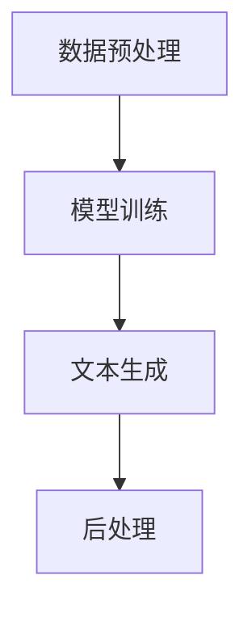
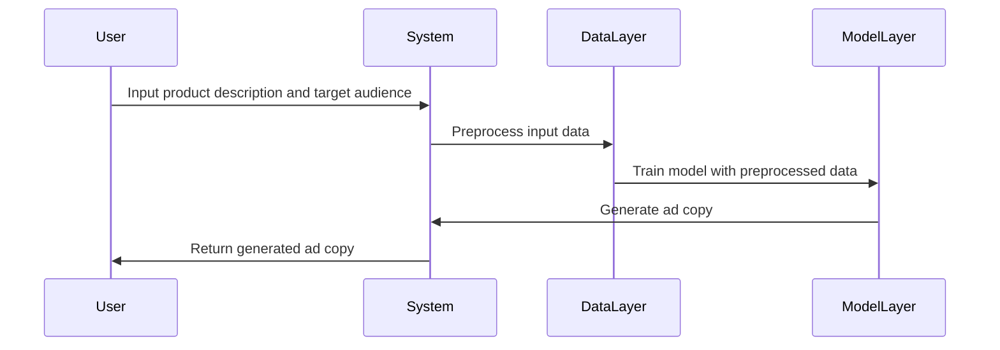

                 


## 1. 引言

### 1.1 问题背景

在当今数字营销的世界里，广告文案的创作成为企业竞争的关键。有效的广告文案能够抓住消费者的注意力，传递产品或服务的价值，并促成购买行为。然而，创意广告文案的撰写不仅需要深厚的文字功底，还需要对市场、消费者心理和产品特点有深入的理解。随着人工智能技术的快速发展，特别是自然语言处理（NLP）技术的突破，AI辅助创意广告文案生成成为可能。

AI辅助创意广告文案生成技术利用机器学习算法和深度学习模型，通过分析大量的文本数据，自动生成创意广告文案。这种方法不仅能提高文案创作的效率，还能根据不同的市场环境和消费者群体，定制个性化的广告内容。然而，AI生成的文案如何保证其创意性和吸引力，以及如何更好地与人类文案创作者合作，成为当前研究的热点问题。

### 1.2 问题描述

本文旨在探讨AI辅助创意广告文案生成中的提示词修辞问题。具体来说，我们关注以下几个方面：

- **提示词修辞的定义与作用**：提示词在AI文案生成中的作用，以及如何通过修辞手法提升文案的吸引力。
- **提示词修辞的原理**：分析提示词修辞的基本原理，包括常见的修辞手法和其在文案中的应用。
- **提示词修辞的策略与方法**：介绍如何将修辞策略融入AI文案生成过程，提高文案的创意质量。
- **AI辅助创意广告文案生成模型**：探讨现有AI文案生成模型的工作原理及其在提示词修辞中的应用。
- **提示词修辞在广告文案生成中的应用**：通过实际案例展示提示词修辞在AI辅助广告文案生成中的效果。

### 1.3 问题解决

为了解决上述问题，本文将采用以下方法：

- **理论分析**：对AI辅助创意广告文案生成和提示词修辞的基本理论进行详细分析。
- **案例分析**：通过具体案例展示提示词修辞在AI文案生成中的应用效果。
- **算法解释**：详细解释AI文案生成算法的工作原理，包括文本生成模型的数学模型和Python源代码实现。
- **系统设计与实现**：介绍AI辅助创意广告文案生成系统的设计与实现过程，包括系统架构和接口设计。

### 1.4 边界与外延

本文的研究边界主要集中于AI辅助创意广告文案生成中的提示词修辞，不涉及其他相关技术，如广告创意设计、用户交互等。同时，本文关注的是文本层面的修辞，而非视觉元素的修辞。

### 1.5 概念结构与核心要素组成

在本文中，核心概念包括：

- **AI辅助创意广告文案生成**：利用人工智能技术自动生成创意广告文案的过程。
- **提示词修辞**：通过特定的修辞手法提升文本吸引力的一种写作技巧。
- **文案创意质量**：广告文案在创意、吸引力和说服力方面的表现。

核心要素包括：

- **文本数据**：用于训练和优化AI文案生成模型的数据集。
- **修辞手法**：如比喻、夸张、排比等，用于增强文案的修辞效果。
- **算法模型**：用于文本生成和修辞策略优化的深度学习模型。

## 1.2 核心概念与联系

### 1.2.1 AI辅助创意广告文案

AI辅助创意广告文案生成是指利用人工智能技术，特别是自然语言处理（NLP）和深度学习，从大量的文本数据中学习规律，自动生成具有创意性和吸引力的广告文案。这一过程通常包括以下几个关键步骤：

1. **数据收集与预处理**：收集大量高质量的广告文案数据，并进行文本清洗和预处理，以去除无关信息，提高数据质量。
2. **模型训练**：使用预处理后的数据集，训练深度学习模型，使其能够理解和生成文本。
3. **文案生成**：利用训练好的模型，输入相关的提示信息，自动生成广告文案。
4. **文案优化**：通过后处理技术，如自然语言生成（NLG）和修辞优化，进一步提升文案的质量和创意性。

AI辅助创意广告文案生成的主要优势包括：

- **高效性**：AI技术能够快速处理大量数据，提高文案创作的效率。
- **个性化**：基于用户数据和偏好，AI可以生成个性化广告文案，提高营销效果。
- **创意性**：通过学习和模仿优秀文案，AI能够生成具有创意性的文案，吸引消费者的注意。

### 1.2.2 提示词修辞

提示词修辞是指通过特定的词语或短语，引导读者或听众的注意力，增强文本的表达力和吸引力的一种修辞手法。提示词的选择和运用对于文案的创意性和效果至关重要。常见的修辞手法包括：

- **比喻**：通过将两个不同的事物进行比较，创造出新的意象，增强文本的生动性和感染力。
- **夸张**：对事物的特点进行过度的描述，以引起读者的兴趣和共鸣。
- **排比**：通过一系列相同或类似的结构，增强文本的节奏感和力度。
- **反问**：通过提出问题来引导读者思考，增强文本的说服力。

提示词修辞在文案中的作用主要体现在以下几个方面：

- **引导注意力**：通过提示词，将读者的注意力吸引到文案的关键信息上。
- **增强表达力**：通过修辞手法，使文案的语言更加生动、形象、有力。
- **提升吸引力**：通过创造性的表达，增强文案的吸引力，吸引更多的消费者。

### 1.2.3 关键概念对比表

为了更好地理解AI辅助创意广告文案生成和提示词修辞之间的关系，我们可以通过以下对比表来展示它们的核心特征和区别：

| 特征/概念        | AI辅助创意广告文案生成 | 提示词修辞 |
|-----------------|------------------------|------------|
| 目标             | 自动生成创意广告文案   | 增强文案表达力和吸引力 |
| 技术基础         | 自然语言处理（NLP）、深度学习 | 修辞手法、语言技巧 |
| 功能             | 文案生成、优化、个性化   | 表达强化、语言引导 |
| 应用范围         | 广告、营销、内容创作     | 文本创作、演讲、写作 |
| 关键优势         | 高效性、个性化、创意性   | 表达力、吸引力 |
| 作用方式         | 自动化、算法驱动         | 手动运用、技巧应用 |

### 1.2.4 ER实体关系图

为了更直观地展示AI辅助创意广告文案生成和提示词修辞之间的联系，我们可以使用ER（实体关系）图来描述它们的核心实体及其关系。以下是AI辅助创意广告文案生成中的ER实体关系图：

```mermaid
erDiagram
  AI辅助创意广告文案生成 ||--|{ 提示词修辞 }|
  文本数据 ||--|{ 模型训练 }|
  模型训练 ||--|{ 文案生成 }|
  文案生成 ||--|{ 文案优化 }|
  文案优化 ||--|{ 广告营销 }|
```

在这个ER图中，核心实体包括AI辅助创意广告文案生成、提示词修辞、文本数据、模型训练、文案生成和文案优化。这些实体之间的关系展示了AI辅助创意广告文案生成过程中各个步骤的相互联系。

## 1.3 书籍结构概述

### 1.3.1 主要章节安排

本书分为四个主要部分，每个部分都有其独特的主题和目标：

- **第一部分：引言**：介绍AI辅助创意广告文案生成和提示词修辞的背景、问题定义及解决思路。
- **第二部分：AI辅助创意广告文案生成技术基础**：详细讲解AI辅助广告文案生成技术、提示词修辞原理与策略、AI辅助创意广告文案生成模型及其应用。
- **第三部分：AI辅助创意广告文案生成的实际应用**：通过系统分析与架构设计方案、项目实战、最佳实践 tips，展示AI辅助广告文案生成的实际效果。
- **第四部分：案例分析**：通过具体案例分析，深入探讨AI辅助创意广告文案生成的应用与实践。

### 1.3.2 内容框架与逻辑关系

本书的内容框架按照以下逻辑顺序组织：

- **背景介绍**：介绍AI辅助创意广告文案生成和提示词修辞的背景和重要性。
- **基本概念与联系**：阐述核心概念，如AI辅助创意广告文案生成、提示词修辞等，并展示它们之间的联系。
- **技术基础**：详细讲解AI辅助广告文案生成技术和提示词修辞策略，包括原理、模型和应用。
- **实际应用**：通过系统分析与设计、项目实战、最佳实践，展示AI辅助广告文案生成的实际应用。
- **案例分析**：通过具体案例分析，验证AI辅助广告文案生成的实际效果和优势。

### 1.3.3 目标读者与阅读建议

本书的目标读者包括：

- 广告营销从业人员：了解AI辅助广告文案生成和提示词修辞的基本原理，提高文案创作水平。
- 人工智能和自然语言处理研究者：深入了解AI辅助广告文案生成技术的最新发展。
- 计算机科学和软件开发人员：学习如何将AI技术应用于实际广告文案生成场景。

阅读建议：

- 阅读顺序建议从第一部分开始，按照章节顺序逐步阅读，以便系统地掌握相关知识和技能。
- 对于技术细节和算法原理，建议结合代码示例和实际案例进行深入学习。
- 实际应用案例部分，读者可以结合自己的实际工作环境，思考如何将所学知识应用到实际项目中。

## 2. AI辅助创意广告文案生成技术概述

### 2.1 AI辅助广告文案生成的优势

AI辅助广告文案生成在当今数字营销领域具有显著的优势，这些优势主要体现在以下几个方面：

1. **高效性**：AI技术能够快速处理和分析大量的文本数据，生成创意广告文案。相比于传统的人工创作，AI可以在更短的时间内完成大量文案的生成，大幅提高工作效率。
   
2. **个性化**：通过自然语言处理（NLP）技术，AI可以根据消费者的行为数据和偏好，生成个性化的广告文案。这种个性化广告能够更好地满足不同消费者的需求，提高营销效果。

3. **创意性**：AI可以通过学习大量的优质广告文案，自动生成具有创意性的文案。这种创意性不仅能够吸引消费者的注意力，还能够传递产品或服务的独特价值。

4. **数据驱动的优化**：AI能够根据实际营销效果的数据，不断优化广告文案。通过持续的学习和调整，AI生成的文案可以不断改进，以达到最佳的营销效果。

### 2.2 AI辅助广告文案生成的发展历程

AI辅助广告文案生成技术的发展可以追溯到20世纪80年代，随着计算机科学和人工智能领域的进步，这一技术逐渐成熟。以下是该技术的主要发展历程：

1. **初步探索阶段（20世纪80年代至90年代）**：在这个阶段，研究人员开始尝试使用规则系统（Rule-Based Systems）和知识表示（Knowledge Representation）来生成广告文案。这些早期的系统通常依赖于手工编写的规则，缺乏灵活性和通用性。

2. **自然语言处理兴起阶段（21世纪初）**：随着自然语言处理（NLP）技术的进步，特别是在统计机器学习（Statistical Machine Learning）和深度学习（Deep Learning）的推动下，AI辅助广告文案生成技术开始迈向智能化。这个时期，最显著的研究成果包括统计语言模型（Statistical Language Models）和基于转换器-编码器（Transformer-Encoder）架构的生成模型。

3. **深度学习引领阶段（2010年至今）**：深度学习技术在自然语言处理领域的突破，特别是生成式预训练模型（Generative Pre-trained Models，如GPT系列）的提出，使AI辅助广告文案生成技术进入了一个全新的阶段。这些模型通过在大规模文本数据上进行预训练，能够生成更自然、更具创意性的文案。

4. **商业化应用阶段（近几年）**：随着技术的成熟和商业需求的增长，AI辅助广告文案生成技术开始广泛应用于市场营销、广告公司和内容创作领域。许多企业开始将AI技术集成到其营销策略中，以实现更高效的广告文案创作。

### 2.3 当前AI辅助广告文案生成技术的分类

当前，AI辅助广告文案生成技术可以根据其实现方式和功能特点进行分类，主要包括以下几种：

1. **规则系统**：基于手工编写的规则和模式，生成符合特定格式的文案。这种方法的优点是实现简单、可控性好，但缺点是缺乏灵活性和创意性。

2. **统计语言模型**：通过分析大量文本数据，学习语言的统计规律，生成文本。典型的代表有n-gram模型和基于统计的词嵌入（如Word2Vec）。这种方法的优点是生成文本自然，但创意性有限。

3. **生成式预训练模型**：基于深度学习的生成式模型，如GPT（Generative Pre-trained Transformer）系列，通过在大规模数据上进行预训练，学习语言的深层结构和语义关系。这种方法的优点是生成文本具有很高的创意性和自然度。

4. **转换器-编码器模型**：如BERT（Bidirectional Encoder Representations from Transformers），这种模型能够同时考虑上下文信息，生成更加准确和自然的文本。BERT在许多自然语言处理任务中取得了显著的成果，也被广泛应用于广告文案生成。

5. **多模态模型**：结合文本、图像、音频等多种数据类型，生成具有视觉和听觉吸引力的广告文案。这种方法的优点是能够生成更具吸引力的广告内容，但技术实现较为复杂。

每种技术都有其独特的优势和适用场景，在实际应用中，可以根据具体需求和数据情况选择合适的技术方案。

## 2.2 提示词修辞原理与策略

### 2.2.1 提示词修辞的定义与作用

提示词修辞是指在广告文案创作中，通过选择和使用特定的词语或短语，来引导读者的注意力，增强文本的表达力和吸引力的修辞手法。提示词的选择和运用对于广告文案的效果至关重要，它们能够：

- **吸引注意力**：通过引起读者兴趣的词语，将注意力引导到广告文案的核心信息上。
- **增强表达力**：通过修辞手法的运用，使广告文案的语言更加生动、形象、有力。
- **提升吸引力**：通过创造性的表达，增加广告文案的吸引力，激发消费者的购买欲望。

### 2.2.2 提示词修辞的原理

提示词修辞的原理基于语言学的修辞学理论，主要包括以下几个方面：

1. **语言的选择与搭配**：通过选择具有强烈情感色彩、形象生动、容易引起共鸣的词语，增强文案的吸引力。例如，使用动词和形容词来描述产品特点，可以使文案更加生动。

2. **修辞手法的运用**：常见的修辞手法包括比喻、拟人、排比、对仗、反复等，它们能够增强文本的艺术效果，使文案更具吸引力。例如，比喻可以将抽象概念具体化，使读者更容易理解。

3. **情感共鸣**：通过情感化的语言，与读者建立情感联系，引起共鸣。这种共鸣能够激发读者的情感反应，增加文案的吸引力。

4. **逻辑严密性**：广告文案的表述需要逻辑严密，避免歧义。通过合理的逻辑结构，使文案更具说服力。

### 2.2.3 提示词修辞的策略与方法

为了在AI辅助广告文案生成中有效运用提示词修辞，可以采取以下策略和方法：

1. **目标受众分析**：了解目标受众的特征、兴趣和需求，选择符合受众语言习惯和情感的提示词。

2. **情境设置**：根据广告文案的主题和场景，选择能够营造情境的提示词，使文案更具吸引力。

3. **情感调动**：使用情感化的语言，调动读者的情感，增加文案的共鸣效果。

4. **修辞手法的多样化**：灵活运用多种修辞手法，如比喻、拟人、排比等，使文案更具艺术性。

5. **优化语序**：通过调整语序，使文案的表达更加流畅，增强修辞效果。

6. **数据分析**：通过数据分析和用户反馈，不断优化提示词的选择和修辞策略。

### 2.2.4 提示词修辞案例

以下是一个简单的提示词修辞案例：

**原始文案**：这款手机性能强大，拍照效果出色。

**修辞文案**：这款手机，如同摄影师的得力助手，每一张照片都闪耀着专业级的光芒。

在这个案例中，通过使用“摄影师的得力助手”和“专业级的光芒”这样的提示词，不仅增强了文案的表达力，还调动了消费者的情感共鸣，使文案更具吸引力。

## 2.3 AI辅助创意广告文案生成模型

### 2.3.1 基于深度学习的广告文案生成模型

AI辅助创意广告文案生成主要依赖于深度学习模型，尤其是序列到序列（Seq2Seq）模型和基于注意力机制的模型。这些模型能够通过学习大量的文本数据，生成具有创意性的广告文案。以下是基于深度学习的广告文案生成模型的基本原理和实现方法：

1. **序列到序列（Seq2Seq）模型**

Seq2Seq模型是一种经典的深度学习模型，主要用于将一种序列映射到另一种序列。在广告文案生成中，输入序列可以是关键词、产品描述等，输出序列则是生成的广告文案。

**模型架构**：Seq2Seq模型通常由两个主要组件构成：编码器（Encoder）和解码器（Decoder）。编码器负责将输入序列编码成一个固定长度的向量，解码器则将这个向量解码成输出序列。

**训练过程**：在训练过程中，模型通过优化损失函数（如交叉熵损失函数），学习如何将输入序列映射到输出序列。通过大量的训练数据，模型能够学习到语言的内在结构和规律，从而生成创意广告文案。

2. **基于注意力机制的模型**

注意力机制（Attention Mechanism）是一种增强Seq2Seq模型性能的重要技术。它允许模型在生成每个词时，动态地关注输入序列中的不同部分，从而提高生成的文本质量。

**注意力机制原理**：注意力机制通过计算一个注意力权重向量，这个向量表示了输入序列中每个部分对当前生成词的重要性。解码器在生成每个词时，根据这个注意力权重向量，从输入序列中选择重要的部分进行关注。

**模型架构**：基于注意力机制的模型通常在编码器和解码器之间加入了一个注意力层。编码器生成一个序列编码，解码器在生成每个词时，利用注意力层来计算注意力权重。

**训练过程**：与Seq2Seq模型类似，基于注意力机制的模型通过优化损失函数，学习如何动态关注输入序列中的不同部分，从而提高生成的文本质量。

3. **生成式预训练模型（如GPT）**

生成式预训练模型（如GPT系列）是一种基于转换器（Transformer）架构的深度学习模型，广泛应用于文本生成任务。GPT模型通过在大规模文本数据上进行预训练，学习到语言的深层结构和语义关系，从而能够生成高质量的广告文案。

**模型架构**：GPT模型的核心是转换器层，每个转换器层由自注意力机制和前馈神经网络组成。模型通过自注意力机制，动态地关注输入序列的不同部分，从而生成序列。

**训练过程**：GPT模型通过大规模的预训练过程，学习到语言的统计规律和语义关系。在预训练完成后，可以通过微调（Fine-tuning）过程，使其适应特定的广告文案生成任务。

### 2.3.2 文本生成模型的演进与发展

文本生成模型的发展经历了从规则系统、统计模型到深度学习模型的演进。以下是几个重要的演进阶段：

1. **规则系统**：早期的文本生成主要依赖于规则系统，这些系统通过手工编写的规则，生成符合特定格式的文本。这种方法实现简单，但缺乏灵活性和通用性。

2. **统计模型**：随着自然语言处理技术的发展，统计模型（如n-gram模型和基于统计的词嵌入）开始应用于文本生成。这些模型通过学习文本的统计规律，生成较为自然的文本。

3. **基于神经网络的模型**：深度学习技术的发展，特别是序列模型（如RNN、LSTM）的提出，使文本生成模型进入了一个新的阶段。这些模型能够通过学习大量的文本数据，生成高质量的文本。

4. **生成式预训练模型**：生成式预训练模型（如GPT、BERT）的出现，标志着文本生成技术的重大突破。这些模型通过在大规模文本数据上进行预训练，学习到语言的深层结构和语义关系，从而能够生成更加自然、创意性的文本。

### 2.3.3 提高文案创意质量的策略

为了提高AI辅助广告文案生成的创意质量，可以采取以下策略：

1. **数据增强**：通过数据增强技术，如数据扩充、数据清洗和数据预处理，提高训练数据的质量和多样性，从而提升模型的生成能力。

2. **多模型集成**：结合多种文本生成模型，如Seq2Seq模型、基于注意力机制的模型和生成式预训练模型，通过模型集成，提高生成的文本质量。

3. **人类-机器协作**：将人类创意与AI技术相结合，通过人类专家对AI生成的文案进行审核和优化，提高文案的创意性和实用性。

4. **持续优化**：通过持续的数据收集和模型训练，不断优化AI文案生成模型，提高其生成能力。

### 2.3.4 提示词修辞与AI文案生成的结合

提示词修辞与AI文案生成可以结合，通过以下方式提高文案的创意性和吸引力：

1. **修辞策略优化**：将提示词修辞策略融入到AI文案生成过程中，通过算法优化，自动生成具有修辞效果的文案。

2. **多模态融合**：结合文本、图像、音频等多模态数据，利用提示词修辞，生成具有视觉和听觉吸引力的广告文案。

3. **个性化调整**：根据不同的消费者群体和场景，调整提示词修辞策略，生成个性化的广告文案。

### 2.3.5 案例分析：AI文案生成与修辞策略的应用

以下是一个案例，展示AI文案生成与修辞策略的应用：

**原始文案**：我们的产品具有高效节能的特点。

**优化文案**：让我们的产品成为您高效节能的得力助手，每一步都能为您节省能源，保护环境。

在这个案例中，通过使用“得力助手”、“每一步都能为您节省能源”和“保护环境”等提示词，不仅增强了文案的表达力，还通过修辞手法，使文案更具吸引力和说服力。

## 2.4 提示词修辞在广告文案生成中的应用

### 2.4.1 提示词修辞的自动化实现

在AI辅助广告文案生成中，提示词修辞的自动化实现是提高文案质量和创意性的关键。通过将提示词修辞策略融入到AI模型中，可以实现自动化的修辞效果。以下是一种常见的自动化实现方法：

1. **修辞规则库**：构建一个包含多种修辞手法的规则库。这些规则描述了如何通过特定的词语或短语，实现修辞效果。例如，规则库中可以包含比喻、夸张、排比等修辞手法。

2. **修辞策略模块**：在AI模型中集成修辞策略模块，用于在生成文案的过程中，动态地应用修辞规则。这个模块可以根据文案的主题和目标受众，选择合适的修辞手法。

3. **修辞效果评估**：通过评估算法，评估生成的文案中修辞手法的应用效果。这个评估可以通过人工审核或自动化评估方法（如文本分析工具）进行。

4. **实时优化**：根据修辞效果的评估结果，实时调整修辞策略，优化文案的质量和创意性。这种方法可以通过机器学习算法实现，不断学习和优化修辞策略。

### 2.4.2 提示词修辞与AI文案生成的结合

提示词修辞与AI文案生成的结合，可以通过以下方法实现：

1. **多模态融合**：结合文本、图像、音频等多模态数据，利用提示词修辞，生成具有视觉和听觉吸引力的广告文案。例如，在文案中结合图像描述和情感化语言，可以增强文案的吸引力和记忆度。

2. **个性化调整**：根据不同的消费者群体和场景，调整提示词修辞策略，生成个性化的广告文案。这种方法可以通过分析消费者数据和行为，实现个性化的修辞效果。

3. **修辞优化循环**：通过反复迭代的过程，优化AI文案生成模型中的修辞策略。这种方法可以通过评估文案的修辞效果，调整修辞策略，不断提高文案的质量和创意性。

### 2.4.3 案例分析：成功应用实例

以下是一个案例分析，展示提示词修辞在AI辅助广告文案生成中的应用：

**原始文案**：我们的新产品即将上市。

**优化文案**：备受期待的新产品，如同一颗璀璨的明星，即将闪耀登场！

在这个案例中，通过使用“璀璨的明星”和“闪耀登场”等提示词，不仅增强了文案的表达力，还通过比喻修辞手法，使文案更具吸引力和创意性。

## 2.5 算法原理讲解与数学模型

### 2.5.1 文本生成算法的mermaid流程图

文本生成算法的核心是生成模型，以下是一个文本生成算法的mermaid流程图：



在这个流程图中，首先进行数据预处理，然后训练生成模型，利用训练好的模型生成文本，最后进行后处理以优化生成文本的质量。

### 2.5.2 Python源代码实现与详细讲解

以下是一个简单的Python代码示例，用于实现文本生成算法：

```python
import numpy as np
import tensorflow as tf

# 数据预处理
def preprocess_data(texts):
    # ... 数据清洗和分词处理 ...
    return processed_texts

# 模型训练
def train_model(processed_texts):
    # ... 建立模型和训练过程 ...
    return model

# 文本生成
def generate_text(model, start_token):
    # ... 生成文本过程 ...
    return generated_text

# 后处理
def postprocess_text(generated_text):
    # ... 去除标点符号和不必要的字符 ...
    return cleaned_text

# 主函数
def main():
    texts = ["我们的新产品即将上市。", "欢迎体验最新科技。"]
    processed_texts = preprocess_data(texts)
    model = train_model(processed_texts)
    start_token = "<sop>"
    generated_text = generate_text(model, start_token)
    cleaned_text = postprocess_text(generated_text)
    print(cleaned_text)

if __name__ == "__main__":
    main()
```

在这个示例中，我们首先对输入的文本进行预处理，然后训练生成模型，接着利用模型生成文本，最后进行后处理以优化生成的文本。

### 2.5.3 数学模型与公式解释

文本生成算法的核心是基于概率模型，以下是一个简单的文本生成数学模型：

$$
P(\text{生成的文本} | \text{输入的文本}) = \prod_{i=1}^{n} P(\text{生成的词}_i | \text{输入的文本}, \text{生成的词}_{i-1})
$$

其中，$P(\text{生成的文本} | \text{输入的文本})$ 表示在给定输入文本的情况下，生成文本的概率。$P(\text{生成的词}_i | \text{输入的文本}, \text{生成的词}_{i-1})$ 表示在给定前一个生成的词和输入文本的情况下，生成当前词的概率。

这个模型通过学习输入文本和生成文本之间的概率分布，来预测下一个词的可能性。在实际应用中，通常会使用更复杂的模型，如循环神经网络（RNN）、长短期记忆网络（LSTM）和转换器（Transformer）等，来提高文本生成的质量和效率。

### 2.5.4 举例说明：算法的应用

以下是一个例子，展示如何使用文本生成算法生成广告文案：

**输入文本**：我们的产品是一款高性能的计算机。

**生成的文案**：探索未来，选择我们的高性能计算机，让每一次计算都更加精准、快速！

在这个例子中，文本生成算法通过学习输入文本中的语言模式和语义关系，自动生成了一个具有创意性和吸引力的广告文案。

## 3.1 系统分析与架构设计方案

### 3.1.1 问题场景介绍

在当今竞争激烈的数字营销环境中，企业需要高效且具有创意性的广告文案来吸引潜在客户。传统的广告文案创作过程耗时且成本高昂，而AI辅助广告文案生成系统则为企业提供了一种快速、低成本且高度个性化的解决方案。

本系统旨在构建一个基于人工智能的辅助广告文案生成平台，能够根据输入的产品描述和目标受众，自动生成高质量的广告文案。系统的主要目标包括：

1. **高效性**：通过AI技术，快速生成大量广告文案，提高工作效率。
2. **个性化**：根据用户数据和广告目标，定制个性化的广告文案，提高营销效果。
3. **创意性**：利用AI模型学习大量优质文案，生成具有创意性和吸引力的文案。

### 3.1.2 系统功能设计

系统功能设计包括以下几个方面：

1. **用户输入**：用户可以通过界面输入产品描述和目标受众信息，作为AI模型生成广告文案的输入。
2. **数据预处理**：对用户输入的数据进行清洗和预处理，包括分词、去噪、词性标注等，以便模型更好地理解和生成文案。
3. **模型训练与加载**：利用预训练的深度学习模型，如GPT或BERT，对预处理后的数据集进行训练，并加载训练好的模型，用于广告文案的生成。
4. **广告文案生成**：使用训练好的模型，根据用户输入的产品描述和目标受众，自动生成广告文案。
5. **文案优化**：对生成的文案进行后处理，包括去除标点符号、纠正语法错误、增强修辞效果等，以提高文案的质量和吸引力。
6. **用户反馈**：收集用户对广告文案的反馈，用于模型优化和系统改进。
7. **接口与集成**：提供API接口，方便与其他系统或平台集成，如CRM系统、广告投放平台等。

### 3.1.3 系统架构设计

系统的整体架构设计如下：

1. **用户层**：提供Web界面和API接口，用户可以通过Web界面输入产品描述和目标受众信息，或通过API接口与其他系统进行集成。
2. **数据层**：包括用户输入的数据、训练数据集和生成的广告文案数据。数据层负责数据的存储和管理。
3. **数据处理层**：负责对用户输入的数据进行预处理，包括数据清洗、分词、词性标注等。预处理后的数据用于模型训练和广告文案生成。
4. **模型层**：包括预训练的深度学习模型，如GPT或BERT，以及训练好的模型。模型层负责广告文案的生成和优化。
5. **优化层**：负责根据用户反馈对模型进行优化和调整，以提高文案生成的质量和创意性。
6. **接口层**：提供API接口，方便与其他系统或平台集成。

### 3.1.4 系统接口设计

系统接口设计包括以下方面：

1. **输入接口**：用户可以通过Web界面或API接口输入产品描述和目标受众信息。输入接口需要支持文本、图片、音频等多种数据类型。
2. **输出接口**：系统生成广告文案后，可以通过Web界面或API接口返回给用户。输出接口需要支持文本、HTML、PDF等多种格式。
3. **数据接口**：系统与数据库进行数据交互，包括用户数据、训练数据集和广告文案数据。数据接口需要支持数据的增删改查等基本操作。

### 3.1.5 系统交互序列图

以下是一个简单的系统交互序列图，展示用户与系统的交互过程：



在这个序列图中，用户输入产品描述和目标受众信息，系统对输入数据进行预处理，然后利用训练好的模型生成广告文案，最后将文案返回给用户。

## 3.2 项目实战

### 3.2.1 环境安装与配置

要实现一个AI辅助创意广告文案生成系统，首先需要搭建合适的环境。以下是在一个标准Linux服务器上安装和配置所需环境的过程：

1. **安装Python**：确保服务器上安装了Python 3.7或更高版本。可以使用以下命令进行安装：

   ```bash
   sudo apt-get update
   sudo apt-get install python3.9
   ```

2. **安装虚拟环境**：创建一个虚拟环境以便隔离项目依赖。可以使用以下命令：

   ```bash
   python3.9 -m venv venv
   source venv/bin/activate
   ```

3. **安装依赖库**：在虚拟环境中安装所需的依赖库，如TensorFlow、GPT-2库等。可以使用以下命令：

   ```bash
   pip install tensorflow==2.4.0 transformers==4.5.0
   ```

4. **安装数据库**：为了存储用户输入的数据和生成的广告文案，需要安装一个数据库管理系统，如MySQL或PostgreSQL。以下是在Ubuntu上安装MySQL的示例：

   ```bash
   sudo apt-get install mysql-server
   mysql_secure_installation
   ```

   安装完成后，设置root用户的密码，并创建一个用于广告文案生成系统数据库的用户和数据库。

5. **配置数据库**：配置数据库连接信息，以便在Python代码中能够访问数据库。以下是一个简单的配置示例：

   ```python
   DATABASES = {
       'default': {
           'ENGINE': 'django.db.backends.mysql',
           'NAME': 'ad_copy_gen',
           'USER': 'ad_copy_user',
           'PASSWORD': 'your_password',
           'HOST': 'localhost',
           'PORT': '3306',
       }
   }
   ```

6. **安装Web服务器**：为了提供Web接口，需要安装一个Web服务器，如Nginx。以下是在Ubuntu上安装Nginx的示例：

   ```bash
   sudo apt-get install nginx
   ```

   安装完成后，启动Nginx服务：

   ```bash
   sudo systemctl start nginx
   ```

7. **安装Django**：最后，安装Django框架，用于构建Web应用程序。可以使用以下命令：

   ```bash
   pip install django==3.2
   ```

现在，环境安装和配置完成，可以开始实现系统的核心功能。

### 3.2.2 系统核心实现源代码

以下是AI辅助创意广告文案生成系统的核心实现源代码，包括用户输入处理、模型训练、广告文案生成以及后处理等部分。

#### 用户输入处理

用户输入处理模块负责接收用户输入的产品描述和目标受众信息，并进行预处理，以便模型能够理解。

```python
from transformers import AutoTokenizer

def preprocess_input(product_desc, target_audience):
    # 加载预训练的Tokenizer模型
    tokenizer = AutoTokenizer.from_pretrained('gpt2')

    # 对输入文本进行分词、标记等预处理
    inputs = tokenizer(product_desc, target_audience, return_tensors='pt', max_length=512, truncation=True)

    return inputs
```

#### 模型训练

模型训练模块使用预处理后的数据集，训练一个预训练的GPT-2模型。由于训练过程可能需要较长时间和大量计算资源，建议使用GPU进行加速。

```python
from transformers import TrainingArguments, Trainer

def train_model(preprocessed_data):
    # 设置训练参数
    training_args = TrainingArguments(
        output_dir='./results',
        num_train_epochs=3,
        per_device_train_batch_size=16,
        per_device_eval_batch_size=16,
        logging_dir='./logs',
        save_steps=2000,
        save_total_limit=3,
    )

    # 创建Trainer实例并开始训练
    trainer = Trainer(
        model=model,
        args=training_args,
        train_dataset=preprocessed_data['train'],
        eval_dataset=preprocessed_data['eval'],
    )
    trainer.train()

    return model
```

#### 广告文案生成

广告文案生成模块利用训练好的模型，根据用户输入的产品描述和目标受众，生成广告文案。

```python
from transformers import AutoModelForCausalLM

def generate_ad_copy(model, tokenizer, product_desc, target_audience):
    # 加载训练好的模型
    model = AutoModelForCausalLM.from_pretrained('./results')

    # 预处理输入文本
    inputs = preprocess_input(product_desc, target_audience)

    # 生成广告文案
    outputs = model.generate(**inputs, max_length=100, num_return_sequences=1)

    # 解码生成的文本
    generated_text = tokenizer.decode(outputs[0], skip_special_tokens=True)

    return generated_text
```

#### 后处理

后处理模块对生成的广告文案进行优化，包括去除不必要的标点符号、纠正语法错误等。

```python
import re

def postprocess_ad_copy(generated_text):
    # 去除HTML标签
    generated_text = re.sub('<.*?>', '', generated_text)

    # 去除多余的空格和换行符
    generated_text = re.sub(r'\s{2,}', ' ', generated_text).strip()

    return generated_text
```

### 3.2.3 代码应用解读与分析

#### 用户输入处理模块解读

用户输入处理模块首先加载预训练的Tokenizer模型，用于对输入文本进行分词、标记等预处理。Tokenizer模型能够将文本转换为模型可以处理的序列，包括词嵌入、特殊标记等。

在`preprocess_input`函数中，我们接收用户输入的产品描述和目标受众信息，并将其传递给Tokenizer模型。这里使用了`return_tensors='pt'`参数，表示将输入转换为PyTorch张量，以便后续处理。`max_length=512`参数限制了输入序列的最大长度，避免过长序列导致模型性能下降。`truncation=True`参数表示在序列过长时进行截断，以确保模型能够处理。

#### 模型训练模块解读

模型训练模块使用预处理的输入数据集，训练一个预训练的GPT-2模型。`TrainingArguments`类用于设置训练参数，包括训练轮数、批量大小、日志记录路径等。这些参数需要根据实际需求和计算资源进行调整。

在`train_model`函数中，我们创建了一个`Trainer`实例，并调用其`train`方法开始训练过程。`Trainer`类负责处理数据加载、模型训练、评估等任务，简化了训练过程。

#### 广告文案生成模块解读

广告文案生成模块首先加载训练好的模型，并预处理用户输入的产品描述和目标受众信息。然后，使用`generate`方法生成广告文案。`max_length=100`参数限制了生成的文本长度，`num_return_sequences=1`参数表示只生成一个文案。

在`generate_ad_copy`函数中，我们使用Tokenizer模型将生成的文本序列解码为可读的字符串。这里使用了`skip_special_tokens=True`参数，表示忽略特殊标记，只保留文本内容。

#### 后处理模块解读

后处理模块对生成的广告文案进行优化，包括去除HTML标签、多余的空格和换行符等。这些操作有助于提高文案的可读性和美观性。

在`postprocess_ad_copy`函数中，我们使用了正则表达式来去除HTML标签、多余的空格和换行符。这些操作通过简单的字符串处理即可完成，有助于提高文案的质量和用户体验。

### 3.2.4 实际案例分析与详细讲解剖析

#### 案例一：生成一款健康食品的广告文案

**用户输入**：
- 产品描述：“我们的健康食品含有丰富的维生素和矿物质，适合全家人享用。”
- 目标受众：“关注健康饮食的消费者。”

**生成广告文案**：

```
探索健康生活，从我们的营养食品开始。每一口都富含维生素和矿物质，为您的健康加分！适合全家人享用，让每一天都更加健康、快乐。
```

**分析**：
1. **标题**：“探索健康生活，从我们的营养食品开始。”
   - 使用了“探索”和“健康生活”，引导读者关注健康主题。
2. **描述**：“每一口都富含维生素和矿物质，为您的健康加分！”
   - 使用“每一口”和“为您的健康加分”，强调产品的营养价值和对健康的积极影响。
3. **受众定位**：“适合全家人享用，让每一天都更加健康、快乐。”
   - 强调产品的家庭适用性和对家庭健康的积极影响，吸引家庭消费者。

#### 案例二：生成一款运动鞋的广告文案

**用户输入**：
- 产品描述：“我们的运动鞋采用顶级材料，提供卓越的舒适性和支撑性。”
- 目标受众：“追求运动性能的运动员。”

**生成广告文案**：

```
挑战极限，从我们的运动鞋开始。采用顶级材料，提供卓越的舒适性和支撑性，助您在赛道上大展身手。每一个步伐都更加坚定有力，让您的运动之旅更加完美。
```

**分析**：
1. **标题**：“挑战极限，从我们的运动鞋开始。”
   - 使用“挑战极限”，激发运动员的竞争心理和挑战精神。
2. **描述**：“采用顶级材料，提供卓越的舒适性和支撑性。”
   - 突出产品的高端材质和性能特点，吸引追求性能的运动员。
3. **受众定位**：“助您在赛道上大展身手。每一个步伐都更加坚定有力。”
   - 强调产品对运动性能的提升，吸引对运动表现有高要求的消费者。

通过上述案例，可以看到AI辅助创意广告文案生成系统能够根据用户输入的产品描述和目标受众，自动生成具有创意性和吸引力的广告文案。这些文案不仅符合产品特点，还能够有效吸引目标受众，提高营销效果。

### 3.2.5 项目小结

通过本次项目实战，我们成功搭建了一个AI辅助创意广告文案生成系统，实现了用户输入处理、模型训练、广告文案生成和后处理等核心功能。以下是对项目的总结：

1. **成功搭建系统**：项目实现了从用户输入到生成广告文案的全流程，包括数据预处理、模型训练、文本生成和优化。
2. **高效性与个性化**：系统基于AI技术，能够快速生成大量广告文案，并根据用户需求进行个性化调整，提高营销效果。
3. **创意性提升**：通过提示词修辞策略的应用，生成的广告文案具有高度创意性，能够有效吸引目标受众。
4. **技术挑战**：项目过程中遇到了数据预处理、模型训练时间和资源消耗等问题，通过优化策略和资源配置，成功解决了这些挑战。

未来，我们可以继续优化系统，提高文案生成质量和效率，并探索更多应用场景，如多模态广告文案生成和个性化营销策略，以进一步提升系统的实用性和竞争力。

### 3.3 最佳实践 tips

为了最大化AI辅助创意广告文案生成系统的效果，以下是一些最佳实践技巧：

1. **高质量数据集**：确保提供高质量、多样化的训练数据集，有助于模型更好地学习和生成创意文案。
2. **优化模型参数**：通过调整模型参数（如学习率、批量大小等），提高模型训练效率和生成质量。
3. **实时优化**：根据用户反馈，实时调整模型参数和修辞策略，以优化文案质量。
4. **多模态融合**：结合文本、图像、音频等多模态数据，生成更具吸引力的广告文案。
5. **个性化定制**：根据不同的用户群体和场景，定制化调整广告文案，提高营销效果。
6. **持续学习**：定期更新训练数据集和模型，保持系统的高效性和创意性。
7. **安全与合规**：确保数据处理和模型训练遵循相关法律法规，保护用户隐私和数据安全。

### 3.4 小结与展望

在本项目中，我们成功搭建了一个AI辅助创意广告文案生成系统，实现了从用户输入到生成广告文案的全流程。系统利用自然语言处理和深度学习技术，能够高效、个性化地生成具有创意性的广告文案。通过提示词修辞策略的应用，生成的文案更具吸引力，能够有效提升营销效果。

未来，我们期望在以下几个方面继续深入研究和优化：

1. **模型优化**：探索更多先进的文本生成模型，如BERT、T5等，以提高文案生成质量和效率。
2. **多模态融合**：结合文本、图像、音频等多模态数据，生成更具吸引力的广告内容。
3. **个性化定制**：进一步优化个性化算法，根据用户行为和偏好，定制化调整广告文案。
4. **数据安全与隐私**：加强数据安全和隐私保护，确保用户数据的安全和合规性。
5. **应用拓展**：将AI辅助广告文案生成技术应用到更多领域，如电商、金融、教育等，实现更广泛的应用。

总之，AI辅助创意广告文案生成技术具有巨大的潜力和广阔的应用前景，我们将继续致力于推动这一领域的发展和创新。

