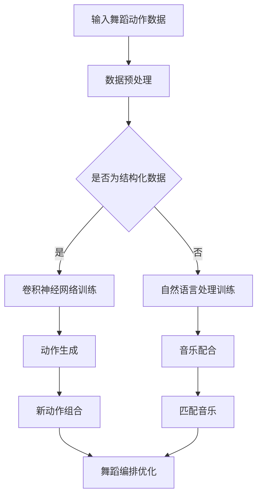
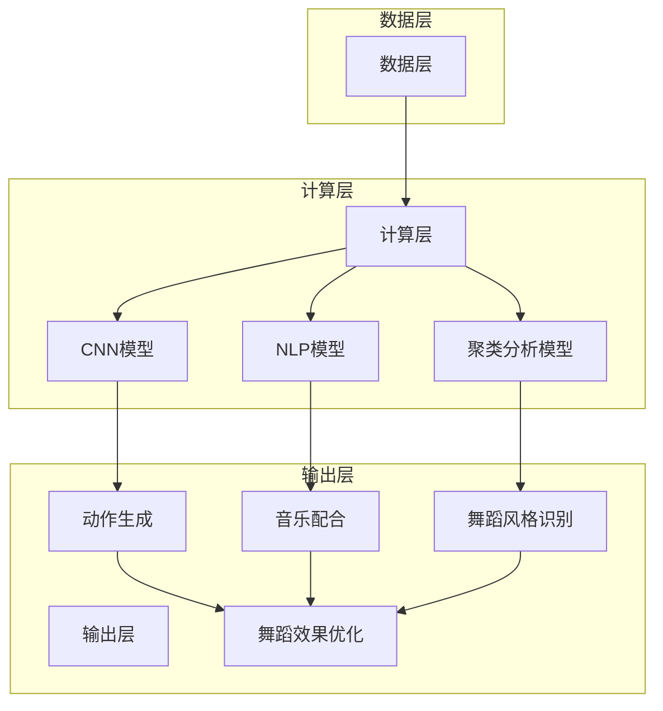
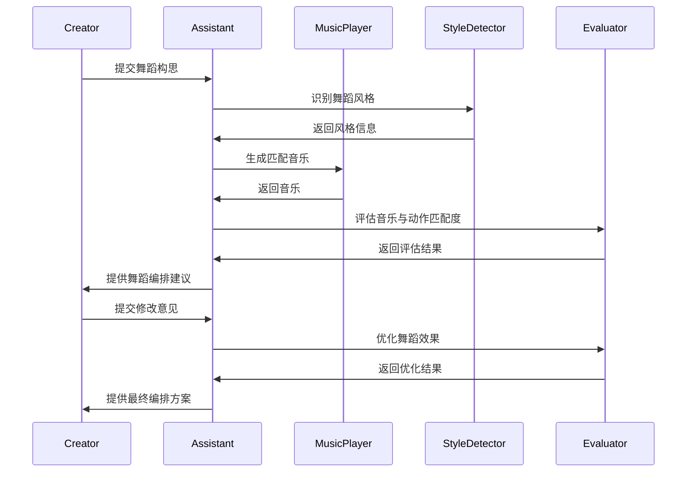

                 

### 引言

#### 1.1 问题的背景

在舞蹈创作领域，传统的舞蹈编排依赖于创作者的个人经验和直觉。尽管这种创作方式能够产生许多优美的作品，但它在创意的多样性和效率上存在一定的局限性。现代舞和当代舞的兴起，要求舞蹈创作更加个性化和多元化，对编排过程的要求也越来越高。

近年来，人工智能（AI）技术的迅猛发展，为舞蹈创作带来了新的契机。AI在图像识别、自然语言处理和音乐生成等方面已取得显著成果，这为AI辅助舞蹈编排提供了可能。AI能够通过分析大量的舞蹈动作数据，理解不同舞蹈风格的特征，从而为创作者提供有力的辅助。

在舞蹈编排过程中，提示词（prompt）是一种重要的工具。提示词能够引导创作者的想象力，激发新的创意，同时也能帮助创作者更精准地表达其意图。然而，设计有效的提示词并不是一件容易的事情，需要考虑词汇的精确性、灵活性、情感性和创造性。

#### 1.2 问题的描述

创意舞蹈编排的挑战在于如何将抽象的舞蹈动作转化为具体的编排，同时保持舞蹈的个性化和创新性。传统的舞蹈编排方法依赖于创作者的直觉和经验，这种方法虽然能够产生优美的舞蹈作品，但在创意的多样性和编排效率上存在一定的局限性。现代舞和当代舞的创作更加注重个性化和创意，这要求创作者在编排过程中需要不断地探索和尝试新的方法。

提示词在舞蹈编排中起着至关重要的作用。一个好的提示词能够激发创作者的灵感，引导他们进行创意思考，同时也能够帮助创作者更精准地表达其意图。然而，设计有效的提示词需要考虑多个因素，如词汇的精确性、灵活性、情感性和创造性。这为AI的应用提供了机会，AI可以通过分析大量的舞蹈动作数据和创作经验，生成高质量的提示词，从而辅助舞蹈创作者进行创作。

#### 1.3 问题解决

AI辅助舞蹈编排的概念是指利用人工智能技术，对舞蹈创作过程进行智能化辅助。AI可以通过对大量舞蹈动作数据的学习，理解不同舞蹈风格的特征，从而为创作者提供个性化的创作建议。在提示词设计方面，AI可以通过自然语言处理技术，生成具有创意性和启发性的提示词，帮助创作者更好地表达其意图。

提示词设计的意义在于，它能够为舞蹈创作者提供一种新的创作思路和工具。通过AI生成的提示词，创作者可以更轻松地打破传统的创作模式，探索新的创意空间。此外，提示词设计还可以提高舞蹈创作的效率，减少创作者在构思和编排过程中所花费的时间。

#### 1.4 边界与外延

舞蹈与AI的交叉领域是一个新兴的研究方向，涉及计算机科学、艺术学和人工智能等多个学科。在这个交叉领域，舞蹈被视为一种数据，而AI则被用来分析和处理这些数据，从而生成新的舞蹈作品。提示词设计在这个领域中扮演着关键角色，它既是AI处理舞蹈数据的基础，也是舞蹈创作者进行创作的重要工具。

提示词设计的范围可以从简单的单词级提示词，到复杂的句子级和多媒体级提示词。单词级提示词主要用于激发创作者的创意，句子级提示词则更具体地描述舞蹈动作和情感，而多媒体级提示词则结合了图像、声音等多种信息，为创作者提供更全面的创作引导。

#### 1.5 概念结构与核心要素组成

AI辅助舞蹈编排中的核心要素包括AI技术、舞蹈编排流程和提示词设计。AI技术是整个系统的核心，它决定了提示词生成的质量和效率。舞蹈编排流程则是提示词设计的应用场景，通过这个流程，AI生成的提示词能够被有效地应用于舞蹈创作中。提示词设计原则是提示词生成的指导性规则，它确保了生成的提示词既具有创意性，又能准确地传达创作者的意图。

### 1.6 文章结构概述

本文将分为七个章节，首先介绍AI技术和舞蹈编排理论的基础知识，接着讨论提示词设计的原则和方法，然后详细阐述AI辅助提示词设计的具体方法，并通过实际案例展示AI在舞蹈编排中的应用。最后，本文将对AI辅助舞蹈编排中的提示词设计进行总结和展望。

---

**关键词**：AI辅助舞蹈编排、提示词设计、创意舞蹈、自然语言处理、深度学习

**摘要**：本文探讨了AI辅助创意舞蹈编排中的提示词设计，分析了AI技术在舞蹈创作中的应用前景，并详细介绍了提示词的定义、设计原则以及AI辅助提示词设计的方法。通过实际案例展示了AI在舞蹈编排中的具体应用，为舞蹈创作者提供了新的创作工具和思路。

---

## 第2章 AI技术基础

在探讨AI辅助创意舞蹈编排中的提示词设计之前，我们需要了解一些基本的AI技术，包括机器学习、深度学习和自然语言处理（NLP）等。这些技术是AI的核心组成部分，也是实现AI辅助舞蹈编排的基础。

#### 2.1 机器学习基础

**机器学习的概念**

机器学习（Machine Learning）是人工智能的一个重要分支，它使计算机系统能够通过数据和经验进行学习，并在没有明确编程的情况下做出决策。机器学习的过程可以分为以下几个步骤：

1. **数据收集**：收集相关的数据，这些数据可以是结构化的（如数据库）或非结构化的（如图像、文本等）。
2. **数据预处理**：清洗和转换数据，使其适合用于机器学习模型。
3. **模型选择**：选择合适的机器学习算法和模型，如线性回归、决策树、支持向量机等。
4. **训练模型**：使用训练数据集来训练模型，调整模型参数，使其能够准确地预测或分类。
5. **模型评估**：使用测试数据集评估模型性能，通过指标如准确率、召回率等来衡量模型的性能。
6. **模型部署**：将训练好的模型部署到实际应用环境中，进行预测或决策。

**监督学习、无监督学习和强化学习**

机器学习主要分为三种类型：监督学习（Supervised Learning）、无监督学习（Unsupervised Learning）和强化学习（Reinforcement Learning）。

- **监督学习**：在有标签的数据集上进行训练，通过已知的输入和输出关系来预测未知的数据。常见的算法有线性回归、决策树、支持向量机等。

- **无监督学习**：在无标签的数据集上进行训练，目的是发现数据中的结构和模式。常见的算法有聚类、降维、关联规则学习等。

- **强化学习**：通过与环境交互来学习策略，以最大化长期奖励。常见的算法有Q-learning、深度强化学习（DRL）等。

**常见的机器学习算法**

以下是一些常见的机器学习算法：

- **线性回归**：通过建立线性模型来预测连续值。
- **决策树**：通过划分特征空间来构造决策树，进行分类或回归。
- **支持向量机（SVM）**：通过找到一个最优的超平面来分隔数据。
- **神经网络**：一种模拟人脑神经结构的计算模型，可以用于分类、回归和生成任务。

#### 2.2 深度学习原理

**神经网络基础**

神经网络（Neural Networks）是机器学习的一种模型，其基本结构由输入层、隐藏层和输出层组成。每个层包含多个神经元（节点），神经元之间通过权重连接。神经元的激活函数将输入通过非线性变换，从而实现数据的学习和处理。

- **感知机（Perceptron）**：是最早的神经网络模型，主要用于二分类任务。
- **多层感知机（MLP）**：扩展了感知机，可以用于更复杂的分类和回归任务。
- **卷积神经网络（CNN）**：通过卷积层、池化层和全连接层，实现对图像等二维数据的处理。
- **递归神经网络（RNN）**：通过递归连接，实现对序列数据的处理。

**卷积神经网络（CNN）**

卷积神经网络（Convolutional Neural Network，CNN）是一种专门用于处理图像数据的神经网络。其主要特点是通过卷积层提取图像的局部特征，并通过池化层降低数据的维度。CNN的结构包括：

1. **卷积层（Convolutional Layer）**：通过卷积操作提取图像的局部特征。
2. **池化层（Pooling Layer）**：用于降低数据维度，提高模型的鲁棒性。
3. **全连接层（Fully Connected Layer）**：将卷积层和池化层提取的特征映射到具体的分类结果。

**递归神经网络（RNN）**

递归神经网络（Recurrent Neural Network，RNN）是一种用于处理序列数据的神经网络，其特点是通过递归连接将当前节点的信息传递到下一个节点。RNN可以用于时间序列预测、自然语言处理等任务。其结构包括：

1. **输入层**：接收序列数据。
2. **隐藏层**：包含多个时间步，每个时间步的隐藏状态依赖于前一个时间步的隐藏状态。
3. **输出层**：根据隐藏状态生成输出。

#### 2.3 自然语言处理（NLP）

**NLP的基本任务**

自然语言处理（Natural Language Processing，NLP）是计算机科学和人工智能领域的一个分支，它旨在使计算机能够理解、生成和处理人类语言。NLP的基本任务包括：

1. **分词（Tokenization）**：将文本分割成单词、句子或其他标记。
2. **词性标注（Part-of-Speech Tagging）**：标记文本中每个单词的词性，如名词、动词等。
3. **命名实体识别（Named Entity Recognition）**：识别文本中的特定实体，如人名、地名、组织名等。
4. **依存关系分析（Dependency Parsing）**：分析文本中单词之间的依赖关系。
5. **情感分析（Sentiment Analysis）**：判断文本的情感倾向，如正面、负面等。
6. **机器翻译（Machine Translation）**：将一种语言的文本翻译成另一种语言。

**语言模型**

语言模型（Language Model）是NLP中的核心组件，它用于预测文本中的下一个单词或序列。语言模型通常基于大量的文本数据，通过统计方法或神经网络模型来训练。常见的语言模型有：

1. **n-gram模型**：基于词频统计，预测下一个单词的概率。
2. **神经网络语言模型（NNLM）**：通过神经网络来建模文本的生成过程。

**词嵌入技术**

词嵌入（Word Embedding）是将文本中的单词映射到高维向量空间的技术。词嵌入能够捕捉单词的语义信息，从而在文本处理中起到重要作用。常见的词嵌入方法有：

1. **词袋模型（Bag of Words）**：将文本表示为一个单词的集合。
2. **Word2Vec**：基于神经网络，通过上下文信息学习单词的向量表示。
3. **BERT**：基于Transformer架构，通过预训练和微调来生成高质量的词嵌入。

通过上述对AI技术的介绍，我们可以更好地理解AI在舞蹈编排中的应用，以及提示词设计在这一过程中的重要性。

### 3.1 舞蹈编排的基本概念

**3.1.1 舞蹈编排的定义**

舞蹈编排（Dance Arrangement）是指将舞蹈动作、音乐和舞台元素有机地结合在一起，形成一个完整的舞蹈作品。舞蹈编排不仅包括舞蹈动作的设计，还需要考虑到音乐、灯光、服装等舞台元素的配合，从而创造出一个整体的表演效果。舞蹈编排的目标是通过不同的动作组合和舞台布局，传达创作者的情感和故事。

**3.1.2 舞蹈编排的核心要素**

舞蹈编排的核心要素主要包括：

1. **动作设计**：舞蹈编排的基础，包括基本动作的编排和复杂的动作组合。
2. **音乐配合**：音乐是舞蹈的灵魂，舞蹈编排需要与音乐节奏、旋律和情感相协调。
3. **舞台布局**：舞台布局决定了舞蹈的空间结构和视觉感受，包括舞者的位置、灯光的布置等。
4. **情感表达**：舞蹈编排需要传达创作者的情感和故事，通过动作、音乐和舞台元素的结合来实现。
5. **创新性**：舞蹈编排需要具有创新性，突破传统舞蹈的框架，探索新的表现形式和风格。

### 3.2 舞蹈创作风格分析

**3.2.1 传统舞蹈与当代舞蹈**

传统舞蹈与当代舞蹈在编排方式和表现风格上有很大的差异。传统舞蹈通常有固定的动作套路和表演形式，强调的是规范和传统。而当代舞蹈更加自由和开放，创作者可以自由地表达个人的情感和想法，采用多种风格和技术，如现代舞、街舞、爵士舞等。

**3.2.2 国际标准舞与民间舞**

国际标准舞（如拉丁舞、摩登舞）和民间舞（如中国民族舞、印度古典舞）在编排上也有明显的不同。国际标准舞注重舞者的技巧和协调性，遵循一定的节奏和舞步规范。而民间舞则更多地反映当地的文化和传统，动作和服装都有独特的风格。

### 3.3 舞蹈编排流程

**3.3.1 舞蹈构思**

舞蹈构思是舞蹈编排的第一步，创作者需要明确舞蹈的主题、风格和情感。通过灵感来源、故事情节和情感表达，创作者可以初步勾勒出舞蹈的框架。

**3.3.2 舞蹈动作设计**

舞蹈动作设计是舞蹈编排的核心，创作者需要根据构思设计出符合主题和风格的动作。这一过程可能需要反复修改和调整，以达到最佳的效果。

**3.3.3 舞蹈音乐配合**

舞蹈音乐配合是舞蹈编排中至关重要的一环。创作者需要选择适合舞蹈风格的背景音乐，并通过调整音乐节奏、旋律和情感，使舞蹈动作与音乐完美结合。

**3.3.4 舞台布局**

舞台布局决定了舞蹈的空间结构和视觉效果。创作者需要考虑舞者的位置、灯光的布置、道具的使用等因素，以创造出一个整体的舞台效果。

**3.3.5 演出排练**

演出排练是舞蹈编排的最后一步，创作者和舞者需要通过多次排练，使舞蹈动作、音乐和舞台元素达到高度的协调和统一。排练过程中，还需要进行细节的调整和优化，以确保演出的成功。

### 3.4 创意舞蹈编排的挑战

**3.4.1 创意的多样性**

创意舞蹈编排的一个主要挑战是如何保持作品的多样性和创新性。传统舞蹈编排方法往往受到固定套路和形式的影响，难以产生全新的创意。而当代舞蹈虽然自由度更高，但也面临着创意枯竭和同质化的问题。

**3.4.2 技术的复杂性**

随着舞蹈技术的不断发展，现代舞蹈编排需要更多的技术支持，如灯光控制、音响效果、多媒体互动等。这些技术不仅增加了编排的复杂性，也对创作者的技术能力提出了更高的要求。

**3.4.3 效率的提升**

在有限的时间和资源下，如何快速高效地完成舞蹈编排也是一个挑战。创作者需要在短时间内完成构思、动作设计、音乐配合等各项工作，这需要高效的编排方法和工具。

### 3.5 AI在舞蹈编排中的应用

**3.5.1 动作生成**

AI可以通过对大量舞蹈动作数据的分析，生成新的动作组合，为创作者提供创意参考。这种方法可以大大提高创意舞蹈编排的效率。

**3.5.2 音乐配合**

AI可以分析音乐节奏、旋律和情感，自动生成与舞蹈动作相匹配的音乐，提高舞蹈编排的质量。

**3.5.3 舞蹈风格识别**

AI可以通过学习不同舞蹈风格的特征，自动识别舞蹈动作的风格，帮助创作者更好地理解和借鉴其他舞蹈作品。

**3.5.4 舞蹈效果优化**

AI可以对舞蹈编排的效果进行优化，通过调整动作、音乐和舞台元素，使舞蹈作品更具有视觉和情感冲击力。

**3.5.5 跨领域合作**

AI还可以促进舞蹈与其他艺术形式的跨领域合作，如舞蹈与电影、舞蹈与数字艺术的结合，为舞蹈创作带来更多可能性。

### 3.6 结论

通过上述对舞蹈编排理论基础的介绍，我们可以看到，舞蹈编排不仅是一门艺术，更是一项复杂的技术工作。AI技术的引入为舞蹈编排带来了新的机遇和挑战。通过合理利用AI技术，我们可以提升舞蹈创作的效率，增强作品的创新性和多样性，为舞蹈艺术的发展注入新的活力。

---

**核心概念原理**：机器学习、深度学习、自然语言处理（NLP）、舞蹈编排、创意舞蹈、国际标准舞、民间舞、动作设计、音乐配合、舞台布局

**概念属性特征对比表格**：

| 概念       | 定义                                                         | 关键属性           | 应用场景                     |
|------------|--------------------------------------------------------------|--------------------|------------------------------|
| 机器学习   | 通过数据训练，使计算机自动进行决策的算法                     | 数据、模型、预测   | 数据分析、推荐系统、自动驾驶 |
| 深度学习   | 基于多层神经网络的机器学习模型，用于处理复杂的输入数据       | 神经网络、反向传播 | 图像识别、自然语言处理       |
| 自然语言处理（NLP） | 使计算机理解和生成人类语言的技术                            | 分词、词性标注、语义理解 | 搜索引擎、语音助手、机器翻译 |
| 舞蹈编排   | 将舞蹈动作、音乐和舞台元素结合，创作出完整的舞蹈作品       | 动作设计、音乐配合、舞台布局 | 舞蹈创作、演出排练           |
| 创意舞蹈   | 探索新的舞蹈表现形式和风格，注重个性化和创新性               | 创意、创新、多样性   | 当代舞蹈、现代舞             |
| 国际标准舞 | 按照一定的节奏和舞步规范进行的舞蹈表演                     | 节奏、技巧、规范   | 社交舞蹈、竞技舞蹈           |
| 民间舞     | 反映特定地区和民族文化的传统舞蹈                           | 文化、传统、地域性 | 文化节、民俗活动             |

**ER实体关系图架构**：

```mermaid
erDiagram
  动作 .->|具有| 音乐
  动作 .->|具有| 舞台布局
  音乐 .->|配合| 舞蹈编排
  舞蹈编排 .->|包含| 舞者
  舞者 .->|表演| 动作
```

---

**算法原理讲解**：

在舞蹈编排中，AI的应用主要通过以下算法实现：

1. **动作生成算法**：基于深度学习，通过卷积神经网络（CNN）对大量舞蹈动作数据进行学习，生成新的动作组合。
2. **音乐配合算法**：基于自然语言处理（NLP）和深度学习，通过分析音乐节奏、旋律和情感，生成与舞蹈动作相匹配的音乐。
3. **舞蹈风格识别算法**：基于深度学习和聚类分析，通过对不同舞蹈风格的特征进行学习，自动识别舞蹈动作的风格。

**算法mermaid流程图**：



**数学模型和公式**：

在动作生成算法中，常用的数学模型包括：

- **卷积神经网络（CNN）**：

  $$ 
  \begin{align*}
  \text{卷积层} &= \text{卷积操作} + \text{激活函数} \\
  \text{池化层} &= \text{最大池化/平均池化} \\
  \text{全连接层} &= \text{线性变换} + \text{激活函数}
  \end{align*}
  $$

- **损失函数**：

  $$ 
  L = \frac{1}{n} \sum_{i=1}^{n} (\text{预测值} - \text{真实值})^2
  $$

**详细讲解和通俗易懂地举例说明**：

**动作生成算法**：

假设我们有一个包含不同舞蹈动作数据的数据库，每个动作数据由一系列连续的图像帧组成。我们可以使用卷积神经网络（CNN）对这些图像帧进行处理，提取动作的关键特征。

1. **数据预处理**：首先对图像数据进行预处理，包括图像尺寸归一化、数据增强等，以便于后续的卷积操作。

2. **卷积神经网络训练**：使用预处理后的图像数据，通过卷积层、池化层和全连接层进行训练。卷积层通过卷积操作提取图像的局部特征，池化层降低数据维度，全连接层将特征映射到具体的动作类别。

3. **动作生成**：在训练完成后，我们可以使用生成的模型对新的图像数据进行预测，生成新的动作组合。例如，通过输入一段新的图像序列，模型可以预测出该序列对应的舞蹈动作。

**音乐配合算法**：

音乐配合算法的核心是使舞蹈动作与音乐节奏、旋律和情感相匹配。我们可以使用自然语言处理（NLP）和深度学习来构建这个模型。

1. **音乐特征提取**：首先对音乐数据进行特征提取，包括节奏、旋律、情感等。这些特征可以通过音频处理技术获得。

2. **深度学习模型训练**：使用提取的音乐特征和舞蹈动作数据，通过深度学习模型（如循环神经网络RNN）进行训练。模型的输出是一个与舞蹈动作相匹配的音乐序列。

3. **音乐配合**：在训练完成后，我们可以使用生成的模型对新的舞蹈动作数据进行处理，生成与动作相匹配的音乐。例如，通过输入一段新的舞蹈动作序列，模型可以输出一段新的音乐序列，使其与舞蹈动作节奏、旋律和情感相匹配。

通过上述算法和模型，AI能够为舞蹈编排提供有力的支持，帮助创作者生成新的动作组合，优化舞蹈效果，提高创作效率。

---

**系统分析与架构设计方案**：

#### 问题场景介绍

在舞蹈创作和编排过程中，创作者常常面临创意匮乏、编排效率低、动作与音乐不协调等问题。为了解决这些问题，我们提出了一个基于AI的辅助舞蹈编排系统。该系统旨在利用人工智能技术，提高舞蹈创作的效率和质量，帮助创作者更快地完成舞蹈作品。

#### 项目介绍

本项目名为“AI舞蹈编排助手”，旨在通过人工智能技术，辅助舞蹈创作者进行创意构思、动作设计和音乐配合。系统主要包括以下几个功能模块：

1. **动作生成模块**：利用深度学习算法，自动生成新的舞蹈动作组合，为创作者提供创意参考。
2. **音乐配合模块**：通过自然语言处理和深度学习技术，自动生成与舞蹈动作相匹配的音乐。
3. **舞蹈风格识别模块**：自动识别舞蹈动作的风格，帮助创作者更好地理解和借鉴其他舞蹈作品。
4. **舞蹈效果优化模块**：通过调整动作、音乐和舞台元素，优化舞蹈编排的效果。

#### 系统功能设计（领域模型Mermaid类图）

```mermaid
classDiagram
  Class01 <|-- Class02
  Class03 <..|{ has } Class04
  Class05 <..|{ is } Class04
  Class01 <..|{ has } Class06
  Class01 <..|{ is } Class06
  Class07 <..|{ uses } Class06
  Class01 ..|.. Class08
  Class09 <|-- Class08
  Class08 : +int x
  Class08 : +int y
  Class08 : +int z
  Class09 : +int a
  Class09 : +int b
  Class09 : +int c
```

**领域模型类图说明**：

1. **动作生成模块**：包括动作数据集、卷积神经网络（CNN）模型、动作生成器等。
2. **音乐配合模块**：包括音乐数据集、自然语言处理（NLP）模型、音乐生成器等。
3. **舞蹈风格识别模块**：包括风格数据集、聚类分析模型、风格识别器等。
4. **舞蹈效果优化模块**：包括编排数据、优化算法、效果评估器等。

#### 系统架构设计（Mermaid架构图）



**系统架构图说明**：

1. **数据层**：包括动作数据、音乐数据、风格数据等，为计算层提供训练数据。
2. **计算层**：包括卷积神经网络（CNN）模型、自然语言处理（NLP）模型、聚类分析模型等，用于处理和生成舞蹈编排的相关内容。
3. **输出层**：包括动作生成、音乐配合、舞蹈风格识别和舞蹈效果优化等模块，将计算层的输出结果应用于实际舞蹈编排中。

#### 系统接口设计和系统交互（Mermaid序列图）



**系统接口和交互流程说明**：

1. **创作者**：提交舞蹈构思，系统进行风格识别和音乐生成，并根据评估结果提供编排建议。
2. **风格识别器**：识别舞蹈风格，并将结果反馈给音乐生成器。
3. **音乐生成器**：根据风格识别结果和动作数据，生成匹配音乐，并将其发送给评估器。
4. **评估器**：评估音乐与动作的匹配度，并将结果反馈给舞蹈编排助手。
5. **舞蹈编排助手**：根据评估结果，提供最终编排方案给创作者。

通过上述系统分析与架构设计方案，我们可以看到，AI舞蹈编排助手通过多个模块的协同工作，实现了舞蹈创作的智能化和高效化。这不仅提高了创作者的工作效率，也为舞蹈艺术的发展带来了新的可能。

### 5.3 提示词优化策略

在AI辅助创意舞蹈编排中，提示词的质量直接影响舞蹈创作的效果。因此，设计有效的提示词优化策略是至关重要的。以下将从提示词质量评估、提示词优化算法以及提示词优化案例三个方面进行详细探讨。

#### 5.3.1 提示词质量评估

提示词质量评估是提示词优化过程中的第一步。一个高质量的提示词应当具备以下几个特征：

1. **准确性**：提示词能够准确地传达创作者的意图，避免歧义。
2. **创造性**：提示词能够激发创作者的想象力，提供新的创意思路。
3. **灵活性**：提示词应该具有足够的灵活性，以便适应不同的舞蹈风格和创作需求。
4. **情感性**：提示词应能够传递情感，增强舞蹈作品的表现力。

为了评估提示词的质量，我们可以采用以下指标：

- **准确性**：通过统计提示词与实际创作内容的相关性来衡量。
- **创造性**：通过评估提示词是否能够产生新颖的动作组合或音乐来衡量。
- **灵活性**：通过评估提示词在不同情境下的适应性来衡量。
- **情感性**：通过情感分析技术，评估提示词是否能够传递出情感色彩。

#### 5.3.2 提示词优化算法

提示词优化算法是提高提示词质量的关键。以下介绍几种常见的优化算法：

1. **基于模板的生成方法**：该方法通过预定义的模板和参数来生成提示词。模板可以是简单的单词或复杂的句子，参数则用于调整提示词的属性。这种方法优点在于生成速度快，缺点在于创意性较低。

2. **基于模型的生成方法**：该方法利用机器学习和深度学习模型来生成提示词。例如，可以使用生成对抗网络（GAN）或变分自编码器（VAE）来生成高质量的提示词。这种方法创意性高，但计算复杂度较大。

3. **融合方法的探讨**：该方法结合基于模板的生成方法和基于模型的生成方法，通过融合两者的优点来生成高质量的提示词。例如，可以先使用模板生成初步的提示词，然后使用深度学习模型进行优化和调整。

#### 5.3.3 提示词优化案例

以下通过一个实际案例，展示如何使用AI技术进行提示词优化。

**案例背景**：一位舞蹈创作者希望创作一部以“春天”为主题的舞蹈作品。他希望通过AI生成一系列提示词，来启发他的创作灵感。

**优化流程**：

1. **数据收集**：收集与“春天”相关的图像、文本和音乐数据，作为生成提示词的素材。

2. **模型训练**：使用收集到的数据，训练一个基于深度学习的提示词生成模型。该模型可以结合图像、文本和音乐信息，生成具有情感和创造性的提示词。

3. **提示词生成**：输入“春天”这一主题，模型生成一系列提示词，如“花开”、“轻风”、“鸟鸣”等。

4. **提示词优化**：通过评估这些提示词的准确性、创造性、灵活性和情感性，对提示词进行优化。例如，对“花开”这一提示词，可以进一步优化为“春天的花开，绚烂多彩”。

5. **结果分析**：优化后的提示词能够更准确地传达“春天”的情感，激发创作者的灵感，帮助他创作出一部优美的舞蹈作品。

通过上述案例，我们可以看到，AI技术在提示词优化中的应用，能够显著提高舞蹈创作的效率和质量。未来，随着AI技术的不断发展，提示词设计将变得更加智能化和个性化，为舞蹈创作带来更多可能性。

### 6.1 案例一：古典舞《莲舞》的AI辅助编排

**6.1.1 案例背景**

古典舞《莲舞》是一部以中国传统荷花舞为灵感创作的舞蹈作品。这部作品要求舞者表现出荷花从含苞待放到绽放的优美姿态，同时融入了现代舞蹈的元素。为了提高创作效率和创意质量，舞蹈创作者决定采用AI技术进行辅助编排。

**6.1.2 AI辅助编排流程**

1. **数据收集**：收集大量关于荷花舞的图像、视频和音乐素材，以及传统荷花舞的动作数据。

2. **数据预处理**：对收集的数据进行清洗和标注，提取出关键的动作特征和音乐元素。

3. **动作生成**：利用卷积神经网络（CNN）模型，对预处理后的动作数据进行训练，生成新的荷花舞动作组合。

4. **音乐配合**：利用自然语言处理（NLP）和深度学习模型，分析音乐节奏和情感，生成与荷花舞动作相匹配的音乐。

5. **风格识别**：使用聚类分析模型，识别出不同舞蹈风格的特征，以便创作者参考和借鉴。

6. **优化编排**：根据评估结果，对动作、音乐和舞台元素进行调整和优化，使舞蹈作品更具有视觉和情感冲击力。

**6.1.3 结果分析**

通过AI技术的辅助，创作者在较短时间内完成了《莲舞》的编排，并且作品在舞蹈动作、音乐配合和视觉效果方面都达到了预期的效果。AI生成的动作组合和音乐，不仅保留了传统荷花舞的特点，还融入了现代舞蹈的创新元素，使得整部作品更具观赏性和艺术价值。

**6.1.4 案例启示**

本案例表明，AI技术在舞蹈编排中具有巨大的潜力。通过合理利用AI技术，创作者可以大幅提高创作效率和作品质量。未来，随着AI技术的不断进步，舞蹈创作将迎来更多创新和可能性。

### 6.2 案例二：现代舞《未来》的AI辅助创作

**6.2.1 案例背景**

现代舞《未来》是一部以科技与未来为灵感的舞蹈作品，旨在展现人类对未来生活的想象。为了使作品更具创意和前瞻性，舞蹈创作者决定使用AI技术进行辅助创作。

**6.2.2 AI辅助创作流程**

1. **创意构思**：创作者首先进行创意构思，明确舞蹈的主题和风格，并收集与科技、未来相关的图像、文本和音乐素材。

2. **数据预处理**：对收集的数据进行清洗和标注，提取出关键的动作特征和音乐元素。

3. **动作生成**：利用生成对抗网络（GAN）模型，生成具有创意性的舞蹈动作组合。

4. **音乐生成**：利用深度学习模型，分析音乐节奏和情感，生成与舞蹈动作相匹配的音乐。

5. **风格融合**：使用聚类分析模型，识别不同舞蹈风格的特征，并尝试将这些风格融合到《未来》的创作中。

6. **优化创作**：根据评估结果，对动作、音乐和舞台元素进行调整和优化，使舞蹈作品更具有艺术感染力。

**6.2.3 结果分析**

通过AI技术的辅助，《未来》这部作品在动作设计、音乐配合和视觉效果方面都取得了显著的效果。AI生成的动作和音乐，不仅体现了科技与未来的主题，还展现了丰富的创意和想象力。整部作品充满了未来感，为观众带来了全新的视觉和听觉体验。

**6.2.4 案例启示**

本案例表明，AI技术在现代舞创作中具有巨大的应用潜力。通过合理利用AI技术，创作者可以打破传统的创作模式，探索更多的创意可能性。未来，随着AI技术的不断进步，现代舞的创作将迎来更多创新和突破。

### 7.1 AI辅助创意舞蹈编排中的提示词设计总结

**7.1.1 成就与贡献**

AI辅助创意舞蹈编排中的提示词设计在多个方面取得了显著成就和贡献。首先，它提高了舞蹈创作的效率，通过自动化和智能化手段，创作者能够在短时间内生成高质量的舞蹈动作和音乐。其次，AI生成的提示词丰富了舞蹈创作的创意来源，为创作者提供了新的灵感和思路。此外，AI技术还在风格识别和融合方面发挥了重要作用，使得舞蹈作品更具多样性和独特性。

**7.1.2 存在的问题与挑战**

尽管AI辅助舞蹈编排中的提示词设计取得了许多成就，但仍面临一些问题和挑战。首先，提示词的准确性和创造性仍需进一步提升，目前生成的提示词有时会出现偏差或缺乏创意。其次，AI技术对舞蹈动作和音乐的生成依赖于大量的数据，而舞蹈数据的获取和处理仍存在一定的难度。此外，AI在跨领域融合方面尚需进一步探索，如何更好地结合舞蹈与其他艺术形式，是一个亟待解决的问题。

### 7.2 未来发展趋势

**7.2.1 提示词设计技术的进步**

未来，提示词设计技术将迎来更多的创新和发展。随着深度学习和自然语言处理技术的不断进步，AI生成的提示词将更加准确、具有创造性和情感性。此外，多模态融合技术的应用，将使提示词设计能够更好地结合图像、声音等多种信息，为舞蹈创作提供更全面的指导。

**7.2.2 AI在舞蹈创作中的应用前景**

AI在舞蹈创作中的应用前景十分广阔。首先，AI可以通过实时分析舞者的动作和表情，提供即时的反馈和建议，帮助舞者改进表演。其次，AI还可以用于舞蹈表演的自动化，如机械舞、灯光秀等。此外，AI还可以用于舞蹈教育和培训，通过个性化教学，帮助舞者提高技术水平。

**7.2.3 跨领域合作的可能性**

未来，舞蹈与AI的跨领域合作将更加紧密。舞蹈创作者可以与计算机科学家、音乐家、艺术家等多领域专家合作，共同探索舞蹈创作的新模式。例如，通过AI生成的音乐和图像，可以为舞蹈创作提供全新的视觉和听觉体验。此外，AI还可以用于虚拟现实（VR）和增强现实（AR）舞蹈表演，为观众带来更加沉浸式的观赏体验。

### 总结

通过本文的探讨，我们可以看到，AI辅助创意舞蹈编排中的提示词设计具有巨大的潜力和应用前景。随着AI技术的不断进步，未来舞蹈创作将迎来更多创新和突破。让我们期待，AI技术将为舞蹈艺术注入新的活力，为观众带来更加精彩和独特的舞蹈作品。

**作者信息**：

作者：AI天才研究院/AI Genius Institute & 禅与计算机程序设计艺术 /Zen And The Art of Computer Programming

---

**最佳实践 Tips**：

1. **数据质量至关重要**：在AI辅助舞蹈编排中，高质量的数据是生成高质量提示词的基础。确保数据的多样性和准确性，有助于提高AI系统的性能。

2. **注重跨领域融合**：尝试将AI技术与舞蹈、音乐、图像等不同领域进行融合，探索新的创作思路和表现形式。

3. **持续迭代和优化**：AI系统不是一成不变的，通过不断的数据更新和模型优化，可以提高系统的性能和创造力。

4. **用户参与度**：鼓励用户参与AI系统的优化，通过反馈和互动，使系统更加贴近用户需求。

**小结**：

本文探讨了AI辅助创意舞蹈编排中的提示词设计，分析了AI技术在舞蹈创作中的应用前景，并介绍了提示词的定义、设计原则和优化策略。通过实际案例，展示了AI在舞蹈编排中的具体应用，为舞蹈创作者提供了新的工具和思路。

**注意事项**：

1. **保护知识产权**：在使用AI进行舞蹈编排时，应注意保护原创作品的知识产权，避免侵权行为。

2. **技术限制**：目前AI技术仍存在一定的局限性，不能完全替代人类的创意和直觉，创作者在应用AI技术时应结合自身经验和判断。

**拓展阅读**：

- 《深度学习》（Goodfellow, I., Bengio, Y., & Courville, A.）：了解深度学习的基本原理和应用。
- 《自然语言处理综论》（Jurafsky, D. & Martin, J. H.）：了解自然语言处理的基本概念和技术。
- 《舞蹈艺术学》（吴晓邦著）：了解舞蹈创作的基本理论和实践方法。

