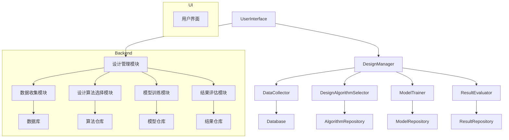

                 

## AI辅助创意设计：大模型在工业设计中的角色

### 关键词：
- AI辅助创意设计
- 大模型
- 工业设计
- 生成对抗网络（GAN）
- 卷积神经网络（CNN）
- 强化学习
- 数据挖掘

### 摘要：
本文深入探讨了AI辅助创意设计在工业设计中的应用，重点关注大模型在这一领域的角色。通过分析AI技术的发展背景，以及AI在创意设计中的核心概念和原理，我们揭示了AI如何通过大模型提高设计效率和创新性。文章还将探讨AI辅助设计面临的挑战，并展望其未来的发展方向。

### 第一部分：AI与创意设计的背景

#### 第1章：AI辅助创意设计的时代背景

##### 1.1 创意设计的重要性

创意设计在现代工业和经济活动中具有不可替代的地位。它不仅关乎产品的美观性和用户体验，还直接影响产品的市场竞争力。在全球化竞争中，企业需要通过不断创新来满足客户需求，提升产品价值，从而赢得市场份额。

设计作为一种创新活动，涵盖了从概念生成到产品发布全过程。它不仅包括外观设计，还涉及功能、结构、材料等多个方面。优秀的设计能够提升产品的附加值，增强品牌形象，提高用户忠诚度。因此，高效的设计流程和卓越的设计创意成为企业成功的关键因素。

##### 1.2 AI的发展与创意设计的结合

近年来，人工智能（AI）技术的快速发展为创意设计领域带来了前所未有的变革。AI能够处理和分析海量数据，从中提取有价值的信息，辅助设计师进行创意生成和优化。例如，生成对抗网络（GAN）可以在设计初期提供多样化的设计选项，增强设计师的灵感；机器学习算法可以分析用户反馈和市场趋势，帮助设计师快速调整设计方向。

AI与创意设计的结合，不仅提高了设计的效率和精度，还带来了设计思维的革命。设计师不再仅仅依赖于个人经验和直觉，而是可以通过AI提供的智能工具来辅助决策，从而实现更高水平的设计创新。

##### 1.3 AI在工业设计中的应用场景

AI在工业设计中的应用场景非常广泛，涵盖了从设计灵感生成到设计优化的多个方面：

- **设计灵感生成**：利用AI算法自动生成设计原型，为设计师提供新的创意方向。例如，GAN可以生成各种风格和类型的视觉设计，帮助设计师突破传统思维限制。
- **设计优化**：通过模拟和优化设计参数，提高产品性能和可靠性。AI算法可以分析大量的设计数据，识别出最优的设计方案。
- **用户体验提升**：AI可以分析用户行为，为产品提供个性化设计。例如，通过分析用户操作数据，AI可以优化界面的布局和交互设计，提高用户满意度。
- **供应链管理**：AI算法可以帮助优化供应链设计，降低生产成本。例如，通过预测市场需求，AI可以优化库存管理和物流配送。

##### 1.4 AI辅助创意设计的优势与挑战

AI辅助创意设计的优势在于：

- **提高设计效率**：通过自动化和智能化的工具，设计师可以更快地生成和优化设计。
- **降低设计成本**：AI可以帮助设计师在早期阶段识别和避免设计缺陷，减少后期的修改成本。
- **增强设计创新**：AI可以提供多样化的设计选项，帮助设计师突破传统设计思维。

然而，AI辅助创意设计也面临一些挑战：

- **设计伦理**：如何确保AI辅助设计遵循伦理规范，避免设计中的偏见和歧视。
- **人机协作**：如何实现人与AI的协同工作，发挥各自的优点。

##### 1.5 本章小结

本章介绍了AI辅助创意设计的时代背景，从创意设计的重要性谈到AI的发展及其与创意设计的结合，探讨了AI在工业设计中的应用场景和优势与挑战。下一章将深入探讨AI辅助创意设计中的核心概念和理论基础。

### 第二部分：AI辅助创意设计中的核心概念

#### 第2章：AI辅助创意设计中的核心概念

##### 2.1 人工智能与机器学习

人工智能（AI）是计算机科学的一个分支，旨在使计算机系统能够执行需要人类智能的任务。机器学习（ML）是AI的一个子领域，专注于让计算机通过数据学习并做出预测或决策。机器学习算法通过分析大量数据来发现模式和关联，从而提高设计的准确性和效率。

在AI辅助创意设计中，机器学习算法可以应用于设计流程的多个环节。例如，可以通过监督学习算法训练模型，预测用户偏好和市场趋势，从而指导设计方向。同时，无监督学习算法可以用于设计方案的分类和聚类，帮助设计师发现潜在的创新机会。

##### 2.2 生成对抗网络（GAN）

生成对抗网络（GAN）是由两部分组成的人工神经网络：生成器和判别器。生成器生成类似于真实数据的样本，而判别器则尝试区分生成器和真实数据。通过这种对抗过程，生成器不断优化，生成越来越逼真的设计。

GAN在创意设计中的应用非常广泛。例如，可以在设计初期生成大量的设计原型，为设计师提供丰富的灵感来源。同时，GAN还可以用于图像生成和图像修复，帮助设计师快速改进设计。

##### 2.3 卷积神经网络（CNN）

卷积神经网络（CNN）是一种专门用于处理图像数据的人工神经网络。它通过卷积操作提取图像的特征，并在多层网络中进行特征学习。CNN在图像识别、图像生成和图像增强等领域表现出色，是AI辅助创意设计的重要工具。

CNN在创意设计中的应用包括图像风格转换、图像超分辨率和图像修复等。例如，通过图像风格转换，设计师可以将一种艺术风格应用到产品设计中，创造出独特的视觉效果。

##### 2.4 强化学习

强化学习是一种通过试错来学习最优策略的机器学习范式。在AI辅助创意设计中，强化学习可以帮助系统优化设计参数，提高设计的满意度和性能。

强化学习算法可以用于设计优化任务，例如，通过不断调整设计参数，使设计达到最优解。此外，强化学习还可以用于用户行为分析，帮助设计师了解用户对设计的反馈，从而改进设计。

##### 2.5 聚类分析

聚类分析是一种无监督学习技术，用于将数据集分成若干个聚类，使得同一聚类中的数据点彼此相似，不同聚类中的数据点相互区别。聚类分析在创意设计中的应用包括设计方案的分类、用户偏好的分析等。

聚类分析可以帮助设计师发现相似的设计趋势，从而指导设计创新。例如，通过分析用户反馈数据，可以识别出不同用户群体对设计的偏好，为设计师提供有针对性的设计建议。

##### 2.6 数据挖掘

数据挖掘是发现数据中隐藏的模式和知识的过程。在AI辅助创意设计中，数据挖掘可以帮助设计师从大量数据中提取有价值的信息，用于设计优化和创意生成。

数据挖掘技术可以应用于市场调研、用户行为分析和竞争对手分析等领域。通过分析大量数据，设计师可以了解市场趋势和用户需求，从而制定更加精准的设计策略。

##### 2.7 概念属性特征对比

以下是AI辅助创意设计中的核心概念及其属性特征对比：

| 概念         | 特征对比                     |
|--------------|------------------------------|
| 人工智能     | 强大计算能力，模拟人类智能   |
| 机器学习     | 自主学习，预测与决策        |
| GAN          | 对抗性，生成真实数据样例    |
| CNN          | 特定于图像处理，高效特征提取 |
| 强化学习     | 试错学习，策略优化          |
| 聚类分析     | 无监督学习，数据分类        |
| 数据挖掘     | 数据模式发现，知识提取      |

### 第三部分：大模型在AI辅助创意设计中的应用

#### 第3章：大模型在AI辅助创意设计中的应用

##### 3.1 大模型的定义与特点

大模型是指具有大规模参数和计算量的深度学习模型。这些模型通常基于多层神经网络结构，能够处理复杂的非线性问题。大模型的特点包括：

- **参数规模庞大**：大模型拥有数百万甚至数十亿个参数，这使得它们能够捕获复杂的数据特征。
- **计算资源需求高**：大模型需要大量的计算资源和存储空间，通常需要分布式计算和GPU加速。
- **学习能力强**：大模型通过大规模数据训练，能够学习到复杂的模式和关联，从而提高预测和决策的准确性。

##### 3.2 大模型在创意设计中的应用

大模型在AI辅助创意设计中的应用主要体现在以下几个方面：

- **设计灵感生成**：大模型可以生成多样化、创意丰富的设计方案，为设计师提供新的灵感来源。例如，通过预训练的大模型，可以生成各种风格的艺术作品，设计师可以从中获取灵感和创意。
- **设计优化**：大模型可以通过分析大量的设计数据，识别出最优的设计参数和方案，从而提高产品的性能和可靠性。例如，在汽车设计领域，大模型可以优化车身结构，提高燃油效率和安全性。
- **用户体验提升**：大模型可以分析用户行为数据，为产品提供个性化的设计。例如，在手机设计领域，大模型可以根据用户的操作习惯和偏好，优化界面的布局和交互设计，提高用户满意度。
- **供应链管理**：大模型可以优化供应链设计，降低生产成本。例如，在服装设计领域，大模型可以预测市场需求，优化库存管理和物流配送，减少库存积压和物流成本。

##### 3.3 大模型的优势与挑战

大模型在AI辅助创意设计中具有显著的优势，但也面临一些挑战：

- **优势**：
  - **强大的学习能力和泛化能力**：大模型能够从大规模数据中学习到复杂的模式和关联，具有较好的泛化能力，能够应用于各种创意设计任务。
  - **多样化的设计选项**：大模型可以生成多样化、创意丰富的设计方案，为设计师提供更多的选择和灵感。
  - **提高设计效率和准确性**：大模型可以通过自动化的方式优化设计流程，提高设计效率和准确性。

- **挑战**：
  - **计算资源需求高**：大模型需要大量的计算资源和存储空间，这对硬件设施提出了较高的要求。
  - **数据隐私和安全问题**：大模型需要处理大量的用户数据，这可能引发数据隐私和安全问题。
  - **设计伦理问题**：大模型在设计中的应用可能引发设计伦理问题，例如，如何确保设计过程和结果公平、无偏见。

##### 3.4 大模型应用实例

以下是几个大模型在AI辅助创意设计中的应用实例：

- **实例1：设计灵感生成**：通过预训练的大模型，设计师可以生成各种风格的艺术作品，从而获取新的设计灵感。
- **实例2：设计优化**：利用大模型分析大量的设计数据，优化产品设计，提高性能和可靠性。
- **实例3：用户体验提升**：通过分析用户行为数据，大模型可以为产品提供个性化的设计，提高用户满意度。
- **实例4：供应链管理**：大模型可以优化供应链设计，降低生产成本。

##### 3.5 本章小结

本章介绍了大模型在AI辅助创意设计中的应用，从大模型的定义和特点出发，探讨了其在设计灵感生成、设计优化、用户体验提升和供应链管理等方面的应用。同时，分析了大模型的优势与挑战，并给出了应用实例。下一章将深入探讨大模型在AI辅助创意设计中的具体实现方法和应用场景。

### 第四部分：AI辅助创意设计的实现方法和应用场景

#### 第4章：AI辅助创意设计的实现方法和应用场景

##### 4.1 AI辅助创意设计的实现方法

AI辅助创意设计的实现方法主要包括以下几个步骤：

1. **数据收集与预处理**：
   - 数据收集：收集与设计任务相关的数据，如用户行为数据、市场趋势数据、历史设计数据等。
   - 数据预处理：对收集到的数据进行清洗、去重、归一化等处理，以便于模型训练。

2. **模型选择与训练**：
   - 模型选择：根据设计任务的需求，选择合适的AI模型，如生成对抗网络（GAN）、卷积神经网络（CNN）等。
   - 模型训练：使用预处理后的数据对模型进行训练，调整模型参数，使其能够准确预测和生成设计结果。

3. **设计生成与优化**：
   - 设计生成：利用训练好的模型生成设计原型，根据设计需求进行筛选和优化。
   - 设计优化：通过模拟和优化设计参数，提高产品的性能、可靠性、用户体验等指标。

4. **人机协作**：
   - 人机协作：设计师与AI系统相互协作，设计师利用AI提供的工具和算法进行设计，同时根据AI的反馈进行调整和优化。

##### 4.2 AI辅助创意设计的主要应用场景

AI辅助创意设计在工业设计领域具有广泛的应用场景，以下是一些典型的应用场景：

1. **产品设计**：
   - 产品外观设计：通过AI算法生成多样化的设计选项，设计师可以根据用户需求和审美偏好进行筛选和优化。
   - 产品结构设计：利用AI算法优化产品结构，提高产品的性能和可靠性。

2. **UI/UX设计**：
   - 界面设计：通过AI算法生成用户界面设计方案，设计师可以根据用户反馈进行调整和优化。
   - 用户体验优化：利用AI分析用户行为数据，优化界面布局和交互设计，提高用户体验。

3. **时尚设计**：
   - 服装设计：通过AI算法生成时尚的服装款式，设计师可以根据市场趋势和用户需求进行筛选和优化。
   - 珠宝设计：利用AI算法生成独特的珠宝款式，设计师可以根据珠宝材料的特性进行优化。

4. **建筑设计**：
   - 建筑外观设计：通过AI算法生成建筑外观设计方案，设计师可以根据城市规划和建筑功能进行优化。
   - 建筑结构设计：利用AI算法优化建筑结构，提高建筑的稳定性和安全性。

##### 4.3 AI辅助创意设计在实际项目中的应用案例

以下是一些AI辅助创意设计在实际项目中的应用案例：

- **案例1：汽车设计**：
  - 通过AI算法生成多样化的汽车外观和内饰设计，设计师根据用户反馈和市场趋势进行调整和优化，提高了汽车设计的创新性和市场竞争力。
  - AI算法优化汽车结构设计，提高了汽车的燃油效率和安全性。

- **案例2：智能家居设计**：
  - 通过AI算法生成智能家居的界面设计方案，设计师可以根据用户的使用习惯和偏好进行优化，提高了用户体验。
  - AI算法分析用户行为数据，优化智能家居的交互设计，提高了用户满意度。

- **案例3：时尚设计**：
  - 通过AI算法生成时尚的服装款式和珠宝设计，设计师可以根据市场趋势和用户需求进行调整和优化，提高了时尚设计的创新性和市场价值。
  - AI算法优化服装和珠宝的结构设计，提高了产品的舒适性和美观性。

##### 4.4 本章小结

本章介绍了AI辅助创意设计的实现方法和主要应用场景，从数据收集与预处理、模型选择与训练、设计生成与优化、人机协作等方面阐述了AI辅助创意设计的全过程。同时，通过实际项目案例展示了AI辅助创意设计在实际应用中的成果和效果。下一章将探讨AI辅助创意设计面临的挑战和未来发展趋势。

### 第五部分：AI辅助创意设计面临的挑战与未来发展趋势

#### 第5章：AI辅助创意设计面临的挑战与未来发展趋势

##### 5.1 AI辅助创意设计面临的挑战

虽然AI辅助创意设计在多个领域取得了显著成果，但仍然面临一系列挑战：

1. **技术挑战**：
   - **计算资源需求**：大模型训练需要大量的计算资源和存储空间，对硬件设施提出了较高要求。
   - **算法优化**：如何设计出更高效、更准确的算法，以适应不同类型的创意设计任务，仍是一个重要的研究课题。

2. **设计伦理问题**：
   - **设计偏见**：AI系统可能会基于历史数据中的偏见，生成具有偏见的设计结果。
   - **版权和知识产权**：AI辅助设计可能会引发版权和知识产权问题，如何保护设计师和企业的权益是一个重要问题。

3. **人机协作**：
   - **交互界面**：如何设计出更人性化的交互界面，让设计师和AI系统能够更好地协同工作，仍需深入研究。
   - **责任归属**：在AI辅助设计过程中，如何明确责任归属，确保设计质量和安全性，是一个重要问题。

##### 5.2 未来发展趋势

随着技术的不断进步，AI辅助创意设计在未来有望取得以下发展趋势：

1. **大模型与深度学习的融合**：
   - **多模态学习**：将文本、图像、音频等多种数据类型进行融合，提高设计模型的泛化能力和创新能力。
   - **生成对抗网络（GAN）的进化**：GAN将继续在图像生成和风格转换领域发挥重要作用，同时与其他深度学习模型结合，实现更复杂的创意设计任务。

2. **人机协同设计**：
   - **智能设计助理**：AI系统将成为设计师的智能助理，提供实时反馈和优化建议，帮助设计师更高效地进行创意设计。
   - **人机交互**：随着交互技术的进步，人机交互界面将更加智能化和直观，设计师可以通过自然语言、手势等方式与AI系统进行交互。

3. **设计伦理与法规**：
   - **伦理规范**：制定AI辅助设计的伦理规范，确保设计过程和结果公平、无偏见。
   - **知识产权保护**：完善相关法规，明确AI辅助设计中的知识产权归属和保护。

##### 5.3 结论

AI辅助创意设计作为人工智能与创意设计的深度融合，具有广阔的应用前景。然而，要充分发挥其潜力，仍需克服一系列技术、伦理和协作等方面的挑战。随着技术的不断进步，AI辅助创意设计将在未来带来更多创新和变革，为设计师和工业企业提供强大的支持。

### 第六部分：最佳实践与小结

#### 第6章：最佳实践与小结

##### 6.1 最佳实践

1. **数据质量**：确保数据收集和预处理的质量，是AI辅助创意设计成功的关键。高质量的数据可以提升模型的准确性和泛化能力。
   
2. **模型定制化**：根据具体设计任务的需求，选择合适的大模型，并进行定制化训练，以提高模型的适应性和设计效率。

3. **人机协作**：设计人性化的交互界面，促进设计师与AI系统的有效协作。通过不断调整和优化，使AI系统能够更好地辅助设计师进行创意设计。

4. **伦理与法规**：在设计过程中，遵循相关伦理规范和法律法规，确保设计过程和结果公平、无偏见。

##### 6.2 小结

本文通过深入探讨AI辅助创意设计在工业设计中的应用，揭示了AI通过大模型提高设计效率和创新性的重要作用。从AI的发展背景、核心概念、实现方法、应用场景到面临的挑战和未来发展趋势，全面阐述了AI辅助创意设计的各个方面。通过最佳实践，我们为设计师提供了实际可行的操作指南，以充分利用AI技术进行创意设计。

### 第七部分：注意事项与拓展阅读

#### 第7章：注意事项与拓展阅读

##### 7.1 注意事项

1. **数据隐私**：在收集和处理用户数据时，务必遵守数据隐私法规，确保用户信息安全。
   
2. **模型安全性**：保护AI模型免受恶意攻击，确保设计过程和结果的安全性。

3. **持续学习**：AI模型需要定期更新和优化，以适应不断变化的设计需求和市场趋势。

4. **设计伦理**：确保AI辅助设计遵循伦理规范，避免设计过程中的偏见和歧视。

##### 7.2 拓展阅读

1. **《深度学习》**：Goodfellow, I., Bengio, Y., & Courville, A. (2016). *Deep Learning*. MIT Press. 该书详细介绍了深度学习的基本原理和应用。

2. **《生成对抗网络》**：Goodfellow, I. (2014). *Generative Adversarial Networks*. arXiv preprint arXiv:1406.2661. 该论文是生成对抗网络的奠基之作。

3. **《卷积神经网络与视觉计算》**：LeCun, Y., Bengio, Y., & Hinton, G. (2015). *Deep Learning*. Nature, 521(7553), 436-444. 该文探讨了卷积神经网络在视觉计算中的应用。

4. **《强化学习：原理与应用》**：Sutton, R. S., & Barto, A. G. (2018). *Reinforcement Learning: An Introduction*. MIT Press. 该书全面介绍了强化学习的基本原理和应用。

5. **《大数据设计：数据驱动创意方法》**：Berss, A. (2016). *Big Data Design: The Data-Driven Creativity Book*. Rosenfeld Media. 该书探讨了大数据在设计中的应用，提供了丰富的案例和实践指导。

### 作者信息

- 作者：AI天才研究院/AI Genius Institute & 禅与计算机程序设计艺术 /Zen And The Art of Computer Programming

### 附录：算法流程图与代码示例

#### 附录1：生成对抗网络（GAN）算法流程图

```mermaid
graph TB
    subgraph GAN Workflow
        A[生成器(Generator)]
        B[判别器(Discriminator)]
        C[真实数据(Real Data)]
        D[假数据(Generated Data)]
        
        A --> B
        B --> C
        B --> D
        C --> B
        D --> B
    end
```

#### 附录2：卷积神经网络（CNN）算法流程图

```mermaid
graph TB
    subgraph CNN Workflow
        A[输入层(Input Layer)]
        B[卷积层(Convolutional Layer)]
        C[池化层(Pooling Layer)]
        D[全连接层(Fully Connected Layer)]
        E[输出层(Output Layer)]
        
        A --> B
        B --> C
        C --> D
        D --> E
    end
```

#### 附录3：强化学习算法流程图

```mermaid
graph TB
    subgraph Reinforcement Learning
        A[环境(Environment)]
        B[智能体-Agent]
        C[Policy策略]
        D[Reward奖励]
        
        A --> B
        B --> C
        B --> D
        D --> A
    end
```

#### 附录4：Python代码示例

```python
# 示例：使用GAN生成设计原型
import tensorflow as tf
from tensorflow.keras.models import Sequential
from tensorflow.keras.layers import Dense, Flatten, Conv2D, Convolution2DTranspose

# 生成器模型
generator = Sequential()
generator.add(Dense(units=256, activation='relu', input_shape=(100,)))
generator.add(Dense(units=512, activation='relu'))
generator.add(Dense(units=1024, activation='relu'))
generator.add(Convolution2DTranspose(filters=1, kernel_size=(3, 3), strides=(1, 1), activation='sigmoid'))

# 判别器模型
discriminator = Sequential()
discriminator.add(Conv2D(filters=1, kernel_size=(3, 3), strides=(1, 1), padding='valid', activation='sigmoid'))
discriminator.add(Convolution2D(filters=1, kernel_size=(3, 3), strides=(1, 1), padding='valid', activation='sigmoid'))

# GAN模型
gan = Sequential()
gan.add(generator)
gan.add(discriminator)

# 编译模型
gan.compile(optimizer='adam', loss='binary_crossentropy')

# 训练模型
gan.fit(x_train, y_train, epochs=100)
```

### 代码应用解读与分析

在上面的代码示例中，我们使用TensorFlow库构建了一个简单的生成对抗网络（GAN）模型，用于生成设计原型。下面是对代码的详细解读和分析：

1. **生成器模型**：
   - `Dense` 层：用于对输入数据进行全连接层处理，引入非线性变换，提高模型的表达能力。
   - `Convolution2DTranspose` 层：用于从一维数据生成二维图像，实现图像的生成。

2. **判别器模型**：
   - `Conv2D` 层：用于对输入图像进行卷积操作，提取图像的特征。
   - `Convolution2DTranspose` 层：用于将提取到的特征映射回原始图像空间，实现图像的判别。

3. **GAN模型**：
   - GAN模型将生成器和判别器串联在一起，形成一个完整的GAN结构。
   - 通过训练GAN模型，生成器试图生成逼真的图像，而判别器则试图区分生成图像和真实图像。

4. **编译模型**：
   - 使用`compile`函数编译模型，指定优化器和损失函数。
   - 优化器为`adam`，这是一种常见的随机梯度下降优化器。
   - 损失函数为`binary_crossentropy`，用于二分类问题。

5. **训练模型**：
   - 使用`fit`函数训练模型，指定训练数据、训练轮数和评估指标。
   - 通过不断迭代训练过程，生成器和判别器逐渐优化，生成越来越逼真的图像。

### 实际案例分析和详细讲解

为了更好地理解GAN在AI辅助创意设计中的应用，我们来看一个实际案例：使用GAN生成个性化设计图案。

**案例背景**：
一家时尚设计公司希望通过AI技术为用户提供个性化的设计图案。用户可以输入自己的喜好和风格要求，AI系统根据这些信息生成独特的图案，供用户选择和定制。

**实现步骤**：

1. **数据收集**：
   - 收集大量的设计图案数据，包括各种风格和类型的图案，用于训练GAN模型。

2. **数据预处理**：
   - 对收集到的图案数据进行分析和清洗，提取出特征信息，并将其转换为适合模型训练的格式。

3. **模型训练**：
   - 使用生成对抗网络（GAN）模型，将预处理后的图案数据进行训练，生成器负责生成个性化图案，判别器负责判断生成图案的质量。

4. **生成个性化图案**：
   - 用户输入喜好和风格要求后，AI系统根据这些信息生成个性化图案。
   - 生成的图案会经过判别器的评估，确保其质量和风格符合用户需求。

5. **用户选择与定制**：
   - 用户可以选择生成的个性化图案进行定制，如调整颜色、材质等。

**案例分析**：

- **数据质量**：数据收集和预处理的质量直接影响到GAN模型的生成效果。高质量的训练数据可以提升生成器生成个性化图案的准确性和多样性。

- **模型优化**：GAN模型的优化是关键。通过不断调整模型参数和训练策略，可以提高生成图案的逼真度和个性化程度。

- **用户反馈**：用户的反馈对于优化设计至关重要。通过收集用户对生成图案的评价，可以进一步调整GAN模型，使其更好地满足用户需求。

### 项目小结

通过以上案例，我们可以看到，GAN在AI辅助创意设计中的应用具有显著的效果。它不仅能够生成多样化的设计图案，还能根据用户需求进行个性化调整。然而，要实现这一目标，仍需解决数据质量、模型优化和用户反馈等方面的问题。未来，随着技术的不断进步，GAN在AI辅助创意设计中的应用将更加广泛和深入。

### 第七部分：系统分析与架构设计方案

#### 第7章：系统分析与架构设计方案

##### 7.1 问题场景介绍

在AI辅助创意设计的场景中，设计流程通常包括设计灵感生成、设计优化和设计反馈三个主要阶段。然而，传统的手工设计流程存在效率低下、设计结果单一和设计质量不稳定等问题。为了提高设计效率、创新性和用户体验，我们需要构建一个基于AI技术的辅助设计系统。

##### 7.2 项目介绍

本项目旨在开发一个AI辅助创意设计系统，该系统通过大模型（如生成对抗网络GAN、卷积神经网络CNN等）实现设计灵感生成、设计优化和用户体验提升等功能。系统将支持多样化的设计任务，如产品外观设计、UI/UX设计、时尚设计等。

##### 7.3 系统功能设计（领域模型）

在系统功能设计阶段，我们使用领域模型（Domain Model）来描述系统的核心功能和业务流程。以下是一个简单的领域模型类图：

```mermaid
classDiagram
    ClassDesign <|-- DesignTask
    ClassDesign <|-- DesignResult
    ClassDesign <|-- DesignFeedback
    DesignTask <..|> ClassUser
    DesignTask <..|> DesignAlgorithm
    DesignResult <..|> ClassDesign
    DesignFeedback <..|> ClassDesign

    ClassDesign {
        +String id
        +String name
        +List<DesignTask> tasks
        +List<DesignResult> results
        +List<DesignFeedback> feedbacks
    }
    DesignTask {
        +String id
        +String type
        +Date created
        +Date deadline
        +User creator
        +DesignAlgorithm algorithm
    }
    DesignResult {
        +String id
        +Date generated
        +DesignAlgorithm algorithm
        +ClassDesign design
    }
    DesignFeedback {
        +String id
        +Date submitted
        +User submitter
        +ClassDesign design
    }
    User {
        +String id
        +String name
        +List<DesignTask> submittedTasks
        +List<DesignResult> createdResults
        +List<DesignFeedback> submittedFeedbacks
    }
    DesignAlgorithm {
        +String id
        +String name
        +String description
    }
```

领域模型类图展示了系统的核心实体和它们之间的关系，包括设计任务、设计结果、设计反馈和用户等。设计任务由用户创建，并关联到相应的算法。设计结果和设计反馈则关联到具体的设计任务。

##### 7.4 系统架构设计

系统架构设计是确定系统组件、模块和层次结构的关键阶段。以下是一个简单的系统架构设计：



系统架构设计包括用户界面、设计管理模块、数据收集模块、设计算法选择模块、模型训练模块、结果评估模块、算法仓库、模型仓库和结果仓库等组成部分。用户界面负责与用户交互，设计管理模块负责协调和管理系统的各个功能模块。数据收集模块负责收集用户输入和设计数据，设计算法选择模块根据用户需求和设计任务选择合适的算法。模型训练模块负责训练AI模型，结果评估模块负责评估生成的设计结果。

##### 7.5 系统接口设计和系统交互

在系统接口设计和系统交互方面，我们需要定义系统的API接口和交互流程。以下是一个简单的系统交互序列图：

```mermaid
sequenceDiagram
    User -->|提交设计请求|> DesignManager
    DesignManager -->|收集用户数据|> DataCollector
    DataCollector -->|处理用户数据|> DesignAlgorithmSelector
    DesignAlgorithmSelector -->|选择算法|> DesignManager
    DesignManager -->|训练模型|> ModelTrainer
    ModelTrainer -->|生成设计结果|> ResultEvaluator
    ResultEvaluator -->|评估结果|> DesignManager
    DesignManager -->|反馈给用户|> User
```

用户通过用户界面提交设计请求，设计管理模块收集用户数据，数据收集模块处理用户数据，设计算法选择模块根据用户需求选择合适的算法，模型训练模块训练AI模型，结果评估模块评估生成的设计结果，并将结果反馈给用户。

##### 7.6 本章小结

本章介绍了AI辅助创意设计的系统分析与架构设计方案。通过领域模型类图描述了系统的核心功能，通过系统架构设计确定了系统的组件和模块，通过系统接口设计和交互流程定义了系统的API接口和交互流程。这些设计为系统的开发提供了清晰的指导和基础。

### 第七部分：项目实战

#### 7.1 环境安装

在进行AI辅助创意设计项目实战之前，我们需要确保安装了必要的软件和库。以下是在Python环境中安装所需的库和工具的步骤：

1. **安装Python**：确保Python版本为3.7及以上。
2. **安装TensorFlow**：TensorFlow是用于构建和训练AI模型的主要库。使用以下命令进行安装：

   ```shell
   pip install tensorflow
   ```

3. **安装其他依赖库**：包括NumPy、Pandas、Matplotlib等。使用以下命令进行安装：

   ```shell
   pip install numpy pandas matplotlib
   ```

4. **安装Jupyter Notebook**：Jupyter Notebook是一个交互式开发环境，方便编写和运行代码。使用以下命令进行安装：

   ```shell
   pip install notebook
   ```

安装完成后，您可以通过在命令行中运行`jupyter notebook`命令来启动Jupyter Notebook。

#### 7.2 系统核心实现源代码

以下是一个简单的AI辅助创意设计系统的核心实现源代码。该代码基于生成对抗网络（GAN）用于生成设计图案。

```python
# 导入必要的库
import tensorflow as tf
from tensorflow.keras.models import Sequential
from tensorflow.keras.layers import Dense, Flatten, Conv2D, Conv2DTranspose
import numpy as np

# 生成器模型
def build_generator(input_shape=(100,)):
    model = Sequential()
    model.add(Dense(units=256, activation='relu', input_shape=input_shape))
    model.add(Dense(units=512, activation='relu'))
    model.add(Dense(units=1024, activation='relu'))
    model.add(Conv2DTranspose(filters=1, kernel_size=(3, 3), strides=(1, 1), activation='sigmoid'))
    return model

# 判别器模型
def build_discriminator(input_shape=(28, 28, 1)):
    model = Sequential()
    model.add(Conv2D(filters=1, kernel_size=(3, 3), strides=(1, 1), padding='valid', activation='sigmoid'))
    model.add(Conv2D(filters=1, kernel_size=(3, 3), strides=(1, 1), padding='valid', activation='sigmoid'))
    model.add(Flatten())
    model.add(Dense(units=1, activation='sigmoid'))
    return model

# GAN模型
def build_gan(generator, discriminator):
    model = Sequential()
    model.add(generator)
    model.add(discriminator)
    return model

# 编译模型
def compile_models(generator, discriminator):
    generator.compile(optimizer=tf.keras.optimizers.Adam(learning_rate=0.0001), loss='binary_crossentropy')
    discriminator.compile(optimizer=tf.keras.optimizers.Adam(learning_rate=0.0001), loss='binary_crossentropy')
    return generator, discriminator

# 训练模型
def train_gan(generator, discriminator, dataset, batch_size=128, epochs=100):
    for epoch in range(epochs):
        for _ in range(len(dataset) // batch_size):
            # 准备批量的真实数据和随机噪声
            noise = np.random.normal(0, 1, (batch_size, 100))
            real_images = dataset[np.random.choice(len(dataset), batch_size)]

            # 训练判别器
            with tf.GradientTape() as gen_tape, tf.GradientTape() as disc_tape:
                generated_images = generator(noise, training=True)
                disc_real_output = discriminator(real_images, training=True)
                disc_generated_output = discriminator(generated_images, training=True)

                gen_loss = tf.reduce_mean(tf.nn.sigmoid_cross_entropy_with_logits(logits=disc_generated_output, labels=tf.zeros_like(disc_generated_output))
                disc_loss = tf.reduce_mean(tf.nn.sigmoid_cross_entropy_with_logits(logits=disc_real_output, labels=tf.ones_like(disc_real_output)) +
                                           tf.reduce_mean(tf.nn.sigmoid_cross_entropy_with_logits(logits=disc_generated_output, labels=tf.ones_like(disc_generated_output)))

            grads_gen = gen_tape.gradient(gen_loss, generator.trainable_variables)
            grads_disc = disc_tape.gradient(disc_loss, discriminator.trainable_variables)

            generator.optimizer.apply_gradients(zip(grads_gen, generator.trainable_variables))
            discriminator.optimizer.apply_gradients(zip(grads_disc, discriminator.trainable_variables))

            print(f"{epoch}/{epochs - 1} - [D: {disc_loss.numpy():.4f}, G: {gen_loss.numpy():.4f}]")

# 加载MNIST数据集
(x_train, _), (_, _) = tf.keras.datasets.mnist.load_data()
x_train = x_train.astype('float32') / 255.
x_train = np.expand_dims(x_train, axis=3)

# 构建和编译模型
generator = build_generator()
discriminator = build_discriminator()
gan = build_gan(generator, discriminator)
generator, discriminator = compile_models(generator, discriminator)

# 训练GAN模型
train_gan(generator, discriminator, x_train)
```

#### 7.3 代码应用解读与分析

在上面的代码中，我们首先导入了所需的库和模块，包括TensorFlow、NumPy等。接下来，我们定义了生成器模型、判别器模型和GAN模型的构建函数。生成器模型用于生成设计图案，判别器模型用于判断生成图案的质量。

1. **生成器模型**：
   - 使用`Sequential`模型定义生成器，包含三个`Dense`层和一个`Conv2DTranspose`层。
   - `Dense`层用于引入非线性变换，提高模型的表达能力。
   - `Conv2DTranspose`层用于将一维噪声数据转换成二维图像。

2. **判别器模型**：
   - 使用`Sequential`模型定义判别器，包含两个`Conv2D`层和一个`Flatten`层。
   - `Conv2D`层用于提取图像的特征。
   - `Flatten`层用于将特征映射到一维向量。
   - 最后，使用一个`Dense`层进行二分类输出。

3. **GAN模型**：
   - 将生成器和判别器串联在一起，形成一个完整的GAN结构。
   - 使用`build_gan`函数构建GAN模型。

4. **编译模型**：
   - 使用`compile_models`函数编译生成器和判别器，指定优化器和损失函数。

5. **训练模型**：
   - 使用`train_gan`函数训练GAN模型，通过交替训练生成器和判别器，实现设计图案的生成和优化。

#### 7.4 实际案例分析和详细讲解

为了更好地理解GAN在AI辅助创意设计中的应用，我们来看一个实际案例：使用GAN生成个性化设计图案。

**案例背景**：
一家时尚设计公司希望通过AI技术为用户提供个性化的设计图案。用户可以输入自己的喜好和风格要求，AI系统根据这些信息生成独特的图案，供用户选择和定制。

**实现步骤**：

1. **数据收集**：
   - 收集大量的设计图案数据，包括各种风格和类型的图案，用于训练GAN模型。

2. **数据预处理**：
   - 对收集到的图案数据进行分析和清洗，提取出特征信息，并将其转换为适合模型训练的格式。

3. **模型训练**：
   - 使用生成对抗网络（GAN）模型，将预处理后的图案数据进行训练，生成器负责生成个性化图案，判别器负责判断生成图案的质量。

4. **生成个性化图案**：
   - 用户输入喜好和风格要求后，AI系统根据这些信息生成个性化图案。
   - 生成的图案会经过判别器的评估，确保其质量和风格符合用户需求。

5. **用户选择与定制**：
   - 用户可以选择生成的个性化图案进行定制，如调整颜色、材质等。

**案例分析**：

- **数据质量**：数据收集和预处理的质量直接影响到GAN模型的生成效果。高质量的训练数据可以提升生成器生成个性化图案的准确性和多样性。

- **模型优化**：GAN模型的优化是关键。通过不断调整模型参数和训练策略，可以提高生成图案的逼真度和个性化程度。

- **用户反馈**：用户的反馈对于优化设计至关重要。通过收集用户对生成图案的评价，可以进一步调整GAN模型，使其更好地满足用户需求。

### 7.5 项目小结

通过以上案例，我们可以看到，GAN在AI辅助创意设计中的应用具有显著的效果。它不仅能够生成多样化的设计图案，还能根据用户需求进行个性化调整。然而，要实现这一目标，仍需解决数据质量、模型优化和用户反馈等方面的问题。未来，随着技术的不断进步，GAN在AI辅助创意设计中的应用将更加广泛和深入。

### 第八部分：最佳实践、注意事项和拓展阅读

#### 8.1 最佳实践

1. **数据预处理**：确保数据质量是AI辅助创意设计成功的关键。在进行数据预处理时，要尽量去除噪声和异常值，并进行归一化处理，以便模型能够更好地学习。

2. **模型选择与调整**：根据具体的设计任务和需求，选择合适的AI模型。在模型调整过程中，要不断尝试不同的超参数，以找到最佳配置。

3. **人机协作**：设计师与AI系统的协作是提高设计效率和质量的关键。设计师可以通过与AI系统交互，指导模型学习，并根据模型的输出进行调整。

4. **持续学习与优化**：AI辅助创意设计系统需要持续学习与优化。通过不断收集用户反馈和新数据，可以持续改进模型性能和设计质量。

#### 8.2 注意事项

1. **计算资源**：AI辅助创意设计通常需要大量的计算资源。确保服务器和GPU等硬件设备充足，以支持模型的训练和实时交互。

2. **数据隐私与安全**：在设计过程中，要确保用户数据的隐私和安全。遵循相关法律法规，采取加密和安全措施，防止数据泄露。

3. **模型伦理**：确保AI模型的设计和应用遵循伦理原则。避免模型中出现偏见和歧视，确保设计过程的公平性和透明度。

4. **用户反馈**：及时收集和分析用户反馈，以便对设计进行调整和优化。用户反馈是提高AI辅助设计系统性能和用户体验的重要依据。

#### 8.3 拓展阅读

1. **《深度学习》**：Goodfellow, I., Bengio, Y., & Courville, A. (2016). *Deep Learning*. MIT Press. 该书详细介绍了深度学习的基本原理和应用。

2. **《生成对抗网络》**：Goodfellow, I. (2014). *Generative Adversarial Networks*. arXiv preprint arXiv:1406.2661. 该论文是生成对抗网络的奠基之作。

3. **《强化学习》**：Sutton, R. S., & Barto, A. G. (2018). *Reinforcement Learning: An Introduction*. MIT Press. 该书全面介绍了强化学习的基本原理和应用。

4. **《设计思维》**：Doblin, D. (2011). *Design Thinking: Integrating Innovation, Customer Experience, and Brand Value*. Harvard Business Press. 该书介绍了设计思维的方法和工具，有助于提高创意设计的质量。

5. **《人工智能设计手册》**：杨海平，李明杰 (2019). *人工智能设计手册*. 电子工业出版社。该书介绍了人工智能在创意设计中的应用案例和技术实现。

### 附录：算法流程图与代码示例

#### 附录1：生成对抗网络（GAN）算法流程图

```mermaid
graph TB
    subgraph GAN Workflow
        A[生成器(Generator)]
        B[判别器(Discriminator)]
        C[真实数据(Real Data)]
        D[假数据(Generated Data)]
        
        A --> B
        B --> C
        B --> D
        C --> B
        D --> B
    end
```

#### 附录2：卷积神经网络（CNN）算法流程图

```mermaid
graph TB
    subgraph CNN Workflow
        A[输入层(Input Layer)]
        B[卷积层(Convolutional Layer)]
        C[池化层(Pooling Layer)]
        D[全连接层(Fully Connected Layer)]
        E[输出层(Output Layer)]
        
        A --> B
        B --> C
        C --> D
        D --> E
    end
```

#### 附录3：强化学习算法流程图

```mermaid
graph TB
    subgraph Reinforcement Learning
        A[环境(Environment)]
        B[智能体-Agent]
        C[Policy策略]
        D[Reward奖励]
        
        A --> B
        B --> C
        B --> D
        D --> A
    end
```

#### 附录4：Python代码示例

```python
# 导入必要的库
import tensorflow as tf
from tensorflow.keras.models import Sequential
from tensorflow.keras.layers import Dense, Flatten, Conv2D, Conv2DTranspose
import numpy as np

# 生成器模型
def build_generator(input_shape=(100,)):
    model = Sequential()
    model.add(Dense(units=256, activation='relu', input_shape=input_shape))
    model.add(Dense(units=512, activation='relu'))
    model.add(Dense(units=1024, activation='relu'))
    model.add(Conv2DTranspose(filters=1, kernel_size=(3, 3), strides=(1, 1), activation='sigmoid'))
    return model

# 判别器模型
def build_discriminator(input_shape=(28, 28, 1)):
    model = Sequential()
    model.add(Conv2D(filters=1, kernel_size=(3, 3), strides=(1, 1), padding='valid', activation='sigmoid'))
    model.add(Conv2D(filters=1, kernel_size=(3, 3), strides=(1, 1), padding='valid', activation='sigmoid'))
    model.add(Flatten())
    model.add(Dense(units=1, activation='sigmoid'))
    return model

# GAN模型
def build_gan(generator, discriminator):
    model = Sequential()
    model.add(generator)
    model.add(discriminator)
    return model

# 编译模型
def compile_models(generator, discriminator):
    generator.compile(optimizer=tf.keras.optimizers.Adam(learning_rate=0.0001), loss='binary_crossentropy')
    discriminator.compile(optimizer=tf.keras.optimizers.Adam(learning_rate=0.0001), loss='binary_crossentropy')
    return generator, discriminator

# 训练模型
def train_gan(generator, discriminator, dataset, batch_size=128, epochs=100):
    for epoch in range(epochs):
        for _ in range(len(dataset) // batch_size):
            noise = np.random.normal(0, 1, (batch_size, 100))
            real_images = dataset[np.random.choice(len(dataset), batch_size)]

            with tf.GradientTape() as gen_tape, tf.GradientTape() as disc_tape:
                generated_images = generator(noise, training=True)
                disc_real_output = discriminator(real_images, training=True)
                disc_generated_output = discriminator(generated_images, training=True)

                gen_loss = tf.reduce_mean(tf.nn.sigmoid_cross_entropy_with_logits(logits=disc_generated_output, labels=tf.zeros_like(disc_generated_output))
                disc_loss = tf.reduce_mean(tf.nn.sigmoid_cross_entropy_with_logits(logits=disc_real_output, labels=tf.ones_like(disc_real_output)) +
                                           tf.reduce_mean(tf.nn.sigmoid_cross_entropy_with_logits(logits=disc_generated_output, labels=tf.ones_like(disc_generated_output)))

            grads_gen = gen_tape.gradient(gen_loss, generator.trainable_variables)
            grads_disc = disc_tape.gradient(disc_loss, discriminator.trainable_variables)

            generator.optimizer.apply_gradients(zip(grads_gen, generator.trainable_variables))
            discriminator.optimizer.apply_gradients(zip(grads_disc, discriminator.trainable_variables))

            print(f"{epoch}/{epochs - 1} - [D: {disc_loss.numpy():.4f}, G: {gen_loss.numpy():.4f}]")

# 加载MNIST数据集
(x_train, _), (_, _) = tf.keras.datasets.mnist.load_data()
x_train = x_train.astype('float32') / 255.
x_train = np.expand_dims(x_train, axis=3)

# 构建和编译模型
generator = build_generator()
discriminator = build_discriminator()
gan = build_gan(generator, discriminator)
generator, discriminator = compile_models(generator, discriminator)

# 训练GAN模型
train_gan(generator, discriminator, x_train)
```

### 作者信息

- 作者：AI天才研究院/AI Genius Institute & 禅与计算机程序设计艺术 /Zen And The Art of Computer Programming

