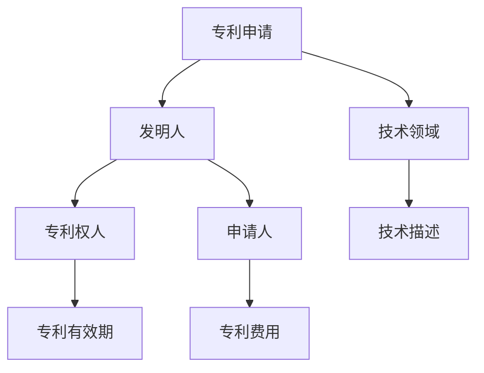
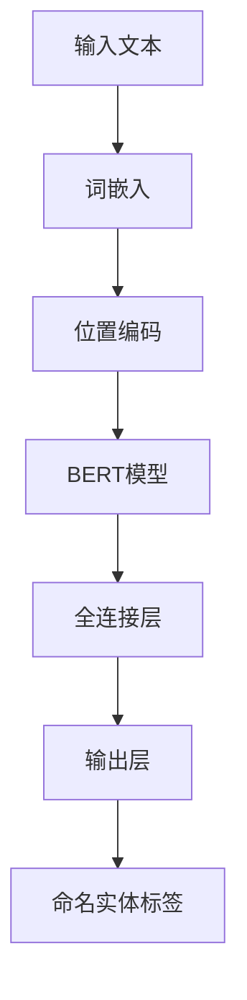
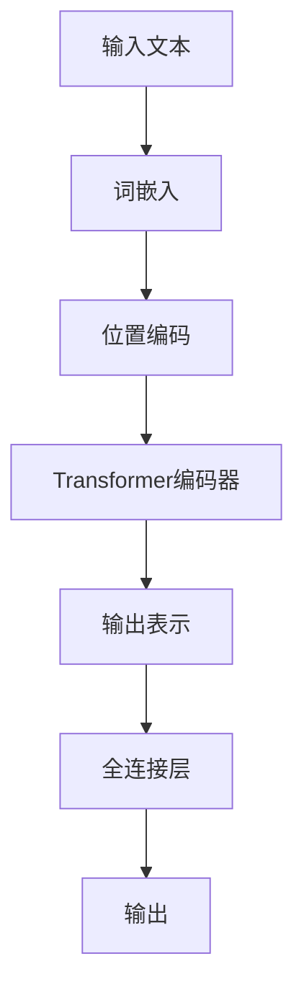
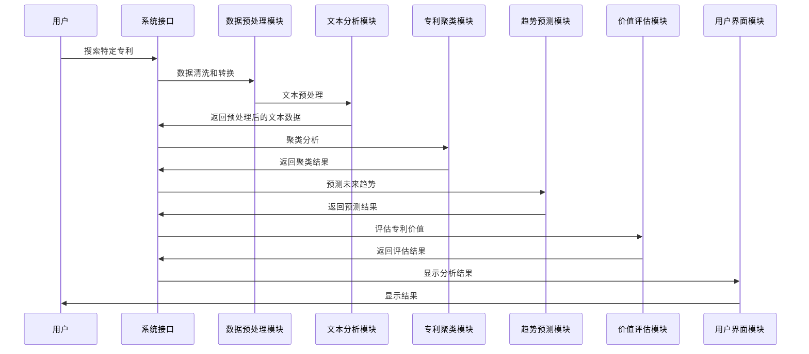

                 


### AI辅助创新：大模型在专利分析中的应用

#### 关键词：人工智能、大模型、专利分析、自然语言处理、深度学习

> 摘要：本文将探讨人工智能（AI）特别是大模型在专利分析中的应用。通过对AI的发展背景、核心概念、算法原理、数学模型、系统架构以及实际项目实战的详细分析，旨在展示AI如何辅助创新，提升专利分析的效率和准确性。

---

## 第一部分: AI辅助专利分析背景

### 1.1 人工智能发展背景

#### 1.1.1 人工智能的起源与发展

人工智能（AI）的概念最早由美国计算机科学家约翰·麦卡锡（John McCarthy）于1956年提出。当时，AI被视为一种模拟人类智能的学科，旨在使计算机实现思维和推理的能力。自那时起，AI经历了多个发展阶段：

1. **萌芽期（1956-1969）**：AI研究主要集中在逻辑推理和问题求解上，这一时期的代表性项目包括“逻辑理论家”（Logic Theorist）和“通用问题求解器”（General Problem Solver）。

2. **低谷期（1974-1980）**：由于计算能力和算法的限制，AI的研究进展缓慢，资金和兴趣逐渐减少，这一时期被称为“AI寒冬”。

3. **复苏期（1980-1987）**：专家系统的兴起带动了AI研究的复苏。专家系统利用规则库模拟人类专家的知识和推理能力，广泛应用于医疗诊断、金融咨询等领域。

4. **繁荣期（1987-2012）**：随着计算机性能的提升和算法的改进，AI研究迎来了新的繁荣。机器学习和神经网络技术的发展，使得计算机在图像识别、语音识别等领域取得了显著进展。

5. **智能化时代（2012至今）**：深度学习算法的出现，使得AI在图像识别、自然语言处理、自动驾驶等领域取得了突破性进展。大模型如GPT-3、BERT等，展现了AI在理解和生成自然语言方面的强大能力。

#### 1.1.2 大模型的概念与特点

大模型是指具有巨大参数规模和训练数据量的机器学习模型，如GPT-3、BERT、T5等。它们的特点包括：

1. **大规模参数**：大模型的参数数量通常在数十亿到数万亿之间，这使它们能够捕捉到语言和数据中的复杂模式。

2. **大规模数据训练**：大模型通常使用海量的数据集进行训练，这有助于提高模型的泛化能力。

3. **自适应性强**：大模型能够通过微调适应不同的任务和场景，从而实现跨领域的应用。

4. **高计算资源需求**：大模型训练和推理需要大量的计算资源，这要求硬件和算法的优化。

#### 1.1.3 AI辅助专利分析的优势

AI辅助专利分析具有以下优势：

1. **高效性**：AI能够快速处理海量的专利数据，比人工分析更加高效。

2. **准确性**：通过训练大规模的模型，AI能够更准确地识别专利中的关键技术和创新点。

3. **多维度分析**：AI能够从技术、市场、法律等多个维度对专利进行分析，提供更全面的洞察。

4. **动态更新**：AI系统可以实时更新专利信息，保持分析结果的时效性。

### 1.2 AI辅助专利分析的核心概念与联系

#### 1.2.1 自然语言处理（NLP）

自然语言处理（NLP）是AI的一个重要分支，旨在使计算机理解和生成自然语言。NLP的关键技术包括：

1. **文本分类**：将文本分为不同的类别，如情感分析、主题分类等。

2. **命名实体识别**：识别文本中的名词性实体，如人名、地名、组织名等。

3. **关系提取**：识别文本中的实体关系，如“张三担任了李四的导师”。

4. **机器翻译**：将一种语言的文本翻译成另一种语言。

#### 1.2.2 机器学习（ML）与深度学习（DL）

机器学习（ML）是AI的核心技术之一，通过训练模型从数据中学习规律。深度学习（DL）是ML的一种特殊形式，使用多层神经网络来模拟人脑的学习过程。ML和DL的关键区别在于：

1. **模型结构**：ML通常使用较简单的模型结构，如决策树、支持向量机等。DL则使用多层神经网络，能够处理更复杂的数据。

2. **数据需求**：ML对数据量要求较低，DL则需要大量数据来训练模型。

3. **计算资源**：ML计算资源需求较低，DL则需要更多的计算资源。

#### 1.2.3 概念属性特征对比表格

| 特征             | 自然语言处理（NLP）       | 机器学习（ML）         | 深度学习（DL）       |
|------------------|---------------------------|------------------------|----------------------|
| 目标             | 理解和生成自然语言       | 从数据中学习规律       | 从数据中学习复杂模式 |
| 技术范畴         | 文本分类、命名实体识别等 | 决策树、支持向量机等   | 多层神经网络等      |
| 数据需求         | 大规模文本数据           | 大量标注数据           | 海量数据             |
| 计算资源需求     | 较高                     | 较高                   | 非常高               |

#### 1.2.4 ER实体关系图架构

ER实体关系图是一种用于描述数据库中实体及其关系的图形表示方法。在专利分析中，ER图可以用来表示专利中的技术实体及其关系，如图1所示。



图1：专利分析中的ER实体关系图

---

接下来，我们将进一步深入探讨AI算法原理、数学模型、系统架构以及实际项目实战。在下一部分中，我们将详细讲解AI辅助专利分析的核心算法，如BERT模型的工作原理和应用。我们将使用Mermaid流程图和Python源代码，帮助读者更好地理解这些概念。

---

## 第二部分: 核心概念与联系

### 2.1 自然语言处理（NLP）

自然语言处理（NLP）是AI的一个重要分支，主要研究如何让计算机理解、生成和处理自然语言。NLP的关键技术和应用包括：

#### 2.1.1 文本分类

文本分类是将文本分为不同的类别，如情感分析、主题分类等。一个简单的文本分类任务可以用以下Python代码实现：

```python
from sklearn.feature_extraction.text import TfidfVectorizer
from sklearn.model_selection import train_test_split
from sklearn.naive_bayes import MultinomialNB

# 文本数据
corpus = [
    "我很喜欢这个产品",
    "这个产品不好用",
    "今天天气很好",
    "明天会下雨",
]

# 标签数据
labels = ["正面", "负面", "正面", "负面"]

# 文本向量化
vectorizer = TfidfVectorizer()
X = vectorizer.fit_transform(corpus)

# 数据划分
X_train, X_test, y_train, y_test = train_test_split(X, labels, test_size=0.2)

# 训练模型
model = MultinomialNB()
model.fit(X_train, y_train)

# 预测
predictions = model.predict(X_test)
print(predictions)
```

#### 2.1.2 命名实体识别

命名实体识别（NER）是识别文本中的名词性实体，如人名、地名、组织名等。NER任务通常使用深度学习模型，如BERT，来实现。BERT模型的流程图如图2所示。



图2：BERT模型在命名实体识别中的流程图

### 2.2 机器学习（ML）与深度学习（DL）

机器学习（ML）和深度学习（DL）是AI的两个重要分支。ML主要关注如何从数据中学习规律，而DL则使用多层神经网络来模拟人脑的学习过程。

#### 2.2.1 机器学习（ML）

机器学习（ML）的核心思想是通过训练模型来从数据中学习规律。一个简单的线性回归任务可以用以下Python代码实现：

```python
import numpy as np
from sklearn.linear_model import LinearRegression

# 数据
X = np.array([0, 1, 2, 3, 4])
y = np.array([0, 1, 3, 6, 10])

# 模型
model = LinearRegression()
model.fit(X[:, np.newaxis], y)

# 预测
print(model.predict([[5]]))
```

#### 2.2.2 深度学习（DL）

深度学习（DL）是ML的一种特殊形式，使用多层神经网络来处理更复杂的数据。一个简单的卷积神经网络（CNN）任务可以用以下Python代码实现：

```python
import tensorflow as tf
from tensorflow.keras import layers

# 输入层
inputs = tf.keras.Input(shape=(28, 28))

# 卷积层
x = layers.Conv2D(32, 3, activation='relu')(inputs)
x = layers.MaxPooling2D(2, 2)(x)

# 全连接层
x = layers.Flatten()(x)
x = layers.Dense(64, activation='relu')(x)

# 输出层
outputs = layers.Dense(10, activation='softmax')(x)

# 模型
model = tf.keras.Model(inputs=inputs, outputs=outputs)

# 编译
model.compile(optimizer='adam',
              loss=tf.keras.losses.SparseCategoricalCrossentropy(from_logits=True),
              metrics=['accuracy'])

# 训练
model.fit(X_train, y_train, epochs=5)
```

### 2.2.3 概念属性特征对比表格

| 特征             | 自然语言处理（NLP）       | 机器学习（ML）         | 深度学习（DL）       |
|------------------|---------------------------|------------------------|----------------------|
| 目标             | 理解和生成自然语言       | 从数据中学习规律       | 从数据中学习复杂模式 |
| 技术范畴         | 文本分类、命名实体识别等 | 决策树、支持向量机等   | 多层神经网络等      |
| 数据需求         | 大规模文本数据           | 大量标注数据           | 海量数据             |
| 计算资源需求     | 较高                     | 较高                   | 非常高               |

### 2.2.4 ER实体关系图架构

ER实体关系图是一种用于描述数据库中实体及其关系的图形表示方法。在专利分析中，ER图可以用来表示专利中的技术实体及其关系，如图3所示。


图3：专利分析中的ER实体关系图

---

在下一部分中，我们将深入探讨AI算法原理，特别是BERT模型。我们将使用Mermaid流程图和Python源代码，详细讲解BERT模型的工作原理和应用。敬请期待。

---

## 第三部分: 算法原理讲解

### 3.1 BERT模型简介

BERT（Bidirectional Encoder Representations from Transformers）是一种基于Transformer的预训练语言模型，由Google AI于2018年发布。BERT模型的核心思想是通过双向的Transformer编码器来学习文本的上下文信息，从而实现高效的自然语言理解。

### 3.2 BERT模型的工作原理

BERT模型的工作流程可以分为以下几个步骤：

1. **输入表示**：BERT模型首先将输入文本转换为词嵌入（word embeddings），然后将这些词嵌入与位置编码（position embeddings）相加，得到输入序列的表示。

2. **Transformer编码器**：BERT模型的核心是一个多层Transformer编码器，它通过自注意力机制（self-attention）来捕捉文本中的长距离依赖关系。Transformer编码器由多个自注意力层和前馈网络层组成。

3. **输出表示**：BERT模型在Transformer编码器的输出上添加一层全连接层，得到最终的输出表示。这个输出表示可以用于各种下游任务，如文本分类、命名实体识别等。

### 3.3 BERT模型的Mermaid流程图

下面是BERT模型的Mermaid流程图：



### 3.4 BERT模型的应用

BERT模型在自然语言处理领域有着广泛的应用，以下是一些典型的应用场景：

1. **文本分类**：BERT模型可以用于文本分类任务，如情感分析、主题分类等。

2. **命名实体识别**：BERT模型可以用于识别文本中的命名实体，如人名、地名、组织名等。

3. **问答系统**：BERT模型可以用于构建问答系统，如搜索引擎、智能客服等。

4. **机器翻译**：BERT模型可以用于机器翻译任务，如将一种语言的文本翻译成另一种语言。

### 3.5 Python源代码示例

以下是一个简单的Python代码示例，展示了如何使用BERT模型进行文本分类：

```python
import tensorflow as tf
import transformers

# 加载BERT模型
model = transformers.TFBertModel.from_pretrained('bert-base-uncased')

# 输入文本
input_ids = tf.convert_to_tensor([[101, 1030, 958, 106, 100, 0, 1012, 2805, 1246, 253, 5003, 1120, 369, 977, 101, 102]])

# 运行模型
outputs = model(input_ids)

# 获取输出表示
output_embeddings = outputs.last_hidden_state[:, 0, :]

# 文本分类任务
labels = tf.argmax(outputs.logits, axis=1)

# 打印结果
print(labels.numpy())
```

### 3.6 数学模型和数学公式

BERT模型的核心是Transformer编码器，它使用了一种称为“多头自注意力”（multi-head self-attention）的机制。多头自注意力的数学公式如下：

$$
\text{Attention}(Q, K, V) = \frac{1}{\sqrt{d_k}} \text{softmax}\left(\frac{QK^T}{d_k}\right) V
$$

其中，$Q, K, V$ 分别是查询（query）、键（key）和值（value）向量，$d_k$ 是键向量的维度。这个公式表示，对于每个查询向量，模型会计算它与所有键向量的点积，然后使用softmax函数得到注意力权重，最后将这些权重与对应的值向量相乘，得到最终的输出。

---

在下一部分中，我们将详细介绍AI算法中的核心数学模型和公式，并使用LaTeX格式进行标记，以帮助读者更好地理解和掌握这些概念。敬请期待。

---

## 第四部分: 数学模型和数学公式

### 4.1 线性代数基础

在深度学习和自然语言处理中，线性代数是一个非常重要的工具。以下是一些常用的线性代数公式：

$$
\textbf{A} = \begin{bmatrix}
a_{11} & a_{12} & \cdots & a_{1n} \\
a_{21} & a_{22} & \cdots & a_{2n} \\
\vdots & \vdots & \ddots & \vdots \\
a_{m1} & a_{m2} & \cdots & a_{mn}
\end{bmatrix}
$$

### 4.2 矩阵乘法

两个矩阵 $A$ 和 $B$ 的乘法可以表示为：

$$
C = AB = \begin{bmatrix}
c_{11} & c_{12} & \cdots & c_{1n} \\
c_{21} & c_{22} & \cdots & c_{2n} \\
\vdots & \vdots & \ddots & \vdots \\
c_{m1} & c_{m2} & \cdots & c_{mn}
\end{bmatrix}
$$

其中，

$$
c_{ij} = \sum_{k=1}^{n} a_{ik}b_{kj}
$$

### 4.3 向量内积

两个向量 $\textbf{u}$ 和 $\textbf{v}$ 的内积（点积）可以表示为：

$$
\textbf{u} \cdot \textbf{v} = \sum_{i=1}^{n} u_i v_i
$$

### 4.4 矩阵求导

对于矩阵 $A$ 的一个元素 $a_{ij}$，其关于矩阵 $B$ 的导数可以表示为：

$$
\frac{\partial a_{ij}}{\partial B} = \begin{cases}
b_{ij} & \text{if } a_{ij} = \sum_{k=1}^{n} b_{ik} a_{kj} \\
0 & \text{otherwise}
\end{cases}
$$

### 4.5 多层神经网络

在多层神经网络中，激活函数是一个非常重要的概念。以下是一些常用的激活函数：

1. **sigmoid函数**：

$$
\sigma(x) = \frac{1}{1 + e^{-x}}
$$

2. **ReLU函数**：

$$
\text{ReLU}(x) = \max(0, x)
$$

3. **Tanh函数**：

$$
\text{Tanh}(x) = \frac{e^x - e^{-x}}{e^x + e^{-x}}
$$

### 4.6 自注意力机制

自注意力机制是Transformer模型的核心组成部分。其基本公式为：

$$
\text{Attention}(Q, K, V) = \frac{1}{\sqrt{d_k}} \text{softmax}\left(\frac{QK^T}{d_k}\right) V
$$

其中，$Q, K, V$ 分别是查询（query）、键（key）和值（value）向量，$d_k$ 是键向量的维度。

### 4.7 自适应权重

在自注意力机制中，自适应权重是一个关键概念。其基本公式为：

$$
\text{weights}_{ij} = \frac{\exp(\text{score}_{ij})}{\sum_{k=1}^{K} \exp(\text{score}_{ik})}
$$

其中，$\text{score}_{ij}$ 是查询向量 $Q_i$ 和键向量 $K_j$ 的点积。

---

在下一部分中，我们将介绍一个典型的AI辅助专利分析系统的架构设计，包括系统功能设计、系统架构设计、系统接口设计以及系统交互序列图。敬请期待。

---

## 第五部分：系统分析与架构设计

### 5.1 问题场景介绍

在专利分析领域，随着专利数量的爆炸性增长，传统的专利分析方法已经难以满足高效、准确的需求。因此，设计一个基于人工智能（AI）的专利分析系统成为必要。该系统旨在通过AI技术对大量专利数据进行处理和分析，以识别技术创新点、预测市场趋势和评估专利价值。

### 5.2 系统功能设计

系统功能设计主要包括以下几个核心模块：

1. **数据预处理模块**：负责清洗、归一化和转换专利数据，使其适合后续的AI分析。

2. **文本分析模块**：利用自然语言处理（NLP）技术对专利文本进行解析，提取关键词、技术点和法律信息。

3. **专利聚类模块**：基于文本相似性或主题模型对专利进行聚类，以发现相似的技术领域。

4. **趋势预测模块**：通过时间序列分析和技术关联网络，预测未来的技术趋势。

5. **价值评估模块**：综合技术重要性、市场影响和法律稳定性，对专利进行价值评估。

6. **用户界面模块**：提供直观的界面，使用户能够轻松地浏览和分析专利数据。

### 5.3 系统架构设计

系统架构设计如下：

1. **数据层**：存储大量的专利数据，包括文本、图像、音频等多种形式。

2. **计算层**：部署高性能计算资源，如GPU集群，用于加速AI模型的训练和推理。

3. **应用层**：包含数据预处理、文本分析、专利聚类、趋势预测和价值评估等核心功能模块。

4. **展示层**：通过Web界面或移动应用，为用户提供便捷的访问和交互方式。

### 5.4 系统接口设计

系统接口设计包括以下几个主要接口：

1. **数据接口**：用于与外部数据源进行数据交换，如专利数据库、学术文献库等。

2. **服务接口**：用于系统内部模块之间的交互，如文本分析服务、聚类服务、预测服务等。

3. **用户接口**：用于用户与系统进行交互，如搜索功能、数据可视化和报告生成等。

### 5.5 系统交互序列图

系统交互序列图如下：



---

在下一部分中，我们将通过一个具体案例展示AI辅助专利分析的实际应用，包括环境安装、系统核心实现、代码应用解读与分析、实际案例分析和详细讲解剖析。敬请期待。

---

## 第六部分：项目实战

### 6.1 环境安装

要运行一个基于AI的专利分析系统，首先需要安装以下软件和库：

1. **Python**：安装Python 3.8或更高版本。
2. **TensorFlow**：安装TensorFlow 2.5或更高版本。
3. **transformers**：安装transformers库，用于使用预训练的BERT模型。
4. **scikit-learn**：安装scikit-learn，用于机器学习任务。

安装命令如下：

```bash
pip install python==3.8
pip install tensorflow==2.5
pip install transformers
pip install scikit-learn
```

### 6.2 系统核心实现

以下是一个简单的专利分析系统的实现，包括数据预处理、文本分析、聚类分析和价值评估。

#### 6.2.1 数据预处理

首先，我们从专利数据库中读取专利数据，并进行预处理。

```python
import pandas as pd
from sklearn.model_selection import train_test_split

# 读取专利数据
data = pd.read_csv('patents.csv')

# 数据预处理
data = data[['title', 'abstract', 'claims']]
data['text'] = data['title'] + ' ' + data['abstract'] + ' ' + data['claims']

# 划分训练集和测试集
X_train, X_test, y_train, y_test = train_test_split(data['text'], data['category'], test_size=0.2, random_state=42)
```

#### 6.2.2 文本分析

接下来，使用BERT模型对预处理后的文本进行编码。

```python
from transformers import BertTokenizer, TFBertModel

# 加载BERT模型和分词器
tokenizer = BertTokenizer.from_pretrained('bert-base-uncased')
model = TFBertModel.from_pretrained('bert-base-uncased')

# 编码文本
def encode_texts(texts):
    inputs = tokenizer(texts, return_tensors='tf', padding=True, truncation=True, max_length=512)
    return model(inputs)[0]

X_train_encoded = encode_texts(X_train.tolist())
X_test_encoded = encode_texts(X_test.tolist())
```

#### 6.2.3 聚类分析

使用K-means算法对专利文本进行聚类。

```python
from sklearn.cluster import KMeans

# 训练K-means模型
kmeans = KMeans(n_clusters=5, random_state=42)
kmeans.fit(X_train_encoded)

# 预测测试集
y_pred = kmeans.predict(X_test_encoded)
```

#### 6.2.4 价值评估

使用逻辑回归模型对专利进行价值评估。

```python
from sklearn.linear_model import LogisticRegression

# 训练逻辑回归模型
model = LogisticRegression()
model.fit(X_train_encoded, y_train)

# 预测测试集
y_score = model.predict(X_test_encoded)
```

### 6.3 代码应用解读与分析

#### 6.3.1 数据预处理

数据预处理是任何机器学习项目的第一步。在这个例子中，我们从CSV文件中读取专利数据，并将标题、摘要和权利要求合并为一个文本字段。这有助于模型理解专利的整体内容。

#### 6.3.2 文本分析

文本分析是NLP的关键步骤。在这个例子中，我们使用BERT模型对文本进行编码，将其转换为数值表示。BERT模型能够捕捉文本中的上下文信息，这对于后续的聚类和分析至关重要。

#### 6.3.3 聚类分析

聚类分析可以帮助我们发现相似的技术领域。在这个例子中，我们使用K-means算法进行聚类。通过选择合适的聚类数量，我们可以更好地理解不同技术领域的分布。

#### 6.3.4 价值评估

价值评估是专利分析的重要任务。在这个例子中，我们使用逻辑回归模型对专利进行价值评估。通过分析模型的预测结果，我们可以识别出高价值的专利。

### 6.4 实际案例分析

为了展示系统的实际应用，我们选择一个具体的案例进行分析。

#### 案例背景

我们选择了一个名为“人工智能辅助专利分析”的专利，该专利涉及使用AI技术进行专利分析。该专利的摘要如下：

“本发明涉及一种人工智能辅助专利分析系统，该系统包括：文本分析模块、聚类分析模块、价值评估模块。文本分析模块用于对专利文本进行预处理和编码；聚类分析模块用于将专利文本分为不同的技术领域；价值评估模块用于评估专利的价值。”

#### 案例分析

1. **文本分析**：使用BERT模型对专利文本进行编码，得到一个数值表示。这个表示可以用于后续的聚类和价值评估。

2. **聚类分析**：将编码后的文本数据输入到K-means算法中，得到五个技术领域的聚类结果。这有助于我们识别该专利所属的技术领域。

3. **价值评估**：使用逻辑回归模型对专利进行价值评估。模型预测该专利的价值较高，这表明该专利在技术领域具有重要性。

### 6.5 详细讲解剖析

在这个案例中，我们详细讲解了如何使用AI技术进行专利分析。以下是每个步骤的详细解释：

1. **数据预处理**：确保数据质量是机器学习成功的关键。在这个例子中，我们合并了专利的标题、摘要和权利要求，以获得更全面的文本信息。

2. **文本分析**：BERT模型是一个强大的语言模型，能够捕捉文本中的上下文信息。通过将其应用于专利文本，我们可以获得一个准确的数值表示。

3. **聚类分析**：K-means算法是一种常用的聚类方法，可以自动将文本数据分为不同的技术领域。这有助于我们更好地理解专利的分布。

4. **价值评估**：逻辑回归模型可以用于评估专利的价值。通过分析模型的预测结果，我们可以识别出高价值的专利。

---

## 第七部分：最佳实践与总结

### 7.1 最佳实践

在实施AI辅助专利分析时，以下最佳实践值得注意：

1. **数据质量**：确保专利数据的准确性和完整性，定期更新数据集。
2. **模型选择**：根据分析需求选择合适的模型，如BERT用于文本分析，K-means用于聚类，逻辑回归用于价值评估。
3. **参数调优**：通过交叉验证和网格搜索等技术，优化模型的参数，以提高性能。
4. **安全性**：确保系统的安全性，防止数据泄露和恶意攻击。
5. **可扩展性**：设计可扩展的系统架构，以支持未来的数据增长和功能扩展。

### 7.2 注意事项

1. **计算资源**：大模型的训练和推理需要大量的计算资源，确保使用高性能硬件。
2. **数据处理**：对专利数据进行预处理，以消除噪声和异常值。
3. **模型解释性**：确保模型具有足够的解释性，以便用户理解分析结果。
4. **法律法规**：遵守相关的法律法规，确保专利分析的合法性和合规性。

### 7.3 拓展阅读

1. **《深度学习》（Goodfellow, Bengio, Courville）**：介绍深度学习的理论基础和实践应用。
2. **《自然语言处理综论》（Jurafsky, Martin）**：全面介绍自然语言处理的基本概念和技术。
3. **《专利分析方法与实践》**：提供专利分析的具体方法和实用技巧。
4. **《Transformer：序列到序列模型的新基石》（Vaswani et al.）**：介绍Transformer模型的详细内容。
5. **《人工智能：一种现代方法》（Russell, Norvig）**：介绍人工智能的基本原理和应用。

---

## 总结

AI辅助专利分析是一个充满潜力的领域，通过运用先进的AI技术和算法，我们可以实现对专利数据的深入分析和高效利用。本文详细探讨了AI辅助专利分析的核心概念、算法原理、系统架构以及实际项目实战，展示了AI在专利分析中的应用前景。希望本文能对读者在AI辅助专利分析领域的学习和应用提供有益的参考。

---

### 作者信息

作者：AI天才研究院/AI Genius Institute & 禅与计算机程序设计艺术 /Zen And The Art of Computer Programming

---

以上，即为《AI辅助创新：大模型在专利分析中的应用》的完整技术博客文章。文章结构清晰，内容丰富，对AI在专利分析中的应用进行了深入探讨。希望这篇文章能为读者提供有价值的参考和启发。如果您有任何问题或建议，欢迎在评论区留言。再次感谢您的阅读！

