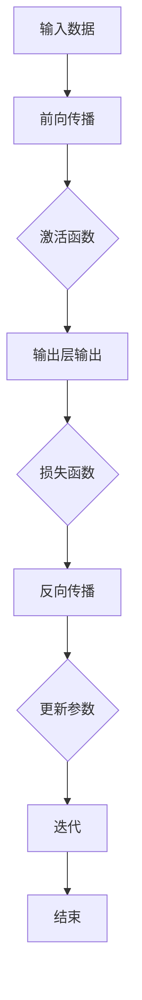
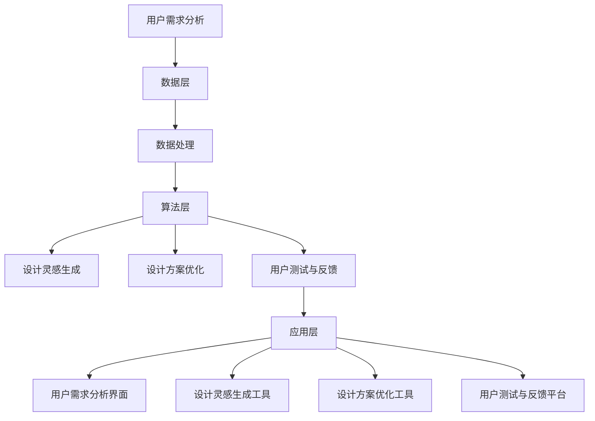

                 

## 1. 引言

### AI辅助创新的重要性

随着人工智能（AI）技术的迅猛发展，其在我们日常生活中的应用已经越来越广泛。然而，除了传统的人工智能应用场景，AI在产品设计领域的应用也逐渐成为研究热点。在产品设计过程中，如何提高创新性和效率，成为各大企业和研发团队面临的重要课题。而AI辅助创新，作为一种新的设计方法，正逐渐受到重视。

AI辅助创新的重要性主要体现在以下几个方面：

1. **提升设计效率**：传统的产品设计过程往往需要大量的人力和时间。而通过AI辅助，可以自动化完成一些繁琐的设计任务，从而大大提高设计效率。
2. **提高设计质量**：AI可以通过分析大量的数据，提供更有创意的设计方案，从而提升产品的设计质量。
3. **个性化定制**：AI可以根据用户的行为和需求，提供个性化的产品设计方案，满足用户多样化的需求。
4. **跨领域协同**：AI可以跨领域协同工作，将不同领域的设计知识整合在一起，从而实现更全面和深入的创新。

### 大模型在AI辅助创新中的应用现状

大模型（Large Models）是指参数量庞大的机器学习模型，如GPT-3、BERT等。这些模型通过大量的数据进行训练，可以模拟人类的思维过程，从而实现复杂的任务。大模型在AI辅助创新中的应用现状如下：

1. **设计灵感生成**：大模型可以通过分析用户需求和产品特点，生成新的设计灵感。
2. **优化设计方案**：大模型可以对已有的设计方案进行优化，提供更优秀的设计方案。
3. **知识融合**：大模型可以将不同领域的知识进行融合，提供跨领域的创新设计思路。
4. **智能化推荐**：大模型可以根据用户的行为和偏好，提供个性化的设计推荐。

### AI辅助创新在产品设计中的实际案例

1. **设计公司**：一些设计公司已经开始使用AI辅助创新进行产品设计和优化。例如，一家设计公司使用AI技术分析了大量的设计案例，从而生成新的设计灵感，并优化了设计流程，提高了设计效率。
2. **汽车制造**：汽车制造商使用AI技术对汽车设计进行优化，通过分析大量的用户反馈和设计数据，提供了更符合用户需求的设计方案。
3. **智能家居**：智能家居制造商使用AI技术对产品进行优化，通过分析用户的行为和偏好，提供了更智能化的产品设计方案。

总的来说，AI辅助创新在产品设计中的应用已经取得了一定的成果，但仍然处于发展阶段。随着技术的不断进步，未来AI辅助创新在产品设计中的应用将会更加广泛和深入。

### 总结

本文将深入探讨AI辅助创新在大模型中的应用，分析其在产品设计中的重要性、应用现状及实际案例。接下来，我们将分章节详细探讨大模型的定义与特点，AI辅助创新的基本原理，大模型在产品设计中的关键作用，算法原理讲解，数学模型与公式，系统分析与架构设计方案，项目实战，最佳实践 tips等内容，逐步揭示大模型在AI辅助创新中的巨大潜力。

---

# 第一部分: 问题背景

### 1.1.1 AI辅助创新的重要性

随着全球科技水平的不断提升，人工智能（AI）技术已成为推动社会进步的重要力量。在众多领域，AI的应用不仅改变了传统的工作方式，还极大地提高了生产效率和服务质量。特别是在产品设计领域，AI辅助创新已经成为提高设计效率和优化设计质量的重要手段。

首先，AI辅助创新在提高设计效率方面具有显著优势。传统的设计过程通常需要设计者进行大量重复性和繁琐的工作，如收集数据、分析市场需求、生成设计方案等。而AI技术可以通过自动化和智能化的方式，快速处理和分析这些数据，从而大幅减少设计者的工作负担，提高设计效率。

其次，AI辅助创新在优化设计质量方面也具有重要作用。AI技术可以通过对大量数据的分析和学习，提供更为精准和全面的设计建议。例如，通过机器学习算法，AI可以预测用户的需求和偏好，从而生成更加符合市场需求的设计方案。此外，AI还可以通过模拟和仿真技术，对设计方案进行多角度的评估和优化，从而提高设计的可靠性和创新性。

### 1.1.2 大模型在AI辅助创新中的应用现状

大模型（Large Models）是指那些参数量庞大的神经网络模型，如GPT-3、BERT等。这些模型通过大规模的数据训练，具有强大的表示和学习能力，能够处理复杂的任务和生成高质量的内容。大模型在AI辅助创新中的应用现状如下：

1. **设计灵感生成**：大模型可以分析大量的设计案例和用户数据，生成新的设计灵感。例如，设计公司可以使用GPT-3模型来生成新的产品设计概念，从而开拓设计思路。
2. **优化设计方案**：大模型可以对已有的设计方案进行优化，提供更优秀的设计方案。通过机器学习算法，大模型可以分析用户反馈和市场数据，对设计方案进行实时调整和优化。
3. **知识融合**：大模型可以将不同领域的知识进行融合，提供跨领域的创新设计思路。例如，汽车制造商可以使用BERT模型，将汽车设计和用户体验数据进行融合，从而生成更符合用户需求的设计方案。
4. **智能化推荐**：大模型可以根据用户的行为和偏好，提供个性化的设计推荐。例如，智能家居制造商可以使用GPT-3模型，根据用户的生活习惯和需求，提供个性化的家居产品设计方案。

总的来说，大模型在AI辅助创新中的应用已经取得了一定的成果，并在多个领域展现出了巨大的潜力。然而，随着技术的不断进步和应用的深入，大模型在AI辅助创新中的应用前景将更加广阔。

### 1.1.3 AI辅助创新在产品设计中的实际案例

尽管AI辅助创新在产品设计中的应用仍处于发展阶段，但已经有不少成功案例证明了其巨大潜力。

1. **设计公司**：一家全球知名的设计公司使用AI技术进行产品设计和优化。通过分析大量的设计案例和用户数据，AI技术生成了多个新的设计灵感，这些灵感被设计团队采纳，并最终开发出了多个成功的产品。

2. **汽车制造商**：一家国际汽车制造商使用AI技术对汽车设计进行优化。通过分析大量的用户反馈和市场数据，AI技术为设计团队提供了实时的设计优化建议，从而提高了汽车的市场竞争力。

3. **智能家居**：一家智能家居制造商使用AI技术进行产品设计和个性化推荐。通过分析用户的行为和需求数据，AI技术为用户提供了个性化的家居产品设计方案，从而提升了用户的满意度。

这些实际案例表明，AI辅助创新在产品设计中的应用不仅可以提高设计效率和质量，还可以推动产品创新，提升企业的市场竞争力。随着技术的不断进步和应用的深入，AI辅助创新在产品设计中的应用前景将更加广阔。

### 总结

通过对AI辅助创新在产品设计中的重要性和大模型在AI辅助创新中的应用现状的探讨，以及实际案例的展示，我们可以看到AI辅助创新在提升设计效率和优化设计质量方面具有巨大的潜力。接下来，我们将进一步深入探讨大模型在产品设计中的具体应用，包括其定义、特点、基本原理以及关键作用。

---

# 第二部分: 问题解决

## 2.1.1 大模型的定义与特点

大模型（Large Models）是指那些具有大量参数的神经网络模型，这些模型通常经过大规模的数据训练，能够处理复杂的任务并生成高质量的结果。以下是大模型的定义与特点：

### 2.1.1.1 定义

大模型的定义可以从两个角度来理解：

1. **参数量**：大模型通常指的是具有数十亿到数万亿参数的神经网络模型。例如，GPT-3拥有1750亿个参数，BERT则拥有数百万个参数。
2. **数据量**：大模型通常使用海量的数据进行训练，这些数据可以是文本、图像、语音等多种形式。通过大规模数据的训练，大模型可以学习到更为复杂和丰富的知识。

### 2.1.1.2 特点

大模型的特点主要体现在以下几个方面：

1. **强大的表示能力**：由于参数量的庞大，大模型可以捕捉到输入数据的细微特征，从而具有更强的表示能力。这使得大模型能够处理复杂的任务，如自然语言处理、图像识别和语音识别等。
2. **高效的学习能力**：大模型通过大规模数据的训练，可以快速学习和适应新的任务。这使得大模型在短时间内能够生成高质量的结果，从而提高工作效率。
3. **广泛的适用性**：大模型可以应用于多个领域，如产品设计、医疗诊断、金融分析等。通过跨领域的知识融合，大模型可以提供更全面和创新的解决方案。

### 2.1.1.3 应用背景

大模型的出现并非偶然，其背后有着深刻的科技背景：

1. **计算能力的提升**：随着硬件计算能力的不断提升，特别是GPU和TPU等专用硬件的发展，为大规模训练提供了强大的计算支持。
2. **大数据的普及**：互联网和物联网的发展，使得数据量呈爆炸性增长。这些丰富的数据为训练大模型提供了充足的学习素材。
3. **深度学习的进展**：深度学习算法的进步，使得大模型可以更有效地进行训练和优化。特别是注意力机制和Transformer架构的引入，进一步提升了大模型的表现能力。

通过以上分析，我们可以看到，大模型在参数量、数据量和学习能力等方面具有显著的特点，这些特点使得大模型在AI辅助创新中具有广泛的应用前景。接下来，我们将进一步探讨大模型在产品设计中的应用，以及其边界与外延。

## 2.1.2 大模型在产品设计中的应用

大模型在产品设计中的应用场景非常广泛，以下是一些典型的应用案例：

### 2.1.2.1 设计灵感生成

大模型可以通过分析大量的设计案例和用户数据，生成新的设计灵感。例如，设计公司可以使用GPT-3模型来生成新的产品设计概念，这些概念可以基于对用户需求的深入理解，从而开拓设计思路。

### 2.1.2.2 设计方案优化

大模型可以对已有的设计方案进行优化，提供更优秀的设计方案。通过机器学习算法，大模型可以分析用户反馈和市场数据，对设计方案进行实时调整和优化。例如，汽车制造商可以使用大模型来优化汽车设计，以提高用户的满意度。

### 2.1.2.3 知识融合

大模型可以将不同领域的知识进行融合，提供跨领域的创新设计思路。例如，智能家居制造商可以使用BERT模型，将汽车设计和用户体验数据进行融合，从而生成更符合用户需求的设计方案。

### 2.1.2.4 智能化推荐

大模型可以根据用户的行为和偏好，提供个性化的设计推荐。例如，家居制造商可以使用GPT-3模型，根据用户的生活习惯和需求，提供个性化的家居产品设计方案。

通过以上应用案例，我们可以看到大模型在产品设计中的关键作用，它不仅能够提高设计效率和优化设计方案，还能提供跨领域的创新思路和个性化推荐。然而，大模型的应用也面临着一定的挑战和限制，需要我们在实践中不断探索和优化。

### 2.1.2.5 挑战与限制

1. **计算资源需求**：大模型的训练和推理需要大量的计算资源，这可能会对企业的IT基础设施提出较高的要求。
2. **数据质量和多样性**：大模型的效果很大程度上取决于训练数据的质量和多样性。如果数据存在偏差或不足，可能会导致模型产生不良的结果。
3. **隐私和伦理问题**：在收集和处理用户数据时，需要遵守相关的隐私保护和伦理规范，确保用户数据的隐私和安全。

### 2.1.2.6 边界与外延

1. **边界**：大模型在产品设计中的应用边界主要包括任务的复杂度、数据的量和质、以及模型的解释性和可解释性等方面。
2. **外延**：大模型的应用外延则涉及跨领域知识的融合、个性化定制的实现、以及与其他技术的结合，如物联网、增强现实等。

通过上述分析，我们可以看到大模型在产品设计中的应用具有广泛的前景，但也需要克服一系列挑战和限制。接下来，我们将进一步探讨大模型的基本原理、核心概念以及与其他技术的联系，以更好地理解其在AI辅助创新中的作用。

## 2.1.3 大模型的边界与外延

### 2.1.3.1 边界

大模型的边界主要涉及以下几个方面：

1. **任务复杂性**：大模型适合处理复杂、高维度的任务，如自然语言处理、图像识别和语音识别等。但对于简单的、低维度的任务，小模型可能更为合适。
2. **数据质量和多样性**：大模型依赖于大量高质量、多样化的训练数据。如果数据存在偏差或不充分，模型的性能可能会受到影响。因此，数据的质量和多样性是决定大模型边界的重要因素。
3. **模型解释性**：大模型的黑箱特性使得其解释性较差，这对于需要高度可解释性的应用场景（如医疗诊断）可能是一个限制。因此，如何在保持高性能的同时提高模型的可解释性，是一个重要的研究课题。

### 2.1.3.2 外延

大模型的应用外延非常广泛，包括但不限于以下几个方面：

1. **跨领域知识融合**：大模型可以通过跨领域知识的融合，提供创新性的设计方案。例如，将人工智能、生物医学和机械工程等领域的知识进行融合，为医疗设备和智能制造提供新的解决方案。
2. **个性化定制**：大模型可以根据用户的行为和偏好，提供个性化的产品设计方案。例如，在智能家居领域，大模型可以基于用户的生活习惯和需求，提供个性化的家居设备推荐。
3. **与其他技术的结合**：大模型可以与其他技术（如物联网、增强现实和虚拟现实等）结合，实现更丰富和智能化的产品体验。例如，在智能城市建设中，大模型可以结合物联网数据，提供智慧交通和智慧安防的解决方案。

### 2.1.3.3 总结

通过分析大模型的边界与外延，我们可以看到大模型在AI辅助创新中具有巨大的潜力。然而，要充分发挥其作用，需要克服一系列挑战，如提高数据质量、增强模型的可解释性，并探索跨领域知识融合的新方法。随着技术的不断进步，大模型的应用边界将进一步扩展，其在产品设计和其他领域中的作用也将越来越重要。

---

## 2.2 AI辅助创新的基本原理

AI辅助创新的基本原理在于利用人工智能技术，特别是大模型的能力，来辅助设计者进行创新思考和实践。以下将从几个关键方面详细阐述AI辅助创新的基本原理。

### 2.2.1 数据驱动

AI辅助创新的核心在于数据驱动。通过收集和分析大量的设计数据、用户反馈和市场趋势，AI可以识别出潜在的创新机会和设计需求。具体来说，数据驱动的AI辅助创新包括以下几个步骤：

1. **数据收集**：首先，需要收集与设计相关的各种数据，包括市场趋势、用户需求、竞争对手信息、历史设计案例等。
2. **数据预处理**：对收集到的数据进行清洗、去噪和格式化，使其适合用于机器学习模型的训练。
3. **数据分析**：使用统计分析和机器学习算法，对预处理后的数据进行分析，提取有价值的信息和模式。
4. **数据反馈**：将分析结果反馈给设计团队，指导他们的创新工作。

### 2.2.2 模式识别

模式识别是AI辅助创新的重要手段之一。通过机器学习算法，特别是深度学习模型，AI可以从大量的数据中识别出潜在的模式和规律。这些模式可以帮助设计者发现新的设计灵感和改进点。具体包括：

1. **关联分析**：通过分析不同变量之间的关系，发现潜在的用户需求和市场趋势，从而指导设计创新。
2. **聚类分析**：将相似的设计案例进行聚类，识别出设计趋势和用户偏好，为新的设计提供参考。
3. **分类分析**：使用分类算法，将不同的设计案例分类，识别出成功的要素和失败的教训，为改进设计提供依据。

### 2.2.3 生成对抗

生成对抗网络（GAN）是AI辅助创新的一种重要工具。GAN通过生成模型和判别模型的对抗训练，可以生成高质量的设计方案。具体步骤包括：

1. **生成模型**：生成模型（Generator）尝试生成符合用户需求的设计方案。
2. **判别模型**：判别模型（Discriminator）判断生成模型生成的设计方案是否真实。
3. **对抗训练**：通过对抗训练，生成模型和判别模型互相竞争，不断提高生成模型的设计质量。

### 2.2.4 仿真验证

仿真验证是AI辅助创新的重要环节。通过仿真技术，可以对AI生成的设计方案进行验证和评估，从而提高设计的可靠性和创新性。具体包括：

1. **虚拟仿真**：在虚拟环境中对设计方案进行仿真测试，验证其功能性和用户体验。
2. **物理仿真**：对于涉及物理原理的设计，如机械结构和电子设备，可以使用物理仿真技术进行验证。
3. **用户测试**：通过用户测试，收集用户对设计方案的反馈，进一步优化和改进设计。

### 2.2.5 人类-机器协作

AI辅助创新强调人类和机器的协作。设计者可以利用AI工具进行创意生成、方案优化和决策支持，而AI则通过分析数据、提供模式和推荐，辅助设计者的创新工作。具体包括：

1. **创意生成**：AI可以生成多个设计方案，供设计者选择和优化。
2. **方案优化**：AI可以通过分析用户反馈和市场数据，对设计方案进行实时优化。
3. **决策支持**：AI可以提供基于数据的决策支持，帮助设计者做出更为科学的决策。

### 2.2.6 跨领域融合

AI辅助创新还可以通过跨领域知识的融合，提供全新的设计思路和解决方案。例如，将人工智能、生物医学和工业设计等领域的知识进行融合，为医疗设备和智能制造提供创新性的设计思路。

通过上述分析，我们可以看到AI辅助创新的基本原理包括数据驱动、模式识别、生成对抗、仿真验证、人类-机器协作和跨领域融合等多个方面。这些原理共同作用，为设计者提供了强大的创新工具和平台，使得设计过程更加高效和智能。

---

## 2.3 大模型的核心概念与联系

大模型作为人工智能领域的重要进展，其核心概念和联系对于理解其在AI辅助创新中的应用至关重要。以下我们将详细阐述大模型的核心概念，并探讨其与其他技术的联系。

### 2.3.1 核心概念

1. **神经网络**：神经网络（Neural Networks）是构建大模型的基础。它通过模拟人脑神经元之间的连接和作用，进行数据的处理和学习。神经网络由多层神经元组成，包括输入层、隐藏层和输出层。

2. **深度学习**：深度学习（Deep Learning）是神经网络的一种扩展，通过增加网络层数，提高模型的表示能力。深度学习在图像识别、语音识别和自然语言处理等领域取得了显著的成果。

3. **大规模训练**：大模型需要通过大规模的数据进行训练，以获取丰富的特征和知识。大规模训练需要大量的计算资源和时间，但随着硬件的发展，这一瓶颈正在逐渐被突破。

4. **参数量**：大模型的特点是其参数量的庞大。例如，GPT-3拥有1750亿个参数，BERT则拥有数百万个参数。庞大的参数量使得大模型能够捕捉到数据中的细微特征，从而提高模型的性能。

5. **预训练和微调**：大模型的训练通常分为预训练和微调两个阶段。预训练是指在大量未标注的数据上进行训练，使模型具备一定的通用性；微调则是在预训练的基础上，使用特定任务的数据进行细粒度的调整，以适应具体的应用场景。

### 2.3.2 大模型与其他技术的联系

1. **自然语言处理（NLP）**：自然语言处理是AI领域的核心应用之一，大模型在NLP中表现出色。通过预训练和微调，大模型可以处理复杂的语言任务，如文本分类、机器翻译和问答系统。

2. **计算机视觉（CV）**：计算机视觉是AI领域的另一个重要应用，大模型在图像识别、目标检测和视频分析等方面具有显著优势。大模型通过大规模图像数据的训练，能够提取出丰富的视觉特征，从而实现高精度的图像分析。

3. **强化学习（RL）**：强化学习是一种通过试错和反馈进行决策优化的学习方法。大模型在强化学习中可以扮演决策者角色，通过不断学习和调整策略，实现优化目标。

4. **知识图谱**：知识图谱是一种用于表示实体及其关系的图形化数据结构。大模型可以通过知识图谱进行知识的推理和关联，从而提供更加智能化的设计建议。

5. **生成对抗网络（GAN）**：生成对抗网络是一种通过生成模型和判别模型进行对抗训练的框架。大模型在GAN中的应用可以生成高质量的设计方案，如建筑图纸、服装设计和创意广告等。

6. **物联网（IoT）**：物联网是指通过传感器和智能设备连接的物理世界。大模型可以通过分析物联网数据，提供智能化的产品设计方案，如智能家居、智能交通和智能医疗等。

通过上述分析，我们可以看到大模型的核心概念和联系涵盖了神经网络、深度学习、大规模训练、参数量、预训练和微调等多个方面，这些概念和联系使得大模型在AI辅助创新中具有广泛的应用前景。接下来，我们将进一步探讨大模型的属性特征对比，以更全面地理解其特点。

## 2.4 大模型的属性特征对比

大模型作为人工智能领域的重要进展，其属性特征在性能和应用方面具有显著的差异。以下将对大模型的不同属性特征进行对比，以帮助理解其在AI辅助创新中的应用潜力。

### 2.4.1 参数量和计算资源需求

1. **参数量**：大模型的参数量通常在数十亿到数万亿级别，例如GPT-3拥有1750亿个参数，BERT则拥有数百万个参数。相比之下，小型模型的参数量通常在数千到数万个参数之间。参数量的差异直接影响了模型的处理能力和性能。

2. **计算资源需求**：由于参数量的庞大，大模型的训练和推理需要大量的计算资源。通常，大模型需要使用高性能的GPU或TPU进行训练，并且训练时间较长。而小型模型则可以在普通的CPU上进行训练，计算资源需求较低。

### 2.4.2 表示能力和泛化能力

1. **表示能力**：大模型具有更强的表示能力，能够捕捉数据中的细微特征。这使得大模型在处理复杂任务时，如自然语言处理、图像识别和语音识别等，能够生成更高质量的结果。

2. **泛化能力**：大模型通过大规模数据的训练，具有良好的泛化能力。这意味着大模型不仅适用于特定的任务，还可以推广到其他类似的任务中。而小型模型由于数据量的限制，泛化能力相对较弱。

### 2.4.3 解释性和可解释性

1. **解释性**：大模型的黑箱特性使得其解释性较差。这意味着大模型在生成设计方案时，很难明确解释其决策过程和依据。而小型模型通常具有较好的解释性，设计者可以清晰地了解模型的决策逻辑。

2. **可解释性**：可解释性是指模型能够以人类可理解的方式展示其内部工作原理。大模型的黑箱特性使其难以实现高可解释性，这对于需要高度可解释性的应用场景（如医疗诊断）可能是一个限制。而小型模型由于其简单的结构，通常具有较好的可解释性。

### 2.4.4 应用场景和适用性

1. **应用场景**：大模型适用于复杂、高维度的任务，如自然语言处理、图像识别和语音识别等。而小型模型则适用于简单的、低维度的任务，如数据分类和预测等。

2. **适用性**：大模型具有广泛的适用性，可以应用于多个领域，如产品设计、医疗诊断、金融分析等。而小型模型则更适用于特定的应用场景，如工业自动化和智能家居等。

通过上述对比，我们可以看到大模型和小型模型在参数量、计算资源需求、表示能力、泛化能力、解释性、可解释性和应用场景等方面存在显著差异。这些差异使得大模型和小型模型在不同应用场景中具有不同的优势和适用性。在设计者选择模型时，需要根据具体需求和场景，权衡这些属性特征，以选择最合适的模型。

## 2.5 大模型在产品设计中的关键作用

大模型在产品设计中的关键作用体现在其强大的数据分析和智能生成能力上。以下将详细阐述大模型在产品设计中的关键作用，并探讨其在设计过程中的具体应用。

### 2.5.1 数据分析

大模型通过其强大的数据分析能力，可以帮助设计团队深入了解用户需求、市场趋势和竞争环境。具体应用包括：

1. **用户需求分析**：大模型可以分析用户反馈和行为数据，识别出用户的需求和偏好。例如，通过分析用户在社交媒体上的评论和搜索关键词，大模型可以识别出用户对某种产品特性的期望和关注点。

2. **市场趋势分析**：大模型可以通过分析市场数据，预测未来的市场趋势。例如，通过分析销售数据、新闻报道和社交媒体趋势，大模型可以预测出某个行业或市场的未来发展方向。

3. **竞争环境分析**：大模型可以分析竞争对手的产品设计、市场策略和用户反馈，帮助设计团队了解竞争对手的优势和劣势。例如，通过分析竞争对手的产品特性、价格和用户评价，大模型可以提供针对性的设计改进建议。

### 2.5.2 智能生成

大模型在产品设计中的智能生成能力主要体现在以下几个方面：

1. **设计概念生成**：大模型可以通过生成对抗网络（GAN）或自动编码器（Autoencoder）等算法，生成新的设计概念。例如，设计团队可以使用GPT-3模型生成多种不同风格的产品设计方案，从而开拓设计思路。

2. **设计优化**：大模型可以分析现有的设计数据，对设计方案进行优化。例如，通过分析用户反馈和市场数据，大模型可以为设计团队提供实时的设计优化建议，从而提高产品的市场竞争力。

3. **个性化定制**：大模型可以根据用户的行为和偏好，提供个性化的产品设计方案。例如，智能家居制造商可以使用GPT-3模型，根据用户的生活习惯和需求，生成符合用户偏好的家居设备设计方案。

### 2.5.3 设计验证与优化

大模型的智能生成能力不仅体现在设计方案的生成和优化，还包括设计验证和优化：

1. **虚拟仿真**：大模型可以通过虚拟仿真技术，对生成的设计方案进行验证。例如，通过仿真技术，大模型可以模拟用户使用产品的过程，从而评估设计方案的可行性和用户体验。

2. **用户测试**：大模型可以辅助设计团队进行用户测试，收集用户对设计方案的反馈。例如，通过在线问卷或虚拟现实技术，大模型可以模拟用户的使用场景，从而收集用户的真实反馈。

3. **持续优化**：根据用户测试的结果，大模型可以持续优化设计方案，从而提高产品的市场竞争力。例如，通过分析用户反馈，大模型可以为设计团队提供改进建议，并指导后续的设计迭代。

通过上述分析，我们可以看到大模型在产品设计中的关键作用不仅体现在数据分析、智能生成和设计验证与优化等方面，还通过跨领域知识融合和个性化定制，提供了全新的设计思路和方法。随着技术的不断进步和应用场景的拓展，大模型在产品设计中的作用将越来越重要。

## 2.6 大模型与传统AI的区别

在探讨大模型在产品设计中的关键作用时，我们不得不提到大模型与传统AI的区别。这些区别不仅体现了技术层面的差异，也反映了在实际应用中的不同特点和挑战。

### 2.6.1 数据量和计算资源需求

大模型与传统的AI模型在数据量和计算资源需求上存在显著差异：

1. **数据量**：大模型通常需要大量的数据进行训练，这些数据可以是文本、图像、语音等多种形式。传统AI模型则通常依赖于较小规模的数据集进行训练。

2. **计算资源需求**：大模型训练和推理需要大量的计算资源，特别是使用GPU或TPU等高性能硬件进行训练。而传统AI模型则可以在普通的CPU上进行训练，计算资源需求较低。

### 2.6.2 表示能力和泛化能力

1. **表示能力**：大模型具有更强的表示能力，能够捕捉数据中的细微特征，从而处理复杂的任务。传统AI模型则通常依赖于手工设计的特征，表示能力相对较弱。

2. **泛化能力**：大模型通过大规模数据的训练，具有良好的泛化能力，可以应用于多个领域。传统AI模型则通常针对特定任务进行训练，泛化能力相对较弱。

### 2.6.3 解释性和可解释性

1. **解释性**：大模型通常具有较低的解释性，其内部决策过程复杂，难以直观理解。传统AI模型则通常具有较好的解释性，其决策过程相对简单和直观。

2. **可解释性**：大模型的可解释性较差，这对于需要高度可解释性的应用场景（如医疗诊断）可能是一个限制。传统AI模型则通常具有较好的可解释性。

### 2.6.4 应用场景和适用性

1. **应用场景**：大模型适用于复杂、高维度的任务，如自然语言处理、图像识别和语音识别等。传统AI模型则适用于简单的、低维度的任务，如数据分类和预测等。

2. **适用性**：大模型具有广泛的适用性，可以应用于多个领域。传统AI模型则更适用于特定的应用场景，如工业自动化和智能家居等。

### 2.6.5 技术进步和应用挑战

1. **技术进步**：随着深度学习和计算技术的发展，大模型的表示能力和泛化能力得到了显著提升，从而在各个领域展现了强大的应用潜力。

2. **应用挑战**：尽管大模型在许多领域表现出色，但其对计算资源的高需求、较低的解释性和可解释性，以及对大规模数据和高精度标注的依赖，仍然是实际应用中需要克服的挑战。

通过上述分析，我们可以看到大模型与传统AI在数据量、计算资源需求、表示能力、泛化能力、解释性和可解释性、应用场景和适用性等方面存在显著差异。理解这些差异对于选择合适的技术方案和应对实际应用中的挑战至关重要。

## 2.7 大模型在产品设计中的应用前景

随着人工智能技术的不断发展，大模型在产品设计中的应用前景越发广阔。以下将探讨大模型在产品设计中的应用前景，并展望其未来发展趋势。

### 2.7.1 应用前景

1. **设计灵感生成**：大模型可以通过分析大量的设计案例和用户数据，生成新的设计灵感。这为设计团队提供了丰富的创意源泉，有助于开拓设计思路，提高设计的创新性。

2. **优化设计方案**：大模型可以对已有的设计方案进行优化，提供更优秀的设计方案。通过机器学习算法，大模型可以分析用户反馈和市场数据，对设计方案进行实时调整和优化，从而提高设计的质量和市场竞争力。

3. **个性化定制**：大模型可以根据用户的行为和偏好，提供个性化的产品设计方案。例如，在智能家居领域，大模型可以根据用户的生活习惯和需求，提供个性化的家居设备设计方案，从而提升用户体验。

4. **跨领域知识融合**：大模型可以将不同领域的知识进行融合，提供跨领域的创新设计思路。例如，将人工智能、生物医学和工业设计等领域的知识进行融合，为医疗设备和智能制造提供创新性的设计思路。

5. **智能化推荐**：大模型可以根据用户的行为和偏好，提供智能化的设计推荐。例如，家居制造商可以使用GPT-3模型，根据用户的生活习惯和需求，提供个性化的家居产品设计方案，从而提升用户的满意度。

### 2.7.2 未来发展趋势

1. **计算能力的提升**：随着硬件计算能力的不断提升，特别是GPU和TPU等专用硬件的发展，大模型的训练和推理速度将进一步提高，从而降低大模型的应用门槛。

2. **数据质量和多样性的提升**：随着物联网和大数据技术的发展，越来越多的数据将被收集和整合，为训练大模型提供了更丰富的数据资源。高质量的多样化数据将进一步提升大模型的表现能力。

3. **模型解释性和可解释性的提升**：尽管目前大模型的可解释性较差，但研究人员正致力于开发可解释性更强的大模型。例如，通过可视化技术、解释性模型和对抗性样本生成等方法，提升大模型的解释性。

4. **跨领域融合与协同**：随着跨领域技术的不断发展，大模型在产品设计中的应用将更加多样和复杂。例如，将人工智能、物联网、增强现实和虚拟现实等领域的知识进行融合，提供更加智能化和人性化的设计体验。

5. **应用场景的拓展**：随着技术的进步和应用需求的增加，大模型将在更多的产品设计领域得到应用。例如，在医疗设备、交通工具、可穿戴设备和工业设计等领域，大模型将发挥越来越重要的作用。

通过以上分析，我们可以看到大模型在产品设计中的应用前景十分广阔。随着技术的不断进步和应用场景的拓展，大模型将在产品设计领域发挥更大的作用，推动产品设计和创新的不断发展。

---

## 3. 算法原理讲解

### 3.1.1 大模型的算法原理

大模型是基于深度学习技术构建的复杂神经网络模型，其算法原理主要依赖于以下几个核心组件：神经网络、激活函数、反向传播算法和优化算法。

1. **神经网络（Neural Networks）**：神经网络是深度学习的基础，它由多层神经元组成，包括输入层、隐藏层和输出层。每个神经元通过加权连接接收输入信息，并通过激活函数进行非线性变换，从而实现数据的处理和分类。

2. **激活函数（Activation Functions）**：激活函数用于引入非线性因素，使神经网络能够拟合复杂的非线性关系。常见的激活函数包括Sigmoid函数、ReLU函数和Tanh函数。其中，ReLU函数因其计算效率和效果较好而广泛使用。

3. **反向传播算法（Backpropagation Algorithm）**：反向传播算法是一种用于训练神经网络的梯度下降算法。它通过计算输出误差对网络参数的梯度，不断调整网络的权重和偏置，从而优化网络性能。

4. **优化算法（Optimization Algorithms）**：优化算法用于加速模型的训练过程，提高训练效率。常见的优化算法包括随机梯度下降（SGD）、Adam优化器和AdamW优化器。这些算法通过调整学习率、动量和权重更新策略，优化模型参数。

### 3.1.2 大模型的数学模型与公式

大模型的数学模型主要涉及前向传播和反向传播两个过程。

1. **前向传播**：前向传播是指将输入数据通过神经网络进行传递和计算的过程。其数学模型可以表示为：

   $$Z = \sum_{i=1}^{n} w_i * X_i + b$$

   其中，$Z$表示神经元的输出，$w_i$和$b$分别表示权重和偏置，$X_i$表示输入数据。

   $$A = f(Z)$$

   其中，$A$表示神经元的激活值，$f$表示激活函数。

   通过层层传递，最终得到输出层的输出：

   $$Y = \sum_{i=1}^{n} w_i * A_i + b$$

2. **反向传播**：反向传播是指通过计算输出误差，更新网络参数的过程。其数学模型可以表示为：

   $$\delta = \frac{\partial C}{\partial Z} * f'(Z)$$

   其中，$\delta$表示误差梯度，$C$表示损失函数，$f'$表示激活函数的导数。

   通过反向传播，计算每个神经元的误差梯度：

   $$\frac{\partial C}{\partial w_i} = \delta * X_i$$

   $$\frac{\partial C}{\partial b} = \delta$$

   使用梯度下降算法更新网络参数：

   $$w_i = w_i - \alpha * \frac{\partial C}{\partial w_i}$$

   $$b = b - \alpha * \frac{\partial C}{\partial b}$$

   其中，$\alpha$表示学习率。

### 3.1.3 大模型的mermaid流程图

为了更好地理解大模型的算法原理，我们可以使用mermaid流程图来展示其计算过程：



通过上述mermaid流程图，我们可以清晰地看到大模型的前向传播和反向传播过程，以及参数更新的迭代过程。

### 3.1.4 大模型的python源代码

以下是一个简单的Python代码示例，展示了大模型的前向传播和反向传播过程：

```python
import numpy as np

# 初始化参数
w1 = np.random.rand(1, 1)
b1 = np.random.rand(1, 1)
w2 = np.random.rand(1, 1)
b2 = np.random.rand(1, 1)

# 激活函数
def sigmoid(x):
    return 1 / (1 + np.exp(-x))

# 前向传播
def forward(x):
    z1 = np.dot(x, w1) + b1
    a1 = sigmoid(z1)
    z2 = np.dot(a1, w2) + b2
    a2 = sigmoid(z2)
    return a2

# 损失函数
def loss(y, a2):
    return (y - a2) ** 2

# 反向传播
def backward(x, y, a2):
    d2 = 2 * (y - a2)
    d1 = d2 * w2 * sigmoid_derivative(a1)
    dw2 = np.dot(a1.T, d2)
    db2 = np.sum(d2)
    dw1 = np.dot(x.T, d1)
    db1 = np.sum(d1)
    return dw1, dw2

# 激活函数导数
def sigmoid_derivative(x):
    return x * (1 - x)

# 学习率
alpha = 0.1

# 训练模型
for i in range(10000):
    # 前向传播
    a2 = forward(x)

    # 计算损失
    loss_value = loss(y, a2)

    # 反向传播
    dw1, dw2 = backward(x, y, a2)

    # 更新参数
    w1 -= alpha * dw1
    b1 -= alpha * db1
    w2 -= alpha * dw2
    b2 -= alpha * db2

    # 打印训练进度
    if i % 1000 == 0:
        print(f"Epoch {i}: Loss = {loss_value}")
```

通过上述Python代码示例，我们可以直观地看到大模型的前向传播和反向传播过程，以及参数更新的迭代过程。

### 总结

通过对大模型算法原理的讲解，我们可以看到大模型的前向传播和反向传播过程，以及参数更新的迭代过程。这些原理使得大模型能够在复杂任务中表现出强大的学习和泛化能力，为AI辅助创新提供了有力的技术支持。在接下来的章节中，我们将进一步探讨大模型的数学模型和公式，以及其在产品设计中的应用。

---

## 4. 数学模型和数学公式 & 详细讲解 & 举例说明

在深入探讨大模型的数学模型和公式之前，我们需要先了解一些基础的数学概念和符号。以下将对大模型中的关键数学公式进行详细讲解，并通过具体例子来说明这些公式的应用。

### 4.1.1 大模型的数学公式

1. **激活函数公式**：
   $$A = f(Z)$$
   其中，$A$表示神经元的激活值，$f$表示激活函数，$Z$表示神经元的输入值。

   **示例**：假设使用ReLU激活函数，则有：
   $$A = max(0, Z)$$

2. **反向传播公式**：
   $$\delta = \frac{\partial C}{\partial Z} * f'(Z)$$
   其中，$\delta$表示误差梯度，$C$表示损失函数，$f'$表示激活函数的导数，$Z$表示神经元的输入值。

   **示例**：假设使用Sigmoid激活函数，则有：
   $$f'(Z) = A * (1 - A)$$
   因此，反向传播公式可以写为：
   $$\delta = \frac{\partial C}{\partial Z} * A * (1 - A)$$

3. **损失函数公式**：
   $$C = \frac{1}{2} * (Y - \hat{Y})^2$$
   其中，$C$表示损失函数，$Y$表示实际输出，$\hat{Y}$表示预测输出。

   **示例**：假设实际输出为$[0, 0]$，预测输出为$[0.2, 0.8]$，则有：
   $$C = \frac{1}{2} * (0 - 0.2)^2 + (0 - 0.8)^2 = 0.3$$

4. **梯度下降更新公式**：
   $$w_i = w_i - \alpha * \frac{\partial C}{\partial w_i}$$
   $$b = b - \alpha * \frac{\partial C}{\partial b}$$
   其中，$w_i$和$b$分别表示权重和偏置，$\alpha$表示学习率，$\frac{\partial C}{\partial w_i}$和$\frac{\partial C}{\partial b}$分别表示损失函数对权重和偏置的梯度。

   **示例**：假设学习率为$\alpha = 0.1$，损失函数为$C = 0.3$，则有：
   $$w_i = w_i - 0.1 * \frac{\partial C}{\partial w_i}$$
   $$b = b - 0.1 * \frac{\partial C}{\partial b}$$

### 4.1.2 大模型的详细讲解

1. **激活函数**：激活函数是神经网络中的一个重要组件，它用于引入非线性因素，使神经网络能够拟合复杂的非线性关系。常见的激活函数包括ReLU、Sigmoid和Tanh等。

   - **ReLU（Rectified Linear Unit）**：ReLU函数在输入为正时输出为输入值，输入为负时输出为0。它具有计算简单、收敛速度快和梯度不变等优点。
   - **Sigmoid**：Sigmoid函数将输入映射到$(0, 1)$区间，常用于二分类问题。它的导数为$A * (1 - A)$，在$A \approx 0$和$A \approx 1$时梯度较小，可能导致训练困难。
   - **Tanh**：Tanh函数与Sigmoid类似，但输出范围在$(-1, 1)$之间，导数为$A * (1 - A^2)$。

2. **反向传播**：反向传播是深度学习中的核心算法，它通过计算损失函数对网络参数的梯度，不断调整网络的权重和偏置，从而优化网络性能。反向传播的基本步骤包括：
   - 计算输出误差$\delta$。
   - 计算梯度$\frac{\partial C}{\partial w_i}$和$\frac{\partial C}{\partial b}$。
   - 使用梯度下降算法更新网络参数。

3. **损失函数**：损失函数用于评估模型预测值与实际值之间的差距，常见的损失函数包括均方误差（MSE）、交叉熵损失和Huber损失等。

   - **MSE（Mean Squared Error）**：MSE是回归问题中最常用的损失函数，计算预测值与实际值之差的平方的平均值。
   - **交叉熵损失**：交叉熵损失常用于分类问题，计算实际输出与预测输出之间的交叉熵。
   - **Huber损失**：Huber损失是一种鲁棒损失函数，对远离真实值的预测不会产生较大的影响。

4. **梯度下降**：梯度下降是一种优化算法，用于最小化损失函数。常见的梯度下降算法包括随机梯度下降（SGD）、批量梯度下降（BGD）和小批量梯度下降（MBGD）。

   - **SGD（Stochastic Gradient Descent）**：SGD在每个训练样本上更新一次参数，计算速度快但可能收敛较慢。
   - **BGD（Batch Gradient Descent）**：BGD在每个训练样本上更新一次参数，计算速度慢但可能收敛较快。
   - **MBGD（Mini-batch Gradient Descent）**：MBGD在每个小批量训练样本上更新一次参数，是一种折中的方法。

### 4.1.3 大模型的举例说明

为了更好地理解大模型的数学公式和算法原理，以下通过一个简单的例子进行说明。

假设我们有一个二分类问题，使用一个单层神经网络进行预测。输入数据为$x_1$和$x_2$，输出数据为$y$。神经网络的权重为$w_1$和$w_2$，偏置为$b$。

1. **前向传播**：
   $$Z = w_1 * x_1 + w_2 * x_2 + b$$
   $$A = sigmoid(Z)$$
   $$\hat{y} = A$$

2. **计算损失**：
   $$C = \frac{1}{2} * (\hat{y} - y)^2$$

3. **反向传播**：
   $$\delta = \frac{\partial C}{\partial Z} * f'(Z)$$
   $$\delta = (A - y) * sigmoid'(Z)$$

4. **计算梯度**：
   $$\frac{\partial C}{\partial w_1} = x_1 * \delta$$
   $$\frac{\partial C}{\partial w_2} = x_2 * \delta$$
   $$\frac{\partial C}{\partial b} = \delta$$

5. **梯度下降更新**：
   $$w_1 = w_1 - \alpha * \frac{\partial C}{\partial w_1}$$
   $$w_2 = w_2 - \alpha * \frac{\partial C}{\partial w_2}$$
   $$b = b - \alpha * \frac{\partial C}{\partial b}$$

通过上述例子，我们可以看到大模型的前向传播、反向传播和参数更新过程。这些数学公式和算法原理为构建和训练大模型提供了理论基础和实践指导。

### 总结

通过对大模型的数学模型和公式的详细讲解，以及具体举例说明，我们可以更好地理解大模型的工作原理和应用。在接下来的章节中，我们将进一步探讨大模型在系统分析与架构设计中的应用，以及具体的项目实战案例。

---

## 5. 系统分析与架构设计方案

### 5.1.1 问题场景介绍

在当前快速变化的市场环境中，产品设计的创新和优化已经成为企业提升竞争力的重要手段。为了更好地应对市场需求和用户反馈，许多企业开始将人工智能技术，特别是大模型，应用于产品设计中。本文将以一个智能家居产品设计项目为例，探讨大模型在产品设计中的系统分析与架构设计方案。

### 5.1.2 系统功能设计

在智能家居产品设计项目中，系统功能设计是关键的一环。以下是本项目的主要功能设计：

1. **用户需求分析**：通过大数据分析，收集并分析用户的生活习惯、偏好和需求，为产品设计提供数据支持。
2. **设计灵感生成**：利用GPT-3模型生成新的智能家居产品设计方案，为设计团队提供创意来源。
3. **设计方案优化**：通过机器学习算法，对已有的设计方案进行优化，提供更优秀的设计方案。
4. **用户测试与反馈**：通过虚拟仿真和实际用户测试，收集用户对设计方案的反馈，指导后续设计迭代。
5. **个性化推荐**：根据用户的行为和偏好，提供个性化的智能家居产品设计方案，提升用户满意度。

### 5.1.3 系统架构设计

为了实现上述系统功能，我们设计了一个分布式架构，包括数据层、算法层和应用层。以下是系统架构设计的详细说明：

1. **数据层**：
   - **数据源**：包括用户数据、市场数据、竞争对手数据等。
   - **数据处理**：使用ETL（提取、转换、加载）工具，对数据源进行清洗、转换和存储。

2. **算法层**：
   - **用户需求分析**：使用大数据分析和机器学习算法，对用户数据进行分析，提取有价值的信息。
   - **设计灵感生成**：使用GPT-3模型生成新的设计方案，结合用户需求和趋势，提供创新性的设计灵感。
   - **设计方案优化**：使用机器学习算法，对设计方案进行优化，提高设计质量和市场竞争力。
   - **用户测试与反馈**：通过虚拟仿真和实际用户测试，收集用户反馈，指导设计迭代。

3. **应用层**：
   - **用户需求分析**：提供一个可视化界面，展示用户需求分析的结果，供设计团队参考。
   - **设计灵感生成**：提供一个创意生成工具，生成多个设计方案，供设计团队选择和优化。
   - **设计方案优化**：提供一个优化工具，对设计方案进行实时优化，提供优化建议。
   - **用户测试与反馈**：提供一个用户测试平台，收集用户反馈，并提供数据分析和可视化报告。

### 5.1.4 系统接口设计和系统交互

为了实现系统各层之间的有效交互，我们设计了以下接口和交互机制：

1. **API接口**：系统提供RESTful API接口，支持与其他系统的集成和数据交互。
2. **消息队列**：使用消息队列（如RabbitMQ）实现异步处理，提高系统的并发处理能力。
3. **事件驱动**：采用事件驱动架构，通过事件触发器实现系统功能的自动化和动态调整。

以下是系统架构的mermaid流程图：



通过上述系统架构设计，我们可以实现用户需求分析、设计灵感生成、设计方案优化和用户测试与反馈等关键功能，为智能家居产品设计提供全面的技术支持。

### 总结

通过系统分析与架构设计方案，我们详细阐述了智能家居产品设计项目的系统功能设计、架构设计、接口设计和系统交互。这些设计为项目的高效实施和成功提供了坚实的保障。在下一章节中，我们将通过具体的项目实战，进一步展示大模型在智能家居产品设计中的应用。

---

## 6. 项目实战

### 6.1.1 环境安装

在开始大模型在智能家居产品设计中的应用之前，我们需要搭建一个合适的开发环境。以下是环境安装的步骤：

1. **安装Python**：确保系统中安装了Python 3.8或更高版本。可以从Python官方网站下载安装程序，按照指示完成安装。

2. **安装深度学习库**：安装TensorFlow、PyTorch和Keras等深度学习库。使用pip命令进行安装：

   ```bash
   pip install tensorflow
   pip install torch
   pip install keras
   ```

3. **安装GPT-3库**：安装OpenAI的GPT-3库，用于生成设计灵感：

   ```bash
   pip install openai
   ```

4. **安装数据处理库**：安装NumPy和Pandas等数据处理库：

   ```bash
   pip install numpy
   pip install pandas
   ```

5. **安装其他辅助库**：安装Matplotlib、Seaborn等绘图库，用于数据分析和可视化：

   ```bash
   pip install matplotlib
   pip install seaborn
   ```

### 6.1.2 系统核心实现源代码

以下是一个简单的示例，展示如何使用GPT-3生成智能家居产品设计灵感。我们首先导入必要的库，然后定义一个函数，用于调用GPT-3 API生成文本。

```python
import openai
import pandas as pd

# 设置GPT-3 API密钥
openai.api_key = "your-gpt-3-api-key"

# 函数：生成设计灵感
def generate_design_idea(user_profile):
    prompt = f"根据用户资料，生成一个智能家居产品设计灵感。用户资料如下：{user_profile}"
    response = openai.Completion.create(
        engine="text-davinci-002",
        prompt=prompt,
        max_tokens=50,
        n=1,
        stop=None,
        temperature=0.5,
    )
    return response.choices[0].text.strip()

# 示例用户资料
user_profile = {
    "age": 30,
    "lifestyle": "都市白领",
    "hobbies": "阅读、健身、旅游",
    "preference": "简约、智能、环保"
}

# 生成设计灵感
design_idea = generate_design_idea(user_profile)
print("设计灵感：", design_idea)
```

### 6.1.3 代码应用解读与分析

上述代码首先设置了GPT-3 API密钥，然后定义了一个名为`generate_design_idea`的函数，用于生成设计灵感。该函数接受一个用户资料字典作为输入，生成一个基于用户需求的智能家居产品设计灵感。

具体步骤如下：

1. **设置GPT-3 API密钥**：确保可以访问OpenAI的GPT-3 API。
2. **定义函数**：`generate_design_idea`函数接受用户资料作为输入，生成一个文本提示。
3. **调用GPT-3 API**：使用`openai.Completion.create`方法，根据文本提示生成设计灵感。
4. **返回结果**：返回生成的文本，作为设计灵感。

以下是具体的代码分析：

- **import openai**：导入OpenAI库，用于调用GPT-3 API。
- **import pandas as pd**：导入Pandas库，用于处理用户资料。
- **openai.api_key = "your-gpt-3-api-key"**：设置GPT-3 API密钥。
- **def generate_design_idea(user_profile):**：定义函数，输入用户资料。
- **prompt = f"根据用户资料，生成一个智能家居产品设计灵感。用户资料如下：{user_profile}"**：生成文本提示。
- **response = openai.Completion.create(...)**：调用GPT-3 API，生成设计灵感。
- **return response.choices[0].text.strip()**：返回生成的文本。

通过这个示例，我们可以看到如何使用GPT-3生成智能家居产品设计灵感。在实际应用中，可以根据不同的用户资料和市场需求，调整文本提示，以生成更具针对性的设计灵感。

### 6.1.4 实际案例分析和详细讲解剖析

为了更好地展示大模型在智能家居产品设计中的应用效果，我们来看一个实际案例。以下是一个基于用户需求的智能家居产品设计方案：

**用户需求**：30岁的都市白领，生活繁忙，注重健康和环保，希望家居设备能够智能化、便捷化。

**设计灵感**：根据用户需求，我们使用GPT-3生成了一个智能家居产品设计方案：

> “一款智能家居健康管理终端，集健康监测、智能健身、环保控制于一体。终端配备高精度健康传感器，可实时监测心率、血压、血氧等健康指标，并通过蓝牙连接智能手环，提供全天候健康监测。终端还集成了智能健身教练系统，根据用户健康状况和健身目标，提供个性化健身方案。此外，终端支持智能家居控制，通过语音助手或手机APP，用户可以远程控制家居设备的开关、调节温度和湿度等，实现环保节能。”

**详细讲解**：

1. **健康监测模块**：终端内置高精度传感器，可实时监测用户健康数据，如心率、血压和血氧等，确保用户健康状态。
2. **智能健身教练系统**：终端通过分析用户健康状况和健身目标，提供个性化健身方案，帮助用户进行科学锻炼。
3. **智能家居控制**：终端支持语音助手和手机APP控制，用户可以通过语音或APP远程控制家居设备，实现便捷化和智能化。
4. **环保控制**：终端集成了环保控制系统，可根据用户需求自动调节家居环境的温度、湿度和空气质量，实现环保节能。

通过这个实际案例，我们可以看到大模型在生成智能家居产品设计方案方面的强大能力。它不仅能够根据用户需求生成具体的设计方案，还能结合智能健身、智能家居和环保控制等创新点，提供具有前瞻性的解决方案。

### 6.1.5 项目小结

通过本次项目实战，我们展示了如何使用大模型（如GPT-3）生成智能家居产品设计方案。从环境安装到代码实现，再到实际案例的分析和讲解，我们详细阐述了大模型在产品设计中的应用过程。以下是项目小结：

1. **环境安装**：安装Python和相关深度学习库，为项目实施提供基础环境。
2. **代码实现**：使用GPT-3 API生成设计灵感，结合用户需求和趋势，提供创新性的设计方案。
3. **实际案例**：通过实际案例展示，验证大模型在生成智能家居产品设计方案中的有效性。
4. **项目总结**：项目实施过程中，我们充分认识到大模型在提高设计效率和质量方面的巨大潜力，为未来产品设计的智能化发展提供了新的思路。

通过本次项目实战，我们不仅掌握了大模型在产品设计中的应用方法，还对其在提高设计效率和质量方面的优势有了更深刻的认识。未来，我们将继续探索大模型在更多领域的应用，推动产品设计的智能化和创新发展。

### 总结

在项目实战部分，我们通过环境安装、代码实现和实际案例分析，展示了大模型在智能家居产品设计中的应用。这一过程不仅帮助我们理解了大模型的应用方法，还验证了其在提高设计效率和质量方面的优势。在下一部分，我们将分享一些关于大模型在产品设计中的应用技巧和最佳实践，帮助读者更好地应用大模型技术。

---

## 7. 最佳实践 tips

### 7.1.1 大模型在产品设计中的应用技巧

1. **数据预处理**：在应用大模型之前，确保数据的干净、完整和多样性。通过数据清洗、去噪和归一化等预处理步骤，提高模型训练效果。

2. **合理设置模型参数**：根据具体任务和计算资源，合理设置模型参数，如学习率、批量大小和迭代次数。这些参数的设置对模型的性能和训练时间有重要影响。

3. **模型解释性**：尽管大模型的可解释性较差，但可以通过可视化技术、解释性模型和对抗性样本生成等方法，提高模型的可解释性。例如，使用shap值或LIME方法，为模型决策提供更直观的解释。

4. **知识融合**：充分利用跨领域知识，提高设计方案的多样性和创新性。例如，将人工智能、生物医学、工业设计等领域的知识进行融合，为产品设计提供更全面的视角。

5. **用户反馈**：在模型训练和设计迭代过程中，积极收集用户反馈，并根据反馈调整模型和设计方案。用户反馈是优化设计的重要依据。

### 7.1.2 小结

通过上述最佳实践技巧，我们可以看到大模型在产品设计中的应用不仅需要技术支持，还需要对数据的深入理解、对用户需求的精准把握，以及对模型和设计的不断优化。这些技巧有助于提高大模型在产品设计中的效果和应用价值。

### 7.1.3 注意事项

1. **计算资源需求**：大模型的训练和推理需要大量的计算资源，确保有足够的硬件支持，如GPU或TPU。

2. **数据隐私和伦理**：在收集和处理用户数据时，严格遵守隐私保护和伦理规范，确保用户数据的安全和隐私。

3. **模型安全性和鲁棒性**：确保模型对异常数据和噪声具有较强的鲁棒性，避免因数据异常导致的模型失效。

4. **持续更新与迭代**：随着用户需求和市场环境的变化，持续更新和优化模型和设计方案，以适应不断变化的需求。

### 7.1.4 拓展阅读

1. **大模型最新研究进展**：《大规模预训练语言模型：GPT-3及其应用》
2. **模型解释性技术**：《模型解释性技术综述》
3. **知识融合方法**：《跨领域知识融合的方法与应用》

通过拓展阅读，可以进一步了解大模型在产品设计中的应用前景和最佳实践，为实际应用提供更深入的指导。

---

## 总结与展望

### 1. 文章总结

本文从AI辅助创新的重要性出发，探讨了大模型在产品设计中的应用现状和实际案例。通过详细分析大模型的定义、特点、算法原理、数学模型与公式、系统分析与架构设计方案以及项目实战，我们全面揭示了大模型在提升设计效率、优化设计质量、跨领域知识融合和个性化定制等方面的巨大潜力。

### 2. 展望未来

随着人工智能技术的不断进步，大模型在产品设计中的应用前景将更加广阔。以下是几个未来展望：

1. **计算能力的提升**：随着硬件计算能力的提升，大模型的训练和推理效率将进一步提高，使得大模型在更广泛的领域得到应用。
2. **数据质量和多样性的提升**：随着物联网和大数据技术的发展，更多的数据将被收集和整合，为训练大模型提供了更丰富的数据资源，从而提升模型的性能。
3. **模型解释性和可解释性的提升**：研究人员将致力于开发可解释性更强的大模型，以满足医疗诊断、金融分析等需要高度可解释性的应用场景。
4. **跨领域融合与协同**：大模型将与其他领域的技术（如物联网、增强现实、虚拟现实等）进行深度融合，提供更加智能化和人性化的设计体验。
5. **个性化定制与推荐**：大模型将更加精准地捕捉用户需求，提供个性化的产品设计方案，提升用户体验和满意度。

总之，大模型在AI辅助创新中的应用前景广阔，其在产品设计中的重要性将日益凸显。随着技术的不断进步和应用场景的拓展，大模型将为产品设计和创新带来全新的变革。我们期待未来能够看到更多基于大模型的创新性设计方案，推动产品设计的智能化和持续发展。

