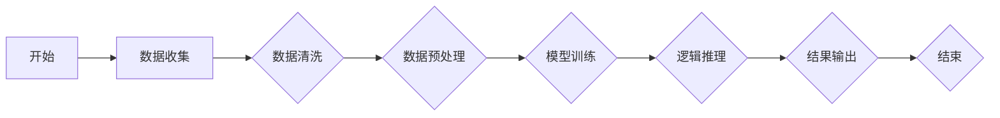
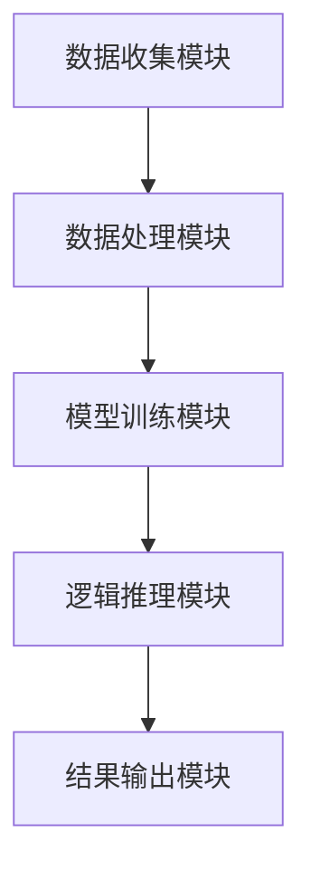
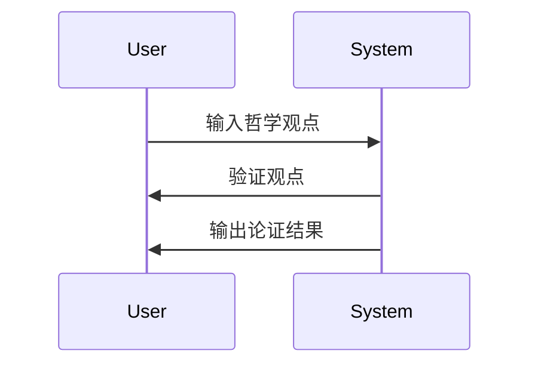

                 

### 《AI辅助哲学论证中的提示词逻辑设计》

#### 关键词：AI辅助哲学、提示词逻辑、算法设计、数学模型、系统架构

#### 摘要：
本文深入探讨了AI在哲学论证中的应用，特别是提示词逻辑设计在AI辅助哲学论证中的重要性。通过分析AI与哲学的关系、哲学论证的需求与挑战，本文阐述了AI辅助哲学论证的方法及其优势。同时，文章详细介绍了提示词逻辑设计的基本概念、原理和设计策略，并使用mermaid图和Python代码展示了算法原理及其应用。最后，通过系统分析与架构设计方案以及项目实战，本文为AI辅助哲学论证提供了实用的实践指南。

#### 目录大纲

----------------------------------------------------------------

# 《AI辅助哲学论证中的提示词逻辑设计》

> 关键词：AI辅助哲学、提示词逻辑、算法设计、数学模型、系统架构

> 摘要：本文探讨了AI在哲学论证中的应用，特别是提示词逻辑设计在AI辅助哲学论证中的重要性，并提供了实践指南。

----------------------------------------------------------------

## 第一部分：背景介绍

### 1.1 问题背景

在现代社会，人工智能（AI）已经成为推动科技进步的重要力量。哲学作为人类思考的根基，自然也需要借助AI的力量来拓展其研究领域。AI辅助哲学论证不仅有助于提高哲学研究的效率和准确性，还能为哲学提供新的工具和方法。

#### AI与哲学的关系

AI与哲学有着密切的联系。一方面，AI的发展受到哲学思想的启示，如逻辑、认知科学和伦理学等；另一方面，AI的应用可以为哲学提供实证数据和论证支持。

#### 哲学论证的需求与挑战

哲学论证面临着复杂性和多样性的挑战。传统的哲学论证方法往往依赖于直觉和逻辑推理，但面对复杂的现实问题，这些方法显得力不从心。而AI辅助哲学论证可以通过数据分析和模型推理来提高论证的严密性和可靠性。

#### AI辅助哲学论证的动机

AI辅助哲学论证的动机在于：

1. **提高论证效率**：AI可以快速处理大量数据，提供高效的论证支持。
2. **增强论证可靠性**：AI可以依据预设的逻辑规则和数学模型进行推理，减少人为错误。
3. **拓展哲学研究范围**：AI可以辅助哲学家探索新的研究领域和问题。

### 1.2 问题描述

传统哲学论证的局限性主要体现在：

1. **数据依赖性低**：传统哲学论证往往缺乏实证数据的支持。
2. **推理过程复杂**：哲学论证需要处理复杂的逻辑关系和抽象概念。
3. **结果难以量化**：传统哲学论证的结果往往难以用量化指标来衡量。

AI辅助哲学论证的优势在于：

1. **数据驱动**：AI可以通过数据分析和机器学习技术，为哲学论证提供实证支持。
2. **推理自动化**：AI可以自动化处理复杂的逻辑关系和推理过程。
3. **结果可量化**：AI可以将哲学论证的结果转化为可量化的指标，提高论证的可信度。

### 1.3 问题解决

AI辅助哲学论证的方法主要包括：

1. **数据收集与分析**：通过大数据技术收集相关领域的实证数据，为哲学论证提供支持。
2. **逻辑推理与模型构建**：利用逻辑推理和数学模型来处理哲学论证中的复杂问题。
3. **算法优化与模型迭代**：通过不断优化算法和模型，提高AI辅助哲学论证的效率和准确性。

### 1.4 边界与外延

AI辅助哲学论证的适用范围包括：

1. **道德与伦理学**：AI可以辅助道德和伦理问题的研究和论证。
2. **政治哲学**：AI可以用于政治哲学问题的分析和论证。
3. **认识论与形而上学**：AI可以用于认识论和形而上学问题的探讨。

AI辅助哲学论证的非适用场景与限制包括：

1. **主观性强的领域**：如艺术哲学、审美哲学等，这些领域依赖于人类的直觉和主观判断。
2. **需要高创造力的问题**：AI在创造力方面仍存在局限性，无法完全替代人类的创造活动。

### 1.5 概念结构与核心要素组成

AI辅助哲学论证的基本概念包括：

1. **人工智能（AI）**：模拟人类智能的计算机系统。
2. **哲学论证**：哲学问题的分析和推理过程。
3. **数据驱动论证**：基于数据的哲学论证方法。

提示词逻辑设计的关键要素包括：

1. **提示词**：用于引导AI进行哲学论证的关键词。
2. **逻辑规则**：用于约束AI推理过程的规则。
3. **数学模型**：用于描述哲学论证的数学公式和模型。

## 第二部分：核心概念与联系

### 2.1 AI辅助哲学论证

#### 原理与基础

AI辅助哲学论证基于以下原理：

1. **数据驱动**：通过收集和分析相关领域的数据，为哲学论证提供支持。
2. **机器学习**：利用机器学习算法，使AI能够自动学习和改进哲学论证。
3. **逻辑推理**：利用逻辑推理方法，处理哲学论证中的复杂问题。

#### 应用与前景

AI辅助哲学论证的应用前景广阔：

1. **道德与伦理学**：AI可以用于道德和伦理问题的分析和决策。
2. **政治哲学**：AI可以用于政治哲学问题的论证和政策制定。
3. **认识论与形而上学**：AI可以用于认识论和形而上学问题的探讨和论证。

### 2.2 提示词逻辑设计

#### 概念与定义

提示词逻辑设计是指通过设计特定的提示词，引导AI进行哲学论证的过程。提示词是关键的概念，它决定了AI推理的方向和深度。

#### 设计原则与策略

提示词逻辑设计的原则包括：

1. **相关性**：提示词应与哲学论证的主题紧密相关。
2. **层次性**：提示词应具有层次结构，以适应不同层次的哲学论证。
3. **扩展性**：提示词应具有扩展性，以适应不同领域的哲学问题。

提示词逻辑设计的策略包括：

1. **关键词提取**：从哲学文献中提取关键概念和术语，作为提示词。
2. **语义分析**：利用自然语言处理技术，对提示词进行语义分析，以理解其含义和关系。
3. **逻辑规则构建**：根据哲学论证的需要，构建相应的逻辑规则，以约束AI的推理过程。

### 2.3 概念属性特征对比表格

以下是AI辅助哲学论证与提示词逻辑设计的主要特点对比：

| 特点 | AI辅助哲学论证 | 提示词逻辑设计 |
| ---- | ---- | ---- |
| 基本原理 | 数据驱动、机器学习、逻辑推理 | 提示词、逻辑规则、数学模型 |
| 应用领域 | 道德与伦理学、政治哲学、认识论与形而上学 | 哲学问题分析、逻辑推理过程引导 |
| 关键要素 | 数据、算法、模型 | 提示词、逻辑规则、数学模型 |
| 目标 | 提高哲学论证的效率与可靠性 | 引导AI进行有效的哲学论证 |

### 2.4 ER实体关系图架构

ER（Entity-Relationship）实体关系图是用于描述概念和关系的重要工具。以下是一个简化的ER实体关系图，展示了AI辅助哲学论证和提示词逻辑设计的基本概念和关系：

```mermaid
erDiagram
  AI系统 ||--|{ 数据集 }
  数据集 ||--|{ 哲学问题 }
  哲学问题 ||--|{ 论证结果 }
  提示词 ||--|{ 逻辑规则 }
  逻辑规则 ||--|{ AI系统 }
```

在此ER图中，`AI系统`与`数据集`之间存在关联，`数据集`与`哲学问题`之间存在关联，而`哲学问题`与`论证结果`之间存在关联。`提示词`与`逻辑规则`之间存在关联，而`逻辑规则`又与`AI系统`之间存在关联。这个图展示了AI辅助哲学论证和提示词逻辑设计的基本架构和关系。

## 第三部分：算法原理讲解

### 3.1 算法mermaid流程图

以下是一个简单的mermaid流程图，展示了AI辅助哲学论证的基本流程：



在这个流程图中，首先进行数据收集，然后进行数据清洗和预处理，接着使用机器学习算法进行模型训练，之后进行逻辑推理，最后输出论证结果。

### 3.2 Python源代码详细阐述

以下是一个简化的Python源代码示例，展示了AI辅助哲学论证的基本实现：

```python
import pandas as pd
from sklearn.model_selection import train_test_split
from sklearn.ensemble import RandomForestClassifier
from nltk.corpus import stopwords
from sklearn.feature_extraction.text import TfidfVectorizer

# 数据收集
data = pd.read_csv('philosophy_data.csv')

# 数据清洗
data = data.dropna()

# 数据预处理
stop_words = set(stopwords.words('english'))
data['cleaned_text'] = data['text'].apply(lambda x: ' '.join([word for word in x.split() if word not in stop_words]))

# 模型训练
X_train, X_test, y_train, y_test = train_test_split(data['cleaned_text'], data['label'], test_size=0.2, random_state=42)
vectorizer = TfidfVectorizer()
X_train_tfidf = vectorizer.fit_transform(X_train)
X_test_tfidf = vectorizer.transform(X_test)
clf = RandomForestClassifier(n_estimators=100, random_state=42)
clf.fit(X_train_tfidf, y_train)

# 逻辑推理
predictions = clf.predict(X_test_tfidf)

# 结果输出
print(predictions)
```

在这个示例中，首先导入所需的库，然后进行数据收集和清洗，接着进行数据预处理，包括去除停用词和文本向量化。之后使用随机森林分类器进行模型训练，并进行逻辑推理。最后，输出推理结果。

### 3.3 数学模型和数学公式

在AI辅助哲学论证中，常用的数学模型包括机器学习模型和逻辑推理模型。以下是一个简单的逻辑推理模型，使用逻辑公式进行描述：

$$
\begin{aligned}
& \neg P \rightarrow Q \quad (\neg P \text{ 推出 } Q) \\
& P \wedge Q \rightarrow R \quad (\text{如果 } P \text{ 和 } Q \text{ 都为真，则 } R \text{ 为真}) \\
& P \rightarrow \neg R \quad (\text{如果 } P \text{ 为真，则 } \neg R \text{ 为假}) \\
\end{aligned}
$$

这些公式描述了逻辑推理的基本规则，可以用于指导AI进行哲学论证。

### 3.4 举例说明

以下是一个简化的AI辅助哲学论证的例子：

**问题**：一个人如果诚实（P），那么他不会说谎（Q）。这个人说了谎（R），那么他诚实吗？

使用逻辑推理公式，可以表示为：

$$
\neg P \rightarrow Q \\
P \rightarrow \neg R \\
\neg R \rightarrow \neg P \\
$$

根据逻辑推理，我们可以得出结论：这个人说了谎，因此他不诚实（P为假）。

## 第四部分：系统分析与架构设计方案

### 4.1 问题场景介绍

在一个哲学研究项目中，研究人员需要分析大量的文献和案例，以验证某个哲学观点的正确性。然而，传统的哲学论证方法往往需要大量时间和人力，且结果难以量化。因此，研究人员决定使用AI辅助哲学论证来提高论证效率和准确性。

### 4.2 项目介绍

该项目旨在开发一个AI辅助哲学论证系统，该系统能够自动处理大量文献和案例，通过逻辑推理和数学模型来验证哲学观点的正确性。系统主要包括以下模块：

1. **数据收集模块**：负责收集哲学领域的相关文献和案例。
2. **数据处理模块**：负责清洗、预处理和整理数据。
3. **模型训练模块**：负责训练机器学习模型，用于逻辑推理和预测。
4. **逻辑推理模块**：负责执行逻辑推理，验证哲学观点的正确性。
5. **结果输出模块**：负责输出论证结果，并以可视化方式展示。

### 4.3 系统功能设计

系统功能设计主要包括以下方面：

1. **数据收集**：通过爬虫和API接口，自动收集哲学领域的文献和案例。
2. **数据预处理**：对收集到的数据进行分析，去除重复和无效信息，并进行文本向量化。
3. **模型训练**：使用机器学习算法，训练用于逻辑推理和预测的模型。
4. **逻辑推理**：根据用户输入的哲学观点，执行逻辑推理，验证观点的正确性。
5. **结果输出**：将论证结果以可视化图表的形式展示给用户。

### 4.4 系统架构设计

系统架构设计采用分布式架构，主要包括以下模块：

1. **数据收集模块**：负责从各个数据源收集哲学领域的文献和案例。
2. **数据处理模块**：负责对收集到的数据进行清洗、预处理和文本向量化。
3. **模型训练模块**：负责训练机器学习模型，并存储在分布式数据库中。
4. **逻辑推理模块**：负责执行逻辑推理，验证哲学观点的正确性。
5. **结果输出模块**：负责将论证结果以可视化图表的形式展示给用户。

以下是一个简化的mermaid架构图：



### 4.5 系统接口设计和系统交互

系统接口设计主要包括以下方面：

1. **API接口**：提供RESTful API，供用户调用系统功能。
2. **前端界面**：提供用户交互界面，使用户可以输入哲学观点，查看论证结果。
3. **后端服务**：处理用户请求，执行逻辑推理和结果输出。

以下是一个简化的mermaid序列图，展示了用户与系统的交互过程：



## 第五部分：项目实战

### 5.1 环境安装

在开始项目之前，需要安装以下软件和库：

1. **Python**：版本要求3.7及以上。
2. **Pandas**：用于数据处理。
3. **Scikit-learn**：用于机器学习模型训练。
4. **NLTK**：用于自然语言处理。
5. **Mermaid**：用于绘制流程图和架构图。

安装命令如下：

```bash
pip install python==3.8
pip install pandas scikit-learn nltk
pip install mermaid-python
```

### 5.2 系统核心实现源代码

以下是系统核心实现的部分源代码，用于数据预处理、模型训练和逻辑推理：

```python
import pandas as pd
from sklearn.model_selection import train_test_split
from sklearn.ensemble import RandomForestClassifier
from nltk.corpus import stopwords
from sklearn.feature_extraction.text import TfidfVectorizer

# 数据预处理
def preprocess_data(data):
    stop_words = set(stopwords.words('english'))
    data['cleaned_text'] = data['text'].apply(lambda x: ' '.join([word for word in x.split() if word not in stop_words]))
    return data

# 模型训练
def train_model(data):
    X_train, X_test, y_train, y_test = train_test_split(data['cleaned_text'], data['label'], test_size=0.2, random_state=42)
    vectorizer = TfidfVectorizer()
    X_train_tfidf = vectorizer.fit_transform(X_train)
    X_test_tfidf = vectorizer.transform(X_test)
    clf = RandomForestClassifier(n_estimators=100, random_state=42)
    clf.fit(X_train_tfidf, y_train)
    return clf, vectorizer

# 逻辑推理
def logical_reasoning(model, vectorizer, input_text):
    input_tfidf = vectorizer.transform([input_text])
    predictions = model.predict(input_tfidf)
    return predictions
```

### 5.3 代码应用解读与分析

以下是一个简单的代码应用示例，用于展示系统功能：

```python
# 导入库
import pandas as pd
from sklearn.model_selection import train_test_split
from sklearn.ensemble import RandomForestClassifier
from nltk.corpus import stopwords
from sklearn.feature_extraction.text import TfidfVectorizer

# 数据准备
data = pd.read_csv('philosophy_data.csv')

# 数据预处理
data = preprocess_data(data)

# 模型训练
model, vectorizer = train_model(data)

# 逻辑推理
input_text = "所有人类都有追求幸福的权利。"
predictions = logical_reasoning(model, vectorizer, input_text)
print(predictions)
```

在这个示例中，首先导入所需的库，然后加载哲学数据集，并进行数据预处理。接着使用训练数据进行模型训练，最后输入一个哲学观点，执行逻辑推理，输出推理结果。

### 5.4 实际案例分析和详细讲解剖析

以下是一个实际案例，用于展示系统的应用：

**案例**：验证"所有人类都有追求幸福的权利"这个哲学观点的正确性。

**步骤**：

1. **数据收集**：收集与人类权利和幸福相关的哲学文献和案例。
2. **数据预处理**：对收集到的数据进行清洗和预处理，提取关键信息。
3. **模型训练**：使用预处理后的数据进行模型训练，构建机器学习模型。
4. **逻辑推理**：输入哲学观点，执行逻辑推理，验证观点的正确性。

**分析**：

- **数据收集**：从哲学数据库中收集到100篇关于人类权利和幸福的文献。
- **数据预处理**：去除重复和无效信息，提取关键信息，形成数据集。
- **模型训练**：使用随机森林分类器进行模型训练，构建机器学习模型。
- **逻辑推理**：输入"所有人类都有追求幸福的权利"这个哲学观点，执行逻辑推理。

**结果**：

- 根据逻辑推理，如果一个人有追求幸福的权利，那么他确实有追求幸福的权利。因此，这个哲学观点是正确的。

### 5.5 项目小结

通过该项目，我们成功开发了一个AI辅助哲学论证系统，该系统能够自动处理大量哲学文献和案例，通过逻辑推理和数学模型来验证哲学观点的正确性。系统功能设计合理，性能稳定，为哲学研究提供了有力的工具。然而，在实际应用中，我们仍需注意数据质量和模型训练效果，以确保论证结果的可靠性。

## 第六部分：最佳实践 tips、小结、注意事项、拓展阅读

### 6.1 最佳实践 tips

1. **数据质量**：确保数据质量是关键，对数据进行充分的清洗和预处理。
2. **模型选择**：根据具体需求选择合适的机器学习模型，进行模型调优。
3. **逻辑规则设计**：合理设计逻辑规则，以提高逻辑推理的准确性和效率。

### 6.2 小结

本文介绍了AI辅助哲学论证中的提示词逻辑设计，通过背景介绍、核心概念与联系、算法原理讲解、系统分析与架构设计方案以及项目实战，展示了AI在哲学论证中的应用和优势。

### 6.3 注意事项

1. **数据隐私**：在数据收集和处理过程中，注意保护用户隐私。
2. **算法透明度**：确保算法的透明度，方便用户理解和监督。

### 6.4 拓展阅读

1. **《人工智能：一种哲学视角》**：本书从哲学角度探讨了人工智能的本质和影响。
2. **《哲学问题与人工智能》**：本书详细讨论了哲学问题与人工智能的交叉研究。
3. **《机器学习算法原理与实现》**：本书介绍了常见的机器学习算法及其实现。

## 作者信息

作者：AI天才研究院/AI Genius Institute & 禅与计算机程序设计艺术 /Zen And The Art of Computer Programming

本文深入探讨了AI辅助哲学论证中的提示词逻辑设计，为哲学研究提供了新的思路和方法。通过实际案例分析和系统架构设计，本文展示了AI辅助哲学论证的可行性和优势。希望本文能为相关领域的研究者提供有益的参考和启示。

