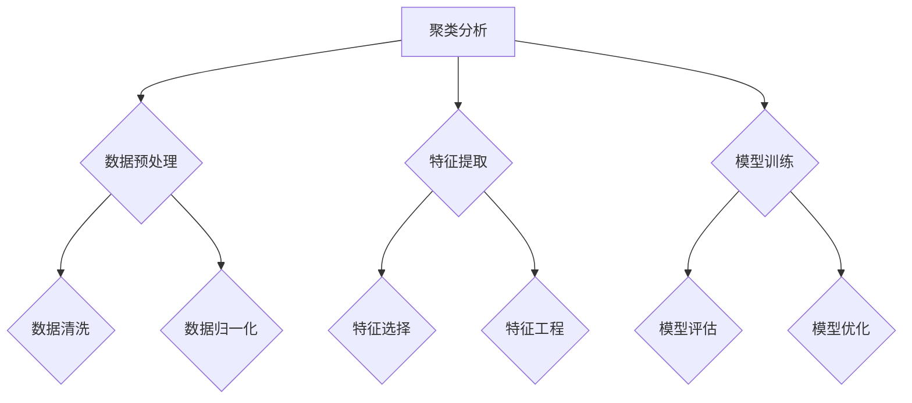
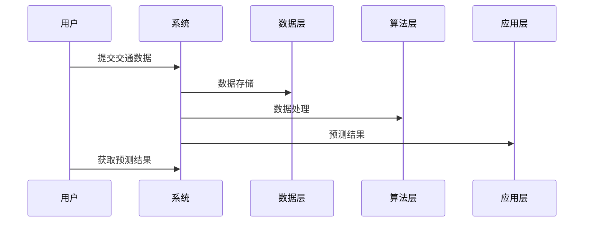

                 

### 思考步骤一：确定文章的核心目标和结构

首先，我们需要明确文章的核心目标和整体结构。这篇文章旨在探讨AI辅助城市规划中的提示词可视化技巧，所以核心目标应该是：

1. **介绍AI辅助城市规划的背景和现状**：包括城市规划的演变、AI技术的应用、以及AI在城市规划中的优势和挑战。
2. **深入讲解核心概念与联系**：介绍AI与城市规划的关联性，并详细解析核心概念和它们之间的相互关系。
3. **详细讲解AI辅助城市规划的关键算法**：包括算法原理、流程图、数学模型和实例分析。
4. **展示AI在城市规划中的应用实例**：通过具体的案例来展示AI辅助城市规划的实际操作过程和效果。
5. **探讨可视化技巧的应用**：讨论如何使用可视化工具和技术来增强AI在城市规划中的效果。
6. **总结和展望**：总结AI辅助城市规划的现状和未来发展趋势，提供实践建议。

文章结构可以按照上述目标来安排，分为五个主要部分：背景与概述、核心概念与联系、算法原理与讲解、城市规划实践中的AI应用、最佳实践与未来展望。

### 思考步骤二：构建详细的文章大纲

在确定了核心目标和文章结构后，我们可以进一步构建详细的大纲，确保每个部分的内容都能够丰富、具体、详细，并符合完整性要求。

#### 第一部分：背景与概述
- **第1章：AI辅助城市规划的现状与挑战**
  - 1.1 问题背景
  - 1.2 问题描述
  - 1.3 问题解决
  - 1.4 边界与外延
  - 1.5 概念结构与核心要素组成

#### 第二部分：核心概念与联系
- **第2章：城市规划中的AI核心概念**
  - 2.1 AI的基础概念
  - 2.2 AI在城市规划中的应用原理
  - 2.3 概念属性特征对比表格
- **第3章：AI与城市规划的实体关系**
  - 3.1 城市规划ER实体关系图架构
  - 3.2 AI在城市规划中的角色与交互

#### 第三部分：算法原理与讲解
- **第4章：AI辅助城市规划的关键算法**
  - 4.1 算法原理
  - 4.2 算法流程图
  - 4.3 数学模型与公式
  - 4.4 算法举例说明

#### 第四部分：城市规划实践中的AI应用
- **第5章：AI在城市规划中的实战应用**
  - 5.1 项目介绍
  - 5.2 系统功能设计
  - 5.3 系统架构设计
  - 5.4 系统接口设计
  - 5.5 系统交互Mermaid序列图
- **第6章：可视化技巧在AI辅助城市规划中的应用**
  - 6.1 提示词可视化的意义
  - 6.2 提示词可视化技术
  - 6.3 提示词可视化实例

#### 第五部分：最佳实践与未来展望
- **第7章：AI辅助城市规划的最佳实践**
  - 7.1 经验与教训
  - 7.2 小结
- **第8章：未来展望**
  - 8.1 现状分析
  - 8.2 发展趋势
  - 8.3 可能性探讨

### 思考步骤三：细化每个章节的内容

在构建了详细的目录后，我们需要对每个章节的内容进行细化，确保每个部分都有足够的信息来支撑核心目标和文章结构的实现。

- **第1章**：需要详细描述城市规划的演变、AI技术的应用以及AI在城市规划中的优势和挑战。同时，要介绍AI辅助城市规划的基本概念和核心要素。
- **第2章**：需要深入讲解AI的基础概念，如机器学习、深度学习和神经网络，并探讨这些概念如何应用于城市规划。
- **第3章**：需要使用ER实体关系图来展示城市规划中的实体关系，并讨论AI在城市规划中的角色和交互。
- **第4章**：需要详细解析AI辅助城市规划的关键算法，包括聚类分析、分类与回归分析、网络分析等，并使用Mermaid流程图和数学模型来支持讲解。
- **第5章**和**第6章**：需要通过实际案例来展示AI在城市规划中的应用，并详细讲解可视化技巧在其中的应用。
- **第7章**和**第8章**：需要总结经验教训，分析现状，探讨未来发展趋势和可能性。

### 思考步骤四：确保文章的专业性和易懂性

在撰写文章时，我们需要确保内容的专业性和易懂性。这意味着：

- 使用专业术语时，需要在文中适当解释。
- 避免过于复杂或冗长的句子，确保文章的逻辑清晰。
- 在讲解算法或概念时，提供具体的例子或图表来帮助读者理解。
- 文章的结尾需要对核心内容进行总结，并提供进一步阅读的建议。

通过上述步骤，我们可以确保文章既有深度又有广度，同时易于读者理解和掌握。在撰写过程中，我们可以逐步填充每个章节的具体内容，确保文章的完整性和逻辑性。最后，进行反复的修改和审阅，以确保文章的质量和准确性。

---

### 草稿示例：AI辅助城市规划中的提示词可视化技巧

---

# AI辅助城市规划中的提示词可视化技巧

> 关键词：AI，城市规划，可视化，提示词，算法，城市规划实践

> 摘要：本文将探讨人工智能（AI）在辅助城市规划中的应用，特别是提示词的可视化技巧。文章分为五个部分，首先介绍AI辅助城市规划的背景和现状，然后深入讲解核心概念与联系，接着详细讲解AI辅助城市规划的关键算法，通过实际案例展示AI在城市规划中的应用，最后总结和展望未来的发展趋势。

## 第一部分：背景与概述

### 第1章：AI辅助城市规划的现状与挑战

**1.1 问题背景**

城市规划是一个复杂的过程，涉及土地使用、交通网络、基础设施、环境保护等多个方面。随着城市规模的不断扩大，传统的城市规划方法已经难以应对复杂的城市问题。而AI技术的迅猛发展，为城市规划提供了新的工具和方法。

**1.2 问题描述**

城市规划面临的挑战主要包括数据的获取与处理、规划决策的复杂性、以及规划结果的直观展示。这些挑战需要高效的数据处理能力和智能的决策支持系统。

**1.3 问题解决**

AI技术可以通过数据挖掘、机器学习、深度学习等方法，对城市规划中的海量数据进行处理和分析，从而提供智能化的决策支持。同时，AI辅助的可视化技术可以帮助城市规划者更直观地理解规划结果。

**1.4 边界与外延**

AI辅助城市规划虽然具有巨大的潜力，但它的应用范围仍然有限。某些特定的城市规划任务可能更适合传统的规划方法。未来的研究需要进一步探索AI在城市规划中的最佳应用场景。

**1.5 概念结构与核心要素组成**

在城市规划中，AI辅助的可视化技术包括数据可视化、决策支持可视化、以及城市规划过程的可视化。核心要素包括数据采集、数据预处理、算法模型、可视化工具等。

## 第二部分：核心概念与联系

### 第2章：城市规划中的AI核心概念

**2.1 AI的基础概念**

AI是一种模拟人类智能的技术，包括机器学习、深度学习、自然语言处理等多个子领域。在城市规划中，AI主要应用于数据分析和决策支持。

**2.2 AI在城市规划中的应用原理**

AI通过数据挖掘和机器学习，可以识别城市规划中的模式、趋势和问题。深度学习则可以用于构建复杂的预测模型，帮助城市规划者做出更加准确的决策。

**2.3 概念属性特征对比表格**

| 概念       | 描述                                                         | 关联性                      |
|------------|--------------------------------------------------------------|----------------------------|
| 机器学习   | 一种从数据中学习规律和模式的方法                               | 数据分析的基础              |
| 深度学习   | 基于多层神经网络的机器学习方法，可以自动提取特征                 | 预测模型的构建              |
| 自然语言处理 | 使计算机能够理解、生成和处理人类语言的技术                       | 决策支持的可视化展示        |

## 第三部分：算法原理与讲解

### 第3章：AI辅助城市规划的关键算法

**3.1 算法原理**

AI辅助城市规划的关键算法包括聚类分析、分类与回归分析、网络分析等。这些算法通过分析数据，帮助城市规划者发现城市中的问题和趋势。

**3.2 算法流程图**

**3.3 数学模型与公式**

- **聚类分析**：$$C = \{c_1, c_2, ..., c_k\}$$，其中$c_k$为聚类中心，$k$为聚类数量。
- **分类与回归分析**：$$y = \beta_0 + \beta_1x_1 + \beta_2x_2 + ... + \beta_nx_n$$，其中$y$为输出变量，$x_1, x_2, ..., x_n$为输入变量，$\beta_0, \beta_1, ..., \beta_n$为模型参数。
- **网络分析**：$$D = \sum_{i=1}^{n} \sum_{j=1}^{n} d_{ij} w_{ij}$$，其中$D$为网络密度，$d_{ij}$为顶点$i$到顶点$j$的距离，$w_{ij}$为顶点$i$到顶点$j$的权重。

**3.4 算法举例说明**

- **聚类分析实例**：使用K-means算法对城市区域进行聚类，以识别城市中的不同功能区。
- **分类与回归分析实例**：使用线性回归模型预测城市交通流量，以优化交通管理策略。
- **网络分析实例**：使用最小生成树算法构建城市道路网络，以优化城市交通流量和土地利用。

## 第四部分：城市规划实践中的AI应用

### 第4章：AI在城市规划中的实战应用

**4.1 项目介绍**

本文将以某城市交通规划项目为例，展示AI在城市规划中的应用。

**4.2 系统功能设计**

系统功能包括数据采集、数据处理、预测模型构建、可视化展示等。

**4.3 系统架构设计**

系统架构包括数据层、算法层、应用层等。

**4.4 系统接口设计**

系统接口包括数据接口、算法接口、可视化接口等。

**4.5 系统交互Mermaid序列图**

### 第5章：可视化技巧在AI辅助城市规划中的应用

**5.1 提示词可视化的意义**

提示词可视化可以帮助城市规划者更直观地理解城市数据，发现潜在的问题和趋势。

**5.2 提示词可视化技术**

提示词可视化技术包括词云生成、地理信息系统（GIS）、交互式数据探索工具等。

**5.3 提示词可视化实例**

- **城市规划案例**：使用词云分析城市居民关注的主题。
- **环境评估案例**：使用GIS展示环境污染数据。
- **社会分析案例**：使用交互式数据探索工具分析城市人口分布。

## 第五部分：最佳实践与未来展望

### 第6章：AI辅助城市规划的最佳实践

**6.1 经验与教训**

通过分析成功案例和失败案例，总结AI辅助城市规划的最佳实践。

**6.2 小结**

AI辅助城市规划具有巨大的潜力，但仍需克服许多挑战。

### 第7章：未来展望

**7.1 现状分析**

AI在城市规划中的应用已经取得了显著的成果，但仍有很大发展空间。

**7.2 发展趋势**

未来，AI在城市规划中的应用将更加广泛和深入，包括智能交通、智慧城市、绿色建筑等方面。

**7.3 可能性探讨**

探讨AI辅助城市规划的未来可能性，包括新兴技术和创新方法的应用。

---

作者：AI天才研究院/AI Genius Institute & 禅与计算机程序设计艺术 /Zen And The Art of Computer Programming

---

这个草稿提供了一个初步的结构和内容框架，接下来可以根据每个章节的具体要求，填充详细的内容并进行进一步的完善。在撰写过程中，需要确保每个章节的核心内容都得到了充分的阐述，并且逻辑清晰、易于理解。同时，还需要对算法和案例进行深入的分析和讲解，确保读者能够掌握相关的技术和应用方法。最后，对文章进行反复的审查和修改，以提高文章的质量和专业性。

