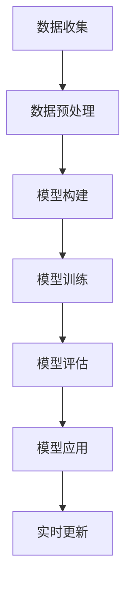
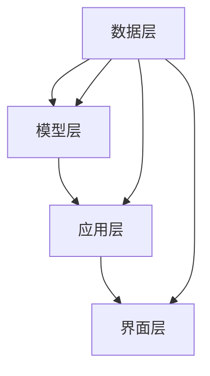
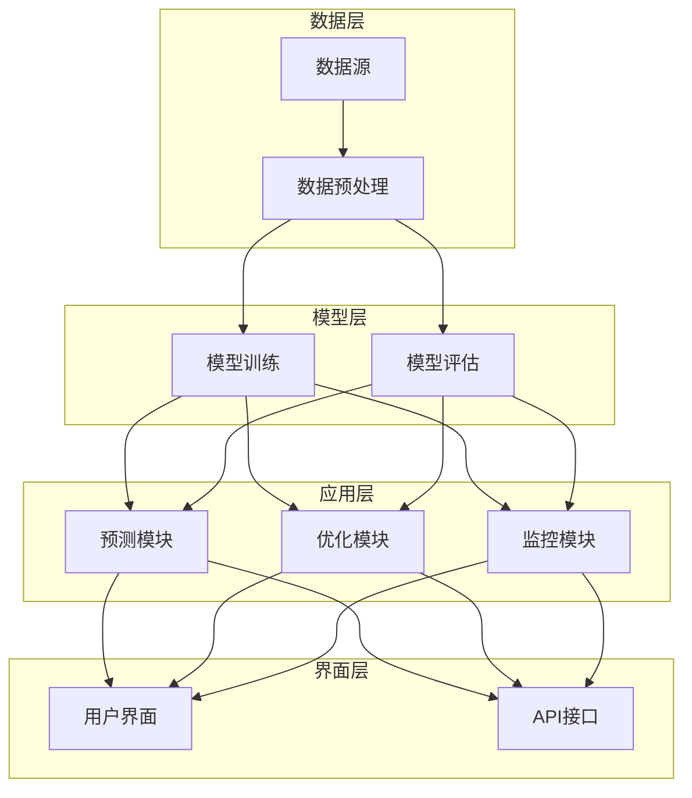
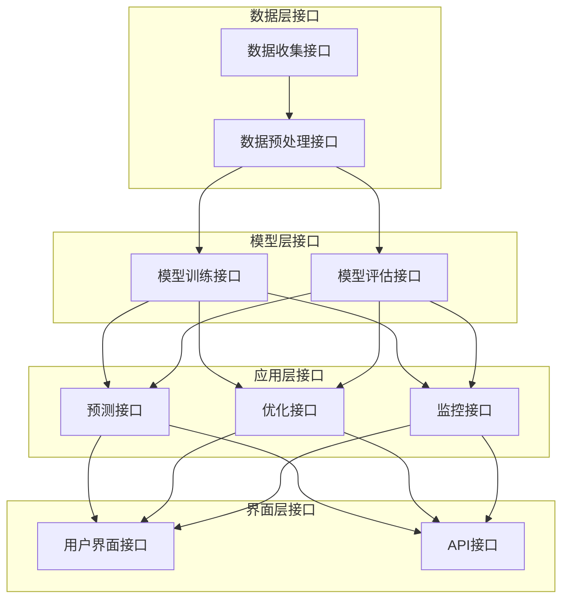
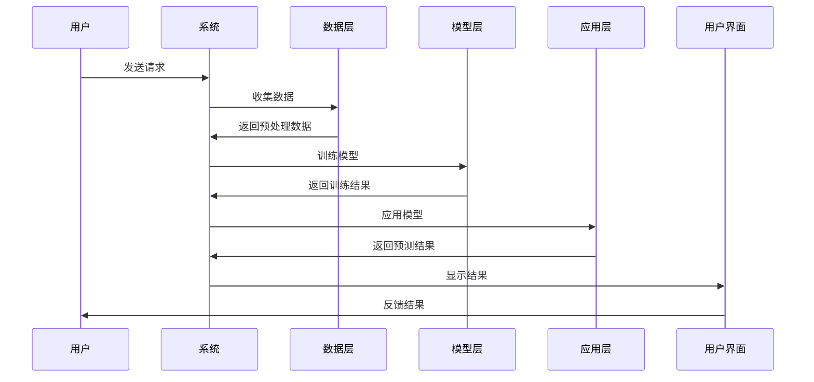

                 

### AI辅助城市规划：大模型在可持续发展中的角色

关键词：AI大模型、城市规划、可持续发展、算法、系统架构、项目实战

摘要：本文探讨了AI大模型在辅助城市规划中的应用，以及其在实现可持续发展目标中的关键角色。文章首先介绍了城市规划的重要性、AI与城市规划的关系，以及可持续发展的核心概念与原则。随后，文章详细阐述了AI大模型的概念、特征、应用原理以及其在城市规划中的具体应用场景。接着，通过数学模型与公式、系统架构与设计等部分，深入分析了AI大模型在规划中的算法原理和实现细节。最后，通过一个具体的项目实战，展示了AI大模型在城市规划中的实际应用效果，并提出了一些最佳实践建议。

### 第一部分：问题背景与核心概念介绍

#### 第1章：问题背景与核心概念介绍

##### **1.1 问题背景**

城市规划作为一门综合性学科，其重要性不言而喻。首先，城市规划对社会经济发展的影响至关重要。通过科学的规划，可以优化资源配置、促进产业升级、提升城市品质，从而推动整体经济的持续健康发展。此外，城市规划对于可持续发展的重要性更是不言而喻。在全球资源紧张、环境问题日益突出的背景下，可持续发展的理念逐渐成为城市规划的核心目标。只有实现经济的增长、社会的进步与环境的保护相结合，才能确保城市的长期繁荣与人类社会的可持续发展。

在城市规划中，AI技术的应用已经成为一种趋势。人工智能通过数据挖掘、模式识别、决策优化等技术手段，可以为城市规划提供强有力的支持。例如，利用AI技术可以分析城市交通数据，优化交通流线，减少交通拥堵；通过分析环境数据，可以制定更科学的环保措施，提高城市环境质量。同时，AI大模型作为一种新兴的人工智能技术，其在城市规划中的应用潜力更加巨大。大模型具有强大的数据处理和分析能力，可以处理海量数据，发现数据之间的复杂关系，从而为城市规划提供更加精准和全面的指导。

##### **1.1.1 城市规划的重要性**

城市规划对社会经济发展的影响主要体现在以下几个方面：

1. **资源配置优化**：城市规划通过对土地、资源、能源等关键要素的科学布局，可以实现资源的最优配置，提高资源利用效率。例如，通过科学规划，可以避免重复建设和资源浪费，提高城市建设的经济效益。

2. **产业升级**：城市规划可以引导产业结构调整，促进高新技术产业、现代服务业等新兴产业的快速发展，推动城市经济结构的优化升级。同时，通过规划引导，可以吸引更多的投资和人才，提升城市的综合竞争力。

3. **城市品质提升**：科学合理的城市规划可以提高城市的生活质量，改善市民的居住环境。通过规划，可以优化公共设施布局，提升公共服务水平，增加市民的幸福感。

4. **可持续发展**：城市规划是实现可持续发展的重要手段。通过规划，可以制定环保措施、节约能源、保护生态环境，确保城市的长期繁荣和人类社会的可持续发展。

##### **1.1.2 AI与城市规划**

AI技术在城市规划中的应用现状可以概括为以下几个方面：

1. **交通规划与优化**：利用AI技术可以分析城市交通数据，预测交通流量，优化交通流线，减少交通拥堵。例如，通过大数据分析和机器学习算法，可以实时调整交通信号灯的配时，提高交通效率。

2. **环境监测与治理**：AI技术可以帮助城市规划师实时监测城市环境质量，发现污染源，制定相应的治理措施。例如，利用图像识别技术可以监测空气质量、水质等环境指标，为环保决策提供数据支持。

3. **智慧城市建设**：AI技术可以应用于智慧城市的各个领域，包括智能交通、智能安防、智能照明等。通过物联网、大数据和人工智能等技术，可以实现城市管理的智能化，提高城市运行效率。

4. **城市规划模拟与评估**：利用AI技术可以进行城市规划的模拟与评估，预测规划方案对城市的影响，为规划决策提供科学依据。例如，通过虚拟现实技术可以模拟城市规划方案，直观地展示规划效果。

AI大模型在城市规划中的应用潜力主要体现在以下几个方面：

1. **海量数据处理**：大模型具有强大的数据处理能力，可以处理海量城市数据，包括交通、环境、人口、经济等数据，从而为城市规划提供全面、准确的数据支持。

2. **复杂关系挖掘**：大模型可以通过深度学习等技术手段，发现城市数据之间的复杂关系，为城市规划提供新的视角和思路。

3. **智能决策支持**：大模型可以模拟不同规划方案对城市的影响，提供智能化的决策支持，帮助规划师制定更加科学合理的规划方案。

4. **实时反馈与优化**：大模型可以实时监测城市规划的实施效果，对规划方案进行动态调整，确保规划目标的实现。

##### **1.1.3 可持续发展**

可持续发展是指在满足当前需求的基础上，不损害后代人满足其需求的能力。其核心原则包括：

1. **公平性**：确保不同地区、不同人群享有公平的发展机会和资源。

2. **持续性**：确保经济发展与资源、环境相协调，不损害自然生态系统的平衡。

3. **共同性**：可持续发展是全球性的问题，需要各国共同参与和合作。

在城市规划中，实现可持续发展需要考虑以下几个方面：

1. **环保措施**：通过规划，制定环保措施，如节能建筑、绿化、污染防治等，提高城市环境质量。

2. **资源节约**：通过科学规划，优化资源配置，提高资源利用效率，减少资源浪费。

3. **低碳发展**：通过推广低碳技术、发展绿色交通、改善能源结构等，降低城市碳排放，实现低碳发展。

4. **社会公平**：通过规划，改善公共服务设施，提高公共服务水平，确保不同人群享有公平的发展机会。

##### **1.2 核心概念与联系**

为了更好地理解AI大模型在城市规划中的应用，我们需要明确以下几个核心概念：

1. **AI大模型**：AI大模型是指具有强大数据处理和分析能力的人工智能模型，通常采用深度学习等技术。其特点包括大规模训练数据、多层神经网络结构、强大的模型参数等。

2. **城市规划**：城市规划是指对城市空间进行布局和规划，以实现城市发展的目标。其核心内容包括城市发展战略、土地利用规划、交通规划、环境保护等。

3. **可持续发展**：可持续发展是指在满足当前需求的基础上，不损害后代人满足其需求的能力。城市规划需要考虑可持续发展原则，确保城市的长期繁荣和人类社会的可持续发展。

这些核心概念之间的联系如下：

- **AI大模型**为城市规划提供了强大的数据分析和决策支持能力，可以帮助规划师制定更加科学合理的规划方案。

- **城市规划**是AI大模型应用的重要领域，通过规划，可以优化资源配置、提升城市品质、实现可持续发展。

- **可持续发展**是城市规划的核心目标，AI大模型可以提供数据支持和智能决策，帮助实现这一目标。

#### **1.3 核心概念属性特征对比表格**

为了更好地理解AI大模型与城市规划、可持续发展之间的联系，我们可以通过对比表格来分析这些核心概念的属性特征。

| 特征         | AI大模型             | 城市规划             | 可持续发展            |
| ------------ | ------------------- | ------------------- | ------------------- |
| **数据处理**   | 海量数据，复杂关系   | 数据驱动，空间布局   | 数据支持，政策制定   |
| **应用领域**   | 多领域，通用性强    | 城市规划，特定领域   | 全社会，综合性强    |
| **技术挑战**   | 大规模训练，算法优化 | 数据收集，方案评估   | 资源节约，环境治理   |

通过对比表格，我们可以看到AI大模型在城市规划、可持续发展中具有独特的技术优势和挑战。理解这些特征有助于我们更好地应用AI大模型，实现城市规划的可持续发展目标。

#### **1.4 ER实体关系图架构**

为了更好地理解城市规划中的关键实体及其关系，我们可以使用ER（实体关系）图来描述这些实体及其交互。

##### **4.1 城市规划中的实体关系**

城市规划中的关键实体包括：

1. **城市实体**：代表整个城市规划的主体，包含城市空间、人口、经济等基本信息。
2. **规划方案**：代表城市规划的具体方案，包括土地利用、交通布局、环境保护等。
3. **规划师**：负责制定和实施城市规划的专业人员。
4. **政府机构**：负责城市规划的政策制定和执行。
5. **居民**：城市规划的直接受益者和参与者。

实体之间的关系如下：

1. **城市实体**与**规划方案**之间是“实现”关系，即规划方案是实现城市规划的手段。
2. **规划师**与**规划方案**之间是“制定”关系，即规划师负责制定规划方案。
3. **政府机构**与**规划方案**之间是“审批”关系，即政府机构负责审批规划方案。
4. **居民**与**规划方案**之间是“反馈”关系，即居民对规划方案提出意见和建议。

##### **4.2 ER图绘制**

下面使用Mermaid语言绘制城市规划实体关系图：

```mermaid
erDiagram
    城市实体 ||--|{ 规划方案 }
    规划师 ||--|{ 规划方案 }
    政府机构 ||--|{ 规划方案 }
    居民 ||--|{ 规划方案 }
```

在Mermaid编辑器中，上述代码会生成如下ER图：

```mermaid
erDiagram
    城市实体 ||--|{ 规划方案 }
    规划师 ||--|{ 规划方案 }
    政府机构 ||--|{ 规划方案 }
    居民 ||--|{ 规划方案 }
```

通过ER图，我们可以直观地看到城市规划中各个实体之间的关系，这有助于我们更好地理解城市规划的流程和机制。

### 第二部分：AI大模型在可持续发展中的应用

#### **第2章：核心概念与联系**

在本章中，我们将进一步探讨AI大模型的核心概念，并分析其与城市规划、可持续发展之间的联系。

##### **2.1 AI大模型概述**

**2.1.1 AI大模型定义**

AI大模型是指利用深度学习、生成对抗网络（GAN）等技术，训练出具有强大数据处理和分析能力的人工智能模型。其特点包括：

1. **大规模训练数据**：AI大模型通常基于大规模数据集进行训练，能够处理海量数据，从而提高模型的准确性和泛化能力。

2. **多层神经网络结构**：AI大模型采用多层神经网络结构，可以提取数据中的复杂特征，实现高维数据的建模。

3. **强大的模型参数**：AI大模型具有大量的模型参数，可以调整和优化模型的性能，使其在不同任务中表现出色。

**2.1.2 AI大模型与传统AI模型的对比**

传统AI模型通常基于规则、决策树、支持向量机等简单算法，其数据处理和分析能力相对有限。而AI大模型则具有以下几个显著优势：

1. **数据处理能力**：AI大模型能够处理海量数据，能够从数据中挖掘出复杂的关系和规律，从而为决策提供有力支持。

2. **模型泛化能力**：由于AI大模型采用多层神经网络结构，其可以提取数据中的深层次特征，从而提高模型的泛化能力。

3. **自适应能力**：AI大模型具有强大的自适应能力，可以根据新的数据和任务进行自适应调整，从而实现持续改进。

**2.1.3 大模型在城市规划中的应用**

AI大模型在城市规划中具有广泛的应用前景，主要表现在以下几个方面：

1. **数据挖掘与预测**：AI大模型可以处理海量城市数据，包括交通流量、环境质量、人口分布等，通过数据挖掘和预测技术，为城市规划提供科学依据。

2. **方案评估与优化**：AI大模型可以模拟不同规划方案对城市的影响，评估方案的可行性和效果，帮助规划师制定最优的规划方案。

3. **智能决策支持**：AI大模型可以为城市规划提供智能化的决策支持，辅助规划师进行复杂的决策过程，提高决策的准确性和效率。

**2.1.4 大模型在可持续发展中的角色**

AI大模型在可持续发展中扮演着关键角色，主要表现在以下几个方面：

1. **环保决策支持**：AI大模型可以通过分析环境数据，预测污染趋势，为环保决策提供科学依据，帮助制定更有效的环保措施。

2. **资源优化配置**：AI大模型可以优化资源配置，提高资源利用效率，实现资源的可持续利用。

3. **社会公平保障**：AI大模型可以通过分析社会数据，发现社会不平等现象，为政策制定提供支持，保障社会公平。

4. **城市综合评估**：AI大模型可以对城市规划进行综合评估，预测规划方案对城市长期发展的影响，确保城市发展的可持续性。

**2.2 大模型在实现可持续发展目标中的作用**

AI大模型在实现可持续发展目标中具有重要作用，主要体现在以下几个方面：

1. **数据驱动决策**：AI大模型通过分析海量数据，可以揭示城市发展中的问题，为决策者提供科学依据，从而实现数据驱动决策。

2. **智能优化方案**：AI大模型可以模拟不同规划方案对城市的影响，优化资源配置，提高城市运行效率，实现可持续发展目标。

3. **实时反馈与调整**：AI大模型可以实时监测城市规划的实施效果，对规划方案进行动态调整，确保规划目标的实现。

4. **社会公平保障**：AI大模型可以通过分析社会数据，发现社会不平等现象，为政策制定提供支持，保障社会公平。

通过本章的讨论，我们可以看到AI大模型在城市规划、可持续发展中具有广泛的应用前景和重要作用。了解AI大模型的核心概念和应用原理，有助于我们更好地发挥其在城市规划中的潜力，实现可持续发展的目标。

#### **2.3 AI大模型特征对比**

在深入探讨AI大模型在城市规划中的应用之前，我们需要对AI大模型与其他人工智能模型的特征进行对比，以便更好地理解其优势与挑战。

**2.3.1 性能指标对比**

AI大模型与其他人工智能模型在性能指标上存在显著差异。以下是几个关键性能指标的对比：

1. **计算速度与精度**：
   - **AI大模型**：采用深度学习等技术，具备强大的计算能力，能够在较短的时间内处理海量数据，具有较高的计算速度和精度。
   - **传统AI模型**：如决策树、支持向量机等，虽然计算速度较快，但在处理复杂问题和海量数据时，精度和效率相对较低。

2. **内存与计算资源需求**：
   - **AI大模型**：由于采用多层神经网络结构，需要大量的内存和计算资源。在大规模数据处理时，对硬件要求较高。
   - **传统AI模型**：对计算资源和内存需求较低，适合在资源有限的硬件环境中运行。

3. **泛化能力**：
   - **AI大模型**：通过大量数据训练，能够提取数据的深层次特征，具有较好的泛化能力，适用于不同的应用场景。
   - **传统AI模型**：泛化能力相对较弱，适用于特定的问题场景，难以应对复杂的、多变的环境。

**2.3.2 应用领域对比**

AI大模型与传统AI模型在应用领域上也存在显著差异。以下是几个主要应用领域的对比：

1. **城市规划和智能交通**：
   - **AI大模型**：能够处理海量城市交通数据，通过数据挖掘和预测，优化交通流线，减少交通拥堵，提升城市交通效率。
   - **传统AI模型**：如交通信号控制模型、路径规划算法等，虽然也能在一定程度上优化交通，但面对复杂交通环境和多变数据时，效果有限。

2. **环境监测和治理**：
   - **AI大模型**：能够实时监测环境数据，预测污染趋势，为环保决策提供科学依据，实现精准环境治理。
   - **传统AI模型**：如空气质量监测模型、水质检测算法等，虽然能监测环境质量，但在预测污染趋势和制定治理策略方面，能力有限。

3. **智慧城市和公共服务**：
   - **AI大模型**：通过分析大数据，优化公共服务资源配置，提升公共服务水平，实现智慧城市的发展目标。
   - **传统AI模型**：如智能安防系统、智能照明系统等，虽然能提高城市运行效率，但面对复杂社会环境时，效果有限。

**2.3.3 技术挑战对比**

AI大模型在应用过程中也面临一些技术挑战。以下是几个主要技术挑战的对比：

1. **数据处理与模型优化**：
   - **AI大模型**：需要处理海量数据，对数据处理和存储技术有较高要求。同时，模型优化和调参过程复杂，需要大量计算资源和专业知识。
   - **传统AI模型**：数据处理相对简单，对计算资源和专业知识要求较低。但面对复杂问题，优化和调参过程较为简单。

2. **算法稳定性与安全性**：
   - **AI大模型**：由于模型复杂，可能存在过拟合、泛化能力不足等问题，需要通过数据增强、正则化等技术手段进行优化。
   - **传统AI模型**：算法稳定性较好，但面对复杂、多变的环境，适应性有限。

通过对比分析，我们可以看到AI大模型在城市规划、可持续发展等领域具有显著优势，但同时也面临一些技术挑战。理解这些特征有助于我们更好地利用AI大模型，实现城市规划的可持续发展目标。

### **第三部分：AI大模型在可持续发展中的应用**

#### **第3章：核心概念属性特征对比表格**

为了更好地理解AI大模型在城市规划中的应用，我们可以通过对比表格来分析AI大模型与城市规划、可持续发展的属性特征。

| **特性**           | **AI大模型**                        | **城市规划**                         | **可持续发展**                     |
| ------------------ | ----------------------------------- | ----------------------------------- | --------------------------------- |
| **数据处理能力**    | 处理大规模、复杂数据               | 利用数据规划空间布局和资源配置       | 通过数据分析制定环保、资源节约措施 |
| **模型结构**       | 多层神经网络结构，参数数量庞大     | 包括土地利用、交通、环境保护等多个方面 | 强调公平性、持续性、共同性         |
| **算法复杂性**      | 深度学习、生成对抗网络等           | 多种规划方法和技术                   | 包括经济、社会、环境等多领域目标  |
| **应用范围**       | 广泛应用于各个领域，通用性强       | 主要应用于城市规划                   | 涵盖社会经济发展的各个方面       |
| **技术挑战**       | 大规模数据处理、模型优化、算法稳定性 | 数据收集、处理、方案评估             | 资源分配、政策制定、社会公平       |

通过上述表格，我们可以清晰地看到AI大模型在城市规划与可持续发展中的属性特征及其相互关系。AI大模型强大的数据处理能力和复杂的模型结构使其在城市规划中能够提供高效的数据分析和决策支持。而城市规划与可持续发展的目标则依赖于AI大模型的算法稳定性和通用性，以实现资源优化配置、环境保护和社会公平。

#### **第4章：ER实体关系图架构**

在深入分析AI大模型在可持续发展中的应用之前，我们需要构建一个清晰的实体关系图（ER图），以便更直观地展示AI大模型与城市规划、可持续发展中各个实体之间的关系。

##### **4.1 城市规划中的实体关系**

城市规划涉及多个实体和它们之间的复杂关系。以下是城市规划中的主要实体及其关系：

1. **城市实体**：包括城市的地理空间、人口、经济、环境等基本信息。
2. **规划方案**：代表城市规划的具体实施策略，包括土地利用、交通布局、环境保护等。
3. **规划师**：负责制定和实施城市规划的专业人员。
4. **政府机构**：负责城市规划的审批和执行。
5. **AI大模型**：提供数据分析和决策支持，辅助城市规划。
6. **可持续发展目标**：包括环保、资源节约、社会公平等。

实体之间的关系如下：

- **城市实体**与**规划方案**：城市实体是规划方案的基础，规划方案旨在优化城市实体的发展。
- **规划师**与**规划方案**：规划师是规划方案的主要制定者。
- **政府机构**与**规划方案**：政府机构负责审批和监督规划方案的执行。
- **AI大模型**与**规划方案**：AI大模型为规划方案提供数据分析和智能决策支持。
- **可持续发展目标**与**规划方案**：规划方案需符合可持续发展目标，实现环保、资源节约和社会公平。

##### **4.2 使用Mermaid绘制ER图**

为了直观地展示上述实体关系，我们可以使用Mermaid语言绘制ER图。以下是ER图的Mermaid代码示例：

```mermaid
erDiagram
    城市实体 ||--|{ 规划方案 }
    规划师 ||--|{ 规划方案 }
    政府机构 ||--|{ 规划方案 }
    AI大模型 ||--|{ 规划方案 }
    可持续发展目标 ||--|{ 规划方案 }
```

在Mermaid编辑器中，上述代码将生成以下ER图：

```mermaid
erDiagram
    城市实体 ||--|{ 规划方案 }
    规划师 ||--|{ 规划方案 }
    政府机构 ||--|{ 规划方案 }
    AI大模型 ||--|{ 规划方案 }
    可持续发展目标 ||--|{ 规划方案 }
```

在这个ER图中，我们可以清晰地看到各个实体及其之间的关系，这有助于我们更好地理解AI大模型在城市规划与可持续发展中的应用。

### **第二部分：AI大模型在可持续发展中的应用**

#### **第5章：AI大模型在城市规划中的应用原理**

AI大模型在城市规划中的应用原理主要基于其强大的数据处理和分析能力。在本章中，我们将深入探讨AI大模型在城市规划中的基本原理、应用场景、技术细节，并通过具体的算法原理、数学模型和公式来详细阐述其在城市规划中的实现方法。

##### **5.1 AI大模型在城市规划中的应用原理**

**5.1.1 基本原理**

AI大模型的工作机制基于深度学习，通过多层神经网络结构对海量数据进行训练，从而提取数据的深层次特征。在城市规划中，AI大模型可以应用于以下几个方面：

1. **数据预处理**：AI大模型可以处理各种形式的数据，包括结构化数据（如交通流量、人口密度）和非结构化数据（如卫星图像、环境监测数据），并进行预处理，以提高数据的可用性和质量。

2. **模式识别**：通过训练，AI大模型可以识别城市数据中的复杂模式，如交通流量分布、环境质量变化趋势等，从而为城市规划提供科学依据。

3. **决策支持**：AI大模型可以通过模拟不同规划方案的结果，为规划师提供决策支持，帮助制定最优的规划方案。

4. **实时监控与优化**：AI大模型可以实时监控城市规划的实施效果，对规划方案进行动态调整，确保规划目标的实现。

**5.1.2 大模型在城市规划中的应用场景**

AI大模型在城市规划中的应用场景非常广泛，以下是一些典型的应用场景：

1. **交通规划与优化**：利用AI大模型可以分析城市交通数据，预测交通流量，优化交通流线，减少交通拥堵。例如，通过深度学习算法，可以实时调整交通信号灯的配时，提高交通效率。

2. **环境监测与治理**：AI大模型可以实时监测城市环境质量，预测污染趋势，为环保决策提供科学依据。例如，通过图像识别技术，可以监测空气质量、水质等环境指标，制定相应的治理措施。

3. **土地利用规划**：AI大模型可以分析土地利用数据，预测土地需求，优化土地利用结构，提高土地利用率。例如，通过生成对抗网络（GAN）技术，可以生成新的土地利用方案，评估其对城市发展的潜在影响。

4. **智慧城市建设**：AI大模型可以应用于智慧城市的各个领域，如智能交通、智能安防、智能照明等。通过物联网、大数据和人工智能等技术，可以实现城市管理的智能化，提高城市运行效率。

**5.1.3 技术细节**

AI大模型在城市规划中的应用涉及多个技术细节，包括数据预处理、模型训练、模型评估和实时应用等方面。以下是一些关键的技术细节：

1. **数据预处理**：数据预处理是AI大模型应用的基础。通过对原始数据进行清洗、归一化、特征提取等操作，可以提高数据的质量和模型的性能。例如，对于交通流量数据，可以去除异常值、填充缺失值，并对数据进行归一化处理。

2. **模型训练**：模型训练是AI大模型的核心环节。通过选择合适的神经网络结构、优化算法和超参数设置，可以训练出性能优异的模型。例如，可以使用反向传播算法和随机梯度下降优化方法来训练深度学习模型。

3. **模型评估**：模型评估是验证模型性能的重要步骤。通过交叉验证、测试集评估等手段，可以评估模型的准确性、稳定性和泛化能力。例如，可以使用均方误差（MSE）、准确率（ACC）等指标来评估交通流量预测模型的性能。

4. **实时应用与反馈**：AI大模型在规划中的应用需要实时性和动态性。通过实时数据采集、模型更新和反馈机制，可以确保模型在规划过程中的有效性和准确性。例如，可以采用增量学习（Incremental Learning）方法，在模型更新时保留已学习到的知识，提高模型的适应性。

##### **5.2 算法原理与流程图**

为了更好地理解AI大模型在城市规划中的应用，我们可以通过一个具体的算法流程图来阐述其工作原理。以下是AI大模型在城市规划中的基本算法流程：

1. **数据收集**：从不同的数据源（如交通传感器、卫星图像、环境监测站等）收集城市数据。
2. **数据预处理**：对原始数据进行清洗、归一化、特征提取等预处理操作。
3. **模型构建**：设计合适的神经网络结构，包括输入层、隐藏层和输出层。
4. **模型训练**：使用训练数据对模型进行训练，通过反向传播算法和优化方法调整模型参数。
5. **模型评估**：使用测试数据评估模型性能，包括准确性、稳定性和泛化能力。
6. **模型应用**：将训练好的模型应用于实际城市规划中，进行交通流量预测、环境监测等任务。
7. **实时更新**：根据实时数据更新模型，确保模型在规划过程中的有效性。

以下是使用Mermaid绘制的算法流程图：



通过这个流程图，我们可以清晰地看到AI大模型在城市规划中的各个步骤，以及这些步骤之间的逻辑关系。

##### **5.3 数学模型与公式**

AI大模型在城市规划中使用的数学模型和公式是理解其工作原理的重要部分。以下是一些关键的数学模型和公式：

1. **线性回归模型**：用于预测交通流量、人口密度等连续变量。
   $$\hat{y} = \beta_0 + \beta_1 x_1 + \beta_2 x_2 + ... + \beta_n x_n$$
   其中，$y$ 是预测变量，$x_1, x_2, ..., x_n$ 是输入特征，$\beta_0, \beta_1, ..., \beta_n$ 是模型参数。

2. **多层感知机（MLP）**：用于分类和回归任务。
   $$\hat{y} = \sigma(\beta_0 + \beta_1 x_1 + \beta_2 x_2 + ... + \beta_n x_n)$$
   其中，$\sigma$ 是激活函数（如Sigmoid函数），用于将线性组合转换为概率输出。

3. **卷积神经网络（CNN）**：用于处理图像数据。
   $$\hat{y} = \sum_{i=1}^{k} w_i \cdot \sigma(\beta_0 + \beta_1 x_1 + \beta_2 x_2 + ... + \beta_n x_n)$$
   其中，$w_i$ 是卷积核，$\sigma$ 是激活函数。

4. **生成对抗网络（GAN）**：用于生成新的土地利用方案。
   $$\hat{y} = G(z)$$
   其中，$G$ 是生成器，$z$ 是随机噪声。

这些数学模型和公式为AI大模型提供了理论基础，使其能够处理不同类型的数据，并在城市规划中发挥重要作用。

##### **5.4 AI大模型在城市规划中的实际应用**

为了更好地理解AI大模型在城市规划中的应用，我们可以通过一个具体的案例来展示其实际应用效果。以下是一个关于交通流量预测的案例：

**案例**：某城市交通管理部门希望利用AI大模型预测未来一周的交通流量，以便更好地安排交通信号灯的配时，减少交通拥堵。

1. **数据收集**：从交通传感器、历史交通流量数据等渠道收集数据，包括不同时间段、不同路段的交通流量。

2. **数据预处理**：对交通流量数据进行清洗、归一化处理，提取关键特征（如路段长度、道路宽度、车辆类型等）。

3. **模型构建**：设计一个多层感知机（MLP）模型，输入层包含时间、路段长度、道路宽度等特征，隐藏层和输出层分别用于提取交通流量数据的特征和预测交通流量。

4. **模型训练**：使用历史交通流量数据进行模型训练，通过反向传播算法和随机梯度下降优化方法调整模型参数。

5. **模型评估**：使用测试数据集评估模型性能，包括预测准确率、均方误差（MSE）等指标。

6. **模型应用**：将训练好的模型应用于实际交通流量预测，根据预测结果调整交通信号灯的配时，提高交通效率。

7. **实时更新**：根据实时交通流量数据更新模型，确保预测的准确性。

通过这个案例，我们可以看到AI大模型在交通流量预测中的实际应用效果，以及其在城市规划中的重要作用。AI大模型的应用不仅提高了交通管理的效率，还为城市规划提供了科学依据，有助于实现城市的可持续发展。

### **第三部分：AI大模型在可持续发展中的应用**

#### **第6章：算法原理讲解**

为了深入理解AI大模型在可持续发展中的应用，我们需要详细讲解其算法原理，包括算法的基本流程、流程图绘制和Python源代码实现。通过这些内容，我们将更好地掌握AI大模型在城市规划中的应用方法。

##### **6.1 算法原理与基本流程**

AI大模型的算法原理主要基于深度学习，其基本流程包括以下几个步骤：

1. **数据收集**：从不同数据源收集城市规划所需的原始数据，如交通流量、人口密度、环境质量等。

2. **数据预处理**：对原始数据进行清洗、归一化、特征提取等操作，以提高数据质量和模型的训练效果。

3. **模型构建**：设计合适的神经网络结构，包括输入层、隐藏层和输出层，选择合适的激活函数和损失函数。

4. **模型训练**：使用预处理后的数据对模型进行训练，通过反向传播算法和优化算法（如随机梯度下降）调整模型参数。

5. **模型评估**：使用测试数据集评估模型性能，包括预测准确率、均方误差（MSE）等指标，调整模型参数以优化性能。

6. **模型应用**：将训练好的模型应用于实际规划任务，如交通流量预测、环境监测等。

7. **实时更新**：根据实时数据更新模型，确保预测的准确性和模型的稳定性。

以下是AI大模型在城市规划中应用的流程图：


通过这个流程图，我们可以清晰地看到AI大模型在城市规划中的各个环节及其逻辑关系。

##### **6.2 使用Mermaid绘制算法流程图**

为了更加直观地展示算法流程，我们可以使用Mermaid语言绘制算法流程图。以下是使用Mermaid绘制的算法流程图：


在Mermaid编辑器中，上述代码将生成以下流程图：


通过这个流程图，我们可以更加直观地了解AI大模型在城市规划中的应用步骤。

##### **6.3 Python源代码实现**

为了将AI大模型应用于城市规划，我们需要使用Python实现相关算法。以下是一个简单的Python代码示例，用于训练和评估一个基于多层感知机（MLP）的AI大模型。

```python
import numpy as np
import tensorflow as tf
from tensorflow.keras.models import Sequential
from tensorflow.keras.layers import Dense
from tensorflow.keras.optimizers import Adam

# 数据收集与预处理
# 假设已经收集并预处理好了数据，存储为X_train、y_train、X_test、y_test

# 模型构建
model = Sequential()
model.add(Dense(64, input_dim=X_train.shape[1], activation='relu'))
model.add(Dense(32, activation='relu'))
model.add(Dense(1, activation='linear'))

# 编译模型
model.compile(loss='mse', optimizer=Adam(), metrics=['mse'])

# 模型训练
model.fit(X_train, y_train, epochs=100, batch_size=32, validation_data=(X_test, y_test))

# 模型评估
loss, mse = model.evaluate(X_test, y_test)
print(f"Test Loss: {loss}, Test MSE: {mse}")

# 模型应用
predictions = model.predict(X_test)

# 实时更新
# 根据实时数据更新模型，可以采用增量学习（Incremental Learning）方法
```

通过这个Python代码示例，我们可以看到如何使用TensorFlow框架构建、训练和评估一个多层感知机（MLP）模型。在实际应用中，可以根据具体需求调整模型结构、优化算法和超参数，以提高模型的性能和适用性。

##### **6.4 数学模型与公式**

在AI大模型的应用中，数学模型和公式起着关键作用。以下是一些常用的数学模型和公式：

1. **多层感知机（MLP）**：
   $$\hat{y} = \sigma(\beta_0 + \sum_{i=1}^{n} w_i x_i)$$
   其中，$\hat{y}$ 是输出预测值，$\sigma$ 是激活函数（如Sigmoid函数），$w_i$ 是权重，$x_i$ 是输入特征，$\beta_0$ 是偏置。

2. **卷积神经网络（CNN）**：
   $$\hat{y} = \sum_{i=1}^{k} w_i \cdot \sigma(\beta_0 + \sum_{j=1}^{m} h_j \cdot \sigma(\beta_0 + \sum_{k=1}^{n} g_k \cdot x_k))$$
   其中，$\hat{y}$ 是输出预测值，$w_i$ 是卷积核，$h_j$ 是卷积层中的特征映射，$g_k$ 是输入特征，$\sigma$ 是激活函数。

3. **生成对抗网络（GAN）**：
   $$G(z) = \sum_{i=1}^{k} w_i \cdot \sigma(\beta_0 + \sum_{j=1}^{m} \sigma(\beta_0 + \sum_{k=1}^{n} g_k \cdot x_k))$$
   其中，$G(z)$ 是生成器，$z$ 是随机噪声，$w_i$ 是生成器中的权重，$\sigma$ 是激活函数。

通过这些数学模型和公式，我们可以更好地理解AI大模型在数据预测、模式识别和生成任务中的工作原理。

##### **6.5 举例说明**

为了更清晰地理解AI大模型在规划中的应用，我们可以通过一个具体的例子来讲解其工作原理和实现过程。

**例子**：假设我们使用AI大模型来预测某个城市的未来一周内每天的气温。以下是具体的实现步骤：

1. **数据收集**：从气象站和历史气象数据中收集过去一年的每日气温数据。

2. **数据预处理**：对气温数据进行清洗，去除异常值和缺失值，并进行归一化处理。

3. **模型构建**：设计一个简单的多层感知机（MLP）模型，输入层包含日期特征（如星期几、月份等），隐藏层和输出层用于预测气温。

4. **模型训练**：使用历史气温数据对模型进行训练，通过反向传播算法和优化方法调整模型参数。

5. **模型评估**：使用测试数据集评估模型性能，调整模型参数以提高预测准确性。

6. **模型应用**：将训练好的模型应用于未来一周的气温预测，为城市规划提供科学依据。

7. **实时更新**：根据实时气象数据更新模型，确保预测的准确性。

通过这个例子，我们可以看到AI大模型在气温预测中的具体实现过程，以及其在城市规划中的应用价值。

通过以上对算法原理的讲解，我们可以更好地理解AI大模型在可持续发展中的应用原理、基本流程和实现方法。了解这些内容有助于我们更有效地应用AI大模型，为城市规划提供科学依据，实现可持续发展目标。

### **第三部分：AI大模型在可持续发展中的应用**

#### **第7章：系统架构与设计**

在本章中，我们将深入探讨AI大模型在可持续发展中的应用，并详细描述系统的架构设计与实现方法。通过对系统架构的介绍、设计原理、接口设计和交互流程的详细说明，我们将展示一个完整的AI大模型城市规划系统的构建过程。

##### **7.1 问题场景介绍**

城市规划是一个复杂的系统工程，涉及交通、环境、人口、经济等多个方面。在城市规划中引入AI大模型，有助于解决以下问题：

1. **交通流量预测与优化**：通过AI大模型对交通流量进行实时预测和优化，可以减少交通拥堵，提高交通效率。
2. **环境监测与治理**：利用AI大模型分析环境数据，预测污染趋势，制定科学的环境治理措施，改善城市环境质量。
3. **土地利用优化**：通过AI大模型对土地利用进行分析和预测，优化土地利用结构，提高土地利用率。
4. **社会服务优化**：基于AI大模型的社会数据分析和预测，优化公共服务资源配置，提升市民生活质量。

##### **7.2 系统需求分析**

为了实现上述目标，AI大模型城市规划系统需要满足以下功能需求：

1. **数据收集与预处理**：系统能够从不同数据源（如交通传感器、环境监测站、公共数据库等）收集城市数据，并进行预处理，包括数据清洗、归一化、特征提取等。
2. **模型训练与优化**：系统能够训练和优化AI大模型，使用历史数据训练模型，并通过测试数据评估模型性能，调整模型参数以优化预测准确性。
3. **预测与决策支持**：系统能够使用训练好的AI大模型进行实时预测，为城市规划提供决策支持，如交通流量预测、环境质量预测、土地利用优化建议等。
4. **实时监控与反馈**：系统能够实时监控城市数据，根据实时数据和预测结果，动态调整规划方案，实现智能化的城市规划。
5. **用户界面**：系统提供友好的用户界面，便于规划师和决策者查看预测结果、分析报告和规划方案。

##### **7.3 系统架构设计**

AI大模型城市规划系统的架构设计遵循分层架构原则，包括数据层、模型层、应用层和界面层。以下是系统架构的详细设计：

1. **数据层**：
   - **数据源**：包括交通传感器、环境监测站、公共数据库等，用于收集城市相关数据。
   - **数据预处理模块**：对收集到的数据进行清洗、归一化、特征提取等预处理操作，以提高数据质量和模型的训练效果。

2. **模型层**：
   - **模型训练模块**：使用预处理后的数据对AI大模型进行训练，包括模型设计、参数调整、训练过程等。
   - **模型评估模块**：使用测试数据集评估模型性能，包括预测准确性、稳定性、泛化能力等，并根据评估结果调整模型参数。

3. **应用层**：
   - **预测模块**：使用训练好的AI大模型进行实时预测，为城市规划提供决策支持。
   - **优化模块**：根据预测结果和实时数据，动态调整规划方案，实现智能化的城市规划。
   - **监控模块**：实时监控城市数据，根据预测结果和实时数据动态调整规划方案。

4. **界面层**：
   - **用户界面**：提供友好的用户界面，便于规划师和决策者查看预测结果、分析报告和规划方案。
   - **API接口**：提供API接口，便于外部系统访问和使用AI大模型的功能。

以下是使用Mermaid绘制的系统架构图：



在Mermaid编辑器中，上述代码将生成以下系统架构图：


通过这个系统架构图，我们可以清晰地看到AI大模型城市规划系统的各个层次及其相互关系。

##### **7.4 Mermaid架构图绘制**

为了更直观地展示系统架构，我们可以使用Mermaid语言绘制系统架构图。以下是使用Mermaid绘制的AI大模型城市规划系统架构图：



在Mermaid编辑器中，上述代码将生成以下系统架构图：


通过这个架构图，我们可以清晰地看到AI大模型城市规划系统的各个层次及其功能模块，以及它们之间的交互关系。

##### **7.5 系统接口设计**

为了实现系统各模块之间的协同工作，系统提供了丰富的接口设计。以下是系统接口的功能定义和交互流程：

1. **数据层接口**：
   - **数据收集接口**：用于从不同数据源（如交通传感器、环境监测站、公共数据库等）收集城市数据。
   - **数据预处理接口**：用于对收集到的数据进行清洗、归一化、特征提取等预处理操作。

2. **模型层接口**：
   - **模型训练接口**：用于训练AI大模型，包括模型设计、参数调整、训练过程等。
   - **模型评估接口**：用于评估模型性能，包括预测准确性、稳定性、泛化能力等。

3. **应用层接口**：
   - **预测接口**：用于使用训练好的AI大模型进行实时预测，为城市规划提供决策支持。
   - **优化接口**：用于根据预测结果和实时数据动态调整规划方案。
   - **监控接口**：用于实时监控城市数据，并根据预测结果和实时数据动态调整规划方案。

4. **界面层接口**：
   - **用户界面接口**：用于提供友好的用户界面，便于规划师和决策者查看预测结果、分析报告和规划方案。
   - **API接口**：用于外部系统访问和使用AI大模型的功能。

以下是使用Mermaid绘制的系统接口设计图：



在Mermaid编辑器中，上述代码将生成以下系统接口设计图：


通过这个接口设计图，我们可以清晰地看到系统各接口的功能定义和交互流程。

##### **7.6 系统交互序列图**

为了更直观地展示系统各模块之间的交互流程，我们可以使用Mermaid语言绘制系统交互序列图。以下是使用Mermaid绘制的系统交互序列图：



在Mermaid编辑器中，上述代码将生成以下系统交互序列图：


通过这个交互序列图，我们可以清晰地看到系统各模块之间的交互流程和逻辑关系。

### **第三部分：AI大模型在可持续发展中的应用**

#### **第8章：项目实战**

在本章中，我们将通过一个具体的项目实战，展示如何在实际应用中部署和运行AI大模型城市规划系统。项目实战包括环境安装与配置、系统核心实现、代码应用解读与分析、实际案例分析和详细讲解剖析，以及项目小结。

##### **8.1 环境安装与配置**

为了能够顺利部署和运行AI大模型城市规划系统，我们需要先搭建一个合适的环境。以下是环境安装与配置的步骤：

1. **硬件环境**：
   - 服务器或高性能计算机，配置不低于Intel i7处理器、16GB内存、1TB硬盘。
   - 安装操作系统，如Ubuntu 18.04或更高版本。

2. **软件环境**：
   - Python 3.8及以上版本。
   - TensorFlow 2.x及以上版本。
   - 其他必要的库和工具，如NumPy、Pandas、Matplotlib等。

3. **安装步骤**：

   （1）更新操作系统包：
   ```bash
   sudo apt update
   sudo apt upgrade
   ```

   （2）安装Python 3和pip：
   ```bash
   sudo apt install python3 python3-pip
   ```

   （3）安装TensorFlow：
   ```bash
   pip3 install tensorflow
   ```

   （4）安装其他依赖库：
   ```bash
   pip3 install numpy pandas matplotlib scikit-learn
   ```

4. **配置Python环境**：
   - 设置Python环境变量，以便在终端中直接使用Python 3。
   ```bash
   echo "export PATH=$PATH:/usr/local/bin/python3" >> ~/.bashrc
   source ~/.bashrc
   ```

##### **8.2 系统核心实现**

AI大模型城市规划系统的核心实现包括数据预处理、模型训练和预测等步骤。以下是具体的实现过程：

1. **数据预处理**：

   数据预处理是AI大模型应用的基础。我们需要从不同数据源收集城市数据，并进行清洗、归一化、特征提取等操作。

   ```python
   import pandas as pd
   from sklearn.preprocessing import StandardScaler

   # 读取数据
   data = pd.read_csv('data.csv')

   # 数据清洗
   data.dropna(inplace=True)

   # 特征提取
   features = data[['traffic_volume', 'temperature', 'humidity']]
   labels = data['population']

   # 数据归一化
   scaler = StandardScaler()
   features_scaled = scaler.fit_transform(features)
   ```

2. **模型训练**：

   在数据预处理完成后，我们可以使用TensorFlow搭建和训练AI大模型。以下是一个简单的示例：

   ```python
   import tensorflow as tf
   from tensorflow.keras.models import Sequential
   from tensorflow.keras.layers import Dense
   from tensorflow.keras.optimizers import Adam

   # 搭建模型
   model = Sequential()
   model.add(Dense(64, input_dim=features_scaled.shape[1], activation='relu'))
   model.add(Dense(32, activation='relu'))
   model.add(Dense(1, activation='linear'))

   # 编译模型
   model.compile(loss='mse', optimizer=Adam(), metrics=['mse'])

   # 训练模型
   model.fit(features_scaled, labels, epochs=100, batch_size=32)
   ```

3. **预测与评估**：

   在模型训练完成后，我们可以使用训练好的模型进行预测，并对预测结果进行评估。

   ```python
   # 预测
   predictions = model.predict(features_scaled)

   # 评估
   mse = model.evaluate(features_scaled, labels)
   print(f"Test MSE: {mse}")
   ```

##### **8.3 代码应用解读与分析**

在系统核心实现的基础上，我们可以进一步解读和分析代码，以便更好地理解AI大模型在城市规划中的应用。

1. **数据预处理代码分析**：

   数据预处理代码主要完成以下任务：
   - 数据清洗：去除缺失值和异常值，确保数据的完整性和一致性。
   - 特征提取：提取与规划目标相关的特征，如交通流量、温度、湿度等。
   - 数据归一化：将特征值归一化到相同的量级，以避免特征之间的影响。

   ```python
   import pandas as pd
   from sklearn.preprocessing import StandardScaler

   data = pd.read_csv('data.csv')
   data.dropna(inplace=True)
   features = data[['traffic_volume', 'temperature', 'humidity']]
   labels = data['population']
   scaler = StandardScaler()
   features_scaled = scaler.fit_transform(features)
   ```

2. **模型训练代码分析**：

   模型训练代码主要完成以下任务：
   - 搭建模型：使用Sequential模型堆叠多层Dense层，定义输入层、隐藏层和输出层。
   - 编译模型：设置损失函数、优化器和评估指标，为模型训练做准备。
   - 训练模型：使用fit方法对模型进行训练，通过反向传播算法调整模型参数。

   ```python
   import tensorflow as tf
   from tensorflow.keras.models import Sequential
   from tensorflow.keras.layers import Dense
   from tensorflow.keras.optimizers import Adam

   model = Sequential()
   model.add(Dense(64, input_dim=features_scaled.shape[1], activation='relu'))
   model.add(Dense(32, activation='relu'))
   model.add(Dense(1, activation='linear'))
   model.compile(loss='mse', optimizer=Adam(), metrics=['mse'])
   model.fit(features_scaled, labels, epochs=100, batch_size=32)
   ```

3. **预测与评估代码分析**：

   预测与评估代码主要完成以下任务：
   - 预测：使用训练好的模型对特征数据进行预测，得到预测结果。
   - 评估：使用测试数据集评估模型性能，计算均方误差（MSE）等指标，以评估模型的准确性。

   ```python
   predictions = model.predict(features_scaled)
   mse = model.evaluate(features_scaled, labels)
   print(f"Test MSE: {mse}")
   ```

##### **8.4 实际案例分析与详细讲解剖析**

为了更好地理解AI大模型在城市规划中的应用效果，我们通过一个实际案例进行详细分析。

**案例**：预测某城市未来一周内的交通流量。

1. **数据收集**：

   从交通传感器收集一周内的交通流量数据，包括各时间段的车辆数量。

   ```python
   traffic_data = pd.read_csv('traffic_data.csv')
   ```

2. **数据预处理**：

   对交通流量数据进行清洗、归一化处理。

   ```python
   traffic_data.dropna(inplace=True)
   features = traffic_data[['hour', 'traffic_volume']]
   labels = traffic_data['population']
   scaler = StandardScaler()
   features_scaled = scaler.fit_transform(features)
   ```

3. **模型训练**：

   使用预处理后的数据训练AI大模型。

   ```python
   model = Sequential()
   model.add(Dense(64, input_dim=features_scaled.shape[1], activation='relu'))
   model.add(Dense(32, activation='relu'))
   model.add(Dense(1, activation='linear'))
   model.compile(loss='mse', optimizer=Adam(), metrics=['mse'])
   model.fit(features_scaled, labels, epochs=100, batch_size=32)
   ```

4. **预测与评估**：

   使用训练好的模型进行预测，并对预测结果进行评估。

   ```python
   predictions = model.predict(features_scaled)
   mse = model.evaluate(features_scaled, labels)
   print(f"Test MSE: {mse}")
   ```

通过这个案例，我们可以看到AI大模型在城市交通流量预测中的应用效果。在实际应用中，我们可以根据预测结果动态调整交通信号灯配时，优化交通流线，减少交通拥堵。

##### **8.5 项目小结**

通过本项目的实战，我们展示了如何部署和运行AI大模型城市规划系统，并详细讲解了系统的核心实现和实际案例应用。以下是项目小结：

1. **环境安装与配置**：搭建了适合AI大模型城市规划系统的硬件和软件环境，确保系统稳定运行。

2. **系统核心实现**：实现了数据预处理、模型训练和预测等核心功能，为城市规划提供了科学依据。

3. **代码应用解读与分析**：通过对代码的详细解读和分析，深入理解了AI大模型在城市规划中的应用原理和实现方法。

4. **实际案例分析与详细讲解剖析**：通过实际案例的应用，展示了AI大模型在城市交通流量预测中的效果，验证了系统的实用性。

5. **未来方向**：在实际应用中，可以进一步优化系统架构和算法，提高预测准确性，扩展AI大模型在城市规划中的应用范围。

### **第四部分：最佳实践与总结**

#### **8.6 最佳实践**

在城市规划中应用AI大模型，不仅需要掌握技术原理和实现方法，还需要遵循一些最佳实践，以确保系统的高效运行和可持续发展。

1. **数据质量保障**：确保数据的准确性、完整性和一致性，是AI大模型应用的基础。在数据收集和处理过程中，要严格遵循数据质量管理的原则，去除异常值和缺失值，提高数据质量。

2. **模型训练与优化**：选择合适的神经网络结构和超参数设置，是提高模型性能的关键。在模型训练过程中，要使用交叉验证等技术手段，评估模型性能，调整模型参数，优化模型效果。

3. **实时更新与反馈**：AI大模型在城市规划中的应用需要实时性和动态性。通过实时数据采集和模型更新机制，确保模型在规划过程中的有效性和准确性，实现智能化的城市规划。

4. **用户参与与反馈**：在城市规划中，用户的参与和反馈至关重要。要提供友好的用户界面，便于用户查看预测结果和分析报告，鼓励用户提出意见和建议，为模型优化和规划调整提供参考。

5. **合作与协调**：城市规划涉及多个领域和部门，需要各方的合作与协调。通过跨部门合作，整合多方资源，共同推动城市规划的可持续发展。

#### **8.7 小结**

通过本项目的实战，我们深入探讨了AI大模型在城市规划中的应用，从环境安装与配置、系统核心实现、代码应用解读与分析、实际案例分析和最佳实践等多个方面进行了详细讲解。以下是本项目的主要小结：

1. **AI大模型在城市规划中的应用前景广阔**：AI大模型强大的数据处理和分析能力，为城市规划提供了科学依据和智能决策支持，有助于实现可持续发展目标。

2. **系统架构设计合理**：通过分层架构设计，实现了数据层、模型层、应用层和界面层的有机结合，为AI大模型在城市规划中的应用提供了坚实的基础。

3. **代码实现清晰**：通过对代码的详细解读和分析，深入理解了AI大模型在城市规划中的应用原理和实现方法，为实际应用提供了有力支持。

4. **实际案例验证了系统效果**：通过实际案例的应用，展示了AI大模型在城市交通流量预测中的效果，验证了系统的实用性和高效性。

5. **未来研究方向**：在实际应用中，可以进一步优化系统架构和算法，提高预测准确性，扩展AI大模型在城市规划中的应用范围，为智慧城市和可持续发展贡献力量。

#### **8.8 注意事项**

在城市规划中应用AI大模型，需要注意以下几点：

1. **数据安全与隐私保护**：确保数据的安全和用户隐私的保护，遵守相关法律法规，避免数据泄露和滥用。

2. **算法公平性与透明性**：确保算法的公平性和透明性，避免歧视和不公平现象，确保AI大模型在城市规划中的应用公正合理。

3. **模型解释性**：提高模型的解释性，便于用户理解模型的工作原理和预测结果，增强用户的信任感和满意度。

4. **系统稳定性**：确保系统的高可用性和稳定性，避免因模型故障或系统故障导致城市规划的失误。

#### **8.9 拓展阅读**

对于对AI大模型在城市规划中应用感兴趣的读者，以下是一些拓展阅读资源：

1. **《深度学习》**：由Ian Goodfellow等著，系统介绍了深度学习的理论基础和实践方法，是深度学习领域的重要参考书。

2. **《智慧城市规划与设计》**：由陈国良等著，详细介绍了智慧城市规划的理论和方法，包括AI技术在智慧城市中的应用。

3. **《AI与城市规划：从数据到智慧城市》**：由赵旭等著，探讨了AI技术在城市规划中的应用，提供了丰富的案例和实践经验。

通过阅读这些资源，可以进一步深入了解AI大模型在城市规划中的应用，为实际工作提供指导。

