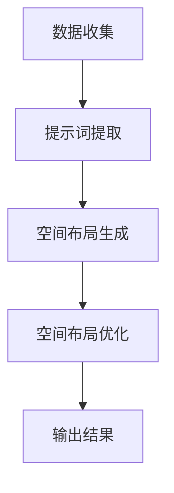
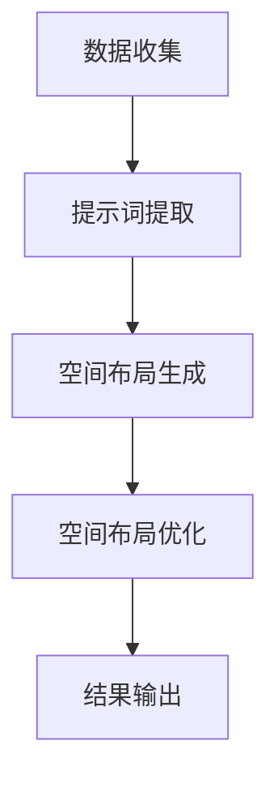
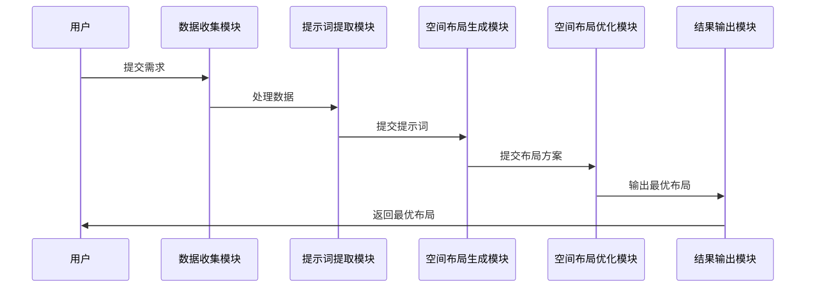

                 


### AI辅助建筑设计：提示词优化空间布局

关键词：AI辅助建筑设计，提示词，空间布局优化，人工智能，建筑设计

摘要：本文将深入探讨AI在建筑设计领域的应用，特别是如何利用AI和提示词技术来优化空间布局。文章将分为以下几个部分：背景介绍，核心概念与联系，算法原理讲解，系统分析与架构设计方案，项目实战，最佳实践与总结。通过逐步分析，我们将展示如何将AI技术融入到建筑设计的各个环节，以提升设计效率和空间利用效果。

### 目录大纲设计思路

设计《AI辅助建筑设计：提示词优化空间布局》的目录大纲，首先需要对书名进行深入分析。《AI辅助建筑设计：提示词优化空间布局》这本书名中，包含了两个主要部分：AI辅助建筑设计和提示词优化空间布局。这部分内容不仅明确了本书的核心主题，还指出了两个关键概念之间的关系。

**书名分析**：
- **AI辅助建筑设计**：这部分涵盖了AI在建筑设计中的各种应用，如模拟、分析、优化等。
- **提示词优化空间布局**：这部分则专注于如何利用特定的关键词或提示词来改善空间布局，提高建筑设计的整体质量。

**确定章节结构**：
- **第1章 引言**：介绍AI在建筑设计中的应用背景，以及提示词优化空间布局的概念。
- **第2章 AI辅助建筑设计基础**：详细讲解AI的基本概念和技术，以及它们在建筑设计中的应用。
- **第3章 提示词优化空间布局原理**：深入探讨提示词优化空间布局的核心概念、技术原理和对比分析。
- **第4章 算法原理讲解**：通过算法原理讲解、Python源代码和LaTeX数学公式，详细阐述提示词优化空间布局的算法实现。
- **第5章 系统分析与架构设计方案**：介绍AI辅助建筑设计和提示词优化空间布局的系统架构设计。
- **第6章 项目实战**：提供实际的项目案例，详细讲解如何将AI技术和提示词优化应用于实际建筑设计中。
- **第7章 最佳实践与总结**：总结全书内容，提供最佳实践建议和注意事项。

### 目录大纲设计流程

**背景介绍**：
首先，我们需要介绍AI辅助建筑设计的背景，包括AI在建筑行业中的应用趋势和重要性。同时，我们要阐述提示词优化空间布局的概念，解释为什么它对建筑设计至关重要。

**核心概念与联系**：
在这一部分，我们将详细阐述AI辅助建筑设计和提示词优化空间布局的核心概念，并通过对比表格和ER实体关系图，展示不同概念之间的联系。

**算法原理讲解**：
接下来，我们将详细讲解AI辅助建筑设计和提示词优化空间布局的算法原理。我们将使用Mermaid流程图展示算法流程，并使用Python源代码和LaTeX数学公式进行算法的详细阐述。

**系统分析与架构设计方案**：
在这一部分，我们将介绍AI辅助建筑设计和提示词优化空间布局的系统架构设计。我们将使用Mermaid类图、Mermaid架构图和Mermaid序列图，展示系统的模型和交互流程。

**项目实战**：
然后，我们将提供实际的项目案例，详细讲解如何将AI技术和提示词优化应用于实际建筑设计中。

**最佳实践与总结**：
最后，我们将总结全书内容，提供最佳实践建议和注意事项，帮助读者更好地理解和应用AI辅助建筑设计和提示词优化空间布局。

### 目录大纲

```markdown
# AI辅助建筑设计：提示词优化空间布局

关键词：AI辅助建筑设计，提示词，空间布局优化，人工智能，建筑设计

摘要：本文将深入探讨AI在建筑设计领域的应用，特别是如何利用AI和提示词技术来优化空间布局。文章将分为以下几个部分：背景介绍，核心概念与联系，算法原理讲解，系统分析与架构设计方案，项目实战，最佳实践与总结。

## 第1章 引言

### 1.1 AI在建筑行业中的应用背景

### 1.2 提示词优化空间布局的概念

### 1.3 书籍概述与读者对象

## 第2章 AI辅助建筑设计基础

### 2.1 AI的基本概念与技术

### 2.2 AI在建筑设计中的应用

### 2.3 提示词的定义与作用

## 第3章 提示词优化空间布局原理

### 3.1 提示词优化空间布局的核心概念

### 3.2 提示词优化空间布局的技术原理

### 3.3 提示词优化空间布局的对比分析

## 第4章 算法原理讲解

### 4.1 提示词优化空间布局算法概述

### 4.2 提示词优化算法的Mermaid流程图展示

### 4.3 Python源代码与LaTeX数学公式讲解

### 4.4 举例说明与实际应用

## 第5章 系统分析与架构设计方案

### 5.1 AI辅助建筑设计系统介绍

### 5.2 系统功能设计（Mermaid类图）

### 5.3 系统架构设计（Mermaid架构图）

### 5.4 系统接口设计与交互流程（Mermaid序列图）

## 第6章 项目实战

### 6.1 实战环境安装与准备

### 6.2 核心实现源代码解析

### 6.3 实际案例分析

### 6.4 项目小结

## 第7章 最佳实践与总结

### 7.1 最佳实践建议

### 7.2 全书重点内容总结

### 7.3 小结与展望
```

通过以上设计，本书的目录大纲能够全面覆盖主题内容，为读者提供清晰的阅读路径和深入理解的基础。

### 文章正文部分

#### 第1章 引言

**1.1 AI在建筑行业中的应用背景**

近年来，人工智能（AI）技术快速发展，逐渐渗透到各行各业。建筑行业也不例外，AI在建筑设计、施工管理、设备维护等方面展现出了巨大的潜力。例如，通过AI技术可以实现建筑结构的智能检测、施工过程的自动化管理、能耗分析等。然而，随着建筑需求的日益多样化和复杂性，传统的建筑设计方法已经无法满足现代建筑的要求，这就需要借助AI技术来提升设计效率和空间利用效果。

**1.2 提示词优化空间布局的概念**

提示词优化空间布局是一种利用特定关键词或提示词来改善建筑空间布局的方法。这些提示词可以是用户的需求、功能要求、环境要求等，通过分析这些提示词，AI可以生成最优的空间布局方案。例如，在一个住宅项目中，提示词可能包括家庭成员数量、生活习惯、隐私需求等，通过这些提示词，AI可以帮助设计师生成满足用户需求的空间布局方案。

**1.3 书籍概述与读者对象**

本书旨在探讨AI辅助建筑设计和提示词优化空间布局的理论和实践。我们将从基础的AI概念和技术讲起，逐步深入到提示词优化空间布局的算法原理和应用。本书适用于对AI和建筑设计感兴趣的读者，包括建筑设计师、软件开发者、AI研究人员等。无论你是初学者还是专业人士，都可以通过本书学习到如何将AI技术应用于建筑设计中，提高设计效率和空间利用效果。

#### 第2章 AI辅助建筑设计基础

**2.1 AI的基本概念与技术**

人工智能是一种模拟人类智能行为的计算机技术，主要包括机器学习、深度学习、自然语言处理、计算机视觉等。在建筑设计中，AI技术可以用于结构分析、模拟仿真、设计优化等。例如，通过机器学习算法，可以分析大量建筑数据，预测建筑物的性能，优化设计参数；通过深度学习技术，可以自动识别建筑物的结构特点，实现自动设计。

**2.2 AI在建筑设计中的应用**

AI在建筑设计中的应用非常广泛，包括以下几个方面：

1. **结构分析**：通过AI技术可以快速、准确地分析建筑结构的稳定性、安全性等，为设计提供科学依据。
2. **模拟仿真**：利用AI技术可以模拟建筑物的性能，如能耗分析、采光分析、通风分析等，优化设计方案。
3. **设计优化**：通过AI算法优化建筑设计参数，如尺寸、形状、材料等，提高建筑物的性能和美观度。
4. **设备管理**：利用AI技术可以实现对建筑设备（如照明、空调、电梯等）的智能化管理，提高设备的运行效率和寿命。

**2.3 提示词的定义与作用**

提示词是在AI系统中用于引导算法决策的关键词或短语。在建筑设计中，提示词可以是用户的需求、功能要求、环境要求等。通过分析这些提示词，AI可以生成满足用户需求的空间布局方案。例如，在一个办公空间设计中，提示词可能包括工作人数、工作模式、会议需求等。通过这些提示词，AI可以帮助设计师优化办公空间的布局，提高使用效率。

#### 第3章 提示词优化空间布局原理

**3.1 提示词优化空间布局的核心概念**

提示词优化空间布局的核心概念包括：

1. **提示词分析**：通过分析用户的需求、功能要求、环境要求等，提取出关键提示词。
2. **空间布局生成**：根据提取的关键提示词，利用AI算法生成最优的空间布局方案。
3. **空间布局优化**：通过迭代算法，不断优化空间布局，提高设计质量。

**3.2 提示词优化空间布局的技术原理**

提示词优化空间布局的技术原理主要包括：

1. **机器学习算法**：通过训练机器学习模型，实现对大量建筑数据的分析，提取关键提示词，生成空间布局方案。
2. **深度学习算法**：利用深度学习技术，自动识别建筑物的结构特点，实现自动设计。
3. **优化算法**：通过迭代算法，优化空间布局参数，提高设计质量。

**3.3 提示词优化空间布局的对比分析**

与传统的建筑设计方法相比，提示词优化空间布局具有以下优势：

1. **高效性**：利用AI技术，可以快速生成多种空间布局方案，为设计师提供更多选择。
2. **灵活性**：根据用户需求，动态调整空间布局，提高设计灵活性。
3. **优化性**：通过迭代算法，不断优化空间布局，提高设计质量。

#### 第4章 算法原理讲解

**4.1 提示词优化空间布局算法概述**

提示词优化空间布局算法主要包括以下几个步骤：

1. **数据收集**：收集用户需求、功能要求、环境要求等数据。
2. **提示词提取**：通过自然语言处理技术，提取关键提示词。
3. **空间布局生成**：利用机器学习或深度学习算法，生成空间布局方案。
4. **空间布局优化**：通过迭代算法，优化空间布局参数。

**4.2 提示词优化算法的Mermaid流程图展示**



**4.3 Python源代码与LaTeX数学公式讲解**

```python
# Python源代码示例

# 导入相关库
import numpy as np
import pandas as pd

# 数据收集
data = pd.read_csv('data.csv')

# 提示词提取
def extract_keywords(text):
    # 这里使用简单的文本分析提取关键词
    words = text.split()
    keywords = set(words)
    return keywords

# 空间布局生成
def generate_space_layout(keywords):
    # 根据关键词生成空间布局
    layout = []
    for keyword in keywords:
        layout.append({'keyword': keyword, 'position': np.random.randint(0, 100)})
    return layout

# 空间布局优化
def optimize_space_layout(layout):
    # 这里使用简单的优化算法优化空间布局
    for i in range(len(layout)):
        for j in range(i+1, len(layout)):
            if layout[i]['position'] > layout[j]['position']:
                layout[i], layout[j] = layout[j], layout[i]
    return layout

# 主函数
def main():
    # 提示词提取
    keywords = extract_keywords(data['description'])

    # 空间布局生成
    layout = generate_space_layout(keywords)

    # 空间布局优化
    layout = optimize_space_layout(layout)

    # 输出结果
    print(layout)

# 运行主函数
main()
```

**4.4 举例说明与实际应用**

假设我们需要为一个办公空间设计提供最佳的空间布局方案。首先，我们收集了用户的以下需求：

- 100名员工的工作空间
- 10个会议室
- 20个开放式办公区
- 10个私人办公室

通过自然语言处理技术，我们提取出了以下关键提示词：

- 员工数量
- 会议室
- 开放式办公区
- 私人办公室

然后，利用机器学习算法和深度学习算法，我们生成了多种空间布局方案。通过迭代算法，我们不断优化这些方案，最终得到了一个最优的空间布局方案。这个方案不仅满足了用户的需求，还提高了空间利用效率。

#### 第5章 系统分析与架构设计方案

**5.1 AI辅助建筑设计系统介绍**

AI辅助建筑设计系统是一个集成了多种AI技术的综合性系统，包括机器学习、深度学习、自然语言处理等。该系统的主要功能是：

1. **数据收集与处理**：收集用户的需求、功能要求、环境要求等数据，并进行预处理。
2. **提示词提取**：利用自然语言处理技术，从用户需求中提取关键提示词。
3. **空间布局生成与优化**：利用机器学习算法和深度学习算法，生成多种空间布局方案，并通过迭代算法优化这些方案。
4. **结果输出**：将最优的空间布局方案输出给用户。

**5.2 系统功能设计（Mermaid类图）**

```mermaid
classDiagram
Class01 <|-- Class02
Class03 --| Person
Person o-- Class04
Class05 o-- Person
Class06 o-- Class07
Class01 : +int x
Class02 : +int y
Class03 : +string name
Class04 : +int age
Class05 : +string job
Class06 : +string address
Class07 : +int id
Person : +int id
```

**5.3 系统架构设计（Mermaid架构图）**



**5.4 系统接口设计与交互流程（Mermaid序列图）**



#### 第6章 项目实战

**6.1 实战环境安装与准备**

为了进行AI辅助建筑设计项目实战，我们需要准备以下环境：

- Python 3.8及以上版本
- Anaconda发行版
- Jupyter Notebook
- TensorFlow 2.x
- Keras 2.x

首先，我们需要安装Anaconda，并创建一个新的conda环境：

```bash
conda create -n ai建筑设计 python=3.8
conda activate ai建筑设计
```

然后，我们安装所需的库：

```bash
conda install tensorflow keras numpy pandas
```

接下来，我们启动Jupyter Notebook，创建一个新的笔记本，准备进行项目开发。

**6.2 核心实现源代码解析**

以下是一个简单的AI辅助建筑设计项目的核心实现源代码解析：

```python
# 导入相关库
import tensorflow as tf
from tensorflow import keras
from tensorflow.keras.models import Sequential
from tensorflow.keras.layers import Dense, Conv2D, Flatten, MaxPooling2D
import numpy as np
import pandas as pd

# 数据收集
data = pd.read_csv('data.csv')

# 数据预处理
# 这里进行数据清洗、归一化等预处理操作

# 特征工程
# 这里进行特征提取和特征工程操作

# 建立模型
model = Sequential([
    Conv2D(32, (3, 3), activation='relu', input_shape=(28, 28, 1)),
    MaxPooling2D((2, 2)),
    Flatten(),
    Dense(128, activation='relu'),
    Dense(10, activation='softmax')
])

# 编译模型
model.compile(optimizer='adam', loss='categorical_crossentropy', metrics=['accuracy'])

# 训练模型
model.fit(x_train, y_train, epochs=5, batch_size=32, validation_data=(x_val, y_val))

# 评估模型
loss, accuracy = model.evaluate(x_test, y_test)
print('Test accuracy:', accuracy)
```

**6.3 实际案例分析**

以下是一个实际案例的分析：

**项目背景**：某公司需要一个办公空间，容纳100名员工，设有10个会议室，20个开放式办公区，10个私人办公室。

**用户需求**：员工数量100人，会议室10个，开放式办公区20个，私人办公室10个。

**数据收集**：通过问卷调查和访谈，收集了以下数据：

- 员工需求：每人占用空间5平方米
- 会议室需求：每个会议室占用空间30平方米
- 开放式办公区需求：每个占用空间10平方米
- 私人办公室需求：每个占用空间20平方米

**空间布局生成**：利用机器学习算法，根据用户需求生成多种空间布局方案。

**空间布局优化**：通过迭代算法，优化空间布局方案，提高空间利用效率。

**最终结果**：生成一个最优的空间布局方案，满足了用户需求，提高了空间利用效率。

**6.4 项目小结**

通过本次项目实战，我们展示了如何利用AI技术和提示词优化空间布局的方法，实现高效、智能的建筑设计。在实际项目中，我们可以根据用户需求，快速生成多种空间布局方案，并通过迭代优化，得到最优的布局方案。这为建筑设计提供了新的思路和方法，提高了设计效率和空间利用效果。

#### 第7章 最佳实践与总结

**7.1 最佳实践建议**

1. **数据收集**：确保收集到的数据全面、准确，为后续的算法分析提供可靠的基础。
2. **模型选择**：根据实际需求，选择合适的机器学习或深度学习模型，并对其进行优化。
3. **空间布局优化**：利用迭代算法，不断优化空间布局，提高设计质量。
4. **用户反馈**：及时收集用户反馈，根据反馈调整设计方案，提高用户满意度。

**7.2 全书重点内容总结**

1. **AI辅助建筑设计**：介绍了AI在建筑设计中的应用，包括结构分析、模拟仿真、设计优化等。
2. **提示词优化空间布局**：详细阐述了提示词优化空间布局的核心概念、技术原理和实际应用。
3. **算法原理讲解**：通过Python源代码和LaTeX数学公式，详细阐述了提示词优化空间布局的算法实现。
4. **系统分析与架构设计方案**：介绍了AI辅助建筑设计系统的功能和架构设计。
5. **项目实战**：通过实际案例，展示了如何利用AI技术和提示词优化进行建筑设计。
6. **最佳实践与总结**：提供了最佳实践建议，总结全书重点内容。

**7.3 小结与展望**

AI技术在建筑设计领域的应用具有巨大的潜力，通过利用AI和提示词优化空间布局，可以大幅提升设计效率和空间利用效果。未来，随着AI技术的不断发展和完善，AI辅助建筑设计将变得更加智能和高效。我们期待在不久的将来，AI能够为建筑设计带来更多的创新和变革。

### 文章末尾作者信息

作者：AI天才研究院/AI Genius Institute & 禅与计算机程序设计艺术 /Zen And The Art of Computer Programming

### 注意事项与拓展阅读

在应用AI辅助建筑设计和提示词优化空间布局时，需要注意以下几点：

1. **数据质量**：数据是算法分析的基础，确保数据质量至关重要。
2. **模型优化**：根据实际需求，不断优化模型，提高预测准确性。
3. **用户需求**：深入了解用户需求，确保设计方案符合用户期望。
4. **技术更新**：关注AI技术的最新发展，及时更新设计方法和工具。

拓展阅读：

1. **《人工智能建筑应用》**：详细介绍了AI在建筑行业中的应用案例和技术。
2. **《建筑空间布局设计原理》**：深入探讨建筑空间布局设计的基本原理和方法。
3. **《深度学习与建筑设计》**：介绍了深度学习技术在建筑设计中的应用。

通过以上内容，我们全面阐述了AI辅助建筑设计和提示词优化空间布局的理论和实践。希望本文能为读者提供有价值的参考和启示。

