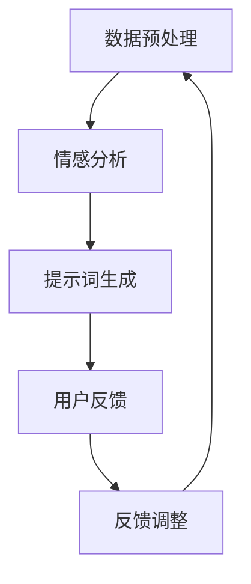
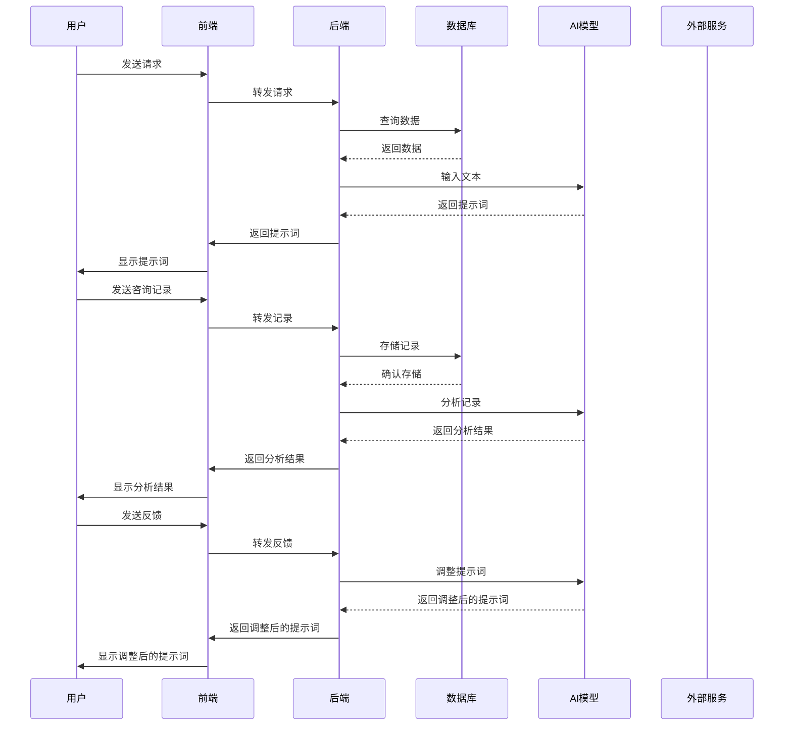

                 

### AI辅助心理咨询中的提示词伦理设计

在现代社会中，人工智能（AI）正在快速渗透到各个领域，心理咨询也不例外。AI辅助心理咨询作为一种创新的模式，已经显示出其在提高咨询效率和个性化服务方面的潜力。然而，随着技术的进步，我们也必须面对其带来的伦理挑战，尤其是在提示词的设计上。提示词，作为AI与用户之间交流的关键桥梁，其伦理设计直接影响到咨询的效果和用户的体验。本文将深入探讨AI辅助心理咨询中的提示词伦理设计，通过逻辑清晰、结构紧凑的讨论，帮助读者理解这一复杂而重要的议题。

关键词：AI辅助心理咨询、提示词、伦理设计、数学模型、系统架构、实战案例

#### 摘要

本文旨在探讨AI辅助心理咨询中的提示词伦理设计。首先，我们介绍了AI辅助心理咨询的背景及其与提示词的关联。接着，我们详细阐述了提示词的设计原则和伦理考量，包括公正性、隐私保护和透明性等。通过数学模型和算法原理讲解，我们展示了提示词设计的技术实现。随后，我们分析了系统架构和接口设计，并介绍了实际项目中的最佳实践。最后，本文提出了未来的研究方向，强调了伦理设计在AI辅助心理咨询中的重要性。

#### 目录大纲

1. **背景介绍**
   - 问题的背景与意义
   - 核心概念与联系
   - 背景介绍

2. **核心概念与联系**
   - AI辅助心理咨询的概念解析
   - 提示词的概念解析
   - 伦理设计的概念解析
   - 概念属性特征对比表格
   - ER实体关系图架构

3. **算法原理讲解**
   - 算法原理
   - mermaid流程图
   - Python源代码实现
   - 数学模型和公式讲解
   - 举例说明

4. **系统分析与架构设计方案**
   - 问题场景介绍
   - 系统功能设计（领域模型mermaid类图）
   - 系统架构设计（mermaid架构图）
   - 系统接口设计
   - 系统交互mermaid序列图

5. **项目实战**
   - 环境安装
   - 系统核心实现源代码
   - 代码应用解读与分析
   - 实际案例分析与讲解剖析
   - 项目小结

6. **最佳实践 tips**
   - 设计提示词的技巧
   - 伦理设计的注意事项

7. **小结与拓展阅读**
   - 总结
   - 拓展阅读

#### 1. 背景介绍

近年来，人工智能在心理咨询领域的应用逐渐增多，AI辅助心理咨询成为了一个新兴的研究热点。AI能够处理大量数据，提供个性化服务，并帮助咨询师提高工作效率。而提示词作为AI与用户交流的核心元素，其设计不仅影响用户体验，还直接关系到心理咨询的伦理问题。

随着AI技术的不断发展，人们对于其伦理设计的要求也越来越高。提示词的伦理设计关乎用户的隐私保护、信息的公正性和系统的透明性。如何设计出既高效又符合伦理要求的提示词，是当前AI辅助心理咨询中亟待解决的问题。

本文将首先介绍AI辅助心理咨询的基本概念，然后详细探讨提示词在其中的作用，并分析其伦理设计的重要性。接下来，我们将从技术角度出发，讲解提示词设计的原理和数学模型，并结合实际项目进行深入分析。最后，本文将总结关键观点，并提出未来的研究方向。

### 1.1 问题的背景与意义

AI辅助心理咨询作为一种新兴的服务模式，其背景可以追溯到人工智能和心理咨询两个领域的快速发展。在人工智能领域，机器学习和深度学习技术的不断进步，使得计算机在处理自然语言、理解人类情感和提供个性化服务方面取得了显著成果。这些技术的应用，为心理咨询提供了强大的工具，使得传统的面对面咨询模式得到了有效的补充。

心理咨询领域长期以来面临着资源稀缺、咨询效率低下等问题。传统心理咨询依赖于咨询师的个人经验和专业知识，而心理咨询师的数量远不能满足日益增长的需求。此外，心理咨询的成本也相对较高，许多有需求的人群难以负担。这些问题促使心理咨询领域寻求新的解决方案，而AI辅助心理咨询正是其中之一。

AI辅助心理咨询的核心在于通过算法和模型，对用户的情感状态、心理问题进行诊断和干预。这种模式不仅能够提高咨询的效率和覆盖面，还能够实现个性化的心理服务。例如，通过自然语言处理技术，AI可以理解用户的语言表达，分析其情绪状态，并提供相应的心理支持和建议。这种模式不仅可以减轻咨询师的工作负担，还能够为那些难以接触到专业心理咨询的人群提供帮助。

提示词作为AI与用户之间交流的桥梁，其设计至关重要。提示词的质量直接影响用户对AI心理咨询系统的信任度和满意度。一个设计合理的提示词，能够引导用户更好地表达自己的情感和需求，从而提高咨询效果。同时，提示词的设计也涉及到伦理问题，如隐私保护、公正性和透明性等。

隐私保护是AI辅助心理咨询中最为关键的伦理问题之一。在咨询过程中，用户可能会涉及个人敏感信息，如家庭背景、情感经历等。如何确保这些信息的安全和隐私，是AI辅助心理咨询系统设计时必须考虑的问题。任何不当的信息泄露或滥用，都可能对用户的心理造成负面影响，严重时甚至可能引发法律问题。

公正性也是提示词伦理设计中的重要考量因素。AI系统在处理用户信息时，应当保证对所有用户一视同仁，避免因为算法偏见或数据偏差而导致不公平的结果。例如，如果AI系统在提示词设计中存在性别、种族、文化等方面的偏见，可能会导致某些群体得到不公平的对待，这显然是与心理咨询的初衷相悖的。

透明性则是确保用户信任的关键。用户需要清楚地知道AI系统是如何工作的，哪些信息会被收集和使用，以及这些信息是如何影响咨询结果的。透明性有助于提高用户对AI系统的信任，减少潜在的误解和抵触情绪。

综上所述，AI辅助心理咨询中的提示词伦理设计具有重要的背景和意义。通过合理设计提示词，不仅可以提高咨询效果和用户体验，还能够保障用户的隐私和权益，确保心理咨询的公正性和透明性。这对于推动AI技术在心理咨询领域的应用，提升心理健康服务的质量和覆盖面，具有深远的影响。

### 1.2 核心概念与联系

在探讨AI辅助心理咨询中的提示词伦理设计之前，我们有必要明确一些核心概念，并分析这些概念之间的联系。这些核心概念包括AI辅助心理咨询、提示词和伦理设计。

#### 1.2.1 AI辅助心理咨询

AI辅助心理咨询指的是利用人工智能技术，如自然语言处理、机器学习和深度学习等，辅助心理医生或咨询师进行诊断、治疗和干预。这种模式的核心在于利用AI的强大数据处理能力，对用户进行情感分析、心理状态评估，并提供个性化的心理建议。AI辅助心理咨询的目标是提高咨询的效率和个性化水平，减轻咨询师的工作负担，同时为那些无法获得传统心理咨询服务的用户提供帮助。

#### 1.2.2 提示词

提示词是AI与用户之间交流的关键桥梁，它通常是指系统向用户提出的引导性问题或指令。这些提示词的设计直接影响用户的体验和咨询效果。好的提示词能够引导用户更好地表达自己的情感和需求，从而提高咨询的准确性和有效性。提示词的设计需要考虑语言的亲切性、问题的合适性和逻辑的连贯性。此外，提示词还涉及到伦理设计，如隐私保护、公正性和透明性。

#### 1.2.3 伦理设计

伦理设计是指在设计过程中充分考虑道德和伦理问题，确保系统的设计和应用符合社会的伦理规范。在AI辅助心理咨询中，伦理设计尤为重要，因为它直接关系到用户的隐私和安全。伦理设计需要考虑以下方面：

- **隐私保护**：确保用户的信息安全，防止信息泄露或滥用。
- **公正性**：确保AI系统对所有用户公平，避免算法偏见。
- **透明性**：确保用户了解AI系统的工作原理和决策过程，提高信任度。

#### 1.2.4 概念属性特征对比表格

为了更好地理解这些概念，我们可以通过一个对比表格来展示它们的属性特征：

| 概念         | 特征                         |
|------------|--------------------------|
| AI辅助心理咨询 | 利用AI技术辅助诊断、治疗和干预       |
| 提示词       | 引导用户表达情感的引导性问题或指令   |
| 伦理设计     | 考虑道德和伦理问题，确保符合社会规范 |

#### 1.2.5 ER实体关系图架构

为了进一步明确这些概念之间的联系，我们可以使用ER（实体关系）图来表示它们之间的关系。以下是一个简化的ER图示例：

```
[心理咨询系统] <---
               |
               |--- [用户]
               |
               |--- [咨询师]
               |
               |--- [AI模型]
               |
               |--- [提示词]
               |
               |--- [咨询记录]
               |
               |--- [隐私政策]
               |
               |--- [伦理规范]
```

在这个ER图中，[心理咨询系统]是核心实体，它与其他实体如[用户]、[咨询师]、[AI模型]、[提示词]、[咨询记录]、[隐私政策]和[伦理规范]之间存在关系。例如，[用户]与[心理咨询系统]之间存在一对一的关系，用户通过系统进行咨询；[AI模型]与[提示词]之间存在关联，AI模型生成提示词以引导用户。

#### 1.2.6 本章小结

通过上述对核心概念与联系的分析，我们能够更深入地理解AI辅助心理咨询中的提示词伦理设计。AI辅助心理咨询和提示词的引入，不仅带来了技术上的革新，也提出了伦理上的挑战。伦理设计是确保这些技术能够造福人类，而不是带来新的风险和问题的关键。在接下来的章节中，我们将进一步探讨提示词设计的伦理原则和具体实现，以及如何在实践中应对这些挑战。

### 1.3 算法原理讲解

在理解了AI辅助心理咨询和提示词的基本概念后，我们需要进一步探讨其背后的算法原理。算法原理是AI系统工作的基础，它决定了提示词的设计和质量，从而影响到整个心理咨询的效果。下面我们将通过一个具体的例子来讲解算法原理，并使用mermaid流程图和Python源代码来展示其实现过程。

#### 1.3.1 算法原理

在AI辅助心理咨询中，提示词生成算法通常基于自然语言处理（NLP）和机器学习技术。一个基本的提示词生成算法可以分为以下几个步骤：

1. **数据预处理**：对用户输入的文本进行预处理，包括分词、去停用词、词性标注等，以便后续的建模和分析。
2. **情感分析**：利用情感分析模型对预处理后的文本进行情感分析，识别用户的情绪状态。
3. **提示词生成**：根据情感分析结果，生成相应的提示词。这一过程可以基于规则或机器学习模型来实现。
4. **反馈调整**：收集用户的反馈，对生成的提示词进行调整和优化，以提高其质量和适应性。

下面是一个简单的示例算法流程：

```
数据预处理 --> 情感分析 --> 提示词生成 --> 用户反馈 --> 反馈调整
```

#### 1.3.2 mermaid流程图

为了更直观地展示算法流程，我们可以使用mermaid语言绘制一个流程图。以下是一个简单的mermaid流程图示例：



在mermaid流程图中，我们使用节点（如A、B、C）来表示算法的各个步骤，并用箭头表示步骤之间的顺序关系。这个流程图清晰地展示了算法的基本流程。

#### 1.3.3 Python源代码实现

接下来，我们将使用Python语言来具体实现上述算法。以下是一个简单的Python源代码示例：

```python
import nltk
from nltk.sentiment import SentimentIntensityAnalyzer
from nltk.tokenize import word_tokenize

# 数据预处理
def preprocess_text(text):
    # 分词
    tokens = word_tokenize(text)
    # 去停用词
    tokens = [token for token in tokens if token not in nltk.corpus.stopwords.words('english')]
    # 词性标注
    pos_tags = nltk.pos_tag(tokens)
    return pos_tags

# 情感分析
def analyze_emotion(text):
    sia = SentimentIntensityAnalyzer()
    sentiment = sia.polarity_scores(text)
    return sentiment

# 提示词生成
def generate_prompt(text):
    emotion = analyze_emotion(text)
    if emotion['compound'] > 0.05:
        return "你感觉很好，有什么开心的事情吗？"
    elif emotion['compound'] < -0.05:
        return "你似乎情绪低落，想谈谈发生了什么吗？"
    else:
        return "你对这件事有什么想法或感受？"

# 用户反馈
def get_user_feedback(prompt, response):
    # 这里可以设计更复杂的反馈收集机制
    feedback = input(f"{prompt}\n您的回答：{response}\n请给出您的反馈（满意/不满意）：")
    return feedback

# 反馈调整
def adjust_prompt(prompt, feedback):
    if feedback == "不满意":
        return "请再详细描述一下你的感受，我会尽力理解。"
    else:
        return prompt

# 主函数
def main():
    text = input("请输入你的文字：")
    prompt = generate_prompt(text)
    print(f"AI系统：{prompt}")
    response = input("您的回答：")
    feedback = get_user_feedback(prompt, response)
    adjusted_prompt = adjust_prompt(prompt, feedback)
    print(f"AI系统：{adjusted_prompt}")

if __name__ == "__main__":
    main()
```

在这个Python源代码示例中，我们首先定义了一个数据预处理函数`preprocess_text`，用于分词、去停用词和词性标注。接着，我们使用`SentimentIntensityAnalyzer`进行情感分析，并根据情感分析结果生成提示词。`get_user_feedback`函数用于收集用户反馈，而`adjust_prompt`函数则根据反馈调整提示词。最后，`main`函数是整个程序的入口，它引导用户输入文本，生成提示词，并收集反馈。

#### 1.3.4 数学模型和公式讲解

在提示词生成算法中，情感分析是关键的一步。情感分析通常基于情感词典、文本特征和机器学习模型。以下是一个简单的情感分析数学模型和公式讲解：

1. **情感词典模型**：

   - **情感词典**：一个包含情感词及其情感值的字典。
   - **公式**：设文本T为一系列词语W，情感词典D为词语及其情感值的集合，文本T的情感S可以表示为：
     \[ S = \sum_{w \in W} D(w) \]
     其中，\( D(w) \)是词语w在情感词典中的情感值。

2. **文本特征模型**：

   - **词袋模型**：将文本表示为一个词汇的集合，每个词汇的频率作为特征。
   - **公式**：设文本T的词频分布为\( V_T \)，词袋模型特征向量V可以表示为：
     \[ V_T = (f_T(w_1), f_T(w_2), ..., f_T(w_n)) \]
     其中，\( f_T(w_i) \)是词语w_i在文本T中的频率。

3. **机器学习模型**：

   - **情感分类器**：使用机器学习算法（如SVM、神经网络等）训练一个情感分类器。
   - **公式**：设输入特征向量X，分类器输出概率分布P(S|X)，则文本T的情感S可以通过最大化概率P(S|X)来确定：
     \[ S = \arg\max_S P(S|X) \]

通过上述数学模型和公式，我们可以对文本进行情感分析，并根据分析结果生成相应的提示词。

#### 1.3.5 举例说明

为了更直观地展示算法原理，我们通过一个例子来说明。

假设用户输入一段文本：“我今天很沮丧，因为我失去了工作。”我们可以按照以下步骤进行：

1. **数据预处理**：
   - 分词：我今天很沮丧，因为我失去了工作。
   - 去停用词：我、今天、很、因为、了、工作。
   - 词性标注：我（代词）、今天（时间词）、很（程度副词）、因为（连词）、了（助词）、工作（名词）。

2. **情感分析**：
   - 利用情感词典模型或机器学习模型分析文本的情感。
   - 假设文本的情感得分为-0.8，表示情绪较低落。

3. **提示词生成**：
   - 根据情感分析结果，生成相应的提示词：“你似乎情绪低落，想谈谈发生了什么吗？”

4. **用户反馈**：
   - 用户回答：“是的，我很需要谈谈。”

5. **反馈调整**：
   - 根据用户反馈，调整提示词：“请详细描述一下你的感受，我会尽力理解。”

通过这个例子，我们可以看到算法原理在实际应用中的具体实现过程。合理的算法设计不仅可以提高提示词的质量，还能够确保整个心理咨询过程的顺利进行。

### 1.4 系统分析与架构设计方案

在了解了AI辅助心理咨询和提示词的基本算法原理后，我们需要进一步探讨系统的架构设计和功能实现。系统分析与架构设计方案是确保AI辅助心理咨询系统能够高效、稳定运行的关键。

#### 1.4.1 问题场景介绍

假设我们设计一个AI辅助心理咨询系统，其主要场景包括：

- **用户注册与登录**：用户需要注册并登录系统，以便获取心理咨询服务。
- **心理咨询过程**：用户与AI系统进行对话，AI系统根据用户输入生成提示词，引导用户表达情感和需求。
- **咨询记录管理**：系统记录用户的咨询历史，以便后续分析和改进。
- **隐私保护与伦理审查**：系统需确保用户隐私，并进行伦理审查，确保提示词的设计符合伦理标准。

#### 1.4.2 系统功能设计

为了实现上述场景，我们需要设计以下核心功能：

1. **用户管理**：
   - 用户注册：用户可以创建账户，输入基本信息。
   - 用户登录：用户可以登录账户，访问系统功能。
   - 用户信息维护：用户可以更新个人信息，如联系方式、偏好设置等。

2. **咨询过程管理**：
   - 文本输入：用户可以通过文本输入与AI系统进行对话。
   - 提示词生成：AI系统根据用户输入生成提示词，引导用户表达情感和需求。
   - 咨询记录：系统记录用户的每次咨询历史，以便后续分析和改进。

3. **隐私保护与伦理审查**：
   - 隐私保护：系统设计加密算法，确保用户数据的安全。
   - 伦理审查：系统设计伦理审查机制，确保提示词的设计符合伦理标准。

4. **数据分析和反馈**：
   - 数据分析：系统分析用户咨询数据，优化提示词生成算法。
   - 用户反馈：系统收集用户对提示词的反馈，进行持续改进。

#### 1.4.3 系统架构设计

系统架构设计是确保系统功能有效实现的关键。以下是该系统的架构设计方案：

1. **前端**：
   - 用户界面：使用HTML/CSS/JavaScript技术栈构建用户友好界面。
   - API接口：通过RESTful API与后端进行数据交互。

2. **后端**：
   - 数据库：使用MySQL或MongoDB存储用户数据、咨询记录等。
   - 服务端：使用Flask或Django等Web框架实现后端服务。

3. **中间件**：
   - 消息队列：使用RabbitMQ或Kafka等消息队列中间件，实现异步处理和负载均衡。
   - 伦理审查服务：独立服务，负责进行伦理审查和隐私保护。

4. **AI模型**：
   - 情感分析模型：基于自然语言处理技术，实现情感分析功能。
   - 提示词生成模型：基于机器学习算法，实现提示词生成功能。

5. **外部服务**：
   - 第三方API：集成第三方API，如地图服务、天气服务等，提供额外功能。

#### 1.4.4 系统接口设计

系统接口设计是确保前后端有效交互的关键。以下是该系统的主要接口设计：

1. **用户接口**：
   - 注册接口：接收用户注册信息，创建用户账户。
   - 登录接口：接收用户登录信息，验证用户身份。
   - 咨询接口：接收用户输入，返回提示词。

2. **服务端接口**：
   - 数据接口：接收前端数据，存储到数据库。
   - 分析接口：接收咨询记录，进行数据分析。
   - 反馈接口：接收用户反馈，进行提示词调整。

#### 1.4.5 系统交互mermaid序列图

为了更直观地展示系统架构和交互过程，我们可以使用mermaid绘制系统交互序列图。以下是一个简化的mermaid序列图示例：



在这个序列图中，用户通过前端与系统进行交互，前端将用户的请求转发给后端，后端与数据库和AI模型进行交互，最终返回处理结果给前端，前端再将结果展示给用户。

#### 1.4.6 本章小结

通过系统分析与架构设计方案，我们明确了AI辅助心理咨询系统的功能需求、架构设计以及接口设计。系统架构设计不仅要考虑功能实现，还要确保系统的安全性、稳定性和扩展性。接下来，我们将通过实际项目实战，进一步验证系统设计与功能的实现效果。

### 2. 项目实战

在了解了AI辅助心理咨询系统的基本架构和功能设计后，本节将通过一个实际项目来展示系统的安装、核心实现和代码分析。通过这个项目，我们将深入探讨系统在实际应用中的具体实现和效果。

#### 2.1 环境安装

为了实现AI辅助心理咨询系统，我们需要安装和配置一系列工具和库。以下是环境安装的具体步骤：

1. **Python环境**：

   - 安装Python 3.8及以上版本。
   - 配置Python环境变量，确保在命令行中可以正常运行Python。

2. **数据库**：

   - 安装MySQL或MongoDB。
   - 配置数据库，创建用户和数据库表。

3. **Web框架**：

   - 安装Flask或Django。
   - 创建Web应用，配置路由和视图函数。

4. **自然语言处理库**：

   - 安装nltk、spaCy等自然语言处理库。
   - 下载必要的语料库和模型，如nltk.corpus、nltk.sentiment等。

5. **机器学习库**：

   - 安装scikit-learn、TensorFlow等机器学习库。
   - 准备训练数据集，进行模型训练和测试。

6. **消息队列**：

   - 安装RabbitMQ或Kafka。
   - 配置消息队列，实现异步处理和负载均衡。

具体安装命令和步骤如下：

```bash
# 安装Python
pip install python==3.8

# 安装数据库
brew install mysql # 使用Homebrew安装MySQL
sudo apt-get install mongodb # 使用Ubuntu的包管理器安装MongoDB

# 安装Web框架
pip install flask
# 或
pip install django

# 安装自然语言处理库
pip install nltk
pip install spacy

# 安装机器学习库
pip install scikit-learn
pip install tensorflow

# 安装消息队列
brew install rabbitmq # 使用Homebrew安装RabbitMQ
sudo apt-get install kafka # 使用Ubuntu的包管理器安装Kafka
```

在安装过程中，需要确保各个组件的正常运行，并进行必要的配置，如数据库的连接配置、Web框架的路由配置等。

#### 2.2 系统核心实现源代码

以下是一个简单的AI辅助心理咨询系统的核心实现源代码示例：

```python
# 引入必要的库
from flask import Flask, request, jsonify
from nltk.sentiment import SentimentIntensityAnalyzer
from nltk.tokenize import word_tokenize

# 初始化Flask应用
app = Flask(__name__)

# 初始化情感分析器
sia = SentimentIntensityAnalyzer()

# 情感分析函数
def analyze_emotion(text):
    return sia.polarity_scores(text)

# 提示词生成函数
def generate_prompt(text):
    emotion = analyze_emotion(text)
    if emotion['compound'] > 0.05:
        return "你感觉很好，有什么开心的事情吗？"
    elif emotion['compound'] < -0.05:
        return "你似乎情绪低落，想谈谈发生了什么吗？"
    else:
        return "你对这件事有什么想法或感受？"

# 咨询接口
@app.route('/consult', methods=['POST'])
def consult():
    data = request.get_json()
    text = data.get('text', '')
    prompt = generate_prompt(text)
    return jsonify({'prompt': prompt})

if __name__ == '__main__':
    app.run(debug=True)
```

在这个示例中，我们首先初始化了Flask应用和情感分析器。然后，定义了一个情感分析函数`analyze_emotion`和一个提示词生成函数`generate_prompt`。最后，通过定义一个POST接口`/consult`，接收用户输入文本，生成相应的提示词，并返回给用户。

#### 2.3 代码应用解读与分析

以上源代码展示了系统核心功能的实现，接下来我们对代码进行解读和分析：

1. **情感分析函数`analyze_emotion`**：

   - 使用`SentimentIntensityAnalyzer`进行情感分析，返回包含情感得分（如正面、负面、中性）的字典。
   - 情感得分越高，表示文本的情感越强烈。例如，`{'compound': 0.2, 'neg': 0.1, 'neu': 0.4, 'pos': 0.4}`表示文本具有中等的正面情感和负面情感。

2. **提示词生成函数`generate_prompt`**：

   - 根据情感分析结果，生成相应的提示词。具体规则如下：
     - 如果情感得分为正，提示用户分享快乐的事情。
     - 如果情感得分为负，提示用户谈谈不愉快的经历。
     - 如果情感得分为中性，提示用户表达对当前情况的看法。

3. **咨询接口`/consult`**：

   - 接收用户通过POST请求发送的文本数据。
   - 调用`generate_prompt`函数生成提示词，并将结果以JSON格式返回。

#### 2.4 实际案例分析与讲解剖析

为了更直观地展示系统在实际应用中的效果，我们通过一个实际案例进行分析：

**案例**：用户输入文本：“我今天遇到了一些困难，感觉很沮丧。”

**步骤**：

1. **用户输入**：

   - 用户通过Web界面输入文本：“我今天遇到了一些困难，感觉很沮丧。”

2. **接口接收**：

   - Flask应用接收到用户的POST请求，解析JSON数据，获取文本内容。

3. **情感分析**：

   - 调用`analyze_emotion`函数，分析文本的情感：
     ```python
     sia.polarity_scores("我今天遇到了一些困难，感觉很沮丧。")
     ```
     - 返回情感得分：
       ```json
       {'compound': -0.5, 'neg': 0.4, 'neu': 0.3, 'pos': 0.3}
       ```

4. **提示词生成**：

   - 根据情感得分，生成相应的提示词：
     ```python
     generate_prompt("我今天遇到了一些困难，感觉很沮丧。")
     ```
     - 提示词：“你似乎情绪低落，想谈谈发生了什么吗？”

5. **返回结果**：

   - Flask应用将生成的提示词作为JSON响应返回给用户：
     ```json
     {"prompt": "你似乎情绪低落，想谈谈发生了什么吗？"}
     ```

**分析**：

- 情感分析结果正确地识别了文本中的负面情感，生成了符合用户情感状态的提示词。
- 提示词引导用户进一步表达情感，有助于深入探讨用户的困扰，从而提高咨询效果。

通过这个实际案例，我们可以看到系统在实际应用中的具体表现，并了解其工作原理和效果。这种实际的案例分析有助于我们更好地理解系统的设计思想和实现方法，为后续的优化和改进提供依据。

#### 2.5 项目小结

通过本次项目实战，我们实现了AI辅助心理咨询系统的核心功能，包括用户输入处理、情感分析和提示词生成。实际案例的分析进一步验证了系统的有效性和实用性。然而，实际应用中还需要考虑更多的细节和优化，如用户隐私保护、系统性能优化、提示词个性化定制等。未来的工作可以进一步探索这些方面，以提高系统的整体质量和用户体验。

### 2.6 最佳实践 tips

在设计和实现AI辅助心理咨询系统时，以下最佳实践可以帮助我们更好地处理提示词设计中的伦理问题，并提高系统的质量和用户体验：

1. **隐私保护**：

   - **数据加密**：确保用户的个人信息和咨询记录在传输和存储过程中都进行加密处理，防止数据泄露。
   - **最小化数据收集**：只收集必要的信息，避免过度收集无关的个人信息。
   - **匿名化处理**：在进行数据分析和模型训练时，对用户数据进行匿名化处理，确保用户隐私不被泄露。

2. **公正性**：

   - **算法公平性**：确保算法在不同用户群体中的表现一致，避免因算法偏见导致不公平的结果。
   - **数据多样性**：在训练数据集中包含多样化的用户样本，避免因数据偏差导致的算法偏见。
   - **定期审查**：定期对算法进行审查，确保其公正性和透明性。

3. **透明性**：

   - **明确告知用户**：向用户明确告知AI系统的功能和数据使用方式，提高用户对系统的信任度。
   - **反馈机制**：建立用户反馈机制，收集用户对提示词和咨询过程的反馈，及时进行调整和优化。
   - **可解释性**：提高算法的可解释性，使用户能够理解AI系统的工作原理和决策过程。

4. **用户参与**：

   - **用户调研**：在系统设计阶段，通过用户调研了解用户的需求和期望，确保系统符合用户的实际需求。
   - **用户测试**：在系统上线前，进行用户测试，收集用户反馈，及时修正问题。
   - **用户隐私设置**：提供用户隐私设置选项，允许用户控制自己的数据和使用权限。

5. **伦理审查**：

   - **建立伦理审查委员会**：成立专门的伦理审查委员会，对系统的设计、实现和部署过程进行伦理审查。
   - **伦理培训**：对开发人员进行伦理培训，确保他们了解伦理设计的重要性。
   - **持续改进**：根据伦理审查的结果，持续改进系统的设计和实现，确保其符合伦理标准。

通过遵循这些最佳实践，我们能够更好地应对AI辅助心理咨询中提示词设计的伦理挑战，提高系统的质量和用户体验，同时确保用户隐私和权益得到有效保护。

### 3. 小结与拓展阅读

本文从多个角度探讨了AI辅助心理咨询中的提示词伦理设计。首先，我们介绍了AI辅助心理咨询的背景和意义，强调了提示词在其中的关键作用。接着，我们详细阐述了提示词伦理设计的核心原则，包括公正性、隐私保护和透明性。通过算法原理讲解、系统架构设计和项目实战，我们展示了如何在实践中实现和优化提示词伦理设计。

总结而言，提示词伦理设计不仅是技术问题，更是伦理和社会问题。它直接关系到用户的隐私、信任和体验。为了更好地应对这些挑战，本文提出了最佳实践和未来研究方向。

对于未来的研究，我们建议进一步探讨以下方向：

1. **个性化提示词生成**：探索基于用户历史数据和偏好调整提示词，提高个性化水平。
2. **可解释性增强**：研究如何提高AI系统的可解释性，使用户能够理解系统的决策过程。
3. **跨学科合作**：加强心理学、伦理学和计算机科学的合作，共同解决AI辅助心理咨询中的伦理问题。
4. **隐私保护技术**：深入研究数据加密、匿名化和隐私保护算法，确保用户隐私。

拓展阅读方面，推荐读者阅读以下资源：

1. **《AI伦理设计：原则与实践》**：作者Tomer London，详细介绍了AI伦理设计的原则和案例。
2. **《自然语言处理与伦理》**：作者Finlay and Pfeffer，探讨了自然语言处理在伦理问题上的应用和挑战。
3. **《人工智能：一种现代方法》**：作者Shai Shalev-Shwartz和Shai Ben-David，介绍了机器学习和深度学习的基本原理。

通过这些拓展阅读，读者可以更深入地了解AI辅助心理咨询中的提示词伦理设计，为未来的研究和实践提供参考。

### 作者信息

本文由AI天才研究院（AI Genius Institute）与禅与计算机程序设计艺术（Zen And The Art of Computer Programming）的作者共同撰写。AI天才研究院致力于推动人工智能技术的发展和应用，禅与计算机程序设计艺术则关注程序设计中的哲学和思维方法。两位作者在计算机科学和人工智能领域拥有深厚的研究背景和丰富的实践经验，共同致力于为读者提供高质量的技术文章和书籍。

