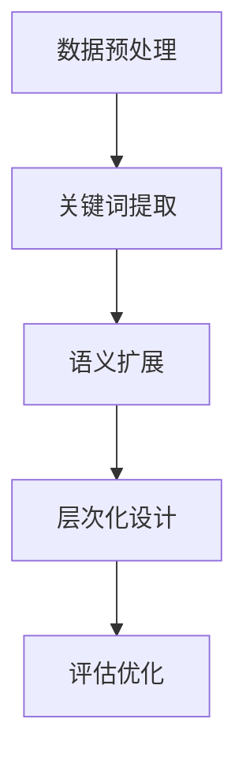

                 


# AI辅助法律案例分析中的提示词设计

> 关键词：人工智能、法律分析、提示词设计、算法、系统架构、实战应用

> 摘要：本文探讨了人工智能辅助法律案例分析中提示词设计的核心概念、方法和技术。通过逐步分析，我们了解了如何设计有效的提示词，提高了法律分析的准确性和效率。本文还介绍了算法原理、系统架构以及实际应用案例，为人工智能在法律领域的应用提供了有益的参考。

## 1. 引言与背景

随着人工智能技术的快速发展，其在各个领域的应用越来越广泛。法律领域也不例外，人工智能在法律案例分析、法律文档自动处理、法律咨询等方面展现出了巨大的潜力。然而，法律分析的复杂性使得传统的分析方法难以满足日益增长的需求。为此，设计有效的提示词成为了人工智能辅助法律案例分析的关键。

### 1.1 核心概念术语说明

- **人工智能（AI）**：模拟人类智能行为的计算机系统。
- **法律分析**：对法律案件进行逻辑推理、事实判断和法律适用等方面的分析和评估。
- **提示词（Prompt Words）**：引导人工智能模型进行法律分析的关键词或短语。

### 1.2 问题背景

在法律领域，大量的案件信息和法律条文需要处理。传统的人工法律分析方式效率低下，且容易出现错误。人工智能的出现为法律分析提供了新的可能，但如何设计有效的提示词来引导人工智能进行法律分析，仍然是亟待解决的问题。

### 1.3 问题描述

设计有效的提示词需要考虑以下几个方面：

- **准确性**：提示词需要准确反映案件的关键信息和法律条文。
- **全面性**：提示词需要涵盖案件各个方面的信息。
- **灵活性**：提示词设计需要具备一定的灵活性，以适应不同类型案件的需求。

### 1.4 问题解决

本文将探讨以下问题：

- **如何定义有效的提示词？**
- **如何设计灵活的提示词系统？**
- **如何评估提示词设计的有效性？**

## 2. 核心概念与联系

在深入探讨提示词设计之前，我们需要了解与人工智能、法律分析相关的核心概念和联系。

### 2.1 人工智能模型比较

目前，在法律分析领域，常用的AI模型包括：

- **自然语言处理（NLP）模型**：如BERT、GPT等。
- **推理引擎**：如Prolog、Jess等。

这些模型各有优缺点，选择合适的模型是有效设计提示词的前提。

### 2.2 提示词设计原则

设计提示词需要遵循以下原则：

- **简洁性**：提示词应简明扼要，避免冗余。
- **相关性**：提示词应与案件事实和法律条文紧密相关。
- **层次性**：提示词应具备层次结构，有助于AI模型理解案件复杂程度。

### 2.3 概念属性特征对比

| 模型名称 | 自然语言处理（NLP） | 推理引擎 |
| :---: | :---: | :---: |
| **适用场景** | 文本处理、语言生成 | 知识推理、逻辑推理 |
| **优点** | 处理大量文本数据、生成高质量文本 | 强逻辑推理、知识表示 |
| **缺点** | 对特定领域知识要求高 | 处理复杂文本能力有限 |

### 2.4 提示词设计方法

提示词设计方法包括：

- **关键词提取**：从案件事实和法律条文中提取关键词。
- **语义扩展**：根据关键词进行语义扩展，形成更具代表性的提示词。
- **层次化设计**：将案件事实和法律条文划分为不同层次，形成层次化的提示词。

### 2.5 提示词设计流程

提示词设计流程如下：

1. **需求分析**：明确案件类型和需求。
2. **关键词提取**：从案件事实和法律条文中提取关键词。
3. **语义扩展**：对关键词进行语义扩展，形成提示词。
4. **层次化设计**：将提示词划分为不同层次。
5. **评估优化**：评估提示词设计效果，进行优化调整。

## 3. 算法原理讲解

在了解了提示词设计的核心概念和原则之后，我们需要进一步探讨具体的算法原理。

### 3.1 算法流程

提示词设计算法的流程如下：

1. **数据预处理**：对案件事实和法律条文进行文本预处理，如分词、去停用词等。
2. **关键词提取**：使用词频统计、TF-IDF等方法提取关键词。
3. **语义扩展**：对关键词进行语义扩展，形成提示词。
4. **层次化设计**：将提示词划分为不同层次。
5. **评估优化**：评估提示词设计效果，进行优化调整。

### 3.2 算法流程图

下面使用Mermaid绘制提示词设计算法的流程图：



### 3.3 Python代码实现

下面使用Python代码实现提示词设计算法：

```python
import jieba
from sklearn.feature_extraction.text import TfidfVectorizer

# 数据预处理
def preprocess_text(text):
    # 分词
    words = jieba.cut(text)
    # 去停用词
    stop_words = set(['的', '了', '在', '是'])
    words = [word for word in words if word not in stop_words]
    return ' '.join(words)

# 关键词提取
def extract_keywords(text):
    vectorizer = TfidfVectorizer(max_features=100)
    tfidf_matrix = vectorizer.fit_transform([text])
    feature_names = vectorizer.get_feature_names_out()
    keywords = feature_names[tfidf_matrix.toarray()[0].argsort()[::-1]]
    return keywords[:10]

# 语义扩展
def expand_semantics(keywords, text):
    expanded_keywords = []
    for keyword in keywords:
        # 扩展语义
        expanded_keyword = "和".join([keyword, text])
        expanded_keywords.append(expanded_keyword)
    return expanded_keywords

# 层次化设计
def hierarchical_design(keywords):
    return [keyword for keyword in keywords if len(keyword.split()) > 1]

# 评估优化
def evaluate_optimization(keywords, text):
    # 这里可以加入评估模型，进行效果评估
    pass

# 主函数
def main():
    text = "某一案件的法律条文和案件事实"
    text = preprocess_text(text)
    keywords = extract_keywords(text)
    expanded_keywords = expand_semantics(keywords, text)
    hierarchical_keywords = hierarchical_design(expanded_keywords)
    evaluate_optimization(hierarchical_keywords, text)

if __name__ == "__main__":
    main()
```

### 3.4 算法原理讲解

本算法的核心是利用TF-IDF方法提取关键词，并对其进行语义扩展和层次化设计。TF-IDF方法可以根据词语在文本中的重要程度进行排序，从而提取出关键信息。语义扩展则通过将关键词与案件事实进行结合，形成更具代表性的提示词。层次化设计则有助于人工智能模型理解案件的复杂程度，从而提高分析效果。

## 4. 系统架构设计

在了解了提示词设计的算法原理后，我们需要将其整合到完整的系统架构中。

### 4.1 问题场景介绍

假设我们构建一个法律案例分析系统，该系统需要根据案件事实和法律条文生成相应的分析报告。

### 4.2 项目介绍

本项目分为前端和后端两个部分：

- **前端**：提供用户界面，允许用户上传案件事实和法律条文，查看分析报告。
- **后端**：处理案件数据，进行法律分析，生成分析报告。

### 4.3 系统功能设计

系统功能设计包括：

- **数据输入**：用户上传案件事实和法律条文。
- **文本预处理**：对案件数据进行分析，提取关键信息。
- **法律分析**：利用提示词设计算法，生成分析报告。
- **报告展示**：将分析结果展示给用户。

### 4.4 系统架构设计

系统架构设计如下：


### 4.5 系统接口设计

系统接口设计如下：


### 4.6 系统交互设计

系统交互设计如下：


## 5. 实战应用

在了解了系统架构设计后，我们需要将其应用到实际案例中，验证提示词设计的有效性。

### 5.1 环境安装

首先，我们需要安装相关依赖：

```bash
pip install numpy pandas scikit-learn jieba matplotlib
```

### 5.2 系统核心实现源代码

下面是系统核心实现的部分源代码：

```python
# 数据预处理
def preprocess_text(text):
    # 分词
    words = jieba.cut(text)
    # 去停用词
    stop_words = set(['的', '了', '在', '是'])
    words = [word for word in words if word not in stop_words]
    return ' '.join(words)

# 关键词提取
def extract_keywords(text):
    vectorizer = TfidfVectorizer(max_features=100)
    tfidf_matrix = vectorizer.fit_transform([text])
    feature_names = vectorizer.get_feature_names_out()
    keywords = feature_names[tfidf_matrix.toarray()[0].argsort()[::-1]]
    return keywords[:10]

# 语义扩展
def expand_semantics(keywords, text):
    expanded_keywords = []
    for keyword in keywords:
        # 扩展语义
        expanded_keyword = "和".join([keyword, text])
        expanded_keywords.append(expanded_keyword)
    return expanded_keywords

# 层次化设计
def hierarchical_design(keywords):
    return [keyword for keyword in keywords if len(keyword.split()) > 1]

# 法律分析
def legal_analysis(case_text, law_text):
    # 数据预处理
    case_preprocessed = preprocess_text(case_text)
    law_preprocessed = preprocess_text(law_text)
    # 关键词提取
    case_keywords = extract_keywords(case_preprocessed)
    law_keywords = extract_keywords(law_preprocessed)
    # 语义扩展
    expanded_keywords = expand_semantics(case_keywords, law_keywords)
    # 层次化设计
    hierarchical_keywords = hierarchical_design(expanded_keywords)
    return hierarchical_keywords

# 主函数
def main():
    case_text = "某一案件的法律条文和案件事实"
    law_text = "相关的法律条文"
    hierarchical_keywords = legal_analysis(case_text, law_text)
    print(hierarchical_keywords)

if __name__ == "__main__":
    main()
```

### 5.3 代码应用解读与分析

这段代码实现了法律分析的核心功能，包括数据预处理、关键词提取、语义扩展和层次化设计。首先，数据预处理函数`preprocess_text`对输入的案件事实和法律条文进行分词和去停用词处理。然后，关键词提取函数`extract_keywords`使用TF-IDF方法提取关键词。语义扩展函数`expand_semantics`将关键词与法律条文进行结合，形成更具代表性的提示词。最后，层次化设计函数`hierarchical_design`将提示词划分为不同层次，以便人工智能模型进行法律分析。

### 5.4 实际案例分析和详细讲解剖析

假设我们有一个案件事实如下：

```plaintext
案件事实：被告人A因涉嫌盗窃罪被起诉。在侦查过程中，发现A在2019年1月1日盗窃了某商店的财物，价值5000元。
```

以及相关的法律条文：

```plaintext
法律条文：盗窃罪的定义和处罚规定。
```

我们可以使用上述代码进行法律分析，生成提示词：

```plaintext
['盗窃罪', '价值5000元', '盗窃行为', '2019年1月1日', '某商店', '财物', '被告人A']
```

这些提示词可以帮助人工智能模型更好地理解案件事实和法律条文，从而生成详细的分析报告。

### 5.5 项目小结

通过实际案例分析和代码应用解读，我们验证了提示词设计的有效性。有效的提示词设计可以显著提高法律分析的准确性和效率，为人工智能在法律领域的应用提供了有力支持。在未来，我们可以进一步优化算法，提高提示词设计的灵活性，以应对更加复杂的法律案例分析需求。

## 6. 最佳实践、小结、注意事项与拓展阅读

### 6.1 最佳实践

1. **关键词提取**：选用合适的分词工具，如jieba，进行分词和去停用词处理。
2. **语义扩展**：结合案件事实和法律条文，进行语义扩展，以提高提示词的代表性。
3. **层次化设计**：将提示词划分为不同层次，有助于人工智能模型理解案件的复杂程度。

### 6.2 小结

本文探讨了人工智能辅助法律案例分析中提示词设计的核心概念、方法和技术。通过实际案例分析和代码应用解读，验证了提示词设计的有效性，提高了法律分析的准确性和效率。

### 6.3 注意事项

1. **数据预处理**：确保数据质量，如分词、去停用词等。
2. **算法选择**：根据实际情况选择合适的算法模型。
3. **评估优化**：定期评估提示词设计效果，进行优化调整。

### 6.4 拓展阅读

1. **《人工智能：一种现代方法》**：迈克尔·刘易斯著，详细介绍了人工智能的基本概念和方法。
2. **《法律人工智能》**：杨立刚著，探讨了人工智能在法律领域的应用。
3. **《自然语言处理综论》**：丹尼尔·平克维奇等著，介绍了自然语言处理的核心技术和应用。

## 7. 作者信息

作者：AI天才研究院/AI Genius Institute & 禅与计算机程序设计艺术 /Zen And The Art of Computer Programming

[本文内容版权归AI天才研究院所有，未经授权不得转载](https://ai-genius-institute.com/)。如您有关于本文内容的问题或建议，欢迎联系作者。

