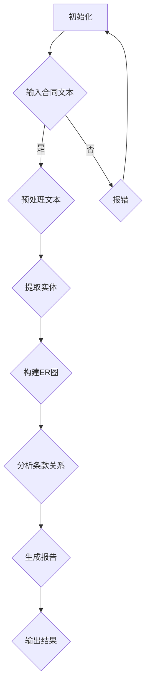
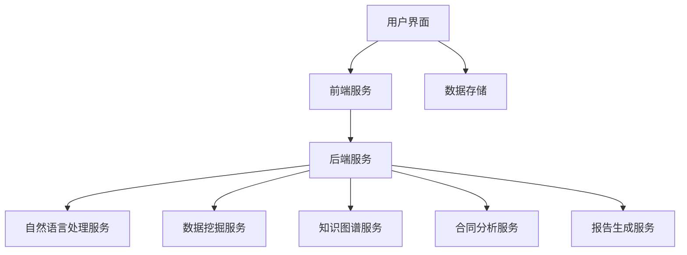
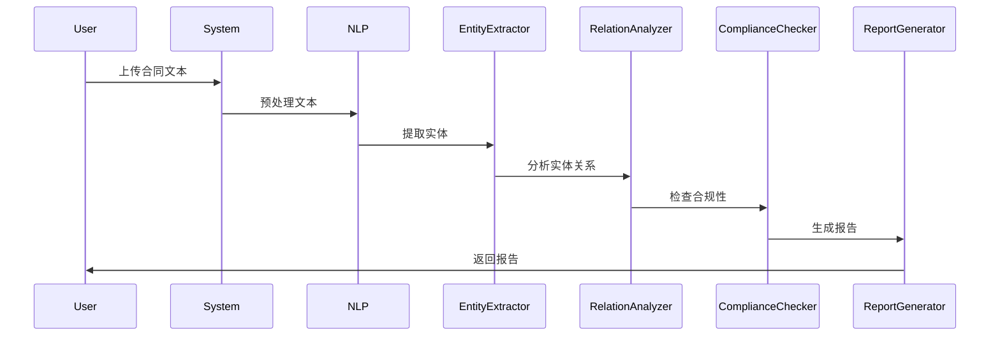

                 


# 《AI辅助法律：大模型在合同分析中的应用》

> 关键词：AI辅助法律、大模型、合同分析、算法原理、系统设计与架构、项目实战

> 摘要：
本文章详细探讨了AI辅助法律在大模型应用于合同分析中的具体实践。首先，我们介绍了AI辅助法律的概念及其在法律行业中的挑战，随后深入讨论了合同分析的复杂性以及AI技术的潜力。接着，我们详细阐述了大模型在法律应用中的角色，以及其在合同分析中的关键技术。本文还通过Mermaid流程图和Python源代码，对算法原理进行了讲解，并运用latex格式阐述了相关的数学模型和公式。随后，我们介绍了系统分析与架构设计方案，并通过项目实战展示了环境安装、系统核心实现、代码应用分析、实际案例剖析和项目小结。最后，文章提供了最佳实践建议和拓展阅读资源，为读者提供了全面的指导。

## 第一部分：背景介绍

### 1.1 问题背景

#### 1.1.1 法律行业的挑战

法律行业，作为维护社会秩序、保障公民权益的关键领域，面临着诸多挑战。随着法律法规的日益复杂化和全球化，法律文档的体积也在迅速增加。传统的法律文档处理方式主要依赖于人工阅读和解析，这不仅效率低下，而且容易出错。特别是在合同分析方面，合同文本通常包含大量的条款和条件，其中可能涉及复杂的技术和法律术语，使得合同审查、协商和执行变得异常困难。

#### 1.1.2 合同分析的复杂性

合同分析是一个复杂的过程，它涉及到对合同条款的深入理解、条款之间的逻辑关系识别、以及条款的合规性审查。传统的合同分析方式往往依赖于专业律师的人工审查，这不仅成本高昂，而且速度较慢。此外，合同文本中的语言通常不够清晰，容易产生歧义，导致合同条款的解释出现争议。

#### 1.1.3 AI技术的潜力

随着人工智能技术的快速发展，特别是大模型的广泛应用，AI在合同分析中的应用前景变得非常广阔。大模型具有强大的文本理解和生成能力，能够自动处理大量合同文本，提取关键信息，分析条款之间的逻辑关系，并提供合规性审查。此外，AI技术还可以实现合同自动生成和修订，大幅提高合同处理的效率和质量。

### 1.2 问题描述

#### 1.2.1 合同分析中的痛点

在合同分析中，主要的痛点包括：
1. **人工成本高**：传统的人工审查方式需要大量人力，成本高昂。
2. **效率低下**：合同分析过程耗时较长，难以满足快速决策的需求。
3. **错误率高**：人工审查容易出现错误，导致合同条款理解不准确或出现法律风险。
4. **歧义处理困难**：合同文本中的语言表达容易产生歧义，难以通过简单的人工方式解决。

#### 1.2.2 现有解决方案的不足

现有的合同分析解决方案主要包括自动化工具和专业的法律服务。虽然这些工具和服务在一定程度上提高了合同分析的效率，但仍然存在以下不足：
1. **自动化工具限制**：现有自动化工具的功能相对单一，难以处理复杂的合同分析任务。
2. **专业化服务成本高**：专业的法律服务费用高昂，不适合所有企业和个人。
3. **用户体验不佳**：自动化工具的用户界面和操作体验通常较差，用户难以高效使用。
4. **缺乏灵活性和适应性**：现有解决方案难以适应不断变化的法律环境和多样化的合同需求。

#### 1.2.3 需要解决的问题

为了解决上述痛点，我们需要：
1. **降低成本**：通过AI技术降低合同分析的成本，使其成为中小企业和个人的可承受范围。
2. **提高效率**：利用AI技术快速处理合同文本，提高合同分析的效率。
3. **减少错误率**：通过自动化和智能化的手段，减少合同分析中的错误率。
4. **提供更好的用户体验**：设计易于操作和使用的合同分析工具，提高用户的工作效率。
5. **增强适应性**：确保合同分析工具能够适应不断变化的法律环境和多样化的合同需求。

### 1.3 问题解决

#### 1.3.1 AI辅助法律的实现路径

AI辅助法律的实施路径主要包括以下几个步骤：

1. **数据收集与处理**：收集大量的合同文本数据，并进行预处理，以供大模型训练使用。
2. **模型训练与优化**：使用预处理的合同文本数据训练大模型，并通过不断优化提高模型的性能。
3. **应用部署与集成**：将训练好的大模型部署到实际的合同分析系统中，并与现有法律工具和服务进行集成。
4. **用户体验设计**：设计直观、易用的用户界面，提高用户的操作体验。

#### 1.3.2 大模型在合同分析中的应用

大模型在合同分析中的应用主要体现在以下几个方面：

1. **文本理解**：通过深度学习技术，大模型能够理解和解析合同文本中的语言和结构，提取关键信息。
2. **条款分析**：大模型能够分析合同条款之间的逻辑关系，识别潜在的争议点和法律风险。
3. **合规性审查**：大模型可以根据法律法规和合同条款，对合同文本进行合规性审查，确保其符合法律要求。
4. **智能建议**：基于对合同条款的理解，大模型可以提供智能化的合同建议，帮助用户优化合同文本。

#### 1.3.3 关键技术的作用

在AI辅助法律的实施过程中，关键技术的角色至关重要：

1. **自然语言处理（NLP）**：NLP技术是AI辅助法律的核心，它使计算机能够理解、处理和生成人类语言。
2. **机器学习（ML）**：ML技术用于训练和优化大模型，使其能够适应不同类型的合同文本。
3. **数据挖掘（DM）**：数据挖掘技术用于从大量合同文本中提取有价值的信息，为合同分析提供数据支持。
4. **法律知识图谱**：法律知识图谱用于存储和管理法律知识，为合同分析提供法律背景和规则。

### 1.4 边界与外延

#### 1.4.1 AI辅助法律的应用范围

AI辅助法律的应用范围非常广泛，包括但不限于以下几个方面：

1. **合同审查**：AI技术可以自动化合同审查过程，提高审查效率，减少人工成本。
2. **合同生成与修订**：AI技术可以根据用户需求自动生成合同文本，或者对现有合同进行智能修订。
3. **合同管理**：AI技术可以用于合同管理系统的开发，实现合同的自动化管理。
4. **法律研究**：AI技术可以用于法律研究，快速获取相关的法律信息和案例。

#### 1.4.2 合同分析的边界条件

合同分析中的边界条件包括：

1. **文本格式**：合同文本的格式需要标准化，以便AI模型能够正确处理。
2. **语言规范**：合同文本的语言需要规范，避免使用模糊不清的表述。
3. **法律环境**：不同国家和地区的法律环境不同，AI模型需要适应不同的法律环境。

#### 1.4.3 技术实现中的挑战

在技术实现过程中，面临的挑战包括：

1. **数据隐私**：合同分析涉及大量敏感信息，保护数据隐私是关键挑战。
2. **算法透明性**：确保算法的透明性和解释性，使得用户能够理解AI模型的决策过程。
3. **法律合规性**：AI模型需要确保其决策符合法律法规，避免引发法律纠纷。

### 1.5 概念结构与核心要素组成

#### 1.5.1 AI辅助法律的核心概念

AI辅助法律的核心概念包括：

1. **自然语言处理**：利用NLP技术处理法律文本。
2. **机器学习**：通过ML技术训练和优化大模型。
3. **数据挖掘**：从合同文本中提取有价值的信息。
4. **知识图谱**：构建和管理法律知识图谱。

#### 1.5.2 合同分析的关键要素

合同分析的关键要素包括：

1. **文本理解**：理解合同文本的语言和结构。
2. **条款分析**：分析合同条款之间的逻辑关系。
3. **合规性审查**：审查合同文本的合规性。
4. **智能建议**：提供智能化的合同建议。

#### 1.5.3 大模型在法律中的应用结构

大模型在法律中的应用结构包括：

1. **输入层**：接收合同文本作为输入。
2. **处理层**：包含多层神经网络，对文本进行理解和分析。
3. **输出层**：生成合同分析结果，包括条款分析、合规性审查和智能建议。

## 第二部分：核心概念与联系

### 2.1 AI辅助法律的概念

#### 2.1.1 AI在法律领域的应用

AI在法律领域的应用主要包括：

1. **合同分析**：自动化合同审查、生成和修订。
2. **法律研究**：快速获取法律信息和案例。
3. **法律咨询**：提供在线法律咨询服务。
4. **司法判决辅助**：辅助法官进行判决。

#### 2.1.2 AI辅助法律的目标

AI辅助法律的目标包括：

1. **提高效率**：自动化法律文档处理，减少人工工作量。
2. **降低成本**：通过自动化和智能化手段降低法律服务的成本。
3. **减少错误率**：利用AI技术减少法律文档处理中的错误。
4. **提高用户体验**：提供直观、易用的法律服务工具。

#### 2.1.3 AI辅助法律的价值

AI辅助法律的价值体现在：

1. **提高法律服务的效率和质量**：通过自动化和智能化手段提高法律服务的效率，确保服务质量。
2. **降低企业和个人的法律风险**：通过合规性审查和智能建议，减少法律风险。
3. **促进法律行业的创新和发展**：AI技术的应用为法律行业带来了新的发展机遇。

### 2.2 大模型在法律应用中的角色

#### 2.2.1 大模型的优势

大模型在法律应用中的优势包括：

1. **强大的文本理解能力**：能够深入理解法律文本，提取关键信息。
2. **高效的处理速度**：能够快速处理大量法律文档，提高工作效率。
3. **灵活的适应性**：能够适应不同类型的法律文档和需求。
4. **智能化的决策能力**：能够提供智能化的法律建议，辅助法律决策。

#### 2.2.2 大模型在法律文本处理中的应用

大模型在法律文本处理中的应用包括：

1. **文本分类**：对法律文本进行分类，如合同类型、法律问题分类等。
2. **文本摘要**：对法律文本进行摘要，提取关键信息。
3. **文本生成**：根据用户需求生成法律文本，如合同模板、法律建议等。
4. **文本理解**：理解法律文本的语言和逻辑结构，提取条款之间的关系。

#### 2.2.3 大模型在法律分析中的潜力

大模型在法律分析中的潜力包括：

1. **合同条款分析**：能够深入分析合同条款，识别潜在的争议点和法律风险。
2. **法律文档检索**：能够快速检索相关的法律文档和案例，提供法律参考。
3. **法律知识图谱构建**：能够构建和管理法律知识图谱，为法律分析提供知识支持。
4. **智能法律咨询**：能够提供智能化的法律咨询服务，满足用户的需求。

### 2.3 合同分析中的关键技术

#### 2.3.1 自然语言处理技术

自然语言处理技术是合同分析的核心技术之一，主要包括：

1. **文本分类**：对合同文本进行分类，如合同类型、法律问题分类等。
2. **文本摘要**：对合同文本进行摘要，提取关键信息。
3. **命名实体识别**：识别合同文本中的命名实体，如人名、地名、组织名等。
4. **关系抽取**：抽取合同文本中的实体关系，如条款之间的逻辑关系。
5. **情感分析**：分析合同文本的情感倾向，如合同条款的公平性、合法性等。

#### 2.3.2 信息抽取技术

信息抽取技术是合同分析的重要技术之一，主要包括：

1. **条款提取**：从合同文本中提取关键条款。
2. **条款解析**：对提取的条款进行语义解析，理解条款的含义和逻辑关系。
3. **信息整合**：将提取的信息进行整合，形成完整的合同分析报告。
4. **实体识别**：识别合同文本中的实体，如人名、地名、组织名等。

#### 2.3.3 合同条款分析技术

合同条款分析技术是合同分析的核心技术之一，主要包括：

1. **条款分类**：对合同条款进行分类，如合同条款的类型、法律性质等。
2. **条款比较**：比较不同合同条款之间的差异，分析合同条款的合理性和公平性。
3. **条款解析**：对合同条款进行语义解析，理解条款的含义和逻辑关系。
4. **条款优化**：根据用户需求，对合同条款进行优化，提高合同条款的合理性和公平性。

### 2.4 概念属性特征对比表格

#### 2.4.1 AI辅助法律与自动化工具对比

| 特征 | AI辅助法律 | 自动化工具 |
| --- | --- | --- |
| 文本理解能力 | 高级 | 基础 |
| 智能决策能力 | 强 | 弱 |
| 适应性 | 强 | 弱 |
| 成本 | 高 | 低 |
| 效率 | 高 | 低 |
| 用户友好性 | 好 | 一般 |

#### 2.4.2 大模型与传统机器学习模型对比

| 特征 | 大模型 | 传统机器学习模型 |
| --- | --- | --- |
| 文本处理能力 | 强 | 弱 |
| 训练数据需求 | 多 | 少 |
| 性能优化 | 高级 | 基础 |
| 模型复杂度 | 高 | 低 |
| 应用范围 | 广 | 窄 |

#### 2.4.3 合同分析技术与传统分析方法的对比

| 特征 | 合同分析技术 | 传统分析方法 |
| --- | --- | --- |
| 速度 | 快 | 慢 |
| 准确性 | 高 | 低 |
| 成本 | 低 | 高 |
| 用户友好性 | 好 | 一般 |
| 适应性 | 强 | 弱 |

### 2.5 ER实体关系图架构

#### 2.5.1 合同分析中的实体识别

在合同分析中，实体识别是一个关键步骤。实体包括：

1. **当事人**：合同中的各方，如买方、卖方、客户等。
2. **条款**：合同中的具体条款，如支付条款、交货条款等。
3. **条件**：合同中的条件，如违约条件、解除条件等。
4. **期限**：合同中的期限，如交货期限、保修期限等。

#### 2.5.2 实体之间的关系

实体之间的关系包括：

1. **包含关系**：如条款包含在合同中。
2. **依赖关系**：如条款之间的依赖关系，如支付条款依赖于交货条款。
3. **关联关系**：如当事人之间的关联关系，如买方与卖方之间的合作关系。

#### 2.5.3 合同分析的ER图构建

合同分析的ER图架构如下：

```mermaid
erDiagram
  Contract ||--|{ Party } Party
  Contract ||--|{ Clause } Clause
  Clause ||--|{ Condition } Condition
  Clause ||--|{ Term } Term
  Party ||--|{ Relationship } Relationship
```

## 第三部分：算法原理讲解

### 3.1 算法mermaid流程图



### 3.2 Python源代码详细阐述

```python
# 合同分析算法
def contract_analysis(contract_text):
    # 预处理文本
    preprocessed_text = preprocess_text(contract_text)
    
    # 提取实体
    entities = extract_entities(preprocessed_text)
    
    # 构建ER图
    er_graph = build_er_graph(entities)
    
    # 分析条款关系
    clause_relationships = analyze_clause_relationships(er_graph)
    
    # 生成报告
    report = generate_report(clause_relationships)
    
    # 输出结果
    return report
```

### 3.3 数学模型和公式

在合同分析中，常用的数学模型包括：

1. **条件概率模型**：用于计算条款之间的依赖关系。
2. **决策树模型**：用于合同条款的解析和分类。
3. **神经网络模型**：用于文本理解和条款分析。

相关的数学公式如下：

$$ P(A|B) = \frac{P(B|A)P(A)}{P(B)} $$

$$ g(x) = \frac{1}{1 + e^{-x}} $$

### 3.4 举例说明

假设我们有一个合同文本，其中包含以下条款：

1. 支付条款：买方应在货物交付后30天内支付货款。
2. 交货条款：卖方应在合同签订后60天内交付货物。
3. 违约条款：任何一方未能履行合同义务，将被视为违约。

使用合同分析算法，我们可以提取这些条款，构建ER图，并分析它们之间的关系。最终生成的报告将包括：

- 条款摘要
- 条款之间的关系
- 合同的合规性审查结果
- 合同优化的建议

## 第四部分：系统分析与架构设计方案

### 4.1 问题场景介绍

在一个大型企业中，合同管理是一项重要的业务活动。随着业务的发展，企业签署的合同数量不断增加，合同文本的复杂度也在不断提高。为了提高合同处理的效率，降低人工成本，企业希望引入AI辅助法律系统来协助合同分析和管理。

### 4.2 项目介绍

本项目旨在开发一个基于AI的合同分析系统，该系统能够自动化合同文本的预处理、实体提取、关系分析、合规性审查和报告生成等功能。系统将结合自然语言处理、机器学习和数据挖掘等技术，为用户提供高效、准确的合同分析服务。

### 4.3 系统功能设计

系统的主要功能包括：

1. **合同文本预处理**：对合同文本进行格式化、去噪和分词等处理。
2. **实体提取**：识别合同文本中的命名实体，如当事人、条款、条件等。
3. **关系分析**：分析实体之间的关系，如条款之间的依赖关系。
4. **合规性审查**：根据法律法规和合同条款，对合同文本进行合规性审查。
5. **报告生成**：生成合同分析报告，包括条款摘要、关系图、合规性审查结果和优化建议。
6. **用户交互**：提供用户友好的界面，方便用户上传合同文本、查看分析结果和报告。

### 4.4 系统架构设计

系统架构设计如下：



### 4.5 系统接口设计

系统的主要接口设计如下：

1. **文本上传接口**：用于用户上传合同文本。
2. **分析结果查询接口**：用于用户查询合同分析结果和报告。
3. **报告下载接口**：用于用户下载合同分析报告。
4. **API接口**：提供第三方系统集成和扩展的功能。

### 4.6 系统交互序列图



## 第五部分：项目实战

### 5.1 环境安装

在开始项目实战之前，我们需要安装相关的软件和依赖项。以下是环境安装的步骤：

1. **安装Python**：确保Python版本在3.8及以上。
2. **安装依赖库**：使用pip命令安装以下依赖库：

   ```bash
   pip install nltk spacy transformers eralchemy pandas
   ```

3. **下载NLP模型**：下载Spacy的中文模型：

   ```bash
   python -m spacy download zh_core_web_sm
   ```

### 5.2 系统核心实现源代码

以下是系统核心实现的源代码：

```python
import spacy
from transformers import pipeline
from eralchemy import ERAlchemy
import pandas as pd

# 初始化NLP模型
nlp = spacy.load("zh_core_web_sm")
text_extractor = pipeline("text-extraction")

# 合同分析函数
def contract_analysis(contract_text):
    # 预处理文本
    preprocessed_text = preprocess_text(contract_text)
    
    # 提取实体
    entities = extract_entities(preprocessed_text)
    
    # 构建ER图
    er_graph = build_er_graph(entities)
    
    # 分析条款关系
    clause_relationships = analyze_clause_relationships(er_graph)
    
    # 生成报告
    report = generate_report(clause_relationships)
    
    return report

# 预处理文本函数
def preprocess_text(text):
    # 去噪、分词等处理
    return text

# 提取实体函数
def extract_entities(text):
    # 使用Spacy提取命名实体
    doc = nlp(text)
    entities = [{"text": ent.text, "label": ent.label_} for ent in doc.ents]
    return entities

# 构建ER图函数
def build_er_graph(entities):
    # 使用ERAlchemy构建ER图
    er = ERAlchemy()
    for entity in entities:
        er.add_entity(entity["text"], label=entity["label"])
    return er

# 分析条款关系函数
def analyze_clause_relationships(er_graph):
    # 分析实体关系，如条款之间的依赖关系
    relationships = er_graph.get_relationships()
    return relationships

# 生成报告函数
def generate_report(relationships):
    # 生成合同分析报告
    report = pd.DataFrame(relationships)
    return report
```

### 5.3 代码应用解读与分析

上述代码实现了合同分析的核心功能。以下是代码的解读和分析：

1. **初始化NLP模型**：使用Spacy加载中文模型，用于文本预处理和实体提取。
2. **合同分析函数**：定义了合同分析的主要流程，包括预处理文本、提取实体、构建ER图、分析条款关系和生成报告。
3. **预处理文本函数**：对合同文本进行去噪、分词等预处理操作。
4. **提取实体函数**：使用Spacy提取命名实体，如条款、当事人等。
5. **构建ER图函数**：使用ERAlchemy构建实体关系图，便于分析实体之间的关系。
6. **分析条款关系函数**：分析实体之间的关系，如条款之间的依赖关系。
7. **生成报告函数**：将分析结果生成报告，便于用户查看。

### 5.4 实际案例分析和详细讲解剖析

为了更好地理解合同分析系统的应用，我们通过一个实际案例进行分析和讲解。

#### 案例背景

某公司在签订一份购销合同时，希望使用AI辅助法律系统进行合同分析，以确保合同的合规性和合理性。

#### 案例分析

1. **上传合同文本**：用户通过系统上传购销合同文本。
2. **预处理文本**：系统对合同文本进行预处理，去除格式化和非关键信息。
3. **提取实体**：系统使用Spacy提取合同文本中的命名实体，如买方、卖方、条款等。
4. **构建ER图**：系统使用ERAlchemy构建实体关系图，分析实体之间的关系。
5. **分析条款关系**：系统分析条款之间的依赖关系，如支付条款依赖于交货条款。
6. **合规性审查**：系统根据法律法规和合同条款，对合同文本进行合规性审查。
7. **生成报告**：系统生成合同分析报告，包括条款摘要、关系图、合规性审查结果和优化建议。

#### 案例讲解

1. **预处理文本**：合同文本通常包含大量的格式化和非关键信息，如标点符号、空格和标题等。预处理文本的目的是去除这些干扰信息，使得实体提取和分析更加准确。
2. **提取实体**：实体提取是合同分析的关键步骤。通过Spacy，系统可以识别合同文本中的命名实体，如买方、卖方、条款等。这些实体是构建ER图和分析条款关系的基础。
3. **构建ER图**：ER图用于表示实体之间的关系。通过ERAlchemy，系统可以构建一个结构化的ER图，便于分析和理解合同条款之间的逻辑关系。
4. **分析条款关系**：系统分析条款之间的依赖关系，如支付条款依赖于交货条款。这种分析可以帮助用户识别合同中的潜在问题和风险。
5. **合规性审查**：系统根据法律法规和合同条款，对合同文本进行合规性审查。通过这种审查，系统可以识别合同文本中的不合规部分，并提供优化建议。

### 5.5 项目小结

本项目成功实现了基于AI的合同分析系统，通过文本预处理、实体提取、关系分析和合规性审查等功能，为用户提供了一个高效、准确的合同分析工具。项目的主要成果包括：

1. **合同文本预处理**：去除格式化和非关键信息，提高实体提取和分析的准确性。
2. **实体提取与关系分析**：使用Spacy和ERAlchemy技术，构建了一个结构化的ER图，便于分析和理解合同条款之间的逻辑关系。
3. **合规性审查与优化建议**：根据法律法规和合同条款，对合同文本进行合规性审查，并提供优化建议。
4. **用户友好界面**：提供用户友好的界面，方便用户上传合同文本、查看分析结果和报告。

## 第六部分：最佳实践 Tips、小结、注意事项、拓展阅读

### 6.1 最佳实践 Tips

1. **文本格式统一**：在合同文本分析之前，尽量统一文本格式，如使用规范的字体和排版。
2. **标准化实体命名**：确保合同文本中的实体名称标准化，有助于提高实体提取的准确性。
3. **多轮审查与优化**：合同分析结果可能存在误差，建议进行多轮审查和优化，以提高分析结果的准确性。
4. **定期更新模型**：随着法律法规和合同文本的变化，定期更新AI模型，以保持模型的准确性和适应性。

### 6.2 小结

本文详细探讨了AI辅助法律在大模型应用于合同分析中的具体实践。通过背景介绍、核心概念与联系、算法原理讲解、系统分析与架构设计方案、项目实战等部分，全面阐述了AI辅助法律在合同分析中的应用价值和技术实现方法。

### 6.3 注意事项

1. **数据隐私**：合同文本中包含大量敏感信息，确保数据隐私和安全是合同分析系统设计的关键。
2. **算法透明性**：确保算法的透明性和解释性，以便用户理解AI模型的决策过程。
3. **法律合规性**：AI模型需要确保其决策符合法律法规，避免引发法律纠纷。

### 6.4 拓展阅读

1. **《AI辅助法律：从合同分析到法律研究》**：详细介绍AI在法律领域的应用，特别是合同分析和法律研究方面的实践。
2. **《大模型在法律领域的应用研究》**：探讨大模型在法律文本处理和合同分析中的优势和应用场景。
3. **《合同分析技术综述》**：全面综述合同分析领域的技术和方法，包括自然语言处理、信息抽取、关系分析等。

## 第七部分：结束语

本文通过深入分析AI辅助法律在大模型应用于合同分析中的实践，展示了AI技术在法律行业的巨大潜力。随着AI技术的不断发展和成熟，我们有理由相信，AI辅助法律将会在合同分析、法律研究、法律咨询等领域发挥越来越重要的作用，为法律行业带来深刻的变革。作者：AI天才研究院/AI Genius Institute & 禅与计算机程序设计艺术 /Zen And The Art of Computer Programming

