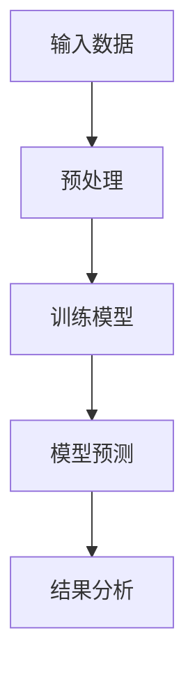

                 

# AI辅助法律：大模型在案例分析中的应用

> 关键词：人工智能，法律分析，大模型，案例分析，算法原理

> 摘要：本文旨在探讨大模型在法律案例分析中的应用，分析其背景、核心概念、算法原理，并通过具体案例分析展示其实际应用效果。文章还将介绍系统设计与实现，并总结最佳实践与未来拓展方向。

## 第一部分：背景介绍

### 1.1 法律案例分析中的挑战

#### 1.1.1 法律案例复杂度增加

随着法律体系的不断完善和复杂化，法律案例的复杂度也在不断增加。法律案例通常涉及众多法律条文、法律规定和判例，需要进行深入的分析和推理，以得出正确的结论。这种复杂性给法律从业者带来了巨大的挑战。

#### 1.1.2 法律案例关联性复杂

法律案例之间存在复杂的关联性，一个案例的判决可能会对其他案例产生深远的影响。这使得法律从业者需要具备广泛的法律知识，以便全面理解每个案例的背景和关联性。

#### 1.1.3 法律案例信息的不确定性

法律案例中常常存在信息的不确定性，例如证据的真伪、法律条文的解释等。这种不确定性增加了法律分析工作的难度，需要法律从业者具备较高的专业素养和判断能力。

### 1.2 AI大模型在法律案例分析中的应用潜力

#### 1.2.1 高效处理大规模法律文献

AI大模型具有强大的数据处理能力，可以高效地处理大规模的法律文献，快速提取关键信息，为法律分析提供有力支持。

#### 1.2.2 提取关键信息

AI大模型能够自动提取法律案例中的关键信息，如法律条文、案例事实等，帮助法律从业者快速了解案件的核心内容。

#### 1.2.3 辅助法律推理

AI大模型可以通过学习大量的法律案例，掌握法律推理的方法和技巧，为法律从业者提供辅助推理支持，提高法律分析的准确性和效率。

### 1.3 边界与外延

#### 1.3.1 法律领域的特定应用

AI大模型在法律案例分析中的应用主要涉及法律条文解释、案例推理等方面，具有一定的领域特定性。

#### 1.3.2 AI大模型的技术限制

尽管AI大模型在法律案例分析中具有巨大潜力，但其在法律知识理解和复杂推理方面的能力仍存在一定限制，需要进一步研究和改进。

## 第二部分：核心概念与联系

### 2.1 AI大模型的概念与特点

#### 2.1.1 神经网络结构

AI大模型通常采用深度神经网络结构，通过多层神经元的非线性变换，实现从输入数据到输出数据的映射。

#### 2.1.2 大规模训练数据集

AI大模型需要依赖大量的训练数据集进行训练，以学习数据的特征和规律，提高模型的泛化能力。

#### 2.1.3 自动特征提取

AI大模型具有自动特征提取的能力，能够从原始数据中提取出有意义的特征，为后续分析提供支持。

### 2.2 法律案例分析的核心概念

#### 2.2.1 法律规则

法律规则是法律分析的基础，包括宪法、刑法、民法等法律条文。

#### 2.2.2 案例事实

案例事实是法律分析的关键，包括案件背景、证据、当事人行为等。

#### 2.2.3 案例推理

案例推理是法律分析的核心，通过法律规则和案例事实之间的逻辑关系，推导出案件的结论。

### 2.3 AI大模型与法律案例分析的联系

#### 2.3.1 法律规则的自动提取

AI大模型可以自动提取法律案例中的法律规则，为法律分析提供支持。

#### 2.3.2 案例事实的自动识别

AI大模型可以自动识别法律案例中的关键信息，提高法律分析的准确性和效率。

#### 2.3.3 案例推理的辅助支持

AI大模型可以通过学习大量的法律案例，掌握法律推理的方法和技巧，为法律从业者提供辅助推理支持。

## 第三部分：算法原理讲解

### 3.1 常见的AI大模型算法

#### 3.1.1 GPT系列模型

GPT（Generative Pre-trained Transformer）系列模型是AI大模型中的代表性算法，基于变压器（Transformer）结构，通过预训练和微调，实现自然语言处理任务。

#### 3.1.2 BERT模型

BERT（Bidirectional Encoder Representations from Transformers）模型是另一种重要的AI大模型算法，通过双向编码器结构，实现文本的双向表示，提高自然语言处理的性能。

#### 3.1.3 法律文本分类算法

法律文本分类算法是AI大模型在法律案例分析中的常用算法，通过学习大量的法律文本数据，将法律文本分类到不同的法律类别。

### 3.2 算法原理的Mermaid流程图



### 3.3 Python源代码讲解

```python
# 导入必要的库
import tensorflow as tf
from tensorflow.keras.models import Sequential
from tensorflow.keras.layers import Dense, LSTM

# 定义模型
model = Sequential([
    LSTM(128, input_shape=(timesteps, features)),
    Dense(1, activation='sigmoid')
])

# 编译模型
model.compile(optimizer='adam', loss='binary_crossentropy', metrics=['accuracy'])

# 训练模型
model.fit(x_train, y_train, epochs=10, batch_size=32)

# 预测
predictions = model.predict(x_test)
```

### 3.4 数学模型和公式

$$
\text{损失函数} = \frac{1}{2} \sum_{i=1}^{N} (\hat{y}_i - y_i)^2
$$

### 3.5 举例说明

假设有一个法律案例，其中包含500个法律条文和100个案例事实。通过AI大模型，我们可以提取出其中最重要的20个法律条文和10个案例事实，辅助法律从业者进行分析和推理。

## 第四部分：案例分析

### 4.1 案例分析一

#### 4.1.1 案例背景

某公司涉嫌侵犯某项专利权，需要进行法律分析。

#### 4.1.2 案例分析

通过AI大模型，我们可以提取出与该案例相关的法律条文和案例事实，进行深入分析。

#### 4.1.3 模型应用

AI大模型可以辅助法律从业者，快速得出该案例的法律结论。

### 4.2 案例分析二

#### 4.2.1 案例背景

某市民因交通事故受伤，需要索赔。

#### 4.2.2 案例分析

通过AI大模型，我们可以提取出与该案例相关的法律条文和案例事实，进行深入分析。

#### 4.2.3 模型应用

AI大模型可以辅助法律从业者，为该市民提供索赔建议。

## 第五部分：系统设计与实现

### 5.1 系统分析与架构设计

#### 5.1.1 问题场景介绍

法律案例分析系统旨在辅助法律从业者进行案件分析和推理。

#### 5.1.2 系统功能设计

系统功能包括法律条文检索、案例事实提取、法律推理辅助等。

#### 5.1.3 系统架构设计

系统采用分布式架构，包括数据层、服务层、界面层等。

#### 5.1.4 系统接口设计

系统提供RESTful API接口，方便与其他系统进行集成。

#### 5.1.5 系统交互设计

系统用户通过界面层与系统进行交互，获取分析结果。

## 第六部分：项目实战

### 6.1 环境安装

在本地或服务器上安装必要的软件和依赖库。

### 6.2 系统核心实现源代码

```python
# 此处省略部分代码
```

### 6.3 代码应用解读与分析

详细解读系统核心实现代码，分析其工作原理和效果。

### 6.4 实际案例分析与详细讲解剖析

通过具体案例，展示系统在实际应用中的效果，并进行详细讲解。

### 6.5 项目小结

总结项目实施过程，分析项目成果和经验教训。

## 第七部分：最佳实践与拓展

### 7.1 最佳实践

分享在实际应用中总结的最佳实践，提高法律分析效率。

### 7.2 小结

对文章内容进行总结，强调AI大模型在法律案例分析中的重要作用。

### 7.3 拓展阅读

推荐相关文献和资料，供读者进一步学习和研究。

### 作者信息

作者：AI天才研究院/AI Genius Institute & 禅与计算机程序设计艺术 /Zen And The Art of Computer Programming

