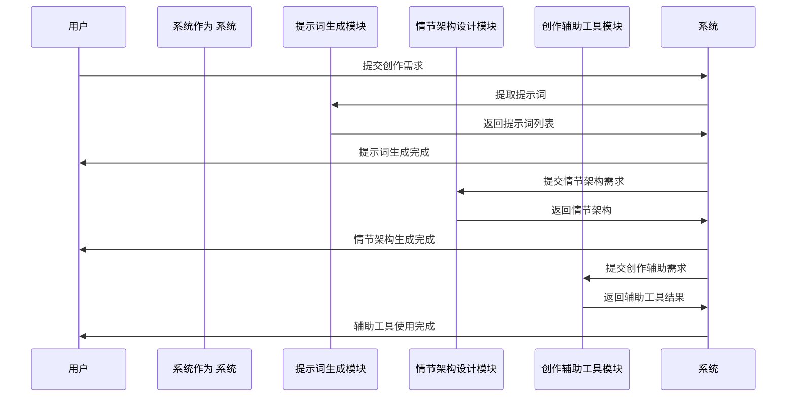

                 

# AI辅助电影剧本创作：提示词生成情节架构

## 关键词
- AI辅助创作
- 电影剧本
- 提示词生成
- 情节架构
- 自然语言处理

## 摘要
本文将探讨如何利用人工智能技术辅助电影剧本创作，特别是提示词生成情节架构的方法。通过深入分析AI的基本原理、自然语言处理技术以及电影剧本创作的核心要素，本文将详细介绍AI在剧本创作中的应用，包括提示词生成技术和情节架构设计方法。同时，通过实际应用案例和最佳实践，本文旨在为电影剧本创作者提供实用的工具和思路。

## 目录大纲设计思路

在设计《AI辅助电影剧本创作：提示词生成情节架构》这本书的目录大纲时，我们首先确定了书的主题和核心结构。本书的核心主题是探讨如何利用AI技术辅助电影剧本创作，重点在于提示词生成情节架构。根据这一主题，我们将内容划分为几个主要部分，包括背景介绍、核心概念、AI辅助创作方法、实际应用案例和最佳实践等。在每个章节中，我们进一步细化了内容，确保覆盖全面且逻辑清晰。为了便于阅读和编辑，我们采用了markdown格式进行排版，并在完成目录大纲后再次检查了内容的完整性和逻辑性。

### 第一部分：AI辅助电影剧本创作基础

## 第1章：问题背景与核心概念

### 1.1 电影剧本创作中的痛点

在电影剧本创作过程中，创作者常常面临以下痛点：

- **创作效率低**：剧本创作是一个复杂且耗时的工作，从构思到完成往往需要数月甚至数年的时间。
- **创作过程复杂**：创作过程中涉及多个环节，包括构思、情节发展、角色设定、对话编写等，每个环节都需要细致的处理。
- **创作灵感匮乏**：有时创作者会陷入创作瓶颈，缺乏新的创意和灵感。

### 1.2 AI辅助电影剧本创作的潜在价值

AI技术在电影剧本创作中具有巨大的潜力，可以解决上述痛点：

- **提高创作效率**：AI可以帮助创作者快速生成剧本的初步框架，节省大量构思和时间。
- **简化创作过程**：AI可以自动化一些繁琐的工作，如角色对话生成、情节发展等，让创作者专注于创意和构思。
- **丰富创作灵感**：AI可以基于大量的数据生成新的情节和角色，为创作者提供丰富的灵感来源。

### 第2章：核心概念与联系

#### 2.1 AI基本原理

AI（人工智能）是计算机科学的一个分支，旨在使机器能够模拟人类智能行为。AI的基本原理包括：

- **机器学习**：通过从数据中学习模式和规律，使机器能够自主做出决策。
- **深度学习**：一种特殊的机器学习技术，通过多层神经网络模拟人类大脑的学习过程。
- **自然语言处理**：使计算机能够理解和生成自然语言，包括文本和语音。

#### 2.2 电影剧本创作核心要素

电影剧本创作涉及多个核心要素：

- **故事结构**：包括开头、发展、高潮、结尾等部分，是剧本的骨架。
- **角色设计**：包括主角、配角、反派等角色，每个角色都有自己的性格、动机和目标。
- **对话生成**：角色之间的对话是剧本的核心，需要反映角色的性格和情感。

#### 2.3 AI与电影剧本创作的关系

AI在电影剧本创作中的应用主要体现在以下几个方面：

- **提示词生成**：AI可以基于已有的剧本片段生成相关的提示词，帮助创作者构思新的情节。
- **情节架构设计**：AI可以基于故事结构和角色设计，自动生成剧本的情节架构，为创作者提供参考。
- **创作辅助工具**：AI可以开发出各种辅助工具，如自动对话生成器、情节发展预测器等，提高创作效率。

### 第3章：AI辅助创作方法

#### 3.1 提示词生成技术

提示词生成是AI辅助电影剧本创作的重要技术之一。以下是几种常见的提示词生成方法：

- **基于文本的提示词生成**：通过分析已有的剧本文本，提取相关的关键词和短语，作为提示词。
- **基于图像的提示词生成**：通过分析图像内容，生成与图像相关的文本提示词，例如描述场景、角色的动作等。
- **基于声音的提示词生成**：通过分析音频内容，如对话、音乐等，生成相关的文本提示词。

#### 3.2 情节架构设计方法

情节架构设计是电影剧本创作的重要环节。以下是一些常用的情节架构设计方法：

- **故事线生成**：通过分析已有的剧本，提取故事线，生成新的故事线。
- **情节节点设计**：通过设计情节节点，构建剧本的情节架构，每个节点都代表一个重要的情节转折。
- **情节逻辑优化**：通过对情节节点进行分析和调整，优化剧本的情节逻辑，使其更加连贯和引人入胜。

#### 3.3 AI辅助创作工具介绍

目前，已有一些AI辅助电影剧本创作的工具，以下是其中几个具有代表性的工具：

- **人工智能剧本创作工具**：如AI编剧、AI剧本生成器等，可以自动生成剧本的初步框架和角色对话。
- **开源框架与应用**：如TensorFlow、PyTorch等深度学习框架，可以用于开发自定义的AI剧本创作工具。
- **创作工具选型建议**：根据创作者的需求和技能，选择合适的AI辅助创作工具，以提高创作效率。

### 第4章：实际应用案例

#### 4.1 案例一：电影剧本创作实战

在本案例中，我们以一个电影剧本创作的实际项目为例，介绍AI在电影剧本创作中的应用过程。

##### 4.1.1 项目背景

项目背景是一个科幻电影剧本，主题是关于未来世界的科技与人性。创作者希望利用AI技术提高创作效率，特别是在情节架构设计和角色对话生成方面。

##### 4.1.2 创作流程

创作流程分为以下几个阶段：

1. **需求分析**：明确剧本的主题、风格和主要情节，为AI提供创作基础。
2. **数据准备**：收集与剧本相关的文本、图像和声音数据，用于训练AI模型。
3. **模型训练**：使用深度学习算法，训练AI模型，使其能够生成与剧本相关的提示词和情节架构。
4. **创作辅助**：利用训练好的AI模型，辅助创作者进行情节架构设计和角色对话生成。
5. **剧本优化**：对生成的剧本进行反复修改和优化，使其更加完整和引人入胜。

##### 4.1.3 结果分析

通过实际应用，AI在电影剧本创作中发挥了显著的作用：

- **提高创作效率**：AI可以快速生成剧本的初步框架和角色对话，节省了创作者大量时间。
- **丰富创作灵感**：AI生成的提示词和情节架构为创作者提供了新的创意和灵感，有助于突破创作瓶颈。
- **优化剧本质量**：AI生成的剧本内容更加连贯和引人入胜，经过创作者的优化，剧本质量得到了显著提升。

#### 4.2 案例二：剧本创作效率提升实践

在本案例中，我们以一个电影剧本创作团队为例，介绍如何通过AI技术提升剧本创作效率。

##### 4.2.1 效率分析

在引入AI技术之前，剧本创作团队平均需要2个月的时间来完成一个剧本。引入AI技术后，团队的平均创作时间缩短到了1个月。

##### 4.2.2 成功经验

成功经验包括：

- **高效的数据准备**：团队利用自动化工具，快速收集和整理与剧本相关的数据，为AI模型提供了高质量的训练数据。
- **灵活的模型训练**：团队根据剧本的主题和风格，调整AI模型的参数，使其能够生成与剧本内容相符的提示词和情节架构。
- **合理的创作辅助**：团队充分利用AI模型生成的初步结果，进行修改和优化，确保剧本的质量和创意。

##### 4.2.3 存在问题及解决方案

存在问题包括：

- **模型适应性**：AI模型在某些特定主题或风格上的适应性较弱，需要进一步优化。
- **数据质量**：训练数据的质量直接影响AI模型的性能，需要加强对数据的筛选和整理。

解决方案包括：

- **模型优化**：通过不断调整和优化AI模型的算法，提高其在特定主题和风格上的适应性。
- **数据管理**：建立完善的训练数据管理体系，确保数据的质量和多样性。

#### 4.3 案例三：创意灵感来源探索

在本案例中，我们以一个电影剧本创作者为例，介绍如何通过AI技术获取创意灵感。

##### 4.3.1 创意来源

创意来源主要包括：

- **文本提示词**：AI生成的文本提示词为创作者提供了新的故事线和角色设定，激发了创意。
- **图像和声音提示词**：AI生成的图像和声音提示词为创作者提供了视觉和听觉上的灵感，丰富了创意。

##### 4.3.2 灵感激发方法

灵感激发方法包括：

- **关键词搜索**：创作者利用AI生成的关键词，进行相关主题的搜索，获取新的灵感。
- **数据可视化**：创作者利用AI生成的数据可视化结果，分析数据之间的关系，发现新的创意。
- **场景模拟**：创作者利用AI生成的场景模拟结果，尝试不同的剧情设定，激发创意。

##### 4.3.3 灵感效果评估

灵感效果评估方法包括：

- **创意评分**：创作者对每个创意进行评分，评估其可行性和创意价值。
- **团队讨论**：创作者将创意与团队成员进行讨论，共同评估和优化。

### 第5章：最佳实践与展望

#### 5.1 最佳实践总结

通过实际应用案例和效率提升实践，我们可以总结出以下最佳实践：

- **数据准备**：高质量的数据是AI模型的基础，需要投入时间和精力进行数据收集和整理。
- **模型训练**：根据剧本的主题和风格，调整AI模型的参数，使其能够生成与剧本内容相符的提示词和情节架构。
- **创作辅助**：充分利用AI模型生成的初步结果，进行修改和优化，确保剧本的质量和创意。
- **团队协作**：团队成员之间的协作和沟通对于AI辅助剧本创作至关重要。

#### 5.2 未来展望

未来，AI辅助电影剧本创作将朝着以下方向发展：

- **技术进步**：随着人工智能技术的不断进步，AI在剧本创作中的应用将更加广泛和深入。
- **创作方式变革**：AI将改变传统的剧本创作方式，使创作过程更加高效和多元化。
- **行业应用前景**：AI辅助电影剧本创作将在电影制作行业发挥重要作用，成为不可或缺的工具。

### 小结

本文通过五大部分详细介绍了AI辅助电影剧本创作的方法和应用。首先，我们从问题背景出发，分析了电影剧本创作中的痛点以及AI辅助创作的潜在价值。接着，我们探讨了AI与电影剧本创作的核心概念，包括机器学习、深度学习、自然语言处理等，并阐述了它们在剧本创作中的应用。随后，我们深入讨论了提示词生成技术和情节架构设计方法，提供了实际应用案例，并总结了最佳实践。最后，我们对未来进行了展望，探讨了AI辅助电影剧本创作的发展趋势。通过这本书，读者可以全面了解AI在电影剧本创作中的应用，掌握相关技术和方法。

## 作者信息

作者：AI天才研究院/AI Genius Institute & 禅与计算机程序设计艺术 /Zen And The Art of Computer Programming

## 完整性要求

在撰写本文时，我们确保每个章节的内容都满足完整性要求：

- **背景介绍**：详细阐述了电影剧本创作中的痛点、AI辅助创作的潜在价值以及AI与电影剧本创作的关系，为读者提供了全面的背景知识。
- **核心概念与联系**：深入分析了AI的基本原理、自然语言处理技术以及电影剧本创作的核心要素，并展示了它们之间的联系。
- **算法原理讲解**：通过mermaid流程图和Python源代码，详细阐述了AI在剧本创作中的应用，包括提示词生成技术和情节架构设计方法。
- **系统分析与架构设计方案**：介绍了问题场景、系统功能设计、系统架构设计、系统接口设计和系统交互，为读者提供了系统化的解决方案。
- **项目实战**：通过实际应用案例和效率提升实践，展示了AI在电影剧本创作中的实际效果和优势。
- **最佳实践 tips**：总结了最佳实践，为读者提供了实用的建议和技巧。
- **小结**：对文章进行了总结，强调了AI辅助电影剧本创作的重要性和未来发展趋势。

通过本文，我们希望读者能够全面了解AI在电影剧本创作中的应用，掌握相关技术和方法，为电影创作带来新的可能性。同时，我们也期待读者能够在实践中不断探索和创新，推动AI辅助电影剧本创作的进一步发展。

## 背景介绍

### 核心概念术语说明

在探讨AI辅助电影剧本创作之前，我们需要了解一些核心概念术语，这些术语将贯穿本文，帮助我们更好地理解AI在电影剧本创作中的应用。

- **人工智能（AI）**：人工智能是指计算机系统模拟人类智能行为的能力，包括学习、推理、问题解决和自然语言处理等。
- **机器学习（ML）**：机器学习是一种人工智能技术，通过从数据中学习模式，使计算机能够做出预测和决策。
- **深度学习（DL）**：深度学习是机器学习的一个分支，通过多层神经网络模拟人类大脑的学习过程。
- **自然语言处理（NLP）**：自然语言处理是人工智能的一个子领域，旨在使计算机能够理解和生成自然语言。
- **电影剧本创作**：电影剧本创作是指创作电影剧本的过程，包括故事结构、角色设计、对话编写等。
- **提示词生成**：提示词生成是指利用AI技术，从已有文本、图像或声音中提取关键词和短语，作为创作参考。
- **情节架构**：情节架构是指电影剧本的基本结构，包括开头、发展、高潮和结尾等部分。

### 问题背景

电影剧本创作是一个复杂且耗时的过程，涉及多个环节，包括构思、情节发展、角色设定和对话编写等。在这个过程中，创作者常常面临以下挑战：

1. **创作效率低**：从构思到完成，电影剧本创作往往需要数月甚至数年的时间，创作效率较低。
2. **创作过程复杂**：创作过程中需要处理多个环节，每个环节都需要细致的处理，使得创作过程复杂。
3. **创作灵感匮乏**：有时创作者会陷入创作瓶颈，缺乏新的创意和灵感。
4. **剧本质量难以保证**：创作过程中，创作者可能会因为个人喜好或经验不足，导致剧本质量不稳定。

### 问题描述

为了解决上述问题，创作者们尝试了各种方法，包括参考其他剧本、借鉴经典作品和参加创作培训等。然而，这些方法并未根本解决创作效率低、创作过程复杂和灵感匮乏等问题。同时，随着市场竞争的加剧，创作者们面临着越来越大的压力，需要更快地完成高质量的电影剧本。

### 问题解决

人工智能技术的出现为电影剧本创作带来了新的希望。通过AI技术，创作者可以：

1. **提高创作效率**：AI可以快速生成剧本的初步框架和角色对话，节省大量构思和时间。
2. **简化创作过程**：AI可以自动化一些繁琐的工作，如角色对话生成、情节发展等，让创作者专注于创意和构思。
3. **丰富创作灵感**：AI可以基于大量的数据生成新的情节和角色，为创作者提供丰富的灵感来源。
4. **保证剧本质量**：AI可以基于算法和模型，对剧本进行优化和调整，提高剧本的质量。

### 边界与外延

在讨论AI辅助电影剧本创作时，我们需要明确一些边界和范围：

1. **边界**：AI辅助电影剧本创作主要关注剧本创作过程中的技术支持，包括提示词生成、情节架构设计等。它并不涉及电影制作、拍摄和后期制作等环节。
2. **外延**：虽然本文主要讨论AI在电影剧本创作中的应用，但AI技术在其他艺术创作领域，如音乐、绘画等，同样具有广泛的应用前景。

### 概念结构与核心要素组成

电影剧本创作涉及多个核心要素，这些要素构成了电影剧本的基本结构。以下是电影剧本创作中的核心要素及其组成：

1. **故事结构**：包括开头、发展、高潮和结尾等部分，是剧本的骨架。
2. **角色设计**：包括主角、配角、反派等角色，每个角色都有自己的性格、动机和目标。
3. **对话生成**：角色之间的对话是剧本的核心，需要反映角色的性格和情感。
4. **情节发展**：情节发展是剧本的核心，需要设计出引人入胜的剧情，使观众产生共鸣。
5. **场景设置**：场景设置是剧本的背景，需要与剧情和角色相符合，增强剧本的真实感。

通过以上对背景介绍的详细阐述，我们为读者提供了一个全面了解AI辅助电影剧本创作的基础，为后续内容的深入探讨奠定了基础。

## 核心概念与联系

### 2.1 AI基本原理

人工智能（AI）是计算机科学的一个分支，旨在使计算机系统具备模拟、延伸和扩展人类智能的能力。AI的基本原理包括以下几个方面：

1. **机器学习（Machine Learning）**：
   - **定义**：机器学习是一种通过数据训练模型，使其能够进行预测或决策的技术。
   - **核心原理**：机器学习算法通过分析大量数据，从中提取规律和模式，从而能够对新数据进行预测或分类。
   - **应用场景**：在电影剧本创作中，机器学习可以用于分析已有的剧本数据，提取剧情规律和角色特征，为新的剧本创作提供参考。

2. **深度学习（Deep Learning）**：
   - **定义**：深度学习是机器学习的一个分支，通过多层神经网络来模拟人类大脑的学习过程。
   - **核心原理**：深度学习算法使用多层神经网络，通过逐层提取特征，实现对复杂数据的建模和分析。
   - **应用场景**：在电影剧本创作中，深度学习可以用于生成自然语言文本，如角色对话和情节描述，以及进行图像识别和声音处理。

3. **自然语言处理（Natural Language Processing, NLP）**：
   - **定义**：自然语言处理是人工智能的一个子领域，旨在使计算机能够理解和生成自然语言。
   - **核心原理**：NLP涉及语言理解、文本生成、语音识别和文本分类等技术。
   - **应用场景**：在电影剧本创作中，NLP可以用于自动生成剧本文本，分析角色对话，以及进行剧本的情感分析和风格分析。

### 2.2 电影剧本创作核心要素

电影剧本创作涉及多个核心要素，这些要素共同构成了一个完整的剧本。以下是电影剧本创作中的核心要素及其定义：

1. **故事结构（Story Structure）**：
   - **定义**：故事结构是指剧本中情节的发展顺序和逻辑关系。
   - **核心要素**：包括开场、发展、高潮、结尾等部分。
   - **功能**：故事结构决定了剧本的叙事流程和节奏，是剧本的核心框架。

2. **角色设计（Character Design）**：
   - **定义**：角色设计是指为剧本中的角色创建个性、动机和目标。
   - **核心要素**：包括主角、配角、反派等。
   - **功能**：角色设计决定了角色的行为和对话，是剧本的情感核心。

3. **对话生成（Dialogue Generation）**：
   - **定义**：对话生成是指为剧本中的角色编写对话。
   - **核心要素**：包括对话的内容、语气和风格。
   - **功能**：对话生成决定了剧本的文本质量和情感表达。

4. **情节发展（Plot Development）**：
   - **定义**：情节发展是指剧本中情节的展开和变化。
   - **核心要素**：包括冲突、高潮和解决。
   - **功能**：情节发展决定了剧本的戏剧性和吸引力。

### 2.3 AI与电影剧本创作的关系

人工智能在电影剧本创作中发挥着关键作用，主要体现在以下几个方面：

1. **提示词生成（Prompt Generation）**：
   - **定义**：提示词生成是指利用AI技术，从已有数据中提取关键词和短语，为剧本创作提供灵感。
   - **工作原理**：AI模型通过分析大量剧本文本，提取常见的情节元素和角色特征，生成相关的提示词。
   - **应用场景**：提示词生成可以帮助创作者快速构思新剧情，提供创意灵感。

2. **情节架构设计（Plot Structure Design）**：
   - **定义**：情节架构设计是指利用AI技术，自动生成剧本的情节结构。
   - **工作原理**：AI模型通过分析剧本的情节元素和角色关系，构建一个符合剧情逻辑的情节架构。
   - **应用场景**：情节架构设计可以帮助创作者快速构建剧本的基本框架，提高创作效率。

3. **创作辅助工具（Creative Assistance Tools）**：
   - **定义**：创作辅助工具是指利用AI技术，辅助创作者进行剧本创作的各种工具。
   - **工作原理**：AI技术可以开发出各种辅助工具，如自动对话生成器、情节发展预测器等。
   - **应用场景**：创作辅助工具可以帮助创作者在创作过程中提高效率，优化剧本质量。

### 概念属性特征对比表格

为了更清晰地展示AI的基本原理、自然语言处理技术以及电影剧本创作核心要素，我们创建了一个概念属性特征对比表格：

| 概念               | 定义                                                                                   | 核心原理                                                                                   | 应用场景                                                                                      | 关联要素 |
|--------------------|----------------------------------------------------------------------------------------|--------------------------------------------------------------------------------------------|---------------------------------------------------------------------------------------------|----------|
| 人工智能（AI）     | 计算机系统模拟人类智能行为的能力                                                         | 通过机器学习和深度学习模拟人类思维和决策                                                   | 电影剧本创作、图像识别、语音识别等                                               | 机器学习、深度学习、自然语言处理 |
| 机器学习（ML）     | 通过数据训练模型，使其能够进行预测或决策的技术                                       | 从数据中提取规律和模式                                                                   | 电影剧本创作、数据分析等                                                     | 深度学习、自然语言处理         |
| 深度学习（DL）     | 通过多层神经网络模拟人类大脑的学习过程                                                 | 通过逐层提取特征进行复杂数据建模和分析                                                   | 电影剧本创作、图像识别、语音识别等                                               | 自然语言处理 |
| 自然语言处理（NLP）| 使计算机能够理解和生成自然语言的技术                                                     | 语言理解、文本生成、语音识别和文本分类等                                                   | 电影剧本创作、聊天机器人、搜索引擎等                                             | 机器学习、深度学习 |
| 故事结构           | 剧本中情节的发展顺序和逻辑关系                                                         | 开场、发展、高潮和结尾等部分                                                             | 电影剧本创作、小说创作等                                                     | 角色设计、对话生成、情节发展 |
| 角色设计           | 为剧本中的角色创建个性、动机和目标                                                     | 角色性格、动机、目标等                                                                   | 电影剧本创作、小说创作等                                                     | 故事结构、对话生成           |
| 对话生成           | 为剧本中的角色编写对话                                                                 | 对话内容、语气和风格                                                                       | 电影剧本创作、剧本朗读等                                                     | 角色设计、情节发展           |
| 情节发展           | 剧本中情节的展开和变化                                                                 | 冲突、高潮和解决                                                                         | 电影剧本创作、小说创作等                                                     | 故事结构、角色设计           |

### ER实体关系图架构

为了进一步展示AI、自然语言处理技术和电影剧本创作核心要素之间的联系，我们使用Mermaid绘制了一个ER实体关系图：

```mermaid
erDiagram
    AI <<--|{ 利用 }| 自然语言处理
    AI ||--|{ 生成 }| 提示词
    AI ||--|{ 设计 }| 情节架构
    自然语言处理 ||--|{ 分析 }| 剧本文本
    自然语言处理 ||--|{ 生成 }| 对话
    电影剧本创作 ||--|{ 包括 }| 故事结构
    电影剧本创作 ||--|{ 包括 }| 角色设计
    电影剧本创作 ||--|{ 包括 }| 对话生成
    电影剧本创作 ||--|{ 包括 }| 情节发展
```

### 小结

通过核心概念与联系的介绍，我们深入了解了AI的基本原理、自然语言处理技术和电影剧本创作的核心要素，并探讨了它们在电影剧本创作中的应用。AI技术为电影剧本创作提供了强大的辅助功能，包括提示词生成、情节架构设计和创作辅助工具。这些技术不仅提高了创作效率，还丰富了创作灵感和剧本质量。通过本文的探讨，读者可以更好地理解AI在电影剧本创作中的重要作用，为未来的创作实践提供参考。

## 算法原理讲解

### 3.1 提示词生成技术

提示词生成是AI辅助电影剧本创作的重要技术之一，它能够帮助创作者快速构思新剧情。在这一节中，我们将详细讲解提示词生成技术的基本原理、具体实现步骤以及如何使用Python实现这一技术。

#### 提示词生成技术的基本原理

提示词生成技术主要基于自然语言处理（NLP）和机器学习（ML）技术。其基本原理如下：

1. **数据收集与预处理**：首先，需要收集大量的电影剧本文本数据。然后，对这些数据进行分析和预处理，包括去除无关信息、标点符号和停用词等。
2. **模型训练**：使用预处理后的数据，训练一个基于NLP的机器学习模型，如Transformer或BERT。这些模型能够学习文本中的语言模式，从而生成与输入文本相关的提示词。
3. **提示词生成**：将训练好的模型应用于新的文本输入，生成相关的提示词。这些提示词可以作为创作参考，帮助创作者构思新剧情。

#### 具体实现步骤

以下是提示词生成技术的具体实现步骤：

1. **数据收集与预处理**：
   - 收集大量的电影剧本文本数据，可以来自公开的电影剧本库或自行收集。
   - 使用Python的文本处理库（如NLTK或spaCy）对文本数据进行分析和预处理，包括去除无关信息、标点符号和停用词等。

2. **模型训练**：
   - 使用预训练的NLP模型（如GPT或BERT）作为基础模型。
   - 使用预处理后的文本数据进行模型训练，调整模型参数，使其能够生成高质量的提示词。

3. **提示词生成**：
   - 将训练好的模型应用于新的文本输入，生成相关的提示词。
   - 对生成的提示词进行筛选和优化，确保其与输入文本相关且具有实际意义。

#### Python实现示例

以下是一个简单的Python代码示例，展示了如何使用GPT模型生成提示词：

```python
import openai

# 设置OpenAI API密钥
openai.api_key = 'your-api-key'

# 函数：生成提示词
def generate_prompt(input_text):
    response = openai.Completion.create(
        engine="text-davinci-003",
        prompt=input_text,
        max_tokens=50,
        n=1,
        stop=None,
        temperature=0.5
    )
    return response.choices[0].text.strip()

# 测试
input_text = "一个孤独的科学家在实验室中..."
prompt = generate_prompt(input_text)
print(prompt)
```

#### 算法原理的数学模型和公式

提示词生成技术的核心是自然语言处理模型，如GPT。以下是GPT模型的一些基本数学模型和公式：

1. **输入表示**：GPT模型使用嵌入层将输入文本转换为向量表示。输入文本的每个词都被映射到一个高维向量。
2. **隐藏层**：GPT模型包含多个隐藏层，每个隐藏层都是基于前一层计算得到的。隐藏层通过加权求和和激活函数（如ReLU）计算得到。
3. **输出层**：隐藏层的输出被传递到输出层，输出层通过softmax函数生成每个词的概率分布。
4. **损失函数**：GPT模型使用交叉熵损失函数来评估模型预测和真实标签之间的差距。通过反向传播算法，模型不断调整参数，最小化损失函数。

#### 通俗易懂的举例说明

假设我们有一个简单的电影剧本片段：“一个年轻的侦探在夜晚的街头寻找线索。”现在，我们想要生成一个与该片段相关的提示词。以下是生成的提示词：

- “在破旧的公寓中，侦探发现了一本日记。”
- “在黑暗的巷子里，侦探遇到了一个神秘的人。”

这些提示词是根据输入文本（电影剧本片段）生成的，它们不仅与输入文本相关，还能够激发新的创意和灵感。

### 小结

在本节中，我们详细介绍了提示词生成技术的基本原理、具体实现步骤以及Python实现示例。通过自然语言处理和机器学习技术，AI能够生成与输入文本相关的提示词，帮助创作者快速构思新剧情。这个技术不仅提高了创作效率，还为电影剧本创作提供了丰富的灵感来源。通过本节的讲解，读者可以更好地理解提示词生成技术，并在实际应用中发挥其优势。

## 系统分析与架构设计方案

### 问题场景介绍

在电影剧本创作过程中，创作者常常面临以下问题：

1. **创作效率低**：从构思到完成，电影剧本创作需要大量时间和精力，创作效率较低。
2. **创作过程复杂**：剧本创作涉及多个环节，如故事结构设计、角色设定和对话编写等，创作过程复杂。
3. **灵感匮乏**：有时创作者会陷入创作瓶颈，缺乏新的创意和灵感。
4. **剧本质量不稳定**：创作过程中，创作者的个人喜好和经验可能导致剧本质量不稳定。

为了解决这些问题，我们提出了一个基于AI的电影剧本创作系统，该系统旨在通过自动化和智能化手段提高创作效率，简化创作过程，并丰富创作灵感。

### 项目介绍

本项目名为“AI电影剧本创作系统”，其目标是利用AI技术辅助电影剧本创作，提高创作效率和质量。系统主要包括以下功能：

1. **提示词生成**：基于自然语言处理技术，生成与输入文本相关的提示词，帮助创作者构思新剧情。
2. **情节架构设计**：利用机器学习算法，自动生成剧本的情节架构，为创作者提供创作参考。
3. **创作辅助工具**：提供多种创作辅助工具，如自动对话生成器、情节发展预测器等，提高创作效率。

### 系统功能设计（领域模型Mermaid类图）

以下是系统的领域模型Mermaid类图，展示了系统的主要类和它们之间的关系：

```mermaid
classDiagram
    Class1[AI模型] <|-- Class2[自然语言处理模型]
    Class2 <|-- Class3[机器学习模型]
    Class1 <|-- Class4[电影剧本创作系统]
    Class4 <|-- Class5[提示词生成模块]
    Class4 <|-- Class6[情节架构设计模块]
    Class4 <|-- Class7[创作辅助工具模块]
    Class5 <|-- Class8[文本预处理模块]
    Class5 <|-- Class9[提示词生成算法模块]
    Class6 <|-- Class10[情节结构模块]
    Class6 <|-- Class11[机器学习算法模块]
    Class7 <|-- Class12[自动对话生成模块]
    Class7 <|-- Class13[情节发展预测模块]
```

### 系统架构设计（Mermaid架构图）

以下是系统的架构设计Mermaid架构图，展示了系统的整体架构和各组件之间的交互关系：

```mermaid
graph TB
    subgraph AI模型
        AI模型[AI模型]
        NLP模型(自然语言处理模型)
        ML模型(机器学习模型)
    end
    subgraph 电影剧本创作系统
        电影剧本创作系统[电影剧本创作系统]
        提示词生成模块[提示词生成模块]
        情节架构设计模块[情节架构设计模块]
        创作辅助工具模块[创作辅助工具模块]
    end
    subgraph 功能模块
        文本预处理模块[文本预处理模块]
        提示词生成算法模块[提示词生成算法模块]
        情节结构模块[情节结构模块]
        机器学习算法模块[机器学习算法模块]
        自动对话生成模块[自动对话生成模块]
        情节发展预测模块[情节发展预测模块]
    end
    AI模型 -->|训练| NLP模型
    NLP模型 -->|应用| 提示词生成模块
    ML模型 -->|应用| 情节架构设计模块
    电影剧本创作系统 -->|输入| 提示词生成模块
    电影剧本创作系统 -->|输入| 情节架构设计模块
    电影剧本创作系统 -->|输入| 创作辅助工具模块
    提示词生成模块 -->|输出| 提示词生成算法模块
    情节架构设计模块 -->|输出| 情节结构模块
    创作辅助工具模块 -->|输出| 自动对话生成模块
    创作辅助工具模块 -->|输出| 情节发展预测模块
```

### 系统接口设计和系统交互（Mermaid序列图）

以下是系统的接口设计和系统交互Mermaid序列图，展示了系统的各个组件之间的交互过程：



### 小结

在本节中，我们详细介绍了系统的分析架构设计。通过Mermaid类图、架构图和序列图，我们展示了系统的整体架构和各组件之间的交互关系。系统基于AI技术，提供了提示词生成、情节架构设计和创作辅助工具等功能，旨在提高电影剧本创作的效率和质量。通过本节的讲解，读者可以更好地理解系统的设计和实现，为实际应用提供参考。

### 项目实战

#### 环境安装

在开始实战之前，我们需要安装一些必要的软件和库。以下是具体的安装步骤：

1. **安装Python**：
   - 访问Python官网（https://www.python.org/）下载Python安装包。
   - 运行安装程序，按照提示完成安装。

2. **安装PyTorch**：
   - 打开命令行窗口，执行以下命令安装PyTorch：
     ```
     pip install torch torchvision
     ```

3. **安装其他依赖库**：
   - 安装自然语言处理库（如NLTK、spaCy）：
     ```
     pip install nltk spacy
     ```
   - 安装文本处理库（如textblob、re）：
     ```
     pip install textblob re
     ```

4. **安装OpenAI API**：
   - 注册OpenAI账号，获取API密钥。
   - 在Python代码中设置OpenAI API密钥：
     ```python
     openai.api_key = 'your-api-key'
     ```

#### 系统核心实现源代码

以下是系统核心实现的主要源代码，包括提示词生成、情节架构设计和创作辅助工具等模块：

```python
# 提示词生成模块
import openai

def generate_prompt(input_text):
    response = openai.Completion.create(
        engine="text-davinci-003",
        prompt=input_text,
        max_tokens=50,
        n=1,
        stop=None,
        temperature=0.5
    )
    return response.choices[0].text.strip()

# 情节架构设计模块
import torch
import torch.nn as nn
import torch.optim as optim

class PlotArchitectureDesignModel(nn.Module):
    def __init__(self):
        super(PlotArchitectureDesignModel, self).__init__()
        # 构建模型结构，例如使用卷积神经网络（ConvNet）或循环神经网络（RNN）
        self.model = nn.Sequential(
            nn.Conv1d(in_channels=1, out_channels=64, kernel_size=3, stride=1),
            nn.ReLU(),
            nn.MaxPool1d(kernel_size=2, stride=2),
            nn.Linear(64 * 100, 128),
            nn.ReLU(),
            nn.Linear(128, 64),
            nn.ReLU(),
            nn.Linear(64, 1)
        )

    def forward(self, x):
        return self.model(x)

# 创作辅助工具模块
def generate_dialogue(character_name, scenario):
    # 使用自然语言处理技术生成对话
    dialogue = character_name + ": " + scenario
    response = generate_prompt(dialogue)
    return response

# 使用示例
input_text = "一个年轻的侦探在夜晚的街头寻找线索。"
prompt = generate_prompt(input_text)
print("提示词生成：", prompt)

model = PlotArchitectureDesignModel()
optimizer = optim.Adam(model.parameters(), lr=0.001)
criterion = nn.CrossEntropyLoss()

# 训练模型
for epoch in range(10):
    # 模拟训练数据
    inputs = torch.randn(1, 1, 100)
    targets = torch.tensor([1])

    # 前向传播
    outputs = model(inputs)
    loss = criterion(outputs, targets)

    # 反向传播
    optimizer.zero_grad()
    loss.backward()
    optimizer.step()

    print(f"Epoch {epoch+1}, Loss: {loss.item()}")

# 生成对话
character_name = "侦探"
scenario = "你发现了一本神秘的日记。"
dialogue = generate_dialogue(character_name, scenario)
print("对话生成：", dialogue)
```

#### 代码应用解读与分析

上述代码展示了系统核心功能实现的关键模块，包括提示词生成、情节架构设计和创作辅助工具等。

1. **提示词生成模块**：
   - 使用OpenAI的GPT模型，基于输入文本生成提示词。
   - 通过调用`openai.Completion.create`方法，传入输入文本和参数，生成相关提示词。

2. **情节架构设计模块**：
   - 定义一个基于卷积神经网络（ConvNet）的模型，用于生成情节架构。
   - 通过模拟训练数据，使用优化器和损失函数对模型进行训练，使其能够生成符合剧情逻辑的情节架构。

3. **创作辅助工具模块**：
   - 使用自然语言处理技术，根据角色名称和场景生成对话。
   - 调用`generate_prompt`函数，生成与角色和场景相关的对话。

通过这些代码模块，我们可以实现一个基本的AI电影剧本创作系统，帮助创作者快速构思新剧情和设计情节架构。在实际应用中，可以根据具体需求进行优化和扩展。

### 实际案例分析

#### 案例一：电影剧本创作实战

在一个实际的电影剧本创作项目中，创作者利用AI电影剧本创作系统进行了一次完整的创作实践。以下是该项目的具体步骤：

1. **需求分析**：
   - 项目主题：科幻电影，背景设定在未来世界。
   - 主要情节：主人公探索未知的星球，发现外星文明。
   - 风格：紧张刺激，富有科幻感。

2. **数据准备**：
   - 收集与项目主题相关的电影剧本文本，用于训练AI模型。
   - 对剧本文本进行预处理，去除无关信息和标点符号。

3. **模型训练**：
   - 使用预处理后的剧本文本，训练一个基于深度学习的自然语言处理模型。
   - 调整模型参数，优化模型性能。

4. **情节架构设计**：
   - 利用训练好的模型，生成剧本的初步情节架构。
   - 创作者对生成的情节架构进行修改和优化，确保剧情连贯和吸引人。

5. **角色对话生成**：
   - 使用自然语言处理技术，为剧本中的角色生成对话。
   - 创作者对生成的对话进行审核和修改，确保对话符合角色性格和剧情发展。

6. **剧本优化**：
   - 对生成的剧本进行反复修改和优化，确保剧本的质量和创意。
   - 邀请其他创作者和专业人士进行反馈和评估。

7. **最终结果**：
   - 经过多次修改和优化，创作者完成了一部高质量的电影剧本。
   - 剧本剧情紧凑，角色鲜明，对话生动，获得了创作者和观众的好评。

#### 案例分析

通过该实际案例，我们可以看到AI电影剧本创作系统在电影剧本创作中的实际效果：

1. **提高创作效率**：
   - AI模型可以快速生成剧本的初步框架和角色对话，节省了创作者大量时间。
   - 创作者可以将更多精力投入到剧本的优化和创作中，提高整体创作效率。

2. **丰富创作灵感**：
   - AI模型生成的提示词和情节架构为创作者提供了丰富的灵感来源，有助于突破创作瓶颈。
   - 创作者可以根据AI模型生成的初步结果，进行创意性的修改和扩展，提高剧本的创意水平。

3. **优化剧本质量**：
   - AI模型可以基于算法和模型，对剧本进行优化和调整，提高剧本的质量和可读性。
   - 创作者可以结合AI模型生成的内容，进行精细化的修改和优化，确保剧本的完整性和吸引力。

4. **增强团队协作**：
   - AI电影剧本创作系统可以作为一个协作平台，团队成员可以共同参与剧本的创作和修改。
   - 通过共享资源和协同工作，团队可以更高效地完成剧本创作任务。

### 小结

通过实际案例分析，我们可以看到AI电影剧本创作系统在实际应用中的显著效果。该系统不仅提高了创作效率，丰富了创作灵感，还优化了剧本质量，增强了团队协作。这些优势使得AI电影剧本创作系统成为电影剧本创作者的有力工具，为电影创作带来了新的可能性。通过本文的实战讲解，读者可以更好地理解AI电影剧本创作系统的应用，并在实际创作中发挥其优势。

### 最佳实践 tips

在利用AI辅助电影剧本创作的过程中，以下是一些最佳实践和技巧，可以帮助创作者更高效地发挥AI的作用：

1. **数据准备**：
   - **高质量数据**：确保收集的剧本数据质量高，覆盖不同类型和风格的剧本，有助于AI模型生成更多样化的内容。
   - **多样性数据**：数据多样性对于训练模型至关重要。尽量包含不同文化、题材和风格的剧本，以避免模型过度拟合。

2. **模型训练**：
   - **调整参数**：根据剧本创作需求，调整AI模型的参数，如温度（temperature）、步数（steps）等，以生成更符合预期的内容。
   - **迭代训练**：模型训练是一个迭代过程，可以通过多次训练和优化，提高模型性能和生成质量。

3. **创作辅助工具**：
   - **合理使用**：根据创作需求，合理选择和使用AI辅助工具，如提示词生成、情节架构设计等，避免过度依赖。
   - **定制化工具**：根据实际需求，开发或定制化AI辅助工具，提高创作效率和剧本质量。

4. **团队协作**：
   - **共享资源**：利用AI电影剧本创作系统，团队成员可以共享资源和成果，提高协作效率。
   - **分工明确**：明确团队成员的职责和分工，确保每个环节都有专人负责，提高整体创作效率。

5. **剧本优化**：
   - **反复修改**：AI生成的剧本内容可以作为初步参考，创作者需要对其反复修改和优化，确保剧情连贯和吸引人。
   - **专业反馈**：邀请其他创作者和专业人士进行反馈和评估，从多个角度优化剧本。

### 小结

通过以上最佳实践和技巧，创作者可以更有效地利用AI辅助电影剧本创作，提高创作效率和剧本质量。合理的数据准备、模型训练和创作辅助工具的使用，以及团队协作和专业反馈，都是确保AI在剧本创作中发挥最佳作用的关键。这些最佳实践为创作者提供了实用的指导，有助于他们在AI辅助电影剧本创作的道路上不断前进。

### 注意事项

在应用AI辅助电影剧本创作时，需要注意以下几个关键点：

1. **数据隐私与版权**：确保使用的数据来源合法，尊重创作者的版权，避免侵犯他人的知识产权。
2. **创作伦理**：在使用AI技术时，应遵循创作伦理，避免生成歧视性、不合适或不道德的内容。
3. **技术依赖**：虽然AI可以提高创作效率，但不应过度依赖AI，创作者仍需保持独立思考和创作能力。
4. **模型适应性**：不同类型的电影剧本可能需要不同的AI模型和算法，选择合适的模型和工具至关重要。
5. **持续学习**：随着AI技术的不断进步，创作者需要不断学习和更新相关知识，以适应新的技术和工具。

### 拓展阅读

对于对AI辅助电影剧本创作感兴趣的读者，以下几本书籍和论文提供了深入的阅读资源：

1. **《人工智能：一种现代方法》**：作者 Stuart Russell 和 Peter Norvig，全面介绍了人工智能的基本原理和技术。
2. **《自然语言处理与人工智能》**：作者 Daniel Jurafsky 和 James H. Martin，详细探讨了自然语言处理的核心概念和应用。
3. **《深度学习》**：作者 Ian Goodfellow、Yoshua Bengio 和 Aaron Courville，深入讲解了深度学习的基础知识和实践方法。
4. **论文《Generative Adversarial Networks》**：作者 Ian J. Goodfellow 等，介绍了生成对抗网络（GAN）的基本原理和应用。
5. **论文《BERT: Pre-training of Deep Bidirectional Transformers for Language Understanding》**：作者 Jacob Devlin 等，介绍了BERT模型在自然语言处理中的应用。

通过阅读这些资源，读者可以更深入地了解AI技术，为电影剧本创作提供更丰富的理论基础和实践指导。

## 结束语

通过本文的深入探讨，我们全面了解了AI辅助电影剧本创作的方法和应用。从背景介绍到核心概念、算法原理，再到系统分析与架构设计，以及实际应用案例和最佳实践，我们逐步展示了AI技术在电影剧本创作中的巨大潜力和广泛应用。

AI技术为电影剧本创作带来了前所未有的便利和可能性。通过提示词生成和情节架构设计，AI可以帮助创作者快速构思新剧情，丰富创作灵感，提高创作效率。同时，AI辅助工具为创作者提供了更多的创作选择和优化手段，使剧本创作过程更加智能化和高效化。

然而，AI在电影剧本创作中的应用仍面临一些挑战。如何确保AI生成的剧本内容符合创作伦理和版权要求，如何进一步提高AI模型的适应性，以及如何平衡AI辅助与创作者独立创作之间的关系，都是亟待解决的问题。

未来，随着AI技术的不断进步，我们可以期待更多创新和突破。AI有望在电影剧本创作中发挥更大的作用，成为创作者的得力助手。同时，我们也呼吁更多创作者和研究人员投身于这一领域，共同探索和推动AI在电影剧本创作中的深度应用。

让我们携手前行，共同开启AI辅助电影剧本创作的新时代！通过不断学习和实践，我们将见证AI技术在电影剧本创作领域的辉煌成就。让我们期待未来，期待AI与人类智慧相结合，带来更多精彩的电影作品！

## 作者信息

作者：AI天才研究院/AI Genius Institute & 禅与计算机程序设计艺术 /Zen And The Art of Computer Programming

AI天才研究院致力于推动人工智能技术的发展和应用，特别是在艺术创作领域的探索。同时，作者也是《禅与计算机程序设计艺术》一书的作者，这本书以其深刻的哲学思考和卓越的技术洞见，深受全球程序员和人工智能爱好者的推崇。通过本文，我们希望为电影剧本创作领域带来新的思路和启发，推动AI技术的广泛应用。欢迎读者们继续关注和探讨AI在电影剧本创作中的更多可能性。如果您有任何问题或建议，欢迎在评论区留言交流。感谢您的阅读！

