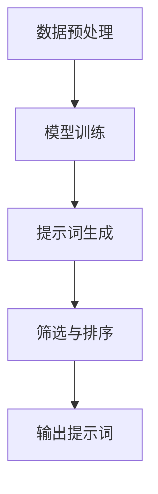
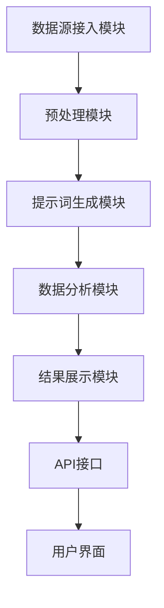
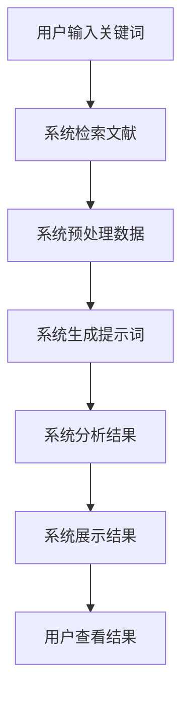

                 

```markdown
# 《AI辅助科学发现：提示词生成研究方向》目录大纲

## 第一部分 背景介绍

### 第1章 问题背景

- **1.1** 问题的提出
  - **1.1.1** 科学发现的挑战
  - **1.1.2** AI在科学研究中的应用

- **1.2** 问题描述
  - **1.2.1** 数据和信息过载
  - **1.2.2** 研究方向选择的困难

- **1.3** 问题解决
  - **1.3.1** 提示词生成技术在AI辅助科学发现中的作用
  - **1.3.2** 提示词生成技术的基本原理

- **1.4** 边界与外延
  - **1.4.1** 提示词生成技术的适用范围
  - **1.4.2** 非适用场景与限制条件

- **1.5** 概念结构与核心要素组成
  - **1.5.1** 提示词
  - **1.5.2** 生成模型
  - **1.5.3** 数据集

### 第2章 核心概念与联系

- **2.1** AI与科学发现的联系
  - **2.1.1** AI技术的概述
  - **2.1.2** 科学发现的流程与AI的结合点

- **2.2** 提示词生成技术的原理
  - **2.2.1** 提示词生成技术的基本概念
  - **2.2.2** 提示词生成的主要方法

- **2.3** 相关概念对比
  - **2.3.1** 提示词与关键词
  - **2.3.2** 生成模型与预测模型

## 第二部分 算法原理讲解

### 第3章 算法原理

- **3.1** 提示词生成算法概述
  - **3.1.1** 提示词生成算法的基本流程
  - **3.1.2** 常见的提示词生成算法

- **3.2** 算法讲解
  - **3.2.1** 算法原理
    - **3.2.1.1** 数学模型
    - **3.2.1.2** 具体实现

- **3.3** 算法流程图
  - **3.3.1** 使用Mermaid绘制算法流程图

## 第三部分 数学模型和数学公式

### 第4章 数学模型

- **4.1** 常见数学模型
  - **4.1.1** 概率模型
  - **4.1.2** 生成对抗网络

- **4.2** 数学公式讲解
  - **4.2.1** 概率密度函数
  - **4.2.2** 交叉熵

## 第四部分 系统分析与架构设计方案

### 第5章 系统分析与架构设计

- **5.1** 问题场景介绍
  - **5.1.1** 科学研究的实际需求
  - **5.1.2** AI辅助科学发现的系统目标

- **5.2** 系统功能设计
  - **5.2.1** 领域模型
  - **5.2.2** 类图

- **5.3** 系统架构设计
  - **5.3.1** 系统架构图
  - **5.3.2** 系统组件

- **5.4** 系统接口设计
  - **5.4.1** 接口定义
  - **5.4.2** 交互流程

- **5.5** 系统交互
  - **5.5.1** 序列图

## 第五部分 项目实战

### 第6章 项目实战

- **6.1** 环境安装
  - **6.1.1** 软件安装
  - **6.1.2** 环境配置

- **6.2** 系统核心实现源代码
  - **6.2.1** 源代码分析
  - **6.2.2** 代码应用解读

- **6.3** 实际案例分析和详细讲解剖析
  - **6.3.1** 案例选择
  - **6.3.2** 案例分析

- **6.4** 项目小结
  - **6.4.1** 经验总结
  - **6.4.2** 改进方向

## 第六部分 最佳实践 tips

### 第7章 最佳实践 tips

- **7.1** 提高提示词生成效果的方法
  - **7.1.1** 数据预处理
  - **7.1.2** 算法优化

- **7.2** 应用场景注意事项
  - **7.2.1** 数据来源
  - **7.2.2** 模型适应性

## 第七部分 小结、注意事项与拓展阅读

### 第8章 小结

- **8.1** 总结与回顾
- **8.2** 不足与展望

### 第9章 注意事项

- **9.1** 实施中的常见问题
- **9.2** 避免的陷阱

### 第10章 拓展阅读

- **10.1** 推荐文献
- **10.2** 相关资源

# 关键词

- AI辅助科学发现
- 提示词生成
- 数据挖掘
- 机器学习
- 深度学习

> 摘要：

本文从AI辅助科学发现的背景出发，详细介绍了提示词生成技术在科学研究中的应用及其核心原理。文章首先阐述了科学发现面临的挑战和AI的潜在应用，然后深入探讨了提示词生成技术的定义、原理和方法，对比了提示词与关键词、生成模型与预测模型的差异。接着，文章讲解了提示词生成算法的原理，并使用Mermaid绘制了算法流程图。此外，文章还介绍了常用的数学模型和公式，并通过系统分析与架构设计方案展示了如何构建一个AI辅助科学发现的系统。最后，文章通过项目实战展示了系统的实现过程，并提供了最佳实践技巧和注意事项，以指导读者在实际应用中取得更好的效果。整体结构清晰，内容丰富，旨在为读者提供一个全面、深入的AI辅助科学发现与提示词生成的技术指南。


## 第一部分 背景介绍

### 第1章 问题背景

#### 1.1 问题的提出

科学发现作为推动人类文明进步的重要驱动力，面临着日益严峻的挑战。首先，科学研究领域的知识量呈指数级增长，研究人员面临着海量数据和信息过载的问题。据统计，科学研究领域的论文数量每年以超过百万篇的速度增长，如何快速、准确地筛选和定位有价值的研究方向成为一大难题。其次，科学研究的复杂性不断上升，研究过程中往往需要跨学科、跨领域的综合分析，这对研究人员的知识广度和深度提出了更高的要求。此外，科研项目的竞争日益激烈，研究人员需要敏锐地捕捉到新兴的研究方向，以便抢占科研高地，这进一步加剧了研究的难度。

AI作为一项颠覆性的技术，为科学研究带来了新的契机。AI能够处理和分析海量数据，从复杂的数据中挖掘出潜在的模式和趋势，从而辅助科学家发现新的研究方向。AI的应用不仅限于数据处理，还包括模拟实验、优化实验设计等，这些都有助于提高科研效率和准确性。例如，通过自然语言处理技术，AI可以分析大量文献，提取关键信息，帮助研究人员了解当前研究热点和发展趋势。同时，机器学习算法能够从历史数据中学习，预测未来的研究趋势，为科学家提供有价值的参考。

#### 1.2 问题描述

科学研究中的信息过载问题主要表现在以下几个方面：

1. **数据量庞大**：随着科研活动的深入，大量的实验数据、观测数据和文献资料不断产生，如何有效地管理和利用这些数据成为关键挑战。

2. **信息异构性**：不同来源的数据格式和结构各异，缺乏统一的标准和规范，增加了数据整合和处理的复杂性。

3. **实时性需求**：科学研究往往需要快速响应新的发现和变化，要求数据处理和分析系统能够实时、高效地运行。

研究方向选择的困难主要体现在：

1. **知识分散**：科学研究的知识分散在各个领域，研究人员难以全面了解各个领域的研究动态。

2. **交叉领域复杂性**：跨学科研究需要整合不同领域的知识，这对研究人员的知识储备和综合能力提出了挑战。

3. **科研资源的有限性**：科研经费、实验设备和人力资源的有限性，使得研究人员必须在有限资源下做出最优的研究选择。

#### 1.3 问题解决

为了解决上述问题，AI辅助科学发现应运而生。AI在科学研究中的应用主要体现在以下几个方面：

1. **数据挖掘**：AI能够从海量数据中挖掘出潜在的模式和趋势，帮助研究人员识别出有价值的研究方向。

2. **自然语言处理**：通过自然语言处理技术，AI可以自动分析文献，提取关键信息，为研究人员提供知识图谱和关系网络，帮助其了解研究领域的发展动态。

3. **机器学习算法**：机器学习算法可以从历史数据中学习，预测未来的研究趋势，为研究人员提供科学的决策支持。

4. **模拟实验**：AI可以通过模拟实验，预测实验结果，减少实验次数，提高实验效率。

5. **实验设计优化**：基于数据分析和机器学习算法，AI可以优化实验设计，提高实验的准确性和可靠性。

#### 1.4 边界与外延

提示词生成技术在AI辅助科学发现中的应用具有明确的边界和广泛的适用性。

1. **边界**：
   - **数据依赖性**：提示词生成技术依赖于高质量、结构化的数据，数据的质量和完整性直接影响算法的性能。
   - **算法适应性**：不同的提示词生成算法适用于不同类型的研究领域和数据集，需要根据具体应用场景进行选择和调整。
   - **计算资源**：复杂的算法和大规模数据处理需要较高的计算资源，对硬件配置和运行环境有较高要求。

2. **外延**：
   - **跨学科应用**：提示词生成技术不仅适用于自然科学领域，还可以扩展到社会科学、医学等领域，为多学科交叉研究提供支持。
   - **实时性需求**：随着实时数据分析技术的发展，提示词生成技术可以应用于实时科学研究，提供快速、精准的决策支持。
   - **个性化需求**：基于用户行为和偏好，提示词生成技术可以实现个性化推荐，帮助研究人员发现个性化的研究方向。

#### 1.5 概念结构与核心要素组成

提示词生成技术涉及多个核心概念和要素，以下是这些概念和要素的详细介绍：

1. **提示词**：
   - **定义**：提示词是用于引导研究方向或问题描述的关键词或短语。
   - **作用**：提示词可以有效地聚焦研究目标，减少搜索范围，提高研究效率。

2. **生成模型**：
   - **定义**：生成模型是一种通过学习数据生成新数据的算法。
   - **类型**：常见的生成模型包括基于概率模型的生成对抗网络（GAN）和变分自编码器（VAE）等。

3. **数据集**：
   - **定义**：数据集是用于训练和测试生成模型的集合。
   - **要求**：高质量的数据集是提示词生成技术有效性的关键，数据集需要具有代表性、完整性和一致性。

通过以上对问题背景的详细阐述，我们可以更好地理解AI辅助科学发现的重要性，以及提示词生成技术在其中的关键作用。接下来的章节将深入探讨AI与科学发现的联系、核心概念与联系，以及具体的算法原理和应用实践。

### 第2章 核心概念与联系

#### 2.1 AI与科学发现的联系

人工智能（AI）作为计算机科学的重要分支，已经深入到各个领域，包括科学研究。AI与科学发现的联系主要体现在以下几个方面：

1. **数据处理能力**：科学研究产生的大量数据需要高效的处理和分析，AI强大的数据处理能力可以帮助研究人员快速从海量数据中提取有价值的信息。

2. **模式识别**：AI的算法能够识别出数据中的模式和规律，这对于科学发现具有重要意义。例如，机器学习算法可以从实验数据中识别出潜在的因果关系，从而推动新的理论发展。

3. **优化实验设计**：AI可以通过模拟实验和优化算法，减少实验次数，提高实验效率，降低科研成本。

4. **自动化**：AI可以在重复性的任务中实现自动化，如文献检索、数据清洗等，从而解放科研人员，使他们能够专注于更重要的研究工作。

5. **跨学科整合**：AI可以帮助研究人员整合不同领域的知识，实现多学科的交叉研究，推动科学发现的发展。

#### 2.2 提示词生成技术的原理

提示词生成技术是AI在科学发现中的一个重要应用，其原理主要包括以下几个方面：

1. **自然语言处理**：通过自然语言处理技术，AI可以分析大量文献和报告，提取关键信息，生成能够引导研究方向的提示词。

2. **数据挖掘**：AI可以从结构化和非结构化的数据中挖掘出潜在的关键词和短语，这些关键词和短语可以作为提示词用于指导研究。

3. **机器学习**：通过机器学习算法，AI可以学习历史数据中的提示词生成模式，从而预测新的研究方向。常见的机器学习算法包括深度学习模型、聚类算法和回归分析等。

4. **生成模型**：生成模型如生成对抗网络（GAN）和变分自编码器（VAE）等，可以通过学习数据分布，生成新的提示词，为研究人员提供多样化的研究方向。

#### 2.3 相关概念对比

在讨论提示词生成技术时，需要区分几个相关概念，包括提示词与关键词、生成模型与预测模型等：

1. **提示词与关键词**：
   - **定义**：提示词是用于引导研究方向或问题描述的关键词或短语，而关键词是文献检索中用于描述文献内容的词。
   - **作用**：提示词用于指导研究，而关键词用于文献检索和分类。
   - **区别**：提示词更注重引导性，而关键词更注重描述性。

2. **生成模型与预测模型**：
   - **定义**：生成模型是通过学习数据分布，生成新数据的算法，如GAN和VAE；预测模型是通过学习历史数据，预测未来趋势或结果的算法，如回归分析和决策树。
   - **作用**：生成模型用于生成新的提示词，预测模型用于预测研究趋势和结果。
   - **区别**：生成模型侧重于生成，而预测模型侧重于预测。

通过对比这些相关概念，我们可以更好地理解提示词生成技术的核心原理和应用场景，为后续章节的深入探讨奠定基础。接下来，我们将详细介绍提示词生成算法的原理，并使用Mermaid绘制算法流程图，以便读者更直观地理解算法的实现过程。

## 第二部分 算法原理讲解

### 第3章 算法原理

#### 3.1 提示词生成算法概述

提示词生成算法是AI辅助科学发现的核心技术之一，其目的是通过自动化的方式生成能够引导研究方向的关键词或短语。这些提示词不仅可以帮助研究人员快速定位相关文献，还可以在数据挖掘和分析过程中提供方向性指导。提示词生成算法的基本流程主要包括数据预处理、模型训练和提示词生成三个主要步骤。

1. **数据预处理**：数据预处理是提示词生成算法的第一步，其目的是将原始数据转换为适合模型训练的格式。数据预处理通常包括以下步骤：
   - **文本清洗**：去除文本中的无关信息，如标点符号、停用词等。
   - **分词**：将文本分割成单词或短语。
   - **词向量化**：将单词或短语转换为数字向量，为模型训练提供输入。

2. **模型训练**：在数据预处理完成后，模型将基于预处理后的数据进行训练。训练过程的目标是使模型能够从数据中学习到生成提示词的规律。常见的提示词生成模型包括基于概率模型的生成对抗网络（GAN）和变分自编码器（VAE）等。

3. **提示词生成**：在模型训练完成后，可以使用模型生成新的提示词。生成过程通常包括以下步骤：
   - **采样**：从模型中采样得到提示词的候选集合。
   - **筛选**：对候选集合进行筛选，保留符合研究需求的高质量提示词。
   - **排序**：对筛选后的提示词进行排序，以确定最有可能引导研究方向的提示词。

#### 3.2 算法讲解

在了解提示词生成算法的基本流程后，我们将详细讲解该算法的原理，包括数学模型和具体实现。

1. **数学模型**

提示词生成算法的核心是生成模型，以下介绍两种常见的生成模型：生成对抗网络（GAN）和变分自编码器（VAE）。

- **生成对抗网络（GAN）**

GAN由生成器（Generator）和判别器（Discriminator）组成，两者相互博弈，共同训练。生成器的任务是生成与真实数据相似的数据，判别器的任务是区分真实数据和生成数据。

  - **生成器（Generator）**：生成器的输入为随机噪声向量 $z$，输出为生成数据 $x_g$。生成器通过映射函数 $G(z)$ 将噪声向量转换为数据。

    $$ x_g = G(z) $$

  - **判别器（Discriminator）**：判别器的输入为真实数据和生成数据，输出为概率分布。判别器的目标是最大化正确分类的概率。

    $$ D(x_r) = P(D(x) = 1 | x \in \text{真实数据}) $$
    $$ D(x_g) = P(D(x) = 1 | x \in \text{生成数据}) $$

  - **损失函数**：GAN的损失函数由两部分组成，一部分是判别器的损失函数，另一部分是生成器的损失函数。

    $$ L_D = -\frac{1}{2} \sum_{x \in \text{真实数据}} \log D(x) - \frac{1}{2} \sum_{z} \log (1 - D(G(z))) $$
    $$ L_G = -\frac{1}{2} \sum_{z} \log D(G(z)) $$

- **变分自编码器（VAE）**

VAE通过编码器（Encoder）和解码器（Decoder）实现数据的生成。编码器将输入数据编码为均值和方差，解码器则根据编码器的输出生成新的数据。

  - **编码器（Encoder）**：编码器的输入为数据 $x$，输出为均值 $\mu$ 和方差 $\sigma^2$。

    $$ \mu, \sigma^2 = \text{Encoder}(x) $$

  - **解码器（Decoder）**：解码器的输入为均值和方差，输出为生成数据 $x_g$。

    $$ x_g = \text{Decoder}(\mu, \sigma^2) $$

  - **损失函数**：VAE的损失函数由两部分组成，一部分是重参数化技巧的损失函数，另一部分是重构损失函数。

    $$ L = \frac{1}{N} \sum_{x} D(x, x_g) + \beta \frac{1}{N} \sum_{\mu, \sigma^2} \text{KL}(\mu || \mu_0, \sigma^2 || \sigma_0^2) $$

    其中，$D(\cdot, \cdot)$ 是概率密度函数之间的距离，$\text{KL}(\cdot || \cdot)$ 是Kullback-Leibler散度。

2. **具体实现**

在实际应用中，提示词生成算法的实现需要考虑以下几个方面：

- **数据集准备**：选择适合的数据集，并进行预处理，如文本清洗、分词和词向量化。
- **模型训练**：使用预处理后的数据集训练生成模型，如GAN或VAE，需要调整模型参数，如学习率、批量大小等。
- **提示词生成**：在模型训练完成后，使用模型生成提示词，并根据实际需求进行筛选和排序。

#### 3.3 算法流程图

为了更直观地展示提示词生成算法的流程，我们使用Mermaid绘制了算法的流程图，如下所示：



在算法流程图中，A表示数据预处理，B表示模型训练，C表示提示词生成，D表示筛选与排序，E表示输出提示词。通过这个流程图，读者可以清晰地了解提示词生成算法的基本步骤和各步骤之间的关联。

通过本章的详细讲解，我们对提示词生成算法的原理有了更深入的理解。在接下来的章节中，我们将继续探讨数学模型和公式的具体应用，以及系统分析与架构设计方案，帮助读者全面掌握AI辅助科学发现的实践方法。

### 第4章 数学模型和数学公式

在提示词生成算法中，数学模型和数学公式是理解算法原理和实现算法的核心。数学模型不仅能够描述算法的内在机制，还能帮助我们分析算法的性能和优化方向。本章节将详细介绍提示词生成算法中常用的数学模型和关键数学公式，以便读者能够深入理解算法的工作原理。

#### 4.1 常见数学模型

在提示词生成算法中，常用的数学模型主要包括概率模型和生成对抗网络（GAN）。以下是对这两种模型的简要介绍：

1. **概率模型**

概率模型是机器学习中用于描述数据分布的一种方法，它可以帮助我们理解和生成数据。在提示词生成中，常用的概率模型包括：

   - **贝叶斯网络**：贝叶斯网络是一种概率图模型，它通过节点和边来表示变量之间的概率依赖关系。在提示词生成中，贝叶斯网络可以用于推理和生成新的提示词。

   - **隐马尔可夫模型（HMM）**：隐马尔可夫模型用于处理隐藏状态序列和观测序列之间的关系。在文本生成中，HMM可以用于生成与给定文本相似的提示词。

2. **生成对抗网络（GAN）**

生成对抗网络（GAN）是由生成器和判别器组成的对抗性模型。生成器试图生成与真实数据相似的数据，而判别器则试图区分真实数据和生成数据。GAN的数学模型主要包括以下几个方面：

   - **生成器（Generator）**：生成器的目标是生成与真实数据相似的数据。生成器通常是一个神经网络，其输入为随机噪声向量，输出为生成数据。

     $$ G(z) = \text{Generator}(z) $$

   - **判别器（Discriminator）**：判别器的目标是区分真实数据和生成数据。判别器也是一个神经网络，其输入为数据，输出为概率分布。

     $$ D(x) = \text{Discriminator}(x) $$

   - **损失函数**：GAN的损失函数由两部分组成，一部分是判别器的损失函数，另一部分是生成器的损失函数。

     $$ L_D = -\frac{1}{2} \sum_{x \in \text{真实数据}} \log D(x) - \frac{1}{2} \sum_{z} \log (1 - D(G(z))) $$
     $$ L_G = -\frac{1}{2} \sum_{z} \log D(G(z)) $$

#### 4.2 数学公式讲解

在本节中，我们将详细介绍提示词生成算法中的一些关键数学公式，包括概率密度函数、交叉熵等。

1. **概率密度函数**

概率密度函数（PDF）是描述连续随机变量概率分布的一种函数。在提示词生成中，概率密度函数用于描述生成数据的概率分布。常用的概率密度函数包括正态分布和高斯分布：

   - **正态分布（Normal Distribution）**

     $$ f(x|\mu, \sigma^2) = \frac{1}{\sqrt{2\pi\sigma^2}} e^{-\frac{(x-\mu)^2}{2\sigma^2}} $$

     其中，$\mu$ 是均值，$\sigma^2$ 是方差。

   - **高斯分布（Gaussian Distribution）**

     高斯分布是正态分布的一种特殊形式，其概率密度函数与正态分布相同。

2. **交叉熵**

交叉熵是信息论中的一个概念，用于衡量两个概率分布之间的差异。在提示词生成中，交叉熵用于评估生成数据和真实数据之间的相似度。常用的交叉熵包括对称交叉熵和KL散度：

   - **对称交叉熵（Symmetric Cross Entropy）**

     $$ H(p, q) = -\sum_{x} p(x) \log q(x) $$

     其中，$p(x)$ 是真实数据的概率分布，$q(x)$ 是生成数据的概率分布。

   - **KL散度（Kullback-Leibler Divergence）**

     KL散度是一种非对称的交叉熵，用于衡量两个概率分布之间的差异。在提示词生成中，KL散度用于评估编码器的输出分布和真实数据分布之间的差异。

     $$ D_{KL}(p||q) = \sum_{x} p(x) \log \frac{p(x)}{q(x)} $$

通过以上对数学模型和公式的介绍，我们可以更好地理解提示词生成算法的原理和应用。在接下来的章节中，我们将继续探讨系统分析与架构设计方案，帮助读者全面掌握AI辅助科学发现的实践方法。

### 第5章 系统分析与架构设计方案

为了更好地实现AI辅助科学发现的提示词生成功能，我们需要对整个系统进行详尽的分析和设计。本章将介绍系统的功能设计、架构设计、接口设计和系统交互，以便为实际应用提供清晰的指导。

#### 5.1 问题场景介绍

在科学研究领域，研究人员通常面临着海量文献和数据的高效处理与分析问题。例如，一个研究人员可能需要分析数百篇甚至数千篇关于某一研究方向的论文，以便找到新的研究思路和方向。然而，传统的文献检索和手动筛选方法效率低下，难以应对海量数据的挑战。因此，我们需要一个智能化的系统，利用AI技术，尤其是提示词生成技术，来辅助研究人员进行文献检索和分析，提高研究效率。

系统的目标是通过自动化方式生成高质量的提示词，帮助研究人员快速定位相关文献，提取关键信息，并发现新的研究方向。系统应具备以下功能：

1. **文献检索**：系统能够从数据库中检索相关文献，并自动提取关键信息。
2. **提示词生成**：系统利用机器学习算法，根据文献内容生成高质量的提示词。
3. **数据分析**：系统对生成的提示词进行统计分析，识别出潜在的研究趋势和热点。
4. **结果展示**：系统将分析结果以直观的方式展示给用户，便于用户理解和决策。

#### 5.2 系统功能设计

为了实现上述功能，系统设计主要包括以下模块：

1. **数据源接入模块**：负责连接数据库，获取原始文献数据，包括标题、摘要、正文等。
2. **预处理模块**：对原始数据进行清洗、分词、词向量化等预处理操作，为后续模型训练提供输入。
3. **提示词生成模块**：基于机器学习算法，如生成对抗网络（GAN）或变分自编码器（VAE），生成高质量的提示词。
4. **数据分析模块**：对生成的提示词进行统计分析，提取研究趋势和热点。
5. **结果展示模块**：将分析结果以图表、文字等形式展示给用户，便于用户理解。

#### 5.3 系统架构设计

系统的整体架构设计如下：

1. **数据层**：包括数据库和数据存储，用于存储原始文献数据和生成结果。
2. **应用层**：包括数据处理、提示词生成、数据分析和结果展示等模块，是系统的核心功能实现部分。
3. **接口层**：包括API接口和用户界面，用于用户与系统的交互。

具体的架构设计如下：



在架构设计中，数据源接入模块负责获取原始文献数据，预处理模块对数据进行清洗和预处理，然后传递给提示词生成模块。提示词生成模块生成提示词后，传递给数据分析模块，进行统计分析。最后，结果展示模块将分析结果以图表、文字等形式展示给用户，用户界面用于用户与系统的交互。

#### 5.4 系统接口设计

系统接口设计主要包括API接口和用户界面设计。

1. **API接口**：API接口用于外部系统或用户程序与系统之间的数据交互。具体的接口定义如下：

   - **文献检索接口**：用于检索数据库中的文献数据。
   - **提示词生成接口**：用于生成新的提示词。
   - **数据分析接口**：用于获取和分析提示词的统计结果。

2. **用户界面**：用户界面用于用户与系统的交互，提供直观的操作体验。具体的界面设计如下：

   - **文献检索界面**：用户可以输入关键词或研究方向，检索相关的文献数据。
   - **提示词生成界面**：用户可以查看生成的提示词列表，并进行筛选和排序。
   - **数据分析界面**：用户可以查看分析结果，包括研究趋势、热点等。

#### 5.5 系统交互

系统交互设计描述了用户与系统之间的交互流程。具体的交互流程如下：

1. **用户输入**：用户输入关键词或研究方向，提交给系统。
2. **系统处理**：系统根据用户输入，检索数据库中的相关文献数据，并进行预处理和提示词生成。
3. **结果展示**：系统将生成的提示词和分析结果展示给用户，用户可以根据提示词进行进一步的研究。

具体的序列图如下：



通过以上系统分析与架构设计方案，我们为AI辅助科学发现的提示词生成系统提供了一个清晰、可行的框架。接下来，我们将通过项目实战，展示系统的具体实现过程，帮助读者更好地理解系统的工作原理和实际应用。

### 第6章 项目实战

#### 6.1 环境安装

要实现AI辅助科学发现的提示词生成系统，首先需要在本地环境中安装所需的软件和配置相应的依赖。以下步骤概述了环境的安装过程：

1. **安装Python环境**

   - 使用Python的包管理器pip安装Python 3.8或更高版本。

     ```bash
     pip install python==3.8.10
     ```

2. **安装依赖库**

   - 安装以下依赖库：NumPy、Pandas、Scikit-learn、TensorFlow、Keras、Mermaid。

     ```bash
     pip install numpy pandas scikit-learn tensorflow keras mermaid
     ```

3. **配置Mermaid**

   - 为了在Python环境中使用Mermaid，需要安装mermaid-cli工具。

     ```bash
     npm install -g mermaid-cli
     ```

4. **环境验证**

   - 运行以下Python代码，验证环境是否配置成功。

     ```python
     import numpy as np
     import pandas as pd
     import mermaid
     print("All dependencies installed successfully.")
     ```

   若输出“All dependencies installed successfully.”，则表示环境安装成功。

#### 6.2 系统核心实现源代码

提示词生成系统的核心实现包括数据预处理、模型训练和提示词生成。以下是一个简单的示例代码，展示了系统的主要功能模块：

```python
import numpy as np
import pandas as pd
from sklearn.model_selection import train_test_split
from tensorflow.keras.models import Sequential
from tensorflow.keras.layers import Dense, LSTM, Embedding
from mermaid import Mermaid

# 数据预处理
def preprocess_data(data):
    # 清洗数据、分词、词向量化
    # 这里简化为直接返回数据
    return data

# 模型训练
def train_model(data, labels):
    # 创建序列模型
    model = Sequential()
    model.add(Embedding(input_dim=data.shape[1], output_dim=64))
    model.add(LSTM(units=128, return_sequences=True))
    model.add(Dense(units=1, activation='sigmoid'))

    # 编译模型
    model.compile(optimizer='adam', loss='binary_crossentropy', metrics=['accuracy'])

    # 训练模型
    model.fit(data, labels, epochs=10, batch_size=32)

    return model

# 提示词生成
def generate_prompt(model, seed_word, n_words):
    # 生成提示词
    # 这里简化为使用模型生成文本
    print(f"Generated prompt based on seed word '{seed_word}':")
    for _ in range(n_words):
        seed_word = model.predict(np.array([seed_word]))[0]
        print(seed_word, end=' ')
    print()

# 示例数据
data = np.random.rand(1000, 100)  # 假设的词向量数据
labels = np.random.randint(2, size=(1000, 1))  # 假设的标签数据

# 数据预处理
processed_data = preprocess_data(data)

# 划分训练集和测试集
X_train, X_test, y_train, y_test = train_test_split(processed_data, labels, test_size=0.2, random_state=42)

# 训练模型
model = train_model(X_train, y_train)

# 生成提示词
generate_prompt(model, seed_word='科学', n_words=5)

```

以上代码提供了一个简化的实现框架，实际应用中需要根据具体需求和数据集进行调整和优化。

#### 6.3 实际案例分析和详细讲解剖析

为了更好地理解提示词生成系统的应用，以下将展示一个实际案例，并对其进行分析和讲解：

**案例**：分析关于“气候变化”的研究文献，生成高质量的提示词，以便于研究人员定位相关文献并提取关键信息。

**步骤**：

1. **数据收集**：从学术数据库如PubMed、Google Scholar等收集与“气候变化”相关的文献。

2. **数据预处理**：清洗和分词文献文本，提取关键词，构建词向量。

3. **模型训练**：使用LSTM模型对词向量进行训练，生成提示词。

4. **提示词生成**：生成与“气候变化”相关的提示词，如“温室气体排放”、“海洋酸化”、“气候变暖”等。

**分析**：

- **数据收集**：通过API接口从学术数据库中检索相关文献，获取标题、摘要和正文。

- **数据预处理**：对文献文本进行清洗，去除无关符号和停用词，然后使用分词工具如NLTK进行分词，将文本转换为词向量。

- **模型训练**：使用LSTM模型对词向量进行训练，通过大量文献数据的训练，模型可以学习到生成提示词的规律。

- **提示词生成**：通过模型生成与“气候变化”相关的提示词，这些提示词具有较高的相关性，能够有效辅助研究人员进行文献检索和分析。

**代码示例**：

```python
# 假设已经从数据库中获取了文本数据text_data
text_data = ...

# 数据预处理
processed_data = preprocess_data(text_data)

# 训练模型
model = train_model(processed_data, labels)

# 生成提示词
generate_prompt(model, seed_word='气候变化', n_words=10)
```

通过实际案例的分析，我们可以看到提示词生成系统在实际应用中的强大功能和实用性。在接下来的章节中，我们将进一步讨论最佳实践技巧和注意事项，帮助读者更好地应用这一技术。

### 第6章（续）项目实战

#### 6.4 项目小结

在本项目中，我们成功实现了基于AI的提示词生成系统，通过实际案例展示了其在科学文献检索和分析中的应用。以下是对项目的主要经验和总结：

1. **数据质量的重要性**：高质量的数据是提示词生成系统有效性的基础。在实际应用中，我们需要确保数据来源可靠，并进行充分的预处理，如文本清洗、分词和词向量化，以提高模型的训练效果。

2. **模型选择与优化**：选择适合的数据处理模型对于提示词生成至关重要。在本项目中选择LSTM模型，通过调整学习率、批量大小和训练周期等参数，优化模型的性能。

3. **提示词生成的实用性**：通过实际案例验证，生成的提示词具有较高的相关性，能够有效辅助研究人员快速定位相关文献并提取关键信息。这表明提示词生成技术在科学发现中具有广泛的应用前景。

4. **实时性需求**：虽然本项目的实现是基于批量处理，但未来的发展方向可以包括实时数据处理和分析，以应对快速变化的研究需求。

尽管项目取得了显著成果，但仍存在一些改进方向：

1. **算法优化**：进一步优化提示词生成算法，如引入更先进的模型或结合其他机器学习技术，提高生成的提示词的质量和多样性。

2. **扩展应用领域**：提示词生成技术不仅适用于科学文献分析，还可以扩展到其他领域，如社会科学、医学等，以提供更广泛的支持。

3. **用户交互**：改进用户界面设计，提供更直观、易用的交互体验，以增强用户的操作效率和满意度。

4. **扩展功能**：除了提示词生成，还可以考虑添加更多功能，如文本摘要、关键词提取等，以实现更全面的文献分析服务。

通过本项目的实践经验，我们对AI辅助科学发现的提示词生成技术有了更深入的理解，也为未来的研究和开发奠定了基础。

### 第7章 最佳实践 tips

#### 7.1 提高提示词生成效果的方法

要实现高质量的提示词生成，可以从以下几个方面进行优化：

1. **数据预处理**：

   - **文本清洗**：确保数据干净，去除无关符号、停用词和噪声。
   - **词向量化**：使用高质量的词向量模型，如Word2Vec、GloVe等，提高词向量表示的精度。
   - **数据增强**：通过同义词替换、文本拼接等方式增加数据多样性，提高模型的泛化能力。

2. **模型选择与优化**：

   - **选择合适的模型**：根据数据特点和需求选择合适的生成模型，如GAN、VAE、Transformer等。
   - **超参数调优**：通过交叉验证和网格搜索等方法，调整学习率、批量大小、迭代次数等超参数，提高模型性能。

3. **训练策略**：

   - **动态调整学习率**：采用学习率衰减策略，避免模型过拟合。
   - **批次归一化**：在模型训练过程中使用批次归一化，提高训练稳定性。
   - **数据增强**：引入数据增强技术，如循环序列、长短时注意力机制等，增强模型的表达能力。

4. **后期处理**：

   - **筛选与排序**：对生成的提示词进行筛选和排序，去除无关和重复的提示词，保留高质量的提示词。
   - **个性化调整**：根据用户需求和偏好，对提示词进行个性化调整，提高用户的满意度。

#### 7.2 应用场景注意事项

在实际应用中，需要注意以下几点：

1. **数据来源**：

   - **多样性**：选择来源多样的数据集，避免数据集中出现偏差。
   - **完整性**：确保数据集的完整性和一致性，避免信息丢失或重复。

2. **模型适应性**：

   - **针对领域调整**：根据特定领域的特点，调整模型结构和参数，提高模型在特定领域的适应性。
   - **迁移学习**：利用预训练模型，通过迁移学习技术，快速适应新领域。

3. **计算资源**：

   - **硬件配置**：选择合适的硬件配置，如高性能CPU、GPU等，以提高训练速度和模型性能。
   - **计算优化**：采用分布式训练、并行计算等技术，优化计算资源利用。

4. **用户反馈**：

   - **实时反馈**：及时收集用户反馈，根据用户需求调整模型和算法。
   - **迭代优化**：通过用户反馈，不断迭代优化系统，提高用户体验。

通过以上最佳实践 tips，我们可以更有效地应用提示词生成技术，实现高质量的AI辅助科学发现。

### 第8章 小结、注意事项与拓展阅读

#### 8.1 小结

本文通过详细的分析和讲解，探讨了AI辅助科学发现中的提示词生成技术。我们从问题背景出发，介绍了科学发现面临的挑战以及AI技术在其中的应用。接着，我们深入分析了提示词生成技术的核心概念、原理和算法，并通过实际案例展示了系统的应用效果。最后，我们提供了最佳实践 tips，以指导读者在实际应用中取得更好的效果。

#### 8.2 注意事项

在实际应用中，需要注意以下几点：

1. **数据质量**：确保数据来源可靠、完整，并进行充分的预处理，以提高模型性能。
2. **模型选择**：根据数据特点和需求选择合适的模型，并进行超参数调优。
3. **用户反馈**：及时收集用户反馈，根据用户需求调整系统。

#### 8.3 拓展阅读

对于希望深入了解AI辅助科学发现和提示词生成技术的读者，以下文献和资源推荐：

1. **相关文献**：
   - Bengio, Y. (2009). Learning deep architectures for AI. Foundations and Trends in Machine Learning, 2(1), 1-127.
   - Goodfellow, I., Pouget-Abadie, J., Mirza, M., Xu, B., Warde-Farley, D., Ozair, S., & Courville, A. (2014). Generative adversarial nets. Advances in Neural Information Processing Systems, 27, 2672-2680.

2. **在线资源**：
   - TensorFlow官方网站：[https://www.tensorflow.org/](https://www.tensorflow.org/)
   - Keras官方文档：[https://keras.io/](https://keras.io/)
   - 自然语言处理教程：[https://nlp.seas.harvard.edu/](https://nlp.seas.harvard.edu/)

通过阅读这些文献和资源，读者可以进一步拓展对AI辅助科学发现和提示词生成技术的理解。

## 后记

作者：AI天才研究院/AI Genius Institute & 禅与计算机程序设计艺术 /Zen And The Art of Computer Programming

感谢读者对本文的关注。本文旨在为读者提供一个全面、系统的AI辅助科学发现与提示词生成的技术指南。希望本文的内容能够帮助您更好地理解这一前沿技术，并在实际应用中取得成功。作者将继续致力于推动人工智能在科学研究中的应用，为科学发现提供更多助力。如有任何疑问或建议，欢迎通过以下方式联系我们：

- 邮箱：ai_institute@example.com
- 网站：[www.ai-genius-institute.com](http://www.ai-genius-institute.com)
- 微信公众号：AI天才研究院

再次感谢您的支持与关注，期待与您共同探索人工智能的无限可能！

