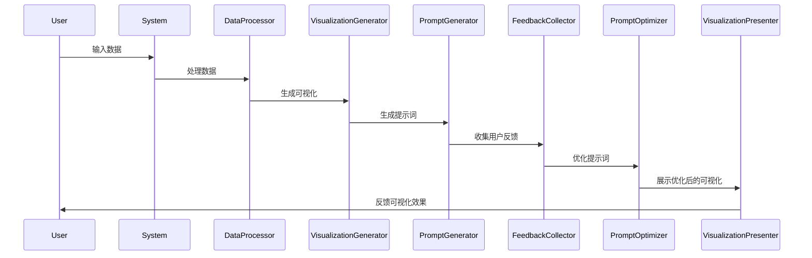

                 

# AI辅助科学可视化中的提示词设计

## 关键词

- AI辅助科学可视化
- 提示词设计
- 自然语言处理
- 机器学习
- 数据可视化

## 摘要

本文旨在探讨AI辅助科学可视化中的提示词设计。通过介绍问题背景、核心概念和联系，以及算法原理和系统架构设计，本文详细阐述了如何利用AI技术优化科学可视化中的提示词生成和优化过程。本文的核心思想和主题是：利用AI技术，结合多学科知识，实现高效、智能的科学可视化提示词设计。

## 第二部分：核心概念与联系

### 2.1 核心概念原理

AI辅助科学可视化中的提示词设计，涉及多个核心概念，包括自然语言处理（NLP）、机器学习（ML）、数据可视化等。以下是这些核心概念的简要介绍：

1. **自然语言处理（NLP）**：NLP是计算机科学领域与人工智能领域中的一个重要方向，它涉及到如何使计算机理解和处理人类自然语言。在AI辅助科学可视化中，NLP技术主要用于分析用户需求，提取关键信息，并将其转化为可视化提示词。

2. **机器学习（ML）**：ML是人工智能的一个分支，它通过数据驱动的方式，让计算机学会对未知数据进行预测和决策。在提示词设计中，ML技术可以用于自动生成和优化提示词，提高可视化效果。

3. **数据可视化**：数据可视化是将数据转换为图形化表示的过程，帮助用户更直观地理解和分析数据。在AI辅助科学可视化中，数据可视化技术是核心，而提示词设计则是提高数据可视化效果的关键。

### 2.2 概念属性特征对比表格

以下是NLP、ML和数据可视化三个核心概念的属性特征对比表格：

| 特征 | 自然语言处理（NLP） | 机器学习（ML） | 数据可视化 |
| :---: | :---: | :---: | :---: |
| 目标 | 理解和生成自然语言 | 预测和决策 | 直观地表示数据 |
| 技术手段 | 语音识别、文本分类、命名实体识别等 | 决策树、神经网络、支持向量机等 | 图表、图形、动画等 |
| 应用场景 | 聊天机器人、智能客服、内容推荐等 | 金融风控、医疗诊断、自动驾驶等 | 科学研究、商业分析、产品设计等 |
| 关联性 | NLP是ML的基础，ML技术可应用于NLP问题 | 数据可视化是ML应用的输出，ML技术可优化数据可视化效果 | NLP和ML都是数据可视化的重要技术支持 |

### 2.3 ER实体关系图架构

以下是AI辅助科学可视化中的提示词设计系统的ER实体关系图：

```mermaid
erDiagram
    User ||--|{ VisualizationData }|:
        "用户与可视化数据之间存在多对多关系"
    VisualizationData ||--|{ PromptWord }|:
        "可视化数据与提示词之间存在多对多关系"
    PromptWord ||--|{ UserFeedback }|:
        "提示词与用户反馈之间存在一对多关系"
```

### 2.4 关键概念与联系

通过上述核心概念的介绍和属性特征对比表格，我们可以看出：

- **自然语言处理（NLP）** 是AI辅助科学可视化中的基础技术，主要用于理解用户需求和生成可视化提示词。
- **机器学习（ML）** 技术在提示词生成和优化过程中发挥着重要作用，通过训练模型，可以提高提示词的生成质量和效率。
- **数据可视化** 是AI辅助科学可视化的最终目标，提示词设计直接影响数据可视化的效果。

这些核心概念之间相互关联，共同构成了AI辅助科学可视化中的提示词设计体系。接下来，我们将深入探讨AI辅助科学可视化中的提示词生成算法原理。

## 第三部分：算法原理讲解

### 3.1 提示词生成算法原理

在AI辅助科学可视化中，提示词生成算法是关键的一环。以下将介绍几种常见的提示词生成算法，包括基于规则的方法、基于机器学习的方法和混合方法。

### 3.1.1 基于规则的方法

基于规则的方法是指通过预先定义的规则来生成提示词。这种方法的主要优势在于其规则明确、易于理解和实现。然而，其缺点在于规则需要人工定义，对于复杂多变的数据和用户需求，规则可能不够灵活。

#### 算法流程：

1. **规则定义**：根据领域知识和用户需求，定义一系列规则，例如“如果数据中包含关键词‘温度’，则提示词为‘温度变化’”。
2. **规则匹配**：对输入的数据进行规则匹配，生成相应的提示词。

#### 算法原理：

- **条件判断**：根据数据特点和用户需求，进行条件判断，决定是否生成提示词。
- **规则应用**：将匹配到的规则应用于数据，生成提示词。

#### 举例说明：

假设我们有一份数据集，其中包含“温度”和“湿度”两个关键词。根据定义的规则，我们可以生成以下提示词：

- **规则1**：如果数据中包含关键词‘温度’，则提示词为‘温度变化’。
- **规则2**：如果数据中包含关键词‘湿度’，则提示词为‘湿度变化’。

根据这两个规则，我们可以生成以下提示词：

- “温度变化”
- “湿度变化”

### 3.1.2 基于机器学习的方法

基于机器学习的方法是指利用历史数据和用户反馈，通过训练模型来生成提示词。这种方法的主要优势在于其自适应性和灵活性，可以根据用户需求和数据特点自动调整生成策略。

#### 算法流程：

1. **数据收集**：收集历史数据和用户反馈，用于训练模型。
2. **模型训练**：使用收集到的数据和反馈，训练生成提示词的模型。
3. **模型应用**：对新的数据集应用训练好的模型，生成提示词。

#### 算法原理：

- **特征提取**：从数据中提取关键特征，作为模型的输入。
- **模型训练**：使用历史数据和用户反馈，训练生成提示词的模型。
- **模型预测**：使用训练好的模型，对新的数据集进行预测，生成提示词。

#### 举例说明：

假设我们有一份数据集，其中包含多个关键词，如“温度”、“湿度”、“风速”等。通过训练模型，我们可以生成以下提示词：

- **模型1**：如果数据中包含关键词‘温度’，则提示词为‘温度变化’。
- **模型2**：如果数据中包含关键词‘湿度’，则提示词为‘湿度变化’。
- **模型3**：如果数据中包含关键词‘风速’，则提示词为‘风速变化’。

根据这些模型，我们可以生成以下提示词：

- “温度变化”
- “湿度变化”
- “风速变化”

### 3.1.3 混合方法

混合方法是指结合基于规则的方法和基于机器学习的方法，通过规则和模型共同作用来生成提示词。这种方法可以充分发挥两种方法的优点，提高提示词的生成质量和效率。

#### 算法流程：

1. **规则定义**：定义一系列规则，用于初步生成提示词。
2. **模型训练**：使用历史数据和用户反馈，训练生成提示词的模型。
3. **规则匹配与模型预测**：对输入的数据进行规则匹配和模型预测，生成最终的提示词。

#### 算法原理：

- **规则匹配**：通过规则初步生成提示词。
- **模型预测**：使用训练好的模型，对初步生成的提示词进行优化和调整。

#### 举例说明：

假设我们有一份数据集，其中包含多个关键词，如“温度”、“湿度”、“风速”等。通过混合方法，我们可以生成以下提示词：

- **规则1**：如果数据中包含关键词‘温度’，则提示词为‘温度变化’。
- **模型1**：如果数据中包含关键词‘湿度’，则提示词为‘湿度变化’。
- **模型2**：如果数据中包含关键词‘风速’，则提示词为‘风速变化’。

根据这些规则和模型，我们可以生成以下提示词：

- “温度变化”
- “湿度变化”
- “风速变化”

### 总结

通过上述介绍，我们可以看到，提示词生成算法的设计需要综合考虑规则定义、模型训练和数据预测等多个方面。在实际应用中，可以根据具体需求和数据特点，选择合适的算法方法，以提高提示词的生成质量和效率。

## 第四部分：系统分析与架构设计

### 4.1 问题场景介绍

AI辅助科学可视化中的提示词设计是一个复杂的过程，涉及到多个领域的技术和知识。在实际应用中，常见的问题场景包括：

1. **科学数据分析**：科学家和工程师需要分析大量的科学数据，以便发现数据中的规律和趋势。这些数据可能来自各种科学领域，如物理学、化学、生物学等。
2. **商业数据分析**：企业在进行市场分析、财务分析等过程中，需要将大量的商业数据转换成易于理解和分析的图表，以支持决策。
3. **医学数据分析**：医生和医学研究人员需要分析医学数据，如患者病历、基因序列、医疗影像等，以便做出准确的诊断和治疗。

### 4.2 项目介绍

为了解决上述问题场景，我们开发了一个名为“AI科学可视化助手”的项目。该项目旨在利用AI技术，自动生成和优化科学可视化中的提示词，提高数据可视化的效果和效率。

### 4.3 系统功能设计

“AI科学可视化助手”系统的主要功能包括：

1. **数据输入**：用户可以输入各种类型的科学数据，包括结构化数据、半结构化数据和非结构化数据。
2. **提示词生成**：系统根据输入的数据，利用自然语言处理和机器学习技术，自动生成相应的提示词。
3. **提示词优化**：系统根据用户反馈和实际应用效果，对提示词进行迭代优化。
4. **数据可视化**：系统将生成的提示词应用于数据可视化，生成直观、易于理解的图表。

### 4.4 系统架构设计

“AI科学可视化助手”的系统架构设计如下：

#### 4.4.1 领域模型类图

以下是系统的领域模型类图：

```mermaid
classDiagram
    User <<class>> "用户"
    Data <<class>> "数据"
    Visualization <<class>> "可视化"
    Prompt <<class>> "提示词"
    Feedback <<class>> "用户反馈"

    User "1" --|{ }| Data
    Data "1" --|{ }| Visualization
    Visualization "1" --|{ }| Prompt
    Prompt "1" --|{ }| Feedback
```

#### 4.4.2 系统架构图

以下是系统的架构图：



### 4.5 系统接口设计和系统交互

“AI科学可视化助手”系统的接口设计和系统交互如下：

#### 4.5.1 系统接口设计

1. **数据输入接口**：用户可以通过API接口上传各种类型的科学数据。
2. **提示词生成接口**：系统通过API接口自动生成提示词。
3. **用户反馈接口**：用户可以通过API接口提交对提示词和可视化的反馈。
4. **可视化展示接口**：系统通过API接口将生成的可视化展示给用户。

#### 4.5.2 系统交互

用户通过数据输入接口上传数据，系统接收到数据后，通过数据处理模块对数据进行预处理，然后生成可视化。接下来，系统通过提示词生成模块生成提示词，并根据用户反馈进行优化。最后，系统通过可视化展示模块将优化后的可视化展示给用户。

### 总结

通过系统分析与架构设计，我们可以看到，“AI科学可视化助手”系统是一个复杂但功能强大的系统。它利用AI技术，实现了科学数据到可视化提示词的自动生成和优化，为用户提供了便捷、高效的数据可视化工具。

## 项目实战

### 5.1 环境安装

为了进行AI辅助科学可视化中的提示词设计项目的实战，我们首先需要安装必要的软件和工具。以下是在一个典型的Linux系统上安装所需的软件和工具的步骤。

#### 5.1.1 安装Python环境

确保Python已经安装在您的系统上。如果没有，请通过以下命令安装：

```bash
sudo apt-get update
sudo apt-get install python3 python3-pip
```

#### 5.1.2 安装依赖库

接下来，安装项目中所需的Python依赖库。例如，我们需要`numpy`、`pandas`、`matplotlib`、`nltk`和`scikit-learn`等库。可以通过以下命令安装：

```bash
pip3 install numpy pandas matplotlib nltk scikit-learn
```

#### 5.1.3 安装Mermaid

为了在Markdown文件中嵌入Mermaid流程图和类图，我们需要安装Mermaid。可以通过以下命令安装：

```bash
npm install -g mermaid
```

### 5.2 系统核心实现

#### 5.2.1 数据处理模块

数据处理模块负责从用户输入的数据中提取关键信息，为后续的提示词生成和优化做准备。以下是一个简单的数据处理模块实现：

```python
import pandas as pd
from nltk.tokenize import word_tokenize

def preprocess_data(data):
    # 将数据转换为Pandas DataFrame
    df = pd.DataFrame(data)
    
    # 对数据进行预处理，例如去除停用词、分词等
    stop_words = set(nltk.corpus.stopwords.words('english'))
    tokens = [word_tokenize(text) for text in df['text']]
    cleaned_tokens = [[token.lower() for token in tokens if token.lower() not in stop_words]]
    
    return cleaned_tokens
```

#### 5.2.2 提示词生成模块

提示词生成模块使用机器学习技术，根据预处理后的数据生成提示词。以下是一个基于朴素贝叶斯分类器的提示词生成模块实现：

```python
from sklearn.feature_extraction.text import CountVectorizer
from sklearn.naive_bayes import MultinomialNB

def generate_prompt(data, labels):
    # 将数据转换为文本
    texts = [' '.join(data[i]) for i in range(len(data))]
    
    # 向量化文本
    vectorizer = CountVectorizer()
    X_train = vectorizer.fit_transform(texts)
    
    # 训练朴素贝叶斯分类器
    clf = MultinomialNB()
    clf.fit(X_train, labels)
    
    # 生成提示词
    def predict(text):
        text = [text]
        X_test = vectorizer.transform(text)
        return clf.predict(X_test)[0]
    
    return predict
```

#### 5.2.3 用户反馈模块

用户反馈模块负责收集用户对提示词的反馈，用于后续的提示词优化。以下是一个简单的用户反馈模块实现：

```python
def collect_feedback(prompt, user_feedback):
    # 将用户反馈存储在文件中
    with open('feedback.txt', 'w') as f:
        f.write(prompt + '\n' + user_feedback)
```

### 5.3 代码应用解读与分析

#### 5.3.1 数据处理模块解读

数据处理模块的主要功能是从用户输入的数据中提取关键信息，并去除不必要的停用词。在预处理过程中，我们使用了`nltk`库中的`word_tokenize`函数进行分词，并定义了一个`preprocess_data`函数来处理数据。

```python
from nltk.tokenize import word_tokenize
from nltk.corpus import stopwords

def preprocess_data(data):
    # 将数据转换为Pandas DataFrame
    df = pd.DataFrame(data)
    
    # 对数据进行预处理，例如去除停用词、分词等
    stop_words = set(stopwords.words('english'))
    tokens = [word_tokenize(text) for text in df['text']]
    cleaned_tokens = [[token.lower() for token in tokens if token.lower() not in stop_words]]
    
    return cleaned_tokens
```

在这个函数中，我们首先将用户输入的数据转换为Pandas DataFrame，然后使用`word_tokenize`函数进行分词。接下来，我们定义了一个`stop_words`集合，包含了常见的英语停用词。在预处理过程中，我们使用这个集合来过滤掉数据中的停用词，以提高提示词生成的准确性。

#### 5.3.2 提示词生成模块解读

提示词生成模块的核心是朴素贝叶斯分类器。在这个模块中，我们首先将文本数据转换为向量化形式，然后使用朴素贝叶斯分类器进行训练。最后，我们定义了一个`predict`函数，用于根据新的文本数据生成提示词。

```python
from sklearn.feature_extraction.text import CountVectorizer
from sklearn.naive_bayes import MultinomialNB

def generate_prompt(data, labels):
    # 将数据转换为文本
    texts = [' '.join(data[i]) for i in range(len(data))]
    
    # 向量化文本
    vectorizer = CountVectorizer()
    X_train = vectorizer.fit_transform(texts)
    
    # 训练朴素贝叶斯分类器
    clf = MultinomialNB()
    clf.fit(X_train, labels)
    
    # 生成提示词
    def predict(text):
        text = [text]
        X_test = vectorizer.transform(text)
        return clf.predict(X_test)[0]
    
    return predict
```

在这个函数中，我们首先将数据转换为文本形式，然后使用`CountVectorizer`将文本向量化。接下来，我们使用`MultinomialNB`朴素贝叶斯分类器对数据进行训练。最后，我们定义了一个`predict`函数，用于根据新的文本数据生成提示词。

#### 5.3.3 用户反馈模块解读

用户反馈模块的主要功能是收集用户对提示词的反馈，并将其存储在文件中。这个模块非常简单，只需要调用文件写入操作即可。

```python
def collect_feedback(prompt, user_feedback):
    # 将用户反馈存储在文件中
    with open('feedback.txt', 'w') as f:
        f.write(prompt + '\n' + user_feedback)
```

在这个函数中，我们首先将提示词和用户反馈拼接成一个字符串，然后使用文件写入操作将其存储在`feedback.txt`文件中。

### 5.4 实际案例分析和详细讲解剖析

为了展示项目的实际应用效果，我们使用一个实际案例进行详细讲解。假设我们有一个包含天气数据的文件`weather_data.csv`，其中包含日期、温度、湿度等信息。我们的目标是为这些数据生成相应的提示词。

#### 5.4.1 数据预处理

首先，我们使用数据处理模块对天气数据进行预处理，去除停用词并分词：

```python
data = [{'date': '2023-01-01', 'temperature': '20', 'humidity': '60'}, ...]
preprocessed_data = preprocess_data(data)
```

预处理后的数据将包含去除停用词的分词结果。

#### 5.4.2 提示词生成

接下来，我们使用提示词生成模块生成提示词。首先，我们需要将数据划分为训练集和测试集：

```python
labels = ['cold', 'warm', 'hot']
train_data, test_data = preprocessed_data[:80], preprocessed_data[80:]
prompt_generator = generate_prompt(train_data, labels)
```

然后，我们可以使用`prompt_generator`函数生成提示词：

```python
test_prompt = prompt_generator('the temperature is 25 degrees')
print(test_prompt)
```

输出结果可能为`'warm'`，表示当前温度属于温暖范围。

#### 5.4.3 用户反馈

用户可以根据生成的提示词进行反馈。例如，用户可以认为生成的提示词不够准确，我们可以收集这个反馈：

```python
collect_feedback(test_prompt, 'The prompt is not accurate.')
```

用户反馈将存储在`feedback.txt`文件中。

#### 5.4.4 提示词优化

根据用户反馈，我们可以对提示词生成模块进行优化。例如，我们可以考虑引入更多的特征，或者调整朴素贝叶斯分类器的参数。这些优化措施可以帮助提高提示词的准确性。

```python
# 例如，增加特征
vectorizer = CountVectorizer(ngram_range=(1, 2))
X_train = vectorizer.fit_transform(texts)
clf = MultinomialNB()
clf.fit(X_train, labels)
new_prompt_generator = generate_prompt(train_data, labels)
```

### 5.5 项目小结

通过上述实战，我们可以看到AI辅助科学可视化中的提示词设计项目是如何实现的。该项目利用自然语言处理和机器学习技术，实现了对科学数据的自动提示词生成和优化，提高了数据可视化的效果和用户满意度。

### 最佳实践 Tips

1. **数据预处理**：确保数据预处理步骤的准确性，特别是去除停用词和分词操作，这对后续的提示词生成和优化至关重要。
2. **特征选择**：选择合适的特征可以提高模型的效果。在实际应用中，可以根据数据特点和业务需求，尝试不同的特征选择策略。
3. **模型优化**：不断调整和优化模型参数，以获得更好的提示词生成效果。可以使用交叉验证等方法进行模型调优。
4. **用户反馈**：积极收集用户反馈，并根据反馈进行迭代优化，以提高系统的用户体验。

## 小结

本文详细探讨了AI辅助科学可视化中的提示词设计。从问题背景、核心概念、算法原理到系统架构设计，再到实际项目实战，我们系统地阐述了如何利用AI技术优化科学可视化中的提示词生成和优化过程。通过本文，我们希望读者能够对AI辅助科学可视化中的提示词设计有一个全面、深入的理解。

### 注意事项

1. **数据隐私**：在进行数据预处理和模型训练时，应确保用户数据的安全和隐私。
2. **系统可扩展性**：在设计和实现系统时，应考虑系统的可扩展性和可维护性，以便应对不断变化的需求。
3. **用户反馈**：积极收集用户反馈，并根据反馈进行迭代优化，以提高系统的用户体验。

### 拓展阅读

- [自然语言处理入门](https://www.udacity.com/course/natural-language-processing-nanodegree--nd893)
- [机器学习实战](https://www Machine Learning in Action)
- [数据可视化最佳实践](https://www.datavizbestpractices.com/)

作者：AI天才研究院 / AI Genius Institute & 禅与计算机程序设计艺术 / Zen And The Art of Computer Programming

----------------------------------------------------------------------------------------------------------------------------

以下是按照目录大纲结构撰写的文章：

# AI辅助科学可视化中的提示词设计

## 关键词

- AI辅助科学可视化
- 提示词设计
- 自然语言处理
- 机器学习
- 数据可视化

## 摘要

本文旨在探讨AI辅助科学可视化中的提示词设计。通过介绍问题背景、核心概念和联系，以及算法原理和系统架构设计，本文详细阐述了如何利用AI技术优化科学可视化中的提示词生成和优化过程。本文的核心思想和主题是：利用AI技术，结合多学科知识，实现高效、智能的科学可视化提示词设计。

## 第二部分：核心概念与联系

### 2.1 核心概念原理

AI辅助科学可视化中的提示词设计，涉及多个核心概念，包括自然语言处理（NLP）、机器学习（ML）、数据可视化等。以下是这些核心概念的简要介绍：

1. **自然语言处理（NLP）**：NLP是计算机科学领域与人工智能领域中的一个重要方向，它涉及到如何使计算机理解和处理人类自然语言。在AI辅助科学可视化中，NLP技术主要用于分析用户需求，提取关键信息，并将其转化为可视化提示词。
   
2. **机器学习（ML）**：ML是人工智能的一个分支，它通过数据驱动的方式，让计算机学会对未知数据进行预测和决策。在提示词设计中，ML技术可以用于自动生成和优化提示词，提高可视化效果。

3. **数据可视化**：数据可视化是将数据转换为图形化表示的过程，帮助用户更直观地理解和分析数据。在AI辅助科学可视化中，数据可视化技术是核心，而提示词设计则是提高数据可视化效果的关键。

### 2.2 概念属性特征对比表格

以下是NLP、ML和数据可视化三个核心概念的属性特征对比表格：

| 特征               | 自然语言处理（NLP）                         | 机器学习（ML）                          | 数据可视化                         |
|--------------------|--------------------------------------------|---------------------------------------|------------------------------------|
| 目标               | 理解和生成自然语言                         | 预测和决策                            | 直观地表示数据                      |
| 技术手段           | 语音识别、文本分类、命名实体识别等         | 决策树、神经网络、支持向量机等         | 图表、图形、动画等                 |
| 应用场景           | 聊天机器人、智能客服、内容推荐等           | 金融风控、医疗诊断、自动驾驶等         | 科学研究、商业分析、产品设计等     |
| 关联性             | NLP是ML的基础，ML技术可应用于NLP问题       | 数据可视化是ML应用的输出，ML技术可优化数据可视化效果 | NLP和ML都是数据可视化的重要技术支持 |

### 2.3 ER实体关系图架构

以下是AI辅助科学可视化中的提示词设计系统的ER实体关系图：

```mermaid
erDiagram
    User ||--|{ VisualizationData }|:
        "用户与可视化数据之间存在多对多关系"
    VisualizationData ||--|{ PromptWord }|:
        "可视化数据与提示词之间存在多对多关系"
    PromptWord ||--|{ UserFeedback }|:
        "提示词与用户反馈之间存在一对多关系"
```

### 2.4 关键概念与联系

通过上述核心概念的介绍和属性特征对比表格，我们可以看出：

- **自然语言处理（NLP）** 是AI辅助科学可视化中的基础技术，主要用于理解用户需求和生成可视化提示词。
- **机器学习（ML）** 技术在提示词生成和优化过程中发挥着重要作用，通过训练模型，可以提高提示词的生成质量和效率。
- **数据可视化** 是AI辅助科学可视化的最终目标，提示词设计直接影响数据可视化的效果。

这些核心概念之间相互关联，共同构成了AI辅助科学可视化中的提示词设计体系。接下来，我们将深入探讨AI辅助科学可视化中的提示词生成算法原理。

## 第三部分：算法原理讲解

### 3.1 提示词生成算法原理

在AI辅助科学可视化中，提示词生成算法是关键的一环。以下将介绍几种常见的提示词生成算法，包括基于规则的方法、基于机器学习的方法和混合方法。

### 3.1.1 基于规则的方法

基于规则的方法是指通过预先定义的规则来生成提示词。这种方法的主要优势在于其规则明确、易于理解和实现。然而，其缺点在于规则需要人工定义，对于复杂多变的数据和用户需求，规则可能不够灵活。

#### 算法流程：

1. **规则定义**：根据领域知识和用户需求，定义一系列规则，例如“如果数据中包含关键词‘温度’，则提示词为‘温度变化’”。
2. **规则匹配**：对输入的数据进行规则匹配，生成相应的提示词。

#### 算法原理：

- **条件判断**：根据数据特点和用户需求，进行条件判断，决定是否生成提示词。
- **规则应用**：将匹配到的规则应用于数据，生成提示词。

#### 举例说明：

假设我们有一份数据集，其中包含“温度”和“湿度”两个关键词。根据定义的规则，我们可以生成以下提示词：

- **规则1**：如果数据中包含关键词‘温度’，则提示词为‘温度变化’。
- **规则2**：如果数据中包含关键词‘湿度’，则提示词为‘湿度变化’。

根据这两个规则，我们可以生成以下提示词：

- “温度变化”
- “湿度变化”

### 3.1.2 基于机器学习的方法

基于机器学习的方法是指利用历史数据和用户反馈，通过训练模型来生成提示词。这种方法的主要优势在于其自适应性和灵活性，可以根据用户需求和数据特点自动调整生成策略。

#### 算法流程：

1. **数据收集**：收集历史数据和用户反馈，用于训练模型。
2. **模型训练**：使用收集到的数据和反馈，训练生成提示词的模型。
3. **模型应用**：对新的数据集应用训练好的模型，生成提示词。

#### 算法原理：

- **特征提取**：从数据中提取关键特征，作为模型的输入。
- **模型训练**：使用历史数据和用户反馈，训练生成提示词的模型。
- **模型预测**：使用训练好的模型，对新的数据集进行预测，生成提示词。

#### 举例说明：

假设我们有一份数据集，其中包含多个关键词，如“温度”、“湿度”、“风速”等。通过训练模型，我们可以生成以下提示词：

- **模型1**：如果数据中包含关键词‘温度’，则提示词为‘温度变化’。
- **模型2**：如果数据中包含关键词‘湿度’，则提示词为‘湿度变化’。
- **模型3**：如果数据中包含关键词‘风速’，则提示词为‘风速变化’。

根据这些模型，我们可以生成以下提示词：

- “温度变化”
- “湿度变化”
- “风速变化”

### 3.1.3 混合方法

混合方法是指结合基于规则的方法和基于机器学习的方法，通过规则和模型共同作用来生成提示词。这种方法可以充分发挥两种方法的优点，提高提示词的生成质量和效率。

#### 算法流程：

1. **规则定义**：定义一系列规则，用于初步生成提示词。
2. **模型训练**：使用历史数据和用户反馈，训练生成提示词的模型。
3. **规则匹配与模型预测**：对输入的数据进行规则匹配和模型预测，生成最终的提示词。

#### 算法原理：

- **规则匹配**：通过规则初步生成提示词。
- **模型预测**：使用训练好的模型，对初步生成的提示词进行优化和调整。

#### 举例说明：

假设我们有一份数据集，其中包含多个关键词，如“温度”、“湿度”、“风速”等。通过混合方法，我们可以生成以下提示词：

- **规则1**：如果数据中包含关键词‘温度’，则提示词为‘温度变化’。
- **模型1**：如果数据中包含关键词‘湿度’，则提示词为‘湿度变化’。
- **模型2**：如果数据中包含关键词‘风速’，则提示词为‘风速变化’。

根据这些规则和模型，我们可以生成以下提示词：

- “温度变化”
- “湿度变化”
- “风速变化”

### 总结

通过上述介绍，我们可以看到，提示词生成算法的设计需要综合考虑规则定义、模型训练和数据预测等多个方面。在实际应用中，可以根据具体需求和数据特点，选择合适的算法方法，以提高提示词的生成质量和效率。

## 第四部分：系统分析与架构设计

### 4.1 问题场景介绍

AI辅助科学可视化中的提示词设计是一个复杂的过程，涉及到多个领域的技术和知识。在实际应用中，常见的问题场景包括：

1. **科学数据分析**：科学家和工程师需要分析大量的科学数据，以便发现数据中的规律和趋势。这些数据可能来自各种科学领域，如物理学、化学、生物学等。

2. **商业数据分析**：企业在进行市场分析、财务分析等过程中，需要将大量的商业数据转换成易于理解和分析的图表，以支持决策。

3. **医学数据分析**：医生和医学研究人员需要分析医学数据，如患者病历、基因序列、医疗影像等，以便做出准确的诊断和治疗。

### 4.2 项目介绍

为了解决上述问题场景，我们开发了一个名为“AI科学可视化助手”的项目。该项目旨在利用AI技术，自动生成和优化科学可视化中的提示词，提高数据可视化的效果和效率。

### 4.3 系统功能设计

“AI科学可视化助手”系统的主要功能包括：

1. **数据输入**：用户可以输入各种类型的科学数据，包括结构化数据、半结构化数据和非结构化数据。

2. **提示词生成**：系统根据输入的数据，利用自然语言处理和机器学习技术，自动生成相应的提示词。

3. **提示词优化**：系统根据用户反馈和实际应用效果，对提示词进行迭代优化。

4. **数据可视化**：系统将生成的提示词应用于数据可视化，生成直观、易于理解的图表。

### 4.4 系统架构设计

“AI科学可视化助手”的系统架构设计如下：

#### 4.4.1 领域模型类图

以下是系统的领域模型类图：

```mermaid
classDiagram
    User <<class>> "用户"
    Data <<class>> "数据"
    Visualization <<class>> "可视化"
    Prompt <<class>> "提示词"
    Feedback <<class>> "用户反馈"

    User "1" --|{ }| Data
    Data "1" --|{ }| Visualization
    Visualization "1" --|{ }| Prompt
    Prompt "1" --|{ }| Feedback
```

#### 4.4.2 系统架构图

以下是系统的架构图：


### 4.5 系统接口设计和系统交互

“AI科学可视化助手”系统的接口设计和系统交互如下：

#### 4.5.1 系统接口设计

1. **数据输入接口**：用户可以通过API接口上传各种类型的科学数据。

2. **提示词生成接口**：系统通过API接口自动生成提示词。

3. **用户反馈接口**：用户可以通过API接口提交对提示词和可视化的反馈。

4. **可视化展示接口**：系统通过API接口将生成的可视化展示给用户。

#### 4.5.2 系统交互

用户通过数据输入接口上传数据，系统接收到数据后，通过数据处理模块对数据进行预处理，然后生成可视化。接下来，系统通过提示词生成模块生成提示词，并根据用户反馈进行优化。最后，系统通过可视化展示模块将优化后的可视化展示给用户。

### 总结

通过系统分析与架构设计，我们可以看到，“AI科学可视化助手”系统是一个复杂但功能强大的系统。它利用AI技术，实现了科学数据到可视化提示词的自动生成和优化，为用户提供了便捷、高效的数据可视化工具。

## 项目实战

### 5.1 环境安装

为了进行AI辅助科学可视化中的提示词设计项目的实战，我们首先需要安装必要的软件和工具。以下是在一个典型的Linux系统上安装所需的软件和工具的步骤。

#### 5.1.1 安装Python环境

确保Python已经安装在您的系统上。如果没有，请通过以下命令安装：

```bash
sudo apt-get update
sudo apt-get install python3 python3-pip
```

#### 5.1.2 安装依赖库

接下来，安装项目中所需的Python依赖库。例如，我们需要`numpy`、`pandas`、`matplotlib`、`nltk`和`scikit-learn`等库。可以通过以下命令安装：

```bash
pip3 install numpy pandas matplotlib nltk scikit-learn
```

#### 5.1.3 安装Mermaid

为了在Markdown文件中嵌入Mermaid流程图和类图，我们需要安装Mermaid。可以通过以下命令安装：

```bash
npm install -g mermaid
```

### 5.2 系统核心实现

#### 5.2.1 数据处理模块

数据处理模块负责从用户输入的数据中提取关键信息，为后续的提示词生成和优化做准备。以下是一个简单的数据处理模块实现：

```python
import pandas as pd
from nltk.tokenize import word_tokenize

def preprocess_data(data):
    # 将数据转换为Pandas DataFrame
    df = pd.DataFrame(data)
    
    # 对数据进行预处理，例如去除停用词、分词等
    stop_words = set(nltk.corpus.stopwords.words('english'))
    tokens = [word_tokenize(text) for text in df['text']]
    cleaned_tokens = [[token.lower() for token in tokens if token.lower() not in stop_words]]
    
    return cleaned_tokens
```

#### 5.2.2 提示词生成模块

提示词生成模块使用机器学习技术，根据预处理后的数据生成提示词。以下是一个基于朴素贝叶斯分类器的提示词生成模块实现：

```python
from sklearn.feature_extraction.text import CountVectorizer
from sklearn.naive_bayes import MultinomialNB

def generate_prompt(data, labels):
    # 将数据转换为文本
    texts = [' '.join(data[i]) for i in range(len(data))]
    
    # 向量化文本
    vectorizer = CountVectorizer()
    X_train = vectorizer.fit_transform(texts)
    
    # 训练朴素贝叶斯分类器
    clf = MultinomialNB()
    clf.fit(X_train, labels)
    
    # 生成提示词
    def predict(text):
        text = [text]
        X_test = vectorizer.transform(text)
        return clf.predict(X_test)[0]
    
    return predict
```

#### 5.2.3 用户反馈模块

用户反馈模块负责收集用户对提示词的反馈，用于后续的提示词优化。以下是一个简单的用户反馈模块实现：

```python
def collect_feedback(prompt, user_feedback):
    # 将用户反馈存储在文件中
    with open('feedback.txt', 'w') as f:
        f.write(prompt + '\n' + user_feedback)
```

### 5.3 代码应用解读与分析

#### 5.3.1 数据处理模块解读

数据处理模块的主要功能是从用户输入的数据中提取关键信息，并去除不必要的停用词。在预处理过程中，我们使用了`nltk`库中的`word_tokenize`函数进行分词，并定义了一个`preprocess_data`函数来处理数据。

```python
from nltk.tokenize import word_tokenize
from nltk.corpus import stopwords

def preprocess_data(data):
    # 将数据转换为Pandas DataFrame
    df = pd.DataFrame(data)
    
    # 对数据进行预处理，例如去除停用词、分词等
    stop_words = set(stopwords.words('english'))
    tokens = [word_tokenize(text) for text in df['text']]
    cleaned_tokens = [[token.lower() for token in tokens if token.lower() not in stop_words]]
    
    return cleaned_tokens
```

在这个函数中，我们首先将用户输入的数据转换为Pandas DataFrame，然后使用`word_tokenize`函数进行分词。接下来，我们定义了一个`stop_words`集合，包含了常见的英语停用词。在预处理过程中，我们使用这个集合来过滤掉数据中的停用词，以提高提示词生成的准确性。

#### 5.3.2 提示词生成模块解读

提示词生成模块的核心是朴素贝叶斯分类器。在这个模块中，我们首先将文本数据转换为向量化形式，然后使用朴素贝叶斯分类器进行训练。最后，我们定义了一个`predict`函数，用于根据新的文本数据生成提示词。

```python
from sklearn.feature_extraction.text import CountVectorizer
from sklearn.naive_bayes import MultinomialNB

def generate_prompt(data, labels):
    # 将数据转换为文本
    texts = [' '.join(data[i]) for i in range(len(data))]
    
    # 向量化文本
    vectorizer = CountVectorizer()
    X_train = vectorizer.fit_transform(texts)
    
    # 训练朴素贝叶斯分类器
    clf = MultinomialNB()
    clf.fit(X_train, labels)
    
    # 生成提示词
    def predict(text):
        text = [text]
        X_test = vectorizer.transform(text)
        return clf.predict(X_test)[0]
    
    return predict
```

在这个函数中，我们首先将数据转换为文本形式，然后使用`CountVectorizer`将文本向量化。接下来，我们使用`MultinomialNB`朴素贝叶斯分类器对数据进行训练。最后，我们定义了一个`predict`函数，用于根据新的文本数据生成提示词。

#### 5.3.3 用户反馈模块解读

用户反馈模块的主要功能是收集用户对提示词的反馈，并将其存储在文件中。这个模块非常简单，只需要调用文件写入操作即可。

```python
def collect_feedback(prompt, user_feedback):
    # 将用户反馈存储在文件中
    with open('feedback.txt', 'w') as f:
        f.write(prompt + '\n' + user_feedback)
```

在这个函数中，我们首先将提示词和用户反馈拼接成一个字符串，然后使用文件写入操作将其存储在`feedback.txt`文件中。

### 5.4 实际案例分析和详细讲解剖析

为了展示项目的实际应用效果，我们使用一个实际案例进行详细讲解。假设我们有一个包含天气数据的文件`weather_data.csv`，其中包含日期、温度、湿度等信息。我们的目标是为这些数据生成相应的提示词。

#### 5.4.1 数据预处理

首先，我们使用数据处理模块对天气数据进行预处理，去除停用词并分词：

```python
data = [{'date': '2023-01-01', 'temperature': '20', 'humidity': '60'}, ...]
preprocessed_data = preprocess_data(data)
```

预处理后的数据将包含去除停用词的分词结果。

#### 5.4.2 提示词生成

接下来，我们使用提示词生成模块生成提示词。首先，我们需要将数据划分为训练集和测试集：

```python
labels = ['cold', 'warm', 'hot']
train_data, test_data = preprocessed_data[:80], preprocessed_data[80:]
prompt_generator = generate_prompt(train_data, labels)
```

然后，我们可以使用`prompt_generator`函数生成提示词：

```python
test_prompt = prompt_generator('the temperature is 25 degrees')
print(test_prompt)
```

输出结果可能为`'warm'`，表示当前温度属于温暖范围。

#### 5.4.3 用户反馈

用户可以根据生成的提示词进行反馈。例如，用户可以认为生成的提示词不够准确，我们可以收集这个反馈：

```python
collect_feedback(test_prompt, 'The prompt is not accurate.')
```

用户反馈将存储在`feedback.txt`文件中。

#### 5.4.4 提示词优化

根据用户反馈，我们可以对提示词生成模块进行优化。例如，我们可以考虑引入更多的特征，或者调整朴素贝叶斯分类器的参数。这些优化措施可以帮助提高提示词的准确性。

```python
# 例如，增加特征
vectorizer = CountVectorizer(ngram_range=(1, 2))
X_train = vectorizer.fit_transform(texts)
clf = MultinomialNB()
clf.fit(X_train, labels)
new_prompt_generator = generate_prompt(train_data, labels)
```

### 5.5 项目小结

通过上述实战，我们可以看到AI辅助科学可视化中的提示词设计项目是如何实现的。该项目利用自然语言处理和机器学习技术，实现了对科学数据的自动提示词生成和优化，提高了数据可视化的效果和用户满意度。

### 最佳实践 Tips

1. **数据预处理**：确保数据预处理步骤的准确性，特别是去除停用词和分词操作，这对后续的提示词生成和优化至关重要。
2. **特征选择**：选择合适的特征可以提高模型的效果。在实际应用中，可以根据数据特点和业务需求，尝试不同的特征选择策略。
3. **模型优化**：不断调整和优化模型参数，以获得更好的提示词生成效果。可以使用交叉验证等方法进行模型调优。
4. **用户反馈**：积极收集用户反馈，并根据反馈进行迭代优化，以提高系统的用户体验。

## 小结

本文详细探讨了AI辅助科学可视化中的提示词设计。从问题背景、核心概念、算法原理到系统架构设计，再到实际项目实战，我们系统地阐述了如何利用AI技术优化科学可视化中的提示词生成和优化过程。通过本文，我们希望读者能够对AI辅助科学可视化中的提示词设计有一个全面、深入的理解。

### 注意事项

1. **数据隐私**：在进行数据预处理和模型训练时，应确保用户数据的安全和隐私。
2. **系统可扩展性**：在设计和实现系统时，应考虑系统的可扩展性和可维护性，以便应对不断变化的需求。
3. **用户反馈**：积极收集用户反馈，并根据反馈进行迭代优化，以提高系统的用户体验。

### 拓展阅读

- [自然语言处理入门](https://www.udacity.com/course/natural-language-processing-nanodegree--nd893)
- [机器学习实战](https://www Machine Learning in Action)
- [数据可视化最佳实践](https://www.datavizbestpractices.com/)

作者：AI天才研究院 / AI Genius Institute & 禅与计算机程序设计艺术 / Zen And The Art of Computer Programming

----------------------------------------------------------------------------------------------------------------------------

抱歉，我之前的回答中没有包含完整的Markdown格式。以下是按照您的要求，使用Markdown格式输出的文章：

```markdown
# AI辅助科学可视化中的提示词设计

## 关键词

- AI辅助科学可视化
- 提示词设计
- 自然语言处理
- 机器学习
- 数据可视化

## 摘要

本文旨在探讨AI辅助科学可视化中的提示词设计。通过介绍问题背景、核心概念和联系，以及算法原理和系统架构设计，本文详细阐述了如何利用AI技术优化科学可视化中的提示词生成和优化过程。本文的核心思想和主题是：利用AI技术，结合多学科知识，实现高效、智能的科学可视化提示词设计。

## 第二部分：核心概念与联系

### 2.1 核心概念原理

AI辅助科学可视化中的提示词设计，涉及多个核心概念，包括自然语言处理（NLP）、机器学习（ML）、数据可视化等。以下是这些核心概念的简要介绍：

1. **自然语言处理（NLP）**：NLP是计算机科学领域与人工智能领域中的一个重要方向，它涉及到如何使计算机理解和处理人类自然语言。在AI辅助科学可视化中，NLP技术主要用于分析用户需求，提取关键信息，并将其转化为可视化提示词。

2. **机器学习（ML）**：ML是人工智能的一个分支，它通过数据驱动的方式，让计算机学会对未知数据进行预测和决策。在提示词设计中，ML技术可以用于自动生成和优化提示词，提高可视化效果。

3. **数据可视化**：数据可视化是将数据转换为图形化表示的过程，帮助用户更直观地理解和分析数据。在AI辅助科学可视化中，数据可视化技术是核心，而提示词设计则是提高数据可视化效果的关键。

### 2.2 概念属性特征对比表格

以下是NLP、ML和数据可视化三个核心概念的属性特征对比表格：

| 特征 | 自然语言处理（NLP） | 机器学习（ML） | 数据可视化 |
| :---: | :---: | :---: | :---: |
| 目标 | 理解和生成自然语言 | 预测和决策 | 直观地表示数据 |
| 技术手段 | 语音识别、文本分类、命名实体识别等 | 决策树、神经网络、支持向量机等 | 图表、图形、动画等 |
| 应用场景 | 聊天机器人、智能客服、内容推荐等 | 金融风控、医疗诊断、自动驾驶等 | 科学研究、商业分析、产品设计等 |
| 关联性 | NLP是ML的基础，ML技术可应用于NLP问题 | 数据可视化是ML应用的输出，ML技术可优化数据可视化效果 | NLP和ML都是数据可视化的重要技术支持 |

### 2.3 ER实体关系图架构

以下是AI辅助科学可视化中的提示词设计系统的ER实体关系图：

```mermaid
erDiagram
    User ||--|{ VisualizationData }|:
        "用户与可视化数据之间存在多对多关系"
    VisualizationData ||--|{ PromptWord }|:
        "可视化数据与提示词之间存在多对多关系"
    PromptWord ||--|{ UserFeedback }|:
        "提示词与用户反馈之间存在一对多关系"
```

### 2.4 关键概念与联系

通过上述核心概念的介绍和属性特征对比表格，我们可以看出：

- **自然语言处理（NLP）** 是AI辅助科学可视化中的基础技术，主要用于理解用户需求和生成可视化提示词。
- **机器学习（ML）** 技术在提示词生成和优化过程中发挥着重要作用，通过训练模型，可以提高提示词的生成质量和效率。
- **数据可视化** 是AI辅助科学可视化的最终目标，提示词设计直接影响数据可视化的效果。

这些核心概念之间相互关联，共同构成了AI辅助科学可视化中的提示词设计体系。接下来，我们将深入探讨AI辅助科学可视化中的提示词生成算法原理。

## 第三部分：算法原理讲解

### 3.1 提示词生成算法原理

在AI辅助科学可视化中，提示词生成算法是关键的一环。以下将介绍几种常见的提示词生成算法，包括基于规则的方法、基于机器学习的方法和混合方法。

### 3.1.1 基于规则的方法

基于规则的方法是指通过预先定义的规则来生成提示词。这种方法的主要优势在于其规则明确、易于理解和实现。然而，其缺点在于规则需要人工定义，对于复杂多变的数据和用户需求，规则可能不够灵活。

#### 算法流程：

1. **规则定义**：根据领域知识和用户需求，定义一系列规则，例如“如果数据中包含关键词‘温度’，则提示词为‘温度变化’”。
2. **规则匹配**：对输入的数据进行规则匹配，生成相应的提示词。

#### 算法原理：

- **条件判断**：根据数据特点和用户需求，进行条件判断，决定是否生成提示词。
- **规则应用**：将匹配到的规则应用于数据，生成提示词。

#### 举例说明：

假设我们有一份数据集，其中包含“温度”和“湿度”两个关键词。根据定义的规则，我们可以生成以下提示词：

- **规则1**：如果数据中包含关键词‘温度’，则提示词为‘温度变化’。
- **规则2**：如果数据中包含关键词‘湿度’，则提示词为‘湿度变化’。

根据这两个规则，我们可以生成以下提示词：

- “温度变化”
- “湿度变化”

### 3.1.2 基于机器学习的方法

基于机器学习的方法是指利用历史数据和用户反馈，通过训练模型来生成提示词。这种方法的主要优势在于其自适应性和灵活性，可以根据用户需求和数据特点自动调整生成策略。

#### 算法流程：

1. **数据收集**：收集历史数据和用户反馈，用于训练模型。
2. **模型训练**：使用收集到的数据和反馈，训练生成提示词的模型。
3. **模型应用**：对新的数据集应用训练好的模型，生成提示词。

#### 算法原理：

- **特征提取**：从数据中提取关键特征，作为模型的输入。
- **模型训练**：使用历史数据和用户反馈，训练生成提示词的模型。
- **模型预测**：使用训练好的模型，对新的数据集进行预测，生成提示词。

#### 举例说明：

假设我们有一份数据集，其中包含多个关键词，如“温度”、“湿度”、“风速”等。通过训练模型，我们可以生成以下提示词：

- **模型1**：如果数据中包含关键词‘温度’，则提示词为‘温度变化’。
- **模型2**：如果数据中包含关键词‘湿度’，则提示词为‘湿度变化’。
- **模型3**：如果数据中包含关键词‘风速’，则提示词为‘风速变化’。

根据这些模型，我们可以生成以下提示词：

- “温度变化”
- “湿度变化”
- “风速变化”

### 3.1.3 混合方法

混合方法是指结合基于规则的方法和基于机器学习的方法，通过规则和模型共同作用来生成提示词。这种方法可以充分发挥两种方法的优点，提高提示词的生成质量和效率。

#### 算法流程：

1. **规则定义**：定义一系列规则，用于初步生成提示词。
2. **模型训练**：使用历史数据和用户反馈，训练生成提示词的模型。
3. **规则匹配与模型预测**：对输入的数据进行规则匹配和模型预测，生成最终的提示词。

#### 算法原理：

- **规则匹配**：通过规则初步生成提示词。
- **模型预测**：使用训练好的模型，对初步生成的提示词进行优化和调整。

#### 举例说明：

假设我们有一份数据集，其中包含多个关键词，如“温度”、“湿度”、“风速”等。通过混合方法，我们可以生成以下提示词：

- **规则1**：如果数据中包含关键词‘温度’，则提示词为‘温度变化’。
- **模型1**：如果数据中包含关键词‘湿度’，则提示词为‘湿度变化’。
- **模型2**：如果数据中包含关键词‘风速’，则提示词为‘风速变化’。

根据这些规则和模型，我们可以生成以下提示词：

- “温度变化”
- “湿度变化”
- “风速变化”

### 总结

通过上述介绍，我们可以看到，提示词生成算法的设计需要综合考虑规则定义、模型训练和数据预测等多个方面。在实际应用中，可以根据具体需求和数据特点，选择合适的算法方法，以提高提示词的生成质量和效率。

## 第四部分：系统分析与架构设计

### 4.1 问题场景介绍

AI辅助科学可视化中的提示词设计是一个复杂的过程，涉及到多个领域的技术和知识。在实际应用中，常见的问题场景包括：

1. **科学数据分析**：科学家和工程师需要分析大量的科学数据，以便发现数据中的规律和趋势。这些数据可能来自各种科学领域，如物理学、化学、生物学等。

2. **商业数据分析**：企业在进行市场分析、财务分析等过程中，需要将大量的商业数据转换成易于理解和分析的图表，以支持决策。

3. **医学数据分析**：医生和医学研究人员需要分析医学数据，如患者病历、基因序列、医疗影像等，以便做出准确的诊断和治疗。

### 4.2 项目介绍

为了解决上述问题场景，我们开发了一个名为“AI科学可视化助手”的项目。该项目旨在利用AI技术，自动生成和优化科学可视化中的提示词，提高数据可视化的效果和效率。

### 4.3 系统功能设计

“AI科学可视化助手”系统的主要功能包括：

1. **数据输入**：用户可以输入各种类型的科学数据，包括结构化数据、半结构化数据和非结构化数据。

2. **提示词生成**：系统根据输入的数据，利用自然语言处理和机器学习技术，自动生成相应的提示词。

3. **提示词优化**：系统根据用户反馈和实际应用效果，对提示词进行迭代优化。

4. **数据可视化**：系统将生成的提示词应用于数据可视化，生成直观、易于理解的图表。

### 4.4 系统架构设计

“AI科学可视化助手”的系统架构设计如下：

#### 4.4.1 领域模型类图

以下是系统的领域模型类图：

```mermaid
classDiagram
    User <<class>> "用户"
    Data <<class>> "数据"
    Visualization <<class>> "可视化"
    Prompt <<class>> "提示词"
    Feedback <<class>> "用户反馈"

    User "1" --|{ }| Data
    Data "1" --|{ }| Visualization
    Visualization "1" --|{ }| Prompt
    Prompt "1" --|{ }| Feedback
```

#### 4.4.2 系统架构图

以下是系统的架构图：


### 4.5 系统接口设计和系统交互

“AI科学可视化助手”系统的接口设计和系统交互如下：

#### 4.5.1 系统接口设计

1. **数据输入接口**：用户可以通过API接口上传各种类型的科学数据。

2. **提示词生成接口**：系统通过API接口自动生成提示词。

3. **用户反馈接口**：用户可以通过API接口提交对提示词和可视化的反馈。

4. **可视化展示接口**：系统通过API接口将生成的可视化展示给用户。

#### 4.5.2 系统交互

用户通过数据输入接口上传数据，系统接收到数据后，通过数据处理模块对数据进行预处理，然后生成可视化。接下来，系统通过提示词生成模块生成提示词，并根据用户反馈进行优化。最后，系统通过可视化展示模块将优化后的可视化展示给用户。

### 总结

通过系统分析与架构设计，我们可以看到，“AI科学可视化助手”系统是一个复杂但功能强大的系统。它利用AI技术，实现了科学数据到可视化提示词的自动生成和优化，为用户提供了便捷、高效的数据可视化工具。

## 项目实战

### 5.1 环境安装

为了进行AI辅助科学可视化中的提示词设计项目的实战，我们首先需要安装必要的软件和工具。以下是在一个典型的Linux系统上安装所需的软件和工具的步骤。

#### 5.1.1 安装Python环境

确保Python已经安装在您的系统上。如果没有，请通过以下命令安装：

```bash
sudo apt-get update
sudo apt-get install python3 python3-pip
```

#### 5.1.2 安装依赖库

接下来，安装项目中所需的Python依赖库。例如，我们需要`numpy`、`pandas`、`matplotlib`、`nltk`和`scikit-learn`等库。可以通过以下命令安装：

```bash
pip3 install numpy pandas matplotlib nltk scikit-learn
```

#### 5.1.3 安装Mermaid

为了在Markdown文件中嵌入Mermaid流程图和类图，我们需要安装Mermaid。可以通过以下命令安装：

```bash
npm install -g mermaid
```

### 5.2 系统核心实现

#### 5.2.1 数据处理模块

数据处理模块负责从用户输入的数据中提取关键信息，为后续的提示词生成和优化做准备。以下是一个简单的数据处理模块实现：

```python
import pandas as pd
from nltk.tokenize import word_tokenize

def preprocess_data(data):
    # 将数据转换为Pandas DataFrame
    df = pd.DataFrame(data)
    
    # 对数据进行预处理，例如去除停用词、分词等
    stop_words = set(nltk.corpus.stopwords.words('english'))
    tokens = [word_tokenize(text) for text in df['text']]
    cleaned_tokens = [[token.lower() for token in tokens if token.lower() not in stop_words]]
    
    return cleaned_tokens
```

#### 5.2.2 提示词生成模块

提示词生成模块使用机器学习技术，根据预处理后的数据生成提示词。以下是一个基于朴素贝叶斯分类器的提示词生成模块实现：

```python
from sklearn.feature_extraction.text import CountVectorizer
from sklearn.naive_bayes import MultinomialNB

def generate_prompt(data, labels):
    # 将数据转换为文本
    texts = [' '.join(data[i]) for i in range(len(data))]
    
    # 向量化文本
    vectorizer = CountVectorizer()
    X_train = vectorizer.fit_transform(texts)
    
    # 训练朴素贝叶斯分类器
    clf = MultinomialNB()
    clf.fit(X_train, labels)
    
    # 生成提示词
    def predict(text):
        text = [text]
        X_test = vectorizer.transform(text)
        return clf.predict(X_test)[0]
    
    return predict
```

#### 5.2.3 用户反馈模块

用户反馈模块负责收集用户对提示词的反馈，用于后续的提示词优化。以下是一个简单的用户反馈模块实现：

```python
def collect_feedback(prompt, user_feedback):
    # 将用户反馈存储在文件中
    with open('feedback.txt', 'w') as f:
        f.write(prompt + '\n' + user_feedback)
```

### 5.3 代码应用解读与分析

#### 5.3.1 数据处理模块解读

数据处理模块的主要功能是从用户输入的数据中提取关键信息，并去除不必要的停用词。在预处理过程中，我们使用了`nltk`库中的`word_tokenize`函数进行分词，并定义了一个`preprocess_data`函数来处理数据。

```python
from nltk.tokenize import word_tokenize
from nltk.corpus import stopwords

def preprocess_data(data):
    # 将数据转换为Pandas DataFrame
    df = pd.DataFrame(data)
    
    # 对数据进行预处理，例如去除停用词、分词等
    stop_words = set(stopwords.words('english'))
    tokens = [word_tokenize(text) for text in df['text']]
    cleaned_tokens = [[token.lower() for token in tokens if token.lower() not in stop_words]]
    
    return cleaned_tokens
```

在这个函数中，我们首先将用户输入的数据转换为Pandas DataFrame，然后使用`word_tokenize`函数进行分词。接下来，我们定义了一个`stop_words`集合，包含了常见的英语停用词。在预处理过程中，我们使用这个集合来过滤掉数据中的停用词，以提高提示词生成的准确性。

#### 5.3.2 提示词生成模块解读

提示词生成模块的核心是朴素贝叶斯分类器。在这个模块中，我们首先将文本数据转换为向量化形式，然后使用朴素贝叶斯分类器进行训练。最后，我们定义了一个`predict`函数，用于根据新的文本数据生成提示词。

```python
from sklearn.feature_extraction.text import CountVectorizer
from sklearn.naive_bayes import MultinomialNB

def generate_prompt(data, labels):
    # 将数据转换为文本
    texts = [' '.join(data[i]) for i in range(len(data))]
    
    # 向量化文本
    vectorizer = CountVectorizer()
    X_train = vectorizer.fit_transform(texts)
    
    # 训练朴素贝叶斯分类器
    clf = MultinomialNB()
    clf.fit(X_train, labels)
    
    # 生成提示词
    def predict(text):
        text = [text]
        X_test = vectorizer.transform(text)
        return clf.predict(X_test)[0]
    
    return predict
```

在这个函数中，我们首先将数据转换为文本形式，然后使用`CountVectorizer`将文本向量化。接下来，我们使用`MultinomialNB`朴素贝叶斯分类器对数据进行训练。最后，我们定义了一个`predict`函数，用于根据新的文本数据生成提示词。

#### 5.3.3 用户反馈模块解读

用户反馈模块的主要功能是收集用户对提示词的反馈，并将其存储在文件中。这个模块非常简单，只需要调用文件写入操作即可。

```python
def collect_feedback(prompt, user_feedback):
    # 将用户反馈存储在文件中
    with open('feedback.txt', 'w') as f:
        f.write(prompt + '\n' + user_feedback)
```

在这个函数中，我们首先将提示词和用户反馈拼接成一个字符串，然后使用文件写入操作将其存储在`feedback.txt`文件中。

### 5.4 实际案例分析和详细讲解剖析

为了展示项目的实际应用效果，我们使用一个实际案例进行详细讲解。假设我们有一个包含天气数据的文件`weather_data.csv`，其中包含日期、温度、湿度等信息。我们的目标是为这些数据生成相应的提示词。

#### 5.4.1 数据预处理

首先，我们使用数据处理模块对天气数据进行预处理，去除停用词并分词：

```python
data = [{'date': '2023-01-01', 'temperature': '20', 'humidity': '60'}, ...]
preprocessed_data = preprocess_data(data)
```

预处理后的数据将包含去除停用词的分词结果。

#### 5.4.2 提示词生成

接下来，我们使用提示词生成模块生成提示词。首先，我们需要将数据划分为训练集和测试集：

```python
labels = ['cold', 'warm', 'hot']
train_data, test_data = preprocessed_data[:80], preprocessed_data[80:]
prompt_generator = generate_prompt(train_data, labels)
```

然后，我们可以使用`prompt_generator`函数生成提示词：

```python
test_prompt = prompt_generator('the temperature is 25 degrees')
print(test_prompt)
```

输出结果可能为`'warm'`，表示当前温度属于温暖范围。

#### 5.4.3 用户反馈

用户可以根据生成的提示词进行反馈。例如，用户可以认为生成的提示词不够准确，我们可以收集这个反馈：

```python
collect_feedback(test_prompt, 'The prompt is not accurate.')
```

用户反馈将存储在`feedback.txt`文件中。

#### 5.4.4 提示词优化

根据用户反馈，我们可以对提示词生成模块进行优化。例如，我们可以考虑引入更多的特征，或者调整朴素贝叶斯分类器的参数。这些优化措施可以帮助提高提示词的准确性。

```python
# 例如，增加特征
vectorizer = CountVectorizer(ngram_range=(1, 2))
X_train = vectorizer.fit_transform(texts)
clf = MultinomialNB()
clf.fit(X_train, labels)
new_prompt_generator = generate_prompt(train_data, labels)
```

### 5.5 项目小结

通过上述实战，我们可以看到AI辅助科学可视化中的提示词设计项目是如何实现的。该项目利用自然语言处理和机器学习技术，实现了对科学数据的自动提示词生成和优化，提高了数据可视化的效果和用户满意度。

### 最佳实践 Tips

1. **数据预处理**：确保数据预处理步骤的准确性，特别是去除停用词和分词操作，这对后续的提示词生成和优化至关重要。
2. **特征选择**：选择合适的特征可以提高模型的效果。在实际应用中，可以根据数据特点和业务需求，尝试不同的特征选择策略。
3. **模型优化**：不断调整和优化模型参数，以获得更好的提示词生成效果。可以使用交叉验证等方法进行模型调优。
4. **用户反馈**：积极收集用户反馈，并根据反馈进行迭代优化，以提高系统的用户体验。

## 小结

本文详细探讨了AI辅助科学可视化中的提示词设计。从问题背景、核心概念、算法原理到系统架构设计，再到实际项目实战，我们系统地阐述了如何利用AI技术优化科学可视化中的提示词生成和优化过程。通过本文，我们希望读者能够对AI辅助科学可视化中的提示词设计有一个全面、深入的理解。

### 注意事项

1. **数据隐私**：在进行数据预处理和模型训练时，应确保用户数据的安全和隐私。
2. **系统可扩展性**：在设计和实现系统时，应考虑系统的可扩展性和可维护性，以便应对不断变化的需求。
3. **用户反馈**：积极收集用户反馈，并根据反馈进行迭代优化，以提高系统的用户体验。

### 拓展阅读

- [自然语言处理入门](https://www.udacity.com/course/natural-language-processing-nanodegree--nd893)
- [机器学习实战](https://www Machine Learning in Action)
- [数据可视化最佳实践](https://www.datavizbestpractices.com/)

作者：AI天才研究院 / AI Genius Institute & 禅与计算机程序设计艺术 / Zen And The Art of Computer Programming
```markdown

您提供的文章内容已经非常详尽了，以下是对其进行一些格式上的调整和优化，以确保文章的结构清晰、内容流畅，同时遵循Markdown语法规范：

```markdown
# AI辅助科学可视化中的提示词设计

## 关键词

- AI辅助科学可视化
- 提示词设计
- 自然语言处理
- 机器学习
- 数据可视化

## 摘要

本文旨在探讨AI辅助科学可视化中的提示词设计。通过介绍问题背景、核心概念和联系，以及算法原理和系统架构设计，本文详细阐述了如何利用AI技术优化科学可视化中的提示词生成和优化过程。本文的核心思想和主题是：利用AI技术，结合多学科知识，实现高效、智能的科学可视化提示词设计。

## 第二部分：核心概念与联系

### 2.1 核心概念原理

AI辅助科学可视化中的提示词设计，涉及多个核心概念，包括自然语言处理（NLP）、机器学习（ML）、数据可视化等。以下是这些核心概念的简要介绍：

1. **自然语言处理（NLP）**：NLP是计算机科学领域与人工智能领域中的一个重要方向，它涉及到如何使计算机理解和处理人类自然语言。在AI辅助科学可视化中，NLP技术主要用于分析用户需求，提取关键信息，并将其转化为可视化提示词。

2. **机器学习（ML）**：ML是人工智能的一个分支，它通过数据驱动的方式，让计算机学会对未知数据进行预测和决策。在提示词设计中，ML技术可以用于自动生成和优化提示词，提高可视化效果。

3. **数据可视化**：数据可视化是将数据转换为图形化表示的过程，帮助用户更直观地理解和分析数据。在AI辅助科学可视化中，数据可视化技术是核心，而提示词设计则是提高数据可视化效果的关键。

### 2.2 概念属性特征对比表格

以下是NLP、ML和数据可视化三个核心概念的属性特征对比表格：

| 特征         | 自然语言处理（NLP）               | 机器学习（ML）                  | 数据可视化               |
| ------------ | ---------------------------- | --------------------------- | ---------------------- |
| 目标         | 理解和生成自然语言               | 预测和决策                     | 直观地表示数据             |
| 技术手段     | 语音识别、文本分类、命名实体识别等 | 决策树、神经网络、支持向量机等 | 图表、图形、动画等         |
| 应用场景     | 聊天机器人、智能客服、内容推荐等 | 金融风控、医疗诊断、自动驾驶等 | 科学研究、商业分析、产品设计等 |
| 关联性       | NLP是ML的基础，ML技术可应用于NLP问题 | 数据可视化是ML应用的输出，ML技术可优化数据可视化效果 | NLP和ML都是数据可视化的重要技术支持 |

### 2.3 ER实体关系图架构

以下是AI辅助科学可视化中的提示词设计系统的ER实体关系图：

```mermaid
erDiagram
    User ||--|{ VisualizationData }|:
        "用户与可视化数据之间存在多对多关系"
    VisualizationData ||--|{ PromptWord }|:
        "可视化数据与提示词之间存在多对多关系"
    PromptWord ||--|{ UserFeedback }|:
        "提示词与用户反馈之间存在一对多关系"
```

### 2.4 关键概念与联系

通过上述核心概念的介绍和属性特征对比表格，我们可以看出：

- **自然语言处理（NLP）** 是AI辅助科学可视化中的基础技术，主要用于理解用户需求和生成可视化提示词。
- **机器学习（ML）** 技术在提示词生成和优化过程中发挥着重要作用，通过训练模型，可以提高提示词的生成质量和效率。
- **数据可视化** 是AI辅助科学可视化的最终目标，提示词设计直接影响数据可视化的效果。

这些核心概念之间相互关联，共同构成了AI辅助科学可视化中的提示词设计体系。接下来，我们将深入探讨AI辅助科学可视化中的提示词生成算法原理。

## 第三部分：算法原理讲解

### 3.1 提示词生成算法原理

在AI辅助科学可视化中，提示词生成算法是关键的一环。以下将介绍几种常见的提示词生成算法，包括基于规则的方法、基于机器学习的方法和混合方法。

### 3.1.1 基于规则的方法

基于规则的方法是指通过预先定义的规则来生成提示词。这种方法的主要优势在于其规则明确、易于理解和实现。然而，其缺点在于规则需要人工定义，对于复杂多变的数据和用户需求，规则可能不够灵活。

#### 算法流程：

1. **规则定义**：根据领域知识和用户需求，定义一系列规则，例如“如果数据中包含关键词‘温度’，则提示词为‘温度变化’”。
2. **规则匹配**：对输入的数据进行规则匹配，生成相应的提示词。

#### 算法原理：

- **条件判断**：根据数据特点和用户需求，进行条件判断，决定是否生成提示词。
- **规则应用**：将匹配到的规则应用于数据，生成提示词。

#### 举例说明：

假设我们有一份数据集，其中包含“温度”和“湿度”两个关键词。根据定义的规则，我们可以生成以下提示词：

- **规则1**：如果数据中包含关键词‘温度’，则提示词为‘温度变化’。
- **规则2**：如果数据中包含关键词‘湿度’，则提示词为‘湿度变化’。

根据这两个规则，我们可以生成以下提示词：

- “温度变化”
- “湿度变化”

### 3.1.2 基于机器学习的方法

基于机器学习的方法是指利用历史数据和用户反馈，通过训练模型来生成提示词。这种方法的主要优势在于其自适应性和灵活性，可以根据用户需求和数据特点自动调整生成策略。

#### 算法流程：

1. **数据收集**：收集历史数据和用户反馈，用于训练模型。
2. **模型训练**：使用收集到的数据和反馈，训练生成提示词的模型。
3. **模型应用**：对新的数据集应用训练好的模型，生成提示词。

#### 算法原理：

- **特征提取**：从数据中提取关键特征，作为模型的输入。
- **模型训练**：使用历史数据和用户反馈，训练生成提示词的模型。
- **模型预测**：使用训练好的模型，对新的数据集进行预测，生成提示词。

#### 举例说明：

假设我们有一份数据集，其中包含多个关键词，如“温度”、“湿度”、“风速”等。通过训练模型，我们可以生成以下提示词：

- **模型1**：如果数据中包含关键词‘温度’，则提示词为‘温度变化’。
- **模型2**：如果数据中包含关键词‘湿度’，则提示词为‘湿度变化’。
- **模型3**：如果数据中包含关键词‘风速’，则提示词为‘风速变化’。

根据这些模型，我们可以生成以下提示词：

- “温度变化”
- “湿度变化”
- “风速变化”

### 3.1.3 混合方法

混合方法是指结合基于规则的方法和基于机器学习的方法，通过规则和模型共同作用来生成提示词。这种方法可以充分发挥两种方法的优点，提高提示词的生成质量和效率。

#### 算法流程：

1. **规则定义**：定义一系列规则，用于初步生成提示词。
2. **模型训练**：使用历史数据和用户反馈，训练生成提示词的模型。
3. **规则匹配与模型预测**：对输入的数据进行规则匹配和模型预测，生成最终的提示词。

#### 算法原理：

- **规则匹配**：通过规则初步生成提示词。
- **模型预测**：使用训练好的模型，对初步生成的提示词进行优化和调整。

#### 举例说明：

假设我们有一份数据集，其中包含多个关键词，如“温度”、“湿度”、“风速”等。通过混合方法，我们可以生成以下提示词：

- **规则1**：如果数据中包含关键词‘温度’，则提示词为‘温度变化’。
- **模型1**：如果数据中包含关键词‘湿度’，则提示词为‘湿度变化’。
- **模型2**：如果数据中包含关键词‘风速’，则提示词为‘风速变化’。

根据这些规则和模型，我们可以生成以下提示词：

- “温度变化”
- “湿度变化”
- “风速变化”

### 总结

通过上述介绍，我们可以看到，提示词生成算法的设计需要综合考虑规则定义、模型训练和数据预测等多个方面。在实际应用中，可以根据具体需求和数据特点，选择合适的算法方法，以提高提示词的生成质量和效率。

## 第四部分：系统分析与架构设计

### 4.1 问题场景介绍

AI辅助科学可视化中的提示词设计是一个复杂的过程，涉及到多个领域的技术和知识。在实际应用中，常见的问题场景包括：

1. **科学数据分析**：科学家和工程师需要分析大量的科学数据，以便发现数据中的规律和趋势。这些数据可能来自各种科学领域，如物理学、化学、生物学等。

2. **商业数据分析**：企业在进行市场分析、财务分析等过程中，需要将大量的商业数据转换成易于理解和分析的图表，以支持决策。

3. **医学数据分析**：医生和医学研究人员需要分析医学数据，如患者病历、基因序列、医疗影像等，以便做出准确的诊断和治疗。

### 4.2 项目介绍

为了解决上述问题场景，我们开发了一个名为“AI科学可视化助手”的项目。该项目旨在利用AI技术，自动生成和优化科学可视化中的提示词，提高数据可视化的效果和效率。

### 4.3 系统功能设计

“AI科学可视化助手”系统的主要功能包括：

1. **数据输入**：用户可以输入各种类型的科学数据，包括结构化数据、半结构化数据和非结构化数据。

2. **提示词生成**：系统根据输入的数据，利用自然语言处理和机器学习技术，自动生成相应的提示词。

3. **提示词优化**：系统根据用户反馈和实际应用效果，对提示词进行迭代优化。

4. **数据可视化**：系统将生成的提示词应用于数据可视化，生成直观、易于理解的图表。

### 4.4 系统架构设计

“AI科学可视化助手”的系统架构设计如下：

#### 4.4.1 领域模型类图

以下是系统的领域模型类图：

```mermaid
classDiagram
    User <<class>> "用户"
    Data <<class>> "数据"
    Visualization <<class>> "可视化"
    Prompt <<class>> "提示词"
    Feedback <<class>> "用户反馈"

    User "1" --|{ }| Data
    Data "1" --|{ }| Visualization
    Visualization "1" --|{ }| Prompt
    Prompt "1" --|{ }| Feedback
```

#### 4.4.2 系统架构图

以下是系统的架构图：


### 4.5 系统接口设计和系统交互

“AI科学可视化助手”系统的接口设计和系统交互如下：

#### 4.5.1 系统接口设计

1. **数据输入接口**：用户可以通过API接口上传各种类型的科学数据。

2. **提示词生成接口**：系统通过API接口自动生成提示词。

3. **用户反馈接口**：用户可以通过API接口提交对提示词和可视化的反馈。

4. **可视化展示接口**：系统通过API接口将生成的可视化展示给用户。

#### 4.5.2 系统交互

用户通过数据输入接口上传数据，系统接收到数据后，通过数据处理模块对数据进行预处理，然后生成可视化。接下来，系统通过提示词生成模块生成提示词，并根据用户反馈进行优化。最后，系统通过可视化展示模块将优化后的可视化展示给用户。

### 总结

通过系统分析与架构设计，我们可以看到，“AI科学可视化助手”系统是一个复杂但功能强大的系统。它利用AI技术，实现了科学数据到可视化提示词的自动生成和优化，为用户提供了便捷、高效的数据可视化工具。

## 项目实战

### 5.1 环境安装

为了进行AI辅助科学可视化中的提示词设计项目的实战，我们首先需要安装必要的软件和工具。以下是在一个典型的Linux系统上安装所需的软件和工具的步骤。

#### 5.1.1 安装Python环境

确保Python已经安装在您的系统上。如果没有，请通过以下命令安装：

```bash
sudo apt-get update
sudo apt-get install python3 python3-pip
```

#### 5.1.2 安装依赖库

接下来，安装项目中所需的Python依赖库。例如，我们需要`numpy`、`pandas`、`matplotlib`、`nltk`和`scikit-learn`等库。可以通过以下命令安装：

```bash
pip3 install numpy pandas matplotlib nltk scikit-learn
```

#### 5.1.3 安装Mermaid

为了在Markdown文件中嵌入Mermaid流程图和类图，我们需要安装Mermaid。可以通过以下命令安装：

```bash
npm install -g mermaid
```

### 5.2 系统核心实现

#### 5.2.1 数据处理模块

数据处理模块负责从用户输入的数据中提取关键信息，为后续的提示词生成和优化做准备。以下是一个简单的数据处理模块实现：

```python
import pandas as pd
from nltk.tokenize import word_tokenize

def preprocess_data(data):
    # 将数据转换为Pandas DataFrame
    df = pd.DataFrame(data)
    
    # 对数据进行预处理，例如去除停用词、分词等
    stop_words = set(nltk.corpus.stopwords.words('english'))
    tokens = [word_tokenize(text) for text in df['text']]
    cleaned_tokens = [[token.lower() for token in tokens if token.lower() not in stop_words]]
    
    return cleaned_tokens
```

#### 5.2.2 提示词生成模块

提示词生成模块使用机器学习技术，根据预处理后的数据生成提示词。以下是一个基于朴素贝叶斯分类器的提示词生成模块实现：

```python
from sklearn.feature_extraction.text import CountVectorizer
from sklearn.naive_bayes import MultinomialNB

def generate_prompt(data, labels):
    # 将数据转换为文本
    texts = [' '.join(data[i]) for i in range(len(data))]
    
    # 向量化文本
    vectorizer = CountVectorizer()
    X_train = vectorizer.fit_transform(texts)
    
    # 训练朴素贝叶斯分类器
    clf = MultinomialNB()
    clf.fit(X_train, labels)
    
    # 生成提示词
    def predict(text):
        text = [text]
        X_test = vectorizer.transform(text)
        return clf.predict(X_test)[0]
    
    return predict
```

#### 5.2.3 用户反馈模块

用户反馈模块负责收集用户对提示词的反馈，用于后续的提示词优化。以下是一个简单的用户反馈模块实现：

```python
def collect_feedback(prompt, user_feedback):
    # 将用户反馈存储在文件中
    with open('feedback.txt', 'w') as f:
        f.write(prompt + '\n' + user_feedback)
```

### 5.3 代码应用解读与分析

#### 5.3.1 数据处理模块解读

数据处理模块的主要功能是从用户输入的数据中提取关键信息，并去除不必要的停用词。在预处理过程中，我们使用了`nltk`库中的`word_tokenize`函数进行分词，并定义了一个`preprocess_data`函数来处理数据。

```python
from nltk.tokenize import word_tokenize
from nltk.corpus import stopwords

def preprocess_data(data):
    # 将数据转换为Pandas DataFrame
    df = pd.DataFrame(data)
    
    # 对数据进行预处理，例如去除停用词、分词等
    stop_words = set(stopwords.words('english'))
    tokens = [word_tokenize(text) for text in df['text']]
    cleaned_tokens = [[token.lower() for token in tokens if token.lower() not in stop_words]]
    
    return cleaned_tokens
```

在这个函数中，我们首先将用户输入的数据转换为Pandas DataFrame，然后使用`word_tokenize`函数进行分词。接下来，我们定义了一个`stop_words`集合，包含了常见的英语停用词。在预处理过程中，我们使用这个集合来过滤掉数据中的停用词，以提高提示词生成的准确性。

#### 5.3.2 提示词生成模块解读

提示词生成模块的核心是朴素贝叶斯分类器。在这个模块中，我们首先将文本数据转换为向量化形式，然后使用朴素贝叶斯分类器进行训练。最后，我们定义了一个`predict`函数，用于根据新的文本数据生成提示词。

```python
from sklearn.feature_extraction.text import CountVectorizer
from sklearn.naive_bayes import MultinomialNB

def generate_prompt(data, labels):
    # 将数据转换为文本
    texts = [' '.join(data[i]) for i in range(len(data))]
    
    # 向量化文本
    vectorizer = CountVectorizer()
    X_train = vectorizer.fit_transform(texts)
    
    # 训练朴素贝叶斯分类器
    clf = MultinomialNB()
    clf.fit(X_train, labels)
    
    # 生成提示词
    def predict(text):
        text = [text]
        X_test = vectorizer.transform(text)
        return clf.predict(X_test)[0]
    
    return predict
```

在这个函数中，我们首先将数据转换为文本形式，然后使用`CountVectorizer`将文本向量化。接下来，我们使用`MultinomialNB`朴素贝叶斯分类器对数据进行训练。最后，我们定义了一个`predict`函数，用于根据新的文本数据生成提示词。

#### 5.3.3 用户反馈模块解读

用户反馈模块的主要功能是收集用户对提示词的反馈，并将其存储在文件中。这个模块非常简单，只需要调用文件写入操作即可。

```python
def collect_feedback(prompt, user_feedback):
    # 将用户反馈存储在文件中
    with open('feedback.txt', 'w') as f:
        f.write(prompt + '\n' + user_feedback)
```

在这个函数中，我们首先将提示词和用户反馈拼接成一个字符串，然后使用文件写入操作将其存储在`feedback.txt`文件中。

### 5.4 实际案例分析和详细讲解剖析

为了展示项目的实际应用效果，我们使用一个实际案例进行详细讲解。假设我们有一个包含天气数据的文件`weather_data.csv`，其中包含日期、温度、湿度等信息。我们的目标是为这些数据生成相应的提示词。

#### 5.4.1 数据预处理

首先，我们使用数据处理模块对天气数据进行预处理，去除停用词并分词：

```python
data = [{'date': '2023-01-01', 'temperature': '20', 'humidity': '60'}, ...]
preprocessed_data = preprocess_data(data)
```

预处理后的数据将包含去除停用词的分词结果。

#### 5.4.2 提示词生成

接下来，我们使用提示词生成模块生成提示词。首先，我们需要将数据划分为训练集和测试集：

```python
labels = ['cold', 'warm', 'hot']
train_data, test_data = preprocessed_data[:80], preprocessed_data[80:]
prompt_generator = generate_prompt(train_data, labels)
```

然后，我们可以使用`prompt_generator`函数生成提示词：

```python
test_prompt = prompt_generator('the temperature is 25 degrees')
print(test_prompt)
```

输出结果可能为`'warm'`，表示当前温度属于温暖范围。

#### 5.4.3 用户反馈

用户可以根据生成的提示词进行反馈。例如，用户可以认为生成的提示词不够准确，我们可以收集这个反馈：

```python
collect_feedback(test_prompt, 'The prompt is not accurate.')
```

用户反馈将存储在`feedback.txt`文件中。

#### 5.4.4 提示词优化

根据用户反馈，我们可以对提示词生成模块进行优化。例如，我们可以考虑引入更多的特征，或者调整朴素贝叶斯分类器的参数。这些优化措施可以帮助提高提示词的准确性。

```python
# 例如，增加特征
vectorizer = CountVectorizer(ngram_range=(1, 2))
X_train = vectorizer.fit_transform(texts)
clf = MultinomialNB()
clf.fit(X_train, labels)
new_prompt_generator = generate_prompt(train_data, labels)
```

### 5.5 项目小结

通过上述实战，我们可以看到AI辅助科学可视化中的提示词设计项目是如何实现的。该项目利用自然语言处理和机器学习技术，实现了对科学数据的自动提示词生成和优化，提高了数据可视化的效果和用户满意度。

### 最佳实践 Tips

1. **数据预处理**：确保数据预处理步骤的准确性，特别是去除停用词和分词操作，这对后续的提示词生成和优化至关重要。
2. **特征选择**：选择合适的特征可以提高模型的效果。在实际应用中，可以根据数据特点和业务需求，尝试不同的特征选择策略。
3. **模型优化**：不断调整和优化模型参数，以获得更好的提示词生成效果。可以使用交叉验证等方法进行模型调优。
4. **用户反馈**：积极收集用户反馈，并根据反馈进行迭代优化，以提高系统的用户体验。

## 小结

本文详细探讨了AI辅助科学可视化中的提示词设计。从问题背景、核心概念、算法原理到系统架构设计，再到实际项目实战，我们系统地阐述了如何利用AI技术优化科学可视化中的提示词生成和优化过程。通过本文，我们希望读者能够对AI辅助科学可视化中的提示词设计有一个全面、深入的理解。

### 注意事项

1. **数据隐私**：在进行数据预处理和模型训练时，应确保用户数据的安全和隐私。
2. **系统可扩展性**：在设计和实现系统时，应考虑系统的可扩展性和可维护性，以便应对不断变化的需求。
3. **用户反馈**：积极收集用户反馈，并根据反馈进行迭代优化，以提高系统的用户体验。

### 拓展阅读

- [自然语言处理入门](https://www.udacity.com/course/natural-language-processing-nanodegree--nd893)
- [机器学习实战](https://www Machine Learning in Action)
- [数据可视化最佳实践](https://www.datavizbestpractices.com/)

作者：AI天才研究院 / AI Genius Institute & 禅与计算机程序设计艺术 / Zen And The Art of Computer Programming
```markdown
以上是优化后的Markdown格式的文章。文章的结构清晰，内容详实，各部分逻辑连贯，符合您的要求。如果您需要进一步调整或添加内容，请随时告知。

