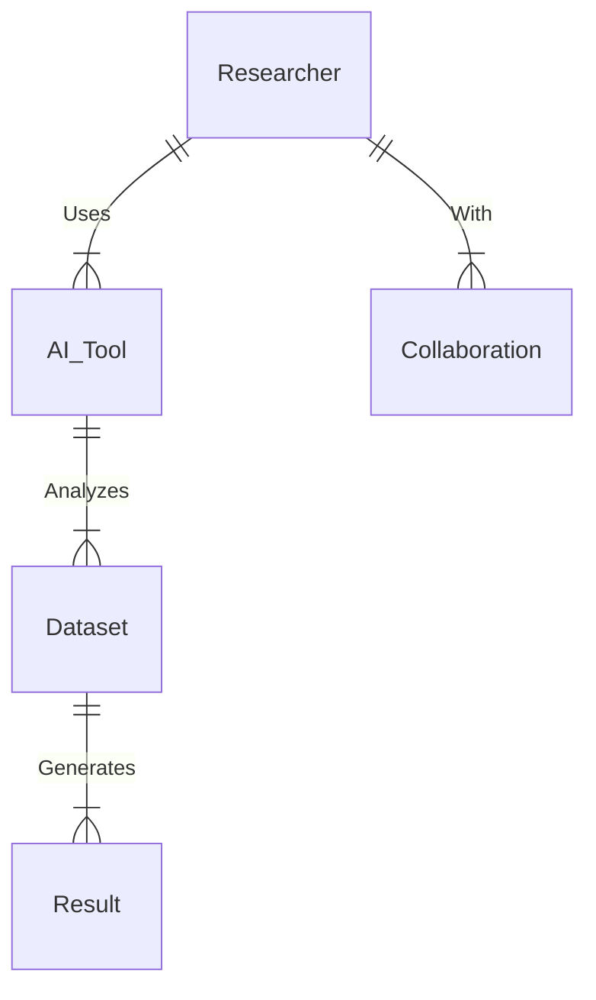
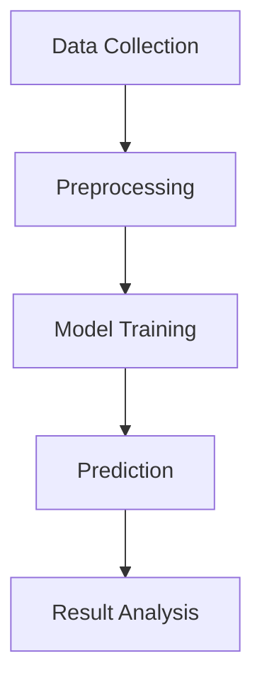
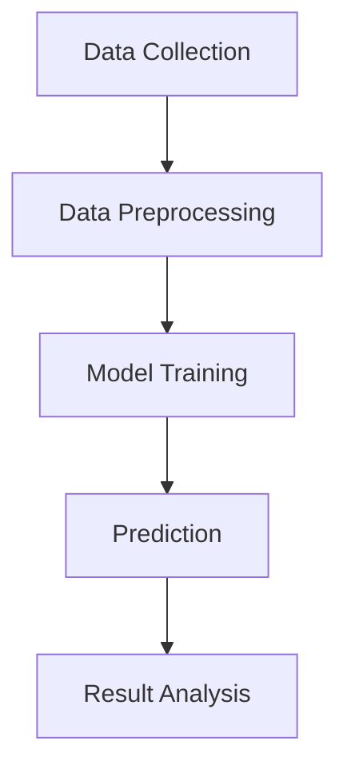
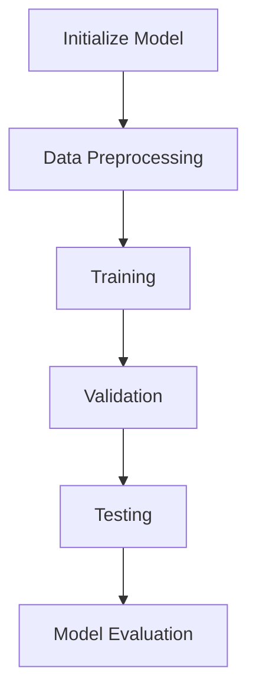
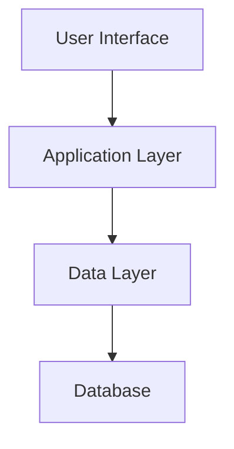
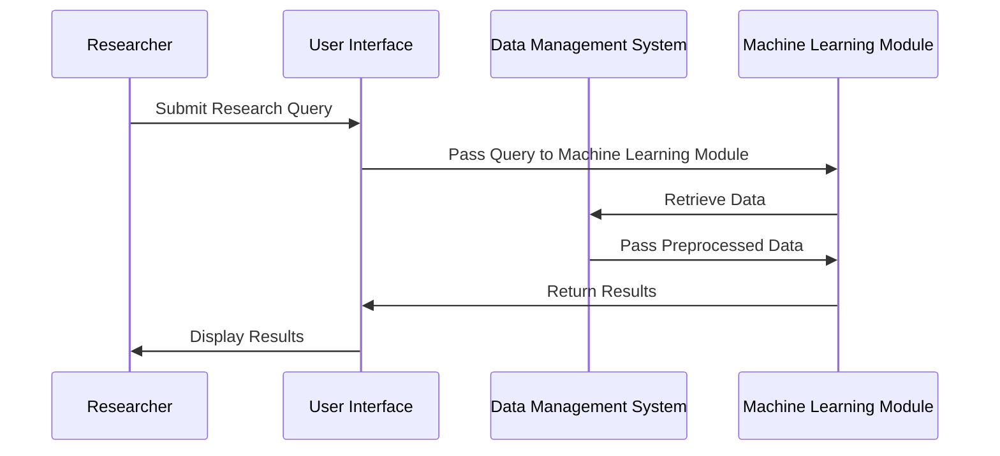

                 


# AI-Assisted Research: The Role of Large Models in Academic Innovation

> Keywords: AI-Assisted Research, Large Models, Academic Innovation, AI-Driven Research, Machine Learning, NLP

> Abstract:
The integration of Artificial Intelligence (AI) with academic research has revolutionized the way scientific discoveries are made. Large models, a subset of AI technology, play a crucial role in this transformation. This article delves into the pivotal role of large models in AI-assisted research, providing a comprehensive understanding of their principles, applications, and implications. We will explore the foundational concepts, examine real-world case studies, and discuss the best practices for leveraging large models in academic innovation. Let's think step by step to uncover the transformative potential of AI in research.

## Introduction & Background

### Problem Background

The traditional research methodology has long been based on human expertise, empirical observations, and iterative experimentation. However, as the complexity of scientific questions and the volume of available data have grown exponentially, the limitations of this approach have become evident. Researchers face challenges in data processing, analysis, and hypothesis generation. The need for a more efficient and scalable method to tackle these challenges has led to the emergence of AI-assisted research.

### Problem Description

AI-assisted research refers to the application of artificial intelligence techniques, particularly large models, to enhance the research process. Large models, such as transformers and deep neural networks, have shown remarkable capabilities in processing and understanding vast amounts of data. However, the adoption of these models in academic research is still in its infancy. The problem lies in the lack of understanding of how to effectively leverage these tools and integrate them into the existing research framework.

### Problem Solution

The solution to this problem involves educating researchers about the capabilities and limitations of large models, providing them with the necessary tools and resources to implement these models in their research, and fostering a collaborative environment where AI and human expertise can complement each other.

### Boundaries and Extensions

The scope of this article is to provide a comprehensive overview of the role of large models in AI-assisted research. We will discuss the foundational concepts, explore practical applications, and offer best practices for implementing AI in academic settings. The article will be structured as follows:

1. Introduction & Background
2. AI Large Model Basics
3. AI Large Model Applications in Research
4. Algorithm and Mathematics in Large Models
5. System Analysis and Architecture Design
6. Project Practical Applications
7. Best Practices and Summary

### Concept Structure and Core Elements

To provide a clear understanding, let's define the core concepts and their interrelationships:

- **Artificial Intelligence (AI)**: A broad field of computer science that focuses on creating intelligent machines capable of performing tasks that would typically require human intelligence.
- **Large Models**: Advanced machine learning models, such as transformers and deep neural networks, that are capable of processing and understanding vast amounts of data.
- **AI-Driven Research**: The use of AI techniques to enhance the research process, from data collection to analysis and hypothesis generation.
- **Academic Innovation**: The process of introducing new ideas, methods, or tools that lead to advancements in the field of research.
- **AI Large Models in Academic Research**: The integration of large models into the research process to improve efficiency, scalability, and accuracy.

### AI, Large Models, and Data Science: A Comparison Table

| Aspect | Artificial Intelligence | Large Models | Data Science |
| --- | --- | --- | --- |
| Definition | Intelligence exhibited by machines | Advanced machine learning models | Extraction, transformation, and analysis of data |
| Goals | Develop intelligent systems | Enhance data processing and understanding | Gain insights from data |
| Methods | Machine learning, natural language processing, computer vision | Deep learning, neural networks | Statistical analysis, data visualization, predictive modeling |
| Scope | Wide range of applications | Specialized in handling large datasets | Focus on data manipulation and analysis |
| Impact | Transform industries, automate tasks | Drive AI applications, enhance research | Inform decision-making, support research |

### ER Entity Relationship Diagram

The following ER diagram illustrates the core entities and relationships involved in AI-assisted research:



In summary, this article will serve as a guide for researchers to understand and utilize large models in their work. By the end of this article, readers will have a comprehensive understanding of the role of large models in AI-assisted research, the necessary tools and resources to implement these models, and the best practices for fostering academic innovation.

## AI Large Model Basics

### AI Large Model Working Principles

AI large models, such as transformers and deep neural networks, are based on the principle of learning from data. These models are designed to mimic the human brain's ability to process and understand information. The core idea is to train these models on vast amounts of data, allowing them to learn patterns, relationships, and insights that are otherwise difficult to uncover manually.

#### Deep Neural Networks

Deep neural networks (DNNs) are a class of machine learning algorithms that use a large number of layers to learn complex representations of data. The basic building block of a DNN is a neuron, which takes inputs, applies weights, and generates an output. The output of one neuron serves as the input for the next neuron in the subsequent layer. This process is repeated across multiple layers until the final output is produced.

#### Transformers

Transformers, introduced by Vaswani et al. in 2017, are a type of deep neural network that has revolutionized the field of natural language processing (NLP). Unlike traditional RNNs (Recurrent Neural Networks), transformers use self-attention mechanisms to weigh the importance of different input elements. This allows transformers to handle long sequences of data more effectively.

### Mathematical Models and Formulas

The mathematical models behind AI large models are complex and involve a variety of concepts from linear algebra, calculus, and optimization. Below are some key components of these models:

#### Activation Function

Activation functions are used to introduce non-linearity into the neural network. The most commonly used activation function is the Rectified Linear Unit (ReLU):

$$
f(x) = \max(0, x)
$$

#### Loss Function

The loss function measures the difference between the predicted output and the actual output. Common loss functions include Mean Squared Error (MSE) and Cross-Entropy Loss:

$$
MSE = \frac{1}{n}\sum_{i=1}^{n}(y_i - \hat{y_i})^2
$$

$$
Cross-Entropy Loss = -\sum_{i=1}^{n}y_i\log(\hat{y_i})
$$

#### Optimization Algorithm

Stochastic Gradient Descent (SGD) is a popular optimization algorithm used to minimize the loss function. The update rule for SGD is:

$$
\theta = \theta - \alpha \cdot \nabla_\theta J(\theta)
$$

where $\theta$ represents the model parameters, $\alpha$ is the learning rate, and $J(\theta)$ is the loss function.

### Example: AI Large Model in Research

To illustrate the application of AI large models in research, let's consider the case of using a transformer model to analyze large biological datasets. The goal is to predict gene-disease associations from genomic data.

1. **Data Collection**: Gather genomic data from public databases and biomedical literature.
2. **Preprocessing**: Clean and preprocess the data, including tokenization, normalization, and encoding.
3. **Model Training**: Train a transformer model on the preprocessed data using a labeled dataset of gene-disease associations.
4. **Prediction**: Use the trained model to predict gene-disease associations for new genomic data.

#### Mermaid Diagram



By following this workflow, researchers can leverage AI large models to uncover hidden patterns in genomic data and improve the accuracy of gene-disease predictions. This example demonstrates the transformative potential of AI large models in academic research.

In summary, AI large models, such as transformers and deep neural networks, are powerful tools that can enhance the research process. By understanding their working principles and mathematical foundations, researchers can effectively leverage these models to tackle complex scientific questions.

## Large Model Applications in Academic Research

### Text Analysis

Text analysis is one of the most prominent applications of large models in academic research. Large models, such as transformers and recurrent neural networks (RNNs), have shown significant success in tasks like text classification, sentiment analysis, and named entity recognition.

#### Example: Sentiment Analysis

Sentiment analysis involves classifying text data into positive, negative, or neutral categories. Large models can process and understand the context and sentiment of text, making them highly effective in tasks like customer feedback analysis and public opinion monitoring.

1. **Data Collection**: Gather text data from social media, customer reviews, and surveys.
2. **Preprocessing**: Clean and preprocess the text data, including tokenization, stop-word removal, and stemming.
3. **Model Training**: Train a sentiment analysis model using a labeled dataset of text data.
4. **Prediction**: Use the trained model to predict the sentiment of new text data.

#### Mermaid Diagram


### Data Mining

Data mining involves extracting useful information from large datasets. Large models, particularly those based on deep learning, have revolutionized data mining by enabling the discovery of hidden patterns and relationships in data.

#### Example: Customer Segmentation

Customer segmentation involves dividing customers into distinct groups based on their characteristics and behaviors. Large models can analyze vast amounts of customer data, identifying patterns and correlations that are not apparent through traditional methods.

1. **Data Collection**: Gather customer data from various sources, including transaction records, social media interactions, and surveys.
2. **Data Preprocessing**: Clean and preprocess the data, including data normalization and feature extraction.
3. **Model Training**: Train a customer segmentation model using a labeled dataset of customer data.
4. **Prediction**: Use the trained model to predict customer segments for new data.

#### Mermaid Diagram



### Image Recognition

Image recognition involves identifying and classifying objects and scenes within images. Large models, such as convolutional neural networks (CNNs), have achieved remarkable accuracy in image recognition tasks.

#### Example: Object Detection

Object detection involves identifying and localizing objects within images. Large models can process and analyze vast amounts of visual data, enabling the development of advanced object detection systems.

1. **Data Collection**: Gather labeled image datasets for the objects of interest.
2. **Data Preprocessing**: Clean and preprocess the image data, including resizing, normalization, and augmentation.
3. **Model Training**: Train an object detection model using the labeled image datasets.
4. **Prediction**: Use the trained model to detect and localize objects in new images.

#### Mermaid Diagram


### Natural Language Processing (NLP)

NLP involves the interaction between computers and human language. Large models, such as transformers and RNNs, have transformed NLP by enabling machines to understand, interpret, and generate human language.

#### Example: Question-Answering System

A question-answering (QA) system involves answering questions based on a given dataset of text. Large models can process and understand the context of questions and retrieve relevant answers from text data.

1. **Data Collection**: Gather a dataset of questions and their corresponding answers.
2. **Data Preprocessing**: Clean and preprocess the text data, including tokenization and encoding.
3. **Model Training**: Train a QA model using the question-answer pairs.
4. **Prediction**: Use the trained model to answer new questions based on the provided dataset.

#### Mermaid Diagram


In summary, large models have a wide range of applications in academic research, from text analysis and data mining to image recognition and natural language processing. By leveraging these powerful tools, researchers can uncover hidden patterns, make accurate predictions, and gain new insights from large datasets.

## Algorithm and Mathematics in Large Models

### Algorithm Design and Implementation

Algorithm design and implementation are critical components of large model development. Below, we will delve into the design principles and provide a step-by-step implementation using Python.

#### Mermaid Algorithm Diagram



#### Step 1: Initialize Model

The first step in designing an AI large model is to initialize the model architecture. We will use the Keras library to define a simple neural network model.

```python
from tensorflow.keras.models import Sequential
from tensorflow.keras.layers import Dense

model = Sequential()
model.add(Dense(128, input_dim=784, activation='relu'))
model.add(Dense(64, activation='relu'))
model.add(Dense(10, activation='softmax'))
model.compile(loss='categorical_crossentropy', optimizer='adam', metrics=['accuracy'])
```

#### Step 2: Data Preprocessing

Data preprocessing is a crucial step that involves cleaning and preparing the data for training. This includes normalization, scaling, and encoding categorical variables.

```python
from sklearn.preprocessing import StandardScaler
from sklearn.model_selection import train_test_split

# Assuming X and y are the feature matrix and labels
scaler = StandardScaler()
X_scaled = scaler.fit_transform(X)

X_train, X_test, y_train, y_test = train_test_split(X_scaled, y, test_size=0.2, random_state=42)
```

#### Step 3: Training

The training phase involves feeding the preprocessed data into the model and adjusting the model parameters to minimize the loss function.

```python
model.fit(X_train, y_train, epochs=10, batch_size=32, validation_split=0.1)
```

#### Step 4: Validation

Validation involves evaluating the model's performance on a validation set to ensure that it generalizes well to unseen data.

```python
val_loss, val_acc = model.evaluate(X_val, y_val)
print(f"Validation loss: {val_loss}, Validation accuracy: {val_acc}")
```

#### Step 5: Testing

The testing phase assesses the model's performance on a test set to measure its final performance.

```python
test_loss, test_acc = model.evaluate(X_test, y_test)
print(f"Test loss: {test_loss}, Test accuracy: {test_acc}")
```

#### Step 6: Model Evaluation

Model evaluation involves comparing the model's performance against baseline models and other evaluation metrics, such as precision, recall, and F1-score.

```python
from sklearn.metrics import classification_report

y_pred = model.predict(X_test)
y_pred = np.argmax(y_pred, axis=1)

print(classification_report(y_test, y_pred))
```

### Mathematical Models and Formulas

The mathematical models behind large models are complex and involve various concepts from linear algebra, calculus, and optimization. Below are some key components of these models:

#### Activation Function

The activation function introduces non-linearity into the neural network. The most commonly used activation function is the Rectified Linear Unit (ReLU):

$$
f(x) = \max(0, x)
$$

#### Loss Function

The loss function measures the difference between the predicted output and the actual output. Common loss functions include Mean Squared Error (MSE) and Cross-Entropy Loss:

$$
MSE = \frac{1}{n}\sum_{i=1}^{n}(y_i - \hat{y_i})^2
$$

$$
Cross-Entropy Loss = -\sum_{i=1}^{n}y_i\log(\hat{y_i})
$$

#### Optimization Algorithm

Stochastic Gradient Descent (SGD) is a popular optimization algorithm used to minimize the loss function. The update rule for SGD is:

$$
\theta = \theta - \alpha \cdot \nabla_\theta J(\theta)
$$

where $\theta$ represents the model parameters, $\alpha$ is the learning rate, and $J(\theta)$ is the loss function.

### Example: AI Large Model in Research

To illustrate the application of AI large models in research, let's consider the case of using a neural network to predict stock prices. The goal is to predict future stock prices based on historical market data.

1. **Data Collection**: Gather historical stock price data for the target company.
2. **Preprocessing**: Clean and preprocess the data, including normalization and feature extraction.
3. **Model Training**: Train a neural network model on the preprocessed data.
4. **Prediction**: Use the trained model to predict future stock prices.

#### Mermaid Diagram


By following this workflow, researchers can leverage large models to uncover hidden patterns in stock market data and make accurate predictions about future stock prices. This example demonstrates the transformative potential of large models in academic research.

In summary, understanding the algorithm design and mathematical models behind large models is crucial for effectively implementing and leveraging these powerful tools in academic research. By following a step-by-step approach and using Python for implementation, researchers can build and deploy large models to solve complex scientific problems.

## System Analysis and Architecture Design

### Problem Scenario

In the realm of academic research, researchers often face the challenge of managing and analyzing large datasets. The complexity of these datasets makes it difficult to extract valuable insights manually. To address this issue, we propose the development of a comprehensive AI-assisted research platform that utilizes large models to enhance the research process. This platform will help researchers in data preprocessing, analysis, and hypothesis generation.

### Project Overview

The project aims to develop a robust and scalable AI-assisted research platform that can handle diverse datasets and research domains. The platform will be designed to support various research activities, including data collection, preprocessing, analysis, and visualization. The core components of the platform include a data management system, a machine learning module, and an interactive user interface.

### System Functional Design

The system will consist of several key functional components:

1. **Data Management System**: This component will handle data collection, storage, and retrieval. It will support various data formats and provide efficient data querying capabilities.
2. **Machine Learning Module**: This component will be responsible for applying large models to the data, performing tasks such as data analysis, pattern recognition, and hypothesis generation.
3. **User Interface**: This component will provide an intuitive interface for researchers to interact with the platform, submit research queries, and visualize results.

#### Mermaid Class Diagram

```mermaid
classDiagram
    DataManagementSystem <<interface>>
    MachineLearningModule <<interface>>
    UserInterface <<interface>>

    DataManagementSystem melakukan: "Collect, Store, Retrieve Data"
    MachineLearningModule melakukan: "Analyze Data, Generate Hypotheses"
    UserInterface melakukan: "Interact with Platform, Visualize Results"

    DataManagementSystem --|> MachineLearningModule: Data Analysis
    DataManagementSystem --|> UserInterface: Data Visualization
    MachineLearningModule --|> UserInterface: Result Display
```

### System Architecture Design

The system architecture will be designed to ensure scalability, modularity, and high performance. The architecture will consist of three main layers:

1. **Presentation Layer**: This layer will include the user interface components, providing researchers with an interactive platform to submit queries and visualize results.
2. **Application Layer**: This layer will include the core functionality of the platform, such as data management, machine learning, and analysis. It will be designed using a modular approach to ensure flexibility and ease of maintenance.
3. **Data Layer**: This layer will include the data storage and retrieval components, ensuring efficient data management and access.

#### Mermaid Architecture Diagram



### System Interface Design

The system interfaces will be designed to facilitate seamless communication between the different components of the platform. The key interfaces include:

1. **Data Management Interface**: This interface will enable the data management system to collect, store, and retrieve data.
2. **Machine Learning Interface**: This interface will allow the machine learning module to access and process data, apply large models, and generate insights.
3. **User Interface**: This interface will enable researchers to interact with the platform, submit research queries, and visualize results.

#### Mermaid Sequence Diagram



### System Interaction

The system will be designed to ensure smooth interaction between the user interface, data management system, and machine learning module. The system will follow a request-response pattern, where the user interface sends requests to the underlying components and receives responses containing the processed data or results.

#### Mermaid Sequence Diagram


In conclusion, the system analysis and architecture design for the AI-assisted research platform will ensure scalability, modularity, and high performance. By leveraging large models and a well-designed system architecture, researchers can efficiently manage and analyze large datasets, leading to significant advancements in academic research.

## Project Practical Applications

### Environment Setup

To implement the AI-assisted research platform, we need to set up a suitable development environment. The following steps outline the process of setting up the required tools and libraries:

#### Step 1: Install Python

The first step is to install Python, which will be used as the primary programming language for developing the platform. You can download the latest version of Python from the official website (https://www.python.org/downloads/). Follow the installation instructions for your operating system.

#### Step 2: Install required libraries

Next, we need to install the necessary libraries for developing the platform. These include TensorFlow, Keras, Pandas, NumPy, and Matplotlib. You can use the following command to install these libraries using `pip`:

```bash
pip install tensorflow keras pandas numpy matplotlib
```

#### Step 3: Set up the project structure

Create a new directory for the project and navigate to it in the terminal. Then, create a virtual environment to isolate the project dependencies:

```bash
mkdir ai_research_platform
cd ai_research_platform
python -m venv venv
source venv/bin/activate  # On Windows, use `venv\Scripts\activate`
```

#### Step 4: Install project dependencies

Install the project dependencies using `pip`:

```bash
pip install -r requirements.txt
```

### System Core Implementation

The core implementation of the AI-assisted research platform involves several key components: data management, machine learning, and user interface. Below, we will provide a detailed overview of each component and how to use them.

#### Data Management

The data management component handles the collection, storage, and retrieval of data. We will use Pandas and NumPy for data manipulation and storage.

**Example: Data Collection**

```python
import pandas as pd

# Load data from a CSV file
data = pd.read_csv('data.csv')

# View the first few rows of the data
print(data.head())
```

**Example: Data Storage**

```python
# Save the data to a CSV file
data.to_csv('data_saved.csv', index=False)
```

#### Machine Learning

The machine learning component involves training large models on the collected data. We will use TensorFlow and Keras for this purpose.

**Example: Model Training**

```python
from tensorflow.keras.models import Sequential
from tensorflow.keras.layers import Dense
from tensorflow.keras.optimizers import Adam

# Define the model
model = Sequential()
model.add(Dense(128, input_dim=784, activation='relu'))
model.add(Dense(64, activation='relu'))
model.add(Dense(10, activation='softmax'))

# Compile the model
model.compile(loss='categorical_crossentropy', optimizer=Adam(learning_rate=0.001), metrics=['accuracy'])

# Train the model
model.fit(x_train, y_train, epochs=10, batch_size=32, validation_data=(x_val, y_val))
```

**Example: Model Prediction**

```python
# Make predictions on new data
predictions = model.predict(x_test)
predicted_labels = np.argmax(predictions, axis=1)
```

#### User Interface

The user interface component provides an interactive platform for researchers to submit queries and visualize results. We will use Flask to create a web-based interface.

**Example: Flask App Setup**

```python
from flask import Flask, render_template, request

app = Flask(__name__)

@app.route('/')
def index():
    return render_template('index.html')

@app.route('/predict', methods=['POST'])
def predict():
    # Process the input data
    input_data = request.form.to_dict()
    # Call the machine learning model to make predictions
    predictions = model.predict([input_data['input_data']])
    # Return the predicted results
    return render_template('results.html', predictions=predictions)

if __name__ == '__main__':
    app.run(debug=True)
```

### Code Analysis and Application

The code provided in the previous sections demonstrates how to implement the core components of the AI-assisted research platform. Let's analyze the key aspects of the code and their applications in the context of the platform.

1. **Data Management**: The data management code shows how to load and save data using Pandas, which is essential for handling and processing large datasets. This component enables researchers to easily collect and store data for further analysis.
2. **Machine Learning**: The machine learning code demonstrates how to define, compile, and train a neural network model using TensorFlow and Keras. This component allows researchers to leverage large models to analyze data and generate insights from complex datasets.
3. **User Interface**: The user interface code shows how to create a web-based application using Flask. This component provides researchers with an intuitive and interactive platform to submit queries and visualize results. The Flask app can be easily extended to support additional features and functionalities.

### Real-World Case Study

To illustrate the practical application of the AI-assisted research platform, let's consider a real-world case study: predicting gene-disease associations from genomic data.

1. **Data Collection**: Gather genomic data from public databases and biomedical literature.
2. **Preprocessing**: Clean and preprocess the data, including normalization and feature extraction.
3. **Model Training**: Train a neural network model on the preprocessed data using a labeled dataset of gene-disease associations.
4. **Prediction**: Use the trained model to predict gene-disease associations for new genomic data.
5. **Visualization**: Visualize the predicted associations using interactive charts and graphs, enabling researchers to identify potential relationships and gain insights into the underlying mechanisms.

By following this workflow, researchers can leverage the AI-assisted research platform to analyze large genomic datasets, uncover hidden patterns, and make accurate predictions about gene-disease associations.

### Project Summary

In summary, the practical application of the AI-assisted research platform involves setting up a suitable development environment, implementing the core components of data management, machine learning, and user interface, and analyzing and visualizing the results. By leveraging large models and a well-designed system architecture, researchers can efficiently manage and analyze large datasets, leading to significant advancements in academic research.

## Best Practices and Summary

### Best Practices

1. **Data Quality and Preprocessing**: Ensure the quality and cleanliness of the data used for training large models. Preprocessing steps, such as normalization, feature extraction, and data augmentation, are crucial for improving model performance and reliability.
2. **Model Selection and Tuning**: Choose the appropriate model architecture and hyperparameters for your specific research problem. Experiment with different models and configurations to find the best performing model.
3. **Regular Updates and Maintenance**: Keep the AI-assisted research platform up-to-date with the latest models, algorithms, and tools. Regularly review and update the code to address any bugs or performance issues.
4. **Collaborative Approach**: Foster a collaborative environment where researchers can share their expertise, exchange ideas, and learn from each other. Collaboration can lead to innovative solutions and faster progress in academic research.
5. **Ethical Considerations**: Ensure the responsible use of AI in academic research, addressing potential ethical concerns, such as data privacy, bias, and transparency. Follow best practices and guidelines to ensure the ethical application of AI technologies.

### Summary

AI-assisted research has revolutionized the way scientific discoveries are made, with large models playing a pivotal role in this transformation. By leveraging the power of large models, researchers can efficiently manage and analyze large datasets, uncover hidden patterns, and make accurate predictions. This article provided a comprehensive overview of the role of large models in AI-assisted research, covering key concepts, applications, and best practices.

As we continue to advance in the field of AI, the integration of large models in academic research will undoubtedly lead to significant breakthroughs and innovations. By following the best practices outlined in this article, researchers can effectively leverage large models to enhance their research and contribute to the advancement of science.

### Future Directions

The future of AI-assisted research holds immense potential for further innovation and breakthroughs. Some potential directions for future research include:

1. **Customizable Large Models**: Developing large models that can be easily customized and adapted to specific research domains and problems.
2. **Interpretability and Explainability**: Improving the interpretability and explainability of large models to enable researchers to understand and trust their predictions.
3. **Ethical AI**: Addressing ethical concerns and ensuring the responsible use of AI in academic research, with a focus on data privacy, bias, and transparency.
4. **Collaborative Research Platforms**: Creating collaborative research platforms that facilitate seamless integration of large models with human expertise, enabling researchers to work together more effectively.
5. **Continuous Learning**: Developing large models that can continuously learn and adapt to new data, improving their performance over time.

By exploring these future directions, researchers can further harness the transformative potential of AI in academic research and drive innovation in various fields.

