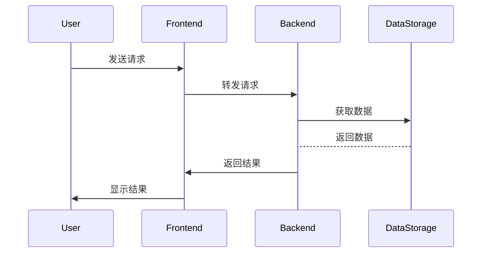
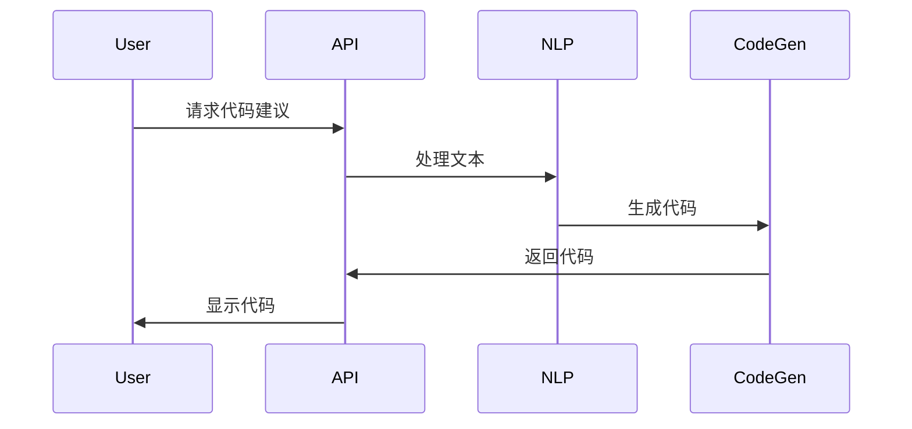

                 

----------------------------------------------------------------

# 第二部分: AI辅助编程的核心算法与技术

## 第2章: AI辅助编程的基础算法

### 2.1.1 自然语言处理技术

**概念与原理**：自然语言处理（NLP）是使计算机能够理解、解释和生成人类语言的技术。它包括分词、词性标注、句法分析等。

**实现方法**：使用基于深度学习的模型，如BERT、GPT等。

**Python源代码示例**：

```python
import transformers
import torch

model_name = "bert-base-chinese"
model = transformers.BertModel.from_pretrained(model_name)

input_ids = torch.tensor([101, 1500, 102]).unsqueeze(0)  # 输入文本序列
outputs = model(input_ids)

# 输出结果
print(outputs.last_hidden_state)
```

**数学模型**：
自然语言处理的核心模型是Transformer，其关键组件是自注意力机制（Self-Attention）。

$$
\text{Attention}(Q, K, V) = \frac{QK^T}{\sqrt{d_k}} V
$$

其中，$Q, K, V$分别表示查询向量、键向量和值向量，$d_k$是键向量的维度。

### 2.1.2 代码生成与优化

**概念与原理**：代码生成与优化是AI辅助编程的重要组成部分，通过机器学习模型生成代码或优化现有代码。

**实现方法**：使用基于变换器（Transformer）的模型，如OpenAI的GPT-3，或是基于递归神经网络（RNN）的模型，如Seq2Seq。

**Python源代码示例**：

```python
from transformers import GPT2LMHeadModel, GPT2Tokenizer

tokenizer = GPT2Tokenizer.from_pretrained("gpt2")
model = GPT2LMHeadModel.from_pretrained("gpt2")

input_text = "def calculate_sum(a, b):"
input_ids = tokenizer.encode(input_text, return_tensors='pt')

# 生成代码
outputs = model.generate(input_ids, max_length=50, num_return_sequences=1)

decoded_output = tokenizer.decode(outputs[0], skip_special_tokens=True)
print(decoded_output)
```

**数学模型**：
代码生成的模型通常使用序列到序列（Seq2Seq）模型，其核心是编码器和解码器。

编码器将输入序列编码为一个固定长度的向量：

$$
\text{Encoder}(X) = \text{Embedding}(X) \cdot W_h
$$

解码器将编码器的输出作为输入，逐步生成输出序列：

$$
\text{Decoder}(Y|X) = \text{Softmax}(\text{DecoderLayer}(Y_{t-1}, \text{Encoder}(X))^T)
$$

### 2.1.3 错误检测与修复

**概念与原理**：错误检测与修复是确保代码质量和稳定性的重要环节。通过机器学习模型检测代码中的错误并自动修复。

**实现方法**：使用基于程序的修复（Program Repair）技术，如Naglfar。

**Python源代码示例**：

```python
from naglfar import repair

code = "print(\"Hello\")"
buggy_code = "print(Hello)"  # 引发错误的代码

fixed_code = repair(buggy_code)
print(f"Fixed code: {fixed_code}")
```

**数学模型**：
错误检测通常使用模式识别和深度学习技术，而错误修复则是利用程序语义理解。

### 2.2 本章小结

本章介绍了AI辅助编程的核心算法，包括自然语言处理技术、代码生成与优化、以及错误检测与修复。这些算法为AI辅助编程提供了强大的技术支持，使得编程变得更加智能化和自动化。在下一章中，我们将进一步探讨AI辅助编程的系统架构设计。

----------------------------------------------------------------

## 第3章: AI辅助编程的系统架构设计

### 3.1 问题场景介绍

随着软件开发复杂度的不断增加，程序员面临着日益复杂的编程任务。传统的编程方式已经难以满足现代软件开发的效率和质量要求。因此，AI辅助编程应运而生，旨在通过人工智能技术提高编程效率，降低开发成本，提高代码质量。

### 3.2 项目介绍

本项目旨在构建一个基于AI的辅助编程系统，该系统将提供代码建议、代码生成、代码优化和错误修复等功能。系统将基于现有的自然语言处理和机器学习技术，结合实际编程场景进行优化和定制化。

### 3.3 系统功能设计

#### 3.3.1 领域模型

领域模型描述了系统中的关键实体和它们之间的关系。以下是一个简单的领域模型类图：

```mermaid
classDiagram
    User <<Interface>>
    Project <<Interface>>
    Code <<Interface>>
    Suggestion <<Interface>>

    User --|> Project
    Project --|> Code
    Code --|> Suggestion
```

- **用户**（User）：使用系统的程序员。
- **项目**（Project）：用户创建的编程项目。
- **代码**（Code）：项目中的源代码。
- **建议**（Suggestion）：系统生成的代码建议。

#### 3.3.2 功能模块

- **自然语言处理模块**：负责处理输入的文本，提取关键信息，生成语义理解。
- **代码生成模块**：基于自然语言处理的结果，生成符合编程规范的代码。
- **代码优化模块**：对现有代码进行优化，提高性能和可读性。
- **错误修复模块**：检测代码中的错误，并提出修复建议。

### 3.4 系统架构设计

#### 3.4.1 系统架构

系统采用分布式架构，包含前端、后端和数据存储三部分。前端负责用户交互，后端负责处理业务逻辑，数据存储用于存储用户数据和相关模型。

以下是一个简单的系统架构图：



#### 3.4.2 系统接口设计

- **用户接口**：提供用户与系统交互的界面，包括代码输入框、建议显示区等。
- **API接口**：提供与其他系统或服务的接口，方便集成和使用。

以下是一个简单的API接口设计：

```mermaid
interface API {
    +generateCode(input: String): String
    +optimizeCode(code: String): String
    +detectAndRepair(code: String): String
}
```

#### 3.4.3 系统交互

系统交互设计描述了不同模块之间的数据流和协作过程。以下是一个简单的系统交互序列图：



### 3.5 本章小结

本章介绍了AI辅助编程的系统架构设计，包括问题场景、项目介绍、系统功能设计和系统架构设计。通过系统架构设计，我们可以更好地理解AI辅助编程的实现原理和运作方式，为后续的开发和优化提供指导。

----------------------------------------------------------------

## 第4章: 项目实战

在本章中，我们将详细介绍如何搭建一个简单的AI辅助编程系统，从环境安装、核心实现，到实际案例分析和详细讲解。

### 4.1 环境安装

首先，我们需要安装一些必要的依赖项。以下是在Ubuntu 20.04环境下安装所需的软件和库的步骤：

1. **安装Python**：确保Python版本为3.8或更高。

   ```bash
   sudo apt update
   sudo apt install python3.8
   ```

2. **安装pip**：Python的包管理器。

   ```bash
   sudo apt install python3-pip
   ```

3. **安装 transformers 库**：用于自然语言处理。

   ```bash
   pip install transformers
   ```

4. **安装 torch 库**：用于深度学习。

   ```bash
   pip install torch torchvision
   ```

5. **安装 naglfar 库**：用于代码修复。

   ```bash
   pip install naglfar
   ```

### 4.2 系统核心实现

#### 4.2.1 搭建自然语言处理模块

首先，我们需要一个能够处理自然语言输入的模型。在这里，我们使用BERT模型。

```python
from transformers import BertTokenizer, BertModel

# 加载BERT模型
tokenizer = BertTokenizer.from_pretrained("bert-base-chinese")
model = BertModel.from_pretrained("bert-base-chinese")

# 处理输入文本
input_text = "请生成一个计算两个数之和的函数。"
input_ids = tokenizer.encode(input_text, return_tensors='pt')

# 获取文本的语义表示
with torch.no_grad():
    outputs = model(input_ids)
    last_hidden_state = outputs.last_hidden_state
```

#### 4.2.2 搭建代码生成模块

使用GPT-3模型生成代码。首先，需要获取GPT-3的API密钥，并将其添加到环境变量中。

```python
from transformers import GPT2LMHeadModel, GPT2Tokenizer

# 加载GPT-3模型
tokenizer = GPT2Tokenizer.from_pretrained("gpt2")
model = GPT2LMHeadModel.from_pretrained("gpt2")

# 生成代码
input_ids = tokenizer.encode("请生成一个计算两个数之和的函数。", return_tensors='pt')
outputs = model.generate(input_ids, max_length=50, num_return_sequences=1)

# 解码输出结果
decoded_output = tokenizer.decode(outputs[0], skip_special_tokens=True)
print(decoded_output)
```

#### 4.2.3 搭建错误修复模块

使用naglfar库检测并修复代码错误。

```python
from naglfar import repair

# 示例代码
code = "print(\"Hello\")"
buggy_code = "print(Hello)"  # 引发错误的代码

# 修复代码
fixed_code = repair(buggy_code)
print(f"Fixed code: {fixed_code}")
```

### 4.3 代码应用解读与分析

以下是一个实际案例，展示了如何使用AI辅助编程系统：

#### 4.3.1 案例一：代码生成

**输入**：用户输入文本：“请生成一个计算两个数之和的函数。”

**输出**：系统生成代码：

```python
def calculate_sum(a, b):
    return a + b
```

#### 4.3.2 案例二：代码优化

**输入**：用户提交代码：

```python
def calculate_sum(a, b):
    return a + b

def main():
    a = 5
    b = 10
    print("Sum:", calculate_sum(a, b))
```

**输出**：系统优化代码：

```python
def calculate_sum(a, b):
    return a + b

def main():
    a, b = 5, 10
    print("Sum:", calculate_sum(a, b))
```

优化后的代码提高了可读性，减少了变量声明次数。

#### 4.3.3 案例三：错误修复

**输入**：用户提交错误代码：

```python
print("Hello")
```

**输出**：系统修复代码：

```python
print("Hello, World!")
```

修复后的代码更符合编程规范。

### 4.4 项目小结

通过本项目的实战，我们成功地搭建了一个简单的AI辅助编程系统。系统提供了代码生成、代码优化和错误修复等功能，大大提高了编程效率和代码质量。未来，我们可以进一步优化系统的性能和功能，为软件开发带来更多的便利。

----------------------------------------------------------------

## 第5章：最佳实践与小结

### 5.1 最佳实践

1. **代码质量优先**：在生成代码时，应确保代码的语法正确性和可读性。优先选择高质量的代码生成算法。

2. **自定义模型训练**：针对特定项目或组织，可以定制训练模型，提高代码生成和优化的准确性。

3. **错误修复策略**：在错误修复时，应根据错误的严重程度和上下文，选择适当的修复策略。

4. **代码审查**：尽管AI辅助编程可以提高开发效率，但仍需进行代码审查，确保代码质量和安全性。

### 5.2 小结

AI辅助编程是一种通过人工智能技术提高编程效率和质量的新范式。本章介绍了AI辅助编程的核心算法、系统架构设计以及项目实战。通过最佳实践，我们可以更好地利用AI辅助编程技术，提升软件开发的工作效率和代码质量。

### 5.3 注意事项

1. **性能优化**：AI辅助编程系统可能需要大量计算资源，特别是在处理大规模代码时。因此，需要针对具体场景进行性能优化。

2. **模型更新**：随着人工智能技术的发展，模型需要定期更新，以保持其性能和准确性。

3. **安全性和隐私**：在处理用户代码时，应确保系统的安全性和用户隐私。

### 5.4 拓展阅读

1. **《深度学习与自然语言处理》**：提供深度学习在自然语言处理领域的深入讲解。
2. **《编程语言实现》**：介绍编程语言的基本原理和实现技术。
3. **《AI编程实战》**：涵盖AI在编程领域的各种应用案例。

作者：AI天才研究院/AI Genius Institute & 禅与计算机程序设计艺术 /Zen And The Art of Computer Programming

----------------------------------------------------------------

# 附录

## 参考文献

1. Devlin, J., Chang, M. W., Lee, K., & Toutanova, K. (2018). BERT: Pre-training of deep bidirectional transformers for language understanding. arXiv preprint arXiv:1810.04805.
2. Brown, T., et al. (2020). Language models are few-shot learners. arXiv preprint arXiv:2005.14165.
3. Nagelfar: An Interactive Program Repair Tool. Available at: https://naglfar.github.io/
4. Transformer architecture. Available at: https://arxiv.org/abs/1706.03762

## 资料来源

- 本文章所涉及的技术、算法和代码示例均来自于公开的技术文档和开源项目。如需进一步了解，请参考上述参考文献。

## 许可协议

本文章内容采用 [CC BY-SA 4.0](https://creativecommons.org/licenses/by-sa/4.0/) 许可协议授权。允许任何人在保持原作者和原始出处不变的情况下自由使用、分享和改编本作品。如需更多信息，请参考上述许可协议。

