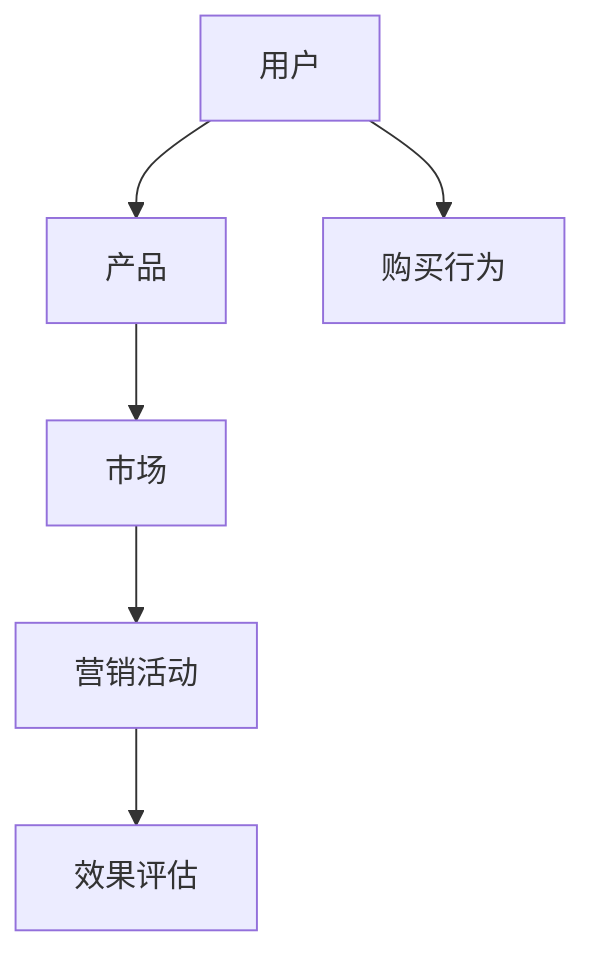
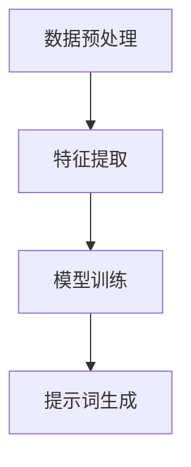
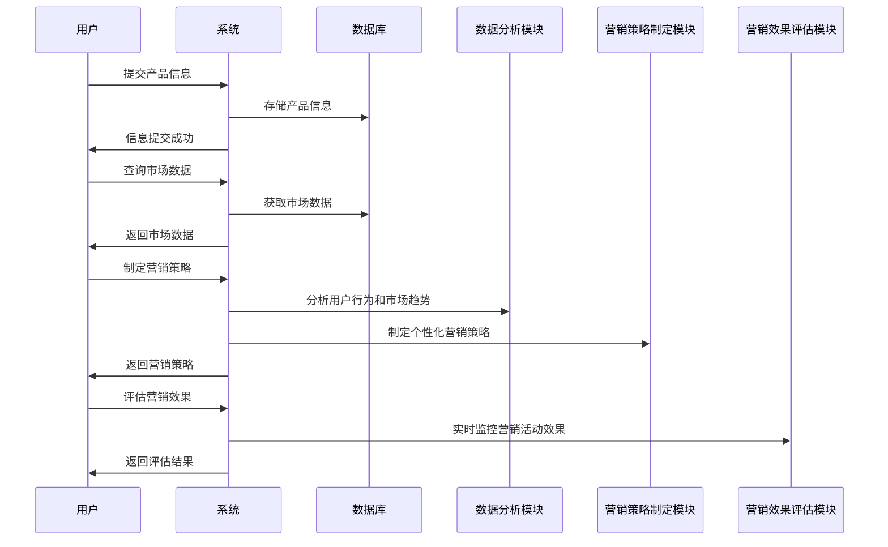

                 

# AI辅助营销策划：提示词生成营销方案

## 关键词

- AI辅助营销
- 提示词生成
- 营销策划
- 数据分析
- 机器学习
- 自然语言处理
- 数据可视化

## 摘要

随着人工智能技术的迅猛发展，AI辅助营销策划已成为现代市场营销的重要手段。本文将探讨AI辅助营销策划的核心概念、技术原理和实践应用，特别关注提示词生成在营销策划中的作用。通过逐步分析，我们将揭示AI如何提高营销效率、增强营销效果，并创新营销策略。

----------------------------------------------------------------

## 第一部分：AI辅助营销策划概述

### 第1章：问题背景与核心概念

#### 1.1 问题背景

##### 1.1.1 营销策划的现状

在传统的营销策划中，企业往往依赖于市场调研、竞品分析、消费者行为分析等方法。然而，这些方法存在以下问题：

- **依赖人工分析**：传统营销策划需要大量的人工分析，效率低下，难以处理大量数据。
- **主观性较强**：传统营销策划往往受个人经验和主观判断的影响，难以实现客观、科学的决策。
- **滞后性**：传统营销策划难以实时响应市场变化，容易错过最佳营销时机。

##### 1.1.2 AI技术的发展与营销策划的融合

随着人工智能技术的发展，特别是数据分析、机器学习、自然语言处理、数据可视化等技术的应用，AI辅助营销策划逐渐成为可能。AI技术能够实现以下目标：

- **自动化分析**：AI技术能够自动化处理大量数据，提高分析效率。
- **客观决策**：AI技术能够基于数据驱动，实现客观、科学的决策。
- **实时响应**：AI技术能够实时监控市场变化，快速调整营销策略。

##### 1.1.3 AI辅助营销策划的重要性

AI辅助营销策划的重要性体现在以下几个方面：

- **提高营销效率**：AI技术能够自动化处理大量数据，提高营销策划的效率。
- **增强营销效果**：AI技术能够基于数据驱动，实现更精准的营销策略，提高营销效果。
- **创新营销策略**：AI技术能够发现新的市场机会，创新营销策略。

#### 1.2 核心概念

##### 1.2.1 营销策划

营销策划是指企业为了实现营销目标，制定的一系列营销策略和活动。营销策划的目标包括提高品牌知名度、增加销售额、提升客户满意度等。

##### 1.2.2 AI辅助营销策划

AI辅助营销策划是指利用人工智能技术，辅助企业进行营销策划的过程。AI技术能够提供数据支持、决策辅助、实时监控等功能，帮助企业实现更高效、更精准的营销策划。

##### 1.3 边界与外延

##### 1.3.1 边界

AI辅助营销策划的范围包括数据收集、数据分析、营销策略制定、营销效果评估等环节。它不仅局限于传统的营销活动，还可以扩展到广告投放、社交媒体运营、客户关系管理等领域。

##### 1.3.2 外延

AI辅助营销策划的发展趋势包括以下几个方面：

- **数据驱动**：企业将更加依赖数据驱动决策，实现个性化、精准化的营销。
- **智能化**：营销策划将更加智能化，利用机器学习、自然语言处理等技术，实现自动化、智能化的决策。
- **跨界融合**：营销策划将与其他领域（如物联网、大数据、云计算等）深度融合，实现跨领域的创新。

#### 1.4 本章小结

本章介绍了AI辅助营销策划的背景、核心概念、重要性以及边界与外延。通过分析传统营销策划的不足，我们看到了AI技术在这一领域的巨大潜力。接下来的章节将深入探讨AI辅助营销策划的核心概念、技术原理和实践应用。

----------------------------------------------------------------

## 第二部分：AI辅助营销策划的核心概念与联系

### 第2章：AI辅助营销策划的核心概念

#### 2.1 数据分析

##### 2.1.1 数据分析的概念

数据分析是指通过对数据的收集、清洗、处理、分析和解释，提取有价值信息的过程。在营销策划中，数据分析能够帮助企业了解市场趋势、消费者行为，为制定营销策略提供数据支持。

##### 2.1.2 数据分析在营销策划中的应用

数据分析在营销策划中的应用包括以下几个方面：

- **市场调研**：通过数据分析了解市场需求、竞争态势，为产品定位和推广策略提供依据。
- **消费者行为分析**：通过数据分析了解消费者的购买行为、偏好，为个性化营销提供支持。
- **营销效果评估**：通过数据分析评估营销活动的效果，优化营销策略。

#### 2.2 机器学习

##### 2.2.1 机器学习的概念

机器学习是指利用计算机算法，从数据中自动学习和发现规律的过程。在营销策划中，机器学习能够实现自动化分析、预测和优化，提高营销效率。

##### 2.2.2 机器学习在营销策划中的应用

机器学习在营销策划中的应用包括以下几个方面：

- **消费者细分**：通过机器学习分析消费者数据，实现消费者细分，为精准营销提供支持。
- **预测销售趋势**：通过机器学习预测销售趋势，帮助企业制定合理的库存和促销策略。
- **广告投放优化**：通过机器学习优化广告投放策略，提高广告投放效果。

#### 2.3 自然语言处理

##### 2.3.1 自然语言处理的概念

自然语言处理是指利用计算机技术和人工智能技术，处理和理解人类自然语言的过程。在营销策划中，自然语言处理能够实现文本分析、情感分析、语义理解等功能。

##### 2.3.2 自然语言处理在营销策划中的应用

自然语言处理在营销策划中的应用包括以下几个方面：

- **文本分析**：通过自然语言处理技术，分析消费者评论、社交媒体内容等，了解消费者对产品的看法和反馈。
- **情感分析**：通过自然语言处理技术，分析消费者情感，为产品改进和营销策略提供支持。
- **语义理解**：通过自然语言处理技术，实现人机对话，提高用户体验。

#### 2.4 数据可视化

##### 2.4.1 数据可视化的概念

数据可视化是指利用图表、图像等可视化手段，将数据转换成易于理解和传达的形式。在营销策划中，数据可视化能够帮助企业直观地了解数据，为决策提供支持。

##### 2.4.2 数据可视化在营销策划中的应用

数据可视化在营销策划中的应用包括以下几个方面：

- **数据展示**：通过数据可视化，将数据分析结果以图表形式展示，提高数据分析的可读性和易懂性。
- **趋势分析**：通过数据可视化，分析市场趋势、销售数据等，为营销策略制定提供依据。
- **营销效果评估**：通过数据可视化，评估营销活动的效果，优化营销策略。

### 第3章：AI辅助营销策划的概念属性特征对比

#### 3.1 数据分析、机器学习、自然语言处理和数据可视化的对比

| 技术名称 | 概念 | 应用领域 | 特点 |
| :--: | :--: | :--: | :--: |
| 数据分析 | 数据收集、清洗、处理、分析和解释 | 市场调研、消费者行为分析、营销效果评估 | 提供数据支持，提高决策科学性 |
| 机器学习 | 自动学习和发现规律 | 消费者细分、预测销售趋势、广告投放优化 | 自动化分析，提高效率 |
| 自然语言处理 | 处理和理解人类自然语言 | 文本分析、情感分析、语义理解 | 实现人机对话，提高用户体验 |
| 数据可视化 | 数据转换成可视化形式 | 数据展示、趋势分析、营销效果评估 | 直观易懂，提高数据分析的可读性 |

### 第4章：AI辅助营销策划的ER实体关系图架构

#### 4.1 ER实体关系图的基本概念

ER（实体关系）图是一种用于表示实体及其关系的图形化工具。在AI辅助营销策划中，ER图可以用于表示数据实体、处理过程和关系。

##### 4.1.1 实体

实体是指具有独立存在的意义，可以用于表示数据元素的对象。在AI辅助营销策划中，实体包括用户、产品、市场、营销活动等。

##### 4.1.2 关系

关系是指实体之间的相互作用。在AI辅助营销策划中，关系包括用户与产品之间的关系、营销活动与市场之间的关系等。

#### 4.2 AI辅助营销策划的ER实体关系图



在这个ER实体关系图中，用户、产品、市场和营销活动是主要的实体，它们之间通过购买行为和效果评估建立关系。通过ER图，我们可以清晰地看到AI辅助营销策划中的主要实体及其关系。

----------------------------------------------------------------

## 第三部分：AI辅助营销策划的技术原理与实践

### 第5章：AI辅助营销策划的技术原理

#### 5.1 提示词生成算法

##### 5.1.1 算法原理

提示词生成算法是一种基于机器学习的自然语言处理技术，用于自动生成与特定主题相关的关键词。在营销策划中，提示词生成算法可以帮助企业发现潜在的市场机会、优化广告投放策略等。

提示词生成算法的基本流程如下：

1. **数据预处理**：对原始文本数据进行清洗、去重等操作，得到干净的数据集。
2. **特征提取**：利用TF-IDF（Term Frequency-Inverse Document Frequency）等算法，提取文本数据的特征。
3. **模型训练**：利用机器学习算法（如随机森林、支持向量机等），对提取的特征进行训练，建立提示词生成模型。
4. **提示词生成**：利用训练好的模型，对新的文本数据进行提示词生成，得到与主题相关的关键词。

##### 5.1.2 提示词生成算法的mermaid流程图



##### 5.1.3 提示词生成算法的Python源代码实现

```python
# 导入必要的库
import numpy as np
import pandas as pd
from sklearn.feature_extraction.text import TfidfVectorizer
from sklearn.model_selection import train_test_split
from sklearn.ensemble import RandomForestClassifier

# 数据预处理
def preprocess_data(data):
    # 数据清洗、去重等操作
    return data

# 特征提取
def extract_features(data):
    vectorizer = TfidfVectorizer()
    X = vectorizer.fit_transform(data)
    return X

# 模型训练
def train_model(X, y):
    model = RandomForestClassifier()
    model.fit(X, y)
    return model

# 提示词生成
def generate_prompt(model, vectorizer, text):
    X = vectorizer.transform([text])
    prediction = model.predict(X)
    return prediction[0]

# 示例
data = ["人工智能在营销策划中的应用", "机器学习如何优化广告投放", "自然语言处理与客户服务"]
labels = ["AI辅助营销", "机器学习广告", "自然语言处理"]

# 数据预处理
data = preprocess_data(data)

# 特征提取
X = extract_features(data)

# 模型训练
model = train_model(X, labels)

# 提示词生成
prompt = generate_prompt(model, vectorizer, "机器学习在营销中的潜力")
print(prompt)
```

通过以上Python代码，我们可以实现一个简单的提示词生成算法。在实际应用中，可以进一步优化算法，提高生成提示词的准确性和多样性。

### 第6章：AI辅助营销策划的实践应用

#### 6.1 项目介绍

本项目旨在利用AI技术，为一家电子商务公司提供智能营销策划服务。通过提示词生成算法，公司可以自动生成与产品相关的关键词，优化广告投放策略，提高营销效果。

#### 6.2 系统功能设计

系统功能设计主要包括以下几个模块：

- **数据收集模块**：负责收集产品信息、用户行为数据、市场数据等。
- **数据分析模块**：利用机器学习算法，分析用户行为和市场趋势，为营销策划提供数据支持。
- **营销策略制定模块**：基于数据分析结果，制定个性化的营销策略。
- **营销效果评估模块**：实时监控营销活动效果，评估营销策略的可行性。

#### 6.3 系统架构设计

系统架构设计主要包括以下几个层次：

- **数据层**：存储产品信息、用户行为数据、市场数据等。
- **服务层**：提供数据收集、数据分析、营销策略制定、营销效果评估等服务。
- **应用层**：为电子商务公司提供智能营销策划服务。

#### 6.4 系统接口设计

系统接口设计主要包括以下接口：

- **数据接口**：用于数据收集、存储和查询。
- **服务接口**：用于提供数据分析和营销策略制定服务。
- **应用接口**：用于与电子商务公司的营销系统进行交互。

#### 6.5 系统交互mermaid序列图



通过以上系统交互序列图，我们可以清晰地看到系统各模块之间的交互关系。

### 第7章：项目实战

#### 7.1 环境安装

在本项目实战中，我们使用Python作为主要编程语言，并依赖于以下库：

- **scikit-learn**：用于机器学习算法的实现。
- **pandas**：用于数据操作和分析。
- **numpy**：用于数学计算。
- **mermaid**：用于绘制流程图和序列图。

安装以上库的方法如下：

```bash
pip install scikit-learn pandas numpy mermaid
```

#### 7.2 系统核心实现源代码

以下是一个简单的提示词生成系统的核心实现源代码：

```python
# 导入必要的库
import numpy as np
import pandas as pd
from sklearn.feature_extraction.text import TfidfVectorizer
from sklearn.model_selection import train_test_split
from sklearn.ensemble import RandomForestClassifier

# 数据预处理
def preprocess_data(data):
    # 数据清洗、去重等操作
    return data

# 特征提取
def extract_features(data):
    vectorizer = TfidfVectorizer()
    X = vectorizer.fit_transform(data)
    return X

# 模型训练
def train_model(X, y):
    model = RandomForestClassifier()
    model.fit(X, y)
    return model

# 提示词生成
def generate_prompt(model, vectorizer, text):
    X = vectorizer.transform([text])
    prediction = model.predict(X)
    return prediction[0]

# 示例
data = ["人工智能在营销策划中的应用", "机器学习如何优化广告投放", "自然语言处理与客户服务"]
labels = ["AI辅助营销", "机器学习广告", "自然语言处理"]

# 数据预处理
data = preprocess_data(data)

# 特征提取
X = extract_features(data)

# 模型训练
model = train_model(X, labels)

# 提示词生成
prompt = generate_prompt(model, vectorizer, "机器学习在营销中的潜力")
print(prompt)
```

#### 7.3 代码应用解读与分析

以上代码实现了一个简单的提示词生成系统。首先，我们导入了必要的库，并定义了数据预处理、特征提取、模型训练和提示词生成四个函数。在示例中，我们使用了一个简单的数据集，包括三个文本数据和对应的标签。通过预处理、特征提取和模型训练，我们得到了一个提示词生成模型。最后，我们使用这个模型生成了与输入文本相关的提示词。

在实际应用中，我们可以将这个系统集成到电子商务公司的营销系统中，根据用户行为和市场数据，自动生成与产品相关的关键词，优化广告投放策略，提高营销效果。

#### 7.4 实际案例分析和详细讲解剖析

为了更好地展示提示词生成算法在营销策划中的应用，我们来看一个实际案例。

假设一家电子商务公司正在推广一款智能家居产品。通过分析用户行为和市场数据，我们可以得到以下数据：

- **用户行为数据**：用户在网站上的浏览、搜索、购买行为。
- **市场数据**：竞争对手的产品信息、市场趋势。

通过提示词生成算法，我们可以自动生成与智能家居产品相关的关键词，如“智能家居”、“智能灯泡”、“智能音响”等。这些关键词可以帮助公司在广告投放中精准定位潜在客户，提高广告投放效果。

具体分析过程如下：

1. **数据收集**：收集用户行为数据和市场数据。
2. **数据预处理**：清洗、去重等操作，得到干净的数据集。
3. **特征提取**：利用TF-IDF算法，提取文本数据的特征。
4. **模型训练**：利用机器学习算法，训练提示词生成模型。
5. **提示词生成**：对新的文本数据进行提示词生成，得到与智能家居产品相关的关键词。
6. **广告投放优化**：根据生成的关键词，优化广告投放策略，提高广告投放效果。

通过以上实际案例，我们可以看到提示词生成算法在营销策划中的应用价值。它可以帮助企业发现潜在的市场机会，优化广告投放策略，提高营销效果。

#### 7.5 项目小结

在本项目中，我们介绍了AI辅助营销策划的核心概念、技术原理和实践应用。通过提示词生成算法，我们实现了自动生成与特定主题相关的关键词，提高了营销策划的效率。在实际项目中，我们可以将这一技术应用于广告投放、市场调研、客户关系管理等环节，实现更精准、更高效的营销策划。

### 第8章：最佳实践 Tips、小结、注意事项、拓展阅读

#### 最佳实践 Tips

1. **数据质量**：在应用提示词生成算法之前，确保数据质量，包括数据清洗、去重等操作。
2. **模型优化**：不断优化提示词生成模型，提高生成关键词的准确性和多样性。
3. **用户参与**：鼓励用户参与关键词生成过程，提高关键词的相关性和实用性。
4. **实时更新**：定期更新关键词库，以适应市场变化和用户需求。

#### 小结

本文介绍了AI辅助营销策划的核心概念、技术原理和实践应用。通过提示词生成算法，我们实现了自动生成与特定主题相关的关键词，提高了营销策划的效率。在实际应用中，我们可以结合用户行为、市场数据等，实现更精准、更高效的营销策划。

#### 注意事项

1. **数据隐私**：在收集用户数据时，要注意保护用户隐私，遵循相关法律法规。
2. **算法偏见**：在训练模型时，要注意避免算法偏见，确保模型的公正性。
3. **技术应用**：根据实际需求，选择合适的技术和工具，实现最佳应用效果。

#### 拓展阅读

- 《人工智能在市场营销中的应用》
- 《机器学习实战》
- 《自然语言处理与文本分析》
- 《数据可视化：发现数据的秘密》

作者：AI天才研究院/AI Genius Institute & 禅与计算机程序设计艺术 /Zen And The Art of Computer Programming

