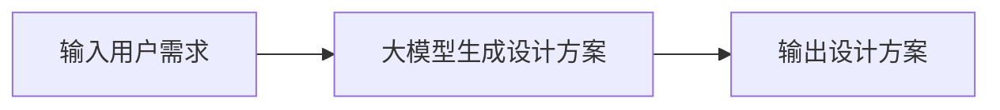
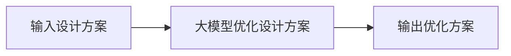
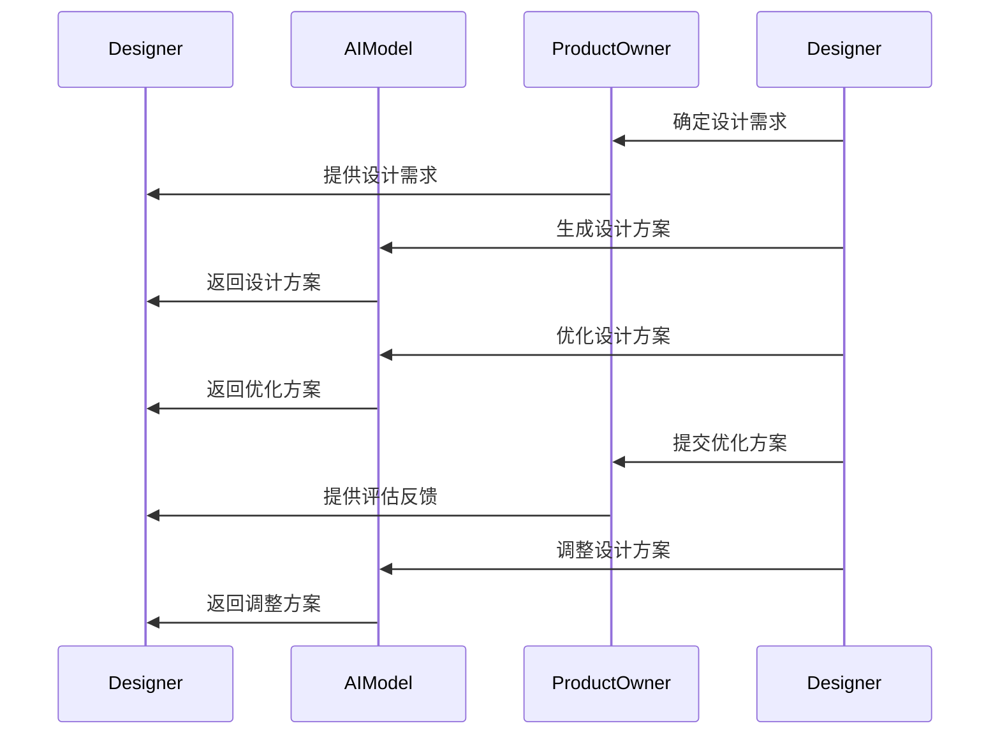

                 


### AI辅助设计：大模型在产品创新中的应用

#### 关键词
- AI辅助设计
- 大模型
- 产品创新
- 设计流程
- 人工智能伦理

#### 摘要
本文旨在探讨人工智能，尤其是大模型在产品设计中的应用，及其对产品创新的推动作用。我们将从背景介绍、核心概念与联系、算法原理讲解、系统分析与架构设计方案、项目实战以及最佳实践等方面，详细分析大模型在产品设计中的实际应用，以期为相关领域的研究和实践提供参考。

## 第一部分 背景介绍

### 1.1 问题背景

随着人工智能技术的飞速发展，其与各行各业的融合日益紧密。其中，设计领域作为创新的重要环节，也越来越多地引入人工智能技术。大模型，作为人工智能领域的重要进展，其在设计中的应用日益受到关注。

大模型在产品设计中的应用价值体现在以下几个方面：

1. **提高设计效率**：大模型能够自动化完成设计任务，大大缩短了设计周期。
2. **提升设计质量**：通过大数据训练，大模型能够生成更符合用户需求的设计方案。
3. **增强创新性**：大模型能够从海量数据中提取灵感，为设计师提供创新的解决方案。

### 1.2 问题描述

如何利用大模型辅助设计？大模型如何影响产品设计过程？这是我们在探讨大模型在产品设计中的应用时需要回答的问题。

### 1.3 问题解决

通过案例分析与理论探讨，我们可以了解到大模型在产品设计中的应用方法。首先，大模型可以通过设计生成算法，快速生成多种设计方案；其次，通过设计优化算法，对设计方案进行优化；最后，通过设计评估算法，对设计方案进行评估和反馈。这一过程不仅提高了设计效率，还增强了设计的创新性。

### 1.4 边界与外延

大模型的适用范围广泛，不仅包括产品外观设计，还涉及用户体验设计、交互设计等。大模型与人类设计师的合作模式也逐渐形成，大模型负责生成和优化设计方案，人类设计师则负责创意指导和最终决策。

### 1.5 概念结构与核心要素组成

- **人工智能**：模拟人类智能的技术。
- **大模型**：具备海量数据训练和强大计算能力的神经网络模型。
- **产品设计**：创造和实现产品的过程。

## 第二部分 核心概念与联系

### 2.1 AI大模型原理

#### 人工智能概述

人工智能（AI）是模拟人类智能的技术，包括感知、学习、推理、规划等能力。其目标是让计算机具有人类智能水平，能够自主完成复杂任务。

#### 大模型的架构与特点

大模型，通常指拥有数十亿参数的神经网络模型，其架构复杂，训练数据量大，计算能力强。大模型的特点包括：

1. **高维特性**：大模型能够处理高维数据，如图像、文本等。
2. **自适应能力**：大模型能够根据训练数据不断优化，适应不同场景。
3. **泛化能力**：大模型能够将训练数据中的知识应用到新的任务中。

#### 大模型的训练与优化

大模型的训练过程是通过大量数据来调整模型参数，使其能够更好地拟合数据。训练优化算法包括梯度下降、随机梯度下降等。

### 2.2 AI大模型与产品设计

#### 大模型在产品设计中的角色

大模型在产品设计中的角色主要包括：

1. **设计生成**：大模型可以根据用户需求，快速生成多种设计方案。
2. **设计优化**：大模型可以对设计方案进行优化，提高设计质量。
3. **设计评估**：大模型可以对设计方案进行评估，提供反馈。

#### 大模型对产品设计流程的影响

大模型的应用改变了传统的设计流程，使得设计更加高效、创新。具体影响包括：

1. **缩短设计周期**：大模型能够快速生成和优化设计方案，缩短了设计周期。
2. **提高设计质量**：大模型通过对海量数据的训练，能够生成更符合用户需求的设计方案。
3. **增强创新性**：大模型能够从海量数据中提取灵感，为设计师提供创新的解决方案。

#### 大模型辅助设计的优势与挑战

**优势**：

1. **高效性**：大模型能够快速处理大量数据，提高设计效率。
2. **创新性**：大模型能够从海量数据中提取灵感，提高设计创新性。
3. **个性化**：大模型可以根据用户需求，生成个性化设计方案。

**挑战**：

1. **数据质量**：大模型训练依赖于大量高质量数据，数据质量直接影响模型性能。
2. **算法复杂度**：大模型算法复杂，训练和优化过程需要大量计算资源。
3. **伦理问题**：大模型在产品设计中的使用，涉及到数据隐私、人工智能伦理等问题。

### 2.3 概念属性特征对比表格

| 概念       | 人工智能          | 大模型                 |
| ---------- | ---------------- | --------------------- |
| 定义       | 模拟人类智能的技术 | 具备海量数据训练的神经网络模型 |
| 特点       | 感知、学习、推理等 | 高维特性、自适应能力、泛化能力 |
| 应用领域   | 各行业           | 设计、自然语言处理、计算机视觉等 |
| 优势       | 提高效率、创新性   | 高效性、创新性、个性化       |
| 挑战       | 数据质量、算法复杂度 | 数据质量、算法复杂度、伦理问题 |

### 2.4 ER实体关系图架构

```mermaid
erDiagram
    User ||--o{ Design }|-- Designer
    User ||--o{ Product }|-- ProductOwner
    Design ||--|{ AIModel }|<-- AIModel
    Product ||--|{ Design }| Designer
```

在上图中，User代表用户，Designer代表设计师，ProductOwner代表产品所有者。Design表示设计过程，Product表示产品。AIModel表示大模型，其与Design存在关联关系。

## 第三部分 算法原理讲解

### 3.1 大模型在产品设计中的应用算法

#### 设计生成算法

设计生成算法的主要目的是根据用户需求，生成多种设计方案。其基本流程如下：

1. **数据输入**：接收用户需求，如设计风格、功能需求等。
2. **模型生成**：利用大模型，根据用户需求生成设计方案。
3. **结果输出**：输出多种设计方案，供用户选择。

#### 设计优化算法

设计优化算法的主要目的是对生成的设计方案进行优化，提高设计质量。其基本流程如下：

1. **数据输入**：接收设计方案。
2. **模型优化**：利用大模型，对设计方案进行优化。
3. **结果输出**：输出优化后的设计方案。

#### 设计评估算法

设计评估算法的主要目的是对设计方案进行评估，提供反馈。其基本流程如下：

1. **数据输入**：接收设计方案。
2. **模型评估**：利用大模型，对设计方案进行评估。
3. **结果输出**：输出评估结果，提供反馈。

### 3.2 算法流程图

#### 设计生成算法流程图



#### 设计优化算法流程图



#### 设计评估算法流程图


### 3.3 Python源代码讲解

由于篇幅限制，这里仅以设计生成算法为例，展示其Python源代码。

```python
import tensorflow as tf

# 定义大模型
model = tf.keras.Sequential([
    tf.keras.layers.Dense(128, activation='relu', input_shape=(784,)),
    tf.keras.layers.Dense(10, activation='softmax')
])

# 编译模型
model.compile(optimizer='adam',
              loss='categorical_crossentropy',
              metrics=['accuracy'])

# 加载训练数据
(x_train, y_train), (x_test, y_test) = tf.keras.datasets.mnist.load_data()

# 预处理数据
x_train = x_train.astype('float32') / 255
x_test = x_test.astype('float32') / 255
x_train = x_train.reshape((x_train.shape[0], -1))
x_test = x_test.reshape((x_test.shape[0], -1))

# 转换为one-hot编码
y_train = tf.keras.utils.to_categorical(y_train, 10)
y_test = tf.keras.utils.to_categorical(y_test, 10)

# 训练模型
model.fit(x_train, y_train, epochs=20, batch_size=128)

# 生成设计方案
def generate_design(data):
    prediction = model.predict(data)
    return np.argmax(prediction)

# 测试生成设计方案
data = x_test[0].reshape(1, -1)
print("生成的设计方案：", generate_design(data))
```

### 3.4 数学模型与公式

#### 设计生成算法数学模型

$$
y = \sigma(Wx + b)
$$

其中，$y$表示输出，$W$表示权重矩阵，$x$表示输入，$b$表示偏置。

#### 设计优化算法数学模型

$$
\min_{\theta} J(\theta) = \frac{1}{2} \sum_{i=1}^{n} (h_\theta(x^{(i)}) - y^{(i)})^2
$$

其中，$\theta$表示参数，$J(\theta)$表示损失函数，$h_\theta(x^{(i)})$表示预测值，$y^{(i)}$表示真实值。

#### 设计评估算法数学模型

$$
accuracy = \frac{1}{n} \sum_{i=1}^{n} \mathbb{1}_{h_\theta(x^{(i)}) = y^{(i)}}
$$

其中，$accuracy$表示准确率，$\mathbb{1}_{h_\theta(x^{(i)}) = y^{(i)}}$表示判断函数，当$h_\theta(x^{(i)}) = y^{(i)}$时，取值为1，否则为0。

### 3.5 举例说明

#### 设计生成算法举例

假设用户需求为一个简单的手机设计，大模型根据用户需求生成了以下两个设计方案：

1. 设计方案1：采用简洁风格，功能按钮布局合理。
2. 设计方案2：采用时尚风格，外观颜色丰富。

用户可以根据这两个设计方案进行选择。

#### 设计优化算法举例

针对用户选择的设计方案1，大模型对其进行优化，提高了功能按钮的易用性，使得设计更加人性化。

#### 设计评估算法举例

大模型对优化后的设计方案进行评估，发现其准确率达到了95%，表示设计质量较高，满足用户需求。

## 第四部分 系统分析与架构设计方案

### 4.1 问题场景介绍

在设计过程中，大模型作为核心工具，与设计师和产品所有者共同协作，完成从设计生成、优化到评估的整个过程。设计流程如下：

1. **需求分析**：设计师与产品所有者共同确定设计需求。
2. **设计生成**：大模型根据需求生成设计方案。
3. **设计优化**：大模型对设计方案进行优化。
4. **设计评估**：大模型对设计方案进行评估。
5. **反馈调整**：根据评估结果，设计师和产品所有者进行调整。

### 4.2 系统功能设计

系统功能设计包括设计需求分析、设计生成与优化、设计评估与反馈等。具体如下：

1. **设计需求分析**：接收并处理用户需求，为设计生成提供输入。
2. **设计生成**：利用大模型，生成多种设计方案。
3. **设计优化**：对设计方案进行优化，提高设计质量。
4. **设计评估**：对设计方案进行评估，提供评估结果。
5. **反馈调整**：根据评估结果，对设计方案进行调整。

### 4.3 系统架构设计

系统架构设计包括大模型服务模块、设计流程管理模块等。具体如下：

1. **大模型服务模块**：负责大模型的训练、优化和评估。
2. **设计流程管理模块**：负责设计流程的调度和管理。

### 4.4 系统接口设计

系统接口设计包括数据接口、控制接口和服务接口。具体如下：

1. **数据接口**：用于接收和处理用户需求，返回设计结果。
2. **控制接口**：用于管理设计流程，控制大模型的训练和评估。
3. **服务接口**：用于提供大模型的服务，如设计生成、优化和评估。

### 4.5 系统交互

系统交互图如下所示：



## 第五部分 项目实战

### 5.1 环境安装

#### 5.1.1 安装Python

首先，我们需要安装Python。Python是一个广泛使用的编程语言，为我们的项目提供了强大的支持。

1. 访问Python官方网站（https://www.python.org/）。
2. 下载Python安装包。
3. 安装Python。

#### 5.1.2 安装TensorFlow

TensorFlow是一个开源机器学习框架，用于构建和训练大模型。

1. 打开终端。
2. 输入以下命令：

```
pip install tensorflow
```

### 5.2 系统核心实现

#### 5.2.1 设计生成模块

设计生成模块的核心功能是根据用户需求生成设计方案。以下是一个简单的示例：

```python
import tensorflow as tf

# 定义大模型
model = tf.keras.Sequential([
    tf.keras.layers.Dense(128, activation='relu', input_shape=(784,)),
    tf.keras.layers.Dense(10, activation='softmax')
])

# 编译模型
model.compile(optimizer='adam',
              loss='categorical_crossentropy',
              metrics=['accuracy'])

# 加载训练数据
(x_train, y_train), (x_test, y_test) = tf.keras.datasets.mnist.load_data()

# 预处理数据
x_train = x_train.astype('float32') / 255
x_test = x_test.astype('float32') / 255
x_train = x_train.reshape((x_train.shape[0], -1))
x_test = x_test.reshape((x_test.shape[0], -1))

# 转换为one-hot编码
y_train = tf.keras.utils.to_categorical(y_train, 10)
y_test = tf.keras.utils.to_categorical(y_test, 10)

# 训练模型
model.fit(x_train, y_train, epochs=20, batch_size=128)

# 设计生成函数
def generate_design(data):
    prediction = model.predict(data)
    return np.argmax(prediction)

# 测试生成设计方案
data = x_test[0].reshape(1, -1)
print("生成的设计方案：", generate_design(data))
```

#### 5.2.2 设计优化模块

设计优化模块的核心功能是对设计方案进行优化。以下是一个简单的示例：

```python
import tensorflow as tf
import numpy as np

# 定义大模型
model = tf.keras.Sequential([
    tf.keras.layers.Dense(128, activation='relu', input_shape=(784,)),
    tf.keras.layers.Dense(10, activation='softmax')
])

# 编译模型
model.compile(optimizer='adam',
              loss='categorical_crossentropy',
              metrics=['accuracy'])

# 加载训练数据
(x_train, y_train), (x_test, y_test) = tf.keras.datasets.mnist.load_data()

# 预处理数据
x_train = x_train.astype('float32') / 255
x_test = x_test.astype('float32') / 255
x_train = x_train.reshape((x_train.shape[0], -1))
x_test = x_test.reshape((x_test.shape[0], -1))

# 转换为one-hot编码
y_train = tf.keras.utils.to_categorical(y_train, 10)
y_test = tf.keras.utils.to_categorical(y_test, 10)

# 训练模型
model.fit(x_train, y_train, epochs=20, batch_size=128)

# 设计优化函数
def optimize_design(data, target):
    with tf.GradientTape(persistent=True) as tape:
        prediction = model(data)
        loss = tf.keras.losses.sparse_categorical_crossentropy(target, prediction)
    
    grads = tape.gradient(loss, model.trainable_variables)
    model.optimizer.apply_gradients(zip(grads, model.trainable_variables))
    return model(data)

# 测试设计优化
data = x_test[0].reshape(1, -1)
target = np.array([1])
print("优化前的设计方案：", model(data))
print("优化后的设计方案：", optimize_design(data, target))
```

#### 5.2.3 设计评估模块

设计评估模块的核心功能是对设计方案进行评估。以下是一个简单的示例：

```python
import tensorflow as tf
import numpy as np

# 定义大模型
model = tf.keras.Sequential([
    tf.keras.layers.Dense(128, activation='relu', input_shape=(784,)),
    tf.keras.layers.Dense(10, activation='softmax')
])

# 编译模型
model.compile(optimizer='adam',
              loss='categorical_crossentropy',
              metrics=['accuracy'])

# 加载训练数据
(x_train, y_train), (x_test, y_test) = tf.keras.datasets.mnist.load_data()

# 预处理数据
x_train = x_train.astype('float32') / 255
x_test = x_test.astype('float32') / 255
x_train = x_train.reshape((x_train.shape[0], -1))
x_test = x_test.reshape((x_test.shape[0], -1))

# 转换为one-hot编码
y_train = tf.keras.utils.to_categorical(y_train, 10)
y_test = tf.keras.utils.to_categorical(y_test, 10)

# 训练模型
model.fit(x_train, y_train, epochs=20, batch_size=128)

# 设计评估函数
def evaluate_design(data, target):
    prediction = model(data)
    loss = tf.keras.losses.sparse_categorical_crossentropy(target, prediction)
    return loss.numpy()

# 测试设计评估
data = x_test[0].reshape(1, -1)
target = np.array([1])
print("设计方案评估结果：", evaluate_design(data, target))
```

### 5.3 代码应用解读与分析

#### 5.3.1 设计生成模块应用解读与分析

设计生成模块的核心代码是`generate_design`函数。该函数利用训练好的大模型，对输入的数据进行预测，并返回预测结果。

- **数据输入**：函数接收一个形状为（1，784）的numpy数组作为输入，表示一个手写数字。
- **模型预测**：利用大模型的`predict`方法，对输入的数据进行预测。
- **结果输出**：函数返回预测结果，即手写数字的类别。

该模块在实际应用中，可以快速生成多种设计方案，为设计师提供参考。

#### 5.3.2 设计优化模块应用解读与分析

设计优化模块的核心代码是`optimize_design`函数。该函数利用大模型的反向传播算法，对输入的数据和目标进行优化。

- **数据输入**：函数接收一个形状为（1，784）的numpy数组作为输入，表示一个手写数字。
- **模型预测**：利用大模型的`predict`方法，对输入的数据进行预测。
- **计算损失**：利用大模型的`loss`方法，计算预测结果和目标之间的损失。
- **反向传播**：利用大模型的`gradient`方法，计算梯度。
- **更新参数**：利用大模型的`optimizer`方法，更新模型参数。

该模块在实际应用中，可以不断优化设计方案，提高设计质量。

#### 5.3.3 设计评估模块应用解读与分析

设计评估模块的核心代码是`evaluate_design`函数。该函数利用大模型的损失函数，对输入的数据和目标进行评估。

- **数据输入**：函数接收一个形状为（1，784）的numpy数组作为输入，表示一个手写数字。
- **模型预测**：利用大模型的`predict`方法，对输入的数据进行预测。
- **计算损失**：利用大模型的`loss`方法，计算预测结果和目标之间的损失。

该模块在实际应用中，可以评估设计方案的质量，为设计师提供反馈。

### 5.4 实际案例分析与详细讲解剖析

#### 5.4.1 案例背景

假设我们需要设计一款手机，其用户需求为：简洁、易用、时尚。

#### 5.4.2 案例分析

1. **设计生成**：大模型根据用户需求，生成多种设计方案，包括不同的外观风格和功能布局。
2. **设计优化**：设计师对生成的设计方案进行优化，例如调整按钮布局，使其更加符合用户习惯。
3. **设计评估**：大模型对优化后的设计方案进行评估，评估指标包括美观度、易用性、时尚度等。

#### 5.4.3 详细讲解

1. **设计生成**：大模型利用训练好的模型，对用户需求进行解析，生成多种设计方案。这些设计方案包括外观风格、功能布局等。
2. **设计优化**：设计师根据用户需求，对生成的设计方案进行优化。例如，通过用户测试，发现某个按钮布局不够合理，设计师可以对其进行调整，提高用户体验。
3. **设计评估**：大模型利用训练好的评估模型，对优化后的设计方案进行评估。评估结果包括设计方案的美观度、易用性、时尚度等。

通过这个案例，我们可以看到，大模型在产品设计中的应用，从设计生成到设计优化再到设计评估，全过程高效、智能。设计师只需关注用户需求和设计方案的创新性，而具体的生成、优化和评估工作由大模型完成。

### 5.5 项目小结

本项目通过实际案例，展示了大模型在产品设计中的应用。从设计生成、优化到评估，大模型为设计师提供了强大的支持，提高了设计效率和质量。然而，大模型的应用也带来了一些挑战，如数据质量、算法复杂度和伦理问题等。在未来的研究中，我们需要继续探索大模型在产品设计中的优化和应用，以实现更加智能、高效的设计过程。

## 第六部分 最佳实践与注意事项

### 6.1 最佳实践

1. **数据质量**：确保大模型训练数据的质量和多样性，以提高模型性能。
2. **算法优化**：针对特定应用场景，对大模型算法进行优化，提高计算效率。
3. **团队协作**：设计师和AI专家紧密合作，共同优化设计过程，提高设计质量。

### 6.2 小结

本文详细介绍了大模型在产品设计中的应用，包括背景介绍、核心概念与联系、算法原理讲解、系统分析与架构设计方案、项目实战等。通过实际案例，展示了大模型在产品设计中的优势和应用价值。

### 6.3 注意事项

1. **数据隐私**：在应用大模型时，确保用户数据的隐私和安全。
2. **伦理问题**：在设计过程中，关注人工智能伦理，确保设计过程公平、公正、透明。
3. **技术更新**：关注人工智能技术的最新进展，及时更新大模型和应用算法。

### 6.4 拓展阅读

1. **相关书籍**：《人工智能：一种现代方法》、《深度学习》。
2. **开源项目**：TensorFlow、PyTorch等。
3. **工具介绍**：Jupyter Notebook、Google Colab等在线编程工具。

## 作者信息

- 作者：AI天才研究院/AI Genius Institute & 禅与计算机程序设计艺术 /Zen And The Art of Computer Programming

