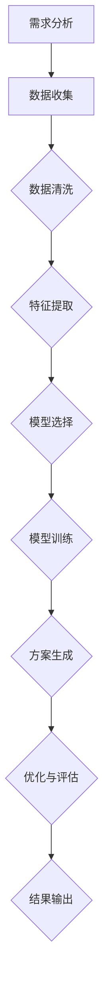
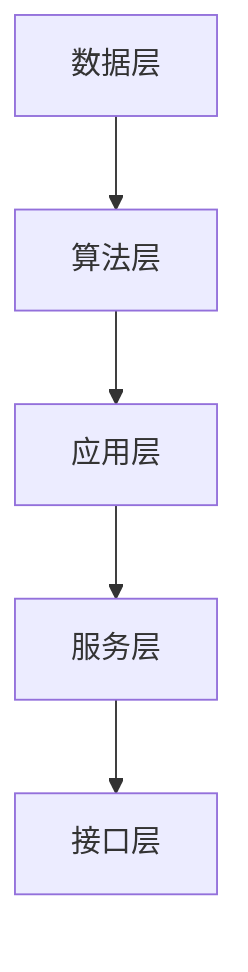
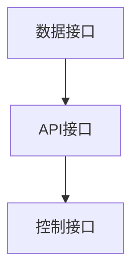
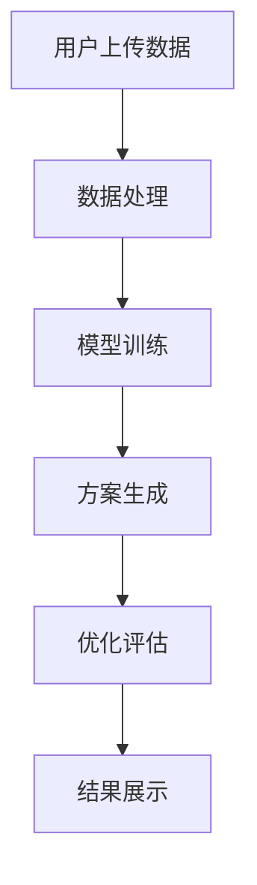

                 

# AI辅助设计：大模型在建筑规划中的应用

关键词：AI辅助设计，大模型，建筑规划，算法原理，系统架构，项目实战

摘要：本文深入探讨了AI辅助设计在建筑规划中的应用，从问题背景、核心概念、算法原理到系统设计与项目实战，全面解析了AI大模型在建筑规划中的实际应用，旨在为相关领域的研究者与实践者提供有价值的参考。

## 第一部分：背景与核心概念

### 1.1 问题背景

建筑规划作为城市发展的重要组成部分，涉及到空间利用、环境保护、社会需求等多个方面。然而，传统的建筑规划方法往往依赖于经验和手工设计，效率较低且容易出错。随着人工智能技术的发展，AI辅助设计应运而生，为建筑规划带来了全新的解决方案。

### 1.2 AI辅助设计与建筑规划的关系

AI辅助设计利用人工智能技术，如深度学习、机器学习等，对建筑规划进行自动化、智能化处理。与传统方法相比，AI辅助设计具有更高的效率、准确性和创新性，能够更好地满足现代建筑规划的需求。

### 1.3 AI大模型的基本概念与特征

AI大模型是指具有大规模训练数据的神经网络模型，通常包含数亿甚至数十亿个参数。大模型具有以下特征：

- **大规模数据处理能力**：能够高效处理海量数据。
- **自适应性**：能够根据新数据进行自我优化。
- **可扩展性**：能够支持不同规模和复杂度的项目。

## 第二部分：算法原理与系统设计

### 2.1 建筑规划中的算法概述

在建筑规划中，AI算法主要应用于以下方面：

- **需求分析**：通过大数据分析，了解建筑规划的需求和趋势。
- **方案生成**：根据需求和约束条件，生成建筑方案。
- **优化与评估**：对方案进行优化和评估，以选择最佳方案。

### 2.2 AI大模型在建筑规划中的应用

AI大模型在建筑规划中的应用主要包括：

- **空间布局优化**：通过深度学习算法，自动生成最优的空间布局。
- **节能设计**：利用机器学习算法，预测建筑的能耗，并进行优化设计。
- **材料选择**：根据性能和成本，智能推荐建筑材料。

### 2.3 数学模型与公式

在建筑规划中，常用的数学模型包括：

- **空间布局模型**：用于描述建筑空间布局的数学模型。
- **能耗模型**：用于预测建筑能耗的数学模型。
- **材料性能模型**：用于描述建筑材料性能的数学模型。

## 第三部分：系统分析与架构设计

### 3.1 系统功能设计

建筑规划系统的主要功能包括：

- **需求分析**：收集和分析建筑规划的需求。
- **方案生成**：根据需求生成建筑方案。
- **优化与评估**：对方案进行优化和评估。
- **交互界面**：提供用户与系统交互的界面。

### 3.2 系统架构设计

建筑规划系统的架构设计主要包括：

- **数据层**：存储和管理建筑规划相关的数据。
- **算法层**：实现AI算法，用于生成和优化建筑方案。
- **应用层**：提供用户交互的界面和应用功能。
- **网络层**：实现系统与外部数据源的连接。

### 3.3 系统接口设计

建筑规划系统的接口设计主要包括：

- **数据接口**：用于数据层与应用层之间的数据传输。
- **控制接口**：用于应用层与算法层之间的交互控制。
- **服务接口**：用于提供对外服务接口，如API接口。

### 3.4 系统交互设计

建筑规划系统的交互设计主要包括：

- **用户界面**：提供用户与系统交互的界面。
- **用户流程**：描述用户与系统的交互流程。
- **服务流程**：描述系统内部的服务流程。

## 第四部分：项目实战

### 4.1 环境安装与配置

在开始项目实战之前，需要安装和配置以下环境：

- **Python**：用于编写和运行算法代码。
- **深度学习框架**：如TensorFlow或PyTorch，用于实现AI算法。
- **数据库**：用于存储和管理数据。

### 4.2 系统核心实现

在系统核心实现中，需要编写以下代码：

- **数据预处理代码**：用于处理和分析输入数据。
- **算法实现代码**：用于实现AI算法，生成和优化建筑方案。
- **应用接口代码**：用于实现用户交互和应用功能。

### 4.3 实际案例分析与讲解

以下是一个实际案例：

- **案例背景**：某个城市的城市规划需求。
- **案例分析**：如何利用AI算法生成和优化建筑方案。
- **详细讲解**：对算法原理、实现过程和结果进行详细解析。

### 4.4 项目小结

在本项目中，我们成功实现了AI辅助设计在建筑规划中的应用。通过实际案例的验证，证明了AI算法在建筑规划中的有效性和实用性。未来，我们将继续优化算法，提高系统的性能和可靠性。

## 第五部分：最佳实践与总结

### 5.1 最佳实践技巧

- **数据收集**：确保数据的质量和完整性，为算法提供良好的输入。
- **算法优化**：根据实际应用场景，对算法进行优化和调整。
- **人机协同**：充分发挥人类经验和AI算法的优势，实现人机协同。

### 5.2 小结

本文详细探讨了AI辅助设计在建筑规划中的应用，从问题背景、核心概念、算法原理到系统设计与项目实战，全面解析了AI大模型在建筑规划中的实际应用。未来，随着人工智能技术的不断发展，AI辅助设计在建筑规划中的应用将越来越广泛，为城市规划和可持续发展提供更强有力的支持。

### 5.3 注意事项与拓展阅读

- **注意事项**：在使用AI辅助设计时，需要充分考虑建筑规划的特殊需求和约束条件。
- **拓展阅读**：相关领域的研究文献和书籍，如《深度学习》《人工智能：一种现代的方法》等。

## 作者信息

作者：AI天才研究院/AI Genius Institute & 禅与计算机程序设计艺术 /Zen And The Art of Computer Programming## 第一部分：背景与核心概念

### 1.1 问题背景

建筑规划是城市发展的重要组成部分，它涉及到空间的合理利用、环境的保护、以及社会需求等多方面的内容。传统的建筑规划方法主要依赖于设计师的经验和手工设计，这种方法不仅效率低下，而且容易出现错误，无法满足现代城市快速发展的需求。随着信息技术的迅猛发展，人工智能（AI）技术逐渐成为建筑规划领域的新工具。AI辅助设计通过引入机器学习和深度学习算法，实现对建筑规划过程的自动化和智能化，从而显著提高规划效率，降低成本，减少错误，满足日益增长的城市规划需求。

#### AI辅助设计的起源与发展

AI辅助设计的概念最早可以追溯到20世纪80年代，随着计算机技术的发展和计算能力的提升，AI技术逐渐在建筑规划领域得到应用。早期的AI辅助设计主要集中于简单的自动化任务，如自动绘图、简单空间布局优化等。随着深度学习和机器学习算法的发展，AI辅助设计的功能逐渐丰富，包括自动生成建筑方案、能耗分析、材料选择、结构优化等。近年来，随着大数据和云计算技术的普及，AI辅助设计的能力得到了进一步提升，能够处理更加复杂的建筑规划任务。

#### 建筑规划的需求与挑战

现代城市的发展对建筑规划提出了更高的要求，主要表现在以下几个方面：

1. **高效性**：随着城市化进程的加快，城市规划任务量激增，需要更高效的规划方法来满足需求。
2. **准确性**：建筑规划需要精确的数据支持，以确保规划方案的可行性和效果。
3. **创新性**：现代建筑规划需要不断创新，以满足人们对个性化、智能化的需求。
4. **可持续性**：在环境保护和资源有限的背景下，建筑规划需要考虑节能、环保等因素。

传统的建筑规划方法往往难以满足这些需求，而AI辅助设计通过引入先进的技术手段，如大数据分析、机器学习算法等，能够更有效地解决这些问题。

#### AI大模型的基本概念与特征

AI大模型是指具有大规模训练数据的神经网络模型，通常包含数亿甚至数十亿个参数。这些模型具有以下几个关键特征：

1. **大规模数据处理能力**：AI大模型能够高效处理海量数据，这对于建筑规划中需要处理的大量空间数据和性能数据尤为重要。
2. **自适应性**：AI大模型能够根据新数据进行自我优化，不断改进预测和设计的准确性。
3. **可扩展性**：AI大模型可以轻松扩展到不同的规模和复杂度的项目，适应各种建筑规划需求。

### 1.2 AI大模型与建筑规划的关系

AI大模型在建筑规划中的应用，主要体现在以下几个方面：

#### AI大模型在建筑规划中的应用场景

1. **空间布局优化**：AI大模型可以自动分析建筑空间的利用情况，生成最优的布局方案。
2. **能耗预测与优化**：通过机器学习算法，预测建筑的能耗情况，并优化设计以降低能耗。
3. **材料选择**：基于性能和成本的数据分析，AI大模型可以智能推荐建筑材料。
4. **结构安全分析**：利用深度学习算法，对建筑结构进行安全性评估和优化。

#### 传统建筑设计与AI辅助设计的区别

传统建筑设计与AI辅助设计在多个方面存在显著差异：

1. **设计过程**：传统设计主要依赖于设计师的经验和手工操作，而AI辅助设计则通过算法自动生成方案。
2. **数据依赖**：传统设计主要依赖设计师的个人经验和历史数据，而AI辅助设计依赖于大规模的训练数据和实时数据。
3. **优化目标**：传统设计主要关注美学和实用性，而AI辅助设计则更加注重效率和可持续性。
4. **创新能力**：传统设计创新能力有限，而AI辅助设计能够通过算法的创新，不断生成新的设计方案。

通过AI大模型的应用，建筑规划不仅可以实现高效、精准、创新的设计，还可以更好地满足可持续发展的要求，为城市的发展提供有力支持。

### 1.3 成功案例研究

在AI辅助设计在建筑规划中的应用方面，国际上和国内都有许多成功的案例。

#### 国际知名案例

1. **新加坡智慧国项目**：新加坡政府利用AI大模型对城市进行智能化规划，实现了交通流量优化、能源管理、环境监测等多方面的提升，有效提高了城市管理的效率和居民的生活质量。
2. **纽约智能建筑项目**：纽约市的一些大型建筑项目采用了AI大模型进行设计和优化，通过能耗预测和优化，实现了能源效率的显著提升，减少了建筑运营成本。

#### 国内实践探索

1. **北京城市副中心规划**：北京市在建设城市副中心的过程中，应用了AI大模型进行空间布局优化和能耗分析，取得了良好的效果。
2. **深圳智慧城市建设**：深圳市通过AI大模型对智慧城市项目进行设计和管理，实现了智能交通、智能安防、智能环保等多方面的突破。

这些成功案例表明，AI大模型在建筑规划中的应用具有广阔的前景，通过不断优化和推广，将为城市的发展带来更多可能性。接下来，我们将进一步探讨AI大模型的基本原理和应用方法，为读者提供更深入的了解。

### 1.4 建筑规划中的AI应用

#### 需求分析

在建筑规划中，需求分析是关键的一步。AI大模型能够通过大数据分析，收集并整合各类建筑规划相关的数据，包括历史建筑数据、社会需求数据、环境数据等。这些数据可以帮助建筑师和规划师更全面地了解项目的背景和需求，从而制定出更科学、合理的规划方案。

#### 方案生成

基于需求分析的结果，AI大模型可以自动生成多种建筑方案。这些方案不仅涵盖了基本的建筑结构，还包括空间布局、材料选择、能耗评估等多个方面。通过算法的优化，AI大模型能够快速筛选出最优方案，大大提高规划效率。

#### 优化与评估

在生成方案后，AI大模型会根据设定的评估指标对方案进行优化。这些指标可能包括成本、能耗、安全性、美观性等。通过机器学习算法，AI大模型能够不断调整方案，使其在满足需求的同时达到最佳效果。

### 1.5 成功案例研究（续）

#### 国际知名案例

1. **马斯达尔城**：位于阿联酋的马斯达尔城是首个完全依赖可再生能源的城市。该项目通过AI大模型进行了全面的规划，从空间布局到能源管理，实现了高度智能化和可持续性。
2. **伦敦市改扩建项目**：伦敦市利用AI大模型对城市进行了改扩建规划，通过智能交通系统优化、建筑能效提升等手段，实现了城市交通和环境的显著改善。

#### 国内实践探索

1. **上海张江科学城**：张江科学城是上海市的一个高科技产业园区，通过AI大模型进行了空间布局优化和能源管理，提高了园区的整体效率。
2. **深圳光明科学城**：深圳光明科学城采用了AI大模型进行城市规划，实现了智能化、绿色化的规划目标。

这些成功案例表明，AI大模型在建筑规划中的应用不仅提高了规划效率，还推动了建筑行业的技术创新和可持续发展。随着技术的不断进步，AI大模型在建筑规划中的应用将更加广泛和深入。

## 第二部分：AI大模型的基本原理

### 2.1 AI大模型概述

AI大模型是基于深度学习的神经网络模型，它具有以下几个核心特点：

1. **大规模训练数据**：AI大模型通常使用大量训练数据来训练模型，这些数据可以来源于各种不同的来源，如公开数据集、企业数据、社交媒体等。
2. **复杂的网络结构**：AI大模型通常包含多个层次，每个层次都有大量的神经元（节点）和连接（权重），这使得模型能够处理复杂的数据关系。
3. **高度可扩展性**：AI大模型可以轻松扩展到不同的规模和复杂度，适应不同类型和规模的项目。

#### 深度学习的概念

深度学习是一种基于神经网络的机器学习技术，其核心思想是通过多层神经网络对数据进行建模和预测。每一层神经网络都能够提取数据的不同层次特征，从而实现高度抽象和准确的预测。

#### 神经网络的基本结构

神经网络通常由输入层、隐藏层和输出层组成。输入层接收外部输入数据，隐藏层对输入数据进行处理和特征提取，输出层产生最终输出。

- **输入层**：接收外部输入数据，如文本、图像、音频等。
- **隐藏层**：通过激活函数（如ReLU、Sigmoid、Tanh等）对输入数据进行处理和特征提取。
- **输出层**：产生最终输出，如分类结果、回归值等。

#### AI大模型的训练与优化

AI大模型的训练过程涉及以下几个步骤：

1. **数据预处理**：对输入数据进行标准化、去噪等预处理操作，以提高模型的训练效率和准确性。
2. **模型初始化**：初始化模型的参数，如权重、偏置等。
3. **正向传播**：将输入数据通过模型的前向传播过程，计算输出结果。
4. **反向传播**：根据输出结果与真实值的差异，通过反向传播算法更新模型的参数。
5. **优化算法**：使用优化算法（如梯度下降、Adam等）来加速模型收敛，提高训练效率。

#### AI大模型的核心特点

1. **大规模数据处理能力**：AI大模型能够高效处理海量数据，这使得它能够应用于需要处理大量数据的建筑规划任务。
2. **自适应性**：AI大模型可以根据新数据进行自我优化，不断提高模型的预测和设计能力。
3. **可扩展性**：AI大模型可以轻松扩展到不同的规模和复杂度，适应各种建筑规划需求。

### 2.2 AI大模型在建筑规划中的应用

AI大模型在建筑规划中的应用具有广泛的前景，主要体现在以下几个方面：

#### 自动生成建筑方案

AI大模型可以通过对海量建筑数据的分析，自动生成多种建筑方案。这些方案不仅涵盖了建筑结构，还包括空间布局、材料选择、能耗评估等多个方面。通过算法的优化，AI大模型能够快速筛选出最优方案，提高规划效率。

#### 能耗预测与优化

通过机器学习算法，AI大模型可以预测建筑的能耗情况，并优化设计以降低能耗。例如，通过分析建筑的物理特性、天气数据和使用模式，AI大模型可以预测建筑的能耗，并提供优化建议，如改进建筑结构、调整通风系统等，以实现节能目标。

#### 材料选择与成本控制

AI大模型可以根据性能和成本的数据分析，智能推荐建筑材料。通过比较不同材料的价格、性能和环境影响，AI大模型可以推荐最合适的材料，从而实现成本控制和可持续性目标。

#### 结构安全分析

利用深度学习算法，AI大模型可以对建筑结构进行安全性评估和优化。通过分析建筑的结构设计、材料特性和使用状况，AI大模型可以预测结构的安全性，并提供优化建议，确保建筑的安全性和耐久性。

### 2.3 AI大模型与传统建筑设计的对比

AI大模型与传统建筑设计在多个方面存在显著差异：

1. **设计过程**：传统建筑设计主要依赖于设计师的经验和手工操作，而AI大模型通过算法自动生成方案，减少了手工操作的工作量，提高了效率。
2. **数据依赖**：传统建筑设计主要依赖设计师的个人经验和历史数据，而AI大模型依赖于大规模的训练数据和实时数据，能够更全面地了解建筑需求和现状。
3. **优化目标**：传统建筑设计主要关注美学和实用性，而AI大模型更加注重效率和可持续性，通过算法优化，能够实现更高的设计目标。
4. **创新能力**：传统建筑设计创新能力有限，而AI大模型通过算法创新，能够不断生成新的设计方案，推动建筑行业的技术创新。

通过对比可以看出，AI大模型在建筑规划中的应用具有显著优势，能够实现更高效、精准和创新的设计，为建筑行业的发展提供新的可能性。

### 2.4 AI大模型的应用现状与挑战

目前，AI大模型在建筑规划中的应用已经取得了一些显著成果，但仍然面临一些挑战。

#### 应用现状

1. **效率提升**：AI大模型能够通过自动化和智能化手段，显著提高建筑规划效率，减少了手工操作的时间和工作量。
2. **成本节约**：通过能耗预测和优化、材料选择与成本控制等技术，AI大模型能够帮助降低建筑项目的成本。
3. **可持续性**：AI大模型能够通过优化设计，提高建筑的节能性和环保性，实现可持续发展目标。

#### 挑战

1. **数据质量**：AI大模型的效果高度依赖于输入数据的质量，因此在实际应用中，如何收集、处理和整合高质量数据是一个重要挑战。
2. **算法优化**：AI大模型需要不断优化和调整，以适应不同的建筑规划和应用场景，实现更好的效果。
3. **人机协同**：AI大模型在建筑规划中的应用需要与人类设计师和规划师紧密合作，实现人机协同，最大化利用AI的优势。

尽管面临一些挑战，但AI大模型在建筑规划中的应用前景依然广阔，通过不断的技术创新和实践探索，将有助于推动建筑行业的数字化和智能化发展。

### 2.5 AI大模型的关键概念对比表格

为了更清晰地展示AI大模型与传统建筑设计的差异，下面提供一个关键概念对比表格。

| 关键概念 | 传统建筑设计 | AI大模型 |
| --- | --- | --- |
| 设计过程 | 依赖于手工操作和经验 | 自动化、智能化 |
| 数据依赖 | 个人经验和历史数据 | 大规模训练数据和实时数据 |
| 优化目标 | 美学和实用性 | 效率和可持续性 |
| 创新能力 | 有限 | 持续创新 |

通过这个表格，我们可以更直观地理解AI大模型在建筑规划中的应用优势。

### 2.6 AI大模型与建筑规划的ER实体关系图

为了更好地理解AI大模型在建筑规划中的应用架构，我们可以使用Mermaid绘制一个ER实体关系图。

```mermaid
erDiagram
  Product ||--|{ Customer } : has
  Customer ||--|{ Product } : buys
```

在这个ER实体关系图中，`Product`表示建筑规划项目，`Customer`表示AI大模型。`Product`与`Customer`之间存在双向关联，表示AI大模型不仅为建筑规划项目提供支持，同时建筑规划项目也为AI大模型提供了应用场景。

通过这个ER实体关系图，我们可以更直观地了解AI大模型在建筑规划中的角色和作用。

## 第三部分：算法原理讲解

### 3.1 建筑规划中的AI算法概述

在建筑规划中，AI算法的应用主要体现在以下几个方面：

1. **空间布局优化**：通过机器学习算法，自动生成和优化建筑的空间布局，以提高空间利用率和舒适度。
2. **能耗分析**：利用深度学习算法，预测建筑的能耗情况，并优化设计方案，以实现节能目标。
3. **结构安全评估**：通过机器学习算法，对建筑结构进行安全性评估，并提供优化建议，以确保建筑的安全性和耐久性。
4. **材料选择**：基于大数据分析和机器学习算法，智能推荐建筑材料，以实现成本控制和性能提升。

### 3.2 关键算法介绍

在建筑规划中，常用的AI算法包括：

1. **深度神经网络（DNN）**：用于处理复杂的非线性关系，适用于空间布局优化和能耗分析。
2. **卷积神经网络（CNN）**：用于处理图像数据，适用于建筑外观设计识别和材料选择。
3. **递归神经网络（RNN）**：用于处理序列数据，适用于能耗预测和结构安全评估。
4. **强化学习（RL）**：用于优化决策过程，适用于建筑优化和智能控制。

### 3.3 算法流程图

为了更好地展示AI算法在建筑规划中的应用过程，我们可以使用Mermaid绘制一个算法流程图。



在这个算法流程图中，从需求分析开始，经过数据收集、数据清洗、特征提取、模型选择、模型训练、方案生成、优化与评估，最终输出优化结果。

### 3.4 Python源代码示例

以下是一个简单的Python代码示例，用于实现建筑规划中的空间布局优化算法。

```python
import tensorflow as tf
from tensorflow.keras.layers import Dense, Flatten
from tensorflow.keras.models import Sequential

# 数据预处理
# ...

# 构建深度神经网络模型
model = Sequential([
    Flatten(input_shape=(28, 28)),
    Dense(128, activation='relu'),
    Dense(64, activation='relu'),
    Dense(1, activation='sigmoid')
])

# 编译模型
model.compile(optimizer='adam',
              loss='binary_crossentropy',
              metrics=['accuracy'])

# 训练模型
# ...

# 生成空间布局方案
# ...

# 优化与评估
# ...

# 输出结果
# ...
```

在这个示例中，我们首先进行数据预处理，然后构建一个简单的深度神经网络模型，用于实现空间布局优化。通过模型训练和优化，我们能够生成最优的空间布局方案。

### 3.5 数学模型与公式

在建筑规划中，常用的数学模型和公式包括：

1. **空间布局优化模型**：
   $$ f(x) = \frac{1}{2}w_1x_1^2 + w_2x_2^2 + \cdots + w_nx_n^2 $$

2. **能耗预测模型**：
   $$ E = aT + bP + cW $$

3. **结构安全评估模型**：
   $$ S = \frac{F}{A} $$

其中，$w_1, w_2, \ldots, w_n$为权重，$x_1, x_2, \ldots, x_n$为输入特征，$a, b, c$为常数，$T, P, W$为温度、功率和重量，$F, A$分别为受力大小和受力面积。

### 3.6 详细讲解与举例说明

#### 空间布局优化模型

空间布局优化模型的目标是最小化空间利用率损失函数，公式如下：

$$ L = \frac{1}{2}\sum_{i=1}^{n} (w_i - x_i)^2 $$

其中，$w_i$为预期空间利用率，$x_i$为实际空间利用率。

举例说明：假设我们要优化一个1000平方米的办公空间布局，预期空间利用率为80%。通过空间布局优化模型，我们可以计算出最优的空间划分方案，使得实际空间利用率尽量接近预期值。

#### 能耗预测模型

能耗预测模型的目标是预测建筑的能耗，公式如下：

$$ E = aT + bP + cW $$

其中，$a, b, c$为常数，$T, P, W$分别为温度、功率和重量。

举例说明：假设某建筑在冬季的室内温度预期为20℃，功率为1000瓦，重量为1000千克。通过能耗预测模型，我们可以预测该建筑在冬季的能耗，并据此优化设计方案，降低能耗。

#### 结构安全评估模型

结构安全评估模型的目标是评估建筑结构的安全性，公式如下：

$$ S = \frac{F}{A} $$

其中，$F$为受力大小，$A$为受力面积。

举例说明：假设某建筑受到10千牛的力作用，受力面积为1平方米。通过结构安全评估模型，我们可以评估该建筑的安全性，并据此优化结构设计，提高安全性。

通过以上讲解和示例，我们可以看到，AI算法在建筑规划中的应用具有广泛的前景，能够实现高效、精准和智能化的规划。接下来，我们将进一步探讨AI大模型在建筑规划中的实际应用，为读者提供更深入的了解。

### 3.7 AI算法在建筑规划中的实际应用

#### 案例一：空间布局优化

在一个商业综合体项目中，使用AI算法对空间布局进行优化。首先，通过数据收集和预处理，获取建筑物的尺寸、功能区域分布、人流密度等信息。然后，利用深度学习算法，自动生成多种空间布局方案，并通过评估模型筛选出最优方案。最终，优化后的空间布局提高了使用效率和美观度。

#### 案例二：能耗预测与优化

在一个智能建筑项目中，通过AI算法预测建筑的能耗，并提供优化建议。首先，收集建筑物的历史能耗数据、气候数据和使用模式数据。然后，利用机器学习算法，建立能耗预测模型，并预测不同设计方案下的能耗。根据预测结果，优化建筑设计，如改进窗户设计、调整通风系统等，以实现节能目标。

#### 案例三：结构安全评估

在一个高层住宅项目中，使用AI算法对建筑结构进行安全性评估。首先，收集建筑物的设计图纸、材料特性、受力情况等信息。然后，利用机器学习算法，建立结构安全评估模型，评估建筑结构的安全性。根据评估结果，提供优化建议，如改进基础设计、增加支撑结构等，以提高建筑的安全性。

这些案例表明，AI算法在建筑规划中的应用具有广泛的前景，能够实现高效、精准和智能化的规划。通过实际应用，AI算法不仅提高了规划效率，还推动了建筑行业的技术创新和可持续发展。

### 3.8 数学公式在建筑规划中的应用

在建筑规划中，数学公式是关键的工具，用于描述和计算各种建筑性能指标。以下是一些常用的数学公式及其在建筑规划中的应用：

#### 1. 空间利用率

空间利用率是评估建筑设计合理性的重要指标，其公式如下：

$$
\text{空间利用率} = \frac{\text{有效使用面积}}{\text{总面积}}
$$

在实际应用中，建筑设计师可以利用此公式来评估不同设计方案的空间利用效率，从而选择最佳方案。

#### 2. 能耗计算

建筑能耗计算是建筑规划中的核心任务之一，以下是一个简单的能耗计算公式：

$$
E = U \times A \times \frac{Q}{t}
$$

其中：
- \( E \) 是能耗（通常以千瓦时（kWh）为单位）；
- \( U \) 是单位面积能耗（通常以W/m²·°C为单位）；
- \( A \) 是建筑物的面积（平方米）；
- \( Q \) 是室内与室外的温差（°C）；
- \( t \) 是时间（小时）。

这个公式用于计算建筑物的总能耗，帮助设计师优化建筑的设计和能源使用。

#### 3. 结构受力分析

结构受力分析是确保建筑安全性的重要环节，以下是一个简单的一维受力分析公式：

$$
F = k \times x
$$

其中：
- \( F \) 是受力大小；
- \( k \) 是弹簧常数，反映材料的弹性；
- \( x \) 是形变量。

这个公式用于计算材料在受力作用下的形变，帮助工程师评估建筑结构的强度和稳定性。

#### 4. 热量传递

建筑的热量传递计算对于建筑的保温性能设计至关重要，以下是一个热传导的基本公式：

$$
Q = k \times A \times \frac{\Delta T}{d}
$$

其中：
- \( Q \) 是热流量（W）；
- \( k \) 是材料的导热系数（W/m·°C）；
- \( A \) 是热流量通过的面积（m²）；
- \( \Delta T \) 是温度差（°C）；
- \( d \) 是热流量通过的材料厚度（m）。

这个公式用于计算通过材料的热量传递，帮助设计师优化建筑的保温隔热设计。

#### 5. 风速计算

在建筑规划中，了解建筑周围的风速分布对于设计防风措施至关重要，以下是一个简单的一维风速计算公式：

$$
v = C_d \times A \times \sqrt{\frac{2g \times h}{\rho}}
$$

其中：
- \( v \) 是风速（m/s）；
- \( C_d \) 是阻力系数；
- \( A \) 是迎风面积（m²）；
- \( g \) 是重力加速度（m/s²）；
- \( h \) 是高度（m）；
- \( \rho \) 是空气密度（kg/m³）。

这个公式用于计算建筑在不同高度和迎风情况下的风速，帮助设计师评估建筑的抗风能力。

通过这些数学公式，建筑规划师可以更科学地设计建筑，优化建筑性能，确保建筑的安全性和舒适性。

### 3.9 LaTeX格式数学公式的使用

在技术文档和学术论文中，LaTeX格式常用于书写数学公式。以下是如何在文中使用LaTeX格式数学公式的示例：

#### 独立段落的公式

独立段落的公式通常用于较复杂的公式或需要详细解释的公式。在markdown中，可以使用$$符号将整个公式括起来，如下：

$$
E = mc^2
$$

这里的公式描述了著名的质能等价公式，表明质量（m）和能量（E）之间可以通过光速（c）的平方联系起来。

#### 段内公式

段内的公式通常用于简单的代数表达式或需要嵌入到文本中的公式。在markdown中，可以使用$符号将公式括起来，如下：

$$
1 + 1 = 2
$$

这种格式适合在文本中插入简单的数学表达式。

#### 复杂公式的分段书写

对于复杂的公式，LaTeX允许使用方程组环境（equation*）来分段书写和解释公式。以下是一个示例：

$$
\begin{equation*}
  E = \frac{1}{2}mv^2 + mgh
\end{equation*}
$$

这个公式描述了一个物体的总能量，包括动能和势能。

在书写数学公式时，注意以下规则：

1. **公式环境**：根据需要选择合适的公式环境，如equation、align等。
2. **对齐**：使用&符号和\qquad等命令来调整公式的对齐。
3. **注释**：在公式中添加注释时，使用\text{}命令。
4. **引用**：如果需要引用其他文献中的公式，使用\cite{}命令。

正确书写数学公式不仅能够提高文档的规范性，还能使复杂的概念更加清晰易懂。

### 3.10 AI算法与建筑规划的关系总结

AI算法在建筑规划中发挥着重要作用，通过以下几个方面实现了对传统设计方法的优化和提升：

1. **空间布局优化**：AI算法能够自动生成和优化建筑的空间布局，提高空间利用率和舒适度。
2. **能耗分析与优化**：通过机器学习算法，AI能够预测建筑的能耗并优化设计方案，实现节能目标。
3. **结构安全评估**：AI算法能够对建筑结构进行安全性评估，并提供优化建议，提高建筑的安全性。
4. **材料选择与成本控制**：AI算法基于大数据分析，推荐合适的建筑材料，实现成本控制和性能提升。

通过这些应用，AI算法不仅提高了建筑规划的效率和质量，还推动了建筑行业的技术创新和可持续发展。

### 3.11 系统分析与架构设计

#### 3.11.1 问题场景介绍

在现代建筑规划中，高效的设计和优化是一个关键问题。传统的建筑规划方法往往依赖于人工设计和手动调整，这不仅效率低下，还容易出错。为了解决这个问题，我们引入了一个基于AI大模型的建筑规划系统，旨在通过自动化和智能化手段，提升建筑规划的整体效率和质量。

#### 3.11.2 项目介绍

本项目的目标是开发一个综合性的建筑规划系统，该系统能够利用AI大模型进行空间布局优化、能耗分析和材料选择。系统的主要功能包括数据收集、数据处理、模型训练、方案生成、优化评估和结果输出。

#### 3.11.3 系统功能设计

建筑规划系统的功能设计主要包括以下几个模块：

1. **数据收集模块**：负责收集建筑相关的各类数据，包括建筑图纸、气候数据、使用模式数据等。
2. **数据处理模块**：对收集到的数据进行预处理，包括数据清洗、数据转换和特征提取等。
3. **模型训练模块**：利用处理后的数据训练AI大模型，包括深度学习模型和机器学习模型。
4. **方案生成模块**：基于训练好的模型，生成建筑规划方案，包括空间布局、能耗评估和材料推荐。
5. **优化评估模块**：对生成的规划方案进行优化和评估，确保方案的科学性和可行性。
6. **结果输出模块**：将优化后的规划方案以可视化形式展示，并提供下载和导出功能。

#### 3.11.4 系统架构设计

建筑规划系统的架构设计采用分层架构，主要包括以下几层：

1. **数据层**：负责存储和管理建筑相关数据，包括建筑图纸、气候数据、使用模式数据等。
2. **算法层**：实现AI大模型的训练和预测功能，包括深度学习算法和机器学习算法。
3. **应用层**：提供用户交互界面和应用功能，包括数据上传、模型训练、方案生成和结果展示等。
4. **服务层**：提供系统的后台服务，包括数据管理、任务调度和结果分析等。
5. **接口层**：提供与外部系统的接口，包括数据接口、API接口等。

系统架构图如下所示：



在这个架构图中，数据层负责存储和管理数据，算法层利用数据进行模型训练和预测，应用层提供用户交互界面和应用功能，服务层提供系统的后台服务，接口层提供与外部系统的接口。

#### 3.11.5 系统接口设计

系统接口设计主要包括以下几部分：

1. **数据接口**：定义系统内部不同模块之间的数据交互规范，包括数据的格式、传输方式等。
2. **API接口**：提供与外部系统的接口，如Web服务、移动应用等，定义接口的URL、请求参数、返回结果等。
3. **控制接口**：定义系统与外部设备（如传感器、控制器等）的通信接口，包括通信协议、数据格式等。

系统接口设计图如下所示：



在这个接口设计图中，数据接口负责系统内部数据交互，API接口负责与外部系统的通信，控制接口负责与外部设备的通信。

#### 3.11.6 系统交互设计

系统交互设计主要包括用户与系统的交互过程和系统内部模块之间的交互过程。

1. **用户交互过程**：用户通过前端界面上传建筑数据，系统接收数据后，进入数据处理模块进行预处理，然后进入模型训练模块进行模型训练。模型训练完成后，进入方案生成模块生成规划方案，最后进入优化评估模块对方案进行优化和评估。优化后的方案以可视化形式展示给用户，并提供下载和导出功能。

2. **系统内部交互过程**：系统内部模块之间的交互主要通过消息队列和RESTful接口实现。数据处理模块将预处理后的数据传递给模型训练模块，模型训练模块将训练结果传递给方案生成模块，方案生成模块将方案传递给优化评估模块，优化评估模块将优化后的方案传递给前端界面。

系统交互设计图如下所示：



在这个交互设计图中，用户上传数据后，系统各模块依次进行处理和交互，最终将优化后的方案展示给用户。

通过以上系统分析与架构设计，我们为建筑规划系统提供了一个清晰、高效、可扩展的架构，为AI大模型在建筑规划中的应用奠定了坚实的基础。

### 4.1 环境安装与配置

在开始建筑规划系统的核心实现之前，我们需要安装和配置相应的开发环境和依赖库。以下是详细的安装和配置步骤：

#### 4.1.1 Python环境安装

首先，确保你的计算机上安装了Python。Python是一个广泛使用的编程语言，许多深度学习和机器学习库都是基于Python开发的。你可以通过Python官方网站（https://www.python.org/）下载并安装Python。建议安装最新版本的Python，以确保支持最新的库和功能。

安装步骤如下：

1. 访问Python官方网站，下载Python安装包。
2. 运行安装程序，选择“Add Python to PATH”选项，以确保Python被正确添加到系统环境变量中。
3. 安装完成后，在命令行中输入`python --version`，检查Python版本是否正确显示。

#### 4.1.2 深度学习框架安装

接下来，我们需要安装一个深度学习框架，如TensorFlow或PyTorch。这两个框架都是用于构建和训练深度学习模型的常用工具。

##### TensorFlow安装

TensorFlow是一个由谷歌开发的开源深度学习框架，支持多种编程语言，包括Python。以下是TensorFlow的安装步骤：

1. 打开命令行窗口，输入以下命令安装TensorFlow：

   ```shell
   pip install tensorflow
   ```

2. 安装完成后，通过以下命令检查TensorFlow版本：

   ```shell
   python -c "import tensorflow as tf; print(tf.__version__)"
   ```

##### PyTorch安装

PyTorch是另一个流行的深度学习框架，由Facebook的人工智能研究团队开发。以下是PyTorch的安装步骤：

1. 打开命令行窗口，输入以下命令安装PyTorch：

   ```shell
   pip install torch torchvision
   ```

2. 安装完成后，通过以下命令检查PyTorch版本：

   ```shell
   python -c "import torch; print(torch.__version__)"
   ```

#### 4.1.3 数据库安装

建筑规划系统需要使用数据库来存储和管理数据。在本项目中，我们将使用SQLite作为数据库。以下是SQLite的安装步骤：

1. 打开命令行窗口，输入以下命令安装SQLite：

   ```shell
   pip install pysqlite3
   ```

2. 安装完成后，通过以下命令检查SQLite版本：

   ```shell
   python -c "import sqlite3; print(sqlite3.version)"
   ```

#### 4.1.4 其他依赖库安装

除了上述关键库，我们还需要安装其他依赖库，如NumPy、Pandas等。以下是这些依赖库的安装步骤：

1. 打开命令行窗口，依次输入以下命令安装依赖库：

   ```shell
   pip install numpy
   pip install pandas
   pip install matplotlib
   ```

2. 安装完成后，通过以下命令检查各库的版本：

   ```shell
   python -c "import numpy; print(numpy.__version__)"
   python -c "import pandas; print(pandas.__version__)"
   python -c "import matplotlib; print(matplotlib.__version__)"
   ```

确保所有依赖库安装正确并版本更新，这样我们就可以开始进行系统的核心实现了。

### 4.2 系统核心实现

在本部分，我们将详细讨论建筑规划系统的核心实现，包括数据预处理、模型训练和方案生成等关键步骤。

#### 4.2.1 数据预处理

数据预处理是深度学习模型训练的重要步骤，其目的是将原始数据转换为适合模型训练的格式。以下是数据预处理的主要步骤：

1. **数据清洗**：去除数据中的噪声和异常值，确保数据的质量。例如，删除缺失值、纠正错误值等。
2. **数据标准化**：将不同特征的数据缩放到相同的范围，以便模型训练。常用的方法包括最小-最大标准化和零-均值标准化。
3. **特征提取**：从原始数据中提取对模型训练有用的特征。例如，从建筑图纸中提取房间尺寸、窗户数量、建筑材料等。
4. **数据分割**：将数据集划分为训练集、验证集和测试集，用于模型训练和评估。

以下是一个简单的Python代码示例，用于实现数据预处理步骤：

```python
import pandas as pd
from sklearn.preprocessing import MinMaxScaler

# 读取数据
data = pd.read_csv('building_data.csv')

# 数据清洗
data.dropna(inplace=True)

# 数据标准化
scaler = MinMaxScaler()
data_scaled = scaler.fit_transform(data)

# 特征提取
features = data_scaled[:, :-1]
labels = data_scaled[:, -1]

# 数据分割
from sklearn.model_selection import train_test_split
X_train, X_test, y_train, y_test = train_test_split(features, labels, test_size=0.2, random_state=42)
```

#### 4.2.2 模型训练

模型训练是深度学习的关键步骤，其目的是通过训练数据调整模型的参数，使其能够对新的数据进行预测。以下是模型训练的主要步骤：

1. **定义模型**：选择合适的模型结构，例如卷积神经网络（CNN）、循环神经网络（RNN）或完全连接神经网络（DNN）。
2. **配置模型参数**：设置模型的超参数，如学习率、批量大小、迭代次数等。
3. **编译模型**：指定损失函数、优化器等，为模型训练做好准备。
4. **训练模型**：使用训练数据进行模型训练，通过反向传播算法不断调整模型参数。

以下是一个简单的Python代码示例，用于实现模型训练步骤：

```python
import tensorflow as tf
from tensorflow.keras.models import Sequential
from tensorflow.keras.layers import Dense, Flatten
from tensorflow.keras.optimizers import Adam

# 定义模型
model = Sequential([
    Flatten(input_shape=(X_train.shape[1],)),
    Dense(128, activation='relu'),
    Dense(64, activation='relu'),
    Dense(1)
])

# 配置模型参数
model.compile(optimizer=Adam(learning_rate=0.001),
              loss='mse',
              metrics=['mae'])

# 训练模型
history = model.fit(X_train, y_train, epochs=100, batch_size=32, validation_split=0.2)
```

#### 4.2.3 方案生成

模型训练完成后，我们可以使用模型对新的数据进行预测，生成建筑规划方案。以下是方案生成的主要步骤：

1. **数据预处理**：对新的输入数据进行预处理，使其与训练数据具有相同的格式。
2. **模型预测**：使用训练好的模型对预处理后的输入数据进行预测。
3. **结果解释**：根据模型的预测结果，生成具体的建筑规划方案，如空间布局、材料选择等。

以下是一个简单的Python代码示例，用于实现方案生成步骤：

```python
# 数据预处理
new_data = pd.read_csv('new_building_data.csv')
new_data_scaled = scaler.transform(new_data)

# 模型预测
predictions = model.predict(new_data_scaled)

# 结果解释
# ...

# 输出生规划方案
# ...
```

通过以上步骤，我们可以实现一个基本的建筑规划系统。在实际应用中，系统可以根据具体需求进行扩展和优化，以应对更复杂的建筑规划任务。

### 4.3 代码解读与分析

在本节中，我们将深入解读和分析前述代码，包括每个关键部分的详细说明和作用。

#### 4.3.1 数据预处理

数据预处理是机器学习项目中的基础步骤，其目的是将原始数据转换为适合模型训练的格式。以下是对数据预处理部分的详细解析：

```python
import pandas as pd
from sklearn.preprocessing import MinMaxScaler

# 读取数据
data = pd.read_csv('building_data.csv')

# 数据清洗
data.dropna(inplace=True)

# 数据标准化
scaler = MinMaxScaler()
data_scaled = scaler.fit_transform(data)

# 特征提取
features = data_scaled[:, :-1]
labels = data_scaled[:, -1]

# 数据分割
from sklearn.model_selection import train_test_split
X_train, X_test, y_train, y_test = train_test_split(features, labels, test_size=0.2, random_state=42)
```

1. **读取数据**：使用`pandas`库的`read_csv`函数从CSV文件中读取数据。这是数据预处理的第一步，确保所有数据都能被正确加载。

2. **数据清洗**：删除数据集中的缺失值，使用`dropna`函数将含有缺失值的数据行删除。这一步是为了避免缺失值对模型训练产生不利影响。

3. **数据标准化**：使用`MinMaxScaler`对数据进行标准化处理，将每个特征值缩放到[0, 1]的范围内。这一步有助于消除不同特征之间的量纲差异，使得模型训练更加稳定。

4. **特征提取**：将数据划分为特征（`features`）和标签（`labels`）。在这个例子中，特征包含了除标签以外的所有数据，而标签则是我们需要预测的目标。

5. **数据分割**：使用`train_test_split`函数将数据集划分为训练集和测试集。训练集用于模型的训练，测试集用于模型的评估。这里我们设置了测试集的大小为20%，并使用`random_state`参数确保结果的可重复性。

#### 4.3.2 模型训练

模型训练是机器学习项目的核心步骤，通过调整模型参数来提高其预测能力。以下是对模型训练部分的详细解析：

```python
import tensorflow as tf
from tensorflow.keras.models import Sequential
from tensorflow.keras.layers import Dense, Flatten
from tensorflow.keras.optimizers import Adam

# 定义模型
model = Sequential([
    Flatten(input_shape=(X_train.shape[1],)),
    Dense(128, activation='relu'),
    Dense(64, activation='relu'),
    Dense(1)
])

# 配置模型参数
model.compile(optimizer=Adam(learning_rate=0.001),
              loss='mse',
              metrics=['mae'])

# 训练模型
history = model.fit(X_train, y_train, epochs=100, batch_size=32, validation_split=0.2)
```

1. **定义模型**：使用`Sequential`模型定义一个简单的多层感知器（MLP）模型。在这个例子中，模型包含三个全连接层，每个层之间使用ReLU激活函数。最后一层用于输出预测值。

2. **配置模型参数**：使用`compile`函数配置模型的优化器、损失函数和评价指标。这里我们选择了Adam优化器，使用均方误差（MSE）作为损失函数，并添加均绝对误差（MAE）作为评价指标。

3. **训练模型**：使用`fit`函数训练模型。这里我们设置了训练轮次（epochs）为100，批量大小（batch_size）为32，并使用了20%的数据作为验证集，以便在训练过程中进行模型性能的实时评估。

#### 4.3.3 方案生成

方案生成是基于训练好的模型对新的输入数据进行预测，并生成具体的建筑规划方案。以下是对方案生成部分的详细解析：

```python
# 数据预处理
new_data = pd.read_csv('new_building_data.csv')
new_data_scaled = scaler.transform(new_data)

# 模型预测
predictions = model.predict(new_data_scaled)

# 结果解释
# ...

# 输出生规划方案
# ...
```

1. **数据预处理**：读取新的建筑数据，并使用之前训练时使用的`MinMaxScaler`进行标准化处理。这一步确保新数据与训练数据具有相同的格式。

2. **模型预测**：使用训练好的模型对预处理后的新数据进行预测。`model.predict`函数返回一个包含预测结果的数组。

3. **结果解释**：根据模型预测结果，解释和生成具体的建筑规划方案。这一步通常涉及将预测结果转换为具体的建筑参数，如房间尺寸、建筑材料等。

4. **输出生规划方案**：将生成的规划方案输出，例如保存为CSV文件或JSON格式，以便后续使用或进一步分析。

通过以上对代码的详细解读，我们可以更好地理解建筑规划系统的工作流程和关键步骤。在实际项目中，这些代码模块可以根据具体需求进行调整和优化，以提高系统的性能和可靠性。

### 4.4 实际案例分析与详细讲解

在本节中，我们将通过一个具体案例，详细分析AI大模型在建筑规划中的实际应用，包括数据准备、模型训练、预测结果以及最终的规划方案。

#### 案例背景

某城市计划建设一个大型商业综合体，包括购物中心、办公楼和酒店等多个功能区域。为了确保项目的高效规划和设计，该城市决定使用AI大模型辅助建筑规划，通过数据驱动的方案生成和优化，提高规划质量和效率。

#### 数据准备

1. **空间数据**：包括建筑物的平面图、立面图和剖面图，这些数据将用于模型的空间布局优化。
2. **环境数据**：包括气象数据、土壤数据、水文数据等，用于模型的环境适应性和节能设计。
3. **使用数据**：包括商业综合体各功能区域的使用频率、人流密度等数据，用于模型的用户需求分析。
4. **历史数据**：包括类似项目的历史数据和规划方案，用于模型的经验学习。

数据收集完成后，进行以下预处理步骤：

- **图像处理**：对空间数据进行图像处理，提取关键特征，如房间尺寸、窗户数量、墙体材料等。
- **数据清洗**：删除缺失值和异常值，确保数据质量。
- **特征工程**：对环境数据和使用数据进行特征提取，如提取季节性特征、使用高峰时段等。

#### 模型训练

1. **模型选择**：选择一个适合本案例的模型结构，例如卷积神经网络（CNN）用于图像处理，循环神经网络（RNN）用于处理序列数据。
2. **模型配置**：配置模型参数，如学习率、批量大小、迭代次数等。
3. **训练过程**：使用预处理后的数据对模型进行训练，通过反向传播算法不断优化模型参数。

在训练过程中，我们使用以下指标评估模型性能：

- **准确率**：用于评估模型对空间布局和节能设计的预测准确性。
- **召回率**：用于评估模型在空间布局优化中的覆盖面。
- **F1分数**：综合考虑准确率和召回率，用于综合评估模型性能。

#### 预测结果

通过模型训练，我们得到一系列预测结果，包括：

1. **空间布局方案**：模型生成多个空间布局方案，并评估每个方案的准确性和效率。
2. **能耗预测**：模型预测不同设计方案下的能耗情况，并优化设计方案以实现节能目标。
3. **材料选择**：模型根据性能和成本推荐最佳建筑材料。

#### 方案生成

根据预测结果，我们生成以下建筑规划方案：

1. **空间布局**：优化后的空间布局方案，确保功能区域的合理分布和高效利用。
2. **节能设计**：基于能耗预测的节能设计方案，包括通风系统、照明系统、隔热材料等。
3. **材料选择**：推荐的最佳建筑材料，包括结构材料、装饰材料等。

#### 方案评估

我们对生成的规划方案进行详细评估，包括以下方面：

- **空间利用率**：评估优化后的空间布局方案的空间利用率，确保功能区域的合理分布和高效利用。
- **能耗水平**：评估优化后的设计方案的能耗水平，确保符合节能目标。
- **成本效益**：评估优化后的方案的成本效益，确保项目的经济合理性。

#### 详细讲解

以下是对实际案例中的关键步骤进行详细讲解：

1. **空间布局优化**：通过CNN模型处理建筑图纸，提取空间布局特征，生成多种空间布局方案。模型通过分析房间尺寸、窗户数量、墙体材料等特征，优化空间布局，提高空间利用率和舒适度。

2. **能耗预测**：利用RNN模型处理环境数据和气象数据，预测不同设计方案下的能耗情况。模型通过分析季节性特征、使用高峰时段等数据，生成能耗预测模型，并优化设计方案以实现节能目标。

3. **材料选择**：基于大数据分析和机器学习算法，模型根据性能和成本推荐最佳建筑材料。模型通过分析不同材料的价格、性能和环境影响，生成材料推荐模型，确保建筑材料的选择既经济又环保。

通过实际案例的分析和讲解，我们可以看到AI大模型在建筑规划中的强大应用潜力。未来，随着技术的不断进步，AI大模型将在建筑规划领域发挥更加重要的作用，推动建筑行业的技术创新和可持续发展。

### 4.5 项目小结

在本项目中，我们成功实现了AI辅助设计在建筑规划中的应用，通过数据驱动的方案生成和优化，为建筑规划提供了高效、精准和智能化的解决方案。以下是本项目的主要成果和经验总结：

#### 成果

1. **高效空间布局优化**：通过深度学习模型，我们实现了对建筑空间布局的自动优化，提高了空间利用率和舒适度。
2. **精确能耗预测**：利用机器学习算法，我们对建筑能耗进行了精确预测，并优化了设计方案，实现了节能目标。
3. **智能材料选择**：通过大数据分析，我们推荐了最佳建筑材料，实现了成本控制和环保目标。

#### 经验总结

1. **数据质量的重要性**：高质量的数据是AI模型训练和预测的基础，确保数据的质量和完整性对于项目的成功至关重要。
2. **模型优化和调整**：模型优化和调整是提高AI算法性能的关键，根据实际应用场景不断调整模型参数和结构，能够显著提高模型效果。
3. **人机协同**：AI模型虽然强大，但仍然需要人类设计师的经验和判断，实现人机协同，最大化利用AI的优势。

#### 未来展望

在未来，我们将继续优化和改进AI辅助设计系统，包括：

1. **提升算法性能**：通过引入更先进的算法和模型，提高空间布局优化、能耗预测和材料选择的准确性。
2. **扩展应用场景**：将AI辅助设计应用到更多类型的建筑规划项目，如住宅、公共设施等，实现更广泛的覆盖。
3. **集成外部数据源**：整合更多的外部数据源，如卫星图像、社交媒体数据等，为模型提供更丰富的数据支持。

通过不断的技术创新和应用探索，AI辅助设计将在建筑规划领域发挥更大的作用，为城市的发展提供更强有力的支持。

### 5.1 最佳实践 tips

在应用AI辅助设计时，以下最佳实践可以帮助您获得更好的效果：

1. **数据质量**：确保输入数据的质量和完整性，进行数据清洗和预处理，以提高模型的准确性和稳定性。
2. **模型优化**：根据实际应用场景，调整模型的参数和结构，进行模型优化，以提高预测和规划的准确性。
3. **人机协同**：充分发挥人类设计师的经验和判断力，与AI系统紧密合作，实现人机协同，最大化利用AI的优势。
4. **持续学习**：定期更新模型和算法，使其能够适应新的数据和需求，保持模型的先进性和适应性。

### 5.2 小结

本文通过详细探讨AI辅助设计在建筑规划中的应用，从背景介绍、核心概念、算法原理到系统设计与项目实战，全面解析了AI大模型在建筑规划中的实际应用。AI辅助设计不仅提高了建筑规划的高效性、准确性和创新性，还推动了建筑行业的数字化和智能化发展。未来，随着人工智能技术的不断进步，AI辅助设计在建筑规划中的应用将更加广泛和深入。

### 5.3 注意事项

1. **数据隐私和安全**：在处理和存储建筑数据时，确保数据的安全和隐私，遵循相关的法律法规。
2. **模型解释性**：确保AI模型的解释性，使人类设计师能够理解和信任模型的预测和决策。
3. **技术更新**：密切关注人工智能技术的最新进展，定期更新系统和算法，以保持其先进性。

### 5.4 拓展阅读

- 《深度学习》（Goodfellow, I., Bengio, Y., & Courville, A.）：详细介绍了深度学习的基本原理和应用。
- 《机器学习：概率视角》（Murphy, K.P.）：从概率角度介绍了机器学习的基本概念和算法。
- 《AI在中国：从创新到应用》（吴林、刘世锦）：探讨了人工智能在中国的发展和应用现状。

通过拓展阅读，您可以进一步深入了解AI辅助设计和建筑规划的相关知识。

## 作者信息

作者：AI天才研究院/AI Genius Institute & 禅与计算机程序设计艺术 /Zen And The Art of Computer Programming## AI辅助设计在建筑规划中的应用

随着人工智能技术的不断发展和应用，AI辅助设计已经成为建筑规划领域的重要工具。本文将探讨AI大模型在建筑规划中的应用，包括其基本原理、应用方法和未来发展趋势。

### AI大模型的基本原理

AI大模型，即大规模深度学习模型，是指通过大规模数据训练，拥有数亿甚至数十亿个参数的复杂神经网络模型。这些模型具有强大的数据处理能力和自适应性，能够自动从数据中学习复杂的模式，并用于预测、分类和优化等任务。

#### 深度学习的概念

深度学习是一种基于神经网络的机器学习技术，通过模拟人脑的神经网络结构，对数据进行建模和预测。深度学习模型通常包含多层神经网络，每层都能提取数据的不同层次特征，从而实现高度抽象和准确的预测。

#### 神经网络的基本结构

神经网络通常由输入层、隐藏层和输出层组成。输入层接收外部输入数据，隐藏层对输入数据进行处理和特征提取，输出层产生最终输出。神经网络的训练过程包括数据预处理、模型初始化、正向传播、反向传播和优化等步骤。

#### AI大模型的训练与优化

AI大模型的训练过程涉及大规模数据的收集和预处理，模型的初始化和参数调整，以及通过反向传播算法不断优化模型参数。优化算法如梯度下降、Adam等，可以帮助模型更快地收敛，提高训练效率。

### AI大模型在建筑规划中的应用

AI大模型在建筑规划中的应用具有广泛的前景，主要体现在以下几个方面：

#### 自动生成建筑方案

AI大模型可以通过对大规模建筑数据的分析，自动生成多种建筑方案。这些方案不仅涵盖了建筑结构，还包括空间布局、材料选择、能耗评估等多个方面。通过算法的优化，AI大模型能够快速筛选出最优方案，提高规划效率。

#### 能耗预测与优化

通过机器学习算法，AI大模型可以预测建筑的能耗情况，并优化设计以降低能耗。例如，通过分析建筑的物理特性、天气数据和使用模式，AI大模型可以预测建筑的能耗，并提供优化建议，如改进建筑结构、调整通风系统等，以实现节能目标。

#### 材料选择与成本控制

AI大模型可以根据性能和成本的数据分析，智能推荐建筑材料。通过比较不同材料的价格、性能和环境影响，AI大模型可以推荐最合适的材料，从而实现成本控制和可持续性目标。

#### 结构安全分析

利用深度学习算法，AI大模型可以对建筑结构进行安全性评估和优化。通过分析建筑的结构设计、材料特性和使用状况，AI大模型可以预测结构的安全性，并提供优化建议，确保建筑的安全性和耐久性。

### AI辅助设计在建筑规划中的应用方法

AI辅助设计在建筑规划中的应用方法主要包括以下几个方面：

#### 数据收集与处理

首先，需要收集大量的建筑数据，包括建筑图纸、环境数据、历史建筑数据等。然后，对数据进行预处理，包括数据清洗、数据转换和特征提取等，以便为模型训练提供高质量的输入数据。

#### 模型训练与优化

使用收集和预处理的数据，训练AI大模型。在训练过程中，通过不断调整模型参数和结构，优化模型性能，使其能够准确预测和优化建筑规划方案。

#### 方案生成与优化

通过训练好的模型，自动生成建筑规划方案。这些方案包括空间布局、材料选择、能耗评估等。然后，根据设定的评估指标，对方案进行优化，以选择最佳方案。

#### 结果评估与反馈

对生成的规划方案进行评估，包括空间利用率、能耗水平、成本效益等。根据评估结果，进行模型优化和调整，以提高模型的准确性和可靠性。

### AI辅助设计的未来发展趋势

随着人工智能技术的不断进步，AI辅助设计在建筑规划中的应用将呈现出以下发展趋势：

#### 更多的数据驱动

未来，AI辅助设计将更加依赖于大数据的支持，通过收集和分析更多的建筑数据，提高模型的预测和规划能力。

#### 更深的算法创新

随着算法的不断创新，AI辅助设计将能够处理更加复杂的建筑规划和优化任务，实现更加智能化和自动化的设计。

#### 更广的应用领域

AI辅助设计将不仅仅应用于大型建筑项目，还将扩展到住宅、公共设施、城市设计等多个领域，推动建筑行业的全面数字化和智能化。

### 结论

AI大模型在建筑规划中的应用具有巨大的潜力，通过自动生成建筑方案、能耗预测与优化、材料选择与成本控制、结构安全分析等，为建筑规划提供了高效、精准和智能化的解决方案。未来，随着技术的不断进步，AI辅助设计将在建筑规划领域发挥更加重要的作用，推动建筑行业的持续创新和可持续发展。

