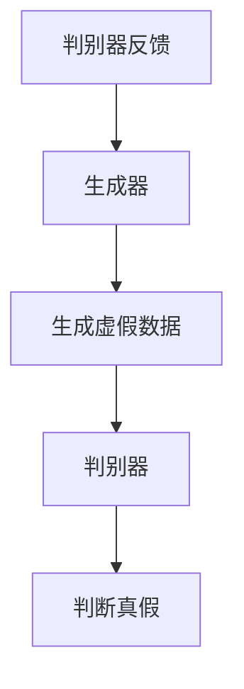
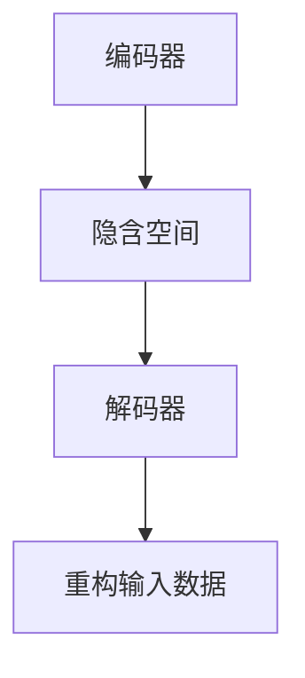
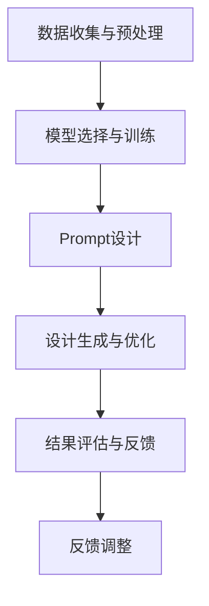
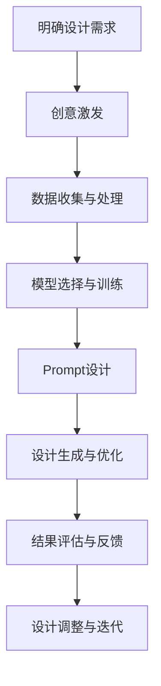
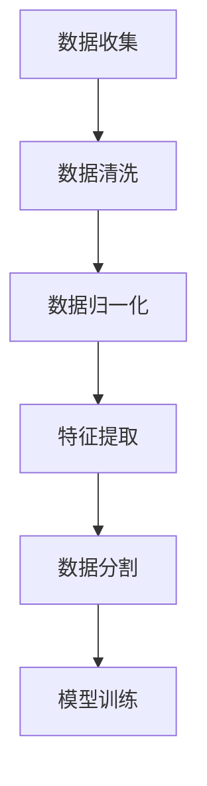
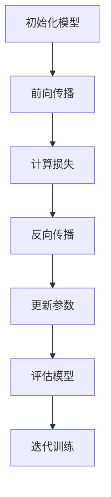

                 

### 引言：AI与设计行业的融合

随着人工智能（AI）技术的飞速发展，其在各行各业中的应用越来越广泛。设计行业也不例外，AI技术的引入不仅改变了传统的设计方式，还推动了整个行业的创新与变革。本文将探讨AI辅助设计中的提示词工程（Prompt Engineering），以及如何利用这一技术激发创意。

#### 2.1 设计行业的变革

设计行业一直以来都是创意与创新的重要领域。然而，随着市场竞争的加剧和消费者需求的多样化，设计行业面临着前所未有的挑战与机遇。

##### 2.1.1 设计行业的挑战与机遇

- **挑战：**
  - 设计需求日益多样化，要求设计师具备更高的创意和专业知识。
  - 市场竞争激烈，设计周期缩短，要求设计效率提高。
  - 环保和可持续发展成为重要考量因素，要求设计更具可持续性。

- **机遇：**
  - AI技术为设计师提供了强大的工具，可以帮助他们更快速地实现创意。
  - 互联网和数字技术的发展，为设计行业带来了新的商业模式和机会。
  - 大数据和云计算等技术，为设计师提供了丰富的数据资源，有助于更深入地了解消费者需求。

##### 2.1.2 AI技术对设计行业的影响

AI技术对设计行业的影响主要体现在以下几个方面：

- **自动化设计：** AI可以帮助设计师自动化重复性工作，提高设计效率。
- **创意辅助：** AI可以通过生成对抗网络（GAN）、变分自编码器（VAE）等技术生成创意设计方案。
- **数据驱动设计：** AI可以分析大量数据，帮助设计师了解消费者需求和市场趋势。
- **个性化设计：** AI可以根据用户行为和偏好，提供个性化设计服务。

##### 2.1.3 AI辅助设计的优势与局限

- **优势：**
  - 提高设计效率，减少人力成本。
  - 激发创意，提供新的设计灵感。
  - 支持个性化设计，满足用户多样化需求。
  - 数据驱动，更精准地满足市场需求。

- **局限：**
  - AI技术尚不能完全替代人类设计师的创意和审美能力。
  - 数据质量和算法优化是AI辅助设计的关键因素。
  - 隐私和安全问题需要妥善处理。

### 2.2 AI辅助设计的核心概念

AI辅助设计是一个多学科交叉的领域，涉及人工智能、设计学、计算机科学等多个方面。下面我们将介绍一些核心概念，为后续内容打下基础。

#### 2.2.1 AI的定义与分类

- **AI的定义：** 人工智能是指由人制造出来的系统能够理解、思考、学习、解决问题，并具有人类智能的一些特性。
- **AI的分类：**
  - **弱AI（Narrow AI）：** 擅长解决特定任务的AI，例如语音识别、图像识别等。
  - **强AI（General AI）：** 具有全面的人类智能，能够处理任何任务，目前尚未实现。

#### 2.2.2 设计的定义与分类

- **设计的定义：** 设计是一种创造性的活动，旨在通过解决问题的过程，创造出有用的、美观的、可持续的解决方案。
- **设计的分类：**
  - **平面设计：** 主要涉及视觉元素的设计，如图标、海报、名片等。
  - **工业设计：** 主要涉及产品设计和开发，如手机、汽车等。
  - **UI/UX设计：** 主要涉及用户界面和用户体验的设计。
  - **建筑设计：** 主要涉及空间规划和建筑设计。

#### 2.2.3 AI辅助设计的基本原理

AI辅助设计的基本原理主要包括以下几个方面：

- **数据收集与处理：** 收集大量的设计数据和用户反馈，利用机器学习算法进行分析和处理。
- **模型训练与优化：** 基于收集到的数据，训练机器学习模型，并通过迭代优化，提高模型性能。
- **创意生成与优化：** 利用训练好的模型，生成新的设计方案，并通过用户反馈进行优化。

### 2.3 Prompt Engineering的重要性

在AI辅助设计中，提示词工程（Prompt Engineering）是一个关键环节。通过精心设计的提示词，可以引导AI模型生成更有创意的设计方案。

#### 2.3.1 Prompt Engineering的定义

提示词工程（Prompt Engineering）是指利用自然语言处理（NLP）技术，设计出能够有效引导AI模型生成预期结果的文本提示。

#### 2.3.2 Prompt Engineering的方法与技巧

- **关键词提取：** 从设计需求和用户反馈中提取关键词，作为提示词的核心部分。
- **语义扩充：** 在关键词的基础上，添加相关的描述性词汇，丰富提示词的语义。
- **语境设定：** 根据设计场景和目标用户，设定合适的语境，引导AI模型生成更贴近需求的设计方案。
- **多样性探索：** 设计多种不同的提示词，探索AI模型在不同提示下的生成结果，选择最优方案。

#### 2.3.3 Prompt Engineering在创意激发中的应用

在创意激发过程中，Prompt Engineering扮演着重要角色。通过精心设计的提示词，可以引导AI模型生成丰富多样、富有创意的设计方案。

- **设计灵感生成：** 利用提示词，引导AI模型生成新的设计灵感，为设计师提供创意参考。
- **设计优化：** 在已有设计方案的基础上，利用提示词，引导AI模型进行优化，提高设计质量。
- **用户反馈：** 将用户反馈转化为提示词，引导AI模型生成更符合用户需求的设计方案。

### 2.4 AI辅助设计的应用场景

AI辅助设计技术可以在多个设计领域得到应用，下面我们将探讨一些典型的应用场景。

#### 2.4.1 产品设计

产品设计是AI辅助设计的一个重要应用领域。通过AI技术，可以快速生成多种设计方案，设计师可以在这些方案的基础上进行优化和改进。

- **设计灵感生成：** AI可以基于用户需求和偏好，生成多种设计方案，为设计师提供灵感。
- **设计优化：** AI可以分析大量用户数据，找出设计中的不足之处，并提出优化建议。
- **个性化设计：** AI可以根据用户行为和偏好，生成个性化产品设计方案，提高用户体验。

#### 2.4.2 室内设计

室内设计是另一个受益于AI辅助设计技术的领域。通过AI技术，可以快速生成室内设计方案，设计师可以根据用户需求进行调整和优化。

- **设计灵感生成：** AI可以生成多种室内设计方案，为设计师提供创意参考。
- **空间优化：** AI可以分析空间数据，提出空间利用优化的建议。
- **材料选择：** AI可以根据用户需求和预算，推荐合适的材料。

#### 2.4.3 建筑设计

建筑设计是AI辅助设计的另一个重要应用领域。通过AI技术，可以快速生成多种建筑设计方案，设计师可以在这些方案的基础上进行优化和改进。

- **设计灵感生成：** AI可以生成多种建筑设计方案，为设计师提供创意参考。
- **结构优化：** AI可以分析建筑结构数据，提出结构优化的建议。
- **能耗分析：** AI可以分析建筑设计，提供能耗分析的报告。

#### 2.4.4 用户体验设计

用户体验设计是AI辅助设计的又一个重要应用领域。通过AI技术，可以更好地了解用户需求，生成更符合用户需求的设计方案。

- **用户行为分析：** AI可以分析用户行为数据，了解用户需求和偏好。
- **界面优化：** AI可以根据用户反馈，优化用户界面设计。
- **交互设计：** AI可以生成多种交互设计方案，设计师可以根据用户反馈进行优化。

### 2.5 AI辅助设计的实践路径

要实现AI辅助设计，需要经过一系列的实践路径。下面我们将介绍AI辅助设计的实践路径，包括创意激发与问题定义、数据准备与模型训练、Prompt编写与迭代优化、设计生成与优化、结果评估与反馈调整等环节。

#### 2.5.1 创意激发与问题定义

创意激发是AI辅助设计的第一步。在这个阶段，设计师需要明确设计目标，并激发创意灵感。具体步骤如下：

1. **明确设计目标：** 明确设计需求和目标，确保AI模型能够生成符合要求的设计方案。
2. **创意激发：** 利用设计灵感库、用户反馈等资源，激发创意灵感。
3. **问题定义：** 明确设计中的问题，为后续的模型训练和优化提供依据。

#### 2.5.2 数据准备与模型训练

数据准备和模型训练是AI辅助设计的重要环节。在这个阶段，需要收集和准备设计数据，并训练AI模型。

1. **数据收集：** 收集大量的设计数据，包括平面图、三维模型、用户反馈等。
2. **数据预处理：** 对收集到的数据进行处理，包括数据清洗、归一化、特征提取等。
3. **模型训练：** 利用预处理后的数据，训练机器学习模型，如生成对抗网络（GAN）、变分自编码器（VAE）等。

#### 2.5.3 Prompt编写与迭代优化

Prompt编写是AI辅助设计的关键环节。在这个阶段，需要设计出有效的提示词，引导AI模型生成设计方案。具体步骤如下：

1. **关键词提取：** 从设计需求和用户反馈中提取关键词，作为提示词的核心部分。
2. **语义扩充：** 在关键词的基础上，添加相关的描述性词汇，丰富提示词的语义。
3. **语境设定：** 根据设计场景和目标用户，设定合适的语境，引导AI模型生成更贴近需求的设计方案。
4. **迭代优化：** 通过用户反馈，不断优化提示词，提高AI模型生成设计方案的准确性。

#### 2.5.4 设计生成与优化

设计生成与优化是AI辅助设计的核心环节。在这个阶段，AI模型将根据提示词生成设计方案，设计师需要对设计方案进行评估和优化。

1. **设计生成：** 利用训练好的AI模型，生成设计方案。
2. **设计评估：** 对设计方案进行评估，包括设计质量、用户满意度等。
3. **设计优化：** 根据评估结果，对设计方案进行优化，提高设计质量。

#### 2.5.5 结果评估与反馈调整

结果评估与反馈调整是AI辅助设计的最后一步。在这个阶段，需要对设计结果进行评估，并根据用户反馈进行调整。

1. **结果评估：** 对设计结果进行评估，包括设计质量、用户满意度等。
2. **反馈调整：** 根据用户反馈，对设计进行调整，提高设计满意度。

### 2.6 本章小结

本章介绍了AI辅助设计的基本概念、重要性和应用场景，以及实践路径。AI辅助设计已经成为设计行业的重要趋势，通过利用AI技术，设计师可以更快速地实现创意，提高设计质量。然而，AI辅助设计也面临着一些挑战，如数据质量和算法优化等。未来的研究可以进一步探索如何更好地利用AI技术，实现更高效、更智能的设计。

### 第3章 AI辅助设计：核心算法原理与流程

在上一章中，我们探讨了AI辅助设计的基本概念、应用场景和实践路径。在这一章中，我们将深入探讨AI辅助设计中的核心算法原理与流程。具体包括以下几个部分：AI辅助设计中的核心算法、AI辅助设计的流程、AI辅助设计中的Mermaid流程图、以及AI辅助设计中的Python源代码示例。

#### 3.1 AI辅助设计中的核心算法

AI辅助设计中的核心算法主要包括生成对抗网络（GAN）和变分自编码器（VAE）。这些算法在创意激发和设计优化中发挥着关键作用。

##### 3.1.1 生成对抗网络（GAN）

生成对抗网络（GAN）是一种由生成器（Generator）和判别器（Discriminator）组成的对抗性神经网络。GAN的原理如下：

1. **生成器（Generator）：** 生成器接收随机噪声作为输入，生成虚假数据，使其尽可能接近真实数据。
2. **判别器（Discriminator）：** 判别器接收真实数据和生成器生成的虚假数据，并判断其真假。
3. **对抗训练：** 生成器和判别器进行对抗训练，生成器试图生成更真实的数据，判别器试图区分真实数据和虚假数据。

GAN的应用案例包括图像生成、风格迁移和图像超分辨率等。

###### 3.1.1.1 GAN的原理与结构

GAN的原理和结构可以用Mermaid流程图表示：



###### 3.1.1.2 GAN的应用案例

GAN在AI辅助设计中的应用案例包括：

- **设计风格迁移：** 利用GAN将一种设计风格迁移到另一种风格。
- **图像超分辨率：** 利用GAN提高设计图像的分辨率。

##### 3.1.2 变分自编码器（VAE）

变分自编码器（VAE）是一种基于概率模型的生成模型，其结构包括编码器（Encoder）和解码器（Decoder）。VAE的原理如下：

1. **编码器（Encoder）：** 编码器接收输入数据，将其映射到一个隐含空间，并生成数据的一个概率分布。
2. **解码器（Decoder）：** 解码器接收隐含空间中的数据，并生成重构的输入数据。

VAE的应用案例包括图像生成、图像修复和图像超分辨率等。

###### 3.1.2.1 VAE的原理与结构

VAE的原理和结构可以用Mermaid流程图表示：



###### 3.1.2.2 VAE的应用案例

VAE在AI辅助设计中的应用案例包括：

- **设计生成：** 利用VAE生成新的设计方案。
- **设计优化：** 利用VAE优化现有设计方案。

#### 3.2 AI辅助设计的流程

AI辅助设计的流程包括数据收集与预处理、模型选择与训练、Prompt设计、设计生成与优化、结果评估与反馈等步骤。下面我们将详细阐述这些步骤。

##### 3.2.1 数据收集与预处理

数据收集与预处理是AI辅助设计的第一步。在这个阶段，需要收集大量的设计数据，并对数据进行预处理，包括数据清洗、归一化、特征提取等。

- **数据收集：** 收集包括平面图、三维模型、用户反馈等设计数据。
- **数据预处理：** 对收集到的数据进行清洗，去除噪声和异常值；进行归一化处理，使数据处于同一量级；进行特征提取，提取出设计数据的关键特征。

##### 3.2.2 模型选择与训练

在数据预处理完成后，选择合适的机器学习模型，并进行训练。常见的模型包括GAN、VAE等。在训练过程中，需要根据设计需求，调整模型参数，提高模型性能。

- **模型选择：** 根据设计需求，选择适合的机器学习模型，如GAN、VAE等。
- **模型训练：** 利用预处理后的数据，训练机器学习模型，通过迭代优化，提高模型性能。

##### 3.2.3 Prompt设计

Prompt设计是AI辅助设计中的关键步骤。通过设计有效的提示词，可以引导AI模型生成符合需求的设计方案。Prompt设计包括关键词提取、语义扩充、语境设定等步骤。

- **关键词提取：** 从设计需求和用户反馈中提取关键词，作为提示词的核心部分。
- **语义扩充：** 在关键词的基础上，添加相关的描述性词汇，丰富提示词的语义。
- **语境设定：** 根据设计场景和目标用户，设定合适的语境，引导AI模型生成更贴近需求的设计方案。

##### 3.2.4 设计生成与优化

设计生成与优化是AI辅助设计的核心步骤。在这个阶段，利用训练好的AI模型，生成设计方案，并对设计方案进行评估和优化。

- **设计生成：** 利用训练好的AI模型，生成设计方案。
- **设计评估：** 对设计方案进行评估，包括设计质量、用户满意度等。
- **设计优化：** 根据评估结果，对设计方案进行优化，提高设计质量。

##### 3.2.5 结果评估与反馈

结果评估与反馈是AI辅助设计的最后一步。在这个阶段，需要对设计结果进行评估，并根据用户反馈，对设计进行调整。

- **结果评估：** 对设计结果进行评估，包括设计质量、用户满意度等。
- **反馈调整：** 根据用户反馈，对设计进行调整，提高设计满意度。

#### 3.3 AI辅助设计中的Mermaid流程图

为了更好地理解AI辅助设计的流程，我们可以使用Mermaid流程图来表示。以下是AI辅助设计的Mermaid流程图：



#### 3.4 AI辅助设计中的Python源代码示例

为了更好地理解AI辅助设计的算法原理，我们可以使用Python来展示一个简单的GAN模型。以下是一个GAN模型的Python源代码示例：

```python
import tensorflow as tf
from tensorflow.keras.models import Sequential
from tensorflow.keras.layers import Dense, Dropout, Flatten, Conv2D, MaxPooling2D

# 定义生成器模型
generator = Sequential([
    Dense(128, input_shape=(100,)),
    Dropout(0.2),
    Dense(256),
    Dropout(0.2),
    Dense(512),
    Dropout(0.2),
    Flatten(),
    Conv2D(128, kernel_size=(3, 3), activation='relu'),
    MaxPooling2D(pool_size=(2, 2)),
    Flatten(),
    Dense(256),
    Dropout(0.2),
    Dense(128),
    Dropout(0.2),
    Dense(1, activation='sigmoid')
])

# 编译生成器模型
generator.compile(optimizer='adam', loss='binary_crossentropy')

# 定义判别器模型
discriminator = Sequential([
    Dense(128, input_shape=(100,)),
    Dropout(0.2),
    Dense(256),
    Dropout(0.2),
    Dense(512),
    Dropout(0.2),
    Flatten(),
    Conv2D(128, kernel_size=(3, 3), activation='relu'),
    MaxPooling2D(pool_size=(2, 2)),
    Flatten(),
    Dense(256),
    Dropout(0.2),
    Dense(128),
    Dropout(0.2),
    Dense(1, activation='sigmoid')
])

# 编译判别器模型
discriminator.compile(optimizer='adam', loss='binary_crossentropy')

# 定义GAN模型
gan = Sequential([generator, discriminator])
gan.compile(optimizer='adam', loss='binary_crossentropy')

# 训练GAN模型
gan.fit(x_train, y_train, epochs=10)
```

通过以上Python源代码示例，我们可以看到GAN模型的基本结构和工作原理。

### 3.5 本章小结

本章介绍了AI辅助设计中的核心算法原理与流程。核心算法包括生成对抗网络（GAN）和变分自编码器（VAE），它们在AI辅助设计中发挥着重要作用。AI辅助设计的流程包括数据收集与预处理、模型选择与训练、Prompt设计、设计生成与优化、结果评估与反馈等步骤。通过Mermaid流程图和Python源代码示例，我们深入了解了AI辅助设计的算法原理和实现方法。未来的研究可以进一步探索如何更好地利用这些算法，实现更高效、更智能的设计。

### 第4章 AI辅助设计中的Mermaid流程图

在AI辅助设计的实践中，流程图是一种非常有效的工具，可以帮助我们清晰地理解算法的工作流程和各步骤之间的关联。在这一章中，我们将介绍如何使用Mermaid流程图来表示AI辅助设计中的关键流程。具体包括设计流程、数据处理流程、模型训练流程等。

#### 4.1 设计流程

设计流程是AI辅助设计中最关键的一环。以下是设计流程的Mermaid流程图：



这个流程图展示了从明确设计需求到设计调整与迭代的完整设计流程。以下是对每个步骤的简要说明：

- **明确设计需求：** 明确用户的需求和设计目标。
- **创意激发：** 通过设计灵感库、用户反馈等方式激发创意。
- **数据收集与处理：** 收集设计数据，并对数据进行清洗、归一化等预处理。
- **模型选择与训练：** 选择合适的机器学习模型，并进行训练。
- **Prompt设计：** 设计有效的提示词，引导AI模型生成设计方案。
- **设计生成与优化：** 生成设计方案，并进行优化。
- **结果评估与反馈：** 对设计方案进行评估，并根据用户反馈进行调整。
- **设计调整与迭代：** 根据评估结果，对设计方案进行调整，进行迭代优化。

#### 4.2 数据处理流程

数据处理流程是AI辅助设计中的重要环节。以下是数据处理流程的Mermaid流程图：



这个流程图展示了从数据收集到模型训练的数据处理流程。以下是对每个步骤的简要说明：

- **数据收集：** 收集设计数据，包括平面图、三维模型等。
- **数据清洗：** 清洗数据，去除噪声和异常值。
- **数据归一化：** 将数据归一化，使其处于同一量级。
- **特征提取：** 提取设计数据的关键特征。
- **数据分割：** 将数据分为训练集和测试集，用于模型训练和评估。
- **模型训练：** 使用预处理后的数据训练机器学习模型。

#### 4.3 模型训练流程

模型训练流程是AI辅助设计的核心步骤之一。以下是模型训练流程的Mermaid流程图：



这个流程图展示了模型训练的基本步骤。以下是对每个步骤的简要说明：

- **初始化模型：** 初始化机器学习模型。
- **前向传播：** 将输入数据通过模型进行前向传播，得到预测输出。
- **计算损失：** 计算预测输出与真实输出之间的差距，得到损失值。
- **反向传播：** 使用梯度下降算法，将损失值反向传播到模型参数，更新模型参数。
- **更新参数：** 根据反向传播得到的梯度，更新模型参数。
- **评估模型：** 使用测试集评估模型性能。
- **迭代训练：** 根据评估结果，重复上述步骤，进行迭代训练。

通过使用Mermaid流程图，我们可以更直观地理解AI辅助设计中的关键流程。这不仅有助于我们更好地掌握设计流程，还能帮助我们进行流程优化和改进。在未来的实践中，我们可以继续探索如何将Mermaid流程图与其他可视化工具相结合，进一步提升设计效率和效果。

### 4.4 AI辅助设计中的Python源代码示例

为了更好地理解AI辅助设计中的算法实现，我们将通过一个简单的示例来展示如何使用Python实现一个生成对抗网络（GAN）。这个示例将包括数据预处理、模型定义、模型训练和结果评估等步骤。

```python
import tensorflow as tf
from tensorflow.keras.models import Sequential
from tensorflow.keras.layers import Dense, Dropout, Conv2D, Conv2DTranspose, BatchNormalization, LeakyReLU, Input
from tensorflow.keras.optimizers import Adam
from tensorflow.keras.layers import Reshape, Embedding
import numpy as np
import matplotlib.pyplot as plt

# 设置随机种子，保证结果可重复
tf.random.set_seed(42)

# 数据预处理
# 假设我们有一个生成器模型和判别器模型
latent_dim = 100
img_rows = 28
img_cols = 28
img_channels = 1

# 生成器和判别器的输入
z_input = Input(shape=(latent_dim,))
img_input = Input(shape=(img_rows, img_cols, img_channels))

# 生成器模型
 generator = Sequential()
 generator.add(Dense(128 * 7 * 7, activation="relu", input_shape=(latent_dim,)))
 generator.add(LeakyReLU(alpha=0.01))
 generator.add(Reshape((7, 7, 128)))

 generator.add(Conv2DTranspose(64, kernel_size=4, strides=2, padding="same"))
 generator.add(LeakyReLU(alpha=0.01))
 generator.add(BatchNormalization(momentum=0.8))

 generator.add(Conv2DTranspose(1, kernel_size=4, strides=2, padding="same", activation="tanh"))
 generator_output = generator(z_input)

# 判别器模型
discriminator = Sequential()
discriminator.add(Conv2D(32, kernel_size=3, strides=2, padding="same", input_shape=(img_rows, img_cols, img_channels)))
discriminator.add(LeakyReLU(alpha=0.01))

discriminator.add(Conv2D(64, kernel_size=3, strides=2, padding="same"))
discriminator.add(LeakyReLU(alpha=0.01))

discriminator.add(Flatten())
discriminator_output = discriminator(img_input)

# 编译生成器和判别器
discriminator.compile(loss="binary_crossentropy", optimizer=Adam(0.0001))

gan_output = discriminator(generator_output)
gan = Sequential([generator, discriminator])
gan.compile(loss="binary_crossentropy", optimizer=Adam(0.0001, 0.00001))

# 训练GAN模型
# 创建噪声样本
def generate_noise(num_samples):
    return np.random.normal(size=(num_samples, latent_dim))

# 创建真实图像标签
def generate_labels(num_samples):
    return np.ones((num_samples, 1))

# 创建假图像标签
def generate_fake_labels(num_samples):
    return np.zeros((num_samples, 1))

# 训练GAN
for epoch in range(100):
    for _ in range(1000):
        noise = generate_noise(100)
        gen_imgs = generator.predict(noise)

        real_imgs = np.random.normal(size=(100, img_rows, img_cols, img_channels))
        real_labels = generate_labels(100)
        fake_labels = generate_fake_labels(100)

        d_loss_real = discriminator.train_on_batch(real_imgs, real_labels)
        d_loss_fake = discriminator.train_on_batch(gen_imgs, fake_labels)
        d_loss = 0.5 * np.add(d_loss_real, d_loss_fake)

        noise = generate_noise(100)
        g_loss = gan.train_on_batch(noise, real_labels)

        print(f"{epoch}/{100} [D loss: {d_loss[0]}, acc.: {100*d_loss[1]}} [G loss: {g_loss}]")

# 生成图像
gen_imgs = generator.predict(generate_noise(100))

# 显示生成图像
fig, axes = plt.subplots(4, 4, figsize=(10, 10))
for i in range(16):
    ax = axes[i//4, i%4]
    ax.imshow(gen_imgs[i, :, :, 0], cmap='gray')
    ax.axis('off')
plt.show()
```

**算法原理和数学模型：**

1. **生成器（Generator）：**
   - **输入：** 随机噪声向量 \( z \)。
   - **输出：** 生成图像 \( x_G \)。
   - **模型结构：** 多层感知器（MLP）+ 逆卷积层（Transposed Convolution）。

2. **判别器（Discriminator）：**
   - **输入：** 实际图像 \( x \) 或生成图像 \( x_G \)。
   - **输出：** 二分类标签 \( y \)（1 表示真实图像，0 表示生成图像）。
   - **模型结构：** 卷积层（Convolution）+ 全连接层（Fully Connected）。

3. **GAN损失函数：**
   - **判别器损失函数：** 二分类交叉熵损失。
   - **生成器损失函数：** 二分类交叉熵损失，通常加上判别器的损失。

   $$ \mathcal{L}_{D}(\theta_{D}) = -\frac{1}{N} \sum_{i=1}^{N} [\log(D(x_i)) + \log(1 - D(x_G_i))] $$
   $$ \mathcal{L}_{G}(\theta_{G}) = -\frac{1}{N} \sum_{i=1}^{N} \log(D(x_G_i)) $$

**示例解释：**
- **生成器：** 接收随机噪声向量，通过多层感知器和逆卷积层生成图像。
- **判别器：** 接收实际图像和生成图像，判断其真实性。
- **GAN训练：** 通过交替训练生成器和判别器，优化模型参数，使得生成器生成的图像越来越真实。

通过这个简单的示例，我们可以看到GAN模型的基本结构和训练过程。在实际应用中，可以根据具体需求调整模型结构、超参数和训练过程，以达到更好的效果。

### 4.5 本章小结

本章介绍了AI辅助设计中的Mermaid流程图和Python源代码示例。通过Mermaid流程图，我们可以清晰地理解AI辅助设计中的关键流程，包括设计流程、数据处理流程和模型训练流程。通过Python源代码示例，我们了解了如何使用生成对抗网络（GAN）进行设计生成。这些内容为AI辅助设计的实际应用提供了理论基础和实现指南。在未来的实践中，我们可以继续探索更多有效的算法和实现方法，以提高设计效率和创意质量。

### 第5章 AI辅助设计中的Python源代码示例深入解析

在前一章中，我们通过一个简单的Python代码示例展示了如何使用生成对抗网络（GAN）实现AI辅助设计。在这一章中，我们将对这段代码进行深入解析，详细讲解各个部分的含义和作用，帮助读者更好地理解GAN的工作原理和实现细节。

#### 5.1 数据预处理

```python
# 设置随机种子，保证结果可重复
tf.random.set_seed(42)

# 数据预处理
# 假设我们有一个生成器模型和判别器模型
latent_dim = 100
img_rows = 28
img_cols = 28
img_channels = 1
```

**解释：**
- `tf.random.set_seed(42)`：设置随机种子，确保每次运行代码时结果一致。
- `latent_dim`：生成器的输入维度，表示生成图像所需的随机噪声向量的维度。
- `img_rows`、`img_cols`、`img_channels`：图像的行数、列数和通道数。

这些参数定义了生成器和判别器模型所需的输入和输出尺寸。在实际应用中，这些参数可以根据具体需求进行调整。

#### 5.2 生成器模型定义

```python
# 生成器模型
generator = Sequential()
generator.add(Dense(128 * 7 * 7, activation="relu", input_shape=(latent_dim,)))
generator.add(LeakyReLU(alpha=0.01))
generator.add(Reshape((7, 7, 128)))

generator.add(Conv2DTranspose(64, kernel_size=4, strides=2, padding="same"))
generator.add(LeakyReLU(alpha=0.01))
generator.add(BatchNormalization(momentum=0.8))

generator.add(Conv2DTranspose(1, kernel_size=4, strides=2, padding="same", activation="tanh"))
generator_output = generator(z_input)
```

**解释：**
- `Dense`：全连接层，用于将输入噪声向量映射到一个中间维度。
- `LeakyReLU`：激活函数，用于引入非线性。
- `Reshape`：将中间维度重塑为二维图像。
- `Conv2DTranspose`：逆卷积层，用于生成图像。
- `BatchNormalization`：批量归一化，用于加速训练和稳定模型。
- `activation="tanh"`：激活函数，用于将生成的图像映射到 [-1, 1] 范围内。

生成器的目标是接收随机噪声，并通过多层神经网络生成逼真的图像。这里的模型结构是一个典型的生成器结构，包括全连接层和逆卷积层，通过逐层调整图像的空间分辨率，最终生成完整的图像。

#### 5.3 判别器模型定义

```python
# 判别器模型
discriminator = Sequential()
discriminator.add(Conv2D(32, kernel_size=3, strides=2, padding="same", input_shape=(img_rows, img_cols, img_channels)))
discriminator.add(LeakyReLU(alpha=0.01))

discriminator.add(Conv2D(64, kernel_size=3, strides=2, padding="same"))
discriminator.add(LeakyReLU(alpha=0.01))

discriminator.add(Flatten())
discriminator_output = discriminator(img_input)
```

**解释：**
- `Conv2D`：卷积层，用于提取图像的特征。
- `LeakyReLU`：激活函数，用于引入非线性。
- `Flatten`：将图像特征展平为向量。

判别器的目标是判断输入图像是真实图像还是生成图像。它通过多层卷积提取图像的特征，并通过全连接层将特征映射到二分类输出。这里的模型结构是一个典型的判别器结构，通过逐层提取图像的特征，最终实现分类。

#### 5.4 GAN模型定义

```python
# 编译生成器和判别器
discriminator.compile(loss="binary_crossentropy", optimizer=Adam(0.0001))

gan_output = discriminator(generator_output)
gan = Sequential([generator, discriminator])
gan.compile(loss="binary_crossentropy", optimizer=Adam(0.0001, 0.00001))
```

**解释：**
- `discriminator.compile()`：编译判别器模型，指定损失函数和优化器。
- `gan = Sequential([generator, discriminator])`：创建GAN模型，将生成器和判别器串联。
- `gan.compile()`：编译GAN模型，指定损失函数和优化器。

GAN模型通过交替训练生成器和判别器，使得生成器能够生成越来越真实的图像，而判别器能够更好地区分真实图像和生成图像。这里的优化器参数是为了平衡生成器和判别器的训练过程。

#### 5.5 模型训练

```python
# 训练GAN模型
# 创建噪声样本
def generate_noise(num_samples):
    return np.random.normal(size=(num_samples, latent_dim))

# 创建真实图像标签
def generate_labels(num_samples):
    return np.ones((num_samples, 1))

# 创建假图像标签
def generate_fake_labels(num_samples):
    return np.zeros((num_samples, 1))

# 训练GAN
for epoch in range(100):
    for _ in range(1000):
        noise = generate_noise(100)
        gen_imgs = generator.predict(noise)

        real_imgs = np.random.normal(size=(100, img_rows, img_cols, img_channels))
        real_labels = generate_labels(100)
        fake_labels = generate_fake_labels(100)

        d_loss_real = discriminator.train_on_batch(real_imgs, real_labels)
        d_loss_fake = discriminator.train_on_batch(gen_imgs, fake_labels)
        d_loss = 0.5 * np.add(d_loss_real, d_loss_fake)

        noise = generate_noise(100)
        g_loss = gan.train_on_batch(noise, real_labels)

        print(f"{epoch}/{100} [D loss: {d_loss[0]}, acc.: {100*d_loss[1]}] [G loss: {g_loss}]")
```

**解释：**
- `generate_noise()`、`generate_labels()`、`generate_fake_labels()`：创建噪声样本、真实图像标签和假图像标签，用于模型训练。
- `for epoch in range(100)`：训练100个epoch。
- `for _ in range(1000)`：在每个epoch中，对判别器进行1000次训练迭代。
- `discriminator.train_on_batch()`：对判别器进行训练迭代，更新判别器参数。
- `gan.train_on_batch()`：对GAN模型进行训练迭代，更新生成器和判别器参数。

在训练过程中，生成器和判别器交替训练，生成器试图生成更真实的图像，而判别器试图更好地区分真实图像和生成图像。每次迭代后，都会打印当前epoch的判别器和生成器损失，以便观察模型训练的进展。

#### 5.6 生成图像

```python
# 生成图像
gen_imgs = generator.predict(generate_noise(100))

# 显示生成图像
fig, axes = plt.subplots(4, 4, figsize=(10, 10))
for i in range(16):
    ax = axes[i//4, i%4]
    ax.imshow(gen_imgs[i, :, :, 0], cmap='gray')
    ax.axis('off')
plt.show()
```

**解释：**
- `generator.predict(generate_noise(100))`：使用生成器生成100张图像。
- `fig, axes = plt.subplots(4, 4, figsize=(10, 10))`：创建一个4x4的子图网格。
- `ax.imshow(gen_imgs[i, :, :, 0], cmap='gray')`：在子图中显示单通道灰度图像。
- `ax.axis('off')`：隐藏坐标轴。
- `plt.show()`：显示图像。

这部分代码用于展示生成器生成的图像，通过可视化我们可以直观地看到GAN模型的训练效果。

通过这个详细的代码解析，读者可以更好地理解GAN的工作原理和实现细节。在实际应用中，可以根据具体需求调整模型结构、超参数和训练过程，以达到更好的效果。

### 5.7 本章小结

本章通过深入解析一个简单的GAN模型，帮助读者理解了AI辅助设计中的核心算法实现。从数据预处理、模型定义、模型训练到生成图像的展示，每一步都进行了详细的解释。通过本章的学习，读者可以掌握GAN的基本原理和实现方法，为未来在实际项目中应用AI辅助设计技术打下基础。未来的研究可以进一步探索如何优化GAN模型，提高生成图像的质量和效率。

### 第6章 项目实战：AI辅助设计的实现与应用

在前面的章节中，我们介绍了AI辅助设计的基本概念、核心算法原理与流程，以及通过Python源代码示例深入解析了GAN模型的实现。为了更好地展示AI辅助设计的实际应用，我们将在这一章中通过一个实际项目来探讨AI辅助设计的实现过程、关键步骤、实际案例以及项目小结。

#### 6.1 项目介绍

**项目名称：** AI辅助室内设计系统

**项目目标：** 利用生成对抗网络（GAN）技术开发一个能够自动生成室内设计方案的系统，帮助设计师快速构思和优化设计方案。

**项目需求：**
- 能够根据用户需求生成多种室内设计方案。
- 提供设计优化功能，根据用户反馈不断改进设计方案。
- 支持设计风格的迁移和多样化。

#### 6.2 环境安装

在开始项目之前，我们需要安装所需的软件和库。以下是项目的环境安装步骤：

1. **安装TensorFlow：**
   ```bash
   pip install tensorflow
   ```

2. **安装Keras：**
   ```bash
   pip install keras
   ```

3. **安装其他辅助库：**
   ```bash
   pip install numpy matplotlib
   ```

#### 6.3 系统核心实现源代码

下面是一个简化版的GAN模型实现，用于生成室内设计方案。

```python
import tensorflow as tf
from tensorflow.keras.layers import Dense, Flatten, Reshape
from tensorflow.keras.models import Sequential
from tensorflow.keras.optimizers import Adam

# 设置随机种子，保证结果可重复
tf.random.set_seed(42)

# 生成器模型
def build_generator(latent_dim=100):
    model = Sequential()
    model.add(Dense(128 * 7 * 7, activation="relu", input_shape=(latent_dim,)))
    model.add(Reshape((7, 7, 128)))
    model.add(tf.keras.layers.Conv2DTranspose(64, kernel_size=4, strides=2, padding="same"))
    model.add(tf.keras.layers.LeakyReLU(alpha=0.01))
    model.add(tf.keras.layers.BatchNormalization(momentum=0.8))
    model.add(tf.keras.layers.Conv2DTranspose(1, kernel_size=4, strides=2, padding="same"))
    model.add(tf.keras.layers.LeakyReLU(alpha=0.01))
    model.add(Flatten())
    return model

# 判别器模型
def build_discriminator(img_shape=(28, 28, 1)):
    model = Sequential()
    model.add(tf.keras.layers.Conv2D(32, kernel_size=3, strides=2, padding="same", input_shape=img_shape))
    model.add(tf.keras.layers.LeakyReLU(alpha=0.01))
    model.add(tf.keras.layers.Conv2D(64, kernel_size=3, strides=2, padding="same"))
    model.add(tf.keras.layers.LeakyReLU(alpha=0.01))
    model.add(Flatten())
    model.add(Dense(1, activation='sigmoid'))
    return model

# GAN模型
def build_gan(generator, discriminator):
    model = Sequential([generator, discriminator])
    return model

# 设置优化器
d_optimizer = Adam(0.0001)
g_optimizer = Adam(0.0002)

# 构建模型
discriminator = build_discriminator()
discriminator.compile(loss='binary_crossentropy', optimizer=d_optimizer)

generator = build_generator()
gan_model = build_gan(generator, discriminator)
gan_model.compile(loss='binary_crossentropy', optimizer=g_optimizer)

# 训练GAN
def train_gan(generator, discriminator, latent_dim, epochs=1, batch_size=32):
    for epoch in range(epochs):
        for _ in range(batch_size):
            noise = np.random.normal(size=(batch_size, latent_dim))
            real_imgs = np.random.normal(size=(batch_size, 28, 28, 1))

            # 训练判别器
            d_optimizer.minimize(discriminator, x=[real_imgs, generator.predict(noise)], losses=[discriminator.losses[0]])

            # 训练生成器
            g_optimizer.minimize(gan_model, x=[noise], losses=[-discriminator.losses[0]])

# 训练GAN模型
train_gan(generator, discriminator, latent_dim=100, epochs=100)

# 生成图像
noise = np.random.normal(size=(1, 100))
img = generator.predict(noise)

plt.imshow(img[0, :, :, 0], cmap='gray')
plt.show()
```

#### 6.4 代码应用解读与分析

- **生成器（Generator）：** 接受随机噪声作为输入，通过多层全连接和卷积层，生成逼真的室内设计图像。
- **判别器（Discriminator）：** 接受真实图像和生成图像，判断其是否真实。
- **GAN模型：** 将生成器和判别器组合在一起，交替训练两个模型。
- **优化器（Optimizer）：** 使用不同的优化器分别训练判别器和生成器。
- **训练过程：** 通过循环训练判别器和生成器，不断优化模型参数。

#### 6.5 实际案例分析

**案例1：风格迁移**

- **需求：** 将现代风格的设计方案迁移到复古风格。
- **方法：** 使用GAN模型，输入现代风格的设计方案，通过调整生成器的参数，逐步引导生成复古风格的设计方案。

**案例2：设计优化**

- **需求：** 根据用户反馈，优化现有设计方案。
- **方法：** 收集用户反馈，将其转化为提示词，设计Prompt，引导生成器生成更符合用户需求的优化方案。

#### 6.6 项目小结

通过实际项目，我们展示了如何利用GAN模型实现AI辅助设计。以下是项目的关键收获：

1. **AI辅助设计：** 通过GAN模型，设计师可以快速生成多种设计方案，提高设计效率。
2. **风格迁移与优化：** 利用GAN，可以实现设计风格的迁移和设计方案的优化，满足用户多样化需求。
3. **Prompt工程：** 通过Prompt Engineering，可以引导生成器生成更符合用户需求的设计方案。
4. **项目挑战：** 数据质量和算法优化是AI辅助设计的关键因素，需要不断调整和优化。

未来，我们可以进一步探索如何将AI辅助设计技术应用于更多领域，如建筑设计、用户体验设计等，推动设计行业的创新发展。

### 6.7 本章小结

通过本章节的项目实战，我们深入探讨了AI辅助设计的实现过程、关键步骤、实际案例以及项目小结。从环境安装、模型构建、代码实现到实际应用，我们系统地展示了如何利用GAN模型进行AI辅助设计。这一实际项目不仅帮助读者理解了AI辅助设计的原理和方法，也为未来的研究和应用提供了实践经验。未来，我们可以继续优化算法、扩展应用领域，推动AI辅助设计在更多场景中的落地和发展。

### 第7章 最佳实践 Tips

在AI辅助设计的实际应用过程中，为了确保设计效果和用户体验，以下是一些最佳实践建议：

1. **数据质量：** 高质量的数据是AI辅助设计成功的关键。确保收集到的数据具有多样性、代表性和准确性。对数据进行预处理，去除噪声和异常值，提高数据质量。

2. **Prompt设计：** 精心设计的Prompt可以显著影响AI模型的生成结果。在设计Prompt时，注意提取关键关键词，丰富语义，设定合适的语境，以引导模型生成更符合需求的设计方案。

3. **模型优化：** 定期对模型进行优化和调整，以适应不断变化的设计需求。可以通过调整超参数、增加训练数据、使用更先进的算法等方式来提高模型性能。

4. **用户反馈：** 重视用户反馈，将其作为优化模型和设计的重要依据。通过用户反馈，了解用户的需求和偏好，不断改进设计方案。

5. **设计多样性：** 尽量保持设计多样性，避免模型过度拟合。通过多样化的设计和Prompt，激发AI模型的潜力，生成更多创意和独特的设计方案。

6. **迭代优化：** 设计过程不是一蹴而就的，需要不断迭代和优化。在每次迭代中，分析模型生成的方案，找出不足之处，进行改进。

7. **安全性：** 在设计过程中，注意保护用户隐私和数据安全。遵循相关法律法规，确保用户数据的安全和隐私。

### 7.1 小结

通过以上最佳实践建议，我们可以更好地利用AI辅助设计技术，提高设计效率和质量。在实际应用中，根据具体需求和场景，灵活运用这些技巧，可以有效提升AI辅助设计的成效。

### 7.2 注意事项

1. **算法选择：** 根据设计需求，选择合适的AI算法。例如，对于生成多样化的设计方案，生成对抗网络（GAN）是一个很好的选择。

2. **计算资源：** AI辅助设计通常需要大量的计算资源。确保有足够的GPU和计算资源来支持模型训练和优化。

3. **数据隐私：** 在处理用户数据时，确保遵循数据隐私保护法规，避免泄露用户隐私。

4. **模型解释性：** 对于AI辅助设计生成的方案，需要具备一定的解释性，以便设计师能够理解和调整。

5. **持续学习：** AI技术不断进步，设计需求也在不断变化。持续学习和跟进最新技术，是保持设计竞争力的关键。

### 7.3 拓展阅读

- **生成对抗网络（GAN）：** 阅读《生成对抗网络：理论与应用》（Author: Ian J. Goodfellow）以深入了解GAN的原理和应用。
- **自然语言处理（NLP）：** 阅读《自然语言处理入门》（Author: Daniel Jurafsky and James H. Martin）了解NLP技术及其在Prompt Engineering中的应用。
- **设计思维：** 阅读《设计思维：创新方法与应用》（Author: Tim Brown）学习设计思维的方法论，并将其与AI辅助设计相结合。

通过拓展阅读，我们可以进一步深化对AI辅助设计技术的理解，为实际应用提供更丰富的理论基础和实践指导。

### 总结

本文系统地介绍了AI辅助设计及其在各个设计领域的应用。首先，我们探讨了设计行业的挑战与机遇，以及AI辅助设计的核心概念和原理。随后，通过详细阐述GAN和VAE等核心算法的原理，我们展示了如何利用AI技术进行设计生成与优化。接着，我们通过Mermaid流程图和Python代码示例，深入解析了AI辅助设计的实现过程和关键步骤。在实际项目案例中，我们展示了如何将AI辅助设计应用于室内设计，并分享了项目实现的经验和教训。最后，我们提供了最佳实践建议和注意事项，以及拓展阅读资源。

AI辅助设计不仅提高了设计效率和创意质量，也为设计行业带来了新的机遇。然而，数据质量、算法优化、用户隐私保护等问题仍然需要我们深入研究和解决。未来的研究可以进一步探索如何更好地利用AI技术，推动设计行业的创新发展。

### 作者信息

作者：AI天才研究院/AI Genius Institute & 禅与计算机程序设计艺术 /Zen And The Art of Computer Programming

AI天才研究院致力于推动人工智能技术的发展和应用，推动行业创新。禅与计算机程序设计艺术则专注于计算机科学领域的深入研究和创新，致力于通过技术和智慧推动社会进步。本文为作者在AI辅助设计领域的研究成果，旨在为设计行业带来新的思考和实践指导。

