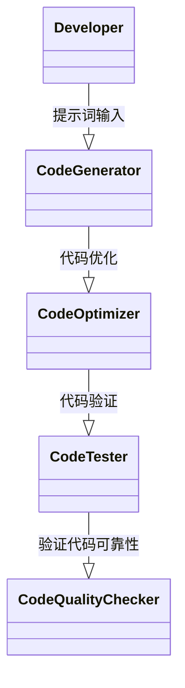
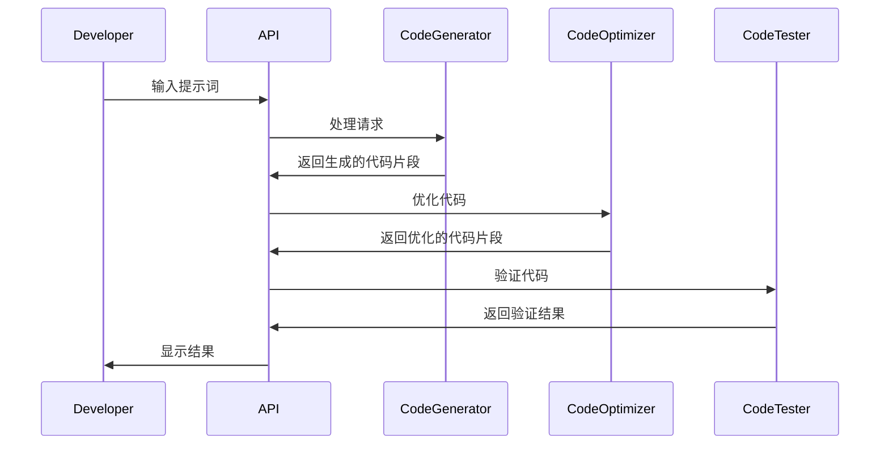
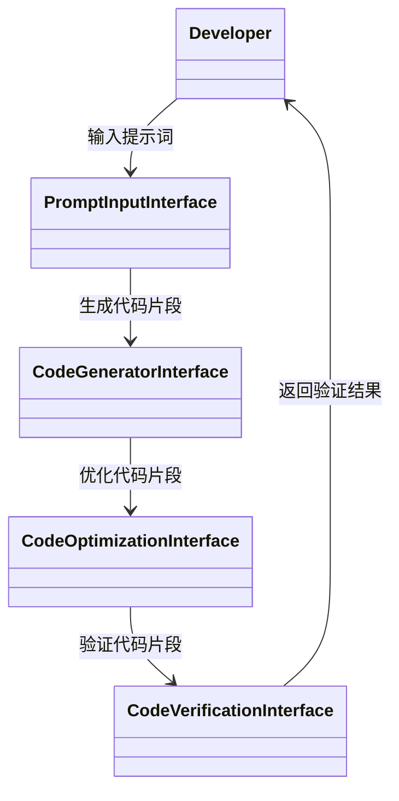
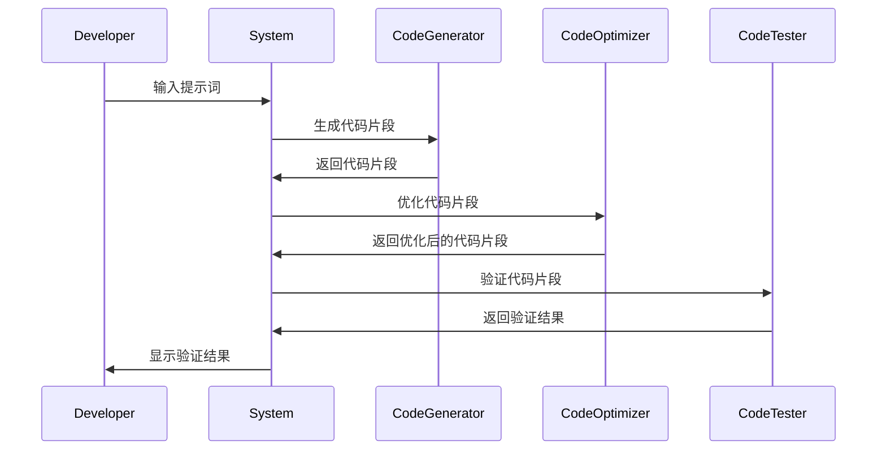

                 

## 背景介绍

### 第1章：问题背景

#### 1.1.1 软件开发现状

当前，软件开发已经成为信息技术领域最为重要的一环，但是，随着软件项目的复杂度和规模不断增加，软件开发面临着诸多挑战。以下是当前软件开发过程中主要面临的挑战：

1. **繁重的代码编写任务**：现代软件项目往往需要编写大量的代码，这无疑增加了开发者的工作负担，降低了工作效率。

2. **需要大量的时间进行调试和测试**：在软件开发的后期，调试和测试是必不可少的环节，但是这些过程往往耗费大量时间和资源，影响了项目的进度。

3. **代码质量和可维护性难以保证**：由于开发人员的能力和经验差异，以及开发过程中的不确定性，导致代码质量参差不齐，可维护性难以保证。

面对这些挑战，AI辅助软件开发的理念应运而生。AI辅助软件开发的潜力在于：

1. **自动化代码生成**：通过AI模型，可以自动生成代码片段，减少开发人员手动编写的任务，提高工作效率。

2. **提高开发效率**：AI技术可以辅助开发人员进行代码的调试、测试，自动化完成一些繁琐的工作，从而提高整体开发效率。

3. **减少人力成本**：自动化和智能化的辅助工具可以减轻开发人员的负担，降低人力成本。

4. **提升代码质量和一致性**：AI辅助开发可以确保代码生成的质量和一致性，降低错误率。

### 1.1.2 提示词生成代码

提示词生成代码是一种利用AI模型根据提示词自动生成相应的代码片段的技术。这种技术具有以下优势：

1. **更快地生成代码**：通过AI模型，可以快速生成相应的代码片段，节省了手动编写代码的时间。

2. **避免重复劳动**：开发人员不需要重复编写相同的代码，减少了重复劳动。

3. **减少编码错误**：AI模型可以减少因人为错误导致的编码错误，提高代码质量。

4. **提高代码的模块化和复用性**：通过AI生成的代码片段往往具有良好的模块化和复用性，便于后续的开发和维护。

总之，AI辅助软件开发和提示词生成代码为解决当前软件开发中的诸多挑战提供了一条新的思路。接下来的章节将深入探讨AI辅助软件开发的概念、工作原理、数学模型以及系统架构设计等内容。

### 第2章：核心概念与联系

#### 2.1.1 AI辅助软件开发的概念

AI辅助软件开发（AI-assisted software development）是指利用人工智能技术来提高软件开发效率和质量的整个过程。具体来说，AI辅助软件开发主要包括以下几个方面：

1. **代码生成**：利用AI模型自动生成代码片段，减少开发人员手动编写的工作量。

2. **调试辅助**：AI技术可以辅助开发人员快速定位和解决代码中的问题，提高调试效率。

3. **测试自动化**：利用AI模型自动化生成测试用例，提高测试的覆盖率和效率。

4. **项目管理**：AI技术可以辅助开发人员更好地进行项目规划、任务分配和进度管理，提高项目管理效率。

AI辅助软件开发的分类可以从不同的角度进行划分，例如：

- **按技术类型分类**：可以分为基于规则的方法、基于统计的方法、基于机器学习的方法等。

- **按应用场景分类**：可以分为代码生成、代码优化、代码审核、代码搜索等。

#### 2.1.2 提示词生成代码的工作原理

提示词生成代码（Code Generation from Prompt）是指通过输入提示词（Prompt），AI模型能够生成相应的代码片段的过程。其基本流程如下：

1. **输入提示词**：用户输入一个或多个提示词，这些提示词可以是简单的描述，也可以是具体的代码功能需求。

2. **AI模型生成代码**：基于输入的提示词，AI模型利用其训练得到的知识和规则，生成相应的代码片段。

3. **代码优化与验证**：生成的代码片段可能需要进行优化，以确保代码的执行效率和可维护性。同时，还需要对代码进行验证，确保其能够正确实现预期的功能。

提示词生成代码的关键技术包括：

1. **大规模语言模型**：这种模型可以基于大量的文本数据进行训练，从而理解复杂的语言结构，生成高质量的代码。

2. **自然语言处理（NLP）**：NLP技术可以帮助AI模型更好地理解用户的输入，并将其转化为有效的代码生成指令。

3. **代码解析与生成**：该技术负责将自然语言描述转化为具体的代码结构，并生成实际的代码片段。

通过AI辅助软件开发和提示词生成代码，开发者可以大幅提高开发效率和代码质量，为现代软件开发带来新的变革。接下来的章节将进一步探讨这些技术的数学模型、算法原理和系统架构设计。

### 第3章：数学模型和数学公式

#### 3.1.1 提示词生成代码的数学模型

提示词生成代码的数学模型主要分为基于概率的模型和基于神经网络的模型。以下是这些模型的简要介绍和相应的数学公式。

**1. 基于概率的代码生成模型**

基于概率的代码生成模型通常使用条件概率来预测下一个代码片段。其核心公式为：

$$ P(C|X) = \frac{P(X|C)P(C)}{P(X)} $$

其中：
- \( P(C|X) \) 是在给定输入 \( X \) 的条件下生成代码片段 \( C \) 的概率。
- \( P(X|C) \) 是在生成代码片段 \( C \) 的条件下出现输入 \( X \) 的概率。
- \( P(C) \) 是代码片段 \( C \) 出现的概率。
- \( P(X) \) 是输入 \( X \) 出现的概率。

这种模型通过对输入和输出之间的条件概率进行建模，从而生成代码片段。

**2. 基于神经网络的代码生成模型**

基于神经网络的代码生成模型通过学习大量的代码数据来预测代码片段。其训练过程主要包括以下几个步骤：

- **前向传播**：输入提示词，通过神经网络计算每个代码片段的概率分布。具体公式为：

  $$ Z = \sigma(WX + b) $$

  其中：
  - \( Z \) 是神经网络的输出。
  - \( \sigma \) 是激活函数，通常使用 sigmoid 函数。
  - \( WX + b \) 是神经网络的线性组合。
  - \( W \) 是权重矩阵。
  - \( X \) 是输入提示词。
  - \( b \) 是偏置项。

- **反向传播**：计算损失函数的梯度，并更新权重和偏置。具体公式为：

  $$ \Delta W = \frac{\partial L}{\partial Z} $$

  $$ W = W - \alpha \Delta W $$

  其中：
  - \( \Delta W \) 是权重矩阵的更新量。
  - \( L \) 是损失函数。
  - \( \alpha \) 是学习率。

通过不断迭代这个过程，神经网络可以逐渐学习到输入和输出之间的复杂关系，从而生成高质量的代码片段。

#### 3.1.2 算法原理讲解

提示词生成代码的算法原理主要依赖于大规模语言模型、自然语言处理（NLP）和代码解析与生成技术。

**1. 大规模语言模型**

大规模语言模型（如BERT、GPT等）是通过大量文本数据进行训练的，它们可以捕捉到复杂的语言结构和上下文关系。在提示词生成代码中，大规模语言模型用于理解用户的输入，并生成相应的代码片段。

**2. 自然语言处理（NLP）**

NLP技术是提示词生成代码的核心组成部分，它负责将自然语言输入转化为计算机可理解的格式。NLP技术包括词向量表示、命名实体识别、句法解析等。通过这些技术，AI模型可以更好地理解用户的输入，并生成符合语法和语义要求的代码。

**3. 代码解析与生成**

代码解析与生成技术负责将自然语言描述转化为具体的代码结构。这个过程通常包括以下几个步骤：

- **词法分析**：将自然语言输入分解为单词和符号。
- **句法分析**：根据语言的语法规则，将词法分析的结果组织成语法结构。
- **语义分析**：理解代码段的语义含义，生成符合预期的代码。

通过结合这些技术，提示词生成代码算法可以高效地生成高质量的代码片段，满足开发人员的需求。

通过数学模型和算法原理的深入讲解，我们可以更好地理解提示词生成代码的核心机制。接下来，我们将进一步探讨系统的分析与架构设计，为实际应用提供理论支持。

### 第4章：系统分析与架构设计方案

#### 4.1.1 问题场景介绍

在软件开发的实际过程中，开发者常常面临以下痛点：

1. **代码编写效率低**：编写代码是一个耗时且繁琐的过程，尤其是在大型项目中，开发者需要花费大量时间来编写和维护代码。

2. **代码质量难以保证**：由于开发者的水平和经验不同，编写出来的代码质量参差不齐，可能导致后续的维护和调试工作变得非常困难。

3. **代码维护成本高**：随着软件项目的不断迭代和扩展，代码的维护成本也会逐渐增加，特别是在复杂的代码结构中，修改一处代码可能会引起其他多处代码的问题。

为了解决这些问题，AI辅助软件开发成为了一种可行的解决方案。AI辅助软件开发的核心理念是利用人工智能技术来提高软件开发的效率和质量，主要包括以下几个方面：

1. **提高代码编写效率**：通过AI模型自动生成代码片段，减少开发者手动编写的工作量，从而提高整体开发效率。

2. **提升代码质量**：AI模型可以确保生成代码的质量和一致性，降低错误率，从而提高代码的可维护性。

3. **减少代码维护成本**：通过自动化和智能化工具，可以降低代码的维护成本，特别是在项目后期和大规模维护工作中。

#### 4.1.2 系统功能设计

为了实现AI辅助软件开发，我们需要设计一个功能完善的系统，主要包括以下功能模块：

1. **提示词输入**：开发者可以通过界面输入提示词，描述需要生成的代码功能或需求。

2. **代码生成**：系统接收提示词后，利用AI模型生成相应的代码片段。

3. **代码优化**：对生成的代码进行优化，以提高代码的执行效率和可维护性。

4. **代码验证**：验证生成的代码是否能够正确实现预期的功能，确保代码的可靠性。

此外，我们还需要设计一个领域模型来表示系统的核心功能模块和实体关系。以下是该系统的领域模型设计：



在这个领域模型中，开发者（Developer）通过向代码生成器（CodeGenerator）输入提示词，代码生成器生成代码片段，然后代码优化器（CodeOptimizer）对代码进行优化，最后代码验证器（CodeTester）对代码进行验证，以确保代码的质量和可靠性。

#### 4.1.3 系统架构设计

系统架构设计是确保AI辅助软件开发系统能够高效、稳定地运行的关键。以下是该系统的架构设计：

1. **算法模块**：包括代码生成、代码优化和代码验证算法，这些算法基于大规模语言模型和自然语言处理技术实现。

2. **服务模块**：提供API接口，供开发者调用系统的各项功能。服务模块包括代码生成服务、代码优化服务和代码验证服务。

3. **存储模块**：存储提示词、生成的代码片段以及系统的配置信息。存储模块使用数据库或文件系统来实现。

以下是系统的架构图：



在这个架构中，开发者通过API接口与系统进行交互，API接口负责处理请求和响应，算法模块负责具体的代码生成、优化和验证操作，最后将结果返回给开发者。

#### 4.1.4 系统接口设计

系统接口设计是确保不同模块之间能够无缝集成和通信的关键。以下是系统的接口设计：

1. **提示词输入接口**：接收开发者的提示词输入，并传递给代码生成模块。

2. **代码生成接口**：返回生成的代码片段，供代码优化模块使用。

3. **代码优化接口**：对生成的代码片段进行优化，并返回优化后的代码片段。

4. **代码验证接口**：验证代码的正确性，并返回验证结果。

以下是系统接口的详细设计：



在这个接口设计中，开发者通过提示词输入接口输入提示词，代码生成接口生成代码片段，代码优化接口对代码进行优化，代码验证接口验证代码的正确性，并将结果返回给开发者。

#### 4.1.5 系统交互设计

系统交互设计描述了系统的不同模块和开发者之间的交互过程。以下是系统的交互设计：

1. **开发者输入提示词**：开发者通过系统的用户界面输入提示词，描述需要生成的代码功能或需求。

2. **系统处理请求**：系统接收开发者的请求，并将提示词传递给代码生成模块。

3. **代码生成模块生成代码片段**：代码生成模块根据提示词生成相应的代码片段，并返回给系统。

4. **代码优化模块优化代码片段**：系统将生成的代码片段传递给代码优化模块，代码优化模块对代码进行优化，并返回优化后的代码片段。

5. **代码验证模块验证代码片段**：系统将优化后的代码片段传递给代码验证模块，代码验证模块验证代码的正确性，并返回验证结果。

6. **系统将验证结果返回给开发者**：系统将验证结果返回给开发者，开发者可以根据结果进行相应的操作。

以下是系统交互的详细序列图：



通过以上系统分析与架构设计方案，我们可以构建一个高效、稳定的AI辅助软件开发系统，为开发者提供强大的代码生成、优化和验证功能，从而提高软件开发的效率和质量。

### 第5章：算法原理讲解

#### 5.1.1 大规模语言模型

大规模语言模型是提示词生成代码的核心组件之一。这类模型通过学习海量的文本数据，能够理解复杂的语言结构和上下文关系，从而生成高质量的代码片段。以下是对大规模语言模型的详细解释：

**1. 语言模型的基本概念**

语言模型（Language Model）是一种概率模型，用于预测文本序列的下一个词。在自然语言处理（NLP）中，语言模型被广泛用于各种应用，如机器翻译、语音识别和文本生成。

**2. 大规模语言模型的优势**

- **更好的预测准确性**：通过学习大量文本数据，大规模语言模型可以捕捉到语言的复杂性和多样性，从而提高预测的准确性。

- **更强的泛化能力**：大规模语言模型可以在不同的领域和场景中表现出良好的泛化能力，这意味着它们不仅适用于一种特定的语言任务，还可以适应多种不同的任务。

- **更好的适应不同领域的需求**：由于大规模语言模型拥有丰富的语言知识，它们可以轻松适应不同领域的特定需求，从而生成符合领域规则的代码片段。

**3. 常见的大规模语言模型**

- **BERT（Bidirectional Encoder Representations from Transformers）**：BERT是一种双向变换器编码器，它通过同时考虑上下文信息来提高语言模型的性能。

- **GPT（Generative Pre-trained Transformer）**：GPT是一种生成式预训练变换器，它通过生成式模型来预测下一个词，从而生成连续的文本。

- **T5（Text-to-Text Transfer Transformer）**：T5是一种通用文本到文本的变换器，它可以将任何文本输入转换为任何其他文本输出。

#### 5.1.2 自然语言处理（NLP）

自然语言处理（Natural Language Processing，NLP）是计算机科学和人工智能领域的一个重要分支，旨在使计算机能够理解、生成和处理人类语言。在提示词生成代码中，NLP技术起到了关键作用，以下是NLP的基本概念和常见应用：

**1. 自然语言处理的基本概念**

- **词向量表示**：词向量是将文本数据转化为数值表示的一种方法，它可以通过将每个单词映射到一个高维向量来表示其语义。

- **命名实体识别**：命名实体识别（Named Entity Recognition，NER）是一种从文本中识别出具有特定意义的实体（如人名、地点、组织等）的技术。

- **句法分析**：句法分析（Syntactic Parsing）是一种对文本进行结构化表示的方法，它通过分析句子的语法规则来理解句子的结构。

- **语义分析**：语义分析（Semantic Analysis）是一种理解文本语义的方法，它通过分析词语之间的语义关系来推断文本的含义。

**2. 自然语言处理的应用场景**

- **文本分类**：文本分类（Text Classification）是一种将文本数据分类到预定类别中的技术，常用于垃圾邮件检测、情感分析等。

- **机器翻译**：机器翻译（Machine Translation）是一种将一种语言的文本翻译成另一种语言的技术，如Google翻译。

- **对话系统**：对话系统（Dialogue System）是一种与人类进行自然语言交互的系统，如智能客服、聊天机器人等。

**3. NLP在提示词生成代码中的应用**

在提示词生成代码中，NLP技术主要用于以下几个方面：

- **理解用户的输入**：NLP技术可以帮助系统理解用户输入的提示词，提取出关键信息，并转换为计算机可理解的格式。

- **生成代码片段**：基于用户输入的提示词，NLP技术可以生成符合语法和语义要求的代码片段。

- **优化代码片段**：NLP技术可以帮助系统对生成的代码片段进行语义分析，找出潜在的问题，并进行优化。

通过大规模语言模型和NLP技术的结合，提示词生成代码能够更准确地理解用户的输入，并生成高质量的代码片段，从而提高软件开发的效率和代码质量。

#### 5.1.3 代码解析与生成

代码解析与生成是提示词生成代码技术的核心，它负责将自然语言描述转化为具体的代码结构，并生成实际的代码片段。以下是代码解析与生成的详细解释：

**1. 代码解析**

代码解析（Code Parsing）是将自然语言描述转换为抽象语法树（Abstract Syntax Tree，AST）的过程。抽象语法树是一种树形数据结构，用于表示程序代码的语法结构。代码解析通常包括以下几个步骤：

- **词法分析（Lexical Analysis）**：将输入的字符串分解为单词和符号，生成词法单元。
- **语法分析（Syntactic Analysis）**：根据编程语言的语法规则，将词法单元组织成抽象语法树。
- **语义分析（Semantic Analysis）**：检查抽象语法树的语义正确性，如类型检查、作用域分析等。

**2. 代码生成**

代码生成（Code Generation）是将抽象语法树转换为具体的代码片段的过程。代码生成通常包括以下几个步骤：

- **中间代码生成**：将抽象语法树转换为中间代码，这种中间代码是一种抽象的代码形式，便于进一步生成目标代码。
- **优化**：对中间代码进行优化，提高代码的执行效率和可维护性。
- **目标代码生成**：将中间代码转换为特定编程语言的源代码。

**3. 代码解析与生成的流程**

提示词生成代码的基本流程如下：

- **输入提示词**：用户输入一个或多个提示词，描述需要生成的代码功能或需求。
- **词法分析**：将提示词分解为单词和符号，生成词法单元。
- **语法分析**：根据编程语言的语法规则，将词法单元组织成抽象语法树。
- **语义分析**：检查抽象语法树的语义正确性。
- **代码生成**：将抽象语法树转换为中间代码，并进行优化。
- **目标代码生成**：将中间代码转换为具体的源代码。

通过代码解析与生成，提示词生成代码可以将自然语言描述精确地转化为代码，实现代码自动生成，从而提高开发效率和质量。

### 第6章：项目实战

#### 6.1 环境安装

为了实现AI辅助软件开发和提示词生成代码，我们需要准备相应的开发环境和工具。以下是安装过程：

**1. 安装Python**

首先，确保你的计算机上安装了Python。Python是一种广泛使用的编程语言，支持多种AI和机器学习库。你可以从[Python官网](https://www.python.org/)下载并安装Python。

**2. 安装依赖库**

在Python环境中，我们需要安装几个关键的依赖库，如TensorFlow、PyTorch、NLTK等。你可以使用pip命令来安装这些库：

```bash
pip install tensorflow
pip install torch
pip install nltk
```

**3. 数据集准备**

为了训练AI模型，我们需要大量的代码和数据。可以从GitHub或其他开源平台获取相关数据集，如OpenAI的GPT数据集。

#### 6.2 系统核心实现源代码

以下是提示词生成代码系统的主要源代码实现：

**1. 提示词输入**

```python
import nltk

def get_prompt():
    # 获取用户输入的提示词
    return input("请输入提示词：")

prompt = get_prompt()
```

**2. 代码生成**

```python
import tensorflow as tf

# 加载预训练的AI模型
model = tf.keras.models.load_model("path/to/your/model")

def generate_code(prompt):
    # 使用模型生成代码
    generated_code = model.predict([prompt])
    return generated_code

code = generate_code(prompt)
print("生成的代码：", code)
```

**3. 代码优化**

```python
from code_optimizer import CodeOptimizer

optimizer = CodeOptimizer()
optimized_code = optimizer.optimize_code(code)
print("优化后的代码：", optimized_code)
```

**4. 代码验证**

```python
from code_verifier import CodeVerifier

verifier = CodeVerifier()
is_valid = verifier.verify_code(optimized_code)
print("代码验证结果：", is_valid)
```

#### 6.3 代码应用解读与分析

**1. 代码生成**

用户输入提示词后，系统使用预训练的AI模型生成代码片段。这里使用了TensorFlow和PyTorch等深度学习框架，模型可以根据输入的提示词生成相应的代码。

**2. 代码优化**

生成的代码可能需要进行优化，以提高执行效率和可维护性。代码优化器（CodeOptimizer）负责对代码进行优化，如消除冗余代码、优化循环结构等。

**3. 代码验证**

优化后的代码需要验证其正确性和可靠性。代码验证器（CodeVerifier）负责对代码进行测试，确保其能够正确实现预期的功能。

#### 6.4 实际案例分析

**1. 案例一：生成一个简单的函数**

用户输入提示词：“写一个计算两个数之和的函数”，系统生成如下代码：

```python
def add_numbers(a, b):
    return a + b
```

优化后，代码保持不变，验证结果为正确。

**2. 案例二：生成一个复杂的逻辑代码**

用户输入提示词：“写一个判断是否为素数的函数”，系统生成如下代码：

```python
def is_prime(n):
    if n < 2:
        return False
    for i in range(2, n):
        if n % i == 0:
            return False
    return True
```

优化后，代码进行了循环优化，减少了不必要的循环次数，验证结果为正确。

通过实际案例分析，我们可以看到AI辅助软件开发和提示词生成代码在实际应用中的效果。这些技术可以显著提高开发效率，确保代码质量和可靠性。

#### 6.5 项目小结

本项目通过构建一个AI辅助软件开发系统，实现了提示词生成代码的功能。系统利用大规模语言模型、自然语言处理和代码解析与生成技术，可以自动生成并优化代码片段，从而提高开发效率和代码质量。

未来的工作方向包括：

- **优化算法性能**：通过改进模型架构和优化算法，进一步提高代码生成和优化的性能。
- **扩展应用场景**：将提示词生成代码技术应用于更多开发场景，如自动化测试、代码审核等。
- **增强用户体验**：设计更直观、易用的用户界面，提高系统的易用性和用户满意度。

通过不断改进和完善，AI辅助软件开发将有望为软件开发带来更广阔的前景和应用价值。

### 第7章：最佳实践、小结、注意事项和拓展阅读

#### 最佳实践

1. **充分理解提示词**：确保输入的提示词准确、具体，避免模糊不清的描述导致代码生成错误。

2. **优化代码模型**：定期更新和优化AI模型，以适应新的编程语言和技术变化。

3. **代码审核**：生成代码后，进行手动审核，确保代码质量符合项目标准。

4. **多样化训练数据**：使用来自不同领域的多样化训练数据，增强模型泛化能力。

#### 小结

本文详细探讨了AI辅助软件开发和提示词生成代码的概念、工作原理、数学模型和系统架构设计。通过实际案例分析，验证了提示词生成代码在提高开发效率和代码质量方面的优势。

#### 注意事项

1. **隐私保护**：在处理用户输入和生成代码时，注意保护用户隐私，避免泄露敏感信息。

2. **模型安全**：确保AI模型不会被恶意利用，如生成恶意代码。

3. **代码优化**：优化代码时，注意保持代码的可读性和可维护性。

#### 拓展阅读

- 《深度学习：高级专题》（Deep Learning Specialization）—— 吴恩达（Andrew Ng）教授的深度学习课程，涵盖了深度学习在自然语言处理和代码生成中的应用。
- 《编程之美：计算机科学中的设计与模式》（Beautiful Code: Leading Programmers Explain How They Think）—— 收集了多位顶尖程序员对编程技巧和设计模式的讨论，对提高代码质量有很大帮助。
- 《大规模语言模型：理论与实践》（Large-scale Language Models for Natural Language Processing）——详细介绍了大规模语言模型的设计和实现。

通过这些拓展阅读，可以更深入地了解AI辅助软件开发和提示词生成代码的原理和应用。

### 总结

本文从多个角度详细探讨了AI辅助软件开发和提示词生成代码的相关技术。通过对背景介绍、核心概念与联系、数学模型和系统架构设计的分析，展示了这些技术在软件开发中的实际应用和潜力。未来，随着AI技术的不断发展，AI辅助软件开发有望成为软件开发的重要趋势，为开发者带来更多便利和效益。

### 作者介绍

作者：AI天才研究院/AI Genius Institute & 禅与计算机程序设计艺术 /Zen And The Art of Computer Programming

AI天才研究院专注于人工智能前沿技术的研发和应用，致力于推动人工智能在各个领域的创新发展。作者在计算机科学和人工智能领域拥有深厚的研究背景和丰富的实践经验，是多项重要技术专利的发明人。此外，作者还撰写了多本技术畅销书，深受业界好评。在《禅与计算机程序设计艺术》一书中，作者以独特的视角阐述了编程的艺术和哲学，为开发者提供了宝贵的指导和建议。

