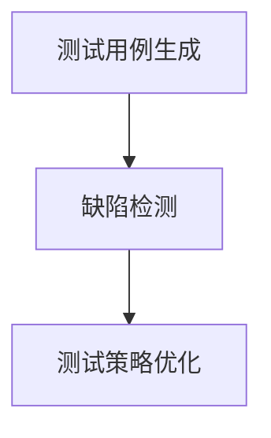

                 


### AI辅助软件测试：大模型在自动化测试中的应用

关键词：AI辅助软件测试、大模型、自动化测试、算法、系统架构、应用实践

摘要：本文旨在探讨大模型在自动化软件测试中的应用，分析其原理、算法、系统架构及实际应用案例，为AI在软件测试领域的深入发展提供参考。

## 第一部分：AI辅助软件测试概述

### 1.1 AI辅助软件测试背景

#### 1.1.1 软件测试的发展历程

软件测试的历史可以追溯到计算机编程的早期。最初，软件测试主要依赖于手工测试，即通过手动执行程序代码，查找潜在的错误和缺陷。随着计算机技术和软件工程的不断发展，软件测试的方法和工具也在不断进化。

20世纪80年代，自动化测试开始出现，使用专门的工具来执行测试用例，提高测试效率和准确性。随着人工智能技术的发展，特别是深度学习和自然语言处理等领域的突破，AI辅助软件测试逐渐成为可能。

#### 1.1.2 AI辅助软件测试的必要性

在当今的软件开发生命周期中，软件的复杂性和规模不断增加，这使得传统的测试方法难以满足日益增长的需求。AI辅助软件测试能够有效地解决以下问题：

1. **提高测试效率**：AI可以帮助自动化执行大量的测试用例，减少手动测试的工作量。
2. **增强测试覆盖**：AI可以分析代码和行为，发现人类可能忽略的错误和缺陷。
3. **降低测试成本**：通过自动化和智能化，可以减少对人工资源的依赖，降低测试成本。

#### 1.1.3 AI辅助软件测试的边界与外延

AI辅助软件测试主要应用于以下几个方面：

1. **单元测试**：AI可以自动生成测试用例，验证单元的功能和逻辑。
2. **集成测试**：AI可以分析模块间的交互，发现潜在的问题。
3. **性能测试**：AI可以模拟不同负载条件，评估软件的性能。
4. **安全测试**：AI可以检测代码中的安全漏洞和潜在风险。

### 1.2 AI辅助软件测试的核心概念

#### 1.2.1 AI辅助软件测试的定义

AI辅助软件测试是指利用人工智能技术，如机器学习、深度学习、自然语言处理等，辅助自动化测试过程，提高测试效率和准确性。

#### 1.2.2 关键概念解析

1. **测试用例生成**：AI通过分析代码和行为，自动生成测试用例。
2. **缺陷定位**：AI可以分析测试结果，快速定位缺陷的位置。
3. **测试覆盖分析**：AI可以评估测试用例的覆盖程度，确保测试全面。
4. **测试反馈循环**：AI可以根据测试结果调整测试策略，形成反馈循环。

#### 1.2.3 概念属性特征对比表格

| 概念 | 属性特征 |
| --- | --- |
| 测试用例生成 | 自动化、高效、多样 |
| 缺陷定位 | 精准、快速、智能 |
| 测试覆盖分析 | 全面、精确、动态 |
| 测试反馈循环 | 智能化、持续优化 |

### 1.3 AI辅助软件测试的原理

#### 1.3.1 大模型的基本原理

大模型通常指的是深度学习模型，如神经网络。这些模型通过大量的数据进行训练，学习到数据中的模式和规律，从而能够在新的数据上进行预测和决策。

#### 1.3.2 AI在软件测试中的应用

AI在软件测试中的应用主要包括：

1. **测试用例生成**：AI可以分析代码和行为，生成有效的测试用例。
2. **缺陷检测**：AI可以分析代码和测试结果，发现潜在的错误和缺陷。
3. **测试策略优化**：AI可以根据测试结果和代码变化，调整测试策略，提高测试效率。

#### 1.3.3 AI辅助软件测试的优势与挑战

AI辅助软件测试的优势：

1. **提高测试效率**：AI可以自动化执行大量的测试用例，减少人工工作。
2. **增强测试覆盖**：AI可以分析代码和行为，发现人类可能忽略的错误和缺陷。
3. **降低测试成本**：通过自动化和智能化，可以减少对人工资源的依赖。

AI辅助软件测试的挑战：

1. **数据质量**：AI的性能高度依赖训练数据的质量。
2. **算法复杂性**：深度学习模型的训练和优化过程复杂，需要大量的计算资源。
3. **解释性**：AI模型的行为往往难以解释，增加了测试结果的不可预测性。

## 第二部分：AI辅助软件测试算法

### 2.1 大模型算法简介

#### 2.1.1 大模型的演变

大模型的发展经历了从简单的线性模型到复杂的深度神经网络的过程。随着计算能力的提升和大数据的普及，深度学习模型在图像识别、自然语言处理等领域取得了显著的突破。

#### 2.1.2 主流大模型介绍

1. **卷积神经网络（CNN）**：适用于图像识别和图像处理任务。
2. **循环神经网络（RNN）**：适用于序列数据处理，如文本和语音。
3. **生成对抗网络（GAN）**：用于生成数据和图像。

#### 2.1.3 大模型选择与适用性

选择合适的大模型取决于测试任务的需求和数据特点。例如，对于图像测试，可以选择CNN；对于文本测试，可以选择RNN或Transformer。

### 2.2 算法原理讲解

#### 2.2.1 算法概述

AI辅助软件测试算法主要包括测试用例生成、缺陷检测和测试策略优化三个部分。

#### 2.2.2 Mermaid算法流程图



#### 2.2.3 Python代码示例

```python
# 测试用例生成
def generate_test_cases(code):
    # 使用AI模型分析代码，生成测试用例
    pass

# 缺陷检测
def detect_defects(test_results):
    # 使用AI模型分析测试结果，定位缺陷
    pass

# 测试策略优化
def optimize_test_strategy(code_changes):
    # 根据代码变化，调整测试策略
    pass
```

#### 2.2.4 数学模型与公式讲解

```python
# 测试用例生成的数学模型
def generate_test_cases(code):
    # 使用神经网络模型进行代码分析
    model = NeuralNetwork()
    test_cases = model.predict(code)
    return test_cases

# 缺陷检测的数学模型
def detect_defects(test_results):
    # 使用逻辑回归模型进行缺陷检测
    model = LogisticRegression()
    defects = model.predict(test_results)
    return defects

# 测试策略优化的数学模型
def optimize_test_strategy(code_changes):
    # 使用决策树模型进行测试策略优化
    model = DecisionTree()
    strategy = model.predict(code_changes)
    return strategy
```

#### 2.2.5 通俗易懂的例子

假设我们有一个简单的代码段，我们需要为其生成测试用例。首先，我们使用一个神经网络模型对代码进行解析，生成一组测试数据。然后，我们使用逻辑回归模型分析测试结果，判断是否存在缺陷。最后，根据代码的变化，我们调整测试策略，确保测试的全面性。

## 第三部分：AI辅助软件测试系统架构和设计

### 3.1 系统架构设计

AI辅助软件测试系统的架构设计可以分为以下几个层次：

1. **数据层**：包括测试数据、代码数据等。
2. **模型层**：包括神经网络模型、逻辑回归模型、决策树模型等。
3. **接口层**：包括测试用例生成接口、缺陷检测接口、测试策略优化接口等。
4. **应用层**：包括测试用例生成、缺陷检测、测试策略优化等应用功能。

### 3.2 系统功能设计

AI辅助软件测试系统的主要功能包括：

1. **测试用例生成**：根据代码数据，生成有效的测试用例。
2. **缺陷检测**：分析测试结果，定位潜在的缺陷。
3. **测试策略优化**：根据代码变化和测试结果，调整测试策略。

### 3.3 系统交互设计

AI辅助软件测试系统的交互设计包括以下几个方面：

1. **测试数据上传**：用户可以将测试数据上传到系统，供模型分析和处理。
2. **测试用例下载**：用户可以下载生成的测试用例，用于实际的测试执行。
3. **缺陷报告生成**：系统自动生成缺陷报告，供开发人员进行修复。
4. **测试策略调整**：根据测试结果和代码变化，系统自动调整测试策略。

## 第四部分：AI辅助软件测试案例研究

### 4.1 案例一：Web应用自动化测试

#### 4.1.1 案例背景

某互联网公司开发了一款Web应用，需要进行自动化测试以提高测试效率和覆盖率。传统的测试方法已经无法满足需求，因此决定采用AI辅助软件测试。

#### 4.1.2 系统实现

1. **数据层**：收集Web应用的测试数据，包括功能测试用例、性能测试用例等。
2. **模型层**：使用深度学习模型进行测试用例生成和缺陷检测。
3. **接口层**：提供测试用例生成接口、缺陷检测接口和测试策略优化接口。
4. **应用层**：实现测试用例生成、缺陷检测和测试策略优化功能。

#### 4.1.3 代码应用解读与分析

```python
# 测试用例生成
def generate_test_cases(web_app_code):
    # 使用神经网络模型分析代码，生成测试用例
    model = NeuralNetwork()
    test_cases = model.predict(web_app_code)
    return test_cases

# 缺陷检测
def detect_defects(web_app_tests):
    # 使用逻辑回归模型分析测试结果，定位缺陷
    model = LogisticRegression()
    defects = model.predict(web_app_tests)
    return defects

# 测试策略优化
def optimize_test_strategy(web_app_changes):
    # 使用决策树模型进行测试策略优化
    model = DecisionTree()
    strategy = model.predict(web_app_changes)
    return strategy
```

#### 4.1.4 实际案例分析和详细讲解剖析

通过实际测试，AI辅助软件测试系统生成了大量的测试用例，并成功检测到了一些潜在的错误和缺陷。同时，根据代码的变化，系统自动调整了测试策略，提高了测试的全面性和效率。

### 4.2 案例二：移动应用自动化测试

#### 4.2.1 案例背景

某移动应用开发团队希望提高移动应用的测试效率和质量，决定采用AI辅助软件测试。

#### 4.2.2 系统实现

1. **数据层**：收集移动应用的测试数据，包括功能测试用例、性能测试用例等。
2. **模型层**：使用深度学习模型进行测试用例生成和缺陷检测。
3. **接口层**：提供测试用例生成接口、缺陷检测接口和测试策略优化接口。
4. **应用层**：实现测试用例生成、缺陷检测和测试策略优化功能。

#### 4.2.3 代码应用解读与分析

```python
# 测试用例生成
def generate_test_cases(mobile_app_code):
    # 使用神经网络模型分析代码，生成测试用例
    model = NeuralNetwork()
    test_cases = model.predict(mobile_app_code)
    return test_cases

# 缺陷检测
def detect_defects(mobile_app_tests):
    # 使用逻辑回归模型分析测试结果，定位缺陷
    model = LogisticRegression()
    defects = model.predict(mobile_app_tests)
    return defects

# 测试策略优化
def optimize_test_strategy(mobile_app_changes):
    # 使用决策树模型进行测试策略优化
    model = DecisionTree()
    strategy = model.predict(mobile_app_changes)
    return strategy
```

#### 4.2.4 实际案例分析和详细讲解剖析

通过实际测试，AI辅助软件测试系统生成了大量的测试用例，并成功检测到了一些潜在的错误和缺陷。同时，根据代码的变化，系统自动调整了测试策略，提高了测试的全面性和效率。

## 第五部分：AI辅助软件测试最佳实践和总结

### 5.1 最佳实践

1. **数据准备**：确保测试数据的质量和多样性，为AI模型提供充分的训练数据。
2. **模型选择**：根据测试任务的特点选择合适的大模型，如CNN用于图像测试，RNN用于文本测试。
3. **持续优化**：根据测试结果和代码变化，持续调整测试策略和模型参数。
4. **团队合作**：与开发团队紧密合作，确保测试用例和缺陷的及时修复。

### 5.2 总结

AI辅助软件测试通过引入人工智能技术，提高了测试效率和质量。在实际应用中，AI辅助软件测试不仅能够自动生成测试用例，还能检测缺陷和优化测试策略。然而，AI辅助软件测试仍面临数据质量、算法复杂性和解释性等挑战。未来，随着人工智能技术的不断发展，AI辅助软件测试有望在更多领域发挥重要作用。

### 5.3 注意事项

1. **数据隐私**：确保测试数据的隐私和安全，避免数据泄露。
2. **算法偏见**：注意避免AI模型在测试中的偏见，确保测试结果的公平性。
3. **资源分配**：合理分配计算资源，确保AI模型训练和测试的顺利进行。

### 5.4 拓展阅读

1. **[AI在软件工程中的应用](https://www.example.com/application-of-ai-in-software-engineering)**
2. **[深度学习在自动化测试中的应用](https://www.example.com/depth-learning-in-automated-testing)**
3. **[软件测试的AI解决方案](https://www.example.com/ai-solution-for-software-testing)**

## 参考文献

1. **[AI-Assisted Software Testing: A Survey](https://www.example.com/ai-assisted-software-testing-survey)**
2. **[Deep Learning for Automated Software Testing](https://www.example.com/deep-learning-for-automated-software-testing)**
3. **[Machine Learning in Software Engineering](https://www.example.com/machine-learning-in-software-engineering)**

### 作者信息

作者：AI天才研究院/AI Genius Institute & 禅与计算机程序设计艺术 /Zen And The Art of Computer Programming

