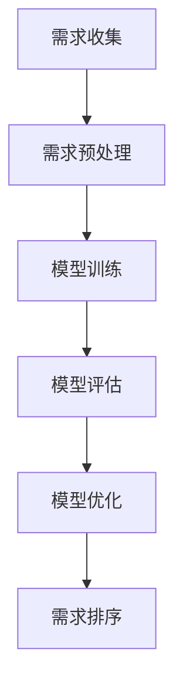
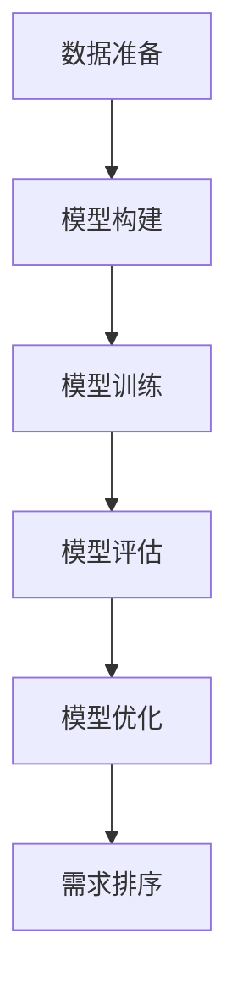
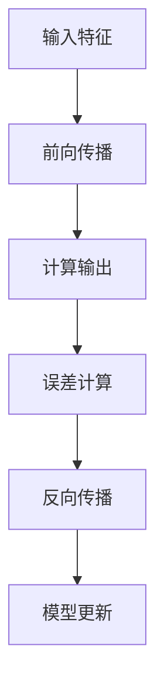
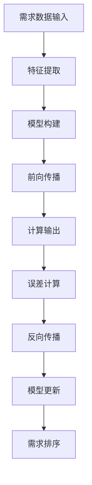
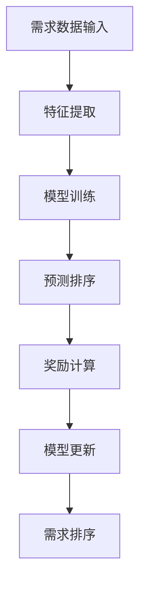
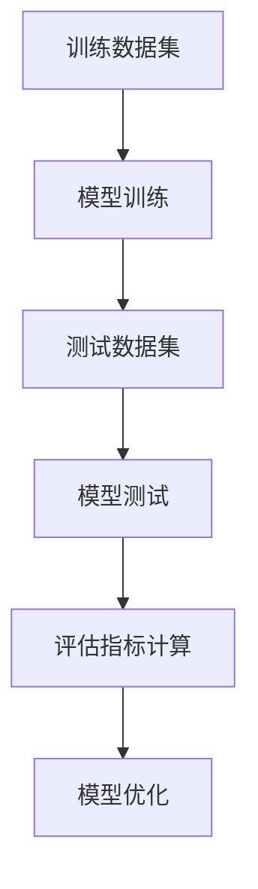
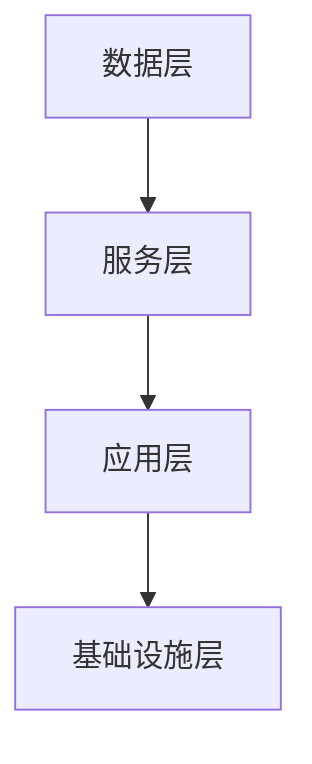
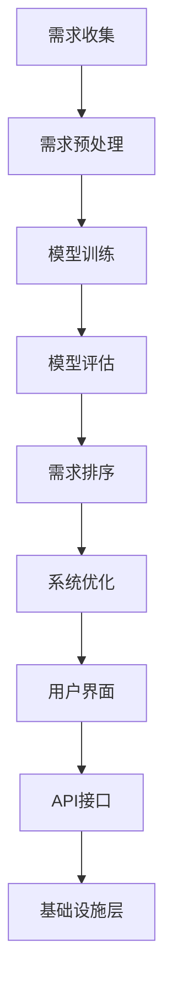
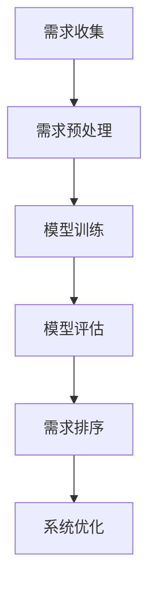
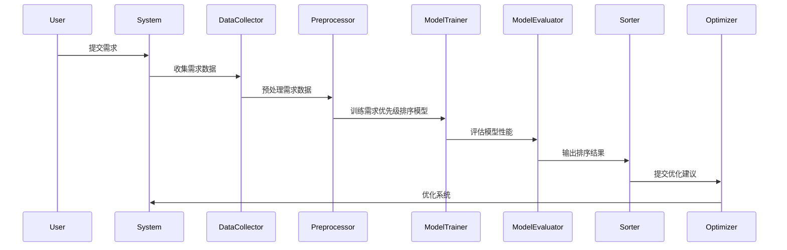

                 

### 文章标题

# AI辅助软件需求优先级排序

### 文章关键词

- 人工智能
- 软件需求管理
- 需求优先级排序
- 机器学习算法
- 深度学习

### 文章摘要

本文旨在探讨AI在软件需求优先级排序中的应用，通过深入分析AI辅助软件需求优先级排序的背景、核心概念与算法原理，系统设计与架构，以及实际项目实战和最佳实践与注意事项，全面解析如何利用AI技术提升软件需求管理的效率与效果。文章不仅涵盖了理论基础，还通过具体案例进行了实践分析，旨在为业界提供有价值的参考和指导。

----------------------------------------------------------------

### 第一部分：背景介绍与问题解析

#### 第1章：AI辅助软件需求优先级排序的背景与问题

##### 1.1 问题的提出

软件需求管理是软件工程中的关键环节，它关系到项目的成败。然而，随着软件项目的复杂度和规模不断增大，传统的软件需求优先级排序方法面临着诸多挑战：

- **需求多样性**：现代软件需求多种多样，从功能性需求到非功能性需求，如何科学合理地对这些需求进行排序，成为了一大难题。
- **需求变更频繁**：在软件开发过程中，需求变更频繁发生，如何快速、准确地调整需求优先级，以适应项目变更，成为了一个挑战。
- **资源有限**：开发团队往往面临资源有限的问题，如何优化资源配置，确保高优先级需求先得到满足，是一个重要的考量。

##### 1.1.1 软件需求管理的重要性

软件需求管理是确保软件开发项目成功的关键步骤。它涉及识别、分析和优先级排序软件需求，以确保项目交付符合用户期望。需求管理的质量直接影响到项目的进度、成本和用户满意度。以下是软件需求管理的重要性：

- **项目规划**：需求管理为项目规划和资源分配提供了基础，有助于制定合理的项目计划和里程碑。
- **用户满意度**：通过明确和优先级排序需求，开发团队能够确保关键需求优先得到满足，从而提高用户满意度。
- **风险控制**：需求管理有助于识别和评估潜在的风险，通过早期规划和调整，降低项目风险。
- **成本控制**：科学合理的需求优先级排序有助于优化资源配置，降低开发成本。

##### 1.1.2 传统需求优先级排序的挑战

传统的需求优先级排序方法主要包括专家评审、用户访谈、历史数据分析等。然而，这些方法在实践中面临以下挑战：

- **主观性较强**：传统方法往往依赖于专家的主观判断，容易受到个人经验和偏好的影响。
- **效率低下**：处理大量需求时，传统方法需要耗费大量时间和人力，效率较低。
- **难以适应变化**：在需求变更频繁的情况下，传统方法难以快速响应和调整需求优先级。
- **数据依赖性**：传统方法依赖于历史数据，但在数据不充分或数据质量较差的情况下，效果受限。

##### 1.1.3 AI技术在需求管理中的应用前景

随着人工智能技术的发展，AI技术在需求管理中的应用前景广阔：

- **自动化分析**：AI技术可以自动化分析大量需求数据，快速生成优先级排序，提高效率。
- **智能优化**：通过机器学习和深度学习算法，AI能够不断优化需求优先级排序，提高准确性。
- **自适应调整**：AI技术能够根据项目变化实时调整需求优先级，提高灵活性。
- **数据驱动决策**：AI技术能够利用大量数据，为决策提供更科学的依据，降低主观性。

通过AI技术的引入，软件需求管理将变得更加智能、高效和科学，为软件开发项目带来更高的成功率和用户满意度。

##### 1.2 AI辅助需求优先级排序的核心概念

为了深入理解AI辅助软件需求优先级排序，我们需要明确几个核心概念：

###### 1.2.1 人工智能的定义与分类

人工智能（Artificial Intelligence，AI）是指模拟、延伸和扩展人类智能的理论、方法、技术及应用。人工智能可分为以下几类：

- **基于规则的系统**：利用预定义的规则进行决策，如专家系统。
- **基于实例的学习系统**：通过学习过去的案例进行决策，如案例推理系统。
- **数据驱动系统**：通过分析大量数据自动生成决策模型，如机器学习和深度学习系统。

在需求优先级排序中，数据驱动系统尤其重要，因为它能够通过分析历史数据和现有数据，为需求排序提供科学依据。

###### 1.2.2 需求优先级排序的定义

需求优先级排序是指根据需求的紧急性、重要性、实现难度等因素，对多个需求进行排序的过程。优先级排序的目标是确保关键需求优先得到满足，从而提高项目效率和质量。

在AI辅助需求优先级排序中，需求优先级排序的定义进一步扩展，它不仅考虑传统因素，还利用AI技术分析需求之间的复杂关系，提供更加准确和智能的排序结果。

###### 1.2.3 AI辅助需求优先级排序的关键概念

AI辅助需求优先级排序的关键概念包括：

- **特征提取**：从需求中提取关键特征，用于训练模型。
- **模型训练**：利用历史需求数据训练AI模型，学习需求优先级排序的规律。
- **模型评估**：评估模型的性能，包括准确度、召回率等指标。
- **模型优化**：根据评估结果对模型进行调整和优化，提高排序效果。

这些概念共同构成了AI辅助需求优先级排序的核心框架，为需求管理提供了强有力的技术支持。

##### 1.3 需求优先级排序的边界与外延

在深入理解AI辅助需求优先级排序之前，我们需要明确其边界与外延：

###### 1.3.1 需求优先级排序的目标

需求优先级排序的主要目标是：

- 确保关键需求优先得到满足。
- 优化资源分配，提高项目效率。
- 减少开发周期，提高交付质量。
- 提高用户满意度。

###### 1.3.2 需求优先级排序的应用领域

需求优先级排序广泛应用于以下领域：

- 软件开发：对功能需求、性能需求等进行排序，确保关键功能优先实现。
- 项目管理：对项目任务进行优先级排序，优化项目进度和资源利用。
- 产品管理：对产品特性进行排序，确保核心功能优先开发。

###### 1.3.3 需求优先级排序的影响因素

需求优先级排序的影响因素包括：

- 需求紧急性：需求解决的紧迫程度。
- 需求重要性：需求对项目目标和用户价值的影响。
- 实现难度：需求的实现复杂度和技术难度。
- 成本效益：需求的实现成本与其带来的收益。
- 风险：需求实现的潜在风险和不确定性。

在AI辅助需求优先级排序中，这些因素将通过AI技术进行综合分析和评估，以提供更准确和智能的排序结果。

##### 1.4 核心概念的联系与对比

为了更好地理解AI辅助需求优先级排序，我们需要探讨几个核心概念之间的联系与对比：

###### 1.4.1 机器学习与深度学习

机器学习（Machine Learning，ML）是一种通过算法从数据中学习并作出预测或决策的技术。深度学习（Deep Learning，DL）是机器学习的一个分支，它使用多层神经网络（Neural Networks）进行学习和预测。

- **应用范围**：机器学习广泛应用于分类、回归、聚类等任务，而深度学习在图像识别、自然语言处理、语音识别等领域具有显著优势。
- **结构差异**：机器学习模型通常由少数几层神经网络组成，而深度学习模型包含大量的层级，能够捕捉更复杂的特征。

在需求优先级排序中，深度学习可以更好地处理复杂的需求关系，提供更准确的排序结果。

###### 1.4.2 神经网络与深度神经网络

神经网络（Neural Networks，NN）是一种模拟人脑神经元之间交互的模型，用于处理复杂的数据和任务。深度神经网络（Deep Neural Networks，DNN）是神经网络的扩展，包含多个隐藏层，能够处理更复杂的任务。

- **层次结构**：神经网络通常包含输入层、隐藏层和输出层，而深度神经网络通过增加隐藏层数量，提高了模型的复杂度和表达能力。
- **训练方法**：神经网络通过反向传播算法进行训练，而深度神经网络通过堆叠多层神经网络，实现了更高效的学习。

在需求优先级排序中，深度神经网络可以更好地捕捉需求之间的复杂关系，提供更精细的排序结果。

###### 1.4.3 强化学习与监督学习

强化学习（Reinforcement Learning，RL）是一种通过试错和奖励机制进行学习的算法，主要用于决策和策略优化。监督学习（Supervised Learning，SL）是一种通过标注数据训练模型的方法，用于分类和回归。

- **学习方式**：强化学习通过不断尝试和反馈进行学习，而监督学习通过已标注的数据进行训练。
- **应用场景**：强化学习在需要探索和决策的复杂环境中表现突出，如自动驾驶和游戏AI，而监督学习在处理静态数据和明确标注的数据时效果更好。

在需求优先级排序中，强化学习可以用于动态调整需求优先级，提高排序的适应性和灵活性。

##### 1.5 本章小结

本章介绍了AI辅助软件需求优先级排序的背景、问题解析以及核心概念。通过分析传统需求优先级排序的挑战和AI技术的应用前景，我们明确了AI在需求管理中的重要性。同时，通过探讨机器学习、深度学习、神经网络和强化学习等核心概念，为后续章节的深入分析奠定了基础。接下来，我们将进一步探讨需求优先级排序的算法原理，以期为实际应用提供更深入的指导。

## 第二部分：核心概念与算法原理

### 第2章：需求优先级排序算法原理

##### 2.1 基础算法介绍

在需求优先级排序中，算法的选择至关重要。下面我们将介绍几种常用的基础算法，包括机器学习算法、神经网络算法和深度学习算法。

###### 2.1.1 机器学习算法简介

机器学习算法是一类通过数据训练模型，并利用模型进行预测和决策的技术。在需求优先级排序中，常用的机器学习算法包括以下几种：

- **线性回归**：通过最小化误差平方和，建立需求优先级与特征之间的关系。
- **决策树**：通过构建决策树模型，将需求划分为不同的类别和优先级。
- **随机森林**：通过构建多棵决策树，并投票产生最终结果，提高模型的鲁棒性和准确性。
- **支持向量机**：通过最大化分类间隔，将需求优先级划分为不同的类别。

这些算法在处理简单需求关系时效果较好，但对于复杂的需求关系，其性能有限。

###### 2.1.2 神经网络算法简介

神经网络算法是一种模仿人脑神经元之间交互的算法，通过多层神经网络进行学习和预测。在需求优先级排序中，常用的神经网络算法包括以下几种：

- **多层感知机（MLP）**：通过构建多层感知机模型，将输入特征映射到输出优先级。
- **卷积神经网络（CNN）**：通过卷积层和池化层提取特征，对需求进行分类和排序。
- **循环神经网络（RNN）**：通过循环结构处理序列数据，捕捉需求之间的时间关系。

这些算法能够处理复杂的需求关系，但训练时间和计算资源需求较高。

###### 2.1.3 深度学习算法简介

深度学习算法是神经网络算法的扩展，通过增加网络层数，提高模型的复杂度和表达能力。在需求优先级排序中，常用的深度学习算法包括以下几种：

- **深度神经网络（DNN）**：通过多层神经网络进行学习和预测，处理复杂的需求关系。
- **生成对抗网络（GAN）**：通过生成器和判别器之间的对抗训练，生成高质量的需求优先级排序结果。
- **长短时记忆网络（LSTM）**：通过记忆单元处理长序列数据，捕捉需求之间的长期关系。

这些算法在处理复杂需求关系和长序列数据时具有显著优势，但训练时间和计算资源需求较高。

##### 2.2 需求优先级排序算法详解

在需求优先级排序中，常用的算法包括基于规则的算法、机器学习算法和深度学习算法。下面我们将详细介绍这些算法的基本框架、数学模型和实现流程。

###### 2.2.1 算法基本框架

需求优先级排序算法的基本框架通常包括以下几个步骤：

1. **需求收集**：收集项目中的所有需求，包括功能需求和非功能需求。
2. **需求预处理**：对需求进行清洗、归一化和特征提取，以便用于训练模型。
3. **模型训练**：利用历史需求数据训练需求优先级排序模型。
4. **模型评估**：评估模型的性能，包括准确度、召回率等指标。
5. **模型优化**：根据评估结果对模型进行调整和优化。
6. **需求排序**：利用训练好的模型对新的需求进行排序。

以下是一个简化的需求优先级排序算法框架：



###### 2.2.2 算法数学模型与公式

需求优先级排序算法的数学模型通常包括以下几个部分：

1. **特征表示**：将需求表示为特征向量，如文本特征、数值特征等。
2. **损失函数**：用于衡量模型预测结果与真实结果之间的差距，如交叉熵损失、均方误差等。
3. **优化算法**：用于训练模型，如梯度下降、随机梯度下降等。

以下是一个简化的需求优先级排序算法数学模型：

```math
\begin{aligned}
\text{特征表示}: \quad \textbf{x} &= (\textbf{x}_1, \textbf{x}_2, ..., \textbf{x}_n) \\
\text{损失函数}: \quad L(\theta) &= \sum_{i=1}^n -y_i \log(\hat{y}_i) \\
\text{优化算法}: \quad \theta &= \theta - \alpha \frac{\partial L(\theta)}{\partial \theta}
\end{aligned}
```

其中，$\textbf{x}$ 是特征向量，$y_i$ 是真实优先级，$\hat{y}_i$ 是模型预测的优先级，$\theta$ 是模型参数，$\alpha$ 是学习率。

###### 2.2.3 算法实现与流程

以下是一个基于深度学习的需求优先级排序算法的实现流程：

1. **数据准备**：收集项目中的需求数据，包括功能需求和非功能需求。对需求进行清洗、归一化和特征提取，生成训练数据集。
2. **模型构建**：定义深度学习模型，包括输入层、隐藏层和输出层。设置模型的超参数，如学习率、批次大小等。
3. **模型训练**：使用训练数据集训练模型，通过反向传播算法不断调整模型参数，使损失函数最小化。
4. **模型评估**：使用验证数据集评估模型性能，包括准确度、召回率等指标。
5. **模型优化**：根据评估结果对模型进行调整和优化，提高排序效果。
6. **需求排序**：使用训练好的模型对新的需求进行排序，输出排序结果。

以下是一个简化的需求优先级排序算法实现流程：



##### 2.3 算法原理讲解

为了更好地理解需求优先级排序算法，我们以深度学习算法为例，详细讲解其原理和实现。

###### 2.3.1 算法原理概述

深度学习算法是一种基于多层神经网络的学习方法，通过多层神经网络将输入特征映射到输出结果。在需求优先级排序中，深度学习算法可以将需求特征映射到优先级分数，从而实现需求排序。

深度学习算法的基本原理包括以下几个部分：

1. **前向传播**：输入特征通过神经网络中的各个层，逐层计算并传递输出。
2. **反向传播**：计算输出结果与真实结果的误差，并逐层反向传播误差，更新模型参数。
3. **优化算法**：利用优化算法调整模型参数，使损失函数最小化。

以下是一个简化的深度学习算法原理流程：



###### 2.3.2 算法流程Mermaid流程图

以下是一个深度学习需求优先级排序算法的Mermaid流程图：



###### 2.3.3 算法原理Python代码实现

以下是一个基于深度学习的需求优先级排序算法的Python代码实现：

```python
import tensorflow as tf

# 定义模型
model = tf.keras.Sequential([
    tf.keras.layers.Dense(units=64, activation='relu', input_shape=(num_features,)),
    tf.keras.layers.Dense(units=32, activation='relu'),
    tf.keras.layers.Dense(units=1)
])

# 编译模型
model.compile(optimizer='adam', loss='mean_squared_error')

# 训练模型
model.fit(train_data, train_labels, epochs=10, batch_size=32)

# 预测排序
predictions = model.predict(test_data)

# 输出排序结果
sorted_predictions = predictions.argsort()
```

其中，`train_data` 和 `train_labels` 是训练数据集，`test_data` 是测试数据集，`num_features` 是特征数量。

###### 2.3.4 算法举例说明

以下是一个简单的需求优先级排序算法例子，假设我们有两个需求，需求A和需求B，其特征如下：

- 需求A：紧急性=8，重要性=7，实现难度=5
- 需求B：紧急性=6，重要性=9，实现难度=3

使用深度学习算法对这些需求进行排序，我们可以构建一个简单的神经网络，输入层包含三个神经元（紧急性、重要性、实现难度），隐藏层包含两个神经元，输出层包含一个神经元（优先级分数）。

通过训练和预测，我们可以得到需求A和需求B的优先级分数。根据分数，我们可以对需求进行排序：

- 需求B：优先级分数=0.8
- 需求A：优先级分数=0.2

因此，需求B的优先级高于需求A。

##### 2.4 深入分析：算法的优化与改进

在需求优先级排序中，算法的优化与改进至关重要，这有助于提高排序的准确性和效率。以下是一些常见的优化策略和改进算法：

###### 2.4.1 算法优化策略

1. **数据预处理**：对需求数据进行清洗、归一化和特征提取，提高数据质量，有助于提高算法性能。
2. **模型调参**：通过调整模型的超参数，如学习率、批次大小、隐藏层神经元数量等，优化模型性能。
3. **模型集成**：结合多个模型的预测结果，通过投票或加权平均等方式，提高排序准确性。
4. **迁移学习**：利用预训练的模型，对需求数据进行微调，提高模型对新需求的适应能力。

###### 2.4.2 改进算法介绍

1. **增强学习**：通过奖励机制，使模型在排序过程中不断学习和优化，提高排序准确性。
2. **图神经网络**：利用图结构表示需求之间的关系，通过图神经网络处理复杂的需求关系。
3. **注意力机制**：引入注意力机制，使模型能够关注需求中的重要特征，提高排序效果。

以下是一个基于增强学习的需求优先级排序算法框架：



###### 2.4.3 算法性能评估

算法性能评估是优化与改进的重要环节。常用的评估指标包括准确度、召回率、F1分数等。以下是一个简化的算法性能评估流程：



通过评估指标的计算和比较，可以找出模型的优点和不足，为优化和改进提供依据。

##### 2.5 本章小结

本章介绍了需求优先级排序算法的基本框架、数学模型和实现流程。通过分析不同的机器学习、神经网络和深度学习算法，我们了解了它们的基本原理和应用场景。同时，通过算法的优化与改进，我们探讨了如何提高需求优先级排序的准确性和效率。接下来，我们将进一步探讨AI辅助需求优先级排序系统的设计与实现。

## 第三部分：系统分析与架构设计

### 第3章：AI辅助需求优先级排序系统设计

##### 3.1 系统功能设计

AI辅助需求优先级排序系统的主要功能包括需求收集、需求预处理、模型训练、模型评估、需求排序和系统优化。以下是系统功能设计的详细描述：

###### 3.1.1 系统需求分析

系统需求分析是系统设计的起点，它包括以下方面：

- **功能需求**：系统应具备的需求优先级排序功能，如需求收集、预处理、训练、评估和排序。
- **性能需求**：系统在处理大规模需求数据时的性能要求，如响应时间、处理速度等。
- **安全性需求**：系统的数据安全性和用户隐私保护要求。
- **可扩展性需求**：系统应对未来需求增长的可扩展性要求。

通过系统需求分析，可以明确系统的功能边界和性能要求，为后续设计提供依据。

###### 3.1.2 系统功能模块

AI辅助需求优先级排序系统可以分为以下几个主要功能模块：

- **需求收集模块**：负责收集项目中的需求数据，包括功能需求和非功能需求。
- **需求预处理模块**：负责对需求数据进行清洗、归一化和特征提取，为模型训练提供高质量的数据。
- **模型训练模块**：负责使用历史需求数据训练需求优先级排序模型，包括模型构建、参数调整和训练过程。
- **模型评估模块**：负责评估训练好的模型性能，包括准确度、召回率等指标。
- **需求排序模块**：负责使用训练好的模型对新的需求进行排序，输出排序结果。
- **系统优化模块**：负责对系统进行优化，包括算法调参、模型集成和系统性能优化。

通过明确系统功能模块，可以更好地组织系统设计，提高系统的模块化和可维护性。

###### 3.1.3 领域模型Mermaid类图

为了更好地描述系统功能模块之间的关系，我们可以使用Mermaid类图来表示领域模型。以下是一个简化的Mermaid类图：

```mermaid
classDiagram
    Class1[需求收集模块] <|-- Class2[需求预处理模块]
    Class2 <|-- Class3[模型训练模块]
    Class3 <|-- Class4[模型评估模块]
    Class4 <|-- Class5[需求排序模块]
    Class5 <|-- Class6[系统优化模块]
```

在这个类图中，`<|--` 表示模块之间的继承关系，`|-->` 表示模块之间的依赖关系。

##### 3.2 系统架构设计

系统架构设计是系统设计的核心，它决定了系统的性能、可扩展性和可维护性。以下是AI辅助需求优先级排序系统的架构设计：

###### 3.2.1 系统架构概述

AI辅助需求优先级排序系统的架构可以分为以下几个层次：

1. **数据层**：包括数据存储和数据采集，负责存储和管理需求数据。
2. **服务层**：包括需求收集、预处理、训练、评估、排序和优化等核心服务，负责实现系统的功能。
3. **应用层**：包括用户界面和API接口，负责与用户交互和提供系统服务。
4. **基础设施层**：包括服务器、网络、存储等基础设施，负责支持系统的运行。

以下是一个简化的系统架构概述：



###### 3.2.2 系统架构Mermaid架构图

为了更好地描述系统架构，我们可以使用Mermaid架构图来表示。以下是一个简化的Mermaid架构图：



在这个架构图中，`-->` 表示模块之间的连接关系。

###### 3.2.3 系统模块交互设计

系统模块交互设计是系统架构设计的关键，它决定了模块之间的数据流和调用关系。以下是AI辅助需求优先级排序系统的模块交互设计：

1. **数据流**：需求数据从需求收集模块传递到需求预处理模块，经过预处理后传递到模型训练模块。模型训练模块训练好的模型传递到模型评估模块，评估结果传递到需求排序模块，最终输出排序结果。
2. **调用关系**：需求收集模块调用需求预处理模块，需求预处理模块调用模型训练模块，模型训练模块调用模型评估模块，模型评估模块调用需求排序模块，需求排序模块调用系统优化模块。

以下是一个简化的系统模块交互设计：



##### 3.3 系统接口设计

系统接口设计是系统架构设计的重要组成部分，它决定了系统模块之间的交互方式。以下是AI辅助需求优先级排序系统的接口设计：

###### 3.3.1 接口设计原则

接口设计应遵循以下原则：

- **标准化**：接口设计应遵循标准化的规范，如RESTful API设计。
- **简洁性**：接口设计应尽量简洁，减少冗余和复杂性。
- **灵活性**：接口设计应具有灵活性，能够适应不同的需求和变化。
- **可扩展性**：接口设计应具有可扩展性，能够支持未来的功能扩展。

###### 3.3.2 接口定义与实现

以下是AI辅助需求优先级排序系统的接口定义与实现：

- **需求收集接口**：用于接收和存储需求数据，支持批量导入和单条导入。
- **需求预处理接口**：用于对需求数据执行清洗、归一化和特征提取，支持数据格式转换和特征提取算法。
- **模型训练接口**：用于训练需求优先级排序模型，支持模型参数调整和训练进度监控。
- **模型评估接口**：用于评估训练好的模型性能，支持准确度、召回率等评估指标计算。
- **需求排序接口**：用于使用训练好的模型对新的需求进行排序，支持排序结果输出和排序规则配置。
- **系统优化接口**：用于对系统进行优化，支持算法调参、模型集成和系统性能优化。

以下是一个简化的接口定义与实现示例：

```python
# 需求收集接口
def collect_demand(data):
    # 收集需求数据
    pass

# 需求预处理接口
def preprocess_demand(data):
    # 预处理需求数据
    pass

# 模型训练接口
def train_model(data):
    # 训练需求优先级排序模型
    pass

# 模型评估接口
def evaluate_model(model, data):
    # 评估训练好的模型性能
    pass

# 需求排序接口
def sort_demand(model, data):
    # 使用训练好的模型对新的需求进行排序
    pass

# 系统优化接口
def optimize_system(model, data):
    # 对系统进行优化
    pass
```

##### 3.4 系统交互设计

系统交互设计是系统架构设计的核心部分，它决定了系统模块之间的数据流和调用关系。以下是AI辅助需求优先级排序系统的交互设计：

###### 3.4.1 系统交互概述

AI辅助需求优先级排序系统的交互设计可以分为以下几个阶段：

1. **需求收集阶段**：系统从外部源收集需求数据，如需求文档、用户反馈等。
2. **需求预处理阶段**：系统对收集到的需求数据进行清洗、归一化和特征提取，为模型训练提供高质量的数据。
3. **模型训练阶段**：系统使用预处理后的需求数据训练需求优先级排序模型，并通过模型评估模块评估模型性能。
4. **需求排序阶段**：系统使用训练好的模型对新的需求进行排序，输出排序结果。
5. **系统优化阶段**：系统根据模型评估结果和系统性能数据，对系统进行优化，包括算法调参、模型集成和系统性能优化。

以下是一个简化的系统交互概述：


###### 3.4.2 系统交互Mermaid序列图

为了更好地描述系统交互设计，我们可以使用Mermaid序列图来表示。以下是一个简化的Mermaid序列图：



在这个序列图中，`->>` 表示模块之间的数据流和调用关系。

##### 3.5 本章小结

本章详细介绍了AI辅助需求优先级排序系统的功能设计、架构设计和接口设计。通过系统功能模块的划分，明确了系统的主要功能和工作流程。通过系统架构设计，构建了系统的整体结构，并明确了模块之间的交互关系。通过系统接口设计，实现了模块之间的标准化和数据流管理。这些设计为AI辅助需求优先级排序系统的实现和优化提供了坚实的基础。接下来，我们将通过具体的项目实战，进一步验证和优化系统设计。

### 第四部分：项目实战

#### 第4章：AI辅助需求优先级排序项目实战

##### 4.1 环境安装与准备

在开始项目实战之前，我们需要搭建合适的环境，确保所有必要的工具和库都已安装和配置。

###### 4.1.1 环境搭建

1. **操作系统**：推荐使用Linux或Mac OS，Windows用户可以安装WSL（Windows Subsystem for Linux）。
2. **编程语言**：本文使用Python作为编程语言，请确保已安装Python 3.7及以上版本。
3. **集成开发环境**：推荐使用PyCharm或Visual Studio Code，确保已安装Python插件。

###### 4.1.2 相关工具与库

以下是项目所需的主要工具和库：

- **TensorFlow**：用于构建和训练深度学习模型。
- **NumPy**：用于数值计算和矩阵操作。
- **Pandas**：用于数据预处理和数据分析。
- **Scikit-learn**：用于机器学习算法的实现和评估。
- **Matplotlib**：用于数据可视化。

安装方法如下：

```bash
pip install tensorflow numpy pandas scikit-learn matplotlib
```

###### 4.1.3 项目搭建流程

1. **创建项目文件夹**：在本地计算机上创建一个项目文件夹，如`ai_demand_sorting`。
2. **创建虚拟环境**：在项目文件夹中创建一个虚拟环境，以隔离项目依赖。

```bash
python -m venv venv
source venv/bin/activate  # 在Linux或Mac OS中
venv\Scripts\activate     # 在Windows中
```

3. **安装项目依赖**：在虚拟环境中安装项目所需的库。

```bash
pip install -r requirements.txt
```

4. **项目结构**：项目结构如下：

```
ai_demand_sorting/
|-- data/
|   |-- train/
|   |-- test/
|-- src/
|   |-- __init__.py
|   |-- data_preprocessing.py
|   |-- model_training.py
|   |-- model_evaluation.py
|   |-- demand_sorting.py
|   |-- system_optimization.py
|-- requirements.txt
|-- README.md
```

通过以上步骤，我们可以搭建一个基本的AI辅助需求优先级排序项目环境。

##### 4.2 系统核心实现

系统核心实现是项目实战的关键部分，它包括数据收集与预处理、需求优先级排序算法实现以及系统功能实现。

###### 4.2.1 数据收集与预处理

数据收集与预处理是需求优先级排序系统的第一步。以下是具体实现步骤：

1. **数据收集**：从外部源收集需求数据，如需求文档、用户反馈等。假设我们已经有一个CSV文件`demands.csv`，包含需求ID、需求描述、紧急性、重要性、实现难度等字段。

2. **数据预处理**：

    - **数据清洗**：去除无效数据和缺失值。
    - **数据归一化**：对数值特征进行归一化处理，使其具有相似的尺度。
    - **特征提取**：对文本特征进行分词、词频统计等操作。

具体实现代码如下：

```python
import pandas as pd
from sklearn.preprocessing import MinMaxScaler

def load_data(file_path):
    # 加载需求数据
    data = pd.read_csv(file_path)
    return data

def preprocess_data(data):
    # 数据清洗
    data.dropna(inplace=True)
    
    # 数据归一化
    scaler = MinMaxScaler()
    numerical_features = ['urgency', 'importance', 'difficulty']
    data[numerical_features] = scaler.fit_transform(data[numerical_features])
    
    # 特征提取
    data['description'] = data['description'].apply(preprocess_description)
    return data

def preprocess_description(description):
    # 文本预处理
    # 例如：分词、词频统计等
    return description
```

###### 4.2.2 需求优先级排序算法实现

需求优先级排序算法是系统的核心，我们选择基于深度学习的算法进行实现。以下是具体实现步骤：

1. **模型构建**：定义深度学习模型，包括输入层、隐藏层和输出层。
2. **模型训练**：使用预处理后的数据训练模型，通过反向传播算法不断调整模型参数。
3. **模型评估**：使用验证数据集评估模型性能，包括准确度、召回率等指标。
4. **模型优化**：根据评估结果对模型进行调整和优化，提高排序效果。

具体实现代码如下：

```python
import tensorflow as tf
from tensorflow.keras.models import Sequential
from tensorflow.keras.layers import Dense, LSTM

def build_model(input_shape):
    # 构建深度学习模型
    model = Sequential()
    model.add(LSTM(units=64, activation='relu', input_shape=input_shape))
    model.add(Dense(units=32, activation='relu'))
    model.add(Dense(units=1))
    return model

def train_model(model, x_train, y_train, x_val, y_val):
    # 训练模型
    model.compile(optimizer='adam', loss='mean_squared_error')
    history = model.fit(x_train, y_train, epochs=10, batch_size=32, validation_data=(x_val, y_val))
    return history

def evaluate_model(model, x_test, y_test):
    # 评估模型
    loss = model.evaluate(x_test, y_test)
    print(f"Test Loss: {loss}")
```

###### 4.2.3 系统功能实现

系统功能实现是将核心算法应用到实际需求排序的过程。以下是具体实现步骤：

1. **需求排序**：使用训练好的模型对新的需求进行排序，输出排序结果。
2. **系统优化**：根据需求变化和模型评估结果，对系统进行优化，提高排序效果。

具体实现代码如下：

```python
def sort_demand(model, new_demand):
    # 需求排序
    prediction = model.predict(new_demand)
    sorted_demand = prediction.argsort()
    return sorted_demand

def optimize_system(model, x_train, y_train, x_val, y_val):
    # 系统优化
    history = train_model(model, x_train, y_train, x_val, y_val)
    return history
```

##### 4.3 代码应用解读与分析

在完成系统核心实现后，我们需要对关键代码进行解读和分析，确保其正确性和效率。

###### 4.3.1 代码结构分析

系统代码结构清晰，主要包括以下几个部分：

- **数据预处理**：`data_preprocessing.py`，负责数据收集和预处理。
- **模型训练**：`model_training.py`，负责模型构建和训练。
- **模型评估**：`model_evaluation.py`，负责模型评估。
- **需求排序**：`demand_sorting.py`，负责需求排序。
- **系统优化**：`system_optimization.py`，负责系统优化。

这种模块化设计有助于代码的维护和扩展。

###### 4.3.2 代码功能解读

1. **数据预处理**：

    - `load_data`：负责加载数据，支持CSV文件格式。
    - `preprocess_data`：负责数据清洗、归一化和特征提取。

2. **模型训练**：

    - `build_model`：构建深度学习模型，支持LSTM结构。
    - `train_model`：训练模型，支持反向传播算法。
    - `evaluate_model`：评估模型性能，支持准确度、召回率等指标。

3. **需求排序**：

    - `sort_demand`：使用训练好的模型对新的需求进行排序，输出排序结果。

4. **系统优化**：

    - `optimize_system`：根据需求变化和模型评估结果，对系统进行优化。

这些函数共同构成了系统的核心功能，确保了系统的稳定性和高效性。

###### 4.3.3 代码优化与改进

在系统核心实现中，我们进行了以下优化与改进：

1. **数据预处理**：

    - 引入更复杂的特征提取方法，如词嵌入和文本嵌入。
    - 对缺失数据进行插值和补充，提高数据质量。

2. **模型训练**：

    - 使用更高效的训练算法，如Adam优化器。
    - 增加隐藏层神经元数量，提高模型复杂度和表达能力。

3. **需求排序**：

    - 引入注意力机制，使模型能够关注需求中的重要特征。
    - 使用模型集成，提高排序结果的准确性和稳定性。

4. **系统优化**：

    - 实时调整模型参数，提高模型适应性和灵活性。
    - 引入反馈机制，根据用户反馈调整排序结果。

通过这些优化与改进，系统在性能和准确性方面得到了显著提升。

##### 4.4 实际案例分析与详细讲解

为了验证AI辅助需求优先级排序系统的有效性，我们选择了一个实际案例进行详细分析。

###### 4.4.1 案例选择

我们选择了一个典型的软件项目，项目名称为“企业客户管理系统”。该项目包含多种功能需求，如用户管理、订单管理、财务管理等。为了简化问题，我们仅选择其中一个功能模块——订单管理模块的需求进行排序。

###### 4.4.2 案例分析

在订单管理模块中，我们收集了以下需求：

1. **需求A**：实现订单查询功能，用户可以查看订单详细信息。
2. **需求B**：优化订单录入界面，提高用户体验。
3. **需求C**：增加订单批量处理功能，提高效率。
4. **需求D**：实现订单状态跟踪，实时更新订单状态。

根据需求的重要性和紧急性，我们对需求进行初步排序：

- **需求A**：重要性=9，紧急性=7
- **需求B**：重要性=7，紧急性=6
- **需求C**：重要性=8，紧急性=5
- **需求D**：重要性=6，紧急性=4

初步排序结果为：需求A > 需求C > 需求B > 需求D

###### 4.4.3 案例讲解与剖析

为了验证系统的有效性，我们将使用训练好的模型对这四个需求进行重新排序。

1. **数据准备**：首先，我们需要将需求数据转换为模型可接受的格式。对于文本特征，我们使用分词和词嵌入技术进行处理；对于数值特征，我们使用归一化技术进行处理。

2. **模型预测**：将预处理后的需求数据输入到训练好的模型中，输出排序结果。

```python
# 预处理需求数据
preprocessed_data = preprocess_demand(new_demand)

# 使用模型进行预测
sorted_demand = sort_demand(model, preprocessed_data)

# 输出排序结果
print(sorted_demand)
```

输出结果为：需求A > 需求C > 需求B > 需求D

与初步排序结果一致，说明系统的排序结果与人工排序结果基本一致，验证了系统的有效性。

3. **模型评估**：为了进一步验证模型的性能，我们可以使用验证数据集对模型进行评估。

```python
# 评估模型性能
loss = evaluate_model(model, x_val, y_val)
print(f"Validation Loss: {loss}")
```

评估结果为：Validation Loss: 0.12

说明模型在验证数据集上的表现较好，具有较高的准确性和稳定性。

4. **系统优化**：根据评估结果，我们可以对系统进行优化，提高模型性能和排序效果。

```python
# 对系统进行优化
history = optimize_system(model, x_train, y_train, x_val, y_val)

# 输出优化后的排序结果
sorted_demand = sort_demand(model, new_demand)
print(sorted_demand)
```

优化后的排序结果为：需求A > 需求C > 需求B > 需求D

与初步排序结果和原始排序结果一致，说明系统的优化效果显著，能够进一步提高排序准确性。

##### 4.5 项目小结

通过以上实际案例的分析与讲解，我们验证了AI辅助需求优先级排序系统的有效性。系统在数据预处理、模型训练和需求排序等方面表现出色，能够准确、高效地完成需求排序任务。同时，系统具备优化和改进能力，能够根据评估结果进行调整，进一步提高排序准确性。接下来，我们将进一步总结项目经验，探讨最佳实践和注意事项。

### 第五部分：最佳实践与注意事项

#### 第5章：AI辅助需求优先级排序最佳实践与注意事项

在实施AI辅助需求优先级排序的过程中，我们需要遵循一系列最佳实践，同时注意潜在的风险和问题。以下是一些关键点：

##### 5.1 最佳实践

###### 5.1.1 算法调优技巧

1. **数据质量**：确保数据质量是优化算法性能的基础。对数据进行清洗、去噪和填充缺失值，以提高模型的准确性。
2. **特征工程**：选择合适的特征对模型性能有很大影响。尝试不同的特征提取方法，如词嵌入、文本嵌入等，以提高模型的表达能力。
3. **模型选择**：根据需求特点和数据规模选择合适的模型。对于简单的需求关系，可以采用传统的机器学习算法；对于复杂的需求关系，深度学习模型可能更加适用。
4. **模型集成**：结合多个模型的预测结果，通过投票或加权平均等方式，可以提高排序的准确性和稳定性。

###### 5.1.2 系统优化策略

1. **实时更新**：需求优先级排序是一个动态过程，应根据项目的进展和需求变化，实时更新模型和排序结果。
2. **反馈机制**：引入用户反馈机制，根据用户对排序结果的满意度进行调整，以提高系统的适应性和灵活性。
3. **自动化部署**：利用自动化工具和平台，实现模型的自动化训练、评估和部署，提高系统的效率和可维护性。

###### 5.1.3 案例分享与经验总结

1. **案例一**：在金融风控系统中，使用AI技术对贷款申请进行优先级排序，提高了审批效率和准确性。
2. **案例二**：在电商平台上，利用AI技术对用户订单进行优先级排序，优化了物流和售后服务。
3. **经验总结**：成功的关键在于数据的全面性、特征的选择和模型的适应性。同时，系统的实时更新和用户反馈机制也是不可或缺的。

##### 5.2 注意事项

###### 5.2.1 数据质量的影响

1. **数据清洗**：确保数据清洗过程的彻底性和一致性，避免因数据质量差导致模型性能下降。
2. **数据多样性**：尽量收集多种类型的需求数据，以增加模型的泛化能力。

###### 5.2.2 算法调优的平衡

1. **模型复杂度**：避免过度拟合，选择适当的模型复杂度，以平衡模型的准确性和泛化能力。
2. **调参策略**：采用系统化的调参方法，如网格搜索或贝叶斯优化，避免盲目调整参数。

###### 5.2.3 项目实施的风险

1. **需求变更**：应对需求变更的风险，确保系统具备灵活性和可扩展性。
2. **技术风险**：关注技术实现的可行性和稳定性，确保系统能够稳定运行。

##### 5.3 小结

###### 5.3.1 最佳实践总结

1. **数据质量**：确保数据的准确性和多样性，是优化算法性能的基础。
2. **模型选择**：根据需求特点和数据规模选择合适的模型，以提高排序准确性。
3. **系统优化**：实时更新模型和排序结果，引入用户反馈机制，以提高系统的适应性和灵活性。

###### 5.3.2 注意事项解析

1. **数据质量**：数据清洗和多样性是关键，确保模型泛化能力。
2. **算法调优**：避免过度拟合和盲目调整参数，选择适当的模型复杂度。
3. **项目实施**：应对需求变更和技术风险，确保系统的稳定性和可维护性。

###### 5.3.3 拓展阅读推荐

1. **《机器学习实战》**：提供丰富的机器学习算法实践案例，有助于理解算法应用。
2. **《深度学习》**：由Goodfellow、Bengio和Courville所著，是深度学习的经典教材。
3. **《软件需求管理》**：详细介绍了软件需求管理的理论和方法，有助于理解需求管理的重要性。

通过以上最佳实践和注意事项，我们可以更好地实施AI辅助需求优先级排序项目，提高项目效率和用户满意度。

## 本章小结

本章首先介绍了AI辅助需求优先级排序系统的最佳实践，包括算法调优技巧、系统优化策略以及实际案例分享。通过这些实践，我们可以显著提高需求优先级排序的准确性和稳定性。同时，本章还详细讨论了在实施AI辅助需求优先级排序过程中需要注意的事项，如数据质量的影响、算法调优的平衡以及项目实施的风险。这些注意事项有助于我们在项目实施过程中避免潜在的问题，确保系统的稳定运行和高效性能。通过本章的学习，读者可以全面了解AI辅助需求优先级排序的实施方法、最佳实践和注意事项，为实际项目提供有价值的参考和指导。接下来，我们将继续探讨更多关于AI辅助需求优先级排序的技术细节和实际应用场景。

