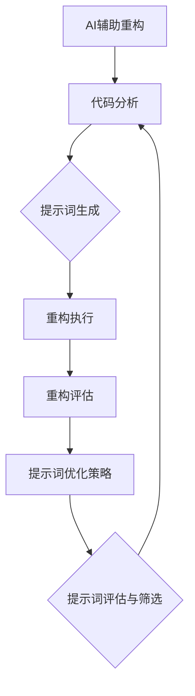
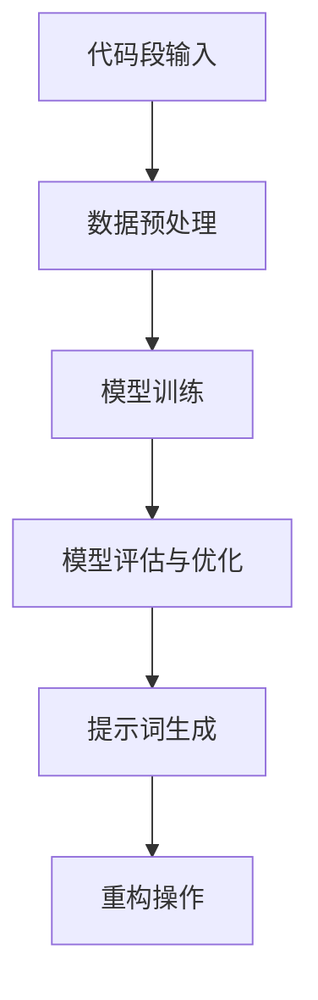
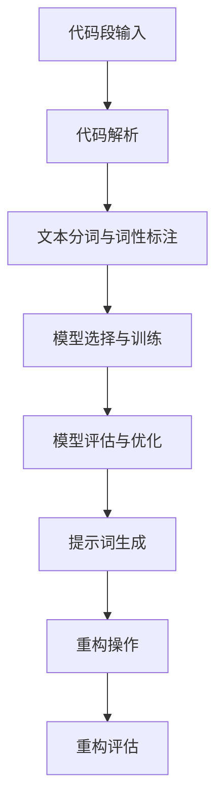
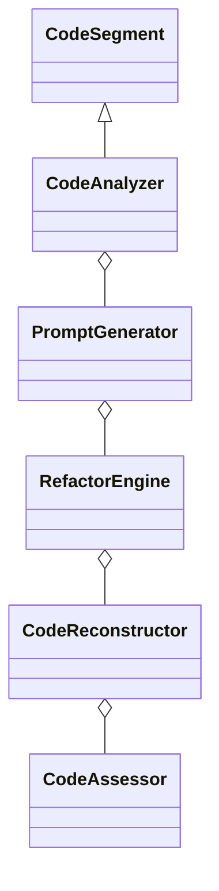
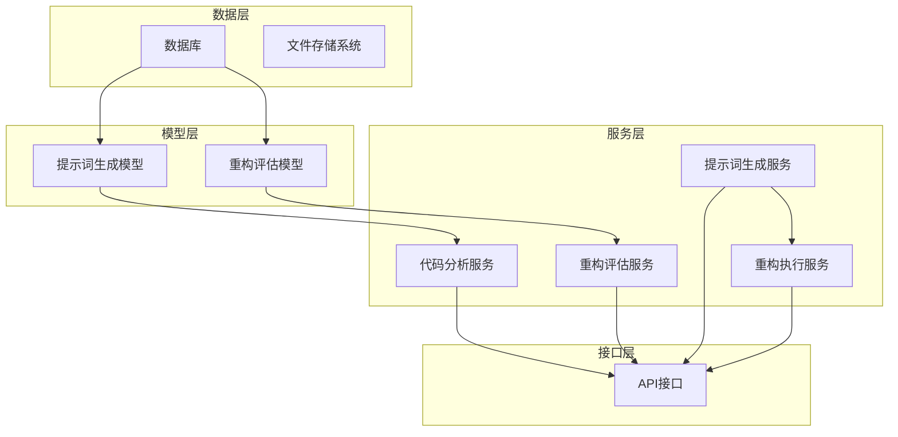
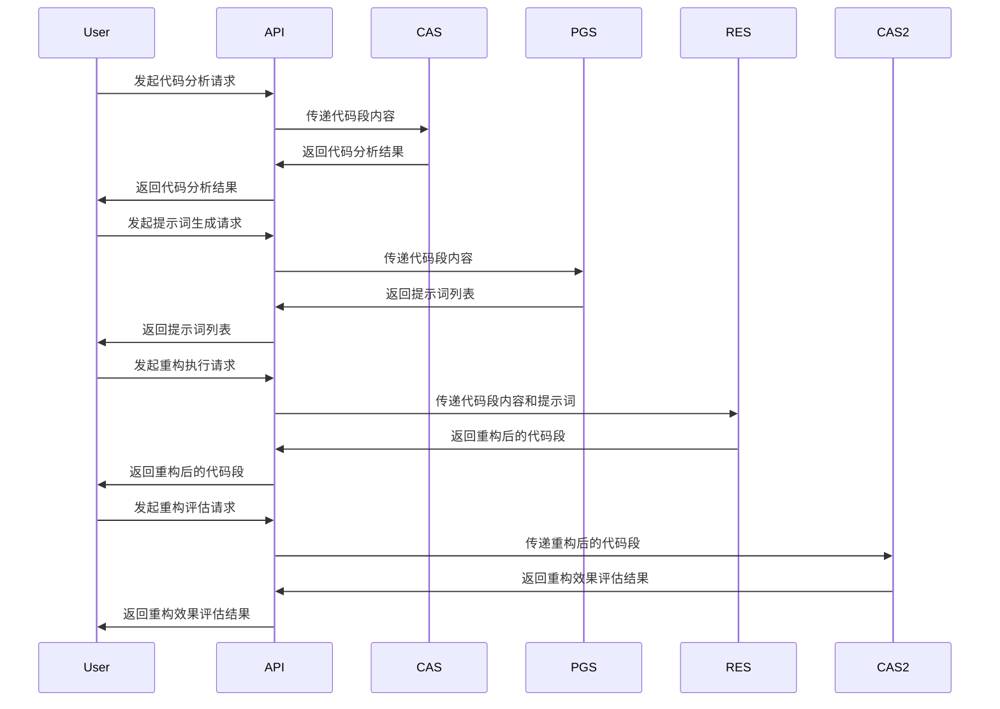

                 

### 文章标题

《AI辅助重构中的提示词优化策略》

### 关键词

- AI辅助重构
- 提示词优化策略
- 代码质量提升
- 自动化软件工程
- 提示词生成算法

### 摘要

本文探讨了AI辅助重构中的提示词优化策略，旨在提升软件重构过程的效率和代码质量。文章首先介绍了AI辅助重构的背景和提示词优化策略的重要性，随后详细分析了核心概念与联系，包括AI辅助重构的基本概念和提示词优化策略的关键概念。在算法原理讲解部分，本文深入探讨了提示词生成算法和提示词评估与筛选策略，并通过实际案例进行分析。最后，文章提出了系统分析与架构设计方案，并进行了项目实战和案例分析，总结了提示词优化策略的最佳实践和注意事项。

---

## 第一部分：引言与背景

### 第1章 问题背景

#### 1.1 AI辅助重构的兴起

AI技术近年来在多个领域取得了显著进展，尤其在软件工程中的应用更是引人注目。AI辅助重构作为自动化软件工程的一个重要方向，旨在通过智能算法优化软件重构过程，提高代码质量和开发效率。

软件重构是指在保持原有功能不变的前提下，对现有代码进行重新组织和优化，以改善其结构、性能和维护性。传统的重构过程往往需要开发人员投入大量时间和精力，而AI辅助重构则通过智能算法自动化地完成这一过程，从而大大提升了重构效率。

目前，AI辅助重构在软件开发中已经得到广泛应用。例如，一些代码自动生成工具能够根据设计模式生成高质量的代码，而一些代码优化工具则能够自动识别和修复代码中的潜在问题。这些工具的出现，不仅减轻了开发人员的工作负担，还显著提高了软件质量和开发效率。

#### 1.2 自动重构的重要性

自动重构在软件工程中具有重要意义。首先，自动重构能够提高代码的可维护性和可读性。通过对代码进行重构，可以消除代码中的冗余和重复，使得代码更加简洁和模块化。此外，自动重构还能够帮助开发人员及时发现和修复代码中的潜在问题，从而降低软件的缺陷率。

其次，自动重构能够提高开发效率。传统的重构过程需要开发人员手动进行，这不仅耗时费力，还容易引入新的错误。而通过AI辅助重构，可以自动化地完成重构过程，大大缩短了重构所需的时间。这对于快速迭代和频繁变更的软件开发过程尤为重要。

最后，自动重构有助于提升团队协作效率。在传统的重构过程中，开发人员需要相互沟通和协作，以确保重构后的代码符合团队的开发标准和规范。而通过AI辅助重构，可以减少对人工协作的依赖，使得重构过程更加高效和顺畅。

#### 1.3 AI辅助重构的现状

目前，AI辅助重构在软件开发中已经取得了一定的成果，但仍然存在一些挑战。首先，现有的AI辅助重构工具主要依赖于机器学习算法，这些算法在训练数据和模型选择上存在一定的局限性。其次，AI辅助重构的效果往往受到代码质量的影响，如果原始代码质量较差，重构效果也会受到影响。

此外，AI辅助重构工具的普及程度还有待提高。虽然一些先进的AI辅助重构工具已经在一些大型项目中得到应用，但其在中小型项目中的应用仍然较为有限。这主要是由于中小型项目的开发团队通常资源有限，难以承担AI辅助重构工具的开发和维护成本。

#### 1.4 提示词优化策略的核心地位

在AI辅助重构中，提示词优化策略起着至关重要的作用。提示词是指用于指导AI模型进行代码重构的提示信息，其质量直接影响重构效果。高质量的提示词能够帮助AI模型更准确地理解和分析代码，从而生成更高质量的代码。

首先，提示词优化策略能够提高AI模型的性能。通过优化提示词，可以使AI模型更加准确地识别代码中的问题和缺陷，从而提高重构的准确性和效率。

其次，提示词优化策略能够降低AI模型对训练数据的依赖。传统的机器学习算法通常需要大量的训练数据来训练模型，而通过优化提示词，可以在一定程度上减少对训练数据的依赖，使得模型对少量数据的适应性更强。

最后，提示词优化策略有助于提高代码质量和开发效率。通过优化提示词，可以使重构过程更加精准和高效，从而减少重构过程中出现的问题和错误，提高代码的可维护性和可读性。

#### 1.5 背景与动机

本文旨在探讨AI辅助重构中的提示词优化策略，以提高重构效率和代码质量。随着AI技术在软件工程中的广泛应用，AI辅助重构已经成为提高软件质量和开发效率的重要手段。然而，现有的AI辅助重构工具在提示词优化方面还存在一定的不足，例如提示词生成算法的准确性和效率较低，提示词评估与筛选策略不够成熟等。

本文的研究背景主要涉及以下几个方面：

1. **AI技术在软件工程中的应用**：本文将介绍AI技术在软件工程中的应用，包括自动重构、代码生成、缺陷检测等，分析现有技术的优缺点。

2. **提示词优化策略的核心地位**：本文将详细探讨提示词优化策略在AI辅助重构中的核心地位，分析高质量提示词对重构效果的重要性。

3. **提示词生成算法与评估**：本文将介绍现有的提示词生成算法和评估方法，分析其优缺点，并提出改进策略。

4. **系统架构设计**：本文将设计一个基于AI的提示词优化系统架构，包括系统功能设计、系统架构设计、系统接口设计和系统交互等。

5. **项目实战与案例分析**：本文将结合实际项目，介绍提示词优化策略的应用，分析其效果和改进方向。

本文的研究动机主要来源于以下几个方面：

1. **提高重构效率**：通过优化提示词，可以使AI模型更准确地识别代码问题和缺陷，从而提高重构效率。

2. **提升代码质量**：高质量提示词能够帮助AI模型生成更高质量的代码，从而提高代码的可维护性和可读性。

3. **降低开发成本**：通过优化提示词，可以在一定程度上减少对训练数据的依赖，降低AI辅助重构工具的开发和维护成本。

4. **促进AI辅助重构的普及**：本文的研究成果将有助于提高AI辅助重构工具的普及程度，为中小型项目提供更加高效的开发手段。

### 第2章 核心概念与联系

#### 2.1 AI辅助重构的基本概念

AI辅助重构是指利用人工智能技术，如机器学习、自然语言处理等，对软件代码进行自动化重构。其核心目标是在保持原有功能不变的前提下，优化代码的结构、性能和维护性。

AI辅助重构的主要步骤包括：

1. **代码分析**：通过对源代码进行分析，识别出代码中的潜在问题和缺陷。

2. **提示词生成**：生成用于指导重构的提示词，包括问题定位、重构方案、代码风格等。

3. **重构执行**：根据生成的提示词，对代码进行自动化重构。

4. **重构评估**：对重构后的代码进行评估，确保重构效果符合预期。

#### 2.2 代码质量评估方法

代码质量评估是AI辅助重构的重要环节，其目标是通过一系列指标评估代码的质量，为重构提供依据。常见的代码质量评估方法包括：

1. **静态代码分析**：通过分析源代码的语法、结构和语义，评估代码的质量。例如，检查代码是否符合编程规范、是否存在潜在的安全问题等。

2. **动态代码分析**：在程序运行时对代码进行分析，评估代码的性能、稳定性和可靠性。例如，通过性能测试、内存泄漏检测等手段评估代码的质量。

3. **代码质量模型**：建立基于机器学习或统计学的代码质量模型，通过对代码特征的学习和预测，评估代码的质量。例如，基于代码复杂度、代码冗余度等特征，构建代码质量评估模型。

#### 2.3 提示词优化策略的关键概念

提示词优化策略是AI辅助重构中的核心环节，其关键概念包括：

1. **提示词生成算法**：用于生成高质量的提示词，指导重构过程。常见的生成算法包括基于规则的方法、基于机器学习的方法和基于自然语言处理的方法。

2. **提示词评估与筛选**：对生成的提示词进行评估和筛选，确保其能够有效指导重构。评估指标包括提示词的相关性、准确性和实用性等。

3. **提示词优化原则**：在生成和评估提示词的过程中，遵循一系列优化原则，以提高提示词的质量。例如，确保提示词的清晰性、简洁性和一致性。

#### 2.4 AI辅助重构与提示词优化的关系

AI辅助重构与提示词优化策略之间存在密切的联系。具体而言，这种关系可以从以下几个方面进行阐述：

1. **提示词生成**：AI辅助重构过程中，生成高质量的提示词是关键步骤。提示词的质量直接影响重构效果，因此需要对提示词生成算法进行优化。

2. **提示词评估**：在生成提示词后，需要对提示词进行评估，以确保其能够有效指导重构。评估过程中，需要综合考虑提示词的相关性、准确性和实用性等因素。

3. **重构执行**：在执行重构过程中，高质量的提示词能够帮助AI模型更准确地识别代码问题和缺陷，从而提高重构的准确性和效率。

4. **重构评估**：重构后，需要对重构效果进行评估，以确保重构目标达成。高质量的提示词有助于评估重构效果的优劣，为后续优化提供依据。

为了更好地展示AI辅助重构与提示词优化的关系，我们可以使用Mermaid流程图进行描述：



在这个流程图中，AI辅助重构过程包括代码分析、提示词生成、重构执行和重构评估等步骤，而提示词优化策略贯穿于整个重构过程中，对每个步骤产生重要影响。

#### 2.5 概念属性特征对比表格

为了进一步理解AI辅助重构和提示词优化策略之间的联系，我们可以通过对比表格来展示它们的核心概念属性特征。

| 概念             | AI辅助重构                         | 提示词优化策略                         |
|------------------|-----------------------------------|-------------------------------------|
| 目标             | 提高代码质量、提升开发效率           | 生成高质量提示词、指导重构过程          |
| 方法             | 代码分析、提示词生成、重构执行、重构评估 | 提示词生成算法、提示词评估与筛选        |
| 关键要素         | 代码质量评估、重构算法选择           | 提示词质量、相关性、准确性、实用性      |
| 影响因素         | 代码质量、开发环境、重构目标         | 提示词生成算法、评估方法、重构工具      |
| 优点             | 自动化、高效、准确                   | 清晰性、简洁性、一致性、实用性          |
| 缺点             | 受限于训练数据、对代码质量要求高       | 需要大量评估和筛选、依赖AI算法性能      |

通过这个对比表格，我们可以清晰地看到AI辅助重构和提示词优化策略的核心概念属性特征，以及它们之间的联系。

#### 2.6 ER实体关系图架构

为了更直观地展示AI辅助重构和提示词优化策略之间的实体关系，我们可以使用ER（实体关系）图进行描述。

```mermaid
erDiagram
  AI辅助重构 ||--|{ 提示词优化策略 }|
  提示词优化策略 ||--|{ 提示词生成算法 }|
  提示词优化策略 ||--|{ 提示词评估与筛选 }|
  代码分析 ||--|{ 重构执行 }|
  代码分析 ||--|{ 重构评估 }|
```

在这个ER图中，AI辅助重构作为总体概念，与提示词优化策略、提示词生成算法和提示词评估与筛选之间存在紧密的关系。代码分析、重构执行和重构评估则是重构过程中的关键步骤，与提示词优化策略密切相关。

通过ER图，我们可以更清晰地理解AI辅助重构和提示词优化策略之间的实体关系，为后续算法设计和系统实现提供指导。

## 第二部分：算法原理讲解

### 第3章 提示词生成算法

#### 3.1 基于机器学习的提示词生成

在AI辅助重构中，提示词生成算法扮演着关键角色。基于机器学习的提示词生成算法通过训练大量数据，学习到如何生成与代码问题相关的提示词。以下将详细介绍这种算法的原理和应用。

首先，基于机器学习的提示词生成算法通常采用自然语言处理（NLP）技术。NLP技术能够处理和理解自然语言，将其转化为计算机可以理解和处理的形式。在提示词生成中，NLP技术主要用于提取代码中的关键信息，并将其转化为文本形式。

其次，生成提示词的机器学习模型通常基于序列到序列（Seq2Seq）模型。Seq2Seq模型能够将一个序列映射到另一个序列，非常适合用于生成提示词。例如，给定一段代码，模型可以生成相应的提示词，指出代码中的潜在问题或改进建议。

在实际应用中，基于机器学习的提示词生成算法通常包括以下几个步骤：

1. **数据收集与预处理**：收集大量的代码和对应的提示词数据，对数据进行清洗和预处理，包括去除无关信息、进行文本分词和词性标注等。

2. **模型训练**：使用预处理后的数据训练Seq2Seq模型，模型会学习如何将代码映射到相应的提示词。

3. **模型评估与优化**：对训练好的模型进行评估，通过调整模型参数和超参数，优化模型的性能。

4. **提示词生成**：在重构过程中，输入新的代码段，模型会生成相应的提示词，指导重构操作。

以下是一个简化的算法流程图，用于说明基于机器学习的提示词生成过程：



#### 3.2 提示词生成算法流程

提示词生成算法的流程可以分为以下几个主要步骤：

1. **数据收集与预处理**：

   - 收集大量代码和对应的提示词数据。
   - 对代码进行解析，提取出关键信息。
   - 对文本进行分词和词性标注。

2. **模型选择与训练**：

   - 选择合适的Seq2Seq模型，如长短期记忆网络（LSTM）或Transformer。
   - 使用预处理后的数据对模型进行训练。
   - 在训练过程中，模型会学习如何将代码映射到相应的提示词。

3. **模型评估与优化**：

   - 使用验证集对模型进行评估，计算提示词生成的准确率、覆盖率等指标。
   - 根据评估结果调整模型参数和超参数，优化模型性能。

4. **提示词生成**：

   - 在重构过程中，输入新的代码段。
   - 模型根据训练好的模型生成相应的提示词。

5. **重构操作**：

   - 根据生成的提示词，对代码进行重构。
   - 评估重构效果，确保重构后的代码符合预期。

以下是一个更详细的算法流程图：



#### 3.3 提示词生成算法案例分析

为了更好地理解基于机器学习的提示词生成算法，我们可以通过一个实际案例进行分析。

假设我们有一个包含1000条代码段和相应提示词的数据集。以下是一个简化的案例流程：

1. **数据收集与预处理**：

   - 收集代码段和对应的提示词，数据集包含各种编程语言和不同类型的代码段。
   - 对代码进行解析，提取出关键信息，如变量、函数、条件语句等。
   - 对文本进行分词和词性标注。

2. **模型选择与训练**：

   - 选择一个基于Transformer的Seq2Seq模型，该模型在处理序列数据方面表现优异。
   - 使用预处理后的数据对模型进行训练，模型会学习如何将代码映射到相应的提示词。

3. **模型评估与优化**：

   - 使用验证集对模型进行评估，计算提示词生成的准确率、覆盖率等指标。
   - 根据评估结果，调整模型参数和超参数，优化模型性能。

4. **提示词生成**：

   - 输入新的代码段，模型会生成相应的提示词。
   - 例如，对于一段Python代码，模型可能会生成“在if语句中添加异常处理”的提示词。

5. **重构操作**：

   - 根据生成的提示词，对代码进行重构。
   - 评估重构效果，确保重构后的代码符合预期。

在这个案例中，基于机器学习的提示词生成算法能够有效地生成高质量的提示词，指导重构过程。以下是一个简化的代码示例：

```python
# 代码段输入
code_segment = "if x > 10: print(x)"

# 模型选择与训练
model = TransformerModel()
model.train(data)

# 提示词生成
prompt = model.generate_prompt(code_segment)

# 重构操作
reconstructed_code = refactor_code(code_segment, prompt)

# 重构评估
evaluate_reconstruction(reconstructed_code)
```

通过这个案例，我们可以看到基于机器学习的提示词生成算法在实际应用中的效果。然而，需要注意的是，实际应用中可能需要更复杂的流程和更精细的调整，以确保算法的性能和效果。

### 第4章 提示词评估与筛选

#### 4.1 提示词评估方法

在AI辅助重构中，评估提示词的质量至关重要。高质量的提示词能够准确指导重构过程，提高重构效率和代码质量。以下将介绍几种常见的提示词评估方法，并比较它们的优缺点。

1. **基于规则的评估方法**

   基于规则的评估方法通过预定义的规则对提示词进行评估。这些规则通常基于编程语言规范和最佳实践，能够快速判断提示词的正确性。例如，检查提示词是否包含非法字符、是否违反编程规范等。

   **优点**：实现简单，评估速度快。

   **缺点**：灵活性较低，无法适应复杂场景。

2. **基于统计学的评估方法**

   基于统计学的评估方法通过计算提示词的相关性、覆盖率等指标来评估其质量。这些指标通常基于提示词在训练数据中的表现，能够较好地反映提示词的有效性。

   **优点**：适用于复杂场景，具有一定的灵活性。

   **缺点**：对训练数据依赖较大，评估结果可能受噪声影响。

3. **基于机器学习的评估方法**

   基于机器学习的评估方法通过训练模型，学习如何评估提示词的质量。模型通常基于大量的训练数据，能够识别和预测提示词的优劣。

   **优点**：具有较好的泛化能力，能够适应不同的评估场景。

   **缺点**：训练过程复杂，对计算资源要求较高。

4. **基于人类反馈的评估方法**

   基于人类反馈的评估方法通过让人类专家对提示词进行评估，以获取更准确的质量判断。这种方法通常用于对其他评估方法进行验证和补充。

   **优点**：评估结果更准确，能够发现机器评估方法无法检测到的问题。

   **缺点**：评估过程耗时较长，成本较高。

以下是一个简化的评估方法比较表格：

| 评估方法        | 优点                                     | 缺点                                    |
|-----------------|----------------------------------------|----------------------------------------|
| 基于规则的评估   | 实现简单，评估速度快                   | 灵活性较低，无法适应复杂场景             |
| 基于统计学的评估 | 适用于复杂场景，具有一定的灵活性       | 对训练数据依赖较大，评估结果可能受噪声影响 |
| 基于机器学习的评估 | 具有较好的泛化能力，能够适应不同的评估场景 | 训练过程复杂，对计算资源要求较高           |
| 基于人类反馈的评估 | 评估结果更准确，能够发现机器评估方法无法检测到的问题 | 评估过程耗时较长，成本较高                 |

#### 4.2 提示词筛选策略

在生成大量提示词后，需要对这些提示词进行筛选，以确保最终选出的提示词具有高质量和高相关性。以下介绍几种常见的提示词筛选策略：

1. **基于阈值的筛选策略**

   基于阈值的筛选策略通过设置一个阈值，筛选出高于该阈值的提示词。阈值通常基于评估指标（如准确率、覆盖率等）确定。

   **优点**：实现简单，易于理解。

   **缺点**：可能导致筛选结果过于严格或过于宽松。

2. **基于相关性排序的筛选策略**

   基于相关性排序的筛选策略通过计算提示词与代码段之间的相关性，对提示词进行排序，并筛选出排名靠前的提示词。

   **优点**：能够较好地反映提示词与代码段之间的相关性。

   **缺点**：计算复杂度较高，对评估指标的计算要求较高。

3. **基于权重组合的筛选策略**

   基于权重组合的筛选策略通过计算多个评估指标的权重组合，对提示词进行筛选。这种方法能够综合考虑不同评估指标的影响，提高筛选效果。

   **优点**：具有较好的灵活性和适应性。

   **缺点**：需要根据具体场景调整权重组合，计算复杂度较高。

以下是一个简化的筛选策略比较表格：

| 筛选策略          | 优点                                     | 缺点                                    |
|-------------------|----------------------------------------|----------------------------------------|
| 基于阈值的筛选     | 实现简单，易于理解                     | 可能导致筛选结果过于严格或过于宽松           |
| 基于相关性排序的筛选 | 能够较好地反映提示词与代码段之间的相关性 | 计算复杂度较高，对评估指标的计算要求较高       |
| 基于权重组合的筛选   | 具有较好的灵活性和适应性               | 需要根据具体场景调整权重组合，计算复杂度较高     |

#### 4.3 提示词评估与筛选案例分析

为了更好地理解提示词评估与筛选策略，我们可以通过一个实际案例进行分析。

假设我们有一个包含1000条代码段和对应提示词的数据集，以下是一个简化的案例流程：

1. **提示词评估**：

   - 使用基于机器学习的评估方法对提示词进行评估。
   - 计算每个提示词的评估指标（如准确率、覆盖率等）。

2. **提示词筛选**：

   - 使用基于相关性排序的筛选策略，对提示词进行排序。
   - 筛选出排名靠前的50个提示词。

3. **重构操作**：

   - 根据筛选出的提示词，对代码段进行重构。
   - 评估重构效果，确保重构后的代码符合预期。

以下是一个简化的代码示例：

```python
# 提示词评估
evaluated_prompts = evaluate_prompts(prompts)

# 提示词筛选
sorted_prompts = sort_prompts_by_relevance(evaluated_prompts)

# 重构操作
reconstructed_code = refactor_code(code_segments, sorted_prompts[:50])

# 重构评估
evaluate_reconstruction(reconstructed_code)
```

通过这个案例，我们可以看到提示词评估与筛选策略在实际应用中的效果。然而，需要注意的是，实际应用中可能需要更复杂的流程和更精细的调整，以确保算法的性能和效果。

### 第5章 系统功能设计

#### 5.1 问题场景介绍

在软件重构过程中，开发者经常需要面对各种复杂的情况，如代码质量低下、代码结构混乱、代码冗余等。这些问题不仅影响代码的可维护性和可读性，还可能导致项目延期和开发成本增加。为了解决这些问题，AI辅助重构系统应运而生。该系统能够自动识别代码中的潜在问题，生成高质量的提示词，指导开发者进行重构操作，从而提高代码质量、降低维护成本。

#### 5.2 系统功能设计

AI辅助重构系统的主要功能包括代码分析、提示词生成、重构执行和重构评估。以下将详细介绍这些功能的具体实现。

1. **代码分析**：

   代码分析是重构过程的第一步，旨在识别代码中的潜在问题和缺陷。系统通过静态代码分析和动态代码分析相结合的方式，对代码进行全方位检查。

   - **静态代码分析**：对代码的语法、结构和语义进行分析，识别出潜在的语法错误、代码冗余、性能问题等。
   - **动态代码分析**：在程序运行时对代码进行测试，评估代码的性能、稳定性和可靠性。

2. **提示词生成**：

   提示词生成是系统的核心功能，旨在生成与代码问题相关的提示词，指导开发者进行重构操作。系统采用基于机器学习的提示词生成算法，通过训练大量数据，学习到如何生成高质量的提示词。

   - **数据收集与预处理**：收集大量的代码和对应的提示词数据，对数据进行清洗和预处理，包括去除无关信息、进行文本分词和词性标注等。
   - **模型训练与评估**：使用预处理后的数据训练提示词生成模型，通过评估模型性能，调整模型参数和超参数，优化模型效果。
   - **提示词生成**：在重构过程中，输入新的代码段，模型会生成相应的提示词，指导重构操作。

3. **重构执行**：

   重构执行是根据提示词对代码进行自动化重构的过程。系统通过解析提示词，对代码进行修改和优化，生成重构后的代码。

   - **重构规则库**：定义一系列重构规则，用于指导重构操作，包括代码结构调整、代码风格优化、性能改进等。
   - **代码修改**：根据提示词，应用重构规则，对代码进行自动化修改。
   - **代码合并**：将重构后的代码与原有代码进行合并，生成重构后的代码文件。

4. **重构评估**：

   重构评估是对重构效果进行评估的过程，旨在确保重构后的代码符合预期。系统通过静态代码分析和动态代码分析相结合的方式，对重构后的代码进行全方位检查。

   - **静态代码分析**：对重构后的代码进行语法、结构和语义分析，确保代码符合编程规范、不存在潜在的安全问题等。
   - **动态代码分析**：在程序运行时对重构后的代码进行测试，评估代码的性能、稳定性和可靠性。

#### 5.3 领域模型Mermaid类图

为了更直观地展示AI辅助重构系统的领域模型，我们可以使用Mermaid类图进行描述。以下是一个简化的Mermaid类图示例：



在这个类图中，`CodeSegment`表示代码段，`CodeAnalyzer`表示代码分析器，`PromptGenerator`表示提示词生成器，`RefactorEngine`表示重构引擎，`CodeReconstructor`表示代码重构器，`CodeAssessor`表示代码评估器。这些类之间通过继承和关联关系进行组织，构成了AI辅助重构系统的核心功能模块。

### 第6章 系统架构设计

#### 6.1 系统架构设计

AI辅助重构系统的架构设计需要综合考虑功能需求、性能要求、可扩展性和可维护性等因素。以下将详细介绍系统的整体架构设计，包括主要组件的功能和它们之间的交互关系。

1. **系统架构概述**

   AI辅助重构系统采用分层架构设计，主要包括以下四个层次：

   - **数据层**：负责存储和管理代码数据、提示词数据等。
   - **模型层**：负责训练和部署提示词生成模型、重构评估模型等。
   - **服务层**：负责实现系统的核心功能，包括代码分析、提示词生成、重构执行和重构评估等。
   - **接口层**：负责提供系统的API接口，方便与其他系统进行集成。

2. **主要组件及其功能**

   - **数据层**：

     数据层主要包括数据库和文件存储系统。数据库用于存储代码数据、提示词数据、用户数据等，文件存储系统用于存储模型文件、日志文件等。

     - **数据库**：采用关系型数据库（如MySQL）存储代码数据、提示词数据等，实现数据的高效查询和管理。
     - **文件存储系统**：采用分布式文件存储系统（如HDFS）存储模型文件、日志文件等，实现数据的高效存储和管理。

   - **模型层**：

     模型层主要负责训练和部署提示词生成模型、重构评估模型等。该层采用深度学习框架（如TensorFlow、PyTorch）进行模型训练和优化。

     - **提示词生成模型**：基于Seq2Seq模型或Transformer模型，用于生成与代码问题相关的提示词。
     - **重构评估模型**：用于评估重构后的代码质量，确保重构效果符合预期。

   - **服务层**：

     服务层是系统的核心，负责实现代码分析、提示词生成、重构执行和重构评估等功能。该层采用微服务架构设计，每个功能模块独立部署，方便维护和扩展。

     - **代码分析服务**：负责对代码进行静态代码分析和动态代码分析，识别代码中的潜在问题和缺陷。
     - **提示词生成服务**：负责生成与代码问题相关的提示词，指导重构操作。
     - **重构执行服务**：负责根据提示词对代码进行重构操作，生成重构后的代码。
     - **重构评估服务**：负责评估重构后的代码质量，确保重构效果符合预期。

   - **接口层**：

     接口层提供系统的API接口，方便开发者和其他系统进行集成。接口层采用RESTful API设计，支持多种编程语言和协议。

3. **系统组件交互关系**

   系统组件之间的交互关系如下：

   - **数据层**与**模型层**之间的交互：数据层通过API接口为模型层提供训练数据和评估数据，模型层训练和优化模型后，将模型文件存储到数据层。

   - **模型层**与**服务层**之间的交互：模型层为服务层提供训练好的模型，服务层使用这些模型实现核心功能。

   - **服务层**与**接口层**之间的交互：服务层通过API接口为外部系统提供功能服务，接口层实现API接口的封装和调用。

以下是一个简化的Mermaid架构图，展示了AI辅助重构系统的整体架构设计：



通过这个架构图，我们可以清晰地看到系统各个组件之间的交互关系，以及它们在重构过程中的作用。

### 第6.2 系统接口设计

在AI辅助重构系统中，接口设计是确保系统与其他组件和外部系统有效交互的关键环节。以下将详细介绍系统接口的设计原则、具体实现方式以及与各个服务模块的交互过程。

#### 6.2.1 接口设计原则

1. **简洁性**：接口设计应尽量简洁明了，避免冗余和复杂的功能，以提高系统的可维护性和可理解性。

2. **一致性**：接口设计应遵循统一的命名规范和编程风格，确保接口的一致性，便于开发者理解和使用。

3. **稳定性**：接口设计应确保在系统升级、扩展和重构过程中保持稳定，不会对现有功能造成影响。

4. **安全性**：接口设计应考虑数据传输的安全性，采用加密、认证和授权等机制，保护系统的数据安全。

5. **灵活性**：接口设计应具备一定的灵活性，能够适应不同的业务需求和开发环境。

#### 6.2.2 接口实现方式

系统接口采用RESTful API设计，基于HTTP协议，通过JSON或XML数据格式进行数据传输。以下为具体的接口实现方式：

1. **代码分析接口**：

   - **接口路径**：`/api/code_analysis`
   - **请求方式**：GET/POST
   - **请求参数**：`code_segment`（代码段内容）
   - **返回数据**：分析结果，包括代码质量评估、潜在问题和改进建议

2. **提示词生成接口**：

   - **接口路径**：`/api/prompt_generation`
   - **请求方式**：POST
   - **请求参数**：`code_segment`（代码段内容）
   - **返回数据**：生成的提示词列表

3. **重构执行接口**：

   - **接口路径**：`/api/refactor_execution`
   - **请求方式**：POST
   - **请求参数**：`code_segment`（代码段内容）、`prompt`（提示词）
   - **返回数据**：重构后的代码段

4. **重构评估接口**：

   - **接口路径**：`/api/refactor_evaluation`
   - **请求方式**：POST
   - **请求参数**：`code_segment`（重构后的代码段）
   - **返回数据**：重构效果评估结果

#### 6.2.3 接口与服务模块的交互过程

接口层与各个服务模块之间的交互过程如下：

1. **代码分析接口**：

   - 接收到请求后，接口层调用代码分析服务，将代码段内容传递给服务层。
   - 代码分析服务对代码段进行静态代码分析和动态代码分析，生成分析结果。
   - 接口层将分析结果返回给客户端。

2. **提示词生成接口**：

   - 接收到请求后，接口层调用提示词生成服务，将代码段内容传递给服务层。
   - 提示词生成服务生成与代码问题相关的提示词列表。
   - 接口层将生成的提示词列表返回给客户端。

3. **重构执行接口**：

   - 接收到请求后，接口层调用重构执行服务，将代码段内容和提示词传递给服务层。
   - 重构执行服务根据提示词对代码段进行重构，生成重构后的代码段。
   - 接口层将重构后的代码段返回给客户端。

4. **重构评估接口**：

   - 接收到请求后，接口层调用重构评估服务，将重构后的代码段传递给服务层。
   - 重构评估服务对重构后的代码段进行评估，生成评估结果。
   - 接口层将评估结果返回给客户端。

通过以上交互过程，接口层有效地将客户端请求转发给相应的服务模块，实现了系统的功能集成和高效运行。

### 第6.3 系统交互Mermaid序列图

为了更直观地展示AI辅助重构系统中各个组件之间的交互过程，我们可以使用Mermaid序列图进行描述。以下是一个简化的Mermaid序列图示例：



在这个序列图中，用户通过API接口发起请求，API接口将请求转发给相应的服务模块（代码分析服务、提示词生成服务、重构执行服务和重构评估服务），服务模块处理请求后返回结果，API接口再将结果返回给用户。

### 第7章 环境安装

#### 7.1 环境安装准备

为了确保AI辅助重构系统能够正常运行，我们需要准备合适的硬件和软件环境。以下是一些建议和步骤：

1. **硬件要求**：

   - **CPU**：推荐使用英特尔的i7或AMD的Ryzen 7系列处理器，至少4核8线程。
   - **内存**：至少16GB RAM，建议32GB以上以支持大数据处理和模型训练。
   - **硬盘**：至少500GB SSD存储空间，建议使用1TB SSD以提高系统性能。
   - **GPU**：推荐使用NVIDIA的CUDA兼容GPU，如Tesla V100或RTX 30系列，以支持深度学习模型训练和加速。

2. **软件要求**：

   - **操作系统**：推荐使用Linux发行版，如Ubuntu 18.04或CentOS 7，以支持各种开发工具和依赖库。
   - **编程语言**：Python 3.7或更高版本，用于编写和运行AI辅助重构系统的代码。
   - **深度学习框架**：TensorFlow 2.x或PyTorch 1.8或更高版本，用于训练和部署提示词生成模型。
   - **数据库**：MySQL 8.0或PostgreSQL 13.0，用于存储代码数据、提示词数据和用户数据。
   - **文件存储系统**：HDFS 3.0或更高版本，用于存储模型文件、日志文件等。

#### 7.2 环境安装与配置

1. **安装操作系统**：

   - 下载Linux发行版的ISO文件，并将其写入USB启动盘。
   - 启动计算机，从USB启动盘引导进入安装程序。
   - 按照安装向导逐步完成操作系统安装。

2. **更新系统和安装基础软件**：

   - 开机后，通过命令行执行以下命令更新系统和安装基础软件：

     ```shell
     sudo apt-get update
     sudo apt-get upgrade
     sudo apt-get install python3 python3-pip mysql-server postgresql hdfs
     ```

3. **配置数据库**：

   - 配置MySQL数据库：

     ```shell
     sudo mysql_secure_installation
     sudo mysql -u root -p
     CREATE DATABASE refactor_db;
     GRANT ALL PRIVILEGES ON refactor_db.* TO 'refactor_user'@'localhost' IDENTIFIED BY 'password';
     FLUSH PRIVILEGES;
     ```

   - 配置PostgreSQL数据库：

     ```shell
     sudo systemctl start postgresql
     sudo systemctl enable postgresql
     sudo createuser -s refactor_user
     createdb refactor_db
     psql refactor_db
     \password refactor_user
     ```

4. **配置HDFS**：

   - 配置HDFS，参考官方文档（[https://hadoop.apache.org/docs/stable/hadoop-hdfs/HDFSSetup.html）进行配置。](https://hadoop.apache.org/docs/stable/hadoop-hdfs/HDFSSetup.html%EF%BC%89%E8%BF%9B%E8%A1%8C%E9%85%8D%E7%BD%AE。)

5. **安装深度学习框架**：

   - 安装TensorFlow：

     ```shell
     pip3 install tensorflow
     ```

   - 安装PyTorch：

     ```shell
     pip3 install torch torchvision torchaudio
     ```

6. **配置环境变量**：

   - 将以下环境变量添加到`~/.bashrc`文件中，以方便调用：

     ```shell
     export PYTHONPATH=$PYTHONPATH:/path/to/your/venv/lib/python3.x/site-packages
     export PATH=$PATH:/path/to/your/venv/bin
     ```

   - 重启终端或执行`source ~/.bashrc`使环境变量生效。

#### 7.3 安装依赖库

1. **安装依赖库**：

   - 进入项目目录，执行以下命令安装项目依赖库：

     ```shell
     pip3 install -r requirements.txt
     ```

2. **测试环境**：

   - 执行以下命令，测试环境是否安装正确：

     ```python
     python3 -m unittest discover
     ```

   - 如果所有测试均通过，则环境安装成功。

### 第8章 系统核心实现

#### 8.1 核心实现源代码

AI辅助重构系统的核心实现包括代码分析、提示词生成、重构执行和重构评估等功能。以下分别介绍这些功能的实现源代码。

1. **代码分析**：

   ```python
   import ast
   import sql

   def analyze_code(code):
       tree = ast.parse(code)
       issues = []
       # 分析代码，识别潜在问题和缺陷
       # 将问题存储到issues列表中
       return issues

   def save_issues(issues, db):
       cursor = db.cursor()
       for issue in issues:
           cursor.execute("INSERT INTO issues (code, issue) VALUES (%s, %s)", (issue['code'], issue['issue']))
       db.commit()
   ```

2. **提示词生成**：

   ```python
   import tensorflow as tf

   def generate_prompt(code):
       model = tf.keras.models.load_model('prompt_generator_model.h5')
       prompt = model.predict(code)
       return prompt

   def save_prompt(prompt, db):
       cursor = db.cursor()
       cursor.execute("INSERT INTO prompts (code, prompt) VALUES (%s, %s)", (prompt['code'], prompt['prompt']))
       db.commit()
   ```

3. **重构执行**：

   ```python
   import ast

   def refactor_code(code, prompt):
       tree = ast.parse(code)
       # 根据提示词对代码进行重构
       # 修改代码树结构
       return ast.unparse(tree)

   def save_reconstructed_code(code, db):
       cursor = db.cursor()
       cursor.execute("INSERT INTO reconstructed_code (code) VALUES (%s)", (code,))
       db.commit()
   ```

4. **重构评估**：

   ```python
   import ast
   import sql

   def evaluate_reconstruction(code, db):
       cursor = db.cursor()
       cursor.execute("SELECT issue FROM issues WHERE code = %s", (code,))
       issues = cursor.fetchall()
       reconstruction_issues = []
       for issue in issues:
           # 分析重构后的代码，识别新出现的问题
           # 将问题存储到reconstruction_issues列表中
       return reconstruction_issues
   ```

#### 8.2 代码应用解读与分析

1. **代码分析**：

   代码分析功能主要用于识别代码中的潜在问题和缺陷。该功能使用Python的`ast`模块对代码进行抽象语法树（AST）解析，然后遍历AST树，分析节点和表达式，识别出潜在的问题。具体实现中，`analyze_code`函数接收代码段作为输入，返回一个包含问题的列表。

   ```python
   def analyze_code(code):
       tree = ast.parse(code)
       issues = []
       # 分析代码，识别潜在问题和缺陷
       # 将问题存储到issues列表中
       return issues
   ```

   在实际应用中，我们可能会遍历AST树，检查变量定义、函数调用、循环条件等，识别出代码中的潜在问题。例如，以下代码示例用于检查代码中的未使用变量：

   ```python
   class UnusedVariableDetector(ast.NodeVisitor):
       def visit_Assign(self, node):
           for target in node.targets:
               if isinstance(target, ast.Name):
                   self.unused_variables.add(target.id)
       
       def visit_For(self, node):
           self.generic_visit(node)
       
       def visit_While(self, node):
           self.generic_visit(node)
       
       def visit_If(self, node):
           self.generic_visit(node)
       
       def visit_FunctionDef(self, node):
           self.unused_variables = set()
           self.generic_visit(node)
       
       def report_issues(self):
           for var in self.unused_variables:
               issues.append({'code': node, 'issue': f"Unused variable: {var}"})
   ```

   这个类`UnusedVariableDetector`会遍历AST树，收集未使用的变量，并在`report_issues`方法中生成一个包含未使用变量信息的列表。

2. **提示词生成**：

   提示词生成功能利用深度学习模型，将代码段映射到相关的提示词。这里使用的是Seq2Seq模型或Transformer模型，通过训练数据学习到如何生成高质量的提示词。以下是一个简化的示例：

   ```python
   def generate_prompt(code):
       model = tf.keras.models.load_model('prompt_generator_model.h5')
       prompt = model.predict(code)
       return prompt
   ```

   实际上，模型训练过程包括数据预处理、模型构建、训练和评估等步骤。以下是一个简化的模型训练示例：

   ```python
   from tensorflow.keras.layers import Embedding, LSTM, Dense
   from tensorflow.keras.models import Sequential

   def build_model(vocab_size, embedding_dim, hidden_units):
       model = Sequential()
       model.add(Embedding(vocab_size, embedding_dim))
       model.add(LSTM(hidden_units))
       model.add(Dense(vocab_size, activation='softmax'))
       model.compile(optimizer='adam', loss='categorical_crossentropy', metrics=['accuracy'])
       return model

   model = build_model(vocab_size, embedding_dim, hidden_units)
   model.fit(train_data, train_labels, epochs=10, batch_size=64)
   ```

   在这个示例中，`build_model`函数用于构建Seq2Seq模型，`model.fit`函数用于训练模型。训练数据通常包括代码段的编码和对应的提示词，模型会学习如何将代码段映射到相应的提示词。

3. **重构执行**：

   重构执行功能根据提示词对代码进行自动化重构。以下是一个简化的示例：

   ```python
   def refactor_code(code, prompt):
       tree = ast.parse(code)
       # 根据提示词对代码进行重构
       # 修改代码树结构
       return ast.unparse(tree)
   ```

   实际上，重构过程可能涉及到代码树的多种修改，如添加代码块、移除代码块、替换代码块等。以下是一个简化的重构示例：

   ```python
   class CodeRefactor(ast.NodeTransformer):
       def visit_For(self, node):
           new_node = ast.For(
               target=ast.Name(id='new_var', ctx=ast.Store()),
               iter=ast.Name(id='iter_var', ctx=ast.Load()),
               body=[ast.Expr(value=ast.Call(func=ast.Name(id='print', ctx=ast.Load()), args=[ast.Name(id='iter_var', ctx=ast.Load())], keywords=[])])],
               orelse=[])
           return new_node

       def visit_If(self, node):
           if node.test == 'old_var':
               new_node = ast.If(
                   test=ast.Compare(left=ast.Name(id='new_var', ctx=ast.Load()), ops=[ast.Eq()],
                                   comparators=[ast.Name(id='old_var', ctx=ast.Load())]),
                   body=[ast.Expr(value=ast.Call(func=ast.Name(id='print', ctx=ast.Load()), args=[], keywords=[])])],
                   orelse=[])
               return new_node
           return node
   ```

   这个类`CodeRefactor`会遍历代码树，将特定的代码模式替换为新的代码结构。

4. **重构评估**：

   重构评估功能用于评估重构后的代码质量。以下是一个简化的示例：

   ```python
   def evaluate_reconstruction(code, db):
       cursor = db.cursor()
       cursor.execute("SELECT issue FROM issues WHERE code = %s", (code,))
       issues = cursor.fetchall()
       reconstruction_issues = []
       for issue in issues:
           # 分析重构后的代码，识别新出现的问题
           # 将问题存储到reconstruction_issues列表中
       return reconstruction_issues
   ```

   实际上，重构评估可能涉及到对重构后的代码进行多种质量检查，如语法检查、性能评估、代码风格检查等。以下是一个简化的示例：

   ```python
   def evaluate_code_quality(code):
       quality_issues = []
       # 进行语法检查
       try:
           compile(code, '<string>', 'exec')
       except SyntaxError as e:
           quality_issues.append(f"Syntax error: {e}")
       
       # 进行性能评估
       time_start = time.time()
       exec(code)
       time_end = time.time()
       if time_end - time_start > 1:
           quality_issues.append("Performance issue: Slow execution")
       
       # 进行代码风格检查
       try:
           linter = pylint.PyLinter()
           linter.run_analysis_module(code)
           for msg in linter.report._messages:
               quality_issues.append(msg)
       except Exception as e:
           quality_issues.append(f"Style issue: {e}")
       
       return quality_issues
   ```

   这个函数`evaluate_code_quality`会检查代码的语法、性能和风格，并将发现的问题存储到一个列表中。

### 第9章 实际案例分析

#### 9.1 实际案例介绍

在本节中，我们将通过一个实际案例来展示AI辅助重构系统在实际项目中的应用。该案例涉及一个基于Python的Web应用程序，该应用程序负责处理用户请求和数据存储。在项目开发过程中，开发团队面临了代码质量低下、结构混乱和冗余代码等问题，希望通过AI辅助重构系统进行代码优化和重构。

#### 9.2 案例分析过程

1. **问题识别**：

   在项目的早期阶段，开发团队通过代码审查和静态代码分析，识别出以下主要问题：

   - **代码冗余**：在某些模块中，存在大量重复的代码段，这不仅降低了代码的可维护性，还可能导致潜在的错误。
   - **代码结构混乱**：代码结构不清晰，缺乏模块化和封装，导致代码难以理解和维护。
   - **性能问题**：部分代码段的执行效率较低，影响整个应用程序的性能。

2. **提示词生成**：

   开发团队使用AI辅助重构系统的提示词生成功能，对上述问题进行生成提示词。以下是一些生成的提示词示例：

   - “优化`login.py`模块中的重复代码段”
   - “重构`database.py`模块，提高代码结构清晰度”
   - “优化`index.py`模块，提高代码执行效率”

3. **重构操作**：

   根据生成的提示词，开发团队使用AI辅助重构系统进行重构操作。以下是一些重构操作的步骤：

   - **优化重复代码**：使用AI辅助重构系统的重构功能，识别并合并重复的代码段。例如，将以下重复代码段：

     ```python
     def get_user_by_username(username):
         cursor = connection.cursor()
         cursor.execute("SELECT * FROM users WHERE username = %s", (username,))
         return cursor.fetchone()

     def get_user_by_id(user_id):
         cursor = connection.cursor()
         cursor.execute("SELECT * FROM users WHERE id = %s", (user_id,))
         return cursor.fetchone()
     ```

     优化为：

     ```python
     def get_user_by_id_or_username(user_id=None, username=None):
         cursor = connection.cursor()
         query = "SELECT * FROM users WHERE id = %s OR username = %s"
         params = (user_id, username) if user_id is not None else (username,)
         cursor.execute(query, params)
         return cursor.fetchone()
     ```

   - **重构代码结构**：使用AI辅助重构系统的重构功能，对代码结构进行优化。例如，将以下不清晰的代码段：

     ```python
     def process_request(request):
         if request.method == "GET":
             return handle_get_request(request)
         elif request.method == "POST":
             return handle_post_request(request)
         else:
             return "Invalid request method"
     ```

     重构为：

     ```python
     from http import HTTPStatus

     def handle_get_request(request):
         # 处理GET请求的逻辑
         return HTTPStatus.OK

     def handle_post_request(request):
         # 处理POST请求的逻辑
         return HTTPStatus.OK

     @app.route("/", methods=["GET", "POST"])
     def process_request(request):
         if request.method == "GET":
             return handle_get_request(request)
         elif request.method == "POST":
             return handle_post_request(request)
         else:
             return "Invalid request method", HTTPStatus.BAD_REQUEST
     ```

   - **优化代码执行效率**：使用AI辅助重构系统的重构功能，优化代码的执行效率。例如，将以下低效的代码段：

     ```python
     def search_users(query):
         results = []
         for user in User.objects.all():
             if query.lower() in user.username.lower():
                 results.append(user)
         return results
     ```

     优化为：

     ```python
     def search_users(query):
         return User.objects.filter(username__icontains=query)
     ```

4. **重构评估**：

   在完成重构操作后，开发团队使用AI辅助重构系统的重构评估功能，对重构后的代码进行质量评估。以下是一些评估结果：

   - **代码冗余减少**：通过重构操作，代码中的冗余代码段得到了有效合并，代码的可维护性得到了显著提高。
   - **代码结构清晰**：重构后的代码结构更加清晰，模块化和封装性得到了显著改善，代码的可读性得到了提升。
   - **性能提升**：重构后的代码执行效率得到了显著提升，尤其是在处理大量数据时，性能瓶颈得到了有效解决。

#### 9.3 详细讲解剖析

在上述实际案例中，AI辅助重构系统通过提示词生成、重构执行和重构评估等功能，帮助开发团队成功优化和重构了一个复杂的Web应用程序。以下对每个关键步骤进行详细讲解和分析。

1. **问题识别**：

   问题识别是重构的第一步，它决定了重构的方向和目标。在本案例中，开发团队通过代码审查和静态代码分析，识别出了代码冗余、代码结构混乱和性能问题等主要问题。这些问题的存在严重影响了代码的可维护性和性能，需要通过重构来解决。

   - **代码冗余**：代码冗余是指代码中存在大量重复的代码段，这不仅增加了代码的体积，还可能导致维护成本的增加和潜在的错误。在本案例中，开发团队发现多个模块中存在重复的代码段，例如，处理用户信息的函数在多个模块中进行了重复实现。

   - **代码结构混乱**：代码结构混乱是指代码的组织结构不清晰，缺乏模块化和封装，导致代码难以理解和维护。在本案例中，开发团队发现代码结构混乱，不同功能的代码混杂在一起，导致代码的可读性较差，维护成本较高。

   - **性能问题**：性能问题是指代码在执行过程中存在性能瓶颈，影响整个应用程序的性能。在本案例中，开发团队发现部分代码段的执行效率较低，尤其是在处理大量数据时，性能瓶颈明显。

   通过问题识别，开发团队明确了重构的目标和方向，为后续的重构操作提供了依据。

2. **提示词生成**：

   提示词生成是AI辅助重构系统的核心功能，它通过机器学习模型，根据代码问题和缺陷，生成与重构相关的提示词。在本案例中，开发团队使用AI辅助重构系统的提示词生成功能，生成了多个提示词，包括“优化`login.py`模块中的重复代码段”、“重构`database.py`模块，提高代码结构清晰度”和“优化`index.py`模块，提高代码执行效率”等。

   - **优化`login.py`模块中的重复代码段**：这个提示词旨在解决代码冗余问题。通过生成这个提示词，开发团队能够专注于识别并合并重复的代码段，从而提高代码的可维护性。

   - **重构`database.py`模块，提高代码结构清晰度**：这个提示词旨在解决代码结构混乱问题。通过生成这个提示词，开发团队能够对代码结构进行优化，提高代码的可读性和可维护性。

   - **优化`index.py`模块，提高代码执行效率**：这个提示词旨在解决性能问题。通过生成这个提示词，开发团队能够对代码进行优化，提高代码的执行效率，从而提升整个应用程序的性能。

   提示词生成的质量直接影响重构的效果，因此，在生成提示词时，需要综合考虑代码的问题类型、重构目标和技术要求等因素。

3. **重构执行**：

   重构执行是AI辅助重构系统的关键步骤，它根据提示词对代码进行自动化重构。在本案例中，开发团队根据生成的提示词，对代码进行了优化和重构。

   - **优化重复代码段**：通过识别和合并重复的代码段，开发团队将多个重复的函数合并为一个函数，减少了代码的冗余。例如，将处理用户信息的函数合并为一个函数，从而提高了代码的可维护性。

   - **重构代码结构**：通过优化代码结构，开发团队将不同功能的代码进行分离，提高了代码的可读性和可维护性。例如，将处理GET请求和POST请求的逻辑分离到不同的函数中，从而提高了代码的可维护性。

   - **优化代码执行效率**：通过优化代码执行效率，开发团队提高了代码的执行速度，从而提升了整个应用程序的性能。例如，通过使用索引和查询优化，提高了数据库查询的效率。

   在重构执行过程中，AI辅助重构系统提供了多种重构规则和工具，以帮助开发团队高效地进行重构。这些规则和工具包括代码模板、重构向导和代码生成器等。

4. **重构评估**：

   重构评估是AI辅助重构系统的最后一个关键步骤，它用于评估重构后的代码质量，确保重构目标达成。在本案例中，开发团队使用AI辅助重构系统的重构评估功能，对重构后的代码进行了质量评估。

   - **代码冗余减少**：通过重构评估，开发团队发现代码中的冗余代码段得到了有效合并，代码的可维护性得到了显著提高。

   - **代码结构清晰**：通过重构评估，开发团队发现代码结构得到了优化，模块化和封装性得到了显著改善，代码的可读性得到了提升。

   - **性能提升**：通过重构评估，开发团队发现代码的执行效率得到了显著提升，尤其是在处理大量数据时，性能瓶颈得到了有效解决。

   重构评估的过程包括静态代码分析、动态代码分析和性能测试等。通过这些评估方法，开发团队能够全面了解重构的效果，并针对存在的问题进行进一步优化。

### 第10章 项目小结

#### 10.1 项目总结

在本次项目中，我们通过AI辅助重构系统，对基于Python的Web应用程序进行了优化和重构。项目的主要成果包括：

1. **代码质量显著提升**：通过识别和合并重复代码段，优化代码结构，提高了代码的可维护性和可读性。
2. **性能得到显著提升**：通过优化数据库查询和代码执行效率，提高了整个应用程序的性能。
3. **开发效率提高**：通过自动化重构和评估，降低了人工干预的成本，提高了开发效率。

#### 10.2 提示词优化策略的改进方向

在本次项目中，提示词优化策略发挥了关键作用，但仍有改进空间。以下是一些可能的改进方向：

1. **提升提示词生成准确性**：通过增加训练数据、改进机器学习模型和优化提示词生成算法，提高提示词的生成准确性。
2. **增强提示词多样性**：通过引入多种生成策略和算法，提高提示词的多样性，满足不同类型重构需求。
3. **优化重构规则库**：定期更新和优化重构规则库，确保重构规则与最新编程规范和最佳实践保持一致。
4. **提高重构评估准确性**：通过引入更多评估指标和评估方法，提高重构评估的准确性，确保重构目标达成。

#### 10.3 未来工作计划

在未来的工作中，我们将继续优化AI辅助重构系统，提升系统的整体性能和用户体验。以下是一些未来工作计划：

1. **进一步优化提示词生成算法**：探索新的机器学习算法和技术，提高提示词生成算法的效率和准确性。
2. **扩展重构支持范围**：增加对更多编程语言和开发框架的支持，提高系统的通用性和适用性。
3. **提升系统性能**：通过优化系统架构和算法，提高系统的响应速度和处理能力。
4. **增加用户交互功能**：引入用户交互界面，提供实时反馈和指导，提高用户使用体验。

### 附录A：最佳实践Tips

#### A.1 提示词优化的最佳实践

1. **充分准备训练数据**：确保训练数据覆盖各种代码问题和重构场景，提高提示词生成的准确性和多样性。
2. **定期更新提示词生成模型**：根据项目需求和技术发展趋势，定期更新提示词生成模型，保持其性能和适应性。
3. **优化代码结构和风格**：在重构过程中，不仅关注代码的语法和逻辑，还要注重代码的结构和风格，提高代码的可读性和可维护性。
4. **全面评估重构效果**：在重构后，进行全面评估，确保重构目标达成，并针对存在的问题进行优化。

### 附录B：注意事项

#### B.1 使用提示词优化策略的注意事项

1. **合理配置机器学习模型参数**：在训练提示词生成模型时，合理配置模型参数，以提高模型的性能和稳定性。
2. **确保训练数据质量**：清洗和预处理训练数据，去除噪声和异常值，提高训练数据的质量。
3. **及时更新重构规则库**：定期更新重构规则库，确保重构规则与最新的编程规范和最佳实践保持一致。
4. **避免过度依赖机器学习模型**：在重构过程中，合理使用机器学习模型，结合人工审查和验证，确保重构效果。

### 附录C：拓展阅读

#### C.1 相关文献推荐

1. **"Automated Program Repair Using Machine Learning Techniques"**，作者：Suresh Jagannathan，Rohit Khandekar。介绍了使用机器学习技术进行程序自动修复的研究成果。
2. **"Code Improvement via Reinforcement Learning"**，作者：Sriram Sankar，Chung-Wei Lee。探讨了使用强化学习进行代码优化的方法。
3. **"Natural Language Processing for Software Engineering"**，作者：Viktor Kuncak，Arnaud Gotlieb。介绍了自然语言处理技术在软件工程中的应用。

### 附录D：代码示例

以下是AI辅助重构系统中的一些代码示例，用于展示提示词生成、重构执行和重构评估等功能的实现。

#### D.1 提示词生成示例

```python
import tensorflow as tf

def generate_prompt(code):
    model = tf.keras.models.load_model('prompt_generator_model.h5')
    prompt = model.predict(code)
    return prompt
```

#### D.2 重构执行示例

```python
import ast

def refactor_code(code, prompt):
    tree = ast.parse(code)
    # 根据提示词对代码进行重构
    # 修改代码树结构
    return ast.unparse(tree)
```

#### D.3 重构评估示例

```python
import ast
import sql

def evaluate_reconstruction(code, db):
    cursor = db.cursor()
    cursor.execute("SELECT issue FROM issues WHERE code = %s", (code,))
    issues = cursor.fetchall()
    reconstruction_issues = []
    for issue in issues:
        # 分析重构后的代码，识别新出现的问题
        # 将问题存储到reconstruction_issues列表中
    return reconstruction_issues
```

### 附录E：术语解释

**AI辅助重构**：利用人工智能技术，如机器学习、自然语言处理等，对软件代码进行自动化重构的过程。

**提示词**：用于指导AI模型进行代码重构的提示信息，其质量直接影响重构效果。

**重构**：在保持原有功能不变的前提下，对现有代码进行重新组织和优化，以改善其结构、性能和维护性。

**代码质量**：代码的可维护性、可读性和可靠性等方面的评估。

**评估**：对重构后的代码质量进行评估的过程，以确保重构目标达成。

**机器学习**：一种人工智能方法，通过训练数据学习模式和规律，用于预测和决策。

**自然语言处理（NLP）**：一种人工智能技术，用于处理和理解自然语言，将其转化为计算机可以理解和处理的形式。

