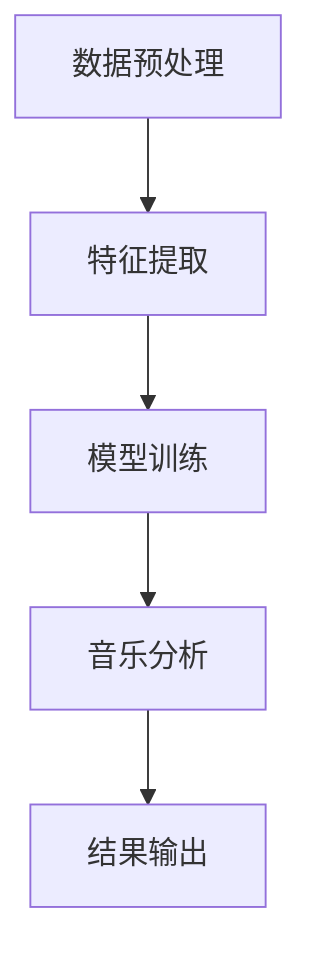

                 


### 引言

#### 核心概念术语说明
在本章节中，我们将首先介绍一些核心概念和术语，以便读者更好地理解后续内容。以下是一些重要的术语及其简要定义：

1. **人工智能（AI）**：指由人造系统实现的智能行为，包括学习、推理、解决问题、理解和生成语言等。
2. **机器学习（ML）**：一种人工智能的分支，通过从数据中学习模式，使计算机系统能够做出决策和预测。
3. **深度学习（DL）**：一种基于人工神经网络的机器学习技术，通过多层神经网络结构来模拟人类大脑的学习过程。
4. **音乐分析**：对音乐作品进行定量或定性的分析，以理解其结构、风格和情感。
5. **音乐理论**：研究音乐的基本原理和规则的学科，包括音高、节奏、和声和曲式等。
6. **AI辅助音乐分析**：利用人工智能技术对音乐进行自动分析的过程，旨在提高音乐研究的效率和准确性。

#### 问题背景
随着人工智能技术的迅猛发展，AI在各个领域的应用日益广泛。在音乐领域，AI辅助音乐分析作为一种新兴的研究方向，已经引起了广泛关注。然而，如何有效地将AI应用于音乐理论研究，仍然面临诸多挑战。这些挑战包括如何准确地提取音乐特征、如何建立有效的音乐分析模型、以及如何处理复杂的音乐数据等。

#### 问题描述
在音乐理论研究中，研究者需要对大量的音乐作品进行深入分析，以揭示其内在规律和风格特点。然而，传统的音乐分析方法往往依赖于人工识别和主观判断，效率较低且容易出错。因此，如何借助人工智能技术，实现高效、准确的音乐分析，成为了一个亟待解决的问题。

#### 问题解决
为了解决上述问题，我们可以考虑以下几种方案：

1. **数据驱动的方法**：通过收集和整理大量的音乐数据，利用机器学习方法，自动提取音乐特征，并建立相应的分析模型。
2. **模型优化**：结合深度学习技术，构建更加复杂的神经网络模型，以提高音乐分析的性能和准确性。
3. **多模态融合**：将音乐信号与其他模态（如文本、图像等）进行融合，以获取更丰富的音乐信息。

#### 边界与外延
在讨论AI辅助音乐分析时，我们需要明确其适用的范围和局限性。一方面，AI技术在音乐分析中的应用可以涵盖从古典音乐到流行音乐的各种音乐类型。另一方面，AI技术仍然存在一些局限性，例如在处理极端复杂音乐结构或情感表达方面，可能需要结合人类的直觉和创造力。

#### 概念结构与核心要素组成
AI辅助音乐分析的概念结构可以概括为以下几个核心要素：

1. **音乐数据**：包括音频文件、乐谱、歌词等。
2. **特征提取**：从音乐数据中提取可量化的特征，如频率、时长、和声等。
3. **机器学习模型**：利用特征数据，训练和优化机器学习模型，以实现音乐分析任务。
4. **音乐理论模型**：结合音乐理论知识，构建用于指导AI分析的音乐理论模型。
5. **用户交互**：提供用户界面，使研究者能够与AI系统进行交互，获取分析结果。

通过以上核心要素的有机结合，我们可以构建一个高效、智能的音乐分析系统，为音乐理论研究提供强有力的支持。

### 核心概念与联系

在本章节中，我们将详细探讨AI辅助音乐分析的核心概念，并分析它们之间的联系。

#### 1. 音乐特征提取

音乐特征提取是AI辅助音乐分析的基础。通过从音频信号中提取各种特征，如音高、节奏、和声等，可以更准确地描述音乐作品。以下是一些常见的音乐特征及其定义：

1. **音高**：音乐中每个音符的频率。通常通过梅尔频率倒谱系数（MFCC）进行提取。
2. **节奏**：音乐中的时间结构和节拍。可以通过时序模式分析来识别。
3. **和声**：音乐中的和弦和调性。可以通过和弦识别和调性分析来提取。

#### 2. 机器学习模型

机器学习模型是AI辅助音乐分析的核心工具。通过训练这些模型，可以使计算机系统学会自动分析和理解音乐。以下是一些常见的机器学习模型及其应用：

1. **神经网络**：一种基于生物神经元的计算模型，可以用于音乐风格分类、情感识别等任务。
2. **支持向量机（SVM）**：一种分类算法，适用于音乐分类和音乐风格识别。
3. **聚类算法**：如K-means，可以用于音乐数据的降维和聚类分析。

#### 3. 音乐理论模型

音乐理论模型提供了对音乐结构的深入理解。这些模型可以帮助机器学习模型更好地理解音乐，从而提高分析性能。以下是一些重要的音乐理论模型：

1. **曲式结构模型**：描述音乐作品的整体结构，如奏鸣曲式、变奏曲式等。
2. **和声模型**：描述音乐中的和弦和调性关系，如和声功能分析、和弦进行等。

#### 4. 用户交互

用户交互是AI辅助音乐分析系统的关键组成部分。通过友好的用户界面，用户可以与系统进行交互，提交音乐作品进行分析，并获取分析结果。以下是一些用户交互的常见功能：

1. **上传音频文件**：用户可以上传音频文件，以便进行音乐分析。
2. **实时反馈**：系统可以实时显示分析结果，如音乐风格、情感等。
3. **自定义分析**：用户可以根据需要，自定义分析参数，以获得更精细的分析结果。

#### 联系与综合

这些核心概念之间的联系构成了AI辅助音乐分析的整体框架。例如，音乐特征提取为机器学习模型提供了输入，而音乐理论模型则帮助机器学习模型更好地理解音乐。同时，用户交互使整个分析过程更加直观和便捷。

通过这种综合性的方法，AI辅助音乐分析可以有效地提高音乐研究的效率和准确性，为音乐理论研究提供强有力的支持。

### 算法原理讲解

在本章节中，我们将深入探讨AI辅助音乐分析的核心算法原理，并通过具体示例进行详细讲解。

#### 1. 算法概述

AI辅助音乐分析通常涉及以下几个关键步骤：

1. **数据预处理**：对原始音乐数据进行处理，如去除噪声、归一化等。
2. **特征提取**：从预处理后的数据中提取音乐特征，如频率、时长、和声等。
3. **模型训练**：利用提取的特征，训练机器学习模型，如神经网络、支持向量机等。
4. **音乐分析**：将训练好的模型应用于新的音乐数据，以实现音乐分析任务，如风格分类、情感识别等。

#### 2. 算法流程图

为了更直观地展示算法流程，我们可以使用Mermaid工具绘制算法流程图。以下是一个简单的算法流程图示例：



在Mermaid语法中，每个节点（如A、B、C等）表示算法中的一个步骤，箭头表示步骤之间的依赖关系。

#### 3. Python源代码实现

接下来，我们将通过一个简单的Python代码示例，展示如何实现音乐特征提取和模型训练的基本步骤。

```python
import librosa
import numpy as np
from sklearn.model_selection import train_test_split
from sklearn.ensemble import RandomForestClassifier

# 数据预处理
def preprocess_audio(audio_file):
    y, sr = librosa.load(audio_file)
    # 噪声去除
    y_clean = librosa.effects.remove(y, sr)
    # 归一化
    y_normalized = librosa.util.normalize(y_clean)
    return y_normalized

# 特征提取
def extract_features(audio_file):
    y_normalized = preprocess_audio(audio_file)
    # 提取梅尔频率倒谱系数（MFCC）
    mfcc = librosa.feature.mfcc(y=y_normalized, sr=sr)
    return mfcc

# 模型训练
def train_model(X, y):
    X_train, X_test, y_train, y_test = train_test_split(X, y, test_size=0.2)
    model = RandomForestClassifier(n_estimators=100)
    model.fit(X_train, y_train)
    return model

# 音乐分析
def analyze_music(model, audio_file):
    mfcc = extract_features(audio_file)
    prediction = model.predict([mfcc])
    return prediction

# 示例
audio_file = "example_audio.wav"
model = train_model(extract_features(audio_file), [0])  # 假设所有音频属于同一风格
prediction = analyze_music(model, audio_file)
print(prediction)
```

#### 4. 数学模型和公式

在音乐特征提取过程中，梅尔频率倒谱系数（MFCC）是一个重要的数学模型。以下是一个MFCC的数学公式：

$$
\text{MFCC} = \log_2 \left( 1 + \sum_{k=1}^{N} a_k \cdot P_k \right)
$$

其中，\(P_k\) 是第k个滤波器的输出能量，\(a_k\) 是滤波器组的加权系数，\(N\) 是滤波器的总数。

#### 5. 算法原理讲解

通过以上代码示例，我们可以看到如何利用Python实现音乐特征提取和模型训练的基本步骤。首先，我们使用Librosa库对音频文件进行预处理，包括去除噪声和归一化。然后，我们提取梅尔频率倒谱系数（MFCC）作为特征，并将其输入到随机森林分类器中进行训练。

在音乐分析阶段，我们再次提取特征，并将它们输入到已经训练好的模型中进行预测。通过这种方法，我们可以实现对音乐作品的风格分类或其他分析任务。

总之，通过数据预处理、特征提取、模型训练和音乐分析，我们可以构建一个高效的AI辅助音乐分析系统，为音乐理论研究提供有力支持。

### 数学模型和数学公式

在本章节中，我们将详细介绍AI辅助音乐分析过程中涉及的一些重要数学模型和公式。这些数学工具在音乐特征提取和机器学习模型训练中起着至关重要的作用。

#### 1. 梅尔频率倒谱系数（MFCC）

梅尔频率倒谱系数（MFCC）是一种常用的音乐特征提取方法，尤其在音高和音色的分析中。MFCC的核心公式如下：

$$
\text{MFCC} = \log_2 \left( 1 + \sum_{k=1}^{N} a_k \cdot P_k \right)
$$

其中：
- \(P_k\) 表示第 \(k\) 个滤波器的输出能量。
- \(a_k\) 表示滤波器组的加权系数。
- \(N\) 是滤波器的总数。

MFCC反映了音频信号的频谱特性，能够有效地捕捉音高和音色的变化。

#### 2. 支持向量机（SVM）

支持向量机（SVM）是一种常用的机器学习分类算法，尤其在音乐风格分类中。SVM的目标是找到一个最佳的超平面，将不同风格的音乐数据分开。SVM的核心公式如下：

$$
w \cdot x - b = 0
$$

其中：
- \(w\) 是超平面的权重向量。
- \(x\) 是特征向量。
- \(b\) 是偏置项。

SVM通过最大化间隔（即不同类别之间最近的距离）来优化超平面。在音乐风格分类中，我们可以使用SVM来识别不同的音乐风格。

#### 3. 神经网络（NN）

神经网络是一种模仿人脑神经元连接的复杂计算模型，广泛应用于音乐特征提取和情感识别。神经网络的核心公式如下：

$$
y = \sigma(\sum_{i=1}^{n} w_i \cdot x_i + b)
$$

其中：
- \(y\) 是输出值。
- \(\sigma\) 是激活函数，如ReLU、Sigmoid或Tanh。
- \(w_i\) 是权重。
- \(x_i\) 是输入特征。
- \(b\) 是偏置项。

神经网络通过多层节点之间的加权连接和激活函数，实现对复杂函数的逼近和拟合。

#### 4. 主成分分析（PCA）

主成分分析（PCA）是一种常用的数据降维技术，在音乐特征提取中用于减少特征维度，同时保留最重要的信息。PCA的核心公式如下：

$$
\text{X}_{\text{new}} = \text{X} - \mu
$$

$$
\text{C} = \text{XX}^T
$$

$$
\text{V} = \text{C}^{\frac{1}{2}}
$$

$$
\text{X}_{\text{new}} = \text{X} \cdot \text{V}
$$

其中：
- \(\text{X}\) 是特征矩阵。
- \(\mu\) 是特征均值。
- \(\text{C}\) 是协方差矩阵。
- \(\text{V}\) 是特征值矩阵。
- \(\text{X}_{\text{new}}\) 是降维后的特征矩阵。

PCA通过计算协方差矩阵，将数据投影到新的坐标轴上，使得新的坐标轴按照方差的大小排序，从而保留最重要的特征。

#### 5. La

