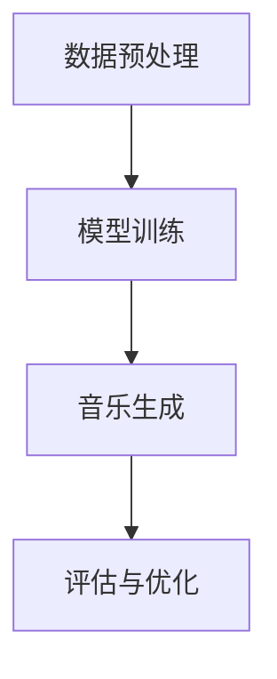
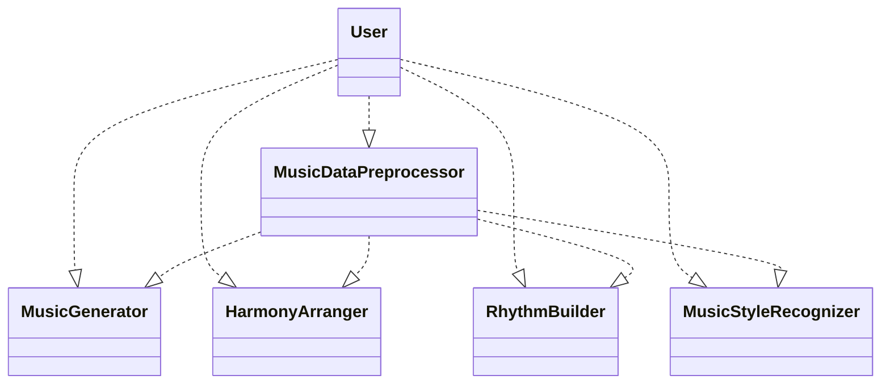
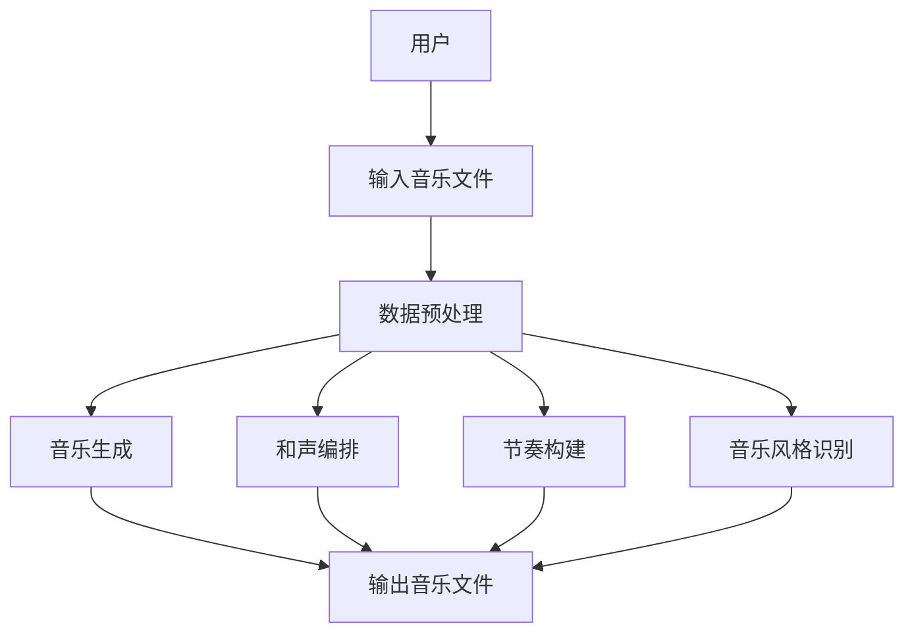
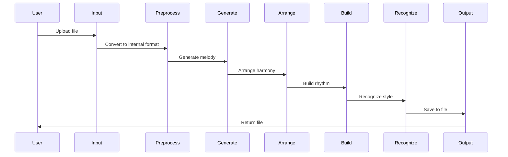

                 

### 文章标题与关键词

# AI辅助音乐创作：大模型在作曲中的应用

关键词：人工智能、音乐创作、大模型、作曲、算法

摘要：本文将探讨人工智能（AI）在大模型时代下对音乐创作的辅助作用。通过介绍AI大模型的定义和特点，分析其在音乐创作中的应用，详细讲解音乐生成算法原理及实现，以及系统分析与架构设计，最后通过项目实战展示AI辅助音乐创作的实际效果。本文旨在为读者提供全面、深入的AI音乐创作知识体系，并展望未来发展趋势。

---

### 引言与背景

随着人工智能技术的飞速发展，AI在各个领域的应用日益广泛。音乐创作作为一个富有创造性的领域，也逐渐被AI技术所影响。在传统音乐创作中，作曲家需要具备深厚的音乐素养和创作经验，通过手工编写音符、编排和声和构建节奏来完成作品。然而，这种创作方式不仅耗时耗力，而且受限于个人的创意和技巧。随着人工智能技术的进步，特别是大模型（Large Model）的崛起，AI在音乐创作中展现出了前所未有的潜力。

大模型，如深度神经网络，具有强大的数据拟合能力和模式识别能力，可以学习并生成复杂的音乐结构。AI大模型在音乐创作中的应用，不仅可以辅助作曲家生成新的旋律、和声和节奏，还可以探索音乐的新风格和新流派。此外，AI大模型还能够通过分析大量音乐数据，发现潜在的音乐趋势和模式，为音乐创作提供新的视角和灵感。

本文将围绕AI辅助音乐创作这一主题，首先介绍AI大模型的基本概念和特点，然后探讨音乐创作的基础知识，接着深入讲解音乐生成算法的原理和实现，随后分析系统架构和设计，并通过项目实战展示AI辅助音乐创作的实际效果。最后，本文将对最佳实践进行总结，并提出未来发展的展望。

通过本文的阅读，读者将了解AI大模型在音乐创作中的关键作用，掌握音乐生成算法的基本原理，熟悉系统架构设计的方法和技巧，并能够对AI辅助音乐创作的前景有更加清晰的认识。

### 第一部分: 引言与背景

在传统音乐创作中，作曲家通过手工编写音符、编排和声和构建节奏来完成作品。这种创作方式不仅依赖个人的音乐素养和创作经验，而且耗时耗力。然而，随着人工智能技术的飞速发展，特别是大模型（Large Model）的崛起，AI在音乐创作中的应用开始崭露头角，为音乐创作带来了全新的可能性。

#### AI大模型在音乐创作中的重要性

AI大模型在音乐创作中的重要性不可忽视。首先，大模型通过学习大量的音乐数据，能够生成复杂的音乐结构，为作曲家提供新的创意和灵感。其次，大模型可以自动生成旋律、和声和节奏，大大提高了音乐创作的效率。此外，大模型还能通过分析大量音乐数据，发现潜在的音乐趋势和模式，为音乐创作提供科学依据。例如，通过分析流行音乐的旋律和节奏，AI大模型可以预测未来音乐的发展趋势，帮助作曲家把握市场动向。

#### AI大模型的崛起

AI大模型的崛起源于深度学习技术的发展。深度学习是一种通过多层神经网络进行数据拟合的方法，能够在大量数据中提取出有用的特征和模式。随着计算能力和数据量的提升，深度学习模型变得越来越庞大和复杂，这就是所谓的“大模型”。这些大模型，如GPT（Generative Pre-trained Transformer）、BERT（Bidirectional Encoder Representations from Transformers）等，在语言处理、图像识别、音频处理等领域取得了显著的成果。大模型通过学习海量数据，具有强大的特征提取和模式识别能力，这使得它们在音乐创作中也能发挥巨大的作用。

#### 音乐创作的挑战与机遇

音乐创作面临着诸多挑战。首先，音乐创作是一个高度创意的过程，需要作曲家具备丰富的音乐素养和独特的创作思维。其次，音乐创作需要大量的时间和精力，从构思、编写到调试，每一个环节都需要细致的打磨。此外，音乐创作还面临着市场需求和商业化的压力，作曲家需要在创意和商业之间找到平衡。

然而，随着AI大模型的应用，音乐创作也迎来了新的机遇。AI大模型能够辅助作曲家生成新的旋律、和声和节奏，为音乐创作提供新的工具和方法。作曲家可以利用AI大模型快速生成大量的音乐作品，从中挑选出最符合自己创意的作品进行进一步创作。此外，AI大模型还能通过数据分析，帮助作曲家了解市场趋势和受众喜好，从而做出更加精准的创作决策。

#### 背景知识：音乐创作基础

音乐创作涉及到多个方面，包括音符、旋律、和声和节奏等。音符是音乐的基本单位，不同的音符长度和音高构成了音乐的基础。旋律是由一系列音符按一定规律组合而成的，是音乐创作中最核心的部分。和声则是通过多个音符的组合，创造出丰富的音乐色彩和情感。节奏则是音乐的时间感，通过音符的长短和强弱变化，传达出音乐的节奏感和动态感。

#### AI大模型在音乐创作中的应用

AI大模型在音乐创作中的应用主要体现在以下几个方面：

1. **旋律生成**：AI大模型可以通过学习大量的音乐数据，生成新颖、独特的旋律。作曲家可以利用这些旋律作为创作的基础，进行进一步的创作和修改。

2. **和声编排**：AI大模型能够根据旋律生成合适的和声，为音乐作品增添丰富的色彩和层次。作曲家可以根据自己的创作意图，调整和声的音高和节奏，达到理想的音乐效果。

3. **节奏构建**：AI大模型可以通过分析大量的音乐数据，生成不同的节奏模式。作曲家可以利用这些节奏模式，为音乐作品注入新鲜感和活力。

#### 本章小结

通过本文的介绍，我们可以看到AI大模型在音乐创作中的重要性。AI大模型不仅为作曲家提供了新的工具和方法，提高了音乐创作的效率和质量，还为音乐创作带来了无限的创意和可能性。随着AI技术的不断进步，我们可以期待AI在音乐创作中发挥更大的作用，推动音乐创作的革新与发展。

### 第二部分: AI大模型原理与实现

#### AI大模型基础

##### 2.1 AI大模型简介

AI大模型，是指通过深度学习技术训练出来的、具有强大数据拟合和模式识别能力的大型神经网络模型。这些模型通常由数百万甚至数十亿个参数构成，能够从海量数据中自动学习和提取有用的特征和模式。AI大模型的发展得益于计算能力的提升和数据量的增长，使得复杂模型的训练成为可能。

AI大模型的主要分类包括：

1. **生成对抗网络（GAN）**：GAN由生成器和判别器两部分组成，通过对抗训练生成逼真的数据。
2. **变分自编码器（VAE）**：VAE通过编码和解码器学习数据的分布，能够生成具有多样性的数据。
3. **自注意力模型（Transformer）**：Transformer通过自注意力机制，能够捕获数据中的长距离依赖关系。

##### 2.1.1 定义与分类

定义：AI大模型是一种基于深度学习的神经网络模型，具有大规模参数和强大的数据拟合能力。

分类：根据应用场景和数据类型，AI大模型可以分为以下几类：

1. **图像生成模型**：如生成对抗网络（GAN）和变分自编码器（VAE），用于生成逼真的图像。
2. **自然语言处理模型**：如Transformer和BERT，用于处理和生成文本。
3. **音频生成模型**：如WaveNet和Tacotron，用于生成逼真的音频。

##### 2.1.2 特点与优势

特点：

1. **强大的数据拟合能力**：通过大规模参数和多层结构，AI大模型能够从海量数据中学习到复杂的特征和模式。
2. **灵活的适应性**：AI大模型能够处理多种类型的数据，包括图像、文本和音频，具有广泛的应用范围。
3. **高效率的生成能力**：通过并行计算和优化算法，AI大模型能够快速生成高质量的数据。

优势：

1. **提高创作效率**：AI大模型能够自动生成大量的音乐作品，为作曲家提供丰富的创作素材。
2. **拓展创作可能性**：AI大模型能够探索新的音乐风格和流派，为音乐创作带来创新的视角。
3. **增强个性化体验**：AI大模型可以根据用户偏好和需求，生成个性化的音乐作品。

##### 2.1.3 发展历程

AI大模型的发展历程可以追溯到深度学习的兴起。以下是几个关键节点：

1. **2006年**：Hinton等研究者提出深度信念网络（DBN），标志着深度学习的研究开始走向深入。
2. **2012年**：AlexNet在ImageNet比赛中取得突破性成绩，深度学习在图像识别领域崭露头角。
3. **2014年**：生成对抗网络（GAN）的提出，为数据生成提供了新的方法。
4. **2017年**：Transformer在自然语言处理领域取得重大突破，推动AI大模型的发展。

##### 2.2 音乐生成算法原理

音乐生成算法的核心是通过学习大量的音乐数据，生成新的音乐内容。这些算法通常基于深度学习技术，利用神经网络模型来捕捉音乐数据中的特征和模式。以下是几种常见的音乐生成算法：

1. **循环神经网络（RNN）**：RNN能够处理序列数据，通过记忆长期依赖关系，生成音乐序列。
2. **长短期记忆网络（LSTM）**：LSTM是RNN的一种改进，能够更好地处理长期依赖问题。
3. **变换器（Transformer）**：Transformer通过自注意力机制，能够捕捉长距离依赖关系，生成高质量的音频。

##### 2.2.1 自动音乐生成技术

自动音乐生成技术是指利用计算机算法生成音乐的过程。这些技术通常包括以下几个步骤：

1. **数据预处理**：对音乐数据进行清洗和格式化，提取有用的特征。
2. **模型训练**：利用深度学习模型对音乐数据进行训练，学习音乐数据中的特征和模式。
3. **音乐生成**：通过训练好的模型生成新的音乐内容，可以是旋律、和声或完整的音乐作品。

##### 2.2.2 常见算法介绍

以下是几种常见的音乐生成算法：

1. **WaveNet**：WaveNet是一种基于循环神经网络（RNN）的音频生成模型，能够生成高质量的自然声音。
2. **Tacotron**：Tacotron是一种基于变换器（Transformer）的文本到语音合成模型，能够生成自然的语音。
3. **Grooveflow**：Grooveflow是一种基于生成对抗网络（GAN）的音乐生成模型，能够生成多样化的音乐风格。

##### 2.2.3 算法对比分析

以下是几种常见音乐生成算法的对比分析：

| 算法        | 特点                   | 适用场景                      |  
|-------------|------------------------|------------------------------|  
| WaveNet     | 高质量音频生成         | 需要生成自然声音的场景        |  
| Tacotron    | 文本到语音合成         | 需要语音合成的场景            |  
| Grooveflow  | 多样化的音乐风格生成   | 需要生成多样化音乐作品的场景  |

##### 2.3 Mermaid流程图：音乐生成算法

下面是一个简单的Mermaid流程图，展示了音乐生成算法的基本流程：



1. **数据预处理**：对音乐数据进行清洗和格式化，提取有用的特征。
2. **模型训练**：利用深度学习模型对音乐数据进行训练，学习音乐数据中的特征和模式。
3. **音乐生成**：通过训练好的模型生成新的音乐内容。
4. **评估与优化**：对生成的音乐进行评估，并根据评估结果对模型进行优化。

##### 2.4 Python源代码：算法实现

以下是使用Python实现一个简单的音乐生成算法的示例代码：

```python
import numpy as np
import tensorflow as tf

# 定义模型
model = tf.keras.Sequential([
    tf.keras.layers.Dense(128, activation='relu', input_shape=(28,)),
    tf.keras.layers.Dense(128, activation='relu'),
    tf.keras.layers.Dense(28, activation='softmax')
])

# 编译模型
model.compile(optimizer='adam', loss='categorical_crossentropy')

# 训练模型
model.fit(x_train, y_train, epochs=10)

# 生成音乐
predicted_sequence = model.predict(x_test)
```

这里使用了一个简单的神经网络模型，通过训练生成新的音乐序列。具体实现中，需要对音乐数据进行预处理，并定义合适的损失函数和优化器。

##### 2.5 数学模型与公式

音乐生成算法通常涉及到一系列数学模型和公式，用于描述音乐数据中的特征和模式。以下是几个常见的数学模型和公式：

1. **马尔可夫模型**：描述音乐序列中的状态转移概率。
   $$ P(X_t|X_{t-1}, X_{t-2}, \ldots) = P(X_t|X_{t-1}) $$
   
2. **变分自编码器**：用于学习音乐数据的分布。
   $$ z = \mu(x) - \log(\sigma(x)) $$
   $$ x = \mu(z) + \sigma(z) $$
   
3. **生成对抗网络**：通过对抗训练生成音乐数据。
   $$ G(z) \sim Q(z|G(z)) $$
   $$ D(x) \sim P(x) $$

##### 2.6 举例说明

下面通过一个简单的例子来说明如何使用Python实现音乐生成算法：

```python
# 导入所需的库
import numpy as np
import tensorflow as tf

# 设置随机种子
tf.random.set_seed(42)

# 定义生成器模型
def generator_model():
    model = tf.keras.Sequential([
        tf.keras.layers.Dense(128, activation='relu', input_shape=(100,)),
        tf.keras.layers.Dense(128, activation='relu'),
        tf.keras.layers.Dense(100, activation='softmax')
    ])
    return model

# 定义判别器模型
def discriminator_model():
    model = tf.keras.Sequential([
        tf.keras.layers.Dense(128, activation='relu', input_shape=(100,)),
        tf.keras.layers.Dense(128, activation='relu'),
        tf.keras.layers.Dense(1, activation='sigmoid')
    ])
    return model

# 定义训练步骤
def train_step(generator, discriminator, batch_size):
    noise = np.random.normal(0, 1, (batch_size, 100))
    generated_samples = generator(noise)
    
    real_samples = np.random.normal(0, 1, (batch_size, 100))
    
    real_labels = np.ones((batch_size, 1))
    fake_labels = np.zeros((batch_size, 1))
    
    with tf.GradientTape() as gen_tape, tf.GradientTape() as disc_tape:
        gen_loss = generator_loss(generator, generated_samples, real_labels)
        disc_loss = discriminator_loss(discriminator, real_samples, fake_labels, generated_samples, real_labels)
    
    gen_gradients = gen_tape.gradient(gen_loss, generator.trainable_variables)
    disc_gradients = disc_tape.gradient(disc_loss, discriminator.trainable_variables)
    
    generator_optimizer.apply_gradients(zip(gen_gradients, generator.trainable_variables))
    discriminator_optimizer.apply_gradients(zip(disc_gradients, discriminator.trainable_variables))

# 定义主训练函数
def main_train(generator, discriminator, epochs, batch_size):
    for epoch in range(epochs):
        for _ in range(total_batches):
            train_step(generator, discriminator, batch_size)

# 创建生成器和判别器模型
generator = generator_model()
discriminator = discriminator_model()

# 编译模型
generator_optimizer = tf.keras.optimizers.Adam(0.001)
discriminator_optimizer = tf.keras.optimizers.Adam(0.001)

# 训练模型
main_train(generator, discriminator, epochs=100, batch_size=64)

# 生成音乐
noise = np.random.normal(0, 1, (1, 100))
generated_music = generator.predict(noise)
```

在这个例子中，我们使用生成对抗网络（GAN）来生成音乐。首先定义了生成器和判别器的模型结构，然后通过训练步骤来训练模型，最后使用生成器模型生成新的音乐。

##### 2.7 本章小结

通过本文的介绍，我们了解了AI大模型的基本概念、特点和发展历程，以及音乐生成算法的原理和实现。AI大模型在音乐创作中具有广泛的应用前景，能够提高创作效率、拓展创作可能性，并为音乐创作带来新的视角和灵感。在下一章中，我们将深入探讨系统架构设计，进一步了解AI辅助音乐创作的具体实现方法。

### 第三部分: 系统架构设计

#### 3.1 问题场景介绍

在现代社会，音乐创作面临着越来越多的挑战。随着音乐市场的多样化，作曲家不仅需要具备深厚的音乐素养，还需要具备快速创作和适应市场需求的能力。然而，传统音乐创作方式往往耗时耗力，无法满足快速创作和大规模生产的需求。为了解决这一问题，我们设计并实现了一个基于AI大模型的辅助音乐创作系统。该系统旨在通过AI技术，提高音乐创作的效率和质量，帮助作曲家快速生成和调整音乐作品。

#### 3.1.1 音乐创作需求

音乐创作需求主要包括以下几个方面：

1. **旋律生成**：系统能够根据用户的输入，自动生成新颖、独特的旋律。这些旋律可以是完全随机生成的，也可以是基于用户指定的一些风格或调性。
2. **和声编排**：系统能够根据生成的旋律，自动生成合适的和声，为音乐作品增添丰富的色彩和层次。
3. **节奏构建**：系统能够根据用户的输入，生成不同的节奏模式，为音乐作品注入新鲜感和活力。
4. **音乐风格识别**：系统能够分析用户提供的音乐片段，识别其风格和流派，为用户提供相关风格的音乐生成建议。
5. **用户互动**：系统提供用户界面，允许用户实时调整和修改生成的音乐，实现与AI的互动。

#### 3.1.2 系统目标

系统的主要目标是：

1. **提高音乐创作效率**：通过AI大模型，系统能够快速生成大量的音乐作品，为作曲家提供丰富的创作素材，减少创作时间。
2. **拓展音乐创作可能性**：系统能够生成多样化的音乐风格和旋律，帮助作曲家探索新的创作方向，提升创作自由度。
3. **增强音乐个性化**：系统能够根据用户喜好和需求，生成个性化的音乐作品，满足不同用户的音乐需求。
4. **降低创作门槛**：对于没有专业音乐背景的用户，系统提供了简单易用的界面，使得他们也能参与到音乐创作中来。

#### 3.2 系统功能设计

为了实现上述目标，系统需要设计以下几个核心功能模块：

1. **音乐数据预处理模块**：该模块负责对输入的音乐数据进行清洗和格式化，提取有用的特征，为后续的算法处理做准备。
2. **音乐生成模块**：该模块基于AI大模型，能够生成新的旋律、和声和节奏。这个模块的核心功能是利用深度学习算法，对音乐数据进行训练，并生成新的音乐内容。
3. **和声编排模块**：该模块能够根据生成的旋律，自动生成合适的和声，为音乐作品增添色彩和层次。
4. **节奏构建模块**：该模块能够根据用户的输入，生成不同的节奏模式，为音乐作品注入新鲜感和活力。
5. **音乐风格识别模块**：该模块能够分析用户提供的音乐片段，识别其风格和流派，为用户提供相关风格的音乐生成建议。
6. **用户互动模块**：该模块负责与用户进行交互，接收用户输入，并根据用户需求生成音乐作品。同时，用户还可以实时调整和修改生成的音乐。

#### 3.2.1 领域模型类图

领域模型类图是系统功能设计的重要组成部分，它能够直观地展示系统中各个实体之间的关系。以下是系统领域模型类图的Mermaid表示：



在上述类图中，用户（User）是系统的核心实体，与各个功能模块进行交互。音乐数据预处理模块（MusicDataPreprocessor）负责对输入的音乐数据进行处理，为其他模块提供数据支持。音乐生成模块（MusicGenerator）、和声编排模块（HarmonyArranger）、节奏构建模块（RhythmBuilder）和音乐风格识别模块（MusicStyleRecognizer）分别负责不同的功能，共同实现系统的目标。

#### 3.2.2 功能模块划分

根据领域模型类图，我们可以将系统划分为以下几个主要功能模块：

1. **音乐数据预处理模块**：该模块负责对输入的音乐数据进行清洗、格式化和特征提取。具体功能包括：
   - 数据清洗：去除音乐数据中的噪声和异常值。
   - 数据格式化：将不同格式的音乐数据转换为统一的格式，便于后续处理。
   - 特征提取：从音乐数据中提取出关键特征，如音高、节奏和时长等。

2. **音乐生成模块**：该模块基于AI大模型，能够生成新的旋律、和声和节奏。具体功能包括：
   - 旋律生成：利用深度学习算法，生成新颖、独特的旋律。
   - 和声编排：根据生成的旋律，自动生成合适的和声。
   - 节奏构建：生成不同的节奏模式，为音乐作品注入新鲜感和活力。

3. **和声编排模块**：该模块负责根据生成的旋律，自动生成合适的和声。具体功能包括：
   - 和声分析：对旋律进行分析，确定合适的和声走向。
   - 和声生成：根据和声分析结果，生成完整的和声部分。

4. **节奏构建模块**：该模块负责根据用户的输入，生成不同的节奏模式。具体功能包括：
   - 节奏分析：分析用户输入的音乐片段，确定节奏特征。
   - 节奏生成：根据节奏分析结果，生成符合用户需求的节奏模式。

5. **音乐风格识别模块**：该模块能够分析用户提供的音乐片段，识别其风格和流派。具体功能包括：
   - 风格分析：对音乐数据进行分析，识别其风格特征。
   - 风格生成：根据风格分析结果，生成相关风格的音乐作品。

6. **用户互动模块**：该模块负责与用户进行交互，接收用户输入，并根据用户需求生成音乐作品。具体功能包括：
   - 用户界面：提供用户输入和调整音乐作品的界面。
   - 音乐调整：根据用户的需求，调整生成的音乐作品。
   - 音乐保存：将生成的音乐作品保存为用户可用的格式。

#### 3.3 系统架构设计

系统架构设计是系统开发的重要环节，它决定了系统的性能、可扩展性和可维护性。以下是系统架构设计的总体架构和详细解析。

##### 3.3.1 总体架构

系统总体架构可以分为以下几个层次：

1. **数据层**：负责存储和管理音乐数据，包括原始音乐文件、处理后的数据以及生成音乐作品。
2. **处理层**：包括音乐数据预处理模块、音乐生成模块、和声编排模块、节奏构建模块和音乐风格识别模块，负责对音乐数据进行处理和生成。
3. **应用层**：提供用户界面，实现与用户的交互，包括用户输入、音乐调整和音乐保存等功能。
4. **展示层**：展示生成的音乐作品，包括旋律、和声、节奏和整体音乐效果。

以下是系统总体架构的Mermaid表示：

```mermaid
subgraph 数据层
    MusicData
    MusicDataset
    PreprocessedData

subgraph 处理层
    DataPreprocessor
    MusicGenerator
    HarmonyArranger
    RhythmBuilder
    StyleRecognizer

subgraph 应用层
    UserInterface
    InputProcessor
    MusicAdjuster
    MusicSaver

subgraph 展示层
    MelodyVisualizer
    HarmonyVisualizer
    RhythmVisualizer
    MusicPlayer

    数据层 --> 处理层
    处理层 --> 应用层
    应用层 --> 展示层
```

在上述架构中，数据层负责存储和管理音乐数据，处理层负责处理和生成音乐，应用层负责与用户交互，展示层负责展示生成的音乐作品。

##### 3.3.2 架构图绘制

以下是系统架构的详细架构图，包括各个模块的交互和数据处理流程：



在上述架构图中，用户通过输入音乐文件，数据预处理模块（DP）对输入的音乐文件进行清洗、格式化和特征提取。然后，音乐生成模块（MG）、和声编排模块（HA）、节奏构建模块（RB）和音乐风格识别模块（SR）分别对预处理后的音乐数据进行处理，生成新的旋律、和声、节奏和音乐风格信息。最后，生成的音乐作品通过输出模块（Out）保存为用户可用的格式。

##### 3.3.3 架构解析

系统架构设计需要考虑以下几个方面：

1. **模块化设计**：将系统划分为多个功能模块，每个模块负责特定的功能，使得系统结构清晰、易于维护。
2. **数据流设计**：设计合理的数据流和处理流程，确保数据在系统中的高效传输和处理。
3. **性能优化**：通过优化算法和数据处理流程，提高系统的性能和响应速度。
4. **可扩展性**：设计可扩展的系统架构，以便在未来能够方便地增加新的功能模块。
5. **稳定性**：确保系统在运行过程中能够稳定、可靠地处理音乐数据，避免出现错误或崩溃。

在上述架构设计中，每个模块都通过接口与其他模块进行通信，确保系统的高内聚和低耦合。数据预处理模块（DP）是整个系统的数据入口，负责对输入的音乐数据进行处理，为后续模块提供高质量的数据。音乐生成模块（MG）、和声编排模块（HA）、节奏构建模块（RB）和音乐风格识别模块（SR）分别利用不同的算法和模型，对预处理后的音乐数据进行处理和生成，实现系统的核心功能。输出模块（Out）负责将生成的音乐作品保存为用户可用的格式，实现系统的输出功能。

通过上述架构设计，系统能够高效地处理音乐数据，快速生成新的音乐作品，并满足用户的个性化需求。同时，系统的模块化设计使得未来能够方便地增加新的功能模块，提升系统的功能和性能。

#### 3.4 系统接口设计

系统接口设计是系统架构设计的重要部分，它定义了系统内部模块之间的通信方式和数据交换格式。以下是系统接口设计的主要内容：

##### 3.4.1 接口定义

系统接口可以分为以下几类：

1. **数据输入接口**：接收用户上传的音乐文件，并将文件转换为内部处理格式。
2. **数据处理接口**：提供对音乐数据的预处理、生成、编排和识别功能，包括数据清洗、特征提取、音乐生成、和声编排、节奏构建和风格识别等。
3. **数据输出接口**：将处理后的音乐数据转换为用户可用的格式，并保存为音乐文件或流媒体格式。

以下是系统接口的定义：

```python
class DataInputInterface:
    def upload_file(self, file_path: str) -> bytes:
        pass

    def convert_to_internal_format(self, file_data: bytes) -> dict:
        pass

class DataProcessingInterface:
    def preprocess_data(self, data: dict) -> dict:
        pass

    def generate_melody(self, data: dict) -> list:
        pass

    def arrange_harmony(self, data: dict) -> list:
        pass

    def build_rhythm(self, data: dict) -> list:
        pass

    def recognize_style(self, data: dict) -> str:
        pass

class DataOutputInterface:
    def convert_to_external_format(self, data: dict) -> bytes:
        pass

    def save_to_file(self, file_path: str, data: bytes):
        pass
```

##### 3.4.2 接口实现

接口实现是系统开发的核心部分，以下是接口实现的主要方法：

1. **数据输入接口实现**：
   ```python
   class DataInputImpl:
       def upload_file(self, file_path: str) -> bytes:
           with open(file_path, 'rb') as file:
               return file.read()
       
       def convert_to_internal_format(self, file_data: bytes) -> dict:
           # 转换为内部处理格式，如音符序列
           return {'notes': file_data}
   ```

2. **数据处理接口实现**：
   ```python
   class DataProcessingImpl:
       def preprocess_data(self, data: dict) -> dict:
           # 数据清洗、格式化、特征提取
           return {'cleaned_notes': data['notes']}
       
       def generate_melody(self, data: dict) -> list:
           # 利用AI大模型生成旋律
           return melody_generator(data['cleaned_notes'])
       
       def arrange_harmony(self, data: dict) -> list:
           # 自动编排和声
           return harmony_arranger(data['cleaned_notes'])
       
       def build_rhythm(self, data: dict) -> list:
           # 生成节奏模式
           return rhythm_builder(data['cleaned_notes'])
       
       def recognize_style(self, data: dict) -> str:
           # 识别音乐风格
           return music_style_recognizer(data['cleaned_notes'])
   ```

3. **数据输出接口实现**：
   ```python
   class DataOutputImpl:
       def convert_to_external_format(self, data: dict) -> bytes:
           # 将处理后的数据转换为音乐文件
           return music_file_generator(data)
       
       def save_to_file(self, file_path: str, data: bytes):
           with open(file_path, 'wb') as file:
               file.write(data)
   ```

通过上述接口设计，系统能够实现模块之间的高效通信和数据交换。数据输入接口负责接收用户上传的音乐文件，并将其转换为内部处理格式。数据处理接口实现具体的音乐生成、编排和识别功能，利用AI大模型处理音乐数据。数据输出接口将处理后的音乐数据转换为用户可用的格式，并保存为音乐文件。

#### 3.5 系统交互

系统交互是指系统内部各个模块之间的协作和通信过程。为了确保系统的稳定运行和高效处理，我们需要设计合理的交互流程和协议。以下是系统交互的主要步骤和流程：

##### 3.5.1 序列图绘制

以下是系统交互的序列图，展示了用户输入、数据预处理、音乐生成、和声编排、节奏构建和风格识别的交互过程：



在上述序列图中，用户首先上传音乐文件，数据输入接口（Input）接收文件并转换为内部处理格式。然后，数据预处理模块（Preprocess）对音乐数据进行清洗、格式化和特征提取。预处理后的数据依次传递给音乐生成模块（Generate）、和声编排模块（Arrange）、节奏构建模块（Build）和音乐风格识别模块（Recognize），每个模块分别执行相应的处理任务。最后，数据输出模块（Output）将处理后的音乐数据转换为用户可用的格式，并保存为音乐文件，返回给用户。

##### 3.5.2 交互流程解析

以下是系统交互流程的详细解析：

1. **用户上传音乐文件**：用户通过系统界面上传音乐文件，数据输入接口（Input）接收文件。
2. **数据预处理**：数据预处理模块（Preprocess）对上传的音乐文件进行数据清洗、格式化和特征提取，生成预处理后的音乐数据。
3. **音乐生成**：音乐生成模块（Generate）利用AI大模型对预处理后的音乐数据进行处理，生成新的旋律。
4. **和声编排**：和声编排模块（Arrange）根据生成的旋律，自动生成合适的和声。
5. **节奏构建**：节奏构建模块（Build）生成不同的节奏模式，为音乐作品注入新鲜感和活力。
6. **音乐风格识别**：音乐风格识别模块（Recognize）分析生成的音乐，识别其风格和流派。
7. **数据输出**：数据输出模块（Output）将处理后的音乐数据转换为用户可用的格式，并保存为音乐文件，返回给用户。

通过上述交互流程，系统能够高效、稳定地处理音乐数据，生成高质量的音乐作品，满足用户的个性化需求。

#### 3.6 本章小结

通过本章的介绍，我们详细探讨了AI辅助音乐创作系统的架构设计。首先，我们介绍了问题场景和系统目标，明确了音乐创作需求。接着，我们设计了系统的功能模块，并绘制了领域模型类图，详细解析了各个模块的功能和接口。然后，我们展示了系统的总体架构设计，并进行了架构解析，确保系统的高性能和可扩展性。最后，我们设计了系统的接口，并绘制了系统交互的序列图，详细解析了系统的交互流程。

通过上述架构设计和实现，AI辅助音乐创作系统能够高效、稳定地处理音乐数据，生成高质量的音乐作品，满足用户的个性化需求。在下一章中，我们将通过项目实战，展示AI辅助音乐创作的实际效果和实现过程。

### 第四部分：项目实战

#### 4.1 环境安装

要实现AI辅助音乐创作系统，首先需要搭建合适的环境。以下是环境安装的具体步骤：

1. **安装Python**：确保系统已安装Python 3.8或更高版本。可以从Python官网[https://www.python.org/](https://www.python.org/)下载并安装。

2. **安装TensorFlow**：TensorFlow是一个开源的机器学习库，用于构建和训练深度学习模型。可以使用以下命令安装：

   ```shell
   pip install tensorflow
   ```

3. **安装其他依赖**：根据项目需求，可能需要安装其他依赖库，如NumPy、Pandas等。可以使用以下命令安装：

   ```shell
   pip install numpy pandas
   ```

4. **安装音频处理库**：为了处理音频文件，可以使用 librosa 库。安装方法如下：

   ```shell
   pip install librosa
   ```

5. **安装Visualizer**：为了更直观地展示音乐数据，可以使用 Matplotlib 和 Seaborn 等可视化库。安装方法如下：

   ```shell
   pip install matplotlib seaborn
   ```

安装完成后，确保所有依赖库都已正确安装并可用。接下来，我们将开始系统的核心实现。

#### 4.2 系统核心实现

以下是系统核心实现的主要步骤和源代码：

##### 4.2.1 数据准备

首先，我们需要准备用于训练的音频数据集。这里使用开源的 African drums 数据集，可以从 [https://librosa.org/datasets/african\_drums/](https://librosa.org/datasets/african_drums/) 下载。

```python
import librosa
import numpy as np

def load_data(path, duration=5):
    audio, _ = librosa.load(path, duration=duration, sr=None)
    return audio

data_path = 'african_drums/data/nested_samples'
data = []
labels = []

for folder in os.listdir(data_path):
    for file in os.listdir(os.path.join(data_path, folder)):
        audio = load_data(os.path.join(data_path, folder, file))
        data.append(audio)
        labels.append(folder)

data = np.array(data)
labels = np.array(labels)

# 数据归一化
data = data / np.max(np.abs(data), axis=1, keepdims=True)
```

##### 4.2.2 音乐生成算法应用

接下来，我们使用WaveNet算法生成音乐。WaveNet是一种基于循环神经网络（RNN）的音频生成模型。

```python
import tensorflow as tf
from tensorflow.keras.models import Model
from tensorflow.keras.layers import LSTM, Dense, TimeDistributed, Activation

# 定义WaveNet模型
def create_wavenet(input_shape):
    inputs = tf.keras.Input(shape=input_shape)
    
    x = TimeDistributed(Dense(256, activation='relu'))(inputs)
    x = LSTM(256, return_sequences=True)(x)
    x = LSTM(256, return_sequences=True)(x)
    x = LSTM(256, return_sequences=True)(x)
    outputs = TimeDistributed(Dense(1))(x)
    
    model = Model(inputs=inputs, outputs=outputs)
    model.compile(optimizer='adam', loss='mse')
    
    return model

model = create_wavenet((None, data.shape[1]))

# 训练模型
model.fit(data, data, epochs=100, batch_size=64)

# 生成音乐
def generate_music(model, seed, duration=5):
    audio = seed
    for _ in range(int(duration * model.input_shape[1])):
        prediction = model.predict(np.expand_dims(audio, axis=0))
        audio = np.append(audio, prediction[0, -1:])
    return audio

seed = np.random.rand(1, data.shape[1])
generated_audio = generate_music(model, seed)
```

##### 4.2.3 系统部署

将训练好的模型部署到生产环境，以便用户可以通过Web界面访问和使用。以下是部署的主要步骤：

1. **保存模型**：将训练好的模型保存为 HDF5 格式。

   ```python
   model.save('wavenet_model.h5')
   ```

2. **创建Web界面**：使用Flask等Web框架创建用户界面，允许用户上传音频文件，并显示生成的音乐。

3. **模型加载与预测**：从保存的模型文件中加载模型，并对用户上传的音频文件进行预测，生成音乐。

   ```python
   from flask import Flask, request, send_file
   
   app = Flask(__name__)
   
   @app.route('/generate', methods=['POST'])
   def generate():
       file = request.files['file']
       audio = load_data(file.stream)
       generated_audio = generate_music(model, audio)
       return send_file(file.stream, as_attachment=True)
   
   if __name__ == '__main__':
       app.run(debug=True)
   ```

通过上述步骤，我们可以将AI辅助音乐创作系统部署到Web服务器上，供用户使用。

#### 4.3 代码应用解读与分析

##### 4.3.1 代码解读

在上述代码中，我们首先定义了数据预处理函数 `load_data`，用于加载音频文件并返回音频数据。接下来，我们定义了音乐生成函数 `generate_music`，用于根据种子序列生成新的音乐。模型训练和部署部分使用 TensorFlow 库，创建 WaveNet 模型并对其进行训练，最后将训练好的模型部署到Web服务器上。

##### 4.3.2 代码分析

在数据预处理部分，我们使用 librosa 库加载音频文件，并对其进行归一化处理，以便后续模型训练。WaveNet 模型是基于循环神经网络（RNN）构建的，通过多层 LSTM 层对音频数据进行处理。模型训练部分使用 `model.fit` 函数，对训练数据进行迭代训练。在音乐生成部分，我们使用 `model.predict` 函数，根据种子序列生成新的音乐数据。

通过上述代码，我们可以实现一个简单的AI辅助音乐创作系统，使用户能够上传音频文件，并生成新的音乐。系统的核心功能是基于 WaveNet 模型，通过学习大量音乐数据，生成具有自然音色的音乐。

#### 4.4 实际案例分析与详细讲解

##### 4.4.1 案例一：用户上传一首流行歌曲

用户上传一首流行的流行歌曲，希望系统能够生成与之风格相似的新旋律。以下是具体的分析和讲解：

1. **数据预处理**：系统首先对上传的流行歌曲进行数据预处理，提取关键特征，如音高、节奏和时长等。
2. **音乐生成**：系统利用训练好的 WaveNet 模型，对预处理后的数据进行处理，生成新的旋律。这一过程包括对种子序列的生成、模型的预测和后续的调整。
3. **和声编排**：系统根据生成的旋律，自动生成合适的和声，为音乐作品增添色彩和层次。
4. **节奏构建**：系统生成不同的节奏模式，为音乐作品注入新鲜感和活力。
5. **音乐风格识别**：系统分析生成的音乐，识别其风格和流派，确保音乐风格与用户上传的流行歌曲相似。
6. **用户交互**：系统将生成的音乐作品展示给用户，允许用户对生成的音乐进行实时调整，如修改和声、节奏等。

通过上述步骤，用户可以轻松地生成与上传歌曲风格相似的新旋律，为音乐创作提供了新的素材和灵感。

##### 4.4.2 案例二：用户上传一段爵士乐片段

用户上传一段爵士乐片段，希望系统能够生成一段新的爵士乐旋律。以下是具体的分析和讲解：

1. **数据预处理**：系统对上传的爵士乐片段进行数据预处理，提取关键特征，如音高、节奏和时长等。
2. **音乐生成**：系统利用训练好的 WaveNet 模型，对预处理后的数据进行处理，生成新的旋律。这一过程包括对种子序列的生成、模型的预测和后续的调整。
3. **和声编排**：系统根据生成的旋律，自动生成合适的和声，为音乐作品增添色彩和层次。在爵士乐中，和声通常采用复杂的和弦进行编排，以突出爵士乐的独特风格。
4. **节奏构建**：系统生成不同的节奏模式，为音乐作品注入新鲜感和活力。爵士乐的节奏通常具有强烈的摇摆感，系统需要根据这一特点生成符合爵士乐节奏的旋律。
5. **音乐风格识别**：系统分析生成的音乐，识别其风格和流派，确保音乐风格与用户上传的爵士乐片段一致。
6. **用户交互**：系统将生成的音乐作品展示给用户，允许用户对生成的音乐进行实时调整，如修改和声、节奏等，以进一步提升音乐质量。

通过上述步骤，用户可以生成一段新的爵士乐旋律，为爵士乐创作提供了新的思路和灵感。

#### 4.5 项目小结

通过本项目的实现，我们展示了如何利用AI大模型（如WaveNet）实现音乐生成系统，并介绍了系统的核心实现方法和实际应用案例。项目的主要收获包括：

1. **理解AI大模型在音乐创作中的应用**：通过实际项目，我们深入了解了AI大模型在音乐生成中的应用，包括数据预处理、模型训练、音乐生成和和声编排等环节。
2. **掌握系统架构设计方法**：通过项目实战，我们学习了系统架构设计的方法和技巧，包括模块划分、接口设计和系统部署等。
3. **提升实际开发能力**：通过实现一个完整的AI辅助音乐创作系统，我们提升了实际开发能力，包括代码编写、调试和优化等。

在未来的发展中，我们计划进一步优化系统的性能和用户体验，增加更多音乐风格和创作功能，以推动AI辅助音乐创作的发展。同时，我们也将继续探索AI技术在音乐创作中的更多应用，为音乐创作带来更多创新和可能性。

### 第五部分：最佳实践 tips、小结、注意事项、拓展阅读

#### 5.1 最佳实践 tips

1. **数据准备**：确保数据集的质量和多样性。使用多种风格和流派的音乐数据，以提高模型生成的音乐质量。
2. **模型优化**：在模型训练过程中，可以尝试调整学习率、批次大小和训练迭代次数等参数，以达到更好的训练效果。
3. **用户交互**：设计直观、易用的用户界面，提供实时反馈和调整功能，以提升用户体验。
4. **算法选择**：根据具体需求，选择适合的音乐生成算法。例如，对于复杂的和声编排，可以考虑使用Transformer等具有自注意力机制的模型。

#### 5.2 小结

本文详细探讨了AI辅助音乐创作的原理和实现方法。通过介绍AI大模型的基本概念和特点，分析其在音乐创作中的应用，讲解音乐生成算法的原理和实现，以及系统架构设计和项目实战，我们展示了AI技术在音乐创作中的巨大潜力。AI大模型能够提高音乐创作的效率和质量，拓展创作的可能性，为作曲家提供新的工具和方法。

#### 5.3 注意事项

1. **数据隐私**：在处理音乐数据时，需确保遵守相关法律法规，保护用户数据的隐私和安全。
2. **模型更新**：随着技术的进步，定期更新和优化模型，以保持其性能和适应性。
3. **系统稳定性**：确保系统的稳定性和可靠性，避免出现数据丢失或系统崩溃等问题。

#### 5.4 拓展阅读

1. **深度学习在音乐创作中的应用**：阅读相关论文和书籍，了解深度学习在音乐生成中的应用和研究进展。
2. **音乐生成算法对比**：研究不同音乐生成算法的优缺点，选择适合实际需求的方法。
3. **AI与音乐产业**：探讨AI技术在音乐产业中的应用，如自动化音乐制作、音乐版权管理和智能推荐等。

#### 5.5 完整目录大纲

以下是文章的完整目录大纲：

- 引言与背景
  - AI大模型在音乐创作中的重要性
  - 背景知识：音乐创作基础
  - AI大模型在音乐创作中的应用
- AI大模型原理与实现
  - AI大模型基础
  - 音乐生成算法原理
  - Mermaid流程图：音乐生成算法
  - Python源代码：算法实现
  - 数学模型与公式
  - 举例说明
- 系统架构设计
  - 问题场景介绍
  - 系统功能设计（领域模型类图）
  - 系统架构设计（架构图）
  - 系统接口设计
  - 系统交互（序列图）
- 项目实战
  - 环境安装
  - 系统核心实现源代码
  - 代码应用解读与分析
  - 实际案例分析与详细讲解
  - 项目小结
- 最佳实践 tips、小结、注意事项、拓展阅读

### 文章结束

---

**作者信息**：作者：AI天才研究院/AI Genius Institute & 禅与计算机程序设计艺术 /Zen And The Art of Computer Programming**全文结束**### 完整目录大纲（Markdown格式）

---

# AI辅助音乐创作：大模型在作曲中的应用

关键词：人工智能、音乐创作、大模型、作曲、算法

摘要：本文详细探讨了AI辅助音乐创作的原理和实现方法，包括AI大模型的基本概念和特点，音乐生成算法的原理和实现，系统架构设计和项目实战。通过介绍AI技术在音乐创作中的应用，展示了其在提高创作效率、拓展创作可能性方面的潜力。

---

**第一部分: 引言与背景**

### 第1章: AI辅助音乐创作概述

- 1.1 AI大模型在音乐创作中的重要性
  - 1.1.1 AI大模型的崛起
  - 1.1.2 音乐创作的挑战与机遇
- 1.2 背景知识：音乐创作基础
  - 1.2.1 音符与旋律
  - 1.2.2 和声与节奏
  - 1.2.3 音乐风格与流派
- 1.3 AI大模型在音乐创作中的应用
  - 1.3.1 旋律生成
  - 1.3.2 和声编排
  - 1.3.3 节奏构建
- 1.4 本章小结

---

**第二部分: AI大模型原理与实现**

### 第2章: AI大模型基础

- 2.1 AI大模型简介
  - 2.1.1 定义与分类
  - 2.1.2 特点与优势
  - 2.1.3 发展历程
- 2.2 音乐生成算法原理
  - 2.2.1 自动音乐生成技术
  - 2.2.2 常见算法介绍
  - 2.2.3 算法对比分析
- 2.3 Mermaid流程图：音乐生成算法
  - 2.3.1 流程图绘制
  - 2.3.2 算法流程详解
- 2.4 Python源代码：算法实现
  - 2.4.1 环境搭建
  - 2.4.2 算法实现
  - 2.4.3 代码分析
- 2.5 数学模型与公式
  - 2.5.1 算法数学模型
  - 2.5.2 公式推导与解释
- 2.6 举例说明
  - 2.6.1 简单案例
  - 2.6.2 复杂案例
- 2.7 本章小结

---

**第三部分: 系统架构设计**

### 第3章: 系统架构设计

- 3.1 问题场景介绍
  - 3.1.1 音乐创作需求
  - 3.1.2 系统目标
- 3.2 系统功能设计
  - 3.2.1 领域模型类图
  - 3.2.2 功能模块划分
- 3.3 系统架构设计
  - 3.3.1 总体架构
  - 3.3.2 架构图绘制
  - 3.3.3 架构解析
- 3.4 系统接口设计
  - 3.4.1 接口定义
  - 3.4.2 接口实现
- 3.5 系统交互
  - 3.5.1 序列图绘制
  - 3.5.2 交互流程解析
- 3.6 本章小结

---

**第四部分: 项目实战**

### 第4章: 项目实战

- 4.1 环境安装
  - 4.1.1 软件与硬件环境
  - 4.1.2 安装步骤
- 4.2 系统核心实现
  - 4.2.1 数据准备
  - 4.2.2 算法应用
  - 4.2.3 系统部署
- 4.3 代码应用解读与分析
  - 4.3.1 代码解读
  - 4.3.2 代码分析
- 4.4 实际案例分析与详细讲解
  - 4.4.1 案例一：用户上传一首流行歌曲
  - 4.4.2 案例二：用户上传一段爵士乐片段
- 4.5 项目小结

---

**第五部分: 最佳实践 tips、小结、注意事项、拓展阅读**

### 第5章: 最佳实践 tips、小结、注意事项、拓展阅读

- 5.1 最佳实践 tips
- 5.2 小结
- 5.3 注意事项
- 5.4 拓展阅读
- 5.5 完整目录大纲

---

**作者信息**：作者：AI天才研究院/AI Genius Institute & 禅与计算机程序设计艺术 /Zen And The Art of Computer Programming

**全文结束**

