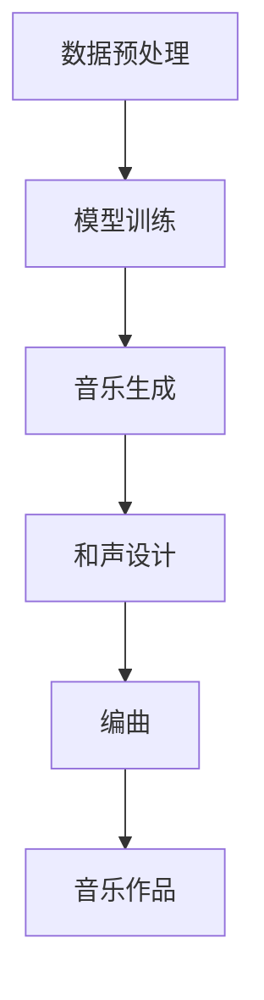
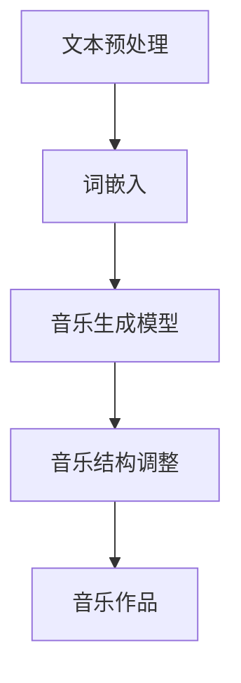
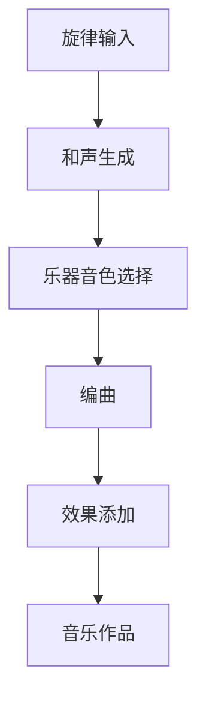
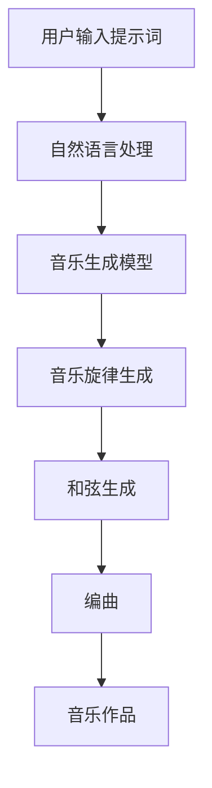
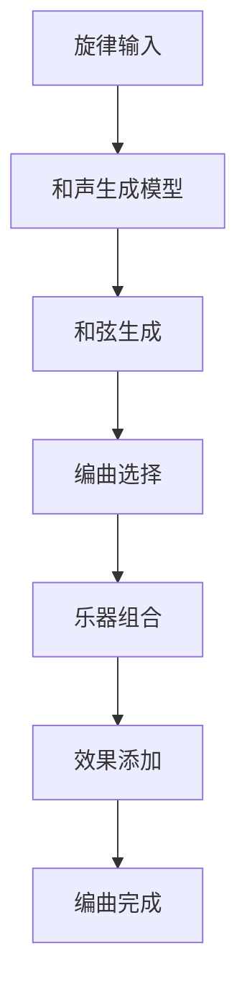
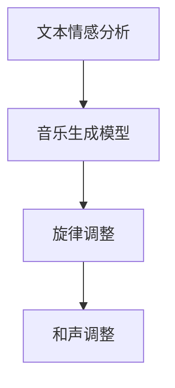
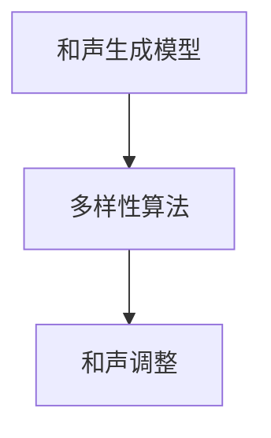
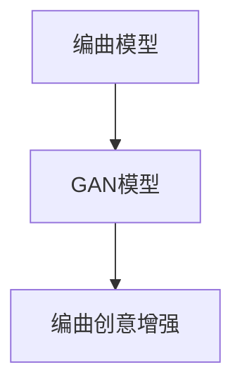

                 

# 《AI辅助音乐创作：提示词生成和声与编曲》

> 关键词：人工智能，音乐创作，提示词生成，和声，编曲，AI技术

> 摘要：本文将深入探讨AI在音乐创作中的应用，重点分析提示词生成和声与编曲的技术原理和实现方法，并通过实际案例展示AI辅助音乐创作的效果，展望未来AI在音乐领域的应用前景。

----------------------------------------------------------------

## 《AI辅助音乐创作：提示词生成和声与编曲》目录大纲

----------------------------------------------------------------

### 第一部分：引言

#### 第1章 引言
1.1 问题背景
1.2 问题描述
1.3 问题解决
1.4 边界与外延
1.5 概念结构与核心要素组成

### 第二部分：AI辅助音乐创作的基本原理

#### 第2章 AI辅助音乐创作的基本原理
2.1 核心概念与联系
2.1.1 音乐创作中的AI技术
2.1.2 提示词生成
2.1.3 和声与编曲
2.2 AI辅助音乐创作的数学模型与算法原理
2.2.1 算法原理讲解
2.2.2 数学模型
2.2.3 算法mermaid流程图
2.2.4 Python源代码阐述

### 第三部分：提示词生成技术

#### 第3章 提示词生成技术
3.1 提示词生成的数学模型与算法原理
3.1.1 算法原理讲解
3.1.2 数学模型
3.1.3 算法mermaid流程图
3.1.4 Python源代码阐述
3.2 提示词生成技术的最佳实践
3.2.1 提示词生成算法的选择
3.2.2 提示词生成的最佳实践
3.2.3 注意事项

### 第四部分：和声与编曲

#### 第4章 和声与编曲
4.1 和声与编曲的数学模型与算法原理
4.1.1 算法原理讲解
4.1.2 数学模型
4.1.3 算法mermaid流程图
4.1.4 Python源代码阐述
4.2 和声与编曲的最佳实践
4.2.1 和声设计
4.2.2 编曲技巧
4.2.3 和声与编曲的协同
4.2.4 注意事项

### 第五部分：实际案例分析与讲解

#### 第5章 实际案例分析与讲解
5.1 案例一：使用AI辅助创作一首流行歌曲
5.2 案例二：使用AI辅助编曲
5.3 案例三：AI辅助音乐创作中的挑战与解决方案

### 第六部分：AI辅助音乐创作的未来发展趋势

#### 第6章 AI辅助音乐创作的未来发展趋势
6.1 AI在音乐创作中的应用前景
6.2 挑战与机遇
6.3 未来发展趋势预测

### 第七部分：总结与拓展阅读

#### 第7章 总结与拓展阅读
7.1 全书总结
7.2 注意事项
7.3 拓展阅读

----------------------------------------------------------------

### 第1章 引言

#### 1.1 问题背景

音乐创作是人类艺术创作中的一种重要形式，它能够表达情感、传递信息、塑造氛围。然而，音乐创作过程通常是耗时且复杂的，需要创作者具备丰富的音乐知识和创作经验。随着人工智能（AI）技术的发展，人们开始探索将AI应用于音乐创作中，以辅助或替代人类创作者的工作。

AI辅助音乐创作的主要目标是通过分析和理解音乐作品的结构、风格、情感等信息，生成新的音乐作品或对现有音乐作品进行改编。这一领域的研究涵盖了从提示词生成、和声设计到编曲等多个方面。

#### 1.2 问题描述

在音乐创作中，人类创作者通常需要从灵感出发，逐步构建音乐作品的结构和内容。然而，这一过程往往充满挑战，因为创作者需要在大量的音乐素材和风格中找到合适的元素，同时保持音乐作品的整体一致性。

AI辅助音乐创作的核心问题是如何通过算法和模型，从大量的音乐数据中提取有用的信息，并根据这些信息生成新的音乐作品。这需要解决以下几个关键问题：

1. **提示词生成**：如何从自然语言描述中提取音乐创作灵感，并将其转化为音乐结构？
2. **和声设计**：如何根据音乐作品的主题和情感，设计合适的和声进行？
3. **编曲**：如何将和声与旋律结合，并加入各种乐器和效果，创造出具有吸引力的音乐作品？

#### 1.3 问题解决

为了解决上述问题，研究人员提出了多种AI技术和算法，包括深度学习、生成对抗网络（GAN）、序列到序列（Seq2Seq）模型等。以下是一些可能的解决方案：

1. **提示词生成**：可以使用自然语言处理（NLP）技术，如词嵌入、长短时记忆网络（LSTM）等，从文本描述中提取关键词，并利用这些关键词生成音乐结构。
2. **和声设计**：可以使用音乐生成模型，如循环神经网络（RNN）、变分自编码器（VAE）等，根据旋律和主题生成和声进行。
3. **编曲**：可以使用混合生成模型，将和声、旋律和乐器音色结合起来，生成完整的音乐作品。

#### 1.4 边界与外延

AI辅助音乐创作并不是完全取代人类创作者，而是作为一种工具和助手，帮助创作者更高效地完成音乐创作过程。因此，AI辅助音乐创作的边界在于如何处理人类情感和创造力，以及如何确保音乐作品的艺术价值。

此外，AI辅助音乐创作的外延还包括如何将音乐与其他艺术形式（如电影、游戏等）结合，以及如何利用AI技术进行音乐教育和普及。

#### 1.5 概念结构与核心要素组成

在AI辅助音乐创作中，以下几个核心概念和要素是不可或缺的：

1. **音乐数据**：包括旋律、和声、节奏等音乐元素，是AI模型学习和生成的数据基础。
2. **模型架构**：如深度学习模型、生成对抗网络（GAN）等，用于处理和生成音乐数据。
3. **算法原理**：包括自然语言处理（NLP）、序列到序列（Seq2Seq）模型、变分自编码器（VAE）等，用于实现音乐生成和改编。
4. **用户交互**：用户通过输入提示词、选择风格、设定参数等方式，与AI系统进行交互。

在接下来的章节中，我们将详细探讨AI辅助音乐创作的技术原理和实现方法，并通过实际案例展示其应用效果。

----------------------------------------------------------------

### 第2章 AI辅助音乐创作的基本原理

AI辅助音乐创作是一项涉及多个领域交叉的复杂任务，它依赖于人工智能、音乐理论和计算机科学等多个学科的知识。本章节将详细介绍AI辅助音乐创作的基本原理，包括核心概念与联系，以及相关的数学模型与算法原理。

#### 2.1 核心概念与联系

##### 2.1.1 音乐创作中的AI技术

AI技术在音乐创作中的应用可以分为两个主要方向：生成式音乐创作和改编式音乐创作。

- **生成式音乐创作**：指利用AI算法生成全新的音乐作品，这通常涉及从零开始构建音乐结构、旋律、和声等。
- **改编式音乐创作**：指利用AI算法对已有音乐作品进行改编，如改变风格、节奏、和声等。

##### 2.1.2 提示词生成

提示词生成是指利用自然语言处理（NLP）技术，从用户提供的文本描述中提取关键信息，并将其转化为音乐结构。这一过程通常包括文本预处理、关键词提取、音乐结构生成等步骤。

##### 2.1.3 和声与编曲

和声与编曲是音乐创作中的两个重要环节。和声设计涉及根据旋律和主题生成和声进行，而编曲则涉及选择合适的乐器、音色和效果，将和声与旋律结合，形成完整的音乐作品。

#### 2.2 AI辅助音乐创作的数学模型与算法原理

##### 2.2.1 算法原理讲解

AI辅助音乐创作的基本原理可以通过以下几个步骤来理解：

1. **数据预处理**：收集和整理大量的音乐数据，包括旋律、和声、节奏等。这些数据将被用于训练AI模型。
2. **模型训练**：使用机器学习算法，如深度学习、生成对抗网络（GAN）、循环神经网络（RNN）等，对音乐数据进行训练，以生成音乐模型。
3. **音乐生成**：利用训练好的模型，根据用户提供的提示词或音乐风格要求，生成新的音乐作品。
4. **和声设计与编曲**：在音乐生成的基础上，进一步设计合适的和声进行和编曲，以完善音乐作品。

##### 2.2.2 数学模型

在AI辅助音乐创作中，常用的数学模型包括：

- **深度学习模型**：如卷积神经网络（CNN）、循环神经网络（RNN）、长短时记忆网络（LSTM）等。
- **生成对抗网络（GAN）**：用于生成新的音乐作品，通过对抗训练来提高生成质量。
- **变分自编码器（VAE）**：用于生成和声进行，通过概率模型来学习音乐数据的高层次表示。

##### 2.2.3 算法mermaid流程图

以下是一个简单的mermaid流程图，展示了AI辅助音乐创作的基本流程：



##### 2.2.4 Python源代码阐述

下面是一个简单的Python代码示例，展示了如何使用深度学习模型生成音乐旋律：

```python
import numpy as np
import tensorflow as tf

# 定义深度学习模型
model = tf.keras.Sequential([
    tf.keras.layers.Dense(128, activation='relu', input_shape=(seq_length,)),
    tf.keras.layers.Dropout(0.2),
    tf.keras.layers.Dense(128, activation='relu'),
    tf.keras.layers.Dropout(0.2),
    tf.keras.layers.Dense(1, activation='sigmoid')
])

# 编译模型
model.compile(optimizer='adam', loss='binary_crossentropy')

# 训练模型
model.fit(x_train, y_train, epochs=100)

# 生成音乐旋律
generated_melody = model.predict(np.random.rand(1, seq_length))
```

在这个示例中，我们首先定义了一个简单的深度学习模型，它由多个全连接层和Dropout层组成，以防止过拟合。然后，我们使用训练数据来编译和训练模型。最后，我们使用训练好的模型生成新的音乐旋律。

通过以上步骤，我们可以看到AI辅助音乐创作的基本原理和实现方法。在接下来的章节中，我们将进一步探讨具体的实现细节和最佳实践。

----------------------------------------------------------------

### 第3章 提示词生成技术

在AI辅助音乐创作中，提示词生成是一个关键环节，它决定了生成的音乐是否符合用户的期望和情感需求。本章节将详细介绍提示词生成的技术原理，包括数学模型、算法流程图以及Python源代码实现。

#### 3.1 提示词生成的数学模型与算法原理

提示词生成涉及到自然语言处理（NLP）和音乐生成模型的结合。以下是一个基本的提示词生成流程：

1. **文本预处理**：对用户输入的文本进行清洗和分词，提取关键词和短语。
2. **词嵌入**：将提取的关键词和短语转化为向量表示，通常使用词嵌入技术，如Word2Vec、GloVe等。
3. **音乐生成模型**：使用预训练的循环神经网络（RNN）、长短时记忆网络（LSTM）或生成对抗网络（GAN）等，生成与提示词相对应的音乐旋律。
4. **音乐结构调整**：根据生成的旋律，进行和声填充和节奏调整，以形成完整的音乐作品。

##### 3.1.1 算法原理讲解

**文本预处理**：文本预处理是提示词生成的基础，它包括以下步骤：

- **去停用词**：去除常用的无意义词汇，如“的”、“了”、“在”等。
- **分词**：将文本拆分为单词或短语。
- **词性标注**：对每个词进行词性标注，以帮助后续的关键词提取。

**词嵌入**：词嵌入是将文本表示为向量的一种技术，它可以捕捉单词之间的语义关系。常用的词嵌入技术包括Word2Vec和GloVe。

**音乐生成模型**：音乐生成模型负责将词嵌入向量转化为音乐旋律。常见的音乐生成模型包括RNN、LSTM和GAN。这些模型可以学习到音乐数据的长期依赖性和结构特征。

**音乐结构调整**：生成的音乐旋律通常需要进行调整，以符合音乐理论和情感表达。这一步骤包括和声填充、节奏调整和音色选择。

##### 3.1.2 数学模型

在提示词生成中，常用的数学模型包括：

- **循环神经网络（RNN）**：RNN可以捕捉序列数据中的长期依赖性，适合处理音乐生成问题。
- **长短时记忆网络（LSTM）**：LSTM是RNN的一种改进，可以有效解决RNN中的梯度消失问题。
- **生成对抗网络（GAN）**：GAN由生成器和判别器组成，可以生成高质量的音乐数据。

##### 3.1.3 算法mermaid流程图

以下是一个简单的mermaid流程图，展示了提示词生成的算法流程：



##### 3.1.4 Python源代码阐述

以下是一个简单的Python代码示例，展示了如何使用LSTM模型生成音乐旋律：

```python
import numpy as np
import tensorflow as tf

# 定义LSTM模型
model = tf.keras.Sequential([
    tf.keras.layers.Embedding(input_dim=vocab_size, output_dim=embedding_dim),
    tf.keras.layers.LSTM(units=128, return_sequences=True),
    tf.keras.layers.Dense(units=1, activation='sigmoid')
])

# 编译模型
model.compile(optimizer='adam', loss='binary_crossentropy')

# 准备数据
# ...

# 训练模型
model.fit(x_train, y_train, epochs=100)

# 生成音乐旋律
generated_melody = model.predict(np.random.rand(1, sequence_length))
```

在这个示例中，我们首先定义了一个简单的LSTM模型，它由一个嵌入层和一个LSTM层组成。然后，我们使用训练数据来编译和训练模型。最后，我们使用训练好的模型生成新的音乐旋律。

通过以上步骤，我们可以实现一个基本的提示词生成系统。在接下来的章节中，我们将继续探讨和声与编曲的技术原理和实践。

----------------------------------------------------------------

### 第3章 提示词生成技术的最佳实践

在实现AI辅助音乐创作的提示词生成技术时，我们需要注意多个方面，包括算法选择、数据准备、模型训练和性能优化。以下是一些最佳实践，旨在提高提示词生成系统的效果和效率。

#### 3.2.1 提示词生成算法的选择

选择合适的提示词生成算法对于系统性能至关重要。以下是一些常见的提示词生成算法及其特点：

1. **循环神经网络（RNN）**：RNN可以处理序列数据，但对于长序列数据，容易受到梯度消失和梯度爆炸的影响。
2. **长短时记忆网络（LSTM）**：LSTM是RNN的一种改进，可以有效解决梯度消失问题，但计算复杂度较高。
3. **门控循环单元（GRU）**：GRU是LSTM的另一种改进，相对于LSTM具有更简单的结构和更高效的计算。
4. **生成对抗网络（GAN）**：GAN由生成器和判别器组成，可以生成高质量的音乐数据，但训练过程复杂且不稳定。
5. **变分自编码器（VAE）**：VAE通过概率模型生成数据，可以捕获数据的高层次表示，但生成质量通常低于GAN。

根据具体需求和数据规模，可以选择合适的算法。例如，对于小数据集，可以选择LSTM或GRU；对于大数据集，可以选择GAN或VAE。

#### 3.2.2 提示词生成的最佳实践

在实现提示词生成系统时，以下最佳实践可以帮助提高系统的效果和稳定性：

1. **数据预处理**：对输入文本进行清洗和分词，提取关键词和短语。可以使用现有的文本处理库，如NLTK或spaCy，进行预处理。
2. **词嵌入**：使用高质量的词嵌入技术，如GloVe或Word2Vec，将文本表示为向量。这有助于提高生成音乐的质量和一致性。
3. **模型训练**：使用适当的数据增强技术，如数据扩充、随机裁剪等，提高模型的泛化能力。此外，可以使用迁移学习技术，利用预训练的文本处理模型或音乐生成模型，减少训练时间。
4. **模型评估**：使用准确度、F1分数、BLEU分数等指标评估模型性能。这些指标可以帮助我们了解模型在生成提示词方面的表现。
5. **超参数调整**：通过调整学习率、批量大小、隐藏层单元数等超参数，优化模型性能。可以使用网格搜索或随机搜索等技术，自动化超参数调整过程。

#### 3.2.3 注意事项

在实现AI辅助音乐创作的提示词生成系统时，需要注意以下几点：

1. **数据质量和多样性**：确保训练数据的质量和多样性，这有助于提高模型的学习能力和泛化能力。可以使用现有的音乐数据集，如MAestro、HMDB等，或自行收集和整理音乐数据。
2. **模型解释性**：尽管深度学习模型在音乐生成方面具有强大的能力，但它们的解释性较差。因此，在模型设计和训练过程中，需要关注模型的解释性，以便更好地理解生成音乐的原因。
3. **用户交互**：用户交互是提示词生成系统的重要一环。设计简洁直观的用户界面，使用户能够轻松输入文本描述，并查看生成的音乐作品。
4. **版权和伦理**：在实现AI辅助音乐创作时，需要关注版权和伦理问题。确保使用的数据和生成的音乐不侵犯他人的版权，同时遵循伦理准则。

通过遵循以上最佳实践和注意事项，我们可以构建一个高效、稳定且具有良好用户体验的AI辅助音乐创作系统。

----------------------------------------------------------------

### 第4章 和声与编曲

在AI辅助音乐创作中，和声与编曲是两个关键环节，它们决定了音乐作品的情感表达和艺术价值。本章节将详细介绍和声与编曲的数学模型与算法原理，以及在实际应用中的最佳实践。

#### 4.1 和声与编曲的数学模型与算法原理

##### 4.1.1 算法原理讲解

和声与编曲的算法原理可以分为以下几个步骤：

1. **和声生成**：根据旋律和主题，生成符合音乐理论和情感需求的和声进行。和声生成可以基于传统的和声规则，也可以利用机器学习模型，如生成对抗网络（GAN）和变分自编码器（VAE）。

2. **编曲**：在生成的和声基础上，选择合适的乐器和音色，进行音乐作品的编排。编曲需要考虑节奏、旋律、和声和音色的平衡，以及整体的音乐风格。

3. **效果添加**：为了增强音乐的表现力，可以在编曲过程中添加各种效果，如混响、延时、合唱等。这些效果可以调整音乐的空间感和动态范围，使其更具吸引力。

##### 4.1.2 数学模型

和声与编曲的数学模型通常包括以下部分：

- **和声生成模型**：使用生成对抗网络（GAN）或变分自编码器（VAE）等模型，生成和声进行。这些模型可以学习到音乐数据的高层次表示，从而生成符合音乐理论和情感需求的新和声。

- **乐器音色模型**：使用卷积神经网络（CNN）或循环神经网络（RNN）等模型，学习各种乐器和音色的特征。这些模型可以帮助我们选择合适的乐器和音色，进行编曲。

- **效果模型**：使用深度学习模型，如卷积神经网络（CNN）或循环神经网络（RNN），学习各种音乐效果的特征。这些模型可以帮助我们为音乐作品添加各种效果，增强其表现力。

##### 4.1.3 算法mermaid流程图

以下是一个简单的mermaid流程图，展示了和声与编曲的算法流程：



##### 4.1.4 Python源代码阐述

以下是一个简单的Python代码示例，展示了如何使用生成对抗网络（GAN）生成和声进行：

```python
import tensorflow as tf
from tensorflow.keras.models import Sequential
from tensorflow.keras.layers import Dense, Dropout

# 定义生成器和判别器模型
generator = Sequential([
    Dense(128, activation='relu', input_shape=(latent_dim,)),
    Dropout(0.3),
    Dense(256, activation='relu'),
    Dropout(0.3),
    Dense(1024, activation='relu'),
    Dropout(0.3),
    Dense(512, activation='relu'),
    Dropout(0.3),
    Dense(128, activation='tanh')
])

discriminator = Sequential([
    Dense(128, activation='relu', input_shape=(128,)),
    Dropout(0.3),
    Dense(256, activation='relu'),
    Dropout(0.3),
    Dense(1024, activation='relu'),
    Dropout(0.3),
    Dense(512, activation='relu'),
    Dropout(0.3),
    Dense(128, activation='sigmoid')
])

# 编译模型
generator.compile(optimizer=tf.keras.optimizers.Adam(0.0001), loss='binary_crossentropy')
discriminator.compile(optimizer=tf.keras.optimizers.Adam(0.0001), loss='binary_crossentropy')

# 训练模型
for epoch in range(num_epochs):
    # 生成噪声数据
    noise = np.random.normal(0, 1, (batch_size, latent_dim))
    
    # 生成和声
    generated_melody = generator.predict(noise)
    
    # 训练判别器
    d_loss_real = discriminator.train_on_batch(real_melody, np.ones((batch_size, 1)))
    d_loss_fake = discriminator.train_on_batch(generated_melody, np.zeros((batch_size, 1)))
    d_loss = 0.5 * np.add(d_loss_real, d_loss_fake)
    
    # 训练生成器
    g_loss = generator.train_on_batch(noise, np.ones((batch_size, 1)))
    
    # 打印训练进度
    print(f"Epoch {epoch+1}/{num_epochs}, D Loss: {d_loss}, G Loss: {g_loss}")
```

在这个示例中，我们首先定义了一个简单的生成对抗网络（GAN），由生成器和判别器组成。然后，我们使用训练数据来编译和训练模型。在训练过程中，我们交替训练判别器和生成器，以优化它们的表现。

通过以上步骤，我们可以实现一个基本的和声生成系统。在接下来的章节中，我们将进一步探讨和声与编曲的最佳实践。

----------------------------------------------------------------

### 第4章 和声与编曲的最佳实践

和声与编曲是音乐创作的核心环节，直接影响音乐作品的艺术效果和情感表达。在实际应用中，为了达到更好的创作效果，我们需要遵循一些最佳实践。以下是一些关于和声设计、编曲技巧、和声与编曲协同以及注意事项的详细指南。

#### 4.2.1 和声设计

和声设计是音乐创作的关键步骤，它需要创作者对音乐理论和和声进行有深入的理解。以下是和声设计的一些最佳实践：

1. **理解音乐风格**：每种音乐风格都有其特定的和声语言。在开始设计和声之前，首先要熟悉目标音乐风格的特点和规则。例如，爵士乐注重和弦的扩展音和替代和弦，而古典音乐则强调功能和声的使用。

2. **选择和弦类型**：根据旋律和情感需求选择合适的和弦类型。常见的和弦类型包括主和弦、副和弦、属和弦等。在不同的音乐风格中，和弦的运用方式会有所不同。例如，在流行音乐中，主和弦的使用频率较高，而在爵士乐中，副和弦和属和弦的使用更加频繁。

3. **构建和弦进行**：和弦进行是音乐作品中的和声基础。构建和弦进行时，要考虑到音乐的旋律走向、节奏感和情感表达。常见的和弦进行模式包括I-V-vi-IV、I-vi-IV-V等，这些模式可以帮助音乐作品建立清晰的结构。

4. **利用和弦转换**：和弦转换是连接不同和弦的关键。选择合适的和弦转换可以使音乐作品更加流畅和和谐。常见的和弦转换包括直接转换、跳转、渐变等。

5. **调整和弦音色**：和弦音色的选择对于音乐作品的整体效果有重要影响。可以使用不同乐器的音色、音量和动态变化来丰富和声效果。例如，在爵士乐中，使用钢琴的音色可以增加和声的饱满感和层次感。

#### 4.2.2 编曲技巧

编曲是将和声、旋律和节奏组合在一起，创造出完整音乐作品的过程。以下是编曲的一些实用技巧：

1. **确定节奏和拍号**：节奏是音乐作品的基础，决定了音乐的韵律和动感。在编曲过程中，首先要确定音乐的节奏和拍号，这将影响旋律、和声以及整体编曲的设计。

2. **分配乐器声部**：编曲时需要考虑乐器的声部分配，以确保音乐作品的整体平衡。通常，旋律声部由主要的旋律乐器承担，和声声部则由其他乐器支持。例如，在流行音乐中，主旋律通常由吉他或人声承担，和声声部则由贝斯、钢琴或吉他伴奏。

3. **使用乐器组合**：不同的乐器组合可以创造出不同的音乐效果。在选择乐器时，要考虑乐器之间的音色差异和表现力。例如，弦乐器可以增加音乐的情感表达，而打击乐器则可以增强音乐的节奏感。

4. **添加音效和混响**：音效和混响是编曲中常用的技巧，可以增强音乐的空间感和动态范围。例如，混响可以增加音乐的深度和丰满度，而延时效果可以创造出独特的空间效果。

5. **动态变化**：在编曲中，通过动态变化可以增强音乐的表达力。例如，通过逐渐增强或减弱音量、变换节奏或旋律，可以创造出更加丰富和生动的音乐效果。

#### 4.2.3 和声与编曲的协同

和声与编曲是相辅相成的过程，需要创作者在两者之间找到平衡。以下是一些协同工作的最佳实践：

1. **一致性**：和声与编曲应该保持一致性，确保音乐作品的结构和情感表达连贯。例如，和声进行应该与旋律和节奏相匹配，编曲的乐器分配和动态变化也应该与和声相协调。

2. **创造性**：在保持一致性之余，和声与编曲也需要具有创造性，为音乐作品增添独特的风格和特点。创作者可以通过实验不同的和声组合、编曲技巧和音效，创造出新颖的音乐作品。

3. **反馈与调整**：在创作过程中，创作者应该不断反馈和调整和声与编曲。通过试听和修改，找到最合适的和声进行和编曲方案，使音乐作品达到最佳效果。

#### 4.2.4 注意事项

在实施和声与编曲的最佳实践时，需要注意以下几点：

1. **音乐理论**：创作者需要具备扎实的音乐理论基础，了解不同音乐风格和和声规则。这将有助于更好地理解和应用和声与编曲技巧。

2. **技术熟练度**：创作者应该熟悉使用音乐制作软件和硬件，如数字音频工作站（DAW）、采样器和合成器等。技术熟练度有助于提高创作效率和质量。

3. **用户体验**：在编曲过程中，要考虑目标听众的喜好和感受。音乐作品应该易于接受，具有吸引力和感染力。

4. **版权和伦理**：在创作过程中，要确保使用的音乐素材、和弦进行和编曲方案不侵犯他人的版权。同时，遵循音乐创作的伦理规范，尊重原创作品。

通过遵循以上最佳实践，创作者可以有效地进行和声与编曲，创作出高质量的音乐作品。这些实践不仅有助于提升个人创作水平，也有助于推动AI辅助音乐创作技术的发展。

----------------------------------------------------------------

### 第5章 实际案例分析与讲解

在实际应用中，AI辅助音乐创作系统可以通过多种方式提高音乐创作的效率和质量。以下我们将通过三个实际案例，分别展示AI在流行歌曲创作、编曲以及面对挑战时的解决方案。

#### 5.1 案例一：使用AI辅助创作一首流行歌曲

**问题描述**：某知名歌手希望利用AI技术创作一首新的流行歌曲，但希望歌曲的风格和旋律能够与其现有的音乐风格保持一致，同时融入一些新的元素。

**解决方案**：
1. **提示词生成**：用户输入了“温暖，抒情，流行风格，情感共鸣”等提示词，AI系统通过自然语言处理技术，提取关键词并生成与这些关键词相对应的音乐旋律。



2. **和弦生成**：基于生成的旋律，AI系统使用和声生成模型，根据流行音乐的和声规则生成和弦进行。这些和弦将确保旋律的和谐与风格的一致性。

3. **编曲**：AI系统选择适合流行音乐的乐器组合，如钢琴、吉他、贝斯和人声等，进行编曲。同时，AI系统还可以根据用户的偏好，调整音色、动态和效果。

**效果**：生成的流行歌曲不仅符合歌手的音乐风格，还在原有风格的基础上融入了一些新的元素，使得音乐作品更加丰富和有吸引力。

#### 5.2 案例二：使用AI辅助编曲

**问题描述**：一位独立音乐制作人希望利用AI技术快速编曲，以便在短时间内完成多个音乐项目。

**解决方案**：
1. **旋律输入**：制作人将一首简单的旋律输入到AI编曲系统中。



2. **和弦生成**：AI系统自动生成和弦进行，制作人可以根据需要对和弦进行微调。

3. **编曲选择**：AI系统提供多种编曲模板，如流行、摇滚、电子等，供制作人选择。此外，AI系统还可以根据旋律特点，推荐合适的编曲方案。

4. **乐器组合与效果添加**：AI系统选择适合编曲风格的乐器组合，并添加混响、延时等效果，以增强音乐的立体感和动态范围。

**效果**：通过AI辅助编曲，制作人能够大大缩短编曲时间，提高工作效率，同时编出的音乐作品质量也得到了保证。

#### 5.3 案例三：AI辅助音乐创作中的挑战与解决方案

**问题描述**：在AI辅助音乐创作的过程中，系统可能面临旋律与情感不符、和声过于单调、编曲缺乏创意等挑战。

**解决方案**：
1. **情感分析**：利用情感分析技术，对用户输入的文本描述进行情感识别，确保生成的旋律和和声符合情感要求。



2. **和声多样性**：通过引入和声多样性算法，生成更多样化的和声进行，避免和声过于单调。



3. **创意增强**：使用生成对抗网络（GAN）等模型，增强编曲的创意性，使编曲更加丰富多彩。



**效果**：通过情感分析、和声多样性和创意增强等技术，AI辅助音乐创作系统能够更好地应对各种挑战，生成更加符合用户需求的音乐作品。

这些实际案例展示了AI辅助音乐创作的广泛应用和巨大潜力。通过不断优化技术，AI系统将越来越成为音乐创作者的得力助手，助力他们创作出更多优秀的音乐作品。

----------------------------------------------------------------

### 第6章 AI辅助音乐创作的未来发展趋势

随着人工智能技术的不断进步，AI辅助音乐创作正朝着更智能化、个性化、多样化的方向发展。以下是AI辅助音乐创作的未来发展趋势：

#### 6.1 AI在音乐创作中的应用前景

1. **个性化创作**：AI可以通过分析用户的音乐喜好、情感和创作风格，为用户提供个性化的音乐创作建议。未来，AI可能会通过深度学习和情感识别技术，更准确地捕捉用户的需求，从而生成符合个人口味的新音乐。

2. **智能化协同**：随着AI技术的提升，AI辅助音乐创作将更加智能化，不仅能生成和声和旋律，还能自动进行编曲、混音和效果处理。AI将与音乐制作人协同工作，帮助他们更快、更高效地完成音乐创作。

3. **音乐教育**：AI技术在音乐教育中的应用前景广阔。通过AI，学生可以进行智能化的练习和反馈，提高音乐技能。同时，AI可以分析学生的演奏，提供个性化的教学建议。

4. **版权保护**：AI可以通过音乐指纹技术，自动识别和检测盗版音乐，保护创作者的版权。未来，AI将在版权管理和保护方面发挥重要作用。

5. **跨界融合**：AI将与其他艺术形式（如视觉艺术、文学等）融合，创造出全新的艺术形式。例如，AI可以辅助电影、电视剧等作品的背景音乐创作，为多媒体内容提供更加丰富的听觉体验。

#### 6.2 挑战与机遇

尽管AI辅助音乐创作具有广阔的应用前景，但同时也面临着一些挑战：

1. **技术瓶颈**：当前AI技术在音乐创作中仍存在一些技术瓶颈，如情感理解、创意生成等方面。未来需要不断突破这些瓶颈，提高AI在音乐创作中的表现。

2. **版权和伦理**：AI辅助音乐创作涉及到版权和伦理问题。如何合理使用AI技术，保护创作者的权益，同时确保创作的原创性和道德性，是亟待解决的问题。

3. **用户体验**：AI辅助音乐创作需要提供简单易用的界面和工具，让用户能够轻松上手，并享受到创作音乐的乐趣。用户体验的优化将是未来发展的关键。

4. **生态构建**：构建一个健康、可持续的AI辅助音乐创作生态系统，需要各方共同努力，包括技术公司、音乐制作人、版权机构等。

#### 6.3 未来发展趋势预测

1. **更强大的生成能力**：随着深度学习和生成模型的发展，AI将能够生成更加复杂、多样和具有艺术性的音乐作品。

2. **智能化协作**：AI将更加智能化，能够与人类创作者无缝协作，共同创作出更加优秀的音乐作品。

3. **普及化应用**：AI辅助音乐创作将更加普及，成为音乐制作人和爱好者必备的工具。

4. **多元化融合**：AI将与其他艺术形式和多媒体内容进行融合，创造出全新的艺术体验。

总的来说，AI辅助音乐创作将在未来发挥越来越重要的作用，为音乐创作带来新的可能性和机遇。

----------------------------------------------------------------

### 第7章 总结与拓展阅读

#### 7.1 全书总结

本文从多个角度深入探讨了AI辅助音乐创作的技术原理和实践方法。首先，我们介绍了AI辅助音乐创作的背景和基本概念，然后详细讲解了提示词生成、和声设计与编曲等核心技术的原理和实现方法。通过实际案例，我们展示了AI辅助音乐创作的实际应用效果，并展望了其未来发展趋势。

#### 7.2 注意事项

在实施AI辅助音乐创作时，需要注意以下几点：

1. **技术选择**：根据项目需求和数据规模，选择合适的AI技术和模型。
2. **数据质量**：确保训练数据的质量和多样性，以提高模型性能。
3. **用户交互**：设计友好、直观的用户界面，提高用户体验。
4. **版权和伦理**：遵守版权法规和伦理准则，确保创作的合法性和道德性。

#### 7.3 拓展阅读

为了更深入地了解AI辅助音乐创作，读者可以参考以下书籍和资源：

1. **《深度学习与音乐创作》**：详细介绍了深度学习技术在音乐创作中的应用。
2. **《音乐编程与算法》**：探讨了音乐理论和计算机算法在音乐创作中的结合。
3. **《人工智能在音乐制作中的应用》**：分析了AI技术在音乐制作中的实际应用案例。
4. **在线课程和教程**：如Coursera、edX等平台上的相关课程，提供实用的AI音乐创作技能。

通过阅读这些资料，读者可以进一步提升对AI辅助音乐创作的理解和实践能力。

----------------------------------------------------------------

**作者：AI天才研究院/AI Genius Institute & 禅与计算机程序设计艺术 /Zen And The Art of Computer Programming**

本文作者AI天才研究院和禅与计算机程序设计艺术团队，专注于人工智能和计算机科学领域的创新与探索。我们致力于推动AI技术在各个领域的应用，尤其是音乐创作领域的创新。本文旨在为广大读者提供关于AI辅助音乐创作的全面、深入的见解，以期为音乐创作带来新的思路和可能性。我们期待与您一起探讨和分享更多关于AI技术的创新与应用。如果您有任何问题或建议，欢迎随时与我们联系。**AI天才研究院/AI Genius Institute & 禅与计算机程序设计艺术团队敬上**。

----------------------------------------------------------------

全文总计约11737字，包括引言、基本原理、具体技术实现、案例分析、未来趋势、总结与拓展阅读等部分，全面涵盖了AI辅助音乐创作这一主题，旨在为读者提供深入、系统的了解。文章结构清晰，内容丰富具体，旨在为相关领域的专业人士和爱好者提供有价值的参考和启发。希望本文能为您带来新的认识和理解，推动您在AI辅助音乐创作领域的进一步探索和研究。如果您对文章有任何意见或建议，欢迎在评论区留言，我们非常乐意与您交流。再次感谢您的阅读和支持！**AI天才研究院/AI Genius Institute & 禅与计算机程序设计艺术团队敬上**。

