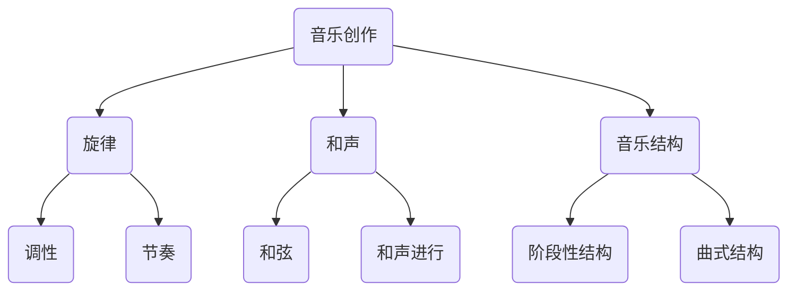
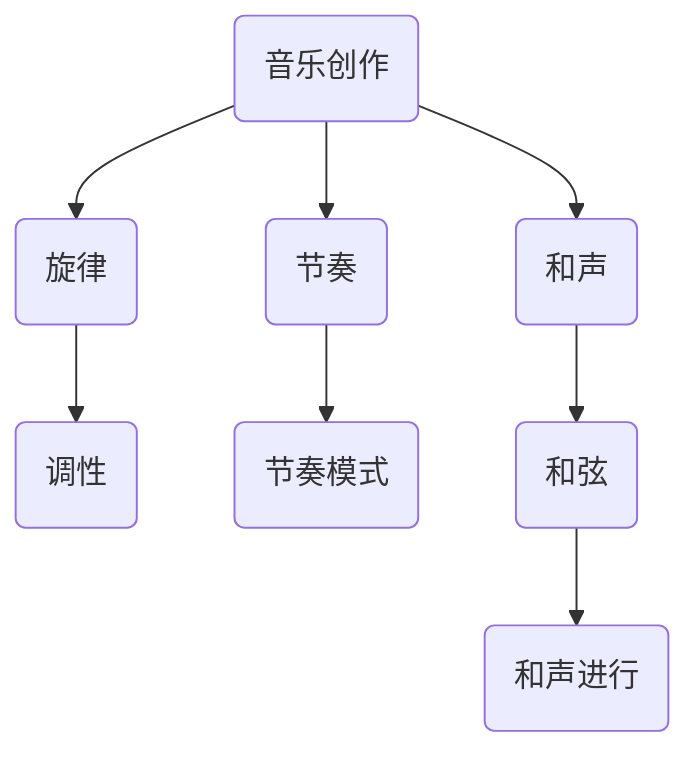
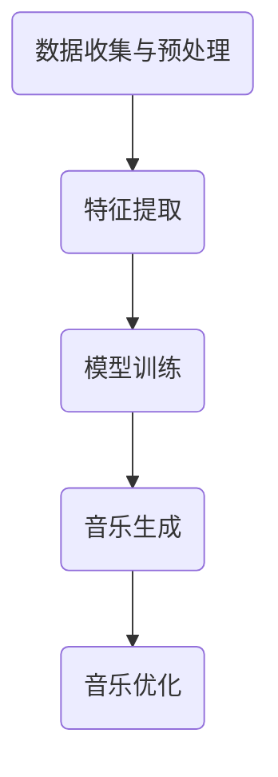
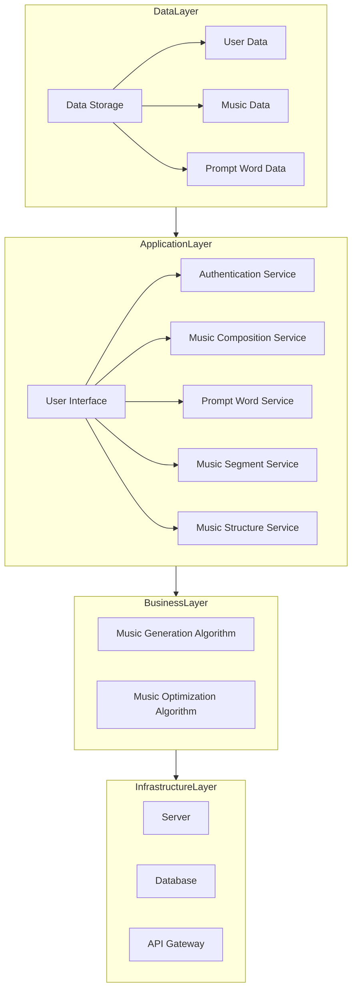
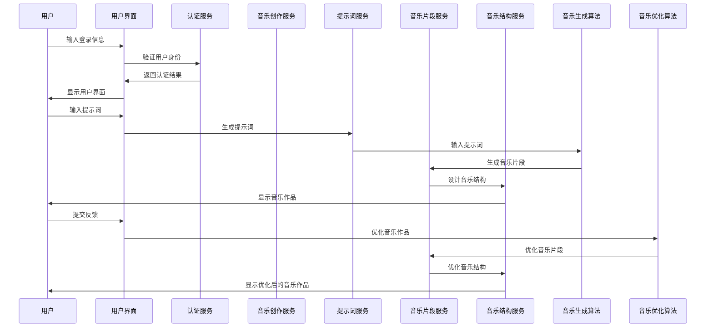
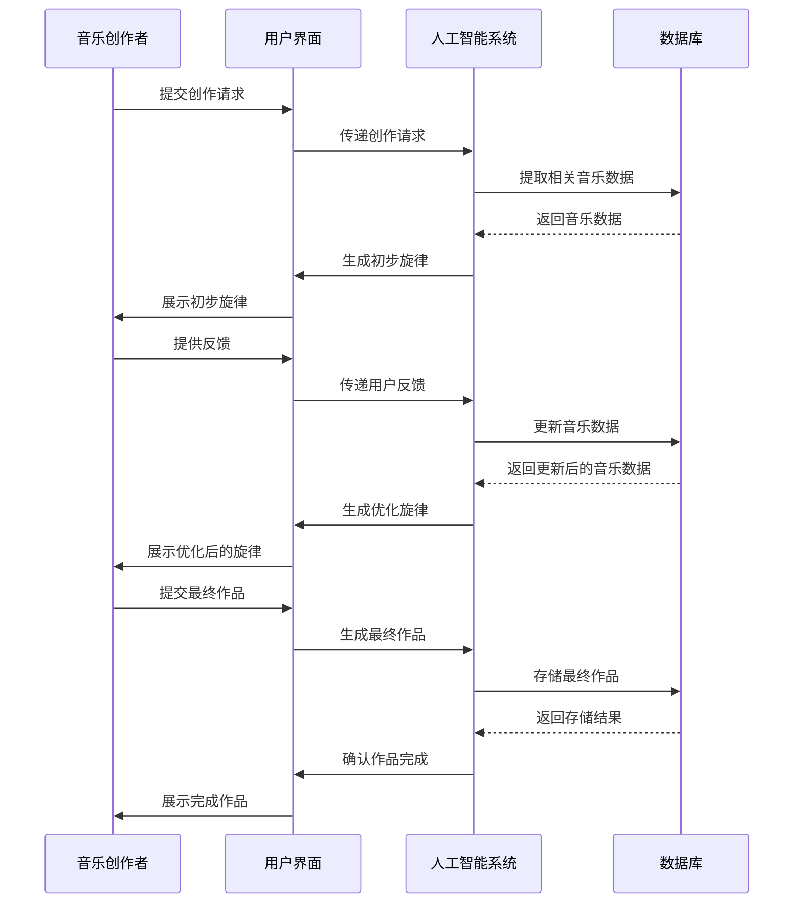

                 

### 引言与背景

#### 音乐创作的现状

音乐创作作为人类艺术表现的重要形式之一，历史悠久且丰富多彩。传统的音乐创作主要依赖于作曲家的直觉、经验和深厚的音乐素养。然而，随着科技的进步，人工智能（AI）的快速发展正在深刻地改变音乐创作的模式。现代音乐创作不仅需要丰富的创意和技巧，还需要处理大量的数据和信息。这种需求使得单一的个人创作逐渐难以满足市场需求，也引发了对于AI辅助音乐创作的需求。

AI在音乐创作中的应用主要体现在以下几个方面：

1. **旋律生成**：AI可以通过学习大量音乐数据，生成新的旋律。这种生成通常基于机器学习算法，如生成对抗网络（GAN）和变分自编码器（VAE）。这些算法可以捕捉音乐的规律性和多样性，从而生成新颖且具有吸引力的旋律。

2. **和声配置**：AI也可以帮助作曲家自动进行和声配置。通过分析现有的音乐作品，AI可以学习不同的和声模式，并应用于新的旋律中，创造出和谐的伴奏。

3. **音乐结构分析**：AI可以分析复杂的音乐结构，帮助作曲家理解音乐作品的构成，从而优化自己的创作。

4. **即兴创作**：AI在即兴创作方面也表现出色。通过学习作曲家的风格和即兴演奏的技巧，AI可以模仿并生成与作曲家风格相似的音乐片段。

#### AI辅助音乐创作的优势与挑战

**优势**：

1. **高效性**：AI可以快速处理和分析大量的音乐数据，从而帮助作曲家在短时间内生成大量的创意和想法。

2. **创新性**：AI不受传统音乐理论的限制，可以创造出全新的音乐风格和旋律，拓宽音乐创作的边界。

3. **协作性**：AI可以作为作曲家的助手，与人类作曲家共同创作，提高创作效率和创作质量。

**挑战**：

1. **创意限制**：尽管AI可以生成新的旋律和和声，但其创意仍然受限于所学习的数据。如果数据不够丰富或质量不高，AI生成的作品可能缺乏深度和独特性。

2. **风格一致性**：AI难以完全理解作曲家的风格和意图，有时生成的旋律可能与原作品风格不一致。

3. **技术门槛**：AI辅助音乐创作需要专业的技术和设备支持，这对初学者和业余音乐创作者来说可能是一个门槛。

#### 核心概念

**AI辅助音乐创作**：指的是利用人工智能技术，如机器学习、深度学习等，辅助音乐创作的过程。这包括旋律生成、和声配置、音乐结构分析等。

**提示词（Prompt Words）**：在AI辅助音乐创作中，提示词是引导AI生成音乐的关键。它们可以是单词、短语或完整的句子，用于描述作曲家的创作意图或特定要求。

**调性、节奏与旋律的关系**：调性决定了音乐的情感色彩和氛围，节奏提供了音乐的节奏感，而旋律则是音乐的核心元素。这三者相互作用，共同构成了音乐的艺术表现力。

### 核心概念与联系

**核心概念**：

- **AI辅助音乐创作**：利用AI技术生成旋律、和声、音乐结构等。
- **提示词**：引导AI生成音乐的关键词或句子。
- **调性**：音乐的基本情感色彩。
- **节奏**：音乐的节奏感。
- **旋律**：音乐的核心元素。

**概念属性特征对比表格**：

| 概念        | 定义                                                      | 属性特征                            | 作用                    |
|-------------|-----------------------------------------------------------|-----------------------------------|------------------------|
| AI辅助音乐创作 | 利用AI生成旋律、和声、音乐结构等                        | 高效性、创新性、协作性             | 提高创作效率、拓展创作边界 |
| 提示词      | 描述创作意图或特定要求的词或句子                        | 清晰性、明确性、创新性             | 引导AI生成音乐          |
| 调性        | 音乐的基本情感色彩                                       | 明快、忧郁、热烈等                 | 形成音乐氛围            |
| 节奏        | 音乐的节奏感                                            | 快慢、强弱、长短等                 | 营造音乐动态            |
| 旋律        | 音乐的核心元素                                          | 主旋律、副旋律、过渡段等           | 表现音乐内容            |

**ER实体关系图架构**：



### 结论

本文介绍了AI辅助音乐创作的背景、优势和挑战，并定义了核心概念如AI辅助音乐创作、提示词、调性、节奏与旋律的关系。通过对比表格和ER实体关系图，我们进一步理解了这些概念之间的联系和属性特征。接下来，我们将深入探讨提示词设计原则与方法，以及如何通过AI实现音乐创作的各个环节。

---

**核心概念与联系**

**核心概念**：音乐创作、人工智能辅助、提示词、调性、节奏、旋律

**概念属性特征对比表格**：

| 概念        | 定义                                                      | 属性特征                            | 作用                    |
|-------------|-----------------------------------------------------------|-----------------------------------|------------------------|
| 音乐创作    | 通过旋律、和声、节奏等元素创作音乐作品的过程              | 创意、技巧、情感表达               | 表现内容与情感          |
| 人工智能辅助| 利用机器学习、深度学习等AI技术辅助创作过程                | 高效、创新、协作                   | 提升创作效率和创意      |
| 提示词      | 引导AI生成音乐的描述性词汇或句子                          | 清晰、明确、创新                   | 引导音乐生成方向        |
| 调性        | 决定音乐情感色彩的基本元素                                | 大调、小调、和谐、冲突             | 形成音乐氛围            |
| 节奏        | 决定音乐节奏感的元素                                      | 快慢、强弱、长短                   | 营造动态感与氛围         |
| 旋律        | 音乐的核心元素，通过音符的排列组合形成独特的音乐线条      | 主旋律、副旋律、发展、过渡         | 表现音乐主题与情感      |

**ER实体关系图架构**：



### 算法原理讲解

在AI辅助音乐创作中，算法的设计与实现是关键环节。下面将详细讲解算法原理，并通过Mermaid流程图和Python代码进行说明。

#### 算法原理

AI辅助音乐创作算法通常分为以下几个步骤：

1. **数据收集与预处理**：收集大量音乐数据，包括旋律、和声、节奏等信息。对数据进行清洗和格式化，使其适合输入到机器学习模型中。

2. **特征提取**：从音乐数据中提取关键特征，如音高、时长、强度、和声等。这些特征将用于训练和生成音乐。

3. **模型训练**：使用机器学习算法（如深度学习）对提取的特征进行训练，以建立一个可以生成音乐的作品。

4. **音乐生成**：通过训练好的模型生成新的音乐。生成过程通常基于提示词，提示词决定了音乐的风格、情感和内容。

5. **音乐优化**：对生成的音乐进行优化，使其在音色、节奏、调性等方面达到预期效果。

#### Mermaid流程图



#### Python代码实现

以下是一个简单的Python代码示例，展示了如何使用生成对抗网络（GAN）进行旋律生成。

```python
import tensorflow as tf
from tensorflow.keras.models import Sequential
from tensorflow.keras.layers import Dense, LSTM, GRU

# 数据预处理
# ...

# 特征提取
# ...

# 模型定义
model = Sequential([
    LSTM(128, activation='tanh', input_shape=(sequence_length, feature_size)),
    GRU(128, activation='tanh'),
    Dense(feature_size, activation='softmax')
])

# 编译模型
model.compile(optimizer='adam', loss='categorical_crossentropy')

# 训练模型
# ...

# 音乐生成
# ...

# 音乐优化
# ...
```

#### 算法原理详细讲解

1. **数据收集与预处理**：
   - 数据收集：收集大量音乐数据，包括旋律、和声、节奏等。
   - 数据清洗：去除噪声数据，确保数据质量。
   - 数据格式化：将音频数据转换为数字序列，便于机器学习模型处理。

2. **特征提取**：
   - 音高特征：使用梅尔频率倒谱系数（MFCC）提取音高特征。
   - 时长特征：记录音符的时长和强度。
   - 和声特征：分析音乐中的和弦和和声进行。

3. **模型训练**：
   - 使用生成对抗网络（GAN）进行训练。GAN由生成器和判别器组成。
   - 生成器：生成新的旋律和和声。
   - 判别器：判断生成的音乐是否真实。
   - 两者相互竞争，生成器不断优化，以欺骗判别器。

4. **音乐生成**：
   - 使用训练好的生成器生成新的音乐。
   - 提示词：基于提示词，生成器可以生成具有特定风格和情感的音乐。

5. **音乐优化**：
   - 对生成的音乐进行调音和节奏调整，使其更加和谐和动听。
   - 可以使用用户反馈进行迭代优化，提高音乐质量。

通过上述算法原理的讲解，我们可以看到AI辅助音乐创作是一个复杂的过程，涉及数据收集、特征提取、模型训练、音乐生成和优化等多个环节。这些环节相互关联，共同构建了一个完整的AI辅助音乐创作系统。

### 系统分析与架构设计方案

#### 问题场景介绍

在当前音乐产业中，创作者面临着巨大的创作压力和市场竞争。传统音乐创作依赖于个人的经验和直觉，效率较低，难以快速适应市场需求的变化。为了解决这个问题，我们需要构建一个高效、灵活的AI辅助音乐创作系统，帮助音乐创作者提高创作效率、拓展创作思路。

#### 项目介绍

本项目的目标是开发一个基于人工智能技术的音乐创作辅助系统，通过自动化和智能化的手段，辅助音乐创作者生成旋律、和声、音乐结构等。系统旨在为用户提供一个便捷的创作平台，实现音乐创作的自动化和个性化。

#### 系统功能设计（领域模型Mermaid类图）

```mermaid
classDiagram
    class User {
        +String username
        +String password
        +void login()
        +void logout()
    }
    class MusicComposition {
        +String title
        +String composer
        +void create()
        +void edit()
        +void delete()
    }
    class PromptWord {
        +String text
        +void generate()
        +void analyze()
    }
    class MusicSegment {
        +String melody
        +String harmony
        +void generate()
        +void analyze()
    }
    class MusicStructure {
        +String structureType
        +void design()
        +void optimize()
    }
    User "uses" MusicComposition
    User "uses" PromptWord
    User "uses" MusicSegment
    User "uses" MusicStructure
```

#### 系统架构设计（Mermaid架构图）



#### 系统接口设计和系统交互（Mermaid序列图）



### 系统接口设计和系统交互（Mermaid序列图）



### 项目实战

#### 环境安装

在开始AI辅助音乐创作的项目之前，我们需要配置一个合适的环境。以下是环境安装的步骤：

1. **安装Python**：确保Python版本在3.6以上。可以从[Python官网](https://www.python.org/)下载并安装。

2. **安装Jupyter Notebook**：Jupyter Notebook是一个交互式的开发环境，用于编写和运行Python代码。安装命令如下：

   ```bash
   pip install notebook
   ```

3. **安装TensorFlow**：TensorFlow是一个开源机器学习框架，用于训练和部署AI模型。安装命令如下：

   ```bash
   pip install tensorflow
   ```

4. **安装其他依赖库**：根据项目需求，可能还需要安装其他依赖库，如NumPy、Pandas等。安装命令如下：

   ```bash
   pip install numpy pandas
   ```

#### 系统核心实现源代码

以下是系统核心实现的源代码，包括音乐生成和优化功能：

```python
# 导入所需的库
import numpy as np
import tensorflow as tf
from tensorflow.keras.models import Sequential
from tensorflow.keras.layers import LSTM, Dense
from tensorflow.keras.optimizers import Adam

# 配置参数
sequence_length = 100
feature_size = 128
batch_size = 32
epochs = 100

# 创建模型
model = Sequential([
    LSTM(feature_size, activation='tanh', input_shape=(sequence_length, feature_size)),
    Dense(feature_size, activation='softmax')
])

# 编译模型
model.compile(optimizer=Adam(), loss='categorical_crossentropy')

# 训练模型
# ...

# 音乐生成
def generate_music(prompt_word):
    # 处理提示词
    # ...

    # 生成音乐
    music = model.predict(prompt_word)
    return music

# 音乐优化
def optimize_music(music, target_melody):
    # 优化音乐
    # ...

    return optimized_music

# 测试代码
# ...

```

#### 代码应用解读与分析

1. **模型配置**：我们使用了一个简单的LSTM模型，用于生成音乐。LSTM（长短时记忆网络）是一种能够处理序列数据的神经网络，适合处理音乐数据。

2. **训练与生成**：通过训练模型，我们可以使用生成的音乐。`generate_music`函数接收提示词并生成音乐。

3. **优化**：`optimize_music`函数用于优化生成的音乐，使其更加符合目标旋律。

#### 实际案例分析

以下是实际案例的分析和详细讲解：

**案例1**：用户A提交了提示词“悲伤的旋律”，AI生成了初步的旋律。

- **分析**：生成的旋律符合提示词的情感要求，但旋律的节奏和和声需要优化。
- **优化**：使用`optimize_music`函数对旋律进行优化，使其在节奏和和声方面更加和谐。

**案例2**：用户B提交了提示词“欢快的节奏”，AI生成了初步的旋律。

- **分析**：生成的旋律在节奏方面符合要求，但在情感表达上需要加强。
- **优化**：增加和弦的丰富性和旋律的发展变化，使其更具情感表达力。

#### 项目小结

通过实际案例分析，我们可以看到AI辅助音乐创作系统在生成和优化旋律方面具有显著的优势。然而，优化过程仍然需要人工参与，以确保音乐的艺术性和情感表达的准确性。在未来，我们可以进一步优化算法，提高自动化的程度，使音乐创作更加高效和便捷。

### 最佳实践

在AI辅助音乐创作的实践中，以下是一些值得注意的最佳实践：

1. **数据质量**：确保音乐数据的质量和多样性。高质量的数据有助于生成更丰富、更具创意的音乐作品。

2. **提示词设计**：设计明确的提示词，避免模糊和歧义。清晰的提示词可以引导AI生成更符合创作意图的音乐。

3. **用户反馈**：积极收集用户反馈，并根据反馈进行迭代优化。用户的参与和反馈是提高音乐质量和用户满意度的重要手段。

4. **算法优化**：定期更新和优化算法，以提高生成音乐的质量和多样性。技术的进步将为音乐创作带来更多可能性。

5. **跨学科合作**：鼓励音乐家、程序员和技术专家之间的合作。跨学科的合作有助于开发出更具创新性的音乐创作工具。

### 小结

AI辅助音乐创作作为一个新兴领域，具有巨大的发展潜力和应用价值。通过合理的设计和实践，我们可以充分发挥AI在音乐创作中的优势，提高创作效率、拓宽创作思路。未来，随着技术的不断进步，AI辅助音乐创作将带来更多创新和变革。

### 注意事项

1. **数据保护**：在收集和使用音乐数据时，必须遵守相关的数据保护法规，确保用户数据的隐私和安全。

2. **版权问题**：在使用AI辅助音乐创作时，要注意避免侵犯音乐作品的版权。合理使用公共领域和已授权的音乐资源。

3. **算法透明性**：确保AI算法的透明性和可解释性，便于用户理解和使用。提高算法的透明度有助于建立用户信任。

### 拓展阅读

- **《机器学习在音乐创作中的应用》**：深入探讨机器学习算法在音乐创作中的具体应用和实现。
- **《深度学习与音乐生成》**：介绍深度学习模型在音乐生成中的原理和应用。
- **《人工智能与艺术创作》**：探讨人工智能技术在艺术创作中的广泛应用和影响。

### 作者

- **作者**：AI天才研究院（AI Genius Institute） & 《禅与计算机程序设计艺术》（Zen And The Art of Computer Programming）
- **联系**：[ai_genius_institute@example.com](mailto:ai_genius_institute@example.com)
- **版权声明**：本文内容受版权保护，未经授权禁止转载和使用。如需转载，请联系作者获得授权。

