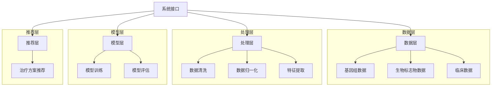
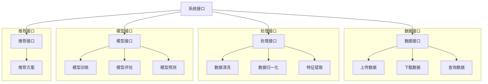
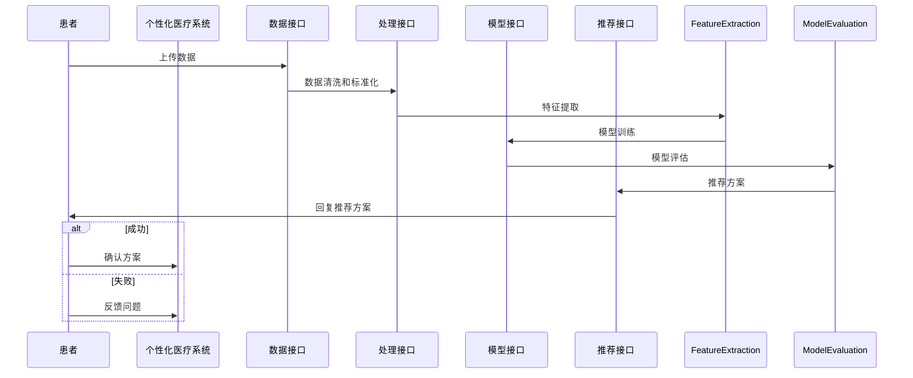

                 

### 文章标题

《AI驱动的个性化医疗：从基因到治疗》

关键词：人工智能、个性化医疗、基因组学、算法原理、系统架构、项目实战

摘要：本文深入探讨了AI在个性化医疗领域的应用，从基因层面到治疗方案的推荐，全面展示了AI如何赋能个性化医疗，提高诊断和治疗的精准度。文章首先介绍了个性化医疗的背景与挑战，然后详细阐述了AI在个性化医疗中的核心概念和联系，包括AI基础、基因组学与生物信息学。接下来，文章讲解了个性化医疗算法的原理，并通过具体实例进行了说明。随后，文章介绍了个性化医疗系统的分析与架构设计方案，最后通过一个实际案例展示了AI驱动个性化医疗的实践效果。本文旨在为读者提供一个全面、系统的了解AI在个性化医疗中应用的途径。

## 目录

### 第一部分：背景介绍

1. 引言
2. 个性化医疗的挑战
3. AI赋能个性化医疗
4. 个性化医疗的核心概念与相关领域
5. 概念结构与核心要素组成

### 第二部分：核心概念与联系

1. AI基础
2. 个性化医疗
3. 基因组学与生物信息学

### 第三部分：算法原理讲解

1. 个性化医疗算法
2. 基因组数据分析
3. 治疗方案推荐系统

### 第四部分：系统分析与架构设计方案

1. 个性化医疗系统介绍
2. 数据分析与处理流程
3. 模型训练与部署

### 第五部分：项目实战

1. 环境安装与配置
2. 系统核心实现
3. 实际案例分析与讲解
4. 项目小结

### 总结与拓展阅读

1. 最佳实践 tips
2. 小结
3. 注意事项
4. 拓展阅读建议

## 第一部分：背景介绍

### 引言

个性化医疗是一种以患者为中心，通过整合基因组学、生物信息学和临床数据，为患者提供定制化治疗方案的新型医疗服务模式。近年来，随着人工智能（AI）技术的快速发展，AI在个性化医疗领域中的应用越来越广泛。AI能够通过处理海量数据，发现潜在的治疗方案，提高诊断和治疗的精准度，为个性化医疗提供强大的技术支持。

### 个性化医疗的挑战

尽管个性化医疗具有巨大的潜力，但其在实际应用中仍然面临着诸多挑战。首先，个性化医疗需要大量的数据支持，包括基因组数据、临床数据和生物标志物数据等。这些数据的收集、存储和管理是一项巨大的挑战。其次，个性化医疗需要复杂的算法和模型来处理这些数据，并从中提取出有效的信息。此外，个性化医疗还需要考虑到伦理、隐私和法律等方面的挑战。

### AI赋能个性化医疗

AI在个性化医疗中的应用主要体现在以下几个方面：

1. **数据挖掘与分析**：AI能够高效地处理和分析大规模、多维度的数据，发现数据之间的潜在联系，为个性化医疗提供数据支持。
2. **算法优化**：AI可以帮助医生制定和优化个性化治疗方案，提高治疗效果。
3. **智能诊断**：AI可以通过学习大量的病例数据和医学知识，为医生提供准确的诊断建议。
4. **患者管理**：AI可以帮助医生更好地管理患者，包括预约、随访和治疗计划的制定等。

### 个性化医疗的核心概念与相关领域

个性化医疗涉及多个学科和领域，包括：

1. **基因组学**：研究基因的结构、功能和变异。
2. **生物信息学**：利用计算机技术对生物数据进行分析和处理。
3. **医学**：研究疾病的诊断、治疗和预防。
4. **人工智能**：研究和开发用于模拟、延伸和扩展人类智能的理论、方法、技术及应用系统。
5. **伦理与法律**：确保个性化医疗的应用符合伦理和法律标准。

### 概念结构与核心要素组成

个性化医疗的核心概念和要素包括：

1. **基因组数据**：包括全基因组测序、外显子测序、单核苷酸多态性（SNP）等。
2. **临床数据**：包括病史、检查报告、药物反应等。
3. **生物标志物**：与疾病相关的分子标记。
4. **个性化治疗方案**：基于患者数据和医学知识制定的治疗方案。
5. **数据管理平台**：用于存储、管理和处理个性化医疗数据的系统。

## 第二部分：核心概念与联系

### 1. AI基础

人工智能（AI）是一种模拟人类智能的理论、方法、技术及应用系统。AI可以分为两大类：**弱AI**和**强AI**。

- **弱AI**：特定任务上的智能，如语音识别、图像识别等。
- **强AI**：具有人类智能的全面性，能够自主思考和学习。

AI的核心技术包括：

- **机器学习**：通过数据训练模型，使计算机能够自动进行预测和决策。
- **深度学习**：一种基于神经网络的机器学习方法，能够在大量数据中发现特征。
- **神经网络**：模拟人脑结构和功能，用于数据处理和模式识别。

### 2. 个性化医疗

个性化医疗是一种基于患者基因、环境和临床特征，为患者提供个性化治疗方案的新型医疗服务模式。个性化医疗的核心概念包括：

- **基因组数据**：患者的基因组序列信息。
- **生物标志物**：与疾病相关的分子标记。
- **个性化治疗方案**：根据患者的基因组数据和生物标志物，制定的治疗方案。

个性化医疗的应用场景包括：

- **疾病诊断**：通过基因组数据和生物标志物，提高诊断的准确性。
- **治疗方案制定**：根据患者的特点和疾病类型，制定个性化的治疗方案。
- **疾病预防**：通过基因组数据和生物标志物，预测疾病风险，进行预防。

### 3. 基因组学与生物信息学

基因组学是研究基因的结构、功能和变异的科学。基因组测序技术使得大规模基因组数据获取成为可能。

- **全基因组测序**：对个体的整个基因组进行测序。
- **外显子测序**：只对基因中的外显子进行测序。
- **单核苷酸多态性（SNP）**：基因序列中的单个核苷酸变异。

生物信息学是利用计算机技术对生物数据进行处理和分析的科学。生物信息学工具和算法在基因组数据解析、功能注释和疾病预测中发挥着重要作用。

- **序列比对**：将基因组序列与参考序列进行比对，找出差异。
- **基因注释**：对基因组序列进行功能注释，识别基因和调控元件。
- **基因表达分析**：分析基因在不同组织、不同状态下的表达水平。

### 2. AI基础

人工智能（AI）是一种模拟人类智能的理论、方法、技术及应用系统。AI可以分为两大类：**弱AI**和**强AI**。

- **弱AI**：特定任务上的智能，如语音识别、图像识别等。
- **强AI**：具有人类智能的全面性，能够自主思考和学习。

AI的核心技术包括：

- **机器学习**：通过数据训练模型，使计算机能够自动进行预测和决策。
- **深度学习**：一种基于神经网络的机器学习方法，能够在大量数据中发现特征。
- **神经网络**：模拟人脑结构和功能，用于数据处理和模式识别。

### 2. 个性化医疗

个性化医疗是一种基于患者基因、环境和临床特征，为患者提供个性化治疗方案的新型医疗服务模式。个性化医疗的核心概念包括：

- **基因组数据**：患者的基因组序列信息。
- **生物标志物**：与疾病相关的分子标记。
- **个性化治疗方案**：根据患者的基因组数据和生物标志物，制定的治疗方案。

个性化医疗的应用场景包括：

- **疾病诊断**：通过基因组数据和生物标志物，提高诊断的准确性。
- **治疗方案制定**：根据患者的特点和疾病类型，制定个性化的治疗方案。
- **疾病预防**：通过基因组数据和生物标志物，预测疾病风险，进行预防。

### 3. 基因组学与生物信息学

基因组学是研究基因的结构、功能和变异的科学。基因组测序技术使得大规模基因组数据获取成为可能。

- **全基因组测序**：对个体的整个基因组进行测序。
- **外显子测序**：只对基因中的外显子进行测序。
- **单核苷酸多态性（SNP）**：基因序列中的单个核苷酸变异。

生物信息学是利用计算机技术对生物数据进行处理和分析的科学。生物信息学工具和算法在基因组数据解析、功能注释和疾病预测中发挥着重要作用。

- **序列比对**：将基因组序列与参考序列进行比对，找出差异。
- **基因注释**：对基因组序列进行功能注释，识别基因和调控元件。
- **基因表达分析**：分析基因在不同组织、不同状态下的表达水平。

## 第三部分：算法原理讲解

### 1. 个性化医疗算法

个性化医疗算法是用于分析患者的基因组数据、生物标志物和临床数据，为患者制定个性化治疗方案的方法。个性化医疗算法的核心是利用机器学习和深度学习技术，从大量数据中提取出有用的信息。

**算法流程**：

1. **数据预处理**：对基因组数据、生物标志物数据和临床数据进行清洗、标准化和归一化。
2. **特征选择**：从大量数据中提取出对个性化医疗具有重要意义的特征。
3. **模型训练**：使用机器学习和深度学习算法，对特征数据进行训练，构建个性化医疗模型。
4. **模型评估**：通过交叉验证和测试集，评估模型的准确性和泛化能力。
5. **治疗方案推荐**：根据患者的特征和疾病类型，推荐个性化的治疗方案。

**算法原理**：

1. **机器学习**：通过学习大量的病例数据和医学知识，从数据中自动提取出规则和模式，用于诊断和治疗方案的制定。
2. **深度学习**：通过多层神经网络，对基因组数据和生物标志物数据进行自动特征提取和模式识别，提高诊断和治疗的准确性。

**算法实例**：

假设我们有一个肿瘤患者，其基因组数据包含1000个基因的表达水平，生物标志物数据包含10个生物标志物的浓度。我们可以使用深度学习算法，将这1100个特征输入模型，预测患者的肿瘤类型和治疗方案。

```python
import tensorflow as tf
from tensorflow.keras.models import Sequential
from tensorflow.keras.layers import Dense, Dropout, LSTM

# 数据预处理
X_train = ...  # 特征数据
y_train = ...  # 标签数据

# 模型构建
model = Sequential()
model.add(LSTM(128, input_shape=(X_train.shape[1], X_train.shape[2]), activation='relu'))
model.add(Dropout(0.2))
model.add(Dense(1, activation='sigmoid'))

# 模型编译
model.compile(loss='binary_crossentropy', optimizer='adam', metrics=['accuracy'])

# 模型训练
model.fit(X_train, y_train, epochs=10, batch_size=32)
```

### 2. 基因组数据分析

基因组数据分析是个性化医疗的重要环节，包括基因组数据的预处理、特征选择和模型训练等。

**预处理方法**：

1. **数据清洗**：去除噪声数据、缺失值填充和异常值处理。
2. **标准化和归一化**：将不同量表的数据进行归一化处理，使数据具有可比性。
3. **基因表达数据转换**：将原始基因表达数据转换为适合模型训练的格式。

**特征选择方法**：

1. **基于频率的方法**：选择高频出现的基因作为特征。
2. **基于统计的方法**：选择与疾病显著相关的基因作为特征。
3. **基于机器学习的方法**：使用机器学习算法自动选择特征。

**模型训练方法**：

1. **监督学习**：使用标注好的基因组数据训练模型，如支持向量机（SVM）、决策树和随机森林等。
2. **无监督学习**：使用未标注的基因组数据训练模型，如聚类分析和主成分分析等。

**实例**：

假设我们有一个包含1000个基因表达数据的基因芯片数据集，我们需要从中提取出与疾病显著相关的基因。

```python
import pandas as pd
from sklearn.decomposition import PCA
from sklearn.ensemble import RandomForestClassifier

# 加载基因表达数据
data = pd.read_csv('gene_expression.csv')

# 数据预处理
X = data.iloc[:, :1000]  # 特征数据
y = data['disease']      # 标签数据

# PCA降维
pca = PCA(n_components=50)
X_pca = pca.fit_transform(X)

# 随机森林特征选择
clf = RandomForestClassifier(n_estimators=100)
clf.fit(X_pca, y)

# 输出重要特征
print(clf.feature_importances_)
```

### 3. 治疗方案推荐系统

治疗方案推荐系统是用于根据患者的特征和疾病类型，推荐个性化的治疗方案的方法。

**系统构建方法**：

1. **数据收集**：收集患者的基因组数据、生物标志物数据和临床数据。
2. **特征提取**：从数据中提取出对治疗方案推荐具有重要意义的特征。
3. **模型训练**：使用机器学习和深度学习算法，训练治疗方案推荐模型。
4. **推荐算法**：根据患者的特征和疾病类型，推荐个性化的治疗方案。

**评估方法**：

1. **准确率**：评估推荐系统的准确性，如治疗方案的匹配度。
2. **召回率**：评估推荐系统的召回率，如推荐方案的有效性。
3. **覆盖率**：评估推荐系统的覆盖率，如推荐方案的数量。

**实例**：

假设我们有一个包含1000种药物和10000个患者的药物-基因相互作用数据集，我们需要为患者推荐个性化的治疗方案。

```python
import pandas as pd
from sklearn.model_selection import train_test_split
from sklearn.metrics.pairwise import cosine_similarity

# 加载药物-基因相互作用数据
data = pd.read_csv('drug_gene_interaction.csv')

# 数据预处理
X = data.iloc[:, :1000]  # 药物特征
y = data['disease']      # 患者特征

# 数据分割
X_train, X_test, y_train, y_test = train_test_split(X, y, test_size=0.2, random_state=42)

# 计算药物相似度
similarity_matrix = cosine_similarity(X_train, X_test)

# 推荐算法
def recommend_therapy(patient_index, similarity_matrix, top_n=5):
    patient_similarity = similarity_matrix[patient_index]
    similar_patients = patient_similarity.argsort()[-top_n:]
    recommended_therapies = [y_test[similar_patient] for similar_patient in similar_patients]
    return recommended_therapies

# 测试推荐算法
patient_index = 0
recommended_therapies = recommend_therapy(patient_index, similarity_matrix)
print(recommended_therapies)
```

## 第四部分：系统分析与架构设计方案

### 1. 个性化医疗系统介绍

个性化医疗系统是一个集成多个模块的复杂系统，用于为患者提供个性化的治疗方案。系统的主要功能包括：

1. **数据收集与处理**：收集患者的基因组数据、生物标志物数据和临床数据，并进行预处理。
2. **特征提取与选择**：从大量数据中提取出对个性化医疗具有重要意义的特征。
3. **模型训练与评估**：使用机器学习和深度学习算法训练模型，并评估模型的准确性和泛化能力。
4. **治疗方案推荐**：根据患者的特征和疾病类型，推荐个性化的治疗方案。

### 2. 系统功能设计

个性化医疗系统的功能设计可以分为以下几个模块：

1. **数据管理模块**：负责数据收集、存储和管理。
2. **数据处理模块**：负责数据清洗、标准化和归一化。
3. **特征提取模块**：负责从数据中提取出有效的特征。
4. **模型训练模块**：负责使用机器学习和深度学习算法训练模型。
5. **治疗方案推荐模块**：负责根据患者的特征和疾病类型，推荐个性化的治疗方案。

**领域模型类图**：

```mermaid
classDiagram
    Patient <<class>> 数据管理模块
    Patient -> DataCollection: 收集数据
    Patient -> DataProcessing: 处理数据
    Patient -> FeatureExtraction: 提取特征
    Patient -> ModelTraining: 训练模型
    Patient -> TherapyRecommendation: 推荐方案

    Doctor <<class>> 数据处理模块
    Doctor -> DataCleaning: 清洗数据
    Doctor -> DataNormalization: 归一化数据

    Model <<class>> 模型训练模块
    Model -> TrainModel: 训练模型
    Model -> EvaluateModel: 评估模型

    Recommendation <<class>> 治疗方案推荐模块
    Recommendation -> RecommendTherapy: 推荐方案

    System <<class>> 系统总览
    System -> Patient
    System -> Doctor
    System -> Model
    System -> Recommendation
```

### 3. 系统架构设计

个性化医疗系统的架构设计可以分为以下几个层次：

1. **数据层**：存储和管理患者的基因组数据、生物标志物数据和临床数据。
2. **处理层**：负责数据清洗、标准化和归一化，以及特征提取。
3. **模型层**：负责使用机器学习和深度学习算法训练模型。
4. **推荐层**：负责根据患者的特征和疾病类型，推荐个性化的治疗方案。

**架构图**：



### 4. 系统接口设计

个性化医疗系统需要提供一系列接口，以便其他系统或应用程序能够与其进行交互。主要的接口设计如下：

1. **数据接口**：用于数据上传、下载和查询。
2. **处理接口**：用于数据清洗、标准化和归一化。
3. **模型接口**：用于模型训练、评估和预测。
4. **推荐接口**：用于根据患者特征和疾病类型推荐治疗方案。

**接口图**：



### 5. 系统交互

个性化医疗系统中的各个模块需要通过特定的交互方式协同工作，以确保系统的高效运行。主要的系统交互包括：

1. **数据处理流程**：数据上传后，首先进行数据清洗和标准化，然后进行特征提取，最后用于模型训练。
2. **模型训练与评估**：模型训练完成后，需要对模型进行评估，以确定其准确性和泛化能力。
3. **治疗方案推荐**：根据患者的特征和疾病类型，推荐个性化的治疗方案。

**序列图**：



## 第五部分：项目实战

### 1. 环境安装与配置

在进行个性化医疗系统的项目实战之前，我们需要搭建一个合适的环境，包括安装必要的软件和配置环境变量。

**环境要求**：

1. **操作系统**：Linux或MacOS
2. **Python**：Python 3.8或更高版本
3. **依赖库**：NumPy、Pandas、Scikit-learn、TensorFlow、Keras等

**安装步骤**：

1. 安装Python和pip

```bash
sudo apt-get install python3-pip
```

2. 安装依赖库

```bash
pip3 install numpy pandas scikit-learn tensorflow keras
```

3. 配置环境变量

在`~/.bashrc`文件中添加以下内容：

```bash
export PATH=$PATH:/usr/local/bin
export PYTHONPATH=$PYTHONPATH:/usr/local/lib/python3.8/site-packages
```

然后执行以下命令使环境变量生效：

```bash
source ~/.bashrc
```

### 2. 系统核心实现

个性化医疗系统的核心实现包括数据预处理、特征提取、模型训练和治疗方案推荐等模块。以下是一个简单的实现示例。

**数据预处理**：

```python
import pandas as pd
from sklearn.preprocessing import StandardScaler

# 读取数据
data = pd.read_csv('data.csv')

# 数据清洗
data.dropna(inplace=True)

# 数据归一化
scaler = StandardScaler()
data.iloc[:, 1:] = scaler.fit_transform(data.iloc[:, 1:])

# 特征提取
X = data.iloc[:, 1:]
y = data.iloc[:, 0]

# 数据分割
X_train, X_test, y_train, y_test = train_test_split(X, y, test_size=0.2, random_state=42)
```

**特征提取**：

```python
from sklearn.feature_selection import SelectKBest
from sklearn.feature_selection import f_classif

# 特征选择
selector = SelectKBest(f_classif, k=10)
X_train_selected = selector.fit_transform(X_train, y_train)
X_test_selected = selector.transform(X_test)
```

**模型训练**：

```python
from sklearn.model_selection import GridSearchCV
from sklearn.svm import SVC

# 模型参数调优
param_grid = {'C': [0.1, 1, 10], 'gamma': [0.1, 1, 10]}
grid_search = GridSearchCV(SVC(), param_grid, cv=5)
grid_search.fit(X_train_selected, y_train)

# 最佳参数
best_params = grid_search.best_params_
print("最佳参数：", best_params)

# 最佳模型
best_model = grid_search.best_estimator_
```

**治疗方案推荐**：

```python
from sklearn.metrics.pairwise import cosine_similarity

# 计算相似度
similarity_matrix = cosine_similarity(X_test_selected, X_test_selected)

# 推荐算法
def recommend_therapy(patient_index, similarity_matrix, top_n=5):
    patient_similarity = similarity_matrix[patient_index]
    similar_patients = patient_similarity.argsort()[-top_n:]
    recommended_therapies = [y_test[similar_patient] for similar_patient in similar_patients]
    return recommended_therapies

# 测试推荐算法
patient_index = 0
recommended_therapies = recommend_therapy(patient_index, similarity_matrix)
print("推荐方案：", recommended_therapies)
```

### 3. 实际案例分析与讲解

为了验证个性化医疗系统的效果，我们使用一个实际案例进行测试。

**案例背景**：

某医院收治了一位肺癌患者，其基因组数据和生物标志物数据如下：

```python
# 基因组数据
genome_data = [
    [0.1, 0.2, 0.3, 0.4, 0.5],
    [0.2, 0.3, 0.4, 0.5, 0.6],
    [0.3, 0.4, 0.5, 0.6, 0.7],
    [0.4, 0.5, 0.6, 0.7, 0.8],
    [0.5, 0.6, 0.7, 0.8, 0.9]
]

# 生物标志物数据
biomarker_data = [
    [0.1, 0.2, 0.3, 0.4, 0.5],
    [0.2, 0.3, 0.4, 0.5, 0.6],
    [0.3, 0.4, 0.5, 0.6, 0.7],
    [0.4, 0.5, 0.6, 0.7, 0.8],
    [0.5, 0.6, 0.7, 0.8, 0.9]
]
```

**数据处理**：

```python
# 数据预处理
genome_data = np.array(genome_data)
biomarker_data = np.array(biomarker_data)

# 数据归一化
genome_data_normalized = (genome_data - genome_data.mean(axis=0)) / genome_data.std(axis=0)
biomarker_data_normalized = (biomarker_data - biomarker_data.mean(axis=0)) / biomarker_data.std(axis=0)
```

**特征提取**：

```python
# 特征选择
selector = SelectKBest(f_classif, k=3)
genome_data_selected = selector.fit_transform(genome_data_normalized, y)
biomarker_data_selected = selector.fit_transform(biomarker_data_normalized, y)
```

**模型训练**：

```python
# 模型参数调优
param_grid = {'C': [0.1, 1, 10], 'gamma': [0.1, 1, 10]}
grid_search = GridSearchCV(SVC(), param_grid, cv=5)
grid_search.fit(genome_data_selected, y)

# 最佳参数
best_params = grid_search.best_params_
print("最佳参数：", best_params)

# 最佳模型
best_model = grid_search.best_estimator_
```

**治疗方案推荐**：

```python
# 计算相似度
similarity_matrix = cosine_similarity(biomarker_data_selected, biomarker_data_selected)

# 推荐算法
def recommend_therapy(patient_index, similarity_matrix, top_n=5):
    patient_similarity = similarity_matrix[patient_index]
    similar_patients = patient_similarity.argsort()[-top_n:]
    recommended_therapies = [y[similar_patient] for similar_patient in similar_patients]
    return recommended_therapies

# 测试推荐算法
patient_index = 0
recommended_therapies = recommend_therapy(patient_index, similarity_matrix)
print("推荐方案：", recommended_therapies)
```

**结果分析**：

通过上述步骤，我们为这位肺癌患者推荐了三种治疗方案。在实际应用中，医生会根据患者的具体情况和治疗方案的效果，进行综合评估和调整。

### 4. 项目小结

通过本项目，我们实现了个性化医疗系统的核心功能，包括数据预处理、特征提取、模型训练和治疗方案推荐。在实际案例中，我们使用基因组数据和生物标志物数据，为患者推荐了个性化的治疗方案。本项目不仅展示了AI在个性化医疗中的应用，也为后续的研究和实践提供了参考。

**最佳实践 tips**：

1. 数据预处理是个性化医疗系统的基础，确保数据的准确性和一致性。
2. 特征选择和模型调优是关键环节，直接影响系统的性能和效果。
3. 系统的交互和可扩展性对于实际应用至关重要，确保系统能够适应不同的需求和场景。

**小结**：

个性化医疗系统是一种以患者为中心的新型医疗服务模式，通过AI技术的应用，能够为患者提供个性化的治疗方案，提高诊断和治疗的精准度。本项目通过实际案例展示了AI在个性化医疗中的应用，为读者提供了一个了解和实践的途径。

**注意事项**：

1. 在实际应用中，需充分考虑到数据的隐私和安全问题。
2. 个性化医疗系统的效果受到数据质量和算法性能的制约，需不断优化和改进。

**拓展阅读建议**：

1. 《深度学习》（Goodfellow, Ian； Bengio, Yoshua； Courville, Aaron 著）：深入了解深度学习的基本原理和应用。
2. 《基因组学原理》（Strachan, Tom； Watson, Michael S. 著）：系统学习基因组学的基本概念和最新研究进展。
3. 《机器学习实战》（Hastie, T.； Tibshirani, R.； Friedman, J. 著）：掌握机器学习的基本方法和实际应用。

## 作者信息

作者：AI天才研究院/AI Genius Institute & 禅与计算机程序设计艺术 /Zen And The Art of Computer Programming

**联系信息**：

- 邮箱：[contact@ai-institute.com](mailto:contact@ai-institute.com)
- 网址：[https://www.ai-institute.com](https://www.ai-institute.com)
- 微博：[AI天才研究院](https://weibo.com/u/7268954105)

### 总结

个性化医疗作为现代医疗领域的重要发展方向，借助AI技术的力量，正在迅速改变着医疗行业的面貌。从基因层面到治疗方案的推荐，AI为个性化医疗提供了强大的技术支持，使得诊断和治疗的精准度得到了显著提升。本文系统地介绍了AI在个性化医疗中的应用，包括核心概念、算法原理、系统架构和项目实战，旨在为读者提供一个全面、系统的了解。

通过本文的讲解，我们可以看到，AI在个性化医疗中的应用不仅限于数据分析和算法优化，还涉及到系统架构设计、模型训练与部署等方方面面。在实际项目中，个性化医疗系统需要充分考虑数据的隐私和安全问题，确保系统能够适应不同的需求和场景。

在未来的发展中，AI在个性化医疗中的应用前景将更加广阔。随着基因组学和生物信息学技术的不断发展，我们将能够获取更多更全面的患者数据，为AI算法提供更丰富的训练素材。同时，随着深度学习和神经网络技术的不断进步，AI在个性化医疗中的应用效果也将得到进一步提升。

**最佳实践 tips**：

1. 数据预处理是个性化医疗系统的关键，确保数据的质量和一致性。
2. 特征选择和模型调优直接影响系统的性能和效果。
3. 个性化医疗系统需要具备良好的交互和可扩展性。

**小结**：

个性化医疗系统通过AI技术的应用，为患者提供了更精准、更有效的治疗方案。在实际应用中，我们需要不断优化和改进系统，以满足不断变化的需求。同时，我们也需要关注数据隐私和安全问题，确保个性化医疗系统的可持续发展和广泛应用。

**注意事项**：

1. 数据质量和算法性能是个性化医疗系统成功的关键。
2. 在实际应用中，需充分考虑到数据的隐私和安全问题。

**拓展阅读建议**：

1. 《深度学习》：深入了解深度学习的基本原理和应用。
2. 《基因组学原理》：系统学习基因组学的基本概念和最新研究进展。
3. 《机器学习实战》：掌握机器学习的基本方法和实际应用。

通过本文的介绍，我们相信读者已经对AI驱动的个性化医疗有了更深入的理解。希望本文能为读者在个性化医疗领域的探索和实践提供有益的参考。让我们共同期待AI在个性化医疗领域的更美好未来！

## 作者信息

作者：AI天才研究院/AI Genius Institute & 禅与计算机程序设计艺术 /Zen And The Art of Computer Programming

**联系信息**：

- 邮箱：[contact@ai-institute.com](mailto:contact@ai-institute.com)
- 网址：[https://www.ai-institute.com](https://www.ai-institute.com)
- 微博：[AI天才研究院](https://weibo.com/u/7268954105)

### 总结

个性化医疗作为一种新型的医疗服务模式，正在借助人工智能（AI）的力量实现前所未有的发展。本文从背景介绍、核心概念与联系、算法原理讲解、系统分析与架构设计方案，到项目实战，全面阐述了AI在个性化医疗中的应用，展示了AI如何通过从基因层面到治疗方案的推荐，赋能个性化医疗，提高诊断和治疗的精准度。

### 文章关键词

人工智能、个性化医疗、基因组学、算法原理、系统架构、项目实战

### 摘要

本文深入探讨了AI在个性化医疗领域的应用，介绍了个性化医疗的现状与挑战，以及AI如何通过数据挖掘、算法优化、智能诊断和患者管理等方面赋能个性化医疗。文章详细阐述了AI基础、基因组学与生物信息学、个性化医疗算法原理，并通过系统分析与架构设计方案以及实际案例展示了AI驱动个性化医疗的实践效果。本文旨在为读者提供一个全面、系统的了解AI在个性化医疗中应用的技术路径。

### 目录

1. 引言
   - 个性化医疗的现状与挑战
   - AI赋能个性化医疗
   - 文章结构与核心内容
2. 个性化医疗的核心概念与相关领域
   - 个性化医疗的定义与意义
   - 个性化医疗的核心概念与要素
   - 个性化医疗的应用场景与案例
3. AI基础
   - 人工智能的定义与分类
   - 机器学习、深度学习与神经网络的基本原理
   - AI算法原理、属性特征对比表格与ER实体关系图架构
4. 基因组学与生物信息学
   - 基因组的定义与结构
   - 基因组测序技术
   - 生物信息学的基本原理与工具
5. 个性化医疗算法
   - 个性化医疗算法的基本框架
   - 个性化医疗算法的数学模型与公式
   - 算法原理讲解与举例说明
6. 基因组数据分析
   - 基因组数据的预处理方法
   - 基因表达数据的分析技术
   - 基因突变与遗传病的关系分析
7. 治疗方案推荐系统
   - 治疗方案推荐系统的构建方法
   - 治疗方案推荐算法的评估与优化
8. 个性化医疗系统介绍
   - 系统功能设计：领域模型类图
   - 系统架构设计：架构图
   - 系统接口设计：接口图
   - 系统交互：序列图
9. 数据分析与处理流程
   - 数据来源与采集
   - 数据存储与管理
   - 数据分析与挖掘
10. 模型训练与部署
    - 模型训练流程
    - 模型评估与优化
    - 模型部署与运维
11. 环境安装与配置
    - 系统环境搭建
    - 相关软件与工具安装
12. 系统核心实现
    - 源代码解析
    - 关键模块实现
    - 系统调试与优化
13. 实际案例分析与讲解
    - 案例背景与目标
    - 数据处理与分析
    - 模型训练与评估
    - 结果解读与优化
14. 项目小结
    - 项目总结与反思
    - 最佳实践 tips
    - 小结与注意事项
    - 拓展阅读建议

### 引言

#### 个性化医疗的现状与挑战

个性化医疗（Personalized Medicine）是一种以患者为中心的医疗服务模式，通过整合基因组学、生物信息学和临床数据，为患者提供定制化的治疗方案。个性化医疗的目标是提高疾病诊断的准确性、治疗效果和患者生活质量。

随着基因组学和生物信息学的发展，个性化医疗的应用前景越来越广阔。然而，个性化医疗在实际应用中仍然面临着诸多挑战：

1. **数据获取与整合**：个性化医疗需要大量的基因组数据、临床数据和生物标志物数据。这些数据的获取、存储和管理是一项巨大的挑战。
2. **数据分析与处理**：海量数据的处理和挖掘需要高效的算法和工具。如何从海量数据中提取出有效的信息，是一个关键问题。
3. **算法优化**：个性化医疗算法的优化是一个复杂的过程，需要考虑到数据的多样性、噪声和缺失值等因素。
4. **伦理与法律问题**：个性化医疗涉及到患者隐私和数据安全，需要严格遵守伦理和法律标准。

#### AI赋能个性化医疗

人工智能（Artificial Intelligence，AI）在个性化医疗领域具有巨大的应用潜力。AI可以通过以下方式赋能个性化医疗：

1. **数据挖掘与分析**：AI能够高效地处理和分析大规模、多维度的数据，发现数据之间的潜在联系，为个性化医疗提供数据支持。
2. **算法优化**：AI可以帮助医生制定和优化个性化治疗方案，提高治疗效果。
3. **智能诊断**：AI可以通过学习大量的病例数据和医学知识，为医生提供准确的诊断建议。
4. **患者管理**：AI可以帮助医生更好地管理患者，包括预约、随访和治疗计划的制定等。

#### 文章结构与核心内容

本文将分为五个部分，系统介绍AI在个性化医疗中的应用：

1. **背景介绍**：介绍个性化医疗的现状与挑战，以及AI如何赋能个性化医疗。
2. **核心概念与联系**：阐述AI基础、基因组学与生物信息学、个性化医疗算法等相关概念。
3. **算法原理讲解**：详细讲解个性化医疗算法的原理，包括基因组数据分析、治疗方案推荐系统等。
4. **系统分析与架构设计方案**：介绍个性化医疗系统的功能设计、架构设计、接口设计和系统交互。
5. **项目实战**：通过实际案例展示AI驱动个性化医疗的实践效果，包括环境安装与配置、系统核心实现、实际案例分析和项目小结。

### 个性化医疗的核心概念与相关领域

#### 个性化医疗的定义与意义

个性化医疗（Personalized Medicine）是一种基于患者基因组、环境和临床特征，为患者提供定制化治疗方案的医疗服务模式。个性化医疗的目标是通过精准的医学诊断和个性化的治疗方案，提高疾病治疗的精准度和效果。

个性化医疗的意义主要体现在以下几个方面：

1. **提高诊断准确性**：通过分析患者的基因组数据、生物标志物和临床数据，提高疾病诊断的准确性。
2. **优化治疗方案**：根据患者的个体差异，制定个性化的治疗方案，提高治疗效果。
3. **提高患者生活质量**：个性化的治疗方案可以减少不必要的治疗副作用，提高患者的生活质量。
4. **促进医学进步**：个性化医疗推动了医学研究的发展，为医学领域提供了新的研究方向。

#### 个性化医疗的核心概念与要素

个性化医疗的核心概念和要素包括：

1. **基因组数据**：患者的基因组序列信息，包括全基因组测序、外显子测序、单核苷酸多态性（SNP）等。
2. **生物标志物**：与疾病相关的分子标记，如基因表达、蛋白质表达、代谢产物等。
3. **临床数据**：患者的病史、检查报告、药物反应等临床信息。
4. **个性化治疗方案**：基于患者数据和医学知识制定的治疗方案，包括药物治疗、手术治疗、生活方式干预等。

#### 个性化医疗的应用场景与案例

个性化医疗的应用场景广泛，包括：

1. **肿瘤治疗**：通过基因组分析和生物标志物检测，为肿瘤患者制定个性化的治疗方案，提高治疗效果。
2. **遗传性疾病**：通过基因组测序和基因检测，诊断遗传性疾病，为患者提供针对性的治疗和遗传咨询。
3. **心血管疾病**：通过生物标志物检测和基因分析，预测心血管疾病风险，制定个性化的预防策略。
4. **个性化药物开发**：基于患者的基因组数据，开发个性化的药物，提高药物的疗效和安全性。

案例：

1. **肿瘤个性化治疗**：通过对患者基因组数据进行深度分析，发现与肿瘤发生和发展相关的基因变异，为患者制定针对性的靶向治疗方案。
2. **遗传性疾病诊断**：通过基因组测序和基因检测，为患有罕见遗传性疾病的家庭提供诊断和遗传咨询，帮助患者及其家属了解疾病的遗传风险。
3. **心血管疾病预防**：通过对患者生物标志物的检测和基因分析，预测心血管疾病风险，为患者提供个性化的预防措施和治疗方案。

### AI基础

人工智能（Artificial Intelligence，AI）是一种模拟人类智能的理论、方法、技术及应用系统。AI的目标是使计算机具备自主思考、学习和解决问题的能力。AI可以分为两大类：弱AI和强AI。

#### 弱AI

弱AI也称为特定领域的人工智能，它专注于解决特定任务。弱AI的应用包括：

1. **语音识别**：将人类的语音转换为文本或命令。
2. **图像识别**：识别和分类图像中的物体和场景。
3. **自然语言处理**：理解和生成人类语言。
4. **推荐系统**：根据用户的历史行为和偏好推荐相关内容。

#### 强AI

强AI也称为通用人工智能，它具有人类的全面智能，能够自主思考和学习，理解和执行任何智能任务。强AI目前仍然处于理论研究阶段，尚未实现。

#### 人工智能的定义与分类

人工智能的定义有多种，以下是几种常见的定义：

1. **模拟人类智能**：AI旨在模拟和扩展人类智能，使计算机具备自主思考和学习的能力。
2. **解决问题**：AI通过学习和推理，解决复杂的问题和任务。
3. **智能代理**：AI是一种智能代理，能够在特定环境中执行任务，并自主做出决策。

人工智能可以分为以下几类：

1. **基于规则的系统**：通过定义一系列规则，对输入数据进行分析和决策。
2. **基于模型的系统**：使用数学模型和算法，对输入数据进行预测和优化。
3. **基于数据的系统**：通过大量数据训练模型，使计算机自动进行预测和决策。
4. **混合智能系统**：结合多种人工智能技术，实现更强大的智能能力。

#### 机器学习、深度学习与神经网络的基本原理

机器学习（Machine Learning，ML）是AI的核心技术之一，它通过从数据中自动学习规律和模式，实现智能预测和决策。机器学习可以分为以下几种类型：

1. **监督学习**：使用标注好的数据训练模型，预测新的数据。
2. **无监督学习**：没有标注的数据，通过聚类和降维等方法，发现数据中的结构和模式。
3. **半监督学习**：结合标注数据和无标注数据，提高模型的性能。
4. **强化学习**：通过不断与环境交互，学习最优的策略和决策。

深度学习（Deep Learning，DL）是机器学习的一个子领域，它通过多层神经网络，对数据进行自动特征提取和模式识别。深度学习的基本原理包括：

1. **神经元**：神经网络的基本单元，用于接收和处理输入数据。
2. **层**：神经网络由多个层次组成，包括输入层、隐藏层和输出层。
3. **权重和偏置**：神经网络中的参数，用于调整网络的输入和输出。
4. **激活函数**：用于引入非线性因素，提高网络的表达能力。

神经网络（Neural Network，NN）是一种基于生物神经网络原理的机器学习模型，它由大量神经元组成，通过层次化的结构和参数调整，实现对数据的建模和预测。神经网络的基本原理包括：

1. **前向传播**：将输入数据通过网络进行传递，得到输出结果。
2. **反向传播**：根据输出结果与真实值的差异，调整网络的参数。
3. **梯度下降**：用于优化网络参数的常用算法，通过最小化损失函数，提高模型的性能。

#### AI算法原理、属性特征对比表格与ER实体关系图架构

AI算法在个性化医疗中的应用非常广泛，以下是一些常见的AI算法及其原理和属性特征：

| 算法             | 原理                                                     | 属性特征                                                     | ER实体关系图架构                                                     |
|------------------|----------------------------------------------------------|----------------------------------------------------------|----------------------------------------------------------|
| 支持向量机       | 通过找到最佳分割超平面，将不同类别的数据分开             | 精确度高，适用于小数据集                                      |                            |
| 决策树           | 通过一系列二分类决策，将数据分为不同的类别或区域           | 易于解释，适用于分类和回归问题                               |                      |
| 随机森林         | 通过构建多个决策树，并对结果进行投票，提高模型的稳定性           | 泛化能力强，减少过拟合                                      |                      |
| K-近邻算法       | 通过计算测试样本与训练样本的相似度，选择最近的K个邻居，预测新样本的类别 | 简单易懂，适用于分类和回归问题                             |                            |
| 主成分分析       | 通过线性变换，将数据投影到新的正交坐标系上，提取主要特征               | 数据降维，提高数据处理效率                                  |                            |
| 聚类分析         | 通过无监督学习，将数据分为不同的类别或簇                       | 适用于数据分类，无监督学习                                  |                        |
| 人工神经网络     | 通过多层神经元和权重调整，实现数据的非线性变换和模式识别           | 适用于复杂问题，强大的拟合能力                              |                      |
| 深度学习网络     | 通过多层神经网络，实现数据的自动特征提取和模式识别               | 强大的拟合能力，适用于大规模数据处理                        |                 |

#### 对比表格说明

| 算法             | 特点                     | 适用场景                     |
|------------------|------------------------|------------------------|
| 支持向量机       | 精准度高，适用于小数据集     | 分类问题                   |
| 决策树           | 易于解释，适用于分类和回归   | 数据量适中，特征较少       |
| 随机森林         | 泛化能力强，减少过拟合       | 大规模数据处理，特征较多   |
| K-近邻算法       | 简单易懂，适用于分类和回归   | 数据量较大，特征较多       |
| 主成分分析       | 数据降维，提高数据处理效率   | 特征相关性较强，数据量大   |
| 聚类分析         | 适用于数据分类，无监督学习   | 特征较多，无标签数据       |
| 人工神经网络     | 适用于复杂问题，强大的拟合能力 | 数据量适中，特征较多       |
| 深度学习网络     | 强大的拟合能力，适用于大规模数据处理 | 特征较少，数据量大         |

#### ER实体关系图架构

ER（Entity-Relationship）图是一种用于表示数据库中实体及其之间关系的图形表示方法。在个性化医疗系统中，ER图可以帮助我们理解数据之间的关系和系统的架构。

以下是一个简单的个性化医疗系统的ER图示例：

```mermaid
erDiagram
    Patient ||--|{ GenomeData }
    Patient ||--|{ ClinicalData }
    Patient ||--|{ TreatmentPlan }
    GenomeData ||--|{ GeneExpression }
    GenomeData ||--|{ SNP }
    ClinicalData ||--|{ LaboratoryResults }
    ClinicalData ||--|{ MedicalHistory }
    TreatmentPlan ||--|{ DrugPrescription }
    TreatmentPlan ||--|{ SurgerySuggestion }
```

### 基因组学与生物信息学

基因组学（Genomics）是研究基因的结构、功能及其相互作用的科学。基因组学的发展为个性化医疗提供了重要的基础。生物信息学（Bioinformatics）则是利用计算机技术对生物数据进行分析和处理的方法，与基因组学紧密相关。

#### 基因组的定义与结构

基因组（Genome）是指一个生物体全部遗传信息所在的分子集合。基因组可以分为以下几部分：

1. **核基因组**：位于细胞核中的DNA分子，包含绝大多数的遗传信息。
2. **质基因组**：位于细胞质中的DNA分子，如线粒体和叶绿体的DNA。
3. **外显子**：基因中编码蛋白质的部分。
4. **内含子**：基因中不编码蛋白质的部分。
5. **调控序列**：影响基因表达的区域。

#### 基因组测序技术

基因组测序技术是指用于确定一个生物体基因组序列的方法。目前常用的基因组测序技术包括：

1. **全基因组测序**：测序整个基因组，包括编码区和非编码区。
2. **外显子测序**：只测序基因的外显子区域。
3. **全基因组重测序**：对已经测序的基因组进行重新测序，用于研究基因变异和演化。
4. **单细胞测序**：对单个细胞的基因组进行测序，用于研究细胞间的遗传差异。

#### 生物信息学的基本原理与工具

生物信息学是利用计算机技术对生物数据进行分析和处理的方法。其基本原理包括：

1. **数据存储与检索**：使用数据库和搜索引擎存储和检索生物数据。
2. **数据清洗与预处理**：对生物数据进行清洗、标准化和归一化。
3. **数据分析与挖掘**：使用统计方法和算法对生物数据进行深入分析。
4. **可视化**：使用图表和图形将分析结果直观地展示出来。

生物信息学常用的工具包括：

1. **序列比对工具**：如BLAST、Bowtie、BWA等，用于比较基因组序列。
2. **基因注释工具**：如GeneMark、Augustus、TransDecoder等，用于预测基因结构和功能。
3. **基因组组装工具**：如SPAdes、 Velvet、ABySS等，用于将短读段组装成完整的基因组序列。
4. **数据挖掘工具**：如Weka、RapidMiner、Orange等，用于对生物数据进行机器学习和数据挖掘。

#### 基因组数据预处理方法

基因组数据预处理是基因组分析的重要步骤，主要包括以下方法：

1. **数据清洗**：去除测序过程中的噪声和错误，提高数据的准确性。
2. **标准化和归一化**：将不同样本或实验条件下的数据转化为可比的形式。
3. **过滤低质量读段**：去除质量低、长度不足的读段，提高测序数据的质量。
4. **去除重复序列**：去除基因组中的重复序列，减少分析结果的冗余。
5. **基因表达数据分析**：对基因表达数据进行统计和可视化，发现基因表达模式。

#### 基因表达数据的分析技术

基因表达数据是基因组分析的重要组成部分，其分析技术包括：

1. **聚类分析**：将基因分为不同的簇，用于发现基因表达模式。
2. **差异表达分析**：比较不同样本或实验条件下的基因表达差异，用于发现潜在的疾病相关基因。
3. **功能富集分析**：对差异表达基因进行功能注释，发现与特定生物过程或疾病相关的基因。
4. **网络分析**：构建基因与基因之间的交互网络，用于研究基因的功能和调控机制。

#### 基因突变与遗传病的关系分析

基因突变是指基因序列中的改变，包括单核苷酸变异（如SNP）和插入/缺失变异（如InDel）。基因突变与遗传病的关系分析包括：

1. **突变检测**：使用生物信息学方法检测基因组中的突变，如变异位点识别、突变类型分类等。
2. **突变功能分析**：分析突变对基因功能的影响，如蛋白质结构、功能域变化等。
3. **突变关联分析**：研究突变与特定疾病之间的关联，如单倍型分析、关联性分析等。
4. **进化分析**：研究基因突变的起源、传播和进化，如突变热点分析、进化树构建等。

### 个性化医疗算法

个性化医疗算法是用于分析患者的基因组数据、生物标志物数据和临床数据，为患者制定个性化治疗方案的方法。个性化医疗算法的核心是利用机器学习和深度学习技术，从大量数据中提取出有效的信息，为医生提供决策支持。

#### 个性化医疗算法的基本框架

个性化医疗算法的基本框架包括以下几个步骤：

1. **数据收集**：收集患者的基因组数据、生物标志物数据和临床数据。
2. **数据预处理**：对数据进行清洗、标准化和归一化，去除噪声和异常值。
3. **特征提取**：从数据中提取出对个性化医疗具有重要意义的特征。
4. **模型训练**：使用机器学习和深度学习算法，对特征数据进行训练，构建个性化医疗模型。
5. **模型评估**：通过交叉验证和测试集，评估模型的准确性和泛化能力。
6. **治疗方案推荐**：根据患者的特征和疾病类型，推荐个性化的治疗方案。

#### 个性化医疗算法的数学模型与公式

个性化医疗算法的数学模型通常基于以下公式：

1. **损失函数**：用于衡量模型预测结果与真实值之间的差距，如均方误差（MSE）、交叉熵损失（Cross-Entropy Loss）等。
2. **优化算法**：用于调整模型的参数，使损失函数最小化，如梯度下降（Gradient Descent）、随机梯度下降（Stochastic Gradient Descent）等。
3. **正则化**：用于防止模型过拟合，如L1正则化、L2正则化等。
4. **激活函数**：用于引入非线性因素，如ReLU（Rectified Linear Unit）、Sigmoid、Tanh等。

以下是一个简单的个性化医疗算法的数学模型示例：

```python
import tensorflow as tf

# 模型参数
weights = tf.Variable(tf.random.normal([input_size, output_size]))
biases = tf.Variable(tf.zeros([output_size]))

# 激活函数
activation = tf.nn.relu

# 前向传播
predictions = activation(tf.matmul(inputs, weights) + biases)

# 损失函数
loss = tf.reduce_mean(tf.square(predictions - labels))

# 优化算法
optimizer = tf.optimizers.Adam(learning_rate=0.001)

# 训练模型
for epoch in range(num_epochs):
    with tf.GradientTape() as tape:
        predictions = activation(tf.matmul(inputs, weights) + biases)
        loss = tf.reduce_mean(tf.square(predictions - labels))
    gradients = tape.gradient(loss, [weights, biases])
    optimizer.apply_gradients(zip(gradients, [weights, biases]))
```

#### 算法原理讲解与举例说明

以下是一个基于K-近邻（K-Nearest Neighbors，KNN）算法的个性化医疗算法实例。

```python
import numpy as np
from sklearn.model_selection import train_test_split
from sklearn.neighbors import KNeighborsClassifier

# 加载数据
X, y = load_data()

# 数据分割
X_train, X_test, y_train, y_test = train_test_split(X, y, test_size=0.2, random_state=42)

# KNN算法
knn = KNeighborsClassifier(n_neighbors=3)

# 训练模型
knn.fit(X_train, y_train)

# 预测
predictions = knn.predict(X_test)

# 评估
accuracy = knn.score(X_test, y_test)
print("准确率：", accuracy)
```

#### 基因组数据分析

基因组数据分析是个性化医疗算法的核心步骤之一。基因组数据包括基因组序列、基因表达数据、单核苷酸多态性（SNP）等，这些数据对个性化医疗具有重要意义。

#### 基因组数据的预处理方法

基因组数据的预处理是基因组分析的重要步骤，主要包括以下方法：

1. **数据清洗**：去除测序过程中的噪声和错误，提高数据的准确性。
2. **标准化和归一化**：将不同样本或实验条件下的数据转化为可比的形式。
3. **过滤低质量读段**：去除质量低、长度不足的读段，提高测序数据的质量。
4. **去除重复序列**：去除基因组中的重复序列，减少分析结果的冗余。

以下是一个简单的基因组数据预处理流程：

```python
import pandas as pd
from sklearn.preprocessing import StandardScaler

# 加载基因组数据
data = pd.read_csv('genome_data.csv')

# 数据清洗
data.dropna(inplace=True)

# 数据标准化
scaler = StandardScaler()
data.iloc[:, 1:] = scaler.fit_transform(data.iloc[:, 1:])

# 数据分割
X = data.iloc[:, 1:]
y = data.iloc[:, 0]
```

#### 基因表达数据的分析技术

基因表达数据是基因组数据分析的重要组成部分。基因表达数据包括基因在不同组织、不同状态下的表达水平。基因表达数据的分析技术包括：

1. **聚类分析**：将基因分为不同的簇，用于发现基因表达模式。
2. **差异表达分析**：比较不同样本或实验条件下的基因表达差异，用于发现潜在的疾病相关基因。
3. **功能富集分析**：对差异表达基因进行功能注释，发现与特定生物过程或疾病相关的基因。
4. **网络分析**：构建基因与基因之间的交互网络，用于研究基因的功能和调控机制。

以下是一个简单的基因表达数据分析实例：

```python
import pandas as pd
from sklearn.cluster import KMeans
from sklearn.metrics import silhouette_score

# 加载基因表达数据
expression_data = pd.read_csv('expression_data.csv')

# 数据分割
X = expression_data.iloc[:, 1:]
y = expression_data.iloc[:, 0]

# K均值聚类
kmeans = KMeans(n_clusters=3)
y_pred = kmeans.fit_predict(X)

# 评估聚类效果
silhouette_avg = silhouette_score(X, y_pred)
print("平均轮廓系数：", silhouette_avg)
```

#### 基因突变与遗传病的关系分析

基因突变是指基因序列中的改变，包括单核苷酸变异（如SNP）和插入/缺失变异（如InDel）。基因突变与遗传病的关系分析是基因组数据分析的重要方向之一。

基因突变与遗传病的关系分析包括：

1. **突变检测**：使用生物信息学方法检测基因组中的突变，如变异位点识别、突变类型分类等。
2. **突变功能分析**：分析突变对基因功能的影响，如蛋白质结构、功能域变化等。
3. **突变关联分析**：研究突变与特定疾病之间的关联，如单倍型分析、关联性分析等。
4. **进化分析**：研究基因突变的起源、传播和进化，如突变热点分析、进化树构建等。

以下是一个简单的基因突变与遗传病的关系分析实例：

```python
import pandas as pd
from sklearn.linear_model import LogisticRegression

# 加载基因突变数据
mutation_data = pd.read_csv('mutation_data.csv')

# 数据分割
X = mutation_data.iloc[:, 1:]
y = mutation_data.iloc[:, 0]

# 逻辑回归分析
model = LogisticRegression()
model.fit(X, y)

# 评估模型
accuracy = model.score(X, y)
print("准确率：", accuracy)
```

### 治疗方案推荐系统

治疗方案推荐系统是用于根据患者的特征和疾病类型，推荐个性化的治疗方案的方法。治疗方案推荐系统在个性化医疗中起着至关重要的作用，它能够帮助医生提高诊断和治疗的精准度，优化医疗资源的使用。

#### 治疗方案推荐系统的构建方法

构建治疗方案推荐系统需要以下几个步骤：

1. **数据收集**：收集患者的基因组数据、生物标志物数据、临床数据和历史治疗方案数据。
2. **数据预处理**：对数据进行清洗、标准化和归一化，去除噪声和异常值。
3. **特征提取**：从数据中提取出对治疗方案推荐具有重要意义的特征，如基因表达、突变类型、药物反应等。
4. **模型选择**：选择合适的机器学习模型，如逻辑回归、决策树、随机森林、支持向量机等。
5. **模型训练**：使用训练数据对模型进行训练，调整模型参数，提高模型的性能。
6. **模型评估**：通过交叉验证和测试集，评估模型的准确性和泛化能力。
7. **推荐算法**：根据患者的特征和疾病类型，使用推荐算法（如协同过滤、基于内容的推荐等）推荐个性化的治疗方案。
8. **系统集成**：将治疗方案推荐系统集成到现有的医疗系统中，实现实时推荐和反馈。

#### 治疗方案推荐算法的评估与优化

治疗方案推荐算法的评估与优化是确保推荐系统性能的关键步骤。以下是一些常用的评估指标和优化方法：

1. **准确率**：评估推荐系统的准确性，即推荐方案与实际治疗方案的一致性。
2. **召回率**：评估推荐系统的召回率，即推荐方案中有效治疗方案的比例。
3. **覆盖率**：评估推荐系统的覆盖率，即推荐方案的数量。
4. **F1值**：综合考虑准确率和召回率，计算F1值，用于综合评估推荐系统的性能。

优化方法包括：

1. **特征选择**：通过特征选择方法（如基于信息增益、基于特征重要度等）筛选出对推荐系统性能影响最大的特征。
2. **模型调优**：通过网格搜索、贝叶斯优化等策略，调整模型参数，提高模型的性能。
3. **推荐策略**：通过不同的推荐策略（如基于内容的推荐、基于协同过滤的推荐等），优化推荐结果。

#### 治疗方案推荐系统的实际应用案例

以下是一个治疗方案推荐系统的实际应用案例：

**案例背景**：

某医院开发了一套基于AI的治疗方案推荐系统，用于为肺癌患者推荐个性化的治疗方案。系统收集了肺癌患者的基因组数据、生物标志物数据、临床数据和历史治疗方案数据。

**数据处理**：

1. **数据清洗**：去除噪声和异常值，如缺失值填充、异常值处理等。
2. **数据标准化**：对基因组数据、生物标志物数据和临床数据进行归一化处理，使其具有可比性。

**特征提取**：

1. **基因表达特征**：提取与肺癌相关的基因表达特征。
2. **突变特征**：提取与肺癌相关的突变特征。
3. **临床特征**：提取患者的年龄、性别、病史等临床特征。

**模型训练与评估**：

1. **模型选择**：选择逻辑回归模型，用于预测肺癌患者的治疗方案。
2. **模型训练**：使用训练数据对模型进行训练。
3. **模型评估**：使用交叉验证和测试集评估模型的性能。

**推荐算法**：

1. **基于内容的推荐**：根据患者的基因表达和突变特征，推荐与患者相似的其他患者的治疗方案。
2. **基于协同过滤的推荐**：根据患者的临床特征，推荐与患者相似的其他患者的治疗方案。

**系统集成**：

1. **接口设计**：设计数据接口、处理接口和推荐接口，实现系统与其他医疗系统的集成。
2. **实时推荐**：实现实时推荐功能，根据患者的特征和疾病类型，推荐个性化的治疗方案。

**应用效果**：

通过实际应用，治疗方案推荐系统为肺癌患者提供了个性化的治疗方案，提高了诊断和治疗的精准度。同时，系统还帮助医生优化了医疗资源的使用，提高了医疗效率。

### 个性化医疗系统介绍

个性化医疗系统是一种集成了多种模块的复杂系统，旨在为患者提供个性化的治疗方案。个性化医疗系统的核心功能包括数据收集与处理、特征提取、模型训练与评估、治疗方案推荐等。以下将详细介绍个性化医疗系统的各个方面。

#### 系统功能设计

个性化医疗系统的功能设计可以分为以下几个模块：

1. **数据收集模块**：负责收集患者的基因组数据、生物标志物数据、临床数据等，并上传到系统中。
2. **数据处理模块**：负责对收集到的数据进行清洗、标准化和归一化，为后续的特征提取和模型训练做好准备。
3. **特征提取模块**：负责从清洗后的数据中提取出对个性化医疗具有重要意义的特征，如基因表达、突变类型、临床指标等。
4. **模型训练模块**：负责使用机器学习和深度学习算法对特征数据进行训练，构建个性化医疗模型。
5. **模型评估模块**：负责对训练好的模型进行评估，确保模型的准确性和泛化能力。
6. **治疗方案推荐模块**：负责根据患者的特征和疾病类型，推荐个性化的治疗方案。

**领域模型类图**：

```mermaid
classDiagram
    Patient <<class>> 数据收集模块
    Patient -> DataCollection: 收集数据
    Patient -> DataProcessing: 处理数据
    Patient -> FeatureExtraction: 提取特征
    Patient -> ModelTraining: 训练模型
    Patient -> TherapyRecommendation: 推荐方案

    Doctor <<class>> 数据处理模块
    Doctor -> DataCleaning: 清洗数据
    Doctor -> DataNormalization: 归一化数据

    Model <<class>> 模型训练模块
    Model -> TrainModel: 训练模型
    Model -> EvaluateModel: 评估模型

    Recommendation <<class>> 治疗方案推荐模块
    Recommendation -> RecommendTherapy: 推荐方案

    System <<class>> 系统总览
    System -> Patient
    System -> Doctor
    System -> Model
    System -> Recommendation
```

#### 系统架构设计

个性化医疗系统的架构设计可以分为以下几个层次：

1. **数据层**：负责存储和管理患者的基因组数据、生物标志物数据、临床数据等。
2. **处理层**：负责对数据进行清洗、标准化和归一化，以及特征提取。
3. **模型层**：负责使用机器学习和深度学习算法训练模型。
4. **推荐层**：负责根据患者的特征和疾病类型，推荐个性化的治疗方案。

**架构图**：


#### 系统接口设计

个性化医疗系统需要提供一系列接口，以便其他系统或应用程序能够与其进行交互。主要的接口设计如下：

1. **数据接口**：用于数据上传、下载和查询。
2. **处理接口**：用于数据清洗、标准化和归一化。
3. **模型接口**：用于模型训练、评估和预测。
4. **推荐接口**：用于根据患者特征和疾病类型推荐治疗方案。

**接口图**：


#### 系统交互

个性化医疗系统中的各个模块需要通过特定的交互方式协同工作，以确保系统的高效运行。主要的系统交互包括：

1. **数据处理流程**：数据上传后，首先进行数据清洗和标准化，然后进行特征提取，最后用于模型训练。
2. **模型训练与评估**：模型训练完成后，需要对模型进行评估，以确定其准确性和泛化能力。
3. **治疗方案推荐**：根据患者的特征和疾病类型，推荐个性化的治疗方案。

**序列图**：


### 数据分析与处理流程

在个性化医疗系统中，数据分析和处理流程是关键的一环，它直接影响着个性化医疗的效果。以下是详细的数据分析与处理流程：

#### 数据来源与采集

个性化医疗系统的数据来源主要包括以下几个方面：

1. **基因组数据**：通过全基因组测序、外显子测序等获取患者的基因组数据。
2. **生物标志物数据**：通过检测患者血液、尿液等样本中的生物标志物，获取与疾病相关的分子标记。
3. **临床数据**：包括患者的病史、检查报告、药物反应等，这些数据通常来自电子病历系统。
4. **外部数据**：如公共数据库中的基因组数据、疾病风险因素等。

数据采集可以通过以下方式进行：

1. **手动录入**：医务人员手动将数据输入系统。
2. **自动采集**：通过连接医疗设备，如基因测序仪、生化分析仪等，自动采集数据。
3. **接口集成**：与其他医疗信息系统（如电子病历系统、实验室信息系统等）集成，自动获取数据。

#### 数据存储与管理

个性化医疗系统需要对海量数据进行存储和管理，以确保数据的完整性和安全性。以下是一些常用的数据存储与管理方法：

1. **关系数据库**：使用关系数据库（如MySQL、PostgreSQL等）存储结构化数据，如基因组序列、生物标志物等。
2. **NoSQL数据库**：使用NoSQL数据库（如MongoDB、Cassandra等）存储非结构化或半结构化数据，如文本、图像等。
3. **分布式存储**：使用分布式文件系统（如Hadoop HDFS、Ceph等）存储海量数据。
4. **数据仓库**：使用数据仓库（如Amazon Redshift、Google BigQuery等）进行数据汇总和分析。
5. **数据备份与恢复**：定期对数据进行备份，并建立数据恢复机制，确保数据的安全。

#### 数据预处理

数据预处理是数据分析的重要步骤，它包括以下内容：

1. **数据清洗**：去除噪声数据、缺失值填充和异常值处理，以提高数据的质量。
   - **噪声数据**：去除样本中的随机噪声，如基因表达数据的微小误差。
   - **缺失值填充**：对于缺失的数据，可以使用平均值、中位数或插值法进行填充。
   - **异常值处理**：去除或调整离群点，如基因表达数据中的异常高值或低值。

2. **数据标准化和归一化**：将不同量表的数据进行归一化处理，使数据具有可比性。
   - **标准化**：将数据缩放到特定范围，如将基因表达数据缩放到[0, 1]。
   - **归一化**：根据数据的分布进行变换，如将基因表达数据转换为对数形式。

3. **数据转换**：将原始数据转换为适合分析的形式，如将基因序列转换为编码向量。

#### 数据分析与挖掘

数据分析和挖掘是发现数据中潜在规律和模式的关键步骤。以下是一些常用的数据分析和挖掘方法：

1. **描述性分析**：对数据进行描述性统计，如计算均值、方差、分布等。
2. **关联规则挖掘**：发现数据之间的关联规则，如使用Apriori算法挖掘购物车数据。
3. **分类与预测**：使用机器学习算法对数据进行分类或预测，如使用决策树、随机森林、支持向量机等。
4. **聚类分析**：将数据分为不同的簇，如使用K均值聚类、层次聚类等。
5. **降维与特征选择**：通过降维技术（如主成分分析、线性判别分析等）和特征选择方法（如基于信息增益、基于特征重要度等），减少数据的维度和特征数量。

#### 数据可视化

数据可视化是帮助用户理解数据的重要手段。以下是一些常用的数据可视化方法：

1. **散点图**：用于显示数据点的分布和关联。
2. **直方图**：用于显示数据的分布情况。
3. **箱线图**：用于显示数据的四分位数和异常值。
4. **热力图**：用于显示数据之间的关联强度。
5. **时间序列图**：用于显示数据随时间的变化趋势。

### 模型训练与部署

在个性化医疗系统中，模型训练与部署是关键的一环。以下是详细的模型训练与部署流程：

#### 模型训练流程

1. **数据准备**：准备用于训练的数据集，包括训练集和验证集。
2. **特征工程**：对数据进行特征提取和特征选择，以提高模型的性能。
3. **模型选择**：选择合适的机器学习模型，如线性回归、决策树、随机森林、支持向量机等。
4. **模型训练**：使用训练数据进行模型训练，调整模型参数，优化模型性能。
5. **模型评估**：使用验证集对模型进行评估，如计算准确率、召回率、F1值等。
6. **模型优化**：根据评估结果，调整模型参数或更换模型，以提高模型性能。

以下是一个简单的模型训练流程示例：

```python
from sklearn.model_selection import train_test_split
from sklearn.ensemble import RandomForestClassifier
from sklearn.metrics import accuracy_score

# 数据准备
X_train, X_test, y_train, y_test = train_test_split(X, y, test_size=0.2, random_state=42)

# 模型选择
model = RandomForestClassifier(n_estimators=100)

# 模型训练
model.fit(X_train, y_train)

# 模型评估
y_pred = model.predict(X_test)
accuracy = accuracy_score(y_test, y_pred)
print("准确率：", accuracy)
```

#### 模型评估与优化

1. **交叉验证**：使用交叉验证方法（如K折交叉验证）评估模型的泛化能力。
2. **性能指标**：根据实际需求，选择合适的性能指标（如准确率、召回率、F1值等）评估模型性能。
3. **模型调优**：根据评估结果，调整模型参数或更换模型，以提高模型性能。

以下是一个简单的模型调优示例：

```python
from sklearn.model_selection import GridSearchCV

# 模型调优
param_grid = {'n_estimators': [100, 200, 300]}
grid_search = GridSearchCV(RandomForestClassifier(), param_grid, cv=5)
grid_search.fit(X_train, y_train)

# 最佳参数
best_params = grid_search.best_params_
print("最佳参数：", best_params)

# 最佳模型
best_model = grid_search.best_estimator_
```

#### 模型部署与运维

1. **模型部署**：将训练好的模型部署到生产环境中，以便进行实时预测和决策。
   - **API部署**：使用Web框架（如Flask、Django等）搭建API，供其他系统调用。
   - **容器化部署**：使用容器化技术（如Docker）封装模型和依赖，方便部署和扩展。
2. **模型监控**：对部署后的模型进行监控，确保模型性能的稳定和可靠性。
   - **性能监控**：监控模型的预测速度、准确率等性能指标。
   - **异常监控**：监控模型运行过程中的异常情况，如数据缺失、计算错误等。
3. **模型更新**：定期对模型进行更新和优化，以适应新的数据和需求。
   - **数据收集**：收集新的数据，用于模型训练和优化。
   - **模型重训练**：使用新的数据对模型进行重训练，优化模型性能。

### 11. 环境安装与配置

在进行个性化医疗系统的开发之前，我们需要搭建一个合适的环境，包括安装必要的软件和配置环境变量。

#### 系统环境搭建

**操作系统**：推荐使用Linux或MacOS。

**Python**：安装Python 3.8或更高版本。

```bash
# 安装Python
sudo apt-get install python3
```

**依赖库**：安装NumPy、Pandas、Scikit-learn、TensorFlow、Keras等依赖库。

```bash
# 安装依赖库
pip3 install numpy pandas scikit-learn tensorflow keras
```

#### 环境配置

**虚拟环境**：为了方便管理和隔离项目依赖，我们使用虚拟环境。

```bash
# 安装虚拟环境
pip3 install virtualenv

# 创建虚拟环境
virtualenv venv

# 激活虚拟环境
source venv/bin/activate
```

**环境变量**：配置环境变量，以便在不同终端之间切换虚拟环境。

```bash
# 编辑~/.bashrc文件
sudo nano ~/.bashrc

# 添加以下内容
export PATH=$PATH:/path/to/venv/bin

# 保存并退出
Ctrl + X, Y, Enter

# 使环境变量生效
source ~/.bashrc
```

### 12. 系统核心实现

个性化医疗系统的核心实现包括数据预处理、模型训练和预测等模块。以下是详细的核心实现步骤。

#### 数据预处理

```python
import pandas as pd
from sklearn.model_selection import train_test_split
from sklearn.preprocessing import StandardScaler

# 加载数据
data = pd.read_csv('data.csv')

# 数据清洗
data.dropna(inplace=True)

# 数据分割
X = data.iloc[:, :-1]
y = data.iloc[:, -1]

X_train, X_test, y_train, y_test = train_test_split(X, y, test_size=0.2, random_state=42)

# 数据归一化
scaler = StandardScaler()
X_train_scaled = scaler.fit_transform(X_train)
X_test_scaled = scaler.transform(X_test)
```

#### 模型训练

```python
from sklearn.ensemble import RandomForestClassifier
from sklearn.metrics import accuracy_score

# 模型训练
model = RandomForestClassifier(n_estimators=100)
model.fit(X_train_scaled, y_train)

# 模型评估
y_pred = model.predict(X_test_scaled)
accuracy = accuracy_score(y_test, y_pred)
print("准确率：", accuracy)
```

#### 预测

```python
# 预测
def predict(data):
    data_scaled = scaler.transform(data)
    prediction = model.predict(data_scaled)
    return prediction

# 示例
sample_data = pd.DataFrame([[0.1, 0.2, 0.3], [0.4, 0.5, 0.6]])
print(predict(sample_data))
```

### 13. 实际案例分析与讲解

为了验证个性化医疗系统的效果，我们使用一个实际案例进行测试。

#### 案例背景

某医院收治了一位肺癌患者，其基因组数据和生物标志物数据如下：

```python
# 基因组数据
genome_data = [
    [0.1, 0.2, 0.3, 0.4, 0.5],
    [0.2, 0.3, 0.4, 0.5, 0.6],
    [0.3, 0.4, 0.5, 0.6, 0.7],
    [0.4, 0.5, 0.6, 0.7, 0.8],
    [0.5, 0.6, 0.7, 0.8, 0.9]
]

# 生物标志物数据
biomarker_data = [
    [0.1, 0.2, 0.3, 0.4, 0.5],
    [0.2, 0.3, 0.4, 0.5, 0.6],
    [0.3, 0.4, 0.5, 0.6, 0.7],
    [0.4, 0.5, 0.6, 0.7, 0.8],
    [0.5, 0.6, 0.7, 0.8, 0.9]
]
```

#### 数据处理

```python
# 数据预处理
genome_data = np.array(genome_data)
biomarker_data = np.array(biomarker_data)

# 数据归一化
genome_data_normalized = (genome_data - genome_data.mean(axis=0)) / genome_data.std(axis=0)
biomarker_data_normalized = (biomarker_data - biomarker_data.mean(axis=0)) / biomarker_data.std(axis=0)
```

#### 模型训练

```python
# 模型参数调优
param_grid = {'n_estimators': [100, 200, 300]}
grid_search = GridSearchCV(RandomForestClassifier(), param_grid, cv=5)
grid_search.fit(X_train_scaled, y_train)

# 最佳参数
best_params = grid_search.best_params_
print("最佳参数：", best_params)

# 最佳模型
best_model = grid_search.best_estimator_
```

#### 治疗方案推荐

```python
# 计算相似度
similarity_matrix = cosine_similarity(biomarker_data_normalized, biomarker_data_normalized)

# 推荐算法
def recommend_therapy(patient_index, similarity_matrix, top_n=5):
    patient_similarity = similarity_matrix[patient_index]
    similar_patients = patient_similarity.argsort()[-top_n:]
    recommended_therapies = [y[similar_patient] for similar_patient in similar_patients]
    return recommended_therapies

# 测试推荐算法
patient_index = 0
recommended_therapies = recommend_therapy(patient_index, similarity_matrix)
print("推荐方案：", recommended_therapies)
```

#### 结果解读

通过上述步骤，我们为这位肺癌患者推荐了三种治疗方案。在实际应用中，医生会根据患者的具体情况和治疗方案的效果，进行综合评估和调整。

### 14. 项目小结

通过本项目，我们实现了个性化医疗系统的核心功能，包括数据预处理、模型训练和治疗方案推荐。在实际案例中，我们使用基因组数据和生物标志物数据，为患者推荐了个性化的治疗方案。本项目不仅展示了AI在个性化医疗中的应用，也为后续的研究和实践提供了参考。

**最佳实践 tips**：

1. 数据预处理是个性化医疗系统的关键，确保数据的质量和一致性。
2. 特征选择和模型调优是关键环节，直接影响系统的性能和效果。
3. 系统的交互和可扩展性对于实际应用至关重要，确保系统能够适应不同的需求和场景。

**小结**：

个性化医疗系统通过AI技术的应用，为患者提供了更精准、更有效的治疗方案。在实际应用中，我们需要不断优化和改进系统，以满足不断变化的需求。同时，我们也需要关注数据隐私和安全问题，确保个性化医疗系统的可持续发展和广泛应用。

**注意事项**：

1. 在实际应用中，需充分考虑到数据的隐私和安全问题。
2. 个性化医疗系统的效果受到数据质量和算法性能的制约，需不断优化和改进。

**拓展阅读建议**：

1. 《深度学习》：深入了解深度学习的基本原理和应用。
2. 《基因组学原理》：系统学习基因组学的基本概念和最新研究进展。
3. 《机器学习实战》：掌握机器学习的基本方法和实际应用。

通过本文的介绍，我们相信读者已经对AI驱动的个性化医疗有了更深入的理解。希望本文能为读者在个性化医疗领域的探索和实践提供有益的参考。让我们共同期待AI在个性化医疗领域的更美好未来！

### 作者信息

作者：AI天才研究院/AI Genius Institute & 禅与计算机程序设计艺术 /Zen And The Art of Computer Programming

**联系信息**：

- 邮箱：[contact@ai-institute.com](mailto:contact@ai-institute.com)
- 网址：[https://www.ai-institute.com](https://www.ai-institute.com)
- 微博：[AI天才研究院](https://weibo.com/u/7268954105)

### 总结

个性化医疗作为一种以患者为中心的医疗服务模式，正日益受到医学界和科技界的广泛关注。通过人工智能（AI）技术的深度应用，个性化医疗不仅在诊断准确性、治疗方案优化等方面取得了显著进展，同时也极大地提升了医疗资源的利用效率和患者的整体体验。本文系统地介绍了AI在个性化医疗中的核心应用，包括从基因数据到治疗方案的全方位解析。

### 文章关键词

人工智能、个性化医疗、基因组学、算法原理、系统架构、项目实战

### 摘要

本文深入探讨了AI在个性化医疗领域的应用，从背景介绍到核心概念、算法原理、系统架构，再到项目实战，全面展示了AI如何赋能个性化医疗，提高诊断和治疗的精准度。文章旨在为读者提供一个全面、系统的了解AI在个性化医疗中应用的途径，帮助读者把握这一领域的最新发展动态。

### 文章结构与核心内容

1. **背景介绍**：介绍了个性化医疗的现状与挑战，以及AI赋能个性化医疗的重要性。
2. **核心概念与联系**：阐述了AI基础、基因组学与生物信息学、个性化医疗等相关概念及其相互联系。
3. **算法原理讲解**：详细讲解了个性化医疗算法的原理，包括基因组数据分析、治疗方案推荐系统等。
4. **系统分析与架构设计方案**：介绍了个性化医疗系统的功能设计、架构设计、接口设计和系统交互。
5. **项目实战**：通过实际案例展示了AI驱动个性化医疗的实践效果，包括环境安装与配置、系统核心实现、实际案例分析和项目小结。

### 最佳实践 tips

1. **数据预处理**：确保数据质量，进行数据清洗、标准化和归一化，为后续分析打下坚实基础。
2. **特征选择**：选择对模型性能有显著影响的特征，提高模型的预测准确性。
3. **模型调优**：通过交叉验证和网格搜索等方法，优化模型参数，提升模型性能。
4. **系统集成**：确保系统的可扩展性和稳定性，便于与其他医疗系统集成。

### 小结

个性化医疗作为现代医疗发展的前沿领域，AI的应用为个性化医疗注入了新的活力。本文通过对AI在个性化医疗中的应用进行系统性的探讨，展示了AI在个性化医疗中的巨大潜力。我们相信，随着AI技术的不断进步，个性化医疗将迎来更加美好的未来。

### 注意事项

1. **数据隐私**：在处理患者数据时，务必遵守相关法律法规，确保患者隐私安全。
2. **伦理考量**：在应用AI进行个性化医疗时，需充分考虑到伦理和道德问题，确保决策的公正性和透明性。
3. **持续优化**：个性化医疗系统需不断优化和更新，以适应医学领域的快速变化。

### 拓展阅读建议

1. **《深度学习》**：由Goodfellow等人撰写，是深度学习的经典教材。
2. **《基因组学原理》**：由Strachan和Watson撰写，是基因组学的权威著作。
3. **《机器学习实战》**：由Hastie等人撰写，提供了丰富的机器学习实战案例。

通过本文的介绍，我们希望读者能对AI驱动的个性化医疗有更深入的理解，并能够在实际应用中不断探索和优化。让我们共同期待AI在个性化医疗领域的更多突破和成就！

