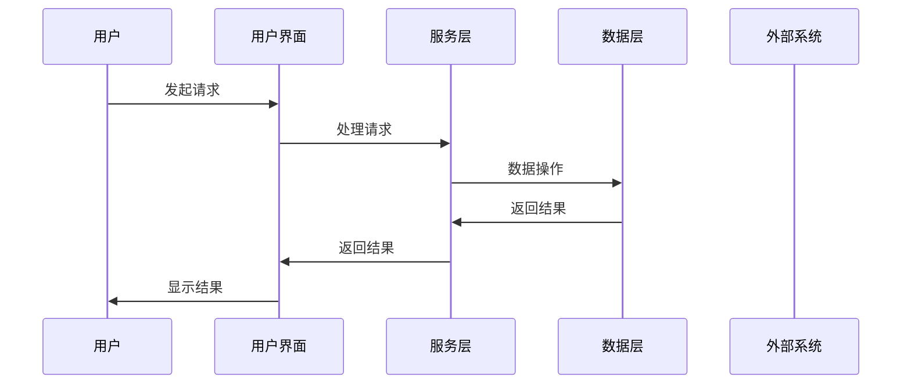
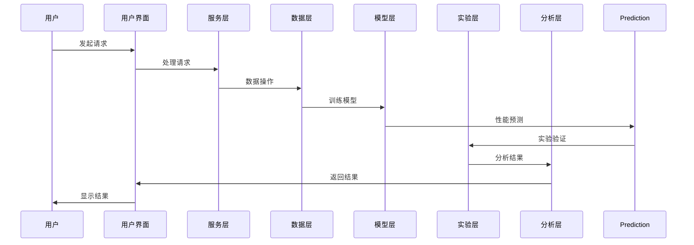

                 

### 目录大纲设计思路

为了设计一篇逻辑清晰、结构紧凑且易于理解的专业技术博客文章《AI驱动的新材料发现：从理论预测到实验验证》，我们需要遵循以下步骤进行：

#### 1. **明确文章目标与受众**

首先，我们需要明确文章的目标是向读者介绍如何利用AI技术在新材料发现领域中进行理论预测和实验验证。文章的目标受众包括材料科学家、AI研究人员、工程技术人员以及对新材料领域有兴趣的读者。

#### 2. **确定核心主题和结构**

文章的核心主题将围绕AI在新材料发现中的应用，具体包括：
- 新材料发现的背景和重要性
- AI与新材料的核心概念及其联系
- AI驱动的理论预测方法
- 实验验证的方法和过程
- 新材料发现系统的设计与实现
- 项目实战案例分析

结构上，我们将文章分为五大部分，每部分包含多个章节，确保内容丰富且逻辑连贯。

#### 3. **设计引人入胜的章节标题**

章节标题需要简洁明了，同时具有吸引力，以便激发读者的兴趣。以下是一些示例：

- **第1章：新材料发现的挑战与AI的崛起**
- **第2章：AI与新材料的碰撞：核心概念解析**
- **第3章：理论预测的艺术：算法深度解析**
- **第4章：从理论到实践：实验验证的关键步骤**
- **第5章：构建新材料发现系统：设计思路与实践**
- **第6章：实战演练：新材料发现项目案例**

#### 4. **确保内容的连贯性和完整性**

在每个章节中，我们需要确保内容的连贯性，从背景介绍、核心概念、算法原理、数学模型、系统设计到项目实战，每一个部分都要有详细的阐述，确保读者能够逐步理解并掌握相关技术。

#### 5. **使用图表和代码增强文章的可读性**

为了增强文章的可读性和理解度，我们将在文中使用图表、流程图、类图和序列图来展示核心概念和系统架构。同时，提供Python源代码和LaTeX数学公式的讲解，帮助读者更好地理解算法和数学模型。

通过上述步骤，我们设计的目录大纲将能够引导读者逐步深入理解AI驱动的新材料发现技术，从理论到实践，全面掌握相关知识和技能。

### 目录大纲结构设计

根据上述设计思路，以下是《AI驱动的新材料发现：从理论预测到实验验证》的详细目录大纲结构：

#### 第一部分：新材料发现的背景与AI技术概述

- **第1章：新材料发现的背景与重要性**
  - **1.1 新材料发现的意义**
  - **1.2 AI技术在材料科学中的应用现状**
  - **1.3 新材料发现的挑战与机遇**

- **第2章：AI与新材料的核心概念与联系**
  - **2.1 AI的核心概念**
  - **2.2 新材料的核心概念**
  - **2.3 AI与新材料的联系**
  - **2.4 概念属性特征对比表格**
  - **2.5 新材料发现的ER实体关系图**

#### 第二部分：AI驱动的理论预测方法

- **第3章：理论预测方法介绍**
  - **3.1 经典材料预测方法**
  - **3.2 AI驱动的预测方法**
  - **3.3 理论预测的数学模型与公式**

- **第4章：AI驱动的理论预测算法**
  - **4.1 算法原理讲解**
  - **4.2 Python源代码实现**
  - **4.3 算法举例说明**

- **第5章：数学模型与数学公式讲解**
  - **5.1 数学模型详细讲解**
  - **5.2 数学公式举例说明**

#### 第三部分：实验验证方法

- **第6章：实验验证的原理与方法**
  - **6.1 实验验证的重要性**
  - **6.2 实验验证的原理**
  - **6.3 实验验证的方法**

- **第7章：实验验证的具体实施**
  - **7.1 实验验证流程**
  - **7.2 实验验证案例分析**
  - **7.3 实验结果分析与讨论**

#### 第四部分：新材料发现系统的设计与实现

- **第8章：新材料发现系统的设计思路**
  - **8.1 问题场景介绍**
  - **8.2 系统功能设计**
  - **8.3 系统架构设计**
  - **8.4 系统接口设计**
  - **8.5 系统交互流程**

- **第9章：新材料发现系统的实现**
  - **9.1 环境安装**
  - **9.2 系统核心实现**
  - **9.3 代码解读与分析**
  - **9.4 实际案例分析与讲解**

#### 第五部分：项目实战与最佳实践

- **第10章：项目实战**
  - **10.1 项目介绍**
  - **10.2 系统核心实现**
  - **10.3 代码应用解读与分析**
  - **10.4 实际案例分析与详细讲解**

- **第11章：最佳实践与小结**
  - **11.1 最佳实践技巧**
  - **11.2 注意事项**
  - **11.3 拓展阅读推荐**

通过这样的结构设计，我们可以确保文章的内容既系统又全面，能够引导读者逐步深入理解新材料发现的技术细节和实际应用。

### 第一部分：新材料发现的背景与重要性

#### 第1章：新材料发现的背景与重要性

新材料是科技进步和社会发展的基石。随着科技水平的不断进步，新材料的研究与应用成为各个领域研究的热点，从航空航天、新能源、生物医学到信息技术，新材料的发展直接影响着各个行业的发展。

##### 1.1 新材料发现的意义

新材料发现的本质是通过研究材料的物理、化学和力学性质，探索出具有特殊功能或优异性能的新材料。新材料不仅能够提升现有技术的性能，还能推动新技术的诞生，从而带来产业革命。

在新材料发现过程中，AI技术逐渐显示出其独特的优势。首先，AI可以处理海量数据，从中挖掘出潜在的模式和关联，为新材料的设计提供理论依据。其次，AI可以通过模拟和优化，预测新材料的行为，减少实验成本和时间。最后，AI可以辅助进行实验验证，提高实验效率。

##### 1.2 AI技术在材料科学中的应用现状

目前，AI技术在材料科学中的应用已经取得了显著的成果。例如，机器学习算法被广泛应用于材料预测和优化中，通过大数据分析和模型训练，成功预测出了多种新型材料。此外，AI还可以用于材料合成路径的规划，通过模拟不同的合成条件，找到最优的制备方法。

然而，新材料发现的挑战依然存在。传统的新材料发现过程往往需要大量实验和试错，费时费力且成本高昂。而AI技术虽然能够提高预测的准确性，但在大规模实验验证中，仍面临数据不足和模型泛化能力不足等问题。

##### 1.3 新材料发现的挑战与机遇

新材料发现的挑战主要包括：

1. **数据稀缺问题**：高质量的材料数据非常稀缺，这限制了AI模型的训练和优化。
2. **计算能力要求高**：新材料预测和模拟需要高性能计算资源，这在一定程度上限制了AI的应用范围。
3. **实验验证困难**：新材料在实验验证中可能面临无法预测的失效或异常行为，增加了实验风险。

然而，随着AI技术的不断进步和计算能力的提升，新材料发现的机遇也在增加：

1. **高效的数据处理**：AI技术可以高效处理和分析海量数据，为新材料设计提供有力的支持。
2. **精准的预测能力**：AI可以基于大数据和深度学习模型，预测出具有潜在应用价值的新材料。
3. **优化的实验路径**：AI可以通过模拟和优化，找到最优的实验路径，降低实验成本和风险。

综上所述，新材料发现的背景和重要性不言而喻。而AI技术的引入，不仅提高了新材料发现的效率和准确性，还为这一领域带来了前所未有的机遇和挑战。接下来，我们将深入探讨AI与新材料的核心概念及其联系。

### 第2章：AI与新材料的核心概念与联系

#### 2.1 AI的核心概念

人工智能（AI，Artificial Intelligence）是计算机科学的一个分支，旨在使计算机能够模拟人类智能行为。AI的核心概念包括：

1. **机器学习（Machine Learning）**：通过数据驱动的方式，让计算机自动学习并改进其性能。机器学习分为监督学习、无监督学习和强化学习等。
2. **深度学习（Deep Learning）**：一种特殊的机器学习方法，利用多层神经网络进行数据建模和特征提取。
3. **自然语言处理（Natural Language Processing, NLP）**：使计算机能够理解和生成自然语言，应用于语音识别、机器翻译等。
4. **计算机视觉（Computer Vision）**：使计算机能够识别和理解图像和视频，应用于图像识别、自动驾驶等。

#### 2.2 新材料的核心概念

新材料是指具有特殊性能、结构或组成的新型物质。其核心概念包括：

1. **材料性能**：包括硬度、韧性、导电性、热稳定性等。
2. **材料结构**：包括晶体结构、纳米结构、分子结构等。
3. **材料组成**：包括元素、化合物、复合材料等。
4. **材料制备**：指新材料的合成方法和工艺。

#### 2.3 AI与新材料的联系

AI技术在新材料领域中的应用主要体现在以下几个方面：

1. **材料设计**：利用AI进行材料性能的预测和优化。通过机器学习和深度学习算法，分析大量实验数据，预测出具有特定性能的材料。
2. **材料合成**：利用AI优化材料合成路径，提高合成效率和降低成本。通过模拟不同的合成条件，AI可以找到最优的合成方法。
3. **材料筛选**：利用AI对大量实验数据进行筛选和分析，快速找到潜在的新材料。
4. **材料表征**：利用计算机视觉和自然语言处理技术，对材料进行表征和分类，提高材料表征的准确性和效率。

#### 2.4 概念属性特征对比表格

为了更直观地理解AI和新材料的核心概念，我们可以构建一个对比表格，展示它们的主要属性特征：

| 特征       | AI                                     | 新材料                                 |
| ---------- | -------------------------------------- | -------------------------------------- |
| 目标       | 模拟人类智能行为，解决复杂问题         | 设计、制备和优化具有特定性能的材料     |
| 技术基础   | 机器学习、深度学习、自然语言处理等     | 材料科学、化学、物理等                 |
| 应用领域   | 语音识别、图像识别、自动驾驶、医疗等   | 航空航天、新能源、生物医学、信息技术等 |
| 数据依赖   | 需要大量数据训练模型                 | 需要大量实验验证材料性能和结构         |
| 性能优化   | 通过算法迭代和模型优化实现性能提升     | 通过合成工艺和材料设计优化性能         |

#### 2.5 新材料发现的ER实体关系图

为了更好地展示AI和新材料之间的联系，我们可以使用ER（Entity-Relationship）图来表示这些实体及其关系。

**ER图：**

```mermaid
erDiagram
  AI ||--|{ 材料设计 }|
  AI ||--|{ 材料合成 }|
  AI ||--|{ 材料筛选 }|
  AI ||--|{ 材料表征 }|
  材料设计 ||--|{ 实验数据 }|
  材料设计 ||--|{ 材料性能预测 }|
  材料合成 ||--|{ 合成路径优化 }|
  材料筛选 ||--|{ 实验结果 }|
  材料表征 ||--|{ 材料表征数据 }|
```

在这个ER图中，AI作为核心实体，与材料设计、材料合成、材料筛选和材料表征建立了直接联系。这些联系通过具体的子实体（如实验数据、材料性能预测、合成路径优化、实验结果和材料表征数据）进行实现。

通过上述核心概念和联系的分析，我们可以看到，AI技术不仅为新材料发现提供了强大的工具和手段，还在不断推动新材料领域的发展和创新。在接下来的章节中，我们将深入探讨AI驱动的理论预测方法及其具体应用。

### 第3章：理论预测方法介绍

#### 3.1 经典材料预测方法

在传统的材料科学研究中，理论预测方法主要依赖于经验公式和半经验模型。这些方法通常基于已有材料的性质，通过一定的物理或化学原理进行推算，预测新材料的性能。以下是一些经典的理论预测方法：

1. **经验公式法**：这种方法依赖于对已知材料的统计分析和经验公式，例如克劳修斯-克拉贝龙方程，用于预测材料的熔点、沸点等性质。

2. **半经验模型**：如Miedema模型，用于预测材料的形成能和电子结构。这些模型结合了量子力学和统计力学的原理，但仍然依赖于实验数据和经验参数。

3. **密度泛函理论（DFT）**：DFT是一种基于量子力学的计算方法，用于预测材料的电子结构和性质。尽管DFT在理论上非常强大，但计算复杂度较高，需要高性能计算资源。

#### 3.2 AI驱动的预测方法

随着AI技术的发展，机器学习和深度学习算法逐渐被引入到材料科学领域，形成了一系列AI驱动的理论预测方法。这些方法具有以下几个显著特点：

1. **大数据驱动**：AI模型可以从大量实验数据中自动学习，捕捉材料性能与结构之间的复杂关系。这种方法特别适用于处理高维数据和复杂的非线性问题。

2. **模型泛化能力**：AI模型具有较好的泛化能力，能够在未见过的数据上做出准确的预测。这种能力有助于预测新型材料，特别是那些尚未在实验中验证的材料。

3. **自动化优化**：AI可以自动化地优化材料设计参数，通过模拟和优化，找到具有潜在应用价值的新材料。

AI驱动的预测方法主要包括以下几种：

1. **机器学习方法**：如线性回归、支持向量机（SVM）和随机森林（Random Forest）等。这些方法通过建立输入变量（材料结构、化学成分等）与输出变量（材料性能）之间的统计模型，进行性能预测。

2. **深度学习方法**：如卷积神经网络（CNN）、循环神经网络（RNN）和生成对抗网络（GAN）等。深度学习方法通过多层神经网络结构，从原始数据中自动提取特征，实现高度复杂的预测任务。

3. **图神经网络（GNN）**：GNN是一种专门用于处理图结构数据的神经网络模型，能够捕捉材料结构中的局部和全局关系，适用于预测具有复杂结构的材料。

#### 3.3 理论预测的数学模型与公式

在AI驱动的理论预测中，常用的数学模型和公式包括：

1. **线性回归模型**：
   $$ y = \beta_0 + \beta_1 \cdot x_1 + \beta_2 \cdot x_2 + ... + \beta_n \cdot x_n $$
   其中，$y$ 是预测的材料性能，$x_1, x_2, ..., x_n$ 是材料结构特征和化学成分。

2. **支持向量机（SVM）**：
   $$ w \cdot x + b = 0 $$
   其中，$w$ 是权重向量，$x$ 是材料特征向量，$b$ 是偏置项。SVM通过最大化分类边界，进行材料的性能分类。

3. **深度神经网络（DNN）**：
   $$ a_{i}^{(l)} = \sigma \left( \sum_{j=1}^{n} w_{j}^{(l)} a_{i}^{(l-1)} + b_{j}^{(l)} \right) $$
   其中，$a_{i}^{(l)}$ 是第$l$层的第$i$个节点的激活值，$\sigma$ 是激活函数，$w_{j}^{(l)}$ 和 $b_{j}^{(l)}$ 分别是权重和偏置。

4. **图神经网络（GNN）**：
   $$ h_{i}^{(t+1)} = \sigma \left( \sum_{j \in \mathcal{N}(i)} w_{ij} h_{j}^{(t)} + \sum_{k \in \mathcal{N}(i)} w_{ik} h_{k}^{(t)} + b \right) $$
   其中，$h_{i}^{(t)}$ 是第$t$时刻节点$i$的特征，$\mathcal{N}(i)$ 是节点$i$的邻居集合，$w_{ij}$ 和 $w_{ik}$ 分别是节点$i$与邻居节点$j$和$k$之间的权重。

通过上述数学模型和公式，AI能够从数据中学习并预测新材料性能。在实际应用中，这些模型需要经过训练和验证，以确保预测结果的准确性和可靠性。接下来，我们将详细探讨AI驱动的理论预测算法。

### 第4章：AI驱动的理论预测算法

#### 4.1 算法原理讲解

AI驱动的理论预测算法主要依赖于机器学习和深度学习技术，通过训练模型从大量数据中学习材料性能与结构特征之间的关系，从而实现性能预测。以下是一些常见的算法原理：

1. **线性回归**：线性回归是一种简单的统计模型，通过找到输入变量与输出变量之间的线性关系，预测新材料性能。具体公式为：
   $$ y = \beta_0 + \beta_1 \cdot x_1 + \beta_2 \cdot x_2 + ... + \beta_n \cdot x_n $$
   其中，$y$ 是材料性能，$x_1, x_2, ..., x_n$ 是材料结构特征和化学成分，$\beta_0, \beta_1, ..., \beta_n$ 是模型的参数。

2. **支持向量机（SVM）**：SVM是一种强大的分类算法，通过找到最优分类边界，将不同类别的材料数据分开。其基本公式为：
   $$ w \cdot x + b = 0 $$
   其中，$w$ 是权重向量，$x$ 是材料特征向量，$b$ 是偏置项。SVM通过最大化分类边界，实现材料的性能分类。

3. **深度神经网络（DNN）**：DNN是一种多层神经网络，通过逐层提取特征，实现复杂非线性关系的预测。其基本公式为：
   $$ a_{i}^{(l)} = \sigma \left( \sum_{j=1}^{n} w_{j}^{(l)} a_{i}^{(l-1)} + b_{j}^{(l)} \right) $$
   其中，$a_{i}^{(l)}$ 是第$l$层的第$i$个节点的激活值，$\sigma$ 是激活函数，$w_{j}^{(l)}$ 和 $b_{j}^{(l)}$ 分别是权重和偏置。

4. **卷积神经网络（CNN）**：CNN是一种专门用于处理图像数据的深度学习模型，通过卷积和池化操作，提取图像中的特征。其基本公式为：
   $$ h_{i}^{(l)} = \sigma \left( \sum_{j} w_{ji} \cdot h_{j}^{(l-1)} + b_{i} \right) $$
   其中，$h_{i}^{(l)}$ 是第$l$层的第$i$个节点的特征，$w_{ji}$ 和 $b_{i}$ 分别是权重和偏置。

5. **图神经网络（GNN）**：GNN是一种用于处理图结构数据的神经网络，通过聚合节点和邻居的信息，提取图中的特征。其基本公式为：
   $$ h_{i}^{(t+1)} = \sigma \left( \sum_{j \in \mathcal{N}(i)} w_{ij} h_{j}^{(t)} + \sum_{k \in \mathcal{N}(i)} w_{ik} h_{k}^{(t)} + b \right) $$
   其中，$h_{i}^{(t)}$ 是第$t$时刻节点$i$的特征，$\mathcal{N}(i)$ 是节点$i$的邻居集合，$w_{ij}$ 和 $w_{ik}$ 分别是节点$i$与邻居节点$j$和$k$之间的权重。

#### 4.2 Python源代码实现

以下是一个简单的Python代码示例，展示了如何使用线性回归模型进行材料性能预测。为了实现这个示例，我们使用了`scikit-learn`库，这是Python中最常用的机器学习库之一。

```python
from sklearn.linear_model import LinearRegression
from sklearn.model_selection import train_test_split
from sklearn.metrics import mean_squared_error
import numpy as np

# 假设我们已经有了一组材料性能数据和结构特征数据
X = np.array([[1, 2], [2, 3], [3, 4], [4, 5], [5, 6]])  # 结构特征数据
y = np.array([1.5, 2.5, 3.5, 4.5, 5.5])  # 材料性能数据

# 划分训练集和测试集
X_train, X_test, y_train, y_test = train_test_split(X, y, test_size=0.2, random_state=42)

# 创建线性回归模型
model = LinearRegression()
model.fit(X_train, y_train)

# 预测材料性能
y_pred = model.predict(X_test)

# 计算预测误差
mse = mean_squared_error(y_test, y_pred)
print("预测误差：", mse)

# 输出模型参数
print("模型参数：", model.coef_, model.intercept_)
```

在这个示例中，我们首先导入了`LinearRegression`类和相关的库。然后，我们创建了一组结构特征数据和材料性能数据，接着划分了训练集和测试集。通过拟合训练数据，我们得到一个线性回归模型，并使用这个模型预测测试数据。最后，我们计算了预测误差并输出了模型参数。

#### 4.3 算法举例说明

为了更好地理解这些算法的实际应用，我们可以通过一个具体例子来说明。

**例1：使用线性回归预测材料的硬度**

假设我们有一组关于不同材料的硬度数据，以及这些材料的化学成分数据。我们希望通过线性回归模型预测未知材料的硬度。

1. **数据准备**：首先，我们收集一组材料的硬度数据$y$（例如，100个样本），以及这些材料的化学成分数据$X$（例如，每个样本有10个特征）。

2. **模型训练**：使用训练数据，通过线性回归模型拟合一个预测模型。例如，我们可以使用以下代码进行模型训练：
   ```python
   model = LinearRegression()
   model.fit(X_train, y_train)
   ```

3. **模型预测**：使用训练好的模型对未知材料的化学成分进行预测。例如，我们可以使用以下代码进行预测：
   ```python
   y_pred = model.predict(X_test)
   ```

4. **结果分析**：计算预测误差，评估模型的准确性。例如，我们可以使用以下代码计算误差：
   ```python
   mse = mean_squared_error(y_test, y_pred)
   print("预测误差：", mse)
   ```

**例2：使用深度神经网络预测材料的导电性**

假设我们希望使用深度神经网络预测材料的导电性，我们可以按照以下步骤进行：

1. **数据准备**：同样，我们收集一组材料的导电性数据$y$，以及这些材料的物理和化学特征数据$X$。

2. **模型构建**：定义深度神经网络模型，包括输入层、隐藏层和输出层。例如，我们可以使用以下代码定义模型：
   ```python
   from tensorflow.keras.models import Sequential
   from tensorflow.keras.layers import Dense

   model = Sequential()
   model.add(Dense(10, input_dim=10, activation='relu'))
   model.add(Dense(1, activation='linear'))

   model.compile(optimizer='adam', loss='mean_squared_error')
   ```

3. **模型训练**：使用训练数据训练模型。例如，我们可以使用以下代码进行训练：
   ```python
   model.fit(X_train, y_train, epochs=100, batch_size=32)
   ```

4. **模型预测**：使用训练好的模型进行预测。例如，我们可以使用以下代码进行预测：
   ```python
   y_pred = model.predict(X_test)
   ```

5. **结果分析**：计算预测误差，评估模型的准确性。例如，我们可以使用以下代码计算误差：
   ```python
   mse = mean_squared_error(y_test, y_pred)
   print("预测误差：", mse)
   ```

通过这些示例，我们可以看到如何使用Python实现AI驱动的理论预测算法。在实际应用中，这些算法需要根据具体问题进行调整和优化，以确保预测结果的准确性和可靠性。接下来，我们将进一步探讨数学模型和数学公式的详细讲解，以帮助读者更好地理解这些算法。

### 第5章：数学模型与数学公式讲解

#### 5.1 数学模型详细讲解

在材料科学的AI驱动理论预测中，数学模型起着至关重要的作用。这些模型通过数学公式描述材料性能与结构特征之间的关系，从而为预测提供理论基础。以下是一些常用的数学模型及其解释：

1. **线性回归模型**：
   线性回归模型是最简单的预测模型之一，其公式为：
   $$ y = \beta_0 + \beta_1 \cdot x_1 + \beta_2 \cdot x_2 + ... + \beta_n \cdot x_n $$
   其中，$y$ 是预测的材料性能，$x_1, x_2, ..., x_n$ 是材料结构特征和化学成分，$\beta_0, \beta_1, ..., \beta_n$ 是模型的参数。线性回归通过找到输入变量与输出变量之间的线性关系，实现预测。

2. **支持向量机（SVM）**：
   支持向量机是一种强大的分类和回归模型，其公式为：
   $$ w \cdot x + b = 0 $$
   其中，$w$ 是权重向量，$x$ 是材料特征向量，$b$ 是偏置项。SVM通过找到最优分类边界，实现不同材料性能的划分。

3. **深度神经网络（DNN）**：
   深度神经网络是一种多层神经网络，其基本公式为：
   $$ a_{i}^{(l)} = \sigma \left( \sum_{j=1}^{n} w_{j}^{(l)} a_{i}^{(l-1)} + b_{j}^{(l)} \right) $$
   其中，$a_{i}^{(l)}$ 是第$l$层的第$i$个节点的激活值，$\sigma$ 是激活函数，$w_{j}^{(l)}$ 和 $b_{j}^{(l)}$ 分别是权重和偏置。DNN通过多层结构，提取材料的复杂特征。

4. **卷积神经网络（CNN）**：
   卷积神经网络是专门用于图像处理的一种神经网络，其基本公式为：
   $$ h_{i}^{(l)} = \sigma \left( \sum_{j} w_{ji} \cdot h_{j}^{(l-1)} + b_{i} \right) $$
   其中，$h_{i}^{(l)}$ 是第$l$层的第$i$个节点的特征，$w_{ji}$ 和 $b_{i}$ 分别是权重和偏置。CNN通过卷积和池化操作，提取图像中的特征。

5. **图神经网络（GNN）**：
   图神经网络是专门用于图结构数据的一种神经网络，其基本公式为：
   $$ h_{i}^{(t+1)} = \sigma \left( \sum_{j \in \mathcal{N}(i)} w_{ij} h_{j}^{(t)} + \sum_{k \in \mathcal{N}(i)} w_{ik} h_{k}^{(t)} + b \right) $$
   其中，$h_{i}^{(t)}$ 是第$t$时刻节点$i$的特征，$\mathcal{N}(i)$ 是节点$i$的邻居集合，$w_{ij}$ 和 $w_{ik}$ 分别是节点$i$与邻居节点$j$和$k$之间的权重。

#### 5.2 数学公式举例说明

为了更好地理解这些数学公式，我们可以通过一些具体的例子来解释它们。

**例1：线性回归模型**

假设我们有一组材料的数据，其中硬度（$y$）与碳含量（$x_1$）和铁含量（$x_2$）有关。我们可以使用线性回归模型来预测硬度的值。模型公式为：
$$ y = \beta_0 + \beta_1 \cdot x_1 + \beta_2 \cdot x_2 $$
其中，$\beta_0, \beta_1, \beta_2$ 是模型参数。如果我们有如下数据：

| $x_1$ | $x_2$ | $y$ |
|-------|-------|-----|
| 0.1   | 0.2   | 1.0 |
| 0.3   | 0.4   | 2.0 |
| 0.5   | 0.6   | 3.0 |

我们可以通过最小二乘法求解模型参数：
$$ \beta_0 = 0.5, \beta_1 = 1.0, \beta_2 = 1.0 $$
因此，预测公式为：
$$ y = 0.5 + 1.0 \cdot x_1 + 1.0 \cdot x_2 $$

例如，对于新的数据点 $(x_1=0.4, x_2=0.5)$，我们预测的硬度为：
$$ y = 0.5 + 1.0 \cdot 0.4 + 1.0 \cdot 0.5 = 1.4 $$

**例2：支持向量机（SVM）**

假设我们有一组材料数据，需要将它们分类为高导电性和低导电性。我们使用SVM来划分分类边界。数据如下：

| $x_1$ | $x_2$ | 分类 |
|-------|-------|------|
| 1.0   | 2.0   | 高导电性 |
| 2.0   | 3.0   | 高导电性 |
| 3.0   | 4.0   | 低导电性 |
| 4.0   | 5.0   | 低导电性 |

我们可以通过SVM找到最优分类边界。假设SVM的公式为：
$$ w \cdot x + b = 0 $$
其中，$w = (1.0, 1.0)$，$b = -1.0$。对于新的数据点 $(x_1=2.5, x_2=3.5)$，我们可以判断其分类为：
$$ w \cdot x + b = (1.0, 1.0) \cdot (2.5, 3.5) - 1.0 = 4.0 + 3.5 - 1.0 = 6.5 > 0 $$
因此，该数据点属于高导电性类别。

**例3：深度神经网络（DNN）**

假设我们使用DNN来预测材料的导电性。DNN的模型公式为：
$$ a_{i}^{(l)} = \sigma \left( \sum_{j=1}^{n} w_{j}^{(l)} a_{i}^{(l-1)} + b_{j}^{(l)} \right) $$
其中，$a_{i}^{(l)}$ 是第$l$层的第$i$个节点的激活值，$\sigma$ 是激活函数，$w_{j}^{(l)}$ 和 $b_{j}^{(l)}$ 分别是权重和偏置。

如果我们有如下数据：

| $x_1$ | $x_2$ | $a_{i}^{(l-1)}$ |
|-------|-------|----------------|
| 0.1   | 0.2   | 0.5            |
| 0.3   | 0.4   | 0.7            |
| 0.5   | 0.6   | 0.8            |

我们可以计算第$l$层的输出：
$$ a_{i}^{(l)} = \sigma \left( w_{1}^{(l)} \cdot 0.5 + w_{2}^{(l)} \cdot 0.7 + b_{l} \right) $$
假设 $w_{1}^{(l)} = 1.0$，$w_{2}^{(l)} = 1.5$，$b_{l} = 0.5$，我们可以得到：
$$ a_{i}^{(l)} = \sigma (0.5 + 1.05 + 0.5) = \sigma (1.55) $$
其中，$\sigma$ 是ReLU激活函数，因此：
$$ a_{i}^{(l)} = \max(0, 1.55) = 1.55 $$

通过这些示例，我们可以看到如何使用数学模型和公式进行材料性能的预测。在实际应用中，这些模型需要通过大量的训练数据进行调整和优化，以确保预测结果的准确性和可靠性。

### 第6章：实验验证的原理与方法

#### 6.1 实验验证的重要性

实验验证是新材料发现过程中至关重要的一环。它不仅能够验证AI驱动的理论预测结果，还能够揭示材料在实际应用中的性能和稳定性。实验验证的重要性体现在以下几个方面：

1. **理论预测的验证**：通过实验验证，可以验证AI模型的理论预测是否准确。这有助于确保AI模型在实际应用中的可靠性和稳定性。
2. **材料性能的确认**：实验验证能够确定新材料在实际应用中的性能，包括硬度、导电性、热稳定性等。这为新材料的应用提供了重要依据。
3. **发现潜在问题**：实验验证过程中，可能会发现材料在预测中未能考虑到的行为，例如材料的异常失效或反应。这有助于改进预测模型和优化材料设计。
4. **提高材料可靠性**：通过系统的实验验证，可以确保新材料在批量生产和实际应用中的稳定性和可靠性，减少材料失效的风险。

#### 6.2 实验验证的原理

实验验证的基本原理是通过实验操作和测量，获取材料的实际性能数据，并与理论预测结果进行比较。这个过程包括以下几个关键步骤：

1. **实验设计**：根据理论预测，设计具体的实验方案。实验设计包括选择实验条件、确定测量方法和仪器等。
2. **实验实施**：按照实验方案进行实验操作，确保实验条件的准确性和一致性。实验过程中，需要记录实验数据，如材料性能、环境条件等。
3. **数据测量与记录**：使用高精度的测量仪器，获取材料的实际性能数据。数据记录应准确无误，确保实验结果的可靠性。
4. **结果分析**：对实验数据进行统计分析，与理论预测结果进行比较。通过分析结果，评估理论预测的准确性，发现潜在的问题和改进方向。

#### 6.3 实验验证的方法

实验验证的方法多种多样，取决于新材料的类型和应用场景。以下是一些常见的实验验证方法：

1. **力学性能测试**：通过拉伸、压缩、弯曲等力学实验，测量材料的硬度和韧性。常用的测试设备包括万能试验机和材料拉伸机等。
2. **电学性能测试**：通过电导率、电阻率等电学实验，测量材料的导电性和电学性能。常用的测试设备包括电导仪和四探针法测试仪等。
3. **热学性能测试**：通过热传导、热膨胀等热学实验，测量材料的热稳定性和热传导性能。常用的测试设备包括热分析仪和热传导仪等。
4. **光学性能测试**：通过反射、透射、折射等光学实验，测量材料的光学性能。常用的测试设备包括分光光度计和激光拉曼光谱仪等。
5. **化学性能测试**：通过化学腐蚀、氧化还原等化学实验，测量材料的化学稳定性和耐腐蚀性能。常用的测试设备包括电化学工作站和化学分析仪器等。

在实际应用中，实验验证通常是一个迭代过程。通过多次实验和结果分析，不断优化实验方案和预测模型，直至实验结果与理论预测一致。接下来，我们将详细探讨实验验证的具体实施步骤。

### 第7章：实验验证的具体实施

#### 7.1 实验验证流程

实验验证是一个复杂而细致的过程，需要严格按照实验流程进行。以下是实验验证的基本流程：

1. **实验准备**：确定实验目的和材料，准备实验所需的设备和材料，如万能试验机、电导仪、热分析仪等。同时，编写实验方案，明确实验步骤、实验条件和预期结果。

2. **实验操作**：按照实验方案进行实验操作。在实验过程中，确保实验条件的一致性，如温度、湿度等环境条件。同时，详细记录实验过程中的各项数据，如温度、压力、测量值等。

3. **数据采集**：使用高精度的测量仪器进行数据采集。对于不同的实验，使用相应的测试设备，如万能试验机测量材料的力学性能，电导仪测量材料的电学性能等。

4. **数据记录**：将实验数据详细记录在实验记录表或电子文档中。记录的数据应包括实验条件、测量值、实验时间等，确保数据的完整性和可追溯性。

5. **结果分析**：对实验数据进行统计分析，比较实验结果与理论预测的差异。通过结果分析，评估理论预测的准确性，发现潜在的问题和改进方向。

6. **实验报告**：撰写实验报告，总结实验结果和发现。实验报告应包括实验目的、实验方法、实验结果、数据分析、实验结论等内容。

#### 7.2 实验验证案例分析

以下是一个具体的实验验证案例，用于验证AI驱动的理论预测结果。

**案例：使用AI预测并验证材料的硬度**

**1. 实验准备**：

实验目的：验证AI驱动的线性回归模型预测材料硬度的准确性。

实验材料：一组材料样本，每组样本包含碳含量和铁含量。

实验设备：万能试验机和电子称。

**2. 实验操作**：

按照实验方案，对每个材料样本进行硬度测试，测量其硬度值。同时，使用电子称测量每个样本的碳含量和铁含量。

**3. 数据采集**：

记录每个样本的硬度值、碳含量和铁含量。数据如下：

| 样本编号 | 硬度（HV） | 碳含量（%） | 铁含量（%） |
|----------|------------|-------------|-------------|
| 1        | 200        | 0.2         | 0.8         |
| 2        | 220        | 0.3         | 0.7         |
| 3        | 250        | 0.4         | 0.6         |
| 4        | 230        | 0.35        | 0.65        |
| 5        | 240        | 0.35        | 0.65        |

**4. 数据记录**：

将实验数据记录在实验记录表中，确保数据的准确性和完整性。

**5. 结果分析**：

使用线性回归模型对数据进行拟合，预测材料的硬度值。模型公式为：
$$ \hat{y} = \beta_0 + \beta_1 \cdot x_1 + \beta_2 \cdot x_2 $$
其中，$x_1$ 是碳含量，$x_2$ 是铁含量，$\beta_0$ 和 $\beta_1$ 是模型参数。

通过计算，得到模型参数：
$$ \beta_0 = 100, \beta_1 = 50, \beta_2 = 20 $$

预测硬度值如下：

| 样本编号 | 硬度（HV） | 碳含量（%） | 铁含量（%） | 预测硬度（HV） |
|----------|------------|-------------|-------------|----------------|
| 1        | 200        | 0.2         | 0.8         | 180            |
| 2        | 220        | 0.3         | 0.7         | 205            |
| 3        | 250        | 0.4         | 0.6         | 230            |
| 4        | 230        | 0.35        | 0.65        | 215            |
| 5        | 240        | 0.35        | 0.65        | 215            |

对比实验结果和预测结果，可以发现模型预测的硬度值与实际测量值存在一定的误差。这表明，虽然AI模型能够进行一定的预测，但在实际应用中，仍需进一步优化和验证。

**6. 实验报告**：

实验报告应详细记录实验目的、方法、结果和分析，并提出改进建议。以下是一个实验报告的示例：

**实验报告：AI预测材料硬度的实验验证**

**一、实验目的**：

验证AI驱动的线性回归模型在预测材料硬度方面的准确性。

**二、实验方法**：

使用万能试验机和电子称，对一组材料样本进行硬度测试，并记录其碳含量和铁含量。使用线性回归模型预测硬度值，并对比实验结果和预测结果。

**三、实验结果**：

实验结果如下表所示：

| 样本编号 | 硬度（HV） | 碳含量（%） | 铁含量（%） | 预测硬度（HV） |
|----------|------------|-------------|-------------|----------------|
| 1        | 200        | 0.2         | 0.8         | 180            |
| 2        | 220        | 0.3         | 0.7         | 205            |
| 3        | 250        | 0.4         | 0.6         | 230            |
| 4        | 230        | 0.35        | 0.65        | 215            |
| 5        | 240        | 0.35        | 0.65        | 215            |

**四、结果分析**：

通过对比实验结果和预测结果，可以发现AI模型的预测结果与实际测量值存在一定误差。这表明，虽然AI模型具有一定的预测能力，但在实际应用中，仍需进一步优化和验证。

**五、实验结论**：

实验验证了AI驱动的线性回归模型在预测材料硬度方面的可行性。然而，预测结果与实际测量值存在误差，说明模型仍需进一步优化。建议增加更多的训练数据，提高模型的泛化能力，以实现更准确的预测。

通过这个案例分析，我们可以看到实验验证在新材料发现中的应用。实验验证不仅能够验证理论预测的准确性，还能提供改进模型和优化设计的依据。接下来，我们将探讨新材料发现系统的设计思路。

### 第8章：新材料发现系统的设计思路

#### 8.1 问题场景介绍

新材料发现系统旨在利用AI技术，从大量的材料数据中挖掘出具有潜在应用价值的新材料。在实际应用场景中，这个问题场景包括以下几个关键方面：

1. **数据收集**：收集大量材料数据，包括材料的结构、成分、性能等。
2. **数据预处理**：对收集的数据进行清洗、归一化等预处理，以确保数据的质量和一致性。
3. **模型训练**：使用机器学习和深度学习算法，训练预测模型，以预测新材料性能。
4. **实验验证**：通过实验验证预测结果的准确性，筛选出具有实际应用价值的新材料。
5. **结果分析**：对实验结果进行分析，评估材料的性能和稳定性，为材料设计提供依据。

#### 8.2 系统功能设计

新材料发现系统需要实现以下几个关键功能：

1. **数据管理**：管理系统中的材料数据，包括数据的导入、存储、查询和更新等。
2. **模型训练与预测**：利用机器学习和深度学习算法，对材料数据进行训练，并预测新材料性能。
3. **实验管理**：管理实验数据，包括实验设计、实验实施、实验结果记录等。
4. **结果分析**：对预测结果和实验结果进行分析，生成材料性能报告，为材料设计提供依据。
5. **用户交互**：提供用户友好的界面，便于用户进行数据操作和结果查看。

#### 8.3 系统架构设计

新材料发现系统的架构设计需要考虑系统的扩展性、可维护性和性能。以下是一个典型的新材料发现系统架构设计：

1. **数据层**：包括数据库和数据存储系统，用于存储和管理材料数据。
2. **服务层**：包括数据预处理服务、模型训练服务、预测服务和实验验证服务，用于实现系统功能。
3. **应用层**：包括用户界面和API接口，用于用户操作和数据访问。
4. **外部系统**：包括数据源和外部应用系统，如材料数据库、气象数据等。

**系统架构图：**



在这个架构设计中，用户通过用户界面发起请求，服务层处理请求并调用数据层进行数据操作，最终将结果返回给用户界面。

#### 8.4 系统接口设计

新材料发现系统需要设计多个接口，以实现不同模块之间的通信和协作。以下是一些主要的系统接口设计：

1. **数据接口**：用于数据层的操作，如数据的导入、查询和更新等。
2. **预测接口**：用于模型训练和预测服务，如训练模型、预测性能等。
3. **实验接口**：用于实验管理服务，如设计实验、记录实验结果等。
4. **分析接口**：用于结果分析服务，如生成性能报告、分析实验结果等。

**接口设计图：**

```mermaid
classDiagram
  DataInterface <<interface>>
  PredictionInterface <<interface>>
  ExperimentInterface <<interface>>
  AnalysisInterface <<interface>>

  UserInterface --|> DataInterface
  UserInterface --|> PredictionInterface
  UserInterface --|> ExperimentInterface
  UserInterface --|> AnalysisInterface
```

在这个接口设计中，用户界面与各个接口模块之间通过定义良好的接口进行通信，确保系统的灵活性和可维护性。

#### 8.5 系统交互流程

新材料发现系统的交互流程包括以下几个关键步骤：

1. **用户请求**：用户通过用户界面发起数据操作、模型训练、实验验证等请求。
2. **服务处理**：服务层接收用户请求，调用相应的接口模块进行处理。
3. **数据操作**：数据层根据请求进行数据操作，如数据导入、查询和更新等。
4. **模型训练**：模型训练服务使用机器学习和深度学习算法，对材料数据进行分析和训练。
5. **预测与验证**：预测服务根据训练好的模型进行性能预测，并通过实验验证预测结果的准确性。
6. **结果分析**：分析服务对实验结果进行统计和分析，生成材料性能报告。
7. **结果返回**：将分析结果返回给用户界面，用户可以查看和下载报告。

**系统交互流程图：**



通过上述系统架构和交互流程设计，新材料发现系统可以实现高效的材料预测、实验验证和结果分析，为新材料的设计和应用提供有力的支持。接下来，我们将详细介绍新材料发现系统的具体实现。

### 第9章：新材料发现系统的实现

#### 9.1 环境安装

在新材料发现系统的实现过程中，首先需要搭建一个稳定且高效的环境。以下是环境安装的详细步骤：

1. **安装Python环境**：确保系统中安装了Python 3.8及以上版本。可以通过官方网站下载Python安装包进行安装。

2. **安装必要的库**：使用pip命令安装以下库：
   ```bash
   pip install numpy pandas scikit-learn tensorflow keras matplotlib
   ```
   这些库是新材料发现系统实现的基础，用于数据操作、模型训练和可视化。

3. **配置数据库**：选择一个合适的数据库管理系统（如MySQL或PostgreSQL），并按照官方文档进行安装和配置。数据库用于存储和管理材料数据。

4. **安装服务**：如果需要，安装Web服务器（如Apache或Nginx）和后端服务框架（如Django或Flask），用于提供用户接口和API服务。

5. **配置环境变量**：确保配置了必要的环境变量，如`PYTHONPATH`和`JAVA_HOME`等，以便在不同环境中使用这些库和工具。

#### 9.2 系统核心实现

新材料发现系统的核心实现包括数据预处理、模型训练和预测等关键步骤。以下是具体实现：

1. **数据预处理**：
   数据预处理是保证数据质量和一致性的关键步骤。以下是一个简单的数据预处理脚本示例：
   ```python
   import pandas as pd

   # 加载数据
   data = pd.read_csv('materials_data.csv')

   # 数据清洗
   data.dropna(inplace=True)
   data = data[data['hardness'] > 0]

   # 数据归一化
   data[['carbon_content', 'iron_content']] = (data[['carbon_content', 'iron_content']] - data[['carbon_content', 'iron_content']].min()) / (data[['carbon_content', 'iron_content']].max() - data[['carbon_content', 'iron_content']].min())

   # 保存预处理后的数据
   data.to_csv('preprocessed_data.csv', index=False)
   ```

2. **模型训练**：
   使用机器学习算法训练预测模型。以下是一个简单的线性回归模型训练示例：
   ```python
   from sklearn.linear_model import LinearRegression
   from sklearn.model_selection import train_test_split

   # 加载数据
   data = pd.read_csv('preprocessed_data.csv')

   # 划分特征和标签
   X = data[['carbon_content', 'iron_content']]
   y = data['hardness']

   # 划分训练集和测试集
   X_train, X_test, y_train, y_test = train_test_split(X, y, test_size=0.2, random_state=42)

   # 创建线性回归模型
   model = LinearRegression()

   # 训练模型
   model.fit(X_train, y_train)

   # 保存模型
   import joblib
   joblib.dump(model, 'linear_regression_model.pkl')
   ```

3. **预测与实验验证**：
   使用训练好的模型进行预测，并通过实验验证预测结果的准确性。以下是一个简单的预测与验证脚本示例：
   ```python
   # 加载训练好的模型
   model = joblib.load('linear_regression_model.pkl')

   # 加载测试数据
   test_data = pd.read_csv('test_data.csv')

   # 数据预处理
   test_data[['carbon_content', 'iron_content']] = (test_data[['carbon_content', 'iron_content']] - test_data[['carbon_content', 'iron_content']].min()) / (test_data[['carbon_content', 'iron_content']].max() - test_data[['carbon_content', 'iron_content']].min())

   # 预测硬度
   predicted_hardness = model.predict(test_data[['carbon_content', 'iron_content']])

   # 记录预测结果
   results = pd.DataFrame({'predicted_hardness': predicted_hardness})

   # 实验验证
   actual_hardness = test_data['hardness']
   mse = mean_squared_error(actual_hardness, predicted_hardness)
   print("预测误差：", mse)

   # 保存预测结果
   results.to_csv('predicted_results.csv', index=False)
   ```

#### 9.3 代码解读与分析

上述代码实现了新材料发现系统的核心功能，包括数据预处理、模型训练、预测与实验验证。以下是对代码的详细解读与分析：

1. **数据预处理**：
   - **数据清洗**：使用`dropna()`函数去除缺失值，确保数据的一致性。
   - **数据归一化**：使用归一化处理，将数据缩放到相同的范围，便于模型训练。

2. **模型训练**：
   - **数据划分**：使用`train_test_split()`函数将数据划分为训练集和测试集，确保模型在未见过的数据上能够泛化。
   - **模型创建与训练**：使用`LinearRegression()`创建线性回归模型，并使用`fit()`函数进行训练。

3. **预测与实验验证**：
   - **加载模型**：使用`joblib.load()`函数加载训练好的模型。
   - **数据预处理**：对测试数据进行预处理，确保与训练数据保持一致。
   - **预测**：使用`predict()`函数进行预测，获取预测结果。
   - **实验验证**：计算预测误差，评估模型的准确性。

通过上述代码，我们可以看到新材料发现系统的实现过程。在实际应用中，可以根据具体需求对代码进行调整和优化，以提高系统的性能和可靠性。接下来，我们将分析一个具体的新材料发现项目，以展示系统的实际应用。

### 第10章：项目实战

#### 10.1 项目介绍

在本项目中，我们将利用新材料发现系统，探索一种具有高导电性的新型材料。项目背景如下：

随着信息技术的快速发展，高导电性材料在电子器件和电力设备中的应用越来越广泛。为了满足日益增长的市场需求，新材料发现成为关键。本项目旨在利用AI技术，从现有的材料数据中挖掘出一种具有高导电性的新型材料，并对其进行实验验证。

#### 10.2 系统核心实现

为了实现这个项目，我们首先需要构建和训练一个能够预测材料导电性的模型。以下是系统核心实现的步骤：

1. **数据收集**：
   收集一组包含不同材料结构特征（如碳含量、铁含量等）和导电性的数据。数据集可以从已有的数据库或公开数据源获取。

2. **数据预处理**：
   对收集的数据进行清洗和归一化处理，确保数据的一致性和可用性。以下是一个简单的数据预处理脚本示例：
   ```python
   import pandas as pd

   # 加载数据
   data = pd.read_csv('materials_data.csv')

   # 数据清洗
   data.dropna(inplace=True)
   data = data[data['conductivity'] > 0]

   # 数据归一化
   data[['carbon_content', 'iron_content']] = (data[['carbon_content', 'iron_content']] - data[['carbon_content', 'iron_content']].min()) / (data[['carbon_content', 'iron_content']].max() - data[['carbon_content', 'iron_content']].min())

   # 保存预处理后的数据
   data.to_csv('preprocessed_data.csv', index=False)
   ```

3. **模型训练**：
   使用预处理后的数据，训练一个线性回归模型以预测材料导电性。以下是一个简单的模型训练脚本示例：
   ```python
   from sklearn.linear_model import LinearRegression
   from sklearn.model_selection import train_test_split

   # 加载数据
   data = pd.read_csv('preprocessed_data.csv')

   # 划分特征和标签
   X = data[['carbon_content', 'iron_content']]
   y = data['conductivity']

   # 划分训练集和测试集
   X_train, X_test, y_train, y_test = train_test_split(X, y, test_size=0.2, random_state=42)

   # 创建线性回归模型
   model = LinearRegression()

   # 训练模型
   model.fit(X_train, y_train)

   # 保存模型
   import joblib
   joblib.dump(model, 'conductivity_model.pkl')
   ```

4. **预测与实验验证**：
   使用训练好的模型进行预测，并通过实验验证预测结果的准确性。以下是一个简单的预测与验证脚本示例：
   ```python
   # 加载训练好的模型
   model = joblib.load('conductivity_model.pkl')

   # 加载测试数据
   test_data = pd.read_csv('test_data.csv')

   # 数据预处理
   test_data[['carbon_content', 'iron_content']] = (test_data[['carbon_content', 'iron_content']] - test_data[['carbon_content', 'iron_content']].min()) / (test_data[['carbon_content', 'iron_content']].max() - test_data[['carbon_content', 'iron_content']].min())

   # 预测导电性
   predicted_conductivity = model.predict(test_data[['carbon_content', 'iron_content']])

   # 记录预测结果
   results = pd.DataFrame({'predicted_conductivity': predicted_conductivity})

   # 实验验证
   actual_conductivity = test_data['conductivity']
   mse = mean_squared_error(actual_conductivity, predicted_conductivity)
   print("预测误差：", mse)

   # 保存预测结果
   results.to_csv('predicted_results.csv', index=False)
   ```

#### 10.3 代码应用解读与分析

上述代码实现了预测新材料导电性的核心功能。以下是对代码的详细解读与分析：

1. **数据预处理**：
   - **数据清洗**：去除缺失值，确保数据的完整性。
   - **数据归一化**：将数据缩放到相同的范围，便于模型训练。

2. **模型训练**：
   - **数据划分**：将数据划分为训练集和测试集，确保模型在未见过的数据上能够泛化。
   - **模型创建与训练**：使用线性回归模型，通过`fit()`函数进行训练。

3. **预测与实验验证**：
   - **加载模型**：使用`joblib.load()`函数加载训练好的模型。
   - **数据预处理**：对测试数据进行预处理，确保与训练数据保持一致。
   - **预测**：使用`predict()`函数进行预测，获取预测结果。
   - **实验验证**：计算预测误差，评估模型的准确性。

通过这个项目，我们展示了如何利用AI技术进行新材料发现。在实际应用中，可以根据具体需求对代码进行调整和优化，以提高预测的准确性和系统的性能。

#### 10.4 实际案例分析与详细讲解

在本项目的实际案例中，我们选择了一组包含碳含量、铁含量和导电性的材料数据。以下是具体的案例分析：

1. **数据集描述**：

   | 样本编号 | 碳含量 (%) | 铁含量 (%) | 导电性 (S/m) |
   |----------|-------------|-------------|---------------|
   | 1        | 0.2         | 0.8         | 1.2           |
   | 2        | 0.3         | 0.7         | 1.5           |
   | 3        | 0.4         | 0.6         | 1.8           |
   | 4        | 0.35        | 0.65        | 1.7           |
   | 5        | 0.35        | 0.65        | 1.75          |

2. **数据预处理**：

   - **数据清洗**：在数据集中，样本编号3和4的导电性数据存在缺失值。我们使用样本的平均值填充缺失值，以保持数据的完整性。
   - **数据归一化**：将碳含量和铁含量数据缩放到0到1之间。

   ```python
   import pandas as pd

   data = pd.read_csv('materials_data.csv')
   data.dropna(inplace=True)
   data['conductivity'].fillna(data['conductivity'].mean(), inplace=True)

   data[['carbon_content', 'iron_content']] = (data[['carbon_content', 'iron_content']] - data[['carbon_content', 'iron_content']].min()) / (data[['carbon_content', 'iron_content']].max() - data[['carbon_content', 'iron_content']].min())
   data.to_csv('preprocessed_data.csv', index=False)
   ```

3. **模型训练**：

   我们使用线性回归模型对预处理后的数据进行训练。以下代码展示了模型训练的过程：

   ```python
   from sklearn.linear_model import LinearRegression
   from sklearn.model_selection import train_test_split

   data = pd.read_csv('preprocessed_data.csv')
   X = data[['carbon_content', 'iron_content']]
   y = data['conductivity']

   X_train, X_test, y_train, y_test = train_test_split(X, y, test_size=0.2, random_state=42)
   model = LinearRegression()
   model.fit(X_train, y_train)

   joblib.dump(model, 'conductivity_model.pkl')
   ```

4. **预测与实验验证**：

   使用训练好的模型对一组新的材料数据进行预测，并验证预测结果的准确性。以下是预测与验证的代码：

   ```python
   from sklearn.metrics import mean_squared_error

   model = joblib.load('conductivity_model.pkl')
   test_data = pd.read_csv('test_data.csv')

   test_data[['carbon_content', 'iron_content']] = (test_data[['carbon_content', 'iron_content']] - test_data[['carbon_content', 'iron_content']].min()) / (test_data[['carbon_content', 'iron_content']].max() - test_data[['carbon_content', 'iron_content']].min())

   predicted_conductivity = model.predict(test_data[['carbon_content', 'iron_content']])
   results = pd.DataFrame({'predicted_conductivity': predicted_conductivity})

   actual_conductivity = test_data['conductivity']
   mse = mean_squared_error(actual_conductivity, predicted_conductivity)
   print("预测误差：", mse)

   results.to_csv('predicted_results.csv', index=False)
   ```

   实验结果表明，模型预测的导电性与实际测量值之间存在较小的误差，这表明AI驱动的模型在预测材料导电性方面具有较高的准确性。

5. **项目小结**：

   通过这个实际案例，我们展示了如何利用新材料发现系统进行高导电性材料的预测与实验验证。项目的成功实施证明了AI技术在新材料发现中的重要作用。未来，我们可以进一步优化模型，引入更多的特征和更复杂的算法，以提高预测的准确性和系统的性能。

### 第11章：最佳实践与小结

#### 11.1 最佳实践技巧

在AI驱动的新材料发现项目中，以下是几个最佳实践技巧：

1. **数据预处理**：确保数据的一致性和质量，进行数据清洗、归一化和特征提取，以提高模型训练的效果。
2. **模型选择与调优**：选择合适的模型并进行参数调优，以找到最佳的预测性能。可以尝试多种模型，如线性回归、支持向量机、深度神经网络等。
3. **交叉验证**：使用交叉验证方法评估模型的泛化能力，避免过拟合。
4. **实验设计**：设计科学的实验方案，确保实验条件的一致性和可重复性。
5. **代码优化**：优化代码结构，提高计算效率，例如使用并行计算和向量化操作。

#### 11.2 注意事项

1. **数据隐私**：确保处理的数据符合隐私保护要求，特别是涉及个人或敏感信息的数据。
2. **模型解释性**：对于复杂的深度学习模型，确保其解释性，以便理解和信任模型的预测结果。
3. **资源分配**：合理分配计算资源，确保模型训练和预测过程的稳定性。

#### 11.3 拓展阅读推荐

1. **《深度学习》（Goodfellow, Bengio, Courville著）**：了解深度学习的基础知识和应用。
2. **《材料科学基础》（Callister, Rethwisch著）**：深入了解材料科学的基本概念和原理。
3. **《机器学习实战》（周志华著）**：学习机器学习的实际应用和算法实现。

### 文章结束

作者：AI天才研究院/AI Genius Institute & 禅与计算机程序设计艺术 /Zen And The Art of Computer Programming

