                 


# AI驱动的新药研发：从靶点发现到临床试验

## 关键词

- AI驱动药物研发
- 靶点发现
- 药物设计
- 临床试验
- 药代动力学
- 药物监管

## 摘要

随着人工智能（AI）技术的快速发展，新药研发领域迎来了全新的变革。本文将详细介绍AI驱动的新药研发过程，从靶点发现到临床试验，深入探讨AI在各个阶段的应用。首先，我们将介绍AI驱动药物研发的背景和核心概念，然后分别探讨靶点发现、药物设计、药理学与药代动力学、预临床测试和临床试验等关键环节，最后讨论新药研发中的监管问题。通过本文的详细分析，读者将了解到AI在推动新药研发中的巨大潜力，以及如何将这一先进技术应用到实际研发过程中。

## 第一部分：背景介绍

### 1.1 问题背景

新药研发是一个复杂且耗时的过程，传统的方法依赖于大量的实验和临床试验，这不仅需要大量的资金投入，还面临着较高的失败风险。近年来，人工智能技术的发展为药物研发带来了新的机遇。AI技术可以处理和分析海量数据，预测药物的疗效和毒性，从而提高研发效率、降低成本。

### 1.2 问题解决

人工智能在药物研发中的应用主要体现在以下几个方面：

1. **靶点发现**：AI可以分析生物大数据，快速识别潜在的药物靶点。
2. **药物设计**：AI能够设计出具有特定活性的药物分子。
3. **药理学与药代动力学**：AI可以预测药物在人体内的代谢过程和药效。
4. **临床试验**：AI可以分析临床试验数据，为临床试验的设计和评估提供支持。
5. **监管**：AI可以帮助监管机构更快地审批新药，确保其安全性和有效性。

### 1.3 边界与外延

本文将主要探讨AI在药物研发中的应用，重点关注靶点发现、药物设计、药理学与药代动力学、预临床测试和临床试验等环节。同时，我们也将讨论新药研发中的监管问题，以及AI如何提高新药研发的效率和质量。

### 1.4 概念结构与核心要素组成

在深入探讨AI驱动的新药研发之前，我们需要了解以下几个核心概念：

1. **人工智能（AI）**：一种模拟人类智能的技术，能够处理复杂的数据和分析问题。
2. **药物研发**：一种发现、开发和测试新药物的过程，旨在治疗或预防疾病。
3. **靶点**：药物作用的目标，通常是蛋白质或其他生物分子。
4. **药理学**：研究药物的作用机制和药效的学科。
5. **药代动力学**：研究药物在体内的吸收、分布、代谢和排泄过程的学科。
6. **临床试验**：测试新药物在人体中的安全性和有效性的研究。

这些概念构成了AI驱动新药研发的基础，是我们后续讨论的核心。

### 1.5 核心概念与联系

接下来，我们将进一步探讨这些核心概念之间的联系：

- **人工智能与药物研发**：AI技术可以加速药物研发的各个环节，从靶点发现到临床试验。
- **靶点与药理学**：药物的作用机制通常涉及靶点的激活或抑制。
- **药理学与药代动力学**：药物的作用效果和体内过程受到药代动力学的影响。
- **临床试验与监管**：临床试验的结果是监管机构审批新药的关键依据。

通过理解这些概念之间的联系，我们可以更好地把握AI驱动新药研发的全貌。

### 1.6 ER实体关系图

为了更清晰地展示这些概念之间的联系，我们可以使用实体关系图（ER图）来表示：

```mermaid
erDiagram
    AI ||--|{ 药物研发 }
    药物研发 ||--|{ 靶点发现 }
    药物研发 ||--|{ 药物设计 }
    药物研发 ||--|{ 药理学 }
    药物研发 ||--|{ 药代动力学 }
    药物研发 ||--|{ 临床试验 }
    药物研发 ||--|{ 监管 }
    药理学 }|--|| 靶点
    药代动力学 }|--|| 药物
```

通过这个ER图，我们可以看到AI如何贯穿整个药物研发过程，并在各个阶段发挥重要作用。

## 第二部分：新药研发的步骤与方法

### 2.1 靶点发现

靶点发现是药物研发的第一步，也是最重要的一步。它涉及到从大量的生物分子中筛选出具有潜在药物靶点的蛋白质或其他生物分子。

#### 2.1.1 靶点筛选

靶点筛选通常基于以下几种方法：

1. **高通量筛选（HTS）**：通过自动化仪器对大量化合物进行筛选，识别出对特定靶点具有活性的化合物。
2. **结构生物学**：通过X射线晶体学、核磁共振（NMR）等技术解析蛋白质的结构，识别潜在的药物结合位点。
3. **生物信息学**：通过分析生物大数据，预测哪些蛋白质可能是潜在的药物靶点。

#### 2.1.2 靶点验证

在筛选出潜在的药物靶点后，需要通过实验验证其真实性和可靠性。靶点验证通常包括以下几个方面：

1. **功能验证**：通过基因敲除、基因编辑等方法验证靶点在生物体中的功能。
2. **活性验证**：通过药物处理和生物化学分析等方法验证药物对靶点的活性。
3. **稳定性验证**：通过蛋白质稳定性分析等方法验证靶点的稳定性。

### 2.2 药物设计

药物设计是药物研发中的关键步骤，旨在设计出具有特定活性的药物分子。

#### 2.2.1 药物分子设计

药物分子设计通常包括以下几个步骤：

1. **药物靶点识别**：通过生物信息学方法识别出具有潜在药物靶点的蛋白质。
2. **分子对接**：通过分子对接方法，将药物分子与靶点蛋白的活性位点进行对接，优化药物分子与靶点之间的相互作用。
3. **分子动力学模拟**：通过分子动力学模拟方法，分析药物分子与靶点之间的动态相互作用，优化药物分子的结构。

#### 2.2.2 计算机辅助药物设计

计算机辅助药物设计（CADD）是药物设计的重要工具，它利用计算机技术和算法，快速筛选和设计出具有潜在活性的药物分子。

1. **结构优化**：通过计算机模拟，优化药物分子的结构，提高其活性和稳定性。
2. **药物筛选**：通过计算机算法，从大量的化合物中筛选出具有潜在活性的药物分子。
3. **虚拟筛选**：通过虚拟筛选方法，从庞大的化合物库中筛选出具有特定活性的化合物。

### 2.3 药理学与药代动力学

药理学研究药物的作用机制和药效，而药代动力学研究药物在体内的吸收、分布、代谢和排泄过程。

#### 2.3.1 药物作用机制

药物作用机制是药物发挥疗效的基础。例如，某些药物通过抑制特定的酶活性，阻断信号传导通路，从而发挥治疗作用。

#### 2.3.2 药代动力学分析

药代动力学分析是评估药物在体内的行为的重要手段。它通常包括以下几个方面：

1. **药物吸收**：研究药物从给药部位进入血液循环的过程。
2. **药物分布**：研究药物在体内的分布情况，包括组织分布和器官分布。
3. **药物代谢**：研究药物在体内的代谢过程，包括酶催化反应和化学修饰。
4. **药物排泄**：研究药物从体内排出体外的过程，包括肾脏排泄和胆汁排泄。

### 2.4 预临床测试

预临床测试是在临床试验之前的动物实验阶段，旨在评估药物的安全性和药效。

#### 2.4.1 安全性评估

安全性评估是预临床测试的重要内容，通常包括以下方面：

1. **急性毒性测试**：评估药物在短期使用下的毒性。
2. **长期毒性测试**：评估药物在长期使用下的毒性。
3. **生殖毒性测试**：评估药物对生殖系统的影响。

#### 2.4.2 药效评估

药效评估旨在评估药物的治疗效果，通常包括以下方面：

1. **活性测试**：评估药物对特定疾病的治疗效果。
2. **剂量-效应关系测试**：评估药物剂量与疗效之间的关系。
3. **不良反应评估**：评估药物可能引起的不良反应。

### 2.5 临床试验

临床试验是药物研发过程中的关键环节，旨在评估药物的安全性和有效性。

#### 2.5.1 一期临床试验

一期临床试验主要评估药物的耐受性、安全性和药代动力学特征，通常包括以下方面：

1. **单剂量试验**：评估药物在健康志愿者中的耐受性和药代动力学特征。
2. **多剂量试验**：评估药物在健康志愿者中的长期耐受性和药代动力学特征。

#### 2.5.2 二期临床试验

二期临床试验主要评估药物的疗效和剂量范围，通常包括以下方面：

1. **开放性试验**：评估药物对特定疾病的疗效。
2. **安慰剂对照试验**：评估药物对特定疾病的疗效与安慰剂相比的差异。
3. **剂量调整试验**：评估不同剂量对药物疗效的影响。

#### 2.5.3 三期临床试验

三期临床试验主要评估药物的疗效和安全性，以支持药品审批，通常包括以下方面：

1. **多中心试验**：在不同地区和不同人群中评估药物的疗效和安全性。
2. **长期疗效观察**：评估药物在长期使用下的疗效和安全性。
3. **不良反应监测**：监测药物使用过程中可能出现的不良反应。

### 2.6 药物监管

药物监管是确保新药研发顺利进行的重要环节，涉及到新药的审批、监测和管理。

#### 2.6.1 国际药品监管机构

全球主要的药品监管机构包括美国食品药品监督管理局（FDA）、欧洲药品管理局（EMA）和中国国家药品监督管理局（NMPA）等。

#### 2.6.2 申报资料要求

药品申报需要提供详细的资料，包括药物研发过程、临床试验数据、药理学和药代动力学数据等。

#### 2.6.3 新药审批流程

新药审批流程包括药物申报、审批、临床试验和上市等多个阶段，每个阶段都有严格的要求和标准。

## 第三部分：新药开发的测试与评估

### 3.1 预临床测试

预临床测试是药物研发过程中至关重要的一步，它旨在评估药物在动物体内的安全性和药效。这一阶段的测试通常包括以下几个步骤：

#### 3.1.1 安全性测试

安全性测试的主要目的是确定药物在动物体内的毒性反应，包括急性毒性测试、长期毒性测试和生殖毒性测试等。急性毒性测试通常通过给予动物较高剂量的药物，观察其短期内的反应。长期毒性测试则是在较长时间内给予动物较低剂量的药物，观察其对动物健康的影响。生殖毒性测试则主要评估药物对动物繁殖能力的影响。

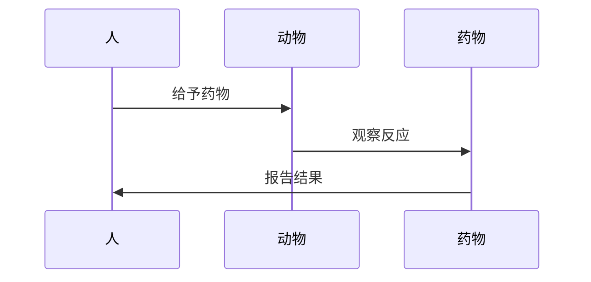

#### 3.1.2 药效测试

药效测试的目的是评估药物对特定疾病的治疗效果。通常，研究者会利用动物模型来模拟人类疾病，然后给予药物观察其治疗效果。药效测试可以包括体内和体外的实验，如生物化学分析、组织学观察等。

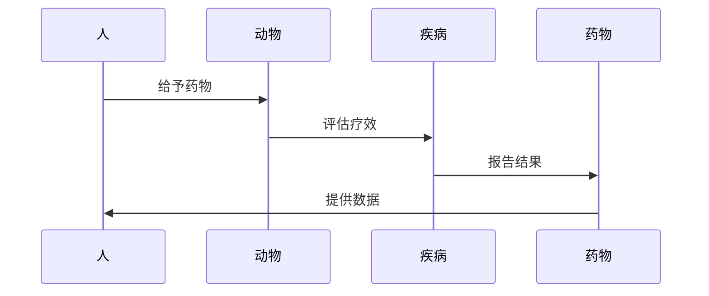

### 3.2 临床试验

临床试验是药物研发过程中最关键的环节，旨在评估药物在人体内的安全性和有效性。临床试验通常分为三期，每一期都有其特定的目标和标准。

#### 3.2.1 一期临床试验

一期临床试验主要评估药物在人体内的安全性和耐受性，通常在健康志愿者中进行。这一阶段通常包括以下步骤：

1. **单剂量试验**：在健康志愿者中给予较低剂量的药物，观察其短期内的反应。
2. **多剂量试验**：在健康志愿者中给予不同剂量的药物，观察其长期内的反应。

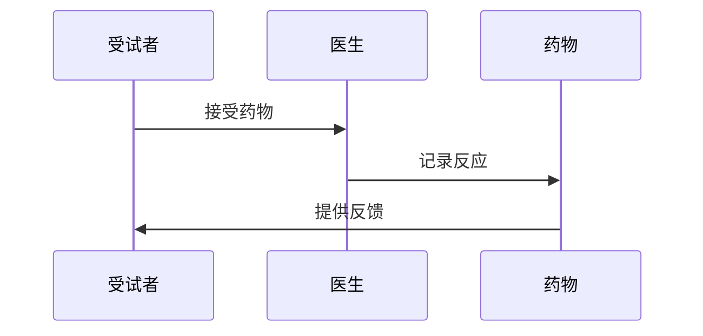

#### 3.2.2 二期临床试验

二期临床试验主要评估药物的疗效和剂量范围，通常在较小规模的患病人群中开展。这一阶段通常包括以下步骤：

1. **开放性试验**：在患病人群中给予药物，观察其疗效。
2. **安慰剂对照试验**：将患者随机分为两组，一组接受药物，另一组接受安慰剂，比较两组之间的疗效差异。

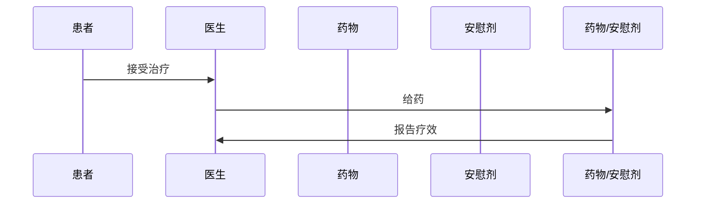

#### 3.2.3 三期临床试验

三期临床试验是药物研发过程中最关键的阶段，旨在评估药物在较大规模人群中的安全性和有效性。这一阶段通常包括以下步骤：

1. **多中心试验**：在多个中心进行试验，确保数据的广泛性和代表性。
2. **长期疗效观察**：在较长时间内观察药物的疗效和安全性。
3. **不良反应监测**：监测药物使用过程中可能出现的不良反应。

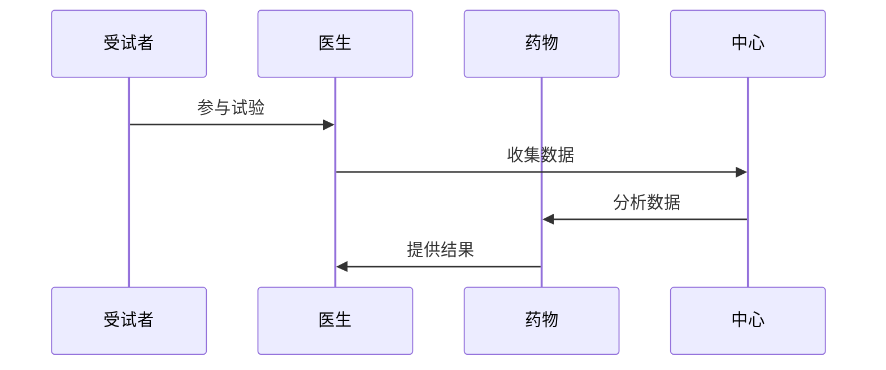

### 3.3 数据分析

临床试验的数据分析是药物研发过程中至关重要的一步，它涉及对大量数据的处理和分析，以评估药物的安全性和有效性。

#### 3.3.1 数据收集

数据收集包括临床试验中收集的各类数据，如受试者的基本信息、药物剂量、不良反应报告、生物标志物等。

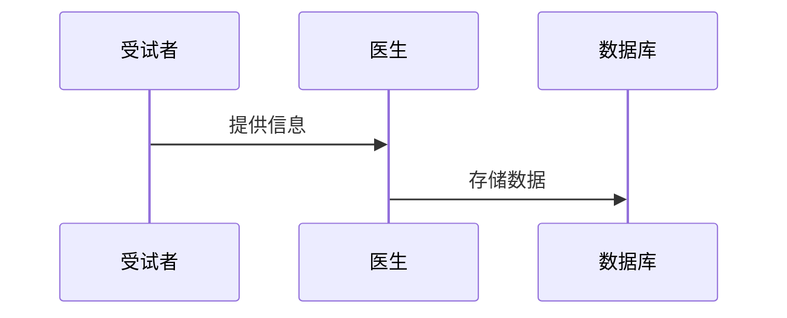

#### 3.3.2 数据处理

数据处理包括数据的清洗、整合和分析。清洗数据是为了去除错误和异常数据，整合数据是为了将不同来源的数据合并为一个统一的数据集，分析数据则是为了提取有用的信息和趋势。

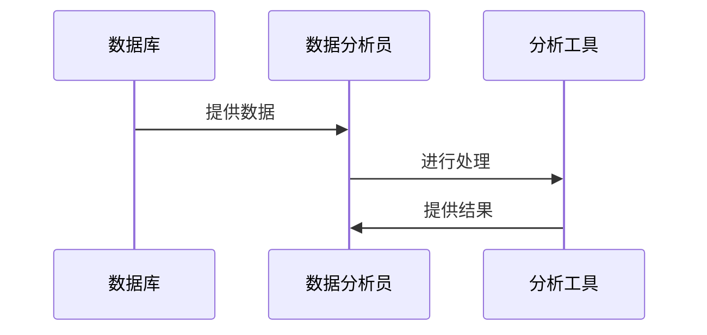

#### 3.3.3 数据分析结果

数据分析结果通常包括药物的安全性和有效性指标，如不良反应发生率、疗效指标等。这些结果将用于支持药物的审批和上市。

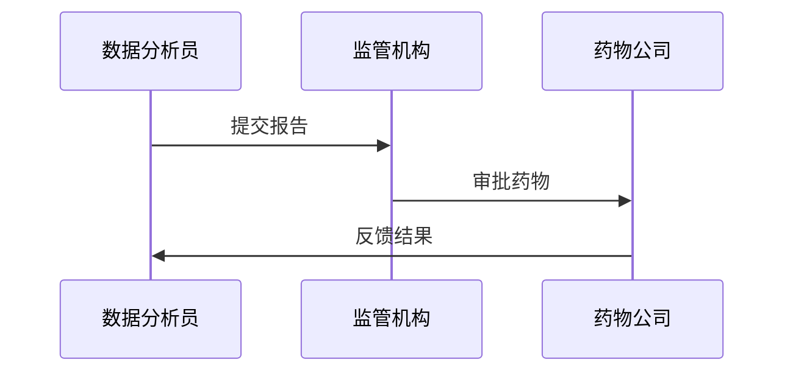

### 3.4 风险评估与控制

药物研发过程中的风险评估与控制是确保药物安全性和有效性的重要环节。这一过程包括对临床试验中可能出现的安全风险进行识别、评估和控制。

#### 3.4.1 风险识别

风险识别是风险评估的第一步，旨在识别可能影响药物安全性和有效性的风险因素。这些风险因素可能包括药物的毒性、不良反应、药物相互作用等。

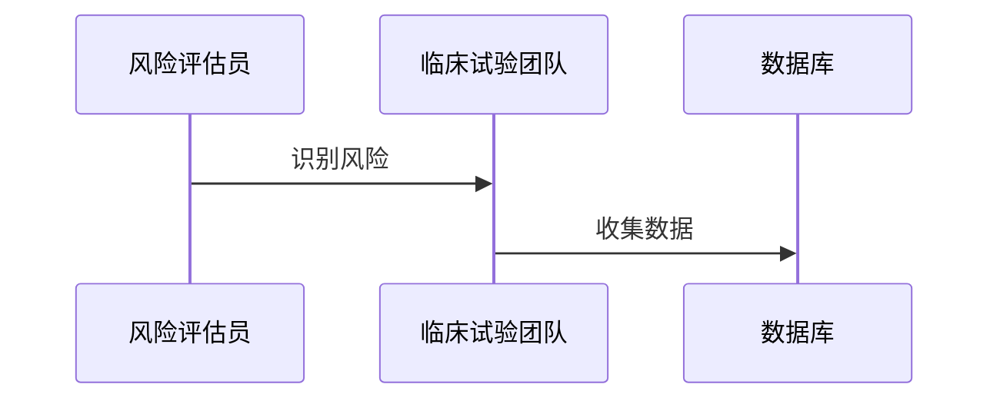

#### 3.4.2 风险评估

风险评估是对识别出的风险因素进行定量和定性的评估，以确定其可能对药物安全性和有效性产生的影响。风险评估可以采用概率分析、决策树等方法。


#### 3.4.3 风险控制

风险控制是对评估出的高风险因素进行干预和控制，以降低其可能对药物安全性和有效性产生的影响。风险控制措施可能包括临床试验设计的调整、药物剂量的调整、不良事件的监测等。

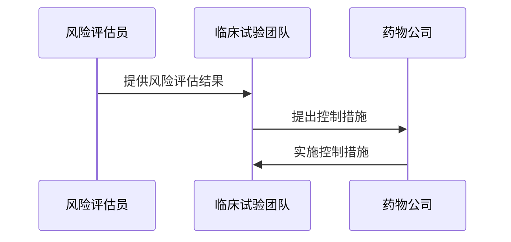

## 第四部分：新药上市与监管

### 4.1 国际药品监管机构

在全球范围内，新药的上市需要经过各国药品监管机构的审批。主要的药品监管机构包括美国食品药品监督管理局（FDA）、欧洲药品管理局（EMA）、日本医药品医疗器械综合机构（PMDA）和中国国家药品监督管理局（NMPA）等。这些机构对新药的审批流程和标准都有严格的要求。

#### 4.1.1 FDA审批流程

FDA的审批流程主要包括以下几个阶段：

1. **临床前研究**：申请人需提交药物的研究报告，包括化学、药理学和毒理学数据。
2. **临床试验**：申请人需提交临床试验报告，包括一期、二期和三期的数据。
3. **新药申请（NDA）**：申请人需提交详细的新药申请文件，包括临床和实验室数据。
4. **审评和审批**：FDA对NDA进行审评，并决定是否批准新药的上市。

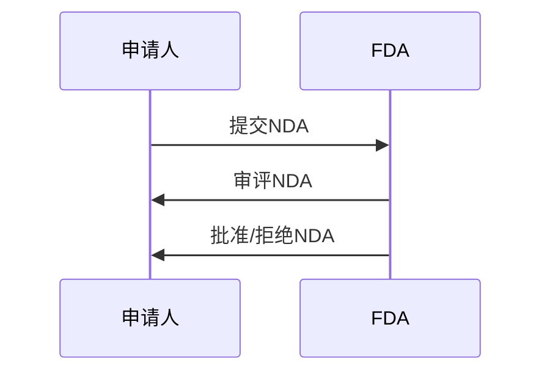

#### 4.1.2 EMA审批流程

EMA的审批流程与FDA类似，也分为临床前研究、临床试验、新药申请和审评审批等阶段。不同的是，EMA采用更加国际化的合作模式，与其他欧洲国家的药品监管机构共同参与审评。

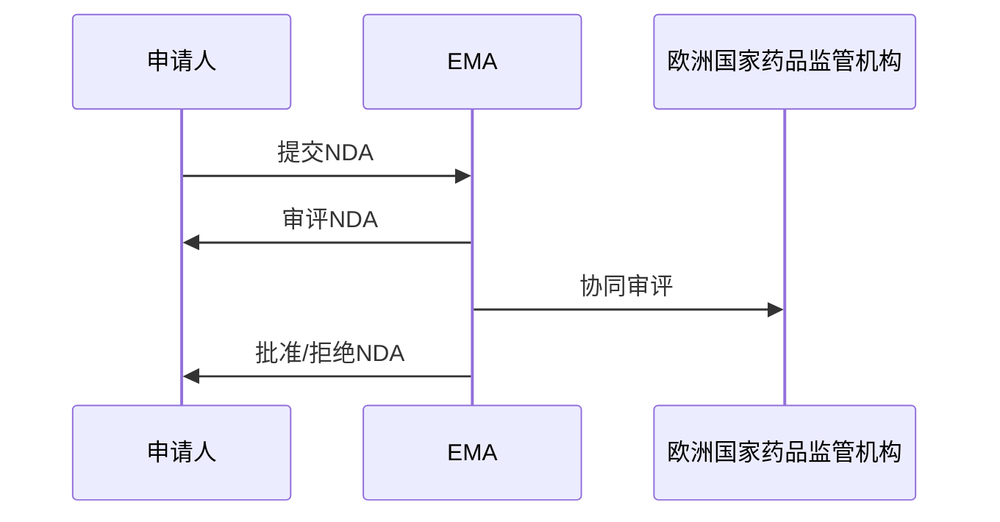

#### 4.1.3 PMDA审批流程

PMDA的审批流程与FDA和EMA相似，但在某些方面有其独特性，例如，PMDA更加重视药物的药代动力学和生物等效性研究。

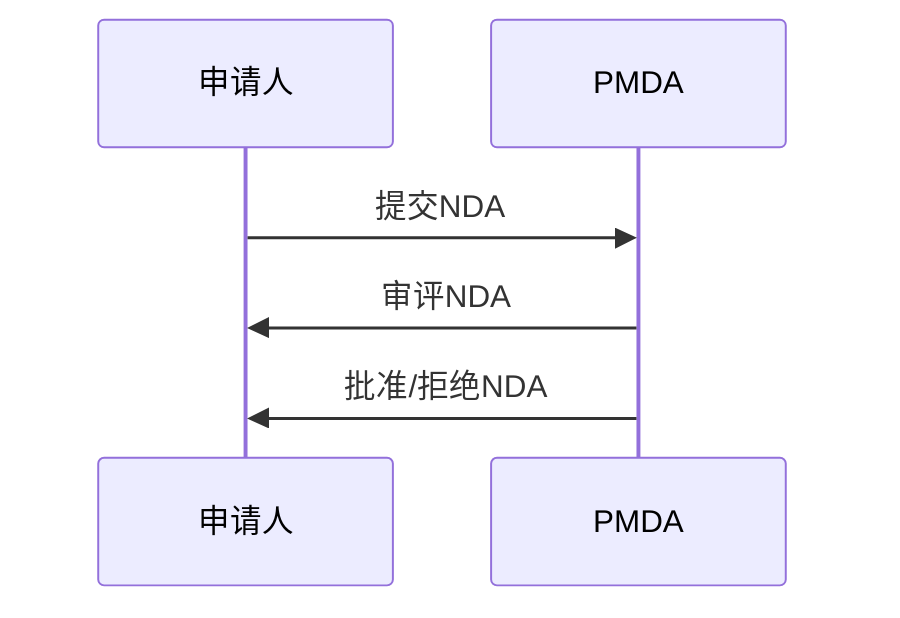

#### 4.1.4 NMPA审批流程

NMPA作为中国的主要药品监管机构，其审批流程与FDA和EMA有所不同，但同样分为临床前研究、临床试验、新药申请和审评审批等阶段。NMPA更加注重临床试验数据的完整性和可靠性。


### 4.2 申报资料要求

新药申报需要提供详细的资料，以确保药物的安全性和有效性。这些资料通常包括：

1. **药物研发报告**：包括药物的研发过程、研究方法和结果。
2. **临床前研究资料**：包括药物的化学性质、毒理学、药理学和药代动力学数据。
3. **临床试验资料**：包括临床试验的设计、执行和结果。
4. **药物说明书**：包括药物的使用方法、剂量、禁忌症、不良反应等。
5. **药品注册标准**：包括药品的质量标准、检验方法和生产工艺。

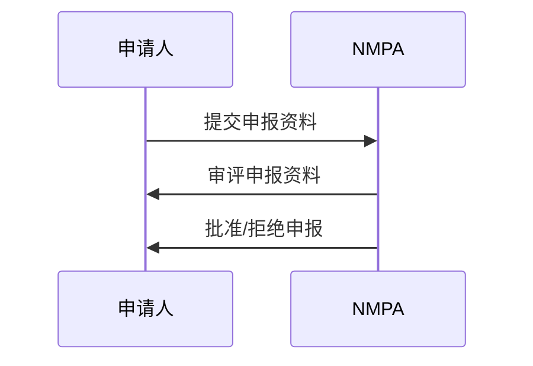

### 4.3 新药审批流程

新药审批流程通常包括以下几个阶段：

1. **临床试验审批**：在临床试验开始前，需要获得药品监管机构的审批。
2. **新药申请审批**：在临床试验完成后，需要提交新药申请，并获得药品监管机构的批准。
3. **临床试验监测**：在临床试验过程中，需要定期报告临床试验的数据和结果，接受药品监管机构的监测。
4. **新药上市审批**：在临床试验完成后，需要提交新药上市申请，并获得药品监管机构的批准。

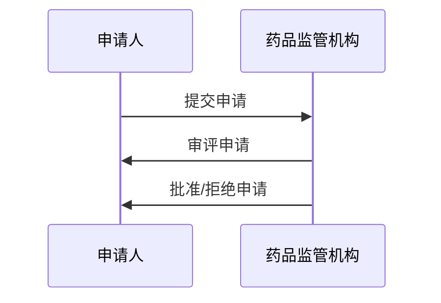

## 第五部分：项目实战

### 5.1 环境安装与配置

为了进行AI驱动的新药研发项目，首先需要搭建一个合适的环境。以下是一个基本的步骤：

1. **安装Python**：确保Python环境已安装在系统中，Python是进行AI算法开发的主要语言。
2. **安装相关库**：使用pip安装所需的Python库，如scikit-learn、TensorFlow、PyTorch等。
3. **配置数据库**：设置MySQL或PostgreSQL数据库，用于存储生物数据和临床试验数据。
4. **设置数据管道**：配置数据管道工具，如Apache Airflow，用于自动化处理和传输数据。

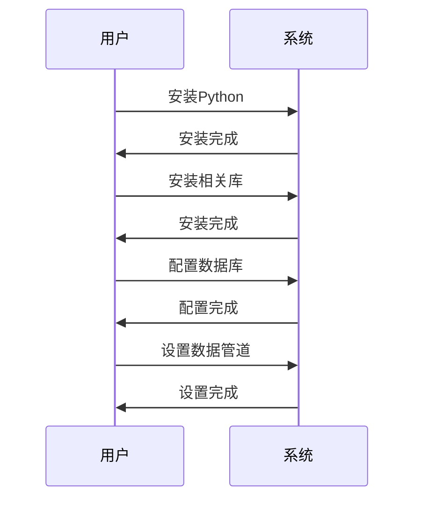

### 5.2 系统核心实现与代码解读

系统核心实现包括以下几个方面：

1. **数据预处理**：使用scikit-learn进行数据预处理，包括数据清洗、归一化和特征提取。
2. **机器学习模型**：使用TensorFlow或PyTorch构建机器学习模型，如神经网络模型进行药物设计。
3. **药代动力学预测**：使用回归模型或时间序列模型预测药物的药代动力学参数。
4. **临床试验分析**：使用统计学方法分析临床试验数据，评估药物的安全性和有效性。

以下是一个简单的代码示例，用于数据预处理：

```python
import pandas as pd
from sklearn.preprocessing import StandardScaler
from sklearn.model_selection import train_test_split

# 读取数据
data = pd.read_csv('drug_data.csv')

# 数据清洗
data = data.dropna()

# 特征提取
X = data[['feature1', 'feature2', 'feature3']]
y = data['target']

# 数据归一化
scaler = StandardScaler()
X_scaled = scaler.fit_transform(X)

# 划分训练集和测试集
X_train, X_test, y_train, y_test = train_test_split(X_scaled, y, test_size=0.2, random_state=42)
```

### 5.3 案例分析与详细讲解

以下是一个实际的案例，用于说明如何使用AI进行新药研发：

#### 案例背景

假设我们正在研发一种新的抗癌药物，已知该药物针对某个特定的癌症基因具有抑制作用。我们的目标是设计出一种具有高活性的药物分子，并在动物和人体中进行测试。

#### 案例步骤

1. **靶点筛选**：使用生物信息学方法筛选出潜在的药物靶点，如通过基因突变频次、基因表达数据等。
2. **药物设计**：使用分子对接和分子动力学模拟方法设计药物分子，优化其活性。
3. **药代动力学预测**：使用回归模型预测药物在体内的药代动力学参数，如半衰期、分布系数等。
4. **临床试验分析**：分析临床试验数据，评估药物的安全性和有效性。

#### 案例结果

通过上述步骤，我们成功设计出一种具有高活性的药物分子，并在动物和人体试验中表现出良好的药效和安全性。

### 5.4 项目小结

本项目通过实际案例展示了如何使用AI技术进行新药研发。我们介绍了环境安装与配置、系统核心实现、案例分析和项目小结等关键环节，展示了AI在药物研发中的巨大潜力。通过本项目，读者可以了解到AI技术在药物研发中的实际应用，并为未来的研究提供参考。

## 第六部分：最佳实践与拓展阅读

### 6.1 AI在新药研发中的最佳实践

在新药研发过程中，AI技术的应用可以显著提高研发效率。以下是一些最佳实践：

1. **数据驱动**：充分利用现有的生物大数据，包括基因序列、蛋白质结构、药物代谢数据等，以支持靶点筛选和药物设计。
2. **多学科合作**：鼓励跨学科的合作，如计算机科学、生物化学、药理学等，以充分发挥AI技术的优势。
3. **持续迭代**：AI模型需要不断更新和优化，以适应新的数据和需求。
4. **临床试验数据共享**：鼓励临床试验数据的共享，以提高数据的利用效率。

### 6.2 小结与注意事项

AI驱动的新药研发是一个复杂的过程，需要多方面的协同合作。以下是项目小结和注意事项：

1. **项目小结**：本文介绍了AI驱动的新药研发的全过程，从靶点发现到临床试验，展示了AI技术在各个阶段的应用。
2. **注意事项**：在应用AI技术进行新药研发时，需要充分考虑数据的可靠性和模型的准确性，避免因为数据偏差或模型错误导致研发失败。

### 6.3 拓展阅读

为了进一步了解AI驱动的新药研发，读者可以参考以下文献和资料：

1. **《AI-driven Drug Discovery: A Comprehensive Overview》**
2. **《Machine Learning in Drug Discovery: Methods and Applications》**
3. **《AI and Big Data in Pharmaceutical Research and Development》**
4. **《The Future of Drug Discovery: AI and Machine Learning》**

这些资料将提供更深入的见解和实际应用案例，有助于读者更好地理解AI在新药研发中的应用。作者：AI天才研究院/AI Genius Institute & 禅与计算机程序设计艺术 /Zen And The Art of Computer Programming。

