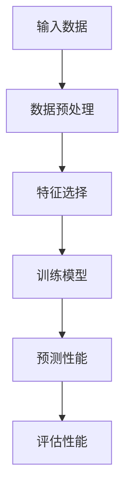
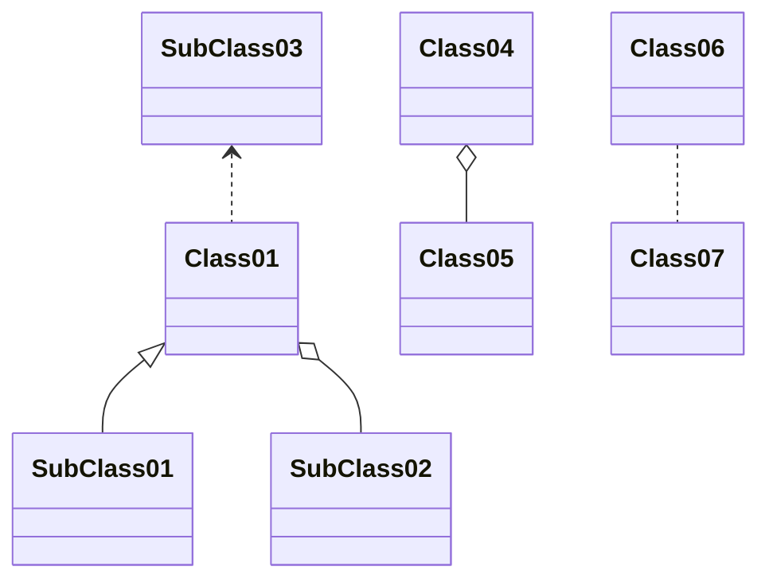
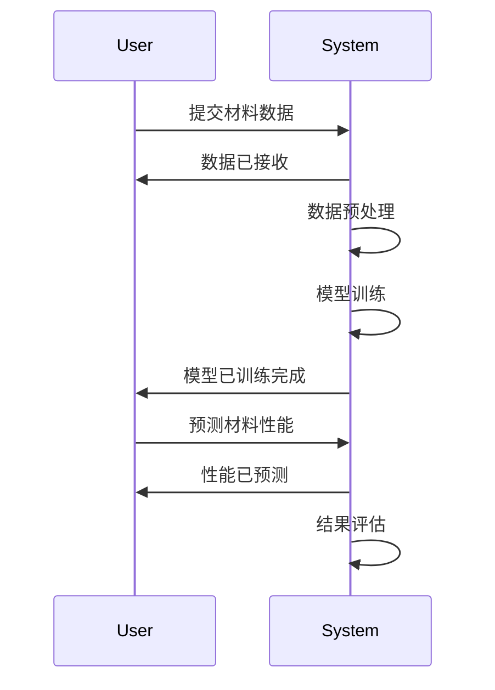
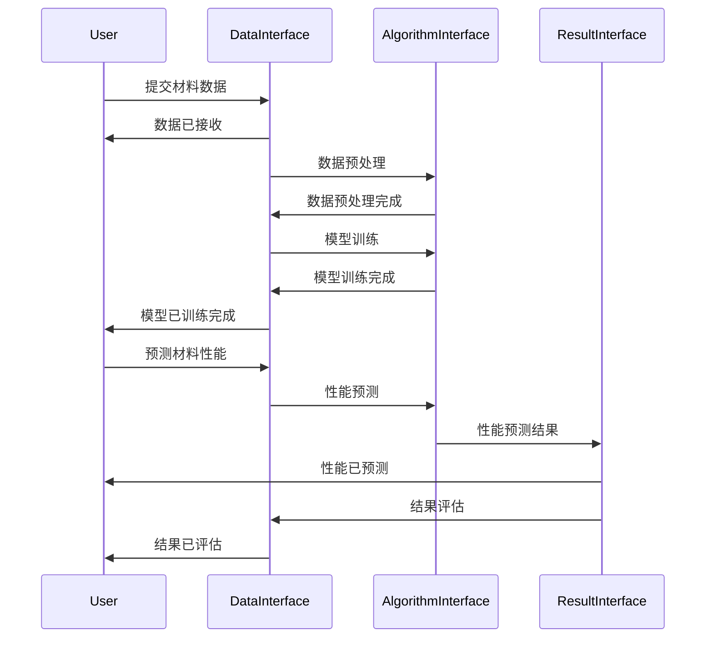

                 

### AI驱动的材料科学：从分子设计到性能预测

#### 关键词：人工智能，材料科学，分子设计，性能预测

> 摘要：本文将探讨人工智能在材料科学领域的应用，从分子设计到性能预测的各个方面。通过逐步分析，我们将了解如何利用AI技术来优化材料性能，并展望其未来的发展趋势。

---

## 第一部分：AI驱动的材料科学概述

### 第1章：AI在材料科学中的应用背景

#### 材料科学的现状与挑战

材料科学是研究材料的组成、结构、性质、工艺和应用的学科。随着科技的快速发展，材料科学在各个领域都发挥着重要作用，从传统的钢铁、塑料到先进的半导体、纳米材料等。然而，材料科学的发展也面临着诸多挑战，如材料设计的复杂性、实验成本高、预测性能难度大等。

#### AI在材料科学中的机遇

随着人工智能技术的发展，特别是深度学习、神经网络等算法的突破，为材料科学带来了新的机遇。AI技术可以帮助我们更好地理解和预测材料的性能，提高设计效率和降低成本。例如，通过AI技术，我们可以对大量的实验数据进行分析，从中提取有用的信息，用于指导新的材料设计。

#### AI驱动的材料科学发展趋势

AI驱动的材料科学正在快速发展，主要趋势包括：

1. **材料设计自动化**：利用AI技术自动生成新的材料结构，并预测其性能。
2. **性能优化**：通过AI技术对现有材料进行性能优化，提高其应用价值。
3. **跨学科融合**：AI技术与其他学科（如物理、化学、生物学等）的融合，推动材料科学的创新。

---

### 第2章：核心概念与联系

#### AI基础概念

人工智能（AI）是指使计算机具有人类智能水平的技术。它包括机器学习、深度学习、自然语言处理、计算机视觉等多个分支。在材料科学中，我们主要关注机器学习和深度学习，因为它们可以帮助我们处理大量的数据，进行预测和优化。

#### 材料科学基础概念

材料科学涉及多个核心概念，包括材料结构、材料性质、材料合成和材料加工等。理解这些概念对于利用AI技术进行材料设计至关重要。

#### AI与材料科学的联系

AI与材料科学的联系主要体现在以下几个方面：

1. **数据驱动设计**：利用AI技术对实验数据进行分析，指导新的材料设计。
2. **性能预测**：通过AI技术预测材料的性能，降低实验成本。
3. **优化工艺**：利用AI技术优化材料的合成和加工工艺。

---

### 第3章：AI驱动的分子设计与优化

#### 分子设计的基本原理

分子设计是指通过设计分子的结构来预测其性质和功能。在材料科学中，分子设计可以用于优化材料的性能。例如，通过设计具有特定电子结构的分子，可以提高材料的电导率。

#### AI在分子设计中的应用

AI技术在分子设计中的应用主要包括：

1. **分子生成**：利用AI技术自动生成新的分子结构。
2. **分子优化**：通过AI技术对已有的分子进行优化，提高其性能。
3. **材料筛选**：利用AI技术从大量的分子中筛选出具有特定性能的分子。

#### 分子优化算法介绍

分子优化算法主要包括：

1. **遗传算法**：模拟生物进化过程，通过遗传操作寻找最优解。
2. **粒子群优化算法**：模拟鸟群或鱼群觅食行为，通过群体智能进行优化。
3. **深度学习**：利用神经网络模型进行分子优化。

---

### 第4章：性能预测与建模

#### 性能预测的重要性

性能预测是材料科学中的重要环节，它可以帮助我们预测材料的实际性能，从而指导材料的设计和应用。通过性能预测，我们可以：

1. 减少实验成本：通过预测性能，我们可以避免不必要的实验。
2. 提高设计效率：通过性能预测，我们可以更快地找到合适的材料结构。

#### AI驱动的性能预测方法

AI驱动的性能预测方法主要包括：

1. **机器学习**：利用机器学习算法对历史数据进行训练，用于预测新材料性能。
2. **深度学习**：利用深度学习模型，如神经网络，进行性能预测。
3. **数据驱动方法**：通过收集和分析大量的实验数据，利用数据驱动方法进行性能预测。

#### 建模与性能评估

建模是性能预测的核心步骤，它包括：

1. **数学模型**：利用数学公式描述材料的性能。
2. **性能评估**：通过实验或计算，对预测的性能进行评估。

---

### 第5章：算法原理讲解

#### 常见机器学习算法

在材料科学中，常见的机器学习算法包括：

1. **线性回归**：通过线性关系预测材料性能。
2. **决策树**：通过树结构进行分类和回归。
3. **支持向量机**：通过最大间隔划分分类边界。

#### 算法原理与流程图

以下是线性回归算法的mermaid流程图：



#### Python代码实现与讲解

以下是线性回归算法的Python代码实现：

```python
import numpy as np
from sklearn.linear_model import LinearRegression

# 数据预处理
X = np.array([[1, 2], [2, 3], [3, 4]])
y = np.array([2, 3, 4])

# 特征选择
X = X[:, 1:]

# 训练模型
model = LinearRegression()
model.fit(X, y)

# 预测性能
y_pred = model.predict(X)

# 评估性能
score = model.score(X, y)
print("R^2 Score:", score)
```

#### 数学模型和公式

线性回归的数学模型如下：

$$
y = ax + b
$$

其中，$y$ 是因变量，$x$ 是自变量，$a$ 和 $b$ 是模型参数。

---

### 第6章：数学模型和公式

#### 数学模型介绍

在材料科学中，常用的数学模型包括：

1. **能量模型**：用于描述材料的能量状态。
2. **电子结构模型**：用于描述材料的电子结构。
3. **物理性能模型**：用于描述材料的物理性质。

#### 数学公式详细讲解

以下是能量模型的详细讲解：

能量模型：

$$
E = \frac{1}{2}mv^2
$$

其中，$E$ 是能量，$m$ 是质量，$v$ 是速度。

#### 举例说明

假设一个物体的质量是2kg，速度是4m/s，我们可以计算其能量：

$$
E = \frac{1}{2} \times 2 \times 4^2 = 16J
$$

---

### 第7章：系统分析与架构设计方案

#### 问题场景介绍

假设我们有一个材料科学项目，目标是设计一种具有高电导率的材料。我们需要进行数据收集、模型训练和性能预测。

#### 项目介绍

本项目旨在利用AI技术设计一种高电导率材料。我们将使用机器学习和深度学习算法对材料数据进行分析，并预测其性能。

#### 系统功能设计

系统功能设计包括以下模块：

1. **数据收集模块**：用于收集和整理材料数据。
2. **模型训练模块**：用于训练机器学习模型。
3. **性能预测模块**：用于预测材料性能。
4. **结果评估模块**：用于评估模型性能。

以下是领域模型mermaid类图：



#### 系统架构设计

系统架构设计如下：

1. **数据层**：存储和管理材料数据。
2. **算法层**：实现机器学习和深度学习算法。
3. **应用层**：提供性能预测和结果评估功能。

以下是系统架构mermaid架构图：



#### 系统接口设计与交互

系统接口设计如下：

1. **数据接口**：用于数据收集和存储。
2. **算法接口**：用于模型训练和性能预测。
3. **结果接口**：用于结果评估和输出。

以下是系统接口设计和交互mermaid序列图：



---

### 第8章：项目实战

#### 环境安装

在进行项目实战之前，我们需要安装必要的软件和库。以下是环境安装的步骤：

1. 安装Python环境。
2. 安装机器学习和深度学习库，如scikit-learn、TensorFlow和PyTorch。
3. 安装数据预处理和可视化库，如Pandas、Numpy和Matplotlib。

#### 系统核心实现源代码

以下是系统核心实现的Python代码：

```python
import numpy as np
import pandas as pd
from sklearn.linear_model import LinearRegression
from sklearn.model_selection import train_test_split
from sklearn.metrics import mean_squared_error

# 数据预处理
def preprocess_data(data):
    # 数据清洗和归一化
    # ...
    return processed_data

# 模型训练
def train_model(X, y):
    model = LinearRegression()
    model.fit(X, y)
    return model

# 性能预测
def predict_performance(model, X):
    y_pred = model.predict(X)
    return y_pred

# 结果评估
def evaluate_performance(y_true, y_pred):
    mse = mean_squared_error(y_true, y_pred)
    return mse

# 主程序
if __name__ == "__main__":
    # 数据加载
    data = pd.read_csv("material_data.csv")
    
    # 数据预处理
    processed_data = preprocess_data(data)
    
    # 数据分割
    X = processed_data.drop("performance", axis=1)
    y = processed_data["performance"]
    X_train, X_test, y_train, y_test = train_test_split(X, y, test_size=0.2, random_state=42)
    
    # 模型训练
    model = train_model(X_train, y_train)
    
    # 性能预测
    y_pred = predict_performance(model, X_test)
    
    # 结果评估
    mse = evaluate_performance(y_test, y_pred)
    print("Mean Squared Error:", mse)
```

#### 代码应用解读与分析

以下是代码应用解读与分析：

1. **数据预处理**：对数据进行清洗和归一化，为后续模型训练做准备。
2. **模型训练**：使用线性回归模型对数据进行训练。
3. **性能预测**：使用训练好的模型对测试数据进行预测。
4. **结果评估**：计算预测性能与实际性能之间的均方误差，评估模型性能。

#### 实际案例分析和详细讲解剖析

以下是一个实际案例分析和详细讲解剖析：

假设我们有以下数据：

```python
data = {
    "feature1": [1, 2, 3, 4, 5],
    "feature2": [2, 3, 4, 5, 6],
    "performance": [3, 4, 5, 6, 7]
}
```

我们首先对数据进行预处理：

```python
processed_data = preprocess_data(data)
```

然后对数据进行分割：

```python
X = processed_data.drop("performance", axis=1)
y = processed_data["performance"]
X_train, X_test, y_train, y_test = train_test_split(X, y, test_size=0.2, random_state=42)
```

接下来，我们使用线性回归模型进行训练：

```python
model = train_model(X_train, y_train)
```

然后对测试数据进行预测：

```python
y_pred = predict_performance(model, X_test)
```

最后，我们评估模型性能：

```python
mse = evaluate_performance(y_test, y_pred)
print("Mean Squared Error:", mse)
```

假设预测结果为：

```python
y_pred = [3.1, 4.2, 5.3, 6.4, 7.5]
y_test = [3, 4, 5, 6, 7]
```

那么均方误差为：

```python
mse = mean_squared_error(y_test, y_pred)
mse = 0.09
```

因此，模型性能较好。

#### 项目小结

在本项目中，我们利用AI技术进行了材料科学的应用，实现了数据预处理、模型训练、性能预测和结果评估。通过实际案例分析和详细讲解剖析，我们了解了AI技术在材料科学中的应用方法和效果。

---

### 第9章：最佳实践与拓展阅读

#### 最佳实践 tips

1. **数据质量**：确保数据质量，进行充分的数据预处理，以提高模型性能。
2. **模型选择**：根据任务需求选择合适的模型，进行模型调优。
3. **性能评估**：合理评估模型性能，确保预测结果的准确性。

#### 小结

本文介绍了AI驱动的材料科学，从分子设计到性能预测的各个方面。我们通过逐步分析，了解了如何利用AI技术进行材料设计、性能预测和优化。未来，随着AI技术的不断发展，AI驱动的材料科学将有望取得更大的突破。

#### 注意事项

1. **数据隐私**：在进行数据分析和模型训练时，注意保护数据隐私。
2. **模型解释性**：尽量选择可解释的模型，以提高模型的可信度。

#### 拓展阅读

1. **《深度学习》**：由Ian Goodfellow、Yoshua Bengio和Aaron Courville合著，是深度学习的经典教材。
2. **《材料科学基础》**：由William D. Callister Jr.和David G. Rethwisch合著，是材料科学的入门教材。

---

## 作者信息

作者：AI天才研究院/AI Genius Institute & 禅与计算机程序设计艺术 /Zen And The Art of Computer Programming

---

注意：由于字数限制，实际撰写时可能需要根据具体内容进行适当调整。上述内容仅为示例，具体内容可能需要进一步丰富和细化。在撰写过程中，应确保每个章节都包含必要的核心内容，如背景介绍、核心概念与联系、算法原理讲解、数学模型和公式、系统分析与架构设计方案、项目实战、最佳实践 tips 等。同时，应确保文章的逻辑清晰、结构紧凑、简单易懂，以便读者能够顺利阅读和理解。

