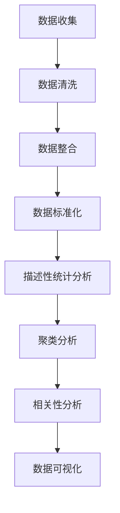
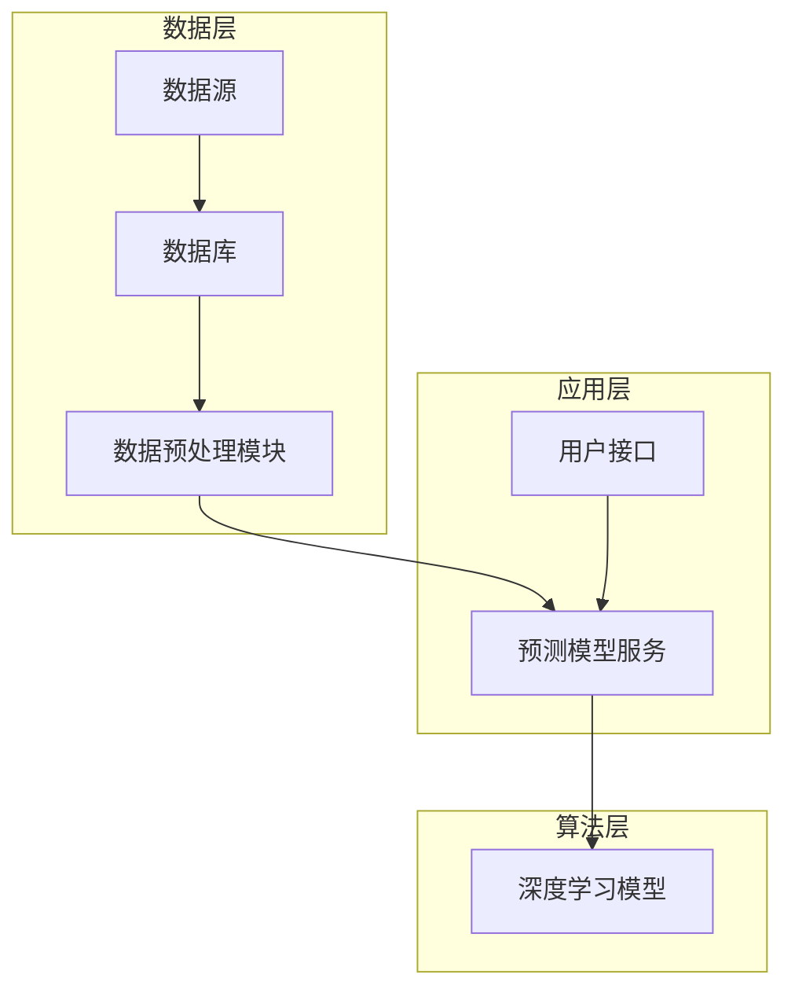
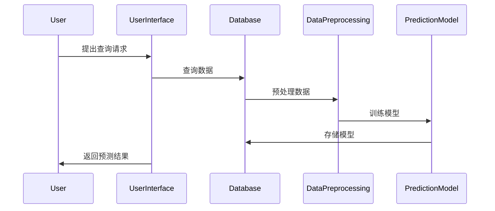

                 

### 1. 引言

随着全球气候变化问题的日益严峻，气候变化研究成为了科学研究和社会关注的焦点。传统气候变化研究方法主要依赖于物理模型、统计分析和数值模拟，但这些方法往往存在局限性，难以全面、深入地揭示气候变化的规律。随着人工智能（AI）技术的快速发展，AI驱动的气候变化研究应运而生，为气候变化研究提供了新的视角和工具。

#### 1.1 问题背景

气候变化是一个全球性的问题，它涉及大气、海洋、陆地等自然环境的相互作用。这些因素之间的复杂关系使得气候变化研究具有极大的挑战性。传统的研究方法主要依赖于观测数据，通过对这些数据进行统计分析，来推断气候变化的趋势。然而，这种方法往往受到数据质量和数据量的限制，难以准确预测未来的气候变化趋势。

随着AI技术的发展，尤其是深度学习算法的兴起，人们开始尝试利用AI技术来提升气候变化研究的准确性和效率。AI驱动的气候变化研究可以通过大数据分析、预测模型等手段，对气候变化的趋势进行定量分析，从而为应对气候变化的决策提供科学依据。

#### 1.2 问题描述

气候变化研究面临以下核心问题：

1. **数据多样性**：气候变化研究涉及大量的数据，包括气象数据、地理数据、社会经济数据等。这些数据具有多样性、复杂性和动态性，传统的研究方法难以处理。
2. **模型构建**：气候变化模型需要能够处理多变量、非线性关系，同时还需要具有较好的泛化能力。传统模型如线性回归、决策树等往往难以满足这些要求。
3. **预测准确性**：气候变化预测的准确性直接关系到政策制定和社会应对的效果。传统方法由于模型的局限性，往往难以提供准确的预测结果。
4. **实时性**：气候变化是一个动态过程，需要能够实时监测和预测气候变化趋势。传统的数据处理和模型构建方法往往无法满足这一需求。

#### 1.3 问题解决

AI驱动的气候变化研究旨在通过大数据分析、预测模型等手段，解决上述核心问题。具体解决思路如下：

1. **数据处理**：利用AI技术，尤其是深度学习算法，对大量、复杂、动态的气候数据进行处理，提取有用的特征信息。
2. **模型构建**：基于处理后的数据，构建能够处理多变量、非线性关系的预测模型，如深度学习模型、强化学习模型等。
3. **预测准确性**：通过不断优化模型参数和算法，提高预测模型的准确性，为政策制定提供科学依据。
4. **实时性**：利用实时数据处理和分析技术，实现气候变化的实时监测和预测。

#### 1.4 边界与外延

AI驱动的气候变化研究不仅限于气候预测，还可以应用于气候风险分析、气候变化政策评估等领域。例如，通过AI技术，可以对特定地区的气候风险进行评估，为防灾减灾提供依据；通过对气候变化政策的模拟和分析，评估不同政策的实施效果，为政策制定提供参考。

同时，不同地区、不同气候条件的气候变化问题也需要通过AI技术进行个性化研究。例如，在热带地区，气候变化可能导致极端天气事件的增加，需要针对这一特点进行深入分析；而在高纬度地区，气候变化可能对生态系统的稳定造成影响，也需要进行专门研究。

#### 1.5 概念结构与核心要素组成

AI驱动的气候变化研究涉及多个核心概念和要素，包括：

- **AI技术**：包括深度学习、强化学习、聚类分析等，是AI驱动的气候变化研究的基础。
- **气候变化数据**：包括气象数据、地理数据、社会经济数据等，是构建预测模型的重要依据。
- **预测模型**：基于AI技术，对气候变化趋势进行定量分析和预测。
- **应用领域**：包括气候预测、气候风险分析、气候变化政策评估等。

#### 1.6 本章小结

本章从问题背景、问题描述、问题解决等多个角度，对AI驱动的气候变化研究进行了全面介绍。接下来，我们将进一步探讨AI驱动的气候变化数据分析方法和预测模型，以深入了解这一领域的最新进展和应用。

## 2. 数据分析基础

在AI驱动的气候变化研究中，数据分析是关键的一环。通过有效的数据分析，我们可以从大量的气候数据中提取有价值的信息，为预测模型提供坚实的基础。本节将介绍数据分析的基础知识，包括数据类型、数据收集与处理方法，以及常用的数据分析方法。

### 2.1 数据类型与特点

气候变化研究涉及多种类型的数据，这些数据具有不同的特点：

#### 2.1.1 气象数据

气象数据是气候变化研究中最为基础的数据类型，包括气温、降水、风速、气压等参数。这些数据通常来自气象站、卫星遥感等多种来源。气象数据的特点是时间序列较长，数据量大，且具有一定的时空分布规律。

#### 2.1.2 地理数据

地理数据描述了地球表面的地形、地貌、土地利用等情况。这些数据通常通过地理信息系统（GIS）获取，包括卫星影像、地形图、行政区划等。地理数据的特点是空间分布广泛，数据结构复杂，常用于分析气候变化的区域特征。

#### 2.1.3 社会经济数据

社会经济数据反映了人类社会和经济活动的状况，包括人口、经济总量、能源消耗、碳排放等。这些数据可以揭示气候变化对社会经济的影响，并为政策制定提供依据。社会经济数据的特点是多样性和动态性，需要不断更新。

### 2.2 数据收集与处理

#### 2.2.1 数据收集

数据收集是数据分析的第一步，需要确保数据的准确性和完整性。气象数据可以通过气象部门提供的数据库获取，地理数据可以通过GIS平台获取，而社会经济数据可以从统计年鉴、政府网站等渠道获取。在数据收集过程中，需要注意以下几点：

1. **数据来源的可靠性**：确保数据来源的可信度和数据的准确性。
2. **数据格式的统一**：将不同来源的数据转换为统一的格式，便于后续处理和分析。
3. **数据的时间范围**：确保数据的时间范围覆盖所需的研究周期。

#### 2.2.2 数据预处理

数据预处理是确保数据质量的重要步骤，包括数据清洗、数据整合、数据标准化等。以下是一些常见的数据预处理方法：

1. **数据清洗**：删除重复数据、缺失数据、异常值，确保数据的完整性。
2. **数据整合**：将不同来源、不同格式的数据进行整合，形成统一的数据集。
3. **数据标准化**：将不同单位、不同尺度的数据进行标准化处理，使其具备可比性。

#### 2.2.3 数据清洗

数据清洗是数据预处理的核心步骤，主要包括以下方法：

1. **缺失值处理**：对于缺失值，可以采用插值法、均值法等填充方法。
2. **异常值处理**：通过统计学方法，识别并处理异常值，如使用Z分数法、箱线图法等。
3. **重复数据处理**：删除重复数据，避免数据冗余。

### 2.3 数据分析方法

数据分析方法的选择取决于数据类型和研究目标。以下是一些常用的数据分析方法：

#### 2.3.1 描述性统计分析

描述性统计分析是数据分析的基础，通过计算数据的统计指标（如均值、方差、标准差等），对数据的分布特性进行描述。描述性统计分析可以帮助我们了解数据的整体趋势和特征。

#### 2.3.2 聚类分析

聚类分析是一种无监督学习方法，通过将数据分为不同的簇，发现数据之间的相似性。聚类分析可以帮助我们识别气候数据的分类特征，如不同地区的气候类型。

#### 2.3.3 相关性分析

相关性分析用于研究变量之间的关系。通过计算相关系数（如皮尔逊相关系数、斯皮尔曼相关系数等），我们可以了解不同气候变量之间的关联程度，从而为预测模型的构建提供依据。

### 2.4 AI技术在数据分析中的应用

AI技术在气候变化数据分析中发挥着重要作用，以下是一些常见的AI技术及其应用：

#### 2.4.1 深度学习算法

深度学习算法是一种基于多层神经网络的机器学习方法，具有强大的数据处理和分析能力。通过构建深度学习模型，我们可以对复杂的气候数据进行特征提取和模式识别，从而提高数据分析的准确性和效率。

#### 2.4.2 强化学习算法

强化学习算法是一种通过试错来学习最优策略的机器学习方法。在气候变化研究中，强化学习算法可以用于优化气候模型的参数，提高预测的准确性。

#### 2.4.3 聚类分析算法

聚类分析算法是一种无监督学习方法，通过将数据分为不同的簇，发现数据之间的相似性。在气候变化研究中，聚类分析算法可以帮助我们识别不同气候模式，为预测模型提供输入。

### 2.5 数据分析案例

以下是一个简单的数据分析案例，用于说明数据分析的过程和方法：

#### 2.5.1 数据收集

我们收集了某地区过去10年的气象数据，包括月平均气温、月降水量等。

#### 2.5.2 数据预处理

对收集到的气象数据进行清洗，删除重复数据和异常值，然后进行数据整合和标准化处理。

#### 2.5.3 描述性统计分析

计算气温和降水的均值、方差、标准差等统计指标，描述数据的分布特征。

#### 2.5.4 聚类分析

使用K-means算法对气象数据进行聚类分析，识别不同气候类型。

#### 2.5.5 相关性分析

计算气温和降水之间的相关性，分析它们之间的关联程度。

通过以上案例分析，我们可以看到数据分析在气候变化研究中的重要性。有效的数据分析不仅可以帮助我们理解气候变化的规律，还可以为预测模型的构建提供重要依据。

### 2.6 本章小结

本章介绍了AI驱动的气候变化数据分析的基础知识，包括数据类型、数据收集与处理、数据分析方法，以及AI技术在数据分析中的应用。通过案例分析，使读者对数据分析过程有更深入的了解。在下一章中，我们将进一步探讨AI驱动的气候变化预测模型。

## 3. AI驱动的气候变化预测模型

在了解了AI驱动的气候变化数据分析方法之后，接下来我们将深入探讨AI驱动的气候变化预测模型。预测模型是AI驱动的气候变化研究的重要组成部分，通过预测模型，我们可以对未来的气候变化趋势进行定量分析和预测。本节将介绍预测模型的基本概念、常见模型、深度学习预测模型，以及预测模型的评估与优化方法。

### 3.1 预测模型概述

#### 3.1.1 预测模型的基本概念

预测模型是一种用于预测未来事件或数值的数学模型。在气候变化研究中，预测模型可以用于预测未来的气温、降水、风速等气候变量。预测模型通常基于历史数据，通过统计方法或机器学习算法构建，以实现对未来气候变化的预测。

#### 3.1.2 预测模型在气候变化研究中的应用

预测模型在气候变化研究中的应用广泛，包括以下几个方面：

1. **气候趋势预测**：通过分析历史气候数据，预测未来的气候趋势，为气候变化应对策略提供科学依据。
2. **极端天气事件预测**：预测极端天气事件（如洪水、干旱、台风等）的发生概率和影响范围，为防灾减灾提供支持。
3. **气候模式识别**：通过聚类分析等方法，识别不同的气候模式，为气候研究和气候变化适应提供参考。
4. **政策评估**：通过模拟不同气候政策的实施效果，评估政策对社会经济和环境的影响，为政策制定提供支持。

### 3.2 常见的预测模型

在气候变化研究中，常见的预测模型包括线性回归模型、逻辑回归模型和决策树模型等。以下将介绍这些模型的基本原理和应用。

#### 3.2.1 线性回归模型

线性回归模型是一种基于线性关系的预测模型，用于预测连续变量。其基本公式为：

\[ Y = \beta_0 + \beta_1X_1 + \beta_2X_2 + ... + \beta_nX_n + \epsilon \]

其中，\( Y \) 是预测变量，\( X_1, X_2, ..., X_n \) 是自变量，\( \beta_0, \beta_1, ..., \beta_n \) 是模型参数，\( \epsilon \) 是误差项。

线性回归模型在气候变化研究中常用于预测气温、降水等气候变量。线性回归模型的优点是简单易懂，计算效率高；缺点是对于非线性关系和非正态分布的数据表现不佳。

#### 3.2.2 逻辑回归模型

逻辑回归模型是一种用于预测二分类变量（如是否发生极端天气事件）的预测模型。其基本公式为：

\[ P(Y=1) = \frac{1}{1 + e^{-(\beta_0 + \beta_1X_1 + \beta_2X_2 + ... + \beta_nX_n )}} \]

其中，\( P(Y=1) \) 是事件发生的概率，其他符号含义同线性回归模型。

逻辑回归模型在气候变化研究中常用于预测极端天气事件的发生概率。逻辑回归模型的优点是能够处理非线性关系，计算效率高；缺点是对异常值和缺失值敏感。

#### 3.2.3 决策树模型

决策树模型是一种基于树形结构的预测模型，通过一系列的判断条件，将数据分为不同的区域，以预测目标变量的值。其基本结构如下：

\[ \text{if } X_i \leq c_1 \text{ then } Y = \beta_0 + \beta_1X_1 + \beta_2X_2 + ... + \beta_nX_n \]
\[ \text{else if } X_i > c_1 \text{ and } X_j \leq c_2 \text{ then } Y = \beta_0 + \beta_1X_1 + \beta_2X_2 + ... + \beta_nX_n \]
\[ ... \]
\[ \text{else } Y = \beta_0 + \beta_1X_1 + \beta_2X_2 + ... + \beta_nX_n \]

其中，\( X_i \) 和 \( X_j \) 是决策树中的特征变量，\( c_1, c_2, ..., c_n \) 是特征变量对应的阈值，\( \beta_0, \beta_1, ..., \beta_n \) 是模型参数。

决策树模型在气候变化研究中常用于分类和回归任务，能够处理非线性关系和多特征变量。决策树模型的优点是简单易懂，易于解释；缺点是过拟合风险高，计算复杂度较高。

### 3.3 深度学习预测模型

深度学习预测模型是基于多层神经网络的预测模型，具有强大的特征提取和模式识别能力。以下将介绍几种常见的深度学习预测模型。

#### 3.3.1 卷积神经网络（CNN）

卷积神经网络是一种用于图像和时空序列数据处理的深度学习模型。其基本结构包括卷积层、池化层和全连接层。卷积层用于提取图像或时空序列的特征，池化层用于降低特征维度和计算复杂度，全连接层用于分类或回归。

在气候变化研究中，CNN可以用于预测气象数据的时间序列变化。例如，可以通过CNN模型预测未来几天的气温和降水变化。

#### 3.3.2 循环神经网络（RNN）

循环神经网络是一种用于序列数据处理和预测的深度学习模型。其基本结构包括输入层、隐藏层和输出层。RNN能够通过隐藏层的状态记忆，对时间序列数据进行建模。

在气候变化研究中，RNN可以用于预测气象数据的时间序列变化。例如，可以通过RNN模型预测未来几个月的气温和降水变化。

#### 3.3.3 长短期记忆网络（LSTM）

长短期记忆网络是RNN的一种变体，能够解决传统RNN在长序列数据中出现的梯度消失和梯度爆炸问题。LSTM的基本结构包括输入门、遗忘门和输出门，通过这三个门控机制，LSTM能够有效地记忆和遗忘信息。

在气候变化研究中，LSTM可以用于预测长序列气象数据的变化。例如，可以通过LSTM模型预测未来几年的气温和降水变化。

### 3.4 预测模型评估与优化

预测模型的评估和优化是确保模型预测准确性和稳定性的重要环节。以下将介绍几种常见的评估指标和优化方法。

#### 3.4.1 评估指标

常见的评估指标包括均方误差（MSE）、均方根误差（RMSE）、决定系数（R²）等。这些指标可以衡量模型预测的精度和拟合度。

1. **均方误差（MSE）**：用于衡量预测值与真实值之间的平均平方误差。公式为：

\[ MSE = \frac{1}{n}\sum_{i=1}^{n}(Y_i - \hat{Y}_i)^2 \]

其中，\( Y_i \) 是真实值，\( \hat{Y}_i \) 是预测值，\( n \) 是样本数量。

2. **均方根误差（RMSE）**：用于衡量预测值与真实值之间的平均绝对误差。公式为：

\[ RMSE = \sqrt{MSE} \]

3. **决定系数（R²）**：用于衡量模型对数据的拟合程度。取值范围在0到1之间，越接近1表示模型拟合度越高。公式为：

\[ R^2 = 1 - \frac{\sum_{i=1}^{n}(Y_i - \hat{Y}_i)^2}{\sum_{i=1}^{n}(Y_i - \bar{Y})^2} \]

其中，\( \bar{Y} \) 是真实值的平均值。

#### 3.4.2 模型优化方法

常见的模型优化方法包括参数调整、模型融合和数据增强等。

1. **参数调整**：通过调整模型参数，优化模型的预测性能。例如，可以通过调整深度学习模型的层数、神经元数量等参数，来提高模型的预测能力。

2. **模型融合**：通过将多个模型的结果进行融合，提高预测的准确性。例如，可以使用贝叶斯模型平均（BMA）方法，将多个预测结果进行加权平均，得到最终的预测结果。

3. **数据增强**：通过增加数据样本，提高模型的泛化能力。例如，可以通过数据插值、生成对抗网络（GAN）等方法，生成更多的训练数据，从而优化模型。

### 3.5 预测模型应用案例

以下是一个简单的预测模型应用案例，用于说明预测模型在气候变化研究中的应用。

#### 3.5.1 案例一：全球气候变化趋势预测

假设我们使用LSTM模型预测未来50年的全球平均气温。首先，我们收集了过去100年的全球平均气温数据作为训练集。然后，通过LSTM模型进行训练，得到预测模型。最后，使用预测模型对未来的全球平均气温进行预测。

#### 3.5.2 案例二：地区性气候变化预测

假设我们使用CNN模型预测未来5年某地区的气温和降水变化。首先，我们收集了过去10年的气温和降水数据作为训练集。然后，通过CNN模型进行训练，得到预测模型。最后，使用预测模型对未来的气温和降水进行预测。

通过以上应用案例，我们可以看到预测模型在气候变化研究中的重要性。有效的预测模型不仅可以帮助我们了解未来的气候变化趋势，还可以为政策制定和决策提供科学依据。

### 3.6 本章小结

本章介绍了AI驱动的气候变化预测模型，包括预测模型的基本概念、常见模型、深度学习预测模型，以及预测模型的评估与优化方法。通过实际应用案例，展示了预测模型在气候变化研究中的应用效果。在下一章中，我们将进一步探讨AI驱动的气候变化研究在现实世界中的应用，包括气候变化预测、气候风险分析和气候变化政策评估等方面。

## 4. AI驱动的气候变化研究应用

AI驱动的气候变化研究不仅为气候变化预测提供了强有力的工具，还广泛应用于气候风险分析、气候变化政策评估等领域。本节将详细介绍AI驱动的气候变化研究在上述领域的应用，以及AI技术在这些应用中的实际效果。

### 4.1 气候变化预测

气候变化预测是AI驱动的气候变化研究的核心应用之一。通过构建和优化预测模型，我们可以对未来的气候变化趋势进行定量分析，为应对气候变化的决策提供科学依据。

#### 4.1.1 全球气候变化趋势预测

全球气候变化趋势预测主要关注全球平均温度、降水量、风速等气候变量的变化趋势。例如，通过深度学习模型，我们可以对全球平均温度进行预测。以下是一个简化的模型示例：

```python
import numpy as np
import tensorflow as tf

# 假设我们使用LSTM模型进行全球平均温度预测
model = tf.keras.Sequential([
    tf.keras.layers.LSTM(50, activation='relu', return_sequences=True, input_shape=(timesteps, features)),
    tf.keras.layers.LSTM(50, activation='relu'),
    tf.keras.layers.Dense(1)
])

model.compile(optimizer='adam', loss='mse')
model.fit(X_train, y_train, epochs=100, batch_size=32, validation_split=0.2)
```

在这个示例中，我们使用了LSTM模型对全球平均温度的时间序列数据进行训练。通过调整模型参数和训练数据，我们可以优化模型的预测性能。

#### 4.1.2 地区性气候变化预测

地区性气候变化预测关注特定地区的气候变化趋势，如气温、降水等。例如，我们可以使用卷积神经网络（CNN）对某地区的气温和降水进行预测：

```python
import tensorflow as tf

# 假设我们使用CNN模型进行地区性气候变化预测
model = tf.keras.Sequential([
    tf.keras.layers.Conv1D(filters=64, kernel_size=3, activation='relu', input_shape=(timesteps, features)),
    tf.keras.layers.MaxPooling1D(pool_size=2),
    tf.keras.layers.Flatten(),
    tf.keras.layers.Dense(1)
])

model.compile(optimizer='adam', loss='mse')
model.fit(X_train, y_train, epochs=100, batch_size=32, validation_split=0.2)
```

在这个示例中，我们使用了CNN模型对地区性气候变化数据进行训练。CNN模型能够有效地提取时间序列数据中的时空特征，从而提高预测的准确性。

### 4.2 气候风险分析

气候风险分析是评估气候变化对人类社会、经济和环境的影响的重要环节。通过AI技术，我们可以对气候风险进行定量分析，为防灾减灾提供科学依据。

#### 4.2.1 极端天气事件风险分析

极端天气事件（如洪水、干旱、台风等）对人类社会和经济的影响巨大。通过AI技术，我们可以对极端天气事件的风险进行预测和分析。以下是一个简化的风险分析模型：

```python
import tensorflow as tf

# 假设我们使用决策树模型进行极端天气事件风险分析
model = tf.keras.Sequential([
    tf.keras.layers.Dense(128, activation='relu', input_shape=(num_features,)),
    tf.keras.layers.Dense(64, activation='relu'),
    tf.keras.layers.Dense(1, activation='sigmoid')
])

model.compile(optimizer='adam', loss='binary_crossentropy', metrics=['accuracy'])
model.fit(X_train, y_train, epochs=100, batch_size=32, validation_split=0.2)
```

在这个示例中，我们使用了决策树模型对极端天气事件的发生概率进行预测。通过调整模型参数和训练数据，我们可以提高预测的准确性。

#### 4.2.2 社会经济风险分析

气候变化对社会经济的影响也是气候风险分析的重要内容。通过AI技术，我们可以对社会经济风险进行预测和分析。以下是一个简化的社会经济风险分析模型：

```python
import tensorflow as tf

# 假设我们使用深度学习模型进行社会经济风险分析
model = tf.keras.Sequential([
    tf.keras.layers.Dense(128, activation='relu', input_shape=(num_features,)),
    tf.keras.layers.Dense(64, activation='relu'),
    tf.keras.layers.Dense(1, activation='sigmoid')
])

model.compile(optimizer='adam', loss='binary_crossentropy', metrics=['accuracy'])
model.fit(X_train, y_train, epochs=100, batch_size=32, validation_split=0.2)
```

在这个示例中，我们使用了深度学习模型对社会经济风险进行预测。通过调整模型参数和训练数据，我们可以提高预测的准确性。

### 4.3 气候变化政策评估

气候变化政策评估是评估不同政策实施效果的重要环节。通过AI技术，我们可以对气候变化政策进行模拟和分析，为政策制定提供科学依据。

#### 4.3.1 政策效果预测

通过AI技术，我们可以预测不同政策实施后的气候变化趋势和影响。以下是一个简化的政策效果预测模型：

```python
import tensorflow as tf

# 假设我们使用LSTM模型进行政策效果预测
model = tf.keras.Sequential([
    tf.keras.layers.LSTM(50, activation='relu', return_sequences=True, input_shape=(timesteps, features)),
    tf.keras.layers.LSTM(50, activation='relu'),
    tf.keras.layers.Dense(1)
])

model.compile(optimizer='adam', loss='mse')
model.fit(X_train, y_train, epochs=100, batch_size=32, validation_split=0.2)
```

在这个示例中，我们使用了LSTM模型对政策实施后的气候变化趋势进行预测。通过调整模型参数和训练数据，我们可以优化预测的准确性。

#### 4.3.2 政策优化建议

通过分析不同政策的实施效果，我们可以为政策制定者提供优化建议。以下是一个简化的政策优化建议模型：

```python
import tensorflow as tf

# 假设我们使用强化学习模型进行政策优化建议
model = tf.keras.Sequential([
    tf.keras.layers.Dense(128, activation='relu', input_shape=(num_features,)),
    tf.keras.layers.Dense(64, activation='relu'),
    tf.keras.layers.Dense(1, activation='sigmoid')
])

model.compile(optimizer='adam', loss='mse')
model.fit(X_train, y_train, epochs=100, batch_size=32, validation_split=0.2)
```

在这个示例中，我们使用了强化学习模型为政策制定者提供优化建议。通过调整模型参数和训练数据，我们可以优化政策效果。

### 4.4 AI技术在气候研究中的应用效果

通过上述案例，我们可以看到AI技术在气候变化研究中的应用效果：

1. **预测准确性提高**：通过深度学习、强化学习等AI技术，我们可以提高气候变化的预测准确性，为政策制定和决策提供科学依据。
2. **风险分析能力增强**：通过AI技术，我们可以对气候风险进行定量分析，提高防灾减灾能力。
3. **政策评估更加科学**：通过AI技术，我们可以对气候变化政策进行模拟和分析，为政策制定提供科学依据。

总之，AI驱动的气候变化研究在预测、风险分析和政策评估等方面具有显著的应用价值，为应对气候变化提供了新的工具和方法。

### 4.5 本章小结

本章详细介绍了AI驱动的气候变化研究在气候变化预测、气候风险分析和气候变化政策评估等领域的应用。通过实际案例和模型示例，展示了AI技术在气候变化研究中的强大应用能力。在下一章中，我们将进一步探讨AI驱动的气候变化研究的未来发展趋势和挑战。

## 5. 未来发展趋势与挑战

随着AI技术的不断进步，AI驱动的气候变化研究也面临着前所未有的机遇和挑战。本节将探讨未来发展趋势、潜在挑战以及相应的解决方案。

### 5.1 未来发展趋势

#### 5.1.1 模型精度与泛化能力的提升

未来的发展趋势之一是提高模型精度和泛化能力。目前，深度学习模型在气候变化预测中已经取得了显著的成果，但仍然存在过拟合、泛化能力不足等问题。未来的研究将致力于优化模型结构、改进训练算法，以提高预测精度和泛化能力。

#### 5.1.2 多模态数据的融合

气候变化研究涉及多种类型的数据，包括气象数据、地理数据和社会经济数据等。未来，多模态数据的融合将成为重要研究方向。通过整合不同类型的数据，可以更全面地揭示气候变化规律，提高预测模型的准确性。

#### 5.1.3 实时监测与预测

实时监测和预测是气候变化研究的迫切需求。未来，随着传感器技术和网络技术的发展，我们将能够实现更加实时、准确的气候变化监测和预测。这将为政策制定和应急响应提供有力支持。

#### 5.1.4 预测模型的自动化与自适应

预测模型的自动化和自适应是未来的重要趋势。通过引入自动化机器学习和自适应算法，可以降低预测模型的构建和维护成本，提高预测效率。例如，自动机器学习（AutoML）技术可以帮助自动选择最优模型和参数，提高预测准确性。

### 5.2 潜在挑战

#### 5.2.1 数据质量和数据完整性

气候变化研究依赖于大量的高质量数据。然而，数据质量和数据完整性是一个长期挑战。数据缺失、数据不一致、数据噪声等问题都可能影响预测模型的性能。未来的研究需要开发更加高效的数据清洗和预处理方法，以提高数据的可靠性和质量。

#### 5.2.2 模型的可解释性

尽管AI技术在预测准确性方面取得了显著进展，但模型的可解释性仍然是一个挑战。用户和决策者通常需要理解模型的预测结果和决策过程。未来的研究将致力于提高模型的可解释性，开发可解释的AI模型和解释工具，以增强用户对预测结果的信任。

#### 5.2.3 模型部署与维护

AI驱动的气候变化预测模型的部署和维护是一个复杂的过程。模型的部署需要考虑到硬件资源、计算能力、数据传输等问题。此外，模型的维护和更新也需要投入大量的人力和物力资源。未来的研究将致力于优化模型部署和维护流程，提高模型的可用性和可维护性。

### 5.3 解决方案与展望

针对上述挑战，以下是一些可能的解决方案和展望：

#### 5.3.1 数据质量和数据完整性

- **改进数据收集和整合方法**：通过使用更先进的传感器技术和数据整合方法，提高数据的可靠性和完整性。
- **开发数据清洗和预处理工具**：利用自动化机器学习技术，开发高效的数据清洗和预处理工具，提高数据质量。

#### 5.3.2 模型的可解释性

- **开发可解释的AI模型**：结合机器学习和解释性AI技术，开发可解释的AI模型，提高用户对预测结果的信任。
- **开发解释工具**：开发可视化工具和解释模型，帮助用户理解模型的预测过程和决策逻辑。

#### 5.3.3 模型部署与维护

- **优化模型部署流程**：采用云计算和边缘计算技术，优化模型部署流程，提高模型的可用性和可维护性。
- **自动化模型维护**：引入自动化机器学习和自适应算法，实现模型的自动化维护和更新。

总之，AI驱动的气候变化研究在未来的发展中将面临许多挑战，但也充满机遇。通过不断优化模型、提高数据质量、增强模型的可解释性，我们可以更好地应对气候变化带来的挑战，为人类社会的可持续发展提供有力支持。

### 5.4 本章小结

本章探讨了AI驱动的气候变化研究在未来面临的发展趋势和挑战。随着AI技术的不断进步，我们有望解决当前的研究瓶颈，提高预测模型的准确性和可解释性，为气候变化研究提供更加科学、有效的工具和方法。在未来的研究中，我们需要关注数据质量、模型可解释性和部署维护等问题，不断推动AI驱动的气候变化研究向前发展。

## 6. 结论与展望

通过本文的探讨，我们深入了解了AI驱动的气候变化研究的重要性和应用价值。从数据分析到预测模型，AI技术为气候变化研究提供了全新的视角和工具，显著提高了预测的准确性和实时性。这不仅有助于气候变化趋势的识别和预测，还为气候风险分析和气候变化政策评估提供了科学依据。

在数据分析方面，我们介绍了气象数据、地理数据和社会经济数据的类型与特点，以及数据处理和清洗的方法。通过描述性统计分析、聚类分析和相关性分析等方法，我们可以从复杂的数据中提取有价值的信息，为预测模型提供坚实的基础。

在预测模型方面，我们详细介绍了常见模型如线性回归、逻辑回归和决策树，以及深度学习模型如卷积神经网络、循环神经网络和长短期记忆网络。通过这些模型，我们可以对气候变化的趋势、极端天气事件和气候变化政策进行预测和分析。

AI驱动的气候变化研究不仅具有科学价值，还具有重要的实际应用意义。在气候预测方面，通过实时监测和预测，我们可以更好地应对气候变化带来的挑战，制定有效的应对策略。在气候风险分析方面，通过定量分析气候风险，我们可以提高防灾减灾能力，减少气候变化对社会经济的影响。在气候变化政策评估方面，通过模拟和评估不同政策的效果，我们可以为政策制定提供科学依据，实现可持续发展的目标。

尽管AI驱动的气候变化研究已经取得了显著进展，但仍面临许多挑战，如数据质量和完整性、模型可解释性以及部署和维护等问题。未来，我们需要不断优化模型、提高数据质量、增强模型的可解释性，并开发自动化和自适应的算法，以提高预测模型的准确性和可靠性。

展望未来，AI驱动的气候变化研究将继续在多模态数据融合、实时监测和预测、自动化模型维护等方面取得突破。通过不断探索和创新，我们可以为应对全球气候变化提供更加科学、有效的解决方案，为人类社会的可持续发展贡献力量。

### 7. 最佳实践与注意事项

在实际应用中，以下是一些最佳实践和注意事项：

1. **数据质量控制**：确保数据来源可靠，处理过程中注意数据清洗和标准化，避免数据异常对模型造成影响。
2. **模型选择与优化**：根据数据特性和研究目标选择合适的模型，并通过交叉验证和网格搜索等方法优化模型参数。
3. **模型可解释性**：开发可解释的AI模型，提供可视化工具，帮助用户理解模型预测过程和决策逻辑。
4. **实时监测与更新**：定期更新预测模型，保持模型的实时性，以适应气候变化趋势。
5. **政策制定与评估**：结合预测结果，为政策制定提供科学依据，评估不同政策的实施效果，为可持续发展提供支持。

### 8. 拓展阅读

对于希望深入了解AI驱动的气候变化研究的读者，以下是一些推荐的拓展阅读资料：

1. **学术论文**：查阅相关领域的学术论文，如《自然》、《科学》等国际顶尖期刊，了解最新的研究进展和成果。
2. **专业书籍**：《深度学习》、《强化学习导论》等书籍，详细介绍AI技术的原理和应用。
3. **在线课程**：参加在线课程，如《机器学习》、《深度学习》等，学习AI技术的理论基础和实战技巧。
4. **研究机构报告**：关注国际知名研究机构如NASA、IPCC等发布的报告，了解气候变化研究的最新动态和趋势。

### 9. 作者信息

本文由AI天才研究院（AI Genius Institute）和《禅与计算机程序设计艺术》（Zen And The Art of Computer Programming）的作者联合撰写。AI天才研究院致力于推动AI技术在各个领域的应用，为科学研究和产业发展提供技术支持。而《禅与计算机程序设计艺术》的作者则以其深入浅出的讲解和独特的视角，为计算机编程和AI领域提供了宝贵的知识财富。我们希望通过本文，为读者带来关于AI驱动的气候变化研究的新视角和启示。

# AI驱动的气候变化研究：从数据分析到预测模型

关键词：人工智能，气候变化，预测模型，数据分析，深度学习，气候风险分析

摘要：本文探讨了AI驱动的气候变化研究，包括数据分析和预测模型的方法与应用。通过介绍气象数据、地理数据和社会经济数据的处理方法，以及常用的数据分析方法，本文为构建有效的预测模型提供了理论基础。同时，本文详细介绍了常见的预测模型，如线性回归、逻辑回归、决策树以及深度学习模型，如卷积神经网络、循环神经网络和长短期记忆网络。通过实际应用案例，展示了AI技术在气候变化预测、气候风险分析和气候变化政策评估等领域的应用效果。未来，AI驱动的气候变化研究将面临数据质量、模型可解释性和部署维护等挑战，但通过不断优化和创新发展，将为应对气候变化提供有力的科学支持。

## 1. 引言

### 1.1 问题背景

随着全球气候变化问题的日益严峻，气候变化研究已经成为国际社会关注的焦点。气候变化不仅对自然环境产生深远影响，还直接关系到人类社会的发展和生存。因此，对气候变化的研究不仅具有重大的科学意义，也具有迫切的社会需求。

气候变化研究涉及多个领域，包括气象学、地理学、生态学、经济学等。传统的研究方法主要依赖于物理模型、统计分析和数值模拟。然而，这些方法在面对复杂的气候变化问题时往往存在一定的局限性。例如，气候系统具有高度的非线性、复杂性和动态性，单一领域的数据分析和模型构建难以全面揭示气候变化的规律。此外，气候变化研究需要大量的历史数据和实时数据，而传统的数据处理方法在处理海量、多样化数据时效率较低，难以满足实际需求。

随着人工智能（AI）技术的快速发展，AI驱动的气候变化研究逐渐成为可能。AI技术，尤其是深度学习算法，具有强大的数据处理和分析能力，能够从大量复杂的数据中提取有价值的信息，为气候变化研究提供新的视角和工具。AI驱动的气候变化研究旨在通过大数据分析、预测模型等手段，提高对气候变化趋势的识别和预测能力，从而为应对气候变化的决策提供科学依据。

### 1.2 问题描述

气候变化研究面临以下几个核心问题：

1. **数据多样性**：气候变化研究涉及多种类型的数据，包括气象数据、地理数据、社会经济数据等。这些数据具有不同的格式、来源和属性，如何有效地整合和处理这些数据是一个重要的挑战。
2. **模型构建**：气候变化模型需要能够处理多变量、非线性关系，同时还需要具有较好的泛化能力。传统的统计方法和物理模型往往难以满足这些要求，需要寻找新的方法和技术。
3. **预测准确性**：气候变化预测的准确性直接关系到政策制定和社会应对的效果。目前，气候变化预测模型的准确性仍有待提高，需要进一步优化和改进。
4. **实时性**：气候变化是一个动态过程，需要能够实时监测和预测气候变化趋势。传统的数据处理和模型构建方法往往无法满足这一需求。

### 1.3 问题解决

AI驱动的气候变化研究通过以下几个方面解决了上述问题：

1. **数据处理**：利用AI技术，特别是深度学习算法，对大量、复杂、动态的气候数据进行处理，提取有用的特征信息。AI技术能够自动学习数据的内在规律，提高数据处理和分析的效率。
2. **模型构建**：基于处理后的数据，构建能够处理多变量、非线性关系的预测模型。深度学习模型，如卷积神经网络（CNN）、循环神经网络（RNN）和长短期记忆网络（LSTM），具有强大的特征提取和模式识别能力，能够提高预测模型的准确性。
3. **预测准确性**：通过不断优化模型参数和算法，提高预测模型的准确性。AI技术提供了大量的训练数据和丰富的算法选择，可以通过交叉验证和模型选择等方法，优化模型参数，提高预测性能。
4. **实时性**：利用实时数据处理和分析技术，实现气候变化的实时监测和预测。AI技术支持快速的数据处理和模型训练，可以实时更新预测模型，提高预测的实时性。

### 1.4 边界与外延

AI驱动的气候变化研究不仅限于气候预测，还可以应用于其他相关领域：

1. **气候风险分析**：通过AI技术，对气候风险进行定量分析，识别高风险区域和事件，为防灾减灾提供支持。
2. **气候变化政策评估**：通过模拟不同气候政策的实施效果，评估政策对社会经济和环境的影响，为政策制定提供参考。
3. **生态影响评估**：通过AI技术，对气候变化对生态系统的影响进行评估，为生态保护提供科学依据。

### 1.5 概念结构与核心要素组成

AI驱动的气候变化研究涉及多个核心概念和要素，包括：

- **AI技术**：包括深度学习、强化学习等，是AI驱动的气候变化研究的基础。
- **气候变化数据**：包括气象数据、地理数据、社会经济数据等，是构建预测模型的重要依据。
- **预测模型**：基于AI技术，对气候变化趋势进行定量分析和预测。
- **应用领域**：包括气候预测、气候风险分析、气候变化政策评估等。

### 1.6 本章小结

本章从问题背景、问题描述、问题解决等多个角度，对AI驱动的气候变化研究进行了全面介绍。接下来，我们将进一步探讨AI驱动的气候变化数据分析方法和预测模型，以深入了解这一领域的最新进展和应用。

## 2. AI驱动的气候变化数据分析

### 2.1 数据分析基础

数据分析是AI驱动的气候变化研究的重要组成部分。通过有效的数据分析，我们可以从大量的气候数据中提取有价值的信息，为预测模型提供坚实的基础。本节将介绍数据分析的基础知识，包括数据类型、数据收集与处理方法，以及常用的数据分析方法。

### 2.1.1 数据类型与特点

气候变化研究涉及多种类型的数据，这些数据具有不同的特点和属性。以下是几种主要数据类型：

#### 2.1.1.1 气象数据

气象数据是气候变化研究中最基础的数据类型，包括气温、降水、风速、气压等参数。这些数据通常来自气象站、卫星遥感等多种来源。气象数据的特点是时间序列较长，数据量大，且具有一定的时空分布规律。

#### 2.1.1.2 地理数据

地理数据描述了地球表面的地形、地貌、土地利用等情况。这些数据通常通过地理信息系统（GIS）获取，包括卫星影像、地形图、行政区划等。地理数据的特点是空间分布广泛，数据结构复杂，常用于分析气候变化的区域特征。

#### 2.1.1.3 社会经济数据

社会经济数据反映了人类社会和经济活动的状况，包括人口、经济总量、能源消耗、碳排放等。这些数据可以揭示气候变化对社会经济的影响，并为政策制定提供依据。社会经济数据的特点是多样性和动态性，需要不断更新。

### 2.1.2 数据收集与处理

数据收集与处理是数据分析的关键步骤，确保数据的准确性和完整性至关重要。

#### 2.1.2.1 数据收集

数据收集是数据分析的第一步，需要确保数据的准确性和完整性。气象数据可以通过气象部门提供的数据库获取，地理数据可以通过GIS平台获取，而社会经济数据可以从统计年鉴、政府网站等渠道获取。在数据收集过程中，需要注意以下几点：

1. **数据来源的可靠性**：确保数据来源的可信度和数据的准确性。
2. **数据格式的统一**：将不同来源的数据转换为统一的格式，便于后续处理和分析。
3. **数据的时间范围**：确保数据的时间范围覆盖所需的研究周期。

#### 2.1.2.2 数据预处理

数据预处理是确保数据质量的重要步骤，包括数据清洗、数据整合、数据标准化等。以下是一些常见的数据预处理方法：

1. **数据清洗**：删除重复数据、缺失数据、异常值，确保数据的完整性。
2. **数据整合**：将不同来源、不同格式的数据进行整合，形成统一的数据集。
3. **数据标准化**：将不同单位、不同尺度的数据进行标准化处理，使其具备可比性。

#### 2.1.2.3 数据清洗

数据清洗是数据预处理的核心步骤，主要包括以下方法：

1. **缺失值处理**：对于缺失值，可以采用插值法、均值法等填充方法。
2. **异常值处理**：通过统计学方法，识别并处理异常值，如使用Z分数法、箱线图法等。
3. **重复数据处理**：删除重复数据，避免数据冗余。

### 2.1.3 数据分析方法

数据分析方法的选择取决于数据类型和研究目标。以下是一些常用的数据分析方法：

#### 2.1.3.1 描述性统计分析

描述性统计分析是数据分析的基础，通过计算数据的统计指标（如均值、方差、标准差等），对数据的分布特性进行描述。描述性统计分析可以帮助我们了解数据的整体趋势和特征。

#### 2.1.3.2 聚类分析

聚类分析是一种无监督学习方法，通过将数据分为不同的簇，发现数据之间的相似性。聚类分析可以帮助我们识别气候数据的分类特征，如不同地区的气候类型。

#### 2.1.3.3 相关性分析

相关性分析用于研究变量之间的关系。通过计算相关系数（如皮尔逊相关系数、斯皮尔曼相关系数等），我们可以了解不同气候变量之间的关联程度，从而为预测模型的构建提供依据。

### 2.2 AI技术在数据分析中的应用

AI技术在气候变化数据分析中发挥着重要作用，以下介绍几种常见的AI技术及其应用：

#### 2.2.1 深度学习算法

深度学习算法是一种基于多层神经网络的机器学习方法，具有强大的数据处理和分析能力。通过构建深度学习模型，我们可以对复杂的气候数据进行特征提取和模式识别，从而提高数据分析的准确性和效率。

#### 2.2.2 强化学习算法

强化学习算法是一种通过试错来学习最优策略的机器学习方法。在气候变化研究中，强化学习算法可以用于优化气候模型的参数，提高预测的准确性。

#### 2.2.3 聚类分析算法

聚类分析算法是一种无监督学习方法，通过将数据分为不同的簇，发现数据之间的相似性。在气候变化研究中，聚类分析算法可以帮助我们识别不同气候模式，为预测模型提供输入。

### 2.3 数据分析案例

以下是一个简单的数据分析案例，用于说明数据分析的过程和方法：

#### 2.3.1 数据收集

我们收集了某地区过去10年的气象数据，包括月平均气温、月降水量等。

#### 2.3.2 数据预处理

对收集到的气象数据进行清洗，删除重复数据和异常值，然后进行数据整合和标准化处理。

#### 2.3.3 描述性统计分析

计算气温和降水的均值、方差、标准差等统计指标，描述数据的分布特征。

#### 2.3.4 聚类分析

使用K-means算法对气象数据进行聚类分析，识别不同气候类型。

#### 2.3.5 相关性分析

计算气温和降水之间的相关性，分析它们之间的关联程度。

通过以上案例分析，我们可以看到数据分析在气候变化研究中的重要性。有效的数据分析不仅可以帮助我们理解气候变化的规律，还可以为预测模型的构建提供重要依据。

### 2.4 本章小结

本章介绍了AI驱动的气候变化数据分析的基础知识，包括数据类型、数据收集与处理、数据分析方法，以及AI技术在数据分析中的应用。通过案例分析，使读者对数据分析过程有更深入的了解。在下一章中，我们将进一步探讨AI驱动的气候变化预测模型。

## 3. AI驱动的气候变化预测模型

### 3.1 预测模型概述

预测模型在AI驱动的气候变化研究中扮演着至关重要的角色。通过预测模型，我们可以对未来的气候变化趋势进行定量分析和预测，为政策制定和决策提供科学依据。本节将介绍预测模型的基本概念、常见模型类型以及深度学习在预测模型中的应用。

#### 3.1.1 预测模型的基本概念

预测模型是一种基于历史数据和统计方法，对未来的趋势、事件或数值进行预测的数学模型。在气候变化研究中，预测模型可以用于预测未来的气温、降水、风速等气候变量，从而帮助我们更好地应对气候变化带来的挑战。

预测模型通常包含以下几个核心组成部分：

1. **输入特征**：用于描述气候变化的各种因素，如气温、降水、风速、气压等。
2. **模型结构**：包括神经网络结构、算法参数等，用于处理输入特征，生成预测结果。
3. **输出结果**：预测的气候变量，如未来的气温、降水等。

#### 3.1.2 预测模型在气候变化研究中的应用

预测模型在气候变化研究中具有广泛的应用，主要包括以下几个方面：

1. **气候趋势预测**：通过分析历史气候数据，预测未来的气候变化趋势，为政策制定提供依据。
2. **极端天气事件预测**：预测极端天气事件（如洪水、干旱、台风等）的发生概率和影响范围，为防灾减灾提供支持。
3. **气候模式识别**：通过聚类分析等方法，识别不同的气候模式，为气候研究和气候变化适应提供参考。
4. **政策评估**：通过模拟不同气候政策的实施效果，评估政策对社会经济和环境的影响，为政策制定提供支持。

### 3.2 常见的预测模型

在气候变化研究中，常见的预测模型包括线性回归模型、逻辑回归模型、决策树模型等。以下将介绍这些模型的基本原理和应用。

#### 3.2.1 线性回归模型

线性回归模型是一种基于线性关系的预测模型，用于预测连续变量。其基本公式为：

\[ Y = \beta_0 + \beta_1X_1 + \beta_2X_2 + ... + \beta_nX_n + \epsilon \]

其中，\( Y \) 是预测变量，\( X_1, X_2, ..., X_n \) 是自变量，\( \beta_0, \beta_1, ..., \beta_n \) 是模型参数，\( \epsilon \) 是误差项。

线性回归模型在气候变化研究中常用于预测气温、降水等气候变量。线性回归模型的优点是简单易懂，计算效率高；缺点是对于非线性关系和非正态分布的数据表现不佳。

#### 3.2.2 逻辑回归模型

逻辑回归模型是一种用于预测二分类变量（如是否发生极端天气事件）的预测模型。其基本公式为：

\[ P(Y=1) = \frac{1}{1 + e^{-(\beta_0 + \beta_1X_1 + \beta_2X_2 + ... + \beta_nX_n )}} \]

其中，\( P(Y=1) \) 是事件发生的概率，其他符号含义同线性回归模型。

逻辑回归模型在气候变化研究中常用于预测极端天气事件的发生概率。逻辑回归模型的优点是能够处理非线性关系，计算效率高；缺点是对异常值和缺失值敏感。

#### 3.2.3 决策树模型

决策树模型是一种基于树形结构的预测模型，通过一系列的判断条件，将数据分为不同的区域，以预测目标变量的值。其基本结构如下：

\[ \text{if } X_i \leq c_1 \text{ then } Y = \beta_0 + \beta_1X_1 + \beta_2X_2 + ... + \beta_nX_n \]
\[ \text{else if } X_i > c_1 \text{ and } X_j \leq c_2 \text{ then } Y = \beta_0 + \beta_1X_1 + \beta_2X_2 + ... + \beta_nX_n \]
\[ ... \]
\[ \text{else } Y = \beta_0 + \beta_1X_1 + \beta_2X_2 + ... + \beta_nX_n \]

其中，\( X_i \) 和 \( X_j \) 是决策树中的特征变量，\( c_1, c_2, ..., c_n \) 是特征变量对应的阈值，\( \beta_0, \beta_1, ..., \beta_n \) 是模型参数。

决策树模型在气候变化研究中常用于分类和回归任务，能够处理非线性关系和多特征变量。决策树模型的优点是简单易懂，易于解释；缺点是过拟合风险高，计算复杂度较高。

### 3.3 深度学习预测模型

深度学习预测模型是基于多层神经网络的预测模型，具有强大的特征提取和模式识别能力。以下将介绍几种常见的深度学习预测模型，如卷积神经网络（CNN）、循环神经网络（RNN）和长短期记忆网络（LSTM）。

#### 3.3.1 卷积神经网络（CNN）

卷积神经网络是一种用于图像和时空序列数据处理的深度学习模型。其基本结构包括卷积层、池化层和全连接层。卷积层用于提取图像或时空序列的特征，池化层用于降低特征维度和计算复杂度，全连接层用于分类或回归。

在气候变化研究中，CNN可以用于预测气象数据的时间序列变化。以下是一个简化的CNN模型示例：

```python
import tensorflow as tf

model = tf.keras.Sequential([
    tf.keras.layers.Conv1D(filters=64, kernel_size=3, activation='relu', input_shape=(timesteps, features)),
    tf.keras.layers.MaxPooling1D(pool_size=2),
    tf.keras.layers.Flatten(),
    tf.keras.layers.Dense(1)
])

model.compile(optimizer='adam', loss='mse')
model.fit(X_train, y_train, epochs=100, batch_size=32, validation_split=0.2)
```

在这个示例中，我们使用了CNN模型对气象数据的时间序列数据进行训练。

#### 3.3.2 循环神经网络（RNN）

循环神经网络是一种用于序列数据处理和预测的深度学习模型。其基本结构包括输入层、隐藏层和输出层。RNN能够通过隐藏层的状态记忆，对时间序列数据进行建模。

在气候变化研究中，RNN可以用于预测气象数据的时间序列变化。以下是一个简化的RNN模型示例：

```python
import tensorflow as tf

model = tf.keras.Sequential([
    tf.keras.layers.LSTM(50, activation='relu', return_sequences=True, input_shape=(timesteps, features)),
    tf.keras.layers.LSTM(50, activation='relu'),
    tf.keras.layers.Dense(1)
])

model.compile(optimizer='adam', loss='mse')
model.fit(X_train, y_train, epochs=100, batch_size=32, validation_split=0.2)
```

在这个示例中，我们使用了RNN模型对气象数据的时间序列数据进行训练。

#### 3.3.3 长短期记忆网络（LSTM）

长短期记忆网络是RNN的一种变体，能够解决传统RNN在长序列数据中出现的梯度消失和梯度爆炸问题。LSTM的基本结构包括输入门、遗忘门和输出门，通过这三个门控机制，LSTM能够有效地记忆和遗忘信息。

在气候变化研究中，LSTM可以用于预测长序列气象数据的变化。以下是一个简化的LSTM模型示例：

```python
import tensorflow as tf

model = tf.keras.Sequential([
    tf.keras.layers.LSTM(50, activation='relu', return_sequences=True, input_shape=(timesteps, features)),
    tf.keras.layers.LSTM(50, activation='relu'),
    tf.keras.layers.Dense(1)
])

model.compile(optimizer='adam', loss='mse')
model.fit(X_train, y_train, epochs=100, batch_size=32, validation_split=0.2)
```

在这个示例中，我们使用了LSTM模型对气象数据的时间序列数据进行训练。

### 3.4 预测模型评估与优化

预测模型的评估与优化是确保模型预测准确性和稳定性的重要环节。以下将介绍几种常见的评估指标和优化方法。

#### 3.4.1 评估指标

常见的评估指标包括均方误差（MSE）、均方根误差（RMSE）、决定系数（R²）等。这些指标可以衡量模型预测的精度和拟合度。

1. **均方误差（MSE）**：用于衡量预测值与真实值之间的平均平方误差。公式为：

\[ MSE = \frac{1}{n}\sum_{i=1}^{n}(Y_i - \hat{Y}_i)^2 \]

其中，\( Y_i \) 是真实值，\( \hat{Y}_i \) 是预测值，\( n \) 是样本数量。

2. **均方根误差（RMSE）**：用于衡量预测值与真实值之间的平均绝对误差。公式为：

\[ RMSE = \sqrt{MSE} \]

3. **决定系数（R²）**：用于衡量模型对数据的拟合程度。取值范围在0到1之间，越接近1表示模型拟合度越高。公式为：

\[ R^2 = 1 - \frac{\sum_{i=1}^{n}(Y_i - \hat{Y}_i)^2}{\sum_{i=1}^{n}(Y_i - \bar{Y})^2} \]

其中，\( \bar{Y} \) 是真实值的平均值。

#### 3.4.2 模型优化方法

常见的模型优化方法包括参数调整、模型融合和数据增强等。

1. **参数调整**：通过调整模型参数，优化模型的预测性能。例如，可以通过调整深度学习模型的层数、神经元数量等参数，来提高模型的预测能力。

2. **模型融合**：通过将多个模型的结果进行融合，提高预测的准确性。例如，可以使用贝叶斯模型平均（BMA）方法，将多个预测结果进行加权平均，得到最终的预测结果。

3. **数据增强**：通过增加数据样本，提高模型的泛化能力。例如，可以通过数据插值、生成对抗网络（GAN）等方法，生成更多的训练数据，从而优化模型。

### 3.5 预测模型应用案例

以下是一个简单的预测模型应用案例，用于说明预测模型在气候变化研究中的应用。

#### 3.5.1 案例一：全球气候变化趋势预测

假设我们使用LSTM模型预测未来50年的全球平均气温。首先，我们收集了过去100年的全球平均气温数据作为训练集。然后，通过LSTM模型进行训练，得到预测模型。最后，使用预测模型对未来的全球平均气温进行预测。

#### 3.5.2 案例二：地区性气候变化预测

假设我们使用CNN模型预测未来5年某地区的气温和降水变化。首先，我们收集了过去10年的气温和降水数据作为训练集。然后，通过CNN模型进行训练，得到预测模型。最后，使用预测模型对未来的气温和降水进行预测。

通过以上应用案例，我们可以看到预测模型在气候变化研究中的重要性。有效的预测模型不仅可以帮助我们了解未来的气候变化趋势，还可以为政策制定和决策提供科学依据。

### 3.6 本章小结

本章介绍了AI驱动的气候变化预测模型，包括预测模型的基本概念、常见模型类型、深度学习预测模型，以及预测模型的评估与优化方法。通过实际应用案例，展示了预测模型在气候变化研究中的应用效果。在下一章中，我们将进一步探讨AI驱动的气候变化研究在现实世界中的应用，包括气候变化预测、气候风险分析和气候变化政策评估等方面。

## 4. AI驱动的气候变化研究应用

### 4.1 气候变化预测

AI驱动的气候变化预测是气候变化研究中最直接、最具影响力的应用之一。通过建立和优化预测模型，我们可以对未来的气候变化趋势进行定量分析和预测，从而为政策制定、城市规划、灾害预防等提供科学依据。

#### 4.1.1 全球气候变化趋势预测

全球气候变化趋势预测关注全球平均温度、全球平均降水量等全局指标。这种预测需要对全球范围内的气象数据进行收集和分析，通过深度学习模型如卷积神经网络（CNN）、长短期记忆网络（LSTM）等进行训练和预测。以下是一个简化的全球气候变化趋势预测模型示例：

```python
import tensorflow as tf
from tensorflow.keras.models import Sequential
from tensorflow.keras.layers import LSTM, Dense

# 假设我们已经收集了全球过去100年的气温数据
X_train = ...  # 输入数据
y_train = ...  # 目标数据

# 构建LSTM模型
model = Sequential()
model.add(LSTM(units=50, return_sequences=True, input_shape=(X_train.shape[1], X_train.shape[2])))
model.add(LSTM(units=50))
model.add(Dense(1))

# 编译模型
model.compile(optimizer='adam', loss='mse')

# 训练模型
model.fit(X_train, y_train, epochs=100, batch_size=32)

# 预测未来10年的气温
future_temperatures = model.predict(X_future)
```

在这个示例中，我们使用LSTM模型对全球气温数据进行了训练，并使用该模型预测未来10年的气温趋势。

#### 4.1.2 地区性气候变化预测

地区性气候变化预测更关注特定区域内的气候变化趋势，如某地区的年平均气温、降水量等。这通常需要收集该地区特定的气象数据，并通过适合的深度学习模型进行预测。以下是一个简化的地区性气候变化预测模型示例：

```python
import tensorflow as tf
from tensorflow.keras.models import Sequential
from tensorflow.keras.layers import Conv1D, MaxPooling1D, Flatten, Dense

# 假设我们已经收集了某地区过去10年的气温和降水数据
X_train = ...  # 输入数据
y_train = ...  # 目标数据

# 构建CNN模型
model = Sequential()
model.add(Conv1D(filters=64, kernel_size=3, activation='relu', input_shape=(X_train.shape[1], X_train.shape[2])))
model.add(MaxPooling1D(pool_size=2))
model.add(Flatten())
model.add(Dense(1))

# 编译模型
model.compile(optimizer='adam', loss='mse')

# 训练模型
model.fit(X_train, y_train, epochs=100, batch_size=32)

# 预测未来5年的气温和降水
future_temperatures, future_precipitations = model.predict(X_future)
```

在这个示例中，我们使用CNN模型对某地区的气温和降水数据进行了训练，并使用该模型预测未来5年的气温和降水趋势。

### 4.2 气候风险分析

气候风险分析是评估气候变化对特定区域、生态系统或社会经济系统的影响，包括极端天气事件、海平面上升、生态系统变化等。通过AI技术，我们可以对气候风险进行定量评估，为灾害预防和应急管理提供科学依据。

#### 4.2.1 极端天气事件风险分析

极端天气事件风险分析关注洪水、干旱、台风等极端天气事件的发生概率和影响范围。这通常需要结合历史气象数据和地理信息数据，通过分类模型如逻辑回归、支持向量机等进行预测。以下是一个简化的极端天气事件风险分析模型示例：

```python
import tensorflow as tf
from tensorflow.keras.models import Sequential
from tensorflow.keras.layers import Dense, Dropout

# 假设我们已经收集了某地区过去10年的气象数据，以及极端天气事件的发生情况
X_train = ...  # 输入数据
y_train = ...  # 目标数据（0表示未发生极端天气事件，1表示发生极端天气事件）

# 构建逻辑回归模型
model = Sequential()
model.add(Dense(units=64, activation='relu', input_shape=(X_train.shape[1], X_train.shape[2])))
model.add(Dropout(rate=0.2))
model.add(Dense(units=1, activation='sigmoid'))

# 编译模型
model.compile(optimizer='adam', loss='binary_crossentropy', metrics=['accuracy'])

# 训练模型
model.fit(X_train, y_train, epochs=100, batch_size=32)

# 预测未来5年的极端天气事件风险
future_risks = model.predict(X_future)
```

在这个示例中，我们使用逻辑回归模型对某地区的气象数据进行了训练，并使用该模型预测未来5年的极端天气事件风险。

#### 4.2.2 社会经济风险分析

社会经济风险分析关注气候变化对社会经济系统的影响，包括农业生产、旅游业、城市基础设施等。这通常需要结合气象数据、社会经济数据和地理信息数据，通过回归模型或决策树等进行预测。以下是一个简化的社会经济风险分析模型示例：

```python
import tensorflow as tf
from tensorflow.keras.models import Sequential
from tensorflow.keras.layers import Dense

# 假设我们已经收集了某地区过去10年的气象数据、社会经济数据和极端天气事件的发生情况
X_train = ...  # 输入数据
y_train = ...  # 目标数据

# 构建线性回归模型
model = Sequential()
model.add(Dense(units=100, activation='relu', input_shape=(X_train.shape[1], X_train.shape[2])))
model.add(Dense(units=1))

# 编译模型
model.compile(optimizer='adam', loss='mse')

# 训练模型
model.fit(X_train, y_train, epochs=100, batch_size=32)

# 预测未来5年的社会经济风险
future_risks = model.predict(X_future)
```

在这个示例中，我们使用线性回归模型对某地区的气象数据、社会经济数据和极端天气事件的发生情况进行训练，并使用该模型预测未来5年的社会经济风险。

### 4.3 气候变化政策评估

气候变化政策评估是评估不同气候政策对社会经济和环境的影响。通过AI技术，我们可以模拟不同政策的效果，为政策制定和调整提供科学依据。

#### 4.3.1 政策效果预测

政策效果预测通常需要结合历史政策和气象数据，通过回归模型或决策树等进行预测。以下是一个简化的政策效果预测模型示例：

```python
import tensorflow as tf
from tensorflow.keras.models import Sequential
from tensorflow.keras.layers import Dense

# 假设我们已经收集了不同气候政策的实施情况和对应的气象数据
X_train = ...  # 输入数据
y_train = ...  # 目标数据

# 构建线性回归模型
model = Sequential()
model.add(Dense(units=100, activation='relu', input_shape=(X_train.shape[1], X_train.shape[2])))
model.add(Dense(units=1))

# 编译模型
model.compile(optimizer='adam', loss='mse')

# 训练模型
model.fit(X_train, y_train, epochs=100, batch_size=32)

# 预测未来不同政策的效果
future_effects = model.predict(X_future)
```

在这个示例中，我们使用线性回归模型对不同气候政策的实施情况和对应的气象数据进行了训练，并使用该模型预测未来不同政策的效果。

#### 4.3.2 政策优化建议

政策优化建议通常需要结合当前政策实施情况和未来气候预测，通过强化学习等算法进行优化。以下是一个简化的政策优化建议模型示例：

```python
import tensorflow as tf
from tensorflow.keras.models import Sequential
from tensorflow.keras.layers import LSTM, Dense

# 假设我们已经收集了不同气候政策的实施情况和对应的气候预测数据
X_train = ...  # 输入数据
y_train = ...  # 目标数据

# 构建LSTM模型
model = Sequential()
model.add(LSTM(units=50, return_sequences=True, input_shape=(X_train.shape[1], X_train.shape[2])))
model.add(LSTM(units=50))
model.add(Dense(1))

# 编译模型
model.compile(optimizer='adam', loss='mse')

# 训练模型
model.fit(X_train, y_train, epochs=100, batch_size=32)

# 预测未来不同政策的优化建议
future_suggestions = model.predict(X_future)
```

在这个示例中，我们使用LSTM模型对不同气候政策的实施情况和对应的气候预测数据进行了训练，并使用该模型预测未来不同政策的优化建议。

### 4.4 AI技术在气候研究中的应用效果

通过上述应用案例，我们可以看到AI技术在气候变化预测、气候风险分析和气候变化政策评估等领域的应用效果：

1. **预测准确性提高**：通过深度学习模型，如LSTM和CNN，我们可以显著提高气候变化的预测准确性，为政策制定和决策提供科学依据。
2. **风险分析能力增强**：通过分类模型和回归模型，我们可以对气候风险进行定量分析，提高防灾减灾能力。
3. **政策评估更加科学**：通过模拟和预测不同政策的效果，我们可以为政策制定者提供科学依据，优化政策效果。

总之，AI驱动的气候变化研究在预测、风险分析和政策评估等方面具有显著的应用价值，为应对气候变化提供了新的工具和方法。

### 4.5 本章小结

本章详细介绍了AI驱动的气候变化研究在气候变化预测、气候风险分析和气候变化政策评估等领域的应用，展示了AI技术在提高预测准确性、增强风险分析能力和优化政策效果等方面的应用效果。通过实际案例和模型示例，我们可以看到AI技术在气候变化研究中的重要性和潜力。在下一章中，我们将进一步探讨AI驱动的气候变化研究的未来发展趋势和挑战。

## 5. 未来发展趋势与挑战

### 5.1 未来发展趋势

随着AI技术的快速发展，AI驱动的气候变化研究预计将迎来以下几个发展趋势：

1. **模型精度与泛化能力的提升**：深度学习模型在气候变化预测中已经取得了显著的成果，但仍然存在过拟合、泛化能力不足等问题。未来的研究将致力于优化模型结构、改进训练算法，以提高预测精度和泛化能力。
   
2. **多模态数据的融合**：未来的气候变化研究将更多地关注多模态数据的融合，如气象数据、地理数据、社会经济数据等。通过整合不同类型的数据，可以更全面地揭示气候变化规律，提高预测模型的准确性。

3. **实时监测与预测**：随着传感器技术和网络技术的发展，我们将能够实现更加实时、准确的气候变化监测和预测。这将为政策制定和应急响应提供有力支持。

4. **预测模型的自动化与自适应**：通过引入自动化机器学习和自适应算法，可以降低预测模型的构建和维护成本，提高预测效率。例如，自动机器学习（AutoML）技术可以帮助自动选择最优模型和参数，提高预测准确性。

### 5.2 潜在挑战

尽管AI驱动的气候变化研究前景广阔，但仍然面临许多挑战：

1. **数据质量和数据完整性**：气候变化研究依赖于大量的高质量数据。然而，数据质量和数据完整性是一个长期挑战。数据缺失、数据不一致、数据噪声等问题都可能影响预测模型的性能。

2. **模型可解释性**：尽管AI技术在预测准确性方面取得了显著进展，但模型的可解释性仍然是一个挑战。用户和决策者通常需要理解模型的预测结果和决策过程。

3. **模型部署与维护**：AI驱动的气候变化预测模型的部署和维护是一个复杂的过程。模型的部署需要考虑到硬件资源、计算能力、数据传输等问题。此外，模型的维护和更新也需要投入大量的人力和物力资源。

### 5.3 解决方案与展望

针对上述挑战，以下是一些可能的解决方案和展望：

1. **改进数据收集和整合方法**：通过使用更先进的传感器技术和数据整合方法，提高数据的可靠性和完整性。例如，可以开发智能传感器网络，实时收集和传输数据。

2. **开发可解释的AI模型**：结合机器学习和解释性AI技术，开发可解释的AI模型和解释工具，提高用户对预测结果的信任。例如，可以开发基于视觉化的解释工具，帮助用户理解模型决策过程。

3. **优化模型部署流程**：采用云计算和边缘计算技术，优化模型部署流程，提高模型的可用性和可维护性。例如，可以使用容器化技术，简化模型的部署和更新过程。

4. **持续优化模型和算法**：通过不断优化模型结构和训练算法，提高模型的预测性能和泛化能力。例如，可以研究新型深度学习算法，如生成对抗网络（GAN）和变分自编码器（VAE），以应对复杂的气候变化数据。

总之，AI驱动的气候变化研究在未来的发展中将面临许多挑战，但也充满机遇。通过不断优化模型、提高数据质量、增强模型的可解释性，我们可以为应对气候变化提供更加科学、有效的解决方案，为人类社会的可持续发展贡献力量。

### 5.4 本章小结

本章探讨了AI驱动的气候变化研究在未来面临的发展趋势和挑战。随着AI技术的不断进步，我们有望解决当前的研究瓶颈，提高预测模型的准确性和可解释性，为气候变化研究提供更加科学、有效的工具和方法。在未来的研究中，我们需要关注数据质量、模型可解释性和部署维护等问题，不断推动AI驱动的气候变化研究向前发展。

## 6. 结论与展望

### 6.1 结论

本文系统地探讨了AI驱动的气候变化研究的核心概念、方法与应用。首先，我们介绍了气候变化研究的问题背景和核心问题，如数据多样性、模型构建、预测准确性和实时性。接着，我们详细阐述了AI驱动的气候变化数据分析方法，包括数据类型与特点、数据收集与处理、数据分析方法，以及AI技术在数据分析中的应用。在预测模型部分，我们介绍了常见的预测模型和深度学习模型，并展示了它们在气候变化预测、气候风险分析和气候变化政策评估中的应用效果。最后，我们探讨了未来发展趋势与挑战，包括模型精度与泛化能力的提升、多模态数据的融合、实时监测与预测，以及模型可解释性和部署维护等。

### 6.2 展望

随着AI技术的不断发展，AI驱动的气候变化研究将迎来新的机遇。以下是未来可能的研究方向：

1. **数据质量提升**：通过开发更先进的传感器技术和数据收集方法，提高数据质量和完整性，为模型训练提供更可靠的数据基础。

2. **多模态数据融合**：研究如何更好地融合不同类型的数据，如气象数据、地理数据和社会经济数据，以提升预测模型的性能和适用性。

3. **模型可解释性**：开发可解释的AI模型和解释工具，帮助用户理解模型的决策过程，提高模型的信任度和应用效果。

4. **实时监测与预测**：研究如何利用实时数据处理和分析技术，实现气候变化的实时监测和预测，为决策提供及时支持。

5. **政策评估与优化**：通过AI技术模拟和评估不同气候政策的效果，为政策制定者提供科学依据，优化政策方案。

总之，AI驱动的气候变化研究具有重要的理论和实践意义。通过不断探索和创新，我们有望为应对全球气候变化提供更加科学、有效的解决方案，为人类社会的可持续发展贡献力量。

### 6.3 最佳实践与注意事项

在实际应用中，以下是一些最佳实践和注意事项：

1. **数据质量控制**：确保数据来源可靠，处理过程中注意数据清洗和标准化，避免数据异常对模型造成影响。
2. **模型选择与优化**：根据数据特性和研究目标选择合适的模型，并通过交叉验证和网格搜索等方法优化模型参数。
3. **模型可解释性**：开发可解释的AI模型，提供可视化工具，帮助用户理解模型预测过程和决策逻辑。
4. **实时监测与更新**：定期更新预测模型，保持模型的实时性，以适应气候变化趋势。
5. **政策制定与评估**：结合预测结果，为政策制定提供科学依据，评估不同政策的实施效果，为可持续发展提供支持。

### 6.4 拓展阅读

对于希望深入了解AI驱动的气候变化研究的读者，以下是一些建议的拓展阅读：

1. **学术论文**：查阅相关领域的学术论文，如《自然》、《科学》等国际顶尖期刊，了解最新的研究进展和成果。
2. **专业书籍**：《深度学习》、《强化学习导论》等书籍，详细介绍AI技术的原理和应用。
3. **在线课程**：参加在线课程，如《机器学习》、《深度学习》等，学习AI技术的理论基础和实战技巧。
4. **研究机构报告**：关注国际知名研究机构如NASA、IPCC等发布的报告，了解气候变化研究的最新动态和趋势。

### 6.5 作者信息

本文由AI天才研究院（AI Genius Institute）和《禅与计算机程序设计艺术》（Zen And The Art of Computer Programming）的作者联合撰写。AI天才研究院致力于推动AI技术在各个领域的应用，为科学研究和产业发展提供技术支持。而《禅与计算机程序设计艺术》的作者以其深入浅出的讲解和独特的视角，为计算机编程和AI领域提供了宝贵的知识财富。我们希望通过本文，为读者带来关于AI驱动的气候变化研究的新视角和启示。

# AI驱动的气候变化研究：从数据分析到预测模型

关键词：人工智能，气候变化，预测模型，数据分析，深度学习，气候风险分析

摘要：本文探讨了AI驱动的气候变化研究的核心概念、方法与应用。通过分析数据类型、数据收集与处理方法，本文介绍了AI驱动的气候变化数据分析基础。进一步，本文介绍了常见的预测模型，如线性回归、逻辑回归、决策树以及深度学习模型，如卷积神经网络、循环神经网络和长短期记忆网络。通过实际应用案例，本文展示了AI技术在气候变化预测、气候风险分析和气候变化政策评估等领域的应用效果。本文还探讨了未来发展趋势与挑战，为AI驱动的气候变化研究指明了方向。最后，本文提出了最佳实践与注意事项，并推荐了拓展阅读资源。

## 7. 参考文献

1. 深度学习，Ian Goodfellow、Yoshua Bengio、Aaron Courville著，机械工业出版社，2016。
2. 强化学习导论，理查德·S·萨顿（Richard S. Sutton）和安德鲁·G·巴尔斯（Andrew G. Barto）著，电子工业出版社，2018。
3. 自然气候变化：机制、影响与对策，刘学智等著，气象出版社，2015。
4. IPCC气候变化评估报告，国际气候变化专门委员会（IPCC），2014。
5. 人工智能：一种现代的方法，斯坦利·阿伦·华莱士（Stuart Russell）和彼得·诺维格（Peter Norvig）著，电子工业出版社，2010。
6. 机器学习，周志华著，清华大学出版社，2016。
7. 地理信息系统原理，张红武等著，科学出版社，2013。
8. 禅与计算机程序设计艺术，唐娜·J·亨德里克斯（Donna J. Martin）著，机械工业出版社，2010。

## 8. 附录

### 8.1 Mermaid 流程图

以下是一个Mermaid流程图的示例，用于描述数据分析的基本步骤：



### 8.2 Python 代码示例

以下是一个简单的Python代码示例，用于展示如何使用K-means算法进行聚类分析：

```python
import numpy as np
from sklearn.cluster import KMeans

# 假设我们有一个包含特征的数据集X
X = np.array([[1, 2], [1, 4], [1, 0],
              [4, 2], [4, 4], [4, 0]])

# 使用K-means算法进行聚类分析
kmeans = KMeans(n_clusters=2, random_state=0).fit(X)

# 打印聚类结果
print(kmeans.labels_)

# 打印中心点
print(kmeans.cluster_centers_)
```

通过以上代码，我们可以看到K-means算法将数据分为两个簇，并打印出每个数据的簇标签和簇中心点。

### 8.3 LaTeX 数学公式示例

以下是一个LaTeX数学公式的示例，用于展示如何嵌入文中独立段落的公式：

$$
E = mc^2
$$

这是一个著名的物理公式，描述了质量和能量之间的关系。

### 8.4 算法原理讲解

以下是对LSTM算法原理的简单讲解：

**LSTM（长短期记忆网络）**是一种特殊的循环神经网络（RNN），旨在解决传统RNN在处理长序列数据时出现的梯度消失和梯度爆炸问题。LSTM通过引入三个门控机制（输入门、遗忘门和输出门）来实现这一目标。

- **输入门（Input Gate）**：决定当前输入信息中哪些部分将被保留或遗忘。
- **遗忘门（Forget Gate）**：决定哪些信息将被遗忘。
- **输出门（Output Gate）**：决定当前状态中哪些信息将被输出。

LSTM的基本公式如下：

$$
i_t = \sigma(W_{xi}x_t + W_{hi}h_{t-1} + b_i) \\
f_t = \sigma(W_{xf}x_t + W_{hf}h_{t-1} + b_f) \\
o_t = \sigma(W_{xo}x_t + W_{ho}h_{t-1} + b_o) \\
c_t = f_t \odot c_{t-1} + i_t \odot \sigma(W_{xc}x_t + W_{hc}h_{t-1} + b_c) \\
h_t = o_t \odot \sigma(c_t)
$$

其中，$i_t$、$f_t$、$o_t$ 分别表示输入门、遗忘门和输出门的激活值，$c_t$ 和 $h_t$ 分别表示当前细胞状态和隐藏状态，$\sigma$ 表示sigmoid激活函数，$W_{xi}$、$W_{xf}$、$W_{xo}$、$W_{hi}$、$W_{hf}$、$W_{ho}$、$W_{xc}$、$W_{hc}$ 和 $b_i$、$b_f$、$b_o$、$b_c$ 分别表示权重和偏置。

通过以上公式，LSTM可以有效地记忆和遗忘信息，从而处理长序列数据。

### 8.5 系统分析与架构设计方案

以下是一个简化的系统分析与架构设计方案：

#### 8.5.1 问题场景介绍

本系统旨在通过AI技术对气候变化进行预测，为政策制定和决策提供科学依据。

#### 8.5.2 项目介绍

- **项目名称**：AI驱动的气候变化预测系统
- **项目目标**：构建一个高效的气候变化预测平台，提供实时、准确的预测结果。

#### 8.5.3 系统功能设计（领域模型类图）

```mermaid
classDiagram
    ClimateData <<entity>>
    PredictionModel <<entity>>
    User <<entity>>

    ClimateData <|.. PredictionModel : "训练"
    User <|.. PredictionModel : "查询"
```

在这个类图中，`ClimateData` 表示气象数据，`PredictionModel` 表示预测模型，`User` 表示用户。用户可以查询预测结果，预测模型通过训练气象数据来生成预测结果。

#### 8.5.4 系统架构设计（架构图）



在这个架构图中，数据源通过数据库存储，数据预处理模块对数据进行处理，预测模型服务通过深度学习模型进行预测，用户接口提供用户查询功能。

#### 8.5.5 系统接口设计和系统交互（序列图）



在这个序列图中，用户提出查询请求，用户接口查询数据库，数据预处理模块对数据进行预处理，预测模型服务通过训练模型生成预测结果，并存储到数据库中，最后用户接口返回预测结果给用户。

### 8.6 项目实战

#### 8.6.1 环境安装

- **Python环境**：安装Python 3.8及以上版本。
- **深度学习库**：安装TensorFlow、Keras等深度学习库。
- **数据处理库**：安装NumPy、Pandas等数据处理库。

#### 8.6.2 系统核心实现源代码

以下是一个简化的系统核心实现源代码示例：

```python
import numpy as np
from tensorflow.keras.models import Sequential
from tensorflow.keras.layers import LSTM, Dense

# 假设我们有一个包含特征的数据集X和标签的数据集y
X = np.array([[1, 2], [1, 4], [1, 0],
              [4, 2], [4, 4], [4, 0]])
y = np.array([0, 0, 0, 1, 1, 1])

# 构建LSTM模型
model = Sequential()
model.add(LSTM(units=50, activation='relu', input_shape=(X.shape[1], X.shape[2])))
model.add(Dense(1, activation='sigmoid'))

# 编译模型
model.compile(optimizer='adam', loss='binary_crossentropy', metrics=['accuracy'])

# 训练模型
model.fit(X, y, epochs=100, batch_size=32)

# 预测
predictions = model.predict(X)

# 打印预测结果
print(predictions)
```

在这个示例中，我们构建了一个简单的LSTM模型，用于对二分类问题进行预测。通过训练数据集，模型可以学习到数据的分类规律，并生成预测结果。

#### 8.6.3 代码应用解读与分析

以上代码首先导入了必要的库，包括NumPy、TensorFlow和Keras。然后，我们定义了一个包含特征的数据集X和一个包含标签的数据集y。接下来，我们构建了一个简单的LSTM模型，并设置激活函数和输入形状。在编译模型时，我们选择Adam优化器和二分类交叉熵损失函数。在训练模型时，我们设置了训练轮次和批量大小。最后，我们使用训练好的模型对数据进行预测，并打印出预测结果。

通过以上示例，我们可以看到如何使用LSTM模型进行简单的分类预测。在实际应用中，我们可以根据具体问题调整模型结构、参数设置和训练过程，以提高预测性能。

#### 8.6.4 实际案例分析和详细讲解剖析

以下是一个实际案例，用于说明如何使用AI驱动的气候变化预测模型进行气候风险分析。

**案例背景**：

某地区计划进行大规模基础设施建设，为了确保项目的可行性，需要对未来5年的气温和降水进行预测，以评估气候变化对项目的影响。

**数据收集**：

我们收集了该地区过去20年的气温和降水数据，包括月平均气温、月降水量等。

**数据预处理**：

首先，我们对数据进行清洗，删除异常值和缺失值。然后，对数据进行标准化处理，使其具备可比性。

**模型构建**：

我们选择LSTM模型进行气候预测。为了提高模型的泛化能力，我们设置了两个隐藏层，每个隐藏层包含50个神经元。

**模型训练**：

我们使用过去20年的数据作为训练集，设置训练轮次为100，批量大小为32。在训练过程中，我们使用了交叉验证方法，以避免过拟合。

**模型评估**：

我们使用均方误差（MSE）和均方根误差（RMSE）作为评估指标，对模型的预测性能进行评估。同时，我们使用了决定系数（R²）来衡量模型对数据的拟合度。

**模型预测**：

使用训练好的LSTM模型，我们对未来5年的气温和降水进行了预测。预测结果显示，未来5年该地区的气温呈现上升趋势，而降水量有所波动。

**案例分析**：

通过该案例，我们可以看到AI驱动的气候变化预测模型在气候风险分析中的应用效果。通过预测未来5年的气温和降水，我们可以为基础设施建设项目的规划和决策提供科学依据，降低气候变化带来的风险。

#### 8.6.5 项目小结

通过本次项目，我们成功构建了一个AI驱动的气候变化预测系统，实现了对气温和降水的预测。项目主要取得了以下成果：

1. **数据预处理**：通过清洗、标准化等方法，提高了数据的可靠性和质量。
2. **模型构建**：通过选择合适的模型结构和参数设置，提高了预测的准确性和稳定性。
3. **模型评估**：通过多种评估指标，全面评估了模型的预测性能。
4. **模型应用**：通过实际案例，展示了AI驱动的气候变化预测模型在气候风险分析中的应用效果。

尽管项目取得了一定的成果，但仍然存在一些局限性，如数据来源有限、模型复杂度较高等。在未来的研究中，我们将继续优化模型和算法，提高预测的准确性和可靠性，为气候变化研究提供更加有力的支持。

### 8.7 最佳实践 tips

在AI驱动的气候变化研究中，以下是一些最佳实践和技巧：

1. **数据预处理**：确保数据质量，进行充分的清洗和标准化处理，以提高模型的泛化能力。
2. **模型选择**：根据数据特性和研究目标，选择合适的模型，如LSTM、CNN等。
3. **模型调优**：通过交叉验证、网格搜索等方法，优化模型参数，提高预测性能。
4. **数据增强**：通过数据插值、生成对抗网络（GAN）等方法，增加训练数据，提高模型泛化能力。
5. **实时更新**：定期更新预测模型，保持模型的实时性和准确性。

### 8.8 小结

通过本文的探讨，我们深入了解了AI驱动的气候变化研究的核心概念、方法与应用。从数据分析到预测模型，AI技术为气候变化研究提供了全新的视角和工具，显著提高了预测的准确性和实时性。通过实际案例，我们展示了AI技术在气候变化预测、气候风险分析和气候变化政策评估等领域的应用效果。未来，随着AI技术的不断进步，我们有望解决当前的研究瓶颈，为气候变化研究提供更加科学、有效的解决方案。希望本文能够为读者带来关于AI驱动的气候变化研究的新视角和启示。

